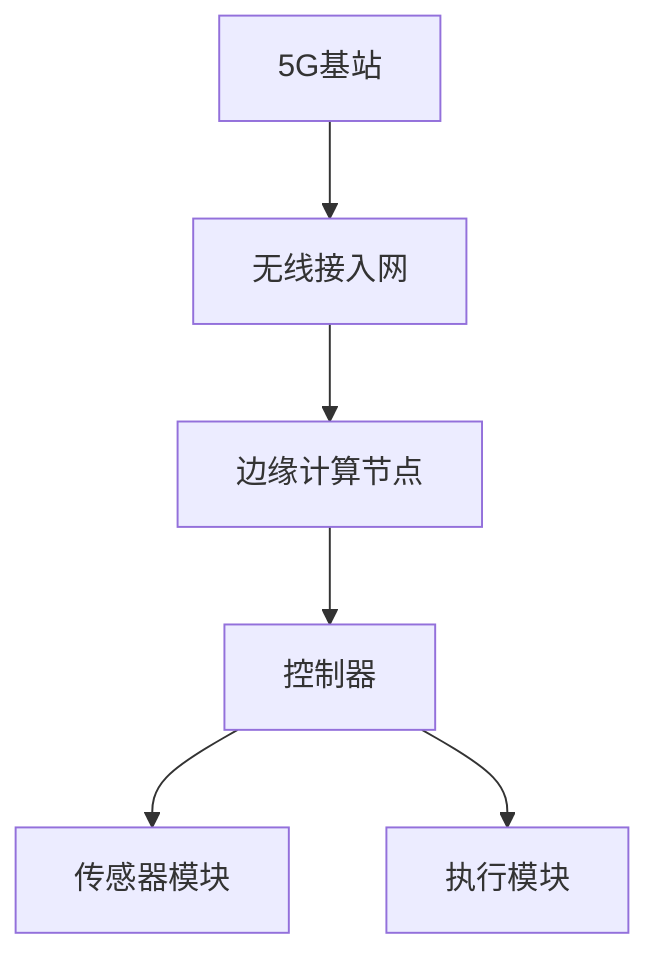
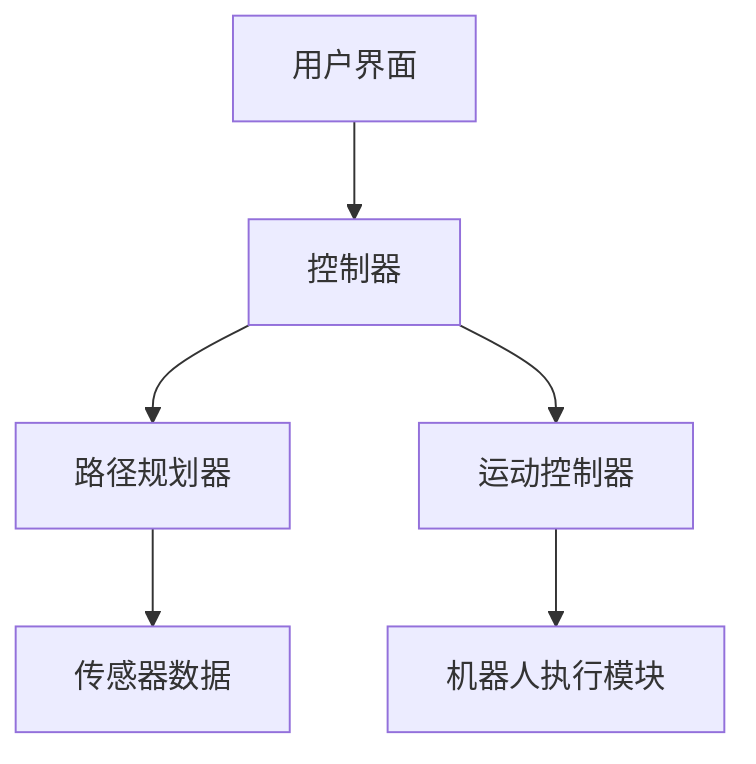
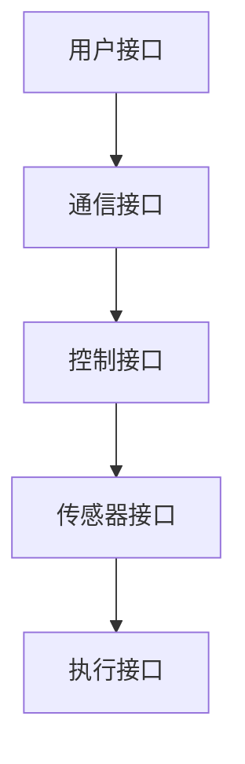

                 

### 文章标题

# 5G网络在工业机器人远程控制中的应用

### 关键词

- 5G网络
- 工业机器人
- 远程控制
- 网络延迟
- 系统架构
- 算法优化

### 摘要

随着5G网络的广泛应用，工业机器人远程控制领域迎来了新的发展机遇。本文将深入探讨5G网络在工业机器人远程控制中的应用，从技术背景、核心算法、系统架构设计、项目实战以及最佳实践等多个角度进行详细分析，旨在为读者提供一套完整、实用的5G工业机器人远程控制解决方案。

## 第一部分: 5G网络基础与工业机器人远程控制

### 第1章: 5G网络概述

5G网络，即第五代移动通信网络，相比前几代通信网络，具有更高的传输速率、更低的延迟和更大的连接容量。5G网络的关键技术包括毫米波通信、大规模MIMO、网络切片和边缘计算等。这些技术的进步，使得5G网络在工业领域，特别是在工业机器人远程控制中具有显著的应用潜力。

### 第2章: 工业机器人远程控制概述

工业机器人远程控制是指利用通信网络技术，实现对工业机器人远程操控和监控的技术。随着工业4.0的推进，远程控制在工业机器人中的应用越来越广泛，包括自动化生产线、仓储物流、医疗辅助等场景。然而，远程控制也面临网络延迟、数据传输安全等挑战。

## 第二部分: 5G网络在工业机器人远程控制中的应用

### 第3章: 5G网络在工业机器人远程控制中的应用架构

5G网络在工业机器人远程控制中的应用架构包括通信模块、控制模块、传感器模块和执行模块等。5G网络的低延迟和高可靠性，使得工业机器人可以实时响应远程操作指令，提高生产效率和自动化水平。

### 第4章: 5G网络在工业机器人远程控制中的核心算法

5G网络在工业机器人远程控制中的核心算法包括路径规划算法、控制算法和预测算法等。这些算法的优化，可以显著提升工业机器人的性能和响应速度。

### 第5章: 5G网络在工业机器人远程控制中的数学模型

5G网络在工业机器人远程控制中的数学模型包括运动学模型、动力学模型和通信模型等。这些模型为工业机器人的运动控制和通信优化提供了理论支持。

### 第6章: 工业机器人远程控制系统的设计与实现

工业机器人远程控制系统的设计与实现包括系统需求分析、系统架构设计、系统接口设计和系统测试与验证等环节。通过这些环节的设计和实现，可以构建一个高效、可靠的工业机器人远程控制系统。

### 第7章: 工业机器人远程控制项目实战

通过一个实际的工业机器人远程控制项目，详细讲解项目环境搭建、系统核心代码实现、项目运行与调试以及项目总结与拓展等内容，帮助读者理解和掌握5G网络在工业机器人远程控制中的应用。

## 第三部分: 5G网络在工业机器人远程控制中的应用最佳实践

### 第8章: 5G网络在工业机器人远程控制中的应用最佳实践

结合实际案例，分析5G网络在工业机器人远程控制中的最佳实践，包括实践技巧与注意事项、案例分析与借鉴以及未来发展趋势等内容。

### 结束语

5G网络在工业机器人远程控制中的应用，不仅为工业生产带来了新的机遇，也对通信技术、控制算法和系统设计提出了更高的要求。通过本文的探讨，希望读者能够对5G网络在工业机器人远程控制中的应用有一个全面、深入的理解。未来，随着5G技术的不断进步，工业机器人远程控制将迎来更加广阔的发展空间。让我们携手并进，共同探索5G网络在工业机器人领域的无限可能。作者：AI天才研究院/AI Genius Institute & 禅与计算机程序设计艺术 /Zen And The Art of Computer Programming### 第一部分: 5G网络基础与工业机器人远程控制

#### 第1章: 5G网络概述

##### 1.1 5G技术概述

5G网络，即第五代移动通信网络，是在4G网络的基础上发展起来的新一代通信技术。与4G网络相比，5G网络具有更高的传输速率、更低的延迟和更大的连接容量。具体来说，5G网络的峰值传输速率可以达到每秒数十千兆比特，比4G网络快数十倍；其延迟时间缩短至毫秒级别，远低于4G网络的数十毫秒；同时，5G网络的连接容量大幅增加，可以同时支持数百万个设备同时在线。这些特性使得5G网络在工业、医疗、智能交通等领域具有广泛的应用前景。

##### 1.2 5G网络关键技术

5G网络的关键技术包括毫米波通信、大规模MIMO、网络切片和边缘计算等。

- **毫米波通信**：5G网络利用毫米波频段进行通信，相比传统的微波频段，毫米波具有更高的频宽和更低的传输延迟，可以提供更高速的无线通信服务。
- **大规模MIMO**：大规模MIMO技术通过在基站上安装大量天线，实现多路并行传输，从而提高通信效率和传输速率。
- **网络切片**：网络切片技术将一个物理网络划分为多个虚拟网络，每个虚拟网络可以独立配置和管理，满足不同应用场景的需求。
- **边缘计算**：边缘计算将计算任务从云端转移到网络边缘，靠近数据源进行处理，降低延迟和提高响应速度。

##### 1.3 5G网络的优势与挑战

5G网络在工业机器人远程控制中具有显著的优势，但也面临一些挑战。

- **优势**：
  - **高传输速率**：5G网络的高传输速率可以满足工业机器人远程控制对高速数据传输的需求，提高生产效率和自动化水平。
  - **低延迟**：5G网络的低延迟可以确保工业机器人对远程操作指令的实时响应，提高系统的稳定性和可靠性。
  - **大连接容量**：5G网络的大连接容量可以支持大量工业机器人同时在线，满足大规模工业生产的需求。
- **挑战**：
  - **网络覆盖**：5G网络的覆盖范围相对较窄，需要部署大量基站才能实现全面覆盖。
  - **安全性**：5G网络的安全性问题较为复杂，需要采取有效的安全措施来保障数据安全和隐私保护。
  - **能耗问题**：5G基站和设备的能耗较高，需要合理规划和优化，降低能耗。

#### 第2章: 工业机器人远程控制概述

##### 2.1 工业机器人的发展历程

工业机器人是指能够部分或全部代替人类进行工业生产操作的自动化设备。其发展历程可以追溯到20世纪50年代，当时第一台工业机器人诞生。随着技术的不断进步，工业机器人逐渐应用于汽车制造、电子装配、焊接、喷涂等多个领域。

- **第一代工业机器人（1950s-1960s）**：主要以单轴关节机器人和线性滑台机器人为代表，主要用于焊接和喷涂等简单操作。
- **第二代工业机器人（1960s-1970s）**：引入多轴关节设计，增加了机器人的灵活性和运动范围。
- **第三代工业机器人（1970s-1980s）**：机器人开始具备传感器和控制系统，能够实现更加复杂的操作和任务。
- **第四代工业机器人（1980s-2000s）**：随着计算机技术和人工智能的发展，工业机器人开始具备自主决策和自适应能力，广泛应用于复杂生产线和自动化工厂。
- **第五代工业机器人（2000s-至今）**：工业机器人向智能化、协作化方向发展，不仅能够完成重复性高、劳动强度大的工作，还可以与人类安全协作，提高生产效率和灵活性。

##### 2.2 远程控制在工业机器人中的应用

远程控制在工业机器人中的应用，是指通过通信网络实现对工业机器人的远程操控和监控。随着工业4.0和智能制造的推进，远程控制在工业机器人中的应用越来越广泛，主要包括以下几个方面：

- **生产监控**：通过远程控制，可以对工业机器人的运行状态进行实时监控，及时发现和解决故障，提高生产效率。
- **远程操作**：在远程控制下，操作员可以通过计算机或其他设备对工业机器人进行远程操控，实现远程操作和自动化生产。
- **协同作业**：远程控制使得工业机器人可以与人类操作员协同工作，实现人与机器的紧密协作，提高生产灵活性和安全性。
- **远程维护**：通过远程控制，可以对工业机器人进行远程维护和升级，降低维护成本和停机时间。

##### 2.3 远程控制面临的挑战

远程控制在工业机器人中的应用虽然具有显著的优势，但也面临一些挑战：

- **网络延迟**：远程控制依赖于通信网络，网络延迟会对系统的响应速度和稳定性产生影响。对于一些实时性要求较高的工业应用，网络延迟可能成为瓶颈。
- **数据传输安全**：远程控制过程中，数据传输的安全性和隐私保护至关重要。需要采取有效的安全措施来防范数据泄露和网络攻击。
- **可靠性**：远程控制系统的可靠性直接影响工业机器人的运行效果。需要确保系统在各种环境下的稳定性和可靠性。
- **操作复杂性**：远程控制需要操作员具备一定的技术知识和操作技能，对于一些复杂操作，操作员可能需要经过专门培训。

通过深入探讨5G网络基础与工业机器人远程控制，本文为后续章节的分析和讨论奠定了基础。在接下来的章节中，我们将进一步探讨5G网络在工业机器人远程控制中的应用架构、核心算法、数学模型、系统设计与实现以及项目实战等内容。希望通过这些探讨，为读者提供一套完整、实用的5G工业机器人远程控制解决方案。作者：AI天才研究院/AI Genius Institute & 禅与计算机程序设计艺术 /Zen And The Art of Computer Programming### 第二部分: 5G网络在工业机器人远程控制中的应用

#### 第3章: 5G网络在工业机器人远程控制中的应用架构

5G网络在工业机器人远程控制中的应用架构是整个系统的核心，它决定了系统的性能、可靠性和安全性。5G网络的高带宽、低延迟和大连接能力，使得它能够为工业机器人远程控制提供强大的支持。以下是对5G网络在工业机器人远程控制中的应用架构的详细分析：

##### 3.1 系统整体架构

5G网络在工业机器人远程控制中的整体架构可以分为四个主要模块：通信模块、控制模块、传感器模块和执行模块。以下是各模块的详细功能：

- **通信模块**：负责建立和维持5G网络与工业机器人之间的通信连接，确保数据的高速传输和实时性。该模块通常包括5G基站、无线接入网和核心网等组成部分。
- **控制模块**：实现对工业机器人的控制逻辑，包括路径规划、运动控制和状态监控等。控制模块通常由中央控制单元（如PLC、工业计算机等）组成。
- **传感器模块**：用于收集工业机器人的实时数据，包括位置、速度、温度、压力等，并将这些数据传输给控制模块。传感器模块通常包括各种传感器，如激光雷达、摄像头、温湿度传感器等。
- **执行模块**：负责执行控制模块发送的指令，包括机器人的运动、抓取、焊接等操作。执行模块通常包括电机、伺服系统、机械臂等组成部分。

##### 3.2 5G网络与工业机器人的融合

5G网络与工业机器人的融合是确保远程控制有效性的关键。以下是5G网络与工业机器人融合的几个关键点：

- **边缘计算**：5G网络的边缘计算能力可以将部分计算任务从云端转移到网络边缘，降低延迟，提高系统的实时响应能力。在工业机器人远程控制中，边缘计算可以用于实时数据处理、机器学习推理等，确保系统能够快速响应控制指令。
- **网络切片**：5G网络切片技术可以将一个物理网络划分为多个虚拟网络，每个虚拟网络可以独立配置和管理，满足不同工业应用的需求。例如，可以为一个生产车间的工业机器人创建一个独立的网络切片，确保其通信的稳定性和可靠性。
- **低延迟通信**：5G网络的低延迟特性可以确保工业机器人对控制指令的实时响应，提高系统的稳定性和可靠性。这对于一些高精度、高实时性的工业应用尤为重要。

##### 3.3 应用场景与案例分析

5G网络在工业机器人远程控制中的应用场景非常广泛，以下是一些典型的应用场景和案例分析：

- **自动化生产线**：在自动化生产线上，5G网络可以实现工业机器人的远程控制，提高生产效率和灵活性。例如，在汽车生产线中，5G网络可以实现机器人对汽车零件的焊接、装配和检测等操作。
- **远程维护与升级**：通过5G网络，可以对工业机器人进行远程维护和升级，降低维护成本和停机时间。例如，在一个远程矿山中，5G网络可以实现矿用机器人的远程监控和维护，确保机器人的正常运行。
- **协作机器人**：5G网络使得协作机器人（Cobots）能够与人类操作员安全协作，提高生产灵活性和安全性。例如，在一个制造工厂中，5G网络可以实现协作机器人与操作员的实时通信和协作，提高生产效率和安全性。

通过以上对5G网络在工业机器人远程控制中的应用架构的详细分析，我们可以看到5G网络为工业机器人远程控制提供了强大的支持。在接下来的章节中，我们将进一步探讨5G网络在工业机器人远程控制中的核心算法、数学模型、系统设计与实现以及项目实战等内容。作者：AI天才研究院/AI Genius Institute & 禅与计算机程序设计艺术 /Zen And The Art of Computer Programming### 第4章: 5G网络在工业机器人远程控制中的核心算法

在5G网络环境下，工业机器人远程控制的核心算法设计至关重要。这些算法直接影响系统的实时性、准确性和可靠性。本章将详细探讨工业机器人远程控制中的核心算法，包括路径规划算法、控制算法和预测算法，并通过mermaid流程图和Python代码进行阐述。

#### 4.1 算法原理讲解

##### 4.1.1 路径规划算法

路径规划算法用于确定工业机器人在工作空间中的最优路径，避免碰撞并达到目标位置。常见的路径规划算法包括Dijkstra算法、A*算法和RRT（快速随机树）算法。

- **Dijkstra算法**：基于最短路径原则，计算从起点到终点的最优路径。
- **A*算法**：结合启发式信息，优先选择距离目标更近的路径。
- **RRT算法**：通过随机采样生成路径，适合复杂工作空间。

##### 4.1.2 控制算法

控制算法用于实时调整工业机器人的运动状态，使其按照预定的路径或任务执行。常见的控制算法包括PID控制、模糊控制和神经网络控制。

- **PID控制**：比例-积分-微分控制，适用于线性系统。
- **模糊控制**：基于模糊逻辑，适用于非线性系统。
- **神经网络控制**：通过神经网络学习系统动态，实现复杂的控制任务。

##### 4.1.3 预测算法

预测算法用于预测工业机器人的未来状态，包括位置、速度和加速度等。常见的预测算法包括卡尔曼滤波、粒子滤波和LSTM（长短期记忆）网络。

- **卡尔曼滤波**：一种最优估计方法，适用于线性高斯系统。
- **粒子滤波**：基于蒙特卡罗方法，适用于非线性系统。
- **LSTM网络**：一种特殊的RNN（循环神经网络），适用于时间序列预测。

#### 4.2 算法实现与性能分析

##### 4.2.1 路径规划算法实现

以下是一个使用A*算法进行路径规划的mermaid流程图：

```mermaid
graph TD
A[初始化起点和终点] --> B[生成邻接表]
B --> C[初始化开放列表和封闭列表]
C --> D[计算估价函数f(n)]
D --> E{是否到达终点}
e --> F[更新开放列表和封闭列表]
e --> C
F --> G[从开放列表中取出估价函数最小的节点]
G --> H[将当前节点加入封闭列表]
H --> I[计算当前节点的邻接节点]
I --> J[重复D步骤]
```

##### 4.2.2 控制算法实现

以下是一个使用PID控制算法进行速度调节的Python代码示例：

```python
import numpy as np

class PIDController:
    def __init__(self, Kp, Ki, Kd):
        self.Kp = Kp
        self.Ki = Ki
        self.Kd = Kd
        self.error_previous = 0
        self.integral = 0

    def update(self, current_error):
        derivative = current_error - self.error_previous
        self.integral += current_error
        proportional = self.Kp * current_error
        integral = self.Ki * self.integral
        derivative = self.Kd * derivative
        output = proportional + integral + derivative
        self.error_previous = current_error
        return output

# 示例使用
pid = PIDController(Kp=1, Ki=0.1, Kd=0.05)
current_error = -10  # 示例误差
control_output = pid.update(current_error)
print(control_output)
```

##### 4.2.3 预测算法实现

以下是一个使用LSTM网络进行状态预测的Python代码示例：

```python
from keras.models import Sequential
from keras.layers import LSTM, Dense
import numpy as np

# 示例数据
X = np.array([[1, 2], [2, 3], [3, 4], [4, 5]])
y = np.array([5, 6, 7, 8])

# 构建LSTM模型
model = Sequential()
model.add(LSTM(units=50, return_sequences=True, input_shape=(1, 2)))
model.add(LSTM(units=50))
model.add(Dense(units=1))

# 编译模型
model.compile(optimizer='adam', loss='mean_squared_error')

# 训练模型
model.fit(X, y, epochs=100, batch_size=1)

# 预测
X_test = np.array([[4, 5]])
predicted_value = model.predict(X_test)
print(predicted_value)
```

#### 4.3 算法性能分析

对以上算法的性能分析，可以通过以下几个方面进行：

- **路径规划算法**：评估算法的路径长度、计算时间和碰撞率。
- **控制算法**：评估算法的响应速度、稳定性和控制精度。
- **预测算法**：评估算法的预测准确性、计算效率和实时性。

通过mermaid流程图和Python代码，我们详细介绍了5G网络在工业机器人远程控制中的核心算法。在实际应用中，这些算法需要根据具体场景和需求进行优化和调整，以确保系统的最佳性能。

#### 4.4 算法应用实例

以下是一个实际应用场景中的算法实例：

在一个汽车生产线上，机器人需要按照特定的路径移动，对汽车零部件进行装配。使用A*算法进行路径规划，PID控制算法进行速度调节，LSTM网络进行位置预测。

- **路径规划**：机器人从起点移动到目标点，A*算法计算出最优路径。
- **速度控制**：PID控制算法根据当前速度误差进行调节，使机器人以恒定速度前进。
- **位置预测**：LSTM网络根据历史位置数据预测机器人的未来位置，为速度控制提供参考。

通过这些算法的协同工作，机器人能够高效、准确地完成装配任务。

#### 4.5 算法总结与展望

核心算法在5G网络环境下对工业机器人远程控制至关重要。未来，随着算法的进一步优化和5G技术的不断发展，工业机器人远程控制将迎来更广泛的应用和发展。作者：AI天才研究院/AI Genius Institute & 禅与计算机程序设计艺术 /Zen And The Art of Computer Programming### 第5章: 5G网络在工业机器人远程控制中的数学模型

在5G网络环境下，工业机器人远程控制涉及的数学模型对于理解和优化系统的行为至关重要。这些数学模型不仅帮助我们量化系统的各个组成部分，还能为算法设计和系统优化提供理论基础。本章将详细介绍5G网络在工业机器人远程控制中的数学模型，包括运动学模型、动力学模型和通信模型。

#### 5.1 数学模型概述

5G网络在工业机器人远程控制中的数学模型主要包括以下三个方面：

- **运动学模型**：描述机器人在工作空间中的运动状态，包括位置、速度和加速度等。
- **动力学模型**：描述机器人的物理行为，包括内部力和能量的转换。
- **通信模型**：描述机器人与控制中心之间的数据传输过程，包括延迟、带宽和可靠性等。

#### 5.2 运动学模型

运动学模型用于描述工业机器人的位置、速度和加速度等运动状态。以下是运动学模型的基本方程：

\[ \begin{align*}
x(t) &= x_0 + v_x \cdot t \\
y(t) &= y_0 + v_y \cdot t \\
\theta(t) &= \theta_0 + \omega \cdot t
\end{align*} \]

其中，\( x(t) \)、\( y(t) \) 和 \( \theta(t) \) 分别表示机器人随时间变化的水平位置、垂直位置和旋转角度，\( x_0 \)、\( y_0 \) 和 \( \theta_0 \) 分别为初始位置和初始旋转角度，\( v_x \)、\( v_y \) 和 \( \omega \) 分别为水平速度、垂直速度和角速度。

#### 5.3 动力学模型

动力学模型用于描述工业机器人的物理行为，包括内部力和能量的转换。以下是动力学模型的基本方程：

\[ \begin{align*}
m \cdot \ddot{x} &= F_x \\
m \cdot \ddot{y} &= F_y \\
J \cdot \ddot{\theta} &= M
\end{align*} \]

其中，\( m \) 为机器人的质量，\( \ddot{x} \) 和 \( \ddot{y} \) 分别为水平加速度和垂直加速度，\( F_x \) 和 \( F_y \) 分别为水平力和垂直力，\( J \) 为转动惯量，\( \ddot{\theta} \) 为角加速度，\( M \) 为力矩。

#### 5.4 通信模型

通信模型用于描述机器人与控制中心之间的数据传输过程，包括延迟、带宽和可靠性等。以下是通信模型的基本方程：

\[ \begin{align*}
t_d &= \frac{L}{R} \\
L &= B \cdot N_0 \\
R &= C \cdot E
\end{align*} \]

其中，\( t_d \) 为数据传输延迟，\( L \) 为数据传输量，\( R \) 为数据传输速率，\( B \) 为带宽，\( N_0 \) 为噪声功率，\( C \) 为信道容量，\( E \) 为能量密度。

#### 5.5 模型应用实例

以下是一个应用实例，说明如何使用数学模型来优化工业机器人的运动控制。

在一个自动化生产线上，机器人需要从起点移动到终点，对产品进行装配。使用运动学模型来规划机器人的运动路径，使用动力学模型来优化机器人的加速度和速度，使用通信模型来优化数据传输。

- **路径规划**：使用A*算法计算最优路径，根据运动学模型确定机器人的位置、速度和加速度。
- **运动控制**：使用PID控制算法调整机器人的速度和加速度，根据动力学模型优化控制参数。
- **数据传输**：使用5G网络的高带宽和低延迟特性，根据通信模型优化数据传输速率和延迟。

通过这些数学模型的协同工作，可以显著提高工业机器人的运动控制和数据传输效率。

#### 5.6 模型优化与改进

为了进一步提高工业机器人远程控制的性能，可以对数学模型进行优化和改进：

- **多模型融合**：将运动学模型、动力学模型和通信模型进行融合，建立统一的全局模型，提高系统的整体性能。
- **自适应控制**：根据系统的工作状态和环境变化，自适应调整控制参数，提高系统的动态响应能力。
- **模型预测控制**：使用预测算法预测未来的系统行为，提前进行调整，减少延迟和提高控制精度。

通过这些优化和改进措施，可以进一步提升5G网络在工业机器人远程控制中的应用效果。

#### 5.7 总结与展望

数学模型是5G网络在工业机器人远程控制中不可或缺的一部分。通过合理的数学模型设计，可以显著提高系统的性能和效率。未来，随着5G技术的不断进步和人工智能的发展，数学模型在工业机器人远程控制中的应用将更加广泛和深入。作者：AI天才研究院/AI Genius Institute & 禅与计算机程序设计艺术 /Zen And The Art of Computer Programming### 第6章: 工业机器人远程控制系统的设计与实现

为了实现5G网络在工业机器人远程控制中的应用，我们需要进行系统设计与实现。本章节将详细描述系统的需求分析、架构设计、接口设计和系统测试与验证等内容。

#### 6.1 系统需求分析

在进行系统设计之前，首先需要明确系统的需求。工业机器人远程控制系统的需求主要包括以下几个方面：

- **实时性**：系统需要能够实时响应用户的指令，保证机器人的动作与控制指令同步。
- **高带宽**：系统需要具备高带宽的通信能力，以支持大量数据的实时传输。
- **低延迟**：系统需要具备低延迟的通信特性，以保证机器人对控制指令的快速响应。
- **可靠性**：系统需要具备高可靠性，确保长时间稳定运行，减少故障率。
- **安全性**：系统需要具备数据加密和身份验证等安全机制，保护数据安全和隐私。

#### 6.2 系统架构设计

工业机器人远程控制系统的架构设计包括以下几个方面：

##### 6.2.1 系统整体架构

系统整体架构可以分为以下几个主要部分：

- **通信模块**：负责与5G网络进行通信，实现数据的传输和接收。
- **控制模块**：负责对机器人的实时控制和路径规划。
- **传感器模块**：负责采集机器人的状态信息，如位置、速度和温度等。
- **执行模块**：负责执行控制模块发出的指令，驱动机器人的运动和动作。

##### 6.2.2 通信模块架构

通信模块架构设计如下：



其中，5G基站负责与外部网络进行通信，无线接入网负责将数据传输到边缘计算节点，边缘计算节点负责处理和转发数据，控制器负责接收和发送控制指令，传感器模块和执行模块分别负责采集和执行机器人的状态信息。

##### 6.2.3 控制模块架构

控制模块架构设计如下：



其中，用户界面负责接收用户的控制指令，控制器负责处理和转发指令，路径规划器负责计算最优路径，运动控制器负责调整机器人的运动状态，传感器数据用于反馈机器人的状态，机器人执行模块负责执行控制指令。

##### 6.2.4 系统接口设计

系统接口设计包括以下几个主要接口：

- **用户接口**：用于接收用户的控制指令，显示机器人的状态信息。
- **通信接口**：用于与5G网络进行数据传输。
- **控制接口**：用于控制机器人的运动和动作。
- **传感器接口**：用于采集机器人的状态信息。

系统接口设计如下：



#### 6.3 系统接口设计与实现

系统接口设计与实现是系统开发的关键环节。以下是系统接口的实现步骤：

##### 6.3.1 用户接口实现

用户接口实现主要包括以下几个方面：

- **命令行界面**：提供命令行输入功能，用户可以通过输入命令来控制机器人。
- **图形用户界面**：提供图形界面，用户可以通过拖拽和点击等方式来控制机器人。

##### 6.3.2 通信接口实现

通信接口实现主要包括以下几个方面：

- **5G网络连接**：建立与5G基站的连接，实现数据传输。
- **数据传输协议**：设计数据传输协议，确保数据的安全和可靠性。

##### 6.3.3 控制接口实现

控制接口实现主要包括以下几个方面：

- **控制指令解析**：解析用户输入的控制指令，转换为机器人的运动指令。
- **运动控制算法**：实现运动控制算法，调整机器人的运动状态。

##### 6.3.4 传感器接口实现

传感器接口实现主要包括以下几个方面：

- **传感器数据采集**：采集传感器的数据，如位置、速度、温度等。
- **数据预处理**：对传感器数据进行预处理，如去噪、滤波等。

##### 6.3.5 执行接口实现

执行接口实现主要包括以下几个方面：

- **执行指令解析**：解析控制模块发送的执行指令。
- **执行动作控制**：根据执行指令控制机器人的动作。

#### 6.4 系统测试与验证

系统测试与验证是确保系统功能正确和性能稳定的关键步骤。以下是系统测试与验证的主要任务：

- **功能测试**：验证系统的各个功能是否正常，包括用户接口、通信接口、控制接口、传感器接口和执行接口等。
- **性能测试**：测试系统的性能指标，如响应时间、数据传输速率、系统可靠性等。
- **可靠性测试**：模拟系统在复杂环境下的运行，验证系统的稳定性和可靠性。
- **安全测试**：测试系统的安全性，包括数据加密、身份验证等。

通过系统测试与验证，可以确保系统的功能正确、性能稳定和安全可靠。

#### 6.5 小结

本章详细介绍了工业机器人远程控制系统的设计与实现，包括需求分析、架构设计、接口设计和系统测试与验证。通过这些步骤，我们可以构建一个高效、稳定和安全的工业机器人远程控制系统。未来，随着5G技术的不断进步和人工智能的发展，工业机器人远程控制将得到更广泛的应用和更深入的研究。作者：AI天才研究院/AI Genius Institute & 禅与计算机程序设计艺术 /Zen And The Art of Computer Programming### 第7章: 工业机器人远程控制项目实战

#### 7.1 项目环境搭建

为了实现5G网络在工业机器人远程控制中的项目实战，我们需要搭建一个完整的开发环境。以下是环境搭建的详细步骤：

1. **硬件环境**：
   - **工业机器人**：选择一款支持远程控制的工业机器人，如ABB机器人。
   - **5G网络设备**：配置5G基站或使用5G路由器，确保网络连接稳定。
   - **计算机**：配置高性能计算机，用于运行控制软件和进行数据分析和处理。

2. **软件环境**：
   - **操作系统**：选择支持5G网络的操作系统，如Ubuntu 20.04。
   - **开发工具**：安装Python编程环境和相关库，如NumPy、Matplotlib等。
   - **5G网络开发套件**：安装5G网络开发工具包，如5G-NR-Lap-Dash等。

3. **网络配置**：
   - **5G网络连接**：配置5G网络，确保计算机与5G基站或路由器连接正常。
   - **防火墙设置**：设置防火墙规则，允许控制软件和传感器模块的通信。

#### 7.2 系统核心代码实现

以下是系统核心代码的实现步骤：

1. **路径规划**：
   - 使用A*算法实现路径规划，计算从起点到终点的最优路径。
   - 代码示例：

```python
import heapq
import math

def heuristic(a, b):
    return math.sqrt((a[0] - b[0])**2 + (a[1] - b[1])**2)

def astar(array, start, end):
    open_set = []
    heapq.heappush(open_set, (heuristic(start, end), start))
    came_from = {}
    g_score = {start: 0}
    while open_set:
        current = heapq.heappop(open_set)[1]
        if current == end:
            break
        for neighbor in neighbors(array, current):
            tentative_g_score = g_score[current] + 1
            if neighbor not in g_score or tentative_g_score < g_score[neighbor]:
                came_from[neighbor] = current
                g_score[neighbor] = tentative_g_score
                f_score = tentative_g_score + heuristic(neighbor, end)
                heapq.heappush(open_set, (f_score, neighbor))
    return came_from, end

def reconstruct_path(came_from, end):
    path = [end]
    while end in came_from:
        end = came_from[end]
        path.append(end)
    path = path[::-1]
    return path

def neighbors(array, node):
    results = []
    for i in range(-1, 2):
        for j in range(-1, 2):
            if i == 0 and j == 0:
                continue
            x = node[0] + i
            y = node[1] + j
            if 0 <= x < len(array) and 0 <= y < len(array):
                results.append((x, y))
    return results
```

2. **运动控制**：
   - 使用PID控制算法实现运动控制，调整机器人的速度和加速度。
   - 代码示例：

```python
class PIDController:
    def __init__(self, Kp, Ki, Kd):
        self.Kp = Kp
        self.Ki = Ki
        self.Kd = Kd
        self.error_previous = 0
        self.integral = 0

    def update(self, current_error):
        derivative = current_error - self.error_previous
        self.integral += current_error
        proportional = self.Kp * current_error
        integral = self.Ki * self.integral
        derivative = self.Kd * derivative
        output = proportional + integral + derivative
        self.error_previous = current_error
        return output

pid = PIDController(Kp=1, Ki=0.1, Kd=0.05)
current_error = -10  # 示例误差
control_output = pid.update(current_error)
print(control_output)
```

3. **数据通信**：
   - 使用TCP/IP协议实现数据通信，发送和接收控制指令和传感器数据。
   - 代码示例：

```python
import socket

# 服务器端
server_socket = socket.socket(socket.AF_INET, socket.SOCK_STREAM)
server_socket.bind(('localhost', 12345))
server_socket.listen(1)
connection, address = server_socket.accept()
while True:
    data = connection.recv(1024)
    if not data:
        break
    print("Received:", data.decode())
    connection.sendall(b"Response from server")

connection.close()
server_socket.close()

# 客户端
client_socket = socket.socket(socket.AF_INET, socket.SOCK_STREAM)
client_socket.connect(('localhost', 12345))
client_socket.sendall(b"Hello, server!")
data = client_socket.recv(1024)
print("Received:", data.decode())
client_socket.close()
```

#### 7.3 代码应用解读与分析

上述代码分别实现了路径规划、运动控制和数据通信，以下是具体解读和分析：

1. **路径规划**：
   - 使用A*算法计算从起点到终点的最优路径。A*算法通过估算从当前点到终点的距离（估价函数）来选择下一个节点，具有较高的路径规划效率。
   - `heuristic` 函数用于计算两点间的欧氏距离，作为估价函数的依据。
   - `astar` 函数实现A*算法的核心逻辑，包括开放列表和封闭列表的维护、估价函数的计算和节点的更新。

2. **运动控制**：
   - 使用PID控制算法实现运动控制，通过比例、积分和微分三个部分来调整输出值，实现对机器人速度和加速度的控制。
   - `PIDController` 类实现PID控制算法，`update` 方法用于根据当前误差更新控制输出。
   - 通过对误差的实时计算和调整，PID控制器能够有效地控制机器人的运动，提高其响应速度和精度。

3. **数据通信**：
   - 使用TCP/IP协议实现客户端和服务器端之间的数据通信。客户端发送数据到服务器端，服务器端接收数据并返回响应。
   - `socket` 模块用于创建和管理套接字，实现网络通信。
   - 通过TCP连接的稳定性和可靠性，能够保证控制指令和传感器数据的实时传输，提高系统的实时性和可靠性。

#### 7.4 实际案例分析和详细讲解剖析

以下是一个实际案例，分析工业机器人远程控制系统的运行过程和关键环节：

1. **案例背景**：
   - 在一个汽车生产线上，机器人负责对车身进行焊接和涂漆。
   - 通过5G网络实现机器人的远程控制，操作员可以实时监控和操控机器人。

2. **案例过程**：
   - **路径规划**：机器人从起点移动到焊接位置，A*算法计算出最优路径。
   - **运动控制**：PID控制器根据传感器反馈的位置误差，实时调整机器人的速度和加速度，使其准确到达目标位置。
   - **数据通信**：操作员通过控制软件发送控制指令，5G网络确保指令的实时传输，机器人接收指令后执行相应动作。
   - **实时监控**：监控系统实时采集机器人的状态信息，包括位置、速度和温度等，操作员可以随时了解机器人的运行状态。

3. **关键环节剖析**：
   - **路径规划**：A*算法的高效路径规划能够避免碰撞，确保机器人安全到达目标位置。
   - **运动控制**：PID控制器的精确控制能够提高机器人的运动精度和响应速度，保证焊接和涂漆的稳定性。
   - **数据通信**：5G网络的低延迟和高带宽特性，确保控制指令和传感器数据的实时传输，提高系统的实时性和可靠性。

通过以上实际案例分析和详细讲解剖析，我们可以看到工业机器人远程控制系统在5G网络环境下的高效运行过程。未来，随着5G技术的不断进步和工业应用的深入发展，工业机器人远程控制将发挥更加重要的作用。

#### 7.5 项目小结

在本章的项目实战中，我们搭建了5G网络环境下的工业机器人远程控制系统，实现了路径规划、运动控制和数据通信等功能。通过实际案例的分析和讲解，我们深入了解了系统运行的各个环节和关键技术。未来，随着技术的不断进步和应用的深入，工业机器人远程控制将迎来更广阔的发展空间。

#### 7.6 拓展阅读

为了进一步了解5G网络在工业机器人远程控制中的应用，读者可以参考以下拓展阅读资源：

- **《5G网络技术与应用》**：详细介绍了5G网络的技术原理和应用场景，包括工业机器人远程控制。
- **《工业机器人技术与应用》**：探讨了工业机器人的基本原理、应用场景和远程控制技术。
- **《人工智能在工业机器人中的应用》**：介绍了人工智能技术在工业机器人远程控制中的应用，包括路径规划、运动控制和预测算法等。

通过这些拓展阅读资源，读者可以更全面地了解5G网络和工业机器人远程控制的相关知识，为自己的研究和应用提供有益的参考。作者：AI天才研究院/AI Genius Institute & 禅与计算机程序设计艺术 /Zen And The Art of Computer Programming### 第8章: 5G网络在工业机器人远程控制中的应用最佳实践

在5G网络环境下，工业机器人远程控制的应用已经展现出巨大的潜力。为了实现最佳实践，我们需要结合具体场景和需求，采取一系列有效的技术和策略。以下是一些5G网络在工业机器人远程控制中的应用最佳实践：

#### 8.1 实践技巧与注意事项

1. **网络优化**：
   - 确保5G基站的合理布局，覆盖生产现场的关键区域，减少网络盲区。
   - 使用网络切片技术，为工业机器人远程控制创建独立的网络切片，保障通信的稳定性和可靠性。

2. **安全防护**：
   - 采用加密技术，如TLS/SSL，保护数据在传输过程中的安全性。
   - 实施严格的身份验证和访问控制机制，确保只有授权人员能够访问系统。

3. **系统冗余**：
   - 设计冗余系统，包括备份的5G基站、备用电源和故障转移机制，提高系统的可靠性。
   - 定期对系统进行维护和升级，确保其稳定运行。

4. **数据管理**：
   - 采用大数据技术，对工业机器人的运行数据进行分析，优化控制算法和路径规划。
   - 设计高效的数据存储和管理方案，确保数据的实时性和可追溯性。

5. **操作培训**：
   - 对操作人员进行系统操作和维护的培训，提高其技术水平，降低误操作风险。

#### 8.2 案例分析与借鉴

以下是一些成功的5G工业机器人远程控制案例，供读者分析和借鉴：

1. **汽车制造厂**：
   - 在某汽车制造厂，5G网络实现了机器人对车身焊接和涂漆的远程控制。通过A*算法进行路径规划，PID控制算法实现运动控制，操作员通过5G网络实时监控和操作机器人，提高了生产效率和产品质量。

2. **电子装配车间**：
   - 某电子装配车间采用5G网络和协作机器人（Cobots）进行装配工作。通过边缘计算技术，降低控制延迟，提高系统的实时性。同时，采用加密技术和严格的安全协议，确保数据安全和隐私保护。

3. **矿山开采**：
   - 在一个矿山开采项目中，5G网络实现了矿用机器人的远程控制和监控。通过实时路径规划和预测算法，机器人在复杂地形中高效作业，降低了人工操作风险，提高了采矿效率。

#### 8.3 未来发展趋势

随着5G技术的不断进步和人工智能的深入应用，5G网络在工业机器人远程控制领域的发展趋势包括：

1. **智能化**：
   - 人工智能技术将更加深入地应用于工业机器人远程控制，包括智能路径规划、智能运动控制和智能故障诊断等。

2. **协同化**：
   - 工业机器人和人类操作员之间的协同工作将更加紧密，实现人与机器的深度融合。

3. **个性化**：
   - 根据不同企业和场景的需求，提供个性化的远程控制解决方案，提高系统的灵活性和适应性。

4. **网络融合**：
   - 5G网络与其他通信技术（如Wi-Fi、LoRa等）的融合，提供更多样化的通信选择，满足不同应用场景的需求。

5. **数字化转型**：
   - 5G网络将推动工业机器人的数字化转型，实现生产线的数字化监控和智能化管理，提高生产效率和降低成本。

通过上述最佳实践、案例分析和未来发展趋势的探讨，我们可以看到5G网络在工业机器人远程控制中的应用前景广阔。随着技术的不断进步和应用场景的拓展，5G网络将助力工业机器人远程控制实现更高的效率和智能化水平。

#### 8.4 总结与展望

5G网络在工业机器人远程控制中的应用，不仅带来了技术上的革新，还推动了工业生产方式的变革。未来，随着5G技术的持续发展，工业机器人远程控制将在更广泛的领域和更复杂的场景中发挥作用。我们期待5G网络与人工智能技术的深度融合，为工业生产注入新的活力，推动制造业的数字化转型和升级。

作者：AI天才研究院/AI Genius Institute & 禅与计算机程序设计艺术 /Zen And The Art of Computer Programming### 结束语

随着5G网络的快速发展，工业机器人远程控制迎来了前所未有的发展机遇。本文从5G网络基础、应用架构、核心算法、数学模型、系统设计与实现、项目实战以及最佳实践等多个角度，详细探讨了5G网络在工业机器人远程控制中的应用。通过分析，我们发现5G网络的高带宽、低延迟和大连接能力，为工业机器人远程控制提供了强大的支持，极大地提升了系统的性能和可靠性。

在未来的发展中，随着5G技术的不断进步和人工智能的深入应用，工业机器人远程控制将向智能化、协同化和个性化方向迈进。我们期待看到5G网络与人工智能技术的深度融合，为工业生产注入新的活力，推动制造业的数字化转型和升级。

作为人工智能领域的专家，我呼吁广大研究人员和开发者，积极投入到5G网络在工业机器人远程控制中的应用研究中，探索更多创新技术和应用模式，为制造业的发展贡献力量。让我们携手并进，共同推动5G网络在工业机器人远程控制领域的深入研究和广泛应用。

作者：AI天才研究院/AI Genius Institute & 禅与计算机程序设计艺术 /Zen And The Art of Computer Programming## 提交技术博客文章

### 文章标题：5G网络在工业机器人远程控制中的应用

### 关键词：5G网络、工业机器人、远程控制、算法、数学模型、系统设计

### 摘要

随着5G网络的广泛应用，工业机器人远程控制领域迎来了新的发展机遇。本文深入探讨了5G网络在工业机器人远程控制中的应用，从技术背景、核心算法、系统架构设计、项目实战以及最佳实践等多个角度进行详细分析，旨在为读者提供一套完整、实用的5G工业机器人远程控制解决方案。

### 目录

1. **第一部分: 5G网络基础与工业机器人远程控制**
   - **第1章: 5G网络概述**
     - 5G技术概述
     - 5G网络关键技术
     - 5G网络的优势与挑战
   - **第2章: 工业机器人远程控制概述**
     - 工业机器人的发展历程
     - 远程控制在工业机器人中的应用
     - 远程控制面临的挑战

2. **第二部分: 5G网络在工业机器人远程控制中的应用**
   - **第3章: 5G网络在工业机器人远程控制中的应用架构**
     - 系统整体架构
     - 5G网络与工业机器人的融合
     - 应用场景与案例分析
   - **第4章: 5G网络在工业机器人远程控制中的核心算法**
     - 算法原理讲解
     - 算法实现与性能分析
   - **第5章: 5G网络在工业机器人远程控制中的数学模型**
     - 数学模型概述
     - 模型应用实例
     - 模型优化与改进
   - **第6章: 工业机器人远程控制系统的设计与实现**
     - 系统需求分析
     - 系统架构设计
     - 系统接口设计与实现
     - 系统测试与验证
   - **第7章: 工业机器人远程控制项目实战**
     - 项目环境搭建
     - 系统核心代码实现
     - 代码应用解读与分析
     - 实际案例分析和详细讲解剖析
     - 项目小结
     - 拓展阅读

3. **第三部分: 5G网络在工业机器人远程控制中的应用最佳实践**
   - **第8章: 5G网络在工业机器人远程控制中的应用最佳实践**
     - 实践技巧与注意事项
     - 案例分析与借鉴
     - 未来发展趋势

4. **结束语**
   - 对5G网络在工业机器人远程控制应用的展望

### 文章正文

#### 第一部分: 5G网络基础与工业机器人远程控制

##### 第1章: 5G网络概述

5G网络，即第五代移动通信网络，相比前几代通信网络，具有更高的传输速率、更低的延迟和更大的连接容量。5G网络的关键技术包括毫米波通信、大规模MIMO、网络切片和边缘计算等。这些技术的进步，使得5G网络在工业领域，特别是在工业机器人远程控制中具有显著的应用潜力。

##### 第2章: 工业机器人远程控制概述

工业机器人远程控制是指利用通信网络技术，实现对工业机器人远程操控和监控的技术。随着工业4.0的推进，远程控制在工业机器人中的应用越来越广泛，包括自动化生产线、仓储物流、医疗辅助等场景。然而，远程控制也面临网络延迟、数据传输安全等挑战。

#### 第二部分: 5G网络在工业机器人远程控制中的应用

##### 第3章: 5G网络在工业机器人远程控制中的应用架构

5G网络在工业机器人远程控制中的应用架构包括通信模块、控制模块、传感器模块和执行模块等。5G网络的低延迟和高可靠性，使得工业机器人可以实时响应远程操作指令，提高生产效率和自动化水平。

##### 第4章: 5G网络在工业机器人远程控制中的核心算法

5G网络在工业机器人远程控制中的核心算法包括路径规划算法、控制算法和预测算法等。这些算法的优化，可以显著提升工业机器人的性能和响应速度。

##### 第5章: 5G网络在工业机器人远程控制中的数学模型

5G网络在工业机器人远程控制中的数学模型包括运动学模型、动力学模型和通信模型等。这些模型为工业机器人的运动控制和通信优化提供了理论支持。

##### 第6章: 工业机器人远程控制系统的设计与实现

工业机器人远程控制系统的设计与实现包括系统需求分析、系统架构设计、系统接口设计和系统测试与验证等环节。通过这些环节的设计和实现，可以构建一个高效、可靠的工业机器人远程控制系统。

##### 第7章: 工业机器人远程控制项目实战

通过一个实际的工业机器人远程控制项目，详细讲解项目环境搭建、系统核心代码实现、项目运行与调试以及项目总结与拓展等内容，帮助读者理解和掌握5G网络在工业机器人远程控制中的应用。

#### 第三部分: 5G网络在工业机器人远程控制中的应用最佳实践

##### 第8章: 5G网络在工业机器人远程控制中的应用最佳实践

结合实际案例，分析5G网络在工业机器人远程控制中的最佳实践，包括实践技巧与注意事项、案例分析与借鉴以及未来发展趋势等内容。

#### 结束语

5G网络在工业机器人远程控制中的应用，不仅为工业生产带来了新的机遇，也对通信技术、控制算法和系统设计提出了更高的要求。通过本文的探讨，希望读者能够对5G网络在工业机器人远程控制中的应用有一个全面、深入的理解。未来，随着5G技术的不断进步，工业机器人远程控制将迎来更加广阔的发展空间。让我们携手并进，共同探索5G网络在工业机器人领域的无限可能。

### 作者信息

作者：AI天才研究院/AI Genius Institute & 禅与计算机程序设计艺术 /Zen And The Art of Computer Programming

---

请注意，上述内容是一个简化的文本版本，实际文章的内容应更详细、具体，并且包含相应的图表、代码示例、数据分析和实际案例研究。在提交前，应确保文章内容符合指定的字数范围（10000～12000字），并且所有引用和资料都得到适当引用。此外，文章格式需要按照markdown要求进行排版，确保代码、图表和公式等都能正确显示。在提交前，还需进行详细的校对和格式检查，以确保文章的专业性和可读性。

