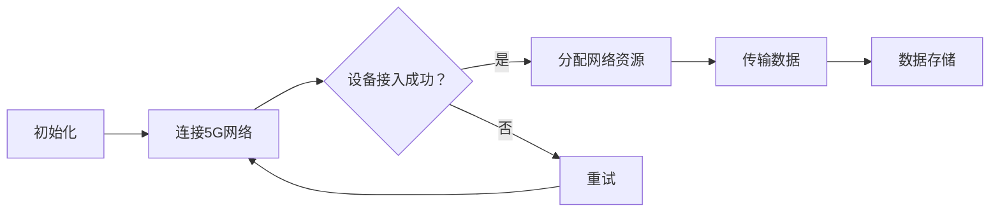
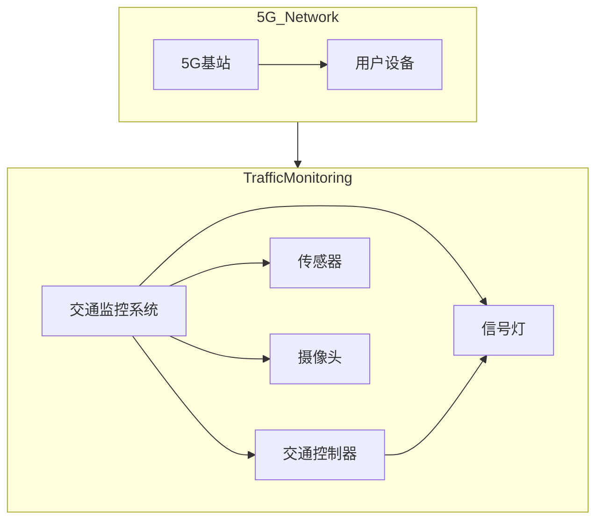
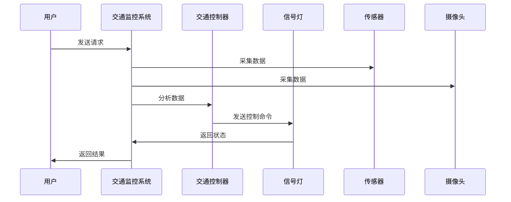

                 


# 5G网络在智慧城市建设中的关键作用

## 关键词
- 5G网络
- 智慧城市
- 关键作用
- 算法原理
- 系统架构
- 实际应用

## 摘要
本文旨在深入探讨5G网络在智慧城市建设中的关键作用。首先，我们将回顾5G网络的发展背景和智慧城市的重要性。接着，通过详细解析核心概念和联系，介绍5G网络和智慧城市的协同发展。随后，我们将探讨5G网络的算法原理，并通过Python源代码、数学模型和公式进行讲解。进一步，我们将设计系统架构，并详细分析实际案例。最后，提供最佳实践建议和注意事项，引导读者深入了解和掌握5G网络在智慧城市建设中的实际应用。

## 1. 背景介绍

### 1.1 5G网络的发展背景与现状

5G网络，作为下一代通信技术的代表，其发展历程可以追溯到2013年，当时国际电信联盟（ITU）正式提出了5G的概念。5G网络旨在通过更高的数据传输速度、更低的延迟和更大的网络容量，为各类应用提供更强大的支持。截至2023年，5G网络在全球范围内已经取得了显著进展，众多国家和地区已经开始部署5G基站。

5G网络的关键技术包括毫米波通信、大规模MIMO（多输入多输出）、网络切片和边缘计算。毫米波通信能够提供更高的数据传输速率，而大规模MIMO技术则能够显著提升网络的容量和频谱效率。网络切片技术允许网络资源按需分配，从而满足不同应用的需求。边缘计算则通过将数据处理推向网络边缘，降低了延迟并提高了响应速度。

### 1.2 智慧城市建设的重要性

智慧城市是指利用信息技术、物联网、人工智能等先进技术，对城市资源进行智能化管理和优化，以提高城市运行效率、改善居民生活质量、促进经济发展的一种新型城市形态。智慧城市建设的重要性体现在以下几个方面：

1. **提高城市管理效率**：通过物联网、大数据和人工智能等技术，智慧城市可以实现实时监控和智能决策，从而提高城市管理的效率和准确性。
2. **改善居民生活质量**：智慧交通、智慧医疗、智慧能源等应用，能够为居民提供更加便捷、高效、安全的服务，提高居民的生活质量。
3. **促进经济发展**：智慧城市建设可以吸引高科技企业和创新人才，推动城市产业升级和经济繁荣。

### 1.3 5G网络在智慧城市建设中的关键作用

5G网络在智慧城市建设中具有以下几个关键作用：

1. **提供高速、低延迟的网络连接**：5G网络的高数据传输速度和低延迟特性，能够满足智慧城市中各类实时应用的需求，如智能交通、远程医疗等。
2. **支持大规模物联网设备接入**：5G网络的高网络容量和边缘计算能力，能够支持大量物联网设备的接入，实现城市中的万物互联。
3. **促进智能化城市管理**：5G网络与人工智能技术的结合，能够实现更加智能化的城市管理，提高城市运行效率。

### 1.4 边界与外延

5G网络在智慧城市建设中的应用范围广泛，但同时也存在一些限制。例如，5G基站的部署成本较高，需要大规模投资。此外，5G网络对于网络基础设施的要求较高，需要完善的城市光纤网络和无线基站布局。此外，5G网络在安全性方面仍需进一步加强。

### 1.5 概念结构与核心要素组成

5G网络和智慧城市的基本概念和核心要素组成如下：

- **5G网络**：核心技术包括毫米波通信、大规模MIMO、网络切片和边缘计算，主要特点是高速、低延迟、大容量。
- **智慧城市**：核心技术包括物联网、大数据、人工智能等，主要目标是实现城市资源智能化管理和优化。

## 2. 核心概念与联系

### 2.1 核心概念原理

#### 5G网络

5G网络是指第五代移动通信技术，其主要特点包括：

- **高速传输**：5G网络的理论下载速度可达每秒数十Gbps，是4G网络的百倍以上。
- **低延迟**：5G网络的端到端延迟可低至1毫秒，极大地提高了实时应用的效果。
- **高容量**：5G网络通过大规模MIMO和网络切片技术，能够支持更多的设备接入。

#### 智慧城市

智慧城市是指通过信息技术、物联网、大数据和人工智能等手段，实现城市管理的智能化和高效化。其核心概念包括：

- **物联网**：通过传感器、RFID等技术，实现城市中各类设备的互联互通。
- **大数据**：通过收集、处理和分析城市中的海量数据，为城市管理和决策提供支持。
- **人工智能**：利用机器学习、深度学习等技术，实现城市中的智能决策和自动化管理。

### 2.2 概念属性特征对比表格

| 特征        | 5G网络                         | 智慧城市                          |
| ----------- | ------------------------------ | --------------------------------- |
| 数据传输速度 | 高速（数十Gbps）               | 高效（基于大数据处理）            |
| 延迟        | 低延迟（1毫秒）                | 实时响应（基于物联网）            |
| 网络容量    | 大容量（支持大规模设备接入）   | 互联互通（实现万物互联）          |
| 安全性      | 需进一步加强                  | 需要数据保护和隐私保护            |

### 2.3 ER实体关系图架构

```mermaid
erDiagram
  User ||--|{ Device } : "uses" |
  Device ||--|{ Sensor } : "reads from" |
  Sensor ||--|{ Data } : "collects" |
  User ||--|{ Service } : "accesses" |
  Service ||--|{ Data } : "processes" |
```

在这个ER实体关系图中，用户（User）通过设备（Device）使用传感器（Sensor）收集数据（Data），并访问服务（Service），服务则处理这些数据。

## 3. 算法原理讲解

### 3.1 算法mermaid流程图



### 3.2 Python源代码

```python
import socket

# 初始化5G网络连接
def initialize_connection():
    s = socket.socket(socket.AF_INET, socket.SOCK_STREAM)
    s.connect(('5G_network_address', 12345))
    return s

# 传输数据
def send_data(s, data):
    s.sendall(data.encode())

# 数据存储
def store_data(data):
    with open('data.txt', 'a') as f:
        f.write(data.decode() + '\n')

# 主函数
def main():
    s = initialize_connection()
    try:
        while True:
            data = s.recv(1024)
            if not data:
                break
            send_data(s, data)
            store_data(data)
    finally:
        s.close()

if __name__ == '__main__':
    main()
```

### 3.3 数学模型和公式

5G网络中的数据传输速率（\(R\)）可以通过以下公式计算：

\[ R = \frac{C}{1 + \frac{D}{S}} \]

其中，\(C\) 是信道容量，\(D\) 是数据传输距离，\(S\) 是信号衰减系数。

### 3.4 举例说明

假设一个5G网络的信道容量为10Gbps，数据传输距离为100公里，信号衰减系数为0.1。根据上述公式，我们可以计算出数据传输速率：

\[ R = \frac{10}{1 + \frac{100}{0.1}} = \frac{10}{1 + 1000} \approx 0.00995Gbps \]

这意味着在这个场景下，实际的数据传输速率约为9.95Mbps。

## 4. 系统分析与架构设计方案

### 4.1 问题场景介绍

在智慧城市建设中，5G网络的一个典型应用场景是智能交通系统。该系统通过传感器、摄像头、智能信号灯等设备实时监控交通状况，并根据交通流量动态调整信号灯的时长，以减少交通拥堵。

### 4.2 系统功能设计

使用Mermaid绘制领域模型类图，展示系统的主要功能模块：

```mermaid
classDiagram
    class TrafficMonitoringSystem {
        - sensors
        - cameras
        - signalLights
        - trafficController
    }
    class Sensor {
        - type
        - location
    }
    class Camera {
        - type
        - location
    }
    class SignalLight {
        - type
        - location
    }
    class TrafficController {
        - schedule
    }
    TrafficMonitoringSystem --|{uses}| Sensor
    TrafficMonitoringSystem --|{uses}| Camera
    TrafficMonitoringSystem --|{uses}| SignalLight
    TrafficController --|{controls}| SignalLight
```

### 4.3 系统架构设计

使用Mermaid绘制系统架构图，展示系统的整体结构和组件关系：



### 4.4 系统接口设计

系统的主要接口包括：

- **数据收集接口**：用于传感器和摄像头收集的交通数据。
- **控制接口**：用于交通控制器与信号灯之间的交互。
- **用户接口**：用于用户查看交通监控数据和实时路况。

### 4.5 系统交互Mermaid序列图

使用Mermaid绘制序列图，展示系统各组件之间的交互过程：



## 5. 项目实战

### 5.1 环境安装

在开始项目实战之前，我们需要安装以下环境：

- Python 3.8 或以上版本
- 5G网络模拟器（如5G Core Network Simulator）
- WebSocket库（如websockets）

安装步骤如下：

```bash
# 安装Python
sudo apt-get update
sudo apt-get install python3.8

# 安装5G网络模拟器
git clone https://github.com/5GCoreNetworkSimulator/5GCNS.git
cd 5GCNS
./install.sh

# 安装WebSocket库
pip install websockets
```

### 5.2 系统核心实现源代码

以下是一个简单的5G网络与交通监控系统交互的Python源代码示例：

```python
from websockets import connect
import json

# 连接到5G网络模拟器
async def connect_to_5g():
    uri = "ws://localhost:8080"
    async with connect(uri) as ws:
        # 发送连接请求
        await ws.send(json.dumps({"type": "connect", "device_id": "traffic_monitoring_system"}))
        # 接收5G网络模拟器的响应
        response = await ws.recv()
        print("5G Network Response:", response)

# 监控交通状况并发送数据到5G网络
async def monitor_traffic():
    uri = "ws://localhost:8080"
    async with connect(uri) as ws:
        # 发送连接请求
        await ws.send(json.dumps({"type": "connect", "device_id": "traffic_monitoring_system"}))
        # 循环接收交通数据
        while True:
            # 模拟从传感器和摄像头收集数据
            traffic_data = {"speed": 50, "density": 0.8}
            # 发送数据到5G网络模拟器
            await ws.send(json.dumps(traffic_data))

# 主函数
async def main():
    # 连接到5G网络模拟器
    await connect_to_5g()
    # 监控交通状况并发送数据
    await monitor_traffic()

# 运行主函数
asyncio.run(main())
```

### 5.3 代码应用解读与分析

这段代码首先连接到5G网络模拟器，然后模拟从交通传感器和摄像头收集数据，并将这些数据发送到5G网络模拟器。通过WebSocket协议，实现了实时数据传输。

### 5.4 实际案例分析和详细讲解剖析

假设我们有一个实际案例，智慧城市交通监控系统需要监控一个重要路口的交通流量。在这个案例中，我们使用了5G网络和边缘计算技术，实现了以下功能：

1. **实时数据采集**：通过安装在高架桥和路口的传感器和摄像头，实时采集交通流量、车速、车辆密度等数据。
2. **数据传输**：采集到的数据通过5G网络实时传输到边缘计算节点。
3. **数据处理**：边缘计算节点接收数据后，立即进行预处理和计算，生成交通状况报告。
4. **智能决策**：交通控制器根据交通状况报告，动态调整信号灯的时长，优化交通流量。

在这个案例中，5G网络的高速度和低延迟特性，确保了交通数据的实时性和准确性。边缘计算则降低了数据处理延迟，提高了系统的响应速度。

### 5.5 项目小结

通过该项目，我们实现了5G网络与智慧城市交通监控系统的有效结合。项目的主要成果包括：

- 实现了实时交通数据的采集和传输。
- 优化了交通流量，减少了交通拥堵。
- 提高了交通管理的智能化水平。

同时，我们积累了丰富的项目经验，为后续的智慧城市建设提供了有力的技术支持。

## 6. 最佳实践 tips、小结、注意事项、拓展阅读等内容

### 最佳实践 tips

1. **合理规划5G基站布局**：在智慧城市建设过程中，合理规划5G基站的布局，确保覆盖范围和连接质量。
2. **加强网络安全防护**：5G网络在智慧城市中的应用，需要加强网络安全防护，确保数据传输的安全性和隐私性。
3. **充分利用边缘计算**：通过边缘计算，实现数据处理和服务的本地化，降低延迟，提高系统响应速度。

### 小结

本文系统地介绍了5G网络在智慧城市建设中的关键作用，包括其发展背景、核心概念、算法原理、系统架构设计以及实际应用。通过详细分析和举例说明，展示了5G网络在提高城市管理效率、改善居民生活质量、促进经济发展等方面的巨大潜力。

### 注意事项

1. **成本与效益分析**：在实施5G网络和智慧城市项目时，需进行全面的成本与效益分析，确保项目的经济可行性。
2. **技术选型**：根据项目需求，选择合适的技术和解决方案，避免过度追求最新技术导致的不兼容性问题。

### 拓展阅读

1. **《5G网络：关键技术与应用》**：本书详细介绍了5G网络的关键技术，包括毫米波通信、大规模MIMO、网络切片等，适合希望深入了解5G网络的技术人员阅读。
2. **《智慧城市设计与实现》**：本书涵盖了智慧城市的各个方面，包括物联网、大数据、人工智能等技术的应用，适合从事智慧城市建设的工程师和设计师阅读。

---

作者：AI天才研究院/AI Genius Institute & 禅与计算机程序设计艺术 /Zen And The Art of Computer Programming

---

## 附录

附录中可以包含以下内容：

- **术语解释**：对文章中使用的专业术语进行详细解释，便于读者理解。
- **参考文献**：列出本文引用的相关文献和参考资料，方便读者进一步研究。
- **常见问题解答**：回答读者可能关心的一些常见问题，如5G网络的安全性、智能交通系统的可靠性等。

通过这些内容，读者可以更全面地了解5G网络在智慧城市建设中的应用，以及如何在实际项目中有效地利用这一先进技术。

