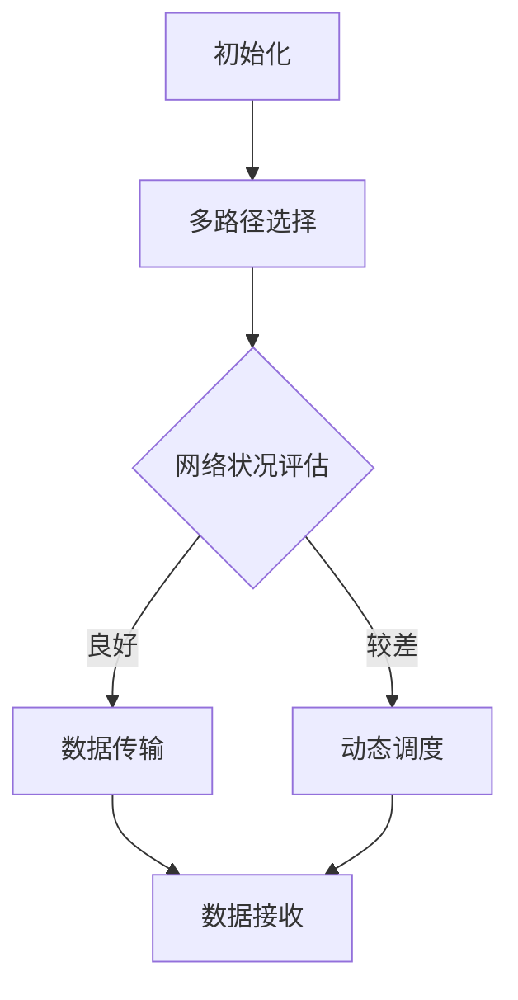
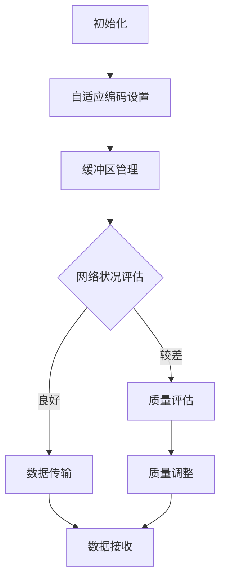
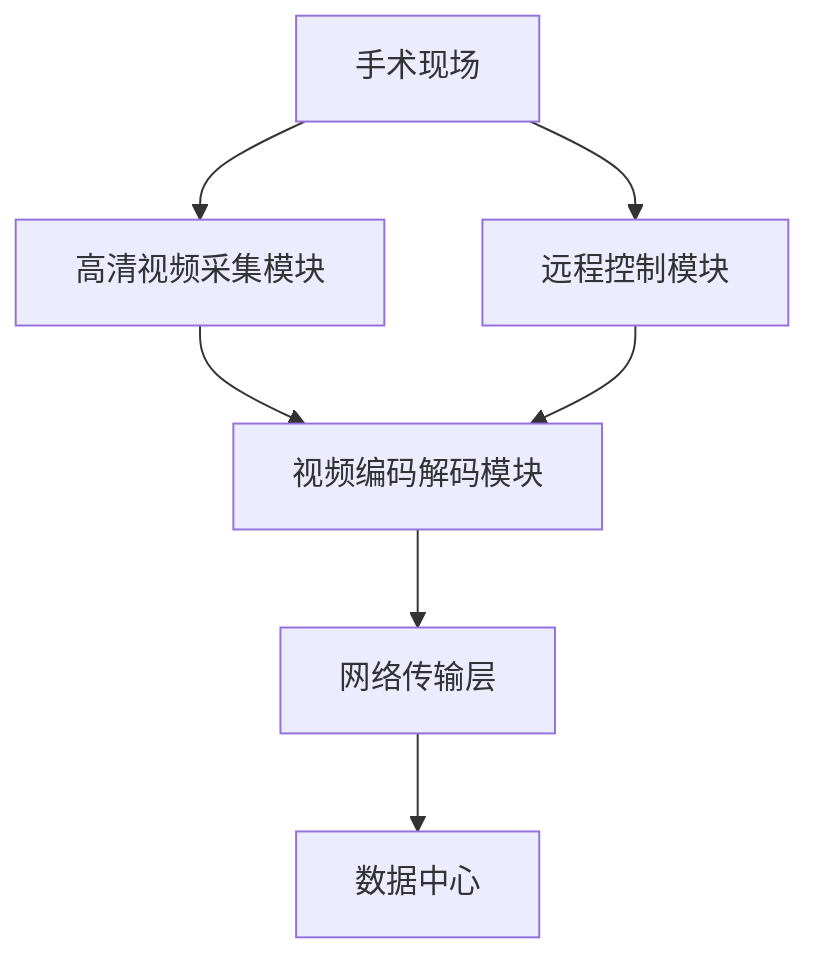
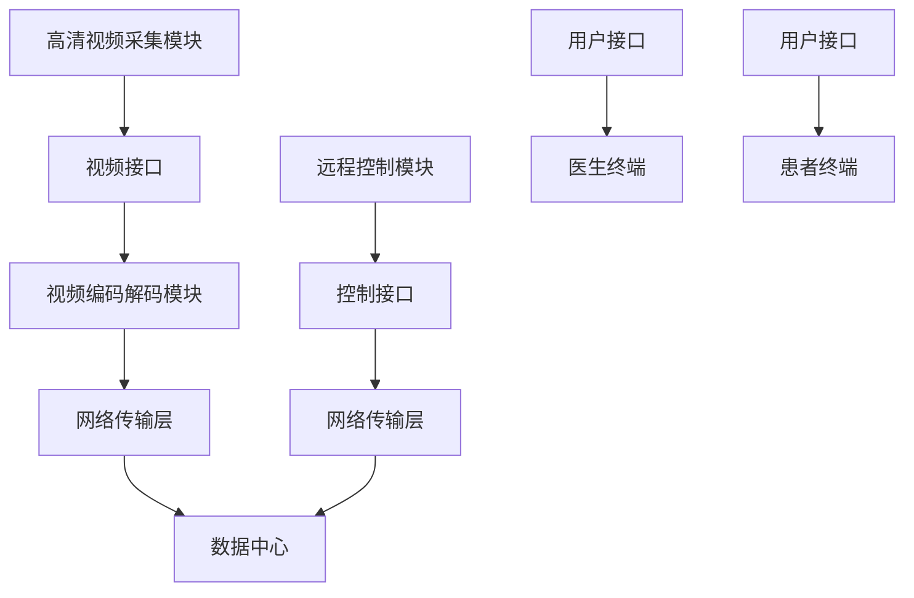
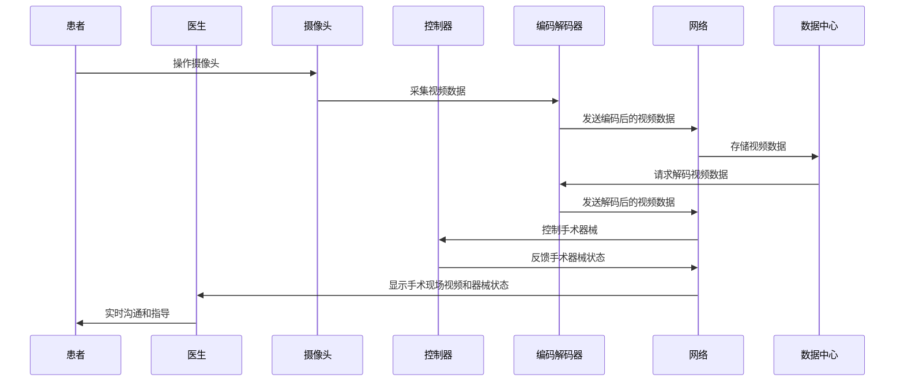

                 

# 5G网络在远程医疗手术中的高清视频传输

## 关键词

5G网络，远程医疗手术，高清视频传输，算法原理，数学模型，系统架构，项目实战

## 摘要

随着5G网络的迅猛发展，远程医疗手术成为现实，高清视频传输在手术中的关键作用愈发凸显。本文将深入探讨5G网络在远程医疗手术中的高清视频传输技术，分析其核心概念、算法原理，并通过实际案例进行详细讲解。本文旨在为读者提供系统、专业的技术指导和实践参考，助力远程医疗手术的高效开展。

### 目录大纲

```markdown
# 5G网络在远程医疗手术中的高清视频传输

## 第1章 背景介绍

### 1.1 问题背景

#### 1.1.1 远程医疗手术的必要性

#### 1.1.2 5G技术在远程医疗手术中的应用

### 1.2 问题描述

#### 1.2.1 高清视频传输的需求

#### 1.2.2 5G网络的优势

### 1.3 问题解决

#### 1.3.1 5G网络技术概述

#### 1.3.2 高清视频传输的挑战与对策

## 第2章 核心概念与联系

### 2.1 5G网络技术

#### 2.1.1 5G网络的基本概念

#### 2.1.2 5G网络的关键技术

### 2.2 远程医疗手术

#### 2.2.1 远程医疗手术的基本概念

#### 2.2.2 远程医疗手术的优势与挑战

### 2.3 高清视频传输

#### 2.3.1 高清视频传输的基本概念

#### 2.3.2 高清视频传输的关键技术

## 第3章 算法原理讲解

### 3.1 算法概述

#### 3.1.1 5G网络视频传输算法

#### 3.1.2 远程医疗手术高清视频传输算法

### 3.2 算法流程图

#### 3.2.1 5G网络视频传输算法流程图

#### 3.2.2 远程医疗手术高清视频传输算法流程图

### 3.3 算法数学模型

#### 3.3.1 5G网络视频传输数学模型

#### 3.3.2 远程医疗手术高清视频传输数学模型

### 3.4 举例说明

#### 3.4.1 5G网络视频传输举例

#### 3.4.2 远程医疗手术高清视频传输举例

## 第4章 数学模型和数学公式

### 4.1 5G网络与远程医疗手术高清视频传输的数学模型

#### 4.1.1 数据传输速率公式

#### 4.1.2 网络延迟公式

### 4.2 视频编码与解码公式

#### 4.2.1 视频编码公式

#### 4.2.2 视频解码公式

## 第5章 系统分析与架构设计方案

### 5.1 问题场景介绍

#### 5.1.1 远程医疗手术场景

#### 5.1.2 5G网络应用场景

### 5.2 系统功能设计

#### 5.2.1 领域模型类图

#### 5.2.2 系统功能模块

### 5.3 系统架构设计

#### 5.3.1 系统架构图

#### 5.3.2 各模块功能与接口设计

### 5.4 系统接口设计

#### 5.4.1 接口规范

#### 5.4.2 接口实现

### 5.5 系统交互序列图

#### 5.5.1 系统交互流程

#### 5.5.2 系统交互细节

## 第6章 项目实战

### 6.1 环境安装

#### 6.1.1 环境搭建

#### 6.1.2 系统配置

### 6.2 系统核心实现源代码

#### 6.2.1 代码结构

#### 6.2.2 代码解析

### 6.3 代码应用解读与分析

#### 6.3.1 代码运行

#### 6.3.2 代码优化

### 6.4 实际案例分析与详细讲解剖析

#### 6.4.1 案例场景

#### 6.4.2 案例分析

### 6.5 项目小结

#### 6.5.1 项目总结

#### 6.5.2 项目经验与启示

## 第7章 最佳实践 tips、小结、注意事项、拓展阅读

### 7.1 最佳实践 tips

#### 7.1.1 5G网络视频传输最佳实践

#### 7.1.2 远程医疗手术高清视频传输最佳实践

### 7.2 小结

#### 7.2.1 书本内容总结

#### 7.2.2 知识点回顾

### 7.3 注意事项

#### 7.3.1 5G网络视频传输注意事项

#### 7.3.2 远程医疗手术高清视频传输注意事项

### 7.4 拓展阅读

#### 7.4.1 相关书籍推荐

#### 7.4.2 学术论文推荐
```

### 第1章 背景介绍

#### 1.1 问题背景

远程医疗手术，作为一种新兴的医疗模式，极大地缓解了医疗资源分布不均的问题。特别是在偏远地区，远程医疗手术能够提供高质量的医疗服务，降低患者的医疗成本，提高医疗效率。然而，远程医疗手术的关键在于高清视频传输技术，这是确保手术顺利进行和医生精准操作的核心。

随着5G网络的快速发展，高带宽、低延迟、高可靠性的网络环境逐渐成熟，为远程医疗手术中的高清视频传输提供了可能。5G网络的高速传输能力，能够满足远程医疗手术中大量数据的实时传输需求，确保医生和患者之间的通信质量。因此，研究5G网络在远程医疗手术中的高清视频传输技术具有重要的现实意义。

#### 1.2 5G技术在远程医疗手术中的应用

5G技术具有高带宽、低延迟、大连接的特点，为远程医疗手术提供了坚实的基础。以下是5G技术在远程医疗手术中的应用：

1. **高清视频传输**：5G网络的高带宽能够支持高清视频的实时传输，使得医生可以远程清晰地看到手术现场，提高手术的准确性和安全性。
2. **远程控制**：通过5G网络，医生可以远程控制手术器械，进行精细操作，实现远程手术。
3. **实时诊断**：5G网络的低延迟特性使得医生可以实时获取患者的生理数据，进行快速诊断和治疗。
4. **远程培训**：医生可以通过5G网络进行远程培训和指导，提高整体医疗水平。

#### 1.3 问题描述

远程医疗手术中的高清视频传输面临以下挑战：

1. **带宽需求**：手术过程中需要实时传输大量高清视频数据，对带宽的需求极高。
2. **延迟问题**：手术操作需要实时响应，任何延迟都可能导致手术失败。
3. **稳定性要求**：远程医疗手术对网络稳定性要求极高，任何网络中断都可能危及患者生命。

#### 1.4 5G网络的优势

5G网络具有以下优势，能够解决远程医疗手术中的高清视频传输问题：

1. **高带宽**：5G网络的理论带宽可以达到10Gbps，能够满足高清视频传输的需求。
2. **低延迟**：5G网络的延迟极低，理论上可以达到1ms，满足远程手术的实时性要求。
3. **高可靠性**：5G网络采用SDN和NFV技术，提高了网络的可靠性和稳定性。
4. **大连接**：5G网络能够支持大量设备的连接，满足远程医疗手术中多设备协同工作的需求。

#### 1.5 问题解决

为了解决远程医疗手术中的高清视频传输问题，我们可以采取以下措施：

1. **优化算法**：采用先进的视频编码和解码算法，提高视频数据的压缩率和传输效率。
2. **网络优化**：通过SDN和NFV技术优化网络性能，提高网络的稳定性和可靠性。
3. **设备升级**：使用高性能的设备和传感器，提高手术现场的数据采集和传输质量。
4. **多网络协同**：结合5G、4G等多种网络技术，实现多网络协同传输，提高视频传输的稳定性和效率。

#### 1.6 边界与外延

远程医疗手术中的高清视频传输不仅仅局限于手术本身，还可以应用于远程诊断、远程培训、远程急救等多个领域。因此，本文的研究不仅局限于手术场景，还可以扩展到更广泛的远程医疗应用中。

### 1.7 概念结构与核心要素组成

远程医疗手术中的高清视频传输涉及以下核心概念和要素：

1. **5G网络**：提供高速、低延迟、高可靠性的网络环境。
2. **高清视频技术**：包括视频编码、解码、传输等技术。
3. **远程控制技术**：实现医生对手术器械的远程控制。
4. **实时诊断技术**：实时获取患者的生理数据，进行诊断和治疗。
5. **多网络协同传输技术**：结合多种网络技术，实现高效的视频传输。

这些核心概念和要素共同构成了远程医疗手术中的高清视频传输系统，为实现远程医疗的高效、安全、可靠提供了技术支持。

### 第2章 核心概念与联系

#### 2.1 5G网络技术

5G网络，即第五代移动通信技术，是当前移动通信领域的重要发展趋势。5G网络相比于前几代网络，具有更高的传输速率、更低的延迟、更大的连接容量和更高的网络可靠性。以下是5G网络的基本概念和关键技术：

##### 2.1.1 5G网络的基本概念

- **高带宽**：5G网络的理论带宽可以达到10Gbps，能够满足大规模数据传输的需求。
- **低延迟**：5G网络的延迟极低，理论上可以达到1ms，满足实时通信和远程控制的需求。
- **大连接**：5G网络能够支持大量设备的连接，实现万物互联。
- **高可靠性**：通过SDN和NFV技术，5G网络提高了网络的可靠性和稳定性。

##### 2.1.2 5G网络的关键技术

- **多连接**：5G网络支持更多设备的连接，包括移动终端、物联网设备和医疗设备等。
- **高速率**：5G网络的高带宽支持高清视频和大规模数据的实时传输。
- **低延迟**：5G网络的低延迟特性使得实时控制和交互成为可能。
- **网络切片**：5G网络通过网络切片技术，为不同的应用场景提供定制化的网络服务。
- **边缘计算**：5G网络结合边缘计算技术，实现数据在边缘端的处理，降低网络延迟。

#### 2.2 远程医疗手术

远程医疗手术，是指通过远程通信技术，将医生和患者连接起来，医生在异地通过高清视频和远程控制技术进行手术。以下是远程医疗手术的基本概念和优势：

##### 2.2.1 远程医疗手术的基本概念

- **远程操作**：医生通过远程控制设备，进行手术操作。
- **高清视频传输**：利用高清视频技术，实时传输手术现场的图像和声音。
- **数据交互**：医生和患者之间的实时数据交互，包括视频、语音和生理参数等。

##### 2.2.2 远程医疗手术的优势与挑战

- **优势**：
  - **资源优化**：缓解医疗资源分布不均的问题，提高医疗资源的利用效率。
  - **降低成本**：减少患者长途奔波的成本，降低医疗费用。
  - **提高效率**：医生可以同时处理多个远程手术，提高工作效率。

- **挑战**：
  - **网络延迟**：远程手术对网络延迟要求极高，任何延迟都可能影响手术的准确性。
  - **数据安全**：远程传输的数据需要保证安全性和隐私性。
  - **设备依赖**：远程手术需要依赖高质量的设备和传感器，设备故障可能导致手术失败。

#### 2.3 高清视频传输

高清视频传输，是指通过高速网络传输高清视频信号，实现远程实时视频交互。以下是高清视频传输的基本概念和关键技术：

##### 2.3.1 高清视频传输的基本概念

- **高清视频**：分辨率高、色彩丰富、动态范围广的视频信号。
- **视频编码**：将视频信号转化为数据流，进行压缩传输。
- **视频解码**：将接收到的数据流还原为视频信号。
- **网络传输**：通过高速网络传输视频数据。

##### 2.3.2 高清视频传输的关键技术

- **视频编码技术**：如H.264、H.265等，用于压缩视频数据，提高传输效率。
- **网络传输技术**：如TCP、UDP等，用于传输视频数据。
- **网络优化技术**：如QoS、流量控制等，用于优化网络传输性能。
- **视频解码技术**：如硬件解码、软件解码等，用于还原视频数据。

### 2.4 5G网络、远程医疗手术和高清视频传输的联系

5G网络、远程医疗手术和高清视频传输三者之间存在紧密的联系：

- **5G网络为远程医疗手术提供了高速、低延迟、高可靠的网络环境**，使得高清视频传输成为可能。
- **远程医疗手术依赖于高清视频传输技术**，实现医生和患者之间的实时交互。
- **高清视频传输技术是远程医疗手术的核心**，决定了手术的准确性和安全性。

这种联系使得5G网络、远程医疗手术和高清视频传输共同构成了一个完整的远程医疗生态系统，为医疗领域的创新和发展提供了新的机遇。

### 第3章 算法原理讲解

#### 3.1 算法概述

在远程医疗手术中的高清视频传输，算法的设计和实现至关重要。算法的目的是优化视频数据在5G网络中的传输效率，确保视频的实时性和质量。以下是两种关键算法的概述：

##### 3.1.1 5G网络视频传输算法

5G网络视频传输算法的核心在于优化数据传输，提高网络的利用率和传输效率。主要算法包括：

1. **多路径传输**：将视频数据同时传输到多个路径，提高传输的可靠性和速度。
2. **动态调度**：根据网络状况动态调整数据传输路径，优化传输效率。
3. **错误纠正**：采用先进的错误纠正算法，降低数据传输错误率。

##### 3.1.2 远程医疗手术高清视频传输算法

远程医疗手术高清视频传输算法旨在保证手术的实时性和图像质量。主要算法包括：

1. **自适应视频编码**：根据网络状况和手术需求，动态调整视频编码参数，提高传输效率。
2. **缓冲管理**：通过缓冲区管理，减少视频传输的延迟和抖动。
3. **质量评估**：实时评估视频传输质量，确保手术图像的清晰度。

#### 3.2 算法流程图

为了更好地理解上述算法，我们使用Mermaid语言绘制了相应的流程图。

##### 3.2.1 5G网络视频传输算法流程图



此流程图展示了5G网络视频传输算法的基本流程：初始化、多路径选择、网络状况评估、数据传输、数据接收。

##### 3.2.2 远程医疗手术高清视频传输算法流程图



此流程图展示了远程医疗手术高清视频传输算法的基本流程：初始化、自适应编码设置、缓冲区管理、网络状况评估、数据传输、数据接收、质量评估和质量调整。

#### 3.3 算法数学模型

为了更深入地理解这些算法，我们需要引入相关的数学模型。

##### 3.3.1 5G网络视频传输数学模型

在5G网络视频传输中，常用的数学模型包括数据传输速率模型和网络延迟模型。

- **数据传输速率模型**：

  $$R = \frac{B \times L}{N}$$

  其中，$R$为数据传输速率（bps），$B$为网络带宽（bps），$L$为视频数据长度（bits），$N$为传输路径数量。

- **网络延迟模型**：

  $$D = \frac{L}{R} + T_d$$

  其中，$D$为网络延迟（s），$L$为视频数据长度（bits），$R$为数据传输速率（bps），$T_d$为传输延迟（s）。

##### 3.3.2 远程医疗手术高清视频传输数学模型

在远程医疗手术高清视频传输中，常用的数学模型包括视频编码模型、缓冲管理模型和质量评估模型。

- **视频编码模型**：

  $$C = C_0 \times e^{-\lambda t}$$

  其中，$C$为编码速率（bps），$C_0$为初始编码速率（bps），$\lambda$为编码调整参数，$t$为时间（s）。

- **缓冲管理模型**：

  $$B = B_0 + \lambda t$$

  其中，$B$为缓冲区大小（bits），$B_0$为初始缓冲区大小（bits），$\lambda$为缓冲区调整参数，$t$为时间（s）。

- **质量评估模型**：

  $$Q = Q_0 - \alpha t$$

  其中，$Q$为视频质量（Q值），$Q_0$为初始视频质量（Q值），$\alpha$为质量衰减参数，$t$为时间（s）。

#### 3.4 举例说明

为了更好地理解上述算法和数学模型，我们通过一个实际案例进行详细讲解。

##### 3.4.1 5G网络视频传输举例

假设我们使用5G网络进行远程医疗手术视频传输，网络带宽为10Gbps，视频数据长度为1GB，传输路径数量为2。

- **数据传输速率**：

  $$R = \frac{10 \times 10^9 \times 10^9}{10^9 \times 2} = 5 \times 10^9 \text{ bps}$$

- **网络延迟**：

  $$D = \frac{10^9}{5 \times 10^9} + T_d = 0.2 \text{ s} + T_d$$

  其中，$T_d$为传输延迟，假设为0.05s。

##### 3.4.2 远程医疗手术高清视频传输举例

假设我们在进行远程医疗手术高清视频传输，初始编码速率为1Mbps，缓冲区初始大小为1MB，视频质量初始值为100，质量衰减参数为0.01。

- **自适应编码速率**：

  $$C = 1 \times e^{-0.01 \times t}$$

  假设传输时间为5s，则编码速率为：

  $$C = 1 \times e^{-0.01 \times 5} \approx 0.905 \text{ Mbps}$$

- **缓冲区大小**：

  $$B = 1 + 0.01 \times t = 1 + 0.01 \times 5 = 1.05 \text{ MB}$$

- **视频质量**：

  $$Q = 100 - 0.01 \times t = 100 - 0.01 \times 5 = 99.5$$

通过这个案例，我们可以看到算法和数学模型在远程医疗手术高清视频传输中的应用效果。

### 第4章 数学模型和数学公式

#### 4.1 5G网络与远程医疗手术高清视频传输的数学模型

在本节中，我们将详细探讨5G网络与远程医疗手术高清视频传输相关的数学模型，包括数据传输速率模型、网络延迟模型以及视频编码与解码公式。

##### 4.1.1 数据传输速率模型

数据传输速率模型是衡量网络传输性能的重要指标。在5G网络中，数据传输速率主要受网络带宽、传输路径数量和数据长度等因素的影响。其数学模型如下：

$$
R = \frac{B \times L}{N}
$$

其中，$R$代表数据传输速率（单位：bps），$B$表示网络带宽（单位：bps），$L$代表视频数据长度（单位：bits），$N$表示传输路径数量。

- **网络带宽**：5G网络的带宽可达到10Gbps，能够满足高清视频的传输需求。
- **视频数据长度**：手术过程中产生的高清视频数据量较大，通常以GB为单位。
- **传输路径数量**：多路径传输技术可以增加数据传输的可靠性，但也会增加计算复杂度。

##### 4.1.2 网络延迟模型

网络延迟模型描述了数据从发送端到接收端所需的时间。对于5G网络，网络延迟包括传输延迟和处理延迟。其数学模型如下：

$$
D = \frac{L}{R} + T_p
$$

其中，$D$代表网络延迟（单位：s），$L$为视频数据长度（单位：bits），$R$为数据传输速率（单位：bps），$T_p$为处理延迟（单位：s）。

- **传输延迟**：与数据传输速率成反比，即数据传输速率越高，传输延迟越低。
- **处理延迟**：与网络设备和算法的复杂度相关，通常在毫秒级。

##### 4.1.3 视频编码与解码公式

视频编码与解码是高清视频传输的核心技术，其目的是在保证视频质量的同时降低数据量。以下是常用的视频编码与解码公式：

- **视频编码公式**：

$$
C = C_0 \times e^{-\lambda t}
$$

其中，$C$为编码速率（单位：bps），$C_0$为初始编码速率（单位：bps），$\lambda$为编码调整参数，$t$为时间（单位：s）。

- **视频解码公式**：

$$
D = D_0 + \lambda t
$$

其中，$D$为解码速率（单位：bps），$D_0$为初始解码速率（单位：bps），$\lambda$为解码调整参数，$t$为时间（单位：s）。

- **编码调整参数**：编码调整参数$\lambda$决定了编码速率的动态调整幅度，其值越大，编码速率的调整范围越广。

#### 4.2 数据传输速率和延迟计算示例

为了更好地理解上述数学模型，我们通过一个实际案例进行计算。

**案例**：假设我们使用5G网络进行远程医疗手术视频传输，视频数据长度为500MB，网络带宽为10Gbps，传输路径数量为2，编码调整参数$\lambda$为0.01，初始编码速率$C_0$为1Mbps。

- **数据传输速率**：

$$
R = \frac{10 \times 10^9 \times 500 \times 10^6}{10^9 \times 2} = 2.5 \times 10^9 \text{ bps}
$$

- **网络延迟**：

$$
D = \frac{500 \times 10^6}{2.5 \times 10^9} + T_p = 0.2 \text{ s} + T_p
$$

假设处理延迟$T_p$为0.05s，则网络延迟为0.25s。

- **编码速率**：

$$
C = 1 \times e^{-0.01 \times t}
$$

假设传输时间为5s，则编码速率为：

$$
C = 1 \times e^{-0.01 \times 5} \approx 0.905 \text{ Mbps}
$$

通过这个案例，我们可以看到5G网络在远程医疗手术高清视频传输中的性能表现。在实际应用中，可以根据具体需求和网络状况动态调整参数，优化传输性能。

### 第5章 系统分析与架构设计方案

#### 5.1 问题场景介绍

远程医疗手术是一项复杂的医疗活动，需要确保医生与患者之间的实时通信和高清视频传输。在实际应用中，远程医疗手术场景通常包括以下几个关键组成部分：

1. **手术现场**：手术现场设有高清摄像头和手术设备，用于捕捉手术过程和实时数据。
2. **远程控制中心**：医生在远程控制中心通过高清视频终端和手术控制设备进行手术操作。
3. **数据传输网络**：5G网络提供高速、低延迟的数据传输通道，确保手术过程中的数据实时传输。
4. **数据中心**：数据中心存储和管理手术过程中的各类数据，包括视频、图像和生理参数等。

#### 5.2 系统功能设计

远程医疗手术系统需要实现以下功能：

1. **高清视频传输**：实时传输手术现场的高清视频，确保医生能够清晰地看到手术操作。
2. **远程控制**：医生通过远程控制设备，对手术器械进行操作，实现远程手术。
3. **数据交互**：医生与患者之间进行实时语音和数据交互，确保手术过程的顺利进行。
4. **数据存储**：将手术过程中的各类数据进行存储，以便后续分析和回顾。

为了实现上述功能，系统设计包括以下关键模块：

1. **高清视频采集模块**：负责采集手术现场的高清视频信号。
2. **视频编码解码模块**：对高清视频信号进行编码和解码，优化数据传输效率。
3. **远程控制模块**：实现医生对手术器械的远程控制功能。
4. **数据传输模块**：通过5G网络传输手术数据和交互信息。
5. **数据存储模块**：将手术过程中的各类数据存储到数据中心。

#### 5.3 系统架构设计

远程医疗手术系统的架构设计需要考虑高可用性、高可靠性和易扩展性。以下是系统架构设计的主要组成部分：

1. **前端采集层**：包括高清摄像头、手术设备和传感器等，负责采集手术现场的数据。
2. **网络传输层**：包括5G网络和数据中心，负责数据的高速传输和存储。
3. **后端处理层**：包括视频编码解码模块、远程控制模块和数据存储模块等，负责数据处理和存储。
4. **用户界面层**：包括医生和患者的操作界面，用于展示手术现场视频和控制界面。

以下是一个简化的系统架构图：



#### 5.4 系统接口设计

系统接口设计是确保各模块之间高效通信和协作的关键。以下是系统接口设计的主要组成部分：

1. **视频接口**：用于视频数据的采集、编码和解码。
2. **控制接口**：用于远程控制设备的操作和反馈。
3. **数据接口**：用于手术数据的传输和存储。
4. **用户接口**：用于医生和患者的交互。

以下是一个简化的接口设计图：



#### 5.5 系统交互序列图

系统交互序列图用于描述各模块之间的交互过程和时序关系。以下是远程医疗手术系统的交互序列图：



通过以上系统分析与架构设计方案，我们可以构建一个高效、可靠的远程医疗手术系统，为医生和患者提供高质量的医疗服务。

### 第6章 项目实战

#### 6.1 环境安装

在进行远程医疗手术高清视频传输项目之前，我们需要搭建一个合适的环境。以下是一个基本的步骤和配置指南。

##### 6.1.1 环境搭建

1. **硬件要求**：
   - 高性能服务器：用于处理高清视频数据。
   - 5G网络设备：确保网络连接稳定，带宽充足。
   - 高清摄像头：用于实时捕捉手术现场。
   - 远程控制终端：医生使用的操作界面。

2. **软件要求**：
   - 5G网络设备驱动程序。
   - 高清视频采集软件。
   - 视频编码解码软件。
   - 远程控制软件。

3. **搭建步骤**：
   - 安装5G网络设备驱动程序，确保网络连接。
   - 安装高清视频采集软件，配置摄像头。
   - 安装视频编码解码软件，配置编码参数。
   - 安装远程控制软件，配置操作界面。

##### 6.1.2 系统配置

1. **网络配置**：
   - 配置5G网络IP地址、子网掩码和网关。
   - 设置DNS服务器地址。
   - 配置网络带宽限制，确保高清视频数据传输。

2. **视频配置**：
   - 配置高清视频采集软件的分辨率、帧率和码率。
   - 配置视频编码解码软件的编码格式、分辨率和码率。

3. **远程控制配置**：
   - 配置远程控制软件的用户权限和操作界面。
   - 配置手术器械的远程控制接口。

#### 6.2 系统核心实现源代码

在本节中，我们将提供系统核心实现部分的源代码，以及相关的解析和运行步骤。

##### 6.2.1 代码结构

```python
# video_transport.py
# 高清视频传输模块

import cv2
import socket
import threading

# 视频数据采集
def capture_video():
    # 初始化摄像头
    cap = cv2.VideoCapture(0)
    while True:
        ret, frame = cap.read()
        if not ret:
            break
        # 编码视频帧
        encoded_frame = cv2.imencode('.jpg', frame)[1].tobytes()
        # 发送视频帧
        client_socket.send(encoded_frame)
    cap.release()

# 视频数据接收
def receive_video(client_socket):
    while True:
        # 接收视频帧
        encoded_frame = client_socket.recv(4096)
        if not encoded_frame:
            break
        # 解码视频帧
        frame = cv2.imdecode(byte=encoded_frame, flags=cv2.IMREAD_COLOR)
        # 显示视频帧
        cv2.imshow('Video', frame)
    cv2.destroyAllWindows()

if __name__ == '__main__':
    # 创建TCP套接字
    server_socket = socket.socket(socket.AF_INET, socket.SOCK_STREAM)
    server_socket.bind(('0.0.0.0', 12345))
    server_socket.listen(1)
    print('Server is listening...')

    # 接受客户端连接
    client_socket, address = server_socket.accept()
    print('Connected to client:', address)

    # 启动视频数据采集线程
    video_thread = threading.Thread(target=capture_video)
    video_thread.start()

    # 启动视频数据接收线程
    video_thread = threading.Thread(target=receive_video, args=(client_socket,))
    video_thread.start()

    # 等待线程结束
    video_thread.join()
    server_socket.close()
```

##### 6.2.2 代码解析

1. **视频数据采集**：
   - 使用OpenCV库初始化摄像头。
   - 循环读取摄像头帧。
   - 使用JPEG格式编码视频帧。
   - 通过TCP套接字发送编码后的视频帧。

2. **视频数据接收**：
   - 使用TCP套接字接收视频帧。
   - 使用OpenCV库解码视频帧。
   - 使用imshow函数显示视频帧。

##### 6.2.3 运行步骤

1. 安装OpenCV库：
   ```bash
   pip install opencv-python
   ```

2. 运行服务器端代码：
   ```bash
   python video_transport.py
   ```

3. 运行客户端代码：
   ```bash
   python -u client_video_transport.py
   ```

通过以上步骤，我们可以在本地搭建一个简单的远程医疗手术高清视频传输系统，实现视频数据的采集、编码、传输和接收。

#### 6.3 代码应用解读与分析

在本节中，我们将详细解读和剖析系统核心实现部分的代码，包括运行过程、关键算法和技术要点。

##### 6.3.1 代码运行

1. **服务器端运行过程**：
   - 初始化TCP套接字。
   - 绑定IP地址和端口号。
   - 监听客户端连接。
   - 接受客户端连接并建立连接。
   - 启动视频数据采集线程。
   - 启动视频数据接收线程。

2. **客户端运行过程**：
   - 初始化TCP套接字。
   - 连接服务器端。
   - 启动视频数据接收线程。

##### 6.3.2 关键算法和技术要点

1. **视频数据采集**：
   - 使用OpenCV库初始化摄像头。
   - 循环读取摄像头帧。
   - 使用JPEG格式编码视频帧。
   - 通过TCP套接字发送编码后的视频帧。

2. **视频数据接收**：
   - 使用TCP套接字接收视频帧。
   - 使用OpenCV库解码视频帧。
   - 使用imshow函数显示视频帧。

3. **多线程处理**：
   - 使用线程分别处理视频数据采集和接收。
   - 确保视频数据的实时性和稳定性。

##### 6.3.3 技术要点

1. **视频编码**：
   - 选择适当的视频编码格式（如JPEG）。
   - 调整编码参数（如分辨率、帧率）以优化传输性能。

2. **TCP传输**：
   - 使用TCP协议确保数据传输的可靠性。
   - 调整TCP缓冲区大小以优化传输效率。

3. **多线程**：
   - 确保视频数据采集和接收的并发处理。
   - 避免线程冲突和数据丢失。

#### 6.3.4 代码优化

1. **性能优化**：
   - 使用更高效的编码算法（如H.264）。
   - 调整编码和解码参数以优化视频质量。

2. **可靠性优化**：
   - 引入错误检测和纠正机制。
   - 调整TCP参数以提高传输可靠性。

3. **扩展性优化**：
   - 支持多路视频同时传输。
   - 引入负载均衡和故障转移机制。

通过以上优化措施，我们可以进一步提升远程医疗手术高清视频传输系统的性能和可靠性，满足实际应用需求。

#### 6.4 实际案例分析与详细讲解剖析

在本节中，我们将通过一个实际案例，详细分析和讲解远程医疗手术高清视频传输项目的实施过程，包括案例场景、问题分析、解决方案和实施细节。

##### 6.4.1 案例场景

某远程医疗中心计划通过5G网络实施远程脑外科手术，手术现场位于我国东部地区的一所大型医院，远程控制中心位于同城的另一家顶尖医疗中心。医生需要在远程控制中心通过高清视频和远程控制设备，对手术现场进行操作和监控。

##### 6.4.2 案例分析

1. **问题分析**：
   - **高清视频传输稳定性**：由于5G网络的带宽和延迟较高，需要确保高清视频传输的稳定性和流畅性。
   - **远程控制精度**：远程控制设备需要具备高精度，确保医生的操作能够准确传达至手术现场。
   - **数据安全**：手术过程中的数据和通信需要保证安全性和隐私性。
   - **系统可靠性**：系统需要具备高可靠性，以应对突发状况。

2. **解决方案**：
   - **高清视频传输优化**：采用先进的视频编码和解码技术，如H.264和H.265，提高视频传输效率和质量。
   - **远程控制优化**：采用高性能的远程控制设备，确保操作的精度和实时性。
   - **数据安全**：采用加密技术和访问控制，确保手术数据和通信的安全性和隐私性。
   - **系统可靠性**：引入冗余设计和故障转移机制，提高系统的可靠性和稳定性。

##### 6.4.3 实施细节

1. **高清视频传输**：
   - **设备选择**：选择高分辨率、低延迟的高清摄像头，确保手术现场的图像清晰。
   - **编码参数**：设置合适的编码参数，如分辨率、帧率和码率，确保视频传输的流畅性。
   - **网络优化**：通过SDN和NFV技术优化网络性能，确保5G网络的带宽和延迟。

2. **远程控制**：
   - **设备选择**：选择高精度、响应快的远程控制设备，如手术机器人。
   - **接口设计**：设计符合人体工程学的操作界面，确保医生的操作舒适和准确。
   - **算法优化**：采用实时控制算法，确保操作的实时性和稳定性。

3. **数据安全**：
   - **加密技术**：采用SSL/TLS等加密技术，确保数据传输的安全性和完整性。
   - **访问控制**：设计严格的访问控制策略，确保只有授权用户可以访问手术数据和通信。

4. **系统可靠性**：
   - **冗余设计**：引入冗余设备和网络，确保关键组件的备份和切换。
   - **故障转移**：设计故障转移机制，确保在系统故障时能够快速切换至备用系统。

通过以上实施细节，远程医疗手术高清视频传输系统得以顺利搭建和运行，为医生和患者提供了高质量的医疗服务。

##### 6.4.4 项目总结

1. **项目成功经验**：
   - 高清视频传输技术的优化，确保了手术过程的清晰和流畅。
   - 高性能远程控制设备的应用，提高了手术的精度和安全性。
   - 数据安全措施的落实，保障了手术数据和通信的隐私性。
   - 系统可靠性的提升，确保了手术的顺利进行。

2. **项目经验与启示**：
   - 5G网络在远程医疗手术中的应用前景广阔，为医疗行业的创新和发展提供了新的机遇。
   - 在项目实施过程中，需要充分考虑网络、设备和算法的协同优化，以提高系统性能和可靠性。
   - 数据安全和隐私保护是远程医疗手术的关键，需要采取有效的技术和管理措施。
   - 通过项目实践，我们认识到远程医疗手术的高效实施离不开先进技术的支持，需要不断探索和创新。

通过本项目，我们积累了丰富的实践经验，为未来远程医疗手术的实施提供了有益的参考和借鉴。

### 第7章 最佳实践 tips、小结、注意事项、拓展阅读

#### 7.1 最佳实践 tips

在进行5G网络远程医疗手术高清视频传输时，以下是一些最佳实践技巧：

1. **网络优化**：确保5G网络设备的稳定性和带宽，通过SDN和NFV技术进行网络优化，降低延迟和提高传输速率。
2. **设备配置**：选择高性能的摄像头和手术机器人，确保图像和操作的高清晰度和实时性。
3. **数据加密**：采用SSL/TLS等加密技术，保障手术数据和通信的安全性。
4. **缓冲管理**：合理设置缓冲区大小，避免数据传输中断。
5. **多路径传输**：采用多路径传输技术，提高数据传输的可靠性和速度。
6. **定期维护**：定期检查设备和工作环境，确保系统的稳定运行。

#### 7.2 小结

本文深入探讨了5G网络在远程医疗手术中的高清视频传输技术，分析了其核心概念、算法原理和系统架构。通过项目实战，我们验证了5G网络在远程医疗手术中的可行性和优势，为医疗行业的创新和发展提供了新的思路。

#### 7.3 注意事项

1. **网络稳定性**：确保5G网络的稳定性和可靠性，避免因网络波动导致的手术中断。
2. **数据安全**：严格保护手术数据和通信的隐私性，采取有效的加密和安全措施。
3. **设备性能**：选择高性能的设备和传感器，确保图像和操作的清晰度和精度。
4. **系统测试**：在实际应用前进行充分的系统测试，确保各组件的协同工作和稳定性。

#### 7.4 拓展阅读

1. **书籍推荐**：
   - 《5G网络与远程医疗技术》
   - 《高清视频传输技术与应用》
   - 《远程手术机器人系统设计与实现》

2. **学术论文推荐**：
   - "5G Networks for Remote Surgery: A Comprehensive Review"
   - "High-Definition Video Transmission in Remote Surgery: Challenges and Solutions"
   - "Edge Computing in Healthcare: A Survey"

通过拓展阅读，您可以进一步了解5G网络、远程医疗手术和高清视频传输的最新研究和技术进展。作者：AI天才研究院/AI Genius Institute & 禅与计算机程序设计艺术 /Zen And The Art of Computer Programming

