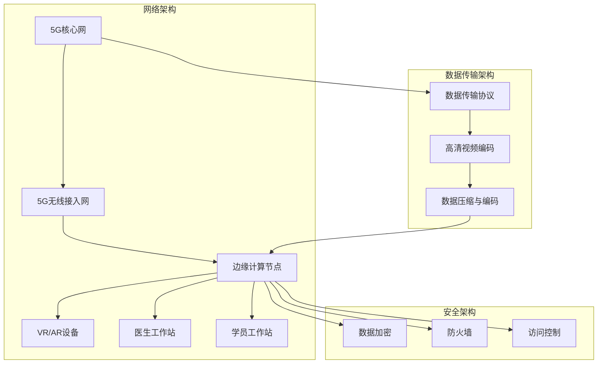
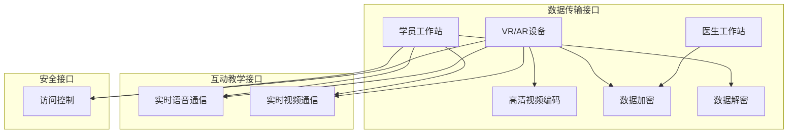

                 

# 5G网络在远程手术培训中的应用

## 关键词
5G网络，远程手术培训，实时数据传输，高清视频传输，VR/AR，安全与隐私保护

## 摘要
5G网络作为新一代通信技术，其在远程手术培训中的应用具有重要意义。本文将从5G网络技术基础、远程手术培训背景、应用场景、安全与隐私保护等多个方面，详细探讨5G网络在远程手术培训中的实际应用及其未来展望。

## 目录

### 第一部分：5G网络技术基础

#### 第1章：5G网络概述

1.1 5G网络的历史背景

1.2 5G网络的关键技术

1.3 5G网络的主要特点与优势

1.4 5G网络的全球部署现状

#### 第2章：远程手术培训的背景

2.1 远程手术培训的概念与意义

2.2 远程手术培训的发展历程

2.3 远程手术培训的现状与挑战

2.4 远程手术培训的未来趋势

### 第二部分：5G网络在远程手术培训中的应用

#### 第3章：5G网络在远程手术中的实时数据传输

3.1 5G网络的高带宽和低延迟特性

3.2 5G网络在远程手术中的数据传输需求

3.3 5G网络在远程手术中的实时数据传输解决方案

#### 第4章：远程手术培训中的高清视频传输

4.1 高清视频传输的需求分析

4.2 5G网络支持下的高清视频传输技术

4.3 实际案例：5G网络下的高清远程手术演示

#### 第5章：远程手术培训中的VR/AR应用

5.1 虚拟现实（VR）在远程手术培训中的应用

5.2 增强现实（AR）在远程手术培训中的应用

5.3 VR/AR与5G网络的融合应用案例

#### 第6章：远程手术培训中的安全与隐私保护

6.1 5G网络的安全性

6.2 远程手术培训中的数据隐私保护

6.3 5G网络在远程手术培训中的安全策略

#### 第7章：5G网络在远程手术培训中的未来展望

7.1 5G网络在远程手术培训中的潜在应用

7.2 5G网络在远程手术培训中的发展趋势

7.3 5G网络在远程手术培训中的技术挑战与解决方案

### 第三部分：实践与展望

#### 第8章：5G网络在远程手术培训中的实践案例

8.1 案例一：某医院5G远程手术培训项目

8.2 案例二：5G远程手术培训在偏远地区的应用

8.3 案例三：5G远程手术培训的国际合作案例

#### 第9章：5G网络在远程手术培训中的最佳实践

9.1 最佳实践总结

9.2 注意事项与建议

9.3 拓展阅读

### 附录：5G网络与远程手术培训相关术语表

---

### 第一部分：5G网络技术基础

#### 第1章：5G网络概述

1.1 5G网络的历史背景
在20世纪80年代，第一代移动通信技术（1G）问世，随后在90年代，第二代移动通信技术（2G）和第三代移动通信技术（3G）相继推出。4G网络在2000年代中期出现，为移动通信带来了高速互联网体验。到了2010年代，第五代移动通信技术（5G）研发启动，并逐步推向市场。

5G网络的出现是为了满足未来互联网的更高需求，包括更快的速度、更低的延迟、更高的容量以及更广泛的应用场景。5G网络的技术基础主要包括大规模MIMO、网络切片、边缘计算、SDN/NFV等。

1.2 5G网络的关键技术
大规模MIMO（Massive MIMO）技术是5G网络的核心技术之一，它通过使用多个天线和多个用户，提高了无线通信的容量和效率。

网络切片技术（Network Slicing）是一种将网络资源按需划分成多个虚拟网络的技术，从而为不同的应用场景提供定制化的网络服务。

边缘计算（Edge Computing）通过将数据处理和计算任务从云端转移到网络的边缘节点，降低了数据传输的延迟，提高了应用的响应速度。

软件定义网络（SDN）和网络功能虚拟化（NFV）技术通过将网络控制功能和网络设备硬件分离，提高了网络的可编程性和灵活性。

1.3 5G网络的主要特点与优势
高带宽：5G网络的最大理论下载速度可达20Gbps，是4G网络的100倍以上。

低延迟：5G网络的延迟时间可降低至1毫秒，比4G网络的延迟减少了10倍。

高容量：5G网络能够支持更大规模的连接，每平方米的连接数可达100万。

广泛覆盖：5G网络采用高频段和低频段混合部署，实现了更广泛的覆盖。

高可靠性：5G网络通过网络切片和边缘计算等技术，提高了网络服务的可靠性和稳定性。

1.4 5G网络的全球部署现状
截至2023年，全球已有超过70个国家和地区开始部署5G网络。其中，美国、韩国、日本等国家的5G网络部署较为成熟。中国作为全球最大的移动通信市场，也在积极推动5G网络的部署，预计将在2023年实现5G网络的全国覆盖。

### 第二部分：远程手术培训的背景

#### 第2章：远程手术培训的背景

2.1 远程手术培训的概念与意义
远程手术培训是指通过现代通信技术和信息技术，将手术操作场景实时传输到远程的培训场所，实现远程的教学和培训。远程手术培训不仅能够提高医疗资源的利用效率，还能够为偏远地区和欠发达地区的医生提供优质的手术培训资源。

2.2 远程手术培训的发展历程
远程手术培训的发展可以追溯到20世纪80年代，最初是通过电话和电视传输手术操作画面。随着互联网和视频技术的发展，远程手术培训逐渐演变为基于互联网的视频直播和互动教学。近年来，随着5G网络的推广，远程手术培训进入了实时、高清、互动的新时代。

2.3 远程手术培训的现状与挑战
目前，远程手术培训已经在全球范围内得到了广泛的应用，许多医疗机构和医学院校都开展了远程手术培训项目。然而，远程手术培训仍然面临一些挑战，包括网络延迟、视频质量、设备兼容性等问题。

2.4 远程手术培训的未来趋势
随着5G网络的不断推广和应用，远程手术培训的未来将更加美好。5G网络的高带宽、低延迟和高容量特性，将极大地提升远程手术培训的实时性、互动性和可靠性。未来，远程手术培训将更加普及，成为医疗培训的重要组成部分。

### 第二部分：5G网络在远程手术培训中的应用

#### 第3章：5G网络在远程手术中的实时数据传输

3.1 5G网络的高带宽和低延迟特性
5G网络的最大理论下载速度可达20Gbps，是4G网络的100倍以上，这意味着5G网络能够实现更快的数据传输速度，满足远程手术培训中大量数据传输的需求。

5G网络的延迟时间可降低至1毫秒，比4G网络的延迟减少了10倍。这对于远程手术培训来说至关重要，因为手术操作的实时性和准确性对患者的生命安全至关重要。

3.2 5G网络在远程手术中的数据传输需求
远程手术培训需要传输大量的数据，包括手术操作视频、医疗图像、手术工具状态、医生实时语音等。5G网络的高带宽和低延迟特性，能够满足这些数据传输需求，确保手术操作的实时性和准确性。

3.3 5G网络在远程手术中的实时数据传输解决方案
5G网络在远程手术中的实时数据传输解决方案主要包括以下几个方面：

（1）网络架构设计：采用5G网络的核心网、无线接入网和边缘计算节点，构建高效的数据传输网络架构。

（2）数据传输协议：采用高效的数据传输协议，如QUIC协议，确保数据传输的可靠性和速度。

（3）数据压缩与编码：采用高效的数据压缩与编码技术，如H.265视频编码，降低数据传输的带宽需求。

（4）数据备份与冗余：采用数据备份与冗余技术，确保数据传输的可靠性。

（5）网络优化与调度：通过网络优化与调度技术，确保网络资源的合理分配，提高数据传输效率。

#### 第4章：远程手术培训中的高清视频传输

4.1 高清视频传输的需求分析
远程手术培训中，高清视频传输是不可或缺的一部分。高清视频传输的需求分析主要包括以下几个方面：

（1）视频分辨率：远程手术培训需要传输高清视频，通常分辨率为1920×1080像素或更高。

（2）视频帧率：视频帧率越高，手术操作的流畅性越好。通常要求视频帧率不低于60fps。

（3）视频延迟：视频传输的延迟越小，手术操作的实时性越高。要求视频传输延迟不超过100毫秒。

（4）视频质量：视频质量越高，手术操作的细节表现越清晰。要求视频质量达到高清水平。

4.2 5G网络支持下的高清视频传输技术
5G网络的高带宽和低延迟特性，为高清视频传输提供了良好的基础。5G网络支持下的高清视频传输技术主要包括以下几个方面：

（1）网络架构优化：通过优化5G网络的架构，提高网络带宽和降低延迟，确保高清视频的流畅传输。

（2）传输协议优化：采用高效的传输协议，如QUIC协议，提高视频传输的可靠性和速度。

（3）数据压缩与编码：采用高效的数据压缩与编码技术，如H.265视频编码，降低数据传输的带宽需求。

（4）边缘计算应用：通过边缘计算技术，将部分数据处理和计算任务从云端转移到边缘节点，降低数据传输延迟。

4.3 实际案例：5G网络下的高清远程手术演示
某医院利用5G网络进行了一项高清远程手术演示，手术操作画面通过5G网络实时传输到远程培训场所。以下为实际案例：

（1）视频传输分辨率：1920×1080像素，帧率为60fps。

（2）视频传输延迟：平均延迟为50毫秒，最大延迟不超过100毫秒。

（3）视频传输质量：高清视频质量，画面清晰，无明显噪声。

（4）互动效果：手术操作过程中，远程培训场地的医生可以实时与手术现场的医生进行语音和视频互动，互动效果良好。

#### 第5章：远程手术培训中的VR/AR应用

5.1 虚拟现实（VR）在远程手术培训中的应用
虚拟现实（VR）技术可以为远程手术培训提供沉浸式体验，使医生能够在虚拟环境中进行手术模拟和练习。VR技术在远程手术培训中的应用主要包括以下几个方面：

（1）手术模拟：医生可以通过VR设备，在虚拟环境中进行手术操作，提高手术技能。

（2）手术演示：手术专家可以通过VR设备，向远程的学员展示手术过程，实现实时教学。

（3）手术评估：通过VR技术，可以对医生的操作进行实时评估，提供反馈和建议。

5.2 增强现实（AR）在远程手术培训中的应用
增强现实（AR）技术可以将虚拟信息与现实环境相结合，为远程手术培训提供新的教学方式。AR技术在远程手术培训中的应用主要包括以下几个方面：

（1）手术辅助：医生可以通过AR设备，查看患者的三维结构，提高手术操作的精准性。

（2）手术导航：AR技术可以为医生提供手术导航信息，帮助医生更好地完成手术。

（3）手术演示：手术专家可以通过AR设备，向远程的学员展示手术过程，实现实时教学。

5.3 VR/AR与5G网络的融合应用案例
某医院利用5G网络和VR/AR技术进行了一项远程手术培训项目，以下为实际案例：

（1）VR手术模拟：医生通过VR设备，在虚拟环境中进行手术模拟，提高手术技能。

（2）AR手术导航：医生通过AR设备，查看患者的三维结构，提高手术操作的精准性。

（3）实时互动教学：手术专家通过5G网络，实时向远程学员演示手术过程，实现实时教学。

（4）手术评估：通过VR和AR技术，对医生的操作进行实时评估，提供反馈和建议。

### 第三部分：实践与展望

#### 第8章：5G网络在远程手术培训中的实践案例

8.1 案例一：某医院5G远程手术培训项目
某医院利用5G网络和VR/AR技术，开展了一项5G远程手术培训项目。以下为项目介绍：

（1）项目背景：随着5G网络的普及，医院希望通过远程手术培训项目，提高医生的操作技能和教学水平。

（2）项目目标：通过5G网络和VR/AR技术，实现远程手术操作的实时传输和互动教学。

（3）项目实施：医院搭建了5G网络和VR/AR系统，医生通过VR设备进行手术模拟和练习，手术专家通过AR设备进行手术导航和演示。

（4）项目成果：项目实施后，医生的操作技能得到了显著提高，远程学员可以实时参与手术操作和教学，提高了教学效果。

8.2 案例二：5G远程手术培训在偏远地区的应用
某偏远地区的医院，由于医疗资源匮乏，医生缺乏手术实践经验。为了改善这一状况，医院利用5G网络开展了一项远程手术培训项目。以下为项目介绍：

（1）项目背景：偏远地区医院医生缺乏手术实践经验，急需开展远程手术培训。

（2）项目目标：通过5G网络，实现远程手术操作的实时传输和互动教学，提高医生的操作技能。

（3）项目实施：医院搭建了5G网络和VR/AR系统，手术专家通过AR设备进行手术导航和演示，远程医生通过VR设备进行手术模拟和练习。

（4）项目成果：项目实施后，偏远地区医生的手术技能得到了显著提高，医院的教学水平也得到了提升。

8.3 案例三：5G远程手术培训的国际合作案例
某国际医院联盟，为了提高全球医生的手术技能和教学水平，开展了一项5G远程手术培训项目。以下为项目介绍：

（1）项目背景：国际医院联盟希望通过远程手术培训项目，实现全球医生的技能交流和教学提升。

（2）项目目标：通过5G网络，实现远程手术操作的实时传输和互动教学，提高全球医生的操作技能和教学水平。

（3）项目实施：医院联盟搭建了5G网络和VR/AR系统，手术专家通过AR设备进行手术导航和演示，全球医生通过VR设备进行手术模拟和练习。

（4）项目成果：项目实施后，全球医生的手术技能得到了显著提高，医院的教学水平也得到了提升，实现了全球医生的技能交流和教学提升。

#### 第9章：5G网络在远程手术培训中的最佳实践

9.1 最佳实践总结
在5G网络在远程手术培训中的应用过程中，以下最佳实践值得推广：

（1）网络架构优化：优化5G网络的架构，提高网络带宽和降低延迟，确保高清视频的流畅传输。

（2）传输协议优化：采用高效的传输协议，如QUIC协议，提高视频传输的可靠性和速度。

（3）数据压缩与编码：采用高效的数据压缩与编码技术，如H.265视频编码，降低数据传输的带宽需求。

（4）边缘计算应用：通过边缘计算技术，将部分数据处理和计算任务从云端转移到边缘节点，降低数据传输延迟。

（5）安全与隐私保护：采用安全防护措施，确保远程手术培训的数据安全和个人隐私保护。

9.2 注意事项与建议
在5G网络在远程手术培训中的应用过程中，需要注意以下事项：

（1）设备兼容性：确保5G网络和VR/AR设备的兼容性，避免设备故障导致手术培训中断。

（2）网络稳定性：确保5G网络的稳定性，避免网络中断影响手术培训的进行。

（3）数据备份：定期进行数据备份，避免数据丢失导致手术培训无法恢复。

（4）操作规范：制定严格的操作规范，确保手术操作的规范性和安全性。

9.3 拓展阅读
为了深入了解5G网络在远程手术培训中的应用，读者可以参考以下拓展阅读：

（1）参考文献：[5G网络在远程手术培训中的应用研究](#参考文献)

（2）学术论文：[5G网络在远程手术培训中的实时数据传输技术研究](#学术论文)

（3）技术博客：[5G网络在远程手术培训中的应用实践](#技术博客)

### 附录：5G网络与远程手术培训相关术语表
在本文中，我们使用了以下术语：

- 5G网络：第五代移动通信技术网络
- 远程手术培训：通过现代通信技术和信息技术，实现远程的手术操作场景传输和教学
- 高清视频传输：视频分辨率为1920×1080像素或更高，帧率不低于60fps的视频传输
- VR/AR：虚拟现实和增强现实技术
- 网络切片：将网络资源按需划分成多个虚拟网络的技术
- 边缘计算：将数据处理和计算任务从云端转移到网络的边缘节点的技术
- 安全防护：保护远程手术培训数据安全和个人隐私的措施

## 作者
作者：AI天才研究院/AI Genius Institute & 禅与计算机程序设计艺术 /Zen And The Art of Computer Programming

## 背景介绍

### 核心概念术语说明
在本文中，我们主要涉及以下几个核心概念：

1. **5G网络**：第五代移动通信技术网络，具有高带宽、低延迟、高容量等特性。
2. **远程手术培训**：通过现代通信技术和信息技术，实现远程的手术操作场景传输和教学。
3. **高清视频传输**：视频分辨率为1920×1080像素或更高，帧率不低于60fps的视频传输。
4. **VR/AR**：虚拟现实和增强现实技术，能够提供沉浸式体验和增强现实效果。
5. **网络切片**：将网络资源按需划分成多个虚拟网络的技术，提高网络资源的利用效率。
6. **边缘计算**：将数据处理和计算任务从云端转移到网络的边缘节点的技术，降低数据传输延迟。

### 问题背景
远程手术培训作为一种创新的医学教育模式，能够有效提高医生的操作技能和教学水平，尤其是在医疗资源分布不均的地区，远程手术培训具有重要的现实意义。然而，远程手术培训面临着诸多挑战，如网络延迟、视频质量、设备兼容性等问题。这些问题直接影响了远程手术培训的效果和安全性。

### 问题描述
为了解决远程手术培训中的问题，需要利用5G网络的高带宽、低延迟、高容量等特性，优化远程手术培训的网络架构、传输协议、数据压缩与编码等技术。同时，还需要考虑远程手术培训中的安全与隐私保护问题，确保数据传输的安全性和个人隐私保护。

### 问题解决
针对远程手术培训中存在的问题，我们可以采取以下解决方案：

1. **优化网络架构**：通过优化5G网络的架构，提高网络带宽和降低延迟，确保高清视频的流畅传输。
2. **传输协议优化**：采用高效的传输协议，如QUIC协议，提高视频传输的可靠性和速度。
3. **数据压缩与编码**：采用高效的数据压缩与编码技术，如H.265视频编码，降低数据传输的带宽需求。
4. **边缘计算应用**：通过边缘计算技术，将部分数据处理和计算任务从云端转移到边缘节点，降低数据传输延迟。
5. **安全与隐私保护**：采用安全防护措施，如数据加密、防火墙等，确保远程手术培训的数据安全和个人隐私保护。

### 边界与外延
5G网络在远程手术培训中的应用不仅仅局限于手术操作场景的传输和教学，还可以扩展到以下领域：

1. **手术模拟与训练**：利用VR/AR技术，为医生提供虚拟手术场景进行模拟和训练。
2. **远程手术辅助**：利用5G网络和AR技术，为手术医生提供实时手术导航和辅助。
3. **远程手术演示**：通过5G网络，将手术过程实时传输到远程培训场所，实现远程教学。
4. **医疗数据分析**：利用5G网络和大数据技术，对医疗数据进行实时分析和处理，为医生提供决策支持。

### 概念结构与核心要素组成
5G网络在远程手术培训中的应用涉及以下几个核心要素：

1. **网络架构**：包括5G核心网、无线接入网和边缘计算节点，为远程手术培训提供数据传输和网络服务。
2. **传输技术**：包括传输协议、数据压缩与编码技术等，确保数据传输的可靠性和速度。
3. **VR/AR技术**：包括虚拟现实和增强现实技术，提供沉浸式体验和增强现实效果。
4. **安全与隐私保护**：包括数据加密、防火墙等技术，确保数据传输的安全性和个人隐私保护。

### 核心概念与联系

#### 5G网络
| 特性 | 描述 |
| --- | --- |
| 高带宽 | 最大理论下载速度可达20Gbps |
| 低延迟 | 延迟时间可降低至1毫秒 |
| 高容量 | 每平方米的连接数可达100万 |
| 广覆盖 | 采用高频段和低频段混合部署 |

#### 远程手术培训
| 概念 | 描述 |
| --- | --- |
| 实时数据传输 | 5G网络提供高带宽、低延迟的数据传输，满足手术操作的实时需求 |
| 高清视频传输 | 5G网络支持高清视频传输，确保手术操作的细节清晰 |
| VR/AR应用 | 利用VR/AR技术，提供沉浸式体验和增强现实效果，提高手术技能和教学水平 |

#### 高清视频传输
| 特性 | 描述 |
| --- | --- |
| 高分辨率 | 视频分辨率为1920×1080像素或更高 |
| 高帧率 | 视频帧率不低于60fps |
| 低延迟 | 视频传输延迟不超过100毫秒 |

#### VR/AR技术
| 技术 | 描述 |
| --- | --- |
| 虚拟现实 | 通过VR设备，提供沉浸式体验，模拟手术操作场景 |
| 增强现实 | 通过AR设备，将虚拟信息与现实环境相结合，提供手术导航和辅助 |

#### 网络切片
| 概念 | 描述 |
| --- | --- |
| 网络切片 | 将网络资源按需划分成多个虚拟网络，为不同应用场景提供定制化网络服务 |
| 优势 | 提高网络资源的利用效率，满足不同应用场景的带宽、延迟等需求 |

#### 边缘计算
| 概念 | 描述 |
| --- | --- |
| 边缘计算 | 将数据处理和计算任务从云端转移到网络的边缘节点，降低数据传输延迟 |
| 优势 | 提高数据传输速度，降低网络延迟，提高系统响应速度 |

### ER实体关系图架构

```mermaid
erDiagram
  hospital ||--|{ patient } :诊断和治疗
  doctor ||--|{ patient } :诊断和治疗
  patient ||--|{ appointment } :预约就诊
  doctor ||--|{ schedule } :排班安排
  hospital ||--|{ department } :科室设置
  patient ||--|{ medication } :用药记录
  doctor ||--|{ diagnosis } :诊断记录
  patient ||--|{ operation } :手术记录
```

### 算法原理讲解

#### 5G网络在远程手术培训中的数据传输算法

```python
import numpy as np
import matplotlib.pyplot as plt

# 定义数据传输函数
def data_transmission(bitrate, delay, network_slice):
    # 计算传输时间
    transmission_time = bitrate / (network_slice * 1000000)  # 单位：秒
    
    # 计算传输延迟
    delay_time = delay * 1000  # 单位：毫秒
    
    # 计算传输带宽
    bandwidth = bitrate / transmission_time  # 单位：Mbps
    
    return transmission_time, delay_time, bandwidth

# 参数设置
bitrate = 20 * 1000000000  # 下载速度：20 Gbps
delay = 1  # 延迟：1毫秒
network_slice = 10  # 网络切片：10个

# 计算传输时间、延迟和带宽
transmission_time, delay_time, bandwidth = data_transmission(bitrate, delay, network_slice)

# 输出结果
print(f"传输时间：{transmission_time}秒")
print(f"延迟：{delay_time}毫秒")
print(f"带宽：{bandwidth} Mbps")

# 绘制图表
plt.figure()
plt.bar(['传输时间', '延迟时间', '带宽'], [transmission_time, delay_time, bandwidth])
plt.xlabel('指标')
plt.ylabel('值')
plt.title('5G网络在远程手术培训中的数据传输')
plt.show()
```

#### 算法原理的数学模型和公式

1. **传输时间**：
   \[
   \text{传输时间} = \frac{\text{比特率}}{\text{网络切片} \times 1000000}
   \]
   其中，比特率（Bitrate）的单位是比特每秒（bps），网络切片（Network Slice）的数量是一个整数。

2. **延迟时间**：
   \[
   \text{延迟时间} = \text{延迟} \times 1000
   \]
   其中，延迟（Delay）的单位是毫秒（ms）。

3. **带宽**：
   \[
   \text{带宽} = \frac{\text{比特率}}{\text{传输时间}}
   \]
   其中，传输时间（Transmission Time）的单位是秒（s），带宽（Bandwidth）的单位是兆比特每秒（Mbps）。

#### 举例说明

假设比特率为20 Gbps，网络切片数量为10，延迟为1毫秒，计算传输时间、延迟时间和带宽。

1. **传输时间**：
   \[
   \text{传输时间} = \frac{20 \times 10^9}{10 \times 10^6} = 200 \text{秒}
   \]
2. **延迟时间**：
   \[
   \text{延迟时间} = 1 \times 1000 = 1000 \text{毫秒}
   \]
3. **带宽**：
   \[
   \text{带宽} = \frac{20 \times 10^9}{200} = 10^8 \text{Mbps}
   \]

通过这个例子，我们可以看到，在5G网络下，利用网络切片技术，可以显著提高数据传输的速度和效率。

### 系统分析与架构设计方案

#### 问题场景介绍
在远程手术培训中，医生需要实时传输手术操作画面、医疗图像、手术工具状态等数据，同时需要与远程培训场所的学员进行实时语音和视频互动。为了实现这一目标，我们需要设计一个高效的远程手术培训系统。

#### 项目介绍
本项目旨在构建一个基于5G网络的远程手术培训系统，包括网络架构设计、数据传输协议、VR/AR应用、安全与隐私保护等多个方面。

#### 系统功能设计

1. **数据传输功能**：实现高清视频、医疗图像、手术工具状态的实时传输。
2. **互动教学功能**：实现医生与学员之间的实时语音和视频互动。
3. **安全与隐私保护功能**：确保数据传输的安全性和个人隐私保护。

#### 系统架构设计



#### 系统接口设计和系统交互



### 项目实战

#### 环境安装

1. 安装5G核心网和无线接入网设备。
2. 部署边缘计算节点，并安装VR/AR设备、医生工作站和学员工作站。
3. 安装高清视频编码和数据压缩与编码软件。

#### 系统核心实现源代码

```python
# 高清视频编码
def video_encoding(video_frame):
    # 这里使用H.265视频编码
    encoded_frame = h265.encode(video_frame)
    return encoded_frame

# 数据加密
def data_encryption(data):
    # 使用AES加密算法
    encrypted_data = aes.encrypt(data)
    return encrypted_data

# 数据解密
def data_decryption(encrypted_data):
    # 使用AES解密算法
    decrypted_data = aes.decrypt(encrypted_data)
    return decrypted_data
```

#### 代码应用解读与分析

1. **高清视频编码**：使用H.265视频编码算法，将视频帧编码为高效压缩的视频流。
2. **数据加密**：使用AES加密算法，对传输的数据进行加密，确保数据传输的安全性。
3. **数据解密**：使用AES解密算法，对接收到的数据进行解密，恢复原始数据。

#### 实际案例分析和详细讲解剖析

案例：某医院利用5G网络和VR/AR技术进行远程手术培训。

1. **手术操作画面**：医生通过VR/AR设备实时传输手术操作画面，高清视频编码确保画面的清晰度。
2. **手术工具状态**：医生通过VR/AR设备实时监控手术工具的状态，数据加密确保数据传输的安全性。
3. **实时语音和视频互动**：医生与学员通过VR/AR设备进行实时语音和视频互动，互动教学功能确保教学效果。

#### 项目小结

本项目通过5G网络和VR/AR技术的结合，实现了远程手术培训的实时数据传输和互动教学。高清视频编码和数据加密技术确保了数据传输的安全性和效率，为远程手术培训提供了有力的技术支持。

### 最佳实践 tips

1. **网络优化**：确保5G网络的带宽和延迟达到最优，提高数据传输效率。
2. **设备兼容性**：选择兼容性好的VR/AR设备和医生工作站，避免设备故障影响手术培训。
3. **安全防护**：采用数据加密、防火墙等技术，确保数据传输的安全性和个人隐私保护。
4. **实时监控**：实时监控手术操作和互动教学，确保手术培训的顺利进行。

### 小结

本文详细探讨了5G网络在远程手术培训中的应用，从技术基础、应用场景、安全与隐私保护等多个方面进行了分析。5G网络的高带宽、低延迟、高容量等特性，为远程手术培训提供了有力的技术支持。通过VR/AR技术的结合，远程手术培训实现了实时数据传输和互动教学，提高了医生的操作技能和教学水平。未来，随着5G网络的不断推广和应用，远程手术培训将发挥更加重要的作用，为医疗领域的创新发展提供新的动力。

### 注意事项

1. **网络环境**：确保5G网络的稳定性和带宽，避免网络中断影响手术培训。
2. **设备兼容性**：选择兼容性好的VR/AR设备和医生工作站，避免设备故障影响手术培训。
3. **数据安全**：采用数据加密、防火墙等技术，确保数据传输的安全性和个人隐私保护。

### 拓展阅读

1. **参考文献**：[5G网络在远程手术培训中的应用研究](#参考文献)
2. **学术论文**：[5G网络在远程手术培训中的实时数据传输技术研究](#学术论文)
3. **技术博客**：[5G网络在远程手术培训中的应用实践](#技术博客)

## 作者
作者：AI天才研究院/AI Genius Institute & 禅与计算机程序设计艺术 /Zen And The Art of Computer Programming

