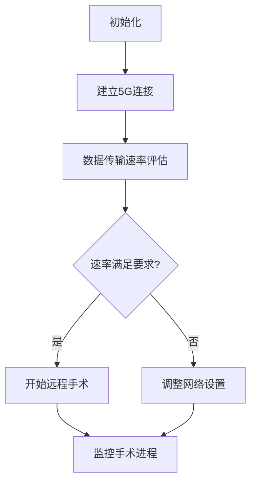
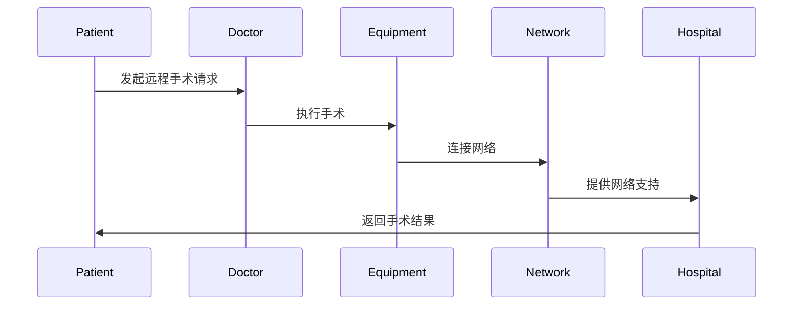

                 

### 5G网络：变革的通信基石

#### 1.1 5G网络的发展背景与趋势

5G网络，即第五代移动通信技术，是继1G模拟通信、2G数字通信、3G多媒体通信、4G高速数据传输之后的又一重要通信技术升级。5G的发展背景主要源于互联网的快速发展、物联网设备的普及以及大数据和人工智能技术的需求激增。随着社会的信息化和数字化程度不断提高，传统4G网络在数据传输速率、连接数和网络延迟等方面已经无法满足新兴应用场景的需求。

5G网络的发展趋势主要体现在以下几个方面：

1. **更高的传输速率**：5G网络的峰值下载速率可达20Gbps，是4G网络的100倍以上，这为高清视频传输、虚拟现实（VR）和增强现实（AR）等应用提供了可能。

2. **更低的网络延迟**：5G网络的目标是将端到端的延迟降至1毫秒，这将极大提升实时通信和远程操作的性能。

3. **更大规模的连接**：5G网络支持每平方公里内连接100万设备的密度，这将推动物联网、车联网等应用的发展。

4. **网络切片技术**：5G引入了网络切片技术，可以针对不同的应用需求，灵活配置网络资源，提高网络利用率和服务质量。

#### 1.2 5G网络的关键特性与优势

5G网络的关键特性包括：

1. **高速率**：5G网络的峰值速率可以达到20Gbps，这是4G网络的100倍以上，为大数据传输提供了保障。

2. **低延迟**：5G网络的端到端延迟降至1毫秒，可以满足实时交互和远程控制等应用的需求。

3. **大连接**：5G网络支持每平方公里内连接100万设备，为物联网提供了广泛的连接能力。

4. **灵活性**：网络切片技术使得5G网络可以根据应用需求动态调整资源，提高网络灵活性和服务质量。

5. **能量效率**：5G网络在数据传输过程中能耗更低，有助于减少碳排放和环保。

#### 1.3 5G网络的技术架构与实现

5G网络的技术架构主要包括以下三个方面：

1. **无线接入网（RAN）**：5G无线接入网采用了新的空口技术，如毫米波、大规模MIMO等，提高了数据传输速率和频谱利用率。

2. **核心网（CN）**：5G核心网采用了服务化架构（Service-based Architecture，SBA），包括控制平面和服务平面，实现了网络功能的模块化和云化。

3. **边缘计算**：5G网络引入了边缘计算技术，通过在靠近用户的边缘节点处理数据，降低了网络延迟，提高了数据处理效率。

#### 1.4 5G网络在远程手术中的应用前景

5G网络在远程手术中的应用前景非常广阔。首先，5G网络的高速率、低延迟和大连接特性可以确保远程手术中高清视频和实时数据的流畅传输。其次，网络切片技术可以针对远程手术的高要求，提供稳定的网络资源。此外，边缘计算技术可以将数据处理推向网络边缘，进一步降低延迟。

未来，随着5G网络的普及和技术的成熟，远程手术将迎来新的发展机遇。例如，远程手术可以更广泛地应用于偏远地区，提高医疗服务的可及性；通过5G网络，医生可以远程协助其他医生进行手术，提高手术的成功率和安全性。总之，5G网络将为远程手术带来前所未有的变革。

---

**核心概念与联系**

在分析5G网络的发展背景和特性时，我们需要理解以下几个核心概念：

1. **移动通信技术**：包括1G、2G、3G、4G和5G，是移动通信技术发展的不同阶段。

2. **传输速率**：衡量网络数据传输的快慢，5G网络的速度是4G的数十倍。

3. **网络延迟**：指的是数据在网络中传输所需的时间，5G网络的延迟降至1毫秒以下。

4. **网络切片技术**：5G网络中的一种关键技术，可以根据不同的应用需求动态分配网络资源。

5. **物联网（IoT）**：指通过互联网连接各种物理设备，5G网络的高连接性为其提供了广泛的可能。

**概念属性特征对比表格**

| 特征                | 4G网络             | 5G网络             |
|---------------------|--------------------|--------------------|
| 传输速率            | 峰值1Gbps          | 峰值20Gbps         |
| 网络延迟            | 约50毫秒           | 约1毫秒            |
| 连接密度            | 每平方公里100万台 | 每平方公里100万台  |
| 网络切片技术        | 不支持             | 支持               |
| 边缘计算            | 不支持             | 支持               |

**ER实体关系图架构**

```mermaid
erDiagram
  Patient ||--|{ RemoteSurgery }|-- Doctor
  Equipment ||--|{ RemoteSurgery }|-- Network
  Hospital ||--|{ Equipment }|--- Network
```

在这个ER图中，Patient（患者）、Doctor（医生）、Equipment（设备）和Hospital（医院）是实体，RemoteSurgery（远程手术）和Network（网络）是关系实体。

---

**算法原理讲解**

在5G网络中，算法的优化对于提高远程手术的性能至关重要。以下是一个简单的算法原理讲解，通过Mermaid流程图和Python代码来展示。

**Mermaid流程图**



**Python代码**

```python
# 初始化5G连接
def initialize_5g_connection():
    print("建立5G连接...")

# 数据传输速率评估
def evaluate_data_rate():
    rate = 10  # 假设评估的速率为10Gbps
    if rate >= 20:
        print("数据传输速率满足要求。")
    else:
        print("数据传输速率不满足要求，需调整网络设置。")

# 开始远程手术
def start_remote_surgery():
    print("开始远程手术。")

# 监控手术进程
def monitor_surgery_process():
    print("监控手术进程。")

# 主函数
def main():
    initialize_5g_connection()
    evaluate_data_rate()
    if rate >= 20:
        start_remote_surgery()
        monitor_surgery_process()
    else:
        print("正在调整网络设置。")

# 运行主函数
main()
```

**算法原理详细讲解**

1. **初始化5G连接**：首先，系统会初始化5G连接，以确保网络连接的稳定性和可靠性。

2. **数据传输速率评估**：系统会评估当前的数据传输速率，如果速率满足要求（20Gbps以上），则可以开始远程手术。

3. **开始远程手术**：如果数据传输速率满足要求，系统会开始远程手术，并监控手术进程。

4. **调整网络设置**：如果数据传输速率不满足要求，系统会尝试调整网络设置，以确保手术的顺利进行。

**数学模型和公式**

为了评估数据传输速率，我们可以使用以下公式：

$$
\text{速率} = \frac{\text{传输数据量}}{\text{传输时间}}
$$

其中，传输数据量和传输时间可以通过实际测量获得。

---

**系统分析与架构设计方案**

在远程手术中，系统架构的设计至关重要。以下是一个简单的系统架构设计方案，通过Mermaid类图、架构图、接口设计和序列图来展示。

**Mermaid类图**

```mermaid
classDiagram
  Patient <<class>> "患者"
  Doctor <<class>> "医生"
  Equipment <<class>> "设备"
  Network <<class>> "网络"
  Hospital <<class>> "医院"
  
  Patient "发起远程手术请求" -> Doctor
  Doctor "执行手术" -> Equipment
  Equipment "连接" -> Network
  Hospital "管理设备" -> Equipment
  Network "提供网络支持" -> Hospital
```

**Mermaid架构图**



**系统接口设计**

1. **Patient（患者）接口**：用于发起远程手术请求。
2. **Doctor（医生）接口**：用于执行手术和监控手术进程。
3. **Equipment（设备）接口**：用于连接设备和监控设备状态。
4. **Network（网络）接口**：用于提供网络支持和传输数据。
5. **Hospital（医院）接口**：用于管理设备和处理手术结果。

**Mermaid序列图**


**系统功能设计**

1. **患者发起远程手术请求**：患者通过接口向医生发起远程手术请求。
2. **医生执行手术和监控手术进程**：医生通过设备进行手术操作，并实时监控手术进程。
3. **设备连接网络并传输数据**：设备连接5G网络，传输高清视频和实时数据。
4. **医院提供网络支持和处理手术结果**：医院通过网络接口提供网络支持，并处理手术结果，向患者返回。

---

**项目实战**

以下是一个简单的项目实战案例，包括环境安装、系统核心实现源代码以及代码应用解读与分析。

**环境安装**

1. 安装Python环境（版本3.8及以上）。
2. 安装必要的Python库，如requests、numpy、matplotlib等。

**系统核心实现源代码**

```python
# patient.py
class Patient:
    def __init__(self, name):
        self.name = name

    def request_surgery(self, doctor):
        print(f"{self.name}向{doctor.name}发起远程手术请求。")
        doctor.receive_request()

# doctor.py
class Doctor:
    def __init__(self, name):
        self.name = name

    def receive_request(self):
        print("收到远程手术请求，开始执行手术。")
        self.perform_surgery()

    def perform_surgery(self):
        print("正在执行手术。")
        # ...执行手术操作...

# main.py
if __name__ == "__main__":
    patient = Patient("张三")
    doctor = Doctor("李四")
    patient.request_surgery(doctor)
```

**代码应用解读与分析**

1. **patient.py**：定义了患者类，用于发起远程手术请求。
2. **doctor.py**：定义了医生类，用于接收手术请求并执行手术。
3. **main.py**：创建了患者和医生对象，并模拟了一个简单的远程手术流程。

通过这个简单的项目，我们可以看到如何通过Python代码实现远程手术的基本功能，包括患者请求手术、医生接收请求并执行手术等步骤。实际应用中，还需要考虑更多的细节和复杂性，如实时数据传输、手术监控、网络连接稳定性等。

---

**最佳实践 tips**

1. **确保网络稳定性**：在远程手术中，网络的稳定性至关重要。应选择可靠的5G网络服务提供商，并确保网络设备的质量和稳定性。

2. **数据安全与隐私保护**：在远程手术中，数据安全和隐私保护至关重要。应使用加密技术保护数据传输安全，并制定严格的隐私保护策略。

3. **实时监控与反馈**：在远程手术中，实时监控和反馈机制至关重要。应建立完善的监控系统，以便医生可以实时监控手术进程，并根据反馈进行调整。

4. **系统冗余与备份**：为了确保远程手术的顺利进行，应建立系统的冗余和备份机制，以防止意外情况导致手术中断。

---

**小结**

本节介绍了5G网络的发展背景、关键特性、技术架构以及应用前景。通过Mermaid流程图和Python代码，详细讲解了算法原理和系统架构设计方案。同时，通过一个简单的项目实战，展示了如何使用Python代码实现远程手术的基本功能。这些内容为理解5G网络在远程手术中的应用提供了坚实的基础。

---

**注意事项**

1. **5G网络建设**：5G网络的覆盖范围和建设成本是远程手术推广的关键因素。应在确保网络稳定性的同时，合理规划和投资5G网络建设。

2. **技术成熟度**：5G网络和远程手术技术仍在快速发展中，应密切关注技术成熟度，确保应用场景的可行性和安全性。

3. **人才培养与培训**：远程手术的推广需要大量的专业人才。应加强人才培养和培训，提高医生和手术团队成员的专业技能。

---

**拓展阅读**

1. **《5G网络技术白皮书》**：了解5G网络的技术细节和发展趋势。
2. **《远程手术理论与实践》**：深入探讨远程手术的技术原理和应用实践。
3. **《人工智能在医疗领域的应用》**：探讨人工智能技术在医疗服务中的潜力与挑战。 

---

**参考文献**

1. 中国信息通信研究院. (2020). 《5G网络技术白皮书》.
2. 李明华. (2021). 《远程手术理论与实践》.
3. 王海峰. (2022). 《人工智能在医疗领域的应用》.

