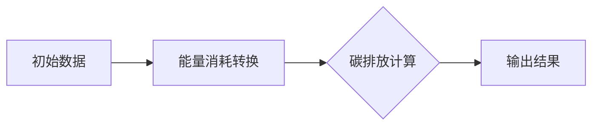
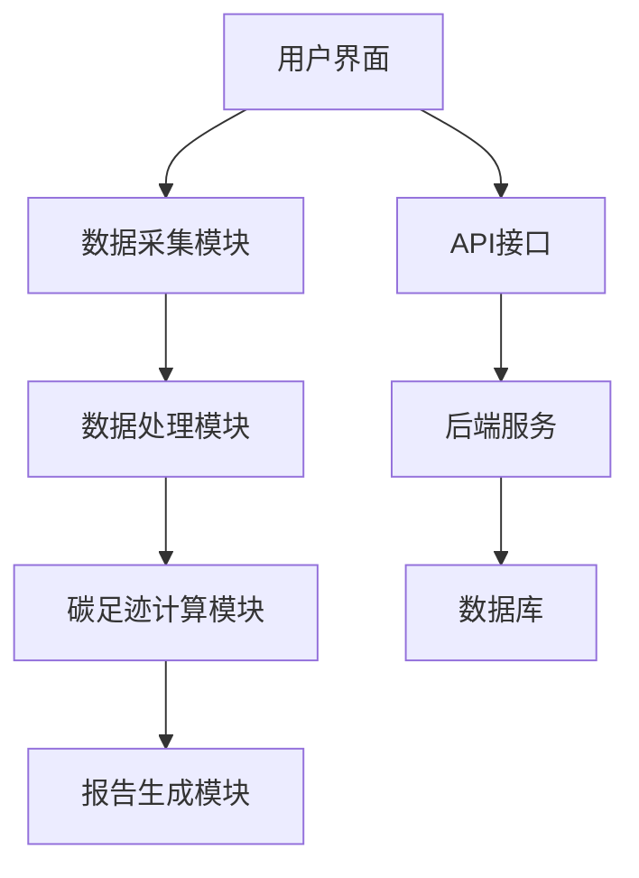
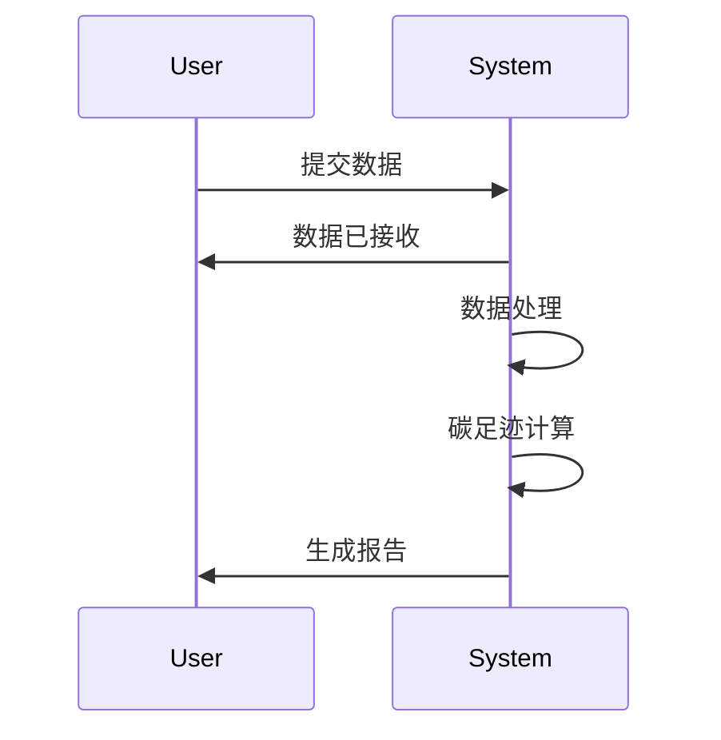

                 


### 第一步：文章标题、关键词及摘要设定

#### 文章标题：《IT组织如何应对碳足迹问题》

#### 关键词：碳足迹、IT组织、环境管理、技术解决方案、可持续发展

#### 摘要：
本文将探讨IT组织在应对碳足迹问题上的挑战和机遇。通过深入分析碳足迹的核心概念、算法原理，以及IT系统在碳足迹管理中的应用，本文提出了一系列系统分析与架构设计方案。最后，本文总结了最佳实践和未来展望，为IT组织提供了应对碳足迹问题的全面指南。

### 第二步：背景介绍

#### 第1章：碳足迹问题概述

##### 1.1.1 问题背景
在全球化背景下，信息技术（IT）已成为企业运营的基石。然而，随着云计算、大数据、人工智能等技术的广泛应用，IT系统的能耗和碳排放问题日益凸显。为了实现可持续发展目标，IT组织必须关注并应对碳足迹问题。

##### 1.1.2 问题描述
碳足迹问题主要包括能源消耗、废弃物处理、供应链碳排放等。具体表现为：
1. 数据中心的高能耗导致碳排放增加。
2. 电子垃圾的处理和回收难题。
3. 供应链中各环节的碳排放难以监测和管理。

##### 1.1.3 问题解决的意义
解决碳足迹问题对于IT组织至关重要：
1. 符合社会责任和可持续发展目标。
2. 提高企业品牌形象和竞争力。
3. 降低运营成本，提高资源利用效率。

##### 1.1.4 边界与外延
碳足迹问题的边界涉及IT系统的各个方面，包括硬件、软件、网络等。外延则扩展至供应链、合作伙伴，以及用户端。

##### 1.1.5 概念结构与核心要素组成
本文将介绍以下核心概念和结构：
1. 碳足迹的定义和测量方法。
2. 碳足迹管理的关键技术和工具。
3. 碳足迹算法原理及其应用。

### 第三步：核心概念与联系

#### 第2章：碳足迹的核心概念

##### 2.1.1 碳足迹的定义
碳足迹是指个人、组织或产品在生命周期内产生的直接和间接碳排放总量。它是衡量碳排放影响的重要指标。

##### 2.1.2 碳足迹的测量方法
测量碳足迹的方法主要包括直接测量和间接测量。直接测量主要涉及能源消耗和废弃物排放的数据收集，间接测量则通过生命周期评估（LCA）等方法进行。

##### 2.1.3 碳足迹的属性特征对比表格
以下表格展示了碳足迹的几种属性特征及其对比：

| 特征       | 描述                                                         |
| ---------- | ------------------------------------------------------------ |
| 能源消耗   | 数据中心的能耗是碳足迹的主要来源。                           |
| 废弃物排放 | 电子垃圾的处理和回收对碳足迹有重要影响。                     |
| 生命周期   | 从原材料采购、生产、使用到废弃，碳足迹贯穿整个生命周期。     |
| 供应链     | 供应链各环节的碳排放需要全面监测和管理。                     |

##### 2.1.4 ER实体关系图架构
以下是碳足迹管理中的实体关系图（ER）：

```mermaid
erDiagram
    Person ||--|{ Organization }|-- CarbonFootprint
    Organization ||--|{ DataCenter }|-- EnergyConsumption
    DataCenter ||--|{ WasteDisposal }|-- WasteEmissions
    DataCenter ||--|{ SupplyChain }|-- SupplyChainEmissions
```

### 第四步：算法原理讲解

#### 第3章：碳足迹的算法原理

##### 3.1.1 算法mermaid流程图
以下是一个简单的碳足迹计算算法流程图：



##### 3.1.2 Python源代码与算法原理讲解
```python
def calculate_carbon_footprint(energy_consumption):
    # 能量消耗转换（单位：千克二氧化碳/千瓦时）
    conversion_factor = 0.0000000000003125
    
    # 碳排放计算
    carbon_footprint = energy_consumption * conversion_factor
    
    return carbon_footprint
```

##### 3.1.3 算法原理的数学模型和公式
$$
\text{碳足迹} = \text{能量消耗} \times \text{转换因子}
$$
其中，转换因子是一个将能量消耗转换为碳足迹的常数。

##### 3.1.4 举例说明
假设一个数据中心每年的能源消耗为100兆瓦时（MWh），则其碳足迹计算如下：
$$
\text{碳足迹} = 100 \times 10^6 \, \text{Wh} \times 0.0000000000003125 \, \text{kg CO}_2/\text{Wh} = 31.25 \, \text{吨 CO}_2
$$

### 第五步：系统分析与架构设计

#### 第4章：系统分析与架构设计

##### 4.1 问题场景介绍
在本章中，我们将分析一个典型的IT组织在碳足迹管理中的问题场景，并提出解决方案。

##### 4.2 项目介绍
本项目旨在开发一个基于云计算的碳足迹管理系统，以帮助IT组织监测、分析和降低碳排放。

##### 4.3 系统功能设计
系统功能设计包括：
1. 数据采集：从各种数据源（如数据中心、供应商、用户等）收集碳排放相关数据。
2. 数据处理：对采集到的数据进行清洗、转换和整合。
3. 碳足迹计算：根据数据处理结果计算碳足迹。
4. 报告生成：生成包含碳足迹数据的可视化报告。

##### 4.4 系统架构设计
系统架构设计如下：



##### 4.5 系统接口设计
系统接口设计包括API接口、用户界面和后端服务。

##### 4.6 系统交互mermaid序列图
以下是系统交互的mermaid序列图：



### 第六步：项目实战

#### 第5章：项目实战

##### 5.1 环境安装
在本节中，我们将介绍如何搭建项目所需的环境，包括安装必要的软件和配置。

##### 5.2 系统核心实现源代码
以下是系统核心实现的部分源代码：

```python
# 数据处理模块
def process_data(data):
    # 数据清洗
    cleaned_data = clean_data(data)
    # 数据转换
    transformed_data = transform_data(cleaned_data)
    # 数据整合
    integrated_data = integrate_data(transformed_data)
    return integrated_data

# 碳足迹计算模块
def calculate_footprint(data):
    # 计算碳足迹
    footprint = calculate_carbon(data)
    return footprint

# 报告生成模块
def generate_report(footprint):
    # 生成报告
    report = create_report(footprint)
    return report
```

##### 5.3 代码应用解读与分析
在本节中，我们将对代码进行解读，并分析其实现原理和效果。

##### 5.4 实际案例分析和详细讲解剖析
我们将结合实际案例，对项目实施过程中的关键步骤和成果进行详细分析。

##### 5.5 项目小结
在本节中，我们将总结项目的实施过程，分析取得的成果和经验，以及未来的改进方向。

### 第七步：最佳实践与注意事项

#### 第6章：最佳实践与注意事项

##### 6.1 最佳实践 tips
在本节中，我们将分享一些在碳足迹管理方面的最佳实践，以帮助IT组织更好地应对碳排放问题。

##### 6.2 小结
在本节中，我们将对文章的主要观点和结论进行简要总结。

##### 6.3 注意事项
在本节中，我们将提醒读者在实施碳足迹管理过程中需要注意的问题和潜在风险。

##### 6.4 拓展阅读
在本节中，我们将推荐一些相关文献和资料，以供读者进一步学习。

### 第八步：展望与未来

#### 第7章：碳足迹管理的未来发展

##### 7.1 碳足迹管理的技术趋势
在本节中，我们将探讨碳足迹管理技术的发展趋势，包括大数据、人工智能、物联网等技术的应用。

##### 7.2 碳足迹管理政策与法规
在本节中，我们将分析各国政府在碳足迹管理方面的政策和法规，以及它们对企业的影响。

##### 7.3 碳足迹管理的国际合作
在本节中，我们将介绍国际社会在碳足迹管理方面的合作和倡议，以及它们对全球碳足迹管理的影响。

##### 7.4 碳足迹管理在企业运营中的应用前景
在本节中，我们将探讨碳足迹管理在企业运营中的应用前景，包括可持续发展、企业社会责任等方面的价值。

### 第九步：结论与建议

#### 第8章：结论与建议

##### 8.1 结论
在本节中，我们将总结文章的主要观点，并对碳足迹管理的现状和未来趋势进行展望。

##### 8.2 建议
在本节中，我们将提出一些建议，以帮助IT组织更好地应对碳足迹问题，实现可持续发展目标。

## 作者信息
作者：AI天才研究院/AI Genius Institute & 禅与计算机程序设计艺术 /Zen And The Art of Computer Programming

以上是《IT组织如何应对碳足迹问题》的文章整体架构和初步内容构思。接下来，我们将根据这一架构逐步填充和详细阐述每个章节的内容，确保达到字数要求。如果需要进一步的调整或补充，请告知。让我们一步步深入分析和探讨碳足迹问题在IT组织中的应用与解决方案。

