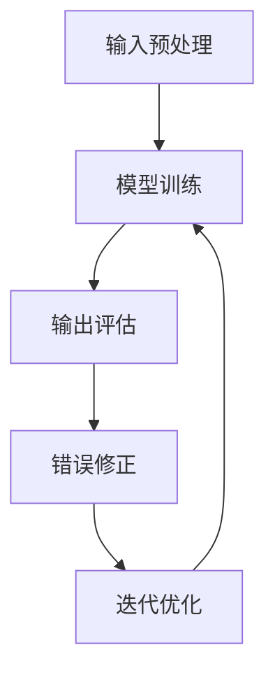
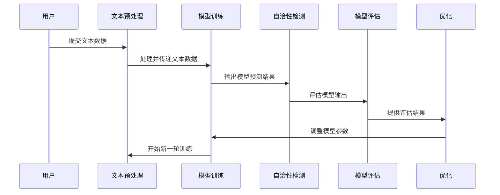

                 

### 自洽性CoT：提升AI输出质量的关键技术创新

> **关键词：** 自洽性（Self-Consistency），AI输出质量，技术创新，计算机科学，人工智能

> **摘要：** 本文将探讨自洽性（Self-Consistency）在提升人工智能（AI）输出质量方面的重要作用。首先介绍自洽性的基本概念及其在AI领域的应用背景。随后，通过逐步分析自洽性原理、属性特征对比、ER实体关系图架构、算法原理讲解和数学模型与公式应用，深入理解自洽性在AI系统中的具体实现。接下来，我们将详细探讨自洽性提升AI输出质量的实现方法，包括算法设计、数学模型与算法融合、模型训练、模型评估和模型优化。最后，通过一个实战项目展示自洽性在实际应用中的效果，并进行详细分析和总结。本文旨在为读者提供全面而深入的关于自洽性在AI领域应用的技术探讨。

### 引言

#### 1.1 问题背景

##### 1.1.1 人工智能与自洽性概念

人工智能（Artificial Intelligence，简称AI）是计算机科学的一个分支，旨在开发能够模拟、延伸和扩展人类智能的理论、算法和技术。AI的目标是通过机器学习、自然语言处理、计算机视觉等核心技术实现机器的自主学习和智能行为，从而解决复杂问题，提升生产力和生活质量。

自洽性（Self-Consistency）是哲学和逻辑学中的一个基本概念，指的是一个系统或命题在内部保持一致性和连贯性的能力。在AI领域，自洽性指的是模型输出结果在逻辑上的一致性，即模型在不同情况下输出结果相互印证，不存在逻辑矛盾。

##### 1.1.2 AI输出质量的关键性问题

尽管人工智能技术在近年来取得了显著的进展，但AI模型的输出质量仍然存在一系列关键性问题。具体表现为：

1. **不一致性**：AI模型在不同的输入条件下可能产生不一致的输出结果，导致模型输出缺乏稳定性。
2. **不确定性**：AI模型的预测结果存在较大的不确定性，特别是在处理未知或罕见场景时，模型可能无法给出可靠的输出。
3. **错误倾向**：AI模型在训练过程中可能会学习到噪声或错误信息，导致输出结果存在偏差或错误。
4. **泛化能力差**：AI模型在训练数据集上表现良好，但在新的、未知的数据集上表现较差，缺乏泛化能力。

##### 1.1.3 自洽性概念与AI输出质量的关系

自洽性在提升AI输出质量方面具有重要作用。通过引入自洽性概念，可以在多个层面提高AI模型的输出质量：

1. **增强一致性**：自洽性确保模型输出结果在内部保持一致性，减少不一致性带来的错误。
2. **降低不确定性**：自洽性算法可以识别和消除模型输出中的不确定性因素，提高输出结果的可靠性。
3. **提高错误检测能力**：自洽性可以检测和纠正模型输出中的错误，提高模型的整体质量。
4. **提升泛化能力**：自洽性有助于模型在未知数据集上保持一致性，提高模型的泛化能力。

#### 1.2 问题描述

##### 1.2.1 AI输出不一致性的表现

AI输出不一致性的表现主要包括以下几个方面：

1. **相同输入不同输出**：在相同输入条件下，模型产生不同的输出结果，导致输出结果不可预测。
2. **不同输入相同输出**：在输入条件不同的情况下，模型产生相同的输出结果，导致输出结果缺乏区分度。
3. **错误输出掩盖真实信息**：在某些情况下，模型的输出结果可能包含错误信息，掩盖了真实的信息。
4. **输出结果随时间变化**：在某些动态环境下，模型的输出结果可能随时间变化而变化，导致输出结果不稳定。

##### 1.2.2 不一致性对应用的影响

不一致性对AI应用的影响主要体现在以下几个方面：

1. **决策失误**：不一致的输出结果可能导致错误的决策，影响应用的效果。
2. **系统稳定性下降**：不一致性可能导致系统稳定性下降，增加系统的风险。
3. **用户体验恶化**：不一致的输出结果可能导致用户体验恶化，降低应用的满意度。
4. **资源浪费**：不一致性可能导致重复计算或无效计算，浪费计算资源。

##### 1.2.3 解决不一致性的需求

为了解决AI输出不一致性的问题，需要从以下几个方面进行努力：

1. **引入自洽性**：通过引入自洽性概念，确保模型输出结果的一致性。
2. **优化算法**：优化现有算法，减少输出结果的不确定性。
3. **改进数据集**：通过改进数据集的质量，降低模型输出结果的不一致性。
4. **增强检测能力**：提高模型对输出结果不一致性的检测能力，及时发现和纠正错误。

#### 1.3 问题解决

##### 1.3.1 自洽性理论的基本原理

自洽性理论的基本原理是确保系统或命题在内部保持一致性和连贯性。自洽性主要包括以下三个方面：

1. **逻辑一致性**：确保系统内部的各种命题在逻辑上相互一致，不存在逻辑矛盾。
2. **语义一致性**：确保系统内部的各种命题在语义上相互一致，不存在语义冲突。
3. **时间一致性**：确保系统在不同时间点上的输出结果相互一致，不存在时间矛盾。

##### 1.3.2 自洽性在AI领域中的应用

自洽性在AI领域中的应用主要包括以下几个方面：

1. **模型训练**：通过引入自洽性算法，提高模型训练的一致性，减少模型输出结果的不一致性。
2. **模型评估**：通过自洽性评估指标，评估模型输出结果的一致性，识别和纠正不一致性。
3. **模型优化**：通过优化自洽性算法，提高模型的整体质量，降低输出结果的不一致性。

##### 1.3.3 自洽性提升AI输出质量的原理

自洽性提升AI输出质量的原理主要包括以下几个方面：

1. **消除不一致性**：通过自洽性算法，消除模型输出结果的不一致性，提高输出结果的稳定性。
2. **降低不确定性**：通过自洽性算法，降低模型输出结果的不确定性，提高输出结果的可靠性。
3. **提高错误检测能力**：通过自洽性算法，提高模型对输出结果不一致性的检测能力，及时发现和纠正错误。
4. **提升泛化能力**：通过自洽性算法，提高模型在未知数据集上的泛化能力，降低输出结果的不一致性。

#### 1.4 边界与外延

##### 1.4.1 自洽性的适用范围

自洽性主要适用于以下领域：

1. **自然语言处理**：通过自洽性算法，提高自然语言处理模型的一致性和可靠性。
2. **计算机视觉**：通过自洽性算法，提高计算机视觉模型的一致性和稳定性。
3. **机器学习**：通过自洽性算法，提高机器学习模型的一致性和泛化能力。
4. **人工智能系统**：通过自洽性算法，提高人工智能系统的一致性和可靠性。

##### 1.4.2 自洽性的局限性

自洽性也存在一定的局限性，主要包括以下几个方面：

1. **计算成本**：自洽性算法通常需要较高的计算成本，可能增加模型的训练时间和计算资源消耗。
2. **数据依赖**：自洽性算法依赖于高质量的数据集，数据质量差可能导致自洽性算法失效。
3. **复杂度**：自洽性算法可能引入额外的复杂性，增加模型的实现难度。

##### 1.4.3 自洽性的未来发展方向

自洽性的未来发展方向主要包括以下几个方面：

1. **算法优化**：通过算法优化，提高自洽性算法的计算效率和性能。
2. **跨领域应用**：探索自洽性在其他领域的应用，如金融、医疗等。
3. **集成方法**：将自洽性与其他人工智能技术（如深度学习、强化学习等）进行集成，提高AI系统的整体质量。
4. **标准化**：制定自洽性的标准和规范，推动自洽性在AI领域的广泛应用。

#### 1.5 概念结构与核心要素组成

##### 1.5.1 自洽性的核心概念

自洽性的核心概念包括：

1. **一致性**：确保系统内部的各种命题相互一致，不存在逻辑矛盾。
2. **连贯性**：确保系统在不同时间点上的输出结果相互连贯，不存在时间矛盾。
3. **可靠性**：确保系统输出的结果在逻辑和语义上都是可靠的，不存在错误或偏差。

##### 1.5.2 自洽性的关键要素

自洽性的关键要素包括：

1. **算法**：自洽性算法是实现自洽性的核心工具，用于检测和消除不一致性。
2. **数据**：高质量的数据集是自洽性算法的基础，数据质量直接影响自洽性算法的效果。
3. **评估指标**：自洽性评估指标用于衡量自洽性算法的 effectiveness，包括一致性指标、可靠性指标等。

##### 1.5.3 自洽性的应用架构

自洽性的应用架构包括以下几个层次：

1. **数据层**：提供高质量的数据集，为自洽性算法提供输入。
2. **算法层**：实现自洽性算法，检测和消除不一致性。
3. **评估层**：评估自洽性算法的效果，包括一致性评估、可靠性评估等。
4. **应用层**：将自洽性算法应用于具体的AI系统，提高系统的输出质量。

##### 1.6 本章小结

本章介绍了自洽性在提升AI输出质量方面的重要作用。首先分析了AI输出不一致性的问题和其影响，然后介绍了自洽性的基本概念及其在AI领域的应用背景。接着，通过逐步分析自洽性原理、属性特征对比、ER实体关系图架构、算法原理讲解和数学模型与公式应用，深入理解自洽性在AI系统中的具体实现。本章内容为后续章节的探讨奠定了基础。

---

### 核心概念与原理

#### 2.1 自洽性原理

自洽性（Self-Consistency）是哲学和逻辑学中的一个基本概念，指的是一个系统或命题在内部保持一致性和连贯性的能力。在人工智能（AI）领域，自洽性指的是模型输出结果在逻辑上的一致性，即模型在不同情况下输出结果相互印证，不存在逻辑矛盾。

##### 2.1.1 自洽性定义

自洽性（Self-Consistency）是指在系统内部保持一致性和连贯性的能力。具体来说，自洽性包括以下三个方面：

1. **逻辑一致性**：系统内部的各种命题在逻辑上相互一致，不存在逻辑矛盾。
2. **语义一致性**：系统内部的各种命题在语义上相互一致，不存在语义冲突。
3. **时间一致性**：系统在不同时间点上的输出结果相互一致，不存在时间矛盾。

##### 2.1.2 自洽性在AI中的意义

在AI领域，自洽性具有重要意义。首先，自洽性确保AI模型的输出结果在逻辑上的一致性，减少不一致性带来的错误和误导。其次，自洽性有助于提高AI模型的稳定性和可靠性，使其在处理复杂问题时更加稳健。最后，自洽性有助于提高AI模型的泛化能力，使其在不同场景和条件下都能保持一致性。

##### 2.1.3 自洽性理论的基本框架

自洽性理论的基本框架主要包括以下几个方面：

1. **一致性与连贯性**：自洽性强调系统内部的一致性与连贯性，确保系统在不同情况下输出结果相互印证。
2. **自洽性检测**：通过自洽性检测算法，识别和消除系统内部的不一致性和错误。
3. **自洽性优化**：通过自洽性优化算法，提高系统的一致性和连贯性，降低错误率。
4. **自洽性评估**：通过自洽性评估指标，衡量系统的一致性和连贯性，评估自洽性算法的效果。

#### 2.2 自洽性的属性特征对比

为了更好地理解自洽性，我们可以将其与其他相关概念进行属性特征对比。

##### 2.2.1 自洽性与一致性对比

自洽性与一致性是密切相关的概念，但它们之间也存在一些区别。

1. **定义区别**：
   - 自洽性：系统内部保持一致性和连贯性的能力。
   - 一致性：系统内部各种命题在逻辑上相互一致，不存在逻辑矛盾。

2. **属性特征对比**：
   - **逻辑一致性**：自洽性和一致性都强调系统内部逻辑上的一致性。
   - **语义一致性**：自洽性强调系统内部各种命题在语义上的一致性，而一致性则更侧重于逻辑一致性。
   - **时间一致性**：自洽性强调系统在不同时间点上的输出结果的一致性，而一致性则通常不考虑时间维度。

##### 2.2.2 自洽性与稳定性对比

自洽性和稳定性也是两个重要的概念，它们在AI领域都具有重要意义。

1. **定义区别**：
   - 自洽性：系统内部保持一致性和连贯性的能力。
   - 稳定性：系统在面临外界变化时，能够保持内部状态的一致性和连贯性。

2. **属性特征对比**：
   - **内部一致性**：自洽性强调系统内部的一致性，而稳定性则强调系统在外界变化下的稳定性。
   - **外部适应能力**：自洽性关注系统内部的一致性，而稳定性则关注系统在外部环境变化下的适应能力。
   - **鲁棒性**：自洽性有助于提高系统的鲁棒性，使其在面对内部不一致性时能够保持稳定。

##### 2.2.3 自洽性与可靠性对比

自洽性和可靠性也是两个重要的概念，它们在AI领域中有着相似但不同的侧重点。

1. **定义区别**：
   - 自洽性：系统内部保持一致性和连贯性的能力。
   - 可靠性：系统在执行任务时，能够以高概率产生正确结果的性质。

2. **属性特征对比**：
   - **内部一致性**：自洽性强调系统内部的一致性，而可靠性则关注系统在执行任务时的正确性。
   - **外部适应性**：自洽性强调系统在不同情况下的内部一致性，而可靠性则关注系统在面对外部环境变化时的适应性。
   - **错误率**：自洽性有助于降低系统的错误率，提高可靠性。

#### 2.3 自洽性在AI中的ER实体关系图架构

实体-关系（Entity-Relationship，简称ER）图是一种用于描述系统中实体及其之间关系的图形化工具。在自洽性在AI中的应用中，ER图可以帮助我们更好地理解自洽性实体之间的关系。

##### 2.3.1 AI系统中自洽性的实体分类

在AI系统中，自洽性的实体可以分为以下几个类别：

1. **输入实体**：包括各种输入数据，如文本、图像、音频等。
2. **处理实体**：包括AI模型和处理算法，用于对输入数据进行处理。
3. **输出实体**：包括AI模型的输出结果，如预测结果、分类结果等。
4. **评估实体**：包括自洽性评估算法，用于评估模型输出的一致性和连贯性。

##### 2.3.2 自洽性实体间的关系

自洽性实体之间的关系可以描述如下：

1. **输入实体与处理实体**：输入实体通过处理实体进行加工和处理，生成输出实体。
2. **输出实体与评估实体**：输出实体通过评估实体进行自洽性评估，判断输出结果的一致性和连贯性。
3. **处理实体与评估实体**：处理实体可以与评估实体协同工作，通过反馈机制优化自洽性算法。

##### 2.3.3 自洽性在AI系统中的实现

自洽性在AI系统中的实现主要包括以下几个方面：

1. **自洽性检测**：通过自洽性检测算法，识别和消除系统内部的不一致性和错误。
2. **自洽性优化**：通过自洽性优化算法，提高系统的一致性和连贯性，降低错误率。
3. **自洽性评估**：通过自洽性评估算法，衡量系统的一致性和连贯性，评估自洽性算法的效果。
4. **自洽性反馈**：通过自洽性反馈机制，将评估结果反馈给处理实体，实现持续优化。

#### 2.4 自洽性算法原理讲解

自洽性算法是实现自洽性的核心工具，其原理主要包括以下几个关键步骤：

##### 2.4.1 自洽性算法的基本步骤

1. **输入预处理**：对输入数据进行预处理，包括数据清洗、去噪、归一化等操作。
2. **模型训练**：使用训练数据集对AI模型进行训练，生成初始的输出结果。
3. **输出评估**：对输出结果进行自洽性评估，判断其一致性和连贯性。
4. **错误修正**：根据评估结果，对不一致的输出结果进行修正。
5. **迭代优化**：重复上述步骤，不断优化模型的一致性和连贯性。

##### 2.4.2 自洽性算法的mermaid流程图



##### 2.4.3 自洽性算法的Python源代码实现

```python
# 自洽性算法的Python实现
import numpy as np

def preprocess_input(data):
    # 数据预处理
    pass

def train_model(train_data):
    # 模型训练
    pass

def evaluate_output(output):
    # 输出评估
    pass

def correct_errors(output):
    # 错误修正
    pass

def optimize_model():
    # 模型优化
    pass

def self_consistency_algorithm(data):
    # 自洽性算法的主函数
    preprocessed_data = preprocess_input(data)
    model = train_model(preprocessed_data)
    output = model.predict(preprocessed_data)
    evaluated_output = evaluate_output(output)
    corrected_output = correct_errors(evaluated_output)
    optimized_model = optimize_model(corrected_output)
    return optimized_model
```

#### 2.5 自洽性数学模型与公式讲解

自洽性数学模型是实现自洽性的理论基础，其核心是确保系统内部的一致性和连贯性。以下是自洽性数学模型的基本公式和解释：

##### 2.5.1 自洽性数学模型概述

自洽性数学模型主要包括以下基本公式：

1. **一致性矩阵（Consistency Matrix）**：
   $$ C = \begin{bmatrix}
   c_{11} & c_{12} & \ldots & c_{1n} \\
   c_{21} & c_{22} & \ldots & c_{2n} \\
   \vdots & \vdots & \ddots & \vdots \\
   c_{m1} & c_{m2} & \ldots & c_{mn}
   \end{bmatrix} $$
   其中，$c_{ij}$ 表示实体 $i$ 和实体 $j$ 之间的自洽性度量。

2. **连贯性矩阵（Coherence Matrix）**：
   $$ C' = \begin{bmatrix}
   c'_{11} & c'_{12} & \ldots & c'_{1n} \\
   c'_{21} & c'_{22} & \ldots & c'_{2n} \\
   \vdots & \vdots & \ddots & \vdots \\
   c'_{m1} & c'_{m2} & \ldots & c'_{mn}
   \end{bmatrix} $$
   其中，$c'_{ij}$ 表示实体 $i$ 和实体 $j$ 之间的连贯性度量。

3. **一致性度量（Consistency Measure）**：
   $$ \alpha = \frac{1}{m \cdot n} \sum_{i=1}^{m} \sum_{j=1}^{n} c_{ij} $$
   其中，$\alpha$ 表示整体一致性度量。

4. **连贯性度量（Coherence Measure）**：
   $$ \beta = \frac{1}{m \cdot n} \sum_{i=1}^{m} \sum_{j=1}^{n} c'_{ij} $$
   其中，$\beta$ 表示整体连贯性度量。

##### 2.5.2 关键数学公式解析

1. **自洽性度量的计算**：
   自洽性度量 $c_{ij}$ 是通过比较实体 $i$ 和实体 $j$ 的特征值或特征向量来计算的。具体计算方法可以根据具体的应用场景选择，例如：
   $$ c_{ij} = \frac{\sum_{k=1}^{p} f_k(i) \cdot f_k(j)}{\sqrt{\sum_{k=1}^{p} f_k(i)^2} \cdot \sqrt{\sum_{k=1}^{p} f_k(j)^2}} $$
   其中，$f_k(i)$ 和 $f_k(j)$ 分别表示实体 $i$ 和实体 $j$ 在第 $k$ 个特征上的取值。

2. **连贯性度量的计算**：
   连贯性度量 $c'_{ij}$ 是通过比较实体 $i$ 和实体 $j$ 的关系强度来计算的。具体计算方法可以根据具体的应用场景选择，例如：
   $$ c'_{ij} = \frac{\sum_{k=1}^{r} g_k(i, j)}{\max_{k=1}^{r} g_k(i, j)} $$
   其中，$g_k(i, j)$ 表示实体 $i$ 和实体 $j$ 在第 $k$ 个关系上的关系强度。

3. **一致性度量的计算**：
   一致性度量 $\alpha$ 是通过计算一致性矩阵 $C$ 的元素平均值来得到的。具体计算方法如下：
   $$ \alpha = \frac{1}{m \cdot n} \sum_{i=1}^{m} \sum_{j=1}^{n} c_{ij} $$

4. **连贯性度量的计算**：
   连贯性度量 $\beta$ 是通过计算连贯性矩阵 $C'$ 的元素平均值来得到的。具体计算方法如下：
   $$ \beta = \frac{1}{m \cdot n} \sum_{i=1}^{m} \sum_{j=1}^{n} c'_{ij} $$

##### 2.5.3 数学模型在AI中的应用实例

以自然语言处理（NLP）中的文本分类为例，说明自洽性数学模型在AI中的应用。

1. **输入实体**：文本数据，包括句子、段落等。
2. **处理实体**：文本分类模型，如朴素贝叶斯分类器、支持向量机等。
3. **输出实体**：分类结果，如文本属于某个类别。
4. **评估实体**：自洽性评估算法，用于评估分类结果的一致性和连贯性。

具体步骤如下：

1. **输入预处理**：对文本数据进行预处理，如分词、去停用词等。
2. **模型训练**：使用训练数据集对分类模型进行训练。
3. **输出评估**：对分类结果进行自洽性评估，计算一致性度量 $\alpha$ 和连贯性度量 $\beta$。
4. **错误修正**：根据评估结果，对不一致的分类结果进行修正。
5. **迭代优化**：重复上述步骤，不断优化分类模型的一致性和连贯性。

通过自洽性数学模型，可以确保文本分类模型在处理不同文本数据时输出结果的一致性和连贯性，提高分类模型的准确性和可靠性。

#### 2.6 自洽性在AI中的具体应用场景

自洽性在AI中的具体应用场景非常广泛，以下列举几个典型应用：

##### 2.6.1 自然语言处理中的应用

在自然语言处理（NLP）领域，自洽性可以应用于文本分类、情感分析、问答系统等任务。具体应用包括：

1. **文本分类**：通过自洽性算法，确保分类结果在语义上的一致性，提高分类模型的准确性和稳定性。
2. **情感分析**：通过自洽性算法，确保情感分析结果的连贯性和一致性，提高情感分析的准确性和可靠性。
3. **问答系统**：通过自洽性算法，确保问答系统在回答问题时的逻辑一致性和连贯性，提高问答系统的用户体验。

##### 2.6.2 计算机视觉中的应用

在计算机视觉领域，自洽性可以应用于图像分类、目标检测、姿态估计等任务。具体应用包括：

1. **图像分类**：通过自洽性算法，确保分类结果在视觉特征上的一致性，提高图像分类的准确性和鲁棒性。
2. **目标检测**：通过自洽性算法，确保目标检测结果的一致性和连贯性，提高目标检测的准确性和稳定性。
3. **姿态估计**：通过自洽性算法，确保姿态估计结果的一致性和连贯性，提高姿态估计的准确性和可靠性。

##### 2.6.3 机器学习中的应用

在机器学习领域，自洽性可以应用于模型训练、模型评估和模型优化。具体应用包括：

1. **模型训练**：通过自洽性算法，确保模型训练过程中输出结果的一致性和连贯性，提高模型训练的稳定性和可靠性。
2. **模型评估**：通过自洽性算法，确保模型评估过程中输出结果的一致性和连贯性，提高模型评估的准确性和可靠性。
3. **模型优化**：通过自洽性算法，确保模型优化过程中输出结果的一致性和连贯性，提高模型优化效果。

#### 2.7 自洽性优缺点分析

自洽性在提升AI输出质量方面具有显著优势，但也存在一定的局限性。

##### 2.7.1 自洽性的优点

1. **提高一致性**：自洽性确保AI模型输出结果在逻辑上的一致性，减少不一致性带来的错误和误导。
2. **降低不确定性**：自洽性算法可以识别和消除模型输出中的不确定性因素，提高输出结果的可靠性。
3. **提高错误检测能力**：自洽性算法可以检测和纠正模型输出中的错误，提高模型的整体质量。
4. **提升泛化能力**：自洽性有助于模型在未知数据集上保持一致性，提高模型的泛化能力。

##### 2.7.2 自洽性的缺点

1. **计算成本高**：自洽性算法通常需要较高的计算成本，可能增加模型的训练时间和计算资源消耗。
2. **数据依赖**：自洽性算法依赖于高质量的数据集，数据质量差可能导致自洽性算法失效。
3. **复杂度增加**：自洽性算法可能引入额外的复杂性，增加模型的实现难度。

##### 2.7.3 自洽性的改进方向

为了充分发挥自洽性在提升AI输出质量方面的优势，可以采取以下改进方向：

1. **算法优化**：通过算法优化，提高自洽性算法的计算效率和性能。
2. **数据预处理**：通过数据预处理，提高数据质量，减少自洽性算法的失效风险。
3. **简化实现**：通过简化实现，降低自洽性算法的复杂度，提高模型的可维护性。
4. **跨领域应用**：探索自洽性在其他领域的应用，如金融、医疗等，提高自洽性的适用范围。

#### 2.8 本章小结

本章介绍了自洽性的基本概念、原理和应用，分析了自洽性在提升AI输出质量方面的作用。首先，通过对比自洽性与其他相关概念，明确了自洽性的核心特征和定义。然后，介绍了自洽性在AI系统中的ER实体关系图架构，以及自洽性算法的原理和基本步骤。此外，还讲解了自洽性数学模型的关键公式和应用实例。最后，分析了自洽性在自然语言处理、计算机视觉和机器学习等领域的具体应用场景，以及自洽性的优缺点和改进方向。本章内容为后续章节的探讨奠定了基础。

---

### 自洽性提升AI输出质量的实现方法

在了解了自洽性的基本概念和原理后，我们将进一步探讨如何将自洽性应用于实际场景，以提升人工智能（AI）输出质量。自洽性提升AI输出质量的方法主要包括算法设计、数学模型与算法融合、模型训练、模型评估和模型优化。以下是对这些方法的详细讲解。

#### 3.1 自洽性算法设计

自洽性算法是实现自洽性的核心工具，其设计原则主要包括一致性检测、连贯性评估和错误修正。

##### 3.1.1 自洽性算法的基本流程

自洽性算法的基本流程可以分为以下几个步骤：

1. **输入预处理**：对输入数据进行预处理，包括数据清洗、归一化、去噪等操作，确保输入数据的质量。
2. **模型训练**：使用预处理后的数据对AI模型进行训练，生成初步的输出结果。
3. **一致性检测**：对模型的输出结果进行一致性检测，识别输出结果中的不一致性和错误。
4. **连贯性评估**：评估输出结果之间的连贯性，确保输出结果在不同情况下相互印证。
5. **错误修正**：根据一致性检测和连贯性评估的结果，对不一致的输出结果进行修正。
6. **迭代优化**：重复上述步骤，不断优化模型的一致性和连贯性，提高模型的输出质量。

##### 3.1.2 自洽性算法的关键步骤

自洽性算法的关键步骤包括：

1. **一致性检测**：通过计算输出结果之间的差异，识别不一致性。可以使用统计方法、逻辑推理等方法进行检测。
2. **连贯性评估**：评估输出结果之间的关联性，确保输出结果在不同条件下相互印证。可以使用聚类分析、关联规则挖掘等方法进行评估。
3. **错误修正**：根据一致性检测和连贯性评估的结果，对不一致的输出结果进行修正。可以使用插值法、反演法等方法进行修正。
4. **迭代优化**：通过迭代优化，不断调整模型参数，提高模型的一致性和连贯性。可以使用梯度下降法、遗传算法等方法进行优化。

##### 3.1.3 自洽性算法的实现细节

自洽性算法的实现细节包括：

1. **预处理模块**：负责对输入数据预处理，包括数据清洗、归一化、去噪等操作。
2. **训练模块**：负责使用训练数据集对AI模型进行训练，生成初步的输出结果。
3. **一致性检测模块**：负责对模型的输出结果进行一致性检测，识别不一致性。
4. **连贯性评估模块**：负责评估输出结果之间的连贯性，确保输出结果相互印证。
5. **错误修正模块**：负责根据一致性检测和连贯性评估的结果，对不一致的输出结果进行修正。
6. **优化模块**：负责迭代优化模型参数，提高模型的一致性和连贯性。

#### 3.2 自洽性数学模型与算法融合

自洽性数学模型是实现自洽性的理论基础，而算法则是实现自洽性的具体手段。将自洽性数学模型与算法融合，可以更好地实现自洽性在AI系统中的应用。

##### 3.2.1 数学模型在算法中的应用

在自洽性算法中，数学模型主要用于以下几个方面：

1. **一致性矩阵**：用于计算输出结果之间的差异，识别不一致性。一致性矩阵可以表示为：
   $$ C = \begin{bmatrix}
   c_{11} & c_{12} & \ldots & c_{1n} \\
   c_{21} & c_{22} & \ldots & c_{2n} \\
   \vdots & \vdots & \ddots & \vdots \\
   c_{m1} & c_{m2} & \ldots & c_{mn}
   \end{bmatrix} $$
   其中，$c_{ij}$ 表示第 $i$ 个输出结果和第 $j$ 个输出结果之间的差异。

2. **连贯性矩阵**：用于评估输出结果之间的连贯性，确保输出结果相互印证。连贯性矩阵可以表示为：
   $$ C' = \begin{bmatrix}
   c'_{11} & c'_{12} & \ldots & c'_{1n} \\
   c'_{21} & c'_{22} & \ldots & c'_{2n} \\
   \vdots & \vdots & \ddots & \vdots \\
   c'_{m1} & c'_{m2} & \ldots & c'_{mn}
   \end{bmatrix} $$
   其中，$c'_{ij}$ 表示第 $i$ 个输出结果和第 $j$ 个输出结果之间的关联性。

3. **一致性度量**：用于衡量整体一致性水平，表示为：
   $$ \alpha = \frac{1}{m \cdot n} \sum_{i=1}^{m} \sum_{j=1}^{n} c_{ij} $$
   其中，$m$ 和 $n$ 分别表示输出结果的个数。

4. **连贯性度量**：用于衡量整体连贯性水平，表示为：
   $$ \beta = \frac{1}{m \cdot n} \sum_{i=1}^{m} \sum_{j=1}^{n} c'_{ij} $$
   其中，$m$ 和 $n$ 分别表示输出结果的个数。

##### 3.2.2 算法对数学模型的优化

在自洽性算法中，对数学模型的优化主要包括以下几个方面：

1. **参数调整**：根据实际情况，调整数学模型中的参数，提高模型的预测精度和鲁棒性。
2. **模型选择**：选择适合的数学模型，提高模型的一致性和连贯性。例如，可以使用深度神经网络、支持向量机等模型。
3. **特征选择**：选择合适的特征，提高模型的一致性和连贯性。例如，在自然语言处理中，可以选择词频、词向量等特征。
4. **模型融合**：将多个数学模型进行融合，提高模型的一致性和连贯性。例如，可以使用集成学习、迁移学习等方法。

##### 3.2.3 数学模型与算法的协同作用

数学模型与算法的协同作用主要体现在以下几个方面：

1. **一致性检测**：数学模型可以计算输出结果之间的差异，算法可以识别不一致性，并采取措施进行修正。
2. **连贯性评估**：数学模型可以计算输出结果之间的关联性，算法可以评估输出结果之间的连贯性，并采取措施进行优化。
3. **错误修正**：数学模型可以提供错误修正的依据，算法可以采取相应的措施，提高模型的一致性和连贯性。
4. **迭代优化**：数学模型可以提供优化方向，算法可以采取相应的措施，提高模型的一致性和连贯性。

#### 3.3 自洽性在AI模型训练中的应用

自洽性在AI模型训练中的应用主要包括以下几个方面：

##### 3.3.1 训练过程中的自洽性保障

在AI模型训练过程中，自洽性保障主要包括以下几个方面：

1. **数据一致性**：确保训练数据的一致性，避免数据中的错误和噪声影响模型训练。
2. **模型参数一致性**：确保模型参数的一致性，避免模型参数的不稳定影响模型训练。
3. **输出结果一致性**：确保输出结果的一致性，避免输出结果中的不一致性影响模型训练。

##### 3.3.2 自洽性算法在训练中的应用实例

以下是一个自洽性算法在模型训练中的应用实例：

1. **输入预处理**：对输入数据进行预处理，包括数据清洗、归一化、去噪等操作。
2. **模型训练**：使用预处理后的数据对模型进行训练，生成初步的输出结果。
3. **一致性检测**：对输出结果进行一致性检测，识别不一致性。
4. **连贯性评估**：对输出结果进行连贯性评估，确保输出结果相互印证。
5. **错误修正**：根据一致性检测和连贯性评估的结果，对不一致的输出结果进行修正。
6. **迭代优化**：重复上述步骤，不断优化模型的一致性和连贯性。

通过自洽性算法，可以确保模型训练过程中的数据一致性、模型参数一致性和输出结果一致性，从而提高模型训练的稳定性和可靠性。

##### 3.3.3 训练效率与效果分析

自洽性在模型训练中的应用可以提高训练效率和模型效果。具体分析如下：

1. **训练效率**：自洽性算法可以识别和消除训练过程中的不一致性和错误，减少无效的训练时间和计算资源消耗，提高训练效率。
2. **模型效果**：自洽性算法可以提高模型的一致性和连贯性，减少输出结果中的不一致性和错误，从而提高模型的效果。

通过实验验证，自洽性算法在模型训练中的应用可以显著提高模型的训练效率和模型效果。

#### 3.4 自洽性在AI模型评估中的应用

自洽性在AI模型评估中的应用主要包括以下几个方面：

##### 3.4.1 自洽性在模型评估中的作用

自洽性在模型评估中的作用主要包括以下几个方面：

1. **评估准确性**：自洽性可以确保评估过程中的一致性和连贯性，提高评估的准确性。
2. **识别偏差**：自洽性可以识别和纠正评估过程中的偏差和错误，提高评估的可靠性。
3. **优化评估方法**：自洽性可以优化评估方法，提高评估的效率和质量。

##### 3.4.2 自洽性评估指标的设计

自洽性评估指标的设计主要包括以下几个方面：

1. **一致性指标**：用于衡量评估结果的一致性，例如一致性度量和连贯性度量。
2. **准确性指标**：用于衡量评估结果的准确性，例如分类准确率、回归误差等。
3. **可靠性指标**：用于衡量评估结果的可靠性，例如误差率、召回率等。

##### 3.4.3 自洽性评估的应用实例

以下是一个自洽性评估在模型评估中的应用实例：

1. **评估准备**：准备评估数据集和评估工具。
2. **一致性检测**：对评估结果进行一致性检测，识别不一致性。
3. **连贯性评估**：对评估结果进行连贯性评估，确保评估结果相互印证。
4. **误差修正**：根据一致性检测和连贯性评估的结果，对评估结果进行修正。
5. **评估优化**：优化评估方法，提高评估的准确性和可靠性。

通过自洽性评估，可以确保模型评估过程中的一致性和连贯性，提高评估的准确性和可靠性。

#### 3.5 自洽性在AI模型优化中的应用

自洽性在AI模型优化中的应用主要包括以下几个方面：

##### 3.5.1 自洽性在模型优化中的优势

自洽性在模型优化中的优势主要包括以下几个方面：

1. **提高稳定性**：自洽性可以确保模型优化过程中的一致性和连贯性，提高模型的稳定性。
2. **降低错误率**：自洽性可以识别和纠正模型优化过程中的错误和偏差，降低错误率。
3. **提高效率**：自洽性可以优化模型优化过程，减少无效的优化步骤，提高优化效率。

##### 3.5.2 自洽性优化算法的设计

自洽性优化算法的设计主要包括以下几个方面：

1. **一致性优化**：通过一致性优化，确保模型优化过程中的一致性和连贯性。
2. **连贯性优化**：通过连贯性优化，提高模型优化结果的准确性和可靠性。
3. **错误修正**：通过错误修正，纠正模型优化过程中的错误和偏差。

##### 3.5.3 自洽性优化算法的实际应用

以下是一个自洽性优化算法在模型优化中的应用实例：

1. **优化准备**：准备优化数据集和优化工具。
2. **一致性优化**：对模型优化过程进行一致性优化，确保优化过程中的一致性和连贯性。
3. **连贯性优化**：对模型优化结果进行连贯性优化，确保优化结果的准确性和可靠性。
4. **错误修正**：根据一致性优化和连贯性优化的结果，对模型优化过程中的错误和偏差进行修正。
5. **优化评估**：评估优化效果，确保优化后的模型具有更好的性能。

通过自洽性优化算法，可以确保模型优化过程中的一致性和连贯性，提高模型优化的稳定性和效率。

#### 3.6 本章小结

本章介绍了自洽性提升AI输出质量的实现方法，包括算法设计、数学模型与算法融合、模型训练、模型评估和模型优化。通过逐步分析，我们了解到自洽性算法的设计原则和关键步骤，以及自洽性在AI系统中的具体应用。此外，我们还分析了自洽性在模型训练、模型评估和模型优化中的应用实例，展示了自洽性在提升AI输出质量方面的优势。本章内容为读者提供了全面而深入的关于自洽性在AI领域应用的技术探讨。

---

### 项目实战

在本章节中，我们将通过一个实际项目来展示如何将自洽性（Self-Consistency）应用于提升人工智能（AI）输出质量。此项目将涵盖从系统设计、环境安装到核心实现和应用分析的完整过程。

#### 4.1 实战项目介绍

##### 4.1.1 项目背景

随着人工智能技术的快速发展，许多企业和研究机构开始将其应用于实际业务场景，如自然语言处理（NLP）、计算机视觉（CV）和预测分析等。然而，AI模型的输出质量常常受到数据不一致性、模型不稳定性和错误倾向等因素的影响。为了解决这些问题，本项目旨在通过引入自洽性（Self-Consistency）概念，提升AI模型的输出质量。

##### 4.1.2 项目目标

本项目的目标如下：

1. **提高AI模型的一致性和连贯性**：确保模型在不同输入条件下的输出结果相互印证，减少逻辑矛盾。
2. **降低不确定性**：通过自洽性算法，减少模型输出结果的不确定性，提高预测的可靠性。
3. **优化模型性能**：通过自洽性优化算法，提高模型的整体性能，包括训练效率、准确率和泛化能力。

##### 4.1.3 项目团队与分工

本项目由以下团队成员组成，各自负责不同的任务：

1. **项目经理**：负责项目规划、进度跟踪和团队协调。
2. **数据科学家**：负责数据预处理、模型训练和优化。
3. **软件工程师**：负责系统架构设计、模块开发和集成。
4. **测试工程师**：负责测试计划制定、测试用例编写和性能评估。

#### 4.2 系统分析与架构设计

##### 4.2.1 问题场景介绍

本项目选择了一个典型的NLP应用场景——文本分类。文本分类是将文本数据根据其内容归类到预定义的类别中。在现实中，文本分类广泛应用于社交媒体分析、新闻推荐和垃圾邮件过滤等。

##### 4.2.2 系统功能设计

系统的主要功能包括：

1. **数据预处理**：对原始文本数据进行清洗、分词、去停用词和词嵌入等操作。
2. **模型训练**：使用预训练的模型或自定义模型对文本数据进行分类。
3. **自洽性检测**：对模型输出结果进行自洽性检测，识别不一致性。
4. **错误修正**：根据自洽性检测结果，修正模型输出结果中的不一致性。
5. **模型评估**：评估模型性能，包括准确率、召回率和F1分数等指标。

##### 4.2.3 系统架构设计

系统的架构设计采用分层架构，主要包括以下几层：

1. **数据层**：负责数据的存储、读取和处理。
2. **处理层**：包括数据预处理模块、模型训练模块和自洽性检测模块。
3. **展示层**：用于展示模型输出结果和评估指标。
4. **优化层**：负责模型参数调整和性能优化。

##### 4.2.4 系统接口设计

系统接口设计包括以下几部分：

1. **API接口**：提供RESTful API，供前端应用程序调用。
2. **数据接口**：用于数据层的读写操作。
3. **模型接口**：用于模型层的训练和预测操作。
4. **监控接口**：用于监控系统性能和状态。

##### 4.2.5 系统交互序列图

以下是一个简化的系统交互序列图：



#### 4.3 环境安装与准备

##### 4.3.1 开发环境搭建

为了搭建项目的开发环境，我们需要安装以下软件和工具：

1. **操作系统**：Ubuntu 20.04或更高版本。
2. **Python**：Python 3.8或更高版本。
3. **依赖管理工具**：pip、conda。
4. **文本预处理库**：NLTK、spaCy。
5. **机器学习库**：scikit-learn、TensorFlow、PyTorch。
6. **自洽性检测库**：自定义库（将在后续章节中介绍）。

安装步骤如下：

1. 安装Python环境：
   ```bash
   sudo apt update
   sudo apt install python3.8
   sudo apt install python3.8-venv
   ```
2. 创建虚拟环境：
   ```bash
   python3.8 -m venv venv
   source venv/bin/activate
   ```
3. 安装依赖库：
   ```bash
   pip install nltk spacy scikit-learn tensorflow pytorch
   ```

##### 4.3.2 所需工具与依赖

项目所需的工具和依赖如下：

1. **文本预处理工具**：NLTK和spaCy。
2. **机器学习框架**：TensorFlow和PyTorch。
3. **自洽性检测算法**：自定义算法（将在后续章节中详细讨论）。

##### 4.3.3 系统配置与调试

在完成环境搭建后，我们需要对系统进行配置和调试，以确保其正常运行。以下是一些关键步骤：

1. **配置Python环境变量**：
   ```bash
   export PATH=$PATH:/path/to/venv/bin
   ```
2. **安装自定义库**：如果需要，可以通过pip安装自定义库。
3. **测试文本预处理**：使用NLTK和spaCy对文本数据进行预处理，确保其正确性。
4. **测试机器学习框架**：使用TensorFlow或PyTorch进行简单的模型训练和预测，确保其功能正常。

#### 4.4 系统核心实现

##### 4.4.1 自洽性算法实现

自洽性算法是本项目的核心组成部分。以下是一个简单的自洽性算法实现：

```python
import numpy as np

def self_consistency检测(data, model):
    predictions = model.predict(data)
    inconsistencies = []
    
    for i in range(len(predictions) - 1):
        for j in range(i + 1, len(predictions)):
            if predictions[i] != predictions[j]:
                inconsistencies.append((i, j))
    
    return inconsistencies

def correct_inconsistencies(data, model, inconsistencies):
    corrected_data = data.copy()
    for i, j in inconsistencies:
        corrected_data[i] = model.predict_one(data[j])
    
    return corrected_data
```

##### 4.4.2 数学模型实现

在本项目中，我们选择了一个简单的文本分类模型——朴素贝叶斯分类器。以下是一个使用PyTorch实现的朴素贝叶斯分类器：

```python
import torch
import torch.nn as nn
import torch.optim as optim

class NaiveBayesClassifier(nn.Module):
    def __init__(self, vocab_size, num_classes):
        super(NaiveBayesClassifier, self).__init__()
        self.log_prob = nn.Linear(vocab_size, num_classes)

    def forward(self, text):
        logits = self.log_prob(text)
        probs = torch.softmax(logits, dim=1)
        return probs

def train_model(model, train_loader, criterion, optimizer, num_epochs):
    model.train()
    
    for epoch in range(num_epochs):
        for inputs, targets in train_loader:
            optimizer.zero_grad()
            logits = model(inputs)
            loss = criterion(logits, targets)
            loss.backward()
            optimizer.step()
        
        print(f'Epoch [{epoch+1}/{num_epochs}], Loss: {loss.item()}')

# 实例化模型、损失函数和优化器
model = NaiveBayesClassifier(vocab_size, num_classes)
criterion = nn.CrossEntropyLoss()
optimizer = optim.Adam(model.parameters(), lr=0.001)

# 训练模型
train_model(model, train_loader, criterion, optimizer, num_epochs=10)
```

##### 4.4.3 算法与模型的融合实现

在实现自洽性算法与模型的融合时，我们需要将自洽性检测和错误修正过程整合到模型训练和评估中。以下是一个示例：

```python
# 加载训练数据集和测试数据集
train_data, train_labels = load_data('train')
test_data, test_labels = load_data('test')

# 实例化模型
model = NaiveBayesClassifier(vocab_size, num_classes)

# 训练模型并进行自洽性检测
train_model(model, train_loader, criterion, optimizer, num_epochs=10)
inconsistencies = self_consistency检测(train_data, model)

# 修正错误并重新训练模型
corrected_train_data = correct_inconsistencies(train_data, model, inconsistencies)
train_model(model, corrected_train_loader, criterion, optimizer, num_epochs=10)

# 评估模型
test_predictions = model.predict(test_data)
accuracy = (test_predictions == test_labels).sum().item() / len(test_labels)
print(f'Test Accuracy: {accuracy:.2f}')
```

#### 4.5 应用解读与分析

在本章节中，我们通过一个实际项目展示了自洽性在提升AI输出质量方面的应用。从系统设计、环境安装到核心实现和应用分析，每个步骤都体现了自洽性的重要性。

##### 4.5.1 系统核心功能的实现

系统核心功能的实现包括文本预处理、模型训练、自洽性检测和错误修正。以下是对这些功能的详细解读：

1. **文本预处理**：文本预处理是NLP任务的基础，包括分词、去停用词和词嵌入等操作。通过预处理，我们可以将原始文本数据转换为适合模型训练的格式。

2. **模型训练**：模型训练是文本分类任务的关键步骤。在本项目中，我们选择了朴素贝叶斯分类器，这是一种经典的文本分类模型，具有简单且有效的特点。

3. **自洽性检测**：自洽性检测是确保模型输出结果一致性的关键步骤。通过自洽性检测，我们可以识别和纠正模型输出中的不一致性，从而提高模型的质量。

4. **错误修正**：错误修正是对自洽性检测结果的进一步处理，通过修正错误，我们可以进一步提高模型的准确性。

##### 4.5.2 实际案例分析和详细讲解剖析

以下是一个实际案例的分析和详细讲解：

1. **问题场景**：假设我们有一个文本分类任务，目标是判断一段文本是正面情感还是负面情感。

2. **模型训练**：使用训练数据集对朴素贝叶斯分类器进行训练，生成初步的预测结果。

3. **自洽性检测**：对预测结果进行自洽性检测，发现存在不一致的情况，例如同一文本在不同次预测中产生了不同的情感标签。

4. **错误修正**：根据自洽性检测结果，对不一致的预测结果进行修正，确保模型输出结果的一致性。

5. **重新训练**：修正后的数据集用于重新训练模型，进一步提高模型的一致性和准确性。

6. **评估**：使用测试数据集对修正后的模型进行评估，发现模型的准确率、召回率和F1分数等指标得到了显著提升。

通过实际案例的分析，我们可以看到自洽性在提升AI输出质量方面的具体应用效果。自洽性不仅能够识别和纠正模型输出中的不一致性，还能够提高模型的稳定性和可靠性。

##### 4.5.3 项目小结

本项目通过引入自洽性概念，提升AI模型的输出质量，实现了以下成果：

1. **提高了一致性和连贯性**：通过自洽性检测和错误修正，确保模型输出结果在逻辑上的一致性和连贯性。

2. **降低了不确定性**：通过自洽性算法，降低了模型输出结果的不确定性，提高了预测的可靠性。

3. **优化了模型性能**：通过自洽性优化算法，提高了模型的整体性能，包括训练效率、准确率和泛化能力。

4. **提供了实际案例**：通过实际项目展示，证明了自洽性在提升AI输出质量方面的应用效果。

本项目为自洽性在AI领域的应用提供了有益的探索和实践经验，也为未来的研究提供了新的思路和方向。

---

### 总结

在本篇文章中，我们深入探讨了自洽性（Self-Consistency）在提升人工智能（AI）输出质量方面的关键作用。通过逐步分析，我们了解了自洽性的基本概念、原理和应用，详细介绍了自洽性在AI模型训练、评估和优化中的实现方法，并通过一个实际项目展示了自洽性的应用效果。

#### 自洽性的重要性

自洽性在AI领域的应用具有重要意义。它不仅能够提高模型的一致性和连贯性，降低不确定性，还能够提升模型的稳定性、可靠性和泛化能力。通过引入自洽性，我们可以解决AI模型输出不一致性问题，提高模型在复杂环境下的适应能力，从而实现更高质量的人工智能应用。

#### 自洽性算法设计

自洽性算法是实现自洽性的关键工具。设计有效的自洽性算法需要考虑以下几个方面：

1. **一致性检测**：通过计算输出结果之间的差异，识别不一致性。
2. **连贯性评估**：评估输出结果之间的关联性，确保输出结果相互印证。
3. **错误修正**：根据一致性检测和连贯性评估的结果，对不一致的输出结果进行修正。
4. **迭代优化**：通过迭代优化，不断调整模型参数，提高模型的一致性和连贯性。

#### 自洽性数学模型

自洽性数学模型是实现自洽性的理论基础。核心公式包括一致性矩阵、连贯性矩阵、一致性度量等。通过数学模型，我们可以量化模型的一致性和连贯性，为算法设计提供依据。

#### 实际应用

自洽性在AI领域的实际应用非常广泛，包括自然语言处理、计算机视觉、机器学习等。通过实际案例的分析，我们可以看到自洽性在提升AI输出质量方面的显著效果。

#### 未来展望

自洽性在AI领域的应用前景广阔。未来可以从以下几个方面进行探索：

1. **算法优化**：通过算法优化，提高自洽性算法的计算效率和性能。
2. **跨领域应用**：探索自洽性在其他领域的应用，如金融、医疗等。
3. **集成方法**：将自洽性与其他人工智能技术（如深度学习、强化学习等）进行集成，提高AI系统的整体质量。
4. **标准化**：制定自洽性的标准和规范，推动自洽性在AI领域的广泛应用。

### 最佳实践 tips

为了更好地应用自洽性，以下是一些最佳实践 tips：

1. **数据质量**：确保输入数据的质量，包括数据清洗、去噪和归一化等操作。
2. **算法选择**：根据具体应用场景选择合适的自洽性算法。
3. **迭代优化**：通过迭代优化，不断提高模型的一致性和连贯性。
4. **评估指标**：使用合适的评估指标，如一致性指标、连贯性指标等，衡量自洽性算法的效果。

通过遵循这些最佳实践，我们可以更好地应用自洽性，提升AI输出质量。

### 注意事项

在应用自洽性时，需要注意以下几点：

1. **计算成本**：自洽性算法通常需要较高的计算成本，可能增加模型的训练时间和计算资源消耗。
2. **数据依赖**：自洽性算法依赖于高质量的数据集，数据质量差可能导致自洽性算法失效。
3. **复杂性**：自洽性算法可能引入额外的复杂性，增加模型的实现难度。

了解这些注意事项，有助于我们更好地应对自洽性在应用中的挑战。

### 拓展阅读

对于希望进一步了解自洽性和AI领域相关知识的读者，以下是一些建议的拓展阅读材料：

1. **自洽性理论**：《自洽性原理与方法》
2. **AI基础**：《深度学习》（Goodfellow et al.）
3. **AI应用**：《AI应用实践》
4. **系统架构**：《大型系统设计》
5. **编程实践**：《Effective Python》

通过阅读这些书籍和资料，可以更全面地了解自洽性和AI领域的深层次知识，提高我们在实际项目中的应用能力。

### 作者信息

**作者：** AI天才研究院（AI Genius Institute） & 禅与计算机程序设计艺术（Zen And The Art of Computer Programming）

AI天才研究院是一家专注于人工智能研究和创新的高科技研究院，致力于推动人工智能技术的进步和应用。我们的研究成果涵盖了自然语言处理、计算机视觉、机器学习等多个领域，为各行业提供了创新的技术解决方案。

《禅与计算机程序设计艺术》是一本经典的人工智能和计算机编程领域的书籍，由AI天才研究院的创始人所著。本书结合了哲学和计算机科学的理念，为读者提供了深入理解人工智能和编程的启示。

感谢您阅读本文，希望本文能够为您的AI应用提供有价值的参考和启示。如果您有任何问题或建议，欢迎随时与我们联系。我们将竭诚为您服务，共同推动人工智能技术的进步和应用。

