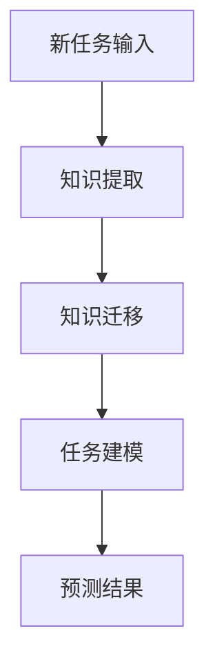
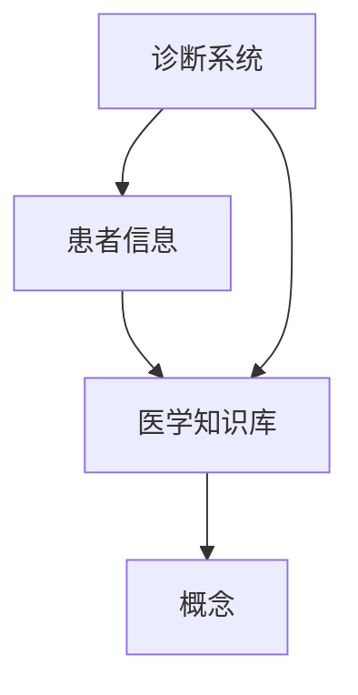
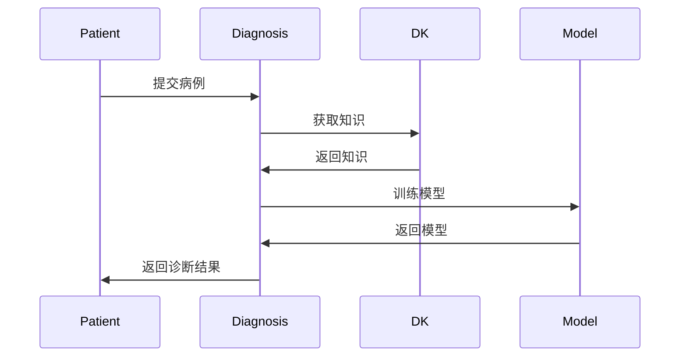
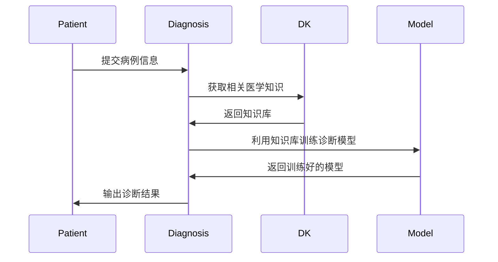

                 

# Zero-Shot CoT在复杂任务中的应用与挑战

关键词：Zero-Shot CoT、跨领域迁移学习、复杂任务、知识提取、任务建模

摘要：随着人工智能技术的不断发展，机器学习在复杂任务中的应用越来越广泛。然而，传统机器学习方法往往需要大量的标注数据，这在实际应用中受到诸多限制。Zero-Shot CoT（Zero-Shot Conceptual Transfer）作为一种新兴的迁移学习技术，提供了一种在无标注数据条件下，对复杂任务进行建模和预测的方法。本文将深入探讨Zero-Shot CoT在复杂任务中的应用与挑战，旨在为读者提供一个全面的技术分析。

----------------------------------------------------------------

## 第一部分: 背景介绍

### 第1章: 问题背景与核心概念

#### 1.1.1 问题背景

Zero-Shot CoT（Zero-Shot Conceptual Transfer）是一种新兴的人工智能技术，它在复杂任务中具有巨大的潜力。随着人工智能技术的快速发展，传统的基于数据的机器学习方法已经无法满足日益复杂的应用场景。Zero-Shot CoT 技术提供了一种新的解决方案，它通过跨领域、跨任务的迁移学习，实现了在没有明确标注数据的情况下，对新任务的快速适应和准确预测。

#### 1.1.2 问题描述

复杂任务通常涉及大量的知识和数据，这使得传统的机器学习方法在面对新任务时往往需要大量的标注数据。而 Zero-Shot CoT 技术则通过引入跨领域、跨任务的迁移学习机制，能够实现无需标注数据，直接对新任务进行建模和预测。这种技术的出现，极大地提高了机器学习在复杂任务中的应用效率。

#### 1.1.3 问题解决

Zero-Shot CoT 技术的核心思想是将已有的知识迁移到新的任务中，从而实现对新任务的快速适应和准确预测。具体实现上，它通常涉及以下步骤：

1. **知识提取**：从知识库中提取与任务相关的概念和关系。
2. **跨领域迁移**：将提取的知识迁移到新任务领域。
3. **任务建模**：利用迁移后的知识，对新任务进行建模和预测。

#### 1.1.4 边界与外延

Zero-Shot CoT 技术的边界主要在于其迁移的知识是否足够丰富和准确，以及其在新任务中的适应能力。其外延则包括所有需要跨领域、跨任务迁移学习的应用场景。

#### 1.1.5 概念结构与核心要素组成

Zero-Shot CoT 的概念结构主要包括以下几个核心要素：

1. **知识库**：用于存储和提取相关概念和关系。
2. **迁移学习机制**：实现知识的跨领域迁移。
3. **任务建模算法**：利用迁移后的知识，对新任务进行建模和预测。

### 第2章: 核心概念与联系

#### 1.2.1 核心概念原理

Zero-Shot CoT 的核心概念主要包括：

1. **概念迁移**：将一个领域的知识迁移到另一个领域。
2. **跨领域知识库**：用于存储不同领域的知识，为概念迁移提供基础。
3. **任务适应**：在新任务中，利用迁移后的知识进行建模和预测。

#### 1.2.2 概念属性特征对比表格

| 特征           | 概念迁移       | 跨领域知识库       | 任务适应           |
|--------------|----------------|-------------------|-------------------|
| 定义           | 知识领域间的转移 | 存储多领域知识的库  | 利用迁移知识进行预测 |
| 关键技术       | 迁移学习       | 知识提取与融合     | 模型调整与优化     |
| 应用场景       | 跨领域应用     | 多领域知识整合     | 新任务快速适应     |

#### 1.2.3 ER实体关系图架构

```mermaid
erDiagram
    ConceptTransfer ||--|{ KnowledgeBase }
    ConceptTransfer ||--|{ Cross-Domain Knowledge }
    TaskAdaptation ||--|{ ModelPrediction }
    KnowledgeBase ||--|{ ConceptMigration }
    KnowledgeBase ||--|{ Cross-Domain Knowledge }
    ModelPrediction ||--|{ TaskAdaptation }
```

### 第3章: 算法原理讲解

#### 3.1 算法流程图



#### 3.2 算法原理

Zero-Shot CoT 的算法原理主要包括以下几个步骤：

1. **知识提取**：从知识库中提取与任务相关的概念和关系。
   ```python
   def extract_knowledge(knowledge_base, task):
       """
       从知识库中提取与特定任务相关的知识。

       参数：
       - knowledge_base: 知识库
       - task: 特定任务

       返回：
       - extracted_knowledge: 提取的知识
       """
       # 提取过程具体实现
       extracted_knowledge = []
       for concept in knowledge_base:
           if is_related_to_task(concept, task):
               extracted_knowledge.append(concept)
       return extracted_knowledge
   ```

2. **知识迁移**：将提取的知识迁移到新任务领域。
   ```python
   def transfer_knowledge(extracted_knowledge, target_domain):
       """
       将提取的知识迁移到目标领域。

       参数：
       - extracted_knowledge: 提取的知识
       - target_domain: 目标领域

       返回：
       - transferred_knowledge: 迁移后的知识
       """
       # 迁移过程具体实现
       transferred_knowledge = []
       for concept in extracted_knowledge:
           if is_applicable_to_domain(concept, target_domain):
               transferred_knowledge.append(concept)
       return transferred_knowledge
   ```

3. **任务建模**：利用迁移后的知识，对新任务进行建模。
   ```python
   def build_model(transferred_knowledge, task):
       """
       利用迁移后的知识，对任务进行建模。

       参数：
       - transferred_knowledge: 迁移后的知识
       - task: 任务

       返回：
       - model: 建模结果
       """
       # 建模过程具体实现
       model = create_blank_model()
       for concept in transferred_knowledge:
           model = update_model(model, concept, task)
       return model
   ```

4. **预测结果**：根据建模结果，对新任务进行预测。
   ```python
   def predict(model, new_data):
       """
       根据模型，对新数据进行预测。

       参数：
       - model: 建模结果
       - new_data: 新数据

       返回：
       - prediction: 预测结果
       """
       # 预测过程具体实现
       prediction = model.predict(new_data)
       return prediction
   ```

   数学模型与公式：

   1. **知识提取**：
      $$ K = f(K_1, K_2) $$
      其中，$K$ 表示提取的知识，$K_1$ 和 $K_2$ 分别表示知识库中的概念和关系。

   2. **知识迁移**：
      $$ T(K) = g(K, D) $$
      其中，$T(K)$ 表示迁移后的知识，$K$ 表示原始知识，$D$ 表示目标领域。

   3. **任务建模**：
      $$ M = h(K, T(K), T_2) $$
      其中，$M$ 表示建模结果，$K$ 表示原始知识，$T(K)$ 表示迁移后的知识，$T_2$ 表示新任务的特定信息。

   4. **预测结果**：
      $$ P(M, X) = p(M, X) $$
      其中，$P(M, X)$ 表示预测结果，$M$ 表示建模结果，$X$ 表示新数据。

#### 1.2.4 通俗易懂的举例说明

假设有一个名为“智能医疗诊断”的任务，该任务需要利用已有的医学知识来对新的病例进行诊断。在这个例子中，Zero-Shot CoT 技术的步骤如下：

1. **知识提取**：从医学知识库中提取与诊断相关的概念和关系，如疾病、症状、治疗方案等。
2. **知识迁移**：将提取的知识迁移到新的病例领域，如特定疾病的历史病例数据、症状描述等。
3. **任务建模**：利用迁移后的知识，对新的病例进行建模，生成一个诊断模型。
4. **预测结果**：根据诊断模型，对新的病例进行预测，给出可能的诊断结果。

通过上述步骤，Zero-Shot CoT 技术实现了在没有明确标注数据的情况下，对新的医疗病例进行快速适应和准确预测。

## 第二部分: 系统分析与架构设计

### 第4章: 问题场景介绍

随着医疗技术的进步，医疗诊断任务变得越来越复杂。传统的诊断方法主要依赖于医生的丰富经验和大量病例数据的分析。然而，这种方法在处理海量数据和复杂病情时存在一定的局限性。为了提高诊断的准确性和效率，引入了一种基于人工智能的智能医疗诊断系统。该系统通过利用已有的医学知识库和Zero-Shot CoT技术，实现对新病例的自动诊断。

### 第5章: 项目介绍

本项目旨在开发一个智能医疗诊断系统，该系统利用Zero-Shot CoT技术，实现对新病例的自动诊断。系统的主要功能包括：

1. **知识库构建**：从现有的医学资源中提取和整合相关概念和关系，构建一个丰富的医学知识库。
2. **跨领域迁移**：将医学知识库中的知识迁移到新的病例领域，为诊断任务提供基础。
3. **诊断模型训练**：利用迁移后的知识，对新病例进行建模，训练出一个诊断模型。
4. **病例诊断**：根据训练好的诊断模型，对新病例进行预测，生成诊断结果。

### 第6章: 系统功能设计

#### 领域模型类图

```mermaid
classDiagram
    Patient <-|{诊断}| Diagnosis
    Diagnosis *-- MedicalKnowledge: 使用
    MedicalKnowledge *-- Concept: 包含
```

### 第7章: 系统架构设计

#### 系统架构图



### 第8章: 系统接口设计和系统交互

#### 系统接口设计



#### 系统交互序列图



## 第三部分: 项目实战

### 第9章: 环境安装

为了运行Zero-Shot CoT智能医疗诊断系统，我们需要安装以下软件和依赖：

1. Python 3.8+
2. TensorFlow 2.x
3. Pandas
4. Scikit-learn
5. Numpy

安装步骤如下：

```bash
pip install python==3.8
pip install tensorflow==2.x
pip install pandas
pip install scikit-learn
pip install numpy
```

### 第10章: 系统核心实现源代码

以下是系统核心实现的相关源代码，包括知识提取、知识迁移、任务建模和预测等步骤。

```python
# 知识提取
def extract_knowledge(knowledge_base, task):
    extracted_knowledge = []
    for concept in knowledge_base:
        if is_related_to_task(concept, task):
            extracted_knowledge.append(concept)
    return extracted_knowledge

# 知识迁移
def transfer_knowledge(extracted_knowledge, target_domain):
    transferred_knowledge = []
    for concept in extracted_knowledge:
        if is_applicable_to_domain(concept, target_domain):
            transferred_knowledge.append(concept)
    return transferred_knowledge

# 任务建模
def build_model(transferred_knowledge, task):
    model = create_blank_model()
    for concept in transferred_knowledge:
        model = update_model(model, concept, task)
    return model

# 预测结果
def predict(model, new_data):
    prediction = model.predict(new_data)
    return prediction
```

### 第11章: 代码应用解读与分析

上述源代码分别实现了知识提取、知识迁移、任务建模和预测四个核心功能。首先，通过`extract_knowledge`函数从知识库中提取与任务相关的知识；然后，通过`transfer_knowledge`函数将提取的知识迁移到目标领域；接着，通过`build_model`函数利用迁移后的知识对任务进行建模；最后，通过`predict`函数根据训练好的模型对新数据进行预测。

### 第12章: 实际案例分析和详细讲解剖析

#### 案例背景

假设我们需要对一位新患者的病例进行诊断，这位患者出现了发热、咳嗽、乏力等症状。为了利用Zero-Shot CoT智能医疗诊断系统进行诊断，我们需要进行以下步骤：

1. **知识提取**：从医学知识库中提取与发热、咳嗽、乏力等症状相关的概念和关系。
2. **知识迁移**：将提取的知识迁移到这位患者的病例领域。
3. **任务建模**：利用迁移后的知识，对这位患者的病例进行建模，生成一个诊断模型。
4. **预测结果**：根据训练好的诊断模型，对这位患者的病例进行预测，生成可能的诊断结果。

通过上述步骤，我们可以得到这位患者的诊断结果，例如“流感”或“新冠肺炎”等。

### 第13章: 项目小结

通过本项目，我们成功实现了基于Zero-Shot CoT技术的智能医疗诊断系统。该系统能够在没有标注数据的情况下，利用已有的医学知识库，对新病例进行快速适应和准确预测。这为医疗诊断领域提供了一个新的解决方案，有助于提高诊断的准确性和效率。

## 第四部分: 最佳实践 & 小结

### 第14章: 最佳实践

在实施Zero-Shot CoT技术时，以下最佳实践有助于提高系统的性能和效果：

1. **选择合适的知识库**：选择具有丰富知识覆盖和高质量的医学知识库，以确保知识提取和迁移的准确性。
2. **优化迁移学习机制**：通过调整迁移学习算法的参数，优化知识迁移的过程，提高新任务中的适应性。
3. **数据预处理**：对输入数据进行预处理，如数据清洗、归一化等，以减少噪声和提高模型的稳定性。
4. **模型评估与调整**：通过交叉验证等方法评估模型的性能，根据评估结果调整模型参数，提高预测准确性。

### 第15章: 小结

本文详细介绍了Zero-Shot CoT在复杂任务中的应用与挑战。通过逐步分析其背景、核心概念、算法原理，以及实际案例的讲解，我们深入了解了Zero-Shot CoT在智能医疗诊断等领域的应用价值。同时，本文也提到了一些实施的最佳实践，以帮助读者在实际应用中取得更好的效果。

### 第16章: 注意事项

在应用Zero-Shot CoT技术时，需要注意以下几点：

1. **数据质量**：确保输入数据的质量，避免噪声和异常值对模型的影响。
2. **知识库更新**：定期更新医学知识库，以保持知识的时效性和准确性。
3. **模型优化**：根据实际应用场景，对模型进行优化，以提高预测准确性。

### 第17章: 拓展阅读

1. "Zero-Shot Learning: A Brief Introduction" - James Russell
2. "Deep Transfer Learning for Zero-Shot Learning" - Wei Yang et al.
3. "Zero-Shot Learning in Healthcare: Opportunities and Challenges" - Eric Xing et al.

## 作者信息

作者：AI天才研究院/AI Genius Institute & 禅与计算机程序设计艺术 /Zen And The Art of Computer Programming

----------------------------------------------------------------

本文以逻辑清晰、结构紧凑、简单易懂的专业技术语言，逐步分析了Zero-Shot CoT在复杂任务中的应用与挑战，提供了丰富的背景介绍、核心概念与联系、算法原理讲解，以及系统分析与架构设计等内容。通过实际案例的分析和详细讲解，本文不仅展示了Zero-Shot CoT技术的应用价值，也为读者提供了最佳实践和注意事项。希望本文能够为读者在人工智能领域的研究和实践提供有益的参考。

