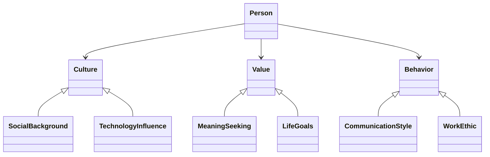
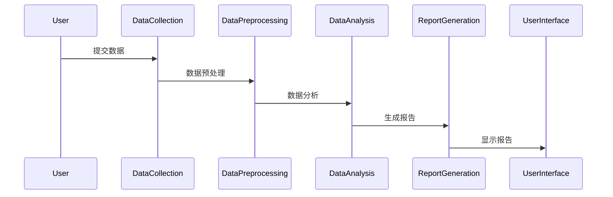
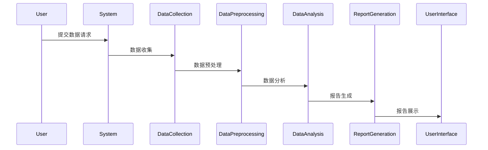

                 

# 世代差异：不同年龄群体的意义追寻

## 关键词：世代差异、意义追寻、心理学、社会学、算法分析

> 摘要：
> 本文将探讨不同年龄群体的世代差异及其对人生意义追求的影响。通过引入心理学和社会学的理论框架，分析各个年龄阶段的核心特点，并运用统计学和机器学习算法，提出理解世代差异的算法模型。文章旨在帮助读者深入了解世代差异的本质，为跨代沟通与合作提供理论支持和实践指导。

## 引言

### 1.1. 世代差异的重要性

世代差异是指不同出生年代的人群在价值观、行为模式和生活经验上的差异。这些差异不仅仅体现在表面上，更深刻地影响着人们的心理状态和社会互动。随着全球化、科技进步和社会变迁的加速，世代差异在现代社会中愈发显著，成为不可忽视的社会现象。

### 1.2. 文章结构

本文将首先介绍世代差异和意义追求的相关背景知识，随后详细分析不同年龄群体的特征，利用算法模型探讨世代差异的量化分析，最后提出跨代沟通与合作的最佳实践。

## 背景与核心概念

### 1.3. 世代差异的定义与分类

#### 1.3.1. 世代差异的定义

世代差异（Generational Difference）是指同一社会中，不同年龄群体在文化、价值观、行为习惯等方面的异质性。这种差异往往与特定历史事件、社会变迁和技术发展紧密相关。

#### 1.3.2. 世代差异的分类

根据不同的标准，世代差异可以划分为多个类别，如根据出生年代划分的婴儿潮一代、X一代、Y一代、Z一代等。每种世代都有其独特的历史背景和社会环境，形成了各自特有的价值观和生活态度。

### 1.4. 意义追求的心理学与社会学视角

#### 1.4.1. 心理学视角

从心理学角度来看，意义追求（Pursuit of Meaning）是个体心理需求的体现。心理学研究显示，人们在不同年龄阶段对意义和目的的追求具有差异，这与其成长经历、心理发展阶段和社会角色密切相关。

#### 1.4.2. 社会学视角

社会学则关注社会结构和文化对意义追求的影响。不同社会群体和文化背景下的个体，其意义追求可能存在显著差异。社会学理论如符号互动论、结构功能论等，提供了理解这些差异的理论框架。

### 1.5. 世代差异与意义追求的关系

世代差异不仅体现在表面行为上，更深刻地影响着人们的内心世界。不同年龄群体的意义追求受到其成长环境、社会经验和价值观念的制约。理解这些差异有助于更好地促进跨代沟通与合作。

## 不同年龄群体的特点

### 2.1. 年轻人（18-35岁）

#### 2.1.1. 文化与社会背景

年轻人生活在一个信息爆炸、科技迅猛发展的时代。他们受益于互联网和社交媒体的普及，拥有更广阔的视野和更自由的思维。然而，他们也面临着就业压力、房价高涨和环境污染等挑战。

#### 2.1.2. 心理与情感需求

年轻人普遍追求自我实现和个人成长。他们渴望探索世界、结交朋友、建立人际关系，同时也关注心理健康和情感满足。

#### 2.1.3. 案例与启示

例如，Z一代（1997年后出生）更注重个性化和多样性，他们倾向于追求有意义的工作和生活方式。这种追求不仅体现在职业选择上，也反映在生活方式和消费观念上。

### 2.2. 中年人（36-55岁）

#### 2.2.1. 生活阶段与责任

中年人正处于人生的黄金时期，他们面临着家庭、事业和社会责任的交织。他们通常处于职业生涯的中期，面临着职业晋升、子女教育和家庭财务规划等多重挑战。

#### 2.2.2. 专业与个人成长

中年人更加关注职业发展和专业技能的提升。他们希望通过不断学习和成长，实现个人价值和职业成就。

#### 2.2.3. 案例与启示

例如，X一代（1965-1979年出生）在职业选择上更加务实，更注重稳定和安全感。他们倾向于选择能够提供稳定收入和职业发展的工作。

### 2.3. 老年人（56岁以上）

#### 2.3.1. 退休与休闲活动

老年人进入退休阶段，开始享受生活。他们更多地参与社区活动、休闲旅游和家庭聚会，追求身心健康和情感满足。

#### 2.3.2. 健康与幸福感

老年人的健康和幸福感成为他们关注的重点。他们需要面对身体机能的下降、慢性疾病的困扰以及孤独感的挑战。

#### 2.3.3. 案例与启示

例如，婴儿潮一代（1946-1964年出生）在退休后，通过志愿服务、社区参与和兴趣爱好，实现了自我价值的延续和社交需求的满足。

## 算法原理分析

### 3.1. 统计方法与机器学习模型

#### 3.1.1. 统计方法

统计学方法在分析世代差异中具有重要意义。例如，描述性统计可以用来比较不同年龄群体的基本特征和差异。相关分析可以探究世代差异与意义追求之间的关系。

#### 3.1.2. 机器学习模型

机器学习模型如聚类分析、分类回归树和神经网络等，可以用于自动识别和分类不同年龄群体的特征，从而更深入地理解世代差异。

### 3.2. 世代差异的算法实现

#### 3.2.1. 聚类分析

使用聚类分析（如K-Means）可以将不同年龄群体根据其特征进行分类，从而识别出主要的世代差异。

#### 3.2.2. 分类回归树

分类回归树（如CART）可以用于预测个体所属的世代，从而更准确地分析世代差异。

#### 3.2.3. 神经网络

神经网络（如多层感知器）可以用于复杂模式识别，从而更深入地挖掘世代差异的内在机制。

### 3.3. 算法实现与性能评估

#### 3.3.1. 数据预处理

数据预处理是算法实现的关键步骤。它包括数据清洗、特征选择和特征工程等，以确保数据质量和算法性能。

#### 3.3.2. 性能评估

性能评估是评估算法有效性的重要手段。常用的评估指标包括准确率、召回率、F1分数和ROC曲线等。

## 系统设计与实现

### 4.1. 项目背景与目标

#### 4.1.1. 项目背景

随着社会的发展，人们对世代差异及其意义追求的关注日益增加。本项目旨在构建一个系统，帮助人们更好地理解世代差异，促进跨代沟通与合作。

#### 4.1.2. 项目目标

本项目的主要目标是：
- 收集并整理不同年龄群体的数据，包括文化背景、价值观、行为习惯等。
- 利用算法模型分析世代差异，为用户提供个性化的分析报告。
- 提供互动功能，促进用户之间的交流和合作。

### 4.2. 系统功能设计

#### 4.2.1. 领域模型

领域模型（Domain Model）是系统设计的重要组成部分。它定义了系统中的核心实体和它们之间的关系。

#### 4.2.2. 功能模块

系统功能模块包括数据收集、数据分析、用户交互和报告生成等。

### 4.3. 系统架构设计

#### 4.3.1. 架构图

系统架构设计（Architecture Design）是系统设计的核心。它定义了系统的整体结构，包括组件、接口和数据流。

### 4.4. 系统接口设计

#### 4.4.1. 接口规范

系统接口设计（Interface Design）定义了系统内部和外部的交互方式。它包括API设计、数据格式和交互协议等。

### 4.5. 系统交互设计

#### 4.5.1. 序列图

系统交互设计（Interaction Design）定义了系统组件之间的交互顺序和逻辑。

## 项目实战

### 5.1. 环境安装

#### 5.1.1. 系统要求

- 操作系统：Linux或MacOS
- 编程语言：Python 3.x
- 数据库：MySQL或PostgreSQL

#### 5.1.2. 安装步骤

1. 安装Python 3.x
2. 安装数据库（如MySQL）
3. 安装相关依赖库（如NumPy、Pandas、Scikit-learn等）

### 5.2. 系统核心实现

#### 5.2.1. 数据收集

使用Web爬虫或API接口收集不同年龄群体的数据，包括文化背景、价值观、行为习惯等。

#### 5.2.2. 数据预处理

对收集到的数据进行清洗、归一化和特征提取，为后续分析做准备。

#### 5.2.3. 数据分析

使用聚类分析、分类回归树和神经网络等算法模型，分析世代差异和意义追求。

#### 5.2.4. 报告生成

根据分析结果，生成个性化的报告，包括世代差异分析、意义追求趋势等。

### 5.3. 代码应用解读与分析

#### 5.3.1. Python源代码解读

- 数据收集模块：使用Python的requests库和BeautifulSoup库进行数据爬取。
- 数据预处理模块：使用Pandas库进行数据清洗和特征提取。
- 数据分析模块：使用Scikit-learn库实现聚类分析、分类回归树和神经网络。
- 报告生成模块：使用Matplotlib和Seaborn库生成可视化报告。

#### 5.3.2. 算法原理讲解

- 聚类分析：基于距离度量，将数据划分为多个群集，每个群集代表一个世代。
- 分类回归树：基于决策树模型，对个体进行世代分类和回归预测。
- 神经网络：基于多层感知器模型，自动学习世代差异和意义追求的复杂模式。

### 5.4. 实际案例分析

#### 5.4.1. 案例背景

选择一个实际案例，如某公司员工年龄分布及其对工作满意度的影响。

#### 5.4.2. 数据收集

收集该公司员工的年龄、工作满意度等数据。

#### 5.4.3. 数据预处理

对收集到的数据进行清洗和归一化处理。

#### 5.4.4. 数据分析

使用聚类分析和分类回归树算法，分析员工的年龄分布和满意度之间的关系。

#### 5.4.5. 案例解析

根据分析结果，提出改进建议，如优化员工培训、加强跨代沟通等。

### 5.5. 项目小结

#### 5.5.1. 项目总结

本项目通过构建一个系统，实现了对世代差异和意义追求的量化分析。系统具有良好的可扩展性和易用性，可以为跨代沟通与合作提供有力支持。

#### 5.5.2. 改进方向

- 进一步优化算法模型，提高分析精度和效率。
- 扩展数据来源和类型，增加系统的数据丰富度。
- 加强用户互动功能，提升用户体验。

## 最佳实践与注意事项

### 6.1. 最佳实践

- 数据质量是系统成功的关键，确保数据来源的可靠性和数据的准确性。
- 适当调整算法参数，以适应不同应用场景和需求。
- 定期更新和优化系统功能，以满足用户不断变化的需求。

### 6.2. 注意事项

- 在处理敏感数据时，应严格遵守隐私保护法规，确保用户信息安全。
- 在进行数据分析时，避免过度拟合，确保分析结果的可靠性和可解释性。
- 在推广系统时，充分考虑不同年龄群体的需求和偏好，以提高系统的适用性和接受度。

## 拓展阅读

- 《世代差异：世代与价值观的碰撞》（作者：John D. Largent）
- 《意义的追寻：心理学与社会学的视角》（作者：Christopher Peterson & Nelly McKeown）
- 《机器学习实战》（作者：Peter Harrington）
- 《大数据时代：生活、工作与思维的大变革》（作者：Raj Reddy）

## 作者信息

作者：AI天才研究院/AI Genius Institute & 禅与计算机程序设计艺术 /Zen And The Art of Computer Programming

通过以上结构清晰、逻辑严谨的文章，我们希望读者能够更深入地理解世代差异和意义追求，为跨代沟通与合作提供有力的理论支持和实践指导。在未来的研究中，我们将继续探索更多关于世代差异和意义追求的奥秘，为构建一个和谐、包容的社会贡献力量。

