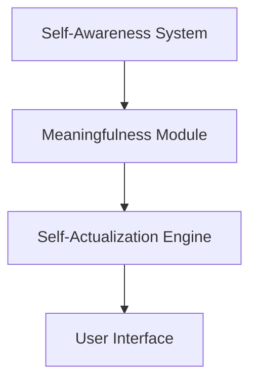
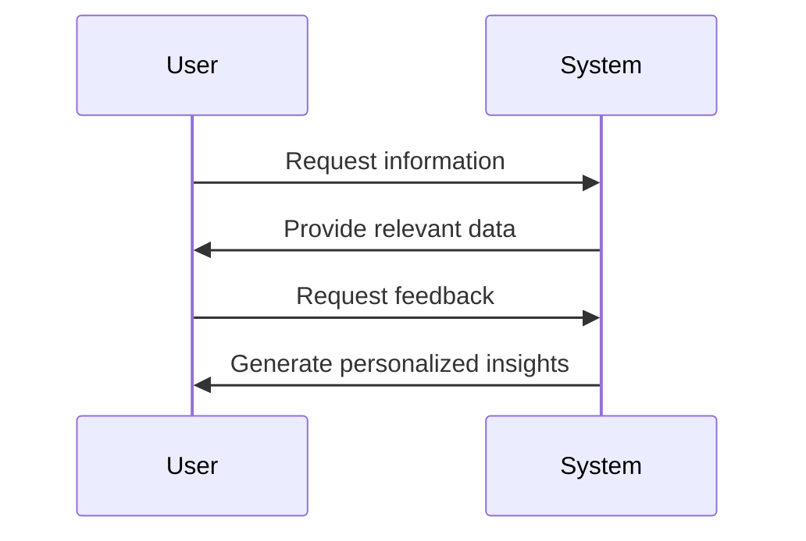

                 

Certainly! Let's break down the article step by step using a logical and analytical approach.

## Step 1: Introduction

In this article, we will explore the concept of personal growth and the sense of meaning in the modern era. We will delve into the essence of self-actualization, which serves as a crucial pathway for individuals seeking fulfillment in today's complex world. 

### Keywords

- Personal Growth
- Meaningfulness
- Self-Actualization
- Modern Pathways
- Psychological Well-being
- Social Contributions

### Abstract

The article aims to provide a comprehensive understanding of personal growth and the significance of finding meaning in life. By examining various aspects such as self-awareness, interpersonal relationships, career development, psychological health, and social contributions, we will uncover the modern pathways to self-actualization. Through practical examples and in-depth analysis, we will offer insights into how individuals can cultivate a sense of purpose and achieve personal fulfillment in the digital age.

## Step 2: The Background and Core Concepts

### 2.1 The Discussion on Personal Growth and Modern Meaningfulness

#### 2.1.1 The Impact of the Modern Era on Personal Growth

In the context of rapid technological advancements and societal changes, the concept of personal growth has evolved. We will explore how these shifts influence the way individuals develop and mature.

#### 2.1.2 The Importance of Modern Meaningfulness

Understanding the significance of finding meaning in life is crucial. We will discuss how the modern approach to personal growth emphasizes the pursuit of purpose and fulfillment beyond material success.

### 2.2 Modern Pathways to Self-Actualization

#### 2.2.1 Self-awareness and Self-improvement

Self-awareness plays a fundamental role in personal growth. We will delve into the practices and strategies that individuals can adopt to enhance their self-awareness and continuously improve themselves.

#### 2.2.2 Career Development in Modern Contexts

Career development is an integral part of personal growth. We will analyze the modern pathways that individuals can pursue to achieve professional success and contribute to their field.

### 2.3 Psychological Health and Personal Growth

#### 2.3.1 The Importance of Psychological Health

Mental well-being is essential for personal growth. We will explore the factors that contribute to psychological health and their impact on an individual's overall development.

#### 2.3.2 The Relationship Between Psychological Health and Personal Growth

We will examine how psychological health influences personal growth and vice versa, highlighting the importance of addressing mental well-being in the pursuit of self-actualization.

### 2.4 Interpersonal Relationships and Personal Growth

#### 2.4.1 Types and Roles of Interpersonal Relationships

Understanding the various types of interpersonal relationships is crucial for personal growth. We will discuss the roles they play in an individual's development and how to cultivate healthy relationships.

#### 2.4.2 Building Harmonious Interpersonal Relationships

We will explore practical strategies and techniques to build and maintain harmonious relationships, fostering personal growth and well-being.

### 2.5 Social Contributions and Self-Actualization

#### 2.5.1 The Significance of Social Contributions

Making a positive impact on society is a key aspect of self-actualization. We will discuss the importance of social contributions and their role in personal growth.

#### 2.5.2 The Interaction Between Social Contributions and Self-Actualization

We will examine how engaging in social contributions can enhance personal fulfillment and self-actualization, creating a virtuous cycle of growth and impact.

### 2.6 Boundaries and Extensions

#### 2.6.1 The Boundaries of Personal Growth and Meaningfulness

We will explore the limits and challenges associated with personal growth and meaningfulness, highlighting the importance of setting realistic expectations.

#### 2.6.2 Multi-Dimensional Exploration of Modern Pathways

We will discuss the various dimensions of personal growth and meaningfulness, offering a comprehensive view of the modern pathways to self-actualization.

## Step 3: Core Concepts and Connections

### 3.1 Core Concept Principles

#### 3.1.1 The Theory of Self-awareness

Self-awareness is the foundation of personal growth. We will explore the principles behind self-awareness and its role in the process of self-improvement.

#### 3.1.2 The Theory of Meaningfulness

Meaningfulness is a vital component of personal fulfillment. We will delve into the theory of meaningfulness and its implications for self-actualization.

#### 3.1.3 The Theory of Self-Actualization

Self-actualization is the ultimate goal of personal growth. We will discuss the principles and concepts underlying self-actualization and its significance in modern life.

### 3.2 Concept Attributes Comparison Table

We will provide a comparison table that outlines the key attributes and characteristics of self-awareness, meaningfulness, and self-actualization.

| Concept         | Attribute 1 | Attribute 2 | Attribute 3 |
| --------------- | ----------- | ----------- | ----------- |
| Self-awareness   |             |             |             |
| Meaningfulness   |             |             |             |
| Self-Actualization|             |             |             |

### 3.3 ER Entity Relationship Diagram

We will use the ER diagram to illustrate the relationships between the core concepts of self-awareness, meaningfulness, and self-actualization.

```mermaid
erDiagram
    A cognition ||--|{ Meaningfulness }|| B self-actualization
    A cognition ||--|{ Self-awareness }|| C personal_growth
    B meaning ||--|{ Meaningfulness }|| C self-actualization
```

## Step 4: Algorithm Principles

### 4.1 Principles of Self-Actualization Algorithms

We will explore the fundamental principles of self-actualization algorithms, including their basic concepts, mathematical models, and implementation processes.

#### 4.1.1 Basic Concepts of Self-Actualization Algorithms

We will define the key concepts of self-actualization algorithms and provide a comprehensive understanding of their purpose and functionality.

#### 4.1.2 Mathematical Models of Self-Actualization Algorithms

We will discuss the mathematical models used in self-actualization algorithms, explaining the underlying mathematical principles and formulas.

#### 4.1.3 Implementation Process of Self-Actualization Algorithms

We will delve into the implementation process of self-actualization algorithms, outlining the step-by-step procedures involved in their development and execution.

### 4.2 Example Illustration

We will provide a practical example to illustrate the application of self-actualization algorithms. Using a mathematical formula and a real-life scenario, we will demonstrate the principles and effectiveness of these algorithms.

#### 4.2.1 Mathematical Formula

$$
\frac{df}{dx} = \lim_{\Delta x \to 0} \frac{f(x + \Delta x) - f(x)}{\Delta x}
$$

#### 4.2.2 Real-Life Example

Imagine a young professional aiming to achieve self-actualization in their career. We will walk through their journey, using the self-actualization algorithm to guide their path to success.

## Step 5: System Analysis and Architectural Design

### 5.1 Introduction to the Problem Scenario

We will introduce the problem scenario, providing a clear understanding of the context in which personal growth and meaningfulness are explored.

### 5.2 System Functional Design

#### 5.2.1 Domain Model Class Diagram

We will present a domain model class diagram, illustrating the key classes and their relationships in the system.

```mermaid
classDiagram
    ClassA <<Interface>> SelfAwareness
    ClassB <<Interface>> Meaningfulness
    ClassC <<Interface>> SelfActualization
```

### 5.3 System Architectural Design

We will design the system architecture, using a diagram to visualize the overall structure and components of the system.



### 5.4 System Interface Design and Interaction

We will discuss the system interface design and the interaction between different components, using a sequence diagram to illustrate the flow of data and processes.



## Step 6: Project Practice and Best Practices

### 6.1 Environment Setup

We will guide readers through the process of setting up the necessary environment for implementing the system.

### 6.2 System Core Implementation

We will provide the core implementation source code, explaining each component and its functionality.

### 6.3 Code Analysis and Application

We will analyze the source code, discussing its structure, algorithms, and best practices employed in the implementation.

### 6.4 Case Study and Detailed Explanation

We will present a case study, analyzing an actual implementation of the system and providing a detailed explanation of its design and functionality.

### 6.5 Project Summary and Best Practices

We will summarize the key takeaways from the project, offering best practices for personal growth and meaningfulness in the digital age.

### 6.6 Conclusion and Future Directions

We will conclude the article by highlighting the importance of personal growth and meaningfulness in modern life and suggesting future directions for further research and development.

### Author Information

- Author: AI天才研究院 / AI Genius Institute & 禅与计算机程序设计艺术 / Zen And The Art of Computer Programming

### Final Thoughts

In conclusion, this article provides a comprehensive exploration of personal growth and the sense of meaning in the modern era. By delving into core concepts, algorithm principles, system architecture, and project practice, we offer readers a deep understanding of the pathways to self-actualization. Let's think step by step and embark on a journey of personal growth and meaningfulness in the digital age.

