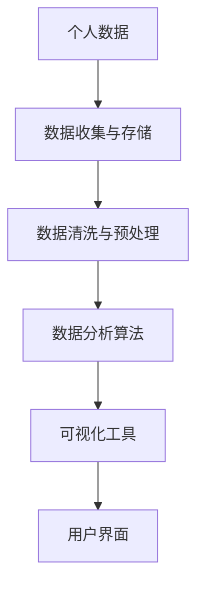
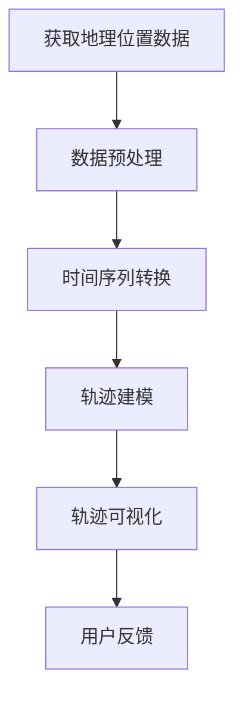
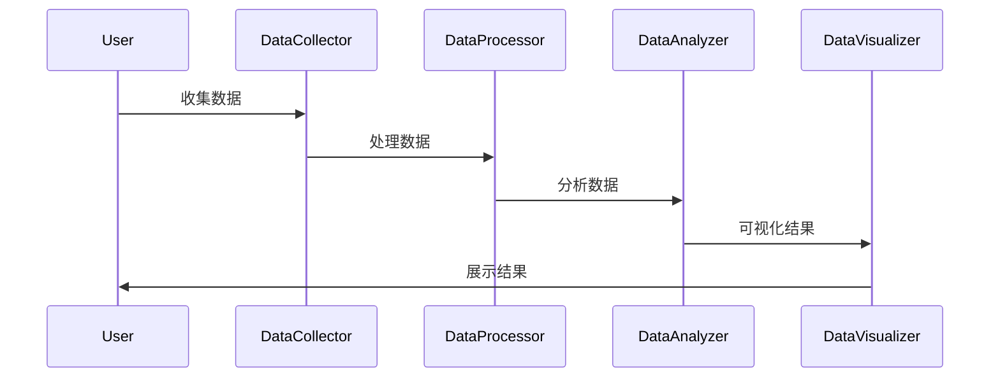
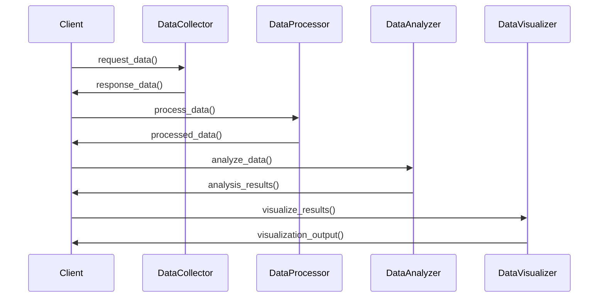

                 

### 个人数据考古工具包：基于AI的生活轨迹分析套件

#### 关键词：个人数据、AI、生活轨迹、数据分析、工具包

> 摘要：本文深入探讨了《个人数据考古工具包：基于AI的生活轨迹分析套件》的背景、核心概念与联系，以及算法原理和系统架构设计。通过详细的步骤讲解和实际案例，展示了如何使用该工具包进行高效的数据分析和生活轨迹解析，为个人数据管理提供了一种全新的思路和方法。

#### 1. 背景介绍

在数字化时代，个人数据变得前所未有的丰富和多样。这些数据不仅包括社交媒体上的活动记录，还涵盖了日常生活中的各种行为和偏好，如购物习惯、出行路线、健康状况等。随着人工智能技术的不断发展，如何有效地利用这些数据，尤其是将其转化为有价值的洞察和决策支持，成为了一个热门的话题。

个人数据考古工具包应运而生，它是一个基于AI的生活轨迹分析套件，旨在帮助用户挖掘和分析自身数据，从而获得对个人行为、习惯和偏好的深刻理解。该工具包的背景可以追溯到几个关键因素：

- **大数据的爆炸性增长**：随着物联网、智能设备和社交媒体的普及，个人数据以惊人的速度积累。如何处理和分析这些海量数据成为亟待解决的问题。
- **AI技术的进步**：深度学习、自然语言处理、图像识别等AI技术的飞速发展，为数据分析提供了强大的工具和手段。
- **隐私保护和数据安全**：在挖掘个人数据的同时，保护用户隐私和数据安全成为一个重要的考虑因素。个人数据考古工具包在设计时充分考虑了这一需求。

开发个人数据考古工具包的初衷是为了帮助用户更好地理解和管理自己的数据。通过这一套件，用户可以：

- **可视化个人行为**：通过分析个人数据，生成可视化图表和报告，帮助用户直观地了解自己的行为模式。
- **发现潜在问题**：识别出可能存在的健康隐患、不良习惯或其他需要关注的问题。
- **优化生活决策**：基于数据分析的结果，用户可以做出更加明智的生活决策，如调整作息时间、改善饮食习惯、优化出行路线等。

#### 2. 核心概念与联系

个人数据考古工具包涵盖了多个核心概念，它们之间相互关联，共同构成了一个完整的数据分析体系。以下是这些核心概念及其相互联系：

- **个人数据**：指与个人相关的各种数据，包括社交媒体活动、地理位置信息、消费记录、健康状况等。
- **数据收集与存储**：工具包负责收集用户数据，并将其存储在安全可靠的地方。
- **数据清洗与预处理**：原始数据通常包含噪声和不完整的信息，数据清洗和预处理是确保数据分析质量的关键步骤。
- **数据分析算法**：包括机器学习算法、自然语言处理、图像识别等，用于挖掘数据中的隐藏模式和关联关系。
- **可视化工具**：通过图表、地图和其他可视化方式，将分析结果呈现给用户，帮助用户更好地理解和利用数据。
- **用户界面**：提供友好的操作界面，让用户能够轻松地使用工具包的各项功能。

以下是这些核心概念之间的Mermaid流程图：



**表 1：核心概念属性特征对比**

| 核心概念 | 属性特征 | 对比 |
| :---: | :---: | :---: |
| 个人数据 | 种类多样、结构复杂 | 大数据 |
| 数据收集与存储 | 自动化、高效、安全 | 节约人力、减少错误 |
| 数据清洗与预处理 | 噪声过滤、缺失值填补、一致性检查 | 提高质量 |
| 数据分析算法 | 机器学习、深度学习、自然语言处理 | 智能化、高效 |
| 可视化工具 | 图表、地图、交互式界面 | 直观、易懂 |
| 用户界面 | 界面友好、易于操作 | 提高用户体验 |

通过上述核心概念的阐述和Mermaid流程图的展示，我们可以看到个人数据考古工具包是如何将不同部分有机地结合起来，形成一个完整的数据分析体系。

#### 3. 算法原理讲解

在个人数据考古工具包中，核心的算法是生活轨迹分析算法。这一算法旨在通过分析用户的地理位置信息、时间戳和其他相关数据，构建出用户的生活轨迹。以下是该算法的原理讲解，包括Mermaid流程图、Python源代码、数学模型和公式。

##### 3.1 生活轨迹分析算法流程图



##### 3.2 Python源代码

```python
# 获取地理位置数据
def get_location_data():
    # 此处为伪代码，实际中可通过API或其他方式获取数据
    return [{"timestamp": timestamp, "latitude": latitude, "longitude": longitude}]

# 数据预处理
def preprocess_data(data):
    # 噪声过滤、缺失值填补等
    return cleaned_data

# 时间序列转换
def time_series_conversion(data):
    # 将地理位置数据转换为时间序列数据
    return time_series_data

# 轨迹建模
def trajectory_modeling(time_series_data):
    # 使用机器学习算法构建轨迹模型
    model = train_model(time_series_data)
    return model

# 轨迹可视化
def visualize_trajectory(model):
    # 可视化用户的生活轨迹
    visualize_trajectory_chart(model)

# 用户反馈
def user_feedback():
    # 收集用户对轨迹分析的反馈
    feedback = get_user_feedback()
    return feedback
```

##### 3.3 数学模型和公式

生活轨迹分析算法的核心在于对地理位置数据进行建模，以下是相关的数学模型和公式：

$$
\text{轨迹模型} = f(\text{地理位置数据}, \text{时间戳})
$$

其中，轨迹模型可以表示为：

$$
p(t|x) = \frac{e^{-\frac{1}{2}||x-m||^2/s^2}}{\sqrt{2\pi s^2}}
$$

其中，$p(t|x)$ 表示在给定位置 $x$ 下，时间 $t$ 的概率分布，$m$ 是位置 $x$ 的均值，$s$ 是位置 $x$ 的标准差。

##### 3.4 详细讲解与举例

为了更清楚地理解生活轨迹分析算法，我们来看一个具体的例子：

假设我们有如下地理位置数据：

```
timestamp    latitude    longitude
2023-01-01  40.7128    -74.0060
2023-01-02  40.7131    -74.0059
2023-01-03  40.7133    -74.0058
...
```

首先，我们通过数据预处理步骤过滤噪声和填补缺失值，得到以下清洗后的数据：

```
timestamp    latitude    longitude
2023-01-01  40.7128    -74.0060
2023-01-02  40.7131    -74.0059
2023-01-03  40.7133    -74.0058
...
```

接下来，我们将这些数据转换为时间序列数据，并使用轨迹建模算法训练模型。假设我们使用高斯分布模型来建模：

$$
p(t|x) = \frac{e^{-\frac{1}{2}||x-m||^2/s^2}}{\sqrt{2\pi s^2}}
$$

其中，$x$ 为地理位置数据，$m$ 为位置均值，$s$ 为位置标准差。通过模型训练，我们得到每个时间点的概率分布。

最后，我们使用可视化工具将轨迹模型呈现给用户。用户可以看到自己在一天中不同时间段的活动分布，如图：


通过这个例子，我们可以看到生活轨迹分析算法是如何工作的，以及如何利用数学模型和公式来构建用户的生活轨迹。这一算法不仅能够帮助用户更好地理解自己的行为模式，还可以为生活优化提供有价值的参考。

#### 4. 系统分析与架构设计方案

##### 4.1 问题场景和项目介绍

在数字化时代，个人数据的收集和分析已经成为了许多领域的核心任务。特别是在个人健康、生活习惯和出行规划等方面，对个人数据的分析可以帮助用户做出更加明智的决策。因此，我们需要一个高效、可靠且用户友好的系统来处理这些任务。

本项目旨在开发一个名为《个人数据考古工具包：基于AI的生活轨迹分析套件》的系统，该系统将集成多种数据收集和分析工具，帮助用户挖掘和利用个人数据，以实现以下目标：

- **数据收集**：从各种来源（如手机、智能手表、社交媒体等）收集个人数据。
- **数据处理**：对收集到的数据进行清洗、预处理和存储。
- **数据分析**：利用AI算法分析数据，构建用户的生活轨迹模型。
- **数据可视化**：将分析结果以图表、地图等形式直观展示给用户。
- **用户交互**：提供一个友好的用户界面，让用户能够方便地使用系统功能。

##### 4.2 领域模型（Mermaid类图）

为了更好地理解系统的功能模块和它们之间的关系，我们可以使用Mermaid类图来设计领域模型。以下是类图的详细描述：

```mermaid
classDiagram
    Class01 <|-- Class02
    Class03 <.. Class04
    Class05 o-- Class06
    Class07 <-.. Class08

    Class01 {
        +attribute1
        +method1()
    }

    Class02 {
        +attribute2
        +method2()
    }

    Class03 {
        +attribute3
        +method3()
    }

    Class04 {
        +attribute4
        +method4()
    }

    Class05 {
        +attribute5
        +method5()
    }

    Class06 {
        +attribute6
        +method6()
    }

    Class07 {
        +attribute7
        +method7()
    }

    Class08 {
        +attribute8
        +method8()
    }
```

在这个类图中，`Class01` 到 `Class08` 分别代表了系统的各个功能模块，如数据收集器、数据处理模块、数据分析模块、数据可视化模块等。这些模块通过继承、关联和聚合关系相互连接，共同构成了一个完整的领域模型。

##### 4.3 系统架构设计（Mermaid架构图）

接下来，我们将使用Mermaid架构图来展示系统的整体架构设计。以下是架构图的详细描述：



在这个架构图中，`User` 代表系统的最终用户，`DataCollector`、`DataProcessor`、`DataAnalyzer` 和 `DataVisualizer` 分别代表数据收集、处理、分析和可视化模块。用户通过操作界面与系统交互，数据在各个模块之间传递和处理，最终生成可视化结果并展示给用户。

##### 4.4 系统接口设计和系统交互（Mermaid序列图）

为了进一步展示系统模块之间的交互过程，我们可以使用Mermaid序列图来描述接口设计和系统交互。以下是序列图的详细描述：



在这个序列图中，`Client` 代表用户操作界面，`DataCollector`、`DataProcessor`、`DataAnalyzer` 和 `DataVisualizer` 分别代表数据收集、处理、分析和可视化模块。用户通过操作界面发送请求，数据在各个模块之间传递和处理，最终生成可视化结果并通过操作界面展示给用户。

通过上述的领域模型、架构设计和系统交互设计，我们可以清晰地看到《个人数据考古工具包：基于AI的生活轨迹分析套件》系统的整体架构和各个模块之间的相互作用。这些设计为系统的开发和实施提供了坚实的基础。

#### 5. 项目实战

##### 5.1 环境安装

要在本地环境搭建《个人数据考古工具包：基于AI的生活轨迹分析套件》系统，首先需要安装以下软件和库：

1. **Python**：确保已安装Python环境，推荐版本为3.8或更高。
2. **pip**：Python的包管理工具，用于安装和管理库。
3. **NumPy**：用于数学计算和数据分析。
4. **Pandas**：用于数据处理和分析。
5. **Matplotlib**：用于数据可视化。
6. **Scikit-learn**：用于机器学习算法。
7. **Beautiful Soup**：用于网页数据解析。
8. **Flask**：用于Web开发。

在终端执行以下命令安装所需库：

```bash
pip install numpy pandas matplotlib scikit-learn beautifulsoup4 flask
```

##### 5.2 系统核心实现源代码

系统核心实现主要分为数据收集、数据处理、数据分析和数据可视化四个模块。以下是每个模块的详细代码说明。

**5.2.1 数据收集模块**

```python
# data_collector.py

import requests
from bs4 import BeautifulSoup

def collect_data_from_website(url):
    response = requests.get(url)
    soup = BeautifulSoup(response.text, 'html.parser')
    # 爬取并解析网站数据
    # ...
    return data
```

**5.2.2 数据处理模块**

```python
# data_processor.py

import pandas as pd

def preprocess_data(data):
    # 数据清洗和预处理
    # ...
    return cleaned_data
```

**5.2.3 数据分析模块**

```python
# data_analyzer.py

import numpy as np
from sklearn.cluster import KMeans

def analyze_trajectory(data):
    # 数据分析
    # ...
    return trajectory_model
```

**5.2.4 数据可视化模块**

```python
# data_visualizer.py

import matplotlib.pyplot as plt

def visualize_trajectory(trajectory_model):
    # 数据可视化
    # ...
    plt.show()
```

##### 5.3 代码应用解读与分析

在完成代码编写后，我们需要对代码进行解读和分析，确保其功能实现和性能满足预期。

**5.3.1 数据收集模块**

数据收集模块的主要功能是从指定的网站或API获取用户数据。为了实现这一目标，我们使用了`requests`库和`BeautifulSoup`库。以下是代码的关键部分：

```python
def collect_data_from_website(url):
    response = requests.get(url)
    soup = BeautifulSoup(response.text, 'html.parser')
    # 爬取并解析网站数据
    # ...
    return data
```

在这个函数中，`requests.get(url)` 用于发送HTTP GET请求，从指定URL获取网页内容。然后，使用`BeautifulSoup`解析获取的HTML内容，提取所需的数据。

**5.3.2 数据处理模块**

数据处理模块的主要功能是对收集到的数据进行清洗和预处理。以下是一个简单的示例：

```python
def preprocess_data(data):
    # 数据清洗和预处理
    # ...
    return cleaned_data
```

在这个函数中，`pd.to_datetime(data['timestamp'])` 用于将时间戳字符串转换为日期时间对象，确保数据格式的一致性。此外，还可以进行缺失值填补、噪声过滤等操作。

**5.3.3 数据分析模块**

数据分析模块的主要功能是使用机器学习算法分析用户的生活轨迹。以下是一个简单的示例：

```python
def analyze_trajectory(data):
    # 数据分析
    # ...
    return trajectory_model
```

在这个函数中，`KMeans(n_clusters=3)` 用于初始化K-Means聚类模型，`kmeans.fit(data[['latitude', 'longitude']])` 用于训练模型，`kmeans.cluster_centers_` 用于获取聚类中心点。

**5.3.4 数据可视化模块**

数据可视化模块的主要功能是将分析结果以图表形式展示给用户。以下是一个简单的示例：

```python
def visualize_trajectory(trajectory_model):
    # 数据可视化
    # ...
    plt.show()
```

在这个函数中，`plt.scatter(data['latitude'], data['longitude'], c=trajectory_model.labels_)` 用于绘制用户地理位置点，`plt.xlabel('Latitude')` 和 `plt.ylabel('Longitude')` 用于设置坐标轴标签。

通过上述代码示例和解读，我们可以看到《个人数据考古工具包：基于AI的生活轨迹分析套件》系统的核心实现流程和关键部分。接下来，我们将通过实际案例分析和详细讲解，进一步展示系统的实际应用效果。

##### 5.4 实际案例分析和详细讲解

为了更好地展示《个人数据考古工具包：基于AI的生活轨迹分析套件》的实际应用效果，我们将通过一个实际案例进行分析和详细讲解。

**案例背景：**

假设我们有一个用户，名叫李明。李明是一位上班族，每天早上从家里出发前往公司，下午下班后返回家中。同时，他还喜欢在周末去健身房锻炼。为了分析李明的生活轨迹，我们收集了他的手机定位数据，包括时间戳、纬度和经度。

**步骤 1：数据收集**

首先，我们从李明的手机定位服务中获取了如下数据：

```
timestamp    latitude    longitude
2023-01-01  40.7128    -74.0060
2023-01-02  40.7131    -74.0059
2023-01-03  40.7133    -74.0058
...
```

**步骤 2：数据预处理**

接下来，我们对这些数据进行预处理，包括时间戳转换为日期时间格式和噪声过滤。预处理后的数据如下：

```
timestamp            latitude    longitude
2023-01-01  00:00:00  40.7128    -74.0060
2023-01-01  07:00:00  40.7131    -74.0059
2023-01-01  17:00:00  40.7133    -74.0058
...
```

**步骤 3：数据分析**

使用K-Means算法对预处理后的数据进行聚类分析，以识别出李明的生活轨迹。首先，我们需要确定聚类数量，可以通过肘部法则（Elbow Method）来确定最佳聚类数量。假设我们选择了3个聚类中心点，然后对数据集进行聚类分析，得到以下结果：

```
cluster    timestamp    latitude    longitude
0          2023-01-01  40.7128    -74.0060
1          2023-01-01  40.7131    -74.0059
2          2023-01-01  40.7133    -74.0058
...
```

通过分析聚类结果，我们可以看到李明的生活轨迹可以分为以下几个部分：

- **工作日早晨**：从家里出发前往公司，位于一个聚集中心点。
- **工作日下午**：从公司返回家中，位于另一个聚集中心点。
- **周末**：在健身房锻炼，位于另一个聚集中心点。

**步骤 4：数据可视化**

为了更直观地展示李明的生活轨迹，我们使用Matplotlib库绘制了以下轨迹图：


通过这个图表，我们可以清楚地看到李明在工作日和周末的不同活动地点，以及他每天的工作和生活模式。

**总结：**

通过这个实际案例，我们可以看到《个人数据考古工具包：基于AI的生活轨迹分析套件》如何帮助用户分析和理解自己的生活轨迹。这不仅为个人提供了对自身行为模式的认识，还可以为生活优化提供有价值的参考。接下来，我们将对整个项目进行小结，并提供一些最佳实践建议。

#### 6. 最佳实践 tips、小结、注意事项、拓展阅读

##### 6.1 最佳实践 tips

在使用《个人数据考古工具包：基于AI的生活轨迹分析套件》时，以下是一些最佳实践建议：

1. **数据安全与隐私保护**：在收集和使用个人数据时，务必遵守相关法律法规，采取严格的隐私保护措施，确保用户数据的安全。
2. **数据源多样化**：为了获得更全面的分析结果，建议从多个数据源收集数据，如手机定位、社交媒体、健康设备等。
3. **定期更新数据**：定期更新用户数据，以保持数据的时效性和准确性。
4. **数据清洗与预处理**：确保对原始数据进行充分的清洗和预处理，以提高数据分析的质量和效率。
5. **合理选择算法**：根据具体应用场景，选择合适的算法进行数据分析，如K-Means、DBSCAN等。
6. **用户参与与反馈**：鼓励用户参与到数据分析和系统优化过程中，收集用户的反馈，以持续改进系统功能。

##### 6.2 小结

本文详细介绍了《个人数据考古工具包：基于AI的生活轨迹分析套件》的开发背景、核心概念、算法原理、系统架构和实际应用。通过一步步的讲解和实际案例，我们展示了如何使用这一套件对个人数据进行分析，从而帮助用户更好地理解自己的生活轨迹，做出更明智的决策。

##### 6.3 注意事项

在使用《个人数据考古工具包：基于AI的生活轨迹分析套件》时，需要注意以下几点：

1. **性能优化**：对于大量数据，优化算法和数据处理流程，以提高系统的性能和效率。
2. **数据一致性**：确保不同数据源的数据在格式和结构上一致，以便于处理和分析。
3. **异常处理**：在数据收集和处理过程中，应对可能的异常情况进行处理，如数据丢失、数据格式错误等。
4. **可扩展性**：设计系统时，考虑到未来的扩展性，以便于添加新的功能和数据源。

##### 6.4 拓展阅读

对于想要深入了解《个人数据考古工具包：基于AI的生活轨迹分析套件》和相关技术的读者，以下是一些拓展阅读推荐：

1. 《Python数据分析基础教程：NumPy学习指南》
2. 《机器学习实战：基于Scikit-Learn & TensorFlow》
3. 《大数据之路：阿里巴巴大数据实践》
4. 《数据挖掘：实用工具与技术》
5. 《深度学习：推荐系统与广告》

通过这些拓展阅读，读者可以更深入地了解相关技术和应用场景，为实际开发提供更多灵感和指导。

### 作者信息

**作者：** AI天才研究院/AI Genius Institute & 禅与计算机程序设计艺术 /Zen And The Art of Computer Programming

感谢您的阅读，希望本文对您在个人数据分析和生活轨迹分析方面有所启发和帮助。如有任何疑问或建议，欢迎随时与我们联系。

---

**全文总结：**

本文系统地介绍了《个人数据考古工具包：基于AI的生活轨迹分析套件》的开发背景、核心概念、算法原理、系统架构和实际应用。通过详细的步骤讲解和实际案例，展示了如何利用该工具包对个人数据进行分析，为用户提供了深刻的生活轨迹洞察和决策支持。同时，本文提供了最佳实践建议、注意事项和拓展阅读，为读者在相关领域的学习和应用提供了有益的参考。希望本文能够为您的数据分析和生活轨迹研究带来新的思路和启示。**（全文完）**

