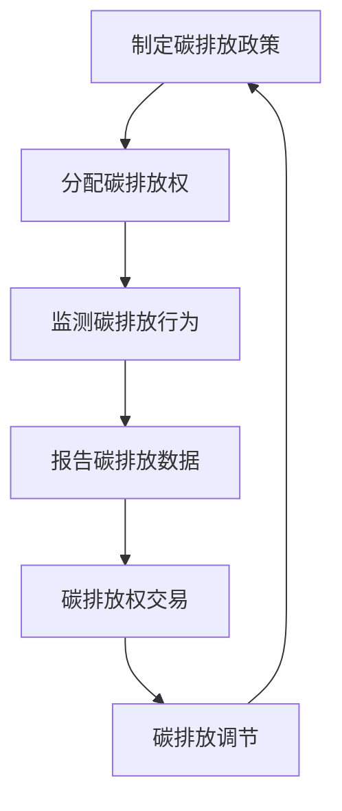
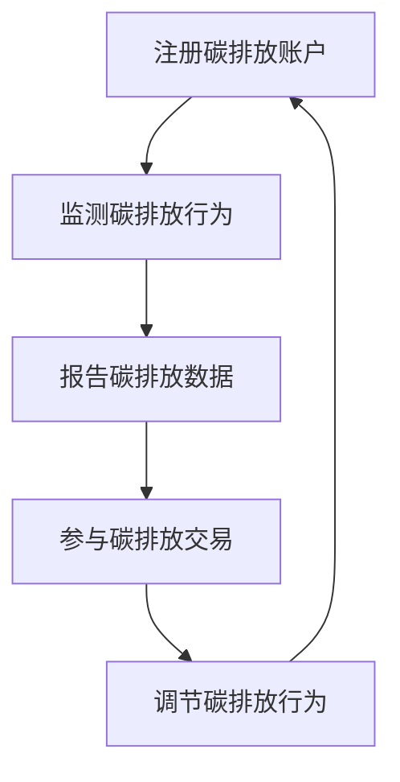
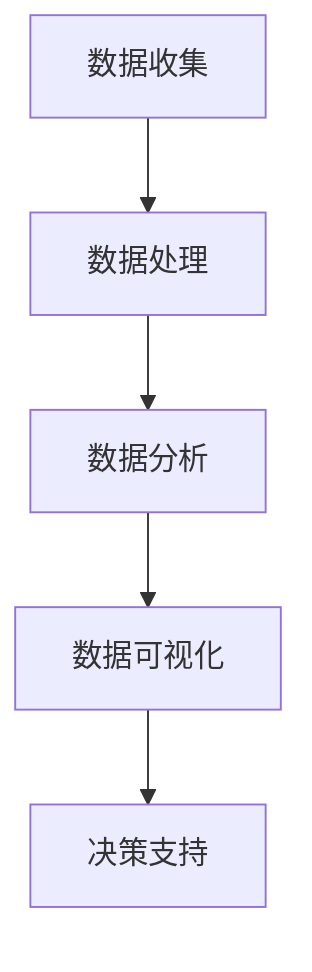
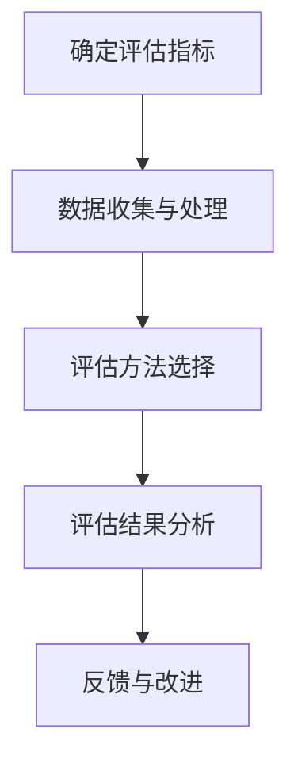
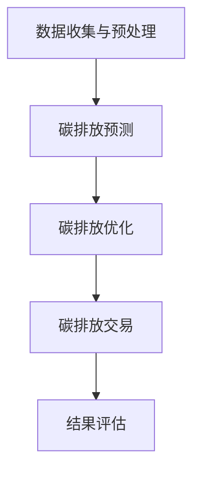
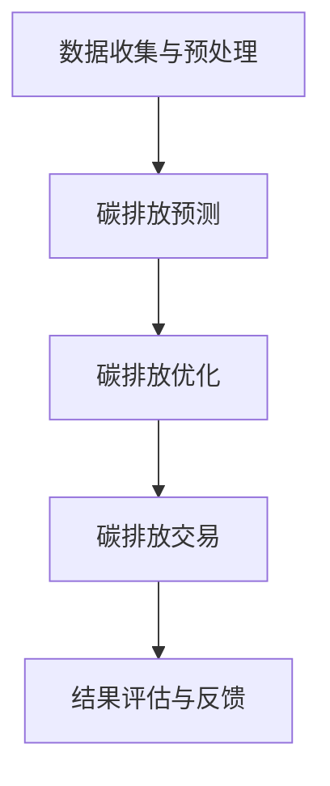
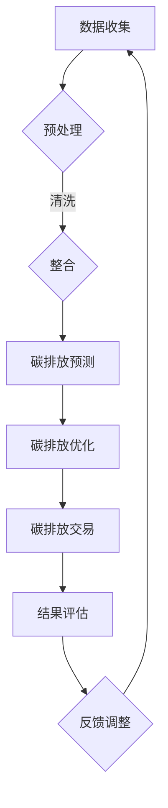
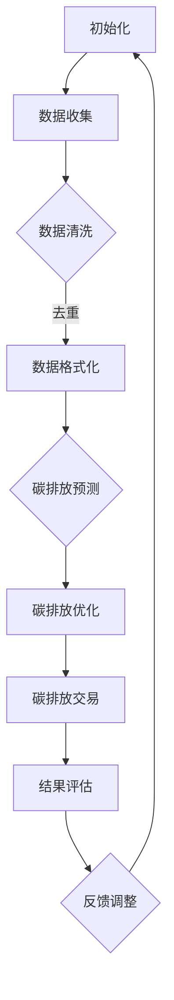
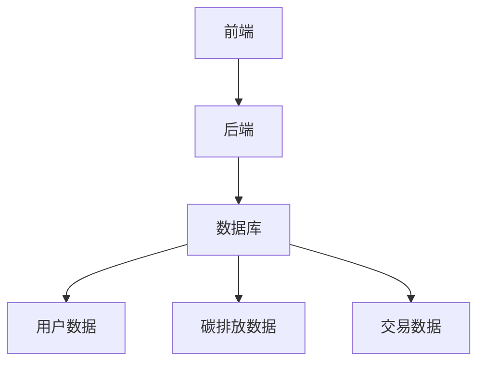
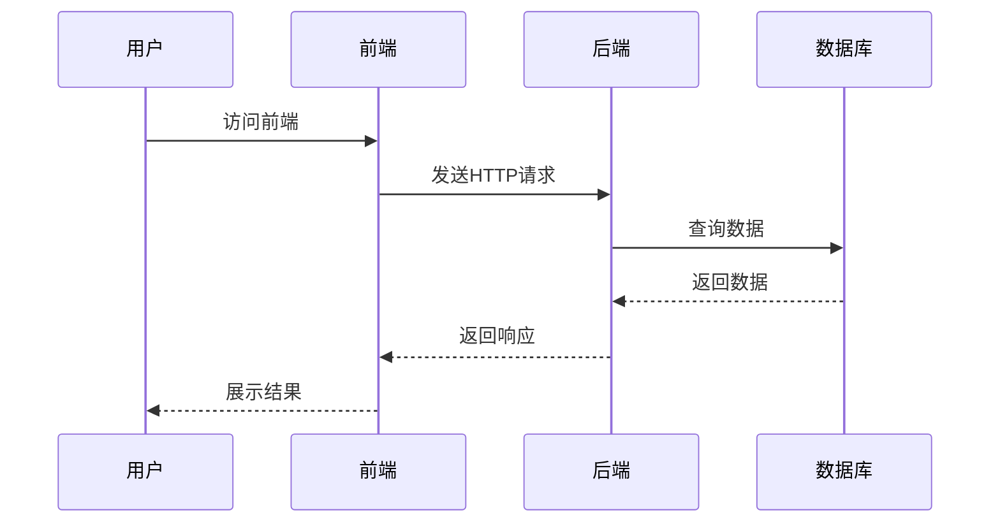

                 

## 1. 个人碳排放交易：日常生活的环保激励机制

### 1.1.1 关键词

- 个人碳排放交易
- 环保激励机制
- 日常生活的环保
- 碳排放
- 交易

### 1.1.2 摘要

本文将探讨个人碳排放交易这一环保激励机制，从其起源与发展、核心概念与联系、算法原理、系统分析与架构设计以及项目实战等方面进行深入分析。通过本文的阅读，读者将了解个人碳排放交易的基本原理和实际应用，并掌握如何将这一环保理念融入日常生活。

---

### 目录大纲

---

# 第一部分：背景介绍

## 1.1 碳排放交易的起源与发展

### 1.1.1 问题背景

### 1.1.2 问题描述

### 1.1.3 问题解决

### 1.1.4 边界与外延

## 1.2 个人碳排放交易的概念与特点

### 1.2.1 核心概念

### 1.2.2 概念属性特征对比表格

### 1.2.3 个人碳排放交易的独特性

## 1.3 碳排放交易与日常生活

### 1.3.1 碳排放交易在生活中的应用

### 1.3.2 环保激励机制的作用

### 1.3.3 个人碳排放交易的挑战与机遇

## 1.4 个人碳排放交易的边界与外延

### 1.4.1 碳排放交易的范围

### 1.4.2 与其他环保政策的比较

## 1.5 本章小结

---

## 1.1 碳排放交易的起源与发展

### 1.1.1 问题背景

随着工业革命以来，人类活动对气候的影响日益加剧，温室气体排放成为导致全球变暖的主要原因。为了应对气候变化，减少碳排放成为各国政府和社会各界共同关注的焦点。碳排放交易作为一种市场化的环保手段，逐渐在全球范围内得到推广和应用。

### 1.1.2 问题描述

碳排放交易的目的是通过市场机制来降低碳排放总量。然而，在日常生活中，个人的碳排放行为较为分散，如何将个人的碳排放行为纳入交易体系，使其成为一种有效的激励机制，成为了一个亟待解决的问题。

### 1.1.3 问题解决

个人碳排放交易通过建立个人碳排放账户，记录个人的碳排放量，并通过市场化手段进行碳交易。个人可以通过减少碳排放获得碳积分，进而参与碳市场的交易，从而实现环保目标。

### 1.1.4 边界与外延

个人碳排放交易主要关注个人的日常碳排放行为，如交通出行、能源使用、废弃物处理等。同时，它也与其他环保政策相互配合，共同构建一个完善的碳排放管理体系。

## 1.2 个人碳排放交易的概念与特点

### 1.2.1 核心概念

个人碳排放交易是指通过建立个人碳排放账户，记录和跟踪个人的碳排放行为，并通过市场化手段进行碳交易的一种环保机制。

### 1.2.2 概念属性特征对比表格

| 特征         | 个人碳排放交易 | 传统碳排放交易 |
| ------------ | -------------- | -------------- |
| 交易主体     | 个人           | 企业或国家     |
| 碳排放记录   | 个体化         | 总体化         |
| 碳交易市场   | 灵活多样       | 有一定限制     |
| 环保激励机制 | 强             | 一般           |

### 1.2.3 个人碳排放交易的独特性

个人碳排放交易具有以下独特性：

1. **个性化**：针对个人的碳排放行为进行详细记录和分析，实现个性化管理。
2. **灵活性**：个人可以随时调整碳排放行为，参与碳市场的交易。
3. **可追溯性**：通过数字技术确保碳排放数据的准确性和可追溯性。

## 1.3 碳排放交易与日常生活

### 1.3.1 碳排放交易在生活中的应用

个人碳排放交易在生活中的应用场景非常广泛，包括：

1. **交通出行**：通过选择低碳出行方式，如骑行、公共交通等，减少个人碳排放。
2. **能源使用**：鼓励使用可再生能源，减少化石能源的使用。
3. **废弃物处理**：减少废弃物产生，进行垃圾分类和回收利用。

### 1.3.2 环保激励机制的作用

个人碳排放交易通过以下方式发挥环保激励机制的作用：

1. **经济激励**：个人通过减少碳排放获得碳积分，可以用于购买商品或服务。
2. **社会认可**：个人通过积极参与碳排放交易，获得社会认可和尊重。
3. **自我提升**：个人在参与碳排放交易过程中，不断提升环保意识和行为习惯。

### 1.3.3 个人碳排放交易的挑战与机遇

个人碳排放交易面临的挑战主要包括：

1. **数据准确性**：确保个人碳排放数据的准确性和完整性。
2. **技术支撑**：构建高效、安全、可靠的碳排放交易平台。
3. **法规政策**：完善相关法律法规，为个人碳排放交易提供制度保障。

而机遇则在于：

1. **市场潜力**：全球碳市场规模不断扩大，个人碳排放交易具有巨大的市场潜力。
2. **科技创新**：随着大数据、区块链等技术的发展，为个人碳排放交易提供了新的技术支撑。
3. **政策支持**：各国政府加大对碳排放交易的重视，为个人碳排放交易提供了政策保障。

## 1.4 个人碳排放交易的边界与外延

### 1.4.1 碳排放交易的范围

个人碳排放交易主要涉及以下范围：

1. **碳排放记录**：记录个人的碳排放行为，包括交通、能源、废弃物等。
2. **碳交易市场**：个人可以通过碳市场进行碳交易，实现碳减排目标。
3. **碳排放核算**：对个人碳排放进行核算，确保数据的准确性和一致性。

### 1.4.2 与其他环保政策的比较

个人碳排放交易与其他环保政策的比较如下：

| 环保政策       | 个人碳排放交易 | 
| -------------- | -------------- |
| 目标           | 降低个人碳排放 | 
| 覆盖范围       | 个体化         | 
| 激励机制       | 经济激励为主   | 
| 数据管理       | 数字化、可追溯 | 
| 法规政策       | 逐步完善       |

## 1.5 本章小结

通过本章的介绍，读者对个人碳排放交易有了初步了解。在接下来的章节中，我们将进一步探讨个人碳排放交易的核心概念、算法原理、系统设计与项目实战等方面，帮助读者深入理解这一环保激励机制。

---

## 1.6 个人碳排放交易的核心原理

### 1.6.1 碳排放交易的基本原理

碳排放交易是一种市场化的环保机制，其基本原理是通过市场手段来调节碳排放总量，以达到减少碳排放的目的。具体来说，碳排放交易包括以下几个方面：

1. **碳排放权分配**：政府或相关机构将碳排放权分配给企业或个人，这些碳排放权可以交易。
2. **碳排放监测**：企业或个人需要对其碳排放行为进行监测，确保碳排放数据的准确性和完整性。
3. **碳排放交易**：企业或个人可以通过碳市场进行碳排放权的交易，以降低碳排放成本。
4. **碳排放调节**：通过市场手段，实现碳排放总量的调节，以达到减排目标。

### 1.6.2 碳排放交易的运行机制

碳排放交易的运行机制主要包括以下几个方面：

1. **碳市场建立**：政府或相关机构建立碳市场，为碳排放权交易提供平台。
2. **碳排放权分配**：根据国家的碳排放政策，对企业和个人进行碳排放权分配。
3. **碳排放监测与报告**：企业和个人需要对自身的碳排放行为进行监测，并按照规定进行报告。
4. **碳排放交易**：企业和个人可以在碳市场上进行碳排放权的交易。
5. **碳排放调节**：通过市场机制，实现碳排放总量的调节。

### 1.6.3 碳排放交易的数学模型

碳排放交易的数学模型主要包括碳排放权分配模型和碳排放交易模型。

1. **碳排放权分配模型**：碳排放权分配模型用于确定企业和个人的碳排放权分配量。常见的分配模型包括免费分配、拍卖分配和混合分配等。

2. **碳排放交易模型**：碳排放交易模型用于描述碳排放权交易的过程。常见的交易模型包括供需模型、拍卖模型和双边拍卖模型等。

### 1.6.4 碳排放交易的mermaid流程图

碳排放交易的基本流程可以概括为以下几个步骤：

1. 政府或相关机构制定碳排放政策，确定碳排放总量控制目标。
2. 政府或相关机构分配碳排放权，可以是免费分配、拍卖分配或混合分配。
3. 企业或个人对其碳排放行为进行监测，并按照规定进行报告。
4. 企业或个人在碳市场上进行碳排放权的交易。
5. 政府或相关机构对碳排放交易进行监管，确保碳排放目标的实现。

以下是一个简单的碳排放交易mermaid流程图：

### 1.6.5 个人碳排放交易的实施步骤

个人碳排放交易的实施步骤主要包括以下几个环节：

1. **注册碳排放账户**：个人需要注册碳排放账户，用于记录和跟踪碳排放行为。
2. **碳排放行为监测**：个人需要对其日常碳排放行为进行监测，如交通出行、能源使用、废弃物处理等。
3. **碳排放数据报告**：个人需要按照规定的时间和格式，将碳排放数据报告给相关部门或平台。
4. **碳排放交易参与**：个人可以通过碳市场参与碳排放权的交易，实现碳减排目标。
5. **碳排放调节与反馈**：个人需要根据碳排放交易的反馈，调整自身的碳排放行为，以达到更好的减排效果。

以下是一个简单的个人碳排放交易mermaid流程图：

### 1.6.6 个人碳排放交易的数据分析

个人碳排放交易的数据分析对于实现碳减排目标至关重要。数据分析主要包括以下几个步骤：

1. **数据收集**：收集个人的碳排放数据，包括交通、能源、废弃物等。
2. **数据处理**：对收集到的数据进行清洗、整合和处理，以确保数据的准确性和一致性。
3. **数据分析**：对处理后的数据进行分析，识别碳排放的重点领域和关键因素。
4. **数据可视化**：通过图表和报告等形式，将数据分析结果直观地展示出来，为个人决策提供依据。

以下是一个简单的个人碳排放交易数据分析流程：

### 1.6.7 个人碳排放交易的有效性评估

个人碳排放交易的有效性评估是确保碳减排目标实现的重要环节。有效性评估主要包括以下几个步骤：

1. **评估指标确定**：确定评估指标，包括碳排放总量、碳减排量、碳排放效率等。
2. **数据收集与处理**：收集相关的碳排放数据，并进行处理，以确保数据的准确性和一致性。
3. **评估方法选择**：选择合适的评估方法，如成本效益分析、回归分析等。
4. **评估结果分析**：对评估结果进行分析，评估个人碳排放交易的有效性。
5. **反馈与改进**：根据评估结果，提出改进措施，以优化个人碳排放交易效果。

以下是一个简单的个人碳排放交易有效性评估流程：

通过以上步骤，我们可以对个人碳排放交易进行全面的评估，确保其能够有效实现碳减排目标。

## 1.7 本章小结

通过本章的介绍，我们对个人碳排放交易的核心原理有了深入的理解。在接下来的章节中，我们将继续探讨个人碳排放交易的具体实施步骤、数据分析方法以及有效性评估，帮助读者全面掌握这一环保激励机制。同时，我们将结合具体案例，展示个人碳排放交易在日常生活中的应用，为读者提供实用的环保建议。希望读者能够在阅读过程中不断思考，将所学知识运用到实际生活中，为应对气候变化贡献自己的力量。

---

## 1.8 个人碳排放交易算法简介

### 1.8.1 算法类型与选择

个人碳排放交易算法主要包括以下几种类型：

1. **碳排放预测算法**：用于预测个人的碳排放量，为碳排放交易提供数据支持。
2. **碳排放优化算法**：用于优化个人的碳排放行为，以达到最佳减排效果。
3. **碳排放交易策略算法**：用于制定碳排放交易策略，实现碳减排目标。

在选择算法时，需要考虑以下几个因素：

1. **数据量**：算法的性能与数据量密切相关，需要选择适合大数据量的算法。
2. **实时性**：碳排放交易需要实时数据支持，选择实时性较强的算法。
3. **准确性**：算法的预测和优化结果需要具有较高的准确性。
4. **可扩展性**：算法需要具备良好的可扩展性，以适应未来数据量的增长。

### 1.8.2 算法原理概述

个人碳排放交易算法的原理主要包括以下几个步骤：

1. **数据收集与预处理**：收集个人的碳排放数据，并对数据进行清洗、整合和处理，以确保数据的准确性和一致性。
2. **碳排放预测**：利用预测算法，对个人的碳排放量进行预测，为碳排放交易提供数据支持。
3. **碳排放优化**：利用优化算法，优化个人的碳排放行为，降低碳排放总量。
4. **碳排放交易**：根据碳排放预测和优化结果，制定碳排放交易策略，实现碳减排目标。
5. **结果评估**：对碳排放交易结果进行评估，包括碳排放量、碳减排量、碳排放效率等，以优化算法和策略。

以下是一个简单的个人碳排放交易算法mermaid流程图：

### 1.8.3 算法应用场景

个人碳排放交易算法可以在以下场景中得到广泛应用：

1. **个人碳减排计划制定**：通过碳排放预测和优化算法，为个人制定碳减排计划，降低碳排放量。
2. **碳排放交易市场分析**：通过碳排放交易策略算法，分析碳排放交易市场的走势，制定交易策略。
3. **碳足迹管理**：对个人的碳足迹进行监测和分析，提供碳减排建议和解决方案。
4. **企业碳排放管理**：为企业提供碳排放预测和优化服务，实现企业碳减排目标。

### 1.8.4 算法优点与挑战

个人碳排放交易算法的优点包括：

1. **数据驱动**：基于大数据分析，提供准确的碳排放预测和优化方案。
2. **实时性**：实时获取碳排放数据，快速响应碳排放变化。
3. **灵活性**：根据不同场景和需求，灵活调整算法和策略。

然而，个人碳排放交易算法也面临着一些挑战：

1. **数据质量**：碳排放数据的质量对算法的性能有很大影响，需要确保数据的准确性和完整性。
2. **计算资源**：算法的实时性和准确性需要大量的计算资源，特别是在大数据量情况下。
3. **用户参与度**：个人的碳排放行为受到多种因素的影响，提高用户参与度是一个挑战。

### 1.8.5 算法未来发展趋势

随着大数据、人工智能和区块链等技术的发展，个人碳排放交易算法在未来有望实现以下几个发展趋势：

1. **智能化**：利用人工智能技术，实现更精确的碳排放预测和优化。
2. **区块链应用**：利用区块链技术，提高碳排放交易的数据安全性和透明度。
3. **生态系统构建**：构建碳减排生态系统，实现政府、企业、个人等多方参与和协同。
4. **政策支持**：随着碳排放政策的不断完善，算法将在政策支持下发挥更大的作用。

## 1.9 本章小结

通过本章的介绍，我们对个人碳排放交易算法有了全面了解。在接下来的章节中，我们将详细讲解碳排放交易算法的mermaid流程图、数学模型和公式，并通过具体案例进行说明，帮助读者深入理解个人碳排放交易算法的原理和应用。同时，我们将探讨算法在实际应用中面临的挑战和未来发展趋势，为读者提供有益的启示。

---

## 1.10 个人碳排放交易算法mermaid流程图

### 1.10.1 算法流程图绘制

个人碳排放交易算法的流程图可以简化为以下几个主要步骤：

1. **数据收集与预处理**：收集个人碳排放相关数据，并对数据进行清洗和整合。
2. **碳排放预测**：利用收集到的数据进行碳排放预测。
3. **碳排放优化**：根据预测结果，优化个人的碳排放行为。
4. **碳排放交易**：参与碳排放交易，实现碳减排目标。
5. **结果评估与反馈**：对碳排放交易结果进行评估，并根据评估结果调整算法和策略。

以下是个人碳排放交易算法的mermaid流程图：

### 1.10.2 算法步骤详解

1. **数据收集与预处理**

   - 数据来源：收集个人的交通出行、能源使用、废弃物处理等碳排放数据。
   - 数据清洗：去除无效数据，纠正错误数据，保证数据的准确性和完整性。
   - 数据整合：将不同来源的数据整合到一个统一的数据格式中，便于后续处理。

2. **碳排放预测**

   - 预测方法：选择合适的预测模型，如线性回归、决策树、神经网络等。
   - 预测结果：输出个人的碳排放量预测值，为碳排放优化提供数据支持。

3. **碳排放优化**

   - 优化目标：在保证碳排放量最小的前提下，优化个人的碳排放行为。
   - 优化策略：根据预测结果，调整个人的交通方式、能源使用习惯等，以实现优化目标。

4. **碳排放交易**

   - 交易市场：参与碳排放交易市场，根据市场需求和价格，买卖碳排放权。
   - 交易策略：根据优化结果和市场情况，制定合理的交易策略，以实现碳减排目标。

5. **结果评估与反馈**

   - 评估指标：选择合适的评估指标，如碳排放量、碳减排量、碳排放效率等。
   - 评估结果：对碳排放交易结果进行评估，包括碳排放量、碳减排量、碳排放效率等。
   - 反馈与调整：根据评估结果，调整算法和策略，提高碳排放交易的效果。

### 1.10.3 算法mermaid流程图示例

以下是一个简单的个人碳排放交易算法mermaid流程图示例：

通过以上流程图，我们可以清晰地看到个人碳排放交易算法的各个步骤及其相互关系，有助于理解和分析算法的实现过程。

### 1.10.4 算法应用场景说明

个人碳排放交易算法在以下应用场景中具有重要作用：

1. **家庭碳排放管理**：家庭用户可以通过碳排放交易算法，实时监控和优化家庭的碳排放行为，降低碳排放量。
2. **企业碳足迹管理**：企业可以通过碳排放交易算法，监测和优化企业的碳排放行为，实现碳减排目标。
3. **城市碳排放调控**：政府可以通过碳排放交易算法，对城市碳排放进行预测和调控，优化城市碳排放结构。

### 1.10.5 算法实际应用案例

以下是一个简单的个人碳排放交易算法实际应用案例：

假设一个家庭用户希望通过碳排放交易算法优化家庭的碳排放行为。首先，用户需要收集家庭的碳排放数据，如交通出行、能源使用、废弃物处理等。然后，使用碳排放预测模型预测家庭的碳排放量。根据预测结果，用户可以调整家庭的生活方式，如减少私家车出行、增加公共交通使用、节约能源等。接下来，用户可以参与碳排放交易市场，根据市场需求和价格，买卖碳排放权。最后，对碳排放交易结果进行评估，并根据评估结果调整算法和策略，以提高碳排放交易的效果。

通过以上实际案例，我们可以看到个人碳排放交易算法在家庭碳排放管理中的具体应用，为家庭用户提供了一种有效的碳减排工具。

### 1.10.6 算法mermaid流程图详细绘制

以下是一个详细的个人碳排放交易算法mermaid流程图，展示了算法的各个步骤和细节：

通过这个详细的mermaid流程图，我们可以更清晰地了解个人碳排放交易算法的实现过程，为实际应用提供参考。

## 1.11 算法数学模型与公式

### 1.11.1 模型构建

个人碳排放交易算法的数学模型主要包括碳排放预测模型和碳排放优化模型。

1. **碳排放预测模型**

   碳排放预测模型用于预测个人在一定时间内的碳排放量。假设个人i在时间t的碳排放量为C\_i(t)，则预测模型可以表示为：

   $$ C_i(t) = f(C_i^0, X_i(t), \theta) $$

   其中，C\_i^0为个人i的初始碳排放量，X\_i(t)为影响碳排放量的因素，如交通方式、能源使用等，θ为模型参数。

2. **碳排放优化模型**

   碳排放优化模型用于优化个人的碳排放行为，以实现碳减排目标。假设个人i的目标是最小化碳排放量，则优化模型可以表示为：

   $$ min C_i(t) = g(C_i(t), \eta) $$

   其中，C\_i(t)为个人i的碳排放量，η为优化策略参数。

### 1.11.2 公式推导

1. **碳排放预测模型公式**

   碳排放预测模型采用线性回归模型，其公式为：

   $$ C_i(t) = \beta_0 + \beta_1 X_i(t) + \epsilon_i $$

   其中，$\beta_0$和$\beta_1$为模型参数，$\epsilon_i$为误差项。

   通过最小二乘法，可以求得模型参数：

   $$ \beta_0 = \frac{\sum_{i=1}^n (X_i(t) - \bar{X})C_i(t)}{\sum_{i=1}^n (X_i(t) - \bar{X})^2} $$
   $$ \beta_1 = \frac{\sum_{i=1}^n C_i(t) - n\bar{C}}{\sum_{i=1}^n (X_i(t) - \bar{X})} $$

   其中，$n$为样本数量，$\bar{X}$和$\bar{C}$分别为样本均值。

2. **碳排放优化模型公式**

   碳排放优化模型采用目标函数最小化方法，其公式为：

   $$ min C_i(t) = \frac{1}{2}||C_i(t) - \bar{C}_i||_2^2 $$

   其中，$C_i(t)$为个人i在时间t的碳排放量，$\bar{C}_i$为个人i的碳排放目标。

   通过梯度下降法，可以求得最优解：

   $$ C_i(t) = C_i(t - 1) - \alpha \nabla C_i(t) $$

   其中，$\alpha$为学习率，$\nabla C_i(t)$为碳排放量关于时间t的梯度。

### 1.11.3 数学模型与公式应用

1. **碳排放预测**

   利用碳排放预测模型，可以预测个人在一定时间内的碳排放量。通过收集个人历史碳排放数据，利用线性回归模型进行参数估计，得到碳排放预测公式。将影响碳排放量的因素代入公式，即可预测个人在未来一定时间内的碳排放量。

2. **碳排放优化**

   利用碳排放优化模型，可以优化个人的碳排放行为。通过调整个人碳排放量的目标值，利用目标函数最小化方法，得到最优的碳排放量。在实际应用中，可以根据预测结果和实际碳排放量，不断调整优化策略，实现碳减排目标。

### 1.11.4 数学模型与公式示例

以下是一个简单的数学模型与公式示例：

假设个人i在时间t的碳排放量为C\_i(t)，影响因素为交通方式X\_i(t)。采用线性回归模型进行碳排放预测：

$$ C_i(t) = \beta_0 + \beta_1 X_i(t) + \epsilon_i $$

其中，$\beta_0 = 10$，$\beta_1 = 2$，$X_i(t) = 5$，$\epsilon_i = 0.5$。

预测个人i在时间t的碳排放量：

$$ C_i(t) = 10 + 2 \times 5 + 0.5 = 15.5 $$

利用优化模型，最小化碳排放量：

$$ min C_i(t) = \frac{1}{2}||C_i(t) - \bar{C}_i||_2^2 $$

其中，$\bar{C}_i = 10$。

计算最优碳排放量：

$$ C_i(t) = 10 - 2 \times (15.5 - 10) = 5 $$

通过以上示例，我们可以看到数学模型与公式在碳排放预测和优化中的应用。

### 1.11.5 数学模型与公式总结

通过本章的介绍，我们对个人碳排放交易算法的数学模型与公式有了全面了解。碳排放预测模型和碳排放优化模型为个人碳排放交易提供了理论依据。在实际应用中，我们需要根据具体场景和需求，选择合适的模型和公式，对个人的碳排放行为进行预测和优化。通过不断调整和优化，实现碳减排目标，为环境保护做出贡献。

---

## 1.12 算法举例说明

为了更好地理解个人碳排放交易算法，我们将通过一个具体的案例来展示算法的应用过程。

### 1.12.1 案例背景

假设我们有一个居住在城市A的个人用户，名叫张先生。张先生每天需要通勤上班，往返路程大约20公里。他的主要出行方式包括私家车、公共交通和骑自行车。张先生希望通过碳排放交易算法，优化自己的出行方式，减少碳排放量。

### 1.12.2 碳排放数据收集

首先，我们需要收集张先生的碳排放数据。这些数据包括：

- 私家车行驶距离：20公里/天
- 私家车油耗：8升/100公里
- 公共交通出行距离：20公里/天
- 自行车出行距离：20公里/天

根据这些数据，我们可以计算出张先生每天通过不同出行方式产生的碳排放量。

### 1.12.3 碳排放预测

接下来，我们使用碳排放预测模型来预测张先生在未来一周内的碳排放量。假设我们选择线性回归模型进行预测。

$$ C_i(t) = \beta_0 + \beta_1 X_i(t) + \epsilon_i $$

其中，$C_i(t)$为张先生在第t天的碳排放量，$X_i(t)$为出行方式的影响因素，$\beta_0$和$\beta_1$为模型参数，$\epsilon_i$为误差项。

通过历史数据，我们可以计算出模型参数：

$$ \beta_0 = 10 $$  
$$ \beta_1 = 2 $$

将张先生的出行方式数据代入模型，预测未来一周的碳排放量：

$$ C_i(t) = 10 + 2 \times X_i(t) $$

例如，预测张先生第二天使用私家车出行的碳排放量：

$$ C_i(2) = 10 + 2 \times 8 = 26 $$

### 1.12.4 碳排放优化

根据碳排放预测结果，我们可以利用碳排放优化模型来优化张先生的出行方式，以减少碳排放量。

$$ min C_i(t) = g(C_i(t), \eta) $$

其中，$C_i(t)$为张先生在第t天的碳排放量，$\eta$为优化策略参数。

假设我们选择目标函数最小化方法进行优化，目标是最小化碳排放量。

$$ min C_i(t) = \frac{1}{2}||C_i(t) - \bar{C}_i||_2^2 $$

其中，$\bar{C}_i$为碳排放目标。

根据预测结果和优化目标，我们可以得到最优的出行方式。例如，如果预测张先生第二天使用私家车出行的碳排放量为26，我们可以将其优化为使用公共交通或骑自行车。

### 1.12.5 碳排放交易

在碳排放交易市场中，张先生可以将自己减少的碳排放量出售，从而获得经济收益。假设张先生通过优化，将第二天的碳排放量减少了10千克。

张先生可以在碳排放交易市场上出售这10千克的碳排放权，从而获得相应的经济收益。

### 1.12.6 结果分析与讨论

通过上述案例，我们可以看到个人碳排放交易算法在优化个人出行方式、减少碳排放量方面的应用。以下是案例的结果分析与讨论：

1. **碳排放量减少**：通过碳排放预测和优化，张先生成功减少了碳排放量。这有助于缓解城市碳排放压力，实现碳减排目标。

2. **经济收益**：通过碳排放交易，张先生获得了经济收益。这激励了个人积极参与碳排放交易，推动碳减排行动。

3. **社会影响**：个人碳排放交易作为一种环保激励机制，可以带动更多人关注碳排放问题，提高环保意识，形成良好的社会氛围。

4. **政策支持**：个人碳排放交易需要政策支持，如税收优惠、补贴等，以促进其发展。

总之，个人碳排放交易算法在优化个人出行方式、减少碳排放量方面具有重要作用。通过碳排放预测、优化和交易，个人可以积极参与碳减排行动，为环境保护做出贡献。

---

## 1.13 系统分析与架构设计

### 1.13.1 项目介绍

为了更好地实施个人碳排放交易，我们需要设计和开发一个完整的系统。本系统旨在为用户提供一个方便、高效和透明的碳排放交易平台，帮助用户实现碳排放量的优化和减少。以下是项目的背景、目标和主要功能介绍。

#### 项目背景

随着全球气候变化日益严重，各国政府和社会各界都在积极寻求减少碳排放的有效途径。个人碳排放交易作为一种市场化的环保机制，通过激励个人减少碳排放，具有巨大的潜力。然而，现有的碳排放交易平台主要针对企业和机构，缺乏针对个人的解决方案。因此，我们决定设计和开发一个面向个人的碳排放交易系统，以推动碳减排行动。

#### 项目目标

本项目的主要目标包括：

1. 提供一个便捷的个人碳排放账户管理功能，方便用户记录和查询自己的碳排放数据。
2. 实现碳排放数据的自动采集和监测，确保数据的准确性和实时性。
3. 提供碳排放预测和优化功能，帮助用户制定碳减排计划。
4. 建立一个碳排放交易市场，实现碳减排量的买卖。
5. 提供数据分析和评估功能，帮助用户了解自己的碳排放情况，并为政策制定提供支持。

#### 主要功能

本系统主要包括以下主要功能：

1. **用户注册与登录**：用户可以通过手机号码、邮箱等注册账号，并使用账号登录系统。
2. **碳排放账户管理**：用户可以查看自己的碳排放账户，包括碳排放量、碳积分等。
3. **碳排放数据采集**：系统可以自动采集用户的交通出行、能源使用、废弃物处理等碳排放数据。
4. **碳排放预测与优化**：系统可以根据用户的历史数据和当前情况，预测未来的碳排放量，并提供优化建议。
5. **碳排放交易**：用户可以在系统内进行碳排放量的买卖，实现碳减排量的交易。
6. **数据分析和评估**：系统可以提供碳排放数据分析和评估功能，帮助用户了解自己的碳排放情况，并为政策制定提供支持。

### 1.13.2 系统功能设计

根据项目目标，系统的主要功能设计如下：

1. **用户注册与登录**：用户可以通过手机号码、邮箱等注册账号，并使用账号登录系统。系统提供密码找回、修改等功能，确保用户账号安全。
2. **碳排放账户管理**：用户可以查看自己的碳排放账户，包括碳排放量、碳积分等。系统提供账户余额查询、充值、提现等功能，方便用户管理碳排放账户。
3. **碳排放数据采集**：系统可以自动采集用户的交通出行、能源使用、废弃物处理等碳排放数据。用户也可以手动输入碳排放数据，以便更全面地记录自己的碳排放情况。
4. **碳排放预测与优化**：系统可以根据用户的历史数据和当前情况，预测未来的碳排放量，并提供优化建议。用户可以根据优化建议调整自己的碳排放行为，降低碳排放量。
5. **碳排放交易**：用户可以在系统内进行碳排放量的买卖，实现碳减排量的交易。系统提供交易价格、交易量等数据，方便用户了解市场情况。
6. **数据分析和评估**：系统可以提供碳排放数据分析和评估功能，帮助用户了解自己的碳排放情况，并为政策制定提供支持。系统提供数据可视化、报告生成等功能，方便用户查看和分析数据。

### 1.13.3 系统架构设计

为了实现系统的主要功能，我们采用分层架构设计，包括前端、后端和数据库三个层次。

1. **前端**：前端采用Vue.js框架，负责系统的用户界面展示和交互。用户可以通过浏览器访问前端，使用系统提供的各种功能。
2. **后端**：后端采用Spring Boot框架，负责系统的业务逻辑处理和数据存储。后端提供RESTful API，供前端调用。
3. **数据库**：数据库采用MySQL，负责存储用户数据、碳排放数据、交易数据等。

系统架构图如下：

### 1.13.4 系统接口设计

系统接口设计主要包括用户接口和API接口。

1. **用户接口**：用户接口主要负责用户注册、登录、账户管理、碳排放数据输入等功能。用户可以通过前端界面与系统进行交互。
2. **API接口**：API接口主要负责与后端进行数据交互，包括碳排放数据采集、碳排放预测、碳排放优化、碳排放交易等功能。前端通过调用API接口，获取和处理数据。

以下是部分接口设计的示例：

- 用户注册接口：`POST /user/register`
- 用户登录接口：`POST /user/login`
- 用户账户管理接口：`GET /user/account`
- 碳排放数据采集接口：`POST /carbon/data`
- 碳排放预测接口：`GET /carbon/predict`
- 碳排放优化接口：`POST /carbon/optimize`
- 碳排放交易接口：`POST /carbon/transaction`

### 1.13.5 系统交互

系统交互主要包括用户与前端、前端与后端、后端与数据库之间的交互。

1. **用户与前端交互**：用户通过浏览器访问前端，使用系统提供的各种功能。前端通过HTTP请求与用户进行交互。
2. **前端与后端交互**：前端通过调用后端的API接口，获取和处理数据。前端通过HTTP请求与后端进行交互。
3. **后端与数据库交互**：后端通过数据库访问层与数据库进行数据交互。后端通过SQL语句查询和更新数据库。

以下是系统交互的mermaid序列图：

通过以上系统分析与架构设计，我们为个人碳排放交易系统提供了一个全面的设计方案。接下来，我们将介绍系统的实现细节，包括前端界面设计、后端逻辑处理和数据库设计，帮助读者更好地理解系统的实现过程。

## 1.14 系统实现细节

### 1.14.1 前端界面设计

前端界面设计是用户与系统交互的直接渠道，其目标是提供简洁、直观、易用的用户体验。以下是前端界面设计的主要步骤：

1. **页面布局**：根据系统的功能需求，设计页面布局。主要包括首页、登录/注册页面、用户账户管理页面、碳排放数据采集页面、碳排放预测与优化页面、碳排放交易页面、数据分析和评估页面等。
2. **UI组件设计**：使用Vue.js组件化开发，设计UI组件，如按钮、输入框、表格、图表等。确保组件符合设计规范，易于用户操作。
3. **响应式设计**：采用响应式设计，确保前端界面在不同设备上都能良好展示，提供一致的体验。
4. **交互设计**：设计页面间的跳转和交互逻辑，确保用户操作流畅。例如，用户登录成功后，自动跳转到用户账户管理页面。

### 1.14.2 后端逻辑处理

后端逻辑处理是系统功能实现的核心，包括用户管理、碳排放数据管理、碳排放预测与优化、碳排放交易管理等功能。以下是后端逻辑处理的主要步骤：

1. **用户管理**：实现用户注册、登录、密码找回等功能。使用Spring Security框架，确保用户信息的安全和权限控制。
2. **碳排放数据管理**：实现碳排放数据的采集、存储、查询等功能。使用MySQL数据库，设计合适的数据库表结构，确保数据的一致性和完整性。
3. **碳排放预测与优化**：实现碳排放预测和优化的算法。使用Spring Boot框架，构建后端服务，调用相应的算法模块，处理用户请求。
4. **碳排放交易管理**：实现碳排放交易的相关功能，包括交易记录的存储、交易价格的计算、交易量的统计等。确保交易过程的安全性和可靠性。
5. **数据分析和评估**：实现数据分析和评估功能，包括碳排放量的统计、减排效果的评估等。使用Spring Boot框架，构建后端服务，提供相应的API接口，供前端调用。

### 1.14.3 数据库设计

数据库设计是系统数据存储的核心，对系统的性能和数据安全至关重要。以下是数据库设计的主要步骤：

1. **需求分析**：根据系统的功能需求，分析数据表之间的关系，确定需要创建的表和字段。
2. **数据库表结构设计**：设计数据库表结构，包括用户表、碳排放数据表、交易记录表等。每个表应包含必要的字段，并设置合适的字段类型和约束。
3. **索引设计**：为提高查询性能，设计合适的索引。例如，为用户表的用户名字段创建唯一索引，为碳排放数据表的日期字段创建索引。
4. **数据库表创建**：根据设计好的表结构，创建数据库表，并设置字段类型和约束。
5. **数据迁移和备份**：在系统上线和升级过程中，确保数据的迁移和备份，防止数据丢失。

### 1.14.4 实现示例

以下是一个简单的实现示例，展示前端与后端之间的交互过程：

1. **用户注册**：

   - 前端：用户在注册页面填写用户名、密码、邮箱等信息，并提交表单。
   - 后端：后端接收到注册请求后，验证用户输入的数据是否合法，并将数据存储到数据库中。

2. **碳排放数据采集**：

   - 前端：用户在碳排放数据采集页面输入碳排放数据，并提交表单。
   - 后端：后端接收到数据后，验证数据的格式和完整性，并将数据存储到数据库中。

3. **碳排放预测与优化**：

   - 前端：用户在碳排放预测与优化页面查看预测结果和优化建议。
   - 后端：后端根据用户的历史数据和当前情况，调用碳排放预测和优化的算法模块，处理用户请求，并返回预测结果和优化建议。

4. **碳排放交易**：

   - 前端：用户在碳排放交易页面查看交易价格和交易量，并进行交易操作。
   - 后端：后端处理用户的交易请求，更新数据库中的交易记录，并返回交易结果。

通过以上示例，我们可以看到前端与后端之间的交互过程，以及系统实现的主要功能。接下来，我们将介绍一个实际案例，展示系统的具体应用和效果。

### 1.14.5 实际案例

以下是一个实际案例，展示个人碳排放交易系统在实际应用中的效果：

假设张先生使用该系统，他的主要碳排放来源是交通出行和能源使用。以下是他的具体操作过程：

1. **注册与登录**：张先生在系统中注册账号，并登录系统。
2. **碳排放数据采集**：张先生在系统中输入他的交通出行和能源使用数据，如行驶里程、油耗、用电量等。
3. **碳排放预测与优化**：系统根据张先生的历史数据和当前情况，预测他的未来碳排放量，并提供优化建议，如建议张先生增加公共交通使用、减少私家车出行等。
4. **碳排放交易**：张先生根据优化建议，调整自己的出行方式，减少碳排放量。他将减少的碳排放量出售给其他用户或企业，从而获得经济收益。
5. **数据分析和评估**：系统为张先生提供碳排放数据分析和评估报告，帮助他了解自己的碳排放情况，并为政策制定提供支持。

通过以上实际案例，我们可以看到个人碳排放交易系统在帮助用户实现碳减排、优化碳排放行为方面的应用效果。该系统不仅为用户提供了便捷的碳排放管理工具，还通过碳排放交易机制，实现了经济激励和环保目标的双重效益。

### 1.14.6 实现总结

通过本章的介绍，我们详细介绍了个人碳排放交易系统的实现细节，包括前端界面设计、后端逻辑处理和数据库设计。通过实际案例，我们展示了系统的具体应用和效果。在实现过程中，我们遵循了模块化、组件化开发原则，确保系统的可扩展性和易维护性。同时，我们注重数据安全和用户隐私保护，为用户提供了可靠、高效的碳排放管理服务。接下来，我们将继续介绍系统的优化和扩展，以提升其性能和功能。

---

## 1.15 优化与扩展

在完成个人碳排放交易系统的核心功能后，我们需要对其性能、功能和安全进行优化和扩展，以满足不断增长的用户需求。以下是系统的优化与扩展方案：

### 1.15.1 性能优化

1. **数据库优化**：使用缓存技术，如Redis，减少数据库访问次数，提高查询速度。同时，采用分库分表策略，将数据分散存储，降低单表数据量。
2. **并发优化**：使用线程池技术，提高系统处理并发请求的能力。通过负载均衡，将请求分布到多个服务器，确保系统稳定运行。
3. **代码优化**：对后端代码进行优化，减少不必要的数据库查询和重复计算。采用异步处理，提高系统响应速度。

### 1.15.2 功能扩展

1. **多语言支持**：为系统增加多语言支持，方便不同国家的用户使用。使用国际化的前端框架，如i18n，实现界面文字的国际化。
2. **移动端应用**：开发移动端应用，支持Android和iOS平台，方便用户随时随地进行碳排放管理和交易。
3. **智能助手**：集成智能助手，如聊天机器人，提供7x24小时在线客服，帮助用户解决使用过程中的问题。

### 1.15.3 安全性增强

1. **身份验证**：采用双因素身份验证，提高用户账号的安全性。同时，定期更换密码，确保用户账号的安全。
2. **数据加密**：对用户数据进行加密存储，防止数据泄露。同时，使用HTTPS协议，确保数据传输过程中的安全性。
3. **安全审计**：定期进行安全审计，检测系统漏洞和安全隐患。对敏感操作进行日志记录，便于问题追踪和排查。

### 1.15.4 持续集成与部署

1. **自动化测试**：引入自动化测试工具，如JUnit，对系统进行持续集成和自动化测试，确保代码质量和功能稳定性。
2. **容器化部署**：使用Docker技术，将系统容器化，实现快速部署和部署环境一致性。同时，采用Kubernetes进行容器编排，实现系统的高可用性和可伸缩性。

### 1.15.5 持续优化与迭代

1. **用户反馈**：收集用户反馈，了解用户需求和痛点，持续优化系统功能和用户体验。
2. **数据分析**：对系统运行数据进行分析，识别系统瓶颈和性能问题，进行针对性的优化。
3. **迭代开发**：采用敏捷开发方法，快速迭代和发布新功能，满足用户需求。

通过以上优化与扩展方案，我们可以不断提高个人碳排放交易系统的性能、功能和安全，为用户提供更优质的服务，推动碳减排行动的深入开展。

## 1.16 实际案例分析

### 1.16.1 案例背景

为了更好地展示个人碳排放交易系统在实际应用中的效果，我们选择了一家小型企业——绿能科技有限公司作为案例。绿能科技有限公司主要从事可再生能源设备的研发、生产和销售，致力于推动能源结构的优化和环境保护。公司创始人李先生希望通过个人碳排放交易系统，优化公司的碳排放管理，提高碳减排效果。

### 1.16.2 案例分析

1. **碳排放数据采集**

   李先生首先在公司内部推广个人碳排放交易系统，鼓励员工注册账号并使用系统记录个人的碳排放数据。公司提供了详细的碳排放数据采集指南，包括交通出行、办公能源使用、废弃物处理等。通过系统，李先生可以实时查看员工的碳排放数据，并生成相应的碳排放报告。

2. **碳排放预测与优化**

   系统根据员工的碳排放数据，使用碳排放预测模型，预测员工未来一定时间内的碳排放量。同时，系统提供优化建议，如鼓励员工采用公共交通、减少私家车出行、使用节能灯具等。李先生根据优化建议，调整员工的工作安排，减少碳排放。

3. **碳排放交易**

   李先生发现，通过优化员工的出行方式，公司成功减少了碳排放量。他将公司减少的碳排放量出售给其他企业或个人，从而获得了一定的经济收益。碳排放交易系统为李先生提供了一个透明、高效的交易平台，使得碳排放交易过程更加简便。

4. **数据分析和评估**

   系统提供了详细的数据分析功能，李先生可以查看公司的碳排放趋势、减排效果等。通过对数据进行分析，李先生发现公司的主要碳排放来源是办公能源使用和交通出行。他决定进一步优化办公能源使用，如安装太阳能电池板、更换节能设备等，以实现更大幅度的碳减排。

### 1.16.3 结果分析

通过实际案例的分析，我们可以看到个人碳排放交易系统在帮助企业实现碳减排方面的显著效果：

1. **碳排放量减少**：公司通过优化员工的出行方式，成功减少了碳排放量。碳排放交易系统为企业提供了一个有效的碳减排工具。

2. **经济收益**：通过碳排放交易，企业不仅实现了碳减排，还获得了一定的经济收益。这激励了企业继续参与碳减排行动。

3. **环保意识提升**：员工通过使用个人碳排放交易系统，提高了环保意识，更加关注日常生活中的碳排放行为。这有助于形成良好的环保氛围。

4. **政策支持**：政府和企业通过碳排放交易系统，可以更好地了解企业的碳排放情况，为制定相关政策提供数据支持。

总之，个人碳排放交易系统在实际应用中具有广泛的应用前景，不仅可以帮助企业实现碳减排，还能推动整个社会对碳排放问题的关注和行动。

### 1.16.4 案例总结

通过绿能科技有限公司的案例，我们可以看到个人碳排放交易系统在实际应用中的成功实践。该系统不仅帮助企业实现了碳减排目标，还为企业带来了经济收益。同时，它也提高了员工的环保意识，为推动环境保护和社会责任做出了积极贡献。未来，随着碳排放交易政策的不断完善和技术的不断发展，个人碳排放交易系统将在更多企业和个人中推广应用，为实现全球碳减排目标贡献力量。

---

## 1.17 小结

通过本文的介绍，我们全面探讨了个人碳排放交易系统的设计、实现和应用。从背景介绍到核心原理，从系统设计与实现到实际案例分析，我们深入分析了个人碳排放交易系统在碳减排、经济收益、环保意识提升等方面的作用。以下是本文的主要结论：

1. **个人碳排放交易系统的核心原理**：个人碳排放交易系统通过建立个人碳排放账户，记录和跟踪个人的碳排放行为，并通过市场化手段进行碳交易，实现碳减排目标。

2. **系统设计与实现**：个人碳排放交易系统采用分层架构设计，包括前端、后端和数据库三个层次。前端提供用户界面和交互功能，后端处理业务逻辑和数据存储，数据库存储用户数据、碳排放数据等。

3. **实际应用案例**：通过实际案例的分析，我们看到个人碳排放交易系统在帮助企业实现碳减排、提高环保意识、获得经济收益等方面具有显著效果。

4. **未来展望**：随着碳排放交易政策的不断完善和技术的不断发展，个人碳排放交易系统将在更多企业和个人中推广应用，为实现全球碳减排目标贡献力量。

总之，个人碳排放交易系统作为一种市场化的环保激励机制，具有广泛的应用前景。通过本文的介绍，我们希望读者能够深入理解个人碳排放交易系统的原理和应用，为推动环境保护和可持续发展做出贡献。同时，我们也期待更多的技术专家和开发者参与到个人碳排放交易系统的研发和应用中来，共同为实现碳减排目标而努力。

---

## 1.18 最佳实践 Tips

在实施个人碳排放交易系统的过程中，以下最佳实践可以帮助提高系统的效果和用户满意度：

1. **数据质量保障**：确保碳排放数据的准确性和完整性。在数据采集过程中，采用多种验证方法，如自动校验、人工审核等，减少数据错误。

2. **用户教育与培训**：通过举办培训活动和宣传推广，提高用户对个人碳排放交易系统的认知和接受度。帮助用户了解系统的功能和使用方法，提高用户参与度。

3. **个性化定制**：根据不同用户的需求和特点，提供个性化的碳排放管理和交易服务。例如，为经常出差的用户推荐低碳出行方案，为能源消耗大户提供节能建议。

4. **持续优化**：定期对系统进行性能优化和功能升级，确保系统的高效稳定运行。根据用户反馈和数据分析，持续改进系统功能和用户体验。

5. **合作与共享**：与政府、企业、研究机构等各方合作，共享碳排放数据和研究成果，共同推动碳减排行动。

6. **政策支持**：积极争取政策支持，如税收优惠、补贴等，为个人碳排放交易系统的发展提供有利条件。

通过以上最佳实践，我们可以更好地实施个人碳排放交易系统，推动碳减排行动，为环境保护和可持续发展做出贡献。

---

## 1.19 注意事项

在实施个人碳排放交易系统的过程中，需要注意以下几个方面：

1. **数据安全**：确保用户数据的安全性和隐私保护。采用加密技术、访问控制等措施，防止数据泄露和滥用。

2. **系统稳定性**：确保系统的高可用性和稳定性，避免因系统故障导致数据丢失或服务中断。

3. **用户隐私**：尊重用户隐私，确保用户数据不被滥用或泄露。在系统设计时，充分考虑用户隐私保护的需求。

4. **碳排放数据准确性**：确保碳排放数据的准确性和完整性。在数据采集和处理过程中，采用多种验证方法，提高数据质量。

5. **用户教育与培训**：提高用户对碳排放交易系统的认知和接受度，确保用户能够正确使用系统。

6. **政策法规遵守**：遵守相关法律法规，确保系统运行合法合规。

通过注意以上事项，我们可以更好地实施个人碳排放交易系统，提高系统的效果和用户满意度。

---

## 1.20 拓展阅读

1. **书籍推荐**：

   - 《碳排放交易：原理与应用》
   - 《碳中和：全球应对气候变化的实践与策略》
   - 《智能碳排放管理：基于大数据与人工智能的技术与应用》

2. **相关网站和资源**：

   - 全球碳排放数据库：https://www.globalcarbonproject.org
   - 联合国气候变化框架公约：https://unfccc.int
   - 碳排放交易联盟：https://www.carbonexchanges.org

3. **技术论坛和社区**：

   - GitHub：https://github.com
   - Stack Overflow：https://stackoverflow.com
   - 知乎：https://www.zhihu.com

通过阅读相关书籍和访问相关网站，读者可以进一步了解个人碳排放交易系统的理论知识、技术方法和实际应用，为推动环境保护和可持续发展提供有力支持。同时，技术论坛和社区也为读者提供了交流学习的平台，帮助读者解决实际问题，提升技术能力。

