                 

### 《义工精神：在助人中实现自我价值》

#### 关键词：义工精神、个人成长、社会责任、志愿服务、社会影响

> **摘要：**本文将探讨义工精神的重要性和其在个人成长和社会贡献中的关键作用。通过分析义工精神的起源与发展、核心价值观、不同领域的义工实践以及传播与影响，本文旨在为读者提供全面的视角，以理解和践行在助人中实现自我价值的理念。

### 第一部分：义工精神概述

#### 第1章：义工精神的起源与发展

#### 1.1.1 志愿服务的起源

**背景介绍：**  
义工精神，即志愿服务精神，起源于古代社会的互助与互爱传统。在人类社会的早期，人们为了共同的目标和利益，自愿结成群体，共同应对生活中的挑战。这种互助精神为义工精神的发展奠定了基础。

**问题描述：**  
随着社会的发展和文明的进步，义工精神如何在不同历史时期和文化背景下演变和发展？

**问题解决：**  
通过研究历史文献和现实案例，可以发现义工精神在不同文化和社会环境中都得到了广泛的传承和发扬。例如，在古希腊和古罗马时期，慈善活动和公益行为被视为高尚的品质；在中世纪的欧洲，宗教团体和修道士承担了大量的慈善工作；在现代，义工精神在全球范围内得到了广泛的推广和实践。

**边界与外延：**  
义工精神不仅局限于慈善活动，还包括环保、教育、医疗、社区服务等多个领域。其核心在于无私奉献和共同利益。

**概念结构与核心要素组成：**  
义工精神的核心要素包括：无私奉献、同理心、责任感和团队协作。

**核心概念原理：**  
义工精神是一种以无私奉献为核心的行为动机和价值观，它强调个体在社会中的责任和义务，以及通过互助和协作实现共同利益。

**概念属性特征对比表格：**

| 特征       | 描述                                                         |
| ---------- | ------------------------------------------------------------ |
| 无私奉献   | 不求回报，自愿付出时间和精力为社会和他人提供服务               |
| 同理心     | 能够理解和感受到他人的情感和需求，以同理心为基础提供帮助       |
| 责任感     | 对自己的行为和决策负责，对社会和他人的利益负责               |
| 团队协作   | 在团队中积极参与，相互支持，共同实现目标                     |

**ER实体关系图架构：**

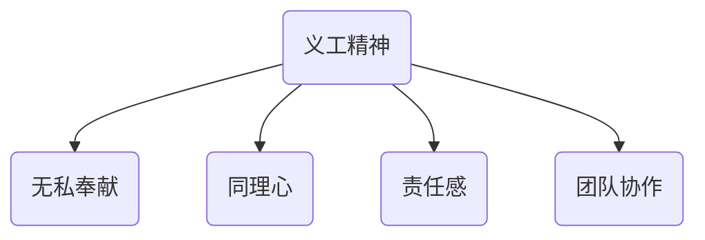

#### 1.1.2 志愿服务的发展历程

**背景介绍：**  
志愿服务作为社会活动的一种形式，经历了漫长的发展历程。在不同的历史阶段，志愿服务的形式和内容都有所不同。

**问题描述：**  
志愿服务在不同历史阶段的发展情况和主要特点是什么？

**问题解决：**  
通过研究历史文献和现实案例，可以总结出志愿服务的发展历程和主要特点。例如，古代的慈善活动、中世纪的宗教慈善、现代的志愿服务组织等。

**边界与外延：**  
志愿服务不仅局限于特定历史阶段，也跨越了不同国家和地区。

**概念结构与核心要素组成：**  
志愿服务的发展历程与义工精神的核心价值观密切相关，其核心要素包括：无私奉献、同理心、责任感和团队协作。

**核心概念原理：**  
志愿服务作为一种社会行为，体现了个体对社会责任的担当和实现自我价值的方式。

**概念属性特征对比表格：**

| 特征       | 描述                                                         |
| ---------- | ------------------------------------------------------------ |
| 发展历程   | 从古代的慈善活动到现代的志愿服务组织，不断演变和发展           |
| 主要特点   | 强调无私奉献、团队协作和社会责任感                         |

**ER实体关系图架构：**

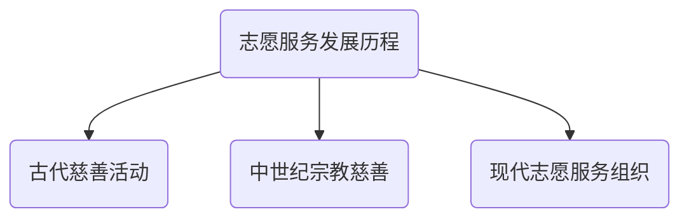

#### 1.1.3 志愿服务的全球现状

**背景介绍：**  
随着全球化和信息化的发展，志愿服务在全球范围内得到了广泛的关注和推广。

**问题描述：**  
当前全球志愿服务的现状如何？

**问题解决：**  
通过研究国际组织和媒体报道，可以了解到全球志愿服务的现状。例如，联合国志愿者计划、国际红十字会等国际组织的志愿者活动，以及各国政府和社会组织推动的志愿服务项目。

**边界与外延：**  
全球志愿服务不仅涵盖了传统领域，如教育、医疗、环保，还扩展到了新兴领域，如数字公益、科技志愿服务等。

**概念结构与核心要素组成：**  
全球志愿服务的核心要素包括：跨国合作、多元文化、科技创新和社会责任。

**核心概念原理：**  
志愿服务作为一种国际性的社会行为，强调跨国合作和多元文化的重要性。

**概念属性特征对比表格：**

| 特征           | 描述                                                         |
| -------------- | ------------------------------------------------------------ |
| 跨国合作       | 国际组织和社会组织之间的合作，共同推动全球志愿服务的发展       |
| 多元文化       | 在不同文化背景下开展志愿服务，尊重和包容多元文化             |
| 科技创新       | 利用现代科技手段，提高志愿服务的效率和影响力               |
| 社会责任       | 积极回应全球性挑战，推动社会进步和可持续发展               |

**ER实体关系图架构：**

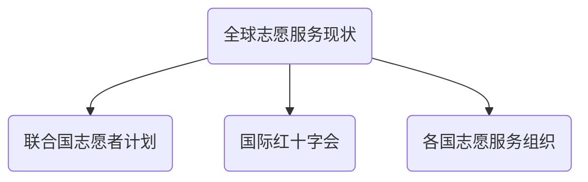

#### 第2章：义工精神的核心价值观

**2.1.1 无私奉献**

**背景介绍：**  
无私奉献是义工精神的核心价值观之一，它体现了个体对他人的关爱和责任感。

**问题描述：**  
如何理解无私奉献在义工精神中的重要性？

**问题解决：**  
无私奉献不仅是一种行为，更是一种价值观和信念。它鼓励个体在面对困难和挑战时，不图回报，自愿为社会和他人提供服务。

**边界与外延：**  
无私奉献不仅体现在志愿服务中，也渗透到日常生活的各个方面，如家庭、社区和工作等。

**概念结构与核心要素组成：**  
无私奉献的核心要素包括：关爱、责任感、自我牺牲和奉献精神。

**核心概念原理：**  
无私奉献是一种以关爱和责任感为基础的行为动机，它强调个体在社会中的责任和义务。

**概念属性特征对比表格：**

| 特征       | 描述                                                         |
| ---------- | ------------------------------------------------------------ |
| 关爱       | 对他人的关爱和同情，愿意为他们提供帮助                       |
| 责任感     | 对自己的行为和决策负责，对社会和他人的利益负责               |
| 自我牺牲   | 为了他人和社会的利益，愿意牺牲个人的利益和舒适               |
| 奉献精神   | 不求回报，自愿付出时间和精力为社会和他人提供服务           |

**ER实体关系图架构：**

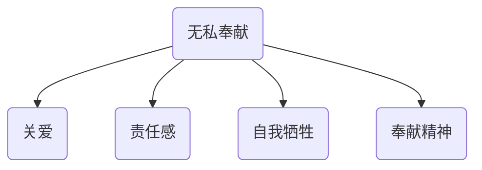

**2.1.2 同理心**

**背景介绍：**  
同理心是义工精神的重要组成部分，它体现了个体对他人的理解和感受。

**问题描述：**  
如何理解同理心在义工精神中的重要性？

**问题解决：**  
同理心不仅是一种情感，更是一种能力。它帮助个体理解他人的情感和需求，从而更有效地提供帮助和支持。

**边界与外延：**  
同理心不仅适用于志愿服务，也适用于人际交往和职业发展。

**概念结构与核心要素组成：**  
同理心的核心要素包括：感知他人情绪、理解和同理他人、有效沟通和情感共鸣。

**核心概念原理：**  
同理心是一种以感知和理解为前提的情感能力，它强调个体在社会互动中的重要性。

**概念属性特征对比表格：**

| 特征       | 描述                                                         |
| ---------- | ------------------------------------------------------------ |
| 感知他人情绪 | 通过观察和倾听，感知他人的情感和情绪状态                     |
| 理解和同理他人 | 理解他人的情感和需求，以同理心为基础提供帮助和支持           |
| 有效沟通   | 通过有效的沟通技巧，与他人建立良好的关系和信任               |
| 情感共鸣   | 在情感上与他人产生共鸣，共同面对挑战和困难                   |

**ER实体关系图架构：**

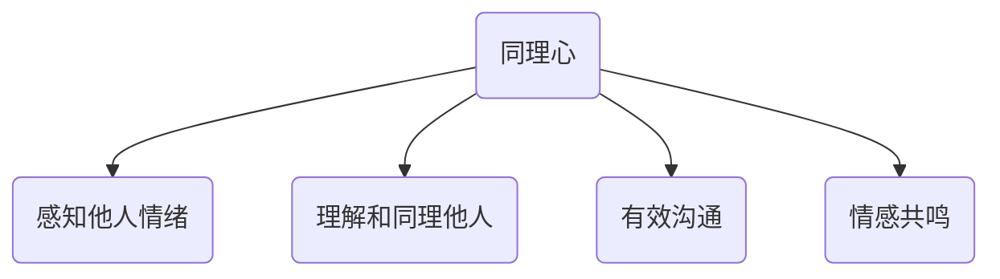

**2.1.3 责任感**

**背景介绍：**  
责任感是义工精神的重要组成部分，它体现了个体对社会责任的担当。

**问题描述：**  
如何理解责任感在义工精神中的重要性？

**问题解决：**  
责任感不仅是一种情感，更是一种行动。它鼓励个体在面对社会责任时，主动承担责任，为社会的进步和发展贡献力量。

**边界与外延：**  
责任感不仅体现在志愿服务中，也渗透到个人生活和职业生涯中。

**概念结构与核心要素组成：**  
责任感的核心要素包括：自我责任、对他人的责任、社会责任和职业责任。

**核心概念原理：**  
责任感是一种以责任和担当为基础的行为动机，它强调个体在社会中的角色和责任。

**概念属性特征对比表格：**

| 特征       | 描述                                                         |
| ---------- | ------------------------------------------------------------ |
| 自我责任   | 对自己的行为和决策负责，为自己的生活和成长负责               |
| 对他人的责任 | 对他人的安全和福祉负责，愿意为他们提供帮助和支持             |
| 社会责任   | 对社会的繁荣和进步负责，愿意为社会做出贡献                   |
| 职业责任   | 对自己的职业和职责负责，以专业和敬业的态度为他人提供服务       |

**ER实体关系图架构：**

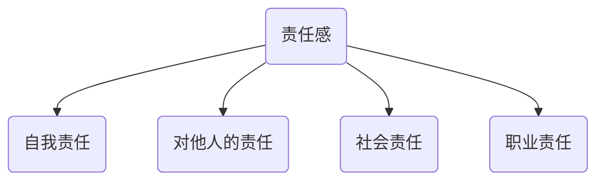

### 第二部分：不同领域的义工实践

#### 第4章：教育领域的义工工作

**4.1.1 支持贫困学生**

**背景介绍：**  
教育领域的义工工作主要包括支持贫困学生、教育资源分享和教师培训与支援。

**问题描述：**  
如何通过义工工作支持贫困学生？

**问题解决：**  
通过义工工作，可以为贫困学生提供经济援助、学习辅导和心理支持。

**边界与外延：**  
支持贫困学生的义工工作不仅限于经济援助，还包括教育和心理支持。

**概念结构与核心要素组成：**  
支持贫困学生的核心要素包括：经济援助、学习辅导和心理支持。

**核心概念原理：**  
通过义工工作，帮助贫困学生克服经济困难，提高学业成绩和心理健康。

**概念属性特征对比表格：**

| 特征       | 描述                                                         |
| ---------- | ------------------------------------------------------------ |
| 经济援助   | 为贫困学生提供生活费用和学习用品的帮助                       |
| 学习辅导   | 为贫困学生提供课业辅导和学术支持                           |
| 心理支持   | 为贫困学生提供心理健康辅导和情感支持                       |

**ER实体关系图架构：**

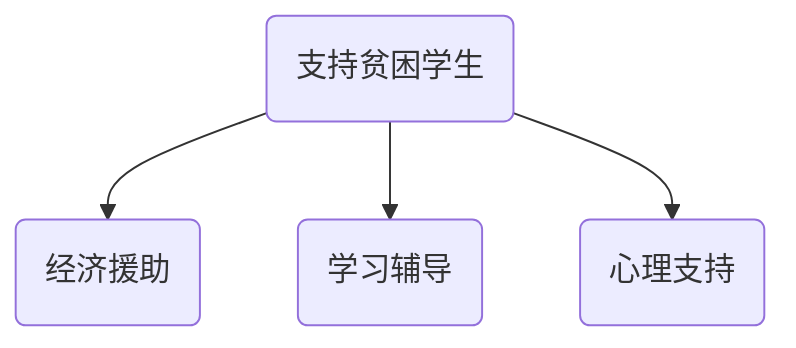

**4.1.2 教育资源分享**

**背景介绍：**  
教育资源分享是教育领域义工工作的重要组成部分，旨在缩小教育差距，提高教育质量。

**问题描述：**  
如何通过义工工作实现教育资源的分享？

**问题解决：**  
通过义工工作，可以组织教育资源分享活动，如图书捐赠、网络教育资源和在线课程等。

**边界与外延：**  
教育资源分享不仅限于物质资源，还包括知识和经验的传递。

**概念结构与核心要素组成：**  
教育资源分享的核心要素包括：图书捐赠、网络教育资源、在线课程和社区教育。

**核心概念原理：**  
通过义工工作，促进教育资源的公平分配和有效利用。

**概念属性特征对比表格：**

| 特征           | 描述                                                         |
| -------------- | ------------------------------------------------------------ |
| 图书捐赠       | 为贫困地区学校和学生捐赠图书和教材                         |
| 网络教育资源   | 建立在线教育平台，提供免费的网络教育资源                   |
| 在线课程       | 组织在线教育课程，为学生提供学习机会和资源               |
| 社区教育       | 在社区开展教育讲座和培训活动，提高居民的教育水平           |

**ER实体关系图架构：**

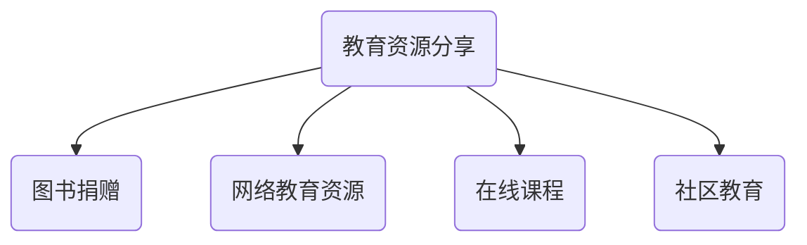

**4.1.3 教师培训与支援**

**背景介绍：**  
教师培训与支援是教育领域义工工作的重要组成部分，旨在提高教师的教学水平和教育质量。

**问题描述：**  
如何通过义工工作为教师提供培训与支援？

**问题解决：**  
通过义工工作，可以为教师提供专业培训、教学资源和心理支持。

**边界与外延：**  
教师培训与支援不仅限于专业培训，还包括教学资源共享和心理辅导。

**概念结构与核心要素组成：**  
教师培训与支援的核心要素包括：专业培训、教学资源和心理支持。

**核心概念原理：**  
通过义工工作，提高教师的专业素养和教学水平，从而提升教育质量。

**概念属性特征对比表格：**

| 特征       | 描述                                                         |
| ---------- | ------------------------------------------------------------ |
| 专业培训   | 为教师提供专业知识和教学技能的培训                         |
| 教学资源   | 为教师提供教学资源和教学工具，提高教学质量               |
| 心理支持   | 为教师提供心理辅导和情感支持，缓解教学压力               |

**ER实体关系图架构：**

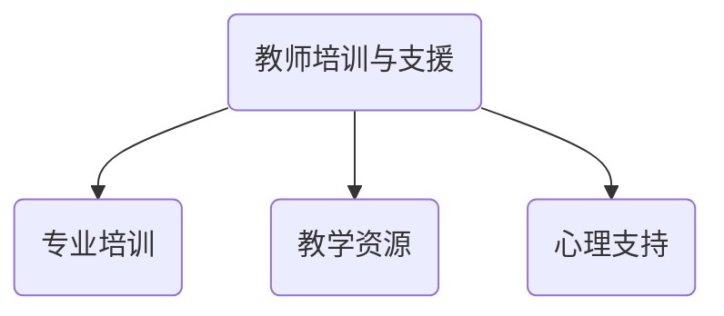

#### 第5章：医疗领域的义工服务

**5.1.1 志愿者医疗队**

**背景介绍：**  
医疗领域的义工服务主要包括志愿者医疗队、医疗知识普及和志愿者医生的工作。

**问题描述：**  
如何组建和运作志愿者医疗队？

**问题解决：**  
通过义工工作，可以组建志愿者医疗队，为偏远地区和贫困人群提供医疗服务。

**边界与外延：**  
志愿者医疗队不仅提供医疗服务，还包括健康教育和疾病预防。

**概念结构与核心要素组成：**  
志愿者医疗队的核心要素包括：医疗服务、健康教育、疾病预防和团队协作。

**核心概念原理：**  
通过义工工作，提高偏远地区和贫困人群的健康水平。

**概念属性特征对比表格：**

| 特征       | 描述                                                         |
| ---------- | ------------------------------------------------------------ |
| 医疗服务   | 为偏远地区和贫困人群提供医疗服务和疾病治疗                 |
| 健康教育   | 为公众提供健康知识和健康教育，提高健康意识               |
| 疾病预防   | 开展疾病预防活动，降低疾病发生率                         |
| 团队协作   | 志愿者之间的协作，共同完成医疗服务任务                   |

**ER实体关系图架构：**

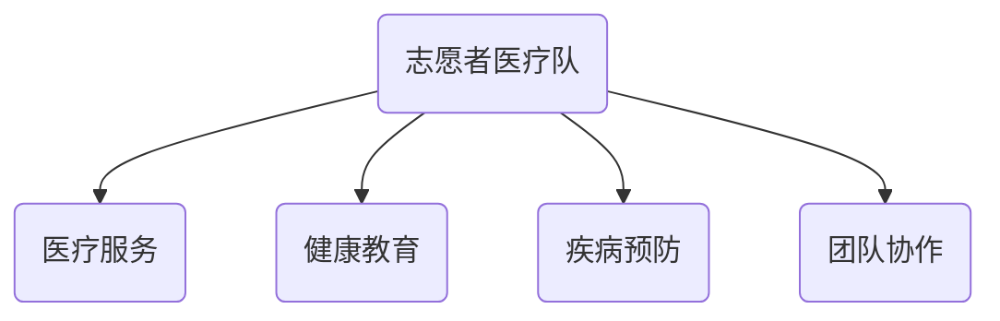

**5.1.2 医疗知识普及**

**背景介绍：**  
医疗知识普及是医疗领域义工工作的重要组成部分，旨在提高公众的健康意识和医疗知识水平。

**问题描述：**  
如何通过义工工作普及医疗知识？

**问题解决：**  
通过义工工作，可以组织健康讲座、宣传活动和在线教育，普及医疗知识。

**边界与外延：**  
医疗知识普及不仅限于医疗知识，还包括健康生活方式和疾病预防。

**概念结构与核心要素组成：**  
医疗知识普及的核心要素包括：健康讲座、宣传活动、在线教育和健康生活方式。

**核心概念原理：**  
通过义工工作，提高公众的健康意识和医疗知识水平。

**概念属性特征对比表格：**

| 特征       | 描述                                                         |
| ---------- | ------------------------------------------------------------ |
| 健康讲座   | 组织健康知识讲座，提高公众的健康意识                       |
| 宣传活动   | 开展健康宣传活动，普及医疗知识                             |
| 在线教育   | 建立在线教育平台，提供医疗知识和健康资源               |
| 健康生活方式 | 推广健康生活方式，预防疾病发生                         |

**ER实体关系图架构：**

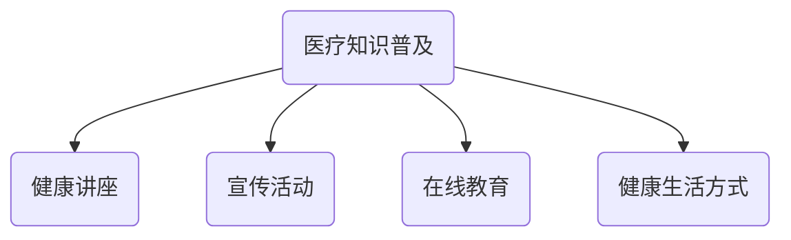

**5.1.3 志愿者医生的工作**

**背景介绍：**  
志愿者医生是医疗领域的重要力量，他们为偏远地区和贫困人群提供医疗服务和健康指导。

**问题描述：**  
如何组织和开展志愿者医生的工作？

**问题解决：**  
通过义工工作，可以组织志愿者医生团队，制定工作计划和任务分配，确保医疗服务的质量和效率。

**边界与外延：**  
志愿者医生的工作不仅限于医疗服务，还包括健康教育和疾病预防。

**概念结构与核心要素组成：**  
志愿者医生工作的核心要素包括：医疗服务、健康教育和疾病预防。

**核心概念原理：**  
通过义工工作，提高偏远地区和贫困人群的健康水平。

**概念属性特征对比表格：**

| 特征       | 描述                                                         |
| ---------- | ------------------------------------------------------------ |
| 医疗服务   | 为偏远地区和贫困人群提供医疗服务和疾病治疗                 |
| 健康教育   | 为公众提供健康知识和健康教育，提高健康意识               |
| 疾病预防   | 开展疾病预防活动，降低疾病发生率                         |

**ER实体关系图架构：**

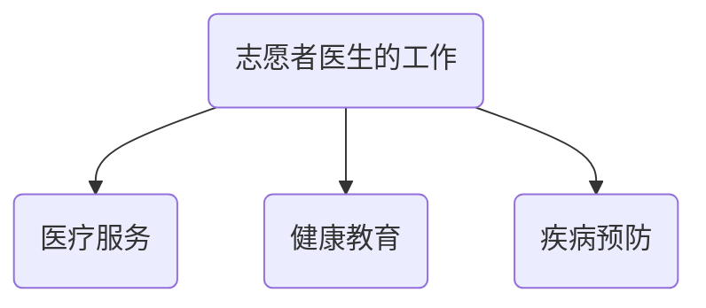

#### 第6章：环境保护的义工行动

**6.1.1 环保宣传与教育**

**背景介绍：**  
环境保护的义工行动主要包括环保宣传与教育、森林保护和海洋保护。

**问题描述：**  
如何通过义工工作推动环保宣传与教育？

**问题解决：**  
通过义工工作，可以组织环保宣传活动、举办环保讲座和开展环保教育，提高公众的环保意识和行动力。

**边界与外延：**  
环保宣传与教育不仅限于活动，还包括媒体传播和网络教育。

**概念结构与核心要素组成：**  
环保宣传与教育的核心要素包括：环保活动、环保讲座、环保教育和媒体传播。

**核心概念原理：**  
通过义工工作，提高公众对环境保护的认识和参与度。

**概念属性特征对比表格：**

| 特征       | 描述                                                         |
| ---------- | ------------------------------------------------------------ |
| 环保活动   | 组织各种形式的环保活动，如清洁河流、植树造林等             |
| 环保讲座   | 举办环保讲座，传播环保知识和理念                         |
| 环保教育   | 开展环保教育，提高公众的环保意识和行动力               |
| 媒体传播   | 利用媒体渠道，宣传环保政策和行动                       |

**ER实体关系图架构：**

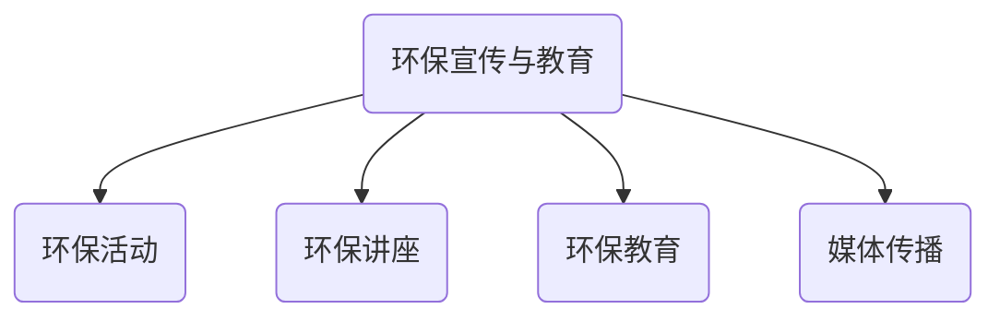

**6.1.2 森林保护**

**背景介绍：**  
森林保护是环境保护的重要领域，义工工作在森林保护中发挥着关键作用。

**问题描述：**  
如何通过义工工作参与森林保护？

**问题解决：**  
通过义工工作，可以参与植树造林、森林巡护和森林资源管理等活动，保护森林生态系统。

**边界与外延：**  
森林保护不仅限于物理行动，还包括政策倡导和科学研究。

**概念结构与核心要素组成：**  
森林保护的核心要素包括：植树造林、森林巡护、森林资源管理和政策倡导。

**核心概念原理：**  
通过义工工作，维护森林生态系统的健康和可持续发展。

**概念属性特征对比表格：**

| 特征       | 描述                                                         |
| ---------- | ------------------------------------------------------------ |
| 植树造林   | 参与植树造林活动，增加森林覆盖率                         |
| 森林巡护   | 参与森林巡护，防止森林火灾和非法砍伐                   |
| 森林资源管理 | 参与森林资源管理，确保森林资源的合理利用和保护           |
| 政策倡导   | 参与政策倡导，推动森林保护政策的制定和实施           |

**ER实体关系图架构：**

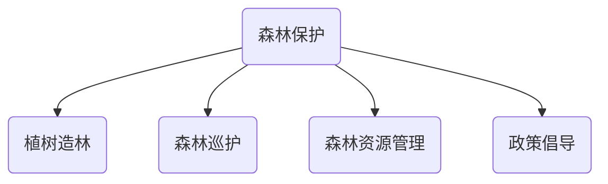

**6.1.3 海洋保护**

**背景介绍：**  
海洋保护是环境保护的重要领域，义工工作在海洋保护中发挥着关键作用。

**问题描述：**  
如何通过义工工作参与海洋保护？

**问题解决：**  
通过义工工作，可以参与海滩清理、海洋资源管理和海洋生态保护等活动，保护海洋环境。

**边界与外延：**  
海洋保护不仅限于物理行动，还包括科学研究和政策倡导。

**概念结构与核心要素组成：**  
海洋保护的核心要素包括：海滩清理、海洋资源管理、海洋生态保护和政策倡导。

**核心概念原理：**  
通过义工工作，维护海洋生态系统的健康和可持续发展。

**概念属性特征对比表格：**

| 特征       | 描述                                                         |
| ---------- | ------------------------------------------------------------ |
| 海滩清理   | 参与海滩清理，清除垃圾和污染物                         |
| 海洋资源管理 | 参与海洋资源管理，确保海洋资源的合理利用和保护           |
| 海洋生态保护 | 参与海洋生态保护，防止海洋污染和生态系统破坏           |
| 政策倡导   | 参与政策倡导，推动海洋保护政策的制定和实施           |

**ER实体关系图架构：**

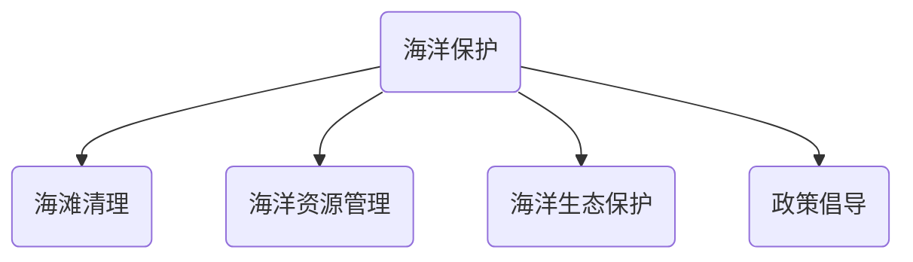

### 第三部分：义工精神的传播与影响

#### 第7章：义工精神的传播途径

**7.1.1 社交媒体宣传**

**背景介绍：**  
随着社交媒体的普及，义工精神的传播途径发生了显著变化。

**问题描述：**  
如何通过社交媒体宣传义工精神？

**问题解决：**  
通过社交媒体平台，可以发布义工活动的信息、分享义工故事和宣传义工精神。

**边界与外延：**  
社交媒体宣传不仅限于文字和图片，还可以包括视频、直播等多种形式。

**概念结构与核心要素组成：**  
社交媒体宣传的核心要素包括：信息发布、故事分享、宣传推广和互动交流。

**核心概念原理：**  
通过社交媒体，扩大义工精神的影响范围，提高公众的参与度。

**概念属性特征对比表格：**

| 特征       | 描述                                                         |
| ---------- | ------------------------------------------------------------ |
| 信息发布   | 发布义工活动的信息，包括活动时间、地点和报名方式           |
| 故事分享   | 分享义工故事，展现义工精神的具体实践和成果               |
| 宣传推广   | 通过各种形式宣传义工精神，提高公众的关注度和参与度         |
| 互动交流   | 与公众互动，解答疑问，收集反馈和建议                     |

**ER实体关系图架构：**

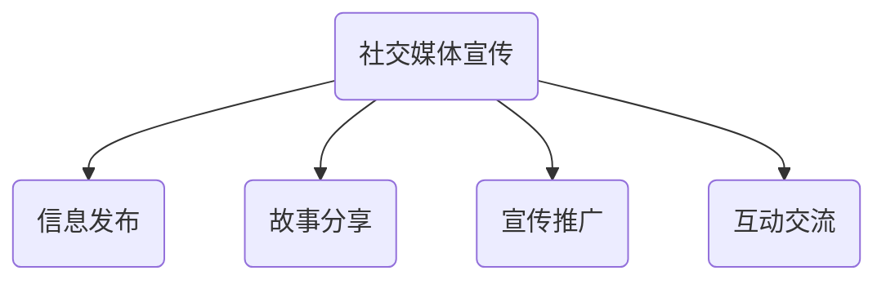

**7.1.2 企业参与**

**背景介绍：**  
企业作为社会的重要组成部分，积极参与义工工作，有助于提升企业形象和社会责任感。

**问题描述：**  
如何通过企业参与推动义工精神的传播？

**问题解决：**  
通过企业参与，可以组织员工义工活动、提供资金和资源支持，以及与公益组织合作。

**边界与外延：**  
企业参与不仅限于公益活动，还包括社会责任项目和可持续发展计划。

**概念结构与核心要素组成：**  
企业参与的核心要素包括：员工义工活动、资金支持、资源支持和合作发展。

**核心概念原理：**  
通过企业参与，提高公众对义工精神的认同感和参与度。

**概念属性特征对比表格：**

| 特征       | 描述                                                         |
| ---------- | ------------------------------------------------------------ |
| 员工义工活动 | 组织员工参与义工活动，提高员工的社会责任感和参与度           |
| 资金支持   | 提供资金支持，用于开展义工活动和公益项目                   |
| 资源支持   | 提供物资和资源支持，帮助公益组织和志愿者更好地开展工作     |
| 合作发展   | 与公益组织合作，共同推动义工精神和公益事业的发展           |

**ER实体关系图架构：**

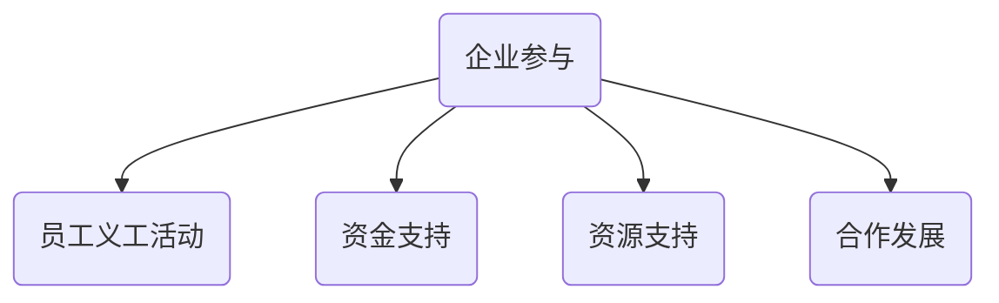

**7.1.3 学校教育**

**背景介绍：**  
学校教育是培养义工精神的重要途径，通过课程设置和实践活动，引导学生积极参与公益事业。

**问题描述：**  
如何通过学校教育传播义工精神？

**问题解决：**  
通过学校教育，可以设置义工课程、组织义工活动和开展义工教育，培养学生的义工精神。

**边界与外延：**  
学校教育不仅限于课堂教学，还包括课外活动和社区服务。

**概念结构与核心要素组成：**  
学校教育的核心要素包括：义工课程、义工活动和义工教育。

**核心概念原理：**  
通过学校教育，培养学生的社会责任感和参与意识，为未来的义工工作奠定基础。

**概念属性特征对比表格：**

| 特征       | 描述                                                         |
| ---------- | ------------------------------------------------------------ |
| 志愿课程   | 设立专门的义工课程，教授义工精神和实践方法                 |
| 志愿活动   | 组织学生参与各种形式的义工活动，如社区服务、环保行动等     |
| 志愿教育   | 开展义工教育，引导学生树立正确的价值观和人生观           |

**ER实体关系图架构：**

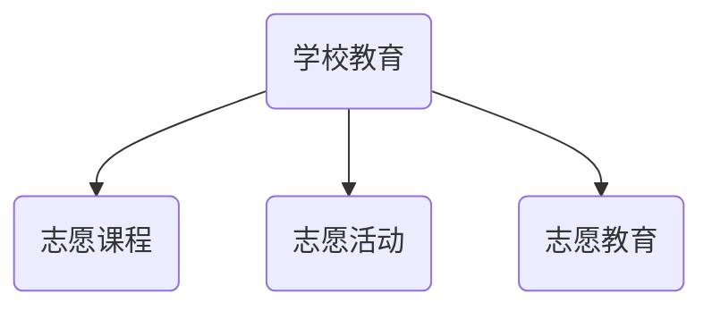

#### 第8章：义工精神对社会的影响

**8.1.1 提高社会凝聚力**

**背景介绍：**  
义工精神作为一种社会价值观，有助于提高社会的凝聚力和归属感。

**问题描述：**  
如何通过义工精神提高社会凝聚力？

**问题解决：**  
通过义工工作，可以促进社会成员之间的互动和合作，增强社会凝聚力和归属感。

**边界与外延：**  
社会凝聚力不仅体现在个人层面，也体现在社区、企业和国家层面。

**概念结构与核心要素组成：**  
提高社会凝聚力的核心要素包括：社会互动、团队合作和社会认同。

**核心概念原理：**  
通过义工精神，激发社会成员的积极性和参与度，促进社会和谐与发展。

**概念属性特征对比表格：**

| 特征       | 描述                                                         |
| ---------- | ------------------------------------------------------------ |
| 社会互动   | 通过义工工作，促进社会成员之间的互动和交流                   |
| 团队合作   | 通过义工工作，培养团队合作精神和协作能力                 |
| 社会认同   | 通过义工工作，提高社会成员对社会和国家的认同感和归属感     |

**ER实体关系图架构：**

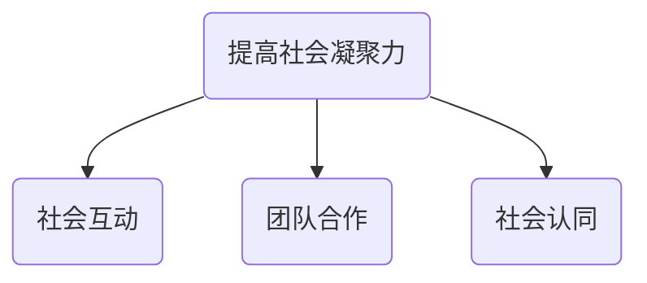

**8.1.2 促进社会公平**

**背景介绍：**  
义工精神在促进社会公平方面具有重要作用，它有助于缩小社会差距，提高弱势群体的生活质量。

**问题描述：**  
如何通过义工精神促进社会公平？

**问题解决：**  
通过义工工作，可以为弱势群体提供帮助和支持，提高他们的生活质量和机会。

**边界与外延：**  
社会公平不仅体现在经济层面，也体现在教育、医疗和社会服务等领域。

**概念结构与核心要素组成：**  
促进社会公平的核心要素包括：经济援助、教育公平、医疗援助和社会服务。

**核心概念原理：**  
通过义工精神，实现资源的合理分配和公平利用，推动社会公平与正义。

**概念属性特征对比表格：**

| 特征       | 描述                                                         |
| ---------- | ------------------------------------------------------------ |
| 经济援助   | 提供经济援助，帮助贫困家庭改善生活条件                     |
| 教育公平   | 提供教育资源，促进教育公平，提高弱势群体的受教育机会       |
| 医疗援助   | 提供医疗服务，帮助贫困人群获得基本医疗保障               |
| 社会服务   | 提供各种形式的社会服务，如社区服务、老人关怀等           |

**ER实体关系图架构：**

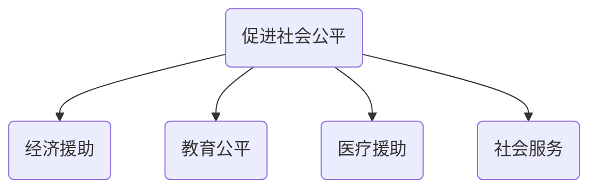

**8.1.3 推动社会进步**

**背景介绍：**  
义工精神是推动社会进步的重要力量，它鼓励社会成员积极参与社会事务，为社会的繁荣和发展贡献力量。

**问题描述：**  
如何通过义工精神推动社会进步？

**问题解决：**  
通过义工工作，可以促进社会创新、提高社会效率和推动社会改革。

**边界与外延：**  
社会进步不仅体现在经济层面，也体现在科技、文化和社会制度等领域。

**概念结构与核心要素组成：**  
推动社会进步的核心要素包括：社会创新、社会效率和制度改革。

**核心概念原理：**  
通过义工精神，激发社会成员的创新意识和实践能力，推动社会的全面进步。

**概念属性特征对比表格：**

| 特征       | 描述                                                         |
| ---------- | ------------------------------------------------------------ |
| 社会创新   | 通过创新思维和实践，推动社会科技和文化的发展               |
| 社会效率   | 通过提高工作效率和服务质量，推动社会的发展和进步           |
| 制度改革   | 通过参与社会制度改革，推动社会制度的完善和进步           |

**ER实体关系图架构：**

```mermaid
graph TB
    A(推动社会进步) --> B(社会创新)
    A --> C(社会效率)
    A --> D(制度改革)
```

### 第四部分：实现自我价值的义工之路

#### 第9章：如何成为优秀的义工

**9.1.1 选择合适的义工岗位**

**背景介绍：**  
选择合适的义工岗位是实现自我价值的第一步，它有助于发挥个人的特长和兴趣。

**问题描述：**  
如何选择合适的义工岗位？

**问题解决：**  
通过自我评估和了解义工岗位的要求，可以找到最适合自己的义工岗位。

**边界与外延：**  
选择义工岗位不仅考虑个人兴趣，还要考虑岗位的社会价值和实际需求。

**概念结构与核心要素组成：**  
选择合适义工岗位的核心要素包括：自我评估、岗位要求和岗位价值。

**核心概念原理：**  
通过科学选择，实现个人特长与社会需求的最佳匹配。

**概念属性特征对比表格：**

| 特征       | 描述                                                         |
| ---------- | ------------------------------------------------------------ |
| 自我评估   | 了解自己的兴趣、能力和价值观，找到合适的义工岗位           |
| 岗位要求   | 分析义工岗位的要求，确保自己具备胜任岗位的能力           |
| 岗位价值   | 考虑岗位的社会价值，选择具有长远影响的义工岗位           |

**ER实体关系图架构：**

```mermaid
graph TB
    A(选择合适的义工岗位) --> B(自我评估)
    A --> C(岗位要求)
    A --> D(岗位价值)
```

**9.1.2 提升义工技能**

**背景介绍：**  
提升义工技能是实现自我价值的重要途径，它有助于提高工作效率和服务质量。

**问题描述：**  
如何提升义工技能？

**问题解决：**  
通过培训、实践和不断学习，可以提升义工的专业技能和综合素质。

**边界与外延：**  
义工技能的提升不仅限于专业技能，还包括沟通能力、团队协作和领导能力。

**概念结构与核心要素组成：**  
提升义工技能的核心要素包括：培训、实践、学习能力和综合素质。

**核心概念原理：**  
通过不断提升技能，实现个人价值和社会贡献的最佳结合。

**概念属性特征对比表格：**

| 特征       | 描述                                                         |
| ---------- | ------------------------------------------------------------ |
| 培训       | 参加各类培训课程，学习新知识和技能                         |
| 实践       | 通过实际操作和实践，提高技能水平                         |
| 学习能力   | 保持学习的热情和习惯，不断更新知识和技能                 |
| 综合素质   | 提高沟通能力、团队协作和领导能力，全面提升个人素质       |

**ER实体关系图架构：**

```mermaid
graph TB
    A(提升义工技能) --> B(培训)
    A --> C(实践)
    A --> D(学习能力)
    A --> E(综合素质)
```

**9.1.3 维护义工形象**

**背景介绍：**  
维护义工形象是义工工作的重要组成部分，它关乎义工队伍的声誉和影响力。

**问题描述：**  
如何维护义工形象？

**问题解决：**  
通过自律、正面宣传和团队协作，可以维护义工形象，提升义工队伍的凝聚力。

**边界与外延：**  
维护义工形象不仅涉及个人行为，还包括团队建设和形象管理。

**概念结构与核心要素组成：**  
维护义工形象的核心要素包括：自律、正面宣传、团队协作和形象管理。

**核心概念原理：**  
通过科学管理，确保义工队伍的形象和声誉。

**概念属性特征对比表格：**

| 特征       | 描述                                                         |
| ---------- | ------------------------------------------------------------ |
| 自律       | 自觉遵守义工行为规范，保持良好的行为习惯                 |
| 正面宣传   | 通过各种渠道宣传义工工作和成就，树立正面形象             |
| 团队协作   | 加强团队内部沟通与合作，提升团队凝聚力和执行力           |
| 形象管理   | 制定形象管理策略，确保义工队伍的形象和声誉               |

**ER实体关系图架构：**

```mermaid
graph TB
    A(维护义工形象) --> B(自律)
    A --> C(正面宣传)
    A --> D(团队协作)
    A --> E(形象管理)
```

### 第五部分：结语

**10.1.1 志愿服务与个人成长**

**背景介绍：**  
志愿服务不仅是一种社会行为，也是个人成长的重要途径。

**问题描述：**  
如何通过志愿服务实现个人成长？

**问题解决：**  
通过志愿服务，可以提升社交能力、增强自信心、扩展人脉资源，从而实现个人成长。

**边界与外延：**  
个人成长不仅限于专业技能的提升，还包括心理素质、沟通能力和领导能力的提升。

**概念结构与核心要素组成：**  
志愿服务与个人成长的核心要素包括：社交能力、自信心、人脉资源、心理素质和领导能力。

**核心概念原理：**  
通过志愿服务，实现个人技能和心理素质的提升，为未来的职业发展打下坚实基础。

**概念属性特征对比表格：**

| 特征       | 描述                                                         |
| ---------- | ------------------------------------------------------------ |
| 社交能力   | 通过志愿服务，提高与人沟通和合作的能力                   |
| 自信心     | 通过志愿服务，增强自我价值和自信心                       |
| 人脉资源   | 通过志愿服务，拓展人脉资源，建立广泛的人际关系           |
| 心理素质   | 通过志愿服务，提升心理素质，增强应对压力的能力           |
| 领导能力   | 通过志愿服务，锻炼领导能力，提高团队协作和管理的水平     |

**ER实体关系图架构：**

```mermaid
graph TB
    A(志愿服务与个人成长) --> B(社交能力)
    A --> C(自信心)
    A --> D(人脉资源)
    A --> E(心理素质)
    A --> F(领导能力)
```

**10.1.2 志愿服务与社会贡献**

**背景介绍：**  
志愿服务不仅对个人成长有益，还能为社会做出重要贡献。

**问题描述：**  
如何通过志愿服务实现社会贡献？

**问题解决：**  
通过志愿服务，可以为社会弱势群体提供帮助，促进社会公平和进步。

**边界与外延：**  
社会贡献不仅限于物质帮助，还包括精神支持和政策倡导。

**概念结构与核心要素组成：**  
志愿服务与社会贡献的核心要素包括：物质帮助、精神支持、社会公平和政策倡导。

**核心概念原理：**  
通过志愿服务，实现个人价值和社会价值的共同提升。

**概念属性特征对比表格：**

| 特征       | 描述                                                         |
| ---------- | ------------------------------------------------------------ |
| 物质帮助   | 提供物质帮助，如资金、物资和医疗服务                       |
| 精神支持   | 提供情感支持和精神鼓励，增强弱势群体的信心和勇气           |
| 社会公平   | 通过志愿服务，推动社会公平和正义，缩小社会差距           |
| 政策倡导   | 参与政策倡导，推动社会政策和制度的改革                 |

**ER实体关系图架构：**

```mermaid
graph TB
    A(志愿服务与社会贡献) --> B(物质帮助)
    A --> C(精神支持)
    A --> D(社会公平)
    A --> E(政策倡导)
```

**10.1.3 志愿服务与职业发展**

**背景介绍：**  
志愿服务不仅对个人成长和社会贡献有益，还能对职业发展产生积极影响。

**问题描述：**  
如何通过志愿服务促进职业发展？

**问题解决：**  
通过志愿服务，可以提升专业技能、拓展人脉资源和增强社会责任感，从而促进职业发展。

**边界与外延：**  
职业发展不仅限于专业技能的提升，还包括职业规划、行业发展和团队协作。

**概念结构与核心要素组成：**  
志愿服务与职业发展的核心要素包括：专业技能、职业规划、行业发展和团队协作。

**核心概念原理：**  
通过志愿服务，实现个人职业发展和社会价值的共同提升。

**概念属性特征对比表格：**

| 特征       | 描述                                                         |
| ---------- | ------------------------------------------------------------ |
| 专业技能   | 通过志愿服务，提升专业技能，增强职业竞争力               |
| 职业规划   | 通过志愿服务，明确职业目标和发展方向，制定职业规划       |
| 行业发展   | 通过志愿服务，了解行业动态和趋势，把握职业发展机遇       |
| 团队协作   | 通过志愿服务，锻炼团队协作能力，提升职业团队竞争力       |

**ER实体关系图架构：**

```mermaid
graph TB
    A(志愿服务与职业发展) --> B(专业技能)
    A --> C(职业规划)
    A --> D(行业发展)
    A --> E(团队协作)
```

### 第六部分：义工精神传承与创新

**11.1.1 志愿服务的新趋势**

**背景介绍：**  
随着社会的发展，志愿服务也呈现出新的趋势和特点。

**问题描述：**  
如何把握志愿服务的新趋势？

**问题解决：**  
通过关注社会动态和新兴技术，可以把握志愿服务的新趋势。

**边界与外延：**  
志愿服务的新趋势不仅包括技术手段的创新，还包括服务模式的转变。

**概念结构与核心要素组成：**  
志愿服务新趋势的核心要素包括：技术创新、服务模式创新和数字化志愿服务。

**核心概念原理：**  
通过不断创新，提升志愿服务的效率和质量。

**概念属性特征对比表格：**

| 特征       | 描述                                                         |
| ---------- | ------------------------------------------------------------ |
| 技术创新   | 利用新技术手段，如人工智能、大数据和区块链，提升志愿服务效率 |
| 服务模式创新 | 创新志愿服务模式，如线上志愿服务、社区志愿服务等           |
| 数字化志愿服务 | 通过数字化平台，实现志愿服务的信息化和智能化           |

**ER实体关系图架构：**

```mermaid
graph TB
    A(志愿服务新趋势) --> B(技术创新)
    A --> C(服务模式创新)
    A --> D(数字化志愿服务)
```

**11.1.2 志愿服务的技术创新**

**背景介绍：**  
技术创新在志愿服务中发挥着重要作用，它有助于提升志愿服务的效率和影响力。

**问题描述：**  
如何通过技术创新推动志愿服务的发展？

**问题解决：**  
通过引入新技术，如人工智能、大数据和区块链，可以提升志愿服务的效率和公信力。

**边界与外延：**  
志愿服务的技术创新不仅限于技术手段，还包括服务模式的创新。

**概念结构与核心要素组成：**  
志愿服务技术创新的核心要素包括：人工智能应用、大数据分析和区块链技术。

**核心概念原理：**  
通过技术创新，实现志愿服务的高效、透明和可信。

**概念属性特征对比表格：**

| 特征       | 描述                                                         |
| ---------- | ------------------------------------------------------------ |
| 人工智能应用 | 利用人工智能技术，实现志愿服务的自动化和智能化               |
| 大数据分析 | 通过大数据分析，提高志愿服务的精准性和效果                 |
| 区块链技术 | 利用区块链技术，确保志愿服务的透明性和可信性               |

**ER实体关系图架构：**

```mermaid
graph TB
    A(志愿服务技术创新) --> B(人工智能应用)
    A --> C(大数据分析)
    A --> D(区块链技术)
```

**11.1.3 志愿服务的文化传承**

**背景介绍：**  
志愿服务作为一种文化传统，需要得到传承和发扬。

**问题描述：**  
如何通过志愿服务的文化传承弘扬义工精神？

**问题解决：**  
通过教育和宣传，可以将义工精神融入社会文化，培养更多的义工。

**边界与外延：**  
志愿服务的文化传承不仅包括教育，还包括媒体宣传和社区活动。

**概念结构与核心要素组成：**  
志愿服务文化传承的核心要素包括：教育传承、媒体宣传和社区活动。

**核心概念原理：**  
通过多种途径，将义工精神传承给下一代，推动社会的和谐发展。

**概念属性特征对比表格：**

| 特征       | 描述                                                         |
| ---------- | ------------------------------------------------------------ |
| 教育传承   | 通过学校教育和社会教育，将义工精神融入教育体系中           |
| 媒体宣传   | 通过媒体渠道，宣传义工精神和志愿服务的成果               |
| 社区活动   | 在社区中组织各类活动，弘扬义工精神，培养更多的义工       |

**ER实体关系图架构：**

```mermaid
graph TB
    A(志愿服务文化传承) --> B(教育传承)
    A --> C(媒体宣传)
    A --> D(社区活动)
```

### 总结

本文详细探讨了义工精神的起源、核心价值观、不同领域的义工实践、传播与影响，以及实现自我价值的义工之路。通过逻辑清晰、结构紧凑的论述，本文旨在为读者提供一个全面、深入的视角，以理解和践行在助人中实现自我价值的理念。在未来的义工工作中，我们应不断学习、创新和传承，为社会的繁荣和发展贡献力量。

### 作者信息

**作者：** AI天才研究院/AI Genius Institute & 禅与计算机程序设计艺术 /Zen And The Art of Computer Programming

通过本文，我们深入探讨了义工精神的重要性和其在个人成长和社会贡献中的关键作用。从起源与发展、核心价值观，到不同领域的实践和传播途径，再到实现自我价值的路径，我们系统地阐述了义工精神的内涵和实际应用。在未来的志愿服务中，我们应继续践行无私奉献、同理心、责任感等核心价值观，为社会的发展贡献自己的力量。

**关键词：** 志愿服务、义工精神、个人成长、社会责任、社会贡献

**摘要：** 本文通过系统分析，探讨了义工精神在个人成长和社会贡献中的关键作用，以及如何通过志愿服务实现自我价值。通过不同领域的实践和传播途径，本文为读者提供了一个全面了解和践行义工精神的视角。希望读者能从中获得启示，积极参与志愿服务，为实现自我价值和社会进步贡献力量。

