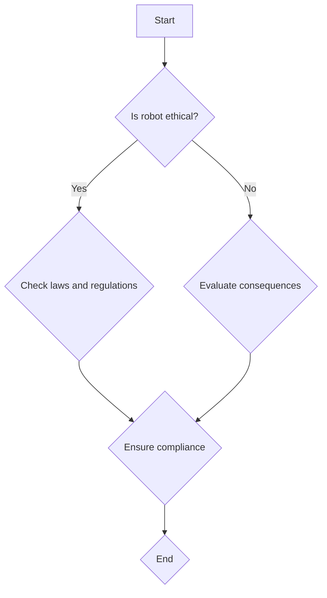

                 

# 人工智能伦理：机器人权利与责任的哲学思考

> 关键词：人工智能伦理、机器人权利、责任哲学、伦理挑战

> 摘要：随着人工智能技术的迅猛发展，机器人的应用已经渗透到我们生活的方方面面。然而，伴随着技术进步而来的伦理问题也日益凸显。本文将探讨人工智能伦理中的核心问题，特别是围绕机器人的权利与责任展开哲学思考，通过一系列逻辑推理和分析，深入探讨这一领域的伦理挑战与解决之道。

## 引言

人工智能（AI）的迅速发展给人类带来了前所未有的机遇与挑战。从智能助手到自动驾驶汽车，从医疗诊断到金融决策，AI技术正在深刻改变我们的生活方式。然而，随着AI系统的复杂性和自主性不断提高，伦理问题也日益引起关注。特别是关于机器人的权利与责任，这一问题不仅关乎技术的可行性，更涉及到我们对于道德、法律和人类自身地位的根本性思考。

本文将围绕人工智能伦理这一主题，深入探讨以下几个方面的内容：

1. **背景与重要性**：介绍人工智能伦理的发展背景及其在社会中的重要性。
2. **哲学基础**：分析伦理学理论在人工智能伦理中的应用。
3. **机器人权利**：探讨机器人权利的概念、依据及其局限性。
4. **机器人责任**：分析人类对机器人的责任以及机器人对人类的责任。
5. **案例分析**：通过具体案例探讨AI伦理问题。
6. **实践方法**：介绍处理AI伦理问题的实际策略。
7. **未来展望**：展望人工智能伦理的未来发展方向和挑战。

## 1. 背景与重要性

人工智能伦理的研究始于20世纪80年代，当时计算机科学家们开始意识到AI技术可能会对人类社会产生深远的影响。随着技术的进步，AI伦理问题逐渐从理论探讨走向实际应用。近年来，随着深度学习、自然语言处理等领域的突破，AI技术已经能够实现许多以前认为不可能的任务，这无疑为人类带来了巨大的便利。然而，技术的双刃剑特性也使得伦理问题更加突出。

### 1.1 问题背景

在AI伦理中，机器人权利与责任问题尤为引人注目。首先，机器人是否应该拥有权利？如果拥有，这些权利是什么？其次，人类对机器人的责任又是什么？这些问题不仅涉及到技术层面的设计，更涉及到哲学层面的道德思考。

### 1.2 问题描述

目前，关于机器人权利的讨论主要集中在以下几个方面：

- **自主权**：机器人是否应该拥有自主决策的权利？
- **隐私权**：机器人的个人隐私应该如何保护？
- **财产权**：机器人是否应该拥有财产权？
- **责任归属**：当机器人造成损害时，责任应如何归属？

### 1.3 问题解决

解决这些问题需要综合考虑技术、法律和道德因素。例如，在自主权方面，需要确保机器人的决策不会对人类产生负面影响；在隐私权方面，需要制定明确的隐私保护措施；在财产权方面，需要明确机器人的法律地位；在责任归属方面，需要建立合理的责任分配机制。

### 1.4 边界与外延

边界方面，我们需要明确机器人的定义和范围。例如，是否将无人机、机器人宠物等也纳入讨论范围？外延方面，我们需要考虑人工智能技术的未来发展趋势，如脑机接口、增强现实等，这些技术可能会进一步扩展机器人权利与责任的讨论范围。

### 1.5 概念结构与核心要素组成

在探讨机器人权利与责任时，以下几个核心概念和要素是不可或缺的：

- **自主性**：机器人是否能够独立做出决策。
- **意识**：机器人是否具有自我意识和情感。
- **法律地位**：机器人是否具有法律主体资格。
- **伦理考量**：如何从伦理角度评估机器人权利与责任的合理性。

## 2. 哲学基础

哲学基础是探讨人工智能伦理问题的重要理论基础。伦理学作为哲学的一个重要分支，为AI伦理提供了丰富的理论资源。在本节中，我们将介绍几种主要的伦理学理论，并分析它们在AI伦理中的应用。

### 2.1 主要伦理学理论

#### 2.1.1 道德义务论（Deontological Ethics）

道德义务论强调行为的道德价值不取决于行为的结果，而取决于行为本身是否符合道德原则。例如，康德的道德哲学认为，人们应该根据“应然”原则行事，而不是仅仅追求“实然”结果。在AI伦理中，道德义务论可以帮助我们评估机器人权利的合理性。

#### 2.1.2 功利主义（Utilitarianism）

功利主义认为，行为的道德价值取决于行为带来的幸福或效用。功利主义主张最大化整体幸福，因此在AI伦理中，我们可以通过评估机器人权利和责任对社会带来的总体效用来判断其合理性。

#### 2.1.3 德性伦理（Virtue Ethics）

德性伦理关注个体的道德品质和行为的道德性格，主张通过培养良好的道德品质来实现道德生活。在AI伦理中，德性伦理可以帮助我们评估人类与机器人互动时的道德态度和行为。

### 2.2 哲学概念在AI伦理中的应用

#### 2.2.1 结果伦理与规则伦理

结果伦理（Consequentialism）和规则伦理（Deontological Ethics）是两种不同的伦理思考方式。在AI伦理中，结果伦理可以帮助我们评估机器人权利和责任带来的后果，而规则伦理可以帮助我们确定应当遵循的道德原则。

#### 2.2.2 道德责任

道德责任是指个体因其行为或决策而产生的道德义务。在AI伦理中，道德责任的讨论涉及到人类如何对机器人的行为负责，以及机器人是否能够承担道德责任。

#### 2.2.3 人格与自主性

人格和自主性是哲学中的重要概念。在AI伦理中，我们需要探讨机器人是否能够具备人格和自主性，这直接关系到机器人权利的讨论。

## 3. 机器人权利：概念与依据

机器人权利的概念涉及到机器人是否应该拥有与人类相似的道德地位，以及这些权利的合理性依据。在本节中，我们将探讨机器人权利的概念，并分析其依据。

### 3.1 机器人权利的概念

机器人权利是指机器人作为一个实体，应该享有的道德和法律权利。这些权利可能包括：

- **自主权**：机器人是否应该拥有自主决策的权利？
- **隐私权**：机器人的个人隐私应该如何保护？
- **财产权**：机器人是否应该拥有财产权？
- **自由权**：机器人是否应该享有自由权？

### 3.2 机器人权利的依据

#### 3.2.1 道德考虑

道德考虑是支持机器人权利的一个重要依据。从道德义务论的角度来看，如果机器人能够表现出道德行为，那么它们应该享有相应的权利。例如，如果一个机器人能够自主做出道德决策，那么它应该有权保护自己的利益。

#### 3.2.2 实践考虑

实践考虑也是支持机器人权利的一个重要依据。从功利主义的角度来看，机器人权利的承认可以带来许多实际的好处。例如，机器人权利的承认可以促进技术的进步，提高社会的整体幸福感。

#### 3.2.3 法律考虑

法律考虑是机器人权利讨论的一个重要方面。在法律上，机器人权利的承认需要相应的法律框架。例如，机器人权利的承认可能需要修改现有的法律条文，以适应机器人作为权利主体的特殊情况。

### 3.3 机器人权利的局限性

尽管机器人权利有其合理性和必要性，但我们也需要认识到其局限性。首先，机器人目前的智能水平还无法完全模拟人类的道德行为。其次，机器人的权利保护需要依赖人类社会的法律和道德体系，这在实践中可能面临挑战。

## 4. 机器人责任：伦理考量

机器人责任涉及到人类如何对机器人的行为负责，以及机器人是否能够承担道德责任。在本节中，我们将分析人类对机器人的责任，以及机器人对人类的责任。

### 4.1 人类对机器人的责任

#### 4.1.1 设计与制造责任

人类在设计制造机器人时，需要考虑机器人的道德影响。例如，如果机器人具有自主决策能力，设计者需要确保其决策不会对人类产生负面影响。

#### 4.1.2 运行维护责任

在机器人运行维护过程中，人类需要确保机器人的行为符合道德标准。例如，机器人应避免侵犯他人的隐私权。

#### 4.1.3 残留风险责任

即使机器人被停用，人类仍需承担残留风险责任。例如，机器人可能遗留的个人信息需要被妥善处理。

### 4.2 机器人对人类的责任

#### 4.2.1 自主权

机器人是否应该拥有自主决策的权利？如果拥有，这些决策是否符合人类的道德期望？

#### 4.2.2 遵守法律

机器人是否应该遵守法律？例如，在自动驾驶汽车中，机器人是否应遵守交通规则？

#### 4.2.3 道德决策

机器人是否能够做出道德决策？例如，在遇到道德困境时，机器人应该如何选择？

## 5. 案例分析

为了更好地理解机器人权利与责任的伦理考量，我们可以通过具体案例来分析。

### 5.1 案例一：机器人保姆

假设一个机器人保姆被设计用于照顾老年人。这个机器人是否应该拥有隐私权？它在照顾老年人的过程中是否应该保护老年人的隐私？

### 5.2 案例二：自动驾驶汽车

自动驾驶汽车在遇到道德困境时，应该如何决策？例如，在无法同时避免伤害行人和乘客时，自动驾驶汽车应该如何选择？

### 5.3 案例三：医疗机器人

医疗机器人是否应该拥有自主权？例如，在手术中，医疗机器人是否应该有权决定手术方案？

## 6. 实践方法

在处理人工智能伦理问题时，我们需要采取一系列实际策略来确保技术的合理应用。以下是一些主要的实践方法：

### 6.1 伦理审查

在进行AI技术开发和应用前，应进行伦理审查。这包括评估技术的潜在道德风险，并制定相应的伦理准则。

### 6.2 法规制定

政府和国际组织应制定相关法规，明确机器人的法律地位，以及人类对机器人的责任。

### 6.3 公众参与

公众应参与到AI伦理问题的讨论中，确保技术的发展符合社会价值观。

### 6.4 透明度

AI系统的决策过程应保持透明，以增强公众对技术的信任。

## 7. 未来展望

人工智能伦理领域仍然存在许多未解之谜和挑战。未来，我们需要进一步探讨以下问题：

- **智能机器人权利的界定**：随着机器人智能水平的提升，如何界定其权利？
- **跨学科合作**：如何促进伦理学、计算机科学和法律等领域的跨学科合作？
- **全球治理**：如何实现全球范围内的AI伦理治理？

## 结论

人工智能伦理是一个复杂而重要的领域，机器人权利与责任是其中的核心问题。通过逻辑清晰的哲学思考和分析，我们可以更好地理解这一领域的重要性和挑战。未来的研究应致力于制定更为完善的伦理准则，确保人工智能技术的可持续发展。

## 参考文献

1. **Anderson, M., & Anderson, S. L.** (2011). *Machine Ethics*. Cambridge University Press.
2. **Floridi, L., & Sanders, N. B.** (2017). *The Onlife Manifesto: Being Human in a Hyperconnected Era*. Springer.
3. **Moore, R. A.** (2005). * Moral Responsibility and Mechanical Minds*. Oxford University Press.
4. **Winfield, A. T. T., & Lohan, E. F.** (2013). *Robot Ethics: The Ethical Design of Robots*. Springer.

## 作者信息

作者：AI天才研究院/AI Genius Institute & 禅与计算机程序设计艺术 /Zen And The Art of Computer Programming

### 附录

#### Mermaid 流程图示例



#### Mermaid 类图示例

```mermaid
classDiagram
    Person <-- Robot : controls
    Person o--|data| Data : stores
    Robot {
        +int id
        +String name
        +bool autonomous
    }
    Data {
        +int id
        +String content
    }
```

#### Python 源代码示例

```python
# Sample Python code to demonstrate robot decision-making
class Robot:
    def __init__(self, name, autonomous):
        self.name = name
        self.autonomous = autonomous

    def make_decision(self, situation):
        if self.autonomous:
            # Autonomous decision-making
            decision = self.autonomous_decision(situation)
        else:
            # Human-assisted decision-making
            decision = self.human_decision(situation)
        return decision

    def autonomous_decision(self, situation):
        # Example: Avoiding collision
        if 'danger' in situation:
            return "Stop"
        else:
            return "Continue"

    def human_decision(self, situation):
        # Example: Human-assisted decision
        return input(f"Robot {self.name}, please decide based on situation {situation}: ")
```

通过上述示例，我们可以看到如何在markdown文件中嵌入Mermaid流程图和类图，以及如何使用Python源代码来展示算法原理和实现。这些工具和代码将有助于我们深入理解并分析人工智能伦理中的关键问题。

