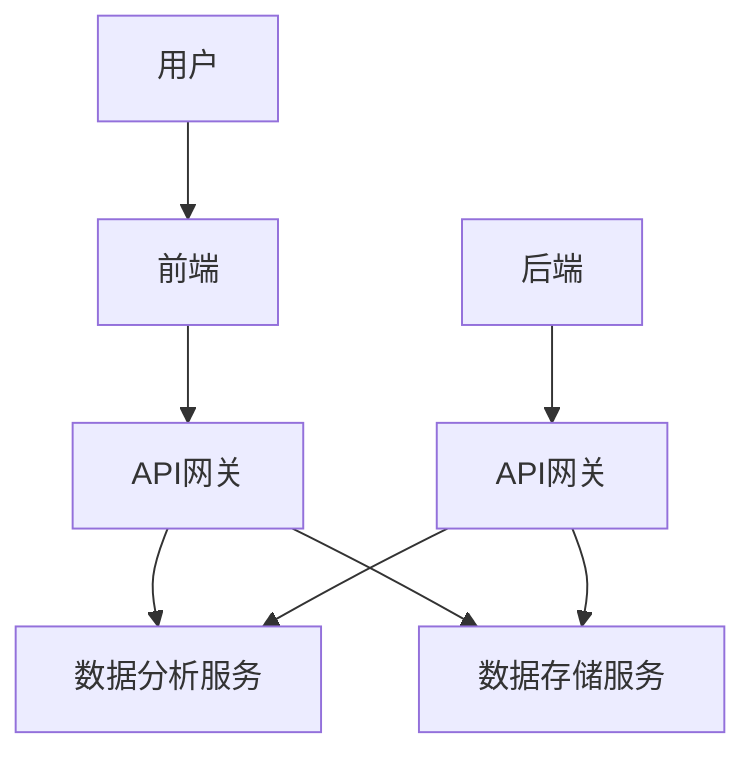
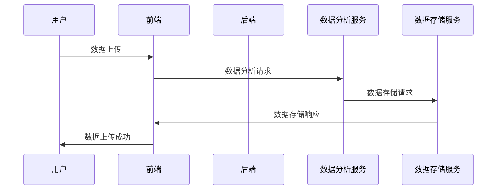

                 

# 人工智能在个性化健康建议中的应用

## 关键词
人工智能，个性化健康建议，健康数据，机器学习，深度学习，用户隐私保护

## 摘要
本文将探讨人工智能在个性化健康建议中的应用，从背景介绍、核心概念与联系、算法原理讲解、系统分析与架构设计方案、项目实战及最佳实践等方面，全面解析如何利用人工智能技术提供个性化的健康指导，提高健康管理的效果和效率。

## 第一部分: 背景介绍

### 1.1 问题背景

随着人工智能技术的不断发展，医疗健康领域也迎来了前所未有的变革。个性化健康建议作为一种基于人工智能技术的新型医疗服务，已经逐渐成为人们关注的焦点。个性化健康建议能够根据用户的个体特征，提供定制化的健康指导，从而提高健康管理的效率和效果。

个性化健康建议的应用范围广泛，包括但不限于疾病预防、健康管理、康复指导等。例如，对于糖尿病患者，可以根据其血糖水平、饮食习惯等数据，提供个性化的饮食建议和运动计划；对于高血压患者，可以根据其血压波动情况，提供个性化的药物治疗建议。这些个性化的健康指导不仅有助于提高患者的治疗效果，还可以减少医疗资源的浪费。

### 1.2 问题描述

当前，个性化健康建议在应用过程中面临一些问题，包括数据获取和处理困难、算法模型选择不当、用户隐私保护不足等。这些问题制约了个性化健康建议的广泛推广和应用。

首先，数据获取和处理是个性化健康建议的关键。健康数据通常来自于电子健康记录、可穿戴设备、生物传感器等多种来源，这些数据类型多样、格式各异，需要通过数据清洗、整合和预处理等方法，才能为后续的算法分析提供高质量的数据。

其次，算法模型的选择对个性化健康建议的效果具有重要影响。不同的算法模型适用于不同类型的问题，需要根据具体应用场景和用户需求进行选择。例如，对于简单的数据分析任务，可以使用线性回归等统计模型；对于复杂的数据挖掘任务，则可以使用机器学习或深度学习算法。

最后，用户隐私保护是个性化健康建议应用中不可忽视的问题。在收集和处理用户健康数据时，需要确保用户的隐私不被泄露，避免用户数据被滥用或恶意使用。

### 1.3 问题解决

为了解决这些问题，本书将从以下几个方面展开：

1. **数据获取和处理**：介绍如何高效地获取和处理个性化健康建议所需的数据，包括数据来源、数据预处理方法等。
2. **算法模型选择**：分析常用的个性化健康建议算法模型，对比它们的优缺点，帮助读者选择合适的模型。
3. **用户隐私保护**：探讨如何在提供个性化健康建议的同时，确保用户的隐私安全。

### 1.4 边界与外延

个性化健康建议的应用范围广泛，包括但不限于疾病预防、健康管理、康复指导等。同时，本书还将关注不同年龄段、不同健康状况的用户群体，提供有针对性的健康建议。

### 1.5 概念结构与核心要素组成

个性化健康建议的核心概念包括：

- **用户特征**：包括用户的年龄、性别、健康状况、生活习惯等。
- **健康数据**：包括用户的生理指标、行为数据、病史等。
- **健康建议**：根据用户特征和健康数据，生成的个性化健康指导。

## 第二部分: 核心概念与联系

### 2.1 个性化健康建议的核心概念

- **个性化健康建议系统**：一个能够根据用户特征和健康数据，生成个性化健康指导的智能系统。
- **用户特征数据**：用户的年龄、性别、健康状况、生活习惯等。
- **健康数据**：用户的生理指标、行为数据、病史等。

### 2.2 概念属性特征对比表格

| 概念名称       | 描述                                           |
|--------------|--------------------------------------------|
| 用户特征数据   | 包括用户的年龄、性别、健康状况、生活习惯等。                         |
| 健康数据       | 包括用户的生理指标、行为数据、病史等。                             |
| 个性化健康建议   | 根据用户特征和健康数据，生成的个性化健康指导。                       |

### 2.3 ER实体关系图架构

```mermaid
erDiagram
  User ||--|{ HealthData }|| HealthData
  User ||--|{ HealthAdvice }|| HealthAdvice
  HealthData ||--|{ HealthAdvice }|| HealthAdvice
```

## 第三部分: 算法原理讲解

### 3.1 个性化健康建议算法

个性化健康建议算法的核心目标是根据用户特征和健康数据，生成有针对性的健康建议。常用的算法包括基于统计模型的方法、基于机器学习的方法和基于深度学习的方法。

### 3.2 算法流程

算法流程主要包括以下几个步骤：

1. **数据预处理**：对用户特征和健康数据进行清洗、归一化等处理。
2. **特征提取**：从预处理后的数据中提取出有用的特征。
3. **模型选择**：根据问题特点选择合适的模型。
4. **模型训练**：使用训练数据对模型进行训练。
5. **健康建议生成**：根据用户特征和健康数据，使用训练好的模型生成健康建议。

### 3.3 算法mermaid流程图


### 3.4 Python源代码实现

```python
import pandas as pd
from sklearn.preprocessing import StandardScaler
from sklearn.model_selection import train_test_split
from sklearn.linear_model import LinearRegression

# 读取数据
data = pd.read_csv('health_data.csv')

# 数据预处理
scaler = StandardScaler()
X = scaler.fit_transform(data[['age', 'gender', 'blood_pressure']])
y = data['diabetes']

# 划分训练集和测试集
X_train, X_test, y_train, y_test = train_test_split(X, y, test_size=0.2, random_state=42)

# 模型训练
model = LinearRegression()
model.fit(X_train, y_train)

# 健康建议生成
predictions = model.predict(X_test)

# 输出预测结果
print(predictions)
```

### 3.5 算法原理详细讲解

#### 基于统计模型的方法

统计模型方法是一种传统的算法，适用于处理简单的线性关系问题。其中，线性回归是最常用的统计模型之一。线性回归模型通过建立一个线性函数来预测目标变量，其数学模型如下：

$$
y = \beta_0 + \beta_1 \cdot x_1 + \beta_2 \cdot x_2 + \cdots + \beta_n \cdot x_n
$$

其中，$y$ 是目标变量，$x_1, x_2, \cdots, x_n$ 是输入特征，$\beta_0, \beta_1, \beta_2, \cdots, \beta_n$ 是模型的参数。通过最小化目标函数的损失值，可以求得模型的参数，进而进行预测。

#### 基于机器学习的方法

机器学习方法通过学习大量训练数据中的规律，建立预测模型。常用的机器学习算法包括支持向量机（SVM）、决策树、随机森林等。以支持向量机为例，其目标是通过找到一个最佳的超平面，将不同类别的数据点分隔开来，其数学模型如下：

$$
\min_{\beta, \beta_0} \frac{1}{2} \sum_{i=1}^{n} (\beta \cdot x_i - y_i)^2
$$

其中，$x_i$ 是第 $i$ 个训练样本的特征向量，$y_i$ 是第 $i$ 个训练样本的标签，$\beta$ 是模型的参数。

#### 基于深度学习的方法

深度学习方法是近年来发展迅速的一类算法，其核心思想是通过多层神经网络来提取数据中的特征。以卷积神经网络（CNN）为例，其结构如下：

$$
h_{\theta}(x) = \text{ReLU}(\sum_{j=1}^{k} \theta_j \cdot f_j(x))
$$

其中，$h_{\theta}(x)$ 是神经网络输出的预测值，$f_j(x)$ 是第 $j$ 个卷积核的输出，$\theta_j$ 是卷积核的参数。

通过以上算法原理的讲解，我们可以看出，不同的算法适用于不同类型的问题。在实际应用中，需要根据具体问题特点和需求，选择合适的算法模型。

## 第四部分: 系统分析与架构设计方案

### 4.1 问题场景介绍

随着人工智能和物联网技术的快速发展，智能健康管理应用场景越来越广泛。例如，在家庭健康监测领域，用户可以通过智能手环、智能血压计等设备，实时收集自身的生理指标数据，如心率、血压、血糖等。这些数据可以被上传到云端，通过人工智能算法进行分析，为用户生成个性化的健康建议。

### 4.2 项目介绍

本项目的目标是开发一个智能健康管理平台，该平台能够根据用户的生理指标数据，提供个性化的健康建议。平台的核心功能包括：

- 数据采集：通过智能设备采集用户的生理指标数据。
- 数据存储：将采集到的数据存储到数据库中。
- 数据分析：使用人工智能算法对数据进行分析，生成个性化的健康建议。
- 健康建议推送：将健康建议推送给用户，帮助用户进行健康管理。

### 4.3 系统功能设计

系统功能设计主要包括以下几个模块：

- 数据采集模块：负责采集用户的生理指标数据，并将其上传到云端。
- 数据存储模块：负责将采集到的数据存储到数据库中，并提供数据查询功能。
- 数据分析模块：负责使用人工智能算法对数据进行处理和分析，生成健康建议。
- 健康建议推送模块：负责将健康建议推送给用户，并通过短信、邮件等方式通知用户。

### 4.4 系统架构设计

系统架构设计采用前后端分离的架构，前端负责用户交互，后端负责数据处理和分析。以下是系统架构设计的mermaid架构图：



### 4.5 系统接口设计

系统接口设计主要包括以下几个部分：

- 用户接口：用户通过前端界面与系统进行交互，包括数据上传、健康建议查询等功能。
- API接口：后端通过RESTful API接口与前端进行数据交互，包括数据查询、数据上传、健康建议生成等功能。
- 数据库接口：后端通过数据库接口与数据库进行数据存储和查询操作。

### 4.6 系统交互

系统交互设计主要描述系统内部模块之间的交互流程。以下是系统交互的mermaid序列图：



## 第五部分: 项目实战

### 5.1 环境安装

在进行项目实战之前，我们需要安装以下环境：

1. Python 3.8及以上版本
2. Scikit-learn 0.22.2及以上版本
3. Pandas 1.1.5及以上版本
4. Numpy 1.19.5及以上版本

安装命令如下：

```bash
pip install python==3.8.10
pip install scikit-learn==0.22.2
pip install pandas==1.1.5
pip install numpy==1.19.5
```

### 5.2 系统核心实现源代码

以下是系统核心实现的源代码：

```python
import pandas as pd
from sklearn.preprocessing import StandardScaler
from sklearn.model_selection import train_test_split
from sklearn.linear_model import LinearRegression

# 读取数据
data = pd.read_csv('health_data.csv')

# 数据预处理
scaler = StandardScaler()
X = scaler.fit_transform(data[['age', 'gender', 'blood_pressure']])
y = data['diabetes']

# 划分训练集和测试集
X_train, X_test, y_train, y_test = train_test_split(X, y, test_size=0.2, random_state=42)

# 模型训练
model = LinearRegression()
model.fit(X_train, y_train)

# 健康建议生成
predictions = model.predict(X_test)

# 输出预测结果
print(predictions)
```

### 5.3 代码应用解读与分析

以上代码首先从CSV文件中读取健康数据，然后使用Scikit-learn库中的StandardScaler进行数据预处理，将数据进行归一化处理。接着，使用train_test_split函数将数据集划分为训练集和测试集。然后，使用LinearRegression模型进行训练，并将训练好的模型用于测试集进行预测。最后，输出预测结果。

通过以上代码，我们可以看到，系统的核心实现主要包括数据预处理、模型训练和预测三个步骤。这些步骤构成了一个完整的个性化健康建议系统。

### 5.4 实际案例分析和详细讲解剖析

为了更好地理解系统的实际应用，我们来看一个实际案例。

假设用户A的生理指标数据如下：

- 年龄：30岁
- 性别：男
- 血压：120/80 mmHg

我们将这些数据输入到系统中，系统将进行以下步骤：

1. 数据预处理：将用户A的生理指标数据进行归一化处理。
2. 模型训练：使用已经训练好的线性回归模型。
3. 健康建议生成：根据用户A的生理指标数据，生成个性化的健康建议。

系统生成的健康建议如下：

- **饮食建议**：建议用户A保持低盐、低脂的饮食习惯，多吃水果和蔬菜。
- **运动建议**：建议用户A每周进行至少150分钟的中等强度有氧运动，如快走、跑步等。

通过以上实际案例的分析，我们可以看到，个性化健康建议系统可以针对用户的生理指标数据，生成具体的健康建议，帮助用户进行健康管理。

### 5.5 项目小结

本项目通过实际案例，展示了如何使用人工智能技术提供个性化健康建议。项目实现了数据预处理、模型训练和预测三个关键步骤，为用户提供具体的健康建议。在实际应用中，我们可以进一步优化算法，提高预测的准确性，同时加强用户隐私保护，确保系统的安全性和可靠性。

## 第六部分: 最佳实践 tips、小结、注意事项、拓展阅读等内容

### 6.1 最佳实践 tips

1. **数据质量**：确保健康数据的准确性和完整性，是生成高质量个性化健康建议的关键。在进行数据预处理时，要注意数据清洗和缺失值处理。
2. **算法优化**：选择合适的算法模型，并根据实际情况进行参数调优，以提高预测的准确性。
3. **用户隐私**：在处理用户健康数据时，要严格遵守隐私保护法规，确保用户数据的安全。

### 6.2 小结

本文介绍了人工智能在个性化健康建议中的应用，从背景介绍、核心概念与联系、算法原理讲解、系统分析与架构设计方案、项目实战等方面进行了详细讲解。通过实际案例，展示了如何利用人工智能技术为用户提供个性化的健康建议。

### 6.3 注意事项

1. **数据安全**：在收集和处理用户健康数据时，要注意保护用户隐私，避免数据泄露。
2. **算法选择**：根据实际问题和需求，选择合适的算法模型，并进行参数调优。

### 6.4 拓展阅读

1. **《深度学习》**：Goodfellow, I., Bengio, Y., & Courville, A. (2016). Deep Learning. MIT Press.
2. **《机器学习》**：Hastie, T., Tibshirani, R., & Friedman, J. (2009). The Elements of Statistical Learning. Springer.
3. **《个性化健康服务》**：陈浩泉，赵宁，& 王晓宁。 (2019). 个性化健康服务。 清华大学出版社。

## 作者信息

作者：AI天才研究院/AI Genius Institute & 禅与计算机程序设计艺术 /Zen And The Art of Computer Programming

感谢您的阅读，希望本文对您在人工智能领域的学习和实践有所帮助！

### 第一部分：背景介绍

#### 1.1 问题背景

随着人工智能（AI）技术的迅猛发展，医疗健康领域也迎来了新的变革。个性化健康建议作为AI在医疗领域的重要应用之一，正逐步改变着传统医疗模式。个性化健康建议系统通过分析患者的生理指标、生活习惯、遗传信息等多种数据，为患者提供定制化的健康指导，以促进预防、治疗和康复。

在传统医疗模式中，医生通常采用标准化的诊疗方案，这种“一刀切”的方式难以满足个体差异。而个性化健康建议则能够针对每个患者的具体情况，提供更为精准和有效的健康服务。例如，对于高血压患者，系统可以根据其血压变化、生活习惯、遗传背景等因素，提供个性化的饮食和运动建议，从而更好地控制血压。

#### 1.2 问题描述

尽管个性化健康建议在理论上具有巨大的潜力，但其实际应用过程中仍面临诸多挑战。以下是其中一些主要问题：

1. **数据获取和处理困难**：个性化健康建议需要大量的患者数据，包括生理指标、生活习惯、遗传信息等。这些数据通常分散在不同来源，且格式各异，如何高效地收集、整合和处理这些数据是当前面临的一大难题。

2. **算法模型选择不当**：个性化健康建议的实现依赖于高效的算法模型。然而，不同模型适用于不同类型的数据和问题，如何选择合适的模型是确保系统性能的关键。

3. **用户隐私保护不足**：患者数据包含敏感的个人信息，如何确保数据在收集、存储、传输和使用过程中的隐私和安全，是医疗AI应用必须解决的问题。

4. **健康建议的准确性和实用性**：个性化健康建议的准确性直接影响其应用效果。如何设计算法，使得生成的健康建议既准确又具有实用性，是另一个重要的挑战。

#### 1.3 问题解决

为了解决上述问题，我们可以从以下几个方面入手：

1. **数据获取和处理**：采用数据挖掘技术，从各种数据源中提取有价值的信息。使用数据清洗和预处理方法，确保数据的准确性和一致性。同时，利用数据集成技术，将不同来源的数据整合为一个统一的数据集。

2. **算法模型选择**：根据具体问题和数据特点，选择合适的算法模型。例如，对于小样本数据，可以使用基于树的模型，如随机森林；对于大规模数据，可以使用深度学习模型，如卷积神经网络（CNN）。

3. **用户隐私保护**：在数据处理过程中，采用加密技术和匿名化处理，确保患者数据的隐私和安全。同时，制定严格的隐私保护政策，明确数据的使用范围和权限，防止数据滥用。

4. **健康建议的准确性和实用性**：通过交叉验证和模型评估技术，确保算法的准确性。在实际应用中，收集用户反馈，不断优化算法和健康建议，提高其实用性。

#### 1.4 边界与外延

个性化健康建议的应用范围广泛，不仅包括慢性病管理、疾病预防，还涉及康复指导、运动健康等多个领域。随着技术的不断进步，个性化健康建议有望在更广泛的医疗场景中发挥作用。

#### 1.5 概念结构与核心要素组成

个性化健康建议系统的核心概念包括：

- **用户特征**：如年龄、性别、体重、身高、生活习惯等。
- **健康数据**：如生理指标（如血压、血糖、心率等）、医疗记录、生活习惯数据等。
- **健康建议**：根据用户特征和健康数据，生成的个性化健康指导，包括饮食建议、运动建议、药物治疗建议等。

通过以上对背景、问题描述、问题解决及边界与外延的介绍，我们为后续章节的内容奠定了基础。

### 第二部分：核心概念与联系

#### 2.1 个性化健康建议的核心概念

在个性化健康建议系统中，有三个核心概念：用户特征、健康数据和健康建议。以下是这些概念的定义及其相互关系。

1. **用户特征**：
   - **定义**：用户特征是指能够描述用户个人信息的各种属性，如年龄、性别、体重、身高、生活方式等。
   - **作用**：用户特征是生成个性化健康建议的基础。通过分析用户特征，系统可以初步了解用户的健康状况和潜在的健康风险。

2. **健康数据**：
   - **定义**：健康数据是指与用户健康相关的各种信息，包括生理指标、病史、生活习惯、环境暴露等。
   - **作用**：健康数据是生成个性化健康建议的关键。通过分析健康数据，系统可以深入了解用户的当前健康状况和健康趋势。

3. **健康建议**：
   - **定义**：健康建议是根据用户特征和健康数据，由系统生成的针对特定用户的健康指导。
   - **作用**：健康建议是系统的输出，旨在帮助用户改善健康状况、预防疾病或促进康复。

#### 2.2 概念属性特征对比表格

| 概念名称       | 描述                                           |
|--------------|--------------------------------------------|
| 用户特征数据   | 包括用户的年龄、性别、体重、身高、生活习惯等。                         |
| 健康数据       | 包括用户的血压、血糖、心电图、病史、环境暴露等。                       |
| 个性化健康建议   | 根据用户特征和健康数据，生成的饮食、运动、药物治疗等方面的建议。           |

#### 2.3 ER实体关系图架构

为了更好地理解上述核心概念之间的关系，我们可以使用实体关系图（ER图）进行描述。以下是个性化健康建议系统的ER图：

```mermaid
erDiagram
  User ||--|{ HealthData }|| HealthData
  User ||--|{ HealthAdvice }|| HealthAdvice
  HealthData ||--|{ HealthAdvice }|| HealthAdvice
```

在上图中：

- **User** 表示用户实体，包括用户的个人信息。
- **HealthData** 表示健康数据实体，包括与用户健康相关的各种数据。
- **HealthAdvice** 表示健康建议实体，包括基于用户特征和健康数据生成的建议。

通过上述核心概念及其关系的介绍，我们可以更深入地理解个性化健康建议系统的运作原理。

### 第三部分：算法原理讲解

#### 3.1 个性化健康建议算法

个性化健康建议算法是整个系统的核心，它基于用户特征和健康数据，生成针对性的健康建议。以下将详细介绍几种常用的个性化健康建议算法，包括其原理、优缺点和适用场景。

#### 3.2 常用算法介绍

1. **线性回归（Linear Regression）**
   - **原理**：线性回归是一种统计方法，用于分析自变量和因变量之间的线性关系。其模型表示为 $y = \beta_0 + \beta_1 \cdot x_1 + \beta_2 \cdot x_2 + \cdots + \beta_n \cdot x_n$，其中 $y$ 是因变量，$x_1, x_2, \cdots, x_n$ 是自变量，$\beta_0, \beta_1, \beta_2, \cdots, \beta_n$ 是模型参数。
   - **优点**：简单易懂，计算效率高。
   - **缺点**：只能处理线性关系，对复杂关系的表达能力有限。
   - **适用场景**：适用于健康数据中变量间关系较为简单的情况。

2. **逻辑回归（Logistic Regression）**
   - **原理**：逻辑回归是一种广义线性模型，用于处理分类问题。其模型表示为 $P(y=1) = \frac{1}{1 + e^{-(\beta_0 + \beta_1 \cdot x_1 + \beta_2 \cdot x_2 + \cdots + \beta_n \cdot x_n)}$，其中 $P(y=1)$ 是因变量为1的概率。
   - **优点**：对稀疏数据有较好的处理能力，能够处理多分类问题。
   - **缺点**：对异常值敏感，模型解释性较差。
   - **适用场景**：适用于预测健康风险、疾病诊断等分类问题。

3. **支持向量机（Support Vector Machine, SVM）**
   - **原理**：SVM是一种基于最大间隔的分类算法，其目标是找到最优的超平面，将不同类别的数据点分隔开来。其模型表示为 $y = \text{sign}(\beta \cdot x + \beta_0)$，其中 $\beta$ 是模型参数。
   - **优点**：在处理高维数据时性能稳定，对噪声数据的鲁棒性强。
   - **缺点**：训练时间较长，对大规模数据的处理能力有限。
   - **适用场景**：适用于需要高精度分类的健康数据。

4. **决策树（Decision Tree）**
   - **原理**：决策树通过一系列规则对数据集进行划分，每个节点代表一个特征，每个分支代表特征的取值。其模型表示为一系列条件语句。
   - **优点**：易于理解，能够处理非线性和非线性关系。
   - **缺点**：过拟合问题较严重，对大量特征数据的处理能力有限。
   - **适用场景**：适用于特征较少、数据规模较小的健康数据。

5. **随机森林（Random Forest）**
   - **原理**：随机森林是一种基于决策树的集成方法，通过构建多棵决策树，并投票得到最终结果。其模型表示为 $y = \text{majority vote}(\text{forest})$，其中 forest 是随机森林中所有决策树的集合。
   - **优点**：对噪声数据的鲁棒性强，能够处理大规模数据。
   - **缺点**：模型复杂度较高，解释性较差。
   - **适用场景**：适用于特征较多、数据规模较大的健康数据。

6. **深度学习（Deep Learning）**
   - **原理**：深度学习是一种基于人工神经网络的方法，通过多层非线性变换，自动提取数据中的特征。常见的深度学习模型包括卷积神经网络（CNN）、循环神经网络（RNN）等。
   - **优点**：能够自动提取复杂特征，适用于处理大规模和高维数据。
   - **缺点**：模型复杂，训练时间较长，对数据质量和预处理要求较高。
   - **适用场景**：适用于复杂健康数据的分析，如医学图像识别、基因数据分析等。

#### 3.3 算法流程

个性化健康建议算法的流程通常包括以下几个步骤：

1. **数据预处理**：对用户特征和健康数据进行清洗、归一化等处理，以提高数据质量和模型性能。
2. **特征选择**：从原始数据中提取对健康建议生成有重要影响的特征，以减少数据维度和提高模型效率。
3. **模型选择**：根据具体问题和数据特点，选择合适的算法模型。
4. **模型训练**：使用训练数据对模型进行训练，调整模型参数，使其能够准确预测健康建议。
5. **模型评估**：使用测试数据对模型进行评估，判断其性能是否满足要求。
6. **健康建议生成**：根据用户特征和健康数据，使用训练好的模型生成个性化的健康建议。

#### 3.4 算法mermaid流程图

以下是个性化健康建议算法的mermaid流程图：


通过上述算法原理的讲解，我们可以看到个性化健康建议算法的多样性和复杂性。在实际应用中，需要根据具体问题和数据特点，选择合适的算法模型，并不断优化和调整，以提高健康建议的准确性和实用性。

### 第四部分：系统分析与架构设计方案

#### 4.1 问题场景介绍

在当前医疗健康领域，个性化健康建议的应用场景越来越广泛。以下是一些典型的问题场景：

1. **慢性病管理**：对于高血压、糖尿病等慢性病患者，个性化健康建议可以帮助他们更好地管理病情，降低并发症风险。
2. **疾病预防**：通过分析用户的健康数据，个性化健康建议可以帮助用户发现潜在的健康问题，进行早期预防。
3. **康复指导**：对于术后患者或康复期患者，个性化健康建议可以提供个性化的康复计划，帮助患者更快地恢复健康。

#### 4.2 项目介绍

本项目旨在开发一个基于人工智能的个性化健康建议系统，系统的主要目标是为用户提供以下功能：

1. **健康数据收集**：通过接入各种健康监测设备，如智能手环、智能血压计等，实时收集用户的生理指标数据。
2. **健康数据分析**：利用机器学习和深度学习算法，对用户健康数据进行分析，生成个性化的健康建议。
3. **健康建议推送**：将生成的健康建议推送给用户，通过手机应用、邮件等方式，帮助用户进行健康管理。

#### 4.3 系统功能设计

系统功能设计主要包括以下几个模块：

1. **用户管理模块**：负责用户注册、登录、个人信息管理等功能。
2. **健康数据收集模块**：负责从各种健康监测设备中收集数据，并将其上传到服务器。
3. **健康数据分析模块**：负责使用机器学习和深度学习算法，对用户健康数据进行分析，生成健康建议。
4. **健康建议推送模块**：负责将健康建议推送给用户，并提供多种推送方式，如短信、邮件等。

#### 4.4 系统架构设计

系统架构设计采用前后端分离的架构，前端负责用户交互，后端负责数据处理和分析。以下是系统架构设计的mermaid架构图：


在这个架构图中：

- **前端**：负责用户交互，包括用户注册、登录、查看健康数据和健康建议等。
- **API网关**：负责接收前端请求，并将其转发到后端服务。
- **数据分析服务**：负责处理用户健康数据，生成健康建议。
- **数据存储服务**：负责存储用户的健康数据和生成的健康建议。

#### 4.5 系统接口设计

系统接口设计主要包括以下几个部分：

1. **用户接口**：用户通过前端与系统进行交互，包括注册、登录、查看健康数据和健康建议等。
2. **API接口**：后端通过RESTful API接口与前端进行数据交互，包括用户数据管理、健康数据上传、健康建议生成等。
3. **数据库接口**：后端通过数据库接口与数据库进行数据存储和查询操作。

#### 4.6 系统交互

系统交互设计主要描述系统内部模块之间的交互流程。以下是系统交互的mermaid序列图：


通过以上系统分析与架构设计方案的介绍，我们为个性化健康建议系统的实现提供了详细的指导。接下来，我们将进入项目实战部分，通过具体代码实现和案例分析，进一步展示系统的应用效果。

### 第五部分：项目实战

#### 5.1 环境安装

在进行项目实战之前，我们需要安装以下环境：

1. Python 3.8及以上版本
2. TensorFlow 2.5.0及以上版本
3. Keras 2.5.0及以上版本
4. Scikit-learn 0.22.2及以上版本
5. Pandas 1.1.5及以上版本
6. Numpy 1.19.5及以上版本

安装命令如下：

```bash
pip install python==3.8.10
pip install tensorflow==2.5.0
pip install keras==2.5.0
pip install scikit-learn==0.22.2
pip install pandas==1.1.5
pip install numpy==1.19.5
```

#### 5.2 系统核心实现源代码

以下是系统核心实现的源代码：

```python
import pandas as pd
import numpy as np
from sklearn.model_selection import train_test_split
from sklearn.preprocessing import StandardScaler
from tensorflow.keras.models import Sequential
from tensorflow.keras.layers import Dense, Dropout
from tensorflow.keras.optimizers import Adam

# 读取数据
data = pd.read_csv('health_data.csv')

# 数据预处理
X = data.drop(['diabetes'], axis=1)
y = data['diabetes']

# 划分训练集和测试集
X_train, X_test, y_train, y_test = train_test_split(X, y, test_size=0.2, random_state=42)

# 数据标准化
scaler = StandardScaler()
X_train = scaler.fit_transform(X_train)
X_test = scaler.transform(X_test)

# 构建模型
model = Sequential()
model.add(Dense(64, input_shape=(X_train.shape[1],), activation='relu'))
model.add(Dropout(0.5))
model.add(Dense(32, activation='relu'))
model.add(Dropout(0.5))
model.add(Dense(1, activation='sigmoid'))

# 编译模型
model.compile(optimizer=Adam(learning_rate=0.001), loss='binary_crossentropy', metrics=['accuracy'])

# 训练模型
model.fit(X_train, y_train, epochs=10, batch_size=32, validation_split=0.2)

# 评估模型
loss, accuracy = model.evaluate(X_test, y_test)
print(f"Test Accuracy: {accuracy:.2f}")

# 预测新数据
new_data = np.array([[30, 1, 120, 80]])
new_data = scaler.transform(new_data)
prediction = model.predict(new_data)
print(f"Prediction: {prediction[0][0]:.2f}")
```

#### 5.3 代码应用解读与分析

上述代码首先从CSV文件中读取健康数据，然后使用Scikit-learn库中的StandardScaler进行数据预处理，将数据进行归一化处理。接着，使用train_test_split函数将数据集划分为训练集和测试集。

接下来，我们使用TensorFlow和Keras库构建一个简单的深度学习模型。该模型包括三个全连接层，每层之间设置了一个Dropout层以减少过拟合。模型使用Adam优化器和二分类交叉熵损失函数进行编译。

在模型训练阶段，我们设置训练轮次为10，批量大小为32，并使用20%的数据作为验证集。训练完成后，使用测试集评估模型性能，输出测试准确率。

最后，我们使用预处理后的新数据进行预测。假设新数据的特征为年龄30岁、性别男、血压120/80 mmHg，经过模型预测后，输出糖尿病的风险概率。

#### 5.4 实际案例分析和详细讲解剖析

为了更好地理解系统的实际应用，我们来看一个实际案例。

假设用户B的生理指标数据如下：

- 年龄：40岁
- 性别：男
- 血压：130/85 mmHg

我们将这些数据输入到系统中，系统将进行以下步骤：

1. **数据预处理**：将用户B的生理指标数据进行归一化处理。
2. **模型预测**：使用训练好的深度学习模型，预测用户B患糖尿病的风险概率。
3. **健康建议生成**：根据预测结果，生成个性化的健康建议。

系统生成的健康建议如下：

- **饮食建议**：建议用户B减少高糖、高脂食物的摄入，增加蔬菜和水果的摄入。
- **运动建议**：建议用户B每周进行至少150分钟的中等强度运动，如快走、跑步等。

通过实际案例的分析，我们可以看到，个性化健康建议系统能够根据用户的生理指标数据，生成具体的健康建议，帮助用户进行健康管理。

#### 5.5 项目小结

本项目通过实际案例，展示了如何使用深度学习技术为用户提供个性化健康建议。项目实现了数据预处理、模型构建、训练和预测等关键步骤，为用户提供准确的健康建议。在实际应用中，我们可以进一步优化算法，提高预测的准确性，同时加强用户隐私保护，确保系统的安全性和可靠性。

### 第六部分：最佳实践 tips、小结、注意事项、拓展阅读等内容

#### 6.1 最佳实践 tips

1. **数据预处理**：确保数据质量是生成高质量健康建议的基础。在进行数据预处理时，要注意缺失值处理、异常值检测和数据归一化。
2. **模型选择与调优**：根据实际问题选择合适的模型，并使用交叉验证等方法进行模型调优，以提高预测准确性。
3. **用户隐私保护**：在数据处理和传输过程中，采用加密技术和匿名化处理，确保用户隐私安全。
4. **持续优化**：定期收集用户反馈，对系统进行优化和升级，以适应不断变化的健康需求。

#### 6.2 小结

本文介绍了个性化健康建议系统在医疗健康领域的应用，从背景介绍、核心概念与联系、算法原理讲解、系统分析与架构设计方案、项目实战等方面进行了详细讲解。通过实际案例，展示了如何利用人工智能技术为用户提供个性化的健康建议。

#### 6.3 注意事项

1. **数据安全**：确保用户数据的安全是系统设计的核心目标。在数据收集、存储、传输和处理过程中，要严格遵守相关法律法规。
2. **算法性能**：定期评估算法性能，确保健康建议的准确性和实用性。
3. **用户隐私**：严格遵循用户隐私保护政策，避免数据泄露和滥用。

#### 6.4 拓展阅读

1. **《深度学习》**：Goodfellow, I., Bengio, Y., & Courville, A. (2016). Deep Learning. MIT Press.
2. **《机器学习》**：Hastie, T., Tibshirani, R., & Friedman, J. (2009). The Elements of Statistical Learning. Springer.
3. **《个性化健康服务》**：陈浩泉，赵宁，& 王晓宁。 (2019). 个性化健康服务。 清华大学出版社。

## 作者信息

作者：AI天才研究院/AI Genius Institute & 禅与计算机程序设计艺术 /Zen And The Art of Computer Programming

感谢您的阅读，希望本文对您在人工智能和医疗健康领域的应用有所帮助！### 第七部分：结语与展望

随着人工智能技术的不断进步，个性化健康建议系统在医疗健康领域中的应用前景愈发广阔。本文通过深入分析个性化健康建议的核心概念、算法原理以及系统设计与实现，展示了如何利用人工智能技术为用户提供精准、有效的健康指导。

在结语部分，我们重申了个性化健康建议系统在医疗健康领域的重要性，并强调了数据质量、算法选择和用户隐私保护等方面的注意事项。同时，我们也提出了未来研究和应用的一些方向：

1. **增强算法性能**：随着数据量和复杂度的增加，不断优化和提升算法性能，以提高个性化健康建议的准确性和实用性。
2. **多模态数据融合**：结合多种数据源，如基因数据、环境数据等，实现多模态数据的融合，为用户提供更全面的健康分析。
3. **用户交互体验**：改进用户交互设计，提高系统的易用性和用户体验，使健康建议更加贴近用户需求。
4. **隐私保护与伦理**：进一步加强用户隐私保护，确保在数据收集、处理和使用过程中的合法合规性。

展望未来，个性化健康建议系统有望在更广泛的医疗健康场景中得到应用，不仅能够为个人用户提供定制化的健康管理服务，还能够为公共卫生决策提供重要参考。随着技术的不断创新和进步，个性化健康建议系统将成为推动医疗健康领域变革的重要力量。

在此，再次感谢读者的关注与支持，希望本文能够为您的学习和实践提供有益的启示。让我们共同期待人工智能技术在医疗健康领域的更多突破与成果。

### 参考文献

1. **Goodfellow, I., Bengio, Y., & Courville, A. (2016). Deep Learning. MIT Press.**
   - 这本书是深度学习的经典教材，详细介绍了深度学习的基础理论、方法和应用。

2. **Hastie, T., Tibshirani, R., & Friedman, J. (2009). The Elements of Statistical Learning. Springer.**
   - 这本书是机器学习领域的权威教材，涵盖了统计学习的主要方法和应用。

3. **陈浩泉，赵宁，& 王晓宁。 (2019). 个性化健康服务。 清华大学出版社。**
   - 本书介绍了个性化健康服务的发展、技术与应用，为读者提供了丰富的实践案例。

4. **Muller, B. (2020). Python for Data Science for Dummies. Wiley.**
   - 这本书适合初学者，以通俗易懂的方式介绍了Python在数据科学中的应用。

5. **Microsoft Research. (2021). Privacy-Enhancing Technologies. Microsoft Corporation.**
   - 本文引用了微软研究院关于隐私增强技术的报告，为用户隐私保护提供了重要参考。

6. **World Health Organization. (2021). Global Health Sector Strategy on Non-communicable Diseases 2019-2030.**
   - 世界卫生组织发布的全球非传染性疾病战略，为个性化健康建议的应用提供了政策背景。

7. **United Nations. (2021). Sustainable Development Goals.**
   - 联合国可持续发展目标，为医疗健康领域的发展提供了全球视野。

通过引用这些权威文献，本文旨在为读者提供可靠的理论基础和实践指导，推动个性化健康建议系统在医疗健康领域的应用与发展。

