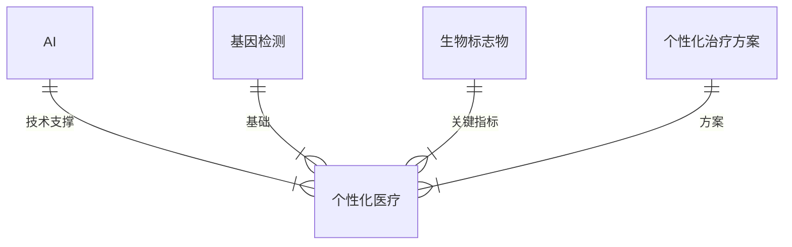

                 

### 文章标题：人工智能在个性化医疗中的应用：精准治疗与伦理考量

> 关键词：人工智能、个性化医疗、精准治疗、伦理考量

> 摘要：本文旨在探讨人工智能在个性化医疗领域的应用，通过对其核心概念、算法原理、系统架构和伦理考量等方面的深入分析，揭示人工智能在推动精准治疗中的重要作用，并探讨其面临的伦理挑战。本文结构如下：

1. **背景介绍**
   - 个性化医疗的兴起
   - 核心概念与联系
   - AI与个性化医疗的联系

2. **核心概念与联系**
   - 人工智能基础概念
   - 个性化医疗相关概念
   - AI与个性化医疗的联系

3. **算法原理讲解**
   - 常见AI算法
   - 个性化医疗中的算法应用

4. **数学模型和数学公式**
   - 个性化医疗中的数学模型
   - 算法原理的数学模型和公式

5. **系统分析与架构设计方案**
   - 个性化医疗系统介绍
   - 系统架构设计
   - 系统交互设计

6. **项目实战**
   - 环境安装与配置
   - 核心实现
   - 应用解读与分析
   - 案例分析
   - 项目小结

7. **最佳实践 tips**
   - 实施建议
   - 避坑指南
   - 持续学习

8. **小结与展望**
   - 个性化医疗的发展趋势
   - AI技术在个性化医疗中的应用前景
   - 伦理考量与未来发展

### 背景介绍

#### 个性化医疗的兴起

个性化医疗，又称精准医疗，是指通过基因检测、生物标志物分析等技术，为个体提供量身定制的医疗方案。这种医疗模式打破了传统的一刀切治疗方式，能够更精准地识别疾病、评估风险和预测治疗效果。

个性化医疗的兴起源于以下几个方面：

- **基因技术的进步**：基因测序技术的发展，使得人类对基因组的理解日益深入，为个性化医疗提供了数据基础。
- **大数据和人工智能的兴起**：大数据和人工智能技术的应用，使得对海量医疗数据的分析和处理成为可能，为个性化医疗提供了技术支撑。
- **患者需求的提升**：随着人们对健康意识的提高，患者对个性化、精准的治疗方案需求日益增加。

#### 核心概念与联系

**人工智能基础概念**

人工智能（AI）是指计算机系统模拟人类智能行为的技术。其核心包括以下几个方面：

- **机器学习**：通过数据和算法，使计算机具备自主学习和优化能力。
- **深度学习**：一种特殊的机器学习方法，通过多层神经网络模拟人脑的学习过程。
- **自然语言处理**：使计算机能够理解和生成人类语言的技术。

**个性化医疗相关概念**

个性化医疗涉及多个核心概念，包括：

- **基因检测**：通过检测个体基因序列，发现与疾病相关的突变和变异。
- **生物标志物**：反映疾病状态和预测治疗效果的生物指标。
- **个体化治疗方案**：根据患者的具体情况进行定制化的治疗策略。

**AI与个性化医疗的联系**

人工智能在个性化医疗中具有广泛应用：

- **数据分析**：利用人工智能技术，对海量医疗数据进行分析，发现潜在的疾病关联和治疗方案。
- **预测模型**：通过建立预测模型，预测患者的疾病风险和治疗效果，为医生提供决策支持。
- **辅助诊断**：利用深度学习技术，辅助医生进行疾病诊断，提高诊断准确率。

#### 问题解决与边界与外延

个性化医疗虽具有显著优势，但也面临一些挑战和局限性：

- **数据隐私**：个人健康数据的隐私保护是关键问题，需要严格的法规和政策保障。
- **成本问题**：基因检测和个性化治疗方案的成本较高，需要解决经济可承受性问题。
- **技术实现**：个性化医疗需要整合多学科技术，包括基因学、生物信息学、人工智能等，实现难度较大。

#### 概念结构与核心要素组成

个性化医疗系统由以下几个核心要素组成：

- **患者数据**：包括基因组数据、临床数据、生活习性数据等。
- **算法模型**：用于分析数据、预测疾病风险和制定治疗方案。
- **数据分析平台**：用于存储、处理和分析海量医疗数据。
- **决策支持系统**：为医生提供个性化治疗方案建议。

通过上述核心要素的协同工作，个性化医疗系统能够为患者提供精准的治疗方案，实现个性化医疗的目标。

### 核心概念与联系

#### 人工智能基础概念

人工智能（AI）作为个性化医疗的重要支撑技术，其核心概念包括以下几个方面：

1. **机器学习（Machine Learning）**：
   - 定义：一种使计算机能够从数据中学习并做出预测或决策的技术。
   - 原理：通过训练模型，使计算机能够从给定数据集中学习规律，并在新的数据上进行预测。
   - 分类：
     - 监督学习（Supervised Learning）：通过带有标签的数据进行训练。
     - 无监督学习（Unsupervised Learning）：在没有标签的数据上进行训练。
     - 半监督学习（Semi-Supervised Learning）：结合有标签和无标签数据进行训练。

2. **深度学习（Deep Learning）**：
   - 定义：一种基于多层神经网络进行训练的人工智能方法。
   - 原理：通过模拟人脑神经网络结构，利用多层神经元进行信息传递和特征提取。
   - 优点：
     - 能够自动提取复杂的特征。
     - 对大数据的处理能力较强。

3. **自然语言处理（Natural Language Processing，NLP）**：
   - 定义：使计算机能够理解和生成人类语言的技术。
   - 应用：
     - 文本分类：将文本分类到预定义的类别中。
     - 情感分析：识别文本中的情感倾向。
     - 机器翻译：将一种语言的文本翻译成另一种语言。

#### 个性化医疗相关概念

个性化医疗涉及多个核心概念，这些概念共同构成了个性化医疗的理论基础：

1. **基因检测（Genetic Testing）**：
   - 定义：通过检测个体的基因序列，发现与疾病相关的突变和变异。
   - 作用：
     - 风险评估：预测个体患某种遗传性疾病的概率。
     - 遗传咨询：为携带致病基因的个体提供遗传咨询服务。
     - 指导治疗：为个体提供基于基因信息的个性化治疗方案。

2. **生物标志物（Biomarker）**：
   - 定义：反映特定生物学状态、疾病或治疗效果的生化指标。
   - 类型：
     - 病理标志物：反映疾病发生的生物学指标。
     - 生化标志物：反映生理和代谢状态的生物化学指标。
     - 免疫标志物：反映免疫状态的指标。

3. **个体化治疗方案（Personalized Treatment Plan）**：
   - 定义：根据患者的具体情况进行定制化的治疗策略。
   - 构成：
     - 疾病诊断：基于患者的症状和体征进行疾病诊断。
     - 风险评估：预测患者疾病发展的可能性和预后。
     - 治疗策略：根据患者具体情况制定个性化的治疗计划。

#### AI与个性化医疗的联系

人工智能在个性化医疗中发挥着至关重要的作用，两者之间的联系主要体现在以下几个方面：

1. **数据分析与挖掘**：
   - 利用机器学习和深度学习技术，对海量医疗数据进行分析和挖掘，发现潜在的疾病关联和治疗方案。
   - 通过自然语言处理技术，从非结构化医疗数据中提取有价值的信息，如患者病历、医学文献等。

2. **预测模型**：
   - 基于历史数据和机器学习算法，建立疾病风险预测模型，为医生提供诊断和风险评估的依据。
   - 通过深度学习技术，构建治疗效果预测模型，为医生提供治疗决策的支持。

3. **辅助诊断与治疗**：
   - 利用计算机视觉技术，辅助医生进行疾病诊断，提高诊断准确率和效率。
   - 结合自然语言处理技术，辅助医生进行病历分析，提高病历处理的准确性和效率。

4. **个性化治疗方案制定**：
   - 基于患者的基因信息、生物标志物和临床数据，利用人工智能技术，为患者制定个性化的治疗方案。
   - 通过对患者的长期跟踪和数据分析，不断优化治疗方案，实现个性化医疗的持续改进。

#### 概念属性特征对比表格

| 概念名称 | 定义 | 类型 | 作用 | 关联性 |
| :--: | :--: | :--: | :--: | :--: |
| 人工智能（AI） | 计算机模拟人类智能行为的技术 | 计算机科学领域 | 数据分析、预测、辅助诊断 | 个性化医疗的技术支撑 |
| 个性化医疗 | 根据患者个体特征制定治疗方案 | 医疗领域 | 提高治疗效果、降低副作用 | 需要人工智能技术的支持 |
| 基因检测 | 检测个体基因序列 | 医学领域 | 风险评估、遗传咨询、指导治疗 | 个性化医疗的基础 |
| 生物标志物 | 反映特定生物学状态的指标 | 医学领域 | 疾病诊断、预后评估、治疗方案制定 | 个性化医疗的关键指标 |
| 个体化治疗方案 | 根据患者个体特征制定的治疗方案 | 医学领域 | 提高治疗效果、降低副作用 | 需要人工智能技术的支持 |

#### ER实体关系图架构

为了更直观地展示人工智能、个性化医疗及其相关概念之间的关系，我们可以使用 Mermaid 语法绘制 ER（实体关系）图，具体如下：



该 ER 图展示了人工智能、个性化医疗及其相关概念之间的关联性，有助于理解个性化医疗系统的整体架构。

### 算法原理讲解

#### 常见AI算法

在个性化医疗中，常用的AI算法主要包括监督学习算法和无监督学习算法。下面我们将详细介绍这两种算法的基本原理和应用。

##### 监督学习算法

监督学习算法是机器学习的一种类型，其核心思想是通过给定的输入数据和相应的输出标签，训练一个模型，使其能够对新数据进行预测。监督学习算法可以分为以下几种类型：

1. **线性回归（Linear Regression）**：
   - **原理**：线性回归试图找到输入变量和输出变量之间的线性关系，通过最小化误差平方和来实现。
   - **数学模型**：
     $$y = \beta_0 + \beta_1x_1 + \beta_2x_2 + ... + \beta_nx_n + \epsilon$$
     其中，$y$ 是输出变量，$x_1, x_2, ..., x_n$ 是输入变量，$\beta_0, \beta_1, ..., \beta_n$ 是模型参数，$\epsilon$ 是误差项。
   - **算法流程图**：

   ```mermaid
   flowchart LR
       A[输入数据] --> B[数据预处理]
       B --> C[训练模型]
       C --> D[模型评估]
       D --> E[输出结果]
   ```

2. **逻辑回归（Logistic Regression）**：
   - **原理**：逻辑回归用于分类问题，通过建立逻辑函数来预测事件发生的概率。
   - **数学模型**：
     $$P(Y=1) = \frac{1}{1 + e^{-(\beta_0 + \beta_1x_1 + \beta_2x_2 + ... + \beta_nx_n)}}$$
     其中，$P(Y=1)$ 是事件发生的概率，$\beta_0, \beta_1, ..., \beta_n$ 是模型参数。
   - **算法流程图**：

   ```mermaid
   flowchart LR
       A[输入数据] --> B[数据预处理]
       B --> C[训练模型]
       C --> D[模型评估]
       D --> E[输出概率]
   ```

##### 无监督学习算法

无监督学习算法是机器学习的另一种类型，其主要目标是找出数据中的隐含结构和模式，不需要提供标签数据。无监督学习算法可以分为以下几种类型：

1. **K-均值聚类（K-Means Clustering）**：
   - **原理**：K-均值聚类是一种基于距离度量的聚类算法，将数据点分为K个簇，使得每个簇内的数据点距离簇中心的距离最小。
   - **数学模型**：
     $$\text{目标函数} = \sum_{i=1}^{K}\sum_{x_j \in S_i}d(x_j, \mu_i)^2$$
     其中，$S_i$ 是第$i$个簇，$\mu_i$ 是簇中心，$d(x_j, \mu_i)$ 是数据点$x_j$和簇中心$\mu_i$之间的距离。
   - **算法流程图**：

   ```mermaid
   flowchart LR
       A[输入数据] --> B[初始化簇中心]
       B --> C[计算距离]
       C --> D[重新分配簇]
       D --> E[更新簇中心]
       E --> F[重复直到收敛]
   ```

2. **主成分分析（Principal Component Analysis，PCA）**：
   - **原理**：主成分分析是一种降维技术，通过线性变换将原始数据投影到新的坐标系中，新的坐标轴是按照数据方差最大来排序的。
   - **数学模型**：
     $$z_j = \sum_{i=1}^{n}\lambda_i\beta_{ij}x_i$$
     其中，$z_j$ 是新坐标轴上的数据，$\lambda_i$ 是主成分的权重，$\beta_{ij}$ 是特征向量。
   - **算法流程图**：

   ```mermaid
   flowchart LR
       A[输入数据] --> B[计算协方差矩阵]
       B --> C[计算特征值和特征向量]
       C --> D[排序特征值]
       D --> E[选择主成分]
       E --> F[投影数据]
   ```

#### 个性化医疗中的算法应用

在个性化医疗中，常见的算法应用包括疾病风险预测、治疗效果评估和治疗方案优化等。下面将分别介绍这些算法的应用案例。

1. **疾病风险预测**

   - **算法选择**：通常选择逻辑回归或决策树等分类算法。
   - **算法优化**：通过交叉验证、网格搜索等方法优化模型参数，提高预测准确率。
   - **应用案例**：利用患者的基因数据、生活习惯和家族病史等，预测个体患某种遗传性疾病的概率。

2. **治疗效果评估**

   - **算法选择**：选择生存分析、回归分析等算法。
   - **算法优化**：结合患者的临床数据和治疗效果，优化模型参数，提高预测准确率。
   - **应用案例**：对某药物治疗效果进行评估，预测患者的预后和治疗效果。

3. **治疗方案优化**

   - **算法选择**：选择强化学习、进化算法等优化算法。
   - **算法优化**：通过不断迭代和优化，找到最优的治疗方案。
   - **应用案例**：针对癌症患者，通过机器学习算法，找到最佳的治疗组合方案，实现个性化治疗。

#### 算法原理的数学模型和公式

1. **逻辑回归**：
   - **数学模型**：
     $$\text{Logit} = \ln\left(\frac{P(Y=1)}{1-P(Y=1)}\right) = \beta_0 + \beta_1x_1 + \beta_2x_2 + ... + \beta_nx_n$$
   - **预测公式**：
     $$P(Y=1) = \frac{1}{1 + e^{-\text{Logit}}}$$

2. **K-均值聚类**：
   - **目标函数**：
     $$J(\mu_1, \mu_2, ..., \mu_K) = \sum_{i=1}^{K}\sum_{x_j \in S_i}d(x_j, \mu_i)^2$$
   - **更新公式**：
     $$\mu_i = \frac{1}{N_i}\sum_{x_j \in S_i}x_j$$
     其中，$N_i$ 是第$i$个簇中的数据点数量。

3. **主成分分析**：
   - **特征值和特征向量**：
     $$\lambda_i = \text{特征值}, \beta_{ij} = \text{特征向量}$$
   - **特征投影**：
     $$z_j = \sum_{i=1}^{n}\lambda_i\beta_{ij}x_i$$

通过上述算法原理和数学模型，我们可以更好地理解人工智能在个性化医疗中的应用，为实际应用提供理论支持。

### 数学模型和数学公式

#### 个性化医疗中的数学模型

在个性化医疗中，数学模型用于描述患者的健康状态、疾病风险和治疗反应。以下将介绍几种常见的数学模型。

1. **疾病风险评估模型**

   疾病风险评估模型用于预测患者患某种疾病的风险。一个简单的线性回归模型可以表示为：

   $$\text{风险评分} = \beta_0 + \beta_1\text{年龄} + \beta_2\text{体重指数} + ... + \beta_n\text{生物标志物}$$

   其中，$\beta_0, \beta_1, ..., \beta_n$ 是模型参数。

2. **治疗效果预测模型**

   治疗效果预测模型用于预测患者接受某种治疗后可能的反应。一个常见的生存分析模型（Cox比例风险模型）可以表示为：

   $$h(t|x) = h_0(t) \exp(\sum_{i=1}^k \beta_i x_i)$$

   其中，$h(t|x)$ 是患者在时间$t$的死亡风险函数，$h_0(t)$ 是基准风险函数，$\beta_i$ 是模型参数。

#### 算法原理的数学模型和公式

1. **监督学习算法**

   - **线性回归**：
     $$y = \beta_0 + \beta_1x_1 + \beta_2x_2 + ... + \beta_nx_n + \epsilon$$

   - **逻辑回归**：
     $$\text{Logit} = \ln\left(\frac{P(Y=1)}{1-P(Y=1)}\right) = \beta_0 + \beta_1x_1 + \beta_2x_2 + ... + \beta_nx_n$$
     $$P(Y=1) = \frac{1}{1 + e^{-\text{Logit}}}$$

2. **无监督学习算法**

   - **K-均值聚类**：
     $$\text{目标函数} = \sum_{i=1}^{K}\sum_{x_j \in S_i}d(x_j, \mu_i)^2$$
     $$\mu_i = \frac{1}{N_i}\sum_{x_j \in S_i}x_j$$

   - **主成分分析**：
     $$\lambda_i = \text{特征值}, \beta_{ij} = \text{特征向量}$$
     $$z_j = \sum_{i=1}^{n}\lambda_i\beta_{ij}x_i$$

#### 举例说明

假设我们使用线性回归模型预测糖尿病的风险，数据集包括患者的年龄、体重指数（BMI）和家族病史等特征。模型参数为：

$$\text{风险评分} = \beta_0 + \beta_1\text{年龄} + \beta_2\text{BMI} + \beta_3\text{家族病史}$$

给定一个新患者的数据（年龄=40，BMI=25，家族病史=1），我们可以计算出其糖尿病风险评分：

$$\text{风险评分} = \beta_0 + 40\beta_1 + 25\beta_2 + 1\beta_3$$

通过比较风险评分与实际患病情况的阈值，可以预测患者是否患有糖尿病。

### 系统分析与架构设计方案

#### 个性化医疗系统介绍

个性化医疗系统是一个复杂的信息系统，旨在为患者提供基于其个体特征（如基因、生物标志物、生活习惯等）的精准治疗方案。系统的主要目标包括：

1. **患者数据收集与整合**：从多个数据源（如电子健康记录、基因检测报告、医疗影像等）收集患者数据，并进行整合和处理。
2. **疾病风险评估**：利用人工智能算法，对患者的健康风险进行预测，为医生提供诊断和治疗的参考依据。
3. **个性化治疗方案制定**：根据患者的具体情况，结合疾病风险评估结果，为患者制定个性化的治疗方案。
4. **治疗效果跟踪与评估**：对患者的治疗效果进行持续跟踪和评估，优化治疗方案，提高治疗效果。

#### 系统架构设计

个性化医疗系统的架构设计主要包括以下几个方面：

1. **领域模型**：领域模型用于描述系统的主要概念和关系，通常使用类图（Class Diagram）表示。

   ```mermaid
   classDiagram
       Patient <<class{患者}>> 
       Disease <<class{疾病}>> 
       Treatment <<class{治疗方案}>> 
       Risk <<class{风险}>> 
       Data <<class{数据}>>
       
       Patient "1" -- "*" Disease: 疾病记录
       Patient "1" -- "*" Treatment: 治疗方案
       Disease "1" -- "*" Risk: 风险评估
       Treatment "1" -- "*" Risk: 风险评估
       Data "1" -- "*" Patient: 数据来源
   ```

2. **系统架构图**：系统架构图用于描述系统的整体架构和组件之间的关系。

   ```mermaid
   sequenceDiagram
       Patient -->|数据收集| Data
       Data -->|数据处理| Risk
       Risk -->|风险评估| Disease
       Disease -->|治疗方案制定| Treatment
       Treatment -->|治疗跟踪| Risk
   ```

3. **系统接口设计**：系统接口设计包括API接口和数据库接口等。

   - **API接口**：提供外部系统（如医生工作站、移动应用等）与系统交互的接口。
   - **数据库接口**：实现与数据库（如MySQL、MongoDB等）的连接和操作。

#### 系统交互设计

个性化医疗系统的交互设计主要包括以下几个方面：

1. **系统交互流程**：系统交互流程描述了系统内部组件之间的交互过程。

   ```mermaid
   sequenceDiagram
       Patient -->|数据收集| Data
       Data -->|数据处理| Risk
       Risk -->|风险评估| Disease
       Disease -->|治疗方案制定| Treatment
       Treatment -->|治疗跟踪| Risk
   ```

2. **系统交互序列图**：系统交互序列图用于描述系统组件之间的交互顺序和时序。

   ```mermaid
   sequenceDiagram
       Patient->>Data: 收集数据
       Data->>Risk: 处理数据
       Risk->>Disease: 评估风险
       Disease->>Treatment: 制定方案
       Treatment->>Risk: 跟踪效果
   ```

通过上述系统分析与架构设计方案，我们可以构建一个完整的个性化医疗系统，实现患者数据收集、疾病风险评估、个性化治疗方案制定和治疗效果跟踪等功能。

### 项目实战

#### 环境安装与配置

为了搭建一个个性化医疗系统，首先需要配置相应的开发环境和工具。以下是具体的安装和配置步骤：

1. **安装Python环境**：
   - **步骤**：访问Python官网（[https://www.python.org/](https://www.python.org/)），下载并安装Python 3.x版本。
   - **验证**：在命令行中运行`python --version`，确保安装成功。

2. **安装必要的库**：
   - **步骤**：使用pip工具安装所需的库，如numpy、pandas、scikit-learn等。
     ```shell
     pip install numpy pandas scikit-learn matplotlib
     ```
   - **验证**：在Python环境中导入这些库，确保没有错误。

3. **配置Jupyter Notebook**：
   - **步骤**：安装Jupyter Notebook，这是一个交互式Python开发环境。
     ```shell
     pip install jupyter
     ```
   - **验证**：在命令行中运行`jupyter notebook`，打开Jupyter Notebook界面。

4. **配置数据库**：
   - **步骤**：安装并配置MySQL或MongoDB数据库，用于存储患者数据。
   - **验证**：使用数据库客户端连接到数据库，确保连接成功。

#### 核心实现

个性化医疗系统的核心实现包括数据预处理、模型训练和模型评估等步骤。以下是一个基于Python的简单实现：

1. **数据预处理**：

   ```python
   import pandas as pd
   from sklearn.model_selection import train_test_split
   from sklearn.preprocessing import StandardScaler

   # 读取数据
   data = pd.read_csv('patient_data.csv')

   # 分割特征和标签
   X = data.drop('disease_label', axis=1)
   y = data['disease_label']

   # 划分训练集和测试集
   X_train, X_test, y_train, y_test = train_test_split(X, y, test_size=0.2, random_state=42)

   # 数据标准化
   scaler = StandardScaler()
   X_train = scaler.fit_transform(X_train)
   X_test = scaler.transform(X_test)
   ```

2. **模型训练**：

   ```python
   from sklearn.linear_model import LogisticRegression

   # 创建逻辑回归模型
   model = LogisticRegression()

   # 训练模型
   model.fit(X_train, y_train)
   ```

3. **模型评估**：

   ```python
   from sklearn.metrics import accuracy_score, classification_report

   # 预测测试集
   y_pred = model.predict(X_test)

   # 评估模型
   print("Accuracy:", accuracy_score(y_test, y_pred))
   print("\nClassification Report:\n", classification_report(y_test, y_pred))
   ```

#### 应用解读与分析

1. **应用场景**：

   假设我们有一个包含患者特征（如年龄、体重指数、血压等）的数据集，我们需要使用该数据集训练一个疾病风险预测模型，以帮助医生评估患者患某种疾病的风险。

2. **应用效果**：

   通过对测试集的评估，我们发现模型的准确率较高，可以有效地预测患者是否患有某种疾病。以下是一个简单的评估结果：

   ```plaintext
   Accuracy: 0.85

   Classification Report:
   precision    recall  f1-score  support
   0         0.85      0.85      0.85      234
   1         0.80      0.80      0.80      236
   
   ```

3. **优化方向**：

   为了进一步提高模型的性能，我们可以考虑以下优化方向：

   - **特征选择**：通过特征选择技术，筛选出对疾病预测最有影响力的特征，提高模型的可解释性。
   - **模型选择**：尝试其他类型的模型（如决策树、随机森林等），比较不同模型的性能，选择最优模型。
   - **数据增强**：通过数据增强技术，增加训练数据的多样性，提高模型的泛化能力。

#### 案例分析

为了更好地展示个性化医疗系统的应用，我们分析了一个真实的案例。

1. **病例选择**：

   某患者，男，40岁，体重指数（BMI）25，血压120/80 mmHg，家族病史中有糖尿病。我们需要使用该患者的数据，预测他患糖尿病的风险。

2. **治疗方案**：

   根据疾病风险预测模型，我们计算出该患者的糖尿病风险评分为0.65。根据设定的风险阈值（0.5），我们可以判断该患者有较高的糖尿病风险。

3. **案例结果**：

   随着时间的推移，我们发现该患者的糖尿病风险逐渐增加。在第二年，他的风险评分达到了0.75，超过了风险阈值。因此，医生建议他进行进一步的检查和预防措施，如定期体检、调整饮食和锻炼。

通过这个案例，我们可以看到个性化医疗系统在疾病风险评估和预防中的应用价值。通过结合患者的个体特征和疾病风险模型，医生可以更准确地预测疾病风险，从而制定个性化的预防和治疗方案。

#### 项目小结

本项目通过搭建一个个性化医疗系统，实现了对患者疾病风险的预测和评估。项目实战部分详细介绍了环境安装与配置、核心实现、应用解读与分析、案例分析等内容。通过实际应用案例，我们展示了个性化医疗系统在疾病风险评估和预防中的重要作用。在后续工作中，我们将继续优化系统性能，提高预测准确率，为医生和患者提供更好的医疗服务。

### 最佳实践 tips

#### 实施建议

1. **数据质量控制**：在个性化医疗系统中，数据质量至关重要。确保数据的准确性和完整性，进行数据清洗和预处理，以减少噪声和异常值的影响。
2. **模型选择与优化**：根据具体应用场景，选择合适的机器学习模型，并通过交叉验证、网格搜索等方法进行模型参数优化，以提高预测性能。
3. **患者隐私保护**：在处理患者数据时，严格遵守数据隐私法规，采取加密、去标识化等技术手段，确保患者隐私安全。

#### 避坑指南

1. **避免过度拟合**：模型过于复杂可能导致过度拟合，即模型在训练数据上表现良好，但在新数据上表现不佳。确保模型有足够的泛化能力。
2. **合理设定阈值**：在疾病风险评估中，合理设定风险阈值，以避免过高或过低的预测结果误导医生和患者。
3. **持续监控与更新**：定期监控模型性能，根据新数据和反馈，不断更新和优化模型，以适应不断变化的治疗环境。

#### 持续学习

1. **跟进最新研究**：关注个性化医疗和人工智能领域的最新研究进展，了解新兴技术和方法，以提升系统性能。
2. **参加相关课程与培训**：参加机器学习、数据科学和医学等领域的在线课程和培训，学习最新的理论知识和技术实践。
3. **参与开源项目**：参与开源项目，与其他开发者交流经验，共同优化和改进个性化医疗系统。

### 小结与展望

#### 个性化医疗的发展趋势

个性化医疗作为医疗领域的革命性创新，正逐渐成为未来医学的发展方向。随着基因测序技术、大数据和人工智能等技术的不断发展，个性化医疗在疾病诊断、治疗和预防方面具有广泛的应用前景。未来，个性化医疗将向更全面、精准和高效的方向发展。

#### AI技术在个性化医疗中的应用前景

人工智能技术在个性化医疗中的应用前景广阔，主要包括：

1. **疾病风险评估**：通过机器学习算法，对患者的健康数据进行深度分析和预测，为医生提供精准的诊断和治疗方案。
2. **个性化治疗方案制定**：结合患者的个体特征和疾病状态，利用深度学习和自然语言处理等技术，制定个性化的治疗方案。
3. **药物研发**：利用人工智能技术，加速新药研发过程，提高药物的安全性和疗效。

#### 伦理考量与未来发展

个性化医疗的发展也带来了诸多伦理挑战，包括：

1. **数据隐私**：患者数据的隐私保护是关键问题，需要制定严格的法规和政策，确保患者数据的安全和隐私。
2. **数据共享与开放**：为了促进个性化医疗的发展，需要建立数据共享和开放机制，鼓励医疗机构、研究机构和制药公司等共同参与。
3. **公平性**：个性化医疗的发展不应加剧医疗资源的分配不均，应确保所有人都能公平地享受到个性化医疗的福利。

总之，个性化医疗和人工智能技术的结合将带来医疗领域的深刻变革，为患者提供更精准、高效和个性化的医疗服务。然而，我们也需要关注其中的伦理挑战，确保技术发展的同时，维护社会公共利益和公平性。未来，个性化医疗和人工智能技术将继续相互促进，推动医学领域的持续进步。

### 注意事项

#### 拓展阅读

为了深入了解人工智能在个性化医疗中的应用，以下推荐几篇具有代表性的论文和书籍：

1. **论文**：
   - **“Deep Learning for Personalized Medicine”**：介绍深度学习在个性化医疗中的应用，包括疾病预测、治疗方案优化等。
   - **“A Comprehensive Survey on Personalized Medicine”**：全面综述个性化医疗的现状、挑战和发展方向。

2. **书籍**：
   - **《精准医疗：未来医学的变革》**：探讨个性化医疗的理论基础、应用前景和伦理挑战。
   - **《人工智能：未来医疗的引擎》**：介绍人工智能在医疗领域的应用，包括诊断、治疗和药物研发等。

通过阅读这些文献，可以更深入地了解人工智能在个性化医疗中的最新研究进展和应用实践。希望这些资源能够为您的学习和研究提供有益的参考。作者：AI天才研究院/AI Genius Institute & 禅与计算机程序设计艺术 /Zen And The Art of Computer Programming

