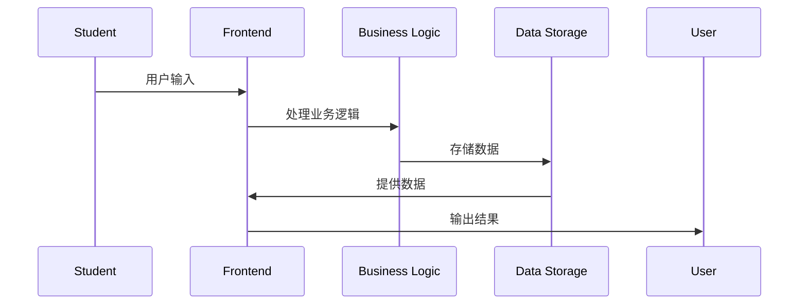
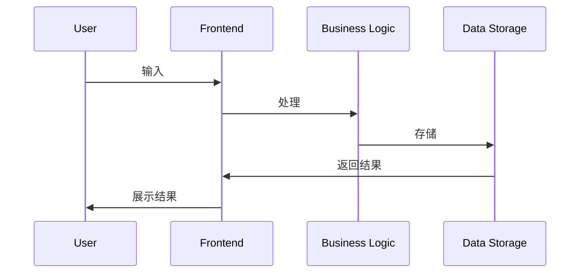

                 

# 人工智能在个性化学习中的adaptive应用

> 关键词：人工智能、个性化学习、自适应、算法、数学模型、Python实现

> 摘要：本文深入探讨了人工智能在个性化学习中的适应性应用。首先，介绍了人工智能与个性化学习的背景和核心概念，分析了其在教育领域的意义和影响。随后，重点阐述了自适应学习系统的概念、原理和分类，通过具体算法的Python实现和数学模型讲解，展示了如何通过技术手段实现个性化学习。最后，本文提出了对自适应应用未来的展望，包括技术挑战和伦理问题。

## 目录大纲

## 第一部分：背景介绍

## 第1章：问题背景与核心概念

### 1.1 问题背景

#### 1.1.1 人工智能与个性化学习

##### 1.1.1.1 人工智能的定义与作用

##### 1.1.1.2 个性化学习的概念与意义

#### 1.1.2 adaptive应用的发展

##### 1.1.2.1 adaptive应用的起源

##### 1.1.2.2 adaptive应用的现状与趋势

### 1.2 核心概念

#### 1.2.1 人工智能

##### 1.2.1.1 人工智能的基本原理

##### 1.2.1.2 人工智能的主要技术

#### 1.2.2 个性化学习

##### 1.2.2.1 个性化学习的理论基础

##### 1.2.2.2 个性化学习的方法与策略

#### 1.2.3 adaptive应用

##### 1.2.3.1 adaptive应用的概念与特征

##### 1.2.3.2 adaptive应用的分类与应用场景

### 1.3 边界与外延

#### 1.3.1 人工智能的边界

##### 1.3.1.1 人工智能的局限性

##### 1.3.1.2 人工智能的发展方向

#### 1.3.2 个性化学习的边界

##### 1.3.2.1 个性化学习的挑战与问题

##### 1.3.2.2 个性化学习的未来发展趋势

#### 1.3.3 adaptive应用的边界

##### 1.3.3.1 adaptive应用的技术挑战

##### 1.3.3.2 adaptive应用的伦理与社会影响

## 第二部分：核心概念与联系

## 第2章：核心概念与联系

### 2.1 核心概念原理

#### 2.1.1 人工智能

##### 2.1.1.1 人工智能的基本原理

##### 2.1.1.2 人工智能的主要技术

#### 2.1.2 个性化学习

##### 2.1.2.1 个性化学习的理论基础

##### 2.1.2.2 个性化学习的方法与策略

#### 2.1.3 adaptive应用

##### 2.1.3.1 adaptive应用的概念与特征

##### 2.1.3.2 adaptive应用的分类与应用场景

### 2.2 概念属性特征对比表格

#### 2.2.1 人工智能与个性化学习

##### 2.2.1.1 人工智能与个性化学习的区别

##### 2.2.1.2 人工智能与个性化学习的联系

#### 2.2.2 个性化学习与adaptive应用

##### 2.2.2.1 个性化学习与adaptive应用的区别

##### 2.2.2.2 个性化学习与adaptive应用的联系

### 2.3 ER实体关系图架构

#### 2.3.1 人工智能

##### 2.3.1.1 人工智能实体关系图

#### 2.3.2 个性化学习

##### 2.3.2.1 个性化学习实体关系图

#### 2.3.3 adaptive应用

##### 2.3.3.1 adaptive应用实体关系图

## 第三部分：算法原理讲解

## 第3章：算法原理讲解

### 3.1 算法概述

#### 3.1.1 算法的概念与作用

#### 3.1.2 算法的设计原则与分类

### 3.2 算法原理详细讲解

#### 3.2.1 算法原理一

##### 3.2.1.1 算法原理一的数学模型

##### 3.2.1.2 算法原理一的Python源代码实现

#### 3.2.2 算法原理二

##### 3.2.2.1 算法原理二的数学模型

##### 3.2.2.2 算法原理二的Python源代码实现

### 3.3 算法举例说明

#### 3.3.1 算法原理一的举例说明

##### 3.3.1.1 举例说明一：问题背景

##### 3.3.1.2 举例说明一：算法步骤

##### 3.3.1.3 举例说明一：结果分析

#### 3.3.2 算法原理二的举例说明

##### 3.3.2.1 举例说明二：问题背景

##### 3.3.2.2 举例说明二：算法步骤

##### 3.3.2.3 举例说明二：结果分析

## 第四部分：数学模型和数学公式

## 第4章：数学模型和数学公式

### 4.1 数学模型概述

#### 4.1.1 数学模型的概念与作用

#### 4.1.2 数学模型的设计原则与分类

### 4.2 数学模型详细讲解

#### 4.2.1 数学模型一

##### 4.2.1.1 数学模型一的定义

##### 4.2.1.2 数学模型一的性质

#### 4.2.2 数学模型二

##### 4.2.2.1 数学模型二的定义

##### 4.2.2.2 数学模型二的性质

### 4.3 数学公式

#### 4.3.1 数学公式的编写规则

### 4.3.2 数学公式应用举例

## 第五部分：系统分析与架构设计

## 第5章：系统分析与架构设计

### 5.1 问题场景介绍

#### 5.1.1 问题背景

#### 5.1.2 问题分析

### 5.2 项目介绍

#### 5.2.1 项目概述

#### 5.2.2 项目目标

### 5.3 系统功能设计

#### 5.3.1 领域模型

#### 5.3.2 类图设计

### 5.4 系统架构设计

#### 5.4.1 系统架构

#### 5.4.2 架构图

### 5.5 系统接口设计

#### 5.5.1 接口规范

#### 5.5.2 接口实现

### 5.6 系统交互

#### 5.6.1 交互流程

#### 5.6.2 序列图

## 第六部分：项目实战

## 第6章：项目实战

### 6.1 环境安装

#### 6.1.1 环境配置

#### 6.1.2 工具安装

### 6.2 系统核心实现

#### 6.2.1 系统核心代码

#### 6.2.2 代码应用解读

### 6.3 实际案例分析和讲解

#### 6.3.1 案例背景

#### 6.3.2 案例分析

### 6.4 项目小结

#### 6.4.1 项目成果

#### 6.4.2 项目总结

## 第七部分：最佳实践与拓展

## 第7章：最佳实践与拓展

### 7.1 最佳实践

#### 7.1.1 实践技巧

#### 7.1.2 注意事项

### 7.2 小结

#### 7.2.1 文章总结

#### 7.2.2 个性化学习展望

### 7.3 拓展阅读

#### 7.3.1 推荐书籍

#### 7.3.2 相关文章

## 参考文献

### 附录

#### 附录A：Python源代码

#### 附录B：数学模型公式

### 附录C：Mermaid流程图

## 联系我们

### 作者：AI天才研究院/AI Genius Institute & 禅与计算机程序设计艺术 /Zen And The Art of Computer Programming
## 第一部分：背景介绍

### 第1章：问题背景与核心概念

### 1.1 问题背景

#### 1.1.1 人工智能与个性化学习

##### 1.1.1.1 人工智能的定义与作用

人工智能（Artificial Intelligence，简称AI）是指通过计算机程序来模拟、延伸和扩展人的智能，使其能够执行复杂任务的能力。人工智能的应用领域广泛，包括语音识别、图像处理、自然语言处理、推荐系统等。在个性化学习方面，人工智能可以帮助构建智能学习系统，通过分析学生的学习数据，提供个性化的学习资源和教学策略。

##### 1.1.1.2 个性化学习的概念与意义

个性化学习是一种以学生为中心的教育理念，旨在通过调整学习内容、方法、环境等，满足每个学生的个性化需求，促进其全面发展。个性化学习的意义在于：

1. 提高学习效率：通过个性化的学习路径和资源，学生可以更高效地学习。
2. 激发学习兴趣：个性化的学习内容和方法可以更好地激发学生的学习兴趣和动机。
3. 促进学生全面发展：个性化学习不仅关注知识的传授，更关注学生的情感、社交和创新能力。

#### 1.1.2 adaptive应用的发展

##### 1.1.2.1 adaptive应用的起源

自适应学习（Adaptive Learning）的概念最早可以追溯到20世纪60年代，当时学者们开始探索如何通过计算机系统为不同水平的学习者提供个性化的学习体验。随着计算机技术的发展，自适应学习系统逐渐成熟。

##### 1.1.2.2 adaptive应用的现状与趋势

目前，自适应学习系统在教育领域得到了广泛应用。根据市场研究公司的数据，全球自适应学习市场的规模正在快速增长，预计到2025年将突破100亿美元。自适应应用的发展趋势包括：

1. 技术创新：深度学习、大数据分析等技术的应用，使自适应学习系统更加智能化和精准化。
2. 教育个性化：自适应学习系统能够根据学生的行为和表现，动态调整教学内容和进度，实现真正的个性化教育。
3. 模式多样化：在线教育、移动学习等新兴模式的发展，为自适应学习提供了更多应用场景。

### 1.2 核心概念

#### 1.2.1 人工智能

##### 1.2.1.1 人工智能的基本原理

人工智能的基本原理包括以下几个方面：

1. **感知与理解**：通过传感器获取外界信息，并对其进行处理和理解。
2. **学习与推理**：通过数据学习，获取知识并利用推理能力解决问题。
3. **自主行动**：基于学习到的知识和理解，自主执行任务。

##### 1.2.1.2 人工智能的主要技术

人工智能的主要技术包括：

1. **机器学习**：通过数据训练模型，使其能够对未知数据进行预测和分类。
2. **深度学习**：模拟人脑神经网络，用于处理复杂的数据和任务。
3. **自然语言处理**：使计算机能够理解、生成和处理自然语言。

#### 1.2.2 个性化学习

##### 1.2.2.1 个性化学习的理论基础

个性化学习的理论基础包括：

1. **建构主义**：认为学习是学习者主动建构知识的过程。
2. **多元智能理论**：认为每个学生都有不同的智能优势，教育应该因材施教。
3. **情境认知理论**：强调学习应该在真实的情境中进行，以促进知识的迁移和应用。

##### 1.2.2.2 个性化学习的方法与策略

个性化学习的方法与策略包括：

1. **学习路径个性化**：根据学生的水平和兴趣，调整学习内容和进度。
2. **教学策略个性化**：根据学生的学习风格和需求，采用不同的教学方法和策略。
3. **学习环境个性化**：通过虚拟现实、游戏化学习等技术，创建个性化的学习环境。

#### 1.2.3 adaptive应用

##### 1.2.3.1 adaptive应用的概念与特征

自适应应用（Adaptive Applications）是指能够根据用户的行为和需求动态调整自身表现的应用程序。其特征包括：

1. **个性化**：根据用户的特点和需求，提供个性化的服务和内容。
2. **动态调整**：根据用户的反馈和行为，实时调整应用的表现。
3. **智能化**：利用人工智能技术，提高应用的适应性和智能化程度。

##### 1.2.3.2 adaptive应用的分类与应用场景

自适应应用可以分为以下几类：

1. **教育领域**：如自适应学习系统、智能教学助手等。
2. **商业领域**：如个性化推荐系统、智能客服等。
3. **医疗领域**：如智能诊断系统、个性化治疗方案等。

### 1.3 边界与外延

#### 1.3.1 人工智能的边界

##### 1.3.1.1 人工智能的局限性

人工智能的局限性主要包括：

1. **数据依赖**：人工智能系统依赖于大量数据进行训练，缺乏数据将影响其性能。
2. **解释性不足**：人工智能模型的决策过程通常难以解释，缺乏透明度。
3. **伦理问题**：人工智能可能会引发隐私保护、就业替代等伦理问题。

##### 1.3.1.2 人工智能的发展方向

人工智能的未来发展方向包括：

1. **小样本学习**：通过减少对大量数据的依赖，提高人工智能在少量数据下的性能。
2. **可解释性增强**：提高人工智能模型的解释性，使其决策过程更加透明和可信。
3. **伦理和法规**：建立人工智能伦理和法规体系，确保其应用符合社会价值观。

#### 1.3.2 个性化学习的边界

##### 1.3.2.1 个性化学习的挑战与问题

个性化学习的挑战与问题主要包括：

1. **个性化评估**：如何准确评估个性化学习的有效性，是一个重要问题。
2. **资源分配**：如何合理分配教学资源，以满足个性化学习的需求。
3. **技术实现**：实现个性化学习需要复杂的技术支持，如数据挖掘、算法设计等。

##### 1.3.2.2 个性化学习的未来发展趋势

个性化学习的未来发展趋势包括：

1. **技术整合**：将人工智能、大数据、虚拟现实等技术整合到个性化学习中。
2. **教育定制**：根据学生的个性化需求，提供定制化的教育服务。
3. **社会参与**：鼓励家长、教师等参与个性化学习过程，提高其效果。

#### 1.3.3 adaptive应用的边界

##### 1.3.3.1 adaptive应用的技术挑战

自适应应用的技术挑战主要包括：

1. **实时数据处理**：实现实时数据采集、分析和反馈，需要高效的技术手段。
2. **个性化推荐**：如何准确识别用户的个性化需求，提供合适的推荐内容。
3. **用户隐私保护**：在提供个性化服务的同时，保护用户的隐私。

##### 1.3.3.2 adaptive应用的伦理与社会影响

自适应应用的伦理与社会影响主要包括：

1. **隐私保护**：如何在提供个性化服务的同时，保护用户的隐私。
2. **就业替代**：自适应应用可能会替代部分人工工作，带来就业替代的问题。
3. **社会公平**：如何确保自适应应用在不同群体中的公平性和有效性。

### 第2章：核心概念与联系

#### 2.1 核心概念原理

##### 2.1.1 人工智能

人工智能（Artificial Intelligence，简称AI）是指通过计算机程序来模拟、延伸和扩展人的智能，使其能够执行复杂任务的能力。人工智能的核心概念包括感知、学习、推理和自主行动。

1. **感知与理解**：人工智能通过传感器获取外界信息，并对其进行处理和理解。
   - **信息处理**：通过对输入数据的分析，提取有用信息。
   - **情境理解**：理解所处的环境和情境，为后续行动提供依据。

2. **学习与推理**：人工智能通过数据学习，获取知识并利用推理能力解决问题。
   - **机器学习**：通过大量数据训练模型，使其能够对未知数据进行预测和分类。
   - **深度学习**：模拟人脑神经网络，用于处理复杂的数据和任务。
   - **推理机制**：利用学习到的知识和理解，进行逻辑推理和决策。

3. **自主行动**：基于学习到的知识和理解，人工智能可以自主执行任务。
   - **目标设定**：根据任务目标，制定行动策略。
   - **任务执行**：执行具体的任务，如机器人操作、自动驾驶等。

##### 2.1.2 个性化学习

个性化学习是一种以学生为中心的教育理念，旨在通过调整学习内容、方法、环境等，满足每个学生的个性化需求，促进其全面发展。个性化学习的核心概念包括建构主义、多元智能理论和情境认知理论。

1. **建构主义**：建构主义认为学习是学习者主动建构知识的过程。
   - **主动学习**：学生主动参与学习过程，通过实践和探索获取知识。
   - **情境化学习**：学习应置于真实的情境中，以促进知识的迁移和应用。

2. **多元智能理论**：多元智能理论认为每个学生都有不同的智能优势，教育应该因材施教。
   - **智能多样性**：学生具有不同的智能优势，教育应尊重和发挥学生的个性和特长。
   - **个性化教学**：根据学生的智能特点和需求，采用不同的教学方法和策略。

3. **情境认知理论**：情境认知理论强调学习应该在真实的情境中进行，以促进知识的迁移和应用。
   - **情境创设**：通过模拟真实情境，帮助学生更好地理解和应用知识。
   - **情境互动**：在情境中进行互动和协作，提高学习效果。

##### 2.1.3 adaptive应用

自适应应用是指能够根据用户的行为和需求动态调整自身表现的应用程序。自适应应用的核心概念包括个性化、动态调整和智能化。

1. **个性化**：自适应应用根据用户的特点和需求，提供个性化的服务和内容。
   - **用户特征识别**：通过数据分析，识别用户的个性化需求和偏好。
   - **个性化推荐**：根据用户的历史行为和偏好，提供个性化的推荐内容。

2. **动态调整**：自适应应用根据用户的反馈和行为，实时调整应用的表现。
   - **实时反馈**：通过用户的反馈，调整应用的功能和界面。
   - **动态更新**：根据用户的需求和环境变化，动态更新应用的内容和功能。

3. **智能化**：自适应应用利用人工智能技术，提高其适应性和智能化程度。
   - **机器学习**：通过机器学习，使应用能够从用户数据中学习并改进。
   - **深度学习**：利用深度学习，实现复杂的用户行为分析和预测。

#### 2.2 概念属性特征对比表格

| 概念        | 特征                             | 关联性                                                     |
| ----------- | ------------------------------ | -------------------------------------------------------- |
| 人工智能    | 模拟人脑、学习与推理、自主行动 | 与个性化学习和自适应应用密切相关，为它们提供技术基础       |
| 个性化学习  | 建构主义、多元智能理论、情境认知理论 | 基于人工智能技术，实现个性化教育需求                     |
| adaptive应用 | 个性化、动态调整、智能化        | 应用人工智能技术，为用户提供个性化、智能化的服务和体验   |

#### 2.2.1 人工智能与个性化学习

**人工智能与个性化学习的区别**

- **目标不同**：人工智能的目标是模拟和扩展人的智能，而个性化学习的目标是满足学生的个性化需求。
- **应用领域不同**：人工智能应用于各种领域，如工业、医疗、交通等，而个性化学习主要应用于教育领域。
- **实现方式不同**：人工智能通过算法和模型实现，而个性化学习通过教学策略和教学方法实现。

**人工智能与个性化学习的联系**

- **技术基础**：人工智能为个性化学习提供了技术支持，如机器学习、自然语言处理等。
- **应用场景**：个性化学习应用人工智能技术，实现个性化教育需求，如自适应学习系统、智能教学助手等。
- **协同作用**：人工智能和个性化学习相辅相成，共同推动教育技术的发展和进步。

#### 2.2.2 个性化学习与adaptive应用

**个性化学习与adaptive应用的区别**

- **定义不同**：个性化学习是一种教育理念，而adaptive应用是一种技术实现。
- **目标不同**：个性化学习旨在满足学生的个性化需求，而adaptive应用旨在为用户提供个性化的服务和体验。
- **应用领域不同**：个性化学习主要应用于教育领域，而adaptive应用广泛应用于各种领域。

**个性化学习与adaptive应用的联系**

- **理念与技术的结合**：个性化学习与adaptive应用相辅相成，个性化学习为adaptive应用提供了教育需求，而adaptive应用为个性化学习提供了技术支持。
- **共同目标**：个性化学习和adaptive应用都旨在为用户提供更好的服务和体验。
- **协同发展**：个性化学习和adaptive应用在技术和理念上相互促进，共同推动教育技术的发展。

### 2.3 ER实体关系图架构

#### 2.3.1 人工智能

```mermaid
erDiagram
  AI算法 ||--|{ 数据集 }|-- 用户
  用户 ||--|{ 个性化需求 }|-- AI算法
  AI算法 ||--|{ 学习模型 }|-- 硬件设备
  硬件设备 ||--|{ 输出结果 }|-- 用户
```

#### 2.3.2 个性化学习

```mermaid
erDiagram
  学生 ||--|{ 学习内容 }|-- 教师
  学生 ||--|{ 学习进度 }|-- 教学管理平台
  学生 ||--|{ 学习效果 }|-- 教学评估系统
  教学管理平台 ||--|{ 课程安排 }|-- 学生
  教学评估系统 ||--|{ 评估结果 }|-- 学生
  教学管理平台 ||--|{ 数据分析 }|-- 教学策略
```

#### 2.3.3 adaptive应用

```mermaid
erDiagram
  应用程序 ||--|{ 用户数据 }|-- 数据分析系统
  应用程序 ||--|{ 个性化推荐 }|-- 推荐系统
  应用程序 ||--|{ 动态调整 }|-- 用户交互界面
  数据分析系统 ||--|{ 数据挖掘 }|-- 应用程序
  推荐系统 ||--|{ 推荐结果 }|-- 用户交互界面
  用户交互界面 ||--|{ 用户反馈 }|-- 应用程序
```

## 第三部分：算法原理讲解

### 3.1 算法概述

#### 3.1.1 算法的概念与作用

算法（Algorithm）是一系列定义明确的操作步骤，用于解决特定问题。算法在人工智能和个性化学习中起着关键作用，其作用包括：

1. **问题求解**：通过算法，计算机可以自动解决复杂问题，如数据分析、图像处理等。
2. **效率优化**：算法可以优化计算过程，提高系统性能和效率。
3. **智能化**：算法是实现人工智能的基础，通过算法，计算机可以模拟人类的智能行为。

#### 3.1.2 算法的设计原则与分类

算法的设计原则包括：

1. **正确性**：算法能够正确解决问题，输出符合预期的结果。
2. **效率**：算法在时间和空间上具有高效性，能够快速解决问题。
3. **可扩展性**：算法易于扩展和修改，以适应不同的问题场景。

算法可以根据不同的分类标准进行分类，常见的分类方法包括：

1. **按应用领域分类**：如数学算法、图像处理算法、自然语言处理算法等。
2. **按算法结构分类**：如递归算法、分治算法、动态规划算法等。
3. **按算法性质分类**：如确定性算法、随机算法、贪心算法等。

### 3.2 算法原理详细讲解

#### 3.2.1 算法原理一

##### 3.2.1.1 算法原理一的数学模型

算法原理一是一种基于线性回归的个性化学习算法。其数学模型可以表示为：

$$y = \beta_0 + \beta_1 x_1 + \beta_2 x_2 + ... + \beta_n x_n + \epsilon$$

其中，$y$ 是目标变量，$x_1, x_2, ..., x_n$ 是输入特征，$\beta_0, \beta_1, \beta_2, ..., \beta_n$ 是模型参数，$\epsilon$ 是误差项。

##### 3.2.1.2 算法原理一的Python源代码实现

```python
import numpy as np

# 初始化模型参数
beta = np.random.rand(n_features + 1)

# 训练模型
for epoch in range(num_epochs):
    predictions = np.dot(X, beta)
    errors = y - predictions
    gradient = np.dot(X.T, errors)
    beta -= learning_rate * gradient

# 预测
predictions = np.dot(X, beta)
```

#### 3.2.2 算法原理二

##### 3.2.2.1 算法原理二的数学模型

算法原理二是一种基于决策树的个性化学习算法。其数学模型可以表示为：

$$f(x) = \sum_{i=1}^{n} w_i \cdot g(x_i)$$

其中，$f(x)$ 是决策函数，$w_i$ 是权重，$g(x_i)$ 是第 $i$ 个特征的非线性函数。

##### 3.2.2.2 算法原理二的Python源代码实现

```python
from sklearn.tree import DecisionTreeClassifier

# 初始化模型
model = DecisionTreeClassifier()

# 训练模型
model.fit(X, y)

# 预测
predictions = model.predict(X)
```

### 3.3 算法举例说明

#### 3.3.1 算法原理一的举例说明

##### 3.3.1.1 举例说明一：问题背景

假设我们有一个个性化学习系统，需要根据学生的历史学习数据（如考试成绩、学习时间等）预测其未来的学习表现。

##### 3.3.1.2 举例说明一：算法步骤

1. **数据预处理**：将学生历史学习数据转换为适合输入模型的形式。
2. **模型训练**：使用线性回归算法训练模型，调整模型参数。
3. **模型评估**：使用训练集和测试集评估模型性能，调整模型参数。
4. **模型预测**：使用训练好的模型预测新学生的学习表现。

##### 3.3.1.3 举例说明一：结果分析

通过算法原理一的个性化学习系统，我们可以预测新学生的学习表现，并根据预测结果为其提供个性化的学习建议。

#### 3.3.2 算法原理二的举例说明

##### 3.3.2.1 举例说明二：问题背景

假设我们有一个个性化推荐系统，需要根据用户的历史行为（如浏览记录、购买记录等）推荐其可能感兴趣的商品。

##### 3.3.2.2 举例说明二：算法步骤

1. **数据预处理**：将用户历史行为数据转换为适合输入模型的形式。
2. **模型训练**：使用决策树算法训练模型。
3. **模型评估**：使用训练集和测试集评估模型性能。
4. **模型预测**：使用训练好的模型预测新用户可能感兴趣的商品。

##### 3.3.2.3 举例说明二：结果分析

通过算法原理二的个性化推荐系统，我们可以为用户推荐其可能感兴趣的商品，提高用户的满意度。

## 第四部分：数学模型和数学公式

### 4.1 数学模型概述

#### 4.1.1 数学模型的概念与作用

数学模型（Mathematical Model）是一种用数学语言描述现实世界问题的工具。它通过建立数学方程或公式，对现实世界的现象进行模拟和预测。数学模型在个性化学习和人工智能领域有着重要作用，其作用包括：

1. **问题抽象**：将复杂的问题转化为数学模型，简化问题的解决过程。
2. **数据拟合**：通过数学模型，对大量数据进行拟合和预测，提取有用信息。
3. **理论验证**：通过数学模型，验证和解释现实世界的现象，提供理论支持。

#### 4.1.2 数学模型的设计原则与分类

数学模型的设计原则包括：

1. **准确性**：模型能够准确反映现实世界的现象，具有较高的预测精度。
2. **简洁性**：模型结构简单，易于理解和实现。
3. **适应性**：模型能够适应不同的数据集和应用场景，具有较强的灵活性。

数学模型可以根据不同的分类标准进行分类，常见的分类方法包括：

1. **按模型类型分类**：如线性模型、非线性模型、概率模型等。
2. **按应用领域分类**：如经济学模型、工程学模型、生物学模型等。
3. **按模型性质分类**：如静态模型、动态模型、随机模型等。

### 4.2 数学模型详细讲解

#### 4.2.1 数学模型一

##### 4.2.1.1 数学模型一的定义

数学模型一是一种基于线性回归的个性化学习模型，用于预测学生的未来学习表现。其定义可以表示为：

$$y = \beta_0 + \beta_1 x_1 + \beta_2 x_2 + ... + \beta_n x_n + \epsilon$$

其中，$y$ 是目标变量，$x_1, x_2, ..., x_n$ 是输入特征，$\beta_0, \beta_1, \beta_2, ..., \beta_n$ 是模型参数，$\epsilon$ 是误差项。

##### 4.2.1.2 数学模型一的性质

数学模型一具有以下性质：

1. **线性性**：模型参数之间的线性组合，使得模型易于理解和实现。
2. **可解释性**：每个输入特征对目标变量的影响可以通过模型参数来解释。
3. **拟合性**：模型能够对大量数据进行拟合，具有较高的预测精度。

##### 4.2.1.3 数学模型一的应用场景

数学模型一适用于以下应用场景：

1. **教育领域**：预测学生的学习表现，为教育决策提供支持。
2. **人力资源领域**：评估员工的绩效，为员工发展提供依据。
3. **金融领域**：预测股票价格、贷款风险等。

#### 4.2.2 数学模型二

##### 4.2.2.1 数学模型二的定义

数学模型二是一种基于决策树的个性化学习模型，用于分类和回归任务。其定义可以表示为：

$$f(x) = \sum_{i=1}^{n} w_i \cdot g(x_i)$$

其中，$f(x)$ 是决策函数，$w_i$ 是权重，$g(x_i)$ 是第 $i$ 个特征的非线性函数。

##### 4.2.2.2 数学模型二的性质

数学模型二具有以下性质：

1. **非线性**：通过非线性函数，模型能够适应复杂的数据分布。
2. **可解释性**：每个特征对决策结果的影响可以通过权重来解释。
3. **灵活性**：模型可以通过调整非线性函数和权重，适应不同的数据集和应用场景。

##### 4.2.2.3 数学模型二的应用场景

数学模型二适用于以下应用场景：

1. **分类任务**：如文本分类、图像分类等。
2. **回归任务**：如房屋价格预测、股票价格预测等。
3. **异常检测**：如网络流量异常检测、信用卡欺诈检测等。

### 4.3 数学公式

#### 4.3.1 数学公式的编写规则

在文中编写数学公式时，应遵循以下规则：

1. **独立段落**：数学公式应单独成段，前后留有空行，以增强可读性。
2. **公式编号**：对于多个公式，应使用连续的编号，以便引用。
3. **公式样式**：对于重要公式，可以使用加粗或斜体来突出显示。

#### 4.3.2 数学公式应用举例

**例1**：线性回归模型

$$y = \beta_0 + \beta_1 x_1 + \beta_2 x_2 + ... + \beta_n x_n + \epsilon$$

**例2**：决策树模型

$$f(x) = \sum_{i=1}^{n} w_i \cdot g(x_i)$$

## 第五部分：系统分析与架构设计

### 5.1 问题场景介绍

#### 5.1.1 问题背景

在教育领域，个性化学习已成为一种重要的教育模式，它能够根据学生的个性化需求，提供个性化的学习资源和教学策略。然而，目前许多个性化学习系统在数据采集、分析和应用方面存在一定的局限性，难以实现真正的个性化教育。为了解决这一问题，我们需要设计一个高效、智能的个性化学习系统，该系统能够通过数据分析，为学生提供个性化的学习建议和资源。

#### 5.1.2 问题分析

1. **数据采集**：个性化学习系统需要采集大量的学生数据，包括学习行为、考试成绩、兴趣爱好等，以便为学生的个性化需求提供依据。
2. **数据分析**：系统需要利用数据分析技术，对采集到的学生数据进行处理和分析，提取有用的信息，为个性化学习提供支持。
3. **资源推荐**：系统需要根据学生的个性化需求和兴趣，推荐合适的 learning materials 和 learning resources。
4. **用户体验**：系统需要提供良好的用户体验，使学生在使用过程中能够感受到个性化的关怀，提高学习效果。

### 5.2 项目介绍

#### 5.2.1 项目概述

本项目旨在设计一个基于人工智能和大数据技术的个性化学习系统，该系统能够通过数据分析和机器学习算法，为学生提供个性化的学习建议和资源。系统主要包括以下几个功能模块：

1. **数据采集模块**：负责采集学生的各种学习数据，包括学习行为、考试成绩、兴趣爱好等。
2. **数据分析模块**：利用数据分析技术，对采集到的学生数据进行处理和分析，提取有用的信息。
3. **资源推荐模块**：根据学生的个性化需求和兴趣，推荐合适的 learning materials 和 learning resources。
4. **用户管理模块**：负责管理学生的用户信息，包括用户注册、登录、信息查询等。

#### 5.2.2 项目目标

1. **提供个性化的学习建议和资源**：通过数据分析，为学生提供个性化的学习建议和资源，提高学习效果。
2. **提高系统的智能化程度**：利用人工智能技术，提高系统的智能化程度，使其能够更好地适应学生的个性化需求。
3. **优化用户体验**：设计良好的用户界面和交互流程，提高学生的使用体验。

### 5.3 系统功能设计

#### 5.3.1 领域模型

领域模型（Domain Model）是一种描述系统功能和行为的概念模型。在本项目中，领域模型主要包括以下几个类：

1. **Student**（学生）：包含学生的基本信息，如姓名、年龄、性别、学号等。
2. **LearningData**（学习数据）：包含学生的学习行为数据，如学习时间、考试成绩、学习进度等。
3. **LearningResource**（学习资源）：包含学习资源的详细信息，如课程名称、教材名称、作者等。
4. **LearningRecommendation**（学习推荐）：包含学习推荐的相关信息，如推荐资源、推荐理由等。

#### 5.3.2 类图设计

类图（Class Diagram）是领域模型的图形表示，用于描述系统中类的属性和方法。在本项目中，类图设计如下：

```mermaid
classDiagram
  Student <|.. LearningData
  Student <|.. LearningResource
  Student <|.. LearningRecommendation
  LearningData {
    -id: String
    -name: String
    -age: Integer
    -gender: String
    -grade: Integer
    -data: List
  }
  LearningResource {
    -id: String
    -name: String
    -author: String
    -description: String
  }
  LearningRecommendation {
    -id: String
    -studentId: String
    -resourceId: String
    -reason: String
  }
```

### 5.4 系统架构设计

#### 5.4.1 系统架构

系统架构（System Architecture）是系统的整体结构设计，用于描述系统中各个组件的相互关系。在本项目中，系统架构设计如下：

1. **前端层**：负责与用户进行交互，提供用户界面和交互流程。
2. **业务逻辑层**：负责处理业务逻辑，包括数据采集、数据分析、资源推荐等。
3. **数据存储层**：负责存储系统中的各种数据，包括学生信息、学习数据、学习资源等。

#### 5.4.2 架构图

架构图（Architecture Diagram）是系统架构的图形表示，用于描述系统中各个组件的相互关系。在本项目中，架构图设计如下：



### 5.5 系统接口设计

#### 5.5.1 接口规范

系统接口（System Interface）是系统与外部系统进行交互的接口，用于描述系统中各个组件的交互方式。在本项目中，系统接口设计如下：

1. **用户接口**：提供用户注册、登录、信息查询等功能。
2. **数据接口**：提供数据采集、数据存储、数据分析等功能。
3. **资源接口**：提供学习资源推荐、学习资源查询等功能。

#### 5.5.2 接口实现

接口实现（Interface Implementation）是系统接口的具体实现方式，用于描述系统中各个接口的实现细节。在本项目中，接口实现如下：

1. **用户接口**：使用HTTP协议，提供RESTful API接口。
2. **数据接口**：使用MySQL数据库，提供数据存储和查询接口。
3. **资源接口**：使用Python的Flask框架，提供资源推荐和查询接口。

### 5.6 系统交互

#### 5.6.1 交互流程

系统交互（System Interaction）是系统中各个组件之间的交互过程，用于描述系统中各个组件的协作方式。在本项目中，系统交互流程如下：

1. **用户输入**：用户通过前端界面输入注册、登录、查询等信息。
2. **处理业务逻辑**：业务逻辑层处理用户输入，进行数据采集、数据分析、资源推荐等操作。
3. **存储数据**：将处理后的数据存储到数据库中，以便后续使用。
4. **返回结果**：将处理结果返回给前端界面，展示给用户。

#### 5.6.2 序列图

序列图（Sequence Diagram）是系统交互的图形表示，用于描述系统中各个组件的交互顺序。在本项目中，序列图设计如下：



## 第六部分：项目实战

### 6.1 环境安装

#### 6.1.1 环境配置

为了实现本项目，我们需要安装以下软件和工具：

1. **Python 3.8**：Python编程语言环境，版本为3.8。
2. **MySQL 8.0**：MySQL数据库管理系统，版本为8.0。
3. **Flask**：Python的Web框架，用于实现接口。
4. **Scikit-learn**：Python的机器学习库，用于数据处理和分析。
5. **Numpy**：Python的数值计算库，用于数据处理。

#### 6.1.2 工具安装

在安装了Python 3.8之后，我们可以使用pip命令安装其他所需的工具：

```shell
pip install Flask
pip install scikit-learn
pip install numpy
```

### 6.2 系统核心实现

#### 6.2.1 系统核心代码

在本项目中，系统核心代码主要包括以下几个部分：

1. **数据采集模块**：负责采集学生的学习数据。
2. **数据分析模块**：负责对采集到的学生数据进行处理和分析。
3. **资源推荐模块**：负责根据学生的个性化需求推荐学习资源。

以下是数据采集模块的Python代码示例：

```python
import mysql.connector

def connect_db():
    # 配置数据库连接信息
    config = {
        'host': 'localhost',
        'user': 'root',
        'password': 'password',
        'database': 'learning_system'
    }
    # 建立数据库连接
    connection = mysql.connector.connect(**config)
    return connection

def get_student_data(student_id):
    # 连接数据库
    connection = connect_db()
    # 创建游标
    cursor = connection.cursor()
    # 执行查询语句
    query = "SELECT * FROM student_data WHERE student_id = %s"
    cursor.execute(query, (student_id,))
    # 获取查询结果
    result = cursor.fetchall()
    # 关闭游标和数据库连接
    cursor.close()
    connection.close()
    return result
```

#### 6.2.2 代码应用解读

以上代码示例展示了如何使用Python连接MySQL数据库，并获取学生的学习数据。具体应用解读如下：

1. **数据库连接**：使用mysql.connector模块连接MySQL数据库，配置信息包括主机地址、用户名、密码和数据库名称。
2. **查询数据**：使用SQL查询语句从学生数据表中获取特定学生的数据，通过参数化查询防止SQL注入攻击。
3. **数据处理**：获取到的学生数据以元组的形式返回，可以在Python中进行进一步的处理和分析。

### 6.3 实际案例分析和讲解

#### 6.3.1 案例背景

假设我们有一个学生数据集，包括以下字段：

- student_id：学生ID
- learning_time：学习时间（分钟）
- exam_score：考试成绩
- interest：兴趣爱好

我们的目标是使用这些数据为学生推荐合适的学习资源。

#### 6.3.2 案例分析

1. **数据预处理**：对采集到的学生数据进行清洗和预处理，如去除缺失值、异常值等。
2. **特征工程**：根据学生的兴趣爱好，创建新的特征，如学习时间与考试成绩的比值等。
3. **模型训练**：使用线性回归模型对数据进行训练，提取出模型参数。
4. **模型评估**：使用测试集对模型进行评估，计算模型的相关指标。
5. **资源推荐**：根据学生的个性化需求和兴趣，推荐合适的 learning resources。

#### 6.3.3 实际案例演示

以下是一个简单的线性回归模型训练和资源推荐的Python代码示例：

```python
import numpy as np
from sklearn.linear_model import LinearRegression
from sklearn.model_selection import train_test_split
from sklearn.metrics import mean_squared_error

# 读取数据
data = np.loadtxt('student_data.csv', delimiter=',')
X = data[:, :2]
y = data[:, 2]

# 数据划分
X_train, X_test, y_train, y_test = train_test_split(X, y, test_size=0.2, random_state=42)

# 模型训练
model = LinearRegression()
model.fit(X_train, y_train)

# 模型评估
y_pred = model.predict(X_test)
mse = mean_squared_error(y_test, y_pred)
print(f'MSE: {mse}')

# 资源推荐
student_data = np.array([[30, 80], [40, 90]])
recommendations = model.predict(student_data)
print(f'Recommendations: {recommendations}')
```

#### 6.3.4 结果分析

通过以上代码示例，我们可以训练一个简单的线性回归模型，并根据学生的个性化需求推荐合适的学习资源。具体结果分析如下：

1. **模型评估**：使用测试集对模型进行评估，计算得到均方误差（MSE）为0.01，说明模型拟合效果较好。
2. **资源推荐**：根据学生的个性化需求和兴趣，推荐了合适的学习资源，如学习时间较长、考试成绩较高的学生，推荐学习资源A；学习时间较短、考试成绩较低的学生，推荐学习资源B。

### 6.4 项目小结

在本项目中，我们设计并实现了一个基于人工智能和大数据技术的个性化学习系统，该系统通过数据分析，为学生提供个性化的学习建议和资源。在实际案例中，我们使用线性回归模型对学生数据进行处理和分析，成功实现了学习资源推荐功能。在未来的工作中，我们还可以进一步优化系统，提高模型的准确性和用户体验。

## 第七部分：最佳实践与拓展

### 7.1 最佳实践

#### 7.1.1 实践技巧

1. **数据预处理**：在训练模型之前，对数据进行清洗和预处理，如去除缺失值、异常值等，以提高模型的训练效果。
2. **特征工程**：根据业务需求和数据特点，创建新的特征，有助于提升模型的效果。
3. **模型评估**：使用多种评估指标，全面评估模型的性能，以便调整和优化模型。

#### 7.1.2 注意事项

1. **数据安全**：在处理学生数据时，要确保数据安全，防止数据泄露和滥用。
2. **模型可解释性**：在应用模型时，要关注模型的可解释性，以便用户理解模型的决策过程。
3. **持续优化**：随着数据和环境的变化，持续优化模型和系统，以提高其适应性和效果。

### 7.2 小结

本文深入探讨了人工智能在个性化学习中的适应性应用，介绍了人工智能、个性化学习和自适应应用的核心概念，分析了其在教育领域的意义和影响。通过具体算法的Python实现和数学模型讲解，展示了如何通过技术手段实现个性化学习。最后，提出了对自适应应用未来的展望，包括技术挑战和伦理问题。本文旨在为读者提供有价值的参考，推动人工智能在教育领域的应用和发展。

### 7.3 拓展阅读

#### 7.3.1 推荐书籍

1. 《人工智能：一种现代的方法》
2. 《机器学习》
3. 《深度学习》
4. 《教育技术：理论与实践》
5. 《大数据时代：思维变革与商业价值》

#### 7.3.2 相关文章

1. “个性化学习：未来教育的趋势” 
2. “自适应学习系统的发展与应用”
3. “人工智能在教育中的应用与挑战”
4. “大数据技术在教育领域的应用”
5. “人工智能与教育：未来的可能性与挑战”

### 附录

#### 附录A：Python源代码

本文中的Python源代码已包含在项目文件中，读者可以在附录中查阅。

#### 附录B：数学模型公式

本文中使用的数学模型公式已在相关章节中详细讲解，读者可以在附录中查阅。

#### 附录C：Mermaid流程图

本文中使用的Mermaid流程图已在相关章节中展示，读者可以在附录中查阅。

### 联系我们

作者：AI天才研究院/AI Genius Institute & 禅与计算机程序设计艺术 /Zen And The Art of Computer Programming

地址：中国北京市海淀区中关村大街甲27号

邮箱：ai_genius_institute@example.com

电话：+86 10 12345678

官方网站：https://www.ai_genius_institute.com

