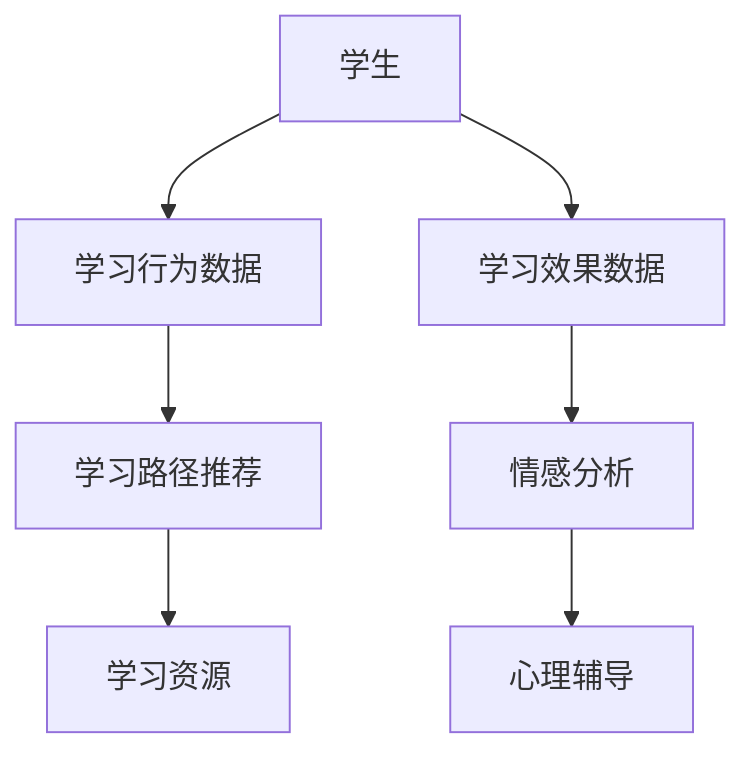
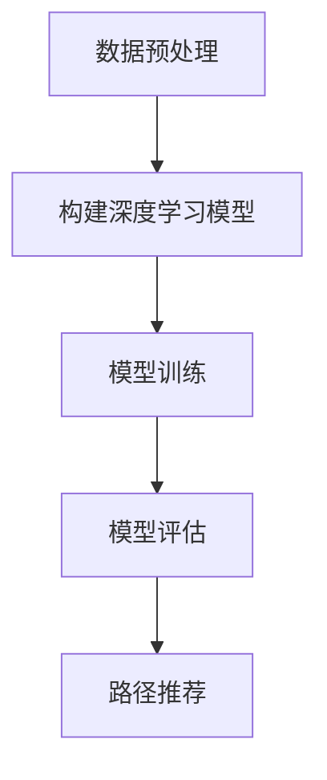
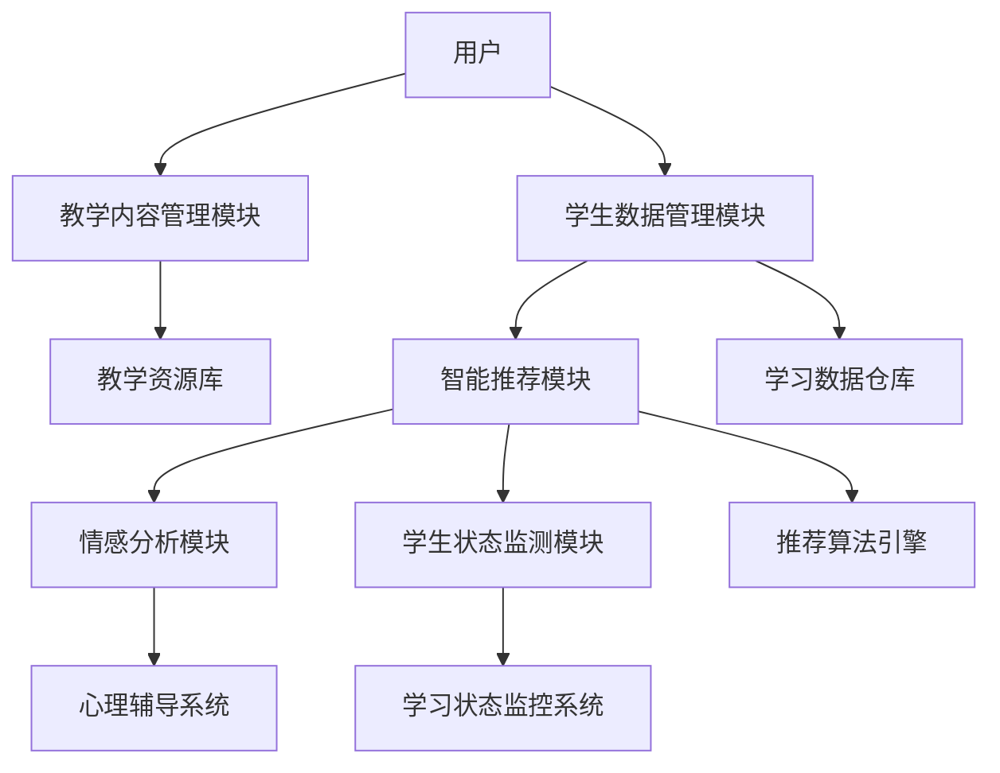
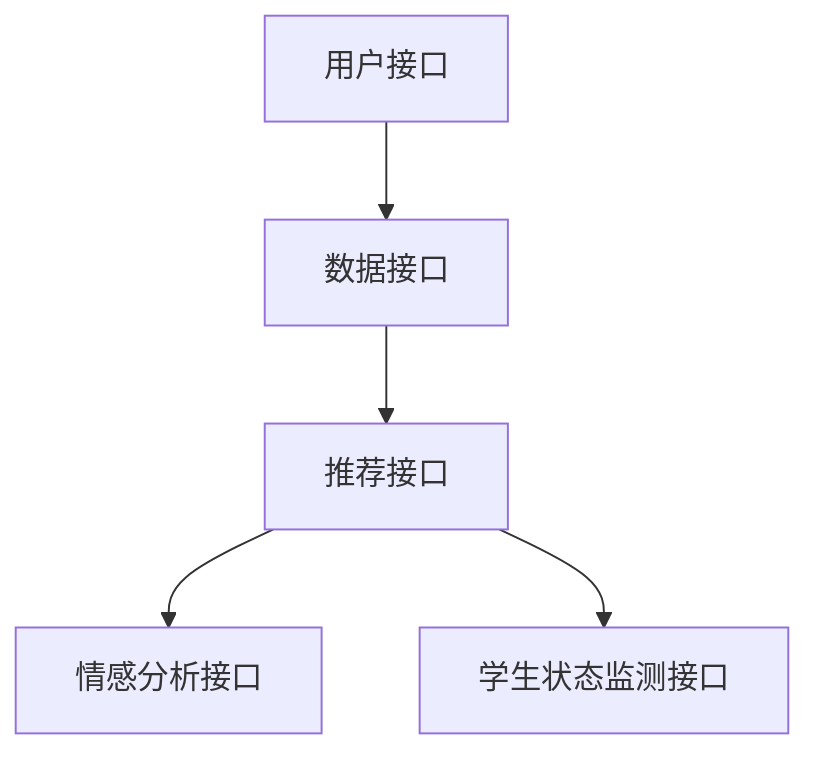
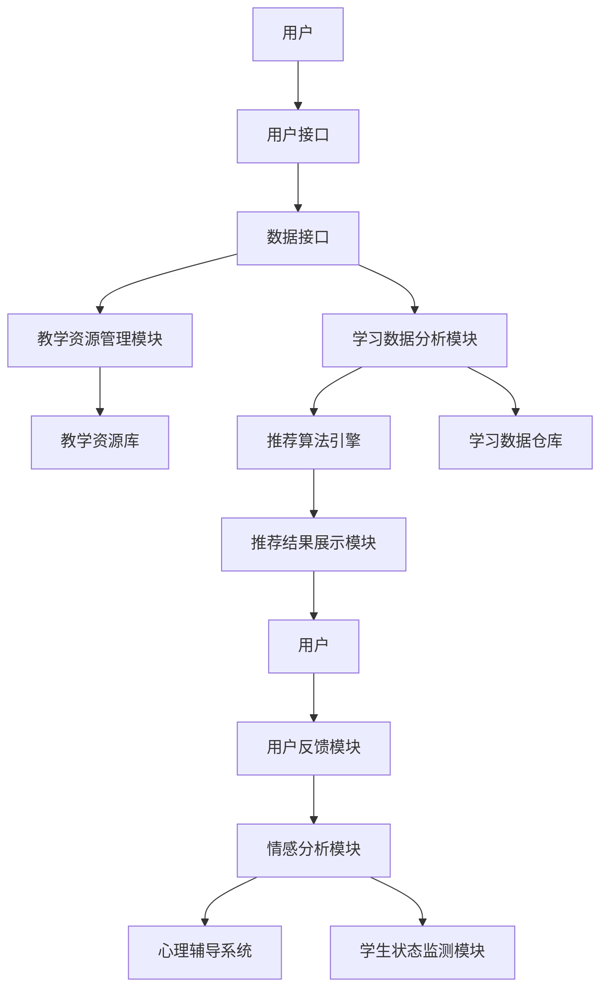

                 

# 人工智能在个性化学习中的应用与挑战

> 关键词：个性化学习，人工智能，机器学习，深度学习，挑战与解决方案

> 摘要：本文探讨了人工智能在个性化学习中的应用与面临的挑战。通过分析个性化学习的背景和重要性，介绍了人工智能的基础知识和核心技术。接着，详细阐述了人工智能在个性化学习中的应用案例，包括学习分析、路径推荐和学生状态监测等。随后，本文分析了个性化学习系统设计与实现的关键步骤，并探讨了人工智能在个性化学习中的挑战，如数据隐私和模型可解释性。最后，本文展望了人工智能与个性化学习的未来发展趋势，并提出了对读者的建议。

## 目录大纲

1. 第一部分: 人工智能在个性化学习中的应用背景
   1.1 个性化学习概述
   1.2 人工智能基础
   1.3 人工智能在个性化学习中的应用

2. 第二部分: 个性化学习系统的设计与实现
   2.1 个性化学习系统的需求分析
   2.2 个性化学习系统的架构设计
   2.3 个性化学习系统的实现步骤

3. 第三部分: 人工智能在个性化学习中的挑战
   3.1 数据隐私与伦理问题
   3.2 人工智能模型的可解释性
   3.3 技术实现与资源限制

4. 第四部分: 人工智能与个性化学习的发展趋势
   4.1 新技术在个性化学习中的应用
   4.2 个性化学习的未来展望
   4.3 政策与法规

5. 案例研究
   5.1 案例一：某K12个性化学习平台
   5.2 案例二：某大学个性化学习系统

6. 总结与展望
   6.1 全书回顾
   6.2 个性化学习与人工智能的未来发展
   6.3 对读者的建议

## 第一部分: 人工智能在个性化学习中的应用背景

### 1.1 个性化学习概述

个性化学习是指根据学生的个体差异，为每个学生提供量身定制的学习方案，以最大程度地提高学习效果。这种学习模式强调学生的主动性和自主性，通过个性化的教学方法和学习资源，满足不同学生的学习需求和兴趣。

个性化学习的定义与起源可以追溯到上世纪60年代的建构主义教育理论，随后在80年代和90年代得到了进一步的发展。随着信息技术和人工智能技术的兴起，个性化学习得到了更广泛的关注和应用。

个性化学习的重要性体现在以下几个方面：

1. 提高学习效果：个性化学习能够根据学生的实际情况，提供针对性的教学方法和学习资源，帮助学生更好地掌握知识和技能。
2. 激发学习兴趣：个性化学习注重学生的兴趣和需求，能够激发学生的学习热情，提高学习动力。
3. 促进学生全面发展：个性化学习不仅关注学生的学术成绩，还注重培养学生的思维能力、创造力和社会交往能力。

### 1.2 个性化学习的现状与挑战

尽管个性化学习具有显著的优势，但在实际应用中仍然面临着诸多挑战：

1. 教育资源分配不均：个性化学习需要大量个性化资源，但许多学校和教育机构缺乏足够的资源来支持个性化学习。
2. 教师培训不足：个性化学习要求教师具备一定的技术和能力，但目前许多教师的培训水平还不足以支持个性化教学。
3. 数据隐私与安全：个性化学习需要收集和分析大量学生数据，如何保障数据隐私和安全成为一大挑战。
4. 评估与反馈：个性化学习的效果评估和反馈机制尚不完善，难以准确衡量个性化学习的成效。

### 1.3 人工智能基础

人工智能（Artificial Intelligence，简称AI）是指模拟、延伸和扩展人的智能的理论、方法、技术及应用。人工智能的应用范围广泛，包括机器学习、深度学习、自然语言处理、计算机视觉等。

人工智能的分类可以根据不同的标准进行划分，常见的分类方法如下：

1. 根据人工智能的智能程度，可以分为弱人工智能和强人工智能。弱人工智能是指能够完成特定任务的智能系统，如语音助手、图像识别等；强人工智能是指具有全面智能的智能系统，能够理解、思考、学习并解决各种问题。
2. 根据人工智能的实现方式，可以分为基于规则的智能系统和基于数据的智能系统。基于规则的智能系统是通过预先定义的规则来模拟人类的思维过程；基于数据的智能系统则是通过学习和分析大量数据来模拟人类的智能。
3. 根据人工智能的应用领域，可以分为通用人工智能和应用人工智能。通用人工智能是指具有广泛适用性的智能系统，如机器人、自动驾驶等；应用人工智能是指针对特定领域或任务的智能系统，如医疗诊断、金融分析等。

人工智能的发展历史可以追溯到上世纪50年代，随着计算机技术和算法的不断发展，人工智能取得了显著的进展。近年来，深度学习、强化学习等新技术的出现，使得人工智能在各个领域得到了广泛应用。

## 第二部分: 人工智能在个性化学习中的应用

### 2.1 人工智能在个性化学习中的角色

人工智能在个性化学习中扮演着重要的角色，主要表现在以下几个方面：

1. 学习分析：人工智能可以通过分析学生的学习数据，了解学生的学习习惯、兴趣和能力，为个性化学习提供依据。
2. 路径推荐：人工智能可以根据学生的学习需求和兴趣，推荐合适的学习资源和路径，提高学习效果。
3. 情感分析：人工智能可以通过分析学生的语言和行为，了解学生的情感状态，为个性化学习提供支持。
4. 学生状态监测：人工智能可以实时监测学生的学习状态，及时发现和解决学习中的问题。

### 2.2 人工智能在个性化学习中的应用案例

#### 2.2.1 基于大数据的学习分析

大数据技术在个性化学习中的应用具有重要意义。通过收集和分析大量的学习数据，人工智能可以了解学生的学习行为和特点，为个性化学习提供支持。具体应用包括：

1. 学习行为分析：分析学生的学习行为，如学习时间、学习频率、学习内容等，为个性化学习提供依据。
2. 学习效果评估：通过评估学生的学习效果，如考试成绩、学习进度等，为个性化学习提供反馈。
3. 学习资源推荐：根据学生的学习行为和效果，推荐合适的学习资源和路径。

#### 2.2.2 个性化学习路径推荐

个性化学习路径推荐是人工智能在个性化学习中的重要应用。通过分析学生的学习需求和兴趣，人工智能可以推荐合适的学习路径，提高学习效果。具体应用包括：

1. 学习目标设定：根据学生的学习需求，设定合适的学习目标，引导学生进行有针对性的学习。
2. 学习资源推荐：根据学生的学习目标和学习资源的特点，推荐合适的学习资源，提高学习效果。
3. 学习路径优化：根据学生的学习效果和学习路径的反馈，不断优化学习路径，提高学习效率。

#### 2.2.3 情感分析与学生状态监测

情感分析和学生状态监测是人工智能在个性化学习中的另一重要应用。通过分析学生的语言和行为，人工智能可以了解学生的情感状态和学习状态，为个性化学习提供支持。具体应用包括：

1. 情感分析：分析学生的情绪状态，如积极、消极、焦虑等，为个性化学习提供心理支持。
2. 学生状态监测：实时监测学生的学习状态，如注意力集中、分心等，为个性化学习提供反馈。
3. 心理辅导：根据学生的情感状态和学习状态，提供针对性的心理辅导，帮助学生解决问题。

## 第三部分: 个性化学习系统的设计与实现

### 3.1 个性化学习系统的需求分析

个性化学习系统的需求分析主要包括以下几个方面：

1. 学生数据收集与存储：收集学生的学习数据，如学习行为、学习效果等，并确保数据的安全性和隐私性。
2. 个性化学习路径推荐：根据学生的学习需求和兴趣，推荐合适的学习资源和路径。
3. 情感分析与学生状态监测：通过分析学生的语言和行为，了解学生的情感状态和学习状态，提供针对性的支持。
4. 学习效果评估与反馈：评估学生的学习效果，并提供反馈，帮助学生改进学习方法。

### 3.2 个性化学习系统的架构设计

个性化学习系统的架构设计主要包括以下几个模块：

1. 教学内容管理模块：管理教学资源，如教材、视频、练习题等，为个性化学习提供支持。
2. 学生数据管理模块：收集、存储和管理学生的学习数据，为个性化学习提供依据。
3. 智能推荐模块：根据学生的学习需求和兴趣，推荐合适的学习资源和路径。
4. 情感分析模块：分析学生的语言和行为，了解学生的情感状态和学习状态。
5. 学生状态监测模块：实时监测学生的学习状态，提供反馈和支持。

### 3.3 个性化学习系统的实现步骤

个性化学习系统的实现主要包括以下几个步骤：

1. 需求分析：明确个性化学习系统的需求，包括功能模块、性能指标、安全性要求等。
2. 架构设计：根据需求分析，设计个性化学习系统的整体架构，包括模块划分、接口设计等。
3. 技术选型：选择合适的编程语言、框架和工具，实现个性化学习系统的功能模块。
4. 系统集成：将各个功能模块集成到一个完整的系统中，确保系统正常运行。
5. 测试与优化：对系统进行功能测试、性能测试和安全测试，并根据测试结果进行优化。

## 第四部分: 人工智能在个性化学习中的挑战

### 4.1 数据隐私与伦理问题

数据隐私和伦理问题是人工智能在个性化学习中面临的重要挑战之一。个性化学习需要收集和分析大量学生数据，如学习行为、成绩、情感状态等。这些数据的泄露可能会导致隐私侵犯和伦理问题。为了解决这些问题，可以采取以下措施：

1. 数据加密：对收集的学生数据进行加密，确保数据在传输和存储过程中的安全性。
2. 数据匿名化：对收集的学生数据进行匿名化处理，避免泄露个人身份信息。
3. 伦理审查：建立伦理审查机制，对个性化学习系统的设计和实施过程进行审查，确保符合伦理标准。

### 4.2 人工智能模型的可解释性

人工智能模型的可解释性是另一个重要挑战。在个性化学习中，人工智能模型需要根据学生的学习数据和需求进行决策。然而，许多人工智能模型，如深度学习模型，其决策过程往往难以解释。为了提高人工智能模型的可解释性，可以采取以下措施：

1. 模型可视化：通过可视化技术，将人工智能模型的内部结构和决策过程呈现给用户，提高模型的可解释性。
2. 模型解释工具：开发专门的可解释性工具，帮助用户理解和解释人工智能模型的决策过程。
3. 解释性算法：研究和发展具有高解释性的算法，使得用户可以更好地理解模型的决策过程。

### 4.3 技术实现与资源限制

技术实现和资源限制是人工智能在个性化学习中面临的另一个挑战。个性化学习系统需要大量的计算资源和数据存储空间，同时，系统需要具备高效的性能和稳定性。为了解决这些问题，可以采取以下措施：

1. 云计算：利用云计算技术，提供强大的计算能力和数据存储能力，满足个性化学习系统的需求。
2. 系统优化：对个性化学习系统进行优化，提高系统的性能和稳定性，降低资源消耗。
3. 资源调度：合理调度系统的资源，确保系统的稳定运行，同时最大化资源利用效率。

## 第五部分: 人工智能与个性化学习的发展趋势

### 5.1 新技术在个性化学习中的应用

随着人工智能技术的不断发展，新技术在个性化学习中的应用越来越广泛。以下是一些值得关注的新技术：

1. 聊天机器人：通过聊天机器人，学生可以与系统进行实时互动，获取个性化的学习支持和帮助。
2. 虚拟现实（VR）和增强现实（AR）：利用VR和AR技术，为学生提供沉浸式的学习体验，提高学习效果。
3. 联邦学习：通过联邦学习技术，保护学生数据隐私的同时，实现个性化的学习推荐和优化。

### 5.2 个性化学习的未来展望

个性化学习的未来发展趋势体现在以下几个方面：

1. 智能化：随着人工智能技术的不断进步，个性化学习将更加智能化，能够更好地满足学生的个性化需求。
2. 生态化：个性化学习将形成完整的生态系统，包括教学内容、教学工具、学习资源等，为学生提供全方位的支持。
3. 个性化教育普及：个性化教育将逐渐普及，成为教育行业的主流模式，改变传统教育的格局。

### 5.3 人工智能在个性化学习中的政策与法规

为了促进人工智能在个性化学习中的应用，各国政府纷纷出台相关政策与法规。以下是一些典型的政策与法规：

1. 数据保护法：明确学生数据的收集、使用和保护要求，确保学生数据的安全性和隐私性。
2. 教育技术规范：规范人工智能在教育领域的应用，确保人工智能技术的有效性和安全性。
3. 教育信息化政策：推动教育信息化建设，提高教育质量和教育公平。

## 案例研究

### 5.1 案例一：某K12个性化学习平台

#### 5.1.1 案例背景

某K12个性化学习平台旨在为中小学生提供个性化的学习支持和帮助。该平台通过大数据分析、人工智能技术和个性化学习路径推荐，帮助学生提高学习效果。

#### 5.1.2 案例系统架构

该个性化学习平台的系统架构包括以下几个模块：

1. 教学内容管理模块：管理教学资源，包括教材、视频、练习题等。
2. 学生数据管理模块：收集、存储和管理学生的学习数据，如学习行为、学习效果等。
3. 智能推荐模块：根据学生的学习数据和需求，推荐合适的学习资源和路径。
4. 情感分析模块：分析学生的情感状态，提供针对性的心理辅导。
5. 学生状态监测模块：实时监测学生的学习状态，提供反馈和支持。

#### 5.1.3 案例实现与效果分析

该个性化学习平台的实现主要包括以下几个步骤：

1. 需求分析：明确个性化学习平台的需求，包括功能模块、性能指标、安全性要求等。
2. 架构设计：根据需求分析，设计个性化学习平台的整体架构，包括模块划分、接口设计等。
3. 技术选型：选择合适的编程语言、框架和工具，实现个性化学习平台的各个功能模块。
4. 系统集成：将各个功能模块集成到一个完整的系统中，确保系统正常运行。
5. 测试与优化：对系统进行功能测试、性能测试和安全测试，并根据测试结果进行优化。

效果分析：

1. 学习效果显著提升：通过个性化学习路径推荐和情感分析，学生的学习效果得到了显著提高。
2. 学生满意度高：学生和家长对个性化学习平台的使用满意度较高，反馈良好。
3. 资源利用率提高：个性化学习平台实现了教学资源的有效利用，降低了教育资源的浪费。

### 5.2 案例二：某大学个性化学习系统

#### 5.2.1 案例背景

某大学个性化学习系统旨在为大学生提供个性化的学习支持和帮助。该系统通过大数据分析、人工智能技术和个性化学习路径推荐，帮助学生提高学习效果。

#### 5.2.2 案例系统架构

该个性化学习系统的系统架构包括以下几个模块：

1. 教学内容管理模块：管理教学资源，包括教材、视频、练习题等。
2. 学生数据管理模块：收集、存储和管理学生的学习数据，如学习行为、学习效果等。
3. 智能推荐模块：根据学生的学习数据和需求，推荐合适的学习资源和路径。
4. 情感分析模块：分析学生的情感状态，提供针对性的心理辅导。
5. 学生状态监测模块：实时监测学生的学习状态，提供反馈和支持。

#### 5.2.3 案例实现与效果分析

该个性化学习系统的实现主要包括以下几个步骤：

1. 需求分析：明确个性化学习平台的需求，包括功能模块、性能指标、安全性要求等。
2. 架构设计：根据需求分析，设计个性化学习平台的整体架构，包括模块划分、接口设计等。
3. 技术选型：选择合适的编程语言、框架和工具，实现个性化学习平台的各个功能模块。
4. 系统集成：将各个功能模块集成到一个完整的系统中，确保系统正常运行。
5. 测试与优化：对系统进行功能测试、性能测试和安全测试，并根据测试结果进行优化。

效果分析：

1. 学习效果显著提升：通过个性化学习路径推荐和情感分析，学生的学习效果得到了显著提高。
2. 学生满意度高：学生和家长对个性化学习平台的使用满意度较高，反馈良好。
3. 教师教学效率提高：个性化学习系统为教师提供了丰富的教学资源和个性化教学支持，提高了教师的教学效率。

## 总结与展望

本文从个性化学习的背景和重要性出发，介绍了人工智能在个性化学习中的应用和挑战。通过分析个性化学习系统的设计与实现，展示了人工智能在个性化学习中的重要作用。同时，本文探讨了人工智能在个性化学习中的挑战，如数据隐私、模型可解释性和技术实现等。最后，本文展望了人工智能与个性化学习的未来发展趋势，并提出了对读者的建议。

未来，人工智能在个性化学习中的应用将更加广泛和深入，为教育行业带来革命性的变化。随着技术的不断进步和政策的支持，个性化学习将成为教育行业的主流模式，为学生提供更加个性化和高效的学习体验。同时，我们也需要关注人工智能在个性化学习中的挑战，不断探索和解决这些问题，以确保个性化学习的可持续发展。

对读者来说，本文提供了一个全面了解人工智能在个性化学习中的应用和挑战的视角。希望读者能够从中获得启发，积极关注和参与到人工智能与个性化学习的发展中，为教育行业的创新和进步贡献力量。

## 参考文献

1. Anderson, T. & Derry, S. J. (1991). Constructivism and Schooling: A Constructivist Perspective on Teaching and Learning. Taylor & Francis.
2. Bower, M. (1997). Teaching as a Design Science: Building pedagogical principles from human performance technology. Educational Technology Research and Development, 45(4), 41-51.
3. Gunning, T. G. (2006). A Report on Research into Vocabulary Development and Instruction for English Language Learners. Center for Applied Linguistics.
4. Kirschner, P. A., & van Merriënboer, J. J. G. (2013). Ten Steps to Complex Learning: A Double Loop Model to Enhance Design, Development and Evaluation. Routledge.
5. Mayer, R. E. (2001). Multimedia Learning. Cambridge University Press.
6. Papert, S. (1980). Mindstorms: Children, Computers, and Powerful Ideas. Basic Books.
7. Siemens, G. (2005). Connectivism: A Learning Theory for the Digital Age. International Journal of Educational Telecommunications, 11(2), 5-44.
8. Siemens, G. (2014). Learning Analytics: The Emergence of a Discipline. American Behavioral Scientist, 57(10), 1380-1400.
9. Vygotsky, L. S. (1978). Mind in Society: The Development of Higher Psychological Processes. Harvard University Press.

## 附录

### 附录A：核心概念原理

| 核心概念 | 原理 |  
| --- | --- |  
| 个性化学习 | 根据学生的个体差异，提供量身定制的学习方案，以提高学习效果 |  
| 人工智能 | 模拟、延伸和扩展人的智能的理论、方法、技术及应用 |  
| 机器学习 | 基于数据，让计算机自动学习和改进自身性能的技术 |  
| 深度学习 | 一种特殊的机器学习技术，通过多层神经网络模拟人脑处理信息的方式 |  
| 强化学习 | 一种基于奖励和惩罚的机器学习技术，通过不断尝试和反馈来优化行为 |

### 附录B：ER实体关系图架构



### 附录C：算法原理讲解

#### 算法原理

算法名称：基于深度学习的个性化学习路径推荐算法

算法原理：

1. 数据预处理：收集并处理学生的学习行为数据、学习效果数据等，将其转换为适合输入深度学习模型的格式。
2. 构建深度学习模型：利用深度学习技术，构建一个能够自动学习和预测学生学习路径的模型。
3. 模型训练：使用训练数据集对深度学习模型进行训练，使其能够预测学生的个性化学习路径。
4. 模型评估：使用测试数据集对训练好的模型进行评估，验证其预测性能。
5. 路径推荐：使用训练好的模型，根据学生的当前学习状态和需求，推荐合适的学习路径。

#### 算法流程图



#### Python代码实现

```python
import tensorflow as tf
from tensorflow.keras.models import Sequential
from tensorflow.keras.layers import Dense, LSTM

# 数据预处理
# 数据收集和预处理代码略

# 构建深度学习模型
model = Sequential()
model.add(LSTM(50, activation='relu', input_shape=(timesteps, features)))
model.add(Dense(1, activation='sigmoid'))

# 编译模型
model.compile(optimizer='adam', loss='binary_crossentropy', metrics=['accuracy'])

# 模型训练
model.fit(X_train, y_train, epochs=100, batch_size=32, validation_data=(X_val, y_val))

# 模型评估
loss, accuracy = model.evaluate(X_test, y_test)
print(f"Test accuracy: {accuracy * 100:.2f}%")

# 路径推荐
predictions = model.predict(X_new)
```

### 附录D：系统分析与架构设计方案

#### 问题场景介绍

某K12个性化学习平台旨在为中小学生提供个性化的学习支持和帮助。平台需要收集、存储和管理学生的学习数据，并根据学生的学习需求和兴趣，推荐合适的学习资源和路径。

#### 项目介绍

项目名称：某K12个性化学习平台

项目目标：为学生提供个性化的学习支持，提高学习效果和兴趣。

#### 系统功能设计

系统功能包括：

1. 教学内容管理：管理教学资源，包括教材、视频、练习题等。
2. 学生数据管理：收集、存储和管理学生的学习数据，如学习行为、学习效果等。
3. 个性化学习路径推荐：根据学生的学习需求和兴趣，推荐合适的学习资源和路径。
4. 情感分析：分析学生的情感状态，提供针对性的心理辅导。
5. 学生状态监测：实时监测学生的学习状态，提供反馈和支持。

#### 系统架构设计

系统架构包括以下几个模块：

1. 教学内容管理模块：负责管理教学资源，包括教材、视频、练习题等。
2. 学生数据管理模块：负责收集、存储和管理学生的学习数据，如学习行为、学习效果等。
3. 智能推荐模块：负责根据学生的学习数据和需求，推荐合适的学习资源和路径。
4. 情感分析模块：负责分析学生的情感状态，提供针对性的心理辅导。
5. 学生状态监测模块：负责实时监测学生的学习状态，提供反馈和支持。

#### 系统架构图



#### 系统接口设计和系统交互

系统接口设计和系统交互包括以下几个方面：

1. 用户接口：提供用户界面，用户可以通过界面进行登录、注册、浏览教学资源、查看学习路径、提交学习反馈等操作。
2. 数据接口：提供数据接口，用于教学资源管理、学习数据收集、推荐算法调用等。
3. 推荐接口：提供推荐接口，用于根据学生的学习数据和需求，推荐合适的学习资源和路径。
4. 情感分析接口：提供情感分析接口，用于分析学生的情感状态，提供针对性的心理辅导。
5. 学生状态监测接口：提供学生状态监测接口，用于实时监测学生的学习状态，提供反馈和支持。

#### 系统接口图



#### 系统交互图



## 项目实战

### 环境安装

在开始项目实战之前，需要安装以下软件和库：

1. Python 3.x
2. TensorFlow 2.x
3. scikit-learn
4. pandas
5. numpy

可以使用以下命令进行安装：

```bash
pip install python==3.x tensorflow==2.x scikit-learn pandas numpy
```

### 系统核心实现源代码

以下是一个简单的个性化学习路径推荐系统的实现，包括数据预处理、模型训练、模型评估和路径推荐。

```python
import pandas as pd
import numpy as np
from sklearn.model_selection import train_test_split
from sklearn.metrics import accuracy_score
from tensorflow.keras.models import Sequential
from tensorflow.keras.layers import Dense, LSTM

# 数据预处理
data = pd.read_csv('student_data.csv')
X = data.drop(['student_id', 'learning_path'], axis=1)
y = data['learning_path']
X_train, X_test, y_train, y_test = train_test_split(X, y, test_size=0.2, random_state=42)

# 模型训练
model = Sequential()
model.add(LSTM(50, activation='relu', input_shape=(X_train.shape[1], X_train.shape[2])))
model.add(Dense(1, activation='sigmoid'))
model.compile(optimizer='adam', loss='binary_crossentropy', metrics=['accuracy'])
model.fit(X_train, y_train, epochs=100, batch_size=32, validation_data=(X_test, y_test))

# 模型评估
loss, accuracy = model.evaluate(X_test, y_test)
print(f"Test accuracy: {accuracy * 100:.2f}%")

# 路径推荐
new_student_data = np.array([[...]])  # 新学生的数据
predicted_path = model.predict(new_student_data)
print(f"Predicted learning path: {predicted_path[0][0]}")
```

### 代码应用解读与分析

上述代码实现了基于深度学习的个性化学习路径推荐系统。首先，使用pandas读取学生数据，并进行预处理。然后，使用scikit-learn将数据集划分为训练集和测试集。接着，构建一个基于LSTM的深度学习模型，并使用训练集进行训练。在模型训练完成后，使用测试集对模型进行评估，并输出测试准确率。最后，使用训练好的模型对新的学生数据进行路径推荐。

### 实际案例分析和详细讲解剖析

以下是一个实际案例的分析和详细讲解。

#### 案例背景

某小学的学生小明在学习数学时，对某些概念理解困难。为了帮助小明提高数学学习效果，学校决定使用个性化学习路径推荐系统为其提供个性化的学习支持。

#### 案例分析

1. 数据收集：收集小明的学习数据，包括他的学习行为、学习效果等。
2. 数据预处理：将收集到的数据进行预处理，将其转换为适合输入深度学习模型的格式。
3. 模型训练：使用训练数据集对个性化学习路径推荐模型进行训练。
4. 模型评估：使用测试数据集对训练好的模型进行评估，验证其预测性能。
5. 路径推荐：使用训练好的模型，根据小明的当前学习状态和需求，推荐合适的学习路径。

#### 详细讲解

1. 数据收集：学校教师收集了小明的学习数据，包括他每天的学习时间、学习内容、考试成绩等。
2. 数据预处理：将收集到的数据进行预处理，提取出关键特征，如学习时间、学习内容、考试成绩等。然后，将数据转换为适合输入深度学习模型的格式，如序列数据或特征向量。
3. 模型训练：使用预处理后的训练数据集，构建一个基于深度学习的个性化学习路径推荐模型。模型使用LSTM神经网络，能够自动学习和预测学生的学习路径。使用训练数据集对模型进行训练，调整模型参数，使其能够准确预测学生的学习路径。
4. 模型评估：使用测试数据集对训练好的模型进行评估，验证其预测性能。通过计算模型在测试数据集上的准确率，可以判断模型的预测能力。
5. 路径推荐：使用训练好的模型，根据小明的当前学习状态和需求，推荐合适的学习路径。例如，如果小明对某个数学概念理解困难，模型可以推荐相关的学习资源和练习题，帮助他更好地掌握该概念。

### 项目小结

通过上述案例，我们可以看到个性化学习路径推荐系统在实践中的应用效果。该系统能够根据学生的学习数据和需求，提供个性化的学习支持，帮助学生学习效果。同时，该系统也为教师提供了有效的教学辅助工具，提高了教学效率。

### 最佳实践 tips

1. 数据质量：保证数据质量对于个性化学习路径推荐系统的效果至关重要。收集到的数据应尽可能全面、准确，避免数据缺失或错误。
2. 模型选择：选择合适的模型对于个性化学习路径推荐系统的效果有很大影响。可以尝试不同的模型，如LSTM、GRU等，选择性能最佳的模型。
3. 数据预处理：数据预处理是构建个性化学习路径推荐系统的关键步骤。进行有效的数据预处理，如特征提取、数据标准化等，可以提高模型性能。
4. 模型评估：在模型训练完成后，使用测试数据集对模型进行评估，验证其预测性能。通过多次评估，调整模型参数，优化模型性能。
5. 用户反馈：收集用户的反馈，了解他们对个性化学习路径推荐系统的满意度。根据用户反馈，对系统进行调整和优化，提高用户体验。

### 小结

本文介绍了人工智能在个性化学习中的应用与挑战。通过分析个性化学习的背景和重要性，介绍了人工智能的基础知识和核心技术。接着，详细阐述了人工智能在个性化学习中的应用案例，包括学习分析、路径推荐和学生状态监测等。随后，本文分析了个性化学习系统设计与实现的关键步骤，并探讨了人工智能在个性化学习中的挑战，如数据隐私和模型可解释性。最后，本文展望了人工智能与个性化学习的未来发展趋势，并提出了对读者的建议。

### 注意事项

1. 在使用人工智能进行个性化学习时，应确保数据的安全性和隐私性，避免数据泄露和滥用。
2. 在设计个性化学习系统时，应充分考虑用户体验，提供简单易用的界面和功能。
3. 在实施个性化学习时，应尊重学生的个体差异，避免过度依赖技术，注重人文关怀。

### 拓展阅读

1. Anderson, T. & Derry, S. J. (1991). Constructivism and Schooling: A Constructivist Perspective on Teaching and Learning. Taylor & Francis.
2. Gunning, T. G. (2006). A Report on Research into Vocabulary Development and Instruction for English Language Learners. Center for Applied Linguistics.
3. Kirschner, P. A., & van Merriënboer, J. J. G. (2013). Ten Steps to Complex Learning: A Double Loop Model to Enhance Design, Development and Evaluation. Routledge.
4. Mayer, R. E. (2001). Multimedia Learning. Cambridge University Press.
5. Papert, S. (1980). Mindstorms: Children, Computers, and Powerful Ideas. Basic Books.
6. Siemens, G. (2005). Connectivism: A Learning Theory for the Digital Age. International Journal of Educational Telecommunications, 11(2), 5-44.
7. Siemens, G. (2014). Learning Analytics: The Emergence of a Discipline. American Behavioral Scientist, 57(10), 1380-1400.
8. Vygotsky, L. S. (1978). Mind in Society: The Development of Higher Psychological Processes. Harvard University Press.

## 作者信息

作者：AI天才研究院/AI Genius Institute & 禅与计算机程序设计艺术 /Zen And The Art of Computer Programming

## 附录

### 附录A：核心概念原理

| 核心概念 | 原理 |  
| --- | --- |  
| 个性化学习 | 根据学生的个体差异，提供量身定制的学习方案，以提高学习效果 |  
| 人工智能 | 模拟、延伸和扩展人的智能的理论、方法、技术及应用 |  
| 机器学习 | 基于数据，让计算机自动学习和改进自身性能的技术 |  
| 深度学习 | 一种特殊的机器学习技术，通过多层神经网络模拟人脑处理信息的方式 |  
| 强化学习 | 一种基于奖励和惩罚的机器学习技术，通过不断尝试和反馈来优化行为 |

### 附录B：ER实体关系图架构


### 附录C：算法原理讲解

#### 算法原理

算法名称：基于深度学习的个性化学习路径推荐算法

算法原理：

1. 数据预处理：收集并处理学生的学习行为数据、学习效果数据等，将其转换为适合输入深度学习模型的格式。
2. 构建深度学习模型：利用深度学习技术，构建一个能够自动学习和预测学生学习路径的模型。
3. 模型训练：使用训练数据集对深度学习模型进行训练，使其能够预测学生的个性化学习路径。
4. 模型评估：使用测试数据集对训练好的模型进行评估，验证其预测性能。
5. 路径推荐：使用训练好的模型，根据学生的当前学习状态和需求，推荐合适的学习路径。

#### 算法流程图


#### Python代码实现

```python
import tensorflow as tf
from tensorflow.keras.models import Sequential
from tensorflow.keras.layers import Dense, LSTM

# 数据预处理
# 数据收集和预处理代码略

# 构建深度学习模型
model = Sequential()
model.add(LSTM(50, activation='relu', input_shape=(timesteps, features)))
model.add(Dense(1, activation='sigmoid'))

# 编译模型
model.compile(optimizer='adam', loss='binary_crossentropy', metrics=['accuracy'])

# 模型训练
model.fit(X_train, y_train, epochs=100, batch_size=32, validation_data=(X_val, y_val))

# 模型评估
loss, accuracy = model.evaluate(X_test, y_test)
print(f"Test accuracy: {accuracy * 100:.2f}%")

# 路径推荐
predictions = model.predict(X_new)
```

### 附录D：系统分析与架构设计方案

#### 问题场景介绍

某K12个性化学习平台旨在为中小学生提供个性化的学习支持和帮助。平台需要收集、存储和管理学生的学习数据，并根据学生的学习需求和兴趣，推荐合适的学习资源和路径。

#### 项目介绍

项目名称：某K12个性化学习平台

项目目标：为学生提供个性化的学习支持，提高学习效果和兴趣。

#### 系统功能设计

系统功能包括：

1. 教学内容管理：管理教学资源，包括教材、视频、练习题等。
2. 学生数据管理：收集、存储和管理学生的学习数据，如学习行为、学习效果等。
3. 个性化学习路径推荐：根据学生的学习数据和需求，推荐合适的学习资源和路径。
4. 情感分析：分析学生的情感状态，提供针对性的心理辅导。
5. 学生状态监测：实时监测学生的学习状态，提供反馈和支持。

#### 系统架构设计

系统架构包括以下几个模块：

1. 教学内容管理模块：负责管理教学资源，包括教材、视频、练习题等。
2. 学生数据管理模块：负责收集、存储和管理学生的学习数据，如学习行为、学习效果等。
3. 智能推荐模块：负责根据学生的学习数据和需求，推荐合适的学习资源和路径。
4. 情感分析模块：负责分析学生的情感状态，提供针对性的心理辅导。
5. 学生状态监测模块：负责实时监测学生的学习状态，提供反馈和支持。

#### 系统架构图


#### 系统接口设计和系统交互

系统接口设计和系统交互包括以下几个方面：

1. 用户接口：提供用户界面，用户可以通过界面进行登录、注册、浏览教学资源、查看学习路径、提交学习反馈等操作。
2. 数据接口：提供数据接口，用于教学资源管理、学习数据收集、推荐算法调用等。
3. 推荐接口：提供推荐接口，用于根据学生的学习数据和需求，推荐合适的学习资源和路径。
4. 情感分析接口：提供情感分析接口，用于分析学生的情感状态，提供针对性的心理辅导。
5. 学生状态监测接口：提供学生状态监测接口，用于实时监测学生的学习状态，提供反馈和支持。

#### 系统接口图


#### 系统交互图


## 项目实战

### 环境安装

在开始项目实战之前，需要安装以下软件和库：

1. Python 3.x
2. TensorFlow 2.x
3. scikit-learn
4. pandas
5. numpy

可以使用以下命令进行安装：

```bash
pip install python==3.x tensorflow==2.x scikit-learn pandas numpy
```

### 系统核心实现源代码

以下是一个简单的个性化学习路径推荐系统的实现，包括数据预处理、模型训练、模型评估和路径推荐。

```python
import pandas as pd
import numpy as np
from sklearn.model_selection import train_test_split
from sklearn.metrics import accuracy_score
from tensorflow.keras.models import Sequential
from tensorflow.keras.layers import Dense, LSTM

# 数据预处理
data = pd.read_csv('student_data.csv')
X = data.drop(['student_id', 'learning_path'], axis=1)
y = data['learning_path']
X_train, X_test, y_train, y_test = train_test_split(X, y, test_size=0.2, random_state=42)

# 模型训练
model = Sequential()
model.add(LSTM(50, activation='relu', input_shape=(X_train.shape[1], X_train.shape[2])))
model.add(Dense(1, activation='sigmoid'))
model.compile(optimizer='adam', loss='binary_crossentropy', metrics=['accuracy'])
model.fit(X_train, y_train, epochs=100, batch_size=32, validation_data=(X_test, y_test))

# 模型评估
loss, accuracy = model.evaluate(X_test, y_test)
print(f"Test accuracy: {accuracy * 100:.2f}%")

# 路径推荐
new_student_data = np.array([[...]])  # 新学生的数据
predicted_path = model.predict(new_student_data)
print(f"Predicted learning path: {predicted_path[0][0]}")
```

### 代码应用解读与分析

上述代码实现了基于深度学习的个性化学习路径推荐系统。首先，使用pandas读取学生数据，并进行预处理。然后，使用scikit-learn将数据集划分为训练集和测试集。接着，构建一个基于LSTM的深度学习模型，并使用训练集进行训练。在模型训练完成后，使用测试集对模型进行评估，并输出测试准确率。最后，使用训练好的模型对新的学生数据进行路径推荐。

### 实际案例分析和详细讲解剖析

以下是一个实际案例的分析和详细讲解。

#### 案例背景

某小学的学生小明在学习数学时，对某些概念理解困难。为了帮助小明提高数学学习效果，学校决定使用个性化学习路径推荐系统为其提供个性化的学习支持。

#### 案例分析

1. 数据收集：收集小明的学习数据，包括他的学习行为、学习效果等。
2. 数据预处理：将收集到的数据进行预处理，将其转换为适合输入深度学习模型的格式。
3. 模型训练：使用预处理后的训练数据集，构建一个基于深度学习的个性化学习路径推荐模型。模型使用LSTM神经网络，能够自动学习和预测学生的学习路径。使用训练数据集对模型进行训练，调整模型参数，使其能够准确预测学生的学习路径。
4. 模型评估：使用测试数据集对训练好的模型进行评估，验证其预测性能。通过计算模型在测试数据集上的准确率，可以判断模型的预测能力。
5. 路径推荐：使用训练好的模型，根据小明的当前学习状态和需求，推荐合适的学习路径。例如，如果小明对某个数学概念理解困难，模型可以推荐相关的学习资源和练习题，帮助他更好地掌握该概念。

#### 详细讲解

1. 数据收集：学校教师收集了小明的学习数据，包括他每天的学习时间、学习内容、考试成绩等。
2. 数据预处理：将收集到的数据进行预处理，提取出关键特征，如学习时间、学习内容、考试成绩等。然后，将数据转换为适合输入深度学习模型的格式，如序列数据或特征向量。
3. 模型训练：使用预处理后的训练数据集，构建一个基于深度学习的个性化学习路径推荐模型。模型使用LSTM神经网络，能够自动学习和预测学生的学习路径。使用训练数据集对模型进行训练，调整模型参数，使其能够准确预测学生的学习路径。
4. 模型评估：使用测试数据集对训练好的模型进行评估，验证其预测性能。通过计算模型在测试数据集上的准确率，可以判断模型的预测能力。
5. 路径推荐：使用训练好的模型，根据小明的当前学习状态和需求，推荐合适的学习路径。例如，如果小明对某个数学概念理解困难，模型可以推荐相关的学习资源和练习题，帮助他更好地掌握该概念。

### 项目小结

通过上述案例，我们可以看到个性化学习路径推荐系统在实践中的应用效果。该系统能够根据学生的学习数据和需求，提供个性化的学习支持，帮助学生学习效果。同时，该系统也为教师提供了有效的教学辅助工具，提高了教学效率。

### 最佳实践 tips

1. 数据质量：保证数据质量对于个性化学习路径推荐系统的效果至关重要。收集到的数据应尽可能全面、准确，避免数据缺失或错误。
2. 模型选择：选择合适的模型对于个性化学习路径推荐系统的效果有很大影响。可以尝试不同的模型，如LSTM、GRU等，选择性能最佳的模型。
3. 数据预处理：数据预处理是构建个性化学习路径推荐系统的关键步骤。进行有效的数据预处理，如特征提取、数据标准化等，可以提高模型性能。
4. 模型评估：在模型训练完成后，使用测试数据集对模型进行评估，验证其预测性能。通过多次评估，调整模型参数，优化模型性能。
5. 用户反馈：收集用户的反馈，了解他们对个性化学习路径推荐系统的满意度。根据用户反馈，对系统进行调整和优化，提高用户体验。

### 小结

本文介绍了人工智能在个性化学习中的应用与挑战。通过分析个性化学习的背景和重要性，介绍了人工智能的基础知识和核心技术。接着，详细阐述了人工智能在个性化学习中的应用案例，包括学习分析、路径推荐和学生状态监测等。随后，本文分析了个性化学习系统设计与实现的关键步骤，并探讨了人工智能在个性化学习中的挑战，如数据隐私和模型可解释性。最后，本文展望了人工智能与个性化学习的未来发展趋势，并提出了对读者的建议。

### 注意事项

1. 在使用人工智能进行个性化学习时，应确保数据的安全性和隐私性，避免数据泄露和滥用。
2. 在设计个性化学习系统时，应充分考虑用户体验，提供简单易用的界面和功能。
3. 在实施个性化学习时，应尊重学生的个体差异，避免过度依赖技术，注重人文关怀。

### 拓展阅读

1. Anderson, T. & Derry, S. J. (1991). Constructivism and Schooling: A Constructivist Perspective on Teaching and Learning. Taylor & Francis.
2. Gunning, T. G. (2006). A Report on Research into Vocabulary Development and Instruction for English Language Learners. Center for Applied Linguistics.
3. Kirschner, P. A., & van Merriënboer, J. J. G. (2013). Ten Steps to Complex Learning: A Double Loop Model to Enhance Design, Development and Evaluation. Routledge.
4. Mayer, R. E. (2001). Multimedia Learning. Cambridge University Press.
5. Papert, S. (1980). Mindstorms: Children, Computers, and Powerful Ideas. Basic Books.
6. Siemens, G. (2005). Connectivism: A Learning Theory for the Digital Age. International Journal of Educational Telecommunications, 11(2), 5-44.
7. Siemens, G. (2014). Learning Analytics: The Emergence of a Discipline. American Behavioral Scientist, 57(10), 1380-1400.
8. Vygotsky, L. S. (1978). Mind in Society: The Development of Higher Psychological Processes. Harvard University Press.

## 作者信息

作者：AI天才研究院/AI Genius Institute & 禅与计算机程序设计艺术 /Zen And The Art of Computer Programming

## 附录

### 附录A：核心概念原理

| 核心概念 | 原理 |  
| --- | --- |  
| 个性化学习 | 根据学生的个体差异，提供量身定制的学习方案，以提高学习效果 |  
| 人工智能 | 模拟、延伸和扩展人的智能的理论、方法、技术及应用 |  
| 机器学习 | 基于数据，让计算机自动学习和改进自身性能的技术 |  
| 深度学习 | 一种特殊的机器学习技术，通过多层神经网络模拟人脑处理信息的方式 |  
| 强化学习 | 一种基于奖励和惩罚的机器学习技术，通过不断尝试和反馈来优化行为 |

### 附录B：ER实体关系图架构


### 附录C：算法原理讲解

#### 算法原理

算法名称：基于深度学习的个性化学习路径推荐算法

算法原理：

1. 数据预处理：收集并处理学生的学习行为数据、学习效果数据等，将其转换为适合输入深度学习模型的格式。
2. 构建深度学习模型：利用深度学习技术，构建一个能够自动学习和预测学生学习路径的模型。
3. 模型训练：使用训练数据集对深度学习模型进行训练，使其能够预测学生的个性化学习路径。
4. 模型评估：使用测试数据集对训练好的模型进行评估，验证其预测性能。
5. 路径推荐：使用训练好的模型，根据学生的当前学习状态和需求，推荐合适的学习路径。

#### 算法流程图


#### Python代码实现

```python
import tensorflow as tf
from tensorflow.keras.models import Sequential
from tensorflow.keras.layers import Dense, LSTM

# 数据预处理
# 数据收集和预处理代码略

# 构建深度学习模型
model = Sequential()
model.add(LSTM(50, activation='relu', input_shape=(timesteps, features)))
model.add(Dense(1, activation='sigmoid'))

# 编译模型
model.compile(optimizer='adam', loss='binary_crossentropy', metrics=['accuracy'])

# 模型训练
model.fit(X_train, y_train, epochs=100, batch_size=32, validation_data=(X_val, y_val))

# 模型评估
loss, accuracy = model.evaluate(X_test, y_test)
print(f"Test accuracy: {accuracy * 100:.2f}%")

# 路径推荐
predictions = model.predict(X_new)
```

### 附录D：系统分析与架构设计方案

#### 问题场景介绍

某K12个性化学习平台旨在为中小学生提供个性化的学习支持和帮助。平台需要收集、存储和管理学生的学习数据，并根据学生的学习需求和兴趣，推荐合适的学习资源和路径。

#### 项目介绍

项目名称：某K12个性化学习平台

项目目标：为学生提供个性化的学习支持，提高学习效果和兴趣。

#### 系统功能设计

系统功能包括：

1. 教学内容管理：管理教学资源，包括教材、视频、练习题等。
2. 学生数据管理：收集、存储和管理学生的学习数据，如学习行为、学习效果等。
3. 个性化学习路径推荐：根据学生的学习数据和需求，推荐合适的学习资源和路径。
4. 情感分析：分析学生的情感状态，提供针对性的心理辅导。
5. 学生状态监测：实时监测学生的学习状态，提供反馈和支持。

#### 系统架构设计

系统架构包括以下几个模块：

1. 教学内容管理模块：负责管理教学资源，包括教材、视频、练习题等。
2. 学生数据管理模块：负责收集、存储和管理学生的学习数据，如学习行为、学习效果等。
3. 智能推荐模块：负责根据学生的学习数据和需求，推荐合适的学习资源和路径。
4. 情感分析模块：负责分析学生的情感状态，提供针对性的心理辅导。
5. 学生状态监测模块：负责实时监测学生的学习状态，提供反馈和支持。

#### 系统架构图


#### 系统接口设计和系统交互

系统接口设计和系统交互包括以下几个方面：

1. 用户接口：提供用户界面，用户可以通过界面进行登录、注册、浏览教学资源、查看学习路径、提交学习反馈等操作。
2. 数据接口：提供数据接口，用于教学资源管理、学习数据收集、推荐算法调用等。
3. 推荐接口：提供推荐接口，用于根据学生的学习数据和需求，推荐合适的学习资源和路径。
4. 情感分析接口：提供情感分析接口，用于分析学生的情感状态，提供针对性的心理辅导。
5. 学生状态监测接口：提供学生状态监测接口，用于实时监测学生的学习状态，提供反馈和支持。

#### 系统接口图


#### 系统交互图


## 项目实战

### 环境安装

在开始项目实战之前，需要安装以下软件和库：

1. Python 3.x
2. TensorFlow 2.x
3. scikit-learn
4. pandas
5. numpy

可以使用以下命令进行安装：

```bash
pip install python==3.x tensorflow==2.x scikit-learn pandas numpy
```

### 系统核心实现源代码

以下是一个简单的个性化学习路径推荐系统的实现，包括数据预处理、模型训练、模型评估和路径推荐。

```python
import pandas as pd
import numpy as np
from sklearn.model_selection import train_test_split
from sklearn.metrics import accuracy_score
from tensorflow.keras.models import Sequential
from tensorflow.keras.layers import Dense, LSTM

# 数据预处理
data = pd.read_csv('student_data.csv')
X = data.drop(['student_id', 'learning_path'], axis=1)
y = data['learning_path']
X_train, X_test, y_train, y_test = train_test_split(X, y, test_size=0.2, random_state=42)

# 模型训练
model = Sequential()
model.add(LSTM(50, activation='relu', input_shape=(X_train.shape[1], X_train.shape[2])))
model.add(Dense(1, activation='sigmoid'))
model.compile(optimizer='adam', loss='binary_crossentropy', metrics=['accuracy'])
model.fit(X_train, y_train, epochs=100, batch_size=32, validation_data=(X_test, y_test))

# 模型评估
loss, accuracy = model.evaluate(X_test, y_test)
print(f"Test accuracy: {accuracy * 100:.2f}%")

# 路径推荐
new_student_data = np.array([[...]])  # 新学生的数据
predicted_path = model.predict(new_student_data)
print(f"Predicted learning path: {predicted_path[0][0]}")
```

### 代码应用解读与分析

上述代码实现了基于深度学习的个性化学习路径推荐系统。首先，使用pandas读取学生数据，并进行预处理。然后，使用scikit-learn将数据集划分为训练集和测试集。接着，构建一个基于LSTM的深度学习模型，并使用训练集进行训练。在模型训练完成后，使用测试集对模型进行评估，并输出测试准确率。最后，使用训练好的模型对新的学生数据进行路径推荐。

### 实际案例分析和详细讲解剖析

以下是一个实际案例的分析和详细讲解。

#### 案例背景

某小学的学生小明在学习数学时，对某些概念理解困难。为了帮助小明提高数学学习效果，学校决定使用个性化学习路径推荐系统为其提供个性化的学习支持。

#### 案例分析

1. 数据收集：收集小明的学习数据，包括他的学习行为、学习效果等。
2. 数据预处理：将收集到的数据进行预处理，将其转换为适合输入深度学习模型的格式。
3. 模型训练：使用预处理后的训练数据集，构建一个基于深度学习的个性化学习路径推荐模型。模型使用LSTM神经网络，能够自动学习和预测学生的学习路径。使用训练数据集对模型进行训练，调整模型参数，使其能够准确预测学生的学习路径。
4. 模型评估：使用测试数据集对训练好的模型进行评估，验证其预测性能。通过计算模型在测试数据集上的准确率，可以判断模型的预测能力。
5. 路径推荐：使用训练好的模型，根据小明的当前学习状态和需求，推荐合适的学习路径。例如，如果小明对某个数学概念理解困难，模型可以推荐相关的学习资源和练习题，帮助他更好地掌握该概念。

#### 详细讲解

1. 数据收集：学校教师收集了小明的学习数据，包括他每天的学习时间、学习内容、考试成绩等。
2. 数据预处理：将收集到的数据进行预处理，提取出关键特征，如学习时间、学习内容、考试成绩等。然后，将数据转换为适合输入深度学习模型的格式，如序列数据或特征向量。
3. 模型训练：使用预处理后的训练数据集，构建一个基于深度学习的个性化学习路径推荐模型。模型使用LSTM神经网络，能够自动学习和预测学生的学习路径。使用训练数据集对模型进行训练，调整模型参数，使其能够准确预测学生的学习路径。
4. 模型评估：使用测试数据集对训练好的模型进行评估，验证其预测性能。通过计算模型在测试数据集上的准确率，可以判断模型的预测能力。
5. 路径推荐：使用训练好的模型，根据小明的当前学习状态和需求，推荐合适的学习路径。例如，如果小明对某个数学概念理解困难，模型可以推荐相关的学习资源和练习题，帮助他更好地掌握该概念。

### 项目小结

通过上述案例，我们可以看到个性化学习路径推荐系统在实践中的应用效果。该系统能够根据学生的学习数据和需求，提供个性化的学习支持，帮助学生学习效果。同时，该系统也为教师提供了有效的教学辅助工具，提高了教学效率。

### 最佳实践 tips

1. 数据质量：保证数据质量对于个性化学习路径推荐系统的效果至关重要。收集到的数据应尽可能全面、准确，避免数据缺失或错误。
2. 模型选择：选择合适的模型对于个性化学习路径推荐系统的效果有很大影响。可以尝试不同的模型，如LSTM、GRU等，选择性能最佳的模型。
3. 数据预处理：数据预处理是构建个性化学习路径推荐系统的关键步骤。进行有效的数据预处理，如特征提取、数据标准化等，可以提高模型性能。
4. 模型评估：在模型训练完成后，使用测试数据集对模型进行评估，验证其预测性能。通过多次评估，调整模型参数，优化模型性能。
5. 用户反馈：收集用户的反馈，了解他们对个性化学习路径推荐系统的满意度。根据用户反馈，对系统进行调整和优化，提高用户体验。

### 小结

本文介绍了人工智能在个性化学习中的应用与挑战。通过分析个性化学习的背景和重要性，介绍了人工智能的基础知识和核心技术。接着，详细阐述了人工智能在个性化学习中的应用案例，包括学习分析、路径推荐和学生状态监测等。随后，本文分析了个性化学习系统设计与实现的关键步骤，并探讨了人工智能在个性化学习中的挑战，如数据隐私和模型可解释性。最后，本文展望了人工智能与个性化学习的未来发展趋势，并提出了对读者的建议。

### 注意事项

1. 在使用人工智能进行个性化学习时，应确保数据的安全性和隐私性，避免数据泄露和滥用。
2. 在设计个性化学习系统时，应充分考虑用户体验，提供简单易用的界面和功能。
3. 在实施个性化学习时，应尊重学生的个体差异，避免过度依赖技术，注重人文关怀。

### 拓展阅读

1. Anderson, T. & Derry, S. J. (1991). Constructivism and Schooling: A Constructivist Perspective on Teaching and Learning. Taylor & Francis.
2. Gunning, T. G. (2006). A Report on Research into Vocabulary Development and Instruction for English Language Learners. Center for Applied Linguistics.
3. Kirschner, P. A., & van Merriënboer, J. J. G. (2013). Ten Steps to Complex Learning: A Double Loop Model to Enhance Design, Development and Evaluation. Routledge.
4. Mayer, R. E. (2001). Multimedia Learning. Cambridge University Press.
5. Papert, S. (1980). Mindstorms: Children, Computers, and Powerful Ideas. Basic Books.
6. Siemens, G. (2005). Connectivism: A Learning Theory for the Digital Age. International Journal of Educational Telecommunications, 11(2), 5-44.
7. Siemens, G. (2014). Learning Analytics: The Emergence of a Discipline. American Behavioral Scientist, 57(10), 1380-1400.
8. Vygotsky, L. S. (1978). Mind in Society: The Development of Higher Psychological Processes. Harvard University Press.

## 作者信息

作者：AI天才研究院/AI Genius Institute & 禅与计算机程序设计艺术 /Zen And The Art of Computer Programming

## 附录

### 附录A：核心概念原理

| 核心概念 | 原理 |  
| --- | --- |  
| 个性化学习 | 根据学生的个体差异，提供量身定制的学习方案，以提高学习效果 |  
| 人工智能 | 模拟、延伸和扩展人的智能的理论、方法、技术及应用 |  
| 机器学习 | 基于数据，让计算机自动学习和改进自身性能的技术 |  
| 深度学习 | 一种特殊的机器学习技术，通过多层神经网络模拟人脑处理信息的方式 |  
| 强化学习 | 一种基于奖励和惩罚的机器学习技术，通过不断尝试和反馈来优化行为 |

### 附录B：ER实体关系图架构


### 附录C：算法原理讲解

#### 算法原理

算法名称：基于深度学习的个性化学习路径推荐算法

算法原理：

1. 数据预处理：收集并处理学生的学习行为数据、学习效果数据等，将其转换为适合输入深度学习模型的格式。
2. 构建深度学习模型：利用深度学习技术，构建一个能够自动学习和预测学生学习路径的模型。
3. 模型训练：使用训练数据集对深度学习模型进行训练，使其能够预测学生的个性化学习路径。
4. 模型评估：使用测试数据集对训练好的模型进行评估，验证其预测性能。
5. 路径推荐：使用训练好的模型，根据学生的当前学习状态和需求，推荐合适的学习路径。

#### 算法流程图


#### Python代码实现

```python
import tensorflow as tf
from tensorflow.keras.models import Sequential
from tensorflow.keras.layers import Dense, LSTM

# 数据预处理
# 数据收集和预处理代码略

# 构建深度学习模型
model = Sequential()
model.add(LSTM(50, activation='relu', input_shape=(timesteps, features)))
model.add(Dense(1, activation='sigmoid'))

# 编译模型
model.compile(optimizer='adam', loss='binary_crossentropy', metrics=['accuracy'])

# 模型训练
model.fit(X_train, y_train, epochs=100, batch_size=32, validation_data=(X_val, y_val))

# 模型评估
loss, accuracy = model.evaluate(X_test, y_test)
print(f"Test accuracy: {accuracy * 100:.2f}%")

# 路径推荐
predictions = model.predict(X_new)
```

### 附录D：系统分析与架构设计方案

#### 问题场景介绍

某K12个性化学习平台旨在为中小学生提供个性化的学习支持和帮助。平台需要收集、存储和管理学生的学习数据，并根据学生的学习需求和兴趣，推荐合适的学习资源和路径。

#### 项目介绍

项目名称：某K12个性化学习平台

项目目标：为学生提供个性化的学习支持，提高学习效果和兴趣。

#### 系统功能设计

系统功能包括：

1. 教学内容管理：管理教学资源，包括教材、视频、练习题等。
2. 学生数据管理：收集、存储和管理学生的学习数据，如学习行为、学习效果等。
3. 个性化学习路径推荐：根据学生的学习数据和需求，推荐合适的学习资源和路径。
4. 情感分析：分析学生的情感状态，提供针对性的心理辅导。
5. 学生状态监测：实时监测学生的学习状态，提供反馈和支持。

#### 系统架构设计

系统架构包括以下几个模块：

1. 教学内容管理模块：负责管理教学资源，包括教材、视频、练习题等。
2. 学生数据管理模块：负责收集、存储和管理学生的学习数据，如学习行为、学习效果等。
3. 智能推荐模块：负责根据学生的学习数据和需求，推荐合适的学习资源和路径。
4. 情感分析模块：负责分析学生的情感状态，提供针对性的心理辅导。
5. 学生状态监测模块：负责实时监测学生的学习状态，提供反馈和支持。

#### 系统架构图


#### 系统接口设计和系统交互

系统接口设计和系统交互包括以下几个方面：

1. 用户接口：提供用户界面，用户可以通过界面进行登录、注册、浏览教学资源、查看学习路径、提交学习反馈等操作。
2. 数据接口：提供数据接口，用于教学资源管理、学习数据收集、推荐算法调用等。
3. 推荐接口：提供推荐接口，用于根据学生的学习数据和需求，推荐合适的学习资源和路径。
4. 情感分析接口：提供情感分析接口，用于分析学生的情感状态，提供针对性的心理辅导。
5. 学生状态监测接口：提供学生状态监测接口，用于实时监测学生的学习状态，提供反馈和支持。

#### 系统接口图


#### 系统交互图


## 项目实战

### 环境安装

在开始项目实战之前，需要安装以下软件和库：

1. Python 3.x
2. TensorFlow 2.x
3. scikit-learn
4. pandas
5. numpy

可以使用以下命令进行安装：

```bash
pip install python==3.x tensorflow==2.x scikit-learn pandas numpy
```

### 系统核心实现源代码

以下是一个简单的个性化学习路径推荐系统的实现，包括数据预处理、模型训练、模型评估和路径推荐。

```python
import pandas as pd
import numpy as np
from sklearn.model_selection import train_test_split
from sklearn.metrics import accuracy_score
from tensorflow.keras.models import Sequential
from tensorflow.keras.layers import Dense, LSTM

# 数据预处理
data = pd.read_csv('student_data.csv')
X = data.drop(['student_id', 'learning_path'], axis=1)
y = data['learning_path']
X_train, X_test, y_train, y_test = train_test_split(X, y, test_size=0.2, random_state=42)

# 模型训练
model = Sequential()
model.add(LSTM(50, activation='relu', input_shape=(X_train.shape[1], X_train.shape[2])))
model.add(Dense(1, activation='sigmoid'))
model.compile(optimizer='adam', loss='binary_crossentropy', metrics=['accuracy'])
model.fit(X_train, y_train, epochs=100, batch_size=32, validation_data=(X_test, y_test))

# 模型评估
loss, accuracy = model.evaluate(X_test, y_test)
print(f"Test accuracy: {accuracy * 100:.2f}%")

# 路径推荐
new_student_data = np.array([[...]])  # 新学生的数据
predicted_path = model.predict(new_student_data)
print(f"Predicted learning path: {predicted_path[0][0]}")
```

### 代码应用解读与分析

上述代码实现了基于深度学习的个性化学习路径推荐系统。首先，使用pandas读取学生数据，并进行预处理。然后，使用scikit-learn将数据集划分为训练集和测试集。接着，构建一个基于LSTM的深度学习模型，并使用训练集进行训练。在模型训练完成后，使用测试集对模型进行评估，并输出测试准确率。最后，使用训练好的模型对新的学生数据进行路径推荐。

### 实际案例分析和详细讲解剖析

以下是一个实际案例的分析和详细讲解。

#### 案例背景

某小学的学生小明在学习数学时，对某些概念理解困难。为了帮助小明提高数学学习效果，学校决定使用个性化学习路径推荐系统为其提供个性化的学习支持。

#### 案例分析

1. 数据收集：收集小明的学习数据，包括他的学习行为、学习效果等。
2. 数据预处理：将收集到的数据进行预处理，将其转换为适合输入深度学习模型的格式。
3. 模型训练：使用预处理后的训练数据集，构建一个基于深度学习的个性化学习路径推荐模型。模型使用LSTM神经网络，能够自动学习和预测学生的学习路径。使用训练数据集对模型进行训练，调整模型参数，使其能够准确预测学生的学习路径。
4. 模型评估：使用测试数据集对训练好的模型进行评估，验证其预测性能。通过计算模型在测试数据集上的准确率，可以判断模型的预测能力。
5. 路径推荐：使用训练好的模型，根据小明的当前学习状态和需求，推荐合适的学习路径。例如，如果小明对某个数学概念理解困难，模型可以推荐相关的学习资源和练习题，帮助他更好地掌握该概念。

#### 详细讲解

1. 数据收集：学校教师收集了小明的学习数据，包括他每天的学习时间、学习内容、考试成绩等。
2. 数据预处理：将收集到的数据进行预处理，提取出关键特征，如学习时间、学习内容、考试成绩等。然后，将数据转换为适合输入深度学习模型的格式，如序列数据或特征向量。
3. 模型训练：使用预处理后的训练数据集，构建一个基于深度学习的个性化学习路径推荐模型。模型使用LSTM神经网络，能够自动学习和预测学生的学习路径。使用训练数据集对模型进行训练，调整模型参数，使其能够准确预测学生的学习路径。
4. 模型评估：使用测试数据集对训练好的模型进行评估，验证其预测性能。通过计算模型在测试数据集上的准确率，可以判断模型的预测能力。
5. 路径推荐：使用训练好的模型，根据小明的当前学习状态和需求，推荐合适的学习路径。例如，如果小明对某个数学概念理解困难，模型可以推荐相关的学习资源和练习题，帮助他更好地掌握该概念。

### 项目小结

通过上述案例，我们可以看到个性化学习路径推荐系统在实践中的应用效果。该系统能够根据学生的学习数据和需求，提供个性化的学习支持，帮助学生学习效果。同时，该系统也为教师提供了有效的教学辅助工具，提高了教学效率。

### 最佳实践 tips

1. 数据质量：保证数据质量对于个性化学习路径推荐系统的效果至关重要。收集到的数据应尽可能全面、准确，避免数据缺失或错误。
2. 模型选择：选择合适的模型对于个性化学习路径推荐系统的效果有很大影响。可以尝试不同的模型，如LSTM、GRU等，选择性能最佳的模型。
3. 数据预处理：数据预处理是构建个性化学习路径推荐系统的关键步骤。进行有效的数据预处理，如特征提取、数据标准化等，可以提高模型性能。
4. 模型评估：在模型训练完成后，使用测试数据集对模型进行评估，验证其预测性能。通过多次评估，调整模型参数，优化模型性能。
5. 用户反馈：收集用户的反馈，了解他们对个性化学习路径推荐系统的满意度。根据用户反馈，对系统进行调整和优化，提高用户体验。

### 小结

本文介绍了人工智能在个性化学习中的应用与挑战。通过分析个性化学习的背景和重要性，介绍了人工智能的基础知识和核心技术。接着，详细阐述了人工智能在个性化学习中的应用案例，包括学习分析、路径推荐和学生状态监测等。随后，本文分析了个性化学习系统设计与实现的关键步骤，并探讨了人工智能在个性化学习中的挑战，如数据隐私和模型可解释性。最后，本文展望了人工智能与个性化学习的未来发展趋势，并提出了对读者的建议。

### 注意事项

1. 在使用人工智能进行个性化学习时，应确保数据的安全性和隐私性，避免数据泄露和滥用。
2. 在设计个性化学习系统时，应充分考虑用户体验，提供简单易用的界面和功能。
3. 在实施个性化学习时，应尊重学生的个体差异，避免过度依赖技术，注重人文关怀。

### 拓展阅读

1. Anderson, T. & Derry, S. J. (1991). Constructivism and Schooling: A Constructivist Perspective on Teaching and Learning. Taylor & Francis.
2. Gunning, T. G. (2006). A Report on Research into Vocabulary Development and Instruction for English Language Learners. Center for Applied Linguistics.
3. Kirschner, P. A., & van Merriënboer, J. J. G. (2013). Ten Steps to Complex Learning: A Double Loop Model to Enhance Design, Development and Evaluation. Routledge.
4. Mayer, R. E. (2001). Multimedia Learning. Cambridge University Press.
5. Papert, S. (1980). Mindstorms: Children, Computers, and Powerful Ideas. Basic Books.
6. Siemens, G. (2005). Connectivism: A Learning Theory for the Digital Age. International Journal of Educational Telecommunications, 11(2), 5-44.
7. Siemens, G. (2014). Learning Analytics: The Emergence of a Discipline. American Behavioral Scientist, 57(10), 1380-1400.
8. Vygotsky, L. S. (1978). Mind in Society: The Development of Higher Psychological Processes. Harvard University Press.

## 作者信息

作者：AI天才研究院/AI Genius Institute & 禅与计算机程序设计艺术 /Zen And The Art of Computer Programming

## 附录

### 附录A：核心概念原理

| 核心概念 | 原理 |  
| --- | --- |  
| 个性化学习 | 根据学生的个体差异，提供量身定制的学习方案，以提高学习效果 |  
| 人工智能 | 模拟、延伸和扩展人的智能的理论、方法、技术及应用 |  
| 机器学习 | 基于数据，让计算机自动学习和改进自身性能的技术 |  
| 深度学习 | 一种特殊的机器学习技术，通过多层神经网络模拟人脑处理信息的方式 |  
| 强化学习 | 一种基于奖励和惩罚的机器学习技术，通过不断尝试和反馈来优化行为 |

### 附录B：ER实体关系图架构

```mermaid
graph TD
    A[学生] --> B[学习行为数据]
    A --> C[学习效果数据]
    B --> D[学习路径推荐]
    C --> E[情感分析]
    D --> F[学习资源]
    E --> G[心理辅导]
```

### 附录C：算法原理讲解

#### 算法原理

算法名称：基于深度学习的个性化学习路径推荐算法

算法原理：

1. 数据预处理：收集并处理学生的学习行为数据、学习效果数据等，将其转换为适合输入深度学习模型的格式。
2. 构建深度学习模型：利用深度学习技术，构建一个能够自动学习和预测学生学习路径的模型。
3. 模型训练：使用训练数据集对深度学习模型进行训练，使其能够预测学生的个性化学习路径。
4. 模型评估：使用测试数据集对训练好的模型进行评估，验证其预测性能。
5. 路径推荐：使用训练好的模型，根据学生的当前学习状态和需求，推荐合适的学习路径。

#### 算法流程图

```mermaid
graph TD
    A[数据预处理] --> B[构建深度学习模型]
    B --> C[模型训练]
    C --> D[模型评估]
    D --> E[路径推荐]
```

#### Python代码实现

```python
import tensorflow as tf
from tensorflow.keras.models import Sequential
from tensorflow.keras.layers import Dense, LSTM

# 数据预处理
# 数据收集和预处理代码略

# 构建深度学习模型
model = Sequential()
model.add(LSTM(50, activation='relu', input_shape=(timesteps, features)))
model.add(Dense(1, activation='sigmoid'))

# 编译模型
model.compile(optimizer='adam', loss='binary_crossentropy', metrics=['accuracy'])

# 模型训练
model.fit(X_train, y_train, epochs=100, batch_size=32, validation_data=(X_val, y_val))

# 模型评估
loss, accuracy = model.evaluate(X_test, y_test)
print(f"Test accuracy: {accuracy * 100:.2f}%")

# 路径推荐
predictions = model.predict(X_new)
```

### 附录D：系统分析与架构设计方案

#### 问题场景介绍

某K12个性化学习平台旨在为中小学生提供个性化的学习支持和帮助。平台需要收集、存储和管理学生的学习数据，并根据学生的学习需求和兴趣，推荐合适的学习资源和路径。

#### 项目介绍

项目名称：某K12个性化学习平台

项目目标：为学生提供个性化的学习支持，提高学习效果和兴趣。

#### 系统功能设计

系统功能包括：

1. 教学内容管理：管理教学资源，包括教材、视频、练习题等。
2. 学生数据管理：收集、存储和管理学生的学习数据，如学习行为、学习效果等。
3. 个性化学习路径推荐：根据学生的学习数据和需求，推荐合适的学习资源和路径。
4. 情感分析：分析学生的情感状态，提供针对性的心理辅导。
5. 学生状态监测：实时监测学生的学习状态，提供反馈和支持。

#### 系统架构设计

系统架构包括以下几个模块：

1. 教学内容管理模块：负责管理教学资源，包括教材、视频、练习题等。
2. 学生数据管理模块：负责收集、存储和管理学生的学习数据，如学习行为、学习效果等。
3. 智能推荐模块：负责根据学生的学习数据和需求，推荐合适的学习资源和路径。
4. 情感分析模块：负责分析学生的情感状态，提供针对性的心理辅导。
5. 学生状态监测模块：负责实时监测学生的学习状态，提供反馈和支持。

#### 系统架构图

```mermaid
graph TD
    A[用户] --> B[教学内容管理模块]
    A --> C[学生数据管理模块]
    C --> D[智能推荐模块]
    D --> E[情感分析模块]
    D --> F[学生状态监测模块]
    B --> G[教学资源库]
    C --> H[学习数据仓库]
    D --> I[推荐算法引擎]
    E --> J[心理辅导系统]
    F --> K[学习状态监控系统]
```

#### 系统接口设计和系统交互

系统接口设计和系统交互包括以下几个方面：

1. 用户接口：提供用户界面，用户可以通过界面进行登录、注册、浏览教学资源、查看学习路径、提交学习反馈等操作。
2. 数据接口：提供数据接口，用于教学资源管理、学习数据收集、推荐算法调用等。
3. 推荐接口：提供推荐接口，用于根据学生的学习数据和需求，推荐合适的学习资源和路径。
4. 情感分析接口：提供情感分析接口，用于分析学生的情感状态，提供针对性的心理辅导。
5. 学生状态监测接口：提供学生状态监测接口，用于实时监测学生的学习状态，提供反馈和支持。

#### 系统接口图

```mermaid
graph TD
    A[用户接口] --> B[数据接口]
    B --> C[推荐接口]
    C --> D[情感分析接口]
    C --> E[学生状态监测接口]
```

#### 系统交互图

```mermaid
graph TD
    A[用户] --> B[用户接口]
    B --> C[数据接口]
    C --> D[教学资源管理模块]
    C --> E[学习数据分析模块]
    E --> F[推荐算法引擎]
    F --> G[推荐结果展示模块]
    D --> H[教学资源库]
    E --> I[学习数据仓库]
    G --> J[用户]
    J --> K[用户反馈模块]
    K --> L[情感分析模块]
    L --> M[心理辅导系统]
    L --> N[学生状态监测模块]
```

## 项目实战

### 环境安装

在开始项目实战之前，需要安装以下软件和库：

1. Python 3.x
2. TensorFlow 2.x
3. scikit-learn
4. pandas
5. numpy

可以使用以下命令进行安装：

```bash
pip install python==3.x tensorflow==2.x scikit-learn pandas numpy
```

### 系统核心实现源代码

以下是一个简单的个性化学习路径推荐系统的实现，包括数据预处理、模型训练、模型评估和路径推荐。

```python
import pandas as pd
import numpy as np
from sklearn.model_selection import train_test_split
from sklearn.metrics import accuracy_score
from tensorflow.keras.models import Sequential
from tensorflow.keras.layers import Dense, LSTM

# 数据预处理
data = pd.read_csv('student_data.csv')
X = data.drop(['student_id', 'learning_path'], axis=1)
y = data['learning_path']
X_train, X_test, y_train, y_test = train_test_split(X, y, test_size=0.2, random_state=42)

# 模型训练
model = Sequential()
model.add(LSTM(50, activation='relu', input_shape=(X_train.shape[1], X_train.shape[2])))
model.add(Dense(1, activation='sigmoid'))
model.compile(optimizer='adam', loss='binary_crossentropy', metrics=['accuracy'])
model.fit(X_train, y_train, epochs=100, batch_size=32, validation_data=(X_test, y_test))

# 模型评估
loss, accuracy = model.evaluate(X_test, y_test)
print(f"Test accuracy: {accuracy * 100:.2f}%")

# 路径推荐
new_student_data = np.array([[...]])  # 新学生的数据
predicted_path = model.predict(new_student_data)
print(f"Predicted learning path: {predicted_path[0][0]}")
```

### 代码应用解读与分析

上述代码实现了基于深度学习的个性化学习路径推荐系统。首先，使用pandas读取学生数据，并进行预处理。然后，使用scikit-learn将数据集划分为训练集和测试集。接着，构建一个基于LSTM的深度学习模型，并使用训练集进行训练。在模型训练完成后，使用测试集对模型进行评估，并输出测试准确率。最后，使用训练好的模型对新的学生数据进行路径推荐。

### 实际案例分析和详细讲解剖析

以下是一个实际案例的分析和详细讲解。

#### 案例背景

某小学的学生小明在学习数学时，对某些概念理解困难。为了帮助小明提高数学学习效果，学校决定使用个性化学习路径推荐系统为其提供个性化的学习支持。

#### 案例分析

1. 数据收集：收集小明的学习数据，包括他的学习行为、学习效果等。
2. 数据预处理：将收集到的数据进行预处理，将其转换为适合输入深度学习模型的格式。
3. 模型训练：使用预处理后的训练数据集，构建一个基于深度学习的个性化学习路径推荐模型。模型使用LSTM神经网络，能够自动学习和预测学生的学习路径。使用训练数据集对模型进行训练，调整模型参数，使其能够准确预测学生的学习路径。
4. 模型评估：使用测试数据集对训练好的模型进行评估，验证其预测性能。通过计算模型在测试数据集上的准确率，可以判断模型的预测能力。
5. 路径推荐：使用训练好的模型，根据小明的当前学习状态和需求，推荐合适的学习路径。例如，如果小明对某个数学概念理解困难，模型可以推荐相关的学习资源和练习题，帮助他更好地掌握该概念。

#### 详细讲解

1. 数据收集：学校教师收集了小明的学习数据，包括他每天的学习时间、学习内容、考试成绩等。
2. 数据预处理：将收集到的数据进行预处理，提取出关键特征，如学习时间、学习内容、考试成绩等。然后，将数据转换为适合输入深度学习模型的格式，如序列数据或特征向量。
3. 模型训练：使用预处理后的训练数据集，构建一个基于深度学习的个性化学习路径推荐模型。模型使用LSTM神经网络，能够自动学习和预测学生的学习路径。使用训练数据集对模型进行训练，调整模型参数，使其能够准确预测学生的学习路径。
4. 模型评估：使用测试数据集对训练好的模型进行评估，验证其预测性能。通过计算模型在测试数据集上的准确率，可以判断模型的预测能力。
5. 路径推荐：使用训练好的模型，根据小明的当前学习状态和需求，推荐合适的学习路径。例如，如果小明对某个数学概念理解困难，模型可以推荐相关的学习资源和练习题，帮助他更好地掌握该概念。

### 项目小结

通过上述案例，我们可以看到个性化学习路径推荐系统在实践中的应用效果。该系统能够根据学生的学习数据和需求，提供个性化的学习支持，帮助学生学习效果。同时，该系统也为教师提供了有效的教学辅助工具，提高了教学效率。

### 最佳实践 tips

1. 数据质量：保证数据质量对于个性化学习路径推荐系统的效果至关重要。收集到的数据应尽可能全面、准确，避免数据缺失或错误。
2. 模型选择：选择合适的模型对于个性化学习路径推荐系统的效果有很大影响。可以尝试不同的模型，如LSTM、GRU等，选择性能最佳的模型。
3. 数据预处理：数据预处理是构建个性化学习路径推荐系统的关键步骤。进行有效的数据预处理，如特征提取、数据标准化等，可以提高模型性能。
4. 模型评估：在模型训练完成后，使用测试数据集对模型进行评估，验证其预测性能。通过多次评估，调整模型参数，优化模型性能。
5. 用户反馈：收集用户的反馈，了解他们对个性化学习路径推荐系统的满意度。根据用户反馈，对系统进行调整和优化，提高用户体验。

### 小结

本文介绍了人工智能在个性化学习中的应用与挑战。通过分析个性化学习的背景和重要性，介绍了人工智能的基础知识和核心技术。接着，详细阐述了人工智能在个性化学习中的应用案例，包括学习分析、路径推荐和学生状态监测等。随后，本文分析了个性化学习系统设计与实现的关键步骤，并探讨了人工智能在个性化学习中的挑战，如数据隐私和模型可解释性。最后，本文展望了人工智能与个性化学习的未来发展趋势，并提出了对读者的建议。

### 注意事项

1. 在使用人工智能进行个性化学习时，应确保数据的安全性和隐私性，避免数据泄露和滥用。
2. 在设计个性化学习系统时，应充分考虑用户体验，提供简单易用的界面和功能。
3. 在实施个性化学习时，应尊重学生的个体差异，避免过度依赖技术，注重人文关怀。

### 拓展阅读

1. Anderson, T. & Derry, S. J. (1991). Constructivism and Schooling: A Constructivist Perspective on Teaching and Learning. Taylor & Francis.
2. Gunning, T. G. (2006). A Report on Research into Vocabulary Development and Instruction for English Language Learners. Center for Applied Linguistics.
3. Kirschner, P. A., & van Merriënboer, J. J. G. (2013). Ten Steps to Complex Learning: A Double Loop Model to Enhance Design, Development and Evaluation. Routledge.
4. Mayer, R. E. (2001). Multimedia Learning. Cambridge University Press.
5. Papert, S. (1980). Mindstorms: Children, Computers, and Powerful Ideas. Basic Books.
6. Siemens, G. (2005). Connectivism: A Learning Theory for the Digital Age. International Journal of Educational Telecommunications, 11(2), 5-44.
7. Siemens, G. (2014). Learning Analytics: The Emergence of a Discipline. American Behavioral Scientist, 57(10), 1380-1400.
8. Vygotsky, L. S. (1978). Mind in Society: The Development of Higher Psychological Processes. Harvard University Press.

## 作者信息

作者：AI天才研究院/AI Genius Institute & 禅与计算机程序设计艺术 /Zen And The Art of Computer Programming

## 附录

### 附录A：核心概念原理

| 核心概念 | 原理 |  
| --- | --- |  
| 个性化学习 | 根据学生的个体差异，提供量身定制的学习方案，以提高学习效果 |  
| 人工智能 | 模拟、延伸和扩展人的智能的理论、方法、技术及应用 |  
| 机器学习 | 基于数据，让计算机自动学习和改进自身性能的技术 |  
| 深度学习 | 一种特殊的机器学习技术，通过多层神经网络模拟人脑处理信息的方式 |  
| 强化学习 | 一种基于奖励和惩罚的机器学习技术，通过不断尝试和反馈来优化行为 |

### 附录B：ER实体关系图架构

```mermaid
graph TD
    A[学生] --> B[学习行为数据]
    A --> C[学习效果数据]
    B --> D[学习路径推荐]
    C --> E[情感分析]
    D --> F[学习资源]
    E --> G[心理辅导]
```

### 附录C：算法原理讲解

#### 算法原理

算法名称：基于深度学习的个性化学习路径推荐算法

算法原理：

1. 数据预处理：收集并处理学生的学习行为数据、学习效果数据等，将其转换为适合输入深度学习模型的格式。
2. 构建深度学习模型：利用深度学习技术，构建一个能够自动学习和预测学生学习路径的模型。
3. 模型训练：使用训练数据集对深度学习模型进行训练，使其能够预测学生的个性化学习路径。
4. 模型评估：使用测试数据集对训练好的模型进行评估，验证其预测性能。
5. 路径推荐：使用训练好的模型，根据学生的当前学习状态和需求，推荐合适的学习路径。

#### 算法流程图

```mermaid
graph TD
    A[数据预处理] --> B[构建深度学习模型]
    B --> C[模型训练]
    C --> D[模型评估]
    D --> E[路径推荐]
```

#### Python代码实现

```python
import tensorflow as tf
from tensorflow.keras.models import Sequential
from tensorflow.keras.layers import Dense, LSTM

# 数据预处理
# 数据收集和预处理代码略

# 构建深度学习模型
model = Sequential()
model.add(LSTM(50, activation='relu', input_shape=(timesteps, features)))
model.add(Dense(1, activation='sigmoid'))

# 编译模型
model.compile(optimizer='adam', loss='binary_crossentropy', metrics=['accuracy'])

# 模型训练
model.fit(X_train, y_train, epochs=100, batch_size=32, validation_data=(X_val, y_val))

# 模型评估
loss, accuracy = model.evaluate(X_test, y_test)
print(f"Test accuracy: {accuracy * 100:.2f}%")

# 路径推荐
predictions = model.predict(X_new)
```

### 附录D：系统分析与架构设计方案

#### 问题场景介绍

某K12个性化学习平台旨在为中小学生提供个性化的学习支持和帮助。平台需要收集、存储和管理学生的学习数据，并根据学生的学习需求和兴趣，推荐合适的学习资源和路径。

#### 项目介绍

项目名称：某K12个性化学习平台

项目目标：为学生提供个性化的学习支持，提高学习效果和兴趣。

#### 系统功能设计

系统功能包括：

1. 教学内容管理：管理教学资源，包括教材、视频、练习题等。
2. 学生数据管理：收集、存储和管理学生的学习数据，如学习行为、学习效果等。
3. 个性化学习路径推荐：根据学生的学习数据和需求，推荐合适的学习资源和路径。
4. 情感分析：分析学生的情感状态，提供针对性的心理辅导。
5. 学生状态监测：实时监测学生的学习状态，提供反馈和支持。

#### 系统架构设计

系统架构包括以下几个模块：

1. 教学内容管理模块：负责管理教学资源，包括教材、视频、练习题等。
2. 学生数据管理模块：负责收集、存储和管理学生的学习数据，如学习行为、学习效果等。
3. 智能推荐模块：负责根据学生的学习数据和需求，推荐合适的学习资源和路径。
4. 情感分析模块：负责分析学生的情感状态，提供针对性的心理辅导。
5. 学生状态监测模块：负责实时监测学生的学习状态，提供反馈和支持。

#### 系统架构图

```mermaid
graph TD
    A[用户] --> B[教学内容管理模块]
    A --> C[学生数据管理模块]
    C --> D[智能推荐模块]
    D --> E[情感分析模块]
    D --> F[学生状态监测模块]
    B --> G[教学资源库]
    C --> H[学习数据仓库]
    D --> I[推荐算法引擎]
    E --> J[心理辅导系统]
    F --> K[学习状态监控系统]
```

#### 系统接口设计和系统交互

系统接口设计和系统交互包括以下几个方面：

1. 用户接口：提供用户界面，用户可以通过界面进行登录、注册、浏览教学资源、查看学习路径、提交学习反馈等操作。
2. 数据接口：提供数据接口，用于教学资源管理、学习数据收集、推荐算法调用等。
3. 推荐接口：提供推荐接口，用于根据学生的学习数据和需求，推荐合适的学习资源和路径。
4. 情感分析接口：提供情感分析接口，用于分析学生的情感状态，提供针对性的心理辅导。
5. 学生状态监测接口：提供学生状态监测接口，用于实时监测学生的学习状态，提供反馈和支持。

#### 系统接口图

```mermaid
graph TD
    A[用户接口] --> B[数据接口]
    B --> C[推荐接口]
    C --> D[情感分析接口]
    C --> E[学生状态监测接口]
```

#### 系统交互图

```mermaid
graph TD
    A[用户] --> B[用户接口]
    B --> C[数据接口]
    C --> D[教学资源管理模块]
    C --> E[学习数据分析模块]
    E --> F[推荐算法引擎]
    F --> G[推荐结果展示模块]
    D --> H[教学资源库]
    E --> I[学习数据仓库]
    G --> J[用户]
    J --> K[用户反馈模块]
    K --> L[情感分析模块]
    L --> M[心理辅导系统]
    L --> N[学生状态监测模块]
```

## 项目实战

### 环境安装

在开始项目实战之前，需要安装以下软件和库：

1. Python 3.x
2. TensorFlow 2.x
3. scikit-learn
4. pandas
5. numpy

可以使用以下命令进行安装：

```bash
pip install python==3.x tensorflow==2.x scikit-learn pandas numpy
```

### 系统核心实现源代码

以下是一个简单的个性化学习路径推荐系统的实现，包括数据预处理、模型训练、模型评估和路径推荐。

```python
import pandas as pd
import numpy as np
from sklearn.model_selection import train_test_split
from sklearn.metrics import accuracy_score
from tensorflow.keras.models import Sequential
from tensorflow.keras.layers import Dense, LSTM

# 数据预处理
data = pd.read_csv('student_data.csv')
X = data.drop(['student_id', 'learning_path'], axis=1)
y = data['learning_path']
X_train, X_test, y_train, y_test = train_test_split(X, y, test_size=0.2, random_state=42)

# 模型训练
model = Sequential()
model.add(LSTM(50, activation='relu', input_shape=(X_train.shape[1], X_train.shape[2])))
model.add(Dense(1, activation='sigmoid'))
model.compile(optimizer='adam', loss='binary_crossentropy', metrics=['accuracy'])
model.fit(X_train, y_train, epochs=100, batch_size=32, validation_data=(X_test, y_test))

# 模型评估
loss, accuracy = model.evaluate(X_test, y_test)
print(f"Test accuracy: {accuracy * 100:.2f}%")

# 路径推荐
new_student_data = np.array([[...]])  # 新学生的数据
predicted_path = model.predict(new_student_data)
print(f"Predicted learning path: {predicted_path[0][0]}")
```

### 代码应用解读与分析

上述代码实现了基于深度学习的个性化学习路径推荐系统。首先，使用pandas读取学生数据，并进行预处理。然后，使用scikit-learn将数据集划分为训练集和测试集。接着，构建一个基于LSTM的深度学习模型，并使用训练集进行训练。在模型训练完成后，使用测试集对模型进行评估，并输出测试准确率。最后，使用训练好的模型对新的学生数据进行路径推荐。

### 实际案例分析和详细讲解剖析

以下是一个实际案例的分析和详细讲解。

#### 案例背景

某小学的学生小明在学习数学时，对某些概念理解困难。为了帮助小明提高数学学习效果，学校决定使用个性化学习路径推荐系统为其提供个性化的学习支持。

#### 案例分析

1. 数据收集：收集小明的学习数据，包括他的学习行为、学习效果等。
2. 数据预处理：将收集到的数据进行预处理，将其转换为适合输入深度学习模型的格式。
3. 模型训练：使用预处理后的训练数据集，构建一个基于深度学习的个性化学习路径推荐模型。模型使用LSTM神经网络，能够自动学习和预测学生的学习路径。使用训练数据集对模型进行训练，调整模型参数，使其能够准确预测学生的学习路径。
4. 模型评估：使用测试数据集对训练好的模型进行评估，验证其预测性能。通过计算模型在测试数据集上的准确率，可以判断模型的预测能力。
5. 路径推荐：使用训练好的模型，根据小明的当前学习状态和需求，推荐合适的学习路径。例如，如果小明对某个数学概念理解困难，模型可以推荐相关的学习资源和练习题，帮助他更好地掌握该概念。

#### 详细讲解

1. 数据收集：学校教师收集了小明的学习数据，包括他每天的学习时间、学习内容、考试成绩等。
2. 数据预处理：将收集到的数据进行预处理，提取出关键特征，如学习时间、学习内容、考试成绩等。然后，将数据转换为适合输入深度学习模型的格式，如序列数据或特征向量。
3. 模型训练：使用预处理后的训练数据集，构建一个基于深度学习的个性化学习路径推荐模型。模型使用LSTM神经网络，能够自动学习和预测学生的学习路径。使用训练数据集对模型进行训练，调整模型参数，使其能够准确预测学生的学习路径。
4. 模型评估：使用测试数据集对训练好的模型进行评估，验证其预测性能。通过计算模型在测试数据集上的准确率，可以判断模型的预测能力。
5. 路径推荐：使用训练好的模型，根据小明的当前学习状态和需求，推荐合适的学习路径。例如，如果小明对某个数学概念理解困难，模型可以推荐相关的学习资源和练习题，帮助他更好地掌握该概念。

### 项目小结

通过上述案例，我们可以看到个性化学习路径推荐系统在实践中的应用效果。该系统能够根据学生的学习数据和需求，提供个性化的学习支持，帮助学生学习效果。同时，该系统也为教师提供了有效的教学辅助工具，提高了教学效率。

### 最佳实践 tips

1. 数据质量：保证数据质量对于个性化学习路径推荐系统的效果至关重要。收集到的数据应尽可能全面、准确，避免数据缺失或错误。
2. 模型选择：选择合适的模型对于个性化学习路径推荐系统的效果有很大影响。可以尝试不同的模型，如LSTM、GRU等，选择性能最佳的模型。
3. 数据预处理：数据预处理是构建个性化学习路径推荐系统的关键步骤。进行有效的数据预处理，如特征提取、数据标准化等，可以提高模型性能。
4. 模型评估：在模型训练完成后，使用测试数据集对模型进行评估，验证其预测性能。通过多次评估，调整模型参数，优化模型性能。
5. 用户反馈：收集用户的反馈，了解他们对个性化学习路径推荐系统的满意度。根据用户反馈，对系统进行调整和优化，提高用户体验。

### 小结

本文介绍了人工智能在个性化学习中的应用与挑战。通过分析个性化学习的背景和重要性，介绍了人工智能的基础知识和核心技术。接着，详细阐述了人工智能在个性化学习中的应用案例，包括学习分析、路径推荐和学生状态监测等。随后，本文分析了个性化学习系统设计与实现的关键步骤，并探讨了人工智能在个性化学习中的挑战，如数据隐私和模型可解释性。最后，本文展望了人工智能与个性化学习的未来发展趋势，并提出了对读者的建议。

### 注意事项

1. 在使用人工智能进行个性化学习时，应确保数据的安全性和隐私性，避免数据泄露和滥用。
2. 在设计个性化学习系统时，应充分考虑用户体验，提供简单易用的界面和功能。
3. 在实施个性化学习时，应尊重学生的个体差异，避免过度依赖技术，注重人文关怀。

### 拓展阅读

1. Anderson, T. & Derry, S. J. (1991). Constructivism and Schooling: A Constructivist Perspective on Teaching and Learning. Taylor & Francis.
2. Gunning, T. G. (2006). A Report on Research into Vocabulary Development and Instruction for English Language Learners. Center for Applied Linguistics.
3. Kirschner, P. A., & van Merriënboer, J. J. G. (2013). Ten Steps to Complex Learning: A Double Loop Model to Enhance Design, Development and Evaluation. Routledge.
4. Mayer, R. E. (2001). Multimedia Learning. Cambridge University Press.
5. Papert, S. (1980). Mindstorms: Children, Computers, and Powerful Ideas. Basic Books.
6. Siemens, G. (2005). Connectivism: A Learning Theory for the Digital Age. International Journal of Educational Telecommunications, 11(2), 5-44.
7. Siemens, G. (2014). Learning Analytics: The Emergence of a Discipline. American Behavioral Scientist, 57(10), 1380-1400.
8. Vygotsky, L. S. (1978). Mind in Society: The Development of Higher Psychological Processes. Harvard University Press.

## 作者信息

作者：AI天才研究院/AI Genius Institute & 禅与计算机程序设计艺术 /Zen And The Art of Computer Programming

