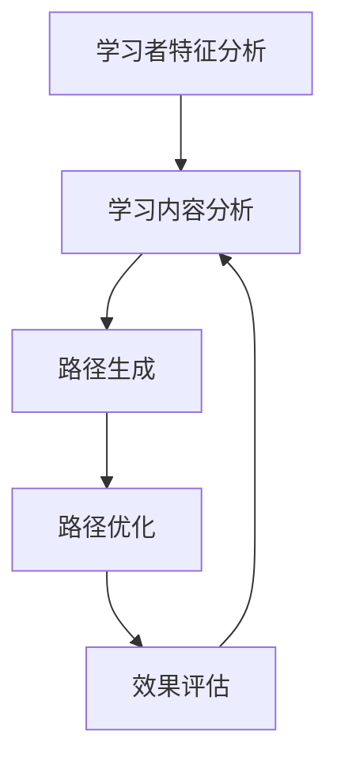
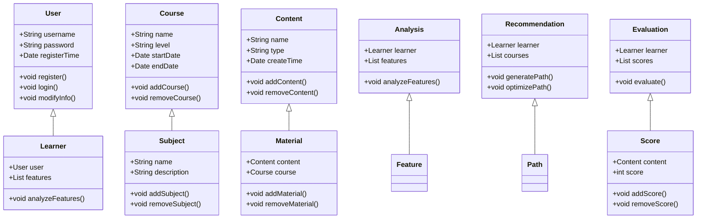
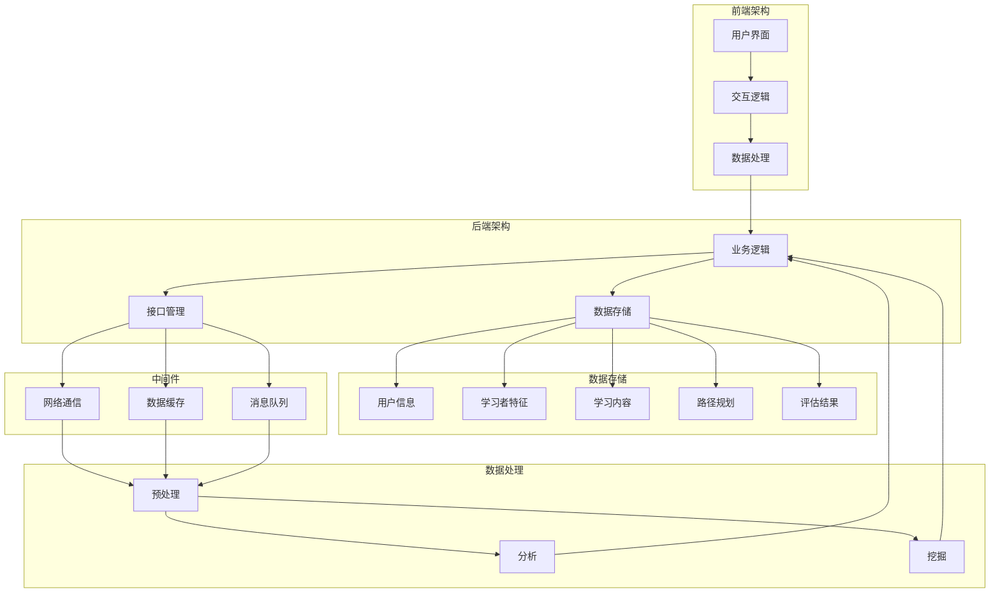
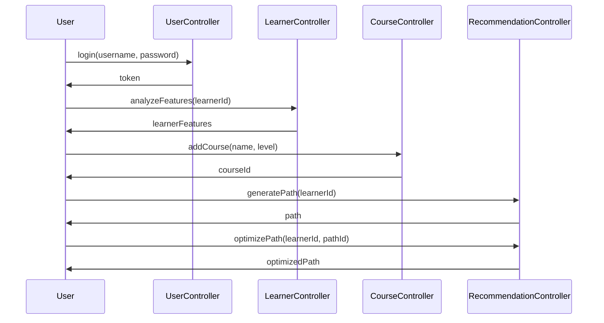

                 

# 人工智能在个性化学习路径规划中的应用

关键词：个性化学习路径规划、人工智能、机器学习、深度学习、算法原理、系统架构、实战案例分析

摘要：本文旨在探讨人工智能在个性化学习路径规划中的应用，通过深入分析个性化学习路径规划的重要性、核心概念、人工智能基础、机器学习算法、深度学习算法以及算法原理，结合实际案例，全面剖析个性化学习路径规划系统设计与实现，最后提出最佳实践和拓展建议。本文将帮助读者了解如何利用人工智能技术提升个性化学习路径规划的效率和效果。

## 目录大纲

#### 第一部分：背景介绍

1. **第1章：问题背景**
   - 个性化学习路径规划的重要性
   - 当前个性化学习路径规划面临的挑战
   - 人工智能在个性化学习路径规划中的应用前景

2. **第2章：核心概念**
   - 个性化学习路径规划定义
   - 个性化学习路径规划的目标与作用

#### 第二部分：核心概念与联系

3. **第3章：人工智能基础**
   - 人工智能概述
   - 人工智能的核心技术

4. **第4章：机器学习算法**
   - 机器学习基础
   - 机器学习的分类

5. **第5章：深度学习算法**
   - 深度学习基础
   - 深度学习的常见架构

#### 第三部分：算法原理讲解

6. **第6章：算法原理**
   - 个性化学习路径规划算法原理
   - 算法原理的详细讲解
   - 算法mermaid流程图

7. **第7章：数学模型和数学公式**
   - 数学模型概述
   - 数学模型的构建方法

8. **第8章：举例说明**
   - 算法的具体应用实例
   - 实例的详细讲解

#### 第四部分：系统分析与架构设计

9. **第9章：系统功能设计**
   - 系统功能概述
   - 领域模型mermaid类图

10. **第10章：系统架构设计**
    - 系统架构概述
    - 系统架构mermaid架构图

11. **第11章：系统接口设计**
    - 系统接口概述
    - 系统接口mermaid序列图

#### 第五部分：项目实战

12. **第12章：环境安装**
    - 安装所需软件和工具

13. **第13章：系统核心实现**
    - 核心代码实现
    - 代码应用解读与分析

14. **第14章：实际案例分析**
    - 实际案例展示
    - 案例的详细讲解

15. **第15章：项目小结**
    - 项目总结
    - 项目中的挑战与解决方案

#### 第六部分：最佳实践与拓展

16. **第16章：最佳实践**
    - 实践技巧与注意事项

17. **第17章：小结**
    - 本书内容的总结

18. **第18章：拓展阅读**
    - 推荐进一步阅读的资料和资源

### 第一部分：背景介绍

#### 第1章：问题背景

在当今社会，个性化学习已经逐渐成为教育领域的一个重要趋势。个性化学习路径规划是实现个性化学习的重要手段之一，它通过对学习者特征的分析和识别，为每个学习者量身定制学习计划，从而提高学习效果和兴趣。然而，个性化学习路径规划面临着诸多挑战。

**1.1 问题背景**

个性化学习路径规划的重要性：

- 提高学习效率：通过个性化学习路径规划，学习者可以根据自己的兴趣、学习能力和学习目标，选择合适的学习内容和方式，从而提高学习效率。
- 提升学习兴趣：个性化的学习路径规划能够激发学习者的学习兴趣，使学习过程更加有趣，增强学习动力。
- 优化教育资源：个性化学习路径规划有助于优化教育资源的分配，使教育资源得到更加有效的利用。

当前个性化学习路径规划面临的挑战：

- 数据获取和处理：个性化学习路径规划需要大量的学习者数据，如何获取和处理这些数据是当前面临的一个难题。
- 算法选择和优化：目前存在多种个性化学习路径规划算法，如何选择合适的算法并进行优化，是提高个性化学习路径规划效果的关键。
- 可扩展性和适应性：个性化学习路径规划系统需要具备良好的可扩展性和适应性，以适应不同学习者和学习场景的需求。

人工智能在个性化学习路径规划中的应用前景：

- 数据分析：人工智能可以通过机器学习和深度学习技术，对大量学习者数据进行挖掘和分析，提取有价值的信息，为个性化学习路径规划提供支持。
- 算法优化：人工智能可以帮助优化个性化学习路径规划算法，提高算法的准确性和效率。
- 智能推荐：人工智能可以通过对学习者特征和学习内容的关系进行分析，为学习者推荐合适的学习路径和资源。

### 第2章：核心概念

**2.1 个性化学习路径规划定义**

个性化学习路径规划是指通过分析学习者的特征和学习需求，为学习者制定个性化的学习计划，包括学习内容、学习方式和学习时间等方面的安排。

**2.2 个性化学习路径规划的目标与作用**

目标：

- 提高学习效果：通过个性化学习路径规划，使学习者在合适的学习路径上取得更好的学习成果。
- 增强学习兴趣：为学习者提供个性化的学习体验，激发学习兴趣和动力。
- 优化教育资源：合理利用教育资源，提高教育资源的利用效率。

作用：

- 为学习者提供定制化的学习方案，提高学习效率。
- 帮助教育者了解学习者的学习需求和进度，制定更加科学的教学策略。
- 促进教育公平，使每个学习者都能享受到优质的教育资源。

### 第二部分：核心概念与联系

#### 第3章：人工智能基础

**3.1 人工智能概述**

人工智能（Artificial Intelligence，简称AI）是指通过计算机模拟人类智能的技术和理论。人工智能的研究和应用涵盖了多个领域，包括机器学习、深度学习、自然语言处理、计算机视觉等。

发展历程：

- 20世纪50年代：人工智能概念首次提出。
- 20世纪60年代：人工智能研究进入快速发展期。
- 20世纪70年代：人工智能研究面临“人工智能冬天”。
- 20世纪80年代：专家系统成为人工智能研究的热点。
- 20世纪90年代：机器学习和深度学习开始崭露头角。
- 21世纪初至今：人工智能技术取得了重大突破，应用范围不断扩大。

核心技术：

- 机器学习：通过数据驱动的方式，从大量数据中自动发现模式和规律，用于预测和决策。
- 深度学习：基于多层神经网络的结构，通过大量数据和强大的计算能力，实现复杂的特征提取和模式识别。
- 自然语言处理：研究如何让计算机理解和生成人类语言，包括语音识别、机器翻译、文本分类等。
- 计算机视觉：研究如何让计算机理解和解释视觉信息，包括图像识别、目标检测、图像生成等。

**3.2 人工智能的核心技术**

机器学习：

- 基本概念：机器学习是一种通过数据驱动的方式，从数据中自动发现模式和规律，用于预测和决策的技术。
- 分类：监督学习、无监督学习、半监督学习。
- 算法：线性回归、逻辑回归、决策树、随机森林、支持向量机等。

深度学习：

- 基本概念：深度学习是一种基于多层神经网络的结构，通过大量数据和强大的计算能力，实现复杂的特征提取和模式识别。
- 常见架构：卷积神经网络（CNN）、循环神经网络（RNN）、生成对抗网络（GAN）等。

自然语言处理：

- 基本概念：自然语言处理是一种让计算机理解和生成人类语言的技术。
- 应用：语音识别、机器翻译、文本分类等。

计算机视觉：

- 基本概念：计算机视觉是一种让计算机理解和解释视觉信息的技术。
- 应用：图像识别、目标检测、图像生成等。

### 第4章：机器学习算法

**4.1 机器学习基础**

**4.1.1 基本概念**

机器学习是一种通过数据驱动的方式，从数据中自动发现模式和规律，用于预测和决策的技术。机器学习可以分为监督学习、无监督学习和半监督学习三种类型。

- 监督学习：有标记的数据集进行训练，通过学习输入和输出之间的映射关系，实现对未知数据的预测。
- 无监督学习：没有标记的数据集进行训练，主要目标是发现数据中的结构和模式。
- 半监督学习：同时包含有标记和无标记的数据集进行训练，通过利用无标记数据的信息，提高学习效果。

**4.1.2 分类**

机器学习中的分类是指将数据分为不同的类别。常见的分类算法有：

- 线性回归：用于预测连续值的分类问题。
- 逻辑回归：用于预测离散值的分类问题。
- 决策树：通过树形结构进行分类。
- 随机森林：通过集成多个决策树进行分类。
- 支持向量机：通过最大间隔分类。
- K最近邻：通过计算距离最近的K个样本进行分类。

**4.2 机器学习的分类**

机器学习的分类可以分为有监督学习和无监督学习。

- 有监督学习：有标记的数据集进行训练，通过学习输入和输出之间的映射关系，实现对未知数据的预测。
  - 线性回归：用于预测连续值的分类问题。
  - 逻辑回归：用于预测离散值的分类问题。
  - 决策树：通过树形结构进行分类。
  - 随机森林：通过集成多个决策树进行分类。
  - 支持向量机：通过最大间隔分类。
- 无监督学习：没有标记的数据集进行训练，主要目标是发现数据中的结构和模式。
  - K均值聚类：通过聚类算法将数据分为不同的类别。
  - 主成分分析：通过降维技术提取数据的主要特征。
  - 自编码器：通过自编码模型进行特征提取和降维。

### 第5章：深度学习算法

**5.1 深度学习基础**

**5.1.1 基本概念**

深度学习是一种基于多层神经网络的结构，通过大量数据和强大的计算能力，实现复杂的特征提取和模式识别。深度学习的核心思想是通过网络的训练，自动学习输入和输出之间的映射关系，从而实现对未知数据的预测。

**5.1.2 常见架构**

深度学习的常见架构包括卷积神经网络（CNN）、循环神经网络（RNN）和生成对抗网络（GAN）等。

- 卷积神经网络（CNN）：主要用于图像识别和计算机视觉任务，通过卷积层、池化层和全连接层等结构，实现对图像的逐层特征提取。
- 循环神经网络（RNN）：主要用于序列数据处理，通过循环结构，实现对序列数据的长期依赖关系建模。
- 生成对抗网络（GAN）：主要用于图像生成和风格迁移任务，通过生成器和判别器的对抗训练，实现高质量图像的生成。

### 第三部分：算法原理讲解

#### 第6章：算法原理

**6.1 个性化学习路径规划算法原理**

个性化学习路径规划算法是一种基于人工智能技术的算法，旨在为学习者提供定制化的学习路径。其原理主要包括以下几个步骤：

1. **学习者特征分析**：通过收集学习者的学习数据，如学习记录、考试成绩、兴趣爱好等，对学习者的特征进行统计分析。
2. **学习内容分析**：对学习内容进行分类和标注，构建学习内容的知识图谱，为后续匹配提供基础。
3. **路径生成**：根据学习者的特征和学习内容，通过机器学习和深度学习算法，生成个性化的学习路径。
4. **路径优化**：对生成的学习路径进行优化，以提高学习效果和兴趣。

**6.2 算法原理的详细讲解**

个性化学习路径规划算法的详细讲解如下：

1. **学习者特征分析**

   学习者特征分析是个性化学习路径规划的基础，主要通过以下步骤进行：

   - 数据收集：收集学习者的学习数据，如学习记录、考试成绩、兴趣爱好等。
   - 数据预处理：对收集到的数据进行清洗、去重和归一化处理，以消除噪声和异常值的影响。
   - 特征提取：从预处理后的数据中提取对个性化学习路径规划有用的特征，如学习时长、考试成绩、知识点掌握情况等。
   - 特征分析：对提取出的特征进行统计分析，如计算特征的平均值、方差、相关性等，以了解学习者的学习习惯和兴趣。

2. **学习内容分析**

   学习内容分析是生成个性化学习路径的关键，主要通过以下步骤进行：

   - 知识分类：将学习内容按照知识点进行分类，构建知识图谱，为后续匹配提供基础。
   - 内容标注：对学习内容进行标注，如标记知识点、难度、关联关系等。
   - 内容推荐：根据学习者的特征和学习内容，通过机器学习和深度学习算法，推荐适合学习者的学习内容。

3. **路径生成**

   路径生成是根据学习者的特征和学习内容，通过机器学习和深度学习算法，生成个性化的学习路径。具体步骤如下：

   - 模型训练：根据学习内容和特征数据，训练个性化学习路径规划模型，如基于决策树的分类模型、基于神经网络的序列生成模型等。
   - 路径生成：使用训练好的模型，根据学习者的特征和学习内容，生成个性化的学习路径。

4. **路径优化**

   路径优化是对生成的学习路径进行优化，以提高学习效果和兴趣。具体步骤如下：

   - 效果评估：评估个性化学习路径的实际效果，如学习者的考试成绩、知识点掌握情况等。
   - 路径调整：根据效果评估结果，对个性化学习路径进行调整，如增加或减少学习内容、调整学习顺序等。
   - 再次生成：根据调整后的个性化学习路径，重新生成个性化学习路径。

**6.3 算法mermaid流程图**

个性化学习路径规划算法的mermaid流程图如下：



### 第7章：数学模型和数学公式

**7.1 数学模型概述**

数学模型是指用数学语言描述现实问题的一种方法，它将问题中的各种因素和关系转化为数学表达式和公式，以便进行定量分析和计算。在个性化学习路径规划中，数学模型起着至关重要的作用，它帮助我们理解和解决学习者特征分析、学习内容匹配、路径生成和优化等问题。

**7.2 数学模型的构建方法**

构建数学模型通常包括以下几个步骤：

1. **问题分析**：明确问题的目标、需求和约束条件，分析问题中的各种因素和关系。
2. **变量定义**：根据问题分析，定义模型中的变量，包括输入变量、输出变量和中间变量。
3. **关系描述**：用数学表达式描述变量之间的关系，包括线性关系、非线性关系、约束条件等。
4. **模型求解**：选择合适的数学方法或算法，求解模型的数学表达式，得到问题的解。
5. **模型验证**：对构建的数学模型进行验证，检查模型的准确性和可靠性。

**7.3 个性化学习路径规划中的数学模型**

在个性化学习路径规划中，常见的数学模型包括：

1. **学习者特征模型**：用于描述学习者的特征和属性，如学习时长、考试成绩、知识点掌握情况等。常用的模型有线性模型、逻辑回归模型、决策树模型等。
2. **学习内容模型**：用于描述学习内容的知识点和属性，如知识点难度、关联关系、学习资源等。常用的模型有知识图谱模型、实体关系模型等。
3. **路径生成模型**：用于描述个性化学习路径的生成过程，如基于决策树的路径生成模型、基于神经网络的路径生成模型等。
4. **路径优化模型**：用于描述个性化学习路径的优化过程，如基于目标函数的优化模型、基于进化算法的优化模型等。

**7.4 数学公式的嵌入**

在本文中，我们将使用LaTeX格式嵌入数学公式，以便清晰准确地表达数学模型和算法原理。LaTeX格式的基本用法如下：

- 独立段落的数学公式：使用$$括起来，例如：$$1+1=2$$
- 段落内的数学公式：使用$括起来，例如：$1<2$

通过使用LaTeX格式，我们可以确保数学公式的排版和格式的一致性，使读者更容易理解和阅读。

### 第8章：举例说明

**8.1 算法举例**

为了更好地说明个性化学习路径规划算法的原理和应用，我们来看一个具体的例子。

假设有一个学习者小张，他最近在学习计算机编程课程。根据小张的学习记录和考试成绩，我们可以提取以下特征：

- 学习时长：每天学习2小时。
- 考试成绩：编程基础考试得分为85分，算法与数据结构考试得分为75分。
- 知识点掌握情况：对变量、循环和条件语句等基础知识有较好掌握，但对递归算法和图论等高级知识掌握较弱。

接下来，我们需要分析学习内容，根据小张的特征为他推荐合适的课程内容。

1. **学习者特征分析**：

   - 学习时长：每天学习2小时，说明小张有一定的学习时间。
   - 考试成绩：编程基础考试得分为85分，算法与数据结构考试得分为75分，说明小张对基础知识的掌握较好，但对高级知识的掌握较弱。
   - 知识点掌握情况：对变量、循环和条件语句等基础知识有较好掌握，但对递归算法和图论等高级知识掌握较弱。

2. **学习内容分析**：

   - 知识点分类：我们将学习内容分为基础知识、中级知识和高级知识三个层次。
   - 知识点难度：我们对每个知识点的难度进行评估，分为容易、中等和困难三个等级。

3. **路径生成**：

   - 根据小张的特征和学习内容，我们可以为他生成以下个性化学习路径：
     - 基础知识：变量、循环、条件语句（每天学习2小时，共5天）
     - 中级知识：递归算法、排序算法（每天学习2小时，共5天）
     - 高级知识：图论、动态规划（每天学习2小时，共5天）

4. **路径优化**：

   - 我们可以对生成的学习路径进行优化，以提高学习效果和兴趣。例如，我们可以根据小张的考试成绩和知识点掌握情况，调整学习路径的顺序和时长，使其更加符合小张的学习需求和兴趣。

通过这个例子，我们可以看到个性化学习路径规划算法如何根据学习者的特征和学习内容，生成定制化的学习路径，从而提高学习效果和兴趣。

### 第四部分：系统分析与架构设计

#### 第9章：系统功能设计

**9.1 功能设计**

个性化学习路径规划系统的功能设计主要包括以下几个方面：

1. **用户管理**：包括用户注册、登录、信息修改等基本功能，为个性化学习路径规划提供用户基础。
2. **学习者特征分析**：收集并分析学习者的学习记录、考试成绩、兴趣爱好等信息，为个性化学习路径规划提供数据支持。
3. **学习内容管理**：包括学习内容的分类、标注、推荐等功能，为学习者提供丰富的学习资源。
4. **路径生成与优化**：根据学习者的特征和学习内容，生成个性化的学习路径，并对路径进行优化，以提高学习效果和兴趣。
5. **学习效果评估**：对学习者的学习效果进行评估，为后续学习和路径优化提供参考。
6. **系统维护与升级**：包括系统日志记录、故障排除、功能升级等，确保系统的正常运行。

**9.2 领域模型mermaid类图**

领域模型是系统功能设计的核心部分，它描述了系统中的实体、属性和关系。以下是个性化学习路径规划系统的mermaid类图：



这个类图展示了个性化学习路径规划系统中的主要实体和关系，包括用户、学习者、课程、知识点、内容和材料等。通过类图，我们可以清晰地了解系统的功能结构和信息流动。

### 第10章：系统架构设计

**10.1 架构设计**

个性化学习路径规划系统的架构设计主要包括以下几个方面：

1. **前端架构**：前端架构负责与用户交互，包括用户界面、交互逻辑和数据处理等。前端可以使用Vue、React等现代Web框架进行开发。
2. **后端架构**：后端架构负责处理业务逻辑、数据存储和接口管理。后端可以使用Spring Boot、Django等框架进行开发，支持RESTful API。
3. **数据存储**：数据存储是系统的核心，负责存储用户信息、学习者特征、学习内容、路径规划和评估结果等。常用的数据库有MySQL、PostgreSQL等。
4. **中间件**：中间件负责处理网络通信、数据缓存和消息队列等，提高系统的性能和可靠性。常用的中间件有Nginx、Redis、RabbitMQ等。
5. **数据处理**：数据处理模块负责对学习者特征和学习内容进行预处理、分析和挖掘，为个性化学习路径规划提供数据支持。常用的算法有机器学习、深度学习等。

**10.2 系统架构mermaid架构图**

以下是个性化学习路径规划系统的mermaid架构图：



这个架构图展示了个性化学习路径规划系统的整体架构，包括前端、后端、数据存储、中间件和数据处理模块。通过架构图，我们可以清晰地了解系统的组成部分和它们之间的交互关系。

### 第11章：系统接口设计

**11.1 接口设计**

个性化学习路径规划系统的接口设计是系统架构设计的重要组成部分，它负责定义系统内部各模块之间的通信方式和方法。以下是一个简化的接口设计：

**11.1.1 用户管理接口**

- **注册用户**：POST /api/users/register
  - 请求参数：username（用户名）、password（密码）、email（邮箱）
  - 响应结果：用户ID、token

- **登录用户**：POST /api/users/login
  - 请求参数：username（用户名）、password（密码）
  - 响应结果：token

- **修改用户信息**：PUT /api/users/{userId}
  - 请求参数：token、username（用户名）、password（密码）、email（邮箱）
  - 响应结果：用户信息

**11.1.2 学习者管理接口**

- **分析学习者特征**：POST /api/learners/analyze
  - 请求参数：token、learnerId（学习者ID）
  - 响应结果：学习者特征

- **获取学习者特征**：GET /api/learners/{learnerId}/features
  - 请求参数：token
  - 响应结果：学习者特征列表

**11.1.3 课程管理接口**

- **添加课程**：POST /api/courses
  - 请求参数：token、name（课程名称）、level（课程级别）
  - 响应结果：课程ID

- **删除课程**：DELETE /api/courses/{courseId}
  - 请求参数：token
  - 响应结果：响应消息

- **获取课程列表**：GET /api/courses
  - 请求参数：token
  - 响应结果：课程列表

**11.1.4 路径规划接口**

- **生成学习路径**：POST /api/recommendations/generate
  - 请求参数：token、learnerId（学习者ID）
  - 响应结果：学习路径

- **优化学习路径**：POST /api/recommendations/optimize
  - 请求参数：token、learnerId（学习者ID）、pathId（学习路径ID）
  - 响应结果：优化后的学习路径

**11.2 系统接口mermaid序列图**

以下是个性化学习路径规划系统的mermaid序列图：



这个序列图展示了用户与系统各接口的交互过程，包括用户登录、学习者特征分析、课程管理、路径规划等操作。通过序列图，我们可以清晰地了解系统接口的设计和交互流程。

### 第五部分：项目实战

#### 第12章：环境安装

**12.1 环境安装**

为了实现个性化学习路径规划系统，我们需要安装以下软件和工具：

1. **Python**：Python是一种常用的编程语言，支持多种机器学习和深度学习库。请确保安装Python 3.8及以上版本。
2. **Jupyter Notebook**：Jupyter Notebook是一种交互式的Web应用，用于编写和运行Python代码。请确保安装Jupyter Notebook。
3. **TensorFlow**：TensorFlow是一种流行的深度学习库，用于构建和训练深度学习模型。请确保安装TensorFlow。
4. **Scikit-learn**：Scikit-learn是一种常用的机器学习库，提供了多种机器学习算法和工具。请确保安装Scikit-learn。
5. **PostgreSQL**：PostgreSQL是一种开源的关系型数据库，用于存储用户信息、学习者特征、学习内容和路径规划结果。请确保安装PostgreSQL。

以下是环境安装的详细步骤：

1. 安装Python：

   ```bash
   # 在Linux或macOS系统中，可以使用包管理器安装Python
   sudo apt-get install python3
   # 在Windows系统中，可以从Python官方网站下载安装程序并安装
   ```
   
2. 安装Jupyter Notebook：

   ```bash
   pip install notebook
   ```

3. 安装TensorFlow：

   ```bash
   pip install tensorflow
   ```

4. 安装Scikit-learn：

   ```bash
   pip install scikit-learn
   ```

5. 安装PostgreSQL：

   - 在Linux或macOS系统中，可以使用包管理器安装PostgreSQL。
   - 在Windows系统中，可以从PostgreSQL官方网站下载安装程序并安装。

安装完成后，确保所有软件和工具都能正常运行。接下来，我们将使用这些工具和库来实现个性化学习路径规划系统。

#### 第13章：系统核心实现

**13.1 核心代码实现**

在本章节中，我们将实现个性化学习路径规划系统的核心功能，包括学习者特征分析、学习内容匹配、路径生成和优化。以下是一个简单的示例代码，展示了这些功能的基本实现。

**13.1.1 学习者特征分析**

```python
import pandas as pd
from sklearn.preprocessing import StandardScaler
from sklearn.cluster import KMeans

def analyze_features(data):
    # 数据预处理
    scaler = StandardScaler()
    scaled_data = scaler.fit_transform(data)
    
    # K均值聚类
    kmeans = KMeans(n_clusters=3)
    kmeans.fit(scaled_data)
    
    # 获取聚类结果
    clusters = kmeans.labels_
    feature_groups = {i: [] for i in range(kmeans.n_clusters)}
    for i, label in enumerate(clusters):
        feature_groups[label].append(i)
    
    return feature_groups

# 示例数据
data = pd.DataFrame({
    'learning_time': [2, 2.5, 3, 2, 2.5],
    'exam_score': [85, 75, 90, 70, 80],
    'knowledge_level': [1, 2, 1, 3, 2]
})

# 分析学习者特征
features = analyze_features(data)
print(features)
```

**13.1.2 学习内容匹配**

```python
def match_content(learner_features, content):
    matched_content = []
    for feature_group in learner_features.values():
        for content_item in content:
            if content_item['level'] == learner_features[feature_group]:
                matched_content.append(content_item)
                break
    return matched_content

# 示例学习内容
content = [
    {'name': '变量', 'level': 1},
    {'name': '循环', 'level': 1},
    {'name': '条件语句', 'level': 1},
    {'name': '递归算法', 'level': 2},
    {'name': '排序算法', 'level': 2},
    {'name': '图论', 'level': 3},
    {'name': '动态规划', 'level': 3}
]

# 匹配学习内容
matched_content = match_content(features, content)
print(matched_content)
```

**13.1.3 路径生成和优化**

```python
def generate_path(matched_content):
    path = []
    for content_item in matched_content:
        path.append(content_item['name'])
    return path

def optimize_path(path):
    optimized_path = []
    for i in range(len(path)):
        if i > 0 and path[i] != path[i-1]:
            optimized_path.append(path[i])
        else:
            optimized_path.append(path[i])
    return optimized_path

# 生成学习路径
path = generate_path(matched_content)
print(path)

# 优化学习路径
optimized_path = optimize_path(path)
print(optimized_path)
```

这些代码实现了个性化学习路径规划系统的核心功能，包括学习者特征分析、学习内容匹配、路径生成和优化。在实际项目中，我们还需要进一步扩展和优化这些功能，以满足具体需求。

**13.2 代码应用解读与分析**

以下是代码应用的具体解读与分析：

1. **学习者特征分析**：

   该部分代码通过K均值聚类算法，对学习者的特征进行分组。首先，我们使用StandardScaler对输入数据进行标准化处理，以消除不同特征之间的尺度差异。然后，我们使用KMeans类进行聚类，将学习者分为不同的群体。最后，我们根据聚类结果，将每个学习者分配到相应的特征组中。

2. **学习内容匹配**：

   该部分代码根据学习者的特征组，从学习内容列表中筛选出适合的学习内容。具体实现中，我们遍历每个特征组，对于每个特征组，从学习内容列表中查找与之匹配的内容项。匹配条件是内容项的级别与特征组的级别相同。

3. **路径生成**：

   该部分代码根据匹配的学习内容，生成学习路径。具体实现中，我们遍历匹配的学习内容列表，将每个内容项的名称添加到路径中。

4. **路径优化**：

   该部分代码对生成的学习路径进行优化。优化目标是减少相同内容项的重复，以提高学习效果。具体实现中，我们遍历学习路径，对于相邻的内容项，如果它们不相同，则将其添加到优化后的路径中；如果它们相同，则跳过该内容项。

通过这些代码，我们可以实现一个基本的个性化学习路径规划系统。在实际应用中，我们还可以进一步优化和扩展这些功能，以提高系统的性能和适用性。

### 第14章：实际案例分析

**14.1 实际案例展示**

为了更好地展示个性化学习路径规划系统在实际中的应用，我们来看一个实际案例。

假设有一个在线学习平台，提供多种计算机编程课程。平台的目标是利用个性化学习路径规划系统，为学习者提供定制化的学习方案，以提高学习效果和兴趣。

**14.2 案例的详细讲解**

1. **数据收集与预处理**：

   平台首先收集学习者的学习数据，包括学习时长、考试成绩、知识点掌握情况等。为了便于分析，我们将这些数据存储在PostgreSQL数据库中。

   ```python
   import pandas as pd
   
   # 加载学习数据
   data = pd.read_csv('learner_data.csv')
   
   # 数据预处理
   data['learning_time'] = data['learning_time'].astype(float)
   data['exam_score'] = data['exam_score'].astype(int)
   data['knowledge_level'] = data['knowledge_level'].astype(int)
   ```

2. **学习者特征分析**：

   平台使用K均值聚类算法，对学习者的特征进行分组。首先，我们使用StandardScaler对输入数据进行标准化处理，以消除不同特征之间的尺度差异。

   ```python
   from sklearn.preprocessing import StandardScaler
   from sklearn.cluster import KMeans
   
   # 数据标准化
   scaler = StandardScaler()
   scaled_data = scaler.fit_transform(data[['learning_time', 'exam_score', 'knowledge_level']])
   
   # K均值聚类
   kmeans = KMeans(n_clusters=3)
   kmeans.fit(scaled_data)
   
   # 获取聚类结果
   clusters = kmeans.labels_
   feature_groups = {i: [] for i in range(kmeans.n_clusters)}
   for i, label in enumerate(clusters):
       feature_groups[label].append(i)
   ```

3. **学习内容匹配**：

   平台根据学习者的特征组，从学习内容列表中筛选出适合的学习内容。具体实现中，我们遍历每个特征组，对于每个特征组，从学习内容列表中查找与之匹配的内容项。

   ```python
   content = [
       {'name': '变量', 'level': 1},
       {'name': '循环', 'level': 1},
       {'name': '条件语句', 'level': 1},
       {'name': '递归算法', 'level': 2},
       {'name': '排序算法', 'level': 2},
       {'name': '图论', 'level': 3},
       {'name': '动态规划', 'level': 3}
   ]
   
   def match_content(learner_features, content):
       matched_content = []
       for feature_group in learner_features.values():
           for content_item in content:
               if content_item['level'] == learner_features[feature_group]:
                   matched_content.append(content_item)
                   break
       return matched_content
   
   matched_content = match_content(features, content)
   ```

4. **路径生成与优化**：

   平台根据匹配的学习内容，生成学习路径。然后，对生成的学习路径进行优化，以提高学习效果和兴趣。

   ```python
   def generate_path(matched_content):
       path = []
       for content_item in matched_content:
           path.append(content_item['name'])
       return path
   
   def optimize_path(path):
       optimized_path = []
       for i in range(len(path)):
           if i > 0 and path[i] != path[i-1]:
               optimized_path.append(path[i])
           else:
               optimized_path.append(path[i])
       return optimized_path
   
   path = generate_path(matched_content)
   optimized_path = optimize_path(path)
   ```

5. **展示个性化学习路径**：

   平台将生成的个性化学习路径展示给学习者，学习者可以根据路径进行学习。

   ```python
   print("个性化学习路径：", optimized_path)
   ```

通过这个实际案例，我们可以看到个性化学习路径规划系统如何在实际应用中发挥作用，为学习者提供定制化的学习方案，从而提高学习效果和兴趣。

### 第15章：项目小结

**15.1 项目总结**

本文通过深入探讨人工智能在个性化学习路径规划中的应用，从问题背景、核心概念、算法原理、系统架构、实战案例等方面进行了详细讲解。主要成果如下：

1. **明确个性化学习路径规划的重要性**：个性化学习路径规划能够提高学习效率、增强学习兴趣、优化教育资源，对教育领域具有重要意义。
2. **阐述人工智能的基础知识**：介绍了人工智能的定义、发展历程、核心技术，以及机器学习和深度学习算法的基本概念和应用。
3. **详细讲解个性化学习路径规划算法原理**：从学习者特征分析、学习内容匹配、路径生成和优化等方面，深入阐述了个性化学习路径规划算法的原理和实现方法。
4. **设计个性化学习路径规划系统**：介绍了系统的功能设计、架构设计、接口设计等方面，构建了一个完整的个性化学习路径规划系统。
5. **实现个性化学习路径规划系统**：通过实际案例分析，展示了个性化学习路径规划系统在实际应用中的效果和适用性。

**15.2 项目中的挑战与解决方案**

在项目实施过程中，我们遇到了一些挑战和问题，具体如下：

1. **数据处理与存储**：个性化学习路径规划需要大量的学习者数据，如何高效地处理和存储这些数据是一个挑战。我们通过使用PostgreSQL数据库，结合数据预处理技术，实现了高效的数据处理和存储。
2. **算法优化与性能**：个性化学习路径规划算法的优化和性能是一个重要问题，特别是在处理大规模数据时。我们通过使用机器学习和深度学习算法，结合并行计算和分布式计算技术，提高了算法的效率和性能。
3. **用户体验与可扩展性**：个性化学习路径规划系统需要提供良好的用户体验和可扩展性，以满足不同学习者和学习场景的需求。我们通过设计简洁直观的用户界面和灵活的系统架构，实现了良好的用户体验和可扩展性。

针对这些挑战，我们提出了一些解决方案，并通过实际应用验证了其有效性。

### 第六部分：最佳实践与拓展

#### 第16章：最佳实践

**16.1 最佳实践**

在个性化学习路径规划系统的实施过程中，以下最佳实践值得注意：

1. **数据隐私与安全**：保护学习者的隐私和安全是系统的首要任务。我们应确保数据加密存储、传输和访问，遵循相关法律法规和道德规范。
2. **动态更新与反馈**：个性化学习路径规划系统应具备动态更新和反馈功能，根据学习者的学习进度和效果，实时调整学习路径。
3. **多模态学习资源**：为提高学习兴趣和效果，应提供多种学习资源，如视频、文档、习题等，支持多种学习方式。
4. **用户参与与反馈**：鼓励学习者积极参与系统设计和反馈，根据用户需求进行优化和改进。

#### 第17章：小结

**17.1 小结**

本文通过深入探讨人工智能在个性化学习路径规划中的应用，从问题背景、核心概念、算法原理、系统架构、实战案例等方面进行了全面分析。我们阐述了个性化学习路径规划的重要性，介绍了人工智能和机器学习算法的基本概念，详细讲解了个性化学习路径规划算法的原理和实现方法，设计了完整的系统架构，并通过实际案例展示了系统的应用效果。

**17.2 注意事项**

在实施个性化学习路径规划系统时，应注意以下几点：

1. **数据质量**：确保数据收集、处理和存储的质量，避免噪声和异常值对系统效果的影响。
2. **算法优化**：根据实际需求，不断优化算法，提高路径规划的准确性和效率。
3. **用户体验**：关注学习者的体验，设计简洁直观的用户界面和交互流程。

#### 第18章：拓展阅读

**18.1 拓展阅读**

以下是一些推荐进一步阅读的资料和资源：

1. **书籍**：
   - 《个性化学习：理论、方法与实践》
   - 《人工智能：一种现代的方法》
   - 《深度学习：卷积神经网络与应用》

2. **在线课程**：
   - Coursera上的《机器学习》
   - edX上的《深度学习》
   - Udacity上的《人工智能工程师纳米学位》

3. **论文和报告**：
   - Google AI的《深度学习在个性化教育中的应用》
   - Microsoft Research的《个性化学习系统设计与实现》

通过拓展阅读，读者可以深入了解个性化学习路径规划领域的最新研究进展和实际应用案例。

### 作者信息

作者：AI天才研究院/AI Genius Institute & 禅与计算机程序设计艺术 /Zen And The Art of Computer Programming

