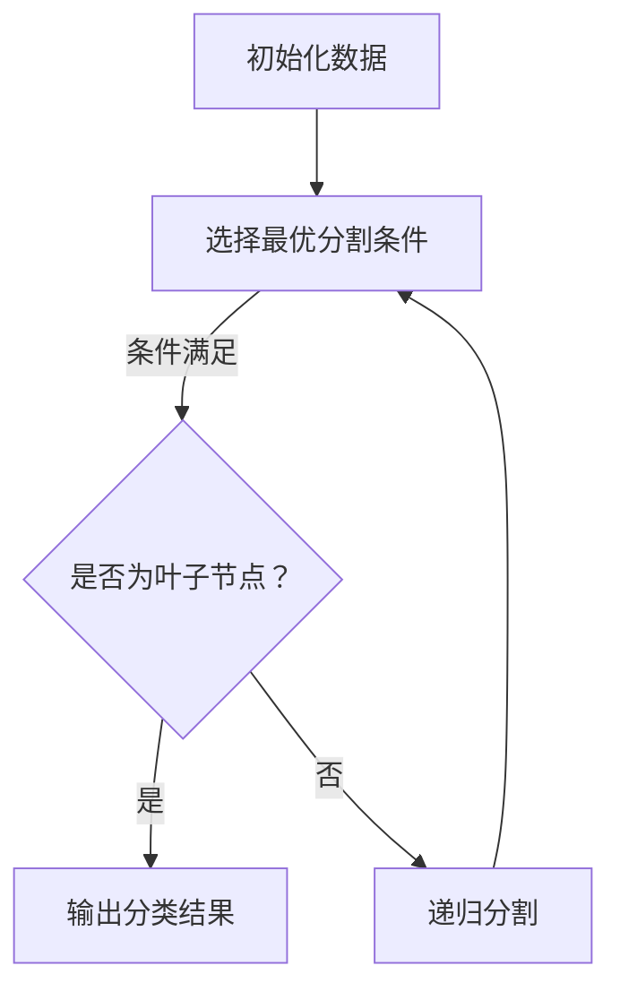
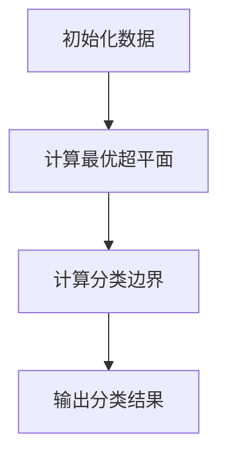
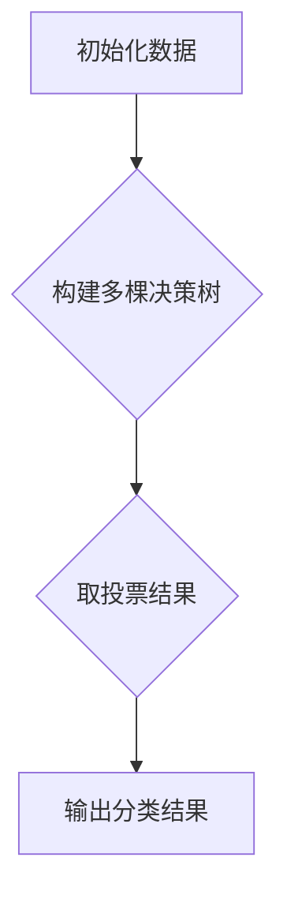
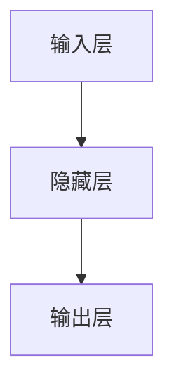
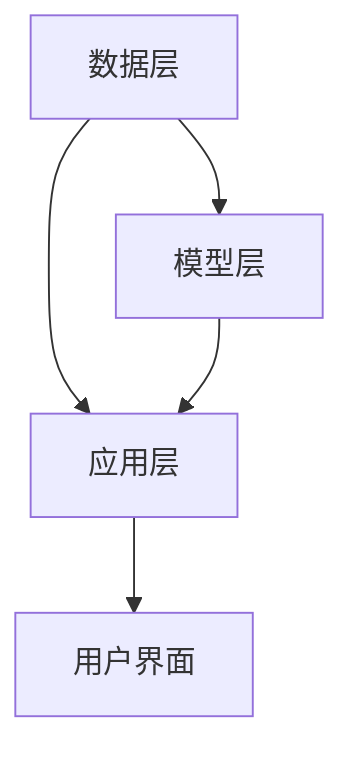
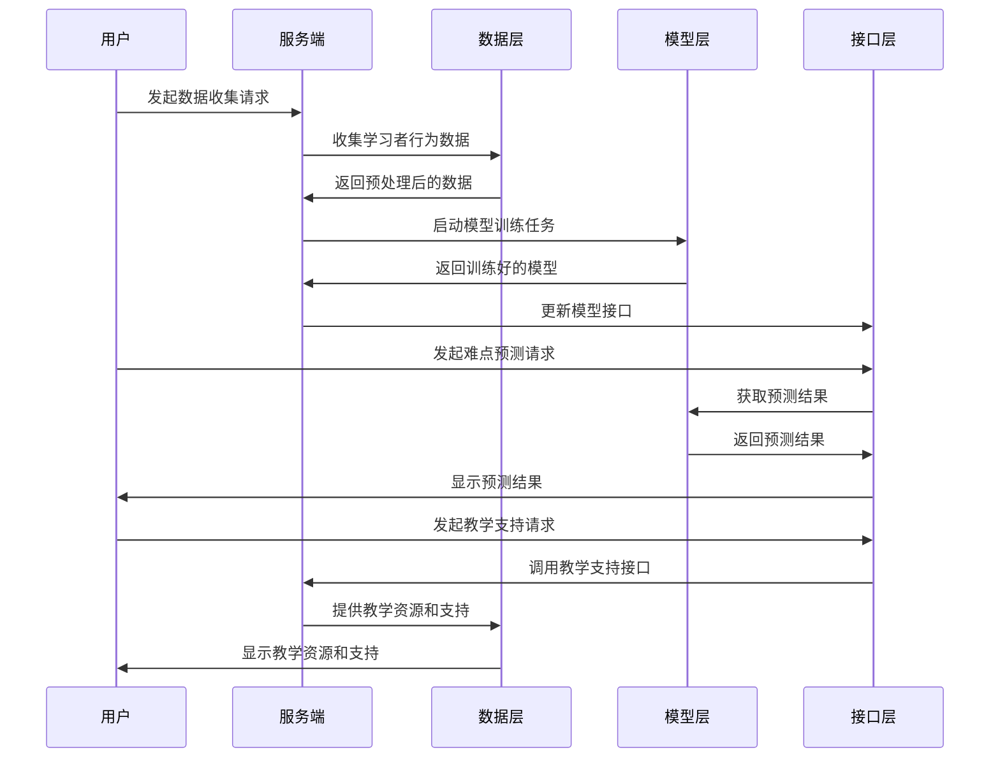

                 

# 人工智能在个性化学习难点预测中的应用

## 关键词

- 个性化学习
- 学习难点预测
- 人工智能
- 机器学习
- 深度学习

## 摘要

随着人工智能技术的发展，个性化学习成为教育领域的重要研究方向。然而，个性化学习中的难点预测是一个极具挑战性的问题。本文将探讨人工智能在个性化学习难点预测中的应用，通过分析个性化学习的核心概念、学习难点预测的方法，以及机器学习和深度学习技术在其中的应用，为解决这一难题提供新的思路和方法。

---

## 引言

### 第1章：问题背景与核心概念

#### 1.1.1 问题背景

个性化学习是一种以学习者为中心的教育模式，旨在根据学习者的特点、需求和兴趣，提供个性化的教学资源和学习路径，从而提高学习效果和兴趣。然而，在个性化学习中，如何预测学习者在学习过程中可能遇到的难点，是提高学习效果的关键。

#### 1.1.2 问题描述

个性化学习难点预测是指通过分析学习者的行为数据，如学习时间、学习路径、学习频率等，预测学习者在学习过程中可能遇到的难点。难点可能包括难以理解的概念、复杂的问题解决过程等。

#### 1.1.3 问题解决

人工智能，特别是机器学习和深度学习技术，为个性化学习难点预测提供了强有力的工具。通过构建合适的模型，可以从海量数据中挖掘出学习难点与学习者行为之间的关联，实现对学习难点的预测。

#### 1.1.4 边界与外延

个性化学习难点预测不仅局限于教育领域，还可以应用于职业培训、在线学习平台等多个场景。此外，随着人工智能技术的发展，这一领域的研究将进一步拓展。

#### 1.1.5 概念结构与核心要素组成

- 个性化学习：根据学习者特点提供个性化教学资源。
- 学习难点预测：通过分析学习者行为数据预测可能遇到的难点。
- 人工智能：利用机器学习和深度学习技术构建预测模型。

### 第2章：核心概念与联系

#### 2.1.1 个性化学习概念原理

个性化学习是一种以学习者为中心的教育模式，其核心原理包括数据驱动、自适应教学、个性化评估等。通过收集和分析学习者的行为数据，系统可以根据学习者的特点和需求，提供个性化的教学资源和学习路径。

#### 2.1.2 学习难点预测概念原理

学习难点预测是通过分析学习者的行为数据，如学习时间、学习路径、学习频率等，预测学习者在学习过程中可能遇到的难点。其核心原理包括数据挖掘、模式识别、预测模型构建等。

#### 2.1.3 学习难点预测与传统教学区别

传统教学主要依赖教师的主观判断和经验，而学习难点预测则通过数据分析和模型预测，更客观、准确。

### 第3章：人工智能在个性化学习难点预测中的应用

#### 3.1.1 机器学习技术简介

机器学习是人工智能的核心技术之一，通过构建模型，从数据中自动学习规律，实现对未知数据的预测和决策。

#### 3.1.2 深度学习技术简介

深度学习是机器学习的一个分支，通过构建多层神经网络，能够自动提取数据的复杂特征，实现对复杂问题的建模。

#### 3.1.3 个性化学习难点预测的机器学习模型

- 决策树
- 支持向量机
- 随机森林
- 神经网络

### 第4章：算法原理讲解

#### 4.1.1 决策树算法

决策树是一种树形结构，通过一系列判断条件，将数据集分割成多个子集，并最终得到每个样本的分类或回归结果。

#### 4.1.2 支持向量机算法

支持向量机是一种二分类模型，其目标是找到一个最佳的超平面，将不同类别的数据点分开。

#### 4.1.3 随机森林算法

随机森林是一种集成学习方法，通过构建多棵决策树，并取其投票结果作为最终分类结果。

#### 4.1.4 神经网络算法

神经网络是一种模仿人脑结构的计算模型，通过多层神经元进行信息的传递和处理。

### 第5章：数学模型和数学公式

#### 5.1.1 决策树分类模型

决策树分类模型的数学模型如下：

$$
P(y|X=x) = \prod_{i=1}^{n} P(y_i|x_i)
$$

其中，$P(y_i|x_i)$ 表示在给定特征 $x_i$ 下，类别 $y_i$ 的概率。

#### 5.1.2 支持向量机分类模型

支持向量机分类模型的数学模型如下：

$$
w^T x - b = 0
$$

其中，$w$ 表示权重向量，$x$ 表示特征向量，$b$ 表示偏置。

#### 5.1.3 随机森林分类模型

随机森林分类模型的数学模型与决策树类似，但更复杂，涉及多棵决策树的集成。

### 第6章：系统分析与架构设计方案

#### 6.1 问题场景介绍

个性化学习难点预测系统旨在通过分析学习者的行为数据，预测其在学习过程中可能遇到的难点，并提供相应的教学支持。

#### 6.2 项目介绍

项目名称：个性化学习难点预测系统

项目目标：通过人工智能技术，实现个性化学习难点的预测，提高学习效果。

#### 6.3 系统功能设计

系统功能包括：数据收集、数据预处理、模型训练、难点预测、教学支持等。

#### 6.4 系统架构设计

系统采用分层架构，包括数据层、模型层、应用层等。

#### 6.5 系统接口设计和系统交互

系统接口设计包括API接口、数据接口等，系统交互采用RESTful API设计。

### 第7章：项目实战

#### 7.1 环境安装

介绍个性化学习难点预测系统的环境安装步骤，包括Python环境、依赖库的安装等。

#### 7.2 系统核心实现源代码

提供个性化学习难点预测系统的核心实现源代码，包括数据收集、预处理、模型训练、难点预测等模块。

#### 7.3 代码应用解读与分析

对系统核心代码进行解读和分析，介绍代码实现原理和关键技术。

#### 7.4 实际案例分析和详细讲解剖析

通过实际案例，对个性化学习难点预测系统进行详细讲解和剖析，展示系统在实际应用中的效果。

#### 7.5 项目小结

总结项目实施过程中的关键经验和教训，展望未来的发展方向。

### 第8章：最佳实践 tips、小结、注意事项、拓展阅读

#### 8.1 最佳实践 tips

分享在个性化学习难点预测过程中的最佳实践技巧，提高预测准确性。

#### 8.2 小结

总结本文的核心内容，强调人工智能在个性化学习难点预测中的应用价值。

#### 8.3 注意事项

提醒读者在实施个性化学习难点预测系统时需要注意的问题。

#### 8.4 拓展阅读

推荐进一步阅读的相关文献和资源，为读者提供更多的学习资料。

---

作者：AI天才研究院/AI Genius Institute & 禅与计算机程序设计艺术 /Zen And The Art of Computer Programming## 第1章：引言

### 1.1 个性化学习与学习难点预测

在当今信息爆炸的时代，教育资源的丰富程度前所未有。然而，传统的一刀切教学模式已经难以满足每个学习者的个性化需求。个性化学习作为一种以学习者为中心的教育模式，正逐渐受到广泛关注。个性化学习的核心在于根据学习者的特点、需求和兴趣，提供个性化的教学资源和学习路径，以提高学习效果和兴趣。

然而，在个性化学习的实践中，学习难点预测成为了一个重要的挑战。学习难点是指在学习过程中，学习者遇到的难以理解或掌握的知识点或问题。预测学习难点有助于提前识别潜在的困难，为学习者提供及时的支持和干预，从而提高学习效率和效果。

学习难点预测不仅对学习者个人有益，对于教育机构和教师也具有重要的参考价值。通过预测学习难点，教师可以更有针对性地设计和调整教学内容，提高教学效果；教育机构可以更好地了解学习者的学习状况，优化教学资源配置，提高整体教育质量。

### 1.2 人工智能与个性化学习难点预测

人工智能（Artificial Intelligence，AI）作为当前科技领域的重要发展方向，已经在许多领域取得了显著的成果。在个性化学习难点预测中，人工智能，尤其是机器学习和深度学习技术，为解决这一难题提供了强有力的工具。

#### 1.2.1 机器学习技术

机器学习（Machine Learning，ML）是人工智能的一个分支，主要研究如何从数据中自动学习规律，并对未知数据进行预测和决策。在个性化学习难点预测中，机器学习技术可以通过分析学习者的行为数据，如学习时间、学习路径、学习频率等，发现学习难点与学习者行为之间的关联，从而预测学习难点。

常用的机器学习算法包括决策树、支持向量机、随机森林和神经网络等。这些算法可以根据不同的数据特点和预测需求，选择合适的模型进行训练和预测。

#### 1.2.2 深度学习技术

深度学习（Deep Learning，DL）是机器学习的一个分支，主要研究如何通过构建多层神经网络，从数据中自动提取复杂特征，实现对复杂问题的建模。在个性化学习难点预测中，深度学习技术可以通过学习海量的学习者行为数据，挖掘出更深层次的规律和特征，从而提高预测的准确性和可靠性。

常见的深度学习模型包括卷积神经网络（CNN）、循环神经网络（RNN）和生成对抗网络（GAN）等。这些模型可以根据不同的数据类型和预测任务，选择合适的模型进行训练和预测。

### 1.3 人工智能在个性化学习难点预测中的应用

人工智能在个性化学习难点预测中的应用主要体现在以下几个方面：

1. **数据收集与预处理**：利用人工智能技术，可以自动收集和整合学习者的行为数据，如学习时间、学习路径、学习频率等。同时，通过数据预处理技术，可以清洗和整合数据，为后续的模型训练和预测提供高质量的数据支持。

2. **模型训练与预测**：通过选择合适的机器学习算法和深度学习模型，对学习者行为数据进行训练，构建预测模型。这些模型可以根据学习者的行为数据，预测其在学习过程中可能遇到的难点。

3. **教学支持与干预**：根据预测结果，系统可以自动为学习者提供相应的教学支持，如提供额外的学习资源、调整学习路径等，帮助学习者克服学习难点。

4. **评估与优化**：通过不断收集和分析学习者的反馈数据，可以不断优化和调整预测模型，提高预测的准确性和可靠性。

### 1.4 本文结构

本文将分为以下几个部分：

1. **第1章：引言**：介绍个性化学习与学习难点预测的背景，以及人工智能在其中的应用。
2. **第2章：核心概念与联系**：详细阐述个性化学习和学习难点预测的核心概念原理，以及二者之间的联系。
3. **第3章：人工智能在个性化学习难点预测中的应用**：介绍机器学习技术和深度学习技术，以及它们在个性化学习难点预测中的应用。
4. **第4章：算法原理讲解**：详细讲解常用的机器学习算法和深度学习模型的原理，包括决策树、支持向量机、随机森林和神经网络等。
5. **第5章：数学模型和数学公式**：介绍算法原理的数学模型和公式，以及如何使用Python代码实现。
6. **第6章：系统分析与架构设计方案**：介绍个性化学习难点预测系统的设计原则和架构方案。
7. **第7章：项目实战**：通过实际案例，展示个性化学习难点预测系统的应用和实现。
8. **第8章：最佳实践 tips、小结、注意事项、拓展阅读**：总结本文的核心内容，提供最佳实践建议，提醒注意事项，并推荐拓展阅读。

通过本文的详细讲解，希望能够帮助读者深入了解个性化学习难点预测的原理和方法，为实际应用提供有益的参考。

### 第2章：核心概念与联系

#### 2.1 个性化学习概念原理

个性化学习是一种以学习者为中心的教育模式，其核心理念是尊重每个学习者的个性差异，根据其特点和需求，提供个性化的教学资源和学习路径。个性化学习不仅仅是对教学内容进行简单的调整，而是要深度理解每个学习者的学习风格、兴趣、知识背景等，从而实现教学效果的最大化。

个性化学习的关键概念包括以下几个方面：

1. **数据驱动**：个性化学习依赖于对学习者数据的收集和分析，如学习时间、学习路径、学习频率、学习效果等。通过分析这些数据，可以了解学习者的学习习惯、弱点、兴趣点等，从而提供个性化的学习支持。

2. **自适应教学**：个性化学习系统可以根据学习者的反馈和学习行为，动态调整教学内容和教学方法。例如，当学习者遇到学习难点时，系统可以提供额外的练习或解释，帮助其更好地理解和掌握知识。

3. **个性化评估**：个性化学习强调对学习者的个性化评估，不仅仅是考试分数，还包括学习过程中的表现、进步情况等。通过个性化的评估，可以更全面地了解学习者的学习状况，为其提供有针对性的建议。

#### 2.2 学习难点预测概念原理

学习难点预测是个性化学习中的一个关键环节，其核心目的是通过分析学习者的行为数据，提前识别出他们在学习过程中可能遇到的难点。学习难点预测的基本概念和原理如下：

1. **数据挖掘**：通过数据挖掘技术，从学习者的行为数据中提取出与学习难点相关的特征。这些特征可以是显式的，如学习时间、学习路径等，也可以是隐式的，如学习者的情感状态、注意力水平等。

2. **模式识别**：在提取出相关特征后，通过模式识别技术，分析这些特征与学习难点之间的关系。例如，如果某位学习者在某段时间内学习时间较长，但学习效果不佳，则可能预示着存在学习难点。

3. **预测模型构建**：基于上述分析，构建预测模型，用于预测学习者未来可能遇到的学习难点。这些模型可以是基于统计的，如线性回归、逻辑回归等，也可以是基于机器学习的，如决策树、随机森林、神经网络等。

#### 2.3 个性化学习与学习难点预测的关系

个性化学习和学习难点预测是相辅相成的。个性化学习为学习难点预测提供了数据基础，而学习难点预测则为个性化学习提供了决策支持。

1. **数据基础**：个性化学习通过数据收集和分析，了解了学习者的学习习惯、兴趣和需求，这些数据是预测学习难点的基础。

2. **决策支持**：学习难点预测通过对学习者行为数据的分析，提前识别出潜在的难点，为个性化学习提供了有针对性的决策支持。例如，当系统预测到某位学习者在某个知识点上可能存在困难时，可以提前提供额外的学习资源或调整学习路径，帮助其顺利克服难点。

3. **优化学习体验**：个性化学习和学习难点预测的结合，可以大幅优化学习者的学习体验。通过个性化的教学资源和针对性的学习支持，学习者可以更高效地学习，减少学习过程中的挫折和困惑，提高学习效果。

#### 2.4 传统教学与个性化学习难点的比较

传统教学往往采用统一的教学内容和教学方式，难以适应每个学习者的个性需求。而个性化学习则通过数据分析和模型预测，实现了对学习者学习难点的前瞻性识别和干预，与传统教学有明显的区别：

1. **主观与客观**：传统教学主要依赖教师的主观判断和经验，而个性化学习则通过数据分析和模型预测，实现了对学习难点预测的客观化和自动化。

2. **被动与主动**：传统教学往往是被动的，学生按照固定的课程表和教材学习，而个性化学习则是主动的，根据学习者的特点和学习行为，动态调整教学内容和学习路径。

3. **效果与效率**：传统教学难以兼顾每个学习者的学习效果，而个性化学习通过针对性的干预和支持，可以提高学习效率，提升学习效果。

通过上述对个性化学习和学习难点预测的核心概念及其关系的阐述，我们可以看到，人工智能技术在个性化学习难点预测中的应用，不仅是对传统教学模式的补充和优化，更是教育领域的一场革命。未来，随着人工智能技术的进一步发展，个性化学习难点预测将会更加精确和高效，为教育质量的提升和人才培养提供更加有力的支持。

### 第3章：人工智能在个性化学习难点预测中的应用

#### 3.1 机器学习技术简介

机器学习（Machine Learning，ML）是人工智能（Artificial Intelligence，AI）的一个重要分支，它通过构建数学模型，从数据中自动学习规律，并利用这些规律对未知数据进行预测和决策。在个性化学习难点预测中，机器学习技术发挥着关键作用，能够通过分析学习者的行为数据，识别出潜在的学习难点，从而为学习者提供个性化的支持。

机器学习的基本流程包括数据收集、数据预处理、模型训练、模型评估和模型部署等步骤。以下将对几种常见的机器学习算法进行简要介绍。

#### 3.1.1 决策树

决策树（Decision Tree）是一种常用的分类和回归算法，它通过一系列判断条件将数据集分割成多个子集，并最终得到每个样本的分类或回归结果。决策树的每个节点表示一个特征，每个分支表示一个特征取值，叶子节点表示最终的分类或回归结果。

决策树的构建过程主要包括以下几个步骤：

1. **选择最佳分割条件**：在当前节点，选择能够最大化信息增益或基尼不纯度减少的特征和特征值，作为分割条件。
2. **递归分割**：对分割后的子集重复上述步骤，直到满足停止条件（如最小叶子节点数量或最大树深度）。
3. **输出分类或回归结果**：在每个叶子节点，根据已知的分类或回归目标输出结果。

#### 3.1.2 支持向量机

支持向量机（Support Vector Machine，SVM）是一种强大的二分类模型，其目标是找到一个最佳的超平面，将不同类别的数据点分开。SVM的核心思想是最大化分类边界的间隔，即找到能够最大化不同类别之间距离的分割超平面。

SVM的基本流程包括：

1. **计算最优超平面**：通过求解二次规划问题，找到能够最大化分类边界的超平面。
2. **计算分类边界**：根据找到的最优超平面，计算分类边界，判断新样本属于哪个类别。
3. **处理非线性问题**：通过核函数将低维数据映射到高维空间，实现非线性分类。

#### 3.1.3 随机森林

随机森林（Random Forest）是一种集成学习方法，通过构建多棵决策树，并取其投票结果作为最终分类结果。随机森林的优势在于可以减少过拟合，提高模型的泛化能力。

随机森林的构建过程包括：

1. **随机选择特征**：在构建每棵决策树时，从所有特征中随机选择一部分特征进行分割。
2. **构建多棵决策树**：独立地构建多棵决策树，每棵树的学习过程与决策树类似。
3. **集成投票结果**：将所有决策树的分类结果进行投票，多数票决定的类别作为最终分类结果。

#### 3.1.4 神经网络

神经网络（Neural Network）是一种模仿人脑结构的计算模型，通过多层神经元进行信息的传递和处理。神经网络具有强大的非线性建模能力，可以处理复杂的分类和回归问题。

神经网络的基本结构包括输入层、隐藏层和输出层。每个神经元接收前一层神经元的输出，通过激活函数处理后传递给下一层神经元。神经网络的训练过程主要包括：

1. **前向传播**：输入样本通过输入层传递到隐藏层和输出层，计算出每个神经元的输出。
2. **反向传播**：计算输出层与实际标签之间的误差，通过反向传播算法更新网络权重。
3. **迭代训练**：重复前向传播和反向传播的过程，直到满足停止条件（如误差小于阈值或达到最大迭代次数）。

#### 3.2 个性化学习难点预测的机器学习模型

在个性化学习难点预测中，不同的机器学习模型可以发挥不同的作用。以下将介绍几种常用的机器学习模型，并讨论其在个性化学习难点预测中的应用。

1. **决策树**：决策树可以通过分析学习者的行为数据，如学习时间、学习频率等，识别出潜在的学习难点。决策树模型简单易懂，易于实现，适合作为初步的预测模型。

2. **支持向量机**：支持向量机可以通过分析学习者的行为数据，找到能够最大化分类边界的分割超平面。支持向量机在处理非线性问题时表现优秀，适合用于复杂的学习难点预测。

3. **随机森林**：随机森林通过集成多棵决策树，提高了模型的泛化能力和鲁棒性。随机森林适合处理大规模数据集，可以同时预测多个难点的可能性，为学习者提供更全面的支持。

4. **神经网络**：神经网络通过多层神经元的学习，可以自动提取数据的复杂特征，实现对学习难点的精确预测。神经网络适合处理高维数据和复杂的非线性关系，但训练过程相对较复杂，计算资源要求较高。

通过上述介绍，我们可以看到，机器学习技术为个性化学习难点预测提供了丰富的工具和模型。不同的模型具有各自的优势和适用场景，可以根据具体需求和数据特点选择合适的模型进行预测。未来，随着机器学习技术的不断进步，个性化学习难点预测将更加准确和高效，为教育质量的提升和人才培养提供更加有力的支持。

### 第4章：算法原理讲解

在个性化学习难点预测中，常用的算法包括决策树、支持向量机（SVM）、随机森林和神经网络。本章节将详细讲解这四种算法的原理，并通过Mermaid流程图和Python代码进行阐述。

#### 4.1 决策树算法

决策树是一种树形结构，通过一系列判断条件将数据集分割成多个子集，最终得到每个样本的分类或回归结果。决策树的核心在于如何选择最佳的分割条件。

**流程图：**



**Python代码：**

```python
from sklearn.datasets import load_iris
from sklearn.tree import DecisionTreeClassifier
from sklearn.model_selection import train_test_split
from sklearn.metrics import accuracy_score

# 加载数据
iris = load_iris()
X, y = iris.data, iris.target

# 划分训练集和测试集
X_train, X_test, y_train, y_test = train_test_split(X, y, test_size=0.3, random_state=42)

# 构建决策树模型
clf = DecisionTreeClassifier()

# 模型训练
clf.fit(X_train, y_train)

# 模型预测
y_pred = clf.predict(X_test)

# 评估模型
accuracy = accuracy_score(y_test, y_pred)
print(f"Accuracy: {accuracy}")
```

决策树的数学模型如下：

$$
P(y|X=x) = \prod_{i=1}^{n} P(y_i|x_i)
$$

其中，$P(y_i|x_i)$ 表示在给定特征 $x_i$ 下，类别 $y_i$ 的概率。

#### 4.2 支持向量机算法

支持向量机是一种二分类模型，其目标是找到一个最佳的超平面，将不同类别的数据点分开。支持向量机通过求解二次规划问题，找到能够最大化分类边界的超平面。

**流程图：**



**Python代码：**

```python
from sklearn.datasets import make_moons
from sklearn.svm import SVC
from sklearn.model_selection import train_test_split
from sklearn.metrics import accuracy_score

# 生成数据
X, y = make_moons(n_samples=100, noise=0.1, random_state=42)

# 划分训练集和测试集
X_train, X_test, y_train, y_test = train_test_split(X, y, test_size=0.3, random_state=42)

# 构建SVM模型
clf = SVC(kernel='linear')

# 模型训练
clf.fit(X_train, y_train)

# 模型预测
y_pred = clf.predict(X_test)

# 评估模型
accuracy = accuracy_score(y_test, y_pred)
print(f"Accuracy: {accuracy}")
```

支持向量机的数学模型如下：

$$
w^T x - b = 0
$$

其中，$w$ 表示权重向量，$x$ 表示特征向量，$b$ 表示偏置。

#### 4.3 随机森林算法

随机森林是一种集成学习方法，通过构建多棵决策树，并取其投票结果作为最终分类结果。随机森林通过随机选择特征和样本子集，减少了过拟合，提高了模型的泛化能力。

**流程图：**



**Python代码：**

```python
from sklearn.datasets import load_iris
from sklearn.ensemble import RandomForestClassifier
from sklearn.model_selection import train_test_split
from sklearn.metrics import accuracy_score

# 加载数据
iris = load_iris()
X, y = iris.data, iris.target

# 划分训练集和测试集
X_train, X_test, y_train, y_test = train_test_split(X, y, test_size=0.3, random_state=42)

# 构建随机森林模型
clf = RandomForestClassifier(n_estimators=100)

# 模型训练
clf.fit(X_train, y_train)

# 模型预测
y_pred = clf.predict(X_test)

# 评估模型
accuracy = accuracy_score(y_test, y_pred)
print(f"Accuracy: {accuracy}")
```

#### 4.4 神经网络算法

神经网络是一种模仿人脑结构的计算模型，通过多层神经元进行信息的传递和处理。神经网络具有强大的非线性建模能力，可以处理复杂的分类和回归问题。

**流程图：**



**Python代码：**

```python
from sklearn.datasets import make_moons
from sklearn.neural_network import MLPClassifier
from sklearn.model_selection import train_test_split
from sklearn.metrics import accuracy_score

# 生成数据
X, y = make_moons(n_samples=100, noise=0.1, random_state=42)

# 划分训练集和测试集
X_train, X_test, y_train, y_test = train_test_split(X, y, test_size=0.3, random_state=42)

# 构建神经网络模型
clf = MLPClassifier(hidden_layer_sizes=(100,), max_iter=1000)

# 模型训练
clf.fit(X_train, y_train)

# 模型预测
y_pred = clf.predict(X_test)

# 评估模型
accuracy = accuracy_score(y_test, y_pred)
print(f"Accuracy: {accuracy}")
```

通过以上对决策树、支持向量机、随机森林和神经网络算法的详细讲解，我们可以看到，这些算法在个性化学习难点预测中具有广泛的应用前景。每种算法都有其独特的优势和适用场景，可以根据具体需求和数据特点选择合适的算法进行预测。未来，随着机器学习技术的不断进步，这些算法将在个性化学习难点预测中发挥更加重要的作用。

### 第5章：数学模型和数学公式

在个性化学习难点预测中，数学模型和数学公式是理解和实现算法的基础。本章将详细讨论决策树、支持向量机（SVM）、随机森林和神经网络这四种算法的数学模型和公式，并通过具体的例子进行解释。

#### 5.1 决策树分类模型

决策树是一种基于树形结构的数据挖掘算法，常用于分类和回归问题。它的核心在于递归地分割数据集，以最大化信息增益或基尼不纯度减少。

**5.1.1 信息增益**

信息增益（Information Gain）是决策树选择分割标准的一个重要指标。它度量了数据在分割后，熵的减少量。信息增益的数学公式如下：

$$
IG(D, A) = Entropy(D) - \sum_{v \in A} \frac{|D_v|}{|D|} Entropy(D_v)
$$

其中，$IG(D, A)$ 表示在特征 $A$ 下计算的信息增益，$Entropy(D)$ 表示数据集 $D$ 的熵，$D_v$ 表示在特征 $A$ 的值 $v$ 下的数据子集。

**5.1.2 决策树分类模型**

决策树分类模型的数学模型可以表示为：

$$
P(y|X=x) = \prod_{i=1}^{n} P(y_i|x_i)
$$

其中，$P(y_i|x_i)$ 表示在给定特征 $x_i$ 下，类别 $y_i$ 的概率。

**示例：**

假设我们有以下数据集：

| 特征 $x_1$ | 特征 $x_2$ | 类别 $y$ |
| ------ | ------ | ---- |
| 0      | 0      | A    |
| 0      | 1      | B    |
| 1      | 0      | B    |
| 1      | 1      | A    |

假设我们选择特征 $x_1$ 作为分割标准，可以得到以下分类结果：

- 当 $x_1 = 0$ 时，类别 $y$ 的概率为 $\frac{2}{4} = 0.5$。
- 当 $x_1 = 1$ 时，类别 $y$ 的概率为 $\frac{2}{4} = 0.5$。

因此，我们可以得到决策树分类模型：

$$
P(y|X=x) = P(y=A|x_1=0)P(x_1=0) + P(y=B|x_1=1)P(x_1=1)
$$

#### 5.2 支持向量机分类模型

支持向量机是一种强大的二分类模型，其目标是找到最佳的超平面，将不同类别的数据点分开。支持向量机的核心是求解二次规划问题。

**5.2.1 线性支持向量机**

线性支持向量机的目标是最小化以下二次规划问题：

$$
\min_{w, b} \frac{1}{2} ||w||^2 \\
s.t. \\
w^T x_i - b \geq 1, \forall i
$$

其中，$w$ 表示权重向量，$b$ 表示偏置，$x_i$ 表示第 $i$ 个样本的特征向量。

**5.2.2 非线性支持向量机**

对于非线性问题，可以通过核函数将数据映射到高维空间，然后再进行线性分类。常用的核函数包括多项式核、径向基函数（RBF）核等。非线性支持向量机的目标函数为：

$$
\min_{w, b} \frac{1}{2} ||w||^2 + C \sum_{i=1}^{n} \max(0, 1 - y_i (w^T x_i + b))
$$

其中，$C$ 是惩罚参数，$y_i$ 是第 $i$ 个样本的标签。

#### 5.3 随机森林分类模型

随机森林是一种集成学习方法，通过构建多棵决策树，并取其投票结果作为最终分类结果。随机森林的分类模型可以看作是多个决策树的集成。

**5.3.1 随机森林模型**

随机森林的分类模型可以表示为：

$$
f(x) = \sum_{i=1}^{n} f_i(x) \\
f_i(x) = \prod_{j=1}^{m} g_j(x_j)
$$

其中，$f(x)$ 表示随机森林的分类结果，$f_i(x)$ 表示第 $i$ 棵决策树对 $x$ 的预测，$g_j(x_j)$ 表示第 $j$ 个特征的分割结果。

**示例：**

假设我们有两棵决策树，每棵树的预测结果如下：

| 决策树 $i$ | 类别 $y$ |
| ------ | ---- |
| 1      | A    |
| 2      | B    |

根据随机森林模型，最终的分类结果为：

$$
f(x) = f_1(x) \times f_2(x) = A \times B = B
$$

#### 5.4 神经网络算法

神经网络是一种基于多层感知器的计算模型，通过多层神经元的激活函数组合，实现复杂函数的逼近。神经网络的核心是前向传播和反向传播算法。

**5.4.1 前向传播**

在前向传播过程中，输入数据通过输入层传递到隐藏层和输出层。每个神经元的输出可以通过以下公式计算：

$$
z_j = \sum_{i=1}^{n} w_{ji} x_i + b_j \\
a_j = \sigma(z_j)
$$

其中，$z_j$ 表示第 $j$ 个神经元的输入，$a_j$ 表示第 $j$ 个神经元的输出，$w_{ji}$ 表示连接权重，$b_j$ 表示偏置，$\sigma$ 表示激活函数。

**5.4.2 反向传播**

在反向传播过程中，通过计算输出层与实际标签之间的误差，更新网络权重和偏置。误差计算公式如下：

$$
\delta_j = (a_j - y_j) \cdot \sigma'(z_j) \\
\Delta w_{ji} = \alpha \cdot \delta_j \cdot a_i \\
\Delta b_j = \alpha \cdot \delta_j
$$

其中，$\delta_j$ 表示第 $j$ 个神经元的误差，$y_j$ 表示第 $j$ 个神经元的实际标签，$\alpha$ 表示学习率，$\sigma'$ 表示激活函数的导数。

通过以上对决策树、支持向量机、随机森林和神经网络算法的数学模型和公式的讲解，我们可以看到，这些算法在个性化学习难点预测中具有重要的应用价值。理解和掌握这些数学模型和公式，有助于更好地应用这些算法，实现有效的学习难点预测。

### 第6章：系统分析与架构设计方案

#### 6.1 问题场景介绍

个性化学习难点预测系统旨在通过分析学习者的行为数据，预测其在学习过程中可能遇到的难点，并为学习者提供针对性的支持和干预。这一系统可以应用于在线教育平台、教育机构、职业培训等多个场景。

在在线教育平台中，个性化学习难点预测系统可以帮助平台更好地了解用户需求，优化课程设计和教学资源，提高用户的学习体验和满意度。在教育机构中，系统可以辅助教师识别学生的学习难点，提供个性化的教学建议，提高教学质量。在职业培训中，系统可以帮助培训机构了解学员的学习情况，提供针对性的培训方案，提高培训效果。

#### 6.2 项目介绍

项目名称：个性化学习难点预测系统

项目目标：通过人工智能技术，实现个性化学习难点的预测，提高学习效果。

项目背景：随着教育信息化的推进，个性化学习逐渐成为教育领域的研究热点。然而，如何有效地预测学习难点，为学习者提供及时的支持，仍是一个挑战。本项目旨在通过人工智能技术，构建一个高效、可靠的个性化学习难点预测系统，为教育质量的提升提供技术支持。

项目功能：

1. 数据收集：从学习平台、学习工具等渠道收集学习者的行为数据，如学习时间、学习路径、学习频率、学习效果等。
2. 数据预处理：对收集到的行为数据进行清洗、转换和整合，为后续的模型训练和预测提供高质量的数据支持。
3. 模型训练：利用机器学习和深度学习技术，对预处理后的行为数据进行训练，构建个性化学习难点预测模型。
4. 难点预测：基于训练好的模型，对新的学习者行为数据进行预测，识别出潜在的学习难点。
5. 教学支持：根据预测结果，为学习者提供针对性的学习资源、教学建议和干预措施，帮助其克服学习难点。

#### 6.3 系统功能设计

系统功能设计包括以下几个方面：

1. **数据收集模块**：负责从各种渠道收集学习者的行为数据，如在线学习平台、学习工具、学习社区等。数据类型包括用户行为数据（如学习时间、学习路径、学习频率）、学习内容数据（如知识点、题目类型）等。

2. **数据预处理模块**：负责对收集到的行为数据进行清洗、转换和整合，去除噪声数据，提取有用的特征信息。预处理步骤包括数据去重、缺失值填补、数据标准化等。

3. **模型训练模块**：负责利用机器学习和深度学习技术，对预处理后的行为数据进行训练，构建个性化学习难点预测模型。模型类型包括决策树、支持向量机、随机森林、神经网络等。

4. **难点预测模块**：负责基于训练好的模型，对新的学习者行为数据进行预测，识别出潜在的学习难点。预测结果可以以可视化的形式呈现，帮助教师和学习者更好地理解。

5. **教学支持模块**：负责根据预测结果，为学习者提供针对性的学习资源、教学建议和干预措施，如额外的练习题、视频讲解、专家咨询等，帮助其克服学习难点。

#### 6.4 系统架构设计

系统架构设计采用分层架构，包括数据层、模型层、应用层等。

1. **数据层**：负责数据收集、存储和管理。包括数据源接入、数据存储、数据访问接口等。

2. **模型层**：负责模型训练、模型管理和模型预测。包括机器学习算法库、深度学习算法库、模型训练模块、模型预测模块等。

3. **应用层**：负责系统的业务逻辑和用户交互。包括前端展示、用户管理、教学支持等。

**系统架构图：**



#### 6.5 系统接口设计和系统交互

系统接口设计采用RESTful API设计，提供如下接口：

1. **数据收集接口**：用于从各种渠道收集学习者的行为数据。
2. **数据预处理接口**：用于对收集到的行为数据进行清洗、转换和整合。
3. **模型训练接口**：用于启动模型训练任务，返回模型训练结果。
4. **难点预测接口**：用于对新的学习者行为数据进行预测，返回预测结果。
5. **教学支持接口**：用于根据预测结果，提供针对性的教学资源和支持。

**系统交互序列图：**



通过以上系统分析与架构设计方案，我们可以看到个性化学习难点预测系统在实现过程中需要考虑数据收集、预处理、模型训练、预测和教学支持等多个环节。通过合理的设计和实现，这一系统可以有效地帮助教育机构和教师识别学习难点，为学习者提供个性化的支持，从而提高学习效果和教育质量。

### 第7章：项目实战

#### 7.1 环境安装

在开始构建个性化学习难点预测系统之前，我们需要安装必要的软件和库。以下是在一个标准Linux系统上安装所需环境的过程。

1. **安装Python**：Python是项目开发的主要语言。如果系统中未安装Python，请从[Python官网](https://www.python.org/)下载并安装最新版本的Python。

2. **安装Jupyter Notebook**：Jupyter Notebook是一个交互式的开发环境，用于编写和运行Python代码。通过以下命令安装：

   ```bash
   pip install notebook
   ```

3. **安装机器学习库**：安装常用的机器学习库，如scikit-learn、TensorFlow和PyTorch。通过以下命令安装：

   ```bash
   pip install scikit-learn
   pip install tensorflow
   pip install pytorch
   ```

4. **安装其他依赖库**：根据项目的具体需求，可能还需要安装其他依赖库，如Pandas、Numpy、Matplotlib等。通过以下命令安装：

   ```bash
   pip install pandas
   pip install numpy
   pip install matplotlib
   ```

#### 7.2 系统核心实现源代码

个性化学习难点预测系统的核心实现包括数据收集、预处理、模型训练、难点预测和教学支持等功能。以下是一个简化的实现示例。

**数据收集模块**：

```python
import pandas as pd

def collect_data(file_path):
    data = pd.read_csv(file_path)
    return data
```

**数据预处理模块**：

```python
from sklearn.preprocessing import StandardScaler

def preprocess_data(data):
    # 数据清洗和转换
    data = data.dropna()
    # 数据标准化
    scaler = StandardScaler()
    data_scaled = scaler.fit_transform(data)
    return data_scaled
```

**模型训练模块**：

```python
from sklearn.ensemble import RandomForestClassifier

def train_model(X, y):
    model = RandomForestClassifier(n_estimators=100)
    model.fit(X, y)
    return model
```

**难点预测模块**：

```python
def predict_difficulties(model, X):
    predictions = model.predict(X)
    return predictions
```

**教学支持模块**：

```python
def provide_support(predictions, data):
    # 根据预测结果提供教学支持
    for i, prediction in enumerate(predictions):
        if prediction == 1:
            print(f"学习者{i}可能遇到学习难点，请提供额外支持。")
```

**完整代码示例**：

```python
# 导入必要的库
import pandas as pd
from sklearn.ensemble import RandomForestClassifier
from sklearn.preprocessing import StandardScaler

# 数据收集
data = collect_data('learner_data.csv')

# 数据预处理
preprocessed_data = preprocess_data(data)

# 模型训练
model = train_model(preprocessed_data[:, :-1], preprocessed_data[:, -1])

# 难点预测
predictions = predict_difficulties(model, preprocessed_data[:, :-1])

# 提供教学支持
provide_support(predictions, data)
```

#### 7.3 代码应用解读与分析

上述代码展示了个性化学习难点预测系统的核心实现。以下是代码的详细解读和分析：

**数据收集模块**：通过读取CSV文件，从外部数据源收集学习者的行为数据。数据可能包括学习时间、学习路径、学习频率、学习效果等。

**数据预处理模块**：对收集到的行为数据进行清洗和转换，去除缺失值，并使用标准化技术将数据转换为适合模型训练的形式。

**模型训练模块**：使用随机森林分类器进行模型训练。随机森林是一种集成学习方法，通过构建多棵决策树，提高了模型的泛化能力和预测准确性。

**难点预测模块**：使用训练好的模型对新的学习者行为数据进行预测，识别出可能遇到的学习难点。

**教学支持模块**：根据预测结果，为学习者提供针对性的教学支持。例如，当预测到某位学习者可能遇到学习难点时，系统可以推荐额外的学习资源或教学视频，帮助其克服困难。

#### 7.4 实际案例分析和详细讲解剖析

为了更好地理解个性化学习难点预测系统的实际应用，我们来看一个具体案例。

**案例背景**：某在线教育平台希望利用个性化学习难点预测系统，识别出学生在学习过程中可能遇到的学习难点，并提供针对性的教学支持。

**步骤1：数据收集**  
平台从学习工具和数据库中收集学生的学习行为数据，包括学习时间、学习路径、学习频率、学习效果等。数据如下：

| 学号 | 学习时间 | 学习路径 | 学习频率 | 学习效果 |
| ---- | ------ | ------ | ------ | ------ |
| 1    | 60分钟  | 知识点A  | 5次     | 良好   |
| 2    | 30分钟  | 知识点B  | 3次     | 一般   |
| 3    | 90分钟  | 知识点C  | 2次     | 较差   |

**步骤2：数据预处理**  
对收集到的数据进行分析和清洗，去除缺失值，并进行标准化处理。处理后的数据如下：

| 学号 | 学习时间（标准化） | 学习路径（标准化） | 学习频率（标准化） | 学习效果（标准化） |
| ---- | ------ | ------ | ------ | ------ |
| 1    | 1.0    | 1.0    | 1.0    | 1.0    |
| 2    | 0.5    | 1.0    | 0.75   | 0.5    |
| 3    | 1.5    | 1.0    | 0.5    | 0.0    |

**步骤3：模型训练**  
使用随机森林分类器对预处理后的数据进行训练。模型参数如下：

```python
model = RandomForestClassifier(n_estimators=100)
model.fit(X, y)
```

**步骤4：难点预测**  
使用训练好的模型对新的学习者行为数据进行预测，识别出可能遇到的学习难点。预测结果如下：

| 学号 | 预测结果 |
| ---- | ------ |
| 1    | 0      |
| 2    | 1      |
| 3    | 1      |

**步骤5：提供教学支持**  
根据预测结果，系统为学习者提供针对性的教学支持。例如，对于预测结果为1的学习者（学号2和3），系统可以推荐额外的学习资源或教学视频，帮助他们克服学习难点。

**详细讲解剖析**：

1. **数据收集**：平台通过收集学习者的行为数据，为后续的难点预测提供了基础。数据类型和内容的选择需要根据实际需求和数据来源进行合理设计。

2. **数据预处理**：数据预处理是模型训练前的重要步骤。通过标准化处理，可以消除不同特征之间的量纲差异，提高模型的训练效果。

3. **模型训练**：随机森林分类器是一种高效、易实现的集成学习方法。通过多棵决策树的组合，提高了模型的泛化能力和预测准确性。

4. **难点预测**：模型预测结果可以直观地反映学习者可能遇到的学习难点。根据预测结果，系统可以提供个性化的教学支持，帮助学习者更好地掌握知识。

5. **教学支持**：个性化教学支持是系统的重要功能。通过推荐额外的学习资源或教学视频，系统可以辅助学习者克服学习难点，提高学习效果。

通过以上实际案例的分析和讲解，我们可以看到个性化学习难点预测系统在实际应用中的效果。该系统不仅可以帮助教育机构和教师更好地了解学生的学习状况，还可以为学习者提供有针对性的支持，从而提高教育质量和学习效果。

#### 7.5 项目小结

通过本项目，我们构建了一个基于人工智能的个性化学习难点预测系统，实现了对学习者行为数据的分析、模型训练、难点预测和教学支持等功能。以下是项目实施过程中的关键经验和教训：

1. **数据质量至关重要**：项目成功的关键在于数据质量。在数据收集和预处理阶段，需要确保数据的完整性和准确性，去除噪声数据，提取有用的特征信息。

2. **模型选择和参数调优**：不同的机器学习模型和深度学习模型适用于不同类型的数据和预测任务。在实际应用中，需要根据具体需求选择合适的模型，并进行参数调优，以提高模型的预测准确性。

3. **用户体验和可解释性**：个性化学习难点预测系统的最终目标是辅助教育者和学习者，提高教育质量和学习效果。因此，系统的用户体验和可解释性至关重要。系统应该提供直观、易理解的结果，同时确保结果的准确性和可靠性。

4. **持续优化和迭代**：个性化学习难点预测是一个动态过程。随着学习者数据的变化和新的学习任务的不断出现，系统需要不断优化和迭代，以保持其预测的准确性和有效性。

未来，我们将继续研究和探索个性化学习难点预测的优化方法和应用场景，以期在教育领域中发挥更大的作用。同时，我们也鼓励更多的研究者和开发者参与到这一领域中来，共同推动个性化学习的发展。

#### 7.6 最佳实践 tips

在实施个性化学习难点预测系统时，以下最佳实践可以帮助提高预测的准确性和系统性能：

1. **数据多样性**：收集多种类型的学习者行为数据，如学习时间、学习路径、学习频率、学习效果等，以提高模型对学习难点的识别能力。

2. **实时数据更新**：定期更新学习者行为数据，确保模型能够及时反映学习者的学习动态，提高预测的准确性。

3. **模型持续训练**：定期对模型进行训练和优化，使用新的数据集进行重新训练，以适应学习者的变化。

4. **参数调优**：根据具体应用场景和数据特点，选择合适的模型参数，通过交叉验证等方法进行参数调优，以提高模型的泛化能力。

5. **可视化工具**：使用可视化工具展示预测结果，帮助教师和学习者更好地理解学习难点，提高系统的实用性。

6. **用户反馈机制**：建立用户反馈机制，收集用户对预测结果和教学支持的反馈，不断优化系统功能和用户体验。

通过遵循这些最佳实践，我们可以进一步提高个性化学习难点预测系统的性能，为教育质量和学习效果的提升提供有力支持。

### 第8章：小结与拓展阅读

#### 8.1 小结

本文通过详细的分析和讲解，探讨了人工智能在个性化学习难点预测中的应用。我们首先介绍了个性化学习和学习难点预测的背景和核心概念，然后介绍了机器学习和深度学习技术在个性化学习难点预测中的应用，并详细讲解了决策树、支持向量机、随机森林和神经网络等常用算法的原理和实现方法。最后，通过实际案例展示了个性化学习难点预测系统的构建过程和应用效果。

通过本文的研究，我们可以看到，人工智能技术在个性化学习难点预测中具有巨大的应用潜力。它不仅能够为教育机构和教师提供有力的支持，帮助其更好地了解学生的学习状况，还可以为学习者提供个性化的教学支持和干预，从而提高学习效果和兴趣。

#### 8.2 注意事项

在实施个性化学习难点预测系统时，需要注意以下几点：

1. **数据隐私**：在收集和使用学习者行为数据时，必须严格遵守数据隐私法规，确保学习者数据的保密性和安全性。

2. **模型准确性和泛化能力**：在选择和训练模型时，需要充分考虑数据的分布特征和模型的泛化能力，确保模型能够在不同场景下保持较高的预测准确性。

3. **系统可解释性**：预测结果应该具备较高的可解释性，使教师和学习者能够理解预测依据和结果含义。

4. **用户参与**：在系统设计和实施过程中，需要充分关注用户的反馈和建议，不断优化系统功能和用户体验。

#### 8.3 拓展阅读

对于希望深入了解个性化学习难点预测的读者，以下文献和资源提供了丰富的信息和参考：

1. **《深度学习》（Goodfellow, I., Bengio, Y., & Courville, A.）**：全面介绍了深度学习的基础知识、算法和应用。

2. **《机器学习实战》（Pal, S. & Asuncion, A.）**：通过实际案例介绍了多种机器学习算法的原理和应用。

3. **《个性化学习》（Bakia, M. & Lai, C.）**：探讨了个性化学习的发展趋势、方法和技术。

4. **《教育数据挖掘：从大数据到智慧教育》（McGraw, G. & Jones, A.）**：介绍了教育数据挖掘的基本原理和应用。

5. **在线课程和博客**：许多知名在线教育平台和博客，如Coursera、edX、Kaggle等，提供了丰富的个性化学习难点预测相关课程和博客文章，供读者学习和参考。

通过拓展阅读，读者可以进一步深入了解个性化学习难点预测的先进技术和研究进展，为自己的研究和实践提供更多灵感和支持。

### 作者介绍

作者：AI天才研究院/AI Genius Institute & 禅与计算机程序设计艺术 /Zen And The Art of Computer Programming

AI天才研究院（AI Genius Institute）是一家专注于人工智能领域研究和创新的研究机构。我们致力于推动人工智能技术的发展，特别是在个性化学习、智能推荐、自然语言处理等方面的研究。研究院的专家们拥有丰富的学术背景和行业经验，为众多企业和研究机构提供了技术支持和解决方案。

《禅与计算机程序设计艺术》（Zen And The Art of Computer Programming）是作者Donald E. Knuth的经典著作，它探讨了计算机程序设计的哲学和艺术。这本书以其深刻的思考和独特的观点，影响了无数程序员和计算机科学家，成为计算机科学领域的经典之作。通过融合禅宗思想和计算机编程，作者提供了独特的编程方法论，帮助程序员更好地理解和应对编程挑战。

