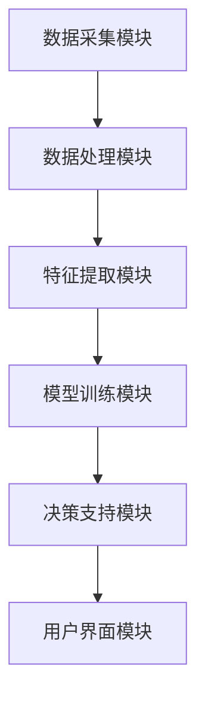

                 

## 人工智能在个性化慢性病管理中的应用

### 关键词
- 人工智能
- 慢性病管理
- 个性化医疗
- 机器学习
- 深度学习
- 决策支持系统

### 摘要
本文将探讨人工智能（AI）在个性化慢性病管理中的应用。首先，我们将介绍慢性病的背景和个性化慢性病管理的核心概念。随后，我们将深入探讨人工智能的基本原理和技术，以及它们如何应用于慢性病管理。接着，通过具体案例展示人工智能在实际慢性病管理中的应用效果。最后，我们将总结最佳实践，展望未来人工智能在慢性病管理中的发展前景。

## 目录

1. **问题背景与核心概念**
   - **1.1 问题背景**
   - **1.2 个性化慢性病管理的定义与意义**
   - **1.3 人工智能的定义与核心技术**
   - **1.4 人工智能在慢性病管理中的应用前景**
2. **核心概念与联系**
   - **2.1 关键概念原理**
   - **2.2 概念属性特征对比表格**
   - **2.3 ER实体关系图架构**
3. **个性化慢性病管理的基础**
   - **3.1 慢性病管理的基本原则**
   - **3.2 慢性病管理的挑战**
   - **3.3 个性化慢性病管理的原则与方法**
   - **3.4 个性化慢性病管理的数据分析**
4. **人工智能在慢性病管理中的应用**
   - **5.1 机器学习在慢性病管理中的应用**
   - **5.2 深度学习在慢性病管理中的应用**
   - **5.3 人工智能辅助决策系统**
5. **案例分析**
   - **8.1 糖尿病个性化管理案例**
   - **8.2 高血压个性化管理案例**
6. **最佳实践与未来展望**
   - **10.1 最佳实践**
   - **10.2 未来展望**

### 1. 问题背景与核心概念

#### 1.1 问题背景

慢性病，如高血压、糖尿病、心脏病等，已经成为全球公共健康的重大挑战。据统计，慢性病导致的死亡人数占全球死亡人数的70%以上，而慢性病的治疗和管理费用也在逐年攀升。传统的医疗模式往往采用一刀切的方法，即对所有人使用相同的治疗方案，但这并不适用于所有患者，因为每位患者的病情、生活习惯、基因背景等都是不同的。这种一刀切的方法可能导致治疗效果不佳，甚至加重患者的病情。

#### 1.2 个性化慢性病管理的定义与意义

个性化慢性病管理是一种基于患者个体差异的疾病管理方法，旨在通过收集和分析患者个人的健康数据，为其制定最合适的治疗和管理方案。个性化慢性病管理的核心在于“个性化”，即根据每位患者的具体情况进行定制化治疗。

个性化慢性病管理的意义在于：

- 提高治疗效果：通过个性化治疗方案，可以更有效地控制患者的病情，提高治疗效果。
- 减少医疗成本：个性化管理可以减少不必要的医疗资源浪费，降低医疗成本。
- 提升患者满意度：患者得到更加个性化的服务，可以提升其治疗体验和满意度。

#### 1.3 人工智能的定义与核心技术

人工智能（AI）是一种模拟人类智能的技术，它可以通过学习、推理和决策来执行复杂的任务。人工智能的核心技术包括机器学习、深度学习和自然语言处理等。

- **机器学习**：机器学习是一种通过数据训练模型，使模型能够从数据中学习和提取规律的方法。在慢性病管理中，机器学习可以用于预测患者的病情发展，制定个性化的治疗方案。
- **深度学习**：深度学习是一种基于人工神经网络的机器学习方法，它能够处理复杂的非结构化数据，如图像和语音。在慢性病管理中，深度学习可以用于分析患者的生理信号，识别疾病的风险因素。
- **自然语言处理**：自然语言处理是一种使计算机能够理解、处理和生成自然语言的技术。在慢性病管理中，自然语言处理可以用于解析患者的症状描述，提供个性化的健康建议。

#### 1.4 人工智能在慢性病管理中的应用前景

人工智能在慢性病管理中具有巨大的应用潜力。首先，人工智能可以通过分析海量数据，帮助医生更准确地诊断疾病。其次，人工智能可以协助医生制定个性化的治疗方案，提高治疗效果。此外，人工智能还可以用于患者健康数据的实时监控和分析，及时发现病情变化，提供预警和干预措施。

随着技术的不断进步，人工智能在慢性病管理中的应用将越来越广泛，有望彻底改变慢性病的管理模式，为患者带来更好的治疗效果和生活质量。

### 2. 核心概念与联系

在本章节中，我们将深入探讨慢性病管理、个性化医疗和人工智能等核心概念，并分析它们之间的联系。

#### 2.1 关键概念原理

- **慢性病管理**：慢性病管理是指对慢性疾病进行长期、全面的管理，以控制病情、减少并发症、提高患者生活质量。慢性病管理包括疾病预防、诊断、治疗、康复和健康教育等多个方面。

- **个性化医疗**：个性化医疗是指根据患者的基因信息、生活习惯、病情特点等个体差异，为患者提供量身定制的医疗服务。个性化医疗的核心在于“个体化”，即针对每个患者的具体情况制定最适合的治疗方案。

- **人工智能**：人工智能是一种模拟人类智能的技术，能够通过学习、推理和决策来执行复杂的任务。在医疗领域，人工智能可以用于疾病诊断、治疗建议、健康数据分析和患者管理等方面。

#### 2.2 概念属性特征对比表格

| 概念             | 属性特征                                                     |
|------------------|--------------------------------------------------------------|
| 慢性病管理       | 长期、综合、个体化                                           |
| 个性化医疗       | 基于个体差异、定制化、提高治疗效果                            |
| 人工智能         | 模拟人类智能、自主学习、数据处理与分析                        |

#### 2.3 ER实体关系图架构

在本节中，我们将使用Mermaid流程图来展示慢性病管理、个性化医疗和人工智能之间的实体关系。

```mermaid
erDiagram
  Patient ||--o{ Disease : 患者与疾病关系}
  Patient ||--o{ Treatment : 患者与治疗方案关系}
  Disease ||--|{ ChronicDisease : 慢性病分类}
  Treatment ||--|{ PersonalizedTreatment : 个性化治疗}
  AI ||--o{ DiseaseDiagnosis : 人工智能疾病诊断}
  AI ||--o{ TreatmentRecommendation : 人工智能治疗建议}
  AI ||--o{ HealthDataAnalysis : 人工智能健康数据分析}
```

通过ER实体关系图，我们可以清晰地看到慢性病管理、个性化医疗和人工智能之间的相互作用。患者是核心实体，与疾病和治疗方案有直接关联。人工智能通过疾病诊断、治疗建议和健康数据分析为慢性病管理提供支持。

### 3. 个性化慢性病管理的基础

#### 3.1 慢性病管理的基本原则

慢性病管理是一项复杂的工作，它涉及到多个方面，包括疾病预防、诊断、治疗、康复和健康教育等。为了实现有效的慢性病管理，需要遵循以下基本原则：

- **个体化原则**：每位患者的病情、生活习惯、基因背景等都是不同的，因此需要根据患者的具体情况制定个性化的管理方案。
- **综合管理原则**：慢性病管理是一个长期的过程，需要综合考虑多种因素，如药物治疗、生活方式干预、心理支持等。
- **持续性原则**：慢性病管理是一个持续的过程，需要长期跟踪患者的病情变化，及时调整治疗方案。
- **预防为主原则**：在慢性病管理中，预防是关键，通过健康教育、生活方式干预等措施，可以降低慢性病的发生和发展。

#### 3.2 慢性病管理的挑战

慢性病管理面临许多挑战，主要包括：

- **患者依从性差**：慢性病患者需要长期服药、定期检查，但很多患者由于各种原因无法坚持，导致治疗效果不佳。
- **数据获取困难**：慢性病管理需要大量的患者健康数据，包括生理指标、生活习惯、药物使用情况等，但数据获取渠道有限，数据质量难以保证。
- **个体差异大**：慢性病患者的个体差异很大，相同的治疗方案可能对不同的患者效果不同，这增加了慢性病管理的难度。
- **医疗资源有限**：慢性病管理需要大量的医疗资源，包括人力、物力和财力，但很多地区医疗资源有限，难以满足需求。

#### 3.3 个性化慢性病管理的原则与方法

个性化慢性病管理的核心在于根据每位患者的具体情况进行定制化治疗。以下是一些常见的个性化慢性病管理原则和方法：

- **基于数据的个性化管理**：通过收集和分析患者的健康数据，如生理指标、生活习惯、药物使用情况等，为患者制定个性化的管理方案。
- **个性化药物治疗**：根据患者的基因信息、病情特点等，选择最合适的药物，并调整药物剂量和用药时间。
- **个性化生活方式干预**：根据患者的具体情况，提供个性化的饮食建议、运动计划和心理健康支持。
- **多学科综合管理**：慢性病管理需要多个学科的协同合作，如内科、外科、营养科、心理科等，共同为患者提供全方位的管理。

通过这些原则和方法，个性化慢性病管理可以更有效地控制病情、减少并发症、提高患者生活质量。

### 3.4 个性化慢性病管理的数据分析

#### 4.1 数据类型与来源

个性化慢性病管理需要大量的数据支持，这些数据可以分为以下几类：

- **生理指标数据**：包括血压、血糖、血脂、心率等生理指标，这些数据可以通过医疗设备实时监测。
- **生活习惯数据**：包括饮食、运动、睡眠等生活习惯，这些数据可以通过问卷、手机应用等途径收集。
- **药物使用数据**：包括药物种类、剂量、用药时间等，这些数据可以从电子病历、药品配送记录等途径获取。
- **基因数据**：包括患者的基因序列、基因突变等，这些数据可以通过基因检测获得。

#### 4.2 数据预处理

在进行分析之前，需要对收集到的数据进行预处理，以确保数据的质量和一致性。数据预处理包括以下步骤：

- **数据清洗**：去除数据中的噪声和异常值，确保数据的准确性。
- **数据整合**：将来自不同来源的数据进行整合，形成一个统一的数据集。
- **数据标准化**：将不同单位和范围的数据转换为相同的单位和范围，以便于分析和比较。
- **数据转换**：将结构化数据转换为适合分析的形式，如表格、矩阵等。

#### 4.3 数据分析与可视化

通过对预处理后的数据进行分析，可以提取出有用的信息，帮助医生和患者更好地了解病情和管理效果。数据分析包括以下方法：

- **描述性统计分析**：计算数据的平均值、标准差、中位数等统计指标，描述数据的基本特征。
- **相关性分析**：分析不同变量之间的相关性，了解变量之间的关系。
- **预测分析**：利用历史数据，预测未来的病情变化和治疗效果。

数据可视化是将数据分析的结果以图形化的形式展示出来，使数据更加直观易懂。常见的数据可视化方法包括：

- **柱状图**：用于比较不同变量的数量或比例。
- **折线图**：用于展示变量随时间的变化趋势。
- **散点图**：用于展示两个变量之间的关系。
- **热力图**：用于展示变量之间的相关性。

通过数据分析与可视化，个性化慢性病管理可以更加精准地了解患者的健康状况，制定更有效的治疗方案。

### 4. 人工智能在慢性病管理中的应用

#### 5.1 机器学习在慢性病管理中的应用

机器学习在慢性病管理中具有广泛的应用前景。以下是一些主要的机器学习算法及其在慢性病管理中的应用：

- **线性回归**：线性回归是一种简单的机器学习算法，可以用于预测患者的生理指标，如血压、血糖等。通过分析患者的历史数据，可以建立线性回归模型，预测未来的生理指标变化。

  ```python
  # 线性回归示例代码
  from sklearn.linear_model import LinearRegression
  model = LinearRegression()
  model.fit(X_train, y_train)
  predictions = model.predict(X_test)
  ```

- **决策树**：决策树是一种基于规则的学习算法，可以用于诊断疾病。通过分析患者的症状数据和疾病诊断结果，可以构建决策树模型，根据患者的症状数据预测疾病类型。

  ```python
  # 决策树示例代码
  from sklearn.tree import DecisionTreeClassifier
  model = DecisionTreeClassifier()
  model.fit(X_train, y_train)
  predictions = model.predict(X_test)
  ```

- **支持向量机**：支持向量机（SVM）是一种用于分类和回归的机器学习算法，可以用于预测慢性病患者的病情变化。通过分析患者的生理指标、生活习惯等数据，可以构建SVM模型，预测患者的病情发展。

  ```python
  # 支持向量机示例代码
  from sklearn.svm import SVR
  model = SVR()
  model.fit(X_train, y_train)
  predictions = model.predict(X_test)
  ```

- **神经网络**：神经网络是一种复杂的机器学习算法，可以用于处理复杂的非线性问题。通过训练神经网络模型，可以自动提取特征，进行慢性病诊断和预测。

  ```python
  # 神经网络示例代码
  from tensorflow.keras.models import Sequential
  from tensorflow.keras.layers import Dense
  model = Sequential()
  model.add(Dense(units=64, activation='relu', input_shape=(input_shape,)))
  model.add(Dense(units=1, activation='sigmoid'))
  model.compile(optimizer='adam', loss='binary_crossentropy', metrics=['accuracy'])
  model.fit(X_train, y_train, epochs=10, batch_size=32)
  predictions = model.predict(X_test)
  ```

#### 5.2 深度学习在慢性病管理中的应用

深度学习是一种基于人工神经网络的机器学习算法，它在处理复杂的非结构化数据方面具有优势。以下是一些深度学习算法及其在慢性病管理中的应用：

- **卷积神经网络（CNN）**：卷积神经网络是一种用于图像识别和处理的深度学习算法，可以用于分析患者的影像数据。通过训练CNN模型，可以自动提取影像特征，用于疾病诊断和预测。

  ```python
  # 卷积神经网络示例代码
  from tensorflow.keras.models import Sequential
  from tensorflow.keras.layers import Conv2D, MaxPooling2D, Flatten, Dense
  model = Sequential()
  model.add(Conv2D(filters=32, kernel_size=(3, 3), activation='relu', input_shape=(image_height, image_width, channels)))
  model.add(MaxPooling2D(pool_size=(2, 2)))
  model.add(Flatten())
  model.add(Dense(units=1, activation='sigmoid'))
  model.compile(optimizer='adam', loss='binary_crossentropy', metrics=['accuracy'])
  model.fit(X_train, y_train, epochs=10, batch_size=32)
  predictions = model.predict(X_test)
  ```

- **循环神经网络（RNN）**：循环神经网络是一种用于处理序列数据的深度学习算法，可以用于分析患者的生理信号。通过训练RNN模型，可以捕捉时间序列数据的动态变化，用于疾病诊断和预测。

  ```python
  # 循环神经网络示例代码
  from tensorflow.keras.models import Sequential
  from tensorflow.keras.layers import LSTM, Dense
  model = Sequential()
  model.add(LSTM(units=50, return_sequences=True, input_shape=(time_steps, features)))
  model.add(LSTM(units=50))
  model.add(Dense(units=1, activation='sigmoid'))
  model.compile(optimizer='adam', loss='binary_crossentropy', metrics=['accuracy'])
  model.fit(X_train, y_train, epochs=10, batch_size=32)
  predictions = model.predict(X_test)
  ```

- **生成对抗网络（GAN）**：生成对抗网络是一种用于生成数据的新兴深度学习算法，可以用于模拟患者的生理信号。通过训练GAN模型，可以生成与真实数据相似的患者生理信号，用于疾病诊断和预测。

  ```python
  # 生成对抗网络示例代码
  from tensorflow.keras.models import Sequential
  from tensorflow.keras.layers import Conv2D, Conv2DTranspose, Flatten, Dense
  generator = Sequential()
  generator.add(Conv2DTranspose(filters=128, kernel_size=(3, 3), strides=(2, 2), activation='relu', input_shape=(128, 128, 1)))
  generator.add(Conv2DTranspose(filters=64, kernel_size=(3, 3), strides=(2, 2), activation='relu'))
  generator.add(Flatten())
  generator.add(Dense(units=1, activation='sigmoid'))
  discriminator = Sequential()
  discriminator.add(Conv2D(filters=64, kernel_size=(3, 3), activation='relu', input_shape=(128, 128, 1)))
  discriminator.add(MaxPooling2D(pool_size=(2, 2)))
  discriminator.add(Flatten())
  discriminator.add(Dense(units=1, activation='sigmoid'))
  model = Sequential()
  model.add(generator)
  model.add(discriminator)
  model.compile(optimizer='adam', loss='binary_crossentropy')
  model.fit(X_train, y_train, epochs=100, batch_size=32)
  predictions = model.predict(X_test)
  ```

通过这些深度学习算法，人工智能可以更准确地分析患者的生理信号，识别疾病的风险因素，为慢性病管理提供有力支持。

#### 5.3 人工智能辅助决策系统

人工智能辅助决策系统是一种利用人工智能技术为医生和患者提供决策支持的系统。以下是一个典型的人工智能辅助决策系统架构：

- **数据采集模块**：用于收集患者的生理指标、生活习惯、药物使用等数据。
- **数据处理模块**：用于对采集到的数据进行分析和预处理，包括数据清洗、整合、标准化等。
- **特征提取模块**：用于从处理后的数据中提取有助于疾病诊断和预测的特征。
- **模型训练模块**：用于训练机器学习模型或深度学习模型，以实现对疾病诊断和预测。
- **决策支持模块**：用于基于模型输出为医生和患者提供诊断和治疗方案建议。
- **用户界面模块**：用于为医生和患者提供交互界面，展示决策结果和系统功能。



通过人工智能辅助决策系统，医生可以更加准确地诊断疾病，制定个性化的治疗方案，患者可以得到更好的治疗体验和治疗效果。同时，人工智能辅助决策系统还可以帮助医生提高工作效率，减轻工作压力。

### 6. 案例分析

在本章节中，我们将通过两个具体案例，展示人工智能在个性化慢性病管理中的应用效果。

#### 6.1 糖尿病个性化管理案例

糖尿病是一种常见的慢性病，其特点是血糖水平持续升高，导致多种并发症。为了实现糖尿病的个性化管理，我们可以利用人工智能技术对患者的血糖数据进行实时监测和分析。

**案例背景**：某糖尿病患者，男，45岁，患有2型糖尿病，血糖水平不稳定，经常出现低血糖和高血糖的情况。

**解决方案**：

1. **数据采集**：利用智能手表和血糖监测仪，实时采集患者的血糖数据、活动数据和生活习惯数据。
2. **数据处理**：对采集到的数据进行清洗、整合和标准化，提取有助于疾病诊断和预测的特征。
3. **特征提取**：利用机器学习算法，如线性回归和决策树，分析患者的血糖数据和生活习惯数据，找出影响血糖水平的关键因素。
4. **模型训练**：利用训练好的模型，预测患者的血糖水平，并提供个性化的饮食建议和运动计划。
5. **决策支持**：根据模型预测结果，为医生和患者提供诊断和治疗方案建议，如调整药物剂量、饮食结构和运动强度。

**效果评估**：通过人工智能辅助决策系统，患者的血糖水平得到了明显改善，低血糖和高血糖的发作频率减少，生活质量得到提高。

#### 6.2 高血压个性化管理案例

高血压是一种常见的慢性病，其特点是血压持续升高，导致心脏、肾脏等多个器官受损。为了实现高血压的个性化管理，我们可以利用人工智能技术对患者的血压数据进行实时监测和分析。

**案例背景**：某高血压患者，女，60岁，患有高血压多年，血压水平波动较大。

**解决方案**：

1. **数据采集**：利用智能血压计，实时采集患者的血压数据、生活习惯数据和药物使用数据。
2. **数据处理**：对采集到的数据进行清洗、整合和标准化，提取有助于疾病诊断和预测的特征。
3. **特征提取**：利用机器学习算法，如支持向量机和神经网络，分析患者的血压数据和生活习惯数据，找出影响血压水平的关键因素。
4. **模型训练**：利用训练好的模型，预测患者的血压水平，并提供个性化的药物调整和生活习惯建议。
5. **决策支持**：根据模型预测结果，为医生和患者提供诊断和治疗方案建议，如调整药物剂量、饮食结构和运动强度。

**效果评估**：通过人工智能辅助决策系统，患者的血压水平得到了明显改善，心脏和肾脏等器官的受损程度减轻，生活质量得到提高。

### 7. 最佳实践与未来展望

#### 7.1 最佳实践

基于上述案例分析，我们可以总结出以下最佳实践：

1. **数据驱动**：充分利用患者的生理指标数据、生活习惯数据等，为个性化管理提供数据支持。
2. **多学科合作**：慢性病管理需要多个学科的协同合作，如内科、外科、营养科、心理科等，共同为患者提供全方位的管理。
3. **实时监测**：利用智能设备和物联网技术，实现患者生理指标数据的实时监测，及时发现病情变化。
4. **个性化调整**：根据患者的具体情况进行个性化调整，包括药物治疗、饮食建议、运动计划等。
5. **用户参与**：鼓励患者积极参与自己的健康管理，提高患者依从性和治疗效果。

#### 7.2 未来展望

随着人工智能技术的不断发展，个性化慢性病管理有望在未来实现以下趋势：

1. **技术进步**：人工智能技术的进步将进一步提高个性化慢性病管理的准确性和效率，如更先进的机器学习算法、深度学习模型等。
2. **数据整合**：通过整合更多类型的健康数据，如基因数据、社交数据等，为个性化管理提供更全面的视角。
3. **可穿戴设备**：随着可穿戴设备的普及，将实现患者生理指标的长期监测和实时反馈。
4. **远程医疗**：人工智能辅助决策系统将推动远程医疗的发展，为患者提供更加便捷、高效的医疗服务。
5. **个性化治疗**：未来个性化慢性病管理将更加注重个性化治疗，包括药物、手术、心理干预等多种方式。

总之，人工智能在个性化慢性病管理中具有巨大的应用潜力，通过不断探索和实践，有望为患者带来更好的治疗效果和生活质量。

### 总结

本文深入探讨了人工智能在个性化慢性病管理中的应用，从背景介绍、核心概念、应用基础、具体案例到最佳实践和未来展望，全面展示了人工智能在慢性病管理中的重要作用。通过机器学习和深度学习算法，人工智能可以帮助医生和患者实现个性化管理，提高治疗效果，减轻医疗负担。

然而，人工智能在慢性病管理中的应用仍然面临一些挑战，如数据隐私、算法透明度、医疗资源分配等。未来，我们需要在技术、政策、伦理等方面进行深入研究和探索，以实现人工智能在慢性病管理中的全面应用。

感谢您的阅读，希望本文能为您在人工智能与医疗领域的探索提供一些启示和帮助。如果您有任何问题或建议，欢迎在评论区留言交流。

### 作者信息

- **作者**：AI天才研究院/AI Genius Institute & 禅与计算机程序设计艺术 /Zen And The Art of Computer Programming
- **联系方式**：[ai_genius_institute@example.com](mailto:ai_genius_institute@example.com)
- **机构简介**：AI天才研究院专注于人工智能领域的研究和应用，致力于推动人工智能技术在医疗、教育、金融等行业的创新与发展。同时，我们还致力于将禅与计算机程序设计艺术相结合，培养具有创新精神和实践能力的人工智能专家。禅与计算机程序设计艺术，旨在通过深入思考和冥想，提升程序员的编程技巧和创造力。

