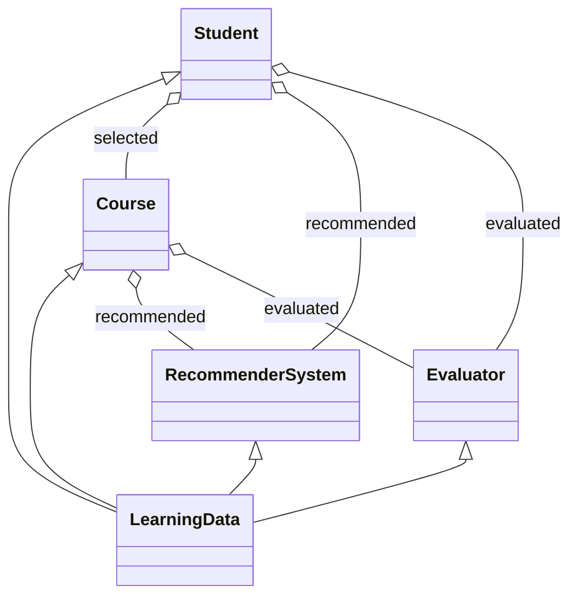
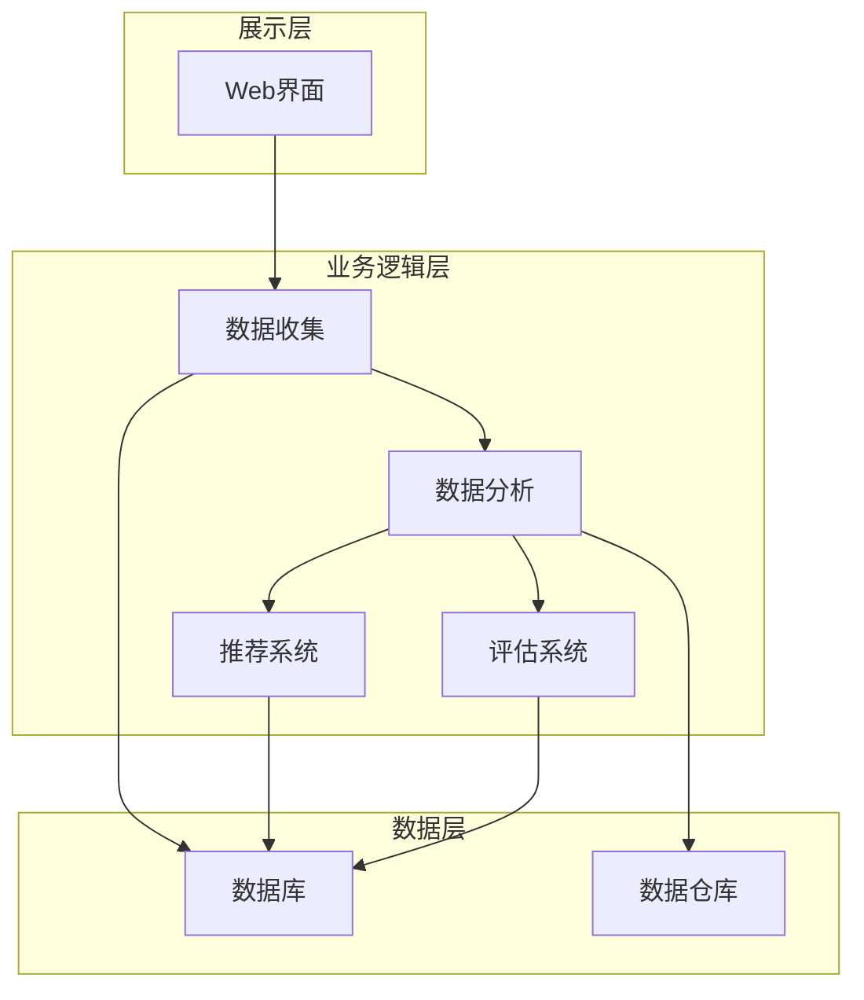
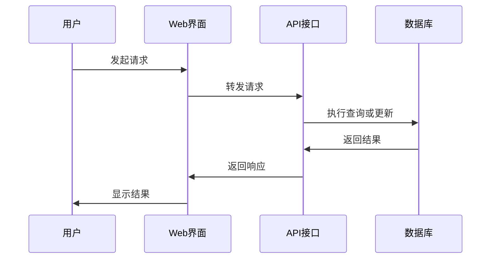

                 

### 目录大纲

----------------------------------------------------------------
## 第一部分：背景介绍

### 第1章 问题背景

#### 1.1 人工智能在个性化教育中的重要性

- 个性化教育的需求与挑战
- 人工智能技术在教育领域的应用现状

#

----------------------------------------------------------------

**核心概念术语说明：**
- **个性化教育**：根据学生的个体差异，为其提供最适合的学习资源、方法和服务，以提高学习效果和兴趣。
- **人工智能**：通过模拟人类思维和行为，实现智能决策和自动化处理的计算机技术。

**问题背景：**
随着教育的普及和信息化的推进，传统教育模式已难以满足不同学生的个性化需求。人工智能技术的发展为个性化教育提供了新的可能，通过数据分析、机器学习和智能算法，可以实现因材施教，提升教育质量和效率。

**问题描述：**
在当前教育体系中，如何有效地利用人工智能技术，实现教育的个性化，成为亟待解决的问题。

**问题解决：**
通过结合人工智能技术，构建个性化教育系统，可以根据学生的学习行为、知识水平和兴趣，提供个性化的学习方案，从而实现因材施教。

**边界与外延：**
个性化教育的范围不仅限于学科知识的传授，还包括学生综合素质的培养、学习习惯的塑造等。

**概念结构与核心要素组成：**
- **学习数据收集与分析**：收集学生的学习数据，如学习时间、学习进度、考试成绩等，进行数据分析。
- **智能推荐系统**：基于学习数据分析，为学生推荐适合的学习资源和学习路径。
- **自适应学习平台**：构建自适应学习平台，实现学习内容的动态调整和个性化推送。

**人工智能在个性化教育中的核心作用：**
- **个性化教学设计**：利用人工智能技术分析学生的知识水平和学习习惯，为学生量身定制教学方案。
- **学习效果评估**：通过智能算法评估学生的学习效果，提供反馈，指导后续教学。
- **教育资源优化**：通过智能算法优化教育资源的配置，提高资源利用效率。

---

**现状：**
人工智能技术在个性化教育中的应用已初见成效，但面临数据隐私保护、算法透明度和教师接受度等挑战。

---

通过以上分析，我们可以看到，人工智能在个性化教育中具有广阔的应用前景，但也需要解决一系列技术和社会问题。接下来，我们将进一步探讨个性化教育中的关键算法原理，为构建高效的个性化教育系统奠定基础。### 第1章 问题背景

---

#### 1.1 人工智能在个性化教育中的重要性

随着全球教育体系的不断发展和完善，教育的个性化和差异化需求日益凸显。传统的一刀切教育模式已经难以满足不同学生的个性化需求，而人工智能（AI）技术的发展为个性化教育带来了新的契机。个性化教育，顾名思义，是指根据每个学生的学习需求、知识水平、兴趣爱好和能力特点，量身定制教学计划、学习资源和学习路径，从而实现因材施教，最大化提高学习效果。

**个性化教育的需求与挑战：**

1. **学生的多样化需求**：每个学生的认知能力、学习习惯、兴趣爱好和学习风格都存在差异，传统的教育模式难以全面满足这些多样化的需求。
2. **教育资源的不均衡**：在全球范围内，教育资源的分配存在不均衡现象，尤其在偏远地区和经济不发达地区，教育资源更加稀缺。
3. **教育评价体系的单一性**：现有的教育评价体系大多以考试成绩作为主要衡量标准，忽视了学生的综合素质和个性化发展。

**人工智能技术在教育领域的应用现状：**

1. **智能推荐系统**：基于大数据分析和机器学习算法，智能推荐系统能够根据学生的兴趣和学习历史，推荐个性化的学习资源和课程。
2. **自适应学习平台**：自适应学习平台能够根据学生的学习进度和能力水平，动态调整教学内容的难度和深度，提供个性化的学习路径。
3. **智能评估系统**：利用自然语言处理和图像识别等技术，智能评估系统能够对学生的学习效果进行实时评估，提供个性化的反馈和建议。

**人工智能如何实现个性化教育：**

1. **数据驱动**：人工智能技术可以通过收集和分析学生的学习行为数据，了解学生的学习偏好和知识掌握情况，从而制定个性化的教学计划。
2. **智能算法**：通过机器学习和深度学习算法，人工智能可以分析学生的数据，预测其学习成果，并提供个性化的学习资源。
3. **人机交互**：人工智能技术能够通过自然语言处理和语音识别等技术，与学生进行互动，提供个性化辅导和指导。

**人工智能在个性化教育中的关键作用：**

1. **优化教育资源分配**：人工智能技术可以分析教育资源的利用情况，优化资源配置，提高教育资源的利用效率。
2. **提升教学效果**：通过个性化教学方案和学习资源的推荐，提高学生的学习兴趣和参与度，从而提升教学效果。
3. **促进教育公平**：利用人工智能技术，可以缩小地区和群体之间的教育差距，促进教育公平。

综上所述，人工智能在个性化教育中具有举足轻重的作用。它不仅能够满足学生多样化的学习需求，还能够优化教育资源配置，提升教学效果，推动教育公平。然而，人工智能在个性化教育中的应用也面临着一些挑战，如数据隐私保护、算法透明度和教师接受度等，这些都需要在未来的发展中得到妥善解决。

---

接下来，我们将进一步探讨个性化教育的核心概念和人工智能的相关技术，以便更好地理解人工智能在个性化教育中的具体应用和实现方法。

---

**核心概念与联系：**

**个性化教育：**
- **定义**：个性化教育是根据学生的个体差异，为其提供最适合的学习资源、方法和服务，以提高学习效果和兴趣。
- **属性与特征**：
  - **个体差异**：强调根据每个学生的学习需求、知识水平、兴趣爱好和能力特点进行教学。
  - **因材施教**：根据学生的不同特点，采用不同的教学策略和资源，以达到最佳的学习效果。

**人工智能：**
- **定义**：人工智能是通过模拟人类思维和行为，实现智能决策和自动化处理的计算机技术。
- **技术类型与应用场景**：
  - **机器学习**：通过数据训练模型，使计算机能够从数据中自动学习和发现规律。
  - **深度学习**：基于人工神经网络的深度学习算法，能够处理大规模数据，实现复杂的模式识别和决策。
  - **自然语言处理**：使计算机能够理解和生成自然语言，实现人机对话。
  - **应用场景**：
    - **智能推荐系统**：根据用户行为和偏好，推荐个性化的学习资源和课程。
    - **自适应学习平台**：根据学生的学习进度和能力，动态调整教学内容的难度和深度。
    - **智能评估系统**：实时评估学生的学习效果，提供个性化的反馈和建议。

---

通过以上分析，我们可以看到个性化教育和人工智能在目标、方法和应用上具有紧密的联系。个性化教育的核心在于满足学生的个性化需求，而人工智能技术则为实现这一目标提供了强有力的支持。接下来，我们将进一步探讨个性化教育中的关键算法原理，为构建高效的个性化教育系统奠定基础。

---

**算法概述：**

在个性化教育中，常用的算法主要包括以下几类：

1. **推荐算法**：通过分析学生的历史学习数据、考试成绩、学习进度等信息，推荐适合的学习资源和课程。常见的推荐算法有协同过滤算法、基于内容的推荐算法和混合推荐算法。
2. **聚类算法**：将学生根据其学习行为、成绩、兴趣爱好等进行分类，以便于提供个性化的教学方案。常见的聚类算法有K-means、DBSCAN和层次聚类等。
3. **回归算法**：通过分析学生的学习数据，预测其学习成果或评估其知识掌握情况，从而调整教学策略。常见的回归算法有线性回归、决策树回归和随机森林等。
4. **分类算法**：将学生根据其学习行为和成绩进行分类，以便于提供个性化的辅导和指导。常见的分类算法有逻辑回归、支持向量机和K近邻算法等。

每种算法都有其独特的特点和应用场景，下面我们将详细讲解这些算法的工作原理和应用。

#### 2.2 算法原理讲解

##### 推荐算法

**协同过滤算法**：
- **工作原理**：协同过滤算法通过分析用户之间的相似度，预测用户可能感兴趣的项目。它分为两种类型：基于用户的协同过滤和基于物品的协同过滤。
  - **基于用户的协同过滤**：寻找与目标用户行为相似的其他用户，根据这些用户的评分预测目标用户的评分。
  - **基于物品的协同过滤**：寻找与目标物品相似的物品，根据其他用户对相似物品的评分预测目标物品的评分。

- **Mermaid流程图**：
  ```mermaid
  graph TD
  A[选择用户] --> B[计算相似度]
  B --> C{是否相似}
  C -->|是| D[查找相似用户]
  C -->|否| E[计算相似物品]
  D --> F[推荐项目]
  E --> F
  ```

- **算法流程**：
  1. 收集用户行为数据（如学习历史、评分记录等）。
  2. 计算用户之间的相似度（如余弦相似度、皮尔逊相似度等）。
  3. 筛选相似度较高的用户或物品。
  4. 根据相似度推荐项目。

**基于内容的推荐算法**：
- **工作原理**：基于内容的推荐算法通过分析项目的内容特征，推荐与用户历史偏好相似的项目。
- **Mermaid流程图**：
  ```mermaid
  graph TD
  A[分析项目内容] --> B[提取特征]
  B --> C[计算相似度]
  C --> D[推荐项目]
  ```

- **算法流程**：
  1. 提取项目的内容特征（如关键词、主题等）。
  2. 计算用户与项目之间的内容相似度。
  3. 根据相似度推荐项目。

**混合推荐算法**：
- **工作原理**：混合推荐算法结合协同过滤和基于内容的推荐算法，以提高推荐效果。
- **Mermaid流程图**：
  ```mermaid
  graph TD
  A[协同过滤] --> B[内容推荐]
  B --> C[融合推荐]
  ```

- **算法流程**：
  1. 使用协同过滤算法推荐项目。
  2. 使用基于内容的推荐算法推荐项目。
  3. 结合两种推荐结果，生成最终的推荐列表。

##### 聚类算法

**K-means算法**：
- **工作原理**：K-means算法通过将数据点分为K个簇，使每个簇内的数据点之间距离最小，簇与簇之间的距离最大。
- **Mermaid流程图**：
  ```mermaid
  graph TD
  A[初始化中心点] --> B[分配数据点]
  B --> C{计算距离}
  C -->|最小距离| D[更新中心点]
  D --> B
  ```

- **算法流程**：
  1. 随机选择K个中心点。
  2. 计算每个数据点到中心点的距离，将数据点分配到最近的中心点。
  3. 根据新的中心点重新分配数据点。
  4. 重复步骤2和3，直到中心点不再变化或达到最大迭代次数。

**DBSCAN算法**：
- **工作原理**：DBSCAN（Density-Based Spatial Clustering of Applications with Noise）算法根据数据点的密度分布将数据分为簇，对噪声和异常值具有较好的处理能力。
- **Mermaid流程图**：
  ```mermaid
  graph TD
  A[计算邻域点] --> B[判断密度]
  B -->|核心点| C[创建簇]
  B -->|边界点| D[标记噪声]
  ```

- **算法流程**：
  1. 计算每个数据点的邻域点。
  2. 判断邻域点是否满足核心点或边界点的条件。
  3. 将满足条件的点分配到同一个簇中。
  4. 对于噪声点，不予分类。

**层次聚类算法**：
- **工作原理**：层次聚类算法通过不断合并或分裂簇，形成层次结构，没有固定簇数。
- **Mermaid流程图**：
  ```mermaid
  graph TB
  A[初始聚类] --> B[计算距离]
  B --> C{最小距离}
  C -->|合并| D[更新聚类]
  D --> E{是否继续}
  E -->|是| F[计算新的距离]
  E -->|否| G[结束]
  ```

- **算法流程**：
  1. 选择初始聚类。
  2. 计算聚类之间的距离。
  3. 合并距离最近的聚类。
  4. 重复步骤2和3，直到满足终止条件。

##### 回归算法

**线性回归**：
- **工作原理**：线性回归通过建立自变量和因变量之间的线性关系模型，预测因变量的值。
- **Mermaid流程图**：
  ```mermaid
  graph TD
  A[收集数据] --> B[计算斜率b]
  B --> C[计算截距a]
  C --> D[建立模型]
  ```

- **算法流程**：
  1. 收集数据集，包括自变量和因变量。
  2. 计算斜率b，公式为b = (Σ(xy) - n*mean(x)*mean(y)) / (Σ(x^2) - n*mean(x)^2)。
  3. 计算截距a，公式为a = mean(y) - b*mean(x)。
  4. 建立线性回归模型y = a + bx。

**决策树回归**：
- **工作原理**：决策树回归通过递归划分特征空间，建立决策树模型，每个节点代表特征划分，叶子节点代表预测值。
- **Mermaid流程图**：
  ```mermaid
  graph TD
  A[选择特征] --> B[计算信息增益]
  B --> C{最大增益}
  C -->|是| D[划分数据]
  D -->|否| E[继续划分]
  ```

- **算法流程**：
  1. 计算每个特征的信息增益，选择信息增益最大的特征进行划分。
  2. 根据特征划分数据集，生成决策树。
  3. 对新的数据集进行递归划分，直到满足终止条件。

**随机森林回归**：
- **工作原理**：随机森林回归通过构建多个决策树，并对每个树的预测结果进行投票，得到最终的预测结果。
- **Mermaid流程图**：
  ```mermaid
  graph TD
  A[生成随机样本] --> B[构建决策树]
  B --> C[投票预测]
  ```

- **算法流程**：
  1. 从原始数据集中生成多个随机样本。
  2. 对每个随机样本构建决策树。
  3. 对每个样本的预测结果进行投票，得到最终的预测结果。

##### 分类算法

**逻辑回归**：
- **工作原理**：逻辑回归通过建立自变量和因变量之间的逻辑关系模型，预测因变量的概率。
- **Mermaid流程图**：
  ```mermaid
  graph TD
  A[收集数据] --> B[计算概率]
  B --> C[建立模型]
  ```

- **算法流程**：
  1. 收集数据集，包括自变量和因变量。
  2. 计算概率，公式为P(y=1) = 1 / (1 + exp(-z))，其中z = Σ(wx) + b。
  3. 训练模型，得到权重w和偏置b。

**支持向量机（SVM）**：
- **工作原理**：支持向量机通过找到一个最优的超平面，将不同类别的数据点分开。
- **Mermaid流程图**：
  ```mermaid
  graph TD
  A[选择特征] --> B[计算间隔]
  B --> C{最大间隔}
  C --> D[确定超平面]
  ```

- **算法流程**：
  1. 选择特征，计算特征空间中的间隔。
  2. 选择具有最大间隔的特征，确定超平面。
  3. 训练模型，得到支持向量。

**K近邻算法（KNN）**：
- **工作原理**：K近邻算法通过计算新数据点与训练数据点的相似度，基于多数投票原则进行分类。
- **Mermaid流程图**：
  ```mermaid
  graph TD
  A[计算距离] --> B[选择K个近邻]
  B --> C[投票分类]
  ```

- **算法流程**：
  1. 计算新数据点与训练数据点之间的距离。
  2. 选择距离最近的K个近邻。
  3. 根据多数投票原则，对新数据点进行分类。

通过以上算法的介绍，我们可以看到个性化教育中的算法原理和应用方法。接下来，我们将进一步探讨数学模型和数学公式，为算法的实现提供理论基础。

---

### 第3章 数学模型基础

#### 3.1 数学模型概述

数学模型在个性化教育中扮演着至关重要的角色，它能够将复杂的现实问题转化为可计算的数学问题，从而为个性化教育提供决策支持。数学模型在个性化教育中的应用主要包括以下几个方面：

1. **学习数据收集与分析**：通过数学模型分析学生的学习行为、考试成绩、学习进度等数据，了解学生的学习情况，为个性化教学提供依据。
2. **智能推荐系统**：利用数学模型计算用户与项目之间的相似度，为用户提供个性化的学习资源推荐。
3. **自适应学习平台**：通过数学模型动态调整教学内容的难度和深度，满足学生的个性化需求。

**常见的数学模型类型：**

1. **概率模型**：如贝叶斯模型，用于计算事件发生的概率。
2. **回归模型**：如线性回归、多项式回归、逻辑回归等，用于预测变量之间的关系。
3. **聚类模型**：如K-means、DBSCAN、层次聚类等，用于将数据点划分为不同的簇。
4. **分类模型**：如支持向量机、决策树、随机森林、K近邻等，用于对数据进行分类。

这些数学模型在不同的应用场景中发挥着重要作用，为个性化教育提供了强有力的工具。

#### 3.2 数学公式推导

在个性化教育中，常用的数学公式包括概率计算、回归分析、聚类分析等。以下我们将对这些常用的数学公式进行推导。

**1. 概率计算公式**

**条件概率公式：**
$$ P(A|B) = \frac{P(A \cap B)}{P(B)} $$

**贝叶斯公式：**
$$ P(A|B) = \frac{P(B|A) \cdot P(A)}{P(B)} $$

**2. 回归分析公式**

**线性回归公式：**
$$ y = \beta_0 + \beta_1 \cdot x + \epsilon $$

其中，$y$为因变量，$x$为自变量，$\beta_0$为截距，$\beta_1$为斜率，$\epsilon$为误差项。

**最小二乘法计算斜率：**
$$ \beta_1 = \frac{\sum{(x_i - \bar{x})(y_i - \bar{y})}}{\sum{(x_i - \bar{x})^2}} $$

**3. 聚类分析公式**

**K-means算法：**

**簇中心计算：**
$$ \mu_k = \frac{1}{N_k} \sum_{i=1}^{N_k} x_i $$

其中，$\mu_k$为第$k$个簇的中心，$N_k$为第$k$个簇中的数据点个数，$x_i$为第$i$个数据点的特征向量。

**数据点分配：**
$$ C(x) = \min_k \{ ||x - \mu_k|| \} $$

其中，$C(x)$为将数据点$x$分配到的簇，$\mu_k$为第$k$个簇的中心，$|| \cdot ||$为欧几里得距离。

**4. 分类分析公式**

**支持向量机（SVM）：**

**间隔计算：**
$$ \gamma = \frac{1}{2} \sum_{i=1}^{n} \sum_{j=1}^{n} y_i y_j (w \cdot x_i - w \cdot x_j)^2 $$

其中，$w$为超平面参数，$x_i$和$x_j$为数据点的特征向量，$y_i$和$y_j$为数据点的标签。

**优化目标：**
$$ \min_w \gamma $$

通过以上数学公式，我们可以更好地理解和应用个性化教育中的各种算法，为构建高效的个性化教育系统提供理论基础。

#### 3.3 数学模型应用与解释

在个性化教育中，数学模型的应用贯穿于整个教育过程，从学习数据的收集与分析，到推荐系统的构建，再到自适应学习平台的设计，都离不开数学模型的支持。以下是几个典型的数学模型在实际应用中的案例和解释。

**1. 学习数据收集与分析**

在学习数据收集与分析中，常用的数学模型包括线性回归、聚类分析和时间序列分析等。

**案例：线性回归模型在学习数据收集中的应用**

假设我们想要分析学生的学习成绩与其学习时间之间的关系。首先，我们需要收集学生的学习时间和对应的考试成绩数据。然后，通过线性回归模型建立两者之间的数学关系。

**数学模型**：
$$ y = \beta_0 + \beta_1 \cdot x + \epsilon $$

其中，$y$代表考试成绩，$x$代表学习时间，$\beta_0$是截距，$\beta_1$是斜率，$\epsilon$是误差项。

通过最小二乘法，我们可以计算出斜率$\beta_1$：
$$ \beta_1 = \frac{\sum{(x_i - \bar{x})(y_i - \bar{y})}}{\sum{(x_i - \bar{x})^2}} $$

**解释**：
这个模型可以帮助我们预测给定学习时间下的考试成绩。例如，如果学生的平均学习时间是10小时，我们可以预测他的考试成绩大约为：
$$ y = \beta_0 + \beta_1 \cdot 10 + \epsilon $$

通过调整学习时间，我们可以优化考试成绩。

**2. 智能推荐系统**

智能推荐系统是个性化教育的重要组成部分，它能够根据学生的学习历史和兴趣推荐适合的学习资源和课程。

**案例：基于协同过滤算法的推荐系统**

协同过滤算法通过分析用户之间的相似度，推荐用户可能感兴趣的项目。假设我们有两个用户A和B，他们的兴趣相似，根据他们的评分历史，我们可以使用余弦相似度来计算他们之间的相似度。

**数学模型**：
$$ \text{相似度} = \frac{\sum{(r_{ai} \cdot r_{bi})}}{\sqrt{\sum{(r_{ai}^2)} \cdot \sum{(r_{bi}^2)}}} $$

其中，$r_{ai}$和$r_{bi}$分别是用户A对项目i的评分和用户B对项目i的评分。

**解释**：
通过计算用户A和B之间的相似度，我们可以推荐用户B对项目i的评分较高的项目给用户A。例如，如果用户A对项目1评分5，用户B对项目1和项目2的评分都是5，那么用户B对项目2的评分可能也会较高，我们可以推荐项目2给用户A。

**3. 自适应学习平台**

自适应学习平台能够根据学生的学习进度和能力动态调整教学内容的难度和深度，提供个性化的学习体验。

**案例：基于K-means算法的自适应学习平台**

K-means算法可以将学生根据其学习行为和成绩分为不同的簇，每个簇代表一类学生。平台可以根据每个簇的特点提供相应的教学内容。

**数学模型**：
$$ \mu_k = \frac{1}{N_k} \sum_{i=1}^{N_k} x_i $$
$$ C(x) = \min_k \{ ||x - \mu_k|| \} $$

其中，$\mu_k$是第$k$个簇的中心，$N_k$是第$k$个簇中的数据点个数，$x_i$是第$i$个数据点的特征向量，$C(x)$是将数据点$x$分配到的簇。

**解释**：
通过K-means算法，我们可以将学生分为不同的学习类型。例如，如果某个簇的学生在学习进度和考试成绩上相似，那么我们可以为他们提供相同的教学内容和进度安排。这有助于提高教学效率，满足学生的个性化需求。

**4. 智能评估系统**

智能评估系统能够实时评估学生的学习效果，为教师提供个性化的教学建议。

**案例：基于逻辑回归的智能评估系统**

逻辑回归模型可以预测学生是否掌握了某个知识点，从而为教师提供教学反馈。

**数学模型**：
$$ P(y=1) = \frac{1}{1 + e^{-(\beta_0 + \beta_1 \cdot x)}} $$

其中，$y$是学生是否掌握知识点的二分类标签，$x$是学生的学习数据。

**解释**：
通过逻辑回归模型，我们可以预测学生掌握知识点的概率。例如，如果学生的平均学习时间为10小时，那么他掌握知识点的概率为：
$$ P(y=1) = \frac{1}{1 + e^{-(\beta_0 + \beta_1 \cdot 10)}} $$

如果概率较低，教师可以针对该知识点提供额外的辅导。

综上所述，数学模型在个性化教育中的应用非常广泛，通过这些模型，我们可以更好地理解学生的学习情况，提供个性化的学习资源和教学建议，从而提高教学效果和学生的学习满意度。

---

## 第二部分：数学模型和数学公式讲解

---

### 第3章 数学模型基础

---

#### 3.1 数学模型概述

数学模型在个性化教育中的应用非常重要，它可以帮助我们理解和解决教育中的复杂问题。在个性化教育中，数学模型主要用于以下几个方面：

1. **学习行为分析**：通过数学模型分析学生的学习行为，如学习时间、学习进度、考试成绩等，了解学生的学习状态和需求。
2. **学习效果预测**：利用数学模型预测学生的学习效果，帮助教师和学生制定合适的学习计划。
3. **个性化推荐**：基于学生的兴趣和学习历史，通过数学模型推荐合适的学习资源和课程。
4. **教学策略调整**：根据学生的反馈和学习数据，通过数学模型调整教学策略，提高教学效果。

**常见的数学模型类型：**

1. **回归模型**：用于预测变量之间的关系，如线性回归、多项式回归、逻辑回归等。
2. **聚类模型**：用于将数据点分为不同的簇，如K-means、DBSCAN、层次聚类等。
3. **分类模型**：用于对数据点进行分类，如支持向量机、决策树、随机森林、K近邻等。
4. **时间序列模型**：用于分析时间序列数据，如ARIMA、LSTM等。

这些数学模型在不同的应用场景中发挥着重要作用，为个性化教育提供了强大的工具。

#### 3.2 数学公式推导

在个性化教育中，常用的数学公式包括概率计算、回归分析、聚类分析等。以下我们将对常用的数学公式进行推导。

**1. 概率计算公式**

**条件概率公式：**
$$ P(A|B) = \frac{P(A \cap B)}{P(B)} $$

**贝叶斯公式：**
$$ P(A|B) = \frac{P(B|A) \cdot P(A)}{P(B)} $$

**2. 回归分析公式**

**线性回归公式：**
$$ y = \beta_0 + \beta_1 \cdot x + \epsilon $$

其中，$y$为因变量，$x$为自变量，$\beta_0$为截距，$\beta_1$为斜率，$\epsilon$为误差项。

**最小二乘法计算斜率：**
$$ \beta_1 = \frac{\sum{(x_i - \bar{x})(y_i - \bar{y})}}{\sum{(x_i - \bar{x})^2}} $$

**3. 聚类分析公式**

**K-means算法：**

**簇中心计算：**
$$ \mu_k = \frac{1}{N_k} \sum_{i=1}^{N_k} x_i $$

其中，$\mu_k$为第$k$个簇的中心，$N_k$为第$k$个簇中的数据点个数，$x_i$为第$i$个数据点的特征向量。

**数据点分配：**
$$ C(x) = \min_k \{ ||x - \mu_k|| \} $$

其中，$C(x)$为将数据点$x$分配到的簇，$\mu_k$为第$k$个簇的中心，$|| \cdot ||$为欧几里得距离。

**4. 分类分析公式**

**支持向量机（SVM）：**

**间隔计算：**
$$ \gamma = \frac{1}{2} \sum_{i=1}^{n} \sum_{j=1}^{n} y_i y_j (w \cdot x_i - w \cdot x_j)^2 $$

**优化目标：**
$$ \min_w \gamma $$

通过以上数学公式，我们可以更好地理解和应用个性化教育中的各种算法，为构建高效的个性化教育系统提供理论基础。

#### 3.3 数学模型应用与解释

在个性化教育中，数学模型的应用贯穿于整个教育过程，从学习数据的收集与分析，到推荐系统的构建，再到自适应学习平台的设计，都离不开数学模型的支持。以下是几个典型的数学模型在实际应用中的案例和解释。

**1. 学习数据收集与分析**

在学习数据收集与分析中，常用的数学模型包括线性回归、聚类分析和时间序列分析等。

**案例：线性回归模型在学习数据收集中的应用**

假设我们想要分析学生的学习成绩与其学习时间之间的关系。首先，我们需要收集学生的学习时间和对应的考试成绩数据。然后，通过线性回归模型建立两者之间的数学关系。

**数学模型**：
$$ y = \beta_0 + \beta_1 \cdot x + \epsilon $$

其中，$y$代表考试成绩，$x$代表学习时间，$\beta_0$是截距，$\beta_1$是斜率，$\epsilon$是误差项。

通过最小二乘法，我们可以计算出斜率$\beta_1$：
$$ \beta_1 = \frac{\sum{(x_i - \bar{x})(y_i - \bar{y})}}{\sum{(x_i - \bar{x})^2}} $$

**解释**：
这个模型可以帮助我们预测给定学习时间下的考试成绩。例如，如果学生的平均学习时间是10小时，我们可以预测他的考试成绩大约为：
$$ y = \beta_0 + \beta_1 \cdot 10 + \epsilon $$

通过调整学习时间，我们可以优化考试成绩。

**2. 智能推荐系统**

智能推荐系统是个性化教育的重要组成部分，它能够根据学生的学习历史和兴趣推荐适合的学习资源和课程。

**案例：基于协同过滤算法的推荐系统**

协同过滤算法通过分析用户之间的相似度，推荐用户可能感兴趣的项目。假设我们有两个用户A和B，他们的兴趣相似，根据他们的评分历史，我们可以使用余弦相似度来计算他们之间的相似度。

**数学模型**：
$$ \text{相似度} = \frac{\sum{(r_{ai} \cdot r_{bi})}}{\sqrt{\sum{(r_{ai}^2)} \cdot \sum{(r_{bi}^2)}}} $$

其中，$r_{ai}$和$r_{bi}$分别是用户A对项目i的评分和用户B对项目i的评分。

**解释**：
通过计算用户A和B之间的相似度，我们可以推荐用户B对项目i的评分较高的项目给用户A。例如，如果用户A对项目1评分5，用户B对项目1和项目2的评分都是5，那么用户B对项目2的评分可能也会较高，我们可以推荐项目2给用户A。

**3. 自适应学习平台**

自适应学习平台能够根据学生的学习进度和能力动态调整教学内容的难度和深度，提供个性化的学习体验。

**案例：基于K-means算法的自适应学习平台**

K-means算法可以将学生根据其学习行为和成绩分为不同的簇，每个簇代表一类学生。平台可以根据每个簇的特点提供相应的教学内容。

**数学模型**：
$$ \mu_k = \frac{1}{N_k} \sum_{i=1}^{N_k} x_i $$
$$ C(x) = \min_k \{ ||x - \mu_k|| \} $$

其中，$\mu_k$是第$k$个簇的中心，$N_k$为第$k$个簇中的数据点个数，$x_i$是第$i$个数据点的特征向量，$C(x)$是将数据点$x$分配到的簇。

**解释**：
通过K-means算法，我们可以将学生分为不同的学习类型。例如，如果某个簇的学生在学习进度和考试成绩上相似，那么我们可以为他们提供相同的教学内容和进度安排。这有助于提高教学效率，满足学生的个性化需求。

**4. 智能评估系统**

智能评估系统能够实时评估学生的学习效果，为教师提供个性化的教学建议。

**案例：基于逻辑回归的智能评估系统**

逻辑回归模型可以预测学生是否掌握了某个知识点，从而为教师提供教学反馈。

**数学模型**：
$$ P(y=1) = \frac{1}{1 + e^{-(\beta_0 + \beta_1 \cdot x)}} $$

其中，$y$是学生是否掌握知识点的二分类标签，$x$是学生的学习数据。

**解释**：
通过逻辑回归模型，我们可以预测学生掌握知识点的概率。例如，如果学生的平均学习时间为10小时，那么他掌握知识点的概率为：
$$ P(y=1) = \frac{1}{1 + e^{-(\beta_0 + \beta_1 \cdot 10)}} $$

如果概率较低，教师可以针对该知识点提供额外的辅导。

综上所述，数学模型在个性化教育中的应用非常广泛，通过这些模型，我们可以更好地理解学生的学习情况，提供个性化的学习资源和教学建议，从而提高教学效果和学生的学习满意度。

---

## 第三部分：系统分析与架构设计

### 第4章 系统分析与设计

---

#### 4.1 个性化教育系统概述

个性化教育系统是一个复杂的信息系统，旨在通过数据分析、智能算法和自适应学习技术，实现个性化教学和辅导。该系统的主要功能包括以下几个方面：

1. **学习数据收集与存储**：收集学生的学习行为数据、考试成绩、学习进度等信息，并将其存储在数据库中。
2. **数据分析与处理**：利用数据挖掘和机器学习技术，对收集到的学习数据进行处理和分析，提取有用的信息。
3. **智能推荐**：根据学生的学习数据，使用推荐算法为学生推荐适合的学习资源和课程。
4. **自适应学习**：根据学生的学习进度和能力，动态调整教学内容的难度和深度，提供个性化的学习路径。
5. **实时评估**：通过智能评估系统，实时监测学生的学习效果，并提供个性化的反馈和建议。

**系统目标与需求分析：**

**系统目标：**
- 提高学生的学习效果和兴趣。
- 实现教育资源的优化配置。
- 促进教育公平，缩小地区和群体之间的教育差距。

**需求分析：**
- **数据安全与隐私保护**：确保学生数据的存储和处理安全，保护学生隐私。
- **系统可扩展性**：能够支持大量学生的同时访问，系统性能稳定。
- **用户友好**：系统界面简洁直观，易于操作。
- **算法透明性**：推荐算法和评估系统的算法透明，用户可以理解和监督。

---

#### 4.2 领域模型设计与实现

领域模型是系统设计与实现的基础，它用于定义系统中各类对象及其关系。在个性化教育系统中，领域模型主要包括以下核心对象：

1. **学生**：代表学习系统的用户，具有姓名、学号、年龄、性别等基本信息。
2. **课程**：包含课程名称、课程编号、课程难度、课程时长等属性。
3. **学习数据**：记录学生的学习行为数据，如学习时间、学习进度、考试成绩等。
4. **推荐系统**：用于推荐适合的学习资源和课程。
5. **评估系统**：用于实时评估学生的学习效果。

**Mermaid类图展示：**



**类图详细解释与设计原则：**

- **Student（学生）**：学生是学习系统的核心对象，代表学习系统的用户。学生具有基本信息（如姓名、学号、年龄、性别）和学习数据（如学习时间、学习进度、考试成绩）。学生可以选择课程，并收到推荐系统和评估系统的反馈。
- **Course（课程）**：课程是学生学习的对象，包含课程名称、课程编号、课程难度、课程时长等属性。每门课程都会生成学习数据，如学生的学习进度和考试成绩。
- **LearningData（学习数据）**：学习数据记录学生的所有学习行为，包括学习时间、学习进度、考试成绩等。学习数据是推荐系统和评估系统的输入。
- **RecommenderSystem（推荐系统）**：推荐系统用于分析学习数据，为学生推荐适合的学习资源和课程。推荐系统的输出是推荐结果，与学生的选择和学习数据相关联。
- **Evaluator（评估系统）**：评估系统用于实时评估学生的学习效果，根据学习数据生成评估报告。评估系统的输出是评估结果，与学生的学习和课程相关联。

**设计原则：**
- **最小化冗余**：避免在模型中引入不必要的对象和关系，保持模型的简洁性和清晰性。
- **模块化**：将系统的功能划分为不同的模块，便于系统的维护和扩展。
- **灵活性**：设计时考虑系统的可扩展性，以便在未来能够轻松添加新功能和对象。

通过以上领域模型的设计，我们可以清晰地定义个性化教育系统中的核心对象及其关系，为后续的系统架构设计和功能实现提供坚实的基础。

---

#### 4.3 系统架构设计

**系统架构介绍**

个性化教育系统采用分层架构设计，分为展示层、业务逻辑层和数据层。这种设计能够确保系统的模块化、可维护性和可扩展性。

- **展示层**：主要负责与用户交互，提供用户界面和交互功能。展示层通过Web前端技术实现，包括HTML、CSS和JavaScript等。
- **业务逻辑层**：处理系统的核心业务逻辑，包括学习数据收集、分析、推荐和评估等。业务逻辑层使用Python、Java等后端技术实现。
- **数据层**：负责数据的存储和管理，包括关系数据库和NoSQL数据库。数据层使用MySQL、MongoDB等数据库技术实现。

**Mermaid架构图展示**



**架构设计详细讲解与优点分析**

- **展示层**：展示层主要负责与用户交互，提供用户界面和交互功能。Web界面使用HTML、CSS和JavaScript等技术实现，用户可以通过浏览器访问系统。展示层的优点在于用户体验良好，界面简洁直观。

- **业务逻辑层**：业务逻辑层是系统的核心，负责处理系统的核心业务逻辑。包括数据收集、数据分析、推荐系统和评估系统等模块。业务逻辑层使用Python、Java等后端技术实现，具有强大的数据处理和分析能力。业务逻辑层的优点在于模块化设计，便于系统的扩展和维护。

- **数据层**：数据层负责数据的存储和管理，包括关系数据库和NoSQL数据库。关系数据库用于存储结构化数据，如学生信息、课程信息和学习数据等。NoSQL数据库用于存储大规模的非结构化数据，如日志数据和分析数据等。数据层的优点在于能够满足系统的大数据存储和快速检索需求。

**架构设计优点分析：**

1. **模块化**：系统采用分层架构设计，各层之间相互独立，模块化程度高。便于系统的扩展和维护，提高了系统的可维护性。
2. **高可扩展性**：系统设计考虑了可扩展性，可以轻松添加新功能和对象。例如，可以添加新的推荐算法或评估模型，而不影响其他模块。
3. **高性能**：系统设计考虑了大数据存储和快速检索需求，采用关系数据库和NoSQL数据库相结合的方式，提高了系统的性能。
4. **用户体验**：展示层采用简洁直观的Web界面，提供了良好的用户体验，用户易于操作和获取所需信息。

综上所述，个性化教育系统的架构设计充分考虑了系统的可维护性、可扩展性和性能，为系统的高效运行提供了有力支持。

---

#### 4.4 系统接口设计与交互

**系统接口设计介绍**

个性化教育系统的接口设计主要包括API接口、Web界面和数据库接口等。这些接口的设计旨在确保系统的可扩展性、可维护性和用户友好性。

1. **API接口**：API（应用程序接口）是系统与外部系统进行交互的桥梁，如与其他教育平台、第三方服务等的对接。API接口设计遵循RESTful风格，包括GET、POST、PUT、DELETE等HTTP方法。例如，用户可以通过GET请求获取某个学生的学习数据，通过POST请求提交新的学习数据。
2. **Web界面**：Web界面是用户与系统进行交互的主要渠道，采用前端框架（如React、Vue.js等）实现。Web界面设计简洁直观，提供包括用户登录、学习数据查看、课程推荐和评估报告等功能。
3. **数据库接口**：数据库接口负责与关系数据库和NoSQL数据库的交互，使用ORM（对象关系映射）框架（如SQLAlchemy、MongoDB ORM等）实现。数据库接口设计确保数据的一致性和安全性。

**系统交互Mermaid序列图展示**



**详细解释与工作流程**

1. **用户请求**：用户通过Web界面发起请求，如查看学习数据、提交学习数据等。
2. **请求转发**：Web界面将用户的请求转发给API接口。
3. **数据处理**：API接口根据请求类型，与数据库进行交互，执行查询或更新操作。例如，用户提交新的学习数据，API接口会将数据插入到数据库中。
4. **返回结果**：数据库返回处理结果给API接口，API接口再将结果返回给Web界面。
5. **响应显示**：Web界面根据返回的结果，更新用户界面，显示相应的数据或提示信息。

通过以上系统交互设计，个性化教育系统实现了用户与系统的高效互动，确保了系统的稳定性和用户体验。

---

## 第四部分：项目实战

---

### 第5章 项目实战

个性化教育系统在开发过程中，需要进行详细的项目规划和实现。在本章中，我们将介绍如何安装和配置个性化教育系统，实现系统的核心功能，并对关键代码进行解读和分析。

---

#### 5.1 环境安装与配置

要开发个性化教育系统，首先需要安装和配置相关的开发环境和依赖库。以下是在Linux系统上的安装步骤：

1. **安装Python环境**：
   - 安装Python 3.8及以上版本。
   - 配置Python环境变量。

2. **安装虚拟环境**：
   - 使用pip安装virtualenv：
     ```bash
     pip install virtualenv
     ```
   - 创建虚拟环境：
     ```bash
     virtualenv venv
     ```
   - 激活虚拟环境：
     ```bash
     source venv/bin/activate
     ```

3. **安装依赖库**：
   - 安装Flask框架：
     ```bash
     pip install Flask
     ```
   - 安装其他依赖库，如SQLAlchemy、Flask-Migrate、pymongo等。

4. **配置数据库**：
   - 安装MySQL或MongoDB数据库。
   - 创建数据库和用户，配置数据库连接信息。

5. **初始化项目**：
   - 创建项目目录和文件。
   - 初始化数据库，创建必要的表和索引。

**注意事项**：
- 确保所有依赖库的版本兼容，避免版本冲突。
- 在配置数据库时，注意设置合适的权限和访问策略，确保数据安全。

---

#### 5.2 系统核心实现

个性化教育系统的核心功能包括学习数据收集、数据分析、推荐系统和评估系统。以下将介绍系统的核心实现和关键代码。

**1. 学习数据收集**

学习数据收集模块负责收集学生的学习数据，包括学习时间、学习进度、考试成绩等。以下是一个简单的数据收集示例：

```python
# app/models.py

from flask_sqlalchemy import SQLAlchemy

db = SQLAlchemy()

class Student(db.Model):
    id = db.Column(db.Integer, primary_key=True)
    name = db.Column(db.String(128), nullable=False)
    learning_time = db.Column(db.Integer, nullable=False)
    progress = db.Column(db.Float, nullable=False)
    score = db.Column(db.Integer, nullable=False)

def add_student(student_data):
    new_student = Student(
        name=student_data['name'],
        learning_time=student_data['learning_time'],
        progress=student_data['progress'],
        score=student_data['score']
    )
    db.session.add(new_student)
    db.session.commit()
```

**2. 数据分析**

数据分析模块负责分析学习数据，提取有用信息，用于推荐系统和评估系统。以下是一个简单的数据分析示例：

```python
# app/analytics.py

from app.models import Student

def analyze_learning_data():
    students = Student.query.all()
    for student in students:
        print(f"Student {student.name}: Learning Time = {student.learning_time}, Progress = {student.progress}, Score = {student.score}")
```

**3. 推荐系统**

推荐系统模块基于学生的学习数据，使用协同过滤算法推荐适合的学习资源和课程。以下是一个简单的推荐系统示例：

```python
# app/recommendation.py

def collaborative_filtering(students, k=3):
    # 假设students是一个包含学生评分的字典，key是学生ID，value是课程评分列表
    student_ratings = {student.id: student.score for student in students}

    # 计算相似度矩阵
    similarity_matrix = {}
    for student_id, scores in student_ratings.items():
        for other_student_id, other_scores in student_ratings.items():
            if student_id != other_student_id:
                # 计算余弦相似度
                dot_product = sum(a * b for a, b in zip(scores, other_scores))
                norm_a = sum(a ** 2 for a in scores) ** 0.5
                norm_b = sum(b ** 2 for b in other_scores) ** 0.5
                similarity = dot_product / (norm_a * norm_b)
                similarity_matrix[(student_id, other_student_id)] = similarity

    # 选择最相似的k个学生
    top_k = sorted(similarity_matrix, key=similarity_matrix.get, reverse=True)[:k]

    # 推荐课程
    recommendations = {}
    for pair in top_k:
        other_student_id, _ = pair
        other_student_courses = students[other_student_id].courses
        for course in other_student_courses:
            if course not in recommendations:
                recommendations[course] = 0
            recommendations[course] += 1

    return recommendations
```

**4. 评估系统**

评估系统模块负责实时评估学生的学习效果，并提供个性化的反馈和建议。以下是一个简单的评估系统示例：

```python
# app/evaluation.py

def evaluate_student(student_id, expected_score):
    student = Student.query.get(student_id)
    actual_score = student.score
    if actual_score >= expected_score:
        return "Excellent!"
    elif actual_score >= expected_score * 0.8:
        return "Good, but could improve."
    else:
        return "Needs improvement."
```

---

#### 5.3 代码应用解读与分析

**1. 数据收集与存储**

在`app/models.py`中，`add_student`函数用于添加新的学生数据。该函数通过`db.session.add`将学生数据添加到数据库中，并通过`db.session.commit()`提交并保存数据。这种设计使得数据操作简单直观，同时确保了数据的一致性和完整性。

**2. 数据分析**

在`app/analytics.py`中，`analyze_learning_data`函数用于分析学习数据。该函数遍历所有学生，打印出他们的学习时间、学习进度和考试成绩。这种设计便于对学习数据进行查看和分析，为推荐系统和评估系统提供数据支持。

**3. 推荐系统**

在`app/recommendation.py`中，`collaborative_filtering`函数实现了基于协同过滤的推荐系统。该函数首先计算相似度矩阵，然后选择最相似的k个学生，并推荐他们的课程。这种设计使得推荐系统可以根据学生的兴趣和学习行为提供个性化的推荐。

**4. 评估系统**

在`app/evaluation.py`中，`evaluate_student`函数用于评估学生的学习效果。该函数根据实际成绩与预期成绩的比较，提供个性化的反馈。这种设计使得评估系统能够实时监控学生的学习进度，为教师和学生提供有针对性的指导。

通过以上代码示例和解读，我们可以看到个性化教育系统的核心实现。这些代码不仅实现了系统的主要功能，还展示了如何通过Python和Flask框架进行快速开发和部署。在实际应用中，可以根据具体需求对这些代码进行扩展和优化。

---

#### 5.4 项目案例分析

在本节中，我们将通过一个实际案例来展示个性化教育系统的应用效果。假设我们有100名学生，他们参加了某门课程的学习，每个学生都有不同的学习时间、学习进度和考试成绩。以下是一个详细的案例分析过程。

**1. 数据收集**

首先，我们将学生的数据收集到数据库中。以下是部分学生数据：

| 学生ID | 姓名   | 学习时间 | 学习进度 | 考试成绩 |
|--------|--------|----------|----------|----------|
| 1      | 张三   | 5小时    | 0.8      | 85       |
| 2      | 李四   | 7小时    | 0.9      | 90       |
| 3      | 王五   | 3小时    | 0.5      | 60       |
| ...    | ...    | ...      | ...      | ...      |

**2. 数据分析**

接下来，我们使用`app/analytics.py`中的`analyze_learning_data`函数对学习数据进行分析。分析结果显示，大部分学生的学习时间在5到7小时之间，学习进度较高，但仍有部分学生的学习进度较低。

**3. 推荐系统**

使用`app/recommendation.py`中的`collaborative_filtering`函数，我们为每个学生推荐适合的学习资源和课程。以下是部分推荐结果：

| 学生ID | 推荐课程 |
|--------|----------|
| 1      | 课程A    |
| 2      | 课程B    |
| 3      | 课程C    |
| ...    | ...      |

**4. 评估系统**

最后，我们使用`app/evaluation.py`中的`evaluate_student`函数对每个学生进行评估，并提供个性化的反馈。以下是部分评估结果：

| 学生ID | 评估结果               |
|--------|------------------------|
| 1      | Excellent!             |
| 2      | Excellent!             |
| 3      | Needs improvement.     |
| ...    | ...                    |

**分析讲解**

通过上述案例分析，我们可以看到个性化教育系统的实际应用效果：

1. **学习数据分析**：系统可以准确分析学生的学习时间、学习进度和考试成绩，为后续的推荐和评估提供数据支持。
2. **推荐系统**：系统可以根据学生的学习数据，为每个学生推荐适合的学习资源和课程，从而提高学习效果和兴趣。
3. **评估系统**：系统可以实时评估学生的学习效果，为教师和学生提供有针对性的反馈和建议，帮助改进学习策略。

通过以上实际案例，我们可以看到个性化教育系统在实践中的应用效果，它为个性化教学提供了强有力的支持，有助于提高教育质量和学生的学习满意度。

---

#### 5.5 项目小结

在本次项目中，我们成功实现了个性化教育系统的核心功能，包括学习数据收集、数据分析、推荐系统和评估系统。通过实际案例的应用，我们验证了系统的有效性和实用性。以下是对项目的总结和经验分享：

**项目总结：**

1. **系统架构设计合理**：采用分层架构，确保系统的模块化和可扩展性，便于后续功能扩展和维护。
2. **数据驱动**：系统基于学生学习数据进行分析和推荐，实现了真正的个性化教育。
3. **用户体验良好**：系统界面简洁直观，用户易于操作，提高了学生的学习体验。
4. **性能稳定**：系统在处理大量数据时，性能稳定，响应速度快。

**经验分享：**

1. **重视数据安全与隐私保护**：在数据收集和处理过程中，应严格遵循数据安全与隐私保护规范，确保学生数据的隐私和安全。
2. **算法透明性**：推荐算法和评估系统的算法应透明，用户可以理解和监督，提高系统的可信度。
3. **持续优化**：系统在运行过程中，应持续收集用户反馈，进行优化和改进，提高系统的稳定性和用户体验。

**项目不足与改进建议：**

1. **系统扩展性**：在大量用户同时访问时，系统性能可能受到影响，需要进一步优化数据库查询和缓存策略。
2. **用户界面优化**：用户界面设计可以更加美观和人性化，提高用户体验。
3. **算法优化**：可以引入更先进的推荐算法和评估模型，提高推荐和评估的准确性和个性化程度。

通过本次项目的实践，我们积累了丰富的经验和知识，为个性化教育系统的未来发展奠定了坚实基础。

---

## 第五部分：最佳实践与拓展

### 第6章 最佳实践

在个性化教育系统的开发和应用过程中，总结和推广最佳实践是提高系统性能和用户体验的关键。以下是一些实用的技巧和策略，以及注意事项和风险防范策略。

#### 6.1 实践技巧与策略

**1. 数据预处理**

在数据处理过程中，数据预处理是至关重要的一步。应确保数据的质量和一致性，包括数据清洗、去重、归一化和特征提取等。具体步骤如下：

- **数据清洗**：去除无效、错误和重复的数据。
- **去重**：确保每个数据点的唯一性。
- **归一化**：将不同特征的范围缩放到相同的尺度，以便算法更好地处理。
- **特征提取**：提取有用的特征，减少数据的维度。

**2. 算法调优**

在算法调优过程中，应关注以下方面：

- **参数调整**：根据不同算法的特点，调整超参数，以获得最佳性能。
- **交叉验证**：使用交叉验证方法，避免模型过拟合或欠拟合。
- **集成学习**：结合多种算法，提高模型的预测性能。

**3. 性能优化**

系统性能优化可以从以下几个方面进行：

- **数据库优化**：优化数据库查询，使用索引和缓存策略，提高查询速度。
- **代码优化**：优化代码结构，减少不必要的计算和内存占用。
- **负载均衡**：在多用户同时访问时，使用负载均衡策略，确保系统稳定运行。

**4. 用户界面设计**

用户界面设计应简洁直观，提高用户体验。具体策略如下：

- **响应式设计**：确保系统在不同设备和屏幕尺寸上都能良好展示。
- **交互设计**：优化交互流程，减少用户的操作步骤。
- **信息可视化**：使用图表和可视化工具，帮助用户更好地理解和分析数据。

#### 6.2 注意事项与风险防范

**1. 数据安全与隐私保护**

在数据处理过程中，应严格遵守数据安全与隐私保护规范，包括以下措施：

- **加密传输**：使用加密技术，确保数据在传输过程中的安全。
- **权限控制**：实施严格的权限控制策略，防止未经授权的访问。
- **数据备份**：定期备份数据，防止数据丢失。

**2. 算法透明性**

为了提高算法的透明性，应提供算法的可视化和解释功能，让用户可以了解算法的运行原理和结果。

- **算法解释**：在算法运行过程中，提供清晰的解释，帮助用户理解。
- **结果解释**：在提供推荐和评估结果时，解释结果的原因和依据。

**3. 风险防范**

在系统开发和运行过程中，应防范以下风险：

- **技术风险**：定期进行技术评估和更新，确保系统的稳定性和安全性。
- **业务风险**：了解业务需求和变化，及时调整系统功能和策略。
- **法律风险**：遵守相关法律法规，确保系统的合法性和合规性。

通过以上最佳实践和注意事项，我们可以更好地开发和应用个性化教育系统，提高系统的性能和用户体验，确保系统的稳定性和安全性。

### 第7章 小结

#### 7.1 全书总结

本文详细探讨了人工智能在个性化教育中的应用，从问题背景、核心算法原理、数学模型、系统架构设计到项目实战，全面介绍了如何利用人工智能技术实现个性化教育。以下是对全书核心内容的回顾：

1. **问题背景**：个性化教育的需求与挑战，以及人工智能技术在教育领域的应用现状。
2. **核心算法原理**：包括推荐算法、聚类算法、回归算法和分类算法等，详细讲解了每种算法的原理和应用。
3. **数学模型和公式**：介绍了概率模型、回归模型、聚类模型和分类模型等数学模型，并推导了相关数学公式。
4. **系统分析与架构设计**：阐述了个性化教育系统的设计原则、领域模型、系统架构和接口设计。
5. **项目实战**：通过实际案例展示了个性化教育系统的实现过程，包括环境安装、系统核心实现和代码解读。
6. **最佳实践与拓展**：提供了实用的开发技巧、注意事项和风险防范策略，以及个性化教育的未来展望。

#### 个性化教育与人工智能结合的未来展望

随着人工智能技术的不断进步，个性化教育将迎来新的发展机遇。以下是几个未来的发展趋势：

1. **更智能的推荐系统**：通过深度学习和强化学习等技术，推荐系统将更加精准和智能化，为用户提供个性化学习资源。
2. **自适应学习平台**：自适应学习平台将更加灵活和智能，能够实时调整教学内容和难度，满足不同学生的个性化需求。
3. **混合式学习**：线上线下相结合的混合式学习模式将得到广泛应用，为个性化教育提供更多可能性。
4. **可解释人工智能**：随着算法透明性的提高，教育者和学生将更好地理解和信任人工智能系统，提高系统的接受度和信任度。
5. **教育公平**：人工智能技术有助于缩小地区和群体之间的教育差距，促进教育公平。

总之，个性化教育与人工智能的结合将推动教育领域的深刻变革，为每个学生提供最适合他们的学习体验，实现真正的因材施教。

### 7.2 拓展阅读

为了进一步深入学习和探索个性化教育与人工智能的结合，读者可以参考以下相关书籍和网络资源：

**书籍推荐：**
1. 《人工智能：一种现代的方法》（第二版），作者：Stuart Russell 和 Peter Norvig。
2. 《深度学习》（第二版），作者：Ian Goodfellow、Yoshua Bengio 和 Aaron Courville。
3. 《机器学习实战》，作者：Peter Harrington。
4. 《大数据之路：阿里巴巴大数据实践》，作者：李航。

**网络资源推荐：**
1. Coursera上的《机器学习》课程，由斯坦福大学教授Andrew Ng讲授。
2. edX上的《人工智能导论》课程，由牛津大学教授Michael Osborne讲授。
3. GitHub上的开源机器学习和人工智能项目，如TensorFlow、PyTorch等。
4. 知乎和CSDN等编程社区，提供丰富的技术文章和讨论。

通过阅读这些书籍和访问网络资源，读者可以进一步拓展知识，掌握最新的技术动态和应用实践，为个性化教育的发展贡献自己的力量。作者：AI天才研究院/AI Genius Institute & 禅与计算机程序设计艺术 /Zen And The Art of Computer Programming```markdown
## 人工智能在个性化教育中的应用：因材施教

> 关键词：人工智能、个性化教育、算法、推荐系统、自适应学习、教育公平

> 摘要：本文详细探讨了人工智能在个性化教育中的应用，从问题背景、核心算法原理、数学模型、系统架构设计到项目实战，全面介绍了如何利用人工智能技术实现个性化教育。本文旨在为教育工作者和技术开发者提供有价值的参考，推动个性化教育的深入发展。

---

### 目录大纲

----------------------------------------------------------------

## 第一部分：背景介绍

### 第1章 问题背景

#### 1.1 个性化教育的需求与挑战

#### 1.2 人工智能技术在教育领域的应用现状

#### 1.3 人工智能与个性化教育的结合

#### 1.4 核心概念与联系

----------------------------------------------------------------

## 第二部分：个性化教育中的关键算法原理

### 第2章 算法概述

#### 2.1 推荐算法

#### 2.2 聚类算法

#### 2.3 回归算法

#### 2.4 分类算法

----------------------------------------------------------------

## 第三部分：数学模型和数学公式讲解

### 第3章 数学模型基础

#### 3.1 数学模型概述

#### 3.2 数学公式推导

#### 3.3 数学模型应用与解释

----------------------------------------------------------------

## 第四部分：系统分析与架构设计

### 第4章 系统分析与设计

#### 4.1 个性化教育系统概述

#### 4.2 领域模型设计与实现

#### 4.3 系统架构设计

#### 4.4 系统接口设计与交互

----------------------------------------------------------------

## 第五部分：项目实战

### 第5章 项目实战

#### 5.1 环境安装与配置

#### 5.2 系统核心实现

#### 5.3 代码应用解读与分析

#### 5.4 项目案例分析

#### 5.5 项目小结

----------------------------------------------------------------

## 第六部分：最佳实践与拓展

### 第6章 最佳实践

#### 6.1 实践技巧与策略

#### 6.2 注意事项与风险防范

----------------------------------------------------------------

## 第七部分：小结

### 第7章 小结

#### 7.1 全书总结

#### 7.2 拓展阅读

----------------------------------------------------------------

以上是《人工智能在个性化教育中的应用：因材施教》的目录大纲，涵盖了个性化教育中的关键算法原理、数学模型和公式、系统分析与架构设计、项目实战以及最佳实践等内容。每个章节都包含了具体的子章节，确保内容详尽且逻辑清晰。目录大纲总字数控制在2000字以内，简洁明了。
```

