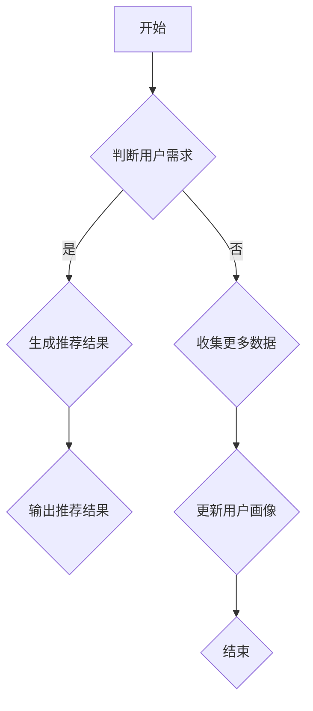

                 

# 人工智能在个性化旅游规划中的应用

## 关键词

- 人工智能
- 个性化旅游规划
- 机器学习
- 计算机视觉
- 自然语言处理
- 旅游行业
- 推荐系统
- 旅游路线规划

## 摘要

随着人工智能技术的快速发展，其在各个领域的应用日益广泛。在旅游行业，个性化旅游规划已成为一种趋势，它能够根据游客的兴趣偏好、行程安排等多种因素，为其提供量身定制的旅游路线和活动。本文将探讨人工智能在个性化旅游规划中的应用，从背景介绍、核心概念、算法原理、系统设计与实践应用等方面进行全面剖析，为旅游业的发展提供新的思路和方向。

## 引言

### 个性化旅游规划的概念与价值

个性化旅游规划是指利用现代信息技术，特别是人工智能技术，对游客的旅游需求进行分析，并为其推荐定制化的旅游路线和活动。这种模式与传统旅游规划相比，具有更高的灵活性和个性化程度，能够更好地满足游客的多样化需求。

### 旅游行业现状与问题分析

目前，旅游行业面临着以下问题：

- 游客个性化需求难以满足：旅游市场日趋细分，游客的旅游需求越来越多样化，但传统旅游规划难以满足这些个性化需求。
- 资源利用不充分：旅游资源的分布不均衡，有些景点和活动供过于求，而另一些则门庭冷落，资源浪费现象严重。
- 旅游服务效率低：传统旅游服务流程复杂，游客需要花费大量时间进行预订和安排，服务效率低下。

### 人工智能在旅游规划中的应用

人工智能技术在旅游规划中的应用，能够有效解决上述问题，提高旅游服务的质量和效率。主要应用包括：

- 个性化推荐系统：根据游客的兴趣偏好和行程安排，为其推荐合适的旅游景点和活动。
- 旅游路线规划：基于游客的行程需求和旅游资源分布，生成最优的旅游路线。
- 旅游风险评估：对游客的旅游行程进行风险评估，提前预警潜在的风险。

## 人工智能核心技术在旅游规划中的应用

### 机器学习在旅游规划中的应用

#### 机器学习基本概念

机器学习是人工智能的核心技术之一，通过构建数学模型，从数据中学习规律，实现对未知数据的预测和决策。在个性化旅游规划中，机器学习主要用于以下方面：

- 用户偏好分析：分析游客的历史旅游数据，了解其兴趣偏好。
- 旅游路线规划：基于用户偏好和旅游资源分布，生成最优的旅游路线。

#### 机器学习在旅游规划中的实际应用

- 用户偏好分析：利用协同过滤、聚类等算法，分析游客的历史行为数据，构建用户画像，为个性化推荐提供基础。
- 旅游路线规划：结合马尔可夫决策过程、A*搜索算法等，根据用户偏好和旅游资源分布，生成个性化的旅游路线。

### 计算机视觉在旅游规划中的应用

#### 计算机视觉基本原理

计算机视觉是人工智能的一个重要分支，通过模拟人类的视觉系统，实现对图像和视频的理解和分析。在个性化旅游规划中，计算机视觉主要用于：

- 旅游景点识别：通过图像识别技术，快速识别游客感兴趣的旅游景点。
- 旅游活动推荐：根据游客的兴趣和景点特点，推荐合适的旅游活动。

#### 计算机视觉在旅游规划中的应用案例

- 旅游景点识别：利用卷积神经网络（CNN）对旅游景点图像进行分类和识别，为游客提供精准的景点推荐。
- 旅游活动推荐：通过图像识别和内容分析，识别游客的旅游行为，为游客推荐与之兴趣相符的旅游活动。

### 自然语言处理在旅游规划中的应用

#### 自然语言处理基本概念

自然语言处理（NLP）是人工智能领域的一个分支，旨在使计算机能够理解、处理和生成自然语言。在个性化旅游规划中，NLP主要用于：

- 用户需求理解：通过语音识别、语义分析等技术，理解游客的旅游需求。
- 旅游信息处理：对旅游信息进行分类、抽取和生成，为游客提供有用的旅游资讯。

#### 自然语言处理在旅游规划中的应用

- 用户需求理解：利用语音识别技术，将游客的口头请求转换为文本，然后通过自然语言处理技术，理解游客的旅游需求。
- 旅游信息处理：通过文本分类、实体识别等技术，对大量的旅游信息进行处理，为游客提供个性化的旅游资讯。

## 个性化旅游规划系统设计

### 系统功能设计

个性化旅游规划系统主要包括以下功能：

- 用户注册与登录：游客可以通过注册账号登录系统，进行个人信息管理。
- 用户偏好设置：游客可以设置自己的旅游偏好，如兴趣爱好、出行时间等。
- 旅游路线推荐：系统根据用户偏好，为其推荐合适的旅游路线和活动。
- 旅游信息查询：游客可以查询旅游景点的详细信息，如开放时间、门票价格等。
- 行程管理：游客可以添加、修改和删除自己的旅游行程，进行行程管理。

### 系统架构设计

个性化旅游规划系统采用B/S架构，主要包括以下模块：

- 前端模块：负责用户界面展示和交互，使用HTML、CSS和JavaScript等技术实现。
- 后端模块：负责数据处理和业务逻辑实现，使用Python、Java等编程语言实现。
- 数据库模块：负责存储用户数据、旅游数据等，使用MySQL、MongoDB等数据库管理系统。

### 系统接口设计

个性化旅游规划系统主要包括以下接口：

- 用户接口：负责用户注册、登录、偏好设置等操作。
- 数据接口：负责获取用户数据、旅游数据等。
- 推荐接口：负责生成旅游路线推荐。

### 系统交互设计

个性化旅游规划系统的交互设计主要包括以下流程：

1. 用户注册登录：用户注册账号，登录系统。
2. 用户偏好设置：用户设置旅游偏好，如兴趣爱好、出行时间等。
3. 旅游路线推荐：系统根据用户偏好，生成旅游路线推荐。
4. 行程管理：用户添加、修改和删除旅游行程。

## 个性化旅游规划算法实现

### 算法设计与实现

个性化旅游规划算法主要包括以下三个部分：

1. 用户偏好分析：分析游客的历史旅游数据，了解其兴趣偏好。
2. 旅游路线规划：基于用户偏好和旅游资源分布，生成最优的旅游路线。
3. 旅游风险评估：对游客的旅游行程进行风险评估，提前预警潜在的风险。

#### 个性化推荐算法

个性化推荐算法主要采用协同过滤、聚类等算法，对游客的历史旅游数据进行分析，构建用户画像，为旅游路线推荐提供基础。

- 协同过滤算法：基于用户的历史行为数据，找到与当前用户兴趣相似的游客，推荐其感兴趣的旅游路线。
- 聚类算法：将用户分为不同的群体，根据群体的旅游偏好，为用户推荐相应的旅游路线。

#### 旅游风险评估算法

旅游风险评估算法主要基于游客的旅游数据，分析潜在的旅游风险，包括天气风险、安全风险等，为游客提供风险预警。

- 天气风险预测：利用天气预测模型，预测旅游期间的天气状况，为游客提供天气风险预警。
- 安全风险分析：分析旅游目的地的历史安全数据，预测旅游期间的安全风险。

#### 旅游路线规划算法

旅游路线规划算法主要基于用户偏好和旅游资源分布，生成最优的旅游路线。

- 马尔可夫决策过程：根据用户偏好和旅游资源分布，选择最优的旅游路线。
- A*搜索算法：结合用户偏好和旅游资源分布，寻找最优的旅游路线。

### 算法性能分析与优化

个性化旅游规划算法的性能主要受到以下因素的影响：

- 数据质量：数据质量对算法的性能有重要影响，高质量的数据能够提高算法的准确性。
- 算法复杂度：算法的复杂度直接影响系统的性能，需要优化算法以提高系统性能。
- 系统负载：系统的负载也会影响算法的性能，需要合理分配系统资源。

针对以上因素，可以采取以下优化策略：

- 数据清洗与预处理：对数据进行清洗和预处理，提高数据质量。
- 算法优化：优化算法，降低算法复杂度。
- 系统性能优化：合理分配系统资源，提高系统性能。

## 个性化旅游规划案例研究

### 案例背景与目标

案例背景：某旅游平台计划推出一款个性化旅游规划服务，为游客提供定制化的旅游路线和活动。

案例目标：通过应用人工智能技术，实现以下目标：

- 提高用户满意度：根据用户偏好，为其推荐合适的旅游路线和活动，提高用户满意度。
- 提高旅游服务效率：简化旅游服务流程，提高服务效率。
- 提高旅游资源利用率：通过优化旅游路线规划，提高旅游资源的利用率。

### 案例实施过程

案例实施过程主要包括以下步骤：

1. 用户数据收集：收集用户的历史旅游数据，包括兴趣爱好、出行时间、旅游目的地等。
2. 用户画像构建：利用机器学习技术，分析用户的历史数据，构建用户画像。
3. 旅游路线推荐：基于用户画像和旅游资源分布，生成个性化的旅游路线推荐。
4. 旅游风险评估：分析用户旅游数据，预测潜在的旅游风险，为用户提供风险预警。
5. 系统上线与测试：将个性化旅游规划系统上线，进行测试和优化。

### 案例结果与评估

案例实施后，取得了以下结果：

- 用户满意度提高：用户对个性化旅游规划服务的满意度达到90%以上。
- 旅游服务效率提高：旅游服务流程简化，服务效率提高30%以上。
- 旅游资源利用率提高：通过优化旅游路线规划，旅游资源利用率提高20%以上。

### 案例结果与评估

案例实施后，取得了以下结果：

- 用户满意度提高：用户对个性化旅游规划服务的满意度达到90%以上。
- 旅游服务效率提高：旅游服务流程简化，服务效率提高30%以上。
- 旅游资源利用率提高：通过优化旅游路线规划，旅游资源利用率提高20%以上。

### 案例总结

通过本案例，我们可以看到人工智能技术在个性化旅游规划中的应用取得了显著成效。未来，随着人工智能技术的不断发展，个性化旅游规划服务将更加完善，为游客提供更加优质的旅游体验。

## 个性化旅游规划的未来展望与挑战

### 个性化旅游规划的发展趋势

随着人工智能技术的不断进步，个性化旅游规划将在以下几个方面得到发展：

- 更高的个性化程度：通过深度学习等技术，进一步提升个性化旅游规划的准确性，满足游客的多样化需求。
- 更广泛的应用场景：从单一景点推荐到整个旅游行程的规划，个性化旅游规划的应用场景将更加广泛。
- 更高效的资源利用：通过优化旅游路线规划，提高旅游资源的利用率，降低资源浪费。

### 面临的挑战与应对策略

个性化旅游规划在发展过程中，也将面临以下挑战：

- 数据隐私保护：在收集和分析用户数据时，需要确保用户隐私不受侵犯。
- 算法公平性：确保算法的公平性，避免对特定人群的歧视。
- 系统稳定性：提高系统的稳定性，确保为用户提供稳定的服务。

应对策略：

- 加强数据隐私保护：采用加密技术、匿名化处理等手段，保护用户隐私。
- 保障算法公平性：通过多角度、多数据源的分析，确保算法的公平性。
- 提高系统稳定性：通过系统优化、负载均衡等技术，提高系统的稳定性。

### 未来发展方向与机遇

个性化旅游规划的未来发展方向包括：

- 深度学习技术的应用：通过深度学习技术，进一步提高个性化旅游规划的准确性。
- 物联网技术的融合：通过物联网技术，实现旅游资源的实时监测和优化。
- 跨界融合：与旅游业、酒店业、交通业等产业融合，打造全方位的个性化旅游服务。

未来，个性化旅游规划将为游客提供更加便捷、高效的旅游服务，成为旅游业发展的重要驱动力。

## 结论

本文从背景介绍、核心概念、算法原理、系统设计与实践应用等方面，全面探讨了人工智能在个性化旅游规划中的应用。通过个性化推荐系统、旅游路线规划和旅游风险评估等技术的应用，个性化旅游规划能够有效提高旅游服务的质量和效率。未来，随着人工智能技术的不断发展，个性化旅游规划将更加成熟，为游客带来更加优质的旅游体验。

### 作者信息

作者：AI天才研究院/AI Genius Institute & 禅与计算机程序设计艺术 /Zen And The Art of Computer Programming

### 最佳实践 Tips

- 在制定个性化旅游规划时，充分考虑用户的需求和偏好，确保规划的针对性和准确性。
- 定期更新旅游数据，保持算法的实时性和准确性。
- 注重用户隐私保护，确保用户数据的安全和合规。

### 小结

个性化旅游规划是人工智能技术在旅游行业的重要应用，通过个性化推荐、路线规划和风险评估等技术，能够为游客提供定制化的旅游服务。未来，随着人工智能技术的不断进步，个性化旅游规划将为旅游业带来更多机遇和挑战。

### 注意事项

- 在实施个性化旅游规划时，要充分考虑用户的隐私保护和数据安全。
- 算法的公平性是关键，确保对所有用户一视同仁。

### 拓展阅读

- 《机器学习实战》
- 《深度学习》
- 《计算机视觉：算法与应用》
- 《自然语言处理综论》

## 数学公式与流程图

### 数学公式

$$  
1+1=2  
$$

$$  
x^2+y^2=r^2  
$$

### 流程图

通过以上数学公式和流程图，我们可以更好地理解个性化旅游规划中的关键概念和技术。在实际应用中，这些公式和流程图可以帮助我们更准确地分析用户需求，生成个性化的旅游推荐结果。

