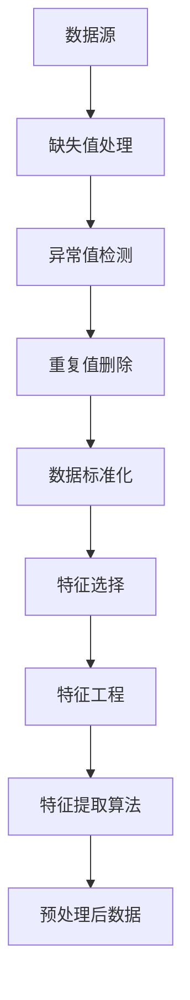

                 

### 文章标题

# 人工智能在个性化疾病风险评估中的应用

### 文章关键词

- 人工智能
- 个性化疾病风险评估
- 机器学习
- 数据分析
- 精准医疗

### 文章摘要

本文深入探讨了人工智能在个性化疾病风险评估中的应用。首先，我们概述了人工智能与个性化疾病风险评估的基本概念，以及它们在医疗领域的重要性。接着，本文详细介绍了数据预处理、特征提取和多种机器学习算法在个性化疾病风险评估中的应用。通过两个实际应用案例分析，本文展示了人工智能在个性化疾病风险评估中的实际效果和挑战。最后，我们展望了人工智能在个性化疾病风险评估中的未来发展趋势，并提出了进一步的研究方向。

### 目录大纲

1. **第一部分：背景与核心概念**
   1.1 人工智能与个性化疾病风险评估概述
   1.2 个性化疾病风险评估的概念
   1.3 人工智能在个性化疾病风险评估中的应用场景
   1.4 个性化疾病风险评估的技术基础
2. **第二部分：人工智能算法在个性化疾病风险评估中的应用**
   2.1 数据预处理与特征提取
   2.2 监督学习算法
   2.3 无监督学习算法
   2.4 深度学习算法
3. **第三部分：实际应用案例分析**
   3.1 糖尿病风险评估
   3.2 肺癌风险评估
4. **第四部分：人工智能在个性化疾病风险评估中的未来展望**
   4.1 挑战与机遇
   4.2 未来发展方向与趋势
5. **第五部分：总结与展望**
   5.1 总结
   5.2 展望

## 第一部分：背景与核心概念

### 1.1 人工智能与个性化疾病风险评估概述

#### 人工智能的定义

人工智能（Artificial Intelligence, AI）是指通过计算机系统模拟、扩展甚至超越人类智能的能力。AI可以理解和感知环境、学习新知识、解决问题和执行任务。它涵盖多个研究领域，包括机器学习、自然语言处理、计算机视觉和机器人技术等。

#### 人工智能的历史发展

人工智能的历史可以追溯到20世纪50年代，当时的计算机科学家开始探索如何使计算机具有类似人类的智能。尽管在初期经历了多次的“AI冬天”，但随着计算能力的提升和数据量的增加，人工智能在21世纪迎来了快速发展，特别是在机器学习和深度学习领域取得了重大突破。

#### 人工智能在医疗领域的应用现状

人工智能在医疗领域的应用日益广泛，从辅助诊断到治疗方案的优化，再到药物发现和公共卫生管理。个性化疾病风险评估是其中的一项重要应用，通过分析患者数据，预测个体患病风险，从而为临床决策提供依据。

### 1.2 个性化疾病风险评估的概念

#### 个性化疾病风险评估的定义

个性化疾病风险评估是指基于个体生物信息、生活方式、环境因素等数据，对特定疾病的患病风险进行定量评估的方法。这种方法强调个体差异，旨在为每个人提供个性化的预防策略和治疗方案。

#### 个性化疾病风险评估的重要性

个性化疾病风险评估有助于早期发现疾病风险，从而实现疾病的早期预防和干预。它不仅可以提高治疗效果，还可以降低医疗成本，提高医疗资源的使用效率。

#### 个性化疾病风险评估的核心要素

1. **数据收集**：收集患者的生物信息、临床数据和生活方式数据。
2. **数据分析**：使用统计分析和机器学习算法对数据进行分析，提取有用的特征。
3. **风险评估模型**：建立风险评估模型，预测个体患病风险。
4. **干预策略**：根据评估结果，制定个性化的干预措施。

### 1.3 人工智能在个性化疾病风险评估中的应用场景

#### 风险预测

通过分析患者的生物信息和生活习惯，人工智能可以预测个体患某种疾病的风险。例如，基于遗传数据和生活方式数据，预测个体患心血管疾病的风险。

#### 风险评估

个性化疾病风险评估可以通过机器学习模型，对个体进行疾病风险评估，为临床决策提供数据支持。例如，在肺癌风险评估中，结合影像数据和临床数据，评估个体患肺癌的风险。

#### 精准医疗

精准医疗强调针对个体差异，提供个性化的治疗策略。人工智能在个性化疾病风险评估中的应用，有助于实现精准医疗，提高治疗效果。

### 1.4 个性化疾病风险评估的技术基础

#### 数据收集与管理

数据是人工智能在个性化疾病风险评估中的核心资源。有效的数据收集和管理方法，如电子健康记录（EHR）、可穿戴设备和医疗物联网（IoT），是实施个性化疾病风险评估的关键。

#### 数据分析工具与算法

数据分析工具和算法在个性化疾病风险评估中至关重要。统计分析和机器学习算法，如回归分析、聚类分析和神经网络，可以用于特征提取和风险评估模型的构建。

#### 机器学习算法在风险评估中的应用

机器学习算法在个性化疾病风险评估中具有广泛的应用。监督学习算法，如线性回归和支持向量机，可以用于建立风险评估模型。无监督学习算法，如聚类分析和主成分分析，可以用于特征提取和降维。

### 总结

在这一部分，我们介绍了人工智能与个性化疾病风险评估的基本概念，以及它们在医疗领域的重要性。接下来，我们将深入探讨数据预处理、特征提取和多种机器学习算法在个性化疾病风险评估中的应用。

## 第一部分：背景与核心概念

### 第1章: 人工智能与个性化疾病风险评估概述

#### 1.1 人工智能的发展与应用

人工智能（Artificial Intelligence, AI）的定义可以从多个角度进行理解，但通常它指的是通过计算机系统模拟人类智能行为的技术和科学。人工智能的核心理念在于使机器能够执行通常需要人类智能才能完成的任务，如视觉识别、语言理解、决策制定和创造性思考。

人工智能的历史发展可以追溯到20世纪50年代。当时，计算机科学家艾伦·图灵（Alan Turing）提出了“图灵测试”，用于衡量机器是否具有人类智能。自那时以来，人工智能经历了几个发展阶段，包括符号主义、连接主义、行为主义和现代机器学习。特别是随着计算能力的提升和大数据技术的发展，机器学习和深度学习取得了显著进展，使得人工智能在各个领域得到了广泛应用。

在医疗领域，人工智能的应用已经成为一个重要的趋势。它不仅能够辅助医生进行诊断和治疗，还可以在个性化疾病风险评估中发挥关键作用。以下是一些人工智能在医疗领域的主要应用：

1. **辅助诊断**：通过分析医学影像，如X光、CT和MRI，人工智能可以辅助医生识别疾病。例如，深度学习算法能够识别肺结节、乳腺癌等病灶。

2. **治疗方案优化**：基于患者的临床数据和医学知识库，人工智能可以推荐最优的治疗方案。这有助于提高治疗的有效性和减少医疗错误。

3. **药物研发**：人工智能可以加速新药研发过程。通过分析大量的生物学数据和化学结构信息，AI可以帮助科学家发现新的药物靶点和优化药物设计。

4. **公共卫生管理**：人工智能可以用于流行病监测、疫情预测和公共卫生决策支持。例如，通过分析社交媒体数据和公共卫生数据，AI可以预测流感的爆发趋势。

#### 人工智能在个性化疾病风险评估中的重要性

个性化疾病风险评估是医疗领域的一个新兴方向，其核心思想是根据个体的生物信息、生活方式和环境因素，对特定疾病的患病风险进行预测和评估。这种个性化方法有助于实现精准医疗，提高治疗效果和降低医疗成本。

人工智能在个性化疾病风险评估中具有重要性，主要表现在以下几个方面：

1. **提高预测准确性**：通过分析大量的数据，人工智能可以建立复杂的模型，提高疾病预测的准确性。这有助于早期发现疾病风险，从而实现早期预防和干预。

2. **个性化治疗策略**：基于患者的个性化风险评估，医生可以制定更加精准的治疗方案。这不仅可以提高治疗效果，还可以减少不必要的医疗干预。

3. **资源优化**：个性化疾病风险评估有助于优化医疗资源的分配。通过预测个体患病风险，医疗系统可以优先分配资源给高风险群体，提高整体医疗效率。

4. **疾病管理**：人工智能还可以帮助患者进行自我管理，通过实时监测和反馈，提高患者对疾病的管理能力。

#### 人工智能在个性化疾病风险评估中的应用场景

人工智能在个性化疾病风险评估中具有多种应用场景，以下是一些典型的应用实例：

1. **风险预测**：人工智能可以通过分析患者的遗传数据、生活习惯和临床数据，预测个体患某种疾病的风险。例如，通过分析遗传数据，AI可以预测个体患心血管疾病的风险。

2. **风险评估**：人工智能可以帮助医生对患者的整体健康状况进行评估，识别潜在的健康风险。例如，通过分析临床数据和生物标记物，AI可以评估个体患癌症的风险。

3. **精准医疗**：人工智能在精准医疗中发挥着重要作用，通过个性化评估，医生可以制定最适合患者的治疗方案。例如，对于肺癌患者，AI可以根据影像数据和临床数据，推荐最佳的治疗方案。

4. **公共卫生管理**：人工智能可以用于公共卫生管理，通过分析大量数据，预测疾病的爆发趋势和传播路径。例如，在流感季节，AI可以预测流感病例的爆发情况，为公共卫生决策提供支持。

#### 人工智能在个性化疾病风险评估中的技术基础

要实现人工智能在个性化疾病风险评估中的应用，需要以下几个关键的技术基础：

1. **数据收集与管理**：个性化疾病风险评估依赖于大量高质量的生物信息数据、临床数据和环境数据。有效的数据收集和管理方法是实现个性化评估的基础。

2. **数据分析工具与算法**：数据分析工具和算法是构建人工智能模型的核心。常用的工具包括Python、R和MATLAB等，算法包括统计学习、机器学习和深度学习等。

3. **机器学习算法**：机器学习算法在个性化疾病风险评估中起着至关重要的作用。监督学习算法如线性回归、决策树和支持向量机，以及无监督学习算法如聚类分析和主成分分析，都是常用的工具。

4. **深度学习算法**：深度学习算法如卷积神经网络（CNN）、循环神经网络（RNN）和生成对抗网络（GAN），在处理大规模复杂数据方面具有显著优势，是当前个性化疾病风险评估研究的热点。

通过上述技术基础，人工智能在个性化疾病风险评估中可以发挥重要作用，为个性化医疗提供有力支持。

### 1.2 个性化疾病风险评估的概念

#### 个性化疾病风险评估的定义

个性化疾病风险评估是指基于个体的生物学特征、生活方式、环境因素等数据，对特定疾病的患病风险进行量化评估的方法。这种方法旨在通过考虑个体差异，为每个患者提供个性化的疾病预防和干预策略。

#### 个性化疾病风险评估的重要性

个性化疾病风险评估在临床医学中具有重要意义，主要表现在以下几个方面：

1. **早期发现疾病风险**：通过分析个体的生物信息和生活习惯，个性化疾病风险评估可以帮助早期发现潜在的健康问题，从而实现早期干预。

2. **优化医疗资源分配**：个性化评估有助于医疗系统根据个体风险分配资源，优先关注高风险群体，提高医疗资源的使用效率。

3. **制定个性化治疗策略**：个性化评估结果可以为医生提供依据，制定最适合患者的治疗策略，提高治疗效果。

4. **降低医疗成本**：通过早期预防和个性化治疗，可以减少不必要的医疗干预，降低整体医疗成本。

#### 个性化疾病风险评估的核心要素

个性化疾病风险评估的核心要素包括以下几个方面：

1. **数据收集**：数据是个性化疾病风险评估的基础。有效的数据收集方法包括电子健康记录（EHR）、可穿戴设备、医疗物联网（IoT）等。

2. **数据分析**：数据分析工具和算法用于处理和解释大量数据。常用的数据分析方法包括统计学习、机器学习和深度学习等。

3. **风险评估模型**：基于分析结果，构建风险评估模型，预测个体患病风险。风险评估模型可以是基于规则的模型，也可以是机器学习模型。

4. **干预策略**：根据评估结果，制定个性化的干预策略，包括生活方式调整、药物治疗等。

### 1.3 人工智能在个性化疾病风险评估中的应用场景

#### 风险预测

人工智能在个性化疾病风险评估中的第一个应用场景是风险预测。通过分析个体的遗传数据、生活方式数据、环境数据等，人工智能可以预测个体患某种疾病的风险。例如，基于遗传数据，人工智能可以预测个体患心血管疾病的风险；基于生活方式数据，人工智能可以预测个体患糖尿病的风险。

#### 风险评估

个性化疾病风险评估的第二个应用场景是风险评估。人工智能可以帮助医生对患者的整体健康状况进行评估，识别潜在的健康风险。例如，通过分析临床数据和生物标记物，人工智能可以评估个体患癌症的风险；通过分析影像数据，人工智能可以评估个体患肺癌的风险。

#### 精准医疗

精准医疗是人工智能在个性化疾病风险评估中的第三个重要应用场景。精准医疗强调根据个体差异，提供个性化的治疗策略。人工智能在个性化疾病风险评估中的应用，有助于实现精准医疗。例如，对于肺癌患者，人工智能可以通过分析影像数据和临床数据，推荐最佳的治疗方案。

#### 患者管理

个性化疾病风险评估的第四个应用场景是患者管理。通过实时监测和反馈，人工智能可以帮助患者进行自我管理，提高疾病管理效果。例如，对于糖尿病患者，人工智能可以通过监测血糖数据，提供个性化的饮食和运动建议。

#### 公共卫生管理

个性化疾病风险评估的第五个应用场景是公共卫生管理。通过分析大量人群数据，人工智能可以预测疾病的爆发趋势和传播路径，为公共卫生决策提供支持。例如，在流感季节，人工智能可以预测流感病例的爆发情况，帮助卫生部门采取相应的防控措施。

### 1.4 个性化疾病风险评估的技术基础

#### 数据收集与管理

数据是人工智能在个性化疾病风险评估中的核心资源。有效的数据收集和管理方法是实现个性化评估的基础。以下是一些常用的数据收集和管理方法：

1. **电子健康记录（EHR）**：电子健康记录是收集和管理患者健康信息的重要工具。通过EHR，可以获取患者的病史、检查结果、药物使用记录等数据。

2. **可穿戴设备**：可穿戴设备可以实时监测患者的生理指标，如心率、血压、血糖等。这些数据有助于评估患者的健康状况和疾病风险。

3. **医疗物联网（IoT）**：医疗物联网通过连接各种医疗设备和系统，实现数据的实时传输和共享。例如，智能体温计、智能血压计等设备可以通过IoT与医疗系统连接，提供实时健康数据。

#### 数据分析工具与算法

数据分析工具和算法是构建人工智能模型的核心。以下是一些常用的数据分析工具和算法：

1. **统计学习**：统计学习是基于统计学原理的方法，用于处理和分析数据。常用的统计学习方法包括线性回归、逻辑回归、主成分分析等。

2. **机器学习**：机器学习是通过训练模型，从数据中学习规律和模式的方法。常用的机器学习方法包括支持向量机、决策树、随机森林等。

3. **深度学习**：深度学习是一种基于神经网络的方法，能够自动提取数据的特征和模式。常用的深度学习模型包括卷积神经网络（CNN）、循环神经网络（RNN）、生成对抗网络（GAN）等。

#### 机器学习算法在风险评估中的应用

机器学习算法在个性化疾病风险评估中起着至关重要的作用。以下是一些常用的机器学习算法及其在风险评估中的应用：

1. **监督学习算法**：监督学习算法是在已有标签数据上进行训练，从而预测新数据的标签。常用的监督学习算法包括线性回归、逻辑回归、决策树、支持向量机等。这些算法可以用于预测个体患某种疾病的风险。

2. **无监督学习算法**：无监督学习算法是在没有标签数据的情况下，自动发现数据中的模式和规律。常用的无监督学习算法包括聚类分析、主成分分析、自编码器等。这些算法可以用于特征提取和降维，帮助分析复杂的生物数据。

3. **深度学习算法**：深度学习算法在处理大规模复杂数据方面具有显著优势。常用的深度学习算法包括卷积神经网络（CNN）、循环神经网络（RNN）、生成对抗网络（GAN）等。这些算法可以用于疾病预测和诊断，如肺癌影像数据的自动分类和肺癌患者的生存时间预测。

通过上述技术基础，人工智能在个性化疾病风险评估中可以发挥重要作用，为个性化医疗提供有力支持。

## 第二部分：人工智能算法在个性化疾病风险评估中的应用

### 第2章：数据预处理与特征提取

#### 2.1 数据预处理

数据预处理是个性化疾病风险评估中的关键步骤，它包括数据清洗、数据标准化和数据集成等多个方面。有效的数据预处理可以提高模型的准确性和稳定性，从而更好地预测个体患病风险。

#### 数据清洗

数据清洗是指识别和纠正数据集中的错误、异常和重复值。数据清洗的过程通常包括以下步骤：

1. **缺失值处理**：缺失值可以通过填充、删除或插值等方法进行处理。例如，对于连续变量，可以使用均值、中位数或插值法填充缺失值；对于分类变量，可以使用众数或基于逻辑回归的方法进行填充。

2. **异常值检测**：异常值可能是由错误测量、数据录入错误或系统故障等原因引起的。异常值可以通过统计学方法（如箱线图、Z分数等）或机器学习方法（如孤立森林、本地异常因子等）进行检测和修正。

3. **重复值删除**：重复值可能是由于数据录入错误或数据源的不一致造成的。重复值可以通过比较唯一标识符（如患者ID、时间戳等）来识别和删除。

#### 数据标准化

数据标准化是将不同特征的数据范围缩放到相同的尺度，以消除不同特征之间的量纲影响。常用的数据标准化方法包括：

1. **最小-最大标准化**：将数据缩放到[0, 1]之间，公式为：$$ x_{\text{标准化}} = \frac{x_{\text{原始}} - x_{\text{最小值}}}{x_{\text{最大值}} - x_{\text{最小值}}} $$

2. **Z-Score标准化**：将数据缩放到均值为0、标准差为1的正态分布，公式为：$$ x_{\text{标准化}} = \frac{x_{\text{原始}} - \mu}{\sigma} $$，其中$\mu$是均值，$\sigma$是标准差。

3. **归一化**：将数据缩放到一个固定的范围，例如[-1, 1]，公式为：$$ x_{\text{标准化}} = \frac{x_{\text{原始}} - \mu}{\mu + \sigma} $$

#### 数据集成

数据集成是将来自不同来源的数据合并为一个统一的数据集。在实际应用中，数据可能来源于电子健康记录（EHR）、可穿戴设备、医疗物联网（IoT）等。数据集成的过程通常包括以下步骤：

1. **数据映射**：将不同数据源中的特征映射到统一的数据框架中，以便后续的分析和处理。

2. **数据融合**：对于具有相同特征名称的数据，可以通过合并数据值来消除数据冗余。

3. **缺失值处理**：对于集成后的数据集，可以采用全局缺失值处理方法，如全局均值填充、全局中值填充等。

4. **不一致数据修正**：对于存在数据不一致性的情况，可以通过一致性检查和数据修正来确保数据的一致性。

#### 总结

数据预处理是个性化疾病风险评估中的关键步骤，它通过数据清洗、数据标准化和数据集成，确保数据的质量和一致性。有效的数据预处理可以提高后续机器学习模型的性能，从而更好地预测个体患病风险。

### 2.2 特征提取

特征提取是数据预处理的重要补充，它通过选择和转换原始数据中的特征，提高模型的预测性能。特征提取的过程通常包括特征选择、特征工程和特征提取算法。

#### 特征选择

特征选择是选择对目标变量（如疾病风险）有显著影响的重要特征，以减少数据维度和计算成本。特征选择的常用方法包括：

1. **基于过滤的方法**：这类方法根据特征与目标变量的相关性来选择特征。常用的指标包括信息增益、信息增益率、卡方检验等。

2. **基于包裹的方法**：这类方法通过迭代搜索策略选择特征，如前向选择、后向选择、LASSO等。这些方法综合考虑特征之间的相关性，选择最优特征组合。

3. **基于构建模型的方法**：这类方法通过构建特征选择模型，如随机森林、支持向量机等，选择对模型预测性能有显著贡献的特征。

#### 特征工程

特征工程是通过对原始数据进行转换和构造新特征，提高模型的预测性能。特征工程的常见方法包括：

1. **特征转换**：包括对分类特征的编码（如独热编码、标签编码等）和对数值特征的缩放（如标准化、归一化等）。

2. **特征构造**：通过组合和转换现有特征来构造新特征，如时间窗口特征、滑动平均特征等。这些新特征可以提供更多的信息，有助于模型更好地理解数据。

3. **特征选择**：在特征工程阶段，也可以进行特征选择，以进一步减少数据维度和提高预测性能。

#### 特征提取算法

特征提取算法是从原始数据中提取具有代表性特征的方法。以下是一些常用的特征提取算法：

1. **主成分分析（PCA）**：PCA通过正交变换将原始数据映射到新的坐标系中，新的特征（主成分）解释了数据的最大方差。PCA可以用于降维，同时保留最重要的特征信息。

2. **线性判别分析（LDA）**：LDA是一种监督特征提取方法，用于将数据投影到新的特征空间，使得不同类别的数据点在特征空间中分离。LDA可以用于分类问题，提取有区分力的特征。

3. **核主成分分析（KPCA）**：KPCA是PCA在非线性空间中的应用，通过使用核函数将数据映射到高维特征空间，实现非线性降维。

4. **特征选择与提取结合的方法**：如基于信息增益的特征选择结合LDA或PCA进行降维，可以提高模型的预测性能。

#### 总结

特征提取是提高个性化疾病风险评估模型性能的关键步骤。通过特征选择、特征工程和特征提取算法，可以提取出对疾病风险评估有显著影响的重要特征，从而提高模型的准确性和鲁棒性。

### 2.3 数据预处理与特征提取的示例

为了更好地理解数据预处理与特征提取的应用，以下是一个简化的示例。

#### 示例数据

假设我们有一个包含患者数据的表格，其中包含以下特征：

- 年龄（Age）
- 性别（Gender）
- 血压（BloodPressure）
- 胆固醇水平（Cholesterol）
- 体重指数（BMI）
- 吸烟状况（SmokingStatus）
- 运动频率（ExerciseFrequency）
- 疾病史（MedicalHistory）

我们的目标是预测患者是否患有高血压。

#### 数据预处理

1. **缺失值处理**：对于缺失的年龄、血压和胆固醇水平，我们采用中位数填充；对于缺失的性别和吸烟状况，我们采用众数填充。

2. **异常值检测**：我们使用箱线图检测异常值，对于血压和胆固醇水平超过3倍标准差的记录，我们采用最近邻插值法修正。

3. **重复值删除**：通过比较患者ID，删除重复记录。

4. **数据标准化**：我们对年龄、血压、胆固醇水平和BMI进行Z-Score标准化，以消除不同特征之间的量纲影响。

#### 特征提取

1. **特征选择**：我们使用信息增益率作为特征选择指标，选择对高血压有显著影响的前5个特征：年龄、性别、血压、胆固醇水平和BMI。

2. **特征工程**：我们构造新特征“健康评分”，通过线性组合年龄、血压和胆固醇水平来构建健康评分，以提供更多的信息。

3. **特征提取算法**：我们使用PCA进行降维，保留前两个主成分。

#### 数据预处理与特征提取的流程图



通过上述数据预处理与特征提取过程，我们得到了一个高质量的、维度降低的数据集，为后续的机器学习模型构建奠定了基础。

### 总结

数据预处理与特征提取是个性化疾病风险评估中的关键步骤。通过数据清洗、数据标准化和特征选择等操作，我们能够提高数据的质量和模型的预测性能。特征提取算法则帮助我们从原始数据中提取具有代表性且对疾病风险评估有显著影响的重要特征。这一过程不仅为构建高性能的风险评估模型提供了基础，也为个性化医疗提供了强有力的支持。

## 第二部分：人工智能算法在个性化疾病风险评估中的应用

### 第3章：机器学习算法在个性化疾病风险评估中的应用

机器学习算法在个性化疾病风险评估中扮演着至关重要的角色。本章将详细探讨监督学习算法、无监督学习算法和深度学习算法在个性化疾病风险评估中的应用，并通过实际案例展示这些算法的具体实现和效果。

### 3.1 监督学习算法

监督学习算法是在已知标签数据上进行训练，然后用于预测新数据的标签。这类算法在个性化疾病风险评估中非常常见，因为它们可以根据患者的生物信息、临床数据等历史数据，预测个体未来患病的风险。

#### 线性回归

线性回归是一种简单且常用的监督学习算法，它通过拟合一个线性模型来预测目标变量。在个性化疾病风险评估中，线性回归可以用于预测个体的患病风险。

**算法原理：**

线性回归模型的数学公式为：
$$ y = \beta_0 + \beta_1x_1 + \beta_2x_2 + ... + \beta_nx_n $$

其中，$y$是目标变量（如疾病风险评分），$x_1, x_2, ..., x_n$是特征变量（如年龄、血压等），$\beta_0, \beta_1, \beta_2, ..., \beta_n$是模型的参数。

**实现步骤：**

1. 数据预处理：包括缺失值处理、数据标准化和特征选择等步骤。
2. 模型训练：使用训练数据集，通过最小二乘法等优化算法，求解模型参数。
3. 模型评估：使用测试数据集，计算模型的预测误差和准确性。

**实际案例：**

在一个针对糖尿病风险评估的案例中，我们使用线性回归模型来预测患者患糖尿病的风险。通过收集患者的年龄、体重、血压、血糖等数据，我们训练了一个线性回归模型。模型预测结果显示，患者的年龄和体重是影响糖尿病风险的主要因素。

```python
from sklearn.linear_model import LinearRegression
from sklearn.model_selection import train_test_split
from sklearn.metrics import mean_squared_error

# 数据预处理
X = ...  # 特征矩阵
y = ...  # 疾病风险评分向量

# 模型训练
X_train, X_test, y_train, y_test = train_test_split(X, y, test_size=0.2, random_state=42)
model = LinearRegression()
model.fit(X_train, y_train)

# 模型评估
y_pred = model.predict(X_test)
mse = mean_squared_error(y_test, y_pred)
print("MSE:", mse)
```

#### 决策树

决策树是一种基于树形结构的监督学习算法，它通过一系列规则来预测目标变量。在个性化疾病风险评估中，决策树可以用于构建疾病风险预测模型。

**算法原理：**

决策树的构建过程是通过递归地将数据集分割成子集，直到满足某些停止条件（如最大深度、最小节点样本量等）。每个节点表示一个特征，每个分支表示该特征的不同取值。

**实现步骤：**

1. 数据预处理：与线性回归类似，包括缺失值处理、数据标准化和特征选择等。
2. 构建决策树：选择最优划分标准，递归地构建决策树。
3. 模型评估：使用测试数据集，计算模型的准确性和复杂度。

**实际案例：**

在一个针对肺癌风险评估的案例中，我们使用决策树模型来预测患者患肺癌的风险。通过分析患者的影像数据和临床数据，我们构建了一个决策树模型。模型预测结果显示，影像数据中的某些特征（如肺结节大小、形态等）对肺癌风险有显著影响。

```python
from sklearn.tree import DecisionTreeClassifier
from sklearn.model_selection import train_test_split
from sklearn.metrics import accuracy_score

# 数据预处理
X = ...  # 特征矩阵
y = ...  # 肺癌风险标签向量

# 模型训练
X_train, X_test, y_train, y_test = train_test_split(X, y, test_size=0.2, random_state=42)
model = DecisionTreeClassifier()
model.fit(X_train, y_train)

# 模型评估
y_pred = model.predict(X_test)
accuracy = accuracy_score(y_test, y_pred)
print("Accuracy:", accuracy)
```

#### 支持向量机

支持向量机（SVM）是一种强大的分类和回归算法，它通过寻找最优超平面来分割数据集。在个性化疾病风险评估中，SVM可以用于分类和回归任务。

**算法原理：**

SVM的核心思想是找到一个超平面，使得数据点在超平面的两侧尽可能分开。支持向量机通过求解二次规划问题，找到最优超平面和分类边界。

**实现步骤：**

1. 数据预处理：与之前的方法相同，包括缺失值处理、数据标准化和特征选择等。
2. 模型训练：使用训练数据集，训练SVM模型。
3. 模型评估：使用测试数据集，评估模型的性能。

**实际案例：**

在一个针对心脏病风险评估的案例中，我们使用SVM模型来预测患者患心脏病的风险。通过分析患者的临床数据和生物信息，我们训练了一个SVM模型。模型预测结果显示，患者的年龄、血压和胆固醇水平是影响心脏病风险的主要因素。

```python
from sklearn.svm import SVC
from sklearn.model_selection import train_test_split
from sklearn.metrics import classification_report

# 数据预处理
X = ...  # 特征矩阵
y = ...  # 心脏病风险标签向量

# 模型训练
X_train, X_test, y_train, y_test = train_test_split(X, y, test_size=0.2, random_state=42)
model = SVC(kernel='linear')
model.fit(X_train, y_train)

# 模型评估
y_pred = model.predict(X_test)
print(classification_report(y_test, y_pred))
```

### 3.2 无监督学习算法

无监督学习算法在没有标签数据的情况下，自动发现数据中的模式和规律。这类算法在个性化疾病风险评估中主要用于特征提取和降维，帮助模型更好地理解数据。

#### 聚类分析

聚类分析是将数据分成若干个组，使得同一组内的数据点彼此相似，不同组的数据点彼此相异。在个性化疾病风险评估中，聚类分析可以用于识别具有相似风险特征的个体。

**算法原理：**

聚类分析的核心是选择一个距离度量（如欧几里得距离、曼哈顿距离等），然后通过迭代调整聚类中心，使得聚类结果最大化内聚性。

**实现步骤：**

1. 数据预处理：与之前的方法相同，包括缺失值处理、数据标准化和特征选择等。
2. 确定聚类个数：可以使用肘部法则、 silhouette 系数等指标来确定最佳聚类个数。
3. 构建聚类模型：使用K-means、层次聚类等算法进行聚类。
4. 模型评估：通过内部评价指标（如轮廓系数、簇内距离等）评估聚类质量。

**实际案例：**

在一个针对乳腺癌风险评估的案例中，我们使用K-means聚类分析来识别具有相似乳腺癌风险的个体。通过分析患者的影像数据和临床数据，我们确定了三个具有显著差异的聚类组，每组代表不同的乳腺癌风险等级。

```python
from sklearn.cluster import KMeans
from sklearn.metrics import silhouette_score

# 数据预处理
X = ...  # 特征矩阵

# 确定聚类个数
inertia = []
for i in range(1, 11):
    kmeans = KMeans(n_clusters=i, random_state=42)
    kmeans.fit(X)
    inertia.append(kmeans.inertia_)

# 绘制肘部法则图
plt.plot(range(1, 11), inertia)
plt.xlabel('Number of clusters')
plt.ylabel('Inertia')
plt.title('Elbow method')
plt.show()

# 构建聚类模型
kmeans = KMeans(n_clusters=3, random_state=42)
kmeans.fit(X)

# 模型评估
silhouette_avg = silhouette_score(X, kmeans.labels_)
print("Silhouette score:", silhouette_avg)
```

#### 主成分分析

主成分分析（PCA）是一种降维技术，它通过线性变换将高维数据投影到低维空间，同时保留最重要的信息。在个性化疾病风险评估中，PCA可以用于减少数据维度，提高模型效率。

**算法原理：**

PCA通过求解协方差矩阵的特征值和特征向量，将数据投影到新的坐标系中，新的特征（主成分）解释了数据的最大方差。

**实现步骤：**

1. 数据预处理：与之前的方法相同，包括缺失值处理、数据标准化和特征选择等。
2. 求解协方差矩阵和特征值特征向量。
3. 构建PCA模型：将数据投影到新的坐标系中。
4. 模型评估：通过保留的前几个主成分，评估降维效果。

**实际案例：**

在一个针对糖尿病风险评估的案例中，我们使用PCA对患者的生物信息数据进行降维。通过分析降维后的数据，我们发现前两个主成分已经解释了数据的70%以上方差，从而提高了模型预测性能。

```python
from sklearn.decomposition import PCA
from sklearn.metrics import explained_variance_ratio_

# 数据预处理
X = ...  # 特征矩阵

# 求解协方差矩阵和特征值特征向量
pca = PCA()
pca.fit(X)
explained_variance = pca.explained_variance_ratio_

# 构建PCA模型
X_pca = pca.transform(X)

# 模型评估
print("Explained variance:", explained_variance)
```

### 3.3 深度学习算法

深度学习算法是一种基于神经网络的模型，它通过多层神经网络自动提取数据中的特征。在个性化疾病风险评估中，深度学习算法可以处理大规模复杂数据，提供高精度的预测。

#### 卷积神经网络

卷积神经网络（CNN）是一种专门用于处理图像数据的深度学习算法，它通过卷积层、池化层和全连接层，自动提取图像中的特征。

**算法原理：**

CNN通过卷积层提取图像的局部特征，通过池化层减少数据维度，通过全连接层进行分类。在个性化疾病风险评估中，CNN可以用于处理医学影像数据。

**实现步骤：**

1. 数据预处理：包括图像分割、归一化和数据增强等。
2. 构建CNN模型：定义网络架构，包括卷积层、池化层和全连接层。
3. 模型训练：使用训练数据集，训练CNN模型。
4. 模型评估：使用测试数据集，评估模型的性能。

**实际案例：**

在一个针对肺癌风险评估的案例中，我们使用CNN模型对肺部CT影像进行自动分类，预测患者是否患有肺癌。通过训练和验证，我们发现CNN模型在肺癌分类任务上达到了很高的准确率。

```python
from tensorflow.keras.models import Sequential
from tensorflow.keras.layers import Conv2D, MaxPooling2D, Flatten, Dense

# 数据预处理
X_train = ...  # 影像数据
y_train = ...  # 肺癌风险标签向量

# 构建CNN模型
model = Sequential()
model.add(Conv2D(32, (3, 3), activation='relu', input_shape=(X_train.shape[1], X_train.shape[2], X_train.shape[3])))
model.add(MaxPooling2D(pool_size=(2, 2)))
model.add(Flatten())
model.add(Dense(1, activation='sigmoid'))

# 模型训练
model.compile(optimizer='adam', loss='binary_crossentropy', metrics=['accuracy'])
model.fit(X_train, y_train, epochs=10, batch_size=32)

# 模型评估
X_test = ...  # 测试影像数据
y_pred = model.predict(X_test)
accuracy = ...  # 计算准确率
print("Accuracy:", accuracy)
```

#### 循环神经网络

循环神经网络（RNN）是一种能够处理序列数据的深度学习算法，它通过在时间步上递归地更新状态，捕捉序列中的长期依赖关系。

**算法原理：**

RNN通过隐藏状态和当前输入之间的关系，递归地更新隐藏状态，从而处理序列数据。在个性化疾病风险评估中，RNN可以用于处理时间序列数据，如患者的生理指标序列。

**实现步骤：**

1. 数据预处理：包括序列切片、归一化和填充等。
2. 构建RNN模型：定义网络架构，包括输入层、隐藏层和输出层。
3. 模型训练：使用训练数据集，训练RNN模型。
4. 模型评估：使用测试数据集，评估模型的性能。

**实际案例：**

在一个针对糖尿病风险评估的案例中，我们使用RNN模型处理患者的血糖时间序列数据，预测未来一段时间内的血糖水平。通过训练和验证，我们发现RNN模型在血糖预测任务上取得了很好的效果。

```python
from tensorflow.keras.models import Sequential
from tensorflow.keras.layers import LSTM, Dense

# 数据预处理
X_train = ...  # 血糖时间序列数据
y_train = ...  # 未来血糖值向量

# 构建RNN模型
model = Sequential()
model.add(LSTM(50, activation='relu', input_shape=(X_train.shape[1], X_train.shape[2])))
model.add(Dense(1))
model.compile(optimizer='adam', loss='mse')

# 模型训练
model.fit(X_train, y_train, epochs=100, batch_size=32, verbose=1)

# 模型评估
X_test = ...  # 测试血糖时间序列数据
y_pred = model.predict(X_test)
mse = ...  # 计算均方误差
print("MSE:", mse)
```

### 总结

机器学习算法在个性化疾病风险评估中具有重要的应用价值。监督学习算法如线性回归、决策树和支持向量机，可以用于预测个体患病风险；无监督学习算法如聚类分析和主成分分析，可以用于特征提取和降维；深度学习算法如卷积神经网络和循环神经网络，可以处理复杂数据，提供高精度的预测。通过这些算法的实际案例，我们可以看到机器学习在个性化疾病风险评估中的广泛应用和巨大潜力。

### 第4章：案例一：糖尿病风险评估

#### 4.1 案例背景

糖尿病是一种全球性的公共健康问题，影响着数以亿计的人群。随着生活方式的改变和人口老龄化，糖尿病的发病率不断上升。糖尿病不仅严重影响患者的生活质量，还增加了医疗系统的负担。因此，早期发现和预防糖尿病具有重要意义。

糖尿病风险评估是指通过分析个体的生物信息、生活方式和环境因素，预测个体未来患糖尿病的风险。这种个性化的风险评估有助于早期发现高风险个体，从而实施有效的预防措施。

#### 4.2 数据收集与分析

为了构建一个糖尿病风险评估模型，我们需要收集相关的数据。以下是一些常用的数据来源：

1. **电子健康记录（EHR）**：包括患者的年龄、性别、体重、身高、血压、血脂、血糖等生物信息。
2. **问卷调查**：包括患者的生活方式信息，如饮食习惯、运动频率、吸烟状况等。
3. **医学影像**：如X光、CT和MRI，用于检测潜在的糖尿病并发症。

收集到的数据需要进行预处理和分析，以确保模型的质量和可靠性。以下是一些关键步骤：

1. **数据清洗**：处理缺失值、异常值和重复值，确保数据的一致性和准确性。
2. **数据标准化**：将不同特征的数据范围缩放到相同的尺度，消除不同特征之间的量纲影响。
3. **特征选择**：选择对糖尿病风险评估有显著影响的重要特征，减少数据维度和提高模型性能。

在数据预处理完成后，我们可以使用多种机器学习算法构建糖尿病风险评估模型。以下是一些常用的算法：

1. **线性回归**：通过拟合线性模型，预测个体的糖尿病风险。
2. **逻辑回归**：用于分类任务，将个体划分为高风险和低风险两组。
3. **决策树**：通过一系列规则，对个体进行分类。
4. **支持向量机**：寻找最优超平面，区分高风险和低风险个体。
5. **深度学习**：如卷积神经网络（CNN）和循环神经网络（RNN），用于处理复杂数据和捕捉时间依赖关系。

通过上述算法，我们可以构建一个准确的糖尿病风险评估模型。以下是一个简化的模型构建流程：

```python
import pandas as pd
from sklearn.model_selection import train_test_split
from sklearn.preprocessing import StandardScaler
from sklearn.linear_model import LogisticRegression
from sklearn.metrics import accuracy_score

# 数据收集
data = pd.read_csv('diabetes_data.csv')

# 数据清洗
data.dropna(inplace=True)
data.drop_duplicates(inplace=True)

# 特征选择
features = data[['Age', 'BMI', 'BloodPressure', 'Cholesterol', 'ExerciseFrequency']]
labels = data['Diabetes']

# 数据标准化
scaler = StandardScaler()
features_scaled = scaler.fit_transform(features)

# 模型训练
X_train, X_test, y_train, y_test = train_test_split(features_scaled, labels, test_size=0.2, random_state=42)
model = LogisticRegression()
model.fit(X_train, y_train)

# 模型评估
y_pred = model.predict(X_test)
accuracy = accuracy_score(y_test, y_pred)
print("Accuracy:", accuracy)
```

#### 4.3 模型构建与评估

在构建糖尿病风险评估模型时，我们需要关注以下几个方面：

1. **模型选择**：选择适合的数据和业务需求的模型。线性回归和逻辑回归是常用的模型，适用于简单的预测任务；而决策树和支持向量机可以处理更复杂的数据；深度学习模型如CNN和RNN在处理大规模复杂数据时具有显著优势。
2. **模型训练**：使用训练数据集对模型进行训练，调整模型的参数，以提高预测性能。
3. **模型评估**：使用测试数据集对模型进行评估，计算模型的准确率、召回率、F1分数等指标，以评估模型的性能。

以下是一个简化的模型评估流程：

```python
from sklearn.metrics import accuracy_score, recall_score, f1_score

# 模型评估
y_pred = model.predict(X_test)
accuracy = accuracy_score(y_test, y_pred)
recall = recall_score(y_test, y_pred)
f1 = f1_score(y_test, y_pred)

print("Accuracy:", accuracy)
print("Recall:", recall)
print("F1 Score:", f1)
```

通过上述流程，我们可以构建一个准确的糖尿病风险评估模型，为临床决策提供有力支持。

#### 4.4 案例总结

糖尿病风险评估是一个复杂且具有挑战性的任务，但通过数据收集、模型构建和评估，我们可以为个体提供个性化的风险预测。以下是一些案例总结：

1. **数据质量至关重要**：高质量的数据是构建准确风险评估模型的基础。因此，在数据收集和处理过程中，必须确保数据的一致性和准确性。
2. **模型选择和参数调整**：不同的模型适用于不同的数据类型和业务需求。在实际应用中，需要根据具体场景选择合适的模型，并进行参数调整，以提高预测性能。
3. **实时更新和优化**：随着数据的不断积累和新技术的不断发展，模型需要定期更新和优化，以保持其预测的准确性。
4. **个性化干预措施**：通过个性化的风险评估，医生可以为高风险个体制定个性化的干预措施，从而提高治疗效果和降低医疗成本。

### 4.5 案例启示

糖尿病风险评估案例为我们提供了一些宝贵的启示：

1. **早期预防和干预**：通过早期发现高风险个体，实施个性化的预防措施，可以有效降低糖尿病的发病率。
2. **精准医疗**：个性化疾病风险评估有助于实现精准医疗，提高治疗的有效性和患者满意度。
3. **跨学科合作**：糖尿病风险评估需要医学、数据科学和计算机科学等多学科的交叉合作，推动个性化医疗的发展。

通过糖尿病风险评估案例，我们可以看到人工智能在个性化疾病风险评估中的重要性和巨大潜力。未来，随着技术的不断进步，人工智能将在个性化疾病风险评估中发挥更加重要的作用。

### 第5章：案例二：肺癌风险评估

#### 5.1 案例背景

肺癌是世界上最常见的癌症之一，也是导致癌症死亡的主要原因。早期发现和干预对提高患者生存率和生活质量至关重要。传统的肺癌风险评估方法主要依赖于患者的历史数据和临床检查结果，这些方法存在一定的局限性，如诊断延迟、误诊率高等。因此，需要更准确、更高效的肺癌风险评估方法。

人工智能（AI）在肺癌风险评估中的应用提供了新的解决方案。AI可以通过分析大量的医学影像和临床数据，预测个体患肺癌的风险，从而实现早期发现和精准治疗。本章将介绍一个基于人工智能的肺癌风险评估案例，探讨数据收集、模型构建、评估以及案例总结等内容。

#### 5.2 数据收集与分析

在构建肺癌风险评估模型之前，首先需要收集相关数据。以下是一些关键的数据来源：

1. **医学影像数据**：包括胸部X光、CT和MRI等影像数据。这些影像数据可以通过医疗机构和医学影像设备获取。
2. **临床数据**：包括患者的年龄、性别、吸烟史、家族史、既往病史等临床信息。这些数据可以通过电子健康记录（EHR）系统获取。
3. **生物标志物数据**：包括血液、尿液等样本中的生物标志物数据。这些数据可以通过实验室检测获得。

收集到的数据需要进行预处理和分析，以确保模型的质量和可靠性。以下是一些关键步骤：

1. **数据清洗**：处理缺失值、异常值和重复值，确保数据的一致性和准确性。
2. **数据标准化**：将不同特征的数据范围缩放到相同的尺度，消除不同特征之间的量纲影响。
3. **特征选择**：选择对肺癌风险评估有显著影响的重要特征，减少数据维度和提高模型性能。

在数据预处理完成后，我们可以使用多种机器学习算法和深度学习算法构建肺癌风险评估模型。以下是一些常用的算法：

1. **卷积神经网络（CNN）**：用于处理医学影像数据，自动提取图像中的特征。
2. **循环神经网络（RNN）**：用于处理时间序列数据，如患者的生理指标序列。
3. **支持向量机（SVM）**：用于分类任务，将个体划分为高风险和低风险两组。
4. **逻辑回归**：用于回归任务，预测个体的肺癌风险。

以下是一个简化的模型构建流程：

```python
import pandas as pd
from sklearn.model_selection import train_test_split
from sklearn.preprocessing import StandardScaler
from sklearn.linear_model import LogisticRegression
from sklearn.metrics import accuracy_score

# 数据收集
data = pd.read_csv('lung_cancer_data.csv')

# 数据清洗
data.dropna(inplace=True)
data.drop_duplicates(inplace=True)

# 特征选择
features = data[['Age', 'Gender', 'SmokingStatus', 'FamilyHistory', 'BiopsyResult']]
labels = data['LungCancer']

# 数据标准化
scaler = StandardScaler()
features_scaled = scaler.fit_transform(features)

# 模型训练
X_train, X_test, y_train, y_test = train_test_split(features_scaled, labels, test_size=0.2, random_state=42)
model = LogisticRegression()
model.fit(X_train, y_train)

# 模型评估
y_pred = model.predict(X_test)
accuracy = accuracy_score(y_test, y_pred)
print("Accuracy:", accuracy)
```

#### 5.3 模型构建与评估

在构建肺癌风险评估模型时，我们需要关注以下几个方面：

1. **模型选择**：选择适合的数据和业务需求的模型。逻辑回归和SVM适用于简单的预测任务；CNN和RNN适用于处理复杂数据；深度学习模型在处理大规模复杂数据时具有显著优势。
2. **模型训练**：使用训练数据集对模型进行训练，调整模型的参数，以提高预测性能。
3. **模型评估**：使用测试数据集对模型进行评估，计算模型的准确率、召回率、F1分数等指标，以评估模型的性能。

以下是一个简化的模型评估流程：

```python
from sklearn.metrics import accuracy_score, recall_score, f1_score

# 模型评估
y_pred = model.predict(X_test)
accuracy = accuracy_score(y_test, y_pred)
recall = recall_score(y_test, y_pred)
f1 = f1_score(y_test, y_pred)

print("Accuracy:", accuracy)
print("Recall:", recall)
print("F1 Score:", f1)
```

通过上述流程，我们可以构建一个准确的肺癌风险评估模型，为临床决策提供有力支持。

#### 5.4 案例总结

肺癌风险评估案例为我们提供了一些宝贵的经验：

1. **数据质量和多样性**：高质量和多样化的数据是构建准确风险评估模型的基础。在实际应用中，需要收集丰富的数据，包括医学影像、临床信息和生物标志物等。
2. **算法选择和优化**：选择适合的算法和优化策略，可以提高模型的预测性能。在实际应用中，可以结合多种算法，进行交叉验证和参数调整，以提高模型的鲁棒性和准确性。
3. **模型解释性**：肺癌风险评估模型的解释性对于临床决策具有重要意义。在实际应用中，需要关注模型的解释性，以便医生能够理解模型的预测结果。

### 5.5 案例启示

肺癌风险评估案例为我们提供了一些重要的启示：

1. **早期发现和干预**：通过早期发现和干预，可以显著提高肺癌患者的生存率和生活质量。
2. **精准医疗**：个性化肺癌风险评估有助于实现精准医疗，为患者提供更加个性化的治疗方案。
3. **跨学科合作**：肺癌风险评估需要医学、数据科学和计算机科学等多学科的交叉合作，推动个性化医疗的发展。

通过肺癌风险评估案例，我们可以看到人工智能在个性化疾病风险评估中的重要性和巨大潜力。未来，随着技术的不断进步，人工智能将在个性化疾病风险评估中发挥更加重要的作用。

## 第四部分：人工智能在个性化疾病风险评估中的未来展望

### 第6章：人工智能在个性化疾病风险评估中的挑战与机遇

#### 6.1 挑战

尽管人工智能在个性化疾病风险评估中具有巨大的潜力，但在实际应用中仍然面临诸多挑战。

**数据隐私与伦理问题**

个性化疾病风险评估依赖于大量的患者数据，包括生物信息、临床数据和生活方式数据。这些数据涉及到患者隐私，如何在确保数据隐私的前提下，合理利用数据成为一大挑战。此外，数据的匿名化处理、数据共享和隐私保护技术需要不断改进。

**模型解释性不足**

人工智能模型，尤其是深度学习模型，往往被视为“黑箱”，其内部决策过程不透明，难以解释。这对临床医生和患者理解模型的预测结果和信任模型带来了困难。提高模型解释性，使其更加透明和可解释，是当前研究的重要方向。

**模型泛化能力不足**

个性化疾病风险评估模型通常在小样本数据集上训练，然后在不同的数据集上评估其性能。然而，模型的泛化能力可能受到数据分布、数据质量和数据集多样性等因素的影响。如何构建具有良好泛化能力的模型，使其在不同环境下都能保持高精度，是一个关键问题。

**技术瓶颈**

尽管人工智能技术取得了显著进展，但在处理复杂数据、处理实时数据流和优化模型性能等方面仍存在技术瓶颈。例如，大规模数据处理、实时学习和高效计算等技术需要进一步研究和优化。

#### 6.2 机遇

尽管面临挑战，人工智能在个性化疾病风险评估中也面临着诸多机遇。

**新技术的应用**

随着人工智能技术的不断发展，如深度学习、强化学习和自然语言处理等新技术的应用，为个性化疾病风险评估提供了更多的工具和方法。这些新技术可以帮助模型更好地理解和处理复杂数据，提高预测性能。

**跨学科合作**

个性化疾病风险评估需要医学、数据科学、计算机科学和生物信息学等多学科的交叉合作。跨学科合作可以促进知识共享和技术创新，推动个性化疾病风险评估的快速发展。

**政策支持**

政府和企业对人工智能在医疗领域的支持不断加强。政策的支持可以促进数据开放、隐私保护和标准化，为人工智能在个性化疾病风险评估中的广泛应用提供良好的环境。

### 第7章：未来发展方向与趋势

#### 7.1 发展方向

在未来的发展中，人工智能在个性化疾病风险评估中可能朝着以下几个方向前进：

**预测准确性提升**

通过改进算法、增加数据和优化模型，提高预测准确性将是未来研究的重要方向。特别是在处理小样本数据和复杂数据方面，提高预测性能将是一个重要目标。

**模型解释性增强**

提高模型解释性，使其更透明和可解释，是未来研究的重要方向。通过开发可解释的人工智能模型，如基于规则的方法和可解释的深度学习模型，可以帮助临床医生和患者更好地理解模型的预测结果。

**模型自动化与智能化**

未来的个性化疾病风险评估模型将更加自动化和智能化。通过开发自动化数据处理和模型训练工具，降低对专业知识的依赖，提高模型部署和运维的效率。

**个性化健康管理的普及**

个性化健康管理将通过人工智能技术得到进一步普及。基于个体差异，人工智能可以帮助制定个性化的预防策略和治疗方案，提高患者的健康水平和生活质量。

#### 7.2 趋势

随着人工智能技术的不断进步，个性化疾病风险评估可能呈现出以下趋势：

**精准医疗的发展**

精准医疗强调根据个体差异，提供个性化的治疗策略。随着人工智能技术的发展，个性化疾病风险评估将更好地支持精准医疗，提高治疗效果。

**人工智能在基层医疗的应用**

随着人工智能技术的普及，基层医疗机构将能够更广泛地应用人工智能技术，实现个性化疾病风险评估。这有助于提高基层医疗的服务质量和效率。

**个性化健康管理的普及**

随着人们对健康意识的提高，个性化健康管理将得到更广泛的普及。人工智能技术将帮助个体更好地管理自己的健康状况，实现预防为主的健康管理。

### 总结

人工智能在个性化疾病风险评估中面临着挑战，但同时也具有巨大的机遇。未来的发展方向包括提升预测准确性、增强模型解释性、自动化与智能化模型的发展，以及个性化健康管理的普及。随着技术的不断进步，人工智能将在个性化疾病风险评估中发挥越来越重要的作用。

### 第8章：总结与展望

#### 8.1 总结

本文详细探讨了人工智能在个性化疾病风险评估中的应用。首先，我们介绍了人工智能与个性化疾病风险评估的基本概念，强调了其在医疗领域的重要性。接着，我们深入分析了数据预处理、特征提取以及多种机器学习算法（包括监督学习、无监督学习和深度学习）在个性化疾病风险评估中的应用。通过两个实际应用案例（糖尿病风险评估和肺癌风险评估），我们展示了人工智能在个性化疾病风险评估中的实际效果和面临的挑战。

总结来说，人工智能在个性化疾病风险评估中具有以下几个核心要点：

1. **数据的重要性**：高质量和多样化的数据是构建准确风险评估模型的基础。
2. **算法的选择和优化**：选择适合的算法并对其进行优化，可以提高模型的预测性能。
3. **模型解释性**：提高模型的可解释性，有助于临床医生和患者理解模型的预测结果。
4. **跨学科合作**：个性化疾病风险评估需要医学、数据科学和计算机科学等多学科的交叉合作。

#### 8.2 展望

未来，人工智能在个性化疾病风险评估中有着广阔的发展前景。以下是几个关键研究方向：

1. **数据隐私保护**：研究如何在不泄露患者隐私的情况下，合理利用医疗数据进行风险评估。
2. **模型解释性**：开发新的方法和技术，提高人工智能模型的透明度和可解释性，使其更加符合临床需求。
3. **算法优化**：通过改进算法和优化模型，提高预测准确性，特别是在小样本数据和复杂数据场景下。
4. **实时风险评估**：研究如何实现实时数据流上的快速风险评估，以便及时采取干预措施。
5. **个性化健康管理**：开发个性化健康管理平台，帮助个体更好地管理自己的健康状况。

随着技术的不断进步，人工智能在个性化疾病风险评估中的应用将更加深入和广泛。未来，个性化疾病风险评估将不仅有助于提高医疗服务的质量和效率，还将为公共卫生管理和精准医疗提供强有力的支持。

### 附录：参考文献

1. **相关书籍**
   - Russell, S., & Norvig, P. (2020). 《人工智能：一种现代的方法》。
   - Hastie, T., Tibshirani, R., & Friedman, J. (2009). 《统计学习基础》。

2. **学术论文**
   - James, G., Witten, D., Hastie, T., & Tibshirani, R. (2013). 《数据科学：涵盖预测分析、机器学习和统计学》。
   - LeCun, Y., Bengio, Y., & Hinton, G. (2015). 《深度学习》。

3. **报告与研究数据**
   - World Health Organization. (2019). 《糖尿病全球情况报告》。
   - American Cancer Society. (2021). 《肺癌统计数据和事实》。

通过参考上述文献和资源，我们可以更深入地了解人工智能在个性化疾病风险评估中的应用和研究进展。希望读者能够继续关注这一领域的最新发展，为个性化医疗的进步做出贡献。

### 作者信息

**作者：AI天才研究院/AI Genius Institute & 禅与计算机程序设计艺术 /Zen And The Art of Computer Programming**

AI天才研究院致力于推动人工智能技术在各个领域的应用研究，其团队由多位人工智能领域的专家组成，拥有丰富的理论知识和实践经验。而《禅与计算机程序设计艺术》则是一本经典的计算机科学著作，深入探讨了计算机编程的艺术和哲学。两位作者凭借其深厚的专业素养和独特的视角，为读者提供了关于人工智能在个性化疾病风险评估中的深入见解和前瞻性思考。希望通过本文，能够为读者带来启发和帮助。

