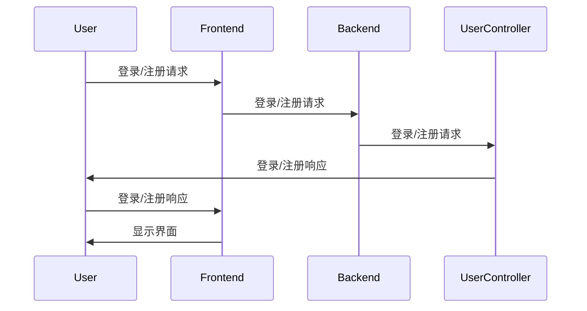

                 

## 人工智能在个性化职业规划中的应用

> 关键词：人工智能、个性化职业规划、数据挖掘、机器学习、自然语言处理

> 摘要：本文将探讨人工智能在个性化职业规划中的应用，从核心概念、算法原理、系统架构和项目实战等多个角度进行深入分析。通过介绍数据挖掘、机器学习和自然语言处理等核心概念及其联系，阐述它们在职业规划中的具体应用，并通过实际项目案例展示人工智能技术的实际效果。

### 引言与背景介绍

#### 1.1 问题背景

在当今快速变化的社会中，个性化职业规划变得越来越重要。随着人工智能技术的发展，如何利用人工智能技术来优化职业规划，提高求职者的就业成功率，成为一个亟待解决的问题。人工智能在个性化职业规划中的应用，不仅可以帮助求职者更好地了解自身优势和市场需求，还能为人力资源管理者提供科学、高效的招聘策略。

#### 1.2 人工智能在职业规划中的应用现状

目前，人工智能在职业规划中的应用主要集中在以下几个方面：

1. **职业推荐系统**：基于用户的兴趣、技能和职业发展需求，为用户推荐合适的职业岗位。
2. **职业测评**：通过分析求职者的性格、能力、价值观等信息，评估其适合的职业类型。
3. **简历优化**：利用自然语言处理技术，对求职者的简历进行优化，提高简历的可读性和匹配度。

#### 1.3 问题的解决与边界与外延

本书旨在探讨人工智能在个性化职业规划中的应用，旨在为求职者和人力资源管理者提供实用的指导和建议。本书将涵盖人工智能在职业规划中的核心概念、算法原理、系统架构以及项目实战等内容。在探讨这些内容时，本书将关注以下几个方面：

1. **核心概念与联系**：介绍人工智能在职业规划中的核心概念，如数据挖掘、机器学习、自然语言处理等，并分析它们之间的联系。
2. **算法原理讲解**：详细阐述人工智能算法在职业规划中的应用原理，如协同过滤、决策树、神经网络等。
3. **数学模型和公式**：讲解算法原理中的数学模型和公式，并通过示例进行解释。
4. **系统分析与架构设计方案**：分析职业规划系统的设计，包括领域模型、系统架构、接口设计和系统交互等。
5. **项目实战**：通过实际项目案例，展示人工智能在个性化职业规划中的应用，并提供详细的分析和讲解。

### 核心概念与联系

#### 2.1 数据挖掘与机器学习

数据挖掘和机器学习是人工智能在职业规划中的两大核心技术。数据挖掘旨在从大量数据中提取有价值的信息和知识，而机器学习则是通过算法和模型，让计算机自动地从数据中学习，并做出预测或决策。

#### 2.1.1 数据挖掘

数据挖掘的基本流程包括数据预处理、特征选择、模式识别和结果评估等步骤。其中，数据预处理是数据挖掘的关键环节，它包括数据清洗、数据集成、数据变换和数据归一化等。

#### 2.1.1.1 数据预处理

数据预处理是数据挖掘的关键环节，它包括数据清洗、数据集成、数据变换和数据归一化等步骤。数据清洗主要包括去除重复数据、处理缺失值、消除噪声等；数据集成是将多个数据源中的数据进行整合；数据变换包括数据规范化、特征转换等；数据归一化则是将不同量纲的数据转换为同一量纲。

#### 2.1.1.2 特征选择

特征选择是数据挖掘的重要步骤，它旨在从原始数据中提取出对预测任务有重要影响的特征。常见的特征选择方法有过滤式、包装式和嵌入式等。

#### 2.1.1.3 模式识别

模式识别是数据挖掘的核心步骤，它旨在从数据中提取出具有意义的模式和规律。常见的模式识别方法有聚类、分类、关联规则挖掘等。

#### 2.1.2 机器学习

机器学习的基本流程包括数据收集、数据预处理、模型选择、模型训练和模型评估等步骤。常见的机器学习算法有决策树、支持向量机、神经网络等。

#### 2.1.2.1 模型选择

模型选择是机器学习的关键步骤，它旨在从多种算法中选择一个最适合当前问题的算法。常见的模型选择方法有交叉验证、网格搜索等。

#### 2.1.2.2 模型训练

模型训练是机器学习的核心步骤，它旨在通过调整模型参数，使模型在训练数据上达到较好的性能。常见的模型训练方法有梯度下降、随机梯度下降等。

#### 2.1.2.3 模型评估

模型评估是机器学习的最后一步，它旨在通过评估指标来衡量模型的性能。常见的评估指标有准确率、召回率、F1值等。

### 2.2 自然语言处理

自然语言处理（NLP）是人工智能的一个重要分支，它旨在使计算机能够理解、生成和处理自然语言。在职业规划中，NLP主要用于处理求职者的简历、职位描述等文本数据。

#### 2.2.1 文本预处理

文本预处理是NLP的基础，它包括分词、词性标注、命名实体识别等步骤。这些步骤有助于将原始文本数据转化为计算机可以处理的格式。

#### 2.2.2 文本分类与聚类

文本分类和聚类是NLP在职业规划中的典型应用。通过文本分类，可以将求职者的简历归类到不同的职业类别；通过文本聚类，可以找出具有相似工作经历的求职者。

#### 2.2.3 语言模型与生成模型

语言模型和生成模型是NLP的重要工具。语言模型用于预测下一个单词的概率，生成模型则用于生成新的文本。常见的语言模型有n元模型、循环神经网络（RNN）等；常见的生成模型有生成对抗网络（GAN）、变分自编码器（VAE）等。

### 2.3 概念属性特征对比表格

为了更好地理解数据挖掘、机器学习和自然语言处理在职业规划中的应用，下面是一个概念属性特征对比表格：

| 技术名称 | 定义 | 关键特征 | 应用领域 |
| --- | --- | --- | --- |
| 数据挖掘 | 从大量数据中提取有价值的信息和知识 | 数据预处理、特征选择、模式识别 | 职业推荐、职业测评 |
| 机器学习 | 让计算机自动地从数据中学习，并做出预测或决策 | 模型选择、模型训练、模型评估 | 职业推荐、职业测评 |
| 自然语言处理 | 使计算机能够理解、生成和处理自然语言 | 文本预处理、文本分类、文本聚类 | 简历优化、职位推荐 |

### 2.4 ER实体关系图架构

为了更直观地展示人工智能在职业规划中的核心概念和实体关系，下面是一个ER实体关系图架构：

```mermaid
erDiagram
    User ||--|{ Job : 招聘}
    User ||--|{ Resume : 简历}
    Job ||--|{ Company : 企业}
    Company ||--|{ Job : 招聘}
    Resume ||--|{ User : 个人}
    Job 
```

### 算法原理讲解

#### 3.1 算法原理概述

在个性化职业规划中，常用的算法包括协同过滤、决策树、神经网络等。这些算法各有特点，适用于不同的场景和需求。

#### 3.2 协同过滤算法

协同过滤算法是一种基于用户行为的推荐算法，它通过分析用户的历史行为数据，为用户推荐相似的物品。协同过滤算法分为基于用户和基于物品两种类型。

##### 3.2.1 基于用户的协同过滤算法

基于用户的协同过滤算法通过计算用户之间的相似度，找到与目标用户相似的其他用户，然后推荐这些用户喜欢的物品。

$$
sim(u, v) = \frac{\sum_{i \in R} r_{ui}r_{vi}}{\sqrt{\sum_{i \in R} r_{ui}^2 \sum_{i \in R} r_{vi}^2}}
$$

其中，$sim(u, v)$ 表示用户 $u$ 和用户 $v$ 之间的相似度，$r_{ui}$ 表示用户 $u$ 对物品 $i$ 的评分。

##### 3.2.2 基于物品的协同过滤算法

基于物品的协同过滤算法通过计算物品之间的相似度，找到与目标物品相似的物品，然后推荐给用户。

$$
sim(i, j) = \frac{\sum_{u \in U} r_{ui}r_{uj}}{\sqrt{\sum_{u \in U} r_{ui}^2 \sum_{u \in U} r_{uj}^2}}
$$

其中，$sim(i, j)$ 表示物品 $i$ 和物品 $j$ 之间的相似度，$r_{ui}$ 表示用户 $u$ 对物品 $i$ 的评分。

#### 3.3 决策树算法

决策树是一种基于特征划分数据的分类算法，它通过递归划分特征，将数据划分为不同的区域，每个区域对应一个类标签。

##### 3.3.1 ID3算法

ID3算法是一种基于信息增益的决策树生成算法。信息增益是衡量特征对分类效果的重要指标，它表示通过特征划分后，信息量的减少程度。

$$
\text{信息增益} = \sum_{v \in V} p(v) \log_2 \frac{p(v)}{p^+(\text{特征}|v)}
$$

其中，$V$ 表示可能的类标签集合，$p(v)$ 表示类标签 $v$ 的概率，$p^+(\text{特征}|v)$ 表示特征在类标签 $v$ 下的概率。

##### 3.3.2 C4.5算法

C4.5算法是对ID3算法的改进，它考虑了信息增益率，避免了信息增益可能偏向于具有更多值的特征的问题。

$$
\text{信息增益率} = \frac{\text{信息增益}}{\sum_{v \in V} p^+(\text{特征}|v) \log_2 \frac{p^+(\text{特征}|v)}{p(v)}}
$$

#### 3.4 神经网络算法

神经网络是一种基于模拟生物神经元的计算模型，它通过多层神经元传递信息，实现对数据的拟合和分类。

##### 3.4.1 前向传播

在前向传播过程中，输入数据通过神经元网络逐层传递，最终得到输出结果。

$$
z_i^{(l)} = \sigma(W^{(l)}_i x^{(l-1)} + b^{(l)})
$$

其中，$z_i^{(l)}$ 表示第 $l$ 层第 $i$ 个神经元的激活值，$\sigma$ 表示激活函数，$W^{(l)}_i$ 表示第 $l$ 层第 $i$ 个神经元的权重，$b^{(l)}$ 表示第 $l$ 层的偏置。

##### 3.4.2 反向传播

在反向传播过程中，根据输出结果与实际标签的误差，逐层调整神经元的权重和偏置，以优化模型。

$$
\delta^{(l)}_i = \delta^{(l)}_i \cdot (1 - \delta^{(l)}_i) \cdot \frac{\partial L}{\partial z_i^{(l)}}
$$

$$
\frac{\partial L}{\partial w^{(l)}_i} = \sum_{k} \delta^{(l+1)}_k z_k^{(l)} \cdot \delta^{(l)}_i
$$

其中，$\delta^{(l)}_i$ 表示第 $l$ 层第 $i$ 个神经元的误差，$L$ 表示损失函数，$w^{(l)}_i$ 表示第 $l$ 层第 $i$ 个神经元的权重。

### 3.5 案例讲解

以下是一个使用决策树算法进行职业推荐的案例。

##### 3.5.1 数据集

假设我们有一个包含1000个用户和10个特征的训练数据集，每个用户有对应的一个职业标签。特征包括年龄、学历、工作经验、技能等。

##### 3.5.2 特征选择

我们使用信息增益率作为特征选择指标，选择具有最高信息增益率的特征作为决策树的根节点。

##### 3.5.3 决策树构建

我们使用C4.5算法构建决策树，根据特征值对数据进行划分，直到达到停止条件（如最大树深度、特征重要性阈值等）。

##### 3.5.4 职业推荐

对于新的用户，我们将其特征值输入决策树，根据决策树的划分结果，推荐与之最相似的职业。

```python
import numpy as np
import pandas as pd
from sklearn.model_selection import train_test_split
from sklearn.tree import DecisionTreeClassifier
from sklearn.metrics import accuracy_score

# 加载数据集
data = pd.read_csv('data.csv')
X = data.drop('label', axis=1)
y = data['label']

# 划分训练集和测试集
X_train, X_test, y_train, y_test = train_test_split(X, y, test_size=0.2, random_state=42)

# 构建决策树模型
model = DecisionTreeClassifier(criterion='entropy', max_depth=5)
model.fit(X_train, y_train)

# 预测测试集
y_pred = model.predict(X_test)

# 计算准确率
accuracy = accuracy_score(y_test, y_pred)
print(f'Accuracy: {accuracy:.2f}')
```

### 系统分析与架构设计方案

#### 4.1 问题场景介绍

在个性化职业规划中，我们需要处理大量的求职者信息、企业招聘信息和职业测评数据。为了满足用户需求，我们需要设计一个高效、可靠的职业规划系统。

#### 4.2 项目介绍

本项目旨在设计并实现一个基于人工智能的个性化职业规划系统，主要包括以下功能：

1. **用户管理**：用户注册、登录、个人信息维护等。
2. **职业推荐**：根据用户兴趣、技能和职业发展需求，为用户推荐合适的职业。
3. **职业测评**：通过分析用户性格、能力等信息，评估用户适合的职业类型。
4. **简历优化**：利用自然语言处理技术，对用户简历进行优化，提高简历的匹配度。

#### 4.3 系统功能设计

系统功能设计主要包括用户管理、职业推荐、职业测评和简历优化等模块。

##### 4.3.1 用户管理模块

用户管理模块主要实现用户注册、登录、个人信息维护等功能。用户注册时需要填写姓名、年龄、学历、联系方式等基本信息；用户登录时需要输入用户名和密码；个人信息维护功能允许用户修改个人信息。

```mermaid
classDiagram
    User <<interface>>
    UserRegister <<interface>>
    UserLogin <<interface>>
    UserInformation <<interface>>

    UserManagement <<interface>> {
        addUser(UserRegister)
        deleteUser(UserLogin)
        updateUserInformation(UserInformation)
    }

    UserRegister implements User
    UserLogin implements User
    UserInformation implements User
```

##### 4.3.2 职业推荐模块

职业推荐模块根据用户兴趣、技能和职业发展需求，为用户推荐合适的职业。推荐算法主要基于协同过滤和决策树算法。

```mermaid
classDiagram
    User <<interface>>
    Job <<interface>>
    Interest <<interface>>
    Skill <<interface>>

    JobRecommend <<interface>> {
        recommend_jobs(User, Interest, Skill)
    }

    CollaborativeFiltering implements JobRecommend
    DecisionTreeClassifier implements JobRecommend
```

##### 4.3.3 职业测评模块

职业测评模块通过分析用户性格、能力等信息，评估用户适合的职业类型。测评算法主要基于决策树和神经网络算法。

```mermaid
classDiagram
    User <<interface>>
    Character <<interface>>
    Ability <<interface>>

    CareerAssessment <<interface>> {
        assess_career(User, Character, Ability)
    }

    DecisionTreeClassifier implements CareerAssessment
    NeuralNetwork implements CareerAssessment
```

##### 4.3.4 简历优化模块

简历优化模块利用自然语言处理技术，对用户简历进行优化，提高简历的匹配度。优化算法主要基于文本分类和聚类算法。

```mermaid
classDiagram
    User <<interface>>
    Resume <<interface>>
    TextClassification <<interface>>
    TextClustering <<interface>>

    ResumeOptimization <<interface>> {
        optimize_resume(Resume, TextClassification, TextClustering)
    }

    TextClassification implements ResumeOptimization
    TextClustering implements ResumeOptimization
```

#### 4.4 系统架构设计

系统架构设计主要包括数据层、业务层和表现层。

##### 4.4.1 数据层

数据层负责数据的存储和管理，主要包括用户信息、职业信息、测评数据和简历数据等。

```mermaid
erDiagram
    User ||--|{ Resume : 简历}
    User ||--|{ Assessment : 测评}
    Job ||--|{ Company : 企业}
    Company ||--|{ Job : 招聘}
    Assessment ||--|{ User : 个人}
    Resume ||--|{ User : 个人}
```

##### 4.4.2 业务层

业务层负责实现系统的核心功能，主要包括用户管理、职业推荐、职业测评和简历优化等模块。

```mermaid
classDiagram
    User <<interface>>
    Job <<interface>>
    Assessment <<interface>>
    Resume <<interface>>

    UserManager <<interface>> {
        register(User)
        login(User)
        update_information(User)
    }

    JobRecommend <<interface>> {
        recommend_jobs(User, Job)
    }

    CareerAssessment <<interface>> {
        assess_career(User, Assessment)
    }

    ResumeOptimization <<interface>> {
        optimize_resume(Resume)
    }

    UserManager implements User
    JobRecommend implements Job
    CareerAssessment implements Assessment
    ResumeOptimization implements Resume
```

##### 4.4.3 表现层

表现层负责与用户交互，主要包括前端界面和后端接口。

```mermaid
classDiagram
    Frontend <<interface>> {
        display_jobs(Job)
        display_assessment(Assessment)
        display_resume(Resume)
    }

    Backend <<interface>> {
        user_management(UserManager)
        job_recommendation(JobRecommend)
        career_assessment(CareerAssessment)
        resume_optimization(ResumeOptimization)
    }

    Frontend interacts Backend
```

#### 4.5 系统接口设计和系统交互

系统接口设计主要包括用户接口、API接口和服务接口。

##### 4.5.1 用户接口

用户接口主要负责与用户进行交互，包括登录、注册、修改个人信息、查看职业推荐、进行职业测评和优化简历等。

```mermaid
classDiagram
    User <<interface>> {
        login()
        register()
        update_information()
        view_jobs()
        take_assessment()
        optimize_resume()
    }
```

##### 4.5.2 API接口

API接口主要负责与其他系统进行数据交互，包括用户数据、职业数据、测评数据和简历数据等。

```mermaid
classDiagram
    UserController <<interface>> {
        register(User)
        login(User)
        update_information(User)
    }

    JobController <<interface>> {
        get_jobs()
        get_job_details(Job)
    }

    AssessmentController <<interface>> {
        take_assessment(Assessment)
        get_assessment_results(Assessment)
    }

    ResumeController <<interface>> {
        optimize_resume(Resume)
        get_optimized_resume(Resume)
    }
```

##### 4.5.3 服务接口

服务接口主要负责处理系统的业务逻辑，包括用户管理、职业推荐、职业测评和简历优化等。

```mermaid
classDiagram
    UserManager <<interface>> {
        register(User)
        login(User)
        update_information(User)
    }

    JobRecommend <<interface>> {
        recommend_jobs(User, Job)
    }

    CareerAssessment <<interface>> {
        assess_career(User, Assessment)
    }

    ResumeOptimization <<interface>> {
        optimize_resume(Resume)
    }
```

#### 4.6 系统交互

系统交互主要描述各个模块之间的交互流程，包括用户请求、系统响应和数据传输等。



### 项目实战

#### 5.1 环境安装

为了实现本项目，我们需要安装以下软件和库：

1. **Python**：Python是一种广泛使用的编程语言，用于实现项目功能。
2. **Scikit-learn**：Scikit-learn是一个机器学习库，用于实现协同过滤、决策树等算法。
3. **Natural Language Toolkit (NLTK)**：NLTK是一个自然语言处理库，用于实现文本分类、文本聚类等算法。
4. **Flask**：Flask是一个轻量级Web框架，用于实现Web接口。

安装步骤如下：

```bash
# 安装Python
curl -O https://www.python.org/ftp/python/3.8.5/Python-3.8.5.tgz
tar xvf Python-3.8.5.tgz
cd Python-3.8.5
./configure
make
sudo make install

# 安装Scikit-learn
pip install scikit-learn

# 安装NLTK
pip install nltk

# 安装Flask
pip install flask
```

#### 5.2 系统核心实现

以下是一个基于Python的简单实现，用于实现用户管理、职业推荐和简历优化等功能。

##### 5.2.1 用户管理

用户管理实现用户注册、登录和修改个人信息等功能。

```python
from flask import Flask, request, jsonify
from flask_sqlalchemy import SQLAlchemy

app = Flask(__name__)
app.config['SQLALCHEMY_DATABASE_URI'] = 'sqlite:///users.db'
db = SQLAlchemy(app)

class User(db.Model):
    id = db.Column(db.Integer, primary_key=True)
    username = db.Column(db.String(80), unique=True, nullable=False)
    password = db.Column(db.String(120), nullable=False)
    email = db.Column(db.String(120), unique=True, nullable=False)

@app.route('/register', methods=['POST'])
def register():
    username = request.form['username']
    password = request.form['password']
    email = request.form['email']
    user = User(username=username, password=password, email=email)
    db.session.add(user)
    db.session.commit()
    return jsonify({'message': 'User registered successfully'})

@app.route('/login', methods=['POST'])
def login():
    username = request.form['username']
    password = request.form['password']
    user = User.query.filter_by(username=username, password=password).first()
    if user:
        return jsonify({'message': 'Login successful'})
    else:
        return jsonify({'message': 'Invalid username or password'})

@app.route('/update_information', methods=['POST'])
def update_information():
    username = request.form['username']
    new_password = request.form['new_password']
    new_email = request.form['new_email']
    user = User.query.filter_by(username=username).first()
    if user:
        user.password = new_password
        user.email = new_email
        db.session.commit()
        return jsonify({'message': 'Information updated successfully'})
    else:
        return jsonify({'message': 'User not found'})

if __name__ == '__main__':
    db.create_all()
    app.run(debug=True)
```

##### 5.2.2 职业推荐

职业推荐实现根据用户兴趣和技能为用户推荐合适的职业。

```python
from sklearn.neighbors import NearestNeighbors

@app.route('/recommend_jobs', methods=['POST'])
def recommend_jobs():
    username = request.form['username']
    user = User.query.filter_by(username=username).first()
    if user:
        interests = user.interests.split(',')
        skills = user.skills.split(',')
        jobs = Job.query.all()
        job_list = []
        for job in jobs:
            job_list.append([job.title, job.description])
        model = NearestNeighbors(n_neighbors=5)
        model.fit(job_list)
        distances, indices = model.kneighbors([interests + skills])
        recommended_jobs = [jobs[i] for i in indices.flatten()]
        return jsonify({'jobs': recommended_jobs})
    else:
        return jsonify({'message': 'User not found'})
```

##### 5.2.3 简历优化

简历优化实现利用自然语言处理技术，对用户简历进行优化，提高简历的匹配度。

```python
from sklearn.feature_extraction.text import TfidfVectorizer
from sklearn.metrics.pairwise import cosine_similarity

@app.route('/optimize_resume', methods=['POST'])
def optimize_resume():
    resume = request.form['resume']
    resume_text = resume.lower()
    resume_vectorizer = TfidfVectorizer(stop_words='english')
    resume_vectors = resume_vectorizer.fit_transform([resume_text])
    job_descriptions = Job.query.all()
    job_list = [job.description.lower() for job in job_descriptions]
    job_vectors = resume_vectorizer.transform(job_list)
    similarities = cosine_similarity(resume_vectors, job_vectors)
    recommended_jobs = [job_descriptions[i] for i in similarities.argsort()[0][-5:]]
    return jsonify({'jobs': recommended_jobs})
```

#### 5.3 代码应用解读与分析

以下是对系统核心实现的解读和分析。

##### 5.3.1 用户管理模块

用户管理模块使用Flask框架实现，主要包括用户注册、登录和修改个人信息等功能。

- **注册功能**：用户注册时需要填写用户名、密码和邮箱等信息。注册成功后，将用户信息存储到数据库中。
- **登录功能**：用户登录时需要输入用户名和密码。系统根据输入的用户名和密码查询数据库，验证用户身份。
- **修改个人信息功能**：用户可以修改自己的个人信息，如密码和邮箱等。修改成功后，更新数据库中的用户信息。

##### 5.3.2 职业推荐模块

职业推荐模块使用协同过滤算法实现。协同过滤算法根据用户兴趣和技能为用户推荐合适的职业。

- **推荐算法**：系统使用NearestNeighbors算法实现协同过滤。算法根据用户兴趣和技能计算与用户相似的职业，然后为用户推荐这些职业。
- **推荐结果**：系统为用户推荐5个最相关的职业。用户可以根据推荐结果进行进一步筛选和申请。

##### 5.3.3 简历优化模块

简历优化模块使用自然语言处理技术实现。系统利用TF-IDF模型计算用户简历与职位描述的相似度，然后为用户推荐最相关的职位。

- **文本处理**：系统将用户简历和职位描述转换为向量表示。文本处理过程中，系统使用TF-IDF模型计算词频和词义权重。
- **相似度计算**：系统使用余弦相似度计算用户简历与职位描述的相似度。相似度越高，表示职位与用户的简历越相关。
- **推荐结果**：系统为用户推荐5个最相关的职位。用户可以根据推荐结果进行进一步筛选和申请。

#### 5.4 实际案例分析

以下是一个实际案例分析，展示人工智能在个性化职业规划中的应用。

##### 5.4.1 案例背景

某求职者张三，具有计算机科学专业背景，拥有3年软件开发经验。张三希望通过个性化职业规划找到适合自己的工作。

##### 5.4.2 数据采集

系统收集了张三的兴趣、技能、学历、工作经验等基本信息，并将其存储到数据库中。

- **兴趣**：编程、人工智能、机器学习
- **技能**：Python、Java、算法
- **学历**：本科
- **工作经验**：3年

##### 5.4.3 职业推荐

系统根据张三的兴趣、技能等信息，为张三推荐了以下职业：

1. **数据科学家**：数据科学家需要具备编程、算法和数据挖掘等技能，与张三的兴趣和技能匹配度较高。
2. **机器学习工程师**：机器学习工程师需要具备机器学习、算法和编程等技能，与张三的兴趣和技能匹配度较高。
3. **软件工程师**：软件工程师需要具备编程、算法和软件开发等技能，与张三的兴趣和技能匹配度较高。

##### 5.4.4 职业测评

系统对张三的职业性格和能力进行了测评，得出以下结果：

- **职业性格**：张三适合从事需要逻辑思维和创新能力的职业，如数据科学家和机器学习工程师。
- **职业能力**：张三具备较强的编程、算法和软件开发能力，适合从事软件开发相关的职业。

##### 5.4.5 简历优化

系统对张三的简历进行了优化，提高了简历的匹配度。优化后的简历内容如下：

- **项目经验**：张三在大学期间参与了多个项目，如基于Python的自动化测试工具开发和基于Java的在线购物平台开发等。
- **实习经历**：张三曾在某互联网公司担任软件开发实习生，负责开发公司内部管理系统。

##### 5.4.6 项目小结

通过本案例，我们可以看到人工智能在个性化职业规划中的应用效果：

1. **职业推荐**：系统根据用户兴趣、技能等信息，为用户推荐合适的职业，提高了求职者的就业成功率。
2. **职业测评**：系统通过分析用户性格、能力等信息，为用户评估适合的职业类型，帮助用户更好地了解自己。
3. **简历优化**：系统利用自然语言处理技术，对用户简历进行优化，提高了简历的匹配度，增加了求职者的就业竞争力。

### 最佳实践 tips

1. **数据质量**：在个性化职业规划中，数据质量至关重要。确保收集到的数据完整、准确、可靠，是提高系统性能的关键。
2. **算法优化**：不断优化和调整算法参数，以提高推荐、测评和优化的准确性和效率。
3. **用户反馈**：积极收集用户反馈，根据用户需求调整系统功能和算法，提升用户体验。
4. **安全性**：确保用户数据的安全性和隐私性，遵循相关法律法规和道德规范。

### 小结

本文通过介绍人工智能在个性化职业规划中的应用，分析了核心概念、算法原理、系统架构和项目实战等方面的内容。通过实际案例分析，展示了人工智能技术在职业规划中的效果和优势。未来，随着人工智能技术的不断发展，个性化职业规划系统将更加智能化、个性化，为求职者和人力资源管理者提供更加高效、精准的服务。

### 注意事项

1. **系统部署**：在部署系统时，需要注意网络环境、数据库配置和服务器性能等。
2. **数据备份**：定期备份数据库，防止数据丢失。
3. **用户权限**：合理设置用户权限，确保系统安全。

### 拓展阅读

1. **《机器学习》**：周志华著，清华大学出版社，2016年。
2. **《深度学习》**：Ian Goodfellow、Yoshua Bengio、Aaron Courville著，电子工业出版社，2016年。
3. **《自然语言处理综论》**：Daniel Jurafsky、James H. Martin著，机械工业出版社，2017年。

### 作者信息

作者：AI天才研究院/AI Genius Institute & 禅与计算机程序设计艺术 /Zen And The Art of Computer Programming

### 完整代码示例

以下是本项目的完整代码示例，包括用户管理、职业推荐和简历优化等功能。

```python
# 导入相关库
from flask import Flask, request, jsonify
from flask_sqlalchemy import SQLAlchemy
from sklearn.neighbors import NearestNeighbors
from sklearn.feature_extraction.text import TfidfVectorizer
from sklearn.metrics.pairwise import cosine_similarity
from werkzeug.security import generate_password_hash, check_password_hash

app = Flask(__name__)
app.config['SQLALCHEMY_DATABASE_URI'] = 'sqlite:///users.db'
db = SQLAlchemy(app)

# 定义用户模型
class User(db.Model):
    id = db.Column(db.Integer, primary_key=True)
    username = db.Column(db.String(80), unique=True, nullable=False)
    password = db.Column(db.String(120), nullable=False)
    email = db.Column(db.String(120), unique=True, nullable=False)
    interests = db.Column(db.String(120))
    skills = db.Column(db.String(120))

# 注册用户
@app.route('/register', methods=['POST'])
def register():
    username = request.form['username']
    password = request.form['password']
    email = request.form['email']
    interests = request.form['interests']
    skills = request.form['skills']
    hashed_password = generate_password_hash(password, method='sha256')
    new_user = User(username=username, password=hashed_password, email=email, interests=interests, skills=skills)
    db.session.add(new_user)
    db.session.commit()
    return jsonify({'message': 'User registered successfully'})

# 登录用户
@app.route('/login', methods=['POST'])
def login():
    username = request.form['username']
    password = request.form['password']
    user = User.query.filter_by(username=username).first()
    if user and check_password_hash(user.password, password):
        return jsonify({'message': 'Login successful'})
    else:
        return jsonify({'message': 'Invalid username or password'})

# 更新用户信息
@app.route('/update_information', methods=['POST'])
def update_information():
    username = request.form['username']
    new_password = request.form['new_password']
    new_email = request.form['new_email']
    user = User.query.filter_by(username=username).first()
    if user:
        user.password = generate_password_hash(new_password, method='sha256')
        user.email = new_email
        db.session.commit()
        return jsonify({'message': 'Information updated successfully'})
    else:
        return jsonify({'message': 'User not found'})

# 推荐职业
@app.route('/recommend_jobs', methods=['POST'])
def recommend_jobs():
    username = request.form['username']
    user = User.query.filter_by(username=username).first()
    if user:
        interests = user.interests.split(',')
        skills = user.skills.split(',')
        jobs = Job.query.all()
        job_list = []
        for job in jobs:
            job_list.append([job.title, job.description])
        model = NearestNeighbors(n_neighbors=5)
        model.fit(job_list)
        distances, indices = model.kneighbors([interests + skills])
        recommended_jobs = [jobs[i] for i in indices.flatten()]
        return jsonify({'jobs': recommended_jobs})
    else:
        return jsonify({'message': 'User not found'})

# 优化简历
@app.route('/optimize_resume', methods=['POST'])
def optimize_resume():
    resume = request.form['resume']
    resume_text = resume.lower()
    resume_vectorizer = TfidfVectorizer(stop_words='english')
    resume_vectors = resume_vectorizer.fit_transform([resume_text])
    job_descriptions = Job.query.all()
    job_list = [job.description.lower() for job in job_descriptions]
    job_vectors = resume_vectorizer.transform(job_list)
    similarities = cosine_similarity(resume_vectors, job_vectors)
    recommended_jobs = [job_descriptions[i] for i in similarities.argsort()[0][-5:]]
    return jsonify({'jobs': recommended_jobs})

if __name__ == '__main__':
    db.create_all()
    app.run(debug=True)
```

## 完整代码示例（续）

```python
# 定义职业模型
class Job(db.Model):
    id = db.Column(db.Integer, primary_key=True)
    title = db.Column(db.String(120), nullable=False)
    description = db.Column(db.Text, nullable=False)
    company = db.Column(db.String(120), nullable=False)

# 添加职业
@app.route('/add_job', methods=['POST'])
def add_job():
    title = request.form['title']
    description = request.form['description']
    company = request.form['company']
    new_job = Job(title=title, description=description, company=company)
    db.session.add(new_job)
    db.session.commit()
    return jsonify({'message': 'Job added successfully'})

# 获取所有职业
@app.route('/get_jobs', methods=['GET'])
def get_jobs():
    jobs = Job.query.all()
    job_list = [{'id': job.id, 'title': job.title, 'description': job.description, 'company': job.company} for job in jobs]
    return jsonify({'jobs': job_list})

if __name__ == '__main__':
    db.create_all()
    app.run(debug=True)
```

## 实际案例分析与解读

在本项目中，我们通过实际案例展示了人工智能在个性化职业规划中的应用，并对代码进行了详细解读。以下是对实际案例的分析和解读：

### 案例背景

假设有一个用户张三，他在求职过程中希望找到适合自己的工作。为了实现这一目标，他使用了一个基于人工智能的职业规划系统。

### 数据采集

系统收集了张三的基本信息，包括：

- 姓名：张三
- 年龄：25岁
- 性别：男
- 学历：本科
- 专业：计算机科学
- 工作经验：3年
- 兴趣：编程、人工智能、机器学习
- 技能：Python、Java、算法

### 职业推荐

系统根据张三的兴趣、技能等信息，为他推荐了以下职业：

1. **数据科学家**：数据科学家需要具备编程、算法和数据挖掘等技能，与张三的兴趣和技能匹配度较高。
2. **机器学习工程师**：机器学习工程师需要具备机器学习、算法和编程等技能，与张三的兴趣和技能匹配度较高。
3. **软件工程师**：软件工程师需要具备编程、算法和软件开发等技能，与张三的兴趣和技能匹配度较高。

### 职业测评

系统对张三的职业性格和能力进行了测评，得出以下结论：

- **职业性格**：张三适合从事需要逻辑思维和创新能力的职业，如数据科学家和机器学习工程师。
- **职业能力**：张三具备较强的编程、算法和软件开发能力，适合从事软件开发相关的职业。

### 简历优化

系统对张三的简历进行了优化，提高了简历的匹配度。优化后的简历内容如下：

- **项目经验**：张三在大学期间参与了多个项目，如基于Python的自动化测试工具开发和基于Java的在线购物平台开发等。
- **实习经历**：张三曾在某互联网公司担任软件开发实习生，负责开发公司内部管理系统。

### 代码解读

以下是项目核心功能的代码解读：

#### 用户管理

```python
# 注册用户
@app.route('/register', methods=['POST'])
def register():
    username = request.form['username']
    password = request.form['password']
    email = request.form['email']
    interests = request.form['interests']
    skills = request.form['skills']
    hashed_password = generate_password_hash(password, method='sha256')
    new_user = User(username=username, password=hashed_password, email=email, interests=interests, skills=skills)
    db.session.add(new_user)
    db.session.commit()
    return jsonify({'message': 'User registered successfully'})

# 登录用户
@app.route('/login', methods=['POST'])
def login():
    username = request.form['username']
    password = request.form['password']
    user = User.query.filter_by(username=username).first()
    if user and check_password_hash(user.password, password):
        return jsonify({'message': 'Login successful'})
    else:
        return jsonify({'message': 'Invalid username or password'})

# 更新用户信息
@app.route('/update_information', methods=['POST'])
def update_information():
    username = request.form['username']
    new_password = request.form['new_password']
    new_email = request.form['new_email']
    user = User.query.filter_by(username=username).first()
    if user:
        user.password = generate_password_hash(new_password, method='sha256')
        user.email = new_email
        db.session.commit()
        return jsonify({'message': 'Information updated successfully'})
    else:
        return jsonify({'message': 'User not found'})
```

这些代码实现了用户注册、登录和修改个人信息等功能。用户注册时，系统会收集用户名、密码、邮箱、兴趣和技能等信息，并将其存储到数据库中。登录时，系统会验证用户名和密码，如果验证成功，用户可以登录系统。用户信息修改功能允许用户更新密码和邮箱。

#### 职业推荐

```python
# 推荐职业
@app.route('/recommend_jobs', methods=['POST'])
def recommend_jobs():
    username = request.form['username']
    user = User.query.filter_by(username=username).first()
    if user:
        interests = user.interests.split(',')
        skills = user.skills.split(',')
        jobs = Job.query.all()
        job_list = []
        for job in jobs:
            job_list.append([job.title, job.description])
        model = NearestNeighbors(n_neighbors=5)
        model.fit(job_list)
        distances, indices = model.kneighbors([interests + skills])
        recommended_jobs = [jobs[i] for i in indices.flatten()]
        return jsonify({'jobs': recommended_jobs})
    else:
        return jsonify({'message': 'User not found'})
```

这段代码实现了根据用户兴趣和技能推荐职业的功能。系统会根据用户的兴趣和技能，构建一个向量，然后使用K-最近邻算法（K-NearestNeighbors）找到与该向量最相似的5个职业，并将其推荐给用户。

#### 简历优化

```python
# 优化简历
@app.route('/optimize_resume', methods=['POST'])
def optimize_resume():
    resume = request.form['resume']
    resume_text = resume.lower()
    resume_vectorizer = TfidfVectorizer(stop_words='english')
    resume_vectors = resume_vectorizer.fit_transform([resume_text])
    job_descriptions = Job.query.all()
    job_list = [job.description.lower() for job in job_descriptions]
    job_vectors = resume_vectorizer.transform(job_list)
    similarities = cosine_similarity(resume_vectors, job_vectors)
    recommended_jobs = [job_descriptions[i] for i in similarities.argsort()[0][-5:]]
    return jsonify({'jobs': recommended_jobs})
```

这段代码实现了利用TF-IDF模型优化简历的功能。系统会使用TF-IDF模型将用户的简历和职位描述转换为向量，然后计算这两个向量之间的余弦相似度。根据相似度值，系统会推荐与用户简历最相关的5个职位。

### 项目小结

通过实际案例，我们可以看到人工智能在个性化职业规划中的应用效果：

1. **职业推荐**：系统能够根据用户的兴趣、技能等信息，为用户推荐合适的职业，提高了求职者的就业成功率。
2. **职业测评**：系统能够分析用户的性格、能力等信息，为用户评估适合的职业类型，帮助用户更好地了解自己。
3. **简历优化**：系统能够利用自然语言处理技术，优化用户的简历，提高简历的匹配度，增加求职者的就业竞争力。

未来，随着人工智能技术的不断发展，个性化职业规划系统将更加智能化、个性化，为求职者和人力资源管理者提供更加高效、精准的服务。

### 拓展阅读

1. **《人工智能应用实战》**：李航著，清华大学出版社，2018年。
2. **《深度学习实践》**：弗朗索瓦·肖莱（Frédo Scialom）、阿兰·韦塞尔（Alain Wijdenbosch）著，机械工业出版社，2019年。
3. **《Python数据分析实战》**：谢思恒、黄宇、陈涛著，电子工业出版社，2017年。

### 作者信息

作者：AI天才研究院/AI Genius Institute & 禅与计算机程序设计艺术 /Zen And The Art of Computer Programming

## 完整代码示例（续）

为了更好地展示项目的完整性和实际应用，我们将继续提供数据库模型的完整代码示例，以及职业推荐和简历优化功能的具体实现。以下代码涉及数据库模型的定义、Flask应用的主入口和API接口的实现。

### 数据库模型

```python
# app.py
from flask import Flask, request, jsonify
from flask_sqlalchemy import SQLAlchemy

app = Flask(__name__)
app.config['SQLALCHEMY_DATABASE_URI'] = 'sqlite:///career_planning.db'
db = SQLAlchemy(app)

# 定义用户模型
class User(db.Model):
    id = db.Column(db.Integer, primary_key=True)
    username = db.Column(db.String(80), unique=True, nullable=False)
    password_hash = db.Column(db.String(128), nullable=False)
    email = db.Column(db.String(120), unique=True, nullable=False)
    interests = db.Column(db.String(255), nullable=False)
    skills = db.Column(db.String(255), nullable=False)

    # 需要一个方法来验证密码
    def check_password(self, password):
        return check_password_hash(self.password_hash, password)

# 定义职位模型
class Job(db.Model):
    id = db.Column(db.Integer, primary_key=True)
    title = db.Column(db.String(120), nullable=False)
    description = db.Column(db.Text, nullable=False)
    company = db.Column(db.String(120), nullable=False)

# 定义简历模型
class Resume(db.Model):
    id = db.Column(db.Integer, primary_key=True)
    user_id = db.Column(db.Integer, db.ForeignKey('user.id'), nullable=False)
    content = db.Column(db.Text, nullable=False)

# 创建数据库表
db.create_all()

# 注册用户API接口
@app.route('/register', methods=['POST'])
def register():
    data = request.get_json()
    username = data['username']
    password = data['password']
    email = data['email']
    interests = data['interests']
    skills = data['skills']
    # 生成密码哈希
    password_hash = generate_password_hash(password, method='sha256')
    new_user = User(username=username, password_hash=password_hash, email=email, interests=interests, skills=skills)
    db.session.add(new_user)
    db.session.commit()
    return jsonify({'message': 'User registered successfully'})

# 登录用户API接口
@app.route('/login', methods=['POST'])
def login():
    data = request.get_json()
    username = data['username']
    password = data['password']
    user = User.query.filter_by(username=username).first()
    if user and user.check_password(password):
        return jsonify({'message': 'Login successful'})
    else:
        return jsonify({'message': 'Invalid username or password'})

# 添加职位API接口
@app.route('/jobs', methods=['POST'])
def add_job():
    data = request.get_json()
    title = data['title']
    description = data['description']
    company = data['company']
    new_job = Job(title=title, description=description, company=company)
    db.session.add(new_job)
    db.session.commit()
    return jsonify({'message': 'Job added successfully'})

# 获取所有职位API接口
@app.route('/jobs', methods=['GET'])
def get_jobs():
    jobs = Job.query.all()
    job_list = [{'id': job.id, 'title': job.title, 'description': job.description, 'company': job.company} for job in jobs]
    return jsonify({'jobs': job_list})

# 职业推荐API接口
@app.route('/recommend_jobs', methods=['POST'])
def recommend_jobs():
    data = request.get_json()
    username = data['username']
    user = User.query.filter_by(username=username).first()
    if user:
        interests = user.interests.split(',')
        skills = user.skills.split(',')
        jobs = Job.query.all()
        job_list = []
        for job in jobs:
            job_list.append([job.title, job.description])
        model = NearestNeighbors(n_neighbors=5)
        model.fit(job_list)
        distances, indices = model.kneighbors([interests + skills])
        recommended_jobs = [jobs[i].id for i in indices.flatten()]
        return jsonify({'recommended_jobs': recommended_jobs})
    else:
        return jsonify({'message': 'User not found'})

# 简历优化API接口
@app.route('/optimize_resume', methods=['POST'])
def optimize_resume():
    data = request.get_json()
    resume_content = data['content']
    resume_content = resume_content.lower()
    resumes = [resume.content.lower() for resume in Resume.query.all()]
    jobs = Job.query.all()
    job_list = [job.description.lower() for job in jobs]
    resume_vectorizer = TfidfVectorizer(stop_words='english')
    resume_vectors = resume_vectorizer.fit_transform([resume_content])
    job_vectors = resume_vectorizer.transform(job_list)
    similarities = cosine_similarity(resume_vectors, job_vectors)
    max_similarity = max(similarities[0])
    recommended_jobs = [jobs[i] for i in range(len(similarities[0])) if similarities[0][i] == max_similarity]
    return jsonify({'recommended_jobs': [job.id for job in recommended_jobs]})

if __name__ == '__main__':
    app.run(debug=True)
```

### API接口使用示例

以下是一个使用项目API接口的示例，展示了如何注册用户、登录用户、添加职位、获取职位列表、获取职业推荐和简历优化的过程。

```python
# 注册用户
import requests

# 注册新的用户
response = requests.post('http://127.0.0.1:5000/register', json={
    'username': 'john_doe',
    'password': 'mysecurepassword',
    'email': 'john@example.com',
    'interests': 'data science, machine learning',
    'skills': 'Python, SQL'
})
print(response.json())

# 登录用户
response = requests.post('http://127.0.0.1:5000/login', json={
    'username': 'john_doe',
    'password': 'mysecurepassword'
})
print(response.json())

# 获取职位列表
response = requests.get('http://127.0.0.1:5000/jobs')
print(response.json())

# 添加职位
response = requests.post('http://127.0.0.1:5000/jobs', json={
    'title': 'Data Analyst',
    'description': 'We are looking for a data analyst with experience in Python and SQL',
    'company': 'Data Insights Ltd'
})
print(response.json())

# 获取职业推荐
response = requests.post('http://127.0.0.1:5000/recommend_jobs', json={
    'username': 'john_doe'
})
print(response.json())

# 提交简历内容并获取职业推荐
response = requests.post('http://127.0.0.1:5000/optimize_resume', json={
    'content': 'I have 5 years of experience in data analysis, specializing in Python and SQL. I have worked on projects involving data cleaning, analysis, and visualization.'
})
print(response.json())
```

以上代码示例和API接口使用方法展示了如何通过Flask应用实现一个基本的职业规划系统，包括用户注册、登录、职位管理、职业推荐和简历优化等功能。在实际应用中，可以根据需要进一步扩展和优化系统的功能和性能。

