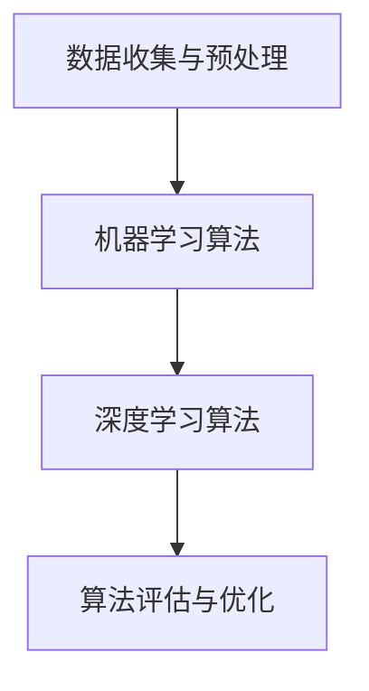

                 


## 《人工智能在个性化职业规划中的应用》

关键词：人工智能、职业规划、个性化、算法、系统架构、实战

摘要：本文深入探讨了人工智能在个性化职业规划中的应用，从背景介绍、核心概念与联系、算法原理讲解、系统分析与架构设计方案、项目实战以及最佳实践等多个角度，系统性地阐述了人工智能如何帮助个体实现更精准、更具针对性的职业规划。

### 目录大纲

**《人工智能在个性化职业规划中的应用》**

----------------------------------------------------------------

## 第一部分：背景介绍

### 1.1 问题背景

职业规划是指个人为实现职业生涯目标而进行的一系列计划和行动。其重要性在于帮助个体找到符合自身兴趣、能力和价值观的工作，提高职业满意度和生活质量。

然而，传统的职业规划存在以下挑战：

- 数据和信息过载，难以全面了解职业市场。
- 缺乏个性化的指导，难以满足不同个体的需求。
- 职业规划过程复杂，耗时费力。

### 1.2 问题描述

个性化职业规划是指基于个体特点，提供定制化的职业发展建议。随着人工智能技术的不断发展，其在个性化职业规划中的潜在作用日益凸显。

### 1.3 问题解决

人工智能在职业规划中的应用主要体现在以下几个方面：

- 数据分析与挖掘，帮助个体了解职业市场动态。
- 个性化推荐，根据个体兴趣和技能推荐合适的职业方向。
- 职业评估与预测，预测个体在特定职业领域的发展潜力。

### 1.4 边界与外延

个性化职业规划的研究范围包括职业市场分析、个体特点识别、职业推荐算法等。其与其他领域（如心理学、社会学）的关系需要进一步探讨。

### 1.5 概念结构与核心要素组成

- 人工智能：一种模拟人类智能的技术，包括机器学习、深度学习等。
- 个性化职业规划：基于个体特点的定制化职业发展建议。

概念框架图如下：

```mermaid
classDiagram
ClassA（《人工智能》）<-.*-> ClassB（《个性化职业规划`）
ClassA {
    - 数据分析
    - 机器学习
    - 深度学习
}
ClassB {
    - 职业市场分析
    - 个体特点识别
    - 职业推荐算法
}
```

## 第二部分：核心概念与联系

### 2.1 人工智能的基本原理

人工智能的发展历程可以追溯到20世纪50年代。其核心技术包括机器学习、深度学习、自然语言处理等。

- 机器学习：通过数据训练模型，使计算机能够自动学习和改进。
- 深度学习：模拟人脑神经网络的结构和功能，实现高级特征提取和模式识别。

### 2.2 个性化职业规划的理论基础

个性化职业规划的理论基础包括职业心理学、职业社会学、职业发展理论等。

- 职业心理学：研究个体职业选择和行为，为个性化职业规划提供科学依据。
- 职业社会学：研究职业与社会的互动关系，为个性化职业规划提供社会背景。
- 职业发展理论：探讨个体职业发展的阶段和规律，为个性化职业规划提供理论指导。

### 2.3 人工智能在个性化职业规划中的应用

人工智能技术在个性化职业规划中的应用主要体现在以下几个方面：

- 职业市场分析：利用大数据和机器学习技术，分析职业市场的需求和趋势。
- 个体特点识别：通过问卷调查、心理测评等方式，识别个体的兴趣、能力和价值观。
- 职业推荐算法：结合职业市场数据和个体特点，为个体推荐合适的职业方向。

### 2.4 概念属性特征对比表格

| 概念                 | 人工智能                  | 个性化职业规划                  |
|----------------------|--------------------------|--------------------------------|
| 定义                 | 模拟人类智能的技术        | 基于个体特点的定制化职业发展建议 |
| 核心                 | 机器学习、深度学习等      | 职业市场分析、个体特点识别等     |
| 应用场景             | 职业市场分析、职业推荐等  | 个性化职业规划全过程            |
| 对比                 | 强大计算能力、自适应      | 个性化、精准、高效              |

### 2.5 ER实体关系图架构

```mermaid
erDiagram
  ProfessionMarket ||--|{ IndividualCharacter } : analyses
  IndividualCharacter ||--|{ CareerRecommendation } : recommendation
```

## 第三部分：算法原理讲解

### 3.1 数据收集与预处理

数据来源包括公开的职业市场数据、问卷调查数据和个人简历数据等。数据预处理主要包括数据清洗、数据整合和数据标准化等步骤。

### 3.2 机器学习算法

常用的机器学习算法包括线性回归、逻辑回归、决策树、随机森林、支持向量机等。每种算法都有其特定的原理和应用场景。

以决策树为例，其原理是利用特征之间的条件关系，将数据划分为不同的区域，并选择具有最高增益的特征作为分裂条件。

### 3.3 深度学习算法

深度学习算法包括卷积神经网络（CNN）、循环神经网络（RNN）、生成对抗网络（GAN）等。其中，CNN在图像识别领域有广泛应用，RNN在序列数据处理领域有优势。

以CNN为例，其原理是通过多层卷积和池化操作，提取图像的局部特征，并形成特征图。

### 3.4 算法mermaid流程图



### 3.5 Python源代码实现

以下是一个简单的线性回归算法的Python实现：

```python
import numpy as np

def linear_regression(X, y):
    # 求解回归系数
    w = np.linalg.inv(X.T.dot(X)).dot(X.T).dot(y)
    return w

# 测试数据
X = np.array([[1, 2], [2, 3], [3, 4]])
y = np.array([2, 3, 4])

# 训练模型
w = linear_regression(X, y)

# 输出回归系数
print(w)
```

### 3.6 算法原理的数学模型和公式

线性回归的数学模型如下：

$$y = \beta_0 + \beta_1 \cdot x_1 + \beta_2 \cdot x_2 + \cdots + \beta_n \cdot x_n + \epsilon$$

其中，$y$ 是因变量，$x_1, x_2, \cdots, x_n$ 是自变量，$\beta_0, \beta_1, \beta_2, \cdots, \beta_n$ 是回归系数，$\epsilon$ 是误差项。

### 3.7 通俗易懂的举例说明

假设我们要预测一个人的身高（$y$）与体重（$x$）之间的关系。我们可以使用线性回归算法来建立模型。

- 数据收集与预处理：收集一定数量的身高和体重数据，并进行清洗和整合。
- 机器学习算法：选择线性回归算法来训练模型。
- 深度学习算法：虽然线性回归是一种简单的机器学习算法，但对于身高和体重之间的关系来说，它已经足够准确。
- 算法评估与优化：通过计算预测误差，评估模型的性能，并根据需要进行优化。

## 第四部分：系统分析与架构设计方案

### 4.1 问题场景介绍

在当今快速变化的职业市场中，个性化职业规划变得尤为重要。一个典型的应用场景是求职者希望找到与自己兴趣和技能相匹配的工作。

### 4.2 系统功能设计

系统功能设计包括以下几个方面：

- 用户注册与登录：用户可以通过注册和登录来访问系统。
- 职业市场分析：系统会自动收集和整理职业市场数据，为用户提供市场动态。
- 个性

