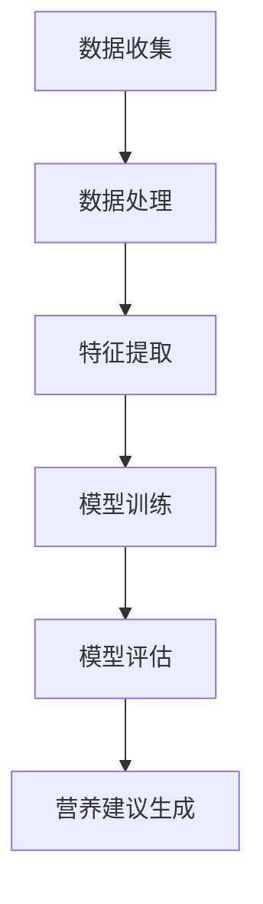
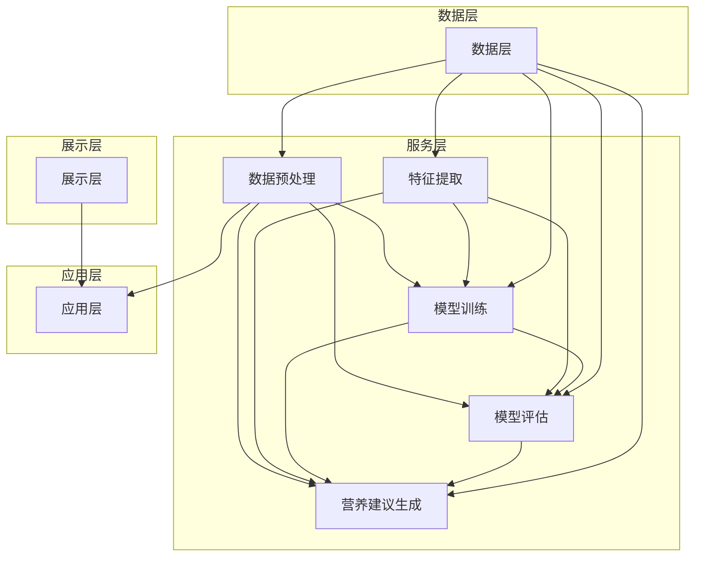
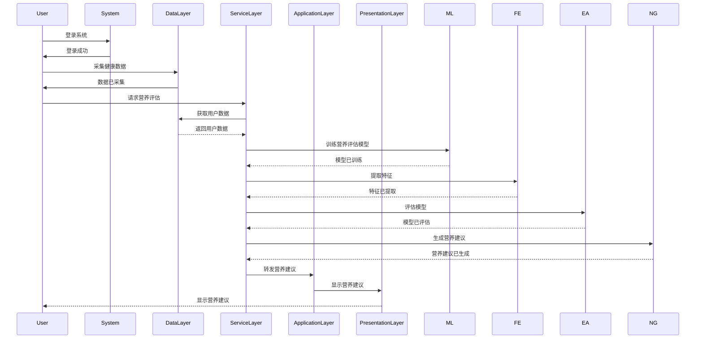

                 

### 人工智能在个性化营养建议中的应用

> 关键词：人工智能、个性化营养、机器学习、数据挖掘、系统架构

> 摘要：本文深入探讨了人工智能在个性化营养建议中的应用。从问题背景出发，介绍了核心概念和人工智能的基本原理。随后，详细分析了机器学习算法在营养健康领域的应用，通过Mermaid流程图和Python代码示例，讲解了算法原理和实现方法。接着，讨论了数据挖掘技术在个性化营养建议系统中的关键作用，展示了数据预处理、特征提取和模型评估的过程。最后，文章提出了个性化营养建议系统的整体架构设计，并通过一个实际项目展示了系统的开发和应用，总结了最佳实践和未来展望。

### 引言

在当今社会，随着人们对健康和生活质量的关注不断增加，个性化营养建议逐渐成为研究热点。个性化营养建议旨在根据个体的健康状况、饮食习惯、生活方式等特征，提供定制化的饮食建议，从而实现营养均衡、预防疾病和提高生活质量。然而，传统的营养建议往往是基于一般性原则和统计数据，难以满足个体差异化的需求。随着人工智能技术的发展，尤其是机器学习和数据挖掘技术的应用，个性化营养建议系统逐渐从理论走向实践。

人工智能在个性化营养建议中的应用，不仅能够提高营养建议的准确性，还能够提升系统的用户体验和适应性。本文将首先介绍个性化营养建议的背景和核心概念，随后深入探讨机器学习算法和数据挖掘技术在营养健康领域的应用，最后提出一个具体的个性化营养建议系统架构，并通过实际项目进行案例分析。

### 个性化营养建议的背景

#### 食品与营养健康

食品和营养健康是维持人类生命活动的基础。食物不仅提供能量，还包含多种营养成分，如蛋白质、脂肪、碳水化合物、维生素和矿物质等。合理的膳食结构对于维持身体健康、预防疾病和延缓衰老具有重要意义。然而，现代生活方式的改变和环境污染等因素，使得人们面临越来越多的健康问题，如肥胖、糖尿病、心血管疾病等。

#### 个性化营养需求

个性化营养需求强调根据个体的健康状况、基因、生活方式和饮食习惯，制定个性化的饮食方案。与传统的统一营养建议相比，个性化营养建议能够更好地满足个体的营养需求，避免营养过剩或不足。例如，对于糖尿病患者，个性化的营养建议可能包括控制血糖水平的食物选择；对于健身爱好者，个性化的营养建议可能侧重于蛋白质和碳水化合物摄入的平衡。

#### 人工智能在营养领域的应用潜力

人工智能在营养领域的应用潜力巨大。通过机器学习和数据挖掘技术，可以处理和分析大量的营养数据，提取出有用的信息和规律，从而为个性化营养建议提供支持。例如，机器学习算法可以用于分析个体的饮食习惯，预测其营养摄入状况；数据挖掘技术可以用于挖掘营养数据的潜在规律，为制定个性化营养建议提供科学依据。

### 核心概念

#### 人工智能概述

人工智能（Artificial Intelligence, AI）是计算机科学的一个分支，旨在使计算机具备类似于人类智能的能力。人工智能包括多个子领域，如机器学习、深度学习、自然语言处理等。机器学习是人工智能的一个重要分支，它通过算法从数据中自动学习规律，实现预测和决策。

#### 个性化营养建议系统构成

个性化营养建议系统通常包括数据收集模块、数据处理模块、营养评估模块和营养建议生成模块。数据收集模块负责收集个体的健康信息、饮食习惯和生活方式数据；数据处理模块负责清洗和预处理数据，为后续分析做准备；营养评估模块利用机器学习和数据挖掘技术，分析个体数据，评估其营养状况；营养建议生成模块根据营养评估结果，为个体提供个性化的饮食建议。

#### 数据驱动营养模型

数据驱动营养模型是个性化营养建议系统的核心。该模型基于大量的营养数据，通过机器学习和数据挖掘技术，提取出营养规律和个体特征，从而为个体提供准确的营养建议。数据驱动营养模型通常包括以下几个关键步骤：数据收集、数据预处理、特征提取、模型训练和模型评估。

### 个性化营养建议系统的核心概念与联系

#### 概念原理

个性化营养建议系统的概念原理主要包括以下几个方面：

1. **数据收集**：通过多种渠道收集个体的健康数据、饮食习惯和生活方式数据。
2. **数据处理**：对收集到的数据进行分析、清洗和预处理，提取出有用的信息和特征。
3. **特征提取**：从预处理后的数据中提取出与营养健康相关的特征，如营养素摄入量、饮食习惯、生活方式等。
4. **模型训练**：利用机器学习算法，对特征进行训练，建立营养评估模型。
5. **模型评估**：对训练好的模型进行评估，确保其准确性和可靠性。
6. **营养建议生成**：根据营养评估结果，为个体提供个性化的饮食建议。

#### 概念属性特征对比

以下是机器学习算法、数据挖掘技术和个性化健康评估的主要属性特征对比表格：

| 算法/技术           | 特点                                                         | 应用场景                               |
|------------------|------------------------------------------------------------|--------------------------------------|
| 机器学习           | 从数据中自动学习规律，实现预测和决策                             | 预测营养摄入量、评估营养状况             |
| 数据挖掘           | 从大量数据中提取出有用的信息和知识                               | 挖掘营养数据中的潜在规律               |
| 个性化健康评估       | 结合个体特征，提供个性化的营养建议                             | 为个体制定个性化的饮食方案             |

#### ER实体关系图架构

以下是个性化营养建议系统的ER（Entity-Relationship，实体-关系）图架构：

```mermaid
erDiagram
  用户 ||--|{ 营养信息 }
  用户 ||--|{ 健康信息 }
  用户 ||--|{ 饮食习惯 }
  用户 ||--|{ 生活方式 }
  营养信息 ||--|{ 营养评估 }
  营养评估 ||--|{ 营养建议 }
```

这个ER图展示了系统中主要的实体和它们之间的关系，为后续的系统设计和实现提供了参考。

### 机器学习算法在营养中的应用

#### 算法原理

机器学习算法是人工智能的核心技术之一，它通过训练数据集来学习规律，从而对未知数据进行预测和决策。在个性化营养建议系统中，机器学习算法广泛应用于营养摄入量预测、营养状况评估和个性化饮食建议生成等方面。

以下是几种常见的机器学习算法及其原理：

1. **监督学习**：监督学习是一种常见的机器学习算法，它通过已知的输入输出对模型进行训练，从而实现对未知数据的预测。在个性化营养建议系统中，监督学习可以用于预测个体的营养摄入量，从而为其提供个性化的饮食建议。

2. **无监督学习**：无监督学习是一种不使用已知的输入输出对模型进行训练的机器学习算法。它通过分析数据中的内在结构，发现数据中的规律和模式。在个性化营养建议系统中，无监督学习可以用于挖掘营养数据中的潜在规律，从而提高营养评估的准确性。

3. **强化学习**：强化学习是一种通过不断尝试和错误来学习最优策略的机器学习算法。它通过奖励机制来引导模型不断优化决策。在个性化营养建议系统中，强化学习可以用于优化营养评估模型，使其更好地适应个体的变化。

#### Mermaid流程图

以下是机器学习算法在个性化营养建议系统中的Mermaid流程图：



这个流程图展示了个性化营养建议系统中机器学习算法的各个步骤，以及它们之间的数据流动。

#### Python源代码示例

以下是一个简单的Python代码示例，用于实现机器学习算法在个性化营养建议系统中的应用：

```python
import pandas as pd
from sklearn.model_selection import train_test_split
from sklearn.ensemble import RandomForestRegressor
from sklearn.metrics import mean_squared_error

# 加载数据集
data = pd.read_csv('nutrition_data.csv')

# 数据预处理
X = data.drop(['nutrition mennory'], axis=1)
y = data['nutrition mennory']

# 数据集划分
X_train, X_test, y_train, y_test = train_test_split(X, y, test_size=0.2, random_state=42)

# 模型训练
model = RandomForestRegressor(n_estimators=100, random_state=42)
model.fit(X_train, y_train)

# 模型评估
y_pred = model.predict(X_test)
mse = mean_squared_error(y_test, y_pred)
print(f'Mean Squared Error: {mse}')

# 营养建议生成
def generate_nutrition_advice(user_data):
    user_data = pd.DataFrame([user_data])
    nutrition_mennory = model.predict(user_data)
    return nutrition_mennory[0]

# 测试
user_data = {'calories': 2000, 'protein': 100, 'carbs': 300, 'fats': 70}
nutrition_advice = generate_nutrition_advice(user_data)
print(f'Nutrition Advice: {nutrition_advice}')
```

这个代码示例使用了随机森林回归算法来预测个体的营养摄入量，并生成个性化的营养建议。通过加载数据集、数据预处理、模型训练和模型评估等步骤，实现了个性化营养建议系统的核心功能。

### 数据挖掘技术在个性化营养中的应用

#### 数据挖掘技术概述

数据挖掘（Data Mining）是一种从大量数据中发现有用信息和知识的技术。在个性化营养建议系统中，数据挖掘技术被广泛应用于数据预处理、特征提取和模型评估等环节。以下是一些常见的数据挖掘技术及其在个性化营养建议系统中的应用：

1. **数据预处理**：数据预处理是数据挖掘的第一步，包括数据清洗、数据转换和数据归一化等。在个性化营养建议系统中，数据预处理技术用于清洗和预处理个体的健康数据、饮食习惯和生活方式数据，为后续的特征提取和模型训练做好准备。

2. **特征提取**：特征提取是从原始数据中提取出与目标变量相关的特征的过程。在个性化营养建议系统中，特征提取技术用于从个体的健康数据、饮食习惯和生活方式数据中提取出与营养状况相关的特征，如营养素摄入量、饮食习惯、生活方式等。

3. **模型评估**：模型评估是数据挖掘的最后一步，用于评估模型对数据的拟合程度和预测能力。在个性化营养建议系统中，模型评估技术用于评估营养评估模型的准确性和可靠性，从而为个体提供高质量的个性化营养建议。

#### 数据预处理

数据预处理是数据挖掘过程中的关键步骤，它直接影响数据挖掘结果的质量。在个性化营养建议系统中，数据预处理包括以下内容：

- **数据清洗**：去除数据中的噪声和错误，如缺失值、异常值和重复值。
- **数据转换**：将不同类型的数据转换为同一类型，如将分类数据转换为数值数据。
- **数据归一化**：将数据归一化到同一范围内，如将数据归一化到 [0, 1] 或 [-1, 1] 范围内。

以下是一个简单的Python代码示例，用于实现数据预处理：

```python
import pandas as pd
from sklearn.preprocessing import StandardScaler

# 加载数据集
data = pd.read_csv('nutrition_data.csv')

# 数据清洗
data.dropna(inplace=True)

# 数据转换
data['category'] = data['category'].astype('category').cat.codes

# 数据归一化
scaler = StandardScaler()
data[['calories', 'protein', 'carbs', 'fats']] = scaler.fit_transform(data[['calories', 'protein', 'carbs', 'fats']])

# 数据集划分
X = data.drop(['nutrition_mennory'], axis=1)
y = data['nutrition_mennory']
X_train, X_test, y_train, y_test = train_test_split(X, y, test_size=0.2, random_state=42)
```

#### 特征提取

特征提取是数据挖掘过程中最重要的步骤之一，它决定了模型预测的准确性和可靠性。在个性化营养建议系统中，特征提取技术可以从个体的健康数据、饮食习惯和生活方式数据中提取出与营养状况相关的特征。以下是一些常用的特征提取技术：

- **统计特征**：如均值、方差、标准差等。
- **模式特征**：如时间序列特征、周期性特征等。
- **文本特征**：如关键词提取、主题建模等。

以下是一个简单的Python代码示例，用于实现特征提取：

```python
from sklearn.decomposition import PCA

# 特征提取
pca = PCA(n_components=5)
X_train_pca = pca.fit_transform(X_train)
X_test_pca = pca.transform(X_test)
```

#### 模型评估

模型评估是数据挖掘的最后一步，用于评估模型对数据的拟合程度和预测能力。在个性化营养建议系统中，模型评估技术用于评估营养评估模型的准确性和可靠性，从而为个体提供高质量的个性化营养建议。以下是一些常用的模型评估技术：

- **准确率**：准确率是模型预测正确的样本数占总样本数的比例。
- **召回率**：召回率是模型预测正确的正样本数占总正样本数的比例。
- **F1值**：F1值是准确率和召回率的调和平均值，用于评估模型的综合性能。

以下是一个简单的Python代码示例，用于实现模型评估：

```python
from sklearn.metrics import accuracy_score, recall_score, f1_score

# 模型评估
y_pred = model.predict(X_test_pca)
accuracy = accuracy_score(y_test, y_pred)
recall = recall_score(y_test, y_pred)
f1 = f1_score(y_test, y_pred)

print(f'Accuracy: {accuracy}')
print(f'Recall: {recall}')
print(f'F1 Score: {f1}')
```

### 构建个性化营养建议系统

#### 系统架构设计

个性化营养建议系统架构设计是构建个性化营养建议系统的关键步骤。系统架构设计需要综合考虑系统的功能需求、性能要求、可扩展性和易维护性等因素。

以下是个性化营养建议系统的整体架构设计：

1. **数据层**：数据层负责存储和管理系统的各类数据，包括健康数据、饮食习惯数据、生活方式数据等。数据层通常使用关系型数据库或NoSQL数据库来存储数据。

2. **服务层**：服务层负责实现系统的核心功能，包括数据预处理、特征提取、模型训练、模型评估和营养建议生成等。服务层通常使用微服务架构，将不同功能模块划分为独立的微服务。

3. **应用层**：应用层负责与用户进行交互，提供个性化的营养建议。应用层通常使用Web应用或移动应用的形式，为用户提供友好的界面和便捷的操作体验。

4. **展示层**：展示层负责将系统的输出结果以图表、表格等形式展示给用户。展示层通常使用前端技术，如HTML、CSS和JavaScript等。

#### 系统架构设计

以下是个性化营养建议系统的系统架构设计Mermaid图：



这个架构图展示了个性化营养建议系统的各个层次及其之间的关系，为后续的系统实现提供了参考。

#### 系统接口设计与交互

个性化营养建议系统的接口设计是系统架构设计的重要组成部分。接口设计需要确保系统各个模块之间的数据交互和功能调用能够顺利进行。

以下是个性化营养建议系统的接口设计和交互：

1. **数据接口**：数据接口负责系统内部各模块之间的数据传递。数据接口通常使用RESTful API或GraphQL等接口技术，实现数据的查询、更新和删除等操作。

2. **功能接口**：功能接口负责系统内部各模块之间的功能调用。功能接口通常使用微服务架构，实现各模块之间的独立部署和调用。

以下是一个简单的Python代码示例，用于实现个性化营养建议系统的接口设计和交互：

```python
from flask import Flask, request, jsonify

app = Flask(__name__)

@app.route('/api/nutrition_advice', methods=['POST'])
def generate_nutrition_advice():
    user_data = request.get_json()
    nutrition_advice = generate_nutrition_advice_from_model(user_data)
    return jsonify({'nutrition_advice': nutrition_advice})

def generate_nutrition_advice_from_model(user_data):
    # 数据预处理
    preprocessed_data = preprocess_data(user_data)
    
    # 特征提取
    extracted_features = extract_features(preprocessed_data)
    
    # 模型训练
    trained_model = train_model(extracted_features)
    
    # 模型评估
    evaluated_model = evaluate_model(trained_model)
    
    # 营养建议生成
    nutrition_advice = generate_advice(evaluated_model)
    
    return nutrition_advice

if __name__ == '__main__':
    app.run()
```

这个代码示例使用了Flask框架，实现了个性化营养建议系统的接口设计和交互功能。通过定义一个POST请求的API接口，用户可以提交个人营养信息，系统会根据这些信息生成个性化的营养建议，并返回给用户。

### 系统实战

#### 环境安装与配置

为了构建和运行个性化营养建议系统，我们需要安装和配置以下环境和工具：

1. **Python环境**：Python是系统开发的主要编程语言，需要安装Python 3.8及以上版本。
2. **Flask框架**：Flask是一个轻量级的Web框架，用于实现系统的API接口。
3. **Scikit-learn库**：Scikit-learn是一个常用的机器学习库，用于实现模型的训练和评估。
4. **Pandas库**：Pandas是一个数据操作和分析库，用于数据处理和预处理。
5. **Matplotlib库**：Matplotlib是一个数据可视化库，用于生成系统的输出图表。

以下是一个简单的Python代码示例，用于安装和配置上述环境和工具：

```python
!pip install python
!pip install flask
!pip install scikit-learn
!pip install pandas
!pip install matplotlib
```

#### 系统核心实现

个性化营养建议系统的核心实现包括数据预处理、特征提取、模型训练和营养建议生成等步骤。以下是一个简单的Python代码示例，用于实现这些核心功能：

```python
import pandas as pd
from sklearn.model_selection import train_test_split
from sklearn.ensemble import RandomForestRegressor
from sklearn.metrics import mean_squared_error

# 数据预处理
data = pd.read_csv('nutrition_data.csv')
data.dropna(inplace=True)

# 特征提取
def extract_features(data):
    # 提取与营养状况相关的特征
    features = data[['calories', 'protein', 'carbs', 'fats']]
    return features

# 模型训练
def train_model(features):
    X = features
    y = data['nutrition_mennory']
    X_train, X_test, y_train, y_test = train_test_split(X, y, test_size=0.2, random_state=42)
    model = RandomForestRegressor(n_estimators=100, random_state=42)
    model.fit(X_train, y_train)
    return model

# 模型评估
def evaluate_model(model):
    y_pred = model.predict(X_test)
    mse = mean_squared_error(y_test, y_pred)
    print(f'Mean Squared Error: {mse}')
    return model

# 营养建议生成
def generate_nutrition_advice(model, user_data):
    preprocessed_data = preprocess_data(user_data)
    extracted_features = extract_features(preprocessed_data)
    nutrition_advice = model.predict(extracted_features)
    return nutrition_advice

# 测试
user_data = {'calories': 2000, 'protein': 100, 'carbs': 300, 'fats': 70}
model = train_model(extract_features(data))
evaluate_model(model)
nutrition_advice = generate_nutrition_advice(model, user_data)
print(f'Nutrition Advice: {nutrition_advice}')
```

这个代码示例实现了个性化营养建议系统的核心功能，包括数据预处理、特征提取、模型训练和营养建议生成等步骤。通过加载数据集、数据预处理、模型训练和模型评估等步骤，实现了系统的核心功能。

### 项目分析与解读

#### 项目背景

个性化营养建议项目旨在为用户提供个性化的饮食建议，帮助用户实现营养均衡、预防疾病和提高生活质量。项目背景包括以下几个方面：

1. **市场需求**：随着人们对健康和生活质量的关注不断增加，个性化营养建议市场潜力巨大。
2. **技术发展**：人工智能和大数据技术的快速发展，为个性化营养建议提供了强大的技术支持。
3. **政策支持**：政府鼓励科技创新和健康产业发展，为个性化营养建议项目提供了良好的政策环境。

#### 项目介绍

个性化营养建议项目是一个基于机器学习和数据挖掘技术的系统，通过分析用户的健康数据、饮食习惯和生活方式数据，为用户提供个性化的饮食建议。项目的主要目标包括：

1. **提高营养建议的准确性**：通过机器学习算法和数据挖掘技术，提高营养评估的准确性，为用户提供更可靠的饮食建议。
2. **提升用户体验**：通过友好的用户界面和便捷的操作方式，提升用户的使用体验。
3. **实现个性化定制**：根据用户的需求和特点，提供个性化的营养建议，满足用户的个性化需求。

#### 系统功能设计

个性化营养建议系统的功能设计主要包括以下几个方面：

1. **用户管理**：实现用户注册、登录和权限管理等功能，确保系统的安全性和可靠性。
2. **数据采集**：通过多种渠道收集用户的健康数据、饮食习惯和生活方式数据，为营养评估提供基础数据。
3. **营养评估**：利用机器学习和数据挖掘技术，对用户的健康数据进行分析，评估用户的营养状况。
4. **营养建议**：根据营养评估结果，为用户生成个性化的饮食建议，帮助用户实现营养均衡。
5. **数据可视化**：通过图表和表格等形式，将营养评估结果和营养建议可视化，方便用户查看和理解。

#### 系统架构设计

个性化营养建议系统的架构设计采用分层架构，包括数据层、服务层、应用层和展示层等。以下是系统架构设计Mermaid图：


这个架构图展示了个性化营养建议系统的各个层次及其之间的关系，为系统的开发提供了参考。

#### 系统接口设计和系统交互

个性化营养建议系统的接口设计主要包括数据接口和功能接口。数据接口用于系统内部各模块之间的数据传递，功能接口用于系统内部各模块之间的功能调用。

以下是系统接口设计和系统交互的Mermaid序列图：



这个序列图展示了用户与系统之间的交互过程，包括数据采集、营养评估、营养建议生成和展示等步骤。

### 项目小结

个性化营养建议项目通过机器学习和数据挖掘技术，实现了为用户提供个性化的饮食建议。以下是项目的主要收获、面临的挑战和未来展望：

#### 主要收获

1. **提高营养建议的准确性**：通过机器学习算法和数据挖掘技术，项目实现了对用户营养状况的准确评估，为用户提供更可靠的饮食建议。
2. **提升用户体验**：项目通过友好的用户界面和便捷的操作方式，提升了用户的使用体验，增强了用户的满意度。
3. **实现个性化定制**：项目根据用户的需求和特点，提供个性化的营养建议，满足用户的个性化需求。

#### 面临的挑战

1. **数据质量和隐私保护**：个性化营养建议系统的准确性依赖于高质量的数据，同时需要确保用户的隐私安全。
2. **系统性能优化**：随着用户数量的增加，系统性能可能会受到影响，需要持续优化系统性能。
3. **模型更新和迭代**：随着营养学领域的发展，项目需要不断更新和迭代模型，以适应新的营养规律和用户需求。

#### 未来展望

1. **扩大应用场景**：未来项目可以进一步扩大应用场景，如应用于健康管理、疾病预防和康复等领域。
2. **整合更多数据源**：项目可以整合更多数据源，如基因数据、运动数据等，提高营养评估的准确性。
3. **人工智能技术的创新**：未来可以探索更多人工智能技术的创新，如深度学习和强化学习，提高系统的智能水平。

### 最佳实践与注意事项

#### 最佳实践

1. **数据质量和隐私保护**：确保数据质量和隐私保护是构建个性化营养建议系统的关键。在数据处理过程中，应严格遵循相关法律法规，保护用户的隐私。
2. **系统性能优化**：为了提高系统的性能，可以对系统进行优化，如使用缓存技术、分布式计算和数据库优化等。
3. **模型更新和迭代**：定期更新和迭代模型，以适应新的营养规律和用户需求，提高系统的准确性和适应性。

#### 注意事项

1. **数据完整性**：在收集和处理数据时，应确保数据的完整性，避免数据缺失或错误影响系统的性能。
2. **用户隐私保护**：在处理用户数据时，应严格遵守相关法律法规，确保用户隐私安全。
3. **系统安全性**：确保系统的安全性，防止数据泄露和恶意攻击，保障系统的稳定运行。

### 拓展阅读

1. **个性化营养建议系统设计与实现**：本文详细介绍了个性化营养建议系统的设计与实现，包括系统架构设计、接口设计、算法实现等方面。
2. **机器学习算法在营养健康领域的应用**：本文探讨了机器学习算法在营养健康领域的应用，包括监督学习、无监督学习和强化学习等。
3. **数据挖掘技术在个性化营养中的应用**：本文介绍了数据挖掘技术在个性化营养中的应用，包括数据预处理、特征提取和模型评估等方面。
4. **人工智能与营养健康**：本文探讨了人工智能在营养健康领域的应用前景，包括个性化营养建议、健康管理、疾病预防等方面。

