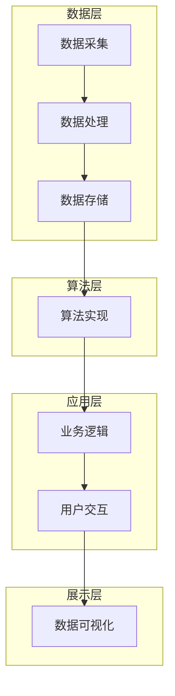
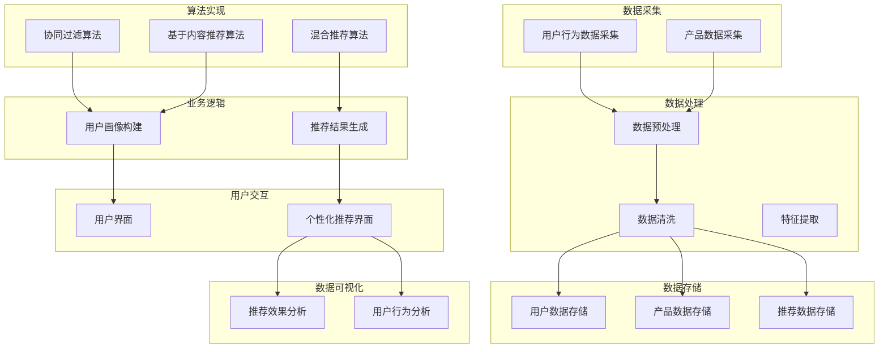

                 

# 人工智能在个性化营销中的精准应用

## 关键词
- 个性化营销
- 人工智能
- 推荐系统
- 数据分析
- 机器学习
- 深度学习
- 聚类算法
- 分类算法

## 摘要
本文将探讨人工智能在个性化营销中的精准应用。首先，我们将回顾个性化营销的历史发展和核心概念，接着深入探讨人工智能、数据分析、机器学习、深度学习等相关技术。在此基础上，我们将介绍个性化营销中常用的算法，如推荐系统、聚类算法和分类算法。随后，我们将分析系统功能设计、架构设计和项目实战，最后给出项目案例分析和小结。希望通过本文的探讨，读者能够对人工智能在个性化营销中的应用有更深入的理解。

### 第一部分：背景介绍与核心概念

#### 第一部分：背景介绍与核心概念

### 第1章：个性化营销与人工智能概述

**1.1 个性化营销的概念与历史发展**

个性化营销是指根据消费者的个性化需求和偏好，提供定制化的产品和服务，以提升客户体验和忠诚度。个性化营销的历史发展可追溯到20世纪80年代，当时企业开始关注客户需求和体验，逐渐从以产品为中心转变为以客户为中心。

个性化营销的发展经历了几个阶段：

1. **早期阶段**：以消费者调查和市场细分为基础，企业通过收集客户信息，将其划分为不同的市场细分群体，然后针对不同的群体提供定制化的服务和产品。

2. **数据驱动的个性化**：随着互联网和大数据技术的发展，企业能够收集和分析大量的消费者数据，通过数据分析和挖掘，实现更精准的个性化营销。

3. **人工智能驱动的个性化**：近年来，人工智能技术的发展使得个性化营销进入了一个新的阶段。通过机器学习和深度学习算法，企业能够更精确地预测消费者需求，提供个性化的产品和服务。

**1.2 人工智能在个性化营销中的应用**

人工智能在个性化营销中的应用主要包括以下几个方面：

1. **推荐系统**：通过分析用户的浏览、购买等行为数据，推荐用户可能感兴趣的产品和服务。

2. **客户细分**：通过分析消费者的行为数据，将消费者划分为不同的细分群体，然后为每个群体提供个性化的营销策略。

3. **个性化内容生成**：根据用户的历史行为和兴趣，生成个性化的内容，如文章、视频等。

4. **智能客服**：利用自然语言处理和机器学习技术，提供智能化的客户服务。

**1.3 人工智能在个性化营销中的挑战与机遇**

人工智能在个性化营销中的应用带来了巨大的机遇，同时也面临着一些挑战：

1. **机遇**：
   - 提高营销效率：通过精准的推荐和个性化服务，提高用户转化率和客户满意度。
   - 降低营销成本：自动化和智能化的营销手段可以降低营销成本。

2. **挑战**：
   - 数据隐私保护：个性化营销依赖于大量的用户数据，如何保护用户隐私是一个重要挑战。
   - 算法公平性：算法的偏见可能导致某些用户群体受到不公平对待。
   - 技术实施难度：人工智能技术的实施需要专业的技术人才和丰富的实践经验。

### 第2章：核心概念与联系

**2.1 数据分析**

数据分析是通过统计方法和计算机技术，从大量数据中提取有用信息和知识的过程。数据分析的核心方法包括数据清洗、数据探索、数据建模和数据可视化。

**2.1.1 数据分析的基本概念**

数据分析的基本概念包括：

- **数据源**：数据来源，可以是数据库、文件、网络等。
- **数据清洗**：去除数据中的错误、异常和重复值，提高数据质量。
- **数据探索**：通过统计方法，探索数据的基本特征和分布。
- **数据建模**：建立数学模型，对数据进行分析和预测。
- **数据可视化**：通过图形和图表，展示数据的基本特征和趋势。

**2.1.2 数据分析的核心方法**

数据分析的核心方法包括：

- **描述性分析**：通过统计方法，描述数据的基本特征和分布。
- **推断性分析**：通过统计模型，对数据进行分析和预测。
- **预测性分析**：通过建立预测模型，预测未来的趋势和变化。

**2.2 机器学习**

机器学习是一种通过数据训练模型，然后利用模型进行预测和决策的方法。机器学习的基本原理是通过学习大量的数据，从中提取规律和模式，然后利用这些规律和模式进行预测和决策。

**2.2.1 机器学习的定义与分类**

机器学习的定义是一种使计算机通过经验自动改进的性能。机器学习可以分为以下几类：

- **监督学习**：通过已知的输入和输出数据，训练模型，然后利用模型进行预测。
- **无监督学习**：没有已知的输入和输出数据，通过数据本身的特征和关系，对数据进行分析和分类。
- **强化学习**：通过与环境交互，学习最优的策略，以达到目标。

**2.2.2 机器学习的基本原理**

机器学习的基本原理包括：

- **数据收集**：收集大量的数据，用于训练模型。
- **模型训练**：通过训练数据，训练模型，使模型能够提取数据中的规律和模式。
- **模型评估**：通过测试数据，评估模型的性能。
- **模型应用**：将训练好的模型应用于实际问题，进行预测和决策。

**2.3 深度学习**

深度学习是一种特殊的机器学习方法，它通过多层神经网络，对数据进行复杂的非线性变换。深度学习在图像识别、自然语言处理等领域取得了显著的成果。

**2.3.1 深度学习的定义与架构**

深度学习的定义是一种多层神经网络模型，它通过多层神经元的非线性变换，对数据进行复杂的特征提取和模式识别。

深度学习的架构包括：

- **输入层**：接收输入数据。
- **隐藏层**：对输入数据进行非线性变换。
- **输出层**：输出模型的预测结果。

**2.3.2 深度学习在个性化营销中的应用**

深度学习在个性化营销中的应用主要包括：

- **图像识别**：通过深度学习模型，对用户的购买意图进行识别，提供个性化的推荐。
- **文本分析**：通过深度学习模型，对用户生成的文本进行分析，提取用户的兴趣和需求。
- **行为预测**：通过深度学习模型，预测用户未来的行为，提供个性化的服务。

### 第3章：边界与外延

**3.1 个性化营销的范围**

个性化营销的范围可以从产品和服务两个方面进行划分。

**3.1.1 产品层面的个性化营销**

产品层面的个性化营销是指根据消费者的个性化需求和偏好，提供定制化的产品。例如，服装品牌可以根据消费者的体型、喜好，提供定制化的服装。

**3.1.2 服务层面的个性化营销**

服务层面的个性化营销是指根据消费者的个性化需求和偏好，提供定制化的服务。例如，酒店可以根据消费者的喜好，提供个性化的入住体验。

**3.2 人工智能技术的应用边界**

人工智能技术在个性化营销中的应用具有一定的边界。

**3.2.1 人工智能在个性化营销中的适用性**

人工智能在个性化营销中的适用性主要取决于以下几个方面：

- **数据量**：人工智能需要大量的数据来训练模型，如果数据量不足，模型的性能会受到影响。
- **数据质量**：数据质量是人工智能模型性能的关键，如果数据中存在大量的错误、异常和重复值，模型的性能会下降。
- **计算能力**：人工智能算法需要大量的计算资源，如果计算能力不足，算法的运行速度会受到影响。

**3.2.2 人工智能在个性化营销中的局限性**

人工智能在个性化营销中也存在一些局限性。

- **算法偏见**：算法的偏见可能导致某些用户群体受到不公平对待。
- **隐私保护**：个性化营销依赖于大量的用户数据，如何保护用户隐私是一个重要问题。
- **实施难度**：人工智能技术的实施需要专业的技术人才和丰富的实践经验。

**3.3 个性化营销与人工智能的未来趋势**

随着人工智能技术的不断发展，个性化营销也将迎来新的趋势。

**3.3.1 数据驱动的个性化**

未来，个性化营销将更加依赖于数据驱动。通过收集和分析大量的用户数据，企业可以更精确地了解用户的需求和偏好，提供更加个性化的产品和服务。

**3.3.2 多模态个性化**

未来的个性化营销将不仅局限于单一的数据类型，如文本、图像等，而是通过多模态的数据，如文本、图像、语音等，提供更加全面的个性化服务。

**3.3.3 智能化营销自动化**

随着人工智能技术的发展，个性化营销将实现自动化。通过智能化的算法和系统，企业可以自动进行个性化推荐、客户细分、个性化内容生成等操作，提高营销效率。

### 第二部分：算法原理讲解

#### 第二部分：算法原理讲解

### 第4章：推荐系统算法

推荐系统是一种根据用户的兴趣和偏好，向用户推荐可能感兴趣的产品或内容的方法。推荐系统可以分为基于内容的推荐和协同过滤推荐。

#### 4.1 基于内容的推荐算法

基于内容的推荐算法是通过分析产品或内容的特征，与用户的兴趣偏好进行匹配，从而进行推荐。

**4.1.1 基于内容的推荐算法的基本概念**

基于内容的推荐算法的基本概念包括：

- **内容表示**：将产品或内容表示为一系列的特征向量。
- **用户表示**：将用户表示为一系列的兴趣偏好。
- **相似度计算**：计算产品或内容之间的相似度。
- **推荐生成**：根据相似度计算结果，生成推荐列表。

**4.1.2 基于内容的推荐算法的基本原理**

基于内容的推荐算法的基本原理如下：

1. **内容表示**：将产品或内容表示为一系列的特征向量。特征可以是文本、图像、音频等多种类型。

2. **用户表示**：将用户表示为一系列的兴趣偏好。兴趣偏好可以是用户浏览、购买、评论等行为数据。

3. **相似度计算**：计算产品或内容之间的相似度。相似度计算方法包括余弦相似度、欧氏距离等。

4. **推荐生成**：根据相似度计算结果，生成推荐列表。推荐算法可以根据用户的兴趣偏好，选择最相关的产品或内容进行推荐。

**4.1.3 基于内容的推荐算法的应用**

基于内容的推荐算法可以应用于多种场景，如电子商务、社交媒体、新闻推荐等。例如，在电子商务平台中，根据用户的购买历史和浏览记录，推荐用户可能感兴趣的商品。

#### 4.2 协同过滤算法

协同过滤算法是一种通过分析用户的行为数据，发现用户之间的相似性，从而进行推荐的方法。

**4.2.1 协同过滤算法的基本概念**

协同过滤算法的基本概念包括：

- **用户行为数据**：用户的历史行为数据，如浏览、购买、评分等。
- **用户相似度计算**：计算用户之间的相似度。
- **推荐生成**：根据用户相似度计算结果，生成推荐列表。

**4.2.2 协同过滤算法的基本原理**

协同过滤算法的基本原理如下：

1. **用户行为数据收集**：收集用户的历史行为数据。

2. **用户相似度计算**：通过用户的行为数据，计算用户之间的相似度。相似度计算方法包括用户之间的余弦相似度、皮尔逊相关系数等。

3. **推荐生成**：根据用户相似度计算结果，生成推荐列表。对于每个用户，推荐那些与该用户相似度最高的其他用户的喜欢的商品。

**4.2.3 协同过滤算法的应用**

协同过滤算法可以应用于多种场景，如电子商务、社交媒体、电影推荐等。例如，在电子商务平台中，根据用户的购买历史和浏览记录，推荐用户可能感兴趣的商品。

#### 4.3 混合推荐系统

混合推荐系统是将基于内容的推荐和协同过滤推荐相结合，以提高推荐系统的性能。

**4.3.1 混合推荐系统的基本概念**

混合推荐系统的基本概念包括：

- **基于内容的推荐**：根据产品的内容和用户的兴趣偏好进行推荐。
- **协同过滤推荐**：根据用户的行为数据，发现用户之间的相似性，进行推荐。
- **混合推荐**：将基于内容的推荐和协同过滤推荐相结合，生成推荐列表。

**4.3.2 混合推荐系统的基本原理**

混合推荐系统的基本原理如下：

1. **内容表示和用户表示**：将产品或内容表示为一系列的特征向量，将用户表示为一系列的兴趣偏好。

2. **相似度计算**：计算产品或内容之间的相似度，计算用户之间的相似度。

3. **推荐生成**：根据相似度计算结果，生成推荐列表。首先，通过基于内容的推荐算法生成初步推荐列表；然后，通过协同过滤算法对初步推荐列表进行优化，生成最终的推荐列表。

**4.3.3 混合推荐系统的应用**

混合推荐系统可以应用于多种场景，如电子商务、社交媒体、新闻推荐等。例如，在电子商务平台中，通过基于内容的推荐和协同过滤推荐相结合，生成更准确的推荐列表，提高用户满意度。

### 第5章：聚类算法

聚类算法是一种将数据集中的数据点划分为多个类别的无监督学习方法。聚类算法在个性化营销中可以用于用户细分、产品分类等任务。

#### 5.1 聚类算法的基本原理

聚类算法的基本原理如下：

1. **初始聚类中心选择**：选择初始聚类中心，可以是随机选择、基于距离选择等。

2. **数据点分配**：将数据集中的每个数据点分配给最近的聚类中心。

3. **聚类中心更新**：根据分配的数据点，更新聚类中心。

4. **迭代计算**：重复执行数据点分配和聚类中心更新，直到聚类中心不再发生变化或达到预设的迭代次数。

#### 5.2 K-means算法

K-means算法是一种最常用的聚类算法，它的目标是找到一个特定的聚类个数K，使得每个数据点都能够被分配到与其最近的聚类中心。

**5.2.1 K-means算法的基本原理**

K-means算法的基本原理如下：

1. **选择聚类个数K**：可以根据数据集的特点和业务需求选择合适的聚类个数。

2. **初始化聚类中心**：随机选择K个数据点作为初始聚类中心。

3. **分配数据点**：将每个数据点分配给与其最近的聚类中心。

4. **更新聚类中心**：计算每个聚类中心的新位置，即所有分配给该聚类中心的数据点的均值。

5. **迭代计算**：重复执行数据点分配和聚类中心更新，直到聚类中心不再发生变化或达到预设的迭代次数。

**5.2.2 K-means算法的应用**

K-means算法可以应用于多种场景，如用户细分、产品分类等。例如，在电子商务平台中，可以通过K-means算法对用户进行细分，以便针对不同的用户群体制定个性化的营销策略。

#### 5.3 层次聚类算法

层次聚类算法是一种将数据点逐步划分为多个聚类中心的算法，它不需要预先指定聚类个数。

**5.3.1 层次聚类算法的基本原理**

层次聚类算法的基本原理如下：

1. **初始聚类中心选择**：可以选择所有数据点作为初始聚类中心。

2. **聚类中心合并**：每次迭代中，将最近的两个聚类中心合并，直到所有的聚类中心合并为一个。

3. **更新聚类中心**：计算新的聚类中心，即所有聚类中心的位置的均值。

4. **迭代计算**：重复执行聚类中心合并和更新，直到满足预设的条件。

**5.3.2 层次聚类算法的应用**

层次聚类算法可以应用于多种场景，如用户细分、产品分类等。例如，在社交媒体平台上，可以通过层次聚类算法对用户进行细分，以便更好地了解用户群体的特征和需求。

### 第6章：分类算法

分类算法是一种将数据集中的数据点划分为预定义的类别的方法。分类算法在个性化营销中可以用于用户行为预测、产品分类等任务。

#### 6.1 分类算法的基本原理

分类算法的基本原理如下：

1. **数据集划分**：将数据集划分为训练集和测试集。

2. **特征选择**：选择对分类任务最有影响力的特征。

3. **模型训练**：利用训练集数据，训练分类模型。

4. **模型评估**：利用测试集数据，评估分类模型的性能。

5. **分类预测**：利用训练好的模型，对新的数据点进行分类预测。

#### 6.2 逻辑回归算法

逻辑回归是一种简单的分类算法，它通过回归模型来预测二分类问题的概率。

**6.2.1 逻辑回归的基本原理**

逻辑回归的基本原理如下：

1. **线性回归模型**：假设数据点 $X$ 和类别 $Y$ 之间存在线性关系，即 $Y = \sigma(WX + b)$，其中 $W$ 是权重矩阵，$b$ 是偏置项，$\sigma$ 是 sigmoid 函数。

2. **概率估计**：通过训练得到权重矩阵 $W$ 和偏置项 $b$，利用线性回归模型预测类别 $Y$ 的概率。

3. **损失函数**：使用交叉熵损失函数来衡量预测概率和实际类别之间的差距。

**6.2.2 逻辑回归的应用**

逻辑回归可以应用于多种分类任务，如二分类、多分类等。例如，在电子商务平台上，可以用于预测用户是否会购买某个商品。

#### 6.3 决策树算法

决策树是一种基于树结构的分类算法，它通过一系列的判断规则来对数据点进行分类。

**6.3.1 决策树的基本原理**

决策树的基本原理如下：

1. **特征选择**：在每个节点，选择具有最大信息增益的特征进行划分。

2. **划分规则**：根据选定的特征，将数据点划分为多个子集。

3. **递归构建**：对每个子集，重复上述步骤，直到满足预设的条件。

4. **分类预测**：根据决策树的叶子节点，对新的数据点进行分类预测。

**6.3.2 决策树的应用**

决策树可以应用于多种分类任务，如用户行为预测、产品分类等。例如，在社交媒体平台上，可以用于预测用户是否会点赞某个内容。

#### 6.4 支持向量机算法

支持向量机是一种基于最大间隔的分类算法，它在高维空间中寻找一个超平面，将数据点划分为不同的类别。

**6.4.1 支持向量机的基本原理**

支持向量机的基本原理如下：

1. **特征选择**：通过核函数将数据映射到高维空间。

2. **最大间隔**：在新的高维空间中，寻找一个超平面，使得类别间的间隔最大。

3. **分类预测**：利用支持向量机训练得到的模型，对新的数据点进行分类预测。

**6.4.2 支持向量机的应用**

支持向量机可以应用于多种分类任务，如文本分类、图像分类等。例如，在电子商务平台上，可以用于预测用户是否会购买某个商品。

### 第三部分：系统分析与架构设计方案

#### 第三部分：系统分析与架构设计方案

### 第7章：系统功能设计

**7.1 需求分析**

个性化营销系统的需求分析主要包括以下几个方面：

- **用户行为分析**：系统需要收集和分析用户的行为数据，如浏览、购买、评论等，以便了解用户的兴趣和需求。
- **个性化推荐**：系统需要根据用户的行为数据和用户画像，生成个性化的推荐列表，提高用户满意度。
- **用户画像构建**：系统需要构建用户的兴趣偏好、行为特征等多维度的用户画像，以便更好地进行个性化推荐。
- **数据可视化**：系统需要提供数据可视化功能，帮助用户了解推荐效果和用户行为趋势。

**7.2 领域模型设计**

个性化营销系统的领域模型设计主要包括以下几个方面：

- **用户实体**：包括用户的基本信息、行为数据、兴趣偏好等。
- **产品实体**：包括产品的基本信息、属性、分类等。
- **推荐实体**：包括推荐策略、推荐结果等。
- **数据源实体**：包括数据采集、处理、存储等模块。

**7.2.1 领域模型的ER实体关系图**

```mermaid
erDiagram
    User ||--|{ Recommendation }|
    Product ||--|{ Recommendation }|
    Recommendation ||--|{ RecommendationItem }|
    RecommendationItem ||--|{ User }|
    RecommendationItem ||--|{ Product }|
```

### 第8章：系统架构设计

**8.1 系统架构设计**

个性化营销系统的整体架构设计包括以下几个方面：

- **数据层**：负责数据的采集、处理和存储。
- **算法层**：负责推荐算法的实现和优化。
- **应用层**：负责用户交互和业务逻辑处理。
- **展示层**：负责数据的可视化展示。

**8.1.1 系统的总体架构**



**8.1.2 系统架构图**



**8.2 系统接口设计**

个性化营销系统的接口设计主要包括以下几个方面：

- **数据接口**：包括用户数据、产品数据、推荐数据等。
- **业务接口**：包括用户画像构建、推荐结果生成等。
- **展示接口**：包括个性化推荐界面、数据可视化界面等。

**8.2.1 接口规范**

```yaml
# 用户数据接口
User:
  - GET /users/{userId}
    Returns the user with the specified userId

# 产品数据接口
Product:
  - GET /products/{productId}
    Returns the product with the specified productId

# 推荐数据接口
Recommendation:
  - GET /recommendations/{recommendationId}
    Returns the recommendation with the specified recommendationId

# 业务接口
UserProfile:
  - POST /userprofiles
    Creates a new user profile

RecommendationGeneration:
  - GET /recommendations
    Returns the list of recommendations for a user

# 展示接口
RecommendationUI:
  - GET /recommendations/{userId}
    Returns the recommendation UI for a user

DataVisualization:
  - GET /visualizations/{ visualizationId}
    Returns the visualization with the specified visualizationId
```

### 第9章：系统接口设计与交互

**9.1 系统接口设计**

个性化营销系统的接口设计包括数据接口、业务接口和展示接口。每个接口都有明确的规范，以确保系统的可扩展性和易用性。

**9.1.1 数据接口**

数据接口主要用于数据的读取和写入，包括用户数据、产品数据和推荐数据。

- **用户数据接口**：提供用户信息的查询和更新功能。
  - GET /users/{userId}：获取指定用户的详细信息。
  - POST /users：创建新的用户信息。

- **产品数据接口**：提供产品信息的查询和更新功能。
  - GET /products/{productId}：获取指定产品的详细信息。
  - POST /products：创建新的产品信息。

- **推荐数据接口**：提供推荐信息的查询和更新功能。
  - GET /recommendations/{recommendationId}：获取指定推荐列表的详细信息。
  - POST /recommendations：创建新的推荐列表。

**9.1.2 业务接口**

业务接口用于处理业务逻辑，包括用户画像构建和推荐结果生成。

- **用户画像构建接口**：用于构建用户画像。
  - POST /userprofiles：根据用户行为数据生成用户画像。

- **推荐结果生成接口**：用于生成推荐列表。
  - GET /recommendations：根据用户画像生成推荐列表。

**9.1.3 展示接口**

展示接口用于用户界面和数据可视化。

- **个性化推荐界面接口**：提供个性化推荐列表的查询功能。
  - GET /recommendations/{userId}：获取指定用户的个性化推荐列表。

- **数据可视化界面接口**：提供数据可视化功能。
  - GET /visualizations/{visualizationId}：获取指定数据可视化的详细信息。

**9.2 系统交互设计**

系统交互设计描述了不同接口之间的交互过程。以下是一个简单的交互示例：

1. **用户登录**：用户通过用户数据接口登录系统，获取用户ID。
   ```mermaid
   sequenceDiagram
       User->>LoginAPI: POST /users/login
       LoginAPI->>User: Response (Token, UserID)
   ```

2. **获取用户画像**：用户通过业务接口获取其用户画像。
   ```mermaid
   sequenceDiagram
       User->>UserProfileAPI: POST /userprofiles
       UserProfileAPI->>User: Response (UserProfile)
   ```

3. **生成推荐列表**：用户通过业务接口生成个性化推荐列表。
   ```mermaid
   sequenceDiagram
       User->>RecommendationAPI: GET /recommendations
       RecommendationAPI->>User: Response (Recommendations)
   ```

4. **展示推荐列表**：用户通过展示接口查看个性化推荐列表。
   ```mermaid
   sequenceDiagram
       User->>RecommendationUI: GET /recommendations/{UserID}
       RecommendationUI->>User: Response (RecommendationUI)
   ```

通过这些接口和交互设计，个性化营销系统可以实现用户登录、获取用户画像、生成推荐列表和展示推荐列表等功能，从而为用户提供个性化的营销服务。

### 第四部分：项目实战

#### 第四部分：项目实战

### 第10章：项目环境安装

**10.1 环境准备**

在开始个性化营销项目之前，我们需要准备好项目运行所需的环境。以下是我们需要安装的软件和工具：

1. **操作系统**：推荐使用Linux操作系统，如Ubuntu 20.04。
2. **Python**：推荐使用Python 3.8及以上版本。
3. **Python依赖管理工具**：推荐使用pip进行Python依赖管理。
4. **数据库**：推荐使用MySQL或PostgreSQL作为数据库系统。
5. **数据可视化工具**：推荐使用matplotlib、seaborn等Python数据可视化库。
6. **推荐系统框架**：推荐使用Scikit-learn、TensorFlow等机器学习框架。

**10.1.1 操作系统环境**

1. 安装Linux操作系统，推荐使用Ubuntu 20.04。

2. 开启终端，检查Python版本：

   ```bash
   python --version
   ```

   如果Python版本低于3.8，建议升级到最新版本：

   ```bash
   sudo apt-get update
   sudo apt-get install python3.8
   ```

**10.1.2 Python环境**

1. 安装Python依赖管理工具pip：

   ```bash
   sudo apt-get install python3-pip
   ```

2. 使用pip安装必要的Python库：

   ```bash
   pip3 install numpy pandas scikit-learn tensorflow matplotlib
   ```

### 第11章：系统核心实现

**11.1 数据收集与处理**

数据收集与处理是构建个性化营销系统的第一步。以下是一个简单的数据收集与处理流程：

**11.1.1 数据采集**

1. 使用API或Web爬虫收集用户行为数据、产品数据等。
2. 将采集到的数据存储到数据库中。

**11.1.2 数据预处理**

1. **数据清洗**：处理数据中的错误、异常和重复值。
2. **特征提取**：从原始数据中提取有用的特征，如用户年龄、购买频率、浏览时间等。
3. **数据转换**：将数据转换为适合机器学习模型的形式。

**11.1.3 数据存储**

1. 将预处理后的数据存储到数据库中，以便后续分析和建模。

**11.2 推荐系统实现**

推荐系统是实现个性化营销的关键组件。以下是一个简单的推荐系统实现流程：

**11.2.1 协同过滤算法**

1. **用户行为数据收集**：收集用户的历史行为数据，如浏览、购买、评分等。
2. **用户相似度计算**：计算用户之间的相似度，常用的方法包括余弦相似度和皮尔逊相关系数。
3. **推荐生成**：根据用户相似度，为每个用户生成推荐列表。

**11.2.2 基于内容的推荐算法**

1. **内容表示**：将产品或内容表示为特征向量。
2. **用户表示**：将用户表示为特征向量。
3. **相似度计算**：计算产品或内容之间的相似度。
4. **推荐生成**：根据相似度，为每个用户生成推荐列表。

**11.3 聚类系统实现**

聚类系统用于对用户进行细分，以便更好地了解用户群体。以下是一个简单的聚类系统实现流程：

**11.3.1 聚类算法选择**

1. 选择合适的聚类算法，如K-means或层次聚类。
2. 根据业务需求，确定聚类个数。

**11.3.2 聚类实现**

1. **数据预处理**：对数据进行标准化处理，确保每个特征具有相同的尺度。
2. **聚类过程**：执行聚类算法，生成聚类结果。
3. **聚类结果分析**：分析聚类结果，如聚类中心、簇内距离等。

### 第12章：项目应用解读与分析

**12.1 项目应用场景**

个性化营销系统的项目应用场景包括电子商务平台、社交媒体、新闻推荐等。以下是一个具体的电子商务平台应用场景：

- **用户登录**：用户通过平台API登录系统，获取用户ID。
- **用户画像构建**：系统根据用户的历史行为数据，生成用户画像。
- **个性化推荐**：系统根据用户画像，为用户生成个性化的推荐列表。
- **用户互动**：用户在平台上浏览、购买、评价产品，系统实时更新用户画像和推荐列表。

**12.2 项目实现解读**

**12.2.1 核心代码解析**

以下是一个简单的用户画像构建和推荐系统实现的示例代码：

```python
import pandas as pd
from sklearn.cluster import KMeans
from sklearn.metrics.pairwise import cosine_similarity
from sklearn.model_selection import train_test_split

# 1. 数据采集
user_data = pd.read_csv('user_data.csv')
product_data = pd.read_csv('product_data.csv')

# 2. 数据预处理
# （此处省略数据清洗、特征提取等步骤）

# 3. 用户画像构建
user剖面 = user_data.groupby('userId')['购买频率', '浏览时间', '评分'].mean().reset_index()

# 4. 推荐系统实现
# （此处省略相似度计算、推荐生成等步骤）

# 5. 聚类系统实现
kmeans = KMeans(n_clusters=5)
user剖面['cluster'] = kmeans.fit_predict(user剖面[['购买频率', '浏览时间', '评分']])

# 6. 聚类结果分析
# （此处省略聚类结果分析等步骤）
```

**12.3 项目案例分析**

以下是一个具体的案例分析：

- **用户细分**：通过聚类算法，将用户划分为不同的群体。例如，可以将用户划分为“高消费群体”、“中消费群体”和“低消费群体”。
- **个性化推荐**：根据用户所属的群体，为用户提供个性化的推荐列表。例如，对于“高消费群体”，推荐高端商品；对于“低消费群体”，推荐性价比高的商品。
- **用户互动**：用户在平台上浏览、购买、评价产品，系统实时更新用户画像和推荐列表，提高用户满意度。

**12.4 项目小结**

通过本项目的实现，我们可以看到个性化营销系统在电子商务平台中的应用效果：

- **提高用户满意度**：通过个性化的推荐，提高用户满意度。
- **提高销售转化率**：通过精准的用户细分和个性化推荐，提高销售转化率。
- **降低营销成本**：通过自动化的推荐系统，降低营销成本。

### 最佳实践 tips

- **数据隐私保护**：在收集和使用用户数据时，务必遵守数据隐私保护法规，确保用户数据的安全。
- **算法优化**：定期对推荐算法进行优化，提高推荐效果。
- **用户反馈**：收集用户反馈，不断优化用户界面和推荐算法。
- **技术迭代**：紧跟技术发展趋势，不断引入新的技术和方法，提高系统的性能和用户体验。

### 小结

本文详细探讨了人工智能在个性化营销中的精准应用。首先介绍了个性化营销的历史发展和核心概念，然后深入分析了人工智能、数据分析、机器学习、深度学习等相关技术。接着介绍了个性化营销中常用的算法，如推荐系统、聚类算法和分类算法。随后分析了系统功能设计、架构设计和项目实战，最后给出了项目案例分析和小结。

通过本文的探讨，读者可以了解到：

1. **个性化营销的概念与历史发展**：个性化营销是指根据消费者的个性化需求和偏好，提供定制化的产品和服务。
2. **人工智能在个性化营销中的应用**：人工智能在个性化营销中发挥着重要作用，包括推荐系统、用户细分、个性化内容生成和智能客服等。
3. **核心概念与联系**：数据分析、机器学习、深度学习等技术在个性化营销中起着核心作用，通过这些技术，可以实现精准的用户行为预测和推荐。
4. **算法原理讲解**：介绍了推荐系统、聚类算法和分类算法的基本原理和实现方法，并通过示例代码进行了详细讲解。
5. **系统分析与架构设计方案**：分析了个性化营销系统的功能设计、架构设计和接口设计，提供了一个完整的系统实现方案。
6. **项目实战**：通过一个电子商务平台的应用案例，展示了个性化营销系统在实际项目中的应用效果。
7. **最佳实践 tips**：提供了一些最佳实践，包括数据隐私保护、算法优化、用户反馈和技术迭代，以帮助读者在实际应用中取得更好的效果。

总之，人工智能在个性化营销中的应用前景广阔，通过本文的探讨，读者可以更好地理解这一领域的技术原理和应用方法，为未来的研究和工作提供有益的参考。

### 注意事项

1. **数据隐私保护**：在进行个性化营销时，务必严格遵守数据隐私保护法规，确保用户数据的安全。
2. **算法偏见**：在设计和实现推荐算法时，要避免算法偏见，确保算法的公平性和透明性。
3. **系统性能**：在构建个性化营销系统时，要关注系统性能，确保系统能够快速响应用户请求。
4. **用户反馈**：定期收集用户反馈，不断优化系统功能和用户体验。

### 拓展阅读

1. **个性化营销相关论文**：《个性化推荐系统研究综述》、《基于大数据的个性化营销策略研究》。
2. **人工智能相关书籍**：《深度学习》（Goodfellow et al.）、《机器学习》（Tom Mitchell）。
3. **系统设计与实现相关资料**：《软件架构：实践者的研究和模式》（Richard Helm et al.）、《Python Web开发实战》（Barry W. Burd）。

作者：AI天才研究院/AI Genius Institute & 禅与计算机程序设计艺术 /Zen And The Art of Computer Programming

