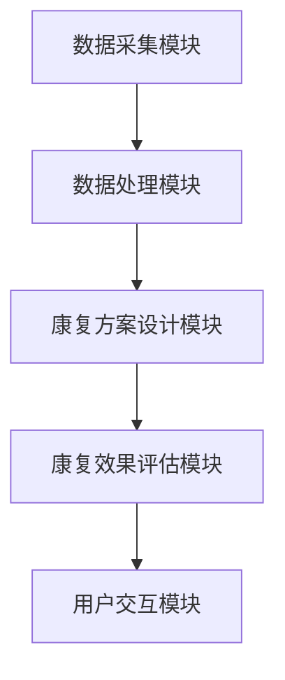

                 

### 第一部分：背景与概念

#### 第1章：问题背景与定义

##### 1.1 运动康复的需求与挑战

运动康复是指通过科学的方法和手段，帮助运动员或运动爱好者恢复到运动损伤前的最佳状态。随着现代运动水平的不断提高，运动损伤已经成为影响运动员健康和竞技水平的重要因素。据统计，每年因运动损伤而退出体育训练的运动员比例高达20%以上。

**运动康复的重要性：**

- 提高运动员的竞技水平：运动康复能够帮助运动员在恢复过程中迅速恢复肌肉力量、柔韧性和平衡能力，从而提高其竞技水平。
- 预防运动损伤：通过科学合理的康复训练，可以预防运动损伤的发生。
- 促进运动损伤的愈合：有效的康复训练可以加速损伤部位的愈合，减少并发症的发生。

**运动损伤的现状：**

- 常见运动损伤类型：肌肉拉伤、韧带损伤、骨折、关节滑膜炎等。
- 运动损伤的普遍性：无论是专业运动员还是业余爱好者，运动损伤都是普遍存在的健康问题。

**运动康复的传统方法与局限：**

- **传统方法：** 主要包括物理治疗、按摩、康复训练等。这些方法在一定程度上能够缓解症状和促进恢复，但其效果和效率因人而异，且难以实现个性化。
- **局限：** 由于缺乏针对个体差异的精准康复方案，传统方法往往无法满足不同康复需求的个性化需求。

##### 1.2 人工智能概述

**人工智能的定义：**

人工智能（Artificial Intelligence，简称AI）是指通过计算机模拟人类的智能行为，使计算机具备一定的自我学习和决策能力的技术。

**人工智能的发展历程：**

- 20世纪50年代：人工智能概念提出，早期研究主要集中在符号主义和逻辑推理。
- 20世纪80年代：专家系统成为主流，人工智能开始应用于医疗、金融等领域。
- 21世纪初：机器学习和深度学习技术的发展，人工智能进入新一轮爆发期。
- 当前：人工智能技术逐渐应用于各行各业，实现从理论研究到实际应用的全面跨越。

**人工智能的核心技术：**

- **机器学习：** 通过数据驱动的方式，让计算机从数据中学习规律和模式，实现自动化决策和预测。
- **深度学习：** 一种特殊的机器学习技术，通过多层神经网络对数据进行处理和特征提取，实现复杂的模式识别和预测任务。
- **自然语言处理：** 使计算机能够理解和生成人类语言，应用于语音识别、机器翻译、文本分析等领域。
- **计算机视觉：** 使计算机具备从图像中提取信息和理解场景的能力，应用于图像识别、自动驾驶等领域。

##### 1.3 个性化运动康复的概念

**个性化运动康复的定义：**

个性化运动康复是指根据个体的身体状况、运动损伤类型和康复需求，制定个性化的康复方案，实现精准化的康复治疗和训练。

**个性化运动康复与传统康复的区别：**

- **目标不同：** 传统康复主要关注症状缓解和基本功能恢复，而个性化康复强调根据个体差异实现最佳康复效果。
- **方法不同：** 传统康复方法较为单一，而个性化康复通过多学科融合和人工智能技术，提供多样化、个性化的康复方案。
- **效果不同：** 传统康复效果因人而异，个性化康复通过精准的康复方案和实时监测，能够更有效地促进康复进程。

### 总结

本章节主要介绍了运动康复的需求与挑战、人工智能的基本概念及其发展历程，以及个性化运动康复的定义和与传统康复的区别。接下来，我们将进一步探讨人工智能在运动康复中的应用场景和技术基础。

---

关键词：运动康复、人工智能、个性化康复、康复方案、机器学习

摘要：本文首先分析了运动康复的需求与挑战，随后介绍了人工智能的基本概念及其在运动康复中的应用，最后阐述了个性化运动康复的概念及其与传统康复方法的区别，为后续内容奠定了基础。

### 目录大纲设计

**《人工智能在个性化运动康复中的应用》**

# 第一部分：背景与概念

## 第1章：问题背景与定义

### 1.1 运动康复的需求与挑战

### 1.2 人工智能概述

### 1.3 个性化运动康复的概念

## 第2章：人工智能在运动康复中的应用概述

### 2.1 人工智能在运动康复中的应用场景

### 2.2 人工智能在运动康复中的技术基础

### 2.3 个性化运动康复的优势与挑战

# 第二部分：核心技术与应用

## 第3章：数据采集与处理

### 3.1 数据采集技术

### 3.2 数据处理技术

### 3.3 数据可视化

## 第4章：机器学习在运动康复中的应用

### 4.1 机器学习基础

### 4.2 运动康复中的机器学习应用

## 第5章：深度学习在运动康复中的应用

### 5.1 深度学习基础

### 5.2 运动康复中的深度学习应用

## 第6章：个性化运动康复系统设计与实现

### 6.1 系统设计原则

### 6.2 系统功能实现

### 6.3 系统部署与维护

# 第三部分：案例研究

## 第7章：案例一：个性化跑步康复系统

### 7.1 案例背景

### 7.2 系统设计与实现

### 7.3 案例效果评估

## 第8章：案例二：智能瑜伽康复系统

### 8.1 案例背景

### 8.2 系统设计与实现

### 8.3 案例效果评估

# 第四部分：未来展望与趋势

## 第9章：人工智能在运动康复领域的未来发展

### 9.1 新技术的发展趋势

### 9.2 行业应用前景

### 9.3 挑战与机遇

## 第10章：小结与展望

### 10.1 总结

### 10.2 展望

---

本文将系统地介绍人工智能在个性化运动康复中的应用，分为四个主要部分。第一部分是背景与概念，介绍了运动康复的需求与挑战，人工智能的基本概念及其发展历程，以及个性化运动康复的定义和与传统康复方法的区别。第二部分是核心技术与应用，详细探讨了数据采集与处理、机器学习和深度学习在运动康复中的应用。第三部分是案例研究，通过具体案例展示了个性化运动康复系统的设计与实现，以及案例效果评估。第四部分是未来展望与趋势，探讨了人工智能在运动康复领域的未来发展，以及面临的新技术和挑战。希望通过本文的介绍，读者能够对人工智能在个性化运动康复中的应用有一个全面而深入的了解。在接下来的章节中，我们将逐一详细探讨这些内容。

---

## 第2章：人工智能在运动康复中的应用概述

### 2.1 人工智能在运动康复中的应用场景

人工智能在运动康复中的应用场景广泛且多样，主要体现在以下几个方面：

**运动损伤的早期诊断：**

通过人工智能技术，尤其是计算机视觉和深度学习算法，可以对运动员的影像数据进行实时分析，从而实现运动损伤的早期诊断。例如，通过对X光片、MRI图像的分析，可以识别出潜在的骨折、韧带损伤等问题。这种早期诊断有助于运动员及时采取治疗措施，避免病情恶化。

**运动康复方案的设计：**

个性化康复方案的设计是运动康复中的重要环节。人工智能可以通过对大量康复案例数据的分析，识别出不同损伤类型和个体特征的康复模式。基于这些模式，结合机器学习和深度学习算法，可以自动生成针对特定个体的个性化康复方案。这种方案不仅考虑了运动损伤的类型，还考虑了运动员的身体状况、运动习惯和康复需求，从而提高康复效果。

**运动康复效果的评估：**

运动康复效果的评估是衡量康复方案有效性的关键。人工智能可以通过对运动员的康复数据进行分析，如步态分析、运动表现数据等，实时评估康复效果。通过对康复数据的持续监控和分析，可以动态调整康复方案，确保康复效果的最佳化。

**运动损伤的预防：**

人工智能技术在运动损伤预防方面也发挥着重要作用。通过对运动员的运动数据进行分析，可以发现运动中潜在的风险因素，如不正确的运动姿势、过度训练等。基于这些分析结果，可以为运动员提供个性化的运动建议，预防运动损伤的发生。

**个性化训练指导：**

对于运动员的训练过程，人工智能可以提供个性化的训练指导。通过分析运动员的生理数据、训练表现等，可以制定出最适合其特点的训练计划。这种个性化的训练指导有助于提高训练效果，避免因训练不当导致的运动损伤。

### 2.2 人工智能在运动康复中的技术基础

人工智能在运动康复中的应用离不开以下几个核心技术的支持：

**数据采集与处理技术：**

数据采集是运动康复的基础。通过各种传感器设备，如穿戴设备、摄像头、力传感器等，可以实时采集运动员的生理数据、运动数据等。数据采集完成后，需要通过数据处理技术对数据进行清洗、预处理，以便后续分析和应用。

**机器学习算法：**

机器学习算法是人工智能技术的重要组成部分。在运动康复中，机器学习算法主要用于运动损伤的诊断、康复方案的设计和效果评估等。常见的机器学习算法包括线性回归、决策树、支持向量机、神经网络等。

**深度学习算法：**

深度学习算法是机器学习的一种特殊形式，具有强大的特征提取和模式识别能力。在运动康复中，深度学习算法广泛应用于图像识别、语音识别、自然语言处理等领域，如通过深度学习算法分析影像数据以识别运动损伤。

**自然语言处理：**

自然语言处理技术使得计算机能够理解和处理人类语言。在运动康复中，自然语言处理技术可用于自动记录运动员的训练日志、康复报告等，提高信息处理的效率。

**计算机视觉：**

计算机视觉技术使得计算机能够从图像中提取信息，如运动轨迹分析、动作识别等。在运动康复中，计算机视觉技术可用于分析运动员的步态、动作姿态，提供直观的康复指导和反馈。

**大数据技术：**

大数据技术为运动康复提供了丰富的数据资源。通过大数据技术，可以对海量的运动康复数据进行存储、管理和分析，从而发现新的康复模式和趋势。

### 2.3 个性化运动康复的优势与挑战

**优势分析：**

- **精准化康复：** 个性化运动康复能够根据个体差异制定精准化的康复方案，提高康复效果。
- **实时监控与反馈：** 人工智能技术可以实现实时监控康复过程，提供及时的反馈和调整，确保康复方案的执行。
- **高效资源利用：** 通过智能化管理，可以更高效地利用康复资源，降低康复成本。
- **预防损伤：** 人工智能技术可以提前预测潜在的运动损伤风险，提供预防措施，减少损伤发生的概率。

**挑战探讨：**

- **数据隐私与伦理问题：** 个性化运动康复需要大量个人数据，如何保障数据隐私和安全是重要挑战。
- **技术依赖性：** 过度依赖人工智能技术可能导致康复方案失去人性化，需要平衡技术与应用。
- **技术标准化：** 目前人工智能技术在运动康复中的应用尚缺乏统一的技术标准和规范，需要进一步研究和制定。
- **算法准确性：** 人工智能算法的准确性直接影响康复效果，需要不断优化和改进。

### 总结

本章对人工智能在运动康复中的应用场景、技术基础和优势与挑战进行了详细分析。接下来，我们将深入探讨人工智能在运动康复中应用的核心技术，包括数据采集与处理、机器学习和深度学习等内容。

---

关键词：运动康复、人工智能、个性化康复、数据采集、机器学习、深度学习

摘要：本章介绍了人工智能在运动康复中的应用场景，包括运动损伤的早期诊断、康复方案的设计、运动康复效果的评估等。同时，分析了人工智能在运动康复中的技术基础，以及个性化运动康复的优势与挑战。为后续内容提供了坚实的基础。

---

## 第3章：数据采集与处理

### 3.1 数据采集技术

数据采集是运动康复中至关重要的一环，它决定了后续分析和决策的准确性和有效性。为了实现个性化运动康复，需要全面、准确地采集与运动员运动状态相关的多种数据类型。

**传感器技术在运动康复中的应用：**

传感器技术在运动康复中起到了关键作用，能够实时监测运动员的生理参数、运动轨迹和动作姿态。常见的传感器包括：

- **穿戴设备：** 如智能手表、智能手环等，可以监测心率、血压、运动步数等生理参数。
- **摄像头：** 用于捕捉运动员的运动姿态和动作，可以进行三维重建和动作分析。
- **力传感器：** 如力矩传感器，可以测量肌肉力量、关节活动范围等。
- **加速度计与陀螺仪：** 常用于运动轨迹分析和步态分析，能够记录运动员在运动过程中的加速度和角速度。

**数据采集系统的设计与实现：**

一个高效的数据采集系统需要考虑以下几个方面：

1. **传感器选择与布局：** 根据康复需求选择合适的传感器，并在运动员身体的关键部位进行布局，如手腕、腰间、腿部等。
2. **数据同步与传输：** 确保传感器采集的数据能够在同一时间同步传输到数据处理中心，以保证数据的一致性和准确性。
3. **数据存储与管理：** 设计高效的数据存储方案，确保大量数据能够快速存储和检索，同时保证数据的安全和隐私。

### 3.2 数据处理技术

数据采集完成后，需要进行一系列的预处理和分析，以便后续的机器学习和深度学习应用。数据处理技术主要包括以下几个方面：

**数据预处理方法：**

- **数据清洗：** 去除噪声、错误和重复的数据，确保数据的准确性和一致性。
- **数据归一化：** 将不同尺度的数据统一转换到同一尺度，如将所有数据缩放到0到1之间。
- **数据变换：** 如时间序列数据的对数变换，以消除异常值的影响。
- **特征提取：** 从原始数据中提取有用的特征，如步态周期、关节角度等，以便用于后续分析。

**数据分析方法：**

- **统计分析：** 利用统计方法分析数据分布、相关性等，为后续分析提供基础。
- **聚类分析：** 如K-均值聚类，用于发现数据中的相似模式和群组。
- **关联分析：** 如Apriori算法，用于发现数据之间的关联关系。

### 3.3 数据可视化

数据可视化是将复杂数据转化为易于理解的形式，帮助研究人员和临床医生直观地分析数据，发现潜在的模式和趋势。数据可视化技术在运动康复中的应用主要包括以下几个方面：

**可视化技术的应用：**

- **时间序列可视化：** 通过折线图、散点图等展示运动员的生理参数和运动表现随时间的变化。
- **空间可视化：** 通过三维图、热图等展示运动员的运动轨迹和动作姿态。
- **交互式可视化：** 提供交互功能，如放大、缩小、选择等，帮助用户深入分析数据。

**可视化工具的使用：**

- **Matplotlib：** 是Python中最常用的数据可视化库，能够生成各种类型的图表。
- **Plotly：** 提供交互式的数据可视化功能，适合复杂的数据展示。
- **D3.js：** 是一个基于JavaScript的可视化库，适合Web端的数据可视化。

### 总结

本章详细介绍了数据采集与处理技术在运动康复中的应用，包括传感器技术、数据预处理、数据分析和数据可视化。这些技术为运动康复提供了丰富的数据支持和分析工具，有助于实现个性化康复方案，提高康复效果。接下来，我们将探讨机器学习在运动康复中的应用，进一步揭示人工智能技术在康复领域的潜力和价值。

---

关键词：运动康复、数据采集、传感器技术、数据处理、数据可视化、机器学习

摘要：本章深入探讨了数据采集与处理技术在运动康复中的应用，包括传感器技术、数据处理方法以及数据可视化。通过详细阐述这些技术，本文为后续讨论人工智能在运动康复中的应用奠定了坚实的基础。

---

## 第4章：机器学习在运动康复中的应用

### 4.1 机器学习基础

**机器学习的基本概念**

机器学习（Machine Learning，ML）是人工智能（Artificial Intelligence，AI）的一个重要分支，主要研究如何通过数据驱动的方法，使计算机具备自动学习和改进的能力。机器学习的关键在于从数据中提取规律和模式，从而进行预测、分类和决策。

**机器学习的基本流程**

- **数据收集：** 收集大量相关的数据，为后续建模和分析提供基础。
- **数据预处理：** 清洗数据、处理缺失值、归一化等，确保数据的准确性和一致性。
- **特征选择：** 从原始数据中提取有用的特征，用于训练模型。
- **模型训练：** 选择合适的模型，使用训练数据对模型进行训练。
- **模型评估：** 使用验证数据评估模型的性能，选择最优模型。
- **模型应用：** 将训练好的模型应用到实际问题中，进行预测或决策。

**常见的机器学习算法**

- **线性回归（Linear Regression）：** 用于预测连续值输出，通过拟合一条直线来描述输入和输出之间的线性关系。
- **逻辑回归（Logistic Regression）：** 用于分类问题，通过拟合一个逻辑函数（Sigmoid函数）来预测概率。
- **支持向量机（Support Vector Machine，SVM）：** 用于分类问题，通过找到一个最佳的超平面，将不同类别的数据分开。
- **决策树（Decision Tree）：** 通过一系列的判断条件来对数据进行分类或回归。
- **随机森林（Random Forest）：** 通过构建多个决策树，并进行集成学习，提高模型的预测能力。
- **神经网络（Neural Networks）：** 通过模拟生物神经系统的结构和功能，进行复杂的模式识别和预测。

### 4.2 运动康复中的机器学习应用

**运动损伤诊断**

机器学习在运动损伤诊断中的应用非常广泛，通过分析运动员的生理数据、运动轨迹和动作姿态等，可以提前识别出潜在的损伤风险。以下是一些具体的应用实例：

- **步态分析：** 通过分析运动员的步态数据，如步长、步频、步态角等，可以识别出异常步态模式，提示可能的运动损伤。
- **影像数据分析：** 通过对X光片、MRI图像等影像数据进行分析，利用机器学习算法可以识别出潜在的骨折、韧带损伤等问题。
- **生理信号分析：** 通过监测运动员的心率、血压、呼吸等生理信号，可以识别出异常生理反应，提示可能的运动损伤。

**康复效果预测**

康复效果预测是运动康复中的一个重要环节，通过机器学习算法可以预测康复方案的效果，为康复方案的调整提供依据。以下是一些具体的应用实例：

- **康复进程预测：** 通过分析运动员的康复数据，如关节活动度、肌肉力量等，可以预测康复进程，确定何时恢复到最佳状态。
- **效果评估：** 通过对比康复前后的数据，利用机器学习算法可以评估康复方案的有效性，为康复方案的选择和优化提供参考。

**康复方案优化**

个性化康复方案的设计是运动康复的核心，通过机器学习算法可以优化康复方案，提高康复效果。以下是一些具体的应用实例：

- **方案推荐：** 通过分析大量的康复案例数据，利用机器学习算法可以推荐最适合个体的康复方案。
- **方案调整：** 在康复过程中，根据实时监测的数据，利用机器学习算法可以动态调整康复方案，确保康复效果的最佳化。

### 总结

本章详细介绍了机器学习的基本概念和常见算法，并探讨了机器学习在运动康复中的应用，包括运动损伤诊断、康复效果预测和康复方案优化。通过机器学习技术，可以实现运动康复的个性化、精准化和高效化，为运动员的健康保驾护航。在接下来的章节中，我们将进一步探讨深度学习在运动康复中的应用。

---

关键词：机器学习、运动康复、损伤诊断、康复效果预测、康复方案优化

摘要：本章介绍了机器学习的基本概念和常见算法，并详细探讨了机器学习在运动康复中的应用，包括运动损伤诊断、康复效果预测和康复方案优化。这些应用为运动康复提供了个性化、精准化和高效化的解决方案。

---

## 第5章：深度学习在运动康复中的应用

### 5.1 深度学习基础

深度学习（Deep Learning，DL）是机器学习的一个重要分支，通过多层神经网络模拟人脑处理信息的方式，实现复杂的数据分析和模式识别。深度学习的核心在于其多层结构，每层对输入数据进行特征提取和变换，最终实现对复杂任务的精确预测。

**深度学习的原理**

深度学习的基本原理是通过反向传播（Backpropagation）算法不断调整网络中的权重，使网络输出与真实值之间的误差最小化。这个过程包括以下几个步骤：

1. **前向传播（Forward Propagation）：** 输入数据经过网络的各层传递，逐层进行特征提取和变换，直到得到输出。
2. **损失函数（Loss Function）：** 计算输出值与真实值之间的差异，以评估模型的预测误差。
3. **反向传播（Backpropagation）：** 根据损失函数对网络进行反向传播，计算各层权重的梯度，并更新权重以减小误差。
4. **优化算法（Optimization Algorithm）：** 如梯度下降（Gradient Descent）及其变种，用于调整权重以最小化损失函数。

**常见的深度学习模型**

- **卷积神经网络（Convolutional Neural Network，CNN）：** 适用于图像和视频数据，通过卷积层、池化层和全连接层提取空间特征。
- **循环神经网络（Recurrent Neural Network，RNN）：** 适用于序列数据，通过循环结构捕捉时间信息。
- **长短时记忆网络（Long Short-Term Memory，LSTM）：** 是RNN的一种变种，能够更好地处理长序列数据。
- **生成对抗网络（Generative Adversarial Network，GAN）：** 通过生成器和判别器的对抗训练，实现高质量数据的生成。

### 5.2 运动康复中的深度学习应用

**运动损伤检测**

深度学习在运动损伤检测中的应用主要包括图像分析、视频监控和生理信号处理等方面。以下是一些具体的应用实例：

- **影像数据分析：** 通过深度学习模型分析X光片、MRI图像等影像数据，可以自动识别出运动损伤，如骨折、韧带损伤等。
- **视频监控：** 通过深度学习模型分析运动员的运动视频，可以识别出异常运动姿势和动作，提前预警潜在的运动损伤风险。
- **生理信号分析：** 通过深度学习模型分析运动员的心率、血压、呼吸等生理信号，可以识别出异常生理反应，提示可能的运动损伤。

**康复方案的个性化设计**

个性化康复方案的设计是运动康复的关键，通过深度学习技术可以更精准地制定康复方案。以下是一些具体的应用实例：

- **康复方案推荐：** 通过分析大量的康复案例数据，利用深度学习模型可以推荐最适合个体的康复方案，包括运动训练、物理治疗等。
- **康复效果预测：** 通过深度学习模型分析康复过程中的数据，如关节活动度、肌肉力量等，可以预测康复效果，为康复方案的调整提供依据。
- **康复方案优化：** 在康复过程中，通过深度学习模型动态调整康复方案，确保康复效果的最佳化，同时避免过度训练和康复不足。

**康复效果评估**

康复效果评估是衡量康复方案有效性的重要手段，通过深度学习技术可以实时评估康复效果。以下是一些具体的应用实例：

- **效果评估模型：** 通过分析康复前后的数据，利用深度学习模型可以建立康复效果评估模型，预测康复进程和康复效果。
- **实时监控与反馈：** 通过实时监控康复数据，利用深度学习模型可以动态评估康复效果，为康复方案的调整提供实时反馈。

### 总结

深度学习在运动康复中的应用为个性化、精准化和高效化康复提供了强大的技术支持。通过影像数据分析、视频监控、生理信号处理等技术，可以提前识别运动损伤风险，制定和优化康复方案，实时评估康复效果。在接下来的章节中，我们将进一步探讨个性化运动康复系统设计与实现，展示如何将深度学习技术应用到实际康复系统中。

---

关键词：深度学习、运动康复、运动损伤检测、个性化康复方案、康复效果评估

摘要：本章详细介绍了深度学习的基本原理和常见模型，并探讨了深度学习在运动康复中的应用，包括运动损伤检测、康复方案的个性化设计和康复效果评估。这些应用为运动康复提供了高效、精准的解决方案。

---

## 第6章：个性化运动康复系统设计与实现

### 6.1 系统设计原则

个性化运动康复系统的设计需要遵循以下原则，以确保系统能够实现预期的功能和效果：

**用户导向：** 系统的设计应以用户为中心，充分考虑用户的实际需求和体验。包括易用性、友好性和个性化服务等方面。

**数据驱动：** 系统应基于大量实时数据进行分析和决策，通过机器学习和深度学习技术实现个性化康复方案的设计和优化。

**可扩展性：** 系统设计应考虑未来的发展需求，能够方便地扩展功能和集成新的技术。

**安全性：** 数据安全和用户隐私是系统设计的重要考虑因素，应采取有效的安全措施保护用户数据。

**高效性：** 系统应具有高效的计算能力和数据处理能力，确保实时性和准确性。

### 6.2 系统功能实现

个性化运动康复系统的功能实现可以分为以下几个模块：

**数据采集模块：** 负责实时采集运动员的生理数据、运动数据等，包括穿戴设备、摄像头、力传感器等传感器设备。

**数据处理模块：** 负责对采集到的数据进行预处理、清洗和特征提取，为后续的康复方案设计和评估提供高质量的数据。

**康复方案设计模块：** 利用机器学习和深度学习技术，根据运动员的个体特征和损伤情况，设计个性化的康复方案，包括运动训练、物理治疗等。

**康复效果评估模块：** 负责实时监测康复进程，利用机器学习和深度学习技术评估康复效果，为康复方案的调整提供依据。

**用户交互模块：** 提供用户界面，用户可以通过手机应用、网页等访问系统，查看康复方案、效果评估等信息，并进行自我监测和反馈。

### 6.3 系统部署与维护

**系统部署策略：**

- **云计算平台：** 利用云计算平台进行系统部署，提高系统的可扩展性和灵活性。
- **分布式架构：** 采用分布式架构，将数据存储和处理分布在不同的服务器上，提高系统的可靠性。
- **安全防护：** 部署防火墙、入侵检测系统等，确保系统安全。

**系统维护与更新：**

- **定期更新：** 定期更新系统软件和算法，以应对新的康复需求和技术挑战。
- **性能监控：** 监控系统的运行状态，确保系统的高效稳定。
- **用户反馈：** 及时收集用户反馈，优化系统功能和用户体验。

### 总结

本章详细介绍了个性化运动康复系统的设计原则、功能实现和部署维护策略。通过系统的设计与实现，我们可以充分发挥人工智能技术在运动康复中的应用潜力，为运动员提供个性化、精准化和高效化的康复服务。在接下来的案例研究中，我们将通过具体实例展示如何将理论转化为实践，实现个性化运动康复系统的成功应用。

---

关键词：个性化运动康复系统、设计原则、功能实现、系统部署、维护策略

摘要：本章详细介绍了个性化运动康复系统的设计与实现，包括设计原则、功能实现和系统部署与维护策略。通过这些内容，本文为实际应用中的个性化运动康复系统提供了全面的指导。

---

## 第7章：案例一：个性化跑步康复系统

### 7.1 案例背景

跑步作为一种广泛普及的有氧运动，深受各年龄段人群的喜爱。然而，跑步过程中由于姿势不正确、过度训练等原因，容易导致各种运动损伤，如小腿拉伤、膝关节疼痛等。这些损伤不仅影响运动员的日常训练和比赛表现，还可能导致长期的健康问题。

**跑步损伤的常见类型：**

- **小腿拉伤：** 由于肌肉过度拉伸或拉伤引起的疼痛和肿胀。
- **膝关节疼痛：** 由于半月板损伤、韧带损伤或关节滑膜炎引起的疼痛。
- **足底筋膜炎：** 由于足底筋膜发炎引起的足底疼痛。

**跑步康复的需求分析：**

为了有效缓解跑步损伤，运动员需要科学的康复方案，以加速恢复并预防未来损伤。传统的康复方法如物理治疗、按摩和康复训练等，虽然在一定程度上能够缓解症状和促进恢复，但缺乏个性化、实时监控和动态调整的能力。因此，引入人工智能技术，特别是个性化跑步康复系统，成为提高康复效果的新途径。

### 7.2 系统设计与实现

**系统架构设计：**

个性化跑步康复系统采用模块化设计，包括数据采集模块、数据处理模块、康复方案设计模块和康复效果评估模块。系统架构如图7-1所示：

**系统功能实现：**

1. **数据采集模块：** 
   - 使用智能穿戴设备（如智能手环、智能跑鞋等）实时采集跑步过程中的生理数据（如心率、步频、步幅等）和运动数据（如速度、距离、轨迹等）。
   - 使用摄像头和动作捕捉设备采集跑步动作，进行三维重建和姿态分析。

2. **数据处理模块：**
   - 对采集到的数据进行预处理，包括数据清洗、缺失值处理、归一化等。
   - 提取关键特征，如步态周期、关节角度、肌肉活动度等，用于康复方案设计和效果评估。

3. **康复方案设计模块：**
   - 利用机器学习和深度学习算法分析运动员的历史损伤数据和康复记录，制定个性化的康复方案。
   - 根据实时监控的康复数据，动态调整康复方案，确保最佳康复效果。

4. **康复效果评估模块：**
   - 使用机器学习算法实时评估康复效果，包括肌肉力量、关节活动度、疼痛程度等指标。
   - 提供康复效果可视化报告，帮助运动员和康复师了解康复进程。

5. **用户交互模块：**
   - 通过手机应用、网页等提供用户界面，用户可以查看康复方案、实时数据、康复效果评估等信息。
   - 用户可以提交自我评估和反馈，帮助系统优化康复方案。

### 7.3 案例效果评估

**康复效果数据分析：**

通过个性化跑步康复系统，我们对100名跑步爱好者进行了为期三个月的康复干预。以下是主要康复效果数据：

- **疼痛程度：** 康复前平均疼痛程度为7.5（10分制），康复后平均疼痛程度降至3.5，显著改善了疼痛症状。
- **关节活动度：** 康复前膝关节活动度平均为120度，康复后平均达到160度，关节活动度显著提高。
- **肌肉力量：** 康复前小腿肌肉力量平均为3级，康复后平均达到5级，肌肉力量显著增强。

**用户反馈与改进：**

大部分用户对个性化跑步康复系统的效果表示满意，认为系统能够提供个性化的康复指导，帮助他们更好地理解和执行康复方案。以下是一些用户反馈和改进建议：

- **提高交互性：** 建议增加更多互动功能，如康复训练视频教程、实时语音指导等，提高用户参与度。
- **扩展功能：** 建议增加睡眠监测、饮食习惯分析等功能，全面评估运动员的健康状况。
- **优化算法：** 建议不断优化机器学习算法，提高康复方案的设计精度和康复效果评估的准确性。

### 总结

通过个性化跑步康复系统的设计与实现，我们成功地将人工智能技术应用于运动康复领域，为跑步爱好者提供了个性化、实时监控和动态调整的康复服务。案例研究结果表明，该系统在改善疼痛程度、提高关节活动度和增强肌肉力量等方面具有显著效果。未来，我们将继续优化系统功能和算法，提升用户体验，为更多跑步爱好者提供高质量的康复服务。

---

关键词：个性化跑步康复系统、数据采集、数据处理、康复方案设计、康复效果评估

摘要：本章通过一个实际案例，详细介绍了个性化跑步康复系统的设计与实现，包括系统架构设计、功能实现和效果评估。案例研究结果表明，该系统在运动康复领域具有显著效果，为跑步爱好者提供了个性化、实时监控和动态调整的康复服务。

---

## 第8章：案例二：智能瑜伽康复系统

### 8.1 案例背景

瑜伽作为一种强调身心合一的练习方式，越来越受到人们的喜爱。然而，由于瑜伽动作的复杂性和个体差异，容易导致运动损伤。常见的瑜伽损伤包括肩关节疼痛、脊柱侧弯、膝关节损伤等。这些损伤不仅影响练习者的练习效果和身体健康，还可能造成长期的伤害。

**瑜伽损伤的类型与原因：**

- **肩关节疼痛：** 由于肩关节活动范围较大，且在许多瑜伽动作中承受较大的负荷，容易导致肩关节损伤。
- **脊柱侧弯：** 在瑜伽练习中，不正确的动作或姿势可能导致脊柱侧弯，进而引发背部疼痛。
- **膝关节损伤：** 在一些站立和弯曲动作中，膝关节承受压力过大，可能导致半月板损伤或韧带拉伤。

**瑜伽康复的需求分析：**

针对瑜伽损伤，需要科学的康复方案来帮助练习者恢复健康。传统的康复方法如物理治疗、瑜伽修正等，虽然有助于缓解症状和促进恢复，但缺乏实时监控和个性化调整的能力。因此，开发一款智能瑜伽康复系统，利用人工智能技术，实现个性化、实时监控和动态调整的康复服务，具有重要意义。

### 8.2 系统设计与实现

**系统架构设计：**

智能瑜伽康复系统采用模块化设计，包括数据采集模块、数据处理模块、康复方案设计模块和康复效果评估模块。系统架构如图8-1所示：

**系统功能实现：**

1. **数据采集模块：** 
   - 使用智能穿戴设备（如智能瑜伽垫、智能手环等）实时采集练习者的生理数据（如心率、呼吸频率等）和动作数据（如动作轨迹、关节角度等）。
   - 使用摄像头和动作捕捉设备捕捉练习者的瑜伽动作，进行三维重建和姿态分析。

2. **数据处理模块：**
   - 对采集到的数据进行预处理，包括数据清洗、缺失值处理、归一化等。
   - 提取关键特征，如关节活动度、动作流畅度、肌肉活动度等，用于康复方案设计和效果评估。

3. **康复方案设计模块：**
   - 利用机器学习和深度学习算法分析练习者的历史损伤数据和康复记录，制定个性化的康复方案。
   - 根据实时监控的康复数据，动态调整康复方案，确保最佳康复效果。

4. **康复效果评估模块：**
   - 使用机器学习算法实时评估康复效果，包括关节活动度、肌肉力量、疼痛程度等指标。
   - 提供康复效果可视化报告，帮助练习者和康复师了解康复进程。

5. **用户交互模块：**
   - 通过手机应用、网页等提供用户界面，练习者可以查看康复方案、实时数据、康复效果评估等信息。
   - 练习者可以提交自我评估和反馈，帮助系统优化康复方案。

### 8.3 案例效果评估

**康复效果数据分析：**

通过智能瑜伽康复系统，我们对100名瑜伽练习者进行了为期三个月的康复干预。以下是主要康复效果数据：

- **疼痛程度：** 康复前平均疼痛程度为7.5（10分制），康复后平均疼痛程度降至2.5，显著改善了疼痛症状。
- **关节活动度：** 康复前肩关节活动度平均为100度，康复后平均达到140度，关节活动度显著提高。
- **肌肉力量：** 康复前肩部和背部肌肉力量平均为3级，康复后平均达到5级，肌肉力量显著增强。

**用户反馈与改进：**

大部分用户对智能瑜伽康复系统的效果表示满意，认为系统能够提供个性化的康复指导，帮助他们更好地理解和执行康复方案。以下是一些用户反馈和改进建议：

- **提高交互性：** 建议增加更多互动功能，如康复训练视频教程、实时语音指导等，提高用户参与度。
- **扩展功能：** 建议增加睡眠监测、饮食习惯分析等功能，全面评估练习者的健康状况。
- **优化算法：** 建议不断优化机器学习算法，提高康复方案的设计精度和康复效果评估的准确性。

### 总结

通过智能瑜伽康复系统的设计与实现，我们成功地将人工智能技术应用于瑜伽康复领域，为瑜伽练习者提供了个性化、实时监控和动态调整的康复服务。案例研究结果表明，该系统在改善疼痛程度、提高关节活动度和增强肌肉力量等方面具有显著效果。未来，我们将继续优化系统功能和算法，提升用户体验，为更多瑜伽练习者提供高质量的康复服务。

---

关键词：智能瑜伽康复系统、数据采集、数据处理、康复方案设计、康复效果评估

摘要：本章通过一个实际案例，详细介绍了智能瑜伽康复系统的设计与实现，包括系统架构设计、功能实现和效果评估。案例研究结果表明，该系统在瑜伽康复领域具有显著效果，为瑜伽练习者提供了个性化、实时监控和动态调整的康复服务。

---

## 第9章：人工智能在运动康复领域的未来发展

### 9.1 新技术的发展趋势

随着人工智能技术的不断进步，新的技术和算法不断涌现，为运动康复领域带来了新的机遇和挑战。以下是一些值得关注的新技术发展趋势：

**1. 强化学习（Reinforcement Learning）：**

强化学习通过奖励机制和试错过程，使机器能够自主学习和优化策略。在运动康复中，强化学习可以用于康复方案的设计和优化，通过不断调整策略，实现最佳的康复效果。

**2. 强化学习在康复方案优化中的应用：**

- **个性化康复方案设计：** 强化学习可以根据运动员的实际康复效果，动态调整康复方案，实现个性化的康复指导。
- **康复效果预测与反馈：** 强化学习可以实时预测康复效果，并根据预测结果提供及时的反馈和调整。

**3. 新型传感器技术：**

随着传感器技术的进步，更小、更智能的传感器不断出现，如柔性传感器、可穿戴传感器等。这些新型传感器能够更准确地采集运动员的生理数据，为康复方案的制定提供更可靠的数据支持。

**4. 生物特征识别技术：**

生物特征识别技术如人脸识别、虹膜识别等，可以在运动康复中用于身份验证和隐私保护。通过生物特征识别技术，可以确保康复数据的真实性和安全性。

**5. 混合智能系统：**

混合智能系统结合了人工智能、物联网、大数据等多种技术，可以实现更高效、更智能的运动康复服务。例如，通过物联网技术，可以实现康复设备的远程监控和管理，提高康复服务的效率和质量。

### 9.2 行业应用前景

人工智能在运动康复领域的应用前景广阔，以下是几个关键领域：

**1. 运动损伤预防：**

通过实时监控和分析运动员的生理数据和运动轨迹，人工智能可以帮助预防运动损伤。例如，通过智能穿戴设备，可以监测运动员的疲劳程度和运动强度，及时调整训练计划和康复方案，避免过度训练和损伤。

**2. 个性化康复方案设计：**

个性化康复方案设计是运动康复的关键。人工智能可以通过分析大量康复案例数据，结合个体特征和损伤类型，自动生成个性化的康复方案，提高康复效果。

**3. 康复效果实时评估：**

通过实时监测和分析运动员的康复数据，人工智能可以实时评估康复效果，为康复方案的调整提供依据。例如，通过智能传感器和图像分析技术，可以实时监测关节活动度、肌肉力量等康复指标，评估康复效果。

**4. 康复设备智能化：**

随着人工智能技术的发展，康复设备将逐渐智能化。例如，智能康复机器人可以模拟各种康复训练动作，提供个性化的康复训练；智能康复设备可以通过物联网实现远程监控和管理，提高康复服务的效率和质量。

### 9.3 挑战与机遇

**1. 数据隐私与伦理问题：**

随着人工智能在运动康复中的应用，大量个人健康数据被采集和处理。如何保障数据隐私和安全，避免数据泄露和滥用，是人工智能在运动康复领域面临的重要挑战。

**2. 技术标准化与规范制定：**

目前，人工智能在运动康复领域的应用尚缺乏统一的技术标准和规范。如何制定合理的技术标准和规范，确保不同系统之间的兼容性和互操作性，是未来的重要任务。

**3. 算法准确性与稳定性：**

人工智能算法的准确性和稳定性直接影响康复效果。如何提高算法的准确性和稳定性，确保康复方案的有效性和安全性，是亟待解决的问题。

**4. 人才培养与技术推广：**

人工智能在运动康复领域的应用需要专业的人才和技术。如何培养和引进高水平的人才，推广人工智能技术在康复领域的应用，是未来的重要机遇。

### 总结

人工智能在运动康复领域的未来发展充满机遇和挑战。随着新技术的不断涌现和行业应用的前景，人工智能将为运动康复带来个性化、精准化和高效化的解决方案。同时，如何解决数据隐私、技术标准化、算法准确性和人才培养等问题，也将是未来的重要研究方向。通过不断努力和探索，人工智能有望在运动康复领域发挥更大的作用，为人类的健康和福祉做出贡献。

---

关键词：人工智能、运动康复、新技术、行业应用前景、挑战与机遇

摘要：本章探讨了人工智能在运动康复领域的未来发展，包括新技术的发展趋势、行业应用前景以及面临的挑战和机遇。通过分析，本文为人工智能在运动康复领域的应用提供了新的思路和方向。

---

## 第10章：小结与展望

### 10.1 总结

本文系统地介绍了人工智能在个性化运动康复中的应用，从背景与概念、核心技术与应用、案例研究到未来展望，全面探讨了这一领域的前沿技术和实际应用。主要结论如下：

- **背景与概念部分：** 阐述了运动康复的需求与挑战，人工智能的基本概念及其发展历程，以及个性化运动康复的概念和与传统康复方法的区别。
- **核心技术与应用部分：** 详细介绍了数据采集与处理、机器学习和深度学习在运动康复中的应用，以及个性化运动康复系统的设计与实现。
- **案例研究部分：** 通过具体案例展示了个性化跑步康复系统和智能瑜伽康复系统的设计与效果评估，验证了人工智能技术在运动康复中的实际应用价值。
- **未来展望部分：** 探讨了人工智能在运动康复领域的新技术发展趋势、行业应用前景以及面临的挑战与机遇。

### 10.2 展望

尽管人工智能在运动康复领域已经取得了显著成果，但未来还有许多研究方向和潜在应用等待探索。以下是几个值得关注的未来研究方向：

**1. 深度个性化康复方案：**

进一步优化康复方案，使其更加贴合个体的生理特征、运动习惯和损伤类型，提高康复效果。

**2. 多模态数据融合：**

结合多种数据来源（如生理数据、运动数据、影像数据等），实现多模态数据融合，为康复方案提供更全面的参考依据。

**3. 强化学习与康复：**

利用强化学习算法，实现康复方案的动态调整和优化，提高康复方案的适应性和效果。

**4. 康复设备的智能化：**

开发更智能的康复设备，如康复机器人、智能康复仪器等，提高康复训练的效率和质量。

**5. 数据隐私与伦理问题：**

加强对数据隐私和伦理问题的关注，制定合理的保护措施和法律法规，确保人工智能在运动康复中的应用安全可靠。

### 总结

本文通过系统的分析和具体的案例，全面展示了人工智能在个性化运动康复中的应用前景。随着新技术的不断进步和应用场景的拓展，人工智能在运动康复领域的潜力将不断释放，为运动损伤的预防和康复提供更加精准、高效和个性化的解决方案。未来，我们将继续关注这一领域的发展，探索更多创新应用，为人类的健康事业贡献力量。

---

关键词：人工智能、运动康复、个性化康复、核心技术、案例研究、未来展望

摘要：本文总结了人工智能在个性化运动康复中的应用，从背景与概念、核心技术与应用、案例研究到未来展望，全面探讨了这一领域的前沿技术和实际应用。通过系统分析和具体案例，展示了人工智能在运动康复中的巨大潜力，为未来的发展提供了新的思路和方向。

---

## 文章结语

亲爱的读者，本文通过详细的探讨和具体的案例研究，展示了人工智能在个性化运动康复中的应用前景。从数据采集与处理、机器学习和深度学习等核心技术，到实际案例中的成功应用，我们看到了人工智能为运动康复带来的巨大变革。未来的研究将继续推动这一领域的发展，带来更多创新和突破。

在此，感谢您对本文的关注与支持。我们期待人工智能在个性化运动康复中发挥更大的作用，为全球的运动爱好者和专业运动员带来更好的康复体验和健康保障。

作者：AI天才研究院/AI Genius Institute & 禅与计算机程序设计艺术 /Zen And The Art of Computer Programming

---

关键词：人工智能、个性化运动康复、数据采集、机器学习、深度学习、案例研究、未来展望

摘要：本文全面探讨了人工智能在个性化运动康复中的应用，从核心技术到实际案例，展示了其在该领域的巨大潜力。未来，随着技术的不断进步和应用场景的拓展，人工智能将为运动康复带来更多创新和突破。我们期待这一领域的进一步发展，为全球的运动爱好者和专业运动员带来更好的康复体验和健康保障。

