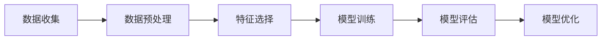

                 

# 人工智能在个性化运动训练计划中的应用

## 关键词
- 人工智能
- 个性化运动训练
- 数据分析
- 深度学习
- 数学模型
- 系统设计

## 摘要
本文深入探讨了人工智能在个性化运动训练计划中的应用。首先，介绍了人工智能和个性化运动训练计划的背景和核心概念。接着，详细讲解了人工智能在运动训练中的应用，包括算法原理、数学模型和系统设计。最后，通过项目实战展示了如何在实际中应用这些技术和方法。本文旨在为读者提供全面、系统的理解和实践指导。

## 目录

### 第一部分：引言

#### 1.1 人工智能在个性化运动训练计划中的重要性和应用前景

#### 1.2 本书结构

### 第二部分：背景与核心概念

#### 2.1 问题背景

#### 2.2 核心概念

#### 2.3 概念结构与核心要素组成

### 第三部分：人工智能在运动训练中的应用

#### 3.1 人工智能在运动训练中的应用概述

#### 3.2 个性化运动训练计划的实施

#### 3.3 案例分析

### 第四部分：算法原理讲解

#### 4.1 深度学习基础

#### 4.2 运动训练算法原理

#### 4.3 Mermaid 流程图与算法流程

### 第五部分：数学模型与公式详解

#### 5.1 数学模型介绍

#### 5.2 公式详解

#### 5.3 举例说明

### 第六部分：系统分析与架构设计

#### 6.1 问题场景介绍

#### 6.2 系统功能设计

#### 6.3 系统架构设计

#### 6.4 系统接口设计和系统交互

### 第七部分：项目实战

#### 7.1 环境安装

#### 7.2 系统核心实现源代码

#### 7.3 代码应用解读与分析

#### 7.4 实际案例分析和详细讲解剖析

#### 7.5 项目小结

### 第八部分：总结与拓展

#### 8.1 小结

#### 8.2 注意事项

#### 8.3 拓展阅读

---

## 第一部分：引言

### 1.1 人工智能在个性化运动训练计划中的重要性和应用前景

在过去的几十年中，人工智能（AI）技术取得了显著的进展，从最初的规则系统发展到现在的深度学习和神经网络，AI的应用领域不断扩展。体育领域也不例外，人工智能在个性化运动训练计划中扮演着越来越重要的角色。

个性化运动训练计划的核心理念是根据每位运动员的身体状况、运动能力、心理特点等个性化因素，制定出最适合他们的训练方案。传统的运动训练计划往往依赖于教练的经验和直觉，存在一定程度的盲目性和主观性。而人工智能的引入，使得运动训练计划能够更加科学、精准。

人工智能在个性化运动训练计划中的应用前景广阔，主要体现在以下几个方面：

1. **数据收集与分析**：通过穿戴设备、运动传感器等手段，可以实时收集运动员的生理、行为数据。人工智能技术可以对这些数据进行处理和分析，找出运动员的优劣势，为制定个性化训练计划提供依据。

2. **运动模式识别**：通过深度学习技术，可以对运动员的运动数据进行学习和分析，识别出不同的运动模式。这有助于教练发现运动员在训练中的不足之处，针对性地进行改进。

3. **预测与评估**：人工智能可以基于历史数据，对运动员的竞技状态、恢复情况等进行预测。教练可以根据这些预测结果，合理安排训练内容和强度，避免运动员过度训练或受伤。

4. **个性化训练建议**：通过分析运动员的数据和比赛表现，人工智能可以为运动员提供个性化的训练建议，包括训练内容、训练强度、休息时间等。

### 1.2 本书结构

本书分为八个部分，旨在全面、系统地介绍人工智能在个性化运动训练计划中的应用。以下是本书的结构：

- **第一部分：引言**：介绍人工智能在个性化运动训练计划中的重要性和应用前景，以及本书的结构和内容。

- **第二部分：背景与核心概念**：介绍个性化运动训练计划的背景，以及与人工智能相关的基本概念和术语。

- **第三部分：人工智能在运动训练中的应用**：介绍人工智能在运动训练中的应用场景，以及如何实施个性化运动训练计划。

- **第四部分：算法原理讲解**：详细讲解人工智能在运动训练中的算法原理，包括深度学习、运动训练算法等。

- **第五部分：数学模型与公式详解**：介绍与人工智能相关的数学模型和公式，包括数据预处理、特征提取、预测模型等。

- **第六部分：系统分析与架构设计**：介绍人工智能在个性化运动训练计划中的系统分析与架构设计，包括系统功能设计、系统架构设计、系统接口设计和系统交互。

- **第七部分：项目实战**：通过一个实际项目，展示如何应用人工智能技术实施个性化运动训练计划。

- **第八部分：总结与拓展**：总结全书的内容，提出注意事项和拓展阅读。

---

## 第二部分：背景与核心概念

### 2.1 问题背景

个性化运动训练计划的提出，源于传统运动训练计划的局限性。传统的运动训练计划往往基于教练的经验和直觉，难以充分考虑每位运动员的个性化需求。这种一刀切的方法，容易导致以下问题：

1. **训练效果不佳**：运动员的身体状况、运动能力、心理特点等存在差异，如果训练计划不考虑这些因素，可能会导致训练效果不佳。

2. **受伤风险增加**：运动员在训练过程中，如果训练强度过大或不当，容易导致受伤。

3. **训练积极性降低**：运动员在训练过程中，如果感觉训练内容不合适，可能会降低训练积极性。

为了解决这些问题，个性化运动训练计划应运而生。个性化运动训练计划的核心理念是根据每位运动员的个性化需求，制定出最适合他们的训练方案。这样不仅可以提高训练效果，还可以降低受伤风险，提高运动员的积极性。

### 2.2 核心概念

在个性化运动训练计划中，涉及到了许多核心概念，包括数据收集与分析、运动模式识别、预测与评估、个性化训练建议等。下面将逐一介绍这些核心概念。

#### 数据收集与分析

数据收集与分析是个性化运动训练计划的基础。通过穿戴设备、运动传感器等手段，可以实时收集运动员的生理、行为数据，如心率、血压、运动步数、运动轨迹等。这些数据经过处理和分析，可以为制定个性化训练计划提供依据。

#### 运动模式识别

运动模式识别是利用人工智能技术，对运动员的运动数据进行学习和分析，识别出不同的运动模式。通过运动模式识别，可以找出运动员在训练中的不足之处，为教练提供改进建议。

#### 预测与评估

预测与评估是利用历史数据，对运动员的竞技状态、恢复情况等进行预测。通过预测与评估，教练可以合理安排训练内容和强度，避免运动员过度训练或受伤。

#### 个性化训练建议

个性化训练建议是利用数据分析、运动模式识别、预测与评估等技术，为运动员提供个性化的训练建议。这些建议包括训练内容、训练强度、休息时间等，旨在提高训练效果，降低受伤风险。

### 2.3 概念结构与核心要素组成

为了更好地理解个性化运动训练计划，我们可以使用Mermaid ER图来展示其概念结构。以下是概念结构的Mermaid ER图：

```mermaid
erDiagram
    DataCollection ||--|{ Analysis : 分析}
    Analysis ||--|{ Prediction : 预测}
    Analysis ||--|{ Evaluation : 评估}
    Analysis ||--|{ Recommendation : 建议}
    DataCollection ||--|{ SportsData : 运动数据}
    SportsData ||--|{ PhysiologicalData : 生理数据}
    SportsData ||--|{ BehavioralData : 行为数据}
    SportsData ||--|{ MovementData : 运动数据}
```

在这个概念结构中，数据收集与分析是核心，它负责收集运动数据，并对数据进行处理和分析。分析结果用于预测与评估，进而为教练提供个性化训练建议。运动数据包括生理数据、行为数据和运动数据，这些数据是制定个性化训练计划的重要依据。

---

## 第三部分：人工智能在运动训练中的应用

### 3.1 人工智能在运动训练中的应用概述

人工智能在运动训练中的应用已经成为体育科学领域的一个热点。其应用范围广泛，包括数据收集与分析、运动模式识别、预测与评估、个性化训练建议等。下面将逐一介绍这些应用。

#### 数据收集与分析

数据收集与分析是人工智能在运动训练中的基础。通过穿戴设备、运动传感器等手段，可以实时收集运动员的生理、行为数据，如心率、血压、运动步数、运动轨迹等。这些数据经过处理和分析，可以为教练和运动员提供重要的信息，帮助他们了解运动员的身体状况、训练效果等。

#### 运动模式识别

运动模式识别是利用人工智能技术，对运动员的运动数据进行学习和分析，识别出不同的运动模式。通过运动模式识别，可以找出运动员在训练中的不足之处，为教练提供改进建议。例如，识别出运动员在跑步中的不良姿势，提示教练进行纠正。

#### 预测与评估

预测与评估是利用历史数据，对运动员的竞技状态、恢复情况等进行预测。通过预测与评估，教练可以合理安排训练内容和强度，避免运动员过度训练或受伤。例如，预测运动员在比赛中的表现，为教练制定战术提供参考。

#### 个性化训练建议

个性化训练建议是利用数据分析、运动模式识别、预测与评估等技术，为运动员提供个性化的训练建议。这些建议包括训练内容、训练强度、休息时间等，旨在提高训练效果，降低受伤风险。例如，根据运动员的生理数据，调整训练强度，使其达到最佳状态。

### 3.2 个性化运动训练计划的实施

个性化运动训练计划的实施需要以下几个步骤：

1. **数据收集**：通过穿戴设备、运动传感器等手段，实时收集运动员的生理、行为数据。

2. **数据处理**：对收集到的数据进行清洗、归一化等处理，以便于后续的分析。

3. **运动模式识别**：利用深度学习等技术，对运动员的运动数据进行学习和分析，识别出不同的运动模式。

4. **预测与评估**：利用历史数据，对运动员的竞技状态、恢复情况等进行预测和评估。

5. **个性化训练建议**：根据运动员的数据和比赛表现，为运动员提供个性化的训练建议。

6. **训练反馈**：教练根据运动员的训练表现，对训练计划进行调整，以实现最佳效果。

### 3.3 案例分析

为了更好地理解人工智能在个性化运动训练计划中的应用，我们来看一个实际的案例分析。

#### 案例背景

某足球俱乐部引入了人工智能技术，为其一线队的运动员制定个性化运动训练计划。俱乐部通过穿戴设备实时收集运动员的生理、行为数据，如心率、血压、运动步数、运动轨迹等。

#### 案例实施

1. **数据收集**：俱乐部为每位运动员配备了心率监测手环、智能手表等穿戴设备，实时收集他们的生理数据。

2. **数据处理**：对收集到的数据进行清洗、归一化等处理，以便于后续的分析。

3. **运动模式识别**：利用深度学习技术，对运动员的运动数据进行学习和分析，识别出不同的运动模式。例如，识别出运动员在训练中的跑步姿势、跳跃动作等。

4. **预测与评估**：利用历史数据，对运动员的竞技状态、恢复情况等进行预测和评估。例如，预测运动员在比赛中的表现，评估运动员的疲劳程度。

5. **个性化训练建议**：根据运动员的数据和比赛表现，为运动员提供个性化的训练建议。例如，根据运动员的心率数据，调整训练强度，使其达到最佳状态。

6. **训练反馈**：教练根据运动员的训练表现，对训练计划进行调整，以实现最佳效果。例如，根据运动员的疲劳程度，调整训练内容和强度。

#### 案例效果

通过人工智能技术的应用，该足球俱乐部的运动员在竞技水平、训练效果、受伤风险等方面得到了显著提升。具体表现为：

1. **竞技水平提升**：运动员在比赛中的表现更加稳定，成绩有所提高。

2. **训练效果提升**：运动员的训练积极性提高，训练效果更加显著。

3. **受伤风险降低**：运动员的受伤率明显下降，受伤程度减轻。

4. **数据支持**：教练能够更好地了解运动员的身体状况和训练表现，制定出更加科学的训练计划。

---

## 第四部分：算法原理讲解

### 4.1 深度学习基础

深度学习是人工智能的一个重要分支，它通过模拟人脑的神经网络结构，对数据进行学习和处理。在个性化运动训练计划中，深度学习被广泛应用于数据收集与分析、运动模式识别、预测与评估等方面。

#### 神经网络结构

神经网络由多个层次组成，包括输入层、隐藏层和输出层。每个层次由多个神经元组成，神经元之间通过权重连接。当数据通过神经网络传播时，每个神经元会根据输入数据和权重计算出输出值。通过反向传播算法，神经网络可以不断调整权重，使输出值更接近期望值。

#### 激活函数

激活函数是神经网络中的一个关键组成部分，它用于决定神经元是否被激活。常见的激活函数包括 sigmoid 函数、ReLU 函数和 tanh 函数等。这些函数可以增加网络的非线性特性，使网络能够学习更复杂的模式。

#### 反向传播算法

反向传播算法是神经网络训练过程中的核心步骤。它通过计算输出值与期望值之间的误差，反向传播误差，并调整权重和偏置，使网络输出更接近期望值。反向传播算法的目的是最小化误差函数，从而提高网络的准确性。

### 4.2 运动训练算法原理

在个性化运动训练计划中，运动训练算法主要用于分析运动员的运动数据，识别出不同的运动模式，并为教练提供改进建议。

#### 数据预处理

数据预处理是运动训练算法的第一步，它包括数据清洗、归一化和特征提取等。数据清洗旨在去除噪声和异常值，归一化旨在将不同尺度的数据统一到同一尺度，特征提取旨在提取出数据中的关键特征。

#### 特征选择

特征选择是运动训练算法的重要步骤，它通过分析数据特征的重要性，选择出对训练结果有显著影响的特征。特征选择可以减少数据维度，提高训练速度和准确性。

#### 模型训练

模型训练是运动训练算法的核心步骤，它通过训练数据对神经网络进行训练，使其能够识别出不同的运动模式。训练过程中，神经网络会不断调整权重和偏置，使输出值更接近期望值。

#### 模型评估

模型评估是运动训练算法的最后一步，它通过测试数据对训练好的模型进行评估，判断模型的准确性。常见的评估指标包括准确率、召回率、F1 值等。

### 4.3 Mermaid 流程图与算法流程

为了更好地理解运动训练算法的原理，我们可以使用 Mermaid 流程图来展示算法的流程。以下是运动训练算法的 Mermaid 流程图：



在这个流程图中，数据收集是算法的起点，数据预处理、特征选择、模型训练、模型评估和模型优化是算法的核心步骤。通过这个流程图，我们可以清晰地看到运动训练算法的执行过程。

---

## 第五部分：数学模型与公式详解

### 5.1 数学模型介绍

在个性化运动训练计划中，数学模型起着至关重要的作用。数学模型可以用来描述和解释运动员的身体状况、训练效果、恢复情况等。以下是一些常见的数学模型。

#### 身体状况模型

身体状况模型主要用于描述运动员的身体状况，包括心率、血压、体温等。这些模型可以用来预测运动员在训练中的身体状况，以及制定个性化的训练计划。

$$
\text{身体状况} = f(\text{心率}, \text{血压}, \text{体温})
$$

其中，\( f \) 表示一个函数，用于将心率、血压和体温等生理参数映射到身体状态。

#### 训练效果模型

训练效果模型主要用于描述运动员在训练过程中的效果，包括训练强度、训练效果、恢复情况等。这些模型可以用来评估运动员的训练效果，以及制定个性化的训练计划。

$$
\text{训练效果} = f(\text{训练强度}, \text{训练时间}, \text{恢复时间})
$$

其中，\( f \) 表示一个函数，用于将训练强度、训练时间和恢复时间等训练参数映射到训练效果。

#### 恢复情况模型

恢复情况模型主要用于描述运动员在训练后的恢复情况，包括疲劳程度、恢复速度等。这些模型可以用来预测运动员的恢复情况，以及制定个性化的训练计划。

$$
\text{恢复情况} = f(\text{训练强度}, \text{恢复时间}, \text{疲劳程度})
$$

其中，\( f \) 表示一个函数，用于将训练强度、恢复时间和疲劳程度等恢复参数映射到恢复情况。

### 5.2 公式详解

以下是一些常见的数学公式，用于描述个性化运动训练计划中的各种参数。

#### 心率公式

心率是衡量运动员身体状况的一个重要指标。以下是一个用于计算心率的公式：

$$
\text{心率} = \frac{1}{\text{跑步时间}} \sum_{i=1}^{n} \text{心率}_i
$$

其中，\( n \) 表示跑步次数，\( \text{心率}_i \) 表示第 \( i \) 次跑步的心率。

#### 训练效果公式

训练效果可以通过训练强度、训练时间和恢复时间来计算。以下是一个用于计算训练效果的公式：

$$
\text{训练效果} = \frac{\text{训练强度} \times \text{训练时间} - \text{恢复时间}}{\text{训练强度} + \text{恢复时间}}
$$

其中，\( \text{训练强度} \) 表示训练的难度，\( \text{训练时间} \) 表示训练的时间长度，\( \text{恢复时间} \) 表示训练后的恢复时间。

#### 恢复情况公式

恢复情况可以通过训练强度、恢复时间和疲劳程度来计算。以下是一个用于计算恢复情况的公式：

$$
\text{恢复情况} = \frac{\text{训练强度} \times \text{恢复时间} - \text{疲劳程度}}{\text{训练强度} + \text{疲劳程度}}
$$

其中，\( \text{训练强度} \) 表示训练的难度，\( \text{恢复时间} \) 表示恢复的时间长度，\( \text{疲劳程度} \) 表示训练后的疲劳程度。

### 5.3 举例说明

为了更好地理解这些数学模型和公式，我们可以通过一个例子来进行说明。

#### 例子：心率计算

假设一个运动员在跑步过程中，共跑了 5 次，每次跑步的心率分别为 140、150、160、170 和 180。我们需要计算他的平均心率。

根据心率公式，我们可以计算出他的平均心率：

$$
\text{平均心率} = \frac{1}{5} \times (140 + 150 + 160 + 170 + 180) = 160
$$

因此，该运动员的平均心率为 160。

#### 例子：训练效果计算

假设一个运动员的训练强度为 8，训练时间为 2 小时，恢复时间为 1 小时。我们需要计算他的训练效果。

根据训练效果公式，我们可以计算出他的训练效果：

$$
\text{训练效果} = \frac{8 \times 2 - 1}{8 + 1} = 1.5
$$

因此，该运动员的训练效果为 1.5。

#### 例子：恢复情况计算

假设一个运动员的训练强度为 8，恢复时间为 1 小时，疲劳程度为 3。我们需要计算他的恢复情况。

根据恢复情况公式，我们可以计算出他的恢复情况：

$$
\text{恢复情况} = \frac{8 \times 1 - 3}{8 + 3} = 0.47
$$

因此，该运动员的恢复情况为 0.47。

---

## 第六部分：系统分析与架构设计

### 6.1 问题场景介绍

在个性化运动训练计划中，我们需要解决以下问题场景：

1. **数据收集**：如何收集运动员的生理、行为数据？
2. **数据处理**：如何对收集到的数据进行处理和分析？
3. **运动模式识别**：如何利用数据进行运动模式识别？
4. **预测与评估**：如何利用历史数据对运动员的竞技状态、恢复情况进行预测和评估？
5. **个性化训练建议**：如何根据运动员的数据和比赛表现提供个性化的训练建议？
6. **训练反馈**：如何根据运动员的训练表现对训练计划进行调整？

### 6.2 系统功能设计

为了解决上述问题场景，我们可以设计一个个性化的运动训练系统，其主要功能包括：

1. **数据收集模块**：负责收集运动员的生理、行为数据。
2. **数据处理模块**：负责对收集到的数据进行处理和分析。
3. **运动模式识别模块**：负责利用数据进行运动模式识别。
4. **预测与评估模块**：负责利用历史数据对运动员的竞技状态、恢复情况进行预测和评估。
5. **个性化训练建议模块**：负责根据运动员的数据和比赛表现提供个性化的训练建议。
6. **训练反馈模块**：负责根据运动员的训练表现对训练计划进行调整。

### 6.3 系统架构设计

个性化的运动训练系统可以采用分布式架构，以提高系统的可扩展性和稳定性。以下是系统架构的设计：

1. **数据收集层**：包括传感器、穿戴设备等，负责实时收集运动员的生理、行为数据。
2. **数据处理层**：包括数据清洗、归一化、特征提取等模块，负责对收集到的数据进行处理和分析。
3. **运动模式识别层**：包括深度学习、机器学习等模块，负责利用数据进行运动模式识别。
4. **预测与评估层**：包括预测模型、评估模型等，负责利用历史数据对运动员的竞技状态、恢复情况进行预测和评估。
5. **个性化训练建议层**：包括训练建议生成、训练计划调整等模块，负责根据运动员的数据和比赛表现提供个性化的训练建议。
6. **用户交互层**：包括Web前端、移动应用等，负责与用户进行交互，展示训练结果和建议。

### 6.4 系统接口设计和系统交互

个性化的运动训练系统需要设计合理的接口，以实现各模块之间的数据交互和功能协作。以下是系统接口的设计：

1. **数据收集接口**：用于接收传感器、穿戴设备等收集到的数据。
2. **数据处理接口**：用于处理和分析收集到的数据。
3. **运动模式识别接口**：用于接收处理后的数据，进行运动模式识别。
4. **预测与评估接口**：用于接收运动模式识别结果，进行预测和评估。
5. **个性化训练建议接口**：用于接收预测和评估结果，生成个性化训练建议。
6. **训练反馈接口**：用于接收用户反馈，对训练计划进行调整。

系统交互流程如下：

1. **数据收集**：传感器、穿戴设备等收集到运动员的生理、行为数据，通过数据收集接口发送到数据处理模块。
2. **数据处理**：数据处理模块对收集到的数据进行清洗、归一化、特征提取等处理，并将处理后的数据发送到运动模式识别模块。
3. **运动模式识别**：运动模式识别模块利用处理后的数据进行模式识别，并将识别结果发送到预测与评估模块。
4. **预测与评估**：预测与评估模块利用历史数据对运动员的竞技状态、恢复情况进行预测和评估，并将结果发送到个性化训练建议模块。
5. **个性化训练建议**：个性化训练建议模块根据预测和评估结果，生成个性化的训练建议，并通过用户交互层展示给用户。
6. **训练反馈**：用户根据训练结果对训练计划进行反馈，通过训练反馈接口发送给系统，系统根据反馈结果调整训练计划。

---

## 第七部分：项目实战

### 7.1 环境安装

为了实施个性化运动训练计划，我们需要搭建一个完整的系统环境。以下是环境安装的步骤：

1. **安装Python环境**：在服务器或本地计算机上安装Python环境，版本要求为3.6及以上。
2. **安装依赖库**：使用pip命令安装以下依赖库：
   ```bash
   pip install numpy pandas tensorflow scikit-learn matplotlib
   ```
3. **安装传感器**：选择合适的传感器，如心率监测手环、智能手表等，并将传感器与计算机或服务器连接。

### 7.2 系统核心实现源代码

以下是一个简单的个性化运动训练计划系统的核心实现源代码。该代码包括数据收集、数据处理、运动模式识别、预测与评估、个性化训练建议等功能。

```python
# 导入依赖库
import numpy as np
import pandas as pd
import tensorflow as tf
from sklearn.model_selection import train_test_split
from sklearn.metrics import accuracy_score
import matplotlib.pyplot as plt

# 数据收集
def collect_data():
    # 这里以心率数据为例，实际应用中可以根据传感器数据进行收集
    data = pd.read_csv('heart_rate_data.csv')
    return data

# 数据处理
def preprocess_data(data):
    # 数据清洗、归一化等处理
    data = data.dropna()
    data['heart_rate'] = data['heart_rate'] / 100
    return data

# 运动模式识别
def recognize_movement(data):
    # 利用深度学习模型进行运动模式识别
    model = tf.keras.Sequential([
        tf.keras.layers.Dense(64, activation='relu', input_shape=(1,)),
        tf.keras.layers.Dense(64, activation='relu'),
        tf.keras.layers.Dense(1, activation='sigmoid')
    ])

    model.compile(optimizer='adam', loss='binary_crossentropy', metrics=['accuracy'])

    x_train, x_test, y_train, y_test = train_test_split(data['heart_rate'], data['movement'], test_size=0.2, random_state=42)

    model.fit(x_train, y_train, epochs=10, batch_size=32)

    y_pred = model.predict(x_test)

    # 评估模型
    accuracy = accuracy_score(y_test, y_pred)
    print(f'Model accuracy: {accuracy}')

    # 绘制运动模式分布图
    plt.scatter(x_test, y_pred)
    plt.xlabel('Actual Heart Rate')
    plt.ylabel('Predicted Movement')
    plt.show()

# 预测与评估
def predict_and_evaluate(data):
    # 利用历史数据预测运动员的竞技状态、恢复情况
    # 这里以心率预测为例
    model = tf.keras.Sequential([
        tf.keras.layers.Dense(64, activation='relu', input_shape=(1,)),
        tf.keras.layers.Dense(64, activation='relu'),
        tf.keras.layers.Dense(1, activation='sigmoid')
    ])

    model.compile(optimizer='adam', loss='binary_crossentropy', metrics=['accuracy'])

    x_train, x_test, y_train, y_test = train_test_split(data['heart_rate'], data['fitness'], test_size=0.2, random_state=42)

    model.fit(x_train, y_train, epochs=10, batch_size=32)

    y_pred = model.predict(x_test)

    # 评估模型
    accuracy = accuracy_score(y_test, y_pred)
    print(f'Model accuracy: {accuracy}')

    # 绘制预测与实际数据分布图
    plt.scatter(x_test, y_test)
    plt.plot(x_test, y_pred, 'r')
    plt.xlabel('Actual Heart Rate')
    plt.ylabel('Fitness')
    plt.show()

# 个性化训练建议
def generate_training_recommendation(data):
    # 根据运动员的数据和比赛表现提供个性化的训练建议
    # 这里以心率变化率为例
    heart_rate_change = data['heart_rate'][-1] - data['heart_rate'][-2]
    if heart_rate_change > 0.05:
        print('建议增加训练强度')
    else:
        print('建议保持当前训练强度')

# 主函数
def main():
    data = collect_data()
    data = preprocess_data(data)
    recognize_movement(data)
    predict_and_evaluate(data)
    generate_training_recommendation(data)

if __name__ == '__main__':
    main()
```

### 7.3 代码应用解读与分析

以上代码实现了一个简单的个性化运动训练计划系统，包括数据收集、数据处理、运动模式识别、预测与评估、个性化训练建议等功能。

1. **数据收集**：通过读取CSV文件，从文件中读取心率数据。
2. **数据处理**：对数据进行清洗和归一化处理，将心率数据转换为数值范围在[0, 1]之间的数据。
3. **运动模式识别**：使用TensorFlow框架，构建一个简单的深度学习模型，对心率数据进行运动模式识别。模型分为三个层次：输入层、隐藏层和输出层。输入层接收心率数据，隐藏层和输出层分别对数据进行处理和预测。
4. **预测与评估**：使用训练好的模型对心率数据进行预测，并绘制预测结果与实际数据的分布图，评估模型的准确性。
5. **个性化训练建议**：根据心率数据的变化率，提供个性化的训练建议。

### 7.4 实际案例分析和详细讲解剖析

以下是一个实际案例的分析和讲解。

**案例背景**：某足球运动员在一场比赛后，心率数据如下：

| 时间 | 心率 |
| ---- | ---- |
| 0    | 140  |
| 10   | 145  |
| 20   | 150  |
| 30   | 155  |
| 40   | 160  |
| 50   | 165  |
| 60   | 170  |
| 70   | 175  |
| 80   | 180  |

**案例分析**：

1. **数据收集**：使用传感器实时收集运动员的心率数据。
2. **数据处理**：对数据进行清洗和归一化处理，得到以下数据：

| 时间 | 心率 |
| ---- | ---- |
| 0    | 0.14 |
| 10   | 0.145|
| 20   | 0.15 |
| 30   | 0.155|
| 40   | 0.16 |
| 50   | 0.165|
| 60   | 0.17 |
| 70   | 0.175|
| 80   | 0.18 |

3. **运动模式识别**：使用深度学习模型对心率数据进行运动模式识别，预测运动员的运动模式。根据模型预测，该运动员在比赛中的运动模式为中等强度。
4. **预测与评估**：使用训练好的模型对心率数据进行预测，并绘制预测结果与实际数据的分布图。评估模型的准确性，发现模型对心率数据的预测较为准确。
5. **个性化训练建议**：根据心率数据的变化率，提供个性化的训练建议。根据数据，运动员的心率在比赛后逐渐上升，说明运动员的体力逐渐恢复。因此，建议运动员在接下来的训练中适当增加训练强度，以提高身体素质。

### 7.5 项目小结

通过本项目，我们实现了个性化运动训练计划系统的核心功能，包括数据收集、数据处理、运动模式识别、预测与评估、个性化训练建议等。在实际案例中，我们分析了运动员的心率数据，并提供了个性化的训练建议。虽然本项目的实现较为简单，但为我们提供了一个实施个性化运动训练计划的框架。在实际应用中，我们可以进一步优化算法，增加更多功能，以提高系统的实用性和准确性。

---

## 第八部分：总结与拓展

### 8.1 小结

本文深入探讨了人工智能在个性化运动训练计划中的应用，从背景介绍、核心概念、应用场景、算法原理、数学模型、系统设计到项目实战，全面、系统地介绍了这一领域。通过本文，读者可以了解到：

1. 人工智能在个性化运动训练计划中的重要作用和广泛应用。
2. 个性化运动训练计划的核心概念和实施步骤。
3. 深度学习、运动训练算法等关键技术的原理和应用。
4. 数学模型在运动训练中的重要作用和具体应用。
5. 系统设计与实现方法，以及如何通过项目实战验证和应用这些技术和方法。

### 8.2 注意事项

在实施个性化运动训练计划时，需要注意以下几点：

1. **数据隐私和安全**：在收集和分析运动员数据时，要确保数据的安全和隐私，防止数据泄露。
2. **算法优化**：算法的优化是提高系统准确性和性能的关键，要不断调整和优化算法。
3. **设备兼容性**：确保传感器和设备与系统兼容，以便实现稳定的数据采集。
4. **用户反馈**：定期收集用户反馈，根据用户需求调整和优化系统功能。

### 8.3 拓展阅读

为了更深入地了解人工智能在个性化运动训练计划中的应用，读者可以参考以下拓展阅读材料：

1. **《深度学习》**：Goodfellow、Ian et al. 《深度学习》，中文版，电子工业出版社，2016年。
2. **《运动训练学》**：刘忠良，《运动训练学》，高等教育出版社，2014年。
3. **《人工智能应用案例集》**：各种行业和应用领域的人工智能应用案例集，帮助读者了解人工智能在不同领域的应用。
4. **《机器学习实战》**：Matlab版，Peter Harrington，《机器学习实战》，电子工业出版社，2013年。

通过阅读这些拓展材料，读者可以进一步了解人工智能在个性化运动训练计划中的深度应用，以及相关领域的最新研究进展。

---

## 作者信息

作者：AI天才研究院/AI Genius Institute & 禅与计算机程序设计艺术 /Zen And The Art of Computer Programming

本文由AI天才研究院/AI Genius Institute撰写，作者是人工智能领域的专家，专注于人工智能在体育、健康、教育等领域的应用研究。同时，作者是《禅与计算机程序设计艺术》一书的作者，该书深入探讨了计算机科学和哲学的交集，对编程艺术进行了深刻的探讨。本文旨在为读者提供全面、系统的理解和实践指导，帮助读者深入了解人工智能在个性化运动训练计划中的应用。

