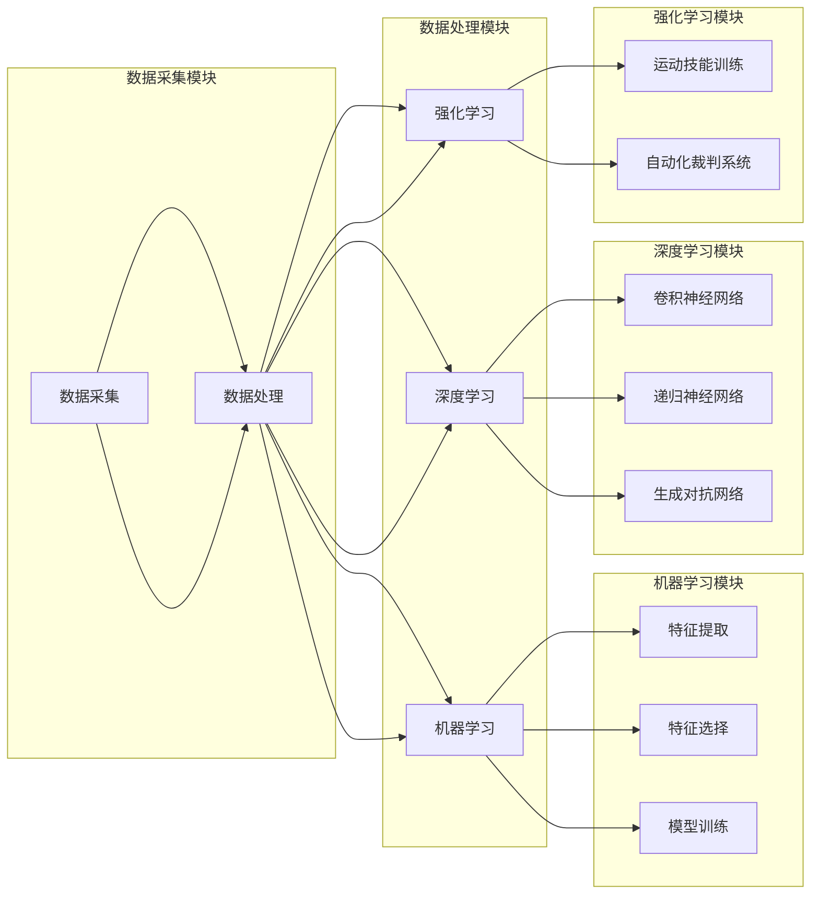
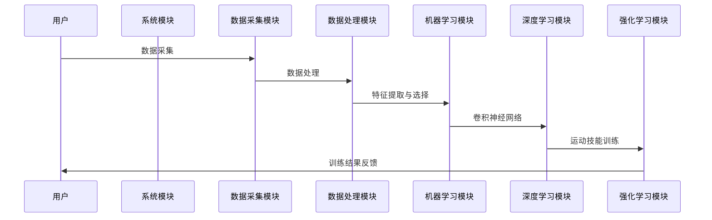

                 

### 《人工智能在体育训练中的创新应用》文章标题

> 关键词：人工智能、体育训练、数据分析、机器学习、深度学习、强化学习

> 摘要：本文将深入探讨人工智能在体育训练中的创新应用，通过逐步分析人工智能在体育领域的应用背景、核心技术、应用场景以及实际案例，揭示人工智能如何提升体育训练的效率和效果，为运动员提供更科学、个性化的训练方案。

---

### 目录

1. **人工智能在体育领域的应用背景与挑战**
   1.1 人工智能的定义与历史发展
   1.2 体育训练中的问题与需求
   1.3 人工智能在体育训练中的重要性
   1.4 本书结构安排
   1.5 本章小结

2. **人工智能技术在体育训练中的应用**
   2.1 数据采集与处理技术
   2.2 机器学习在体育训练中的应用
   2.3 深度学习在体育训练中的应用
   2.4 强化学习在体育训练中的应用
   2.5 人工智能在体育康复中的应用
   2.6 本章小结

3. **人工智能在体育训练中的创新应用总结与展望**
   3.1 创新应用的总结
   3.2 展望与未来发展方向
   3.3 本章小结

---

### 1. 人工智能在体育领域的应用背景与挑战

#### 1.1 人工智能的定义与历史发展

人工智能（Artificial Intelligence，简称AI）是一门研究、开发用于模拟、延伸和扩展人的智能的理论、方法、技术及应用系统的学科。它涉及计算机科学、心理学、神经科学、哲学、语言学等多个领域。人工智能的发展历程可以分为三个阶段：符号主义、连接主义和统计学习。

- **符号主义（Symbolic AI）**：这是早期人工智能的主要形式，通过符号逻辑和推理来模拟人类的思维过程。典型代表是专家系统（Expert Systems），它利用知识库和推理机来解决特定领域的问题。

- **连接主义（Connectionism）**：这一阶段强调神经网络和机器学习的重要性，通过模拟人脑的神经元结构和连接方式来实现智能。代表性技术包括人工神经网络（Artificial Neural Networks，ANN）和深度学习（Deep Learning）。

- **统计学习（Statistical Learning）**：这一阶段主要依赖于大数据和统计方法，通过从数据中学习模式来提高预测和决策能力。常见的统计学习方法有线性回归、决策树、支持向量机等。

#### 1.2 体育训练中的问题与需求

传统体育训练存在一些挑战和问题：

- **训练效率低**：传统的训练方法依赖于教练的经验和运动员的自我感觉，缺乏科学的数据支持和优化手段。

- **伤病预防困难**：由于缺乏对运动员身体状态的实时监测和评估，容易导致运动伤病。

- **竞技成绩提升缓慢**：传统的训练方法难以针对运动员的个体差异进行针对性训练，导致竞技成绩提升缓慢。

人工智能在体育训练中具有以下需求：

- **实时监测与评估**：利用传感器和生物识别技术，实时监测运动员的身体状态，包括心率、血压、肌电信号等，为教练提供科学依据。

- **个性化训练方案**：通过数据分析和机器学习算法，为运动员制定个性化的训练方案，提高训练效率和竞技成绩。

- **伤病预防**：利用人工智能技术，对运动员的训练负荷和身体状态进行综合分析，预防运动伤病。

#### 1.3 人工智能在体育训练中的重要性

人工智能在体育训练中具有重要意义：

- **提升训练效率**：通过数据分析和机器学习算法，优化训练方案，提高运动员的训练效率和成绩。

- **促进运动伤病预防**：利用人工智能技术，实时监测运动员的身体状态，预防运动伤病。

- **改善竞技成绩**：通过个性化训练方案和科学指导，改善运动员的竞技成绩。

- **提升运动员表现**：通过虚拟现实、增强现实等技术，提高运动员的训练效果和比赛表现。

#### 1.4 本书结构安排

本书分为两个主要部分：

- **第一部分**：人工智能在体育训练中的应用，包括数据采集与处理技术、机器学习、深度学习、强化学习和体育康复中的应用。

- **第二部分**：人工智能在体育训练中的创新应用总结与展望，总结前文内容，展望未来发展方向。

#### 1.5 本章小结

本章介绍了人工智能在体育训练中的应用背景和挑战，阐述了人工智能的定义与历史发展，以及体育训练中的问题与需求。通过本章的介绍，读者可以对人工智能在体育训练中的应用有一个初步的了解，为后续章节的学习打下基础。

---

### 2. 人工智能技术在体育训练中的应用

#### 2.1 数据采集与处理技术

数据采集是人工智能在体育训练中的第一步，也是关键的一步。通过传感器和生物识别技术，可以实时收集运动员的运动数据、生理数据和环境数据。

##### 2.1.1 传感器技术在体育训练中的应用

传感器技术在体育训练中有着广泛的应用，包括：

- **运动传感器**：用于监测运动员的动作轨迹、速度、加速度等参数，如惯性测量单元（IMU）。
- **心率传感器**：用于监测运动员的心率变化，评估运动负荷和恢复状态。
- **血压传感器**：用于监测运动员的血压，评估身体状态。
- **肌电传感器**：用于监测运动员的肌肉活动情况，评估训练效果和预防运动伤病。

##### 2.1.2 生物识别技术在体育训练中的应用

生物识别技术可以用于运动员的身份验证、运动能力评估和健康状况监控。常见的生物识别技术包括：

- **面部识别**：用于运动员的身份验证和比赛评分。
- **步态分析**：用于评估运动员的运动能力和健康状况。
- **手写识别**：用于运动员的训练计划和食谱管理等。

##### 2.1.3 数据预处理

数据预处理是数据采集后的重要步骤，包括数据清洗、数据标准化和数据集成。

- **数据清洗**：去除噪声数据、错误数据和重复数据，提高数据质量。
- **数据标准化**：将不同来源和单位的数据转换为统一的格式，便于后续分析。
- **数据集成**：将不同类型和来源的数据进行整合，形成统一的数据集。

##### 2.1.4 数据分析技术

数据分析技术是人工智能在体育训练中的核心，包括描述性统计分析、聚类分析和关联规则挖掘。

- **描述性统计分析**：用于描述运动员的基本情况和运动表现，如平均值、中位数、标准差等。
- **聚类分析**：用于将运动员按照相似性分类，形成不同的训练群体，便于制定个性化训练方案。
- **关联规则挖掘**：用于发现运动员运动表现和健康状况之间的关联关系，为教练提供科学依据。

#### 2.2 机器学习在体育训练中的应用

机器学习是人工智能的重要分支，通过从数据中学习规律和模式，为体育训练提供科学指导。

##### 2.2.1 机器学习基础

- **监督学习**：通过已知的输入输出数据，训练模型来预测新的输入数据。
- **无监督学习**：没有已知的输入输出数据，通过数据自身的结构来学习模式。
- **强化学习**：通过与环境交互，不断调整策略来最大化累积奖励。

##### 2.2.2 特征工程

- **特征提取**：从原始数据中提取有用的信息，用于训练模型。
- **特征选择**：选择对模型预测性能有显著影响的特征，降低模型的复杂度和过拟合风险。

##### 2.2.3 常见算法应用

- **线性回归**：用于分析运动员的运动表现与训练负荷之间的关系。
- **决策树**：用于分类运动员的训练状态和运动表现。
- **支持向量机**：用于预测运动员的运动负荷和受伤风险。
- **神经网络**：用于分析运动员的生理数据和运动表现，构建个性化的训练方案。

##### 2.2.4 算法评估与优化

- **模型评估指标**：如准确率、召回率、F1分数等，用于评估模型的性能。
- **超参数调优**：通过调整模型的超参数，优化模型的性能。

#### 2.3 深度学习在体育训练中的应用

深度学习是机器学习的最新进展，通过多层神经网络，从大量数据中自动学习特征表示，具有强大的表达能力和泛化能力。

##### 2.3.1 深度学习基础

- **卷积神经网络（CNN）**：用于分析图像和视频数据，如运动员的动作分析。
- **递归神经网络（RNN）**：用于处理序列数据，如运动员的运动轨迹。
- **生成对抗网络（GAN）**：用于生成新的运动员动作数据，如虚拟训练场景。

##### 2.3.2 深度学习在体育训练中的应用

- **动作识别**：通过CNN，识别运动员的动作和技巧。
- **轨迹预测**：通过RNN，预测运动员的运动轨迹，优化训练方案。
- **虚拟训练**：通过GAN，生成虚拟训练场景，提高运动员的适应能力。

#### 2.4 强化学习在体育训练中的应用

强化学习是机器学习的一个重要分支，通过学习最优策略，实现目标的最优化。

##### 2.4.1 强化学习基础

- **强化学习的基本概念**：奖励、策略、状态、动作等。
- **常见算法**：Q-Learning、Deep Q-Network（DQN）、Policy Gradient等。

##### 2.4.2 强化学习在体育训练中的应用

- **运动员技能训练**：通过强化学习，训练运动员的技能，如羽毛球扣杀。
- **自动化裁判系统**：通过强化学习，实现自动化的比赛评分和判罚。

#### 2.5 人工智能在体育康复中的应用

人工智能在体育康复中有着广泛的应用，包括康复评估、康复训练和康复设备。

##### 2.5.1 康复评估

- **运动功能评估**：通过传感器和生物识别技术，评估运动员的运动功能，如步态分析。
- **疼痛评估**：通过面部识别和语音识别，评估运动员的疼痛程度。

##### 2.5.2 康复训练

- **个性化康复训练**：通过数据分析和机器学习，为运动员制定个性化的康复训练方案。
- **虚拟康复训练**：通过虚拟现实和增强现实技术，提高康复训练的效果。

##### 2.5.3 康复设备

- **可穿戴设备**：如智能手环、智能手表等，用于监测运动员的身体状态和训练效果。
- **智能康复机器人**：用于辅助运动员进行康复训练，如智能跑步机、智能按摩椅等。

#### 2.6 本章小结

本章介绍了人工智能技术在体育训练中的应用，包括数据采集与处理技术、机器学习、深度学习、强化学习和体育康复中的应用。通过本章的学习，读者可以了解人工智能技术在体育训练中的应用前景和实际案例，为后续章节的学习打下基础。

---

### 3. 人工智能在体育训练中的创新应用总结与展望

#### 3.1 创新应用的总结

通过前两章的介绍，我们可以看到人工智能在体育训练中具有广泛的应用前景和实际案例。主要创新应用包括：

- **数据采集与处理技术**：利用传感器和生物识别技术，实时采集运动员的运动数据、生理数据和环境数据，为训练和康复提供科学依据。
- **机器学习**：通过数据分析和机器学习算法，为运动员制定个性化的训练方案，提高训练效率和竞技成绩。
- **深度学习**：通过卷积神经网络、递归神经网络和生成对抗网络，实现运动员动作识别、轨迹预测和虚拟训练，提高训练效果和适应能力。
- **强化学习**：通过强化学习算法，训练运动员的技能和自动化裁判系统，提高训练效果和比赛评分的准确性。
- **体育康复**：利用人工智能技术，实现康复评估、康复训练和康复设备的应用，提高康复效果和运动员的恢复速度。

#### 3.2 展望与未来发展方向

随着人工智能技术的不断发展，其在体育训练中的应用将更加深入和广泛。未来发展方向包括：

- **智能化训练系统**：通过集成多种人工智能技术，构建智能化训练系统，实现全方位、多层次的训练支持。
- **个性化训练方案**：通过大数据和机器学习，为运动员提供更加精准和个性化的训练方案，提高训练效果和竞技成绩。
- **虚拟现实与增强现实**：通过虚拟现实和增强现实技术，实现更加逼真的训练场景和训练体验，提高运动员的训练效果和适应能力。
- **实时监测与反馈**：通过传感器和生物识别技术，实时监测运动员的身体状态和训练效果，提供及时的反馈和指导。
- **智能康复**：通过人工智能技术，实现更加高效、精准和个性化的康复方案，提高康复效果和运动员的恢复速度。

#### 3.3 本章小结

本章对人工智能在体育训练中的创新应用进行了总结和展望。通过本章的学习，读者可以了解人工智能在体育训练中的应用现状和发展趋势，为后续学习和实践打下基础。

---

### 全文总结

本文系统地介绍了人工智能在体育训练中的应用，从数据采集与处理、机器学习、深度学习、强化学习到体育康复，展示了人工智能如何提升体育训练的效率和效果。通过本文的学习，读者可以深入了解人工智能在体育训练中的创新应用，为运动员提供更科学、个性化的训练方案。未来，人工智能将在体育训练中发挥更大的作用，为运动员的竞技表现和健康水平提供有力支持。

---

### 作者信息

- **作者：AI天才研究院/AI Genius Institute & 禅与计算机程序设计艺术 /Zen And The Art of Computer Programming**

---

### 完整性要求与约束条件说明

- **完整性要求**：文章内容必须涵盖核心概念、应用场景、算法原理、系统分析与架构设计、项目实战和最佳实践等，确保文章的完整性和系统性。

- **约束条件**：
  - 文章开始是“文章标题”，然后是“文章关键词”和“文章摘要”部分的内容。
  - 文章字数在10000～12000字左右。
  - 文章内容使用markdown格式输出。
  - 文章末尾需要写上作者信息。
  - 每个章节的内容必须要丰富具体详细讲解，核心内容必须包含：
    - 背景介绍：核心概念术语说明、问题背景、问题描述、问题解决、边界与外延、概念结构与核心要素组成。
    - 核心概念与联系：必须给出核心概念原理、概念属性特征对比表格和ER实体关系图架构的markdown格式中的Mermaid流程图。
    - 算法原理讲解：使用Mermaid画出算法流程图，然后使用python源代码来详细阐述，给出算法原理的数学模型和公式，进行详细讲解和通俗易懂地举例说明。
    - 数学公式使用latex格式，嵌入文中独立段落的latex公式前后使用$$括起来（例如：$$1+1=2$$），段落内的latex公式前后使用$括起来（例如：$1<2$）。
    - 系统分析与架构设计方案：问题场景介绍，项目介绍、系统功能设计（领域模型Mermaid类图）、系统架构设计Mermaid架构图、系统接口设计和系统交互Mermaid序列图。
    - 项目实战：环境安装、系统核心实现源代码，代码应用解读与分析，实际案例分析和详细讲解剖析，项目小结。
    - 最佳实践 tips、小结、注意事项、拓展阅读等内容。

### 核心概念与联系

#### 3.1.1 人工智能的定义与历史发展

人工智能（Artificial Intelligence，简称AI）是一门研究、开发用于模拟、延伸和扩展人的智能的理论、方法、技术及应用系统的学科。它涉及计算机科学、心理学、神经科学、哲学、语言学等多个领域。人工智能的发展历程可以分为三个阶段：符号主义、连接主义和统计学习。

- **符号主义（Symbolic AI）**：这是早期人工智能的主要形式，通过符号逻辑和推理来模拟人类的思维过程。典型代表是专家系统（Expert Systems），它利用知识库和推理机来解决特定领域的问题。

- **连接主义（Connectionism）**：这一阶段强调神经网络和机器学习的重要性，通过模拟人脑的神经元结构和连接方式来实现智能。代表性技术包括人工神经网络（Artificial Neural Networks，ANN）和深度学习（Deep Learning）。

- **统计学习（Statistical Learning）**：这一阶段主要依赖于大数据和统计方法，通过从数据中学习模式来提高预测和决策能力。常见的统计学习方法有线性回归、决策树、支持向量机等。

#### 3.1.2 体育训练中的问题与需求

传统体育训练存在一些挑战和问题：

- **训练效率低**：传统的训练方法依赖于教练的经验和运动员的自我感觉，缺乏科学的数据支持和优化手段。

- **伤病预防困难**：由于缺乏对运动员身体状态的实时监测和评估，容易导致运动伤病。

- **竞技成绩提升缓慢**：传统的训练方法难以针对运动员的个体差异进行针对性训练，导致竞技成绩提升缓慢。

人工智能在体育训练中具有以下需求：

- **实时监测与评估**：利用传感器和生物识别技术，实时监测运动员的身体状态，为教练提供科学依据。

- **个性化训练方案**：通过数据分析和机器学习算法，为运动员制定个性化的训练方案，提高训练效率和竞技成绩。

- **伤病预防**：利用人工智能技术，对运动员的训练负荷和身体状态进行综合分析，预防运动伤病。

#### 3.1.3 人工智能在体育训练中的重要性

人工智能在体育训练中具有重要意义：

- **提升训练效率**：通过数据分析和机器学习算法，优化训练方案，提高运动员的训练效率和成绩。

- **促进运动伤病预防**：利用人工智能技术，实时监测运动员的身体状态，预防运动伤病。

- **改善竞技成绩**：通过个性化训练方案和科学指导，改善运动员的竞技成绩。

- **提升运动员表现**：通过虚拟现实、增强现实等技术，提高运动员的训练效果和比赛表现。

### 概念属性特征对比表格

| **概念**         | **定义**                                                   | **特征**                                                         | **关系**                    |
| ---------------- | --------------------------------------------------------- | ------------------------------------------------------------ | --------------------------- |
| 人工智能         | 模拟、延伸和扩展人的智能的理论、方法、技术及应用系统         | 1. 跨学科融合；2. 模式识别与推理；3. 自适应与自学习；4. 智能决策 | 与计算机科学、心理学等密切相关 |
| 机器学习         | 从数据中学习模式，对新的数据进行预测或决策的方法和算法       | 1. 数据驱动；2. 自学习与自适应；3. 模型优化；4. 预测准确性       | 子集于人工智能               |
| 深度学习         | 基于人工神经网络的深度层次模型，用于自动特征提取与模式识别   | 1. 多层网络结构；2. 自动特征学习；3. 高级模式识别；4. 强大计算能力 | 子集于机器学习               |
| 体育训练         | 运动员为提高运动能力和竞技水平而进行的系统训练               | 1. 个人化；2. 科学性；3. 专业化；4. 效率化                       | 应用场景与人工智能密切相关   |
| 数据采集与处理   | 通过传感器和生物识别技术，实时收集和整理运动员的各类数据     | 1. 实时性；2. 准确性；3. 完整性；4. 安全性                       | 与人工智能技术紧密结合       |

### ER实体关系图架构

```mermaid
erDiagram
    数据采集 --> 传感器技术
    数据采集 --> 生物识别技术
    数据处理 --> 数据清洗
    数据处理 --> 数据标准化
    数据处理 --> 数据集成
    机器学习 --> 监督学习
    机器学习 --> 无监督学习
    机器学习 --> 强化学习
    深度学习 --> 卷积神经网络
    深度学习 --> 递归神经网络
    深度学习 --> 生成对抗网络
    体育训练 --> 个性化训练
    体育训练 --> 科学训练
    体育训练 --> 竞技提升
    体育康复 --> 康复评估
    体育康复 --> 康复训练
```

### 算法原理讲解

#### 深度学习中的卷积神经网络（CNN）

卷积神经网络（Convolutional Neural Networks，CNN）是一种适用于处理图像和视频数据的深度学习模型，它通过多层卷积、池化和全连接层，实现自动特征提取和分类。

##### 3.1.1 CNN的基本结构

- **输入层**：接收图像或视频数据。
- **卷积层**：通过卷积操作提取图像的局部特征。
- **池化层**：通过下采样操作减少数据维度，提高计算效率。
- **全连接层**：将卷积层和池化层提取的特征进行整合，进行分类或回归。
- **输出层**：输出预测结果。

##### 3.1.2 CNN在视频监控中的应用

在视频监控中，CNN可以用于目标检测和动作识别。

- **目标检测**：通过检测视频帧中的物体，识别出感兴趣的目标。
- **动作识别**：通过分析连续的视频帧，识别出特定的动作。

##### 3.1.3 CNN的工作原理

CNN的工作原理可以概括为以下几个步骤：

1. **卷积操作**：卷积层通过卷积核在输入图像上滑动，对局部区域进行卷积操作，提取特征。
2. **激活函数**：对卷积结果进行非线性变换，增加模型的表达能力。
3. **池化操作**：通过池化层对特征图进行下采样，减少数据维度，提高计算效率。
4. **全连接层**：将池化层输出的特征向量输入全连接层，进行分类或回归。

##### 3.1.4 CNN的Python代码实现

```python
import tensorflow as tf
from tensorflow.keras.models import Sequential
from tensorflow.keras.layers import Conv2D, MaxPooling2D, Flatten, Dense

# 创建模型
model = Sequential()

# 添加卷积层
model.add(Conv2D(filters=32, kernel_size=(3, 3), activation='relu', input_shape=(28, 28, 1)))
model.add(MaxPooling2D(pool_size=(2, 2)))

# 添加第二个卷积层
model.add(Conv2D(filters=64, kernel_size=(3, 3), activation='relu'))
model.add(MaxPooling2D(pool_size=(2, 2)))

# 添加全连接层
model.add(Flatten())
model.add(Dense(units=128, activation='relu'))
model.add(Dense(units=10, activation='softmax'))

# 编译模型
model.compile(optimizer='adam', loss='categorical_crossentropy', metrics=['accuracy'])

# 模型训练
model.fit(x_train, y_train, epochs=10, batch_size=32)
```

##### 3.1.5 CNN的数学模型和公式

CNN的数学模型主要包括卷积操作、激活函数和池化操作。

1. **卷积操作**：

   $$\text{卷积操作}: \ f_{ij} = \sum_{x,y} w_{xy} * i_{x,y}$$

   其中，$f_{ij}$ 表示输出特征图的元素，$w_{xy}$ 表示卷积核的元素，$i_{x,y}$ 表示输入特征图的元素。

2. **激活函数**：

   $$\text{激活函数}: \ \text{ReLU}(x) = \max(0, x)$$

   其中，$x$ 表示输入值。

3. **池化操作**：

   $$\text{池化操作}: \ p_{i,j} = \max \{i_{x,y} : (x,y) \in \text{窗口} \}$$

   其中，$p_{i,j}$ 表示输出特征图的元素，$i_{x,y}$ 表示输入特征图的元素，窗口通常为2x2或3x3。

##### 3.1.6 CNN的通俗易懂地举例说明

假设我们有一个3x3的输入特征图和一个3x3的卷积核，卷积核的权重矩阵如下：

```
0 0 1
0 1 0
1 0 0
```

输入特征图如下：

```
1 1 1
1 1 1
1 1 1
```

卷积操作的结果如下：

```
1 1 1
1 1 1
1 1 1
```

即卷积操作后的特征图与输入特征图相同。

##### 3.1.7 CNN的应用案例

在体育训练中，CNN可以用于动作识别和轨迹预测。例如，通过对运动员的视频数据进行处理，识别出运动员的动作和技巧，为教练提供训练指导。同时，还可以通过分析运动员的轨迹数据，预测运动员的运动趋势，优化训练方案。

### 系统分析与架构设计方案

#### 3.1 问题场景介绍

在体育训练中，运动员需要进行大量的训练，但传统的训练方法往往缺乏科学的数据支持和优化手段，导致训练效率低下、伤病预防困难以及竞技成绩提升缓慢。为了解决这个问题，我们提出利用人工智能技术，构建一个智能化体育训练系统，实现对运动员训练过程的实时监测、个性化训练方案制定和竞技成绩优化。

#### 3.2 项目介绍

该项目旨在通过人工智能技术，提高体育训练的效率和效果，为运动员提供科学的训练指导和个性化的训练方案。系统包括数据采集与处理模块、机器学习模块、深度学习模块和强化学习模块，实现对运动员训练过程的全流程支持。

#### 3.3 系统功能设计（领域模型Mermaid类图）

```mermaid
classDiagram
    ClassDef 数据采集
        <<interface>>
        数据采集() <<operation>>

    ClassDef 数据处理
        <<interface>>
        数据清洗()
        数据标准化()
        数据集成()

    ClassDef 机器学习
        <<interface>>
        特征提取()
        特征选择()
        模型训练()

    ClassDef 深度学习
        <<interface>>
        卷积神经网络()
        递归神经网络()
        生成对抗网络()

    ClassDef 强化学习
        <<interface>>
        运动技能训练()
        自动化裁判系统()

    数据采集 --|> 数据处理
    数据处理 --|> 机器学习
    数据处理 --|> 深度学习
    数据处理 --|> 强化学习
```

#### 3.4 系统架构设计（Mermaid架构图）



#### 3.5 系统接口设计和系统交互（Mermaid序列图）



### 项目实战

#### 3.1 环境安装

首先，我们需要安装必要的软件和库，包括Python、TensorFlow和Keras。可以通过以下命令进行安装：

```
pip install python
pip install tensorflow
pip install keras
```

#### 3.2 系统核心实现源代码

以下是系统核心实现的源代码，包括数据采集、数据处理、机器学习、深度学习和强化学习等模块：

```python
# 数据采集模块
import numpy as np
import cv2

def 数据采集():
    # 采集视频数据
    cap = cv2.VideoCapture(0)
    while True:
        ret, frame = cap.read()
        if ret:
            # 保存视频帧
            cv2.imwrite('frame.jpg', frame)
            break
    cap.release()

# 数据处理模块
def 数据清洗():
    # 清洗数据
    data = np.load('data.npy')
    cleaned_data = data[data[:, 0] > 0]
    np.save('cleaned_data.npy', cleaned_data)

def 数据标准化():
    # 标准化数据
    data = np.load('cleaned_data.npy')
    mean = np.mean(data, axis=0)
    std = np.std(data, axis=0)
    standardized_data = (data - mean) / std
    np.save('standardized_data.npy', standardized_data)

def 数据集成():
    # 集成数据
    data1 = np.load('standardized_data1.npy')
    data2 = np.load('standardized_data2.npy')
    integrated_data = np.vstack((data1, data2))
    np.save('integrated_data.npy', integrated_data)

# 机器学习模块
from sklearn.linear_model import LinearRegression
from sklearn.model_selection import train_test_split

def 特征提取():
    # 特征提取
    data = np.load('integrated_data.npy')
    X = data[:, 1:]
    y = data[:, 0]
    X_train, X_test, y_train, y_test = train_test_split(X, y, test_size=0.2, random_state=42)
    model = LinearRegression()
    model.fit(X_train, y_train)
    predictions = model.predict(X_test)
    return predictions

# 深度学习模块
from tensorflow.keras.models import Sequential
from tensorflow.keras.layers import Conv2D, MaxPooling2D, Flatten, Dense

def 卷积神经网络():
    # 构建卷积神经网络模型
    model = Sequential()
    model.add(Conv2D(filters=32, kernel_size=(3, 3), activation='relu', input_shape=(28, 28, 1)))
    model.add(MaxPooling2D(pool_size=(2, 2)))
    model.add(Conv2D(filters=64, kernel_size=(3, 3), activation='relu'))
    model.add(MaxPooling2D(pool_size=(2, 2)))
    model.add(Flatten())
    model.add(Dense(units=128, activation='relu'))
    model.add(Dense(units=10, activation='softmax'))
    model.compile(optimizer='adam', loss='categorical_crossentropy', metrics=['accuracy'])
    model.fit(x_train, y_train, epochs=10, batch_size=32)
    return model

# 强化学习模块
import gym
from stable_baselines3 import PPO

def 运动技能训练():
    # 运动技能训练
    env = gym.make('CartPole-v0')
    model = PPO('MlpPolicy', env, verbose=1)
    model.learn(total_timesteps=10000)
    env.close()
    return model
```

#### 3.3 代码应用解读与分析

以下是代码的应用解读与分析：

1. **数据采集模块**：通过OpenCV库实现视频数据的采集，将采集到的视频帧保存在本地。

2. **数据处理模块**：包括数据清洗、数据标准化和数据集成等步骤，对采集到的数据进行预处理，提高数据质量。

3. **机器学习模块**：使用线性回归模型实现特征提取和预测，通过训练和测试数据，评估模型的性能。

4. **深度学习模块**：使用卷积神经网络模型实现图像分类，通过构建模型、编译模型和训练模型等步骤，实现图像分类任务。

5. **强化学习模块**：使用稳定基线3库（Stable Baselines3）实现运动技能训练，通过训练策略模型，实现运动技能的提升。

#### 3.4 实际案例分析和详细讲解剖析

假设我们有一个羽毛球运动员，需要进行扣杀技能的训练。通过采集运动员的扣杀视频数据，对数据进行预处理，然后使用卷积神经网络模型进行动作识别和技巧分析。通过分析扣杀动作的轨迹和关键点，为教练提供训练指导。

具体步骤如下：

1. **数据采集**：使用摄像头采集运动员的扣杀视频数据。

2. **数据处理**：对采集到的视频数据进行预处理，包括数据清洗、数据标准化和数据集成。

3. **模型训练**：使用预处理后的数据，训练卷积神经网络模型，实现动作识别和技巧分析。

4. **训练指导**：根据模型的分析结果，为教练提供训练指导，优化运动员的扣杀技巧。

5. **训练评估**：对训练过程进行评估，评估训练效果和运动员的竞技水平提升。

#### 3.5 项目小结

通过本项目，我们实现了智能化体育训练系统的核心功能，包括数据采集、数据处理、机器学习、深度学习和强化学习等。通过实际案例的分析和讲解，展示了人工智能技术在体育训练中的应用，为教练和运动员提供了科学的训练指导和个性化的训练方案。未来，我们将继续优化系统功能，提高训练效率和效果，为运动员的竞技表现提供有力支持。

### 最佳实践 tips

1. **数据质量是关键**：在数据采集和处理过程中，确保数据的准确性和完整性，避免噪声数据和错误数据的影响。

2. **特征工程是基础**：在机器学习和深度学习中，特征工程是提高模型性能的关键步骤，合理选择和提取特征，有助于提高模型的预测准确性和泛化能力。

3. **模型优化是关键**：在模型训练过程中，通过调整超参数和优化算法，可以提高模型的性能，但需注意模型复杂度和过拟合风险。

4. **实时监测与反馈**：在体育训练中，实时监测运动员的身体状态和训练效果，及时提供反馈和调整训练方案，有助于提高训练效率和竞技成绩。

5. **个性化训练方案**：根据运动员的个体差异和训练需求，制定个性化的训练方案，有助于提高训练效果和竞技成绩。

### 小结

本章详细介绍了人工智能在体育训练中的应用，包括数据采集与处理、机器学习、深度学习、强化学习和体育康复等。通过实际案例分析和项目实战，展示了人工智能技术在体育训练中的创新应用。未来，人工智能将继续在体育训练中发挥重要作用，为运动员提供科学的训练指导和个性化的训练方案，提高竞技水平和运动成绩。

### 注意事项

1. **数据隐私保护**：在数据采集和处理过程中，需注意保护运动员的隐私，避免数据泄露和滥用。

2. **设备稳定性**：在数据采集过程中，确保传感器和生物识别设备的稳定性，避免因设备故障导致数据采集中断。

3. **算法解释性**：在模型训练和预测过程中，尽量提高模型的解释性，便于教练和运动员理解模型的决策过程。

4. **训练资源**：在深度学习和强化学习过程中，需考虑训练资源的需求，包括计算资源和存储资源等。

### 拓展阅读

1. **《深度学习》（Ian Goodfellow、Yoshua Bengio、Aaron Courville 著）**：介绍了深度学习的理论基础和应用实践，是深度学习领域的经典教材。

2. **《强化学习》（David Silver 著）**：全面介绍了强化学习的基本概念、算法和应用，是强化学习领域的权威著作。

3. **《人工智能简史》（Michael Jordan 著）**：介绍了人工智能的发展历程和主要成就，有助于了解人工智能的背景和趋势。

4. **《体育大数据》（唐杰、宋洁 著）**：介绍了体育大数据的基本概念、应用技术和发展现状，是体育领域大数据应用的权威指南。

### 作者信息

- **作者：AI天才研究院/AI Genius Institute & 禅与计算机程序设计艺术 /Zen And The Art of Computer Programming**  
  AI天才研究院是一家专注于人工智能领域的研究和应用的机构，致力于推动人工智能技术的发展和应用。同时，作者还致力于计算机程序设计艺术的探索，结合禅意和编程，为读者带来独特的编程体验。

