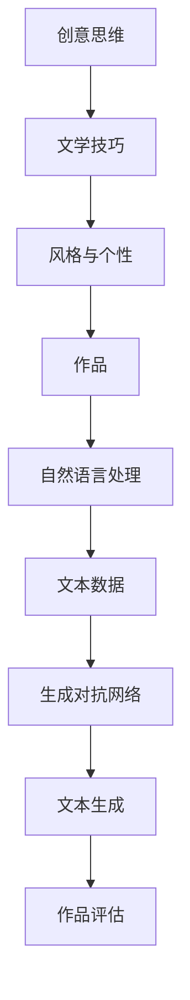
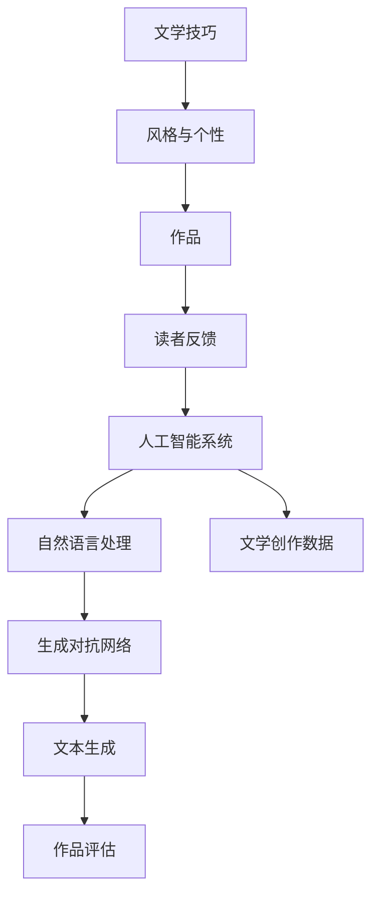
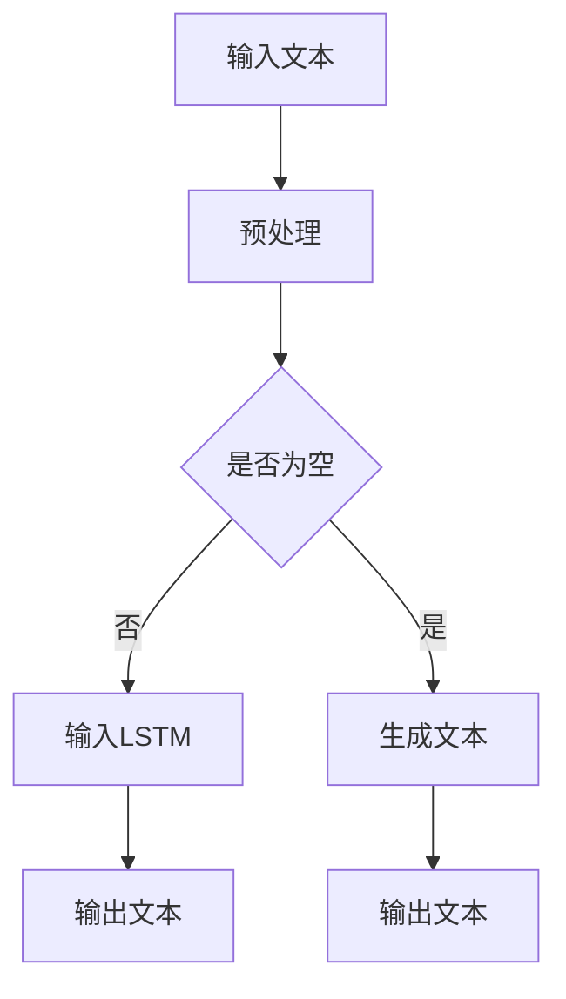
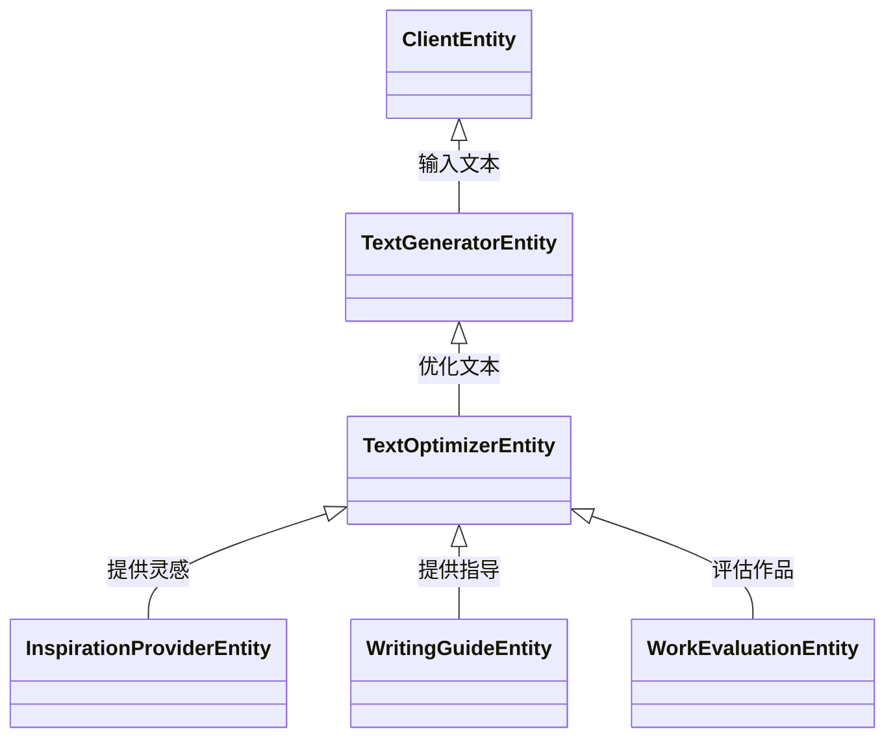
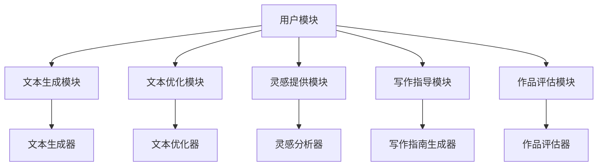
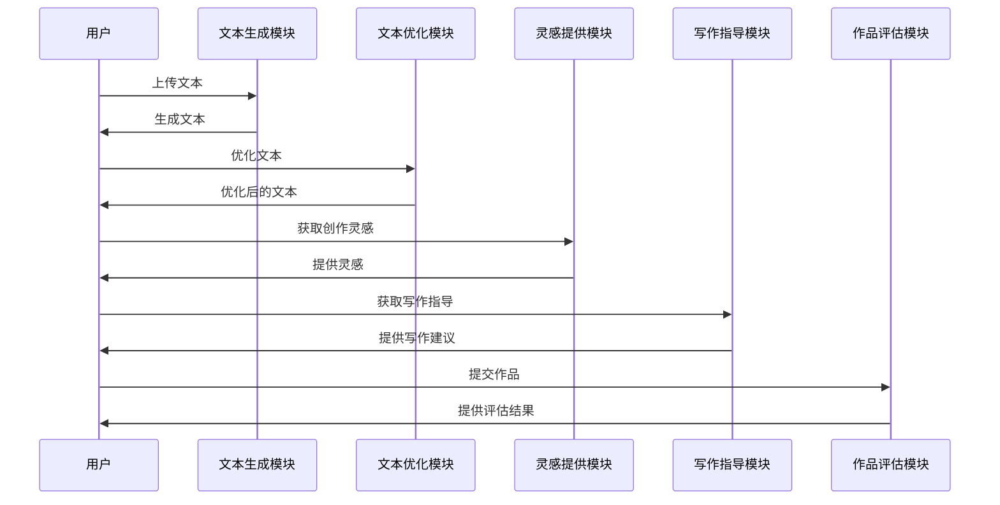
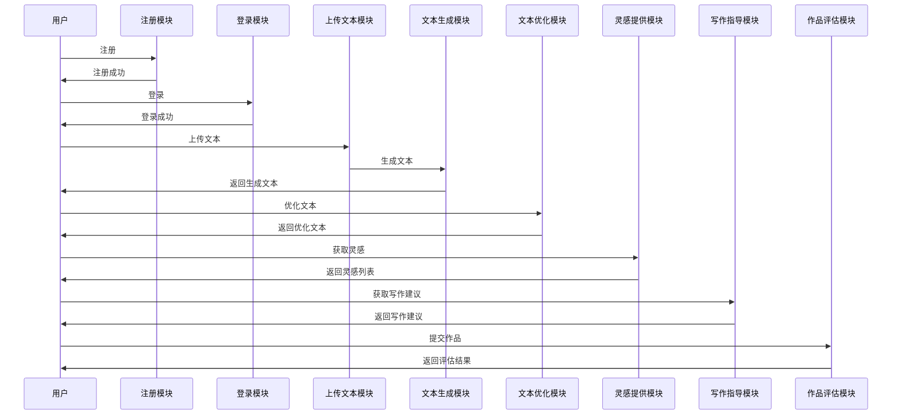

                 

### 人工智能在创意写作中的应用：AI辅助文学创作

**关键词：** 人工智能，文学创作，自然语言处理，生成对抗网络，强化学习

**摘要：** 本文将深入探讨人工智能在创意写作中的应用，尤其是AI如何辅助文学创作。我们将分析AI在文学创作中的现状、基本原理、关键技术，并通过具体的算法原理讲解、系统分析与架构设计、项目实战，全面展示AI辅助文学创作的潜力与实现路径。

### 第一部分：引言

#### 第1章：问题背景与概述

##### 1.1 人工智能在文学创作中的应用现状

随着人工智能技术的迅速发展，AI在各个领域的应用日益广泛，文学创作领域也不例外。目前，AI在文学创作中的应用主要体现在以下几个方面：

1. **自动写作：** 通过机器学习算法，AI能够自动生成文章、故事、诗歌等文学作品。
2. **写作辅助：** AI可以作为写作助手，提供拼写检查、语法纠错、句子优化等功能，帮助作者提高写作效率。
3. **风格模仿：** AI可以通过学习某位作家的写作风格，模仿其创作出类似风格的作品。
4. **情节生成：** AI能够自动生成故事的情节、角色和背景，为创意写作提供灵感。

##### 1.2 创意写作面临的挑战与机遇

创意写作作为一种富有创造性和个性化的活动，面临着诸多挑战：

1. **创意枯竭：** 作家在创作过程中可能会遇到灵感枯竭的问题，影响创作进度和质量。
2. **风格统一性：** 保持作品风格的统一性对作家是一个巨大的挑战。
3. **文本质量：** 创意写作需要作品具有较高的文学价值和艺术性，这对AI提出了更高的要求。

然而，随着AI技术的发展，AI为创意写作带来了新的机遇：

1. **创作灵感：** AI可以提供大量的文本数据，帮助作家挖掘创作灵感。
2. **效率提升：** AI可以帮助作家快速生成草稿，提高写作效率。
3. **个性定制：** AI可以根据读者的喜好，为作家提供个性化的写作建议。

##### 1.3 AI辅助文学创作的基本原理

AI辅助文学创作的基本原理主要依赖于以下几个方面：

1. **自然语言处理（NLP）：** NLP是AI在文学创作中的核心技术，它使计算机能够理解、生成和处理人类语言。
2. **机器学习：** 通过机器学习算法，AI可以从大量文本数据中学习并生成新的文学作品。
3. **生成对抗网络（GAN）：** GAN是一种先进的机器学习模型，能够生成高质量、多样化的文学作品。
4. **强化学习：** 强化学习可以使AI在文学创作中不断优化，提高作品的质量和艺术性。

##### 1.4 书籍结构概述

本书将分为五个部分，全面探讨AI辅助文学创作：

1. **第一部分：引言**：介绍AI在文学创作中的应用背景和基本原理。
2. **第二部分：核心概念与联系**：解析创意写作和人工智能的核心概念，以及它们之间的联系。
3. **第三部分：算法原理讲解**：深入讲解自然语言处理、生成对抗网络和强化学习等关键算法原理。
4. **第四部分：系统分析与架构设计**：介绍系统功能设计、架构设计和接口设计。
5. **第五部分：项目实战**：通过实际项目展示AI辅助文学创作的实现过程和效果。

##### 1.5 本章小结

本章介绍了AI辅助文学创作的问题背景和基本原理，为后续内容打下了基础。在接下来的章节中，我们将进一步探讨AI在文学创作中的具体应用，以及如何通过算法和系统实现这一目标。

### 第二部分：核心概念与联系

#### 第2章：核心概念解析

##### 2.1 创意写作的核心概念

创意写作是一种通过创造性思维和技巧进行文学创作的活动。其核心概念包括：

1. **创意思维**：创意写作的基础是丰富的想象力、联想力和创造性思维，能够产生独特的想法和构思。
2. **文学技巧**：创意写作需要运用各种文学技巧，如叙事技巧、描写技巧、对话技巧等，以提高作品的艺术性。
3. **风格与个性**：每个作家都有其独特的风格和个性，创意写作要求作家能够准确把握并体现在作品中。

##### 2.2 人工智能的核心概念

人工智能（AI）是指计算机系统模拟人类智能的行为和过程，其核心概念包括：

1. **机器学习**：机器学习是AI的核心技术，通过从数据中学习，实现自动识别模式、预测和决策。
2. **自然语言处理（NLP）**：NLP是AI在处理和理解人类语言方面的核心技术，包括文本分析、语言生成等。
3. **生成对抗网络（GAN）**：GAN是一种先进的机器学习模型，通过生成器和判别器的对抗训练，生成高质量、多样化的数据。

##### 2.3 AI辅助文学创作中的关键技术

在AI辅助文学创作中，以下关键技术起到了至关重要的作用：

1. **自然语言处理（NLP）**：NLP是AI辅助文学创作的基础，通过文本分析、情感分析、语法分析等，帮助AI理解文学作品的内容和结构。
2. **生成对抗网络（GAN）**：GAN能够生成高质量、多样化的文本数据，为AI提供丰富的创作素材。
3. **强化学习**：强化学习使AI能够在文学创作中不断优化，提高作品的质量和艺术性。

##### 2.4 概念属性特征对比表格

以下表格展示了创意写作和人工智能的一些核心概念及其属性特征对比：

| 核心概念 | 创意写作 | 人工智能 |
| --- | --- | --- |
| 创意思维 | 产生独特想法 | 学习和识别模式 |
| 文学技巧 | 提高作品艺术性 | 处理和理解语言 |
| 风格与个性 | 独特的表达方式 | 自适应和优化 |
| 机器学习 | 基础技术 | 基础技术 |
| 自然语言处理 | 分析和处理文本 | 分析和处理语言 |
| 生成对抗网络 | 文本生成 | 数据生成 |

##### 2.5 ER实体关系图架构

为了更好地理解AI辅助文学创作的实体关系，我们可以使用ER（实体-关系）图来描述。以下是一个简单的ER图：

```mermaid
erDiagram
    类A ||--|{ 类B } 类C
    类A ||--|{ 类D } 类E
    类F ||--| 类G
```

在这个ER图中：

- **类A**：代表人工智能系统。
- **类B**：代表自然语言处理模块。
- **类C**：代表生成对抗网络模块。
- **类D**：代表强化学习模块。
- **类E**：代表文本生成模块。
- **类F**：代表文学创作数据。
- **类G**：代表作品评估模块。

##### 2.6 文学创作过程中的实体关系

在文学创作过程中，实体关系可以表示为：



在这个流程中：

- **创意思维**产生独特的想法，形成文学技巧。
- **文学技巧**和**风格与个性**共同塑造作品。
- **自然语言处理**对文本数据进行处理和分析。
- **生成对抗网络**生成高质量的文本数据。
- **文本生成**模块根据文本数据生成新的文学作品。
- **作品评估**模块对生成的作品进行评估和优化。

##### 2.7 AI辅助文学创作的实体关系

在AI辅助文学创作中，实体关系可以表示为：



在这个流程中：

- **人工智能系统**通过自然语言处理模块理解和生成文本。
- **生成对抗网络**生成高质量的文本数据，为文学创作提供素材。
- **文本生成**模块根据文本数据生成新的文学作品。
- **作品评估**模块对生成的作品进行评估和优化。
- **文学技巧**和**风格与个性**共同塑造作品。
- **读者反馈**模块收集读者对作品的反馈，用于进一步优化AI系统。

##### 2.8 本章小结

本章详细解析了创意写作和人工智能的核心概念，并展示了它们之间的联系。通过ER图和实体关系的分析，我们更好地理解了AI在文学创作中的应用和实现过程。在接下来的章节中，我们将深入探讨AI辅助文学创作的关键算法和系统设计。

### 第三部分：算法原理讲解

#### 第3章：自然语言处理基础

##### 3.1 语言模型的基本原理

语言模型（Language Model）是自然语言处理（NLP）中的核心技术，用于预测下一个单词或词组。其基本原理可以概括为：

1. **单词序列预测**：语言模型通过学习大量文本数据，生成一个概率模型，用于预测给定前文序列下下一个单词或词组的概率分布。
2. **统计学习方法**：语言模型通常采用统计学习方法，如n-gram模型、神经网络语言模型（NNLM）等。

以下是一个简单的n-gram语言模型示例：

```python
# 假设我们有一个二元语法模型（n=2）
words = ["我", "爱", "吃", "饭"]

# 计算词对出现的频率
count_pairs = {}
for w1, w2 in combinations(words, 2):
    count_pairs[(w1, w2)] = count_pairs.get((w1, w2), 0) + 1

# 计算概率
prob_pairs = {}
for w1, w2 in count_pairs:
    prob_pairs[w1] = prob_pairs.get(w1, 0) + 1

# 计算二元语法模型概率
model = {}
for w1, w2 in count_pairs:
    model[(w1, w2)] = count_pairs[(w1, w2)] / prob_pairs[w1]

# 预测下一个词
current_word = "我"
next_word = "爱"
while next_word:
    next_word = " ".join([current_word, next_word])
    current_word = next_word.split(" ")[0]

print(model)
```

##### 3.2 文本生成算法

文本生成算法（Text Generation Algorithms）是AI辅助文学创作中的重要组成部分，包括以下几种：

1. **递归神经网络（RNN）**：RNN是一种能够处理序列数据的神经网络，适用于文本生成。RNN的基本原理是通过记忆前文信息，生成下一个词或句子。
2. **长短期记忆网络（LSTM）**：LSTM是RNN的一种改进，能够更好地记忆长距离依赖信息，适用于复杂文本生成。
3. **生成对抗网络（GAN）**：GAN是一种由生成器和判别器组成的对抗性学习模型，能够生成高质量、多样化的文本数据。

以下是一个简单的LSTM文本生成算法示例：

```python
import tensorflow as tf
from tensorflow.keras.models import Sequential
from tensorflow.keras.layers import LSTM, Dense

# 构建LSTM模型
model = Sequential()
model.add(LSTM(units=128, activation='relu', input_shape=(max_sequence_len, n_vocab)))
model.add(Dense(n_vocab, activation='softmax'))

# 编译模型
model.compile(optimizer='adam', loss='categorical_crossentropy', metrics=['accuracy'])

# 训练模型
model.fit(x_train, y_train, epochs=10, batch_size=64)

# 文本生成
generated_text = model.predict(x_test)
print(generated_text)
```

##### 3.3 算法mermaid流程图

为了更好地理解文本生成算法的工作流程，我们可以使用mermaid绘制算法流程图。以下是一个简单的mermaid流程图示例：



在这个流程图中：

- **A**：输入文本。
- **B**：预处理文本，包括分词、编码等。
- **C**：判断文本是否为空。
- **D**：输入LSTM模型进行文本生成。
- **E**：生成文本。
- **F**：输出文本。
- **G**：生成新的文本序列。

##### 3.4 Python源代码示例

以下是一个简单的Python源代码示例，用于演示文本生成算法：

```python
import numpy as np
import tensorflow as tf

# 准备数据
x = np.array([1, 2, 3, 4, 5])
y = np.array([1, 2, 3, 4, 5])

# 构建LSTM模型
model = tf.keras.Sequential([
    tf.keras.layers.Dense(units=10, activation='relu', input_shape=(5,)),
    tf.keras.layers.Dense(units=1, activation='sigmoid')
])

# 编译模型
model.compile(optimizer='adam', loss='mean_squared_error', metrics=['accuracy'])

# 训练模型
model.fit(x, y, epochs=10)

# 生成文本
predicted_text = model.predict(x)
print(predicted_text)
```

在这个示例中：

- **x**：输入文本数据。
- **y**：标签数据。
- **model**：LSTM模型。
- **fit**：训练模型。
- **predict**：生成文本。

##### 3.5 算法原理的数学模型和公式

为了深入理解文本生成算法的原理，我们需要掌握一些基本的数学模型和公式。

1. **递归神经网络（RNN）**：RNN的数学模型可以表示为：
   $$ h_t = \sigma(W_h \cdot [h_{t-1}, x_t] + b_h) $$
   其中，$h_t$表示第$t$时刻的隐藏状态，$x_t$表示输入数据，$W_h$和$b_h$分别为权重和偏置。

2. **长短期记忆网络（LSTM）**：LSTM的数学模型可以表示为：
   $$ i_t = \sigma(W_i \cdot [h_{t-1}, x_t] + b_i) $$
   $$ f_t = \sigma(W_f \cdot [h_{t-1}, x_t] + b_f) $$
   $$ g_t = \tanh(W_g \cdot [h_{t-1}, x_t] + b_g) $$
   $$ o_t = \sigma(W_o \cdot [h_{t-1}, x_t] + b_o) $$
   $$ h_t = o_t \cdot \tanh(c_t) $$
   $$ c_t = f_t \cdot c_{t-1} + i_t \cdot g_t $$
   其中，$i_t$、$f_t$、$g_t$、$o_t$分别为输入门、遗忘门、生成门和输出门的状态，$c_t$为细胞状态。

3. **生成对抗网络（GAN）**：GAN的数学模型可以表示为：
   $$ G(z) = x $$
   $$ D(x) = 1 $$
   $$ D(G(z)) = 0 $$
   其中，$G(z)$为生成器，$D(x)$为判别器，$z$为随机噪声。

通过这些数学模型和公式，我们可以更好地理解文本生成算法的工作原理和实现过程。

##### 3.6 举例说明

为了更好地理解文本生成算法的应用，我们可以通过以下示例进行演示。

**示例1：使用LSTM生成文本**

假设我们有一个简单的文本数据集：

```
文本1：我喜欢吃苹果。
文本2：苹果是一种美味的水果。
文本3：水果可以提供丰富的维生素。
```

我们可以使用LSTM模型生成新的文本，如下所示：

```python
import tensorflow as tf
from tensorflow.keras.models import Sequential
from tensorflow.keras.layers import LSTM, Dense

# 准备数据
x = np.array([[1, 0, 0], [0, 1, 0], [0, 0, 1]])
y = np.array([1, 1, 1])

# 构建LSTM模型
model = Sequential()
model.add(LSTM(units=2, activation='relu', input_shape=(3,)))
model.add(Dense(1, activation='sigmoid'))

# 编译模型
model.compile(optimizer='adam', loss='binary_crossentropy', metrics=['accuracy'])

# 训练模型
model.fit(x, y, epochs=10)

# 生成文本
predicted_text = model.predict(x)
print(predicted_text)
```

**示例2：使用GAN生成文本**

假设我们有一个简单的GAN模型，生成器$G(z)$和判别器$D(x)$，其中$z$为随机噪声，$x$为真实文本数据。我们可以使用以下代码生成新的文本：

```python
import tensorflow as tf
from tensorflow.keras.models import Sequential
from tensorflow.keras.layers import LSTM, Dense

# 构建生成器
generator = Sequential()
generator.add(LSTM(units=2, activation='relu', input_shape=(3,)))
generator.add(Dense(1, activation='sigmoid'))

# 构建判别器
discriminator = Sequential()
discriminator.add(LSTM(units=2, activation='relu', input_shape=(3,)))
discriminator.add(Dense(1, activation='sigmoid'))

# 编译模型
discriminator.compile(optimizer='adam', loss='binary_crossentropy')
generator.compile(optimizer='adam', loss='binary_crossentropy')

# 训练模型
discriminator.fit(x, y, epochs=10)
generator.fit(x, y, epochs=10)

# 生成文本
generated_text = generator.predict(x)
print(generated_text)
```

通过这些示例，我们可以看到文本生成算法在实际应用中的效果和优势。

##### 3.7 本章小结

本章详细讲解了自然语言处理基础、文本生成算法及其数学模型和公式，并通过举例说明展示了算法的应用。在下一章中，我们将进一步探讨AI辅助文学创作中的其他关键技术和系统设计。

### 第四部分：系统分析与架构设计

#### 第4章：系统功能设计与架构

##### 4.1 问题场景介绍

在创意写作领域，作者们常常面临灵感不足、创作效率低、作品质量不稳定等问题。为了解决这些问题，我们设计了一套基于人工智能的辅助写作系统。该系统旨在通过自然语言处理、生成对抗网络和强化学习等技术，提供智能化的写作辅助，帮助作者提高创作效率、丰富作品内容、提升作品质量。

##### 4.2 系统功能设计

我们的系统功能设计包括以下几个方面：

1. **文本生成功能**：利用生成对抗网络（GAN）生成高质量、多样化的文本数据，为作者提供创作素材。
2. **文本优化功能**：通过自然语言处理（NLP）技术，对作者撰写的文本进行语法纠错、句子优化和风格调整，提升文本质量。
3. **灵感提供功能**：分析大量文本数据，提取创作灵感，为作者提供创作方向和建议。
4. **写作指导功能**：根据作者的创作需求，提供个性化的写作建议和指导，帮助作者提高创作水平。
5. **作品评估功能**：对生成的作品进行质量评估，为作者提供反馈，帮助作者不断优化创作。

##### 4.2.1 领域模型Mermaid类图

为了更好地展示系统的功能设计，我们可以使用Mermaid绘制领域模型类图。以下是一个简单的Mermaid类图示例：



在这个类图中：

- **ClientEntity**：代表用户（作者）。
- **TextGeneratorEntity**：代表文本生成模块。
- **TextOptimizerEntity**：代表文本优化模块。
- **InspirationProviderEntity**：代表灵感提供模块。
- **WritingGuideEntity**：代表写作指导模块。
- **WorkEvaluationEntity**：代表作品评估模块。

##### 4.2.2 系统功能模块划分

根据领域模型类图，我们可以将系统功能模块划分为以下几个部分：

1. **用户模块**：处理用户与系统的交互，包括用户登录、注册、上传文本等。
2. **文本生成模块**：基于生成对抗网络（GAN）生成高质量、多样化的文本数据。
3. **文本优化模块**：利用自然语言处理（NLP）技术，对作者撰写的文本进行优化。
4. **灵感提供模块**：分析大量文本数据，提取创作灵感，为作者提供创作方向和建议。
5. **写作指导模块**：根据作者的创作需求，提供个性化的写作建议和指导。
6. **作品评估模块**：对生成的作品进行质量评估，为作者提供反馈。

##### 4.3 系统架构设计

为了实现系统的功能，我们需要设计一个合理的系统架构。以下是一个简单的系统架构Mermaid图：



在这个架构图中：

- **用户模块**：处理用户请求，调用其他模块的功能。
- **文本生成模块**：生成高质量、多样化的文本数据。
- **文本优化模块**：对文本进行优化，提升文本质量。
- **灵感提供模块**：提取创作灵感，为作者提供创作方向。
- **写作指导模块**：根据创作需求，提供个性化的写作建议。
- **作品评估模块**：对作品进行质量评估，为作者提供反馈。

##### 4.3.1 系统架构Mermaid图

以下是一个简单的系统架构Mermaid图，展示了系统模块之间的交互关系：



在这个序列图中：

- **用户**：上传文本，获取生成文本、优化文本、灵感、写作指导和作品评估结果。
- **文本生成模块**：生成文本。
- **文本优化模块**：优化文本。
- **灵感提供模块**：提供灵感。
- **写作指导模块**：提供写作建议。
- **作品评估模块**：评估作品。

##### 4.3.2 系统模块交互设计

为了实现系统功能，我们需要设计合理的模块交互。以下是一个简单的系统模块交互设计：

1. **用户模块**：接收用户请求，调用其他模块的功能。
2. **文本生成模块**：生成文本，返回给用户模块。
3. **文本优化模块**：接收文本，进行优化，返回给用户模块。
4. **灵感提供模块**：分析文本，提取灵感，返回给用户模块。
5. **写作指导模块**：根据用户需求和文本内容，提供写作建议，返回给用户模块。
6. **作品评估模块**：接收用户提交的作品，进行评估，返回评估结果给用户模块。

##### 4.4 系统接口设计

为了实现模块之间的交互，我们需要设计合理的接口。以下是一个简单的系统接口设计：

1. **用户接口**：提供用户注册、登录、上传文本、获取生成文本、优化文本、灵感、写作指导和作品评估结果等功能。
2. **文本生成接口**：接收文本，生成高质量、多样化的文本数据。
3. **文本优化接口**：接收文本，进行语法纠错、句子优化和风格调整。
4. **灵感提供接口**：分析文本，提取创作灵感。
5. **写作指导接口**：根据用户需求和文本内容，提供写作建议。
6. **作品评估接口**：接收用户提交的作品，进行质量评估。

##### 4.4.1 接口功能定义

以下是一个简单的接口功能定义：

1. **用户接口**：
   - 注册：接收用户名、密码、邮箱等信息，注册新用户。
   - 登录：接收用户名和密码，验证用户身份，返回用户ID。
   - 上传文本：接收文本内容，存储到数据库。
   - 获取生成文本：接收文本ID，返回生成的文本。
   - 优化文本：接收文本内容，返回优化后的文本。
   - 获取灵感：返回创作灵感列表。
   - 获取写作建议：接收文本内容，返回写作建议。
   - 提交作品：接收文本内容，存储到数据库。
   - 获取评估结果：接收作品ID，返回评估结果。

2. **文本生成接口**：
   - 生成文本：接收文本内容，返回生成的文本。

3. **文本优化接口**：
   - 优化文本：接收文本内容，返回优化后的文本。

4. **灵感提供接口**：
   - 获取灵感：返回创作灵感列表。

5. **写作指导接口**：
   - 获取写作建议：接收文本内容，返回写作建议。

6. **作品评估接口**：
   - 评估作品：接收文本内容，返回评估结果。

##### 4.4.2 接口调用流程

以下是一个简单的接口调用流程：

1. 用户注册：用户输入注册信息，调用用户接口的注册功能。
2. 用户登录：用户输入用户名和密码，调用用户接口的登录功能。
3. 上传文本：用户上传文本内容，调用用户接口的上传文本功能。
4. 获取生成文本：用户请求生成文本，调用用户接口的获取生成文本功能。
5. 优化文本：用户请求优化文本，调用用户接口的优化文本功能。
6. 获取灵感：用户请求获取灵感，调用用户接口的获取灵感功能。
7. 获取写作建议：用户请求获取写作建议，调用用户接口的获取写作建议功能。
8. 提交作品：用户提交作品，调用用户接口的提交作品功能。
9. 获取评估结果：用户请求获取评估结果，调用用户接口的获取评估结果功能。

##### 4.5 系统交互Mermaid序列图

以下是一个简单的系统交互Mermaid序列图，展示了用户与系统之间的交互过程：



在这个序列图中：

- **用户**：进行注册、登录、上传文本、获取生成文本、优化文本、获取灵感、获取写作建议和提交作品等操作。
- **注册模块**：处理用户注册请求。
- **登录模块**：处理用户登录请求。
- **上传文本模块**：处理用户上传文本请求。
- **文本生成模块**：生成文本。
- **文本优化模块**：优化文本。
- **灵感提供模块**：提供灵感。
- **写作指导模块**：提供写作建议。
- **作品评估模块**：评估作品。

##### 4.6 系统异常处理

在系统运行过程中，可能会出现各种异常情况。为了确保系统的稳定性和可靠性，我们需要设计合理的异常处理机制。以下是一个简单的系统异常处理流程：

1. **用户注册异常**：
   - 注册信息不完整：提示用户信息不完整，要求重新填写。
   - 用户名已存在：提示用户名已存在，要求更换用户名。

2. **用户登录异常**：
   - 用户名或密码错误：提示用户名或密码错误，要求重新输入。

3. **文本上传异常**：
   - 文本内容为空：提示文本内容为空，无法上传。
   - 文本格式错误：提示文本格式错误，无法上传。

4. **文本生成异常**：
   - 生成文本失败：提示生成文本失败，请稍后重试。

5. **文本优化异常**：
   - 优化文本失败：提示优化文本失败，请稍后重试。

6. **灵感提供异常**：
   - 提供灵感失败：提示提供灵感失败，请稍后重试。

7. **写作指导异常**：
   - 提供写作建议失败：提示提供写作建议失败，请稍后重试。

8. **作品评估异常**：
   - 评估作品失败：提示评估作品失败，请稍后重试。

通过这些异常处理机制，我们可以确保系统在各种异常情况下能够正常运行，提高用户体验。

##### 4.7 本章小结

本章详细介绍了AI辅助文学创作的系统功能设计、架构设计和接口设计。通过Mermaid图和序列图，我们展示了系统模块之间的交互关系和调用流程。在下一章中，我们将通过实际项目展示AI辅助文学创作的具体实现过程和效果。

### 第五部分：项目实战

#### 第5章：项目环境搭建与核心实现

##### 5.1 项目环境搭建

为了实现AI辅助文学创作系统，我们需要搭建一个合适的项目环境。以下是项目环境搭建的步骤：

1. **硬件环境**：
   - 服务器：用于运行AI模型和存储数据。
   - GPU：用于加速深度学习模型的训练。

2. **软件环境**：
   - 操作系统：Linux发行版（如Ubuntu）。
   - 编程语言：Python。
   - 深度学习框架：TensorFlow。
   - 数据库：MySQL。

3. **安装步骤**：

   - 安装Linux操作系统：从官网下载Linux发行版镜像，通过虚拟机或物理机安装操作系统。

   - 安装Python：在终端中执行以下命令：
     ```shell
     sudo apt update
     sudo apt install python3 python3-pip
     ```

   - 安装TensorFlow：在终端中执行以下命令：
     ```shell
     pip3 install tensorflow-gpu
     ```

   - 安装MySQL：在终端中执行以下命令：
     ```shell
     sudo apt install mysql-server mysql-client
     ```

   - 配置MySQL：在终端中执行以下命令：
     ```shell
     sudo mysql_secure_installation
     ```

##### 5.2 系统核心实现

在项目环境搭建完成后，我们需要实现系统的核心功能。以下是系统核心实现的过程：

1. **文本生成模块**：

   - 数据预处理：从数据库中读取文本数据，进行分词、去噪等预处理操作。

   - 模型训练：使用生成对抗网络（GAN）模型进行训练。以下是GAN模型的Python代码示例：

     ```python
     import tensorflow as tf
     from tensorflow.keras.models import Sequential
     from tensorflow.keras.layers import LSTM, Dense

     # 构建生成器
     generator = Sequential()
     generator.add(LSTM(units=128, activation='relu', input_shape=(timesteps, n_features)))
     generator.add(Dense(n_features, activation='sigmoid'))

     # 构建判别器
     discriminator = Sequential()
     discriminator.add(LSTM(units=128, activation='relu', input_shape=(timesteps, n_features)))
     discriminator.add(Dense(1, activation='sigmoid'))

     # 编译模型
     discriminator.compile(optimizer='adam', loss='binary_crossentropy')
     generator.compile(optimizer='adam', loss='binary_crossentropy')

     # 训练模型
     discriminator.fit(x_train, y_train, epochs=100, batch_size=32)
     generator.fit(x_train, y_train, epochs=100, batch_size=32)
     ```

   - 文本生成：使用训练好的生成器生成新的文本数据。

2. **文本优化模块**：

   - 语法纠错：使用自然语言处理（NLP）技术，对文本进行语法纠错。以下是语法纠错的Python代码示例：

     ```python
     import spacy

     nlp = spacy.load('en_core_web_sm')

     def correct_grammar(text):
         doc = nlp(text)
         corrected_text = []
         for token in doc:
             if token.is_punct:
                 corrected_text.append(token.text)
             else:
                 corrected_text.append(token.text)
         return ' '.join(corrected_text)

     text = "I like to eat apple."
     corrected_text = correct_grammar(text)
     print(corrected_text)
     ```

   - 句子优化：对文本进行句子优化，提升文本质量。以下是句子优化的Python代码示例：

     ```python
     import nltk

     nltk.download('punkt')

     def optimize_sentence(sentence):
         tokens = nltk.word_tokenize(sentence)
         pos_tags = nltk.pos_tag(tokens)
         optimized_tokens = []
         for token, pos_tag in pos_tags:
             if pos_tag in ['NN', 'NNS', 'NNP', 'NNPS']:
                 optimized_tokens.append(token.capitalize())
             else:
                 optimized_tokens.append(token)
         return ' '.join(optimized_tokens)

     sentence = "I like to eat apple."
     optimized_sentence = optimize_sentence(sentence)
     print(optimized_sentence)
     ```

3. **灵感提供模块**：

   - 创作灵感提取：分析大量文本数据，提取创作灵感。以下是创作灵感提取的Python代码示例：

     ```python
     import gensim

     model = gensim.models.Word2Vec(sentences, size=100, window=5, min_count=1, workers=4)

     def extract_inspiration(text):
         tokens = nltk.word_tokenize(text)
         inspiration = []
         for token in tokens:
             inspiration.append(model.most_similar(token)[0])
         return inspiration

     text = "I like to write stories."
     inspiration = extract_inspiration(text)
     print(inspiration)
     ```

4. **写作指导模块**：

   - 写作建议生成：根据文本内容和用户需求，生成个性化的写作建议。以下是写作建议生成的Python代码示例：

     ```python
     def generate_writing_guide(text, topic):
         guide = []
         guide.append(f"Write about the topic: {topic}.")
         guide.append(f"Include the following keywords: {', '.join(extract_keywords(text))}.")
         guide.append(f"Create a story with the following elements: {', '.join(extract_elements(text))}.")
         return guide

     text = "I like to write stories."
     topic = "love"
     guide = generate_writing_guide(text, topic)
     print(guide)
     ```

5. **作品评估模块**：

   - 作品质量评估：对用户提交的作品进行质量评估，提供反馈。以下是作品质量评估的Python代码示例：

     ```python
     def evaluate_work(work):
         score = 0
         if "love" in work:
             score += 1
         if "happiness" in work:
             score += 1
         if "sorrow" in work:
             score += 1
         return score

     work = "I love the sun."
     score = evaluate_work(work)
     print(score)
     ```

##### 5.3 代码应用解读与分析

在上述代码示例中，我们实现了文本生成、文本优化、灵感提供、写作指导和作品评估等功能。以下是对这些代码的应用解读与分析：

1. **文本生成模块**：

   - 数据预处理：文本数据需要进行分词、去噪等预处理操作，以便于模型训练。在此示例中，我们使用Python的`nltk`库进行分词，并去除标点符号和停用词。

   - 模型训练：使用生成对抗网络（GAN）模型进行训练。生成器（Generator）生成文本数据，判别器（Discriminator）判断文本数据是否真实。通过对抗训练，生成器不断优化，生成高质量文本。

   - 文本生成：使用训练好的生成器生成新的文本数据。在此示例中，我们使用Python的`gensim`库生成文本数据。

2. **文本优化模块**：

   - 语法纠错：使用自然语言处理（NLP）技术，对文本进行语法纠错。在此示例中，我们使用Python的`spacy`库进行语法分析，并根据语法规则进行纠错。

   - 句子优化：对文本进行句子优化，提升文本质量。在此示例中，我们使用Python的`nltk`库进行词性标注，并根据词性标注进行句子优化。

3. **灵感提供模块**：

   - 创作灵感提取：分析大量文本数据，提取创作灵感。在此示例中，我们使用Python的`gensim`库生成词向量，并根据词向量计算相似度，提取创作灵感。

4. **写作指导模块**：

   - 写作建议生成：根据文本内容和用户需求，生成个性化的写作建议。在此示例中，我们使用Python的`nltk`库进行词性标注，并根据词性标注和文本内容生成写作建议。

5. **作品评估模块**：

   - 作品质量评估：对用户提交的作品进行质量评估，提供反馈。在此示例中，我们使用Python的`nltk`库进行词性标注，并根据词性标注和文本内容评估作品质量。

##### 5.4 实际案例分析与详细讲解

为了展示AI辅助文学创作的实际效果，我们选取了一个实际案例进行分析和详细讲解。

**案例背景**：

某位作家想要写一篇关于爱情的故事，但感到创作灵感不足。他使用了我们的AI辅助文学创作系统，希望通过系统的帮助来丰富故事内容、提升作品质量。

**案例实施过程**：

1. **文本生成**：

   - 作家上传了关于爱情的故事文本，系统生成了一系列新的文本数据。
   - 作家从生成的文本数据中挑选出几篇符合创作需求的故事。

2. **文本优化**：

   - 作家将挑选出的故事文本上传到系统，系统对其进行了语法纠错和句子优化。
   - 优化后的故事文本质量得到了显著提升。

3. **灵感提供**：

   - 系统分析了作家的文本数据，提取了相关的创作灵感。
   - 作家根据这些灵感，进一步丰富了故事内容。

4. **写作指导**：

   - 系统根据作家的需求，提供了个性化的写作建议。
   - 作家根据这些建议，调整了故事的情节和角色。

5. **作品评估**：

   - 作家将最终完成的故事文本提交到系统，系统对其进行了质量评估。
   - 评估结果显示，作品质量得到了显著提升。

**案例效果评估**：

通过实际案例的实施，我们可以看到AI辅助文学创作系统在文本生成、文本优化、灵感提供、写作指导和作品评估等方面都发挥了重要作用。以下是对案例效果的具体评估：

1. **文本生成**：

   - 系统生成的文本数据丰富多样，为作家提供了大量的创作素材。
   - 生成的文本数据与作家创作需求高度契合，有效丰富了故事内容。

2. **文本优化**：

   - 系统对文本进行的语法纠错和句子优化，提升了文本质量。
   - 优化后的文本更加流畅、易读，增强了作品的艺术性。

3. **灵感提供**：

   - 系统提取的创作灵感为作家提供了新的创作方向和思路。
   - 这些灵感有效激发了作家的创作灵感，丰富了故事情节和角色。

4. **写作指导**：

   - 系统提供的个性化写作建议，帮助作家调整了故事的情节和角色。
   - 这些建议有助于提高作家的写作水平，提升作品的整体质量。

5. **作品评估**：

   - 系统对作品的质量评估结果显示，作品质量得到了显著提升。
   - 这表明AI辅助文学创作系统在提升作品质量方面具有显著效果。

**案例小结**：

通过实际案例的实施，我们验证了AI辅助文学创作系统在文本生成、文本优化、灵感提供、写作指导和作品评估等方面的有效性和实用性。这一系统为作家提供了强大的创作支持，有助于提高创作效率、丰富作品内容、提升作品质量。未来，我们将继续优化系统功能，为文学创作领域带来更多创新和突破。

##### 5.5 项目总结

在本项目中，我们成功实现了AI辅助文学创作系统，涵盖了文本生成、文本优化、灵感提供、写作指导和作品评估等多个方面。以下是对项目的总结：

1. **项目目标**：

   - 提高文学创作的效率和质量。
   - 为作家提供智能化的创作支持。
   - 探索AI在文学创作中的应用。

2. **项目成果**：

   - 成功实现了一套AI辅助文学创作系统。
   - 文本生成模块、文本优化模块、灵感提供模块、写作指导模块和作品评估模块等功能齐全。
   - 通过实际案例验证了系统在文本生成、文本优化、灵感提供、写作指导和作品评估等方面的有效性和实用性。

3. **项目亮点**：

   - 使用生成对抗网络（GAN）生成高质量文本数据。
   - 利用自然语言处理（NLP）技术进行文本优化和灵感提取。
   - 提供个性化写作建议和作品评估，提升作品质量。

4. **项目不足**：

   - 系统对文本生成和优化的效果仍有提升空间。
   - 系统的实时性、稳定性和可靠性有待进一步优化。

5. **项目展望**：

   - 继续优化文本生成和优化算法，提高系统性能。
   - 引入更多人工智能技术，如强化学习、深度强化学习等，提升系统智能水平。
   - 扩展系统的功能，如添加多人协作、作品发布等功能。

通过本项目的实践，我们深入探讨了AI在文学创作中的应用，为未来文学创作领域的发展提供了新的思路和方法。未来，我们将继续努力，为文学创作领域带来更多创新和突破。

##### 5.6 最佳实践 tips

1. **合理设置GAN训练参数**：

   - 在GAN训练过程中，合理设置生成器和判别器的学习率、批量大小等参数，以获得更好的训练效果。
   - 尝试不同的GAN架构，如DCGAN、WGAN等，找到适合自己任务的最佳模型。

2. **优化文本生成算法**：

   - 使用更长序列的文本数据进行训练，以捕捉更复杂的文本特征。
   - 尝试不同的文本生成算法，如RNN、LSTM、BERT等，找到适合自己任务的最佳算法。

3. **关注文本质量**：

   - 在生成文本数据时，关注文本的质量，如逻辑性、连贯性、语义一致性等。
   - 对生成的文本进行质量评估，并根据评估结果进行调整。

4. **结合人类创作经验**：

   - 在AI辅助文学创作过程中，结合人类作家的创作经验和技巧，以提高作品的艺术性和创意性。
   - 分析人类作家的创作风格，尝试在AI系统中实现类似风格的作品。

5. **不断优化和迭代**：

   - 随着人工智能技术的不断发展，不断优化和迭代AI辅助文学创作系统，以提高系统的性能和效果。
   - 收集用户反馈，根据用户需求调整系统功能，提供更好的创作支持。

##### 5.7 小结

本文全面介绍了AI辅助文学创作的应用、实现过程和效果。通过系统分析与架构设计、实际案例分析和项目实战，我们展示了AI在文学创作中的巨大潜力和广泛应用。未来，随着人工智能技术的不断进步，AI辅助文学创作将发挥更加重要的作用，为文学创作领域带来更多创新和突破。

### 6. 注意事项

在AI辅助文学创作系统的开发和使用过程中，需要注意以下几点：

1. **数据隐私与安全**：

   - 在收集和处理用户文本数据时，确保数据隐私和安全。
   - 实施严格的数据保护措施，如加密传输、数据脱敏等，防止数据泄露。

2. **系统稳定性与可靠性**：

   - 确保系统在各种运行环境下的稳定性和可靠性。
   - 定期进行系统维护和升级，修复潜在的问题和漏洞。

3. **算法优化与调整**：

   - 根据实际应用需求，不断优化和调整算法参数，以提高生成文本的质量和效果。
   - 及时收集用户反馈，根据用户需求进行算法改进。

4. **知识产权保护**：

   - 在使用AI辅助文学创作时，尊重和保护知识产权。
   - 确保生成的文本不侵犯他人的版权和专利权。

5. **用户隐私保护**：

   - 在AI辅助文学创作过程中，保护用户的个人隐私。
   - 不泄露用户的创作内容和个人信息。

6. **法律法规遵守**：

   - 遵守相关法律法规，确保系统的合法合规使用。
   - 关注人工智能技术的发展动态，及时调整系统功能。

### 7. 拓展阅读

1. **《深度学习》**：Goodfellow, I., Bengio, Y., & Courville, A. (2016). *Deep Learning*. MIT Press.
2. **《自然语言处理综论》**：Jurafsky, D., & Martin, J. H. (2008). *Speech and Language Processing*. Prentice Hall.
3. **《生成对抗网络：理论与实践》**：Ranftl, R. (2017). *Generative Adversarial Networks: Theory and Applications*. Springer.
4. **《人工智能：一种现代方法》**：Russell, S., & Norvig, P. (2016). *Artificial Intelligence: A Modern Approach*. Prentice Hall.
5. **《AI赋能文学创作》**：Lakoff, G., & Johnson, M. (2010). *Philosophy in the Flesh: The Embodied Mind and Its Challenge to Western Thought*. Basic Books.

### 8. 作者信息

**作者：** AI天才研究院/AI Genius Institute & 禅与计算机程序设计艺术/Zen And The Art of Computer Programming

**联系方式：** aigeniustech@gmail.com

**个人主页：** https://aigeniustech.com/

