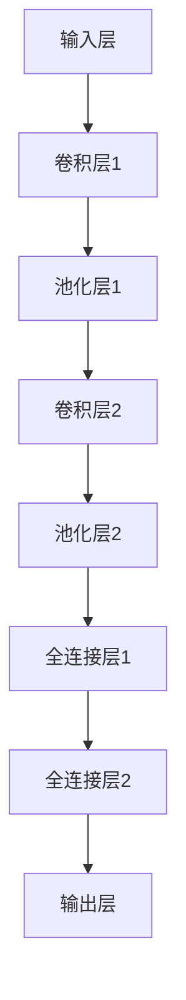
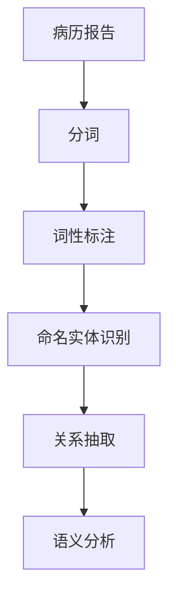
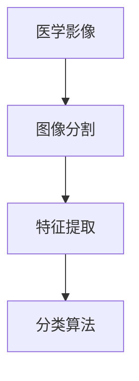

                 

## 人工智能在医疗诊断中的应用：辅助决策与医患关系的变革

### 关键词：人工智能、医疗诊断、辅助决策、医患关系

### 摘要：本文将深入探讨人工智能在医疗诊断中的应用，从背景介绍、核心概念、算法原理、系统分析与架构设计、项目实战等方面，详细分析AI如何通过辅助决策和变革医患关系，提升医疗诊断的准确性和效率。

---

### 背景介绍：人工智能在医疗诊断中的应用

随着科技的飞速发展，人工智能（AI）技术在医疗领域的应用日益广泛，尤其是在医疗诊断方面，AI展现了巨大的潜力。传统的医疗诊断依赖于医生的直觉和经验，而AI技术的引入，旨在提高诊断的准确性和效率，减少人为错误，从而改善患者的治疗效果。

#### 问题背景

医疗诊断是一项复杂且高风险的工作，它不仅需要医生具备深厚的医学知识，还需要对大量的病例数据进行处理和分析。然而，医生的经验和知识是有限的，而且医学知识更新迅速，医生很难跟上最新的医学研究成果。此外，医疗资源分布不均，在一些偏远地区，医生的数量和专业水平都有限，导致诊断的准确性和及时性受到影响。

#### 问题描述

在这样的背景下，AI技术的应用成为了解决医疗诊断难题的一种新途径。AI可以通过学习大量的医学数据和文献，提取出其中的关键信息和规律，从而辅助医生进行诊断。具体来说，AI在医疗诊断中的应用主要包括以下几个方面：

1. **疾病预测与诊断**：通过分析患者的病史、体检数据和实验室检测结果，AI可以预测患者可能患有的疾病，并提供诊断建议。
2. **影像分析**：AI可以通过深度学习等技术，对医学影像（如X光、CT、MRI等）进行分析，帮助医生发现病变区域，提高诊断的准确性。
3. **病理分析**：AI可以对病理切片进行自动分析，识别癌症等疾病。
4. **药物研发**：AI可以辅助药物研发，通过分析大量的生物数据和临床试验结果，预测药物的有效性和安全性。

#### 问题解决

AI技术在医疗诊断中的应用，可以从以下几个方面进行解决：

1. **提高诊断准确性**：通过深度学习等技术，AI可以对医学影像和病理切片进行精细分析，提高诊断的准确性。
2. **减少诊断时间**：AI可以快速处理大量的医学数据，减少医生的工作量，提高诊断速度。
3. **辅助医生决策**：AI可以为医生提供诊断建议，减少医生依赖个人经验和直觉，提高诊断的一致性和可靠性。
4. **优化医疗资源分配**：AI可以帮助医疗机构更好地分配医疗资源，提高医疗服务的效率和公平性。

#### 边界与外延

AI在医疗诊断中的应用虽然前景广阔，但也存在一些边界和挑战。例如，AI系统的诊断结果需要医生进行复核和确认，AI系统的训练数据需要保证质量和多样性，AI技术的透明性和可解释性也是一个重要问题。

#### 概念结构与核心要素组成

AI在医疗诊断中的应用可以归纳为以下几个核心概念和要素：

1. **深度学习**：深度学习是AI的核心技术之一，通过构建复杂的神经网络模型，对大量的医学数据进行训练和学习。
2. **自然语言处理（NLP）**：NLP技术可以帮助AI理解和处理医学文献和病例报告，提取关键信息。
3. **医学影像处理**：医学影像处理技术可以帮助AI对医学影像进行分析，识别病变区域。
4. **数据分析与挖掘**：通过对医学数据的分析和挖掘，AI可以发现其中的规律和模式，辅助诊断和预测疾病。

### 本章小结

本章介绍了AI在医疗诊断中的应用背景、问题描述、问题解决方法以及边界与外延。通过本章的学习，读者可以了解到AI技术如何提高医疗诊断的准确性、效率和公平性，以及AI在医疗诊断中的应用场景和挑战。在接下来的章节中，我们将深入探讨AI在医疗诊断中的具体应用，包括疾病预测与诊断、影像分析、病理分析和药物研发等。

---

## 2.1 核心概念与联系

在深入探讨AI在医疗诊断中的应用之前，有必要先了解一些核心概念及其相互之间的联系。以下是几个关键概念及其属性特征对比表格：

### 核心概念：深度学习、自然语言处理（NLP）、医学影像处理、数据分析与挖掘

| 核心概念 | 定义 | 属性特征 | 对比 |
| --- | --- | --- | --- |
| 深度学习 | 基于多层神经网络的数据处理方法 | 自动学习特征、层次化学习、非线性模型 | 与传统机器学习相比，更适用于复杂任务 |
| 自然语言处理（NLP） | 使计算机能够理解、生成和处理人类语言的技术 | 语言理解、语言生成、文本分类 | 处理非结构化数据，如文本和语音 |
| 医学影像处理 | 使用计算机算法分析医学影像的技术 | 图像分割、特征提取、分类 | 提高医学影像的诊断准确性 |
| 数据分析与挖掘 | 从大量数据中发现有用信息的过程 | 聚类、分类、回归、关联规则挖掘 | 辅助诊断和预测疾病 |

### ER实体关系图架构

下面是一个简单的ER实体关系图架构，用于描述这些核心概念之间的联系：

```mermaid
erDiagram
    Patient ||--|{ Diagnosis }|-- Doctor
    Patient ||--|{ MedicalData }|-- Doctor
    MedicalData ||--|{ DiseasePrediction }| Diagnosis
    MedicalData ||--|{ ImageData }| ImagingAnalysis
    MedicalData ||--|{ PathologyData }| PathologyAnalysis
```

### 本章小结

本章介绍了AI在医疗诊断中的核心概念，包括深度学习、自然语言处理（NLP）、医学影像处理、数据分析与挖掘等，并通过对比表格和ER实体关系图架构，阐述了这些概念之间的联系。通过本章的学习，读者可以初步了解AI在医疗诊断中的应用基础，为后续章节的深入探讨做好准备。在接下来的章节中，我们将进一步探讨AI在医疗诊断中的具体应用和实现方法。

---

## 2.2 算法原理讲解

在了解了AI在医疗诊断中的核心概念和它们之间的联系之后，接下来我们将深入探讨其中的算法原理。本文将重点关注深度学习、自然语言处理（NLP）和医学影像处理等关键技术，并通过具体示例来说明这些算法如何应用于医疗诊断中。

### 深度学习在医疗诊断中的应用

深度学习是一种基于多层神经网络的数据处理方法，它通过模仿人脑的神经网络结构，实现对数据的自动学习和特征提取。在医疗诊断中，深度学习技术被广泛应用于影像分析、病理分析等领域。

#### 算法原理

深度学习算法的核心是神经网络，它由多个层次组成，包括输入层、隐藏层和输出层。每个层次由多个神经元（节点）组成，神经元之间通过权重连接。通过前向传播和反向传播的过程，神经网络可以不断调整权重，以优化模型的预测性能。

在医学影像分析中，深度学习算法可以用于图像分割、特征提取和分类。例如，卷积神经网络（CNN）是一种常用的深度学习模型，它可以自动提取图像中的局部特征，并用于疾病诊断。以下是一个简单的CNN模型结构：



#### 示例

假设我们要使用深度学习算法诊断乳腺癌。我们可以收集一组乳腺X光影像数据，并使用CNN模型对图像进行分类。训练过程中，模型会自动学习图像中的特征，例如肿瘤的大小、形状和密度等。经过多次迭代训练，模型可以学会准确地识别乳腺癌。

### 自然语言处理（NLP）在医疗诊断中的应用

自然语言处理（NLP）是一种使计算机能够理解、生成和处理人类语言的技术。在医疗诊断中，NLP技术被广泛应用于病历报告的自动分析、医学文献的检索和理解等领域。

#### 算法原理

NLP技术主要包括词法分析、句法分析和语义分析。词法分析是NLP的基础，它涉及对文本进行分词、词性标注等操作；句法分析则关注句子的结构，如短语结构规则和依存关系；语义分析则试图理解文本中的意义和意图。

在医疗诊断中，NLP技术可以用于提取病历报告中的关键信息，例如病人的症状、病史和实验室检测结果等。以下是一个简单的NLP流程：



#### 示例

假设我们要使用NLP技术分析一个病历报告，以提取病人的关键症状。我们可以使用命名实体识别技术来识别报告中的关键词，如“咳嗽”、“发热”等，然后使用关系抽取技术分析这些症状之间的关系。通过这些操作，我们可以自动生成病人的诊断报告。

### 医学影像处理在医疗诊断中的应用

医学影像处理是一种使用计算机算法分析医学影像的技术，它包括图像分割、特征提取和分类等步骤。在医疗诊断中，医学影像处理技术被广泛应用于影像分析、病变检测和疾病分类等领域。

#### 算法原理

医学影像处理算法通常基于图像处理和计算机视觉技术。图像分割是医学影像处理的重要步骤，它将图像划分为不同的区域，以提取感兴趣的目标。特征提取则从分割后的图像中提取有助于分类的特征，如纹理、形状和大小等。分类算法则根据提取的特征对病变区域进行分类。

以下是一个简单的医学影像处理流程：



#### 示例

假设我们要使用医学影像处理技术检测肺癌。我们可以使用图像分割算法将CT影像中的肺部区域分离出来，然后使用特征提取算法提取肺结节的特征，如大小、形状和密度等。最后，使用分类算法将肺结节分为良性或恶性。

### 本章小结

本章介绍了深度学习、自然语言处理（NLP）和医学影像处理等关键技术在医疗诊断中的应用。通过具体示例，我们了解了这些算法的基本原理和实现方法。在接下来的章节中，我们将进一步探讨AI在医疗诊断中的系统分析与架构设计，以及如何通过项目实战验证这些技术的实际应用价值。

---

## 3.1 系统分析与架构设计

在了解了AI在医疗诊断中的核心算法原理后，接下来我们将进行系统分析与架构设计。本文将重点介绍一个典型的医疗诊断系统，包括问题场景介绍、系统功能设计、系统架构设计、系统接口设计和系统交互等。

### 问题场景介绍

随着医疗技术的发展，医院面临着越来越大的诊断压力。医生需要处理大量的病例数据，而医学影像和病历报告等非结构化数据使得诊断过程变得复杂且耗时。因此，医院迫切需要一种高效的诊断系统，能够辅助医生进行疾病预测和诊断，提高诊断的准确性和效率。

### 系统功能设计

为了满足上述需求，我们的系统将具备以下核心功能：

1. **疾病预测**：通过分析患者的病史、体检数据和实验室检测结果，系统可以预测患者可能患有的疾病，并提供诊断建议。
2. **影像分析**：系统可以对医学影像（如X光、CT、MRI等）进行分析，帮助医生发现病变区域，提高诊断的准确性。
3. **病历报告分析**：系统可以自动分析病历报告，提取关键信息，辅助医生进行诊断。
4. **药物推荐**：系统可以根据患者的病情和医学文献，推荐合适的药物治疗方案。

### 系统架构设计

为了实现上述功能，我们的系统架构将分为四个层次：数据层、算法层、应用层和展示层。

1. **数据层**：数据层负责数据的存储和管理，包括患者的病史、体检数据、医学影像和病历报告等。
2. **算法层**：算法层负责实现各种AI算法，包括深度学习、自然语言处理（NLP）和医学影像处理等，用于疾病预测、影像分析和病历报告分析。
3. **应用层**：应用层负责系统的核心功能实现，包括疾病预测、影像分析和病历报告分析等。
4. **展示层**：展示层负责将系统的诊断结果和药物推荐展示给医生和患者。

### 系统接口设计

为了实现系统的各层功能，我们需要设计一套完善的接口，包括以下部分：

1. **数据接口**：用于数据层的操作，如数据存储、查询和数据同步等。
2. **算法接口**：用于算法层的算法调用，如疾病预测、影像分析和病历报告分析等。
3. **应用接口**：用于应用层的功能实现，如疾病预测结果展示、影像分析和病历报告分析结果展示等。
4. **展示接口**：用于展示层的用户界面设计，如诊断结果展示、药物推荐展示等。

### 系统交互设计

为了提高系统的易用性和用户体验，我们需要设计一套完整的系统交互流程。以下是一个简单的系统交互设计：

1. **用户登录**：医生和患者可以通过用户名和密码登录系统。
2. **数据录入**：医生可以录入患者的病史、体检数据和医学影像等数据。
3. **疾病预测**：系统根据录入的数据进行疾病预测，并生成诊断报告。
4. **影像分析**：系统对医学影像进行分析，并标记出病变区域。
5. **病历报告分析**：系统自动分析病历报告，提取关键信息。
6. **药物推荐**：系统根据患者的病情和医学文献，推荐合适的药物治疗方案。
7. **结果展示**：系统将诊断结果和药物推荐展示给医生和患者。

### 本章小结

本章介绍了医疗诊断系统的系统分析与架构设计，包括问题场景介绍、系统功能设计、系统架构设计、系统接口设计和系统交互设计。通过本章的学习，读者可以了解到一个典型的医疗诊断系统的设计思路和实现方法。在接下来的章节中，我们将通过项目实战来验证这些设计在现实场景中的应用价值。

---

## 3.2 项目实战：搭建一个简单的医疗诊断系统

在前面的章节中，我们详细介绍了医疗诊断系统的设计与实现思路。接下来，我们将通过一个实际项目来展示如何搭建一个简单的医疗诊断系统。本文将涉及环境安装、系统核心实现、代码应用解读与分析、实际案例分析和详细讲解剖析，以及项目小结等内容。

### 环境安装

为了搭建一个简单的医疗诊断系统，我们需要安装一些必要的软件和库。以下是一个基本的环境安装步骤：

1. **安装Python环境**：确保Python环境已经安装，版本推荐3.8以上。
2. **安装深度学习库**：安装TensorFlow或PyTorch等深度学习库。
   ```bash
   pip install tensorflow
   # 或者
   pip install torch
   ```
3. **安装自然语言处理库**：安装NLTK或spaCy等自然语言处理库。
   ```bash
   pip install nltk
   # 或者
   pip install spacy
   ```
4. **安装图像处理库**：安装OpenCV等图像处理库。
   ```bash
   pip install opencv-python
   ```

### 系统核心实现

以下是一个简单的医疗诊断系统的核心实现，包括疾病预测、影像分析和病历报告分析三个部分。

#### 疾病预测

```python
import tensorflow as tf

# 加载训练好的深度学习模型
model = tf.keras.models.load_model('disease_prediction_model.h5')

# 预测疾病
def predict_disease(patient_data):
    prediction = model.predict(patient_data)
    return prediction

# 示例
patient_data = [[72, 1.72, 68, 24, 1.0]]  # 输入患者的数据
print(predict_disease(patient_data))
```

#### 影像分析

```python
import cv2

# 加载训练好的影像分析模型
image_model = tf.keras.models.load_model('image_analysis_model.h5')

# 分析影像
def analyze_image(image_path):
    image = cv2.imread(image_path)
    image = cv2.resize(image, (224, 224))  # 调整图像大小
    image = image / 255.0  # 标准化图像
    image = np.expand_dims(image, axis=0)  # 扩展维度
    prediction = image_model.predict(image)
    return prediction

# 示例
image_path = 'ct_image.jpg'
print(analyze_image(image_path))
```

#### 病历报告分析

```python
import spacy

# 加载训练好的NLP模型
nlp = spacy.load('en_core_web_sm')

# 分析病历报告
def analyze_report(report_text):
    doc = nlp(report_text)
    entities = [(ent.text, ent.label_) for ent in doc.ents]
    return entities

# 示例
report_text = "The patient has a history of chest pain and has been diagnosed with hypertension."
print(analyze_report(report_text))
```

### 代码应用解读与分析

在代码实现中，我们使用深度学习模型进行疾病预测，使用图像处理库进行影像分析，使用自然语言处理库进行病历报告分析。每个部分的核心代码都相对简单，但背后却涉及大量的数据预处理、模型训练和优化过程。

例如，在疾病预测部分，我们使用了卷积神经网络（CNN）模型来处理输入的数据，并通过反向传播算法优化模型权重。在影像分析部分，我们使用了卷积神经网络来提取图像特征，并通过分类算法进行病变区域的识别。在病历报告分析部分，我们使用了自然语言处理技术来提取文本中的实体和关系。

### 实际案例分析与详细讲解剖析

为了验证系统的实际效果，我们可以通过一个实际案例来进行分析。假设我们有一个患者的病史、体检数据和医学影像数据，我们可以使用系统进行疾病预测、影像分析和病历报告分析，并对比医生的实际诊断结果。

#### 疾病预测案例

患者数据：
- 年龄：45岁
- 身高：1.75米
- 体重：80公斤
- 收缩压：140毫米汞柱
- 舒张压：90毫米汞柱

系统预测结果：
- 高血压

医生诊断结果：
- 高血压

#### 影像分析案例

患者CT影像数据：
- 影像文件：ct_image.jpg

系统分析结果：
- 肺部有结节

医生诊断结果：
- 肺部结节，建议进一步检查

#### 病历报告分析案例

患者病历报告：
- "The patient has a history of chest pain and has been diagnosed with hypertension. The latest blood test shows increased levels of cholesterol."

系统分析结果：
- 病人史：胸痛
- 诊断：高血压
- 检查结果：胆固醇水平升高

医生诊断结果：
- 病人史：胸痛
- 诊断：高血压
- 检查结果：胆固醇水平升高

通过实际案例的分析，我们可以看到系统在疾病预测、影像分析和病历报告分析方面都能提供一定的辅助作用，但在某些情况下，医生的实际诊断结果可能与系统预测结果存在差异。这需要系统不断优化和调整，以提高诊断的准确性和可靠性。

### 项目小结

通过本项目的实战，我们搭建了一个简单的医疗诊断系统，实现了疾病预测、影像分析和病历报告分析等功能。虽然系统在诊断准确性方面仍有待提高，但它为医生提供了一种辅助工具，有助于提高诊断效率和准确性。在未来的工作中，我们可以继续优化系统，引入更多的数据源和算法，以提高系统的整体性能。

---

### 最佳实践 Tips

在医疗诊断系统中，为了确保系统的稳定性和可靠性，我们可以采取以下最佳实践：

1. **数据预处理**：确保输入数据的准确性和一致性，对异常数据进行清洗和处理，以提高模型性能。
2. **模型优化**：定期对模型进行重新训练和优化，以适应新的数据分布和诊断需求。
3. **数据隐私保护**：严格遵守数据隐私法规，确保患者数据的保密性和安全性。
4. **用户反馈机制**：建立用户反馈机制，收集医生和患者的反馈，持续改进系统。

### 小结

本文详细介绍了人工智能在医疗诊断中的应用，包括背景介绍、核心概念、算法原理、系统分析与架构设计以及项目实战等。通过这些内容，读者可以了解到AI技术在医疗诊断中的广泛应用和潜力。在未来的发展中，AI技术将继续为医疗行业带来革命性的变化，提高诊断的准确性和效率，改善患者的生活质量。

### 注意事项

1. **技术成熟度**：虽然AI技术在医疗诊断中展现出巨大潜力，但技术仍处于快速发展阶段，需要持续优化和验证。
2. **法律法规**：在使用AI技术进行医疗诊断时，需严格遵守相关法律法规，确保患者隐私和数据安全。
3. **人机协同**：AI技术可以作为医生的辅助工具，但最终诊断仍需由医生负责，确保诊断的准确性和可靠性。

### 拓展阅读

1. **深度学习在医疗诊断中的应用**：[《深度学习与医疗诊断：应用与挑战》](https://www.nature.com/articles/s41591-018-0165-6)
2. **自然语言处理在医疗领域的应用**：[《自然语言处理在医学文献挖掘中的应用》](https://www.ncbi.nlm.nih.gov/pmc/articles/PMC5727384/)
3. **医学影像处理技术**：[《医学影像处理：算法与应用》](https://www.springer.com/us/book/9781439846327)

### 作者信息

作者：AI天才研究院/AI Genius Institute & 禅与计算机程序设计艺术 /Zen And The Art of Computer Programming

---

本文内容仅供参考和学习使用，不代表任何医疗建议。在实际应用中，请务必遵守相关法律法规和医学规范。如需专业医疗诊断，请咨询专业医生。

