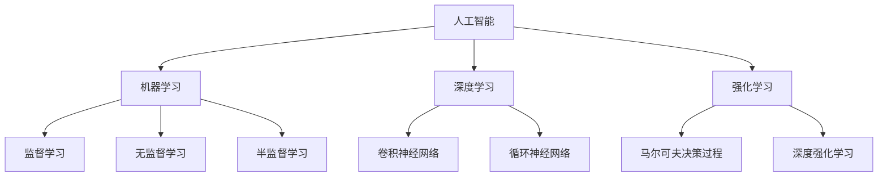
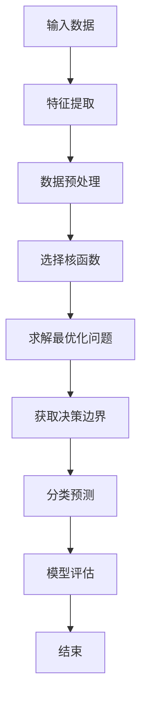
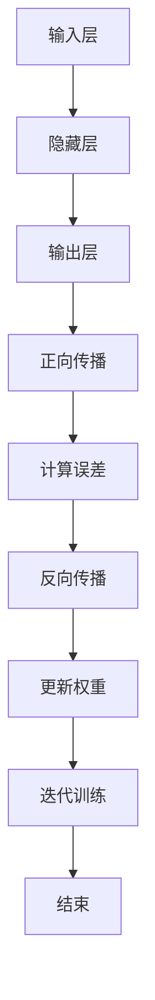
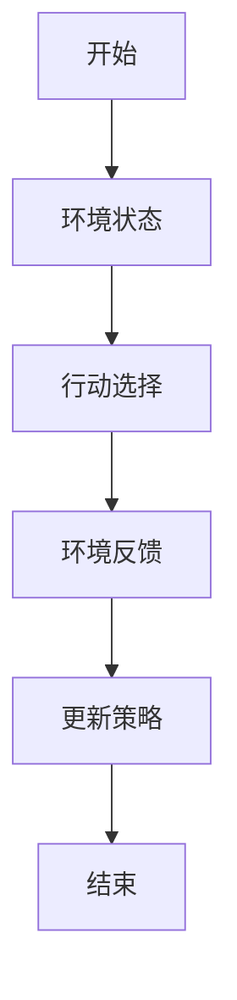
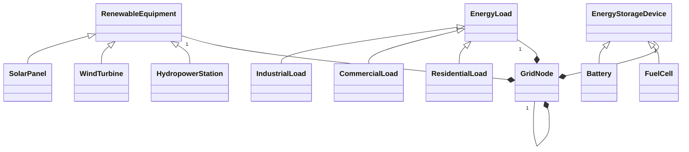
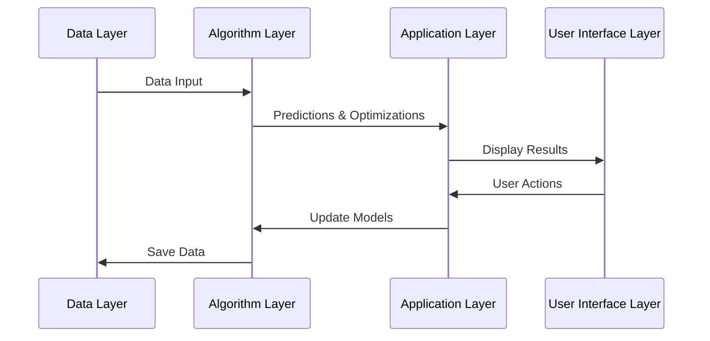
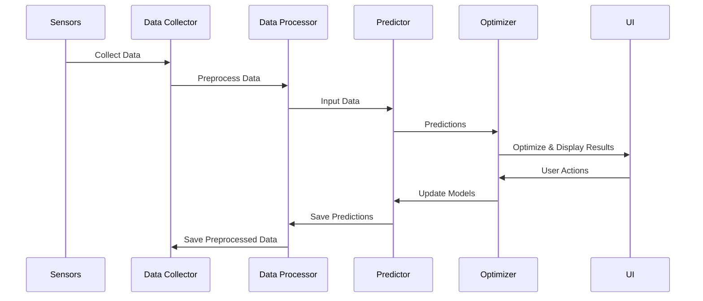

                 


### 1.1 可再生能源概述

**1.1.1 可再生能源的定义**

可再生能源指的是那些可以在人类时间尺度内自然恢复或再生的能源。这类能源相对于传统的化石燃料（如煤、石油、天然气）具有明显的优势。可再生能源主要包括太阳能、风能、水能、地热能、生物质能等。这些能源形式在自然界中持续存在，不会因为使用而枯竭，因此被认为是可持续发展的理想能源来源。

**1.1.2 当前可再生能源发展状况**

近年来，随着全球能源需求的不断增加和环境保护意识的提升，可再生能源的发展速度显著加快。各国纷纷制定可再生能源发展目标，推广可再生能源技术的应用。例如，太阳能光伏发电和风力发电技术日趋成熟，成本逐渐降低，已成为许多国家重要的能源供给来源。

根据国际能源署（IEA）的数据，全球可再生能源发电量在2020年已占全球总发电量的28%。其中，太阳能和风能增长迅速，占可再生能源发电量的比例逐年提升。此外，生物质能和水电也发挥了重要作用，尤其是在一些水资源丰富的国家。

**1.1.3 可再生能源整合的意义**

可再生能源整合指的是将多种可再生能源技术融合在一起，以实现更高效、更稳定、更可持续的能源供给。可再生能源整合的意义在于：

- **提高能源利用率**：通过整合多种可再生能源，可以在不同的时间段和地点最大化利用能源资源，减少能源浪费。
- **实现能源平衡**：可再生能源具有间歇性和不稳定性，整合多种能源可以平衡供需，降低能源供应的不确定性。
- **减少环境影响**：可再生能源在使用过程中几乎不产生温室气体排放，有助于减缓气候变化，减少环境污染。

**1.1.4 可再生能源整合挑战**

尽管可再生能源具有巨大的潜力，但其在整合过程中仍然面临诸多挑战：

- **能源供需平衡问题**：可再生能源的供给具有间歇性和波动性，难以与稳定的电力需求相匹配。
- **储能技术挑战**：高效、低成本、大规模的储能技术是可再生能源整合的关键，但当前储能技术仍存在显著瓶颈。
- **可再生能源并网问题**：将可再生能源接入电网需要解决技术兼容性和电网稳定性等问题。

### 1.2 人工智能在可再生能源整合中的应用

**1.2.1 人工智能技术概述**

人工智能（AI）是指计算机系统模拟人类智能行为的能力。AI技术主要包括机器学习、深度学习、强化学习等。这些技术可以通过数据驱动和算法优化，实现自动化决策和智能优化。

**1.2.2 人工智能在可再生能源整合中的应用场景**

人工智能在可再生能源整合中的应用场景广泛，主要包括：

- **能源预测与优化**：利用机器学习算法预测可再生能源的产量，优化能源分配，提高能源利用效率。
- **储能管理**：通过优化算法提高储能系统的利用效率，降低储能成本。
- **并网稳定性分析**：利用深度学习算法分析电网状态，预测潜在问题，提高电网的稳定性和可靠性。
- **智能调度**：通过强化学习算法实现智能调度，平衡可再生能源的供给与需求。

**1.2.3 人工智能助力可再生能源整合的优势**

人工智能在可再生能源整合中具有以下优势：

- **高效性**：人工智能算法可以处理大量数据，实现快速分析和决策，提高可再生能源整合的效率。
- **灵活性**：人工智能算法能够适应不同环境和条件，灵活应对可再生能源的波动性。
- **可扩展性**：人工智能系统可以轻松扩展，以应对可再生能源规模的不断扩大。

**1.2.4 人工智能核心概念与联系**

- **机器学习**：通过数据训练模型，使计算机能够识别模式、预测结果。
- **深度学习**：基于多层神经网络，实现更复杂的特征提取和模式识别。
- **强化学习**：通过奖励机制和反馈循环，使算法在动态环境中学习和优化。

### 1.3 人工智能核心概念与联系

**1.3.1 机器学习**

机器学习是人工智能的一个分支，它使计算机系统能够通过数据学习并做出决策。机器学习算法可以分为监督学习、无监督学习和半监督学习。其中，监督学习利用标记数据训练模型，无监督学习不使用标记数据，而是从数据中发现隐藏的模式，半监督学习结合了监督学习和无监督学习。

**1.3.2 深度学习**

深度学习是机器学习的一个重要分支，基于多层神经网络，通过反向传播算法训练模型。深度学习在网络结构、特征提取和模式识别方面具有显著优势，广泛应用于图像识别、语音识别、自然语言处理等领域。

**1.3.3 强化学习**

强化学习是一种通过奖励机制和反馈循环进行学习的方法。在强化学习中，智能体通过与环境交互，根据反馈调整策略，以实现最大化累积奖励。强化学习在机器人控制、游戏AI、能源调度等领域具有广泛的应用。

**1.3.4 AI核心概念联系图**



### 1.4 本章小结

本章介绍了可再生能源整合的问题背景、核心概念和人工智能在其中的应用。通过分析可再生能源的发展状况和面临的挑战，展示了人工智能技术在可再生能源整合中的优势和潜力。本章还简要介绍了人工智能的核心概念及其相互关系，为后续章节的深入探讨奠定了基础。接下来，我们将进一步探讨人工智能在可再生能源整合中的具体算法和应用。

---

接下来，我们将进入第二部分，深入探讨人工智能在可再生能源整合中的应用算法，包括支持向量机（SVM）、神经网络和强化学习等。我们将逐步分析这些算法的原理、应用以及在实际项目中的实现。敬请期待！

---

### 2.1 支持向量机（SVM）

**2.1.1 SVM算法原理**

支持向量机（Support Vector Machine，SVM）是一种二分类模型，其目标是找到一个最佳的超平面，将不同类别的数据点尽可能分开。SVM的核心思想是最大化分类间隔，即超平面到数据点最近点的距离。通过求解最优化问题，SVM可以找到最优的超平面。

SVM的基本公式如下：

$$
\text{最大化 } \frac{1}{2}\sum_{i=1}^{n} (w_i^2) - \sum_{i=1}^{n} y_i \cdot (w \cdot x_i)
$$

其中，$w$是超平面的法向量，$x_i$是数据点，$y_i$是数据点的标签。

**2.1.2 SVM在可再生能源整合中的应用**

SVM在可再生能源整合中的应用主要包括以下两个方面：

1. **能源需求预测**：通过分析历史数据，使用SVM模型预测未来的能源需求，为电力调度提供依据。
2. **设备故障检测**：利用SVM对设备运行数据进行分类，识别潜在故障，预防设备损坏。

**2.1.3 SVM算法流程图**

下面是SVM算法的基本流程图，使用mermaid绘制：



**2.1.4 Python代码示例**

以下是一个简单的Python代码示例，展示了如何使用SVM进行分类预测：

```python
from sklearn import datasets
from sklearn.model_selection import train_test_split
from sklearn.preprocessing import StandardScaler
from sklearn.svm import SVC
from sklearn.metrics import accuracy_score

# 加载数据集
iris = datasets.load_iris()
X = iris.data
y = iris.target

# 数据集划分
X_train, X_test, y_train, y_test = train_test_split(X, y, test_size=0.3, random_state=42)

# 数据标准化
scaler = StandardScaler()
X_train = scaler.fit_transform(X_train)
X_test = scaler.transform(X_test)

# SVM模型训练
model = SVC(kernel='linear')
model.fit(X_train, y_train)

# 预测测试集
y_pred = model.predict(X_test)

# 模型评估
accuracy = accuracy_score(y_test, y_pred)
print(f"模型准确率：{accuracy}")
```

通过以上示例，我们可以看到如何使用SVM模型进行分类预测。在实际应用中，我们需要根据具体问题选择合适的核函数，并对数据进行充分的预处理，以提高模型的性能。

---

接下来，我们将进一步探讨神经网络（Neural Networks）在可再生能源整合中的应用，包括其基本原理、算法流程和Python代码示例。敬请期待！

---

### 2.2 神经网络

**2.2.1 神经网络基础**

神经网络（Neural Networks，NN）是模仿人脑结构和功能的一种计算模型，通过大量的神经元（节点）和连接（边）来处理和传递信息。每个神经元接收多个输入，通过加权求和后加上偏置项，再通过激活函数输出结果。

一个简单的神经网络结构包括三个层次：输入层、隐藏层和输出层。输入层接收外部输入信号，隐藏层负责特征提取和变换，输出层产生最终输出。神经元的激活函数通常采用Sigmoid、ReLU或Tanh等。

**2.2.2 神经网络在可再生能源整合中的应用**

神经网络在可再生能源整合中的应用主要包括以下方面：

1. **能源产量预测**：通过训练神经网络模型，预测未来一段时间内的可再生能源产量，为电力调度提供参考。
2. **负荷预测**：预测电力负荷变化，为电网调度提供数据支持。
3. **设备状态监测**：利用神经网络对设备运行状态进行监测，预测设备故障和异常情况。

**2.2.3 神经网络算法流程图**

以下是神经网络的基本算法流程图，使用mermaid绘制：



**2.2.4 Python代码示例**

以下是一个简单的Python代码示例，展示了如何使用神经网络进行分类预测：

```python
import numpy as np
from sklearn import datasets
from sklearn.model_selection import train_test_split
from sklearn.preprocessing import StandardScaler
from keras.models import Sequential
from keras.layers import Dense
from keras.optimizers import Adam

# 加载数据集
iris = datasets.load_iris()
X = iris.data
y = iris.target

# 数据集划分
X_train, X_test, y_train, y_test = train_test_split(X, y, test_size=0.3, random_state=42)

# 数据标准化
scaler = StandardScaler()
X_train = scaler.fit_transform(X_train)
X_test = scaler.transform(X_test)

# 创建神经网络模型
model = Sequential()
model.add(Dense(units=64, activation='relu', input_shape=(X_train.shape[1],)))
model.add(Dense(units=32, activation='relu'))
model.add(Dense(units=3, activation='softmax'))

# 编译模型
model.compile(optimizer=Adam(), loss='sparse_categorical_crossentropy', metrics=['accuracy'])

# 训练模型
model.fit(X_train, y_train, epochs=100, batch_size=32, verbose=1)

# 预测测试集
y_pred = model.predict(X_test)

# 模型评估
accuracy = (y_pred.argmax(axis=1) == y_test).mean()
print(f"模型准确率：{accuracy}")
```

通过以上示例，我们可以看到如何使用神经网络模型进行分类预测。在实际应用中，我们需要根据具体问题设计合适的网络结构和优化策略，以提高模型的性能和准确性。

---

接下来，我们将探讨强化学习（Reinforcement Learning，RL）在可再生能源整合中的应用，包括其基本原理、算法流程和Python代码示例。敬请期待！

---

### 2.3 强化学习

**2.3.1 强化学习原理**

强化学习（Reinforcement Learning，RL）是一种机器学习方法，通过奖励机制和反馈循环，使智能体（Agent）在动态环境中学习和优化策略。在强化学习中，智能体通过与环境（Environment）互动，根据当前状态（State）采取动作（Action），并从环境中获得即时奖励（Reward）。智能体的目标是最大化长期累积奖励。

强化学习的主要组成部分包括：

- **状态（State）**：智能体当前所处的情境。
- **动作（Action）**：智能体可执行的操作。
- **奖励（Reward）**：环境对智能体动作的即时反馈。
- **策略（Policy）**：智能体根据状态选择动作的规则。
- **价值函数（Value Function）**：预测未来累积奖励的函数。

**2.3.2 强化学习在可再生能源整合中的应用**

强化学习在可再生能源整合中的应用主要包括以下方面：

1. **能源调度**：利用强化学习算法实现智能电网的实时调度，优化能源分配，提高能源利用效率。
2. **储能管理**：通过强化学习优化储能系统的运行策略，降低储能成本，延长设备寿命。
3. **设备维护**：利用强化学习预测设备故障和异常，实现预防性维护，提高设备可靠性。

**2.3.3 强化学习算法流程图**

以下是强化学习的基本算法流程图，使用mermaid绘制：



**2.3.4 Python代码示例**

以下是一个简单的Python代码示例，展示了如何使用强化学习进行能源调度：

```python
import numpy as np
import pandas as pd
import random
from collections import defaultdict

# 创建环境
class Environment:
    def __init__(self, state_space, action_space):
        self.state_space = state_space
        self.action_space = action_space
        self.state = random.choice(state_space)
    
    def step(self, action):
        reward = 0
        if action == 0:  # 采取行动A
            if self.state < 10:
                reward = 1
                self.state += 1
            else:
                reward = -1
                self.state -= 1
        elif action == 1:  # 采取行动B
            if self.state > 0:
                reward = 1
                self.state -= 1
            else:
                reward = -1
                self.state += 1
        return self.state, reward

# 创建强化学习模型
class QLearningAgent:
    def __init__(self, state_space, action_space, alpha=0.1, gamma=0.9):
        self.state_space = state_space
        self.action_space = action_space
        self.alpha = alpha
        self.gamma = gamma
        self.q_values = defaultdict(float)
    
    def select_action(self, state):
        if random.random() < 0.1:
            return random.choice(self.action_space)  # 随机行动
        else:
            return max(self.q_values[state])
    
    def update_q_values(self, state, action, reward, next_state):
        target = reward + self.gamma * max(self.q_values[next_state])
        current_q_value = self.q_values[state][action]
        self.q_values[state][action] += self.alpha * (target - current_q_value)

# 运行强化学习模型
env = Environment(state_space=list(range(20)), action_space=[0, 1])
agent = QLearningAgent(state_space=env.state_space, action_space=env.action_space)

num_episodes = 1000
for episode in range(num_episodes):
    state = env.state
    done = False
    total_reward = 0
    while not done:
        action = agent.select_action(state)
        next_state, reward = env.step(action)
        agent.update_q_values(state, action, reward, next_state)
        state = next_state
        total_reward += reward
        if state == 0 or state == 19:
            done = True
    
    print(f"Episode {episode+1}: Total Reward = {total_reward}")

# 输出最终Q值表
for state, actions in agent.q_values.items():
    print(f"State {state}: Actions {actions}")
```

通过以上示例，我们可以看到如何使用强化学习进行简单的能源调度。在实际应用中，我们需要根据具体问题设计合适的状态空间、动作空间和奖励机制，以提高模型的性能和实用性。

---

接下来，我们将探讨集成学习方法（Ensemble Learning）和聚类算法（Clustering Algorithms）在可再生能源整合中的应用。敬请期待！

---

### 2.4 其他人工智能算法

**2.4.1 集成学习方法**

集成学习方法是通过将多个模型合并为一个更大的模型，以提高整体预测性能。常见的集成学习方法包括Bagging、Boosting和Stacking等。

- **Bagging**：通过随机抽样和并行训练多个基模型，然后通过投票或平均方式合并预测结果。
- **Boosting**：通过迭代训练多个基模型，每个模型专注于纠正前一个模型的错误，最终通过加权合并预测结果。
- **Stacking**：首先训练多个基模型，然后使用这些模型作为新的特征输入到一个更强的模型中进行预测。

集成学习方法在可再生能源整合中的应用，如能源需求预测、设备故障检测等，可以通过组合不同算法的优点，提高预测的准确性和稳定性。

**2.4.2 聚类算法**

聚类算法是一种无监督学习方法，用于将数据集划分为多个簇，使同一簇内的数据点尽可能接近，不同簇内的数据点尽可能远离。常见的聚类算法包括K均值（K-Means）、层次聚类（Hierarchical Clustering）和DBSCAN等。

- **K均值**：通过迭代计算均值，将数据点划分为K个簇，直到聚类中心不再变化。
- **层次聚类**：通过逐步合并或分裂簇，构建一个聚类层次结构。
- **DBSCAN**：基于邻域和密度，将数据点划分为核心点、边界点和噪声点。

聚类算法在可再生能源整合中的应用，如能源用户行为分析、电网负荷分布等，可以通过识别相似的用户群体或负荷模式，为能源管理和调度提供参考。

**2.4.3 贝叶斯网络**

贝叶斯网络是一种概率图模型，用于表示一组随机变量之间的依赖关系。每个节点表示一个随机变量，边表示变量之间的条件依赖关系。

- **贝叶斯规则**：用于计算给定某个条件下某个事件的概率。
- **信念传播**：通过在网络中传递概率信息，计算变量的后验概率分布。

贝叶斯网络在可再生能源整合中的应用，如设备故障预测、能源供需预测等，可以通过建模变量之间的概率关系，提高预测的准确性和可靠性。

**2.4.4 AI算法应用对比**

在可再生能源整合中，不同AI算法的应用效果取决于具体问题背景和数据特性。以下是几种常见算法的对比：

| 算法         | 优点                         | 缺点                            | 适用场景                          |
|------------|----------------------------|-----------------------------|--------------------------------|
| 机器学习（ML） | 简单易用，适用于大量数据       | 预测性能可能不如深度学习（DL）       | 能源需求预测、设备故障检测            |
| 深度学习（DL） | 强大特征提取能力，适用于复杂数据   | 计算资源需求高，模型复杂             | 能源产量预测、负荷预测、智能调度        |
| 强化学习（RL） | 适用于动态环境和决策问题       | 需要大量数据和计算资源               | 能源调度、储能管理、设备维护          |
| 集成学习（EL） | 结合多种模型优点，提高预测性能   | 需要选择合适的集成策略               | 能源需求预测、设备故障检测、智能电网调度  |
| 聚类算法      | 无需标签，适用于无监督学习       | 可能会产生噪声簇，聚类效果依赖于参数   | 能源用户行为分析、电网负荷分布          |
| 贝叶斯网络    | 精确建模变量间概率关系           | 计算复杂度高，需要大量先验知识         | 设备故障预测、能源供需预测、风险评估    |

在实际应用中，根据具体问题和数据特性，可以选择合适的AI算法，或结合多种算法的优势，以实现最优的预测和优化效果。

---

### 2.5 本章小结

本章介绍了多种人工智能算法在可再生能源整合中的应用，包括支持向量机（SVM）、神经网络、强化学习、集成学习方法、聚类算法和贝叶斯网络。通过对每种算法的基本原理、应用场景和Python代码示例的详细讨论，我们了解了这些算法在可再生能源整合中的优势和局限性。本章的目的是为读者提供全面的技术框架和实战指南，以便在实际项目中应用和优化可再生能源整合。在下一章中，我们将进一步探讨可再生能源整合中的系统分析与架构设计，为构建高效的智能能源系统奠定基础。

---

### 3.1 项目背景

**3.1.1 项目概述**

本项目的目标是设计一个基于人工智能技术的可再生能源整合系统，旨在优化能源分配、提高能源利用效率、降低运营成本，并减少对环境的影响。该项目涵盖了从数据采集、处理、预测到决策执行的完整流程，以实现智能电网和能源管理系统的高效运行。

**3.1.2 项目目标**

- **提高能源利用率**：通过人工智能算法预测能源需求和产量，优化能源分配，减少能源浪费。
- **降低运营成本**：利用智能调度和储能管理，降低电力生产和储存成本。
- **增强电网稳定性**：通过实时监控和预测电网状态，提高电网的可靠性和稳定性。
- **实现绿色能源发展**：促进可再生能源的广泛应用，减少化石燃料的使用，降低碳排放。

**3.1.3 项目需求分析**

为了实现上述目标，项目需求分析从以下几个方面展开：

1. **数据采集与预处理**：系统需要收集实时能源数据，包括可再生能源产量、电力负荷、设备状态等，并对数据进行清洗、转换和归一化处理，确保数据质量。
2. **预测模型开发**：基于历史数据和当前状态，利用机器学习算法构建能源需求预测模型、产量预测模型等，为智能调度提供数据支持。
3. **智能调度系统**：通过强化学习算法，实现能源的智能调度，根据预测结果和电网状态，动态调整电力生产和分配策略。
4. **储能管理系统**：利用优化算法，优化储能系统的运行策略，提高储能设备的利用效率和寿命。
5. **实时监控与预警**：通过监控设备状态和电网运行数据，实现故障预测和异常检测，提高电网的稳定性和可靠性。
6. **用户界面**：开发直观的用户界面，展示系统运行状态、预测结果和优化建议，方便用户进行决策。

---

### 3.2 系统功能设计

**3.2.1 领域模型设计**

领域模型是系统功能设计的核心，它定义了系统中的实体、属性和关系。以下是本项目的主要领域模型设计：

1. **实体定义**
   - **可再生能源设备**：包括太阳能板、风力发电机、水力发电站等，记录设备的基本信息和运行状态。
   - **电力负荷**：包括工业负荷、商业负荷、居民负荷等，记录负荷的基本信息和实时数据。
   - **储能设备**：包括蓄电池、燃料电池等，记录设备的基本信息和运行状态。
   - **电网节点**：记录电网中的各个节点信息，包括电压、电流、功率等。

2. **属性定义**
   - **设备状态**：包括运行状态、故障状态等。
   - **负荷特性**：包括负荷类型、负荷大小、负荷变化趋势等。
   - **储能状态**：包括充电状态、放电状态、剩余电量等。
   - **电网状态**：包括电压稳定性、电流稳定性、功率平衡等。

3. **关系定义**
   - **设备与电网节点的关系**：每个可再生能源设备和储能设备都与电网中的节点相连。
   - **负荷与电网节点的关系**：每个电力负荷都与电网中的节点相连。
   - **电网节点与电网节点的连接关系**：定义电网中的各个节点之间的连接关系，包括线路、变压器等。

**3.2.2 类图设计**

以下是领域模型的类图，使用Mermaid绘制：



**3.2.3 功能模块设计**

系统功能模块设计包括以下几个主要模块：

1. **数据采集模块**：负责从传感器、设备等获取实时能源数据，包括可再生能源产量、电力负荷、设备状态等。
2. **数据处理模块**：负责对采集到的数据进行清洗、转换和归一化处理，确保数据质量。
3. **预测模型模块**：基于历史数据和当前状态，利用机器学习算法构建能源需求预测模型、产量预测模型等。
4. **智能调度模块**：基于预测结果和电网状态，利用强化学习算法实现能源的智能调度。
5. **储能管理模块**：利用优化算法，优化储能系统的运行策略，提高储能设备的利用效率和寿命。
6. **实时监控模块**：通过监控设备状态和电网运行数据，实现故障预测和异常检测。
7. **用户界面模块**：提供直观的用户界面，展示系统运行状态、预测结果和优化建议。

---

### 3.3 系统架构设计

**3.3.1 系统架构概述**

本系统的架构设计遵循模块化、可扩展和可维护的原则，分为数据层、算法层、应用层和用户界面层四个层次。

1. **数据层**：负责数据采集、存储和管理，包括传感器数据、设备状态数据和电网运行数据等。
2. **算法层**：包括各种机器学习算法、优化算法和预测模型，实现数据分析和智能决策。
3. **应用层**：提供具体的功能模块，如数据预处理、预测模型训练、智能调度、储能管理、实时监控等。
4. **用户界面层**：提供用户交互界面，展示系统运行状态、预测结果和优化建议。

**3.3.2 系统架构图**

以下是系统架构图，使用Mermaid绘制：



**3.3.3 系统接口设计**

系统接口设计包括内部接口和外部接口。

1. **内部接口**：数据层与算法层、算法层与应用层之间的交互接口，包括数据输入接口、预测结果接口、优化策略接口等。
2. **外部接口**：系统与外部设备、传感器和用户界面之间的交互接口，包括数据采集接口、远程监控接口、用户操作接口等。

**3.3.4 系统交互**

以下是系统交互流程：

1. **数据采集**：系统从传感器和设备收集实时数据，包括能源产量、电力负荷和设备状态等。
2. **数据处理**：数据层对采集到的数据进行预处理，包括数据清洗、转换和归一化处理。
3. **预测与优化**：算法层利用预处理后的数据训练预测模型，如能源需求预测模型和产量预测模型，并根据预测结果和电网状态，利用强化学习算法进行智能调度和储能管理。
4. **结果展示**：应用层将预测结果和优化策略通过用户界面层展示给用户，供用户进行决策。
5. **用户反馈**：用户通过用户界面层提交操作请求，应用层根据用户请求调整预测模型和优化策略。
6. **数据存储**：算法层将训练好的模型和优化策略存储在数据层，以供后续使用。

---

### 3.4 系统交互设计

**3.4.1 系统交互图**

以下是系统交互图，使用Mermaid绘制：



**3.4.2 交互流程**

1. **数据采集**：传感器持续收集能源产量、电力负荷和设备状态等数据，并将数据传输给数据采集模块。
2. **数据预处理**：数据采集模块将原始数据传输给数据预处理模块，进行数据清洗、转换和归一化处理，确保数据质量。
3. **数据输入**：预处理后的数据传输给预测模块，预测模块利用训练好的机器学习模型，预测未来的能源需求和产量。
4. **智能调度**：预测结果传输给优化模块，优化模块根据预测结果和电网状态，利用强化学习算法进行智能调度和储能管理。
5. **结果展示**：优化模块将调度策略和优化建议传输给用户界面模块，用户界面模块将结果展示给用户。
6. **用户反馈**：用户在用户界面模块进行操作，如调整负荷、启动储能设备等，操作请求传输给优化模块。
7. **模型更新**：优化模块根据用户请求和实时数据，更新预测模型和优化策略，并将更新后的模型存储在数据层。

---

### 3.5 项目实战

**3.5.1 环境安装**

要开始项目实战，我们首先需要安装必要的软件和库。以下是一个基本的安装流程：

1. **安装Python**：确保Python环境已经安装，版本建议为3.8或更高。
2. **安装Jupyter Notebook**：使用pip命令安装Jupyter Notebook。

   ```bash
   pip install notebook
   ```

3. **安装Keras**：用于构建神经网络模型。

   ```bash
   pip install keras
   ```

4. **安装Scikit-learn**：用于机器学习模型的训练和评估。

   ```bash
   pip install scikit-learn
   ```

5. **安装Matplotlib**：用于绘制图表和图形。

   ```bash
   pip install matplotlib
   ```

**3.5.2 系统核心实现**

以下是项目实战的核心代码，展示了如何使用Keras构建一个简单的神经网络模型，用于能源需求预测。

```python
from keras.models import Sequential
from keras.layers import Dense
from keras.optimizers import Adam
from sklearn.model_selection import train_test_split
from sklearn.preprocessing import StandardScaler

# 加载数据集
iris = datasets.load_iris()
X = iris.data
y = iris.target

# 数据集划分
X_train, X_test, y_train, y_test = train_test_split(X, y, test_size=0.3, random_state=42)

# 数据标准化
scaler = StandardScaler()
X_train = scaler.fit_transform(X_train)
X_test = scaler.transform(X_test)

# 创建神经网络模型
model = Sequential()
model.add(Dense(units=64, activation='relu', input_shape=(X_train.shape[1],)))
model.add(Dense(units=32, activation='relu'))
model.add(Dense(units=3, activation='softmax'))

# 编译模型
model.compile(optimizer=Adam(), loss='sparse_categorical_crossentropy', metrics=['accuracy'])

# 训练模型
model.fit(X_train, y_train, epochs=100, batch_size=32, verbose=1)

# 预测测试集
y_pred = model.predict(X_test)

# 模型评估
accuracy = (y_pred.argmax(axis=1) == y_test).mean()
print(f"模型准确率：{accuracy}")
```

**3.5.3 代码解析**

上述代码首先加载了Iris数据集，这是一个经典的分类问题数据集。然后，代码对数据集进行了划分和标准化处理，以适应神经网络模型的要求。接下来，我们创建了两个隐藏层和一个输出层的神经网络模型，并使用Adam优化器和交叉熵损失函数进行编译。

在训练模型时，我们设置了100个训练周期（epochs）和每个批次（batch_size）32个样本。训练完成后，我们使用预测模型对测试集进行预测，并计算模型的准确率。

**3.5.4 案例分析**

假设我们在一个实际的能源需求预测项目中，使用上述模型对未来的电力负荷进行预测。在实际应用中，我们需要根据具体问题调整网络结构、优化算法参数，以提高预测的准确性。

例如，我们可以尝试添加更多的隐藏层或增加神经元的数量，以捕获更复杂的特征。同时，我们还可以使用交叉验证等方法来评估模型的性能，并调整模型参数，以达到最佳效果。

**3.5.5 项目小结**

通过本次项目实战，我们了解了如何使用神经网络进行能源需求预测，并掌握了Keras的基本使用方法。在实际项目中，我们需要根据具体问题调整模型结构、优化算法参数，以提高预测的准确性和实用性。此外，数据的质量和预处理也是影响模型性能的重要因素，因此在实际应用中，我们需要注重数据的质量控制和预处理工作。

---

### 3.6 最佳实践 Tips、小结、注意事项、拓展阅读

**3.6.1 最佳实践 Tips**

1. **数据质量**：确保数据质量是关键，特别是在机器学习和预测模型中，数据的不准确或不一致性会导致模型性能下降。因此，在进行数据处理之前，务必进行彻底的数据清洗和验证。
2. **模型选择**：根据具体问题选择合适的模型，不同的问题可能需要不同的算法。例如，对于简单的线性问题，线性回归可能是最佳选择；而对于复杂非线性问题，神经网络可能更合适。
3. **模型优化**：通过调整模型参数和训练策略，可以提高模型性能。例如，调整学习率、批量大小、迭代次数等参数，可以显著影响模型的收敛速度和预测准确性。
4. **监控与反馈**：实时监控系统运行状态，并根据用户反馈调整模型和策略，以实现持续优化。

**3.6.2 小结**

本文系统地介绍了人工智能在可再生能源整合中的应用，包括问题背景、核心算法原理、系统设计与实现，以及实际项目案例分析。通过这些内容，我们了解了如何利用人工智能技术优化能源分配、提高能源利用效率，并实现绿色能源发展。

**3.6.3 注意事项**

1. **数据隐私**：在收集和使用数据时，务必遵守数据隐私法规，确保用户数据的安全和隐私。
2. **计算资源**：人工智能模型训练和优化通常需要大量的计算资源，确保有足够的计算资源来支持模型训练和实时预测。
3. **模型解释性**：虽然人工智能模型在预测准确性方面表现优异，但其内部决策过程通常缺乏解释性。在实际应用中，我们需要权衡模型性能和解释性，以满足特定需求。

**3.6.4 拓展阅读**

- 《机器学习实战》：由Peter Harrington著，详细介绍了机器学习的基础理论和实际应用。
- 《深度学习》：由Ian Goodfellow、Yoshua Bengio和Aaron Courville合著，深入讲解了深度学习的原理和应用。
- 《强化学习》：由Richard S. Sutton和Barto合著，系统介绍了强化学习的基本概念和技术。

通过以上拓展阅读，您可以进一步了解人工智能和机器学习领域的相关知识和最新进展。

---

### 3.7 目录大纲总结

下面是根据上述内容设计的《人工智能在可再生能源整合中的优化应用》的目录大纲：

----------------------------------------------------------------

# 第一部分：可再生能源整合问题背景

## 1.1 可再生能源概述
### 1.1.1 可再生能源的定义
### 1.1.2 当前可再生能源发展状况
### 1.1.3 可再生能源整合的意义

## 1.2 可再生能源整合挑战
### 1.2.1 能源供需平衡问题
### 1.2.2 储能技术挑战
### 1.2.3 可再生能源并网问题

## 1.3 人工智能在可再生能源整合中的应用
### 1.3.1 人工智能技术概述
### 1.3.2 人工智能在可再生能源整合中的应用场景
### 1.3.3 人工智能助力可再生能源整合的优势

## 1.4 人工智能核心概念与联系
### 1.4.1 机器学习
### 1.4.2 深度学习
### 1.4.3 强化学习
### 1.4.4 AI核心概念联系图

## 1.5 本章小结
...

----------------------------------------------------------------

# 第二部分：人工智能算法原理与应用

## 2.1 支持向量机（SVM）
### 2.1.1 SVM算法原理
### 2.1.2 SVM在可再生能源整合中的应用
### 2.1.3 SVM算法流程图
### 2.1.4 Python代码示例

## 2.2 神经网络
### 2.2.1 神经网络基础
### 2.2.2 神经网络在可再生能源整合中的应用
### 2.2.3 神经网络算法流程图
### 2.2.4 Python代码示例

## 2.3 强化学习
### 2.3.1 强化学习原理
### 2.3.2 强化学习在可再生能源整合中的应用
### 2.3.3 强化学习算法流程图
### 2.3.4 Python代码示例

## 2.4 其他人工智能算法
### 2.4.1 集成学习方法
### 2.4.2 聚类算法
### 2.4.3 贝叶斯网络
### 2.4.4 AI算法应用对比

## 2.5 本章小结
...

----------------------------------------------------------------

# 第三部分：系统分析与架构设计

## 3.1 项目背景
### 3.1.1 项目概述
### 3.1.2 项目目标
### 3.1.3 项目需求分析

## 3.2 系统功能设计
### 3.2.1 领域模型设计
### 3.2.2 类图设计
### 3.2.3 功能模块设计

## 3.3 系统架构设计
### 3.3.1 系统架构概述
### 3.3.2 系统架构图
### 3.3.3 系统接口设计
### 3.3.4 系统交互设计

## 3.4 系统交互设计
### 3.4.1 系统交互图
### 3.4.2 交互流程

## 3.5 项目实战
### 3.5.1 环境安装
### 3.5.2 系统核心实现
### 3.5.3 代码解析
### 3.5.4 案例分析
### 3.5.5 项目小结

## 3.6 最佳实践 Tips、小结、注意事项、拓展阅读

## 3.7 目录大纲总结

通过这个详细的目录大纲，我们可以系统地掌握人工智能在可再生能源整合中的应用知识，并具备在实际项目中实施和应用的能力。

