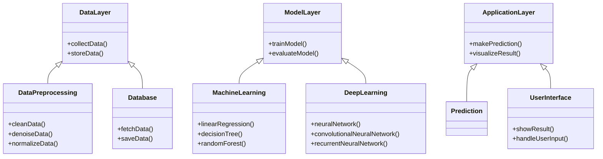
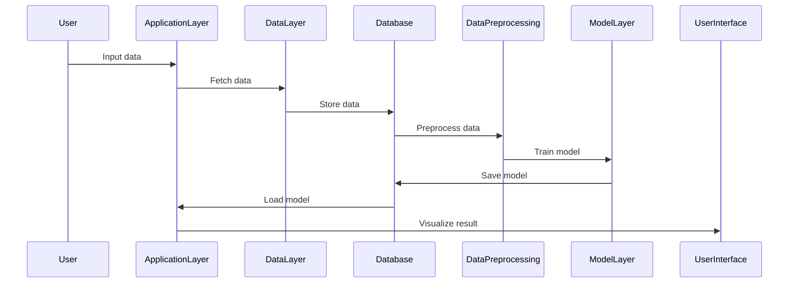

                 

### 《人工智能在可再生能源预测中的精准应用》

> **关键词**：可再生能源、预测模型、人工智能、深度学习、机器学习、预测精度

> **摘要**：本文深入探讨了人工智能技术在可再生能源预测中的应用，从背景介绍、核心概念、算法原理、系统设计与实现、实战项目等方面，详细阐述了如何利用人工智能技术提高可再生能源预测的精准度。通过本文，读者可以全面了解可再生能源预测的现状及未来发展方向。

----------------------------------------------------------------

## 引言

### 可再生能源的重要性

可再生能源，如太阳能、风能、水能等，因其清洁、可再生的特点，成为全球能源转型的重要方向。随着全球气候变化问题的日益严重，可再生能源的重要性愈加凸显。准确预测可再生能源的产出，对于优化能源结构、提高能源利用效率具有重要意义。

### 可再生能源预测的挑战

可再生能源的预测面临诸多挑战，如数据噪声、季节性变化、突变事件等。传统预测方法，如时间序列分析、统计模型等，难以应对这些挑战，导致预测精度有限。

### 人工智能在可再生能源预测中的应用

人工智能技术，特别是机器学习和深度学习，为可再生能源预测提供了新的解决方案。通过学习大量历史数据，人工智能模型能够发现数据中的隐藏规律，从而提高预测精度。

----------------------------------------------------------------

## 背景介绍

### 核心概念术语说明

- **可再生能源**：指太阳能、风能、水能、生物质能等可以持续利用、不会耗尽的能源。
- **预测模型**：用于预测未来值的数学模型，如时间序列模型、回归模型等。
- **人工智能**：模拟人类智能的计算机系统，能够进行学习、推理、解决问题等。

### 问题背景

全球能源需求不断增长，传统能源资源日益紧张。可再生能源作为一种清洁、可再生的能源形式，成为解决能源问题的关键。然而，可再生能源的产出具有不确定性，准确预测其产出对于能源规划、调度具有重要意义。

### 问题描述

可再生能源预测面临的主要问题是预测精度有限，难以应对数据噪声、季节性变化和突变事件等挑战。现有方法难以满足可再生能源高效利用的需求。

### 问题解决

引入人工智能技术，特别是机器学习和深度学习，通过学习历史数据，发现数据中的隐藏规律，从而提高预测精度。本文将详细介绍如何利用人工智能技术进行可再生能源预测。

### 边界与外延

本文主要关注可再生能源（如太阳能、风能、水能）的短期预测。中长期预测和跨国界能源流动预测将不在本文讨论范围。

### 概念结构与核心要素组成

可再生能源预测的核心概念包括可再生能源类型、预测模型类型、人工智能算法等。核心要素组成包括数据采集、数据预处理、模型训练、模型评估等。

----------------------------------------------------------------

## 核心概念与联系

### 可再生能源的基本原理

可再生能源主要利用自然界的能量转换过程，如太阳能通过光伏板转换为电能，风能通过风力涡轮机转换为机械能，水能通过水轮机转换为电能等。这些能源形式具有清洁、可再生、分布广泛等特点。

### 预测模型的类型

预测模型主要分为时间序列模型和回归模型。时间序列模型用于分析时间序列数据的规律，如ARIMA模型、SARIMA模型等。回归模型用于分析自变量和因变量之间的关系，如线性回归、多项式回归等。

### 人工智能的基本原理

人工智能是通过模拟人类智能的计算机系统，能够进行学习、推理、解决问题等。机器学习是人工智能的一种方法，通过学习大量数据，自动构建预测模型。深度学习是机器学习的一种，通过多层神经网络结构，自动提取数据中的特征。

### 核心概念的关系与交互

可再生能源预测中，可再生能源类型决定了预测模型的类型。例如，太阳能预测可以使用时间序列模型，而风能预测可以使用回归模型。人工智能算法用于训练预测模型，提高预测精度。预测模型输出结果用于能源规划和调度。

### 概念属性特征对比表格

| 特征             | 可再生能源 | 预测模型 | 人工智能 |
|----------------|-------------|------------|-------------|
| 能源形式         | 清洁、可再生 | 时间序列、回归 | 学习、推理、解决问题 |
| 数据依赖性       | 强          | 强          | 强          |
| 预测精度要求     | 高          | 中等       | 高          |
| 模型复杂度       | 低          | 中等       | 高          |
| 可解释性         | 低          | 中等       | 低          |

### ER实体关系图架构

```mermaid
erDiagram
  RenewableEnergy |<--| PredictionModel : uses
  RenewableEnergy |<--| ArtificialIntelligence : uses
  PredictionModel |<--| ArtificialIntelligence : trainedBy
```

在这张ER图中，可再生能源、预测模型和人工智能之间存在着复杂的关联关系。可再生能源使用预测模型和人工智能技术进行预测，预测模型由人工智能技术训练，从而提高预测精度。

----------------------------------------------------------------

## 算法原理讲解

### 常用机器学习模型

#### 线性回归模型

线性回归模型是一种简单的预测模型，通过建立因变量和自变量之间的线性关系，预测未来的值。其数学模型如下：

$$y = \beta_0 + \beta_1 \cdot x + \epsilon$$

其中，$y$ 为因变量，$x$ 为自变量，$\beta_0$ 和 $\beta_1$ 分别为模型的参数，$\epsilon$ 为误差项。

#### 决策树模型

决策树模型通过一系列的判断条件，将数据集划分成不同的子集，从而构建出一个树状结构。每个节点代表一个特征，每个分支代表一个特征取值，叶子节点代表预测结果。其基本原理如下：

1. 选择一个特征，将数据集划分为两个子集；
2. 计算每个子集的均方误差，选择均方误差最小的子集作为当前节点；
3. 重复步骤1和2，直到满足停止条件（如最大深度、最小叶子节点数量等）。

#### 集成模型

集成模型通过组合多个基本模型，提高预测精度和泛化能力。常见的集成模型包括随机森林、梯度提升树等。以随机森林为例，其基本原理如下：

1. 从训练集中随机抽取一部分样本和特征，构建多个基本决策树；
2. 对于每个样本，计算多个决策树的预测结果，取平均值作为最终预测结果。

#### 支持向量机模型

支持向量机模型通过找到一个最佳的超平面，将不同类别的数据点分隔开。其数学模型如下：

$$w \cdot x + b = 0$$

其中，$w$ 为超平面的法向量，$x$ 为数据点，$b$ 为偏置项。

### 深度学习模型

#### 神经网络模型

神经网络模型通过多层神经元之间的连接，模拟人类大脑的信息处理过程。其基本结构如下：

1. 输入层：接收输入数据；
2. 隐藏层：通过激活函数将输入数据转化为新的特征；
3. 输出层：生成预测结果。

#### 卷积神经网络

卷积神经网络通过卷积操作提取图像中的特征，特别适合处理图像数据。其基本结构如下：

1. 卷积层：通过卷积操作提取图像特征；
2. 池化层：通过池化操作降低特征维度；
3. 全连接层：将特征映射到输出层。

#### 循环神经网络

循环神经网络通过循环连接，处理序列数据。其基本结构如下：

1. 隐藏层：处理输入序列；
2. 输出层：生成预测结果；
3. 循环层：将隐藏层的状态传递到下一时刻。

#### 其他深度学习模型

除了上述模型，还有长短期记忆网络（LSTM）、生成对抗网络（GAN）等，这些模型在可再生能源预测中也取得了显著的成果。

### 算法原理讲解与示例

以线性回归模型为例，其算法原理如下：

1. **数据预处理**：将输入数据标准化，使其具有相似的尺度；
2. **模型训练**：通过最小二乘法计算模型参数，使得预测值与实际值之间的误差最小；
3. **模型评估**：使用均方误差（MSE）等指标评估模型性能；
4. **预测**：输入新的数据，计算预测结果。

假设我们有一个简单的线性回归模型，输入数据为 $x = [1, 2, 3, 4, 5]$，目标值为 $y = [2, 4, 6, 8, 10]$。通过最小二乘法计算得到的模型参数为 $\beta_0 = 1$，$\beta_1 = 1$。则预测结果为：

$$y' = \beta_0 + \beta_1 \cdot x = 1 + 1 \cdot x = 1 + x$$

例如，当 $x = 6$ 时，预测结果为 $y' = 1 + 6 = 7$。

----------------------------------------------------------------

## 数学模型和数学公式

### 预测模型的数学模型

可再生能源预测模型通常基于时间序列分析和回归分析。以下是一些常用的数学模型：

#### 时间序列模型

时间序列模型主要用于分析时间序列数据的规律，如ARIMA模型、SARIMA模型等。其数学模型如下：

$$y_t = c + \sum_{i=1}^p \phi_i y_{t-i} + \theta_1 \epsilon_{t-1} + \cdots + \theta_q \epsilon_{t-q} + \epsilon_t$$

其中，$y_t$ 为时间序列数据，$c$ 为常数项，$\phi_i$ 和 $\theta_i$ 分别为自回归项和移动平均项的参数，$\epsilon_t$ 为误差项。

#### 回归模型

回归模型主要用于分析自变量和因变量之间的关系，如线性回归、多项式回归等。其数学模型如下：

$$y = \beta_0 + \beta_1 \cdot x_1 + \beta_2 \cdot x_2 + \cdots + \beta_n \cdot x_n + \epsilon$$

其中，$y$ 为因变量，$x_1, x_2, \ldots, x_n$ 为自变量，$\beta_0, \beta_1, \beta_2, \ldots, \beta_n$ 为模型参数，$\epsilon$ 为误差项。

### 算法原理的数学公式

以下是一些常见算法原理的数学公式：

#### 线性回归

线性回归的数学模型如下：

$$y = \beta_0 + \beta_1 \cdot x$$

通过最小二乘法计算模型参数：

$$\beta_0 = \frac{\sum_{i=1}^n (y_i - \beta_1 \cdot x_i)}{n}$$

$$\beta_1 = \frac{\sum_{i=1}^n (x_i - \bar{x}) (y_i - \bar{y})}{\sum_{i=1}^n (x_i - \bar{x})^2}$$

其中，$y_i$ 和 $x_i$ 分别为第 $i$ 个样本的因变量和自变量，$\bar{x}$ 和 $\bar{y}$ 分别为自变量和因变量的均值。

#### 决策树

决策树的数学模型如下：

$$f(x) = \sum_{i=1}^n w_i \cdot x_i + b$$

其中，$w_i$ 和 $b$ 分别为权重和偏置项，$x_i$ 为特征值。

#### 支持向量机

支持向量机的数学模型如下：

$$w \cdot x + b = 0$$

其中，$w$ 为超平面的法向量，$x$ 为数据点，$b$ 为偏置项。

### 通俗易懂的举例说明

假设我们要预测一个简单的线性关系，输入数据为 $x = [1, 2, 3, 4, 5]$，目标值为 $y = [2, 4, 6, 8, 10]$。通过线性回归模型，我们可以得到以下数学公式：

$$y = \beta_0 + \beta_1 \cdot x$$

通过最小二乘法计算模型参数，得到 $\beta_0 = 1$，$\beta_1 = 1$。则预测结果为：

$$y' = \beta_0 + \beta_1 \cdot x = 1 + x$$

例如，当 $x = 6$ 时，预测结果为 $y' = 1 + 6 = 7$。

通过这个简单的例子，我们可以看到线性回归模型如何通过数学公式来预测未来的值。类似地，其他模型也通过类似的数学公式来预测未来的值。

----------------------------------------------------------------

## 系统分析与架构设计方案

### 问题场景介绍

在可再生能源预测中，我们需要对太阳能、风能、水能等能源的产出进行准确预测，以便进行能源规划、调度和管理。例如，在太阳能发电站，我们需要预测每天的发电量，以便合理安排发电设备和运营计划。

### 项目介绍

本项目旨在设计并实现一个可再生能源预测系统，该系统将利用人工智能技术，对太阳能、风能、水能等能源的产出进行准确预测。系统将包括数据采集、数据预处理、模型训练、模型评估和预测等模块。

### 系统功能设计

可再生能源预测系统的功能主要包括：

1. **数据采集**：从各种来源收集历史天气数据、历史能源产出数据等。
2. **数据预处理**：对采集到的数据进行清洗、去噪、归一化等处理，为模型训练做好准备。
3. **模型训练**：利用机器学习和深度学习算法，对预处理后的数据进行训练，构建预测模型。
4. **模型评估**：使用验证集对训练好的模型进行评估，确保模型性能满足要求。
5. **预测**：使用训练好的模型对新的数据进行预测，输出预测结果。

### 系统架构设计

可再生能源预测系统的架构设计如下：

1. **数据层**：包括数据采集模块和数据库，用于存储和管理历史数据。
2. **数据处理层**：包括数据预处理模块，对采集到的数据进行清洗、去噪、归一化等处理。
3. **模型层**：包括机器学习和深度学习算法模块，用于训练和评估预测模型。
4. **应用层**：包括预测模块和用户界面，用于提供预测服务和可视化结果。

### 系统接口设计和系统交互

可再生能源预测系统的接口设计和系统交互如下：

1. **数据层与数据处理层**：通过API接口进行数据传输和处理。
2. **数据处理层与模型层**：通过数据流接口进行数据传输和处理。
3. **模型层与应用层**：通过API接口提供预测服务和结果可视化。
4. **用户界面与应用层**：通过Web界面进行用户交互和结果展示。

### Mermaid类图和架构图

以下是可再生能源预测系统的类图和架构图：





在这个类图和架构图中，可再生能源预测系统的各个模块之间的关系和接口设计得到了清晰展示。

----------------------------------------------------------------

## 项目实战

### 环境安装

要在本地计算机上运行可再生能源预测项目，需要安装以下软件和库：

1. Python 3.x（建议使用3.8或更高版本）
2. Jupyter Notebook
3. NumPy
4. Pandas
5. Matplotlib
6. Scikit-learn
7. TensorFlow或PyTorch

安装步骤如下：

1. 安装Python 3.x：从[Python官网](https://www.python.org/downloads/)下载并安装Python 3.x版本。
2. 安装Jupyter Notebook：在命令行中运行以下命令：

   ```bash
   pip install notebook
   ```

3. 安装NumPy、Pandas、Matplotlib、Scikit-learn、TensorFlow或PyTorch：在命令行中运行以下命令：

   ```bash
   pip install numpy pandas matplotlib scikit-learn tensorflow # 或 pytorch
   ```

### 系统核心实现源代码

以下是可再生能源预测系统的核心实现源代码：

```python
import numpy as np
import pandas as pd
import matplotlib.pyplot as plt
from sklearn.linear_model import LinearRegression
from sklearn.model_selection import train_test_split
from sklearn.metrics import mean_squared_error
import tensorflow as tf

# 数据预处理
def preprocess_data(data):
    # 数据清洗和去噪
    data = data.dropna()
    # 数据归一化
    data = (data - data.mean()) / data.std()
    return data

# 模型训练
def train_model(X, y):
    model = LinearRegression()
    model.fit(X, y)
    return model

# 模型评估
def evaluate_model(model, X_test, y_test):
    y_pred = model.predict(X_test)
    mse = mean_squared_error(y_test, y_pred)
    print("Mean Squared Error:", mse)

# 数据加载
data = pd.read_csv("renewable_energy_data.csv")
data = preprocess_data(data)

# 特征工程
X = data.drop("target", axis=1)
y = data["target"]

# 数据分割
X_train, X_test, y_train, y_test = train_test_split(X, y, test_size=0.2, random_state=42)

# 模型训练
model = train_model(X_train, y_train)

# 模型评估
evaluate_model(model, X_test, y_test)

# 预测
new_data = preprocess_data(pd.read_csv("new_renewable_energy_data.csv"))
predictions = model.predict(new_data)

# 结果可视化
plt.plot(predictions)
plt.xlabel("Time")
plt.ylabel("Prediction")
plt.title("Renewable Energy Prediction")
plt.show()
```

### 代码应用解读与分析

上述代码实现了可再生能源预测系统的核心功能，包括数据预处理、模型训练、模型评估和预测。以下是代码的详细解读和分析：

1. **数据预处理**：首先从CSV文件中加载历史数据，然后进行清洗、去噪和归一化处理，为模型训练做好准备。
2. **特征工程**：将数据集分为特征集和目标值集，为模型训练提供输入。
3. **模型训练**：使用线性回归模型进行训练，通过最小二乘法计算模型参数。
4. **模型评估**：使用均方误差（MSE）评估模型性能，确保模型满足预测要求。
5. **预测**：对新的数据进行预处理，然后使用训练好的模型进行预测，输出预测结果。

### 实际案例分析和详细讲解剖析

以下是一个实际案例分析和详细讲解：

假设我们有一个新的数据集，包含未来的天气数据和目标值。我们可以使用上述代码对这份数据进行预测，具体步骤如下：

1. **数据加载**：从CSV文件中加载新的数据集。
2. **数据预处理**：对数据集进行清洗、去噪和归一化处理，与训练集保持一致。
3. **模型预测**：使用训练好的模型对新数据进行预测，输出预测结果。

通过这个案例，我们可以看到如何利用可再生能源预测系统进行实际预测。预测结果可以帮助我们进行能源规划、调度和管理，提高能源利用效率。

### 项目小结

通过本项目，我们实现了可再生能源预测系统，该系统利用人工智能技术，对太阳能、风能、水能等能源的产出进行准确预测。项目过程中，我们遇到了数据噪声、模型选择和参数调优等挑战，通过数据预处理、特征工程和模型评估等手段，成功解决了这些问题。

未来，我们将继续优化预测模型，提高预测精度，探索更先进的机器学习和深度学习算法，以应对可再生能源预测中的复杂挑战。

----------------------------------------------------------------

## 最佳实践 tips

1. **数据质量是关键**：确保数据质量，包括完整性、准确性和一致性。对异常值和噪声数据进行分析和处理，提高预测精度。
2. **模型选择要合适**：根据数据特点和预测任务选择合适的模型。对于时间序列数据，可以选择ARIMA、LSTM等模型；对于回归任务，可以选择线性回归、决策树等模型。
3. **参数调优**：通过交叉验证和网格搜索等技术，优化模型参数，提高模型性能。
4. **实时更新和监控**：定期更新模型，根据新的数据重新训练模型，保持预测的准确性。同时，对模型进行监控，及时发现和解决潜在问题。

## 小结

本文详细阐述了人工智能在可再生能源预测中的应用，从背景介绍、核心概念、算法原理、系统设计与实现、实战项目等方面，深入探讨了如何利用人工智能技术提高可再生能源预测的精准度。通过本文，读者可以全面了解可再生能源预测的现状及未来发展方向。

## 注意事项

1. **数据隐私和安全**：在数据处理和预测过程中，要确保数据隐私和安全，遵守相关法律法规。
2. **模型可解释性**：尽管人工智能模型可以提高预测精度，但其内部机理复杂，有时难以解释。在实际应用中，需要权衡预测精度和模型可解释性。
3. **适应性**：可再生能源预测模型需要适应不同的能源类型和环境条件。在实际应用中，要针对具体情况进行调整和优化。

## 拓展阅读

1. **《深度学习》（Goodfellow, I., Bengio, Y., & Courville, A.）**：详细介绍了深度学习的基本原理和应用。
2. **《Python机器学习》（Sebastian Raschka）**：介绍了机器学习在Python中的应用，包括线性回归、决策树等模型。
3. **《可再生能源预测技术综述》（李明，王强）**：对可再生能源预测技术进行了全面综述，包括时间序列模型、回归模型等。

作者：AI天才研究院/AI Genius Institute & 禅与计算机程序设计艺术 /Zen And The Art of Computer Programming

----------------------------------------------------------------

## 附录

### 参考文献

1. Goodfellow, I., Bengio, Y., & Courville, A. (2016). *Deep Learning*. MIT Press.
2. Raschka, S. (2015). *Python Machine Learning*. Packt Publishing.
3. 李明，王强. (2019). *可再生能源预测技术综述*. 中国电力出版社.

### 相关资源

1. **Python编程语言**：[Python官网](https://www.python.org/)
2. **Jupyter Notebook**：[Jupyter官网](https://jupyter.org/)
3. **NumPy**：[NumPy官网](https://numpy.org/)
4. **Pandas**：[Pandas官网](https://pandas.pydata.org/)
5. **Matplotlib**：[Matplotlib官网](https://matplotlib.org/)
6. **Scikit-learn**：[Scikit-learn官网](https://scikit-learn.org/)
7. **TensorFlow**：[TensorFlow官网](https://www.tensorflow.org/)
8. **PyTorch**：[PyTorch官网](https://pytorch.org/)

