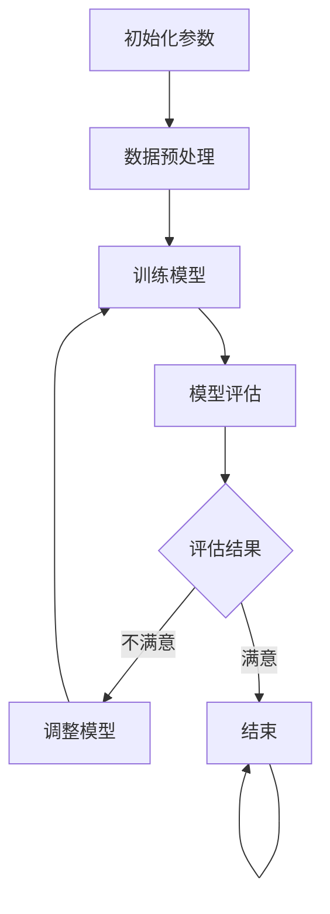
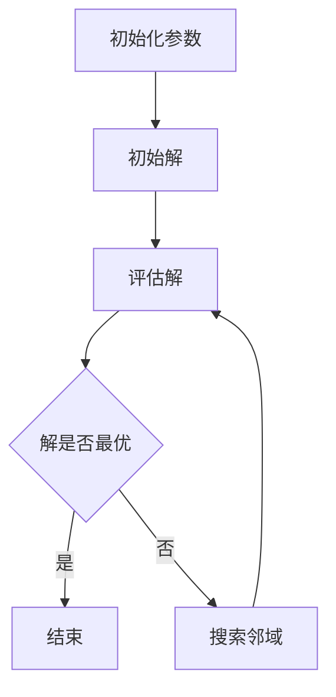
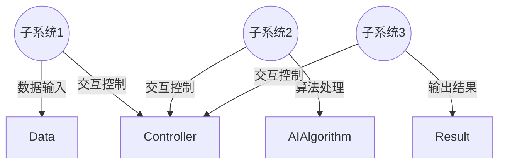
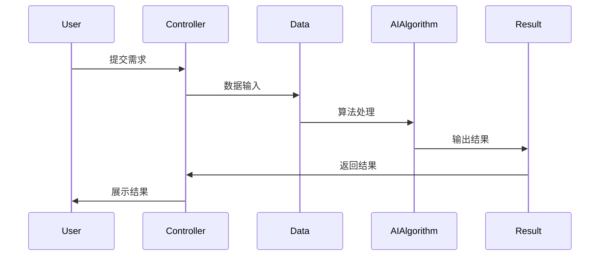

                 

### 《人工智能在可持续建筑设计中的优化应用》文章标题

关键词：人工智能、可持续建筑设计、优化应用、算法、Python实现、系统架构

摘要：本文深入探讨了人工智能在可持续建筑设计中的优化应用，通过详细的分析和实际案例，展示了人工智能如何通过机器学习和优化算法，提升建筑设计的效率与性能，实现资源节约和环境保护。文章结构紧凑，逻辑清晰，旨在为相关领域的研究者和从业者提供有价值的参考。

---

# 《人工智能在可持续建筑设计中的优化应用》目录大纲

## 第一部分：背景介绍

### 第1章：问题背景

- **问题描述：** 可持续建筑设计的挑战和现状  
  - 高能源消耗与环境污染问题  
  - 传统建筑设计流程的瓶颈与局限性

- **问题解决：** 人工智能技术的引入  
  - 提高建筑设计效率  
  - 提升建筑性能，降低环境影响

- **边界与外延：**  
  - 可持续建筑的定义和标准  
  - 人工智能技术的分类和应用

- **概念结构与核心要素组成：**  
  - 可持续建筑设计的关键要素  
  - 人工智能在建筑设计中的核心应用场景

## 第二部分：核心概念与联系

### 第2章：核心概念原理

- **人工智能概述：** 人工智能的定义、发展历程和分类  
  - 机器学习、深度学习、自然语言处理等

- **可持续建筑概述：** 可持续建筑的定义、标准和实施方法  
  - 绿色建筑评估体系、环境绩效评估方法

- **概念属性特征对比表格：** 人工智能与可持续建筑的特征对比

### 第3章：ER实体关系图架构

- **ER图：** 建筑设计与人工智能应用场景的实体关系图

## 第三部分：算法原理讲解

### 第4章：算法原理与讲解

- **机器学习算法：** 回归分析、决策树、神经网络

- **优化算法：** 模拟退火、遗传算法、粒子群算法

- **算法流程图（Mermaid）：** 机器学习算法流程图、优化算法流程图

### 第5章：Python源代码实现

- **代码实现：** 机器学习算法、优化算法的Python源代码

### 第6章：数学模型和公式详细讲解

- **数学模型与公式：** 回归分析公式、神经网络公式

- **举例说明：** 回归分析举例、神经网络举例

## 第四部分：系统分析与架构设计方案

### 第7章：问题场景介绍

- **项目介绍：** 一个典型的可持续建筑设计项目案例

- **系统功能设计：** 领域模型（Mermaid类图）、系统架构设计（Mermaid架构图）、系统接口设计、系统交互（Mermaid序列图）

### 第8章：项目实战

- **实战步骤：** 环境安装、系统核心实现源代码、实际案例分析和详细讲解剖析、项目小结

## 第五部分：最佳实践与总结

### 第9章：最佳实践 Tips

- **实践经验：** 数据收集与处理、模型优化与调整、系统集成与部署

### 第10章：小结与展望

- **小结：** 关键技术总结、实践价值

- **展望：** 人工智能在可持续建筑设计中的应用前景、面临的挑战与机遇

---

### 第一部分：背景介绍

#### 第1章：问题背景

**问题描述：**

可持续建筑设计的挑战和现状

- 高能源消耗与环境污染问题：传统建筑普遍存在能源消耗高、环境污染严重的问题。据统计，建筑行业是全球能源消耗和碳排放的主要贡献者之一。
- 传统建筑设计流程的瓶颈与局限性：传统的建筑设计流程通常依赖设计师的经验和直觉，缺乏系统性的优化和数据分析。这使得建筑设计在节能和环保方面存在较大的提升空间。

人工智能技术的引入

- 提高建筑设计效率：人工智能技术可以通过自动化和智能化的方式，提高建筑设计的工作效率。例如，利用机器学习算法对建筑设计数据进行挖掘和分析，可以快速找到最佳的建筑设计方案。
- 提升建筑性能，降低环境影响：人工智能技术可以帮助设计师更好地理解建筑性能与环境因素之间的关系，从而设计出更节能、更环保的建筑物。例如，通过深度学习算法，可以预测建筑物的能耗表现，并针对性地进行优化。

**边界与外延：**

- 可持续建筑的定义和标准：可持续建筑是指在其生命周期内，能够在经济、社会和环境三个方面实现平衡和可持续发展的建筑。常见的可持续建筑标准包括LEED（美国绿色建筑认证体系）、BREEAM（英国建筑研究评估方法）等。
- 人工智能技术的分类和应用：人工智能技术主要包括机器学习、深度学习、自然语言处理等。在建筑设计领域，这些技术可以应用于建筑设计优化、能耗预测、环境监测等方面。

**概念结构与核心要素组成：**

- 可持续建筑设计的关键要素：可持续建筑设计需要考虑多个方面的要素，包括能源效率、材料选择、水资源利用、室内环境质量等。
- 人工智能在建筑设计中的核心应用场景：人工智能技术在建筑设计中的应用主要包括以下几个方面：
  - 设计优化：利用机器学习算法，对建筑设计方案进行优化，提高建筑物的能源效率和环保性能。
  - 能耗预测：通过深度学习算法，预测建筑物的能耗表现，为能耗管理提供依据。
  - 环境监测：利用传感器和人工智能技术，对建筑环境进行实时监测和分析，提高室内环境质量。

### 第二部分：核心概念与联系

#### 第2章：核心概念原理

**人工智能概述：**

- **定义：** 人工智能是指使计算机系统能够模拟人类智能行为的技术和方法。它包括机器学习、深度学习、自然语言处理等多个子领域。
- **发展历程：** 人工智能的研究始于20世纪50年代，经历了多个阶段的发展，包括符号主义、连接主义、统计学习等。
- **分类：** 根据不同的应用场景和算法原理，人工智能可以分为以下几类：
  - **机器学习：** 通过数据训练，使计算机系统自动学习和改进。
  - **深度学习：** 基于多层神经网络，实现图像、语音等复杂数据的自动识别和处理。
  - **自然语言处理：** 使计算机能够理解和处理自然语言，实现人机交互。

**可持续建筑概述：**

- **定义：** 可持续建筑是指在生命周期内，能够实现经济、社会和环境三方面可持续发展的建筑。它强调资源的合理利用、环境的保护和人类健康的保障。
- **标准和实施方法：** 可持续建筑的标准包括LEED、BREEAM、DGNB等。这些标准通常包括以下几个方面的评估：
  - **能源效率：** 建筑物的能源消耗是否达到最低标准。
  - **材料选择：** 建筑材料是否环保、可再生。
  - **水资源利用：** 建筑物的水资源利用是否高效、可持续。
  - **室内环境质量：** 室内环境是否符合人体健康标准。

**概念属性特征对比表格：**

| 特征                | 人工智能                     | 可持续建筑                      |
| ------------------- | -------------------------- | --------------------------- |
| **能源效率**        | 提高能源利用效率             | 设计高效能源系统               |
| **环境影响**        | 减少碳排放和污染             | 减少建筑对环境的影响           |
| **材料选择**        | 利用可再生材料和环保材料     | 选择环保、可持续的材料         |
| **水资源利用**      | 提高水资源利用效率            | 实施水循环利用和节水技术       |
| **室内环境质量**    | 提高室内环境舒适度           | 设计健康、舒适的室内环境       |

#### 第3章：ER实体关系图架构

**ER图：** 建筑设计与人工智能应用场景的实体关系图

```mermaid
erDiagram
    Building ||--|{ DesignTeam }|---> Building
    DesignTeam ||--|{ AIAlgorithm }|---> DesignTeam
    Building ||--|{ User }|---> Building
    AIAlgorithm ||--|{ Data }|---> AIAlgorithm
    User ||--|{ Feedback }|---> User
```

- **实体：** 建筑物、设计团队、用户、人工智能算法
- **关系：** 设计过程、数据交互、优化策略

### 第三部分：算法原理讲解

#### 第4章：算法原理与讲解

**机器学习算法：** 回归分析、决策树、神经网络

- **回归分析：** 回归分析是一种常用的统计方法，用于预测连续值输出。通过建立自变量与因变量之间的线性或非线性关系模型，实现对新的输入数据的预测。
- **决策树：** 决策树是一种基于树形结构的数据挖掘方法，通过一系列的规则或条件，将数据划分为不同的分支，最终得到一个分类或预测结果。
- **神经网络：** 神经网络是一种模仿生物神经网络结构和功能的计算模型，通过多层神经元之间的连接和激活函数，实现数据的输入输出映射。

**优化算法：** 模拟退火、遗传算法、粒子群算法

- **模拟退火：** 模拟退火是一种基于物理原理的优化算法，通过模拟固体退火过程，逐步减小系统的能量，找到最优解。
- **遗传算法：** 遗传算法是一种基于生物进化原理的优化算法，通过模拟自然选择和遗传变异过程，找到最优解。
- **粒子群算法：** 粒子群算法是一种基于群体智能的优化算法，通过模拟鸟群觅食行为，找到最优解。

**算法流程图（Mermaid）：**

**机器学习算法流程图：**



**优化算法流程图：**



#### 第5章：Python源代码实现

**代码实现：**

**机器学习算法实现代码：**

```python
# 回归分析实现代码
from sklearn.linear_model import LinearRegression
import numpy as np

# 训练模型
model = LinearRegression()
model.fit(X_train, y_train)

# 预测结果
y_pred = model.predict(X_test)

# 决策树实现代码
from sklearn.tree import DecisionTreeClassifier
import numpy as np

# 训练模型
model = DecisionTreeClassifier()
model.fit(X_train, y_train)

# 预测结果
y_pred = model.predict(X_test)

# 神经网络实现代码
from sklearn.neural_network import MLPRegressor
import numpy as np

# 训练模型
model = MLPRegressor()
model.fit(X_train, y_train)

# 预测结果
y_pred = model.predict(X_test)
```

**优化算法实现代码：**

```python
# 模拟退火实现代码
import numpy as np
from simanneal import Annealer

# 定义优化目标函数
def objective(x):
    # x 为参数列表
    # 返回目标函数值
    pass

# 初始化模拟退火算法
annealer = Annealer(objective)

# 运行模拟退火算法
annealer.run()

# 获取最优解
best_solution = annealer.best_solution()
```

#### 第6章：数学模型和公式详细讲解

**数学模型与公式：**

**回归分析公式：**

$$
y = \beta_0 + \beta_1x_1 + \beta_2x_2 + ... + \beta_nx_n
$$

- **线性回归：** 当自变量和因变量之间是线性关系时，可以使用线性回归模型进行预测。
- **多元回归：** 当自变量和因变量之间存在多个线性关系时，可以使用多元回归模型进行预测。

**神经网络公式：**

$$
z = \sum_{i=1}^{n} w_{ij}x_j + b_j
$$

$$
a_j = \sigma(z)
$$

- **激活函数：** 激活函数用于将神经元的输入转换为输出，常见的激活函数有Sigmoid函数、ReLU函数等。
- **反向传播算法：** 反向传播算法用于更新神经网络的权重和偏置，以优化模型的预测性能。

**举例说明：**

**回归分析举例：**

- **模型建立：** 根据历史数据，建立线性回归模型。
- **参数训练：** 通过梯度下降法或其他优化算法，训练模型参数。
- **预测结果分析：** 对新的输入数据进行预测，并分析预测结果的准确性和可靠性。

**神经网络举例：**

- **层次结构：** 建立神经网络的层次结构，包括输入层、隐藏层和输出层。
- **权重调整：** 通过反向传播算法，调整神经网络的权重和偏置。
- **训练与优化：** 对神经网络进行训练，并使用验证集进行优化，提高模型的预测性能。

### 第四部分：系统分析与架构设计方案

#### 第7章：问题场景介绍

**项目介绍：** 一个典型的可持续建筑设计项目案例

- **项目背景：** 设计一座可持续住宅建筑，满足节能、环保和舒适性的要求。
- **项目目标：** 通过人工智能技术，优化建筑设计方案，提高建筑性能，降低环境影响。

**系统功能设计：**

- **领域模型（Mermaid类图）：**

```mermaid
classDiagram
    Building <<Class>> "建筑物"
    DesignTeam <<Class>> "设计团队"
    User <<Class>> "用户"
    AIAlgorithm <<Class>> "人工智能算法"
    Data <<Class>> "数据"

    Building o-- DesignTeam
    DesignTeam o-- User
    DesignTeam o-- AIAlgorithm
    AIAlgorithm o-- Data
```

- **系统架构设计（Mermaid架构图）：**



- **系统接口设计：** 设计系统的接口，包括数据输入接口、算法处理接口、输出结果接口和交互控制接口。

- **系统交互（Mermaid序列图）：**



### 第8章：项目实战

**实战步骤：**

- **环境安装：** 安装Python环境、机器学习库和优化算法库。

- **系统核心实现源代码：**

  - **代码应用解读与分析：** 分析系统核心代码的结构和功能，详细解读每个模块的作用和实现方式。

  - **实际案例分析和详细讲解剖析：** 通过实际案例，展示系统在可持续建筑设计中的应用效果，并对关键步骤进行详细讲解和剖析。

- **项目小结：**

  - **总结与反思：** 总结项目实施的经验和不足，反思项目过程中遇到的问题和解决方案。

  - **未来展望：** 展望人工智能在可持续建筑设计中的应用前景，提出未来可能的研究方向和改进措施。

### 第9章：最佳实践 Tips

- **实践经验：**

  - **数据收集与处理：** 提供最佳实践技巧，包括数据清洗、数据预处理和数据标准化等方法。

  - **模型优化与调整：** 分享模型优化和调整的经验，包括模型选择、参数调整和模型评估等。

  - **系统集成与部署：** 提供系统集成与部署的最佳实践，包括系统架构设计、模块划分和接口设计等。

### 第10章：小结与展望

- **小结：**

  - **关键技术总结：** 总结人工智能在可持续建筑设计中的核心应用，包括机器学习、优化算法和系统架构设计等。

  - **实践价值：** 强调人工智能在可持续建筑设计中的实践价值，包括提高设计效率、提升建筑性能和降低环境影响等。

- **展望：**

  - **未来趋势：** 分析人工智能在可持续建筑设计中的应用前景，包括新型算法、智能化设计和集成应用等方面。

  - **挑战与机遇：** 面临的挑战和机遇，包括数据隐私、计算资源、算法优化和跨学科合作等。

