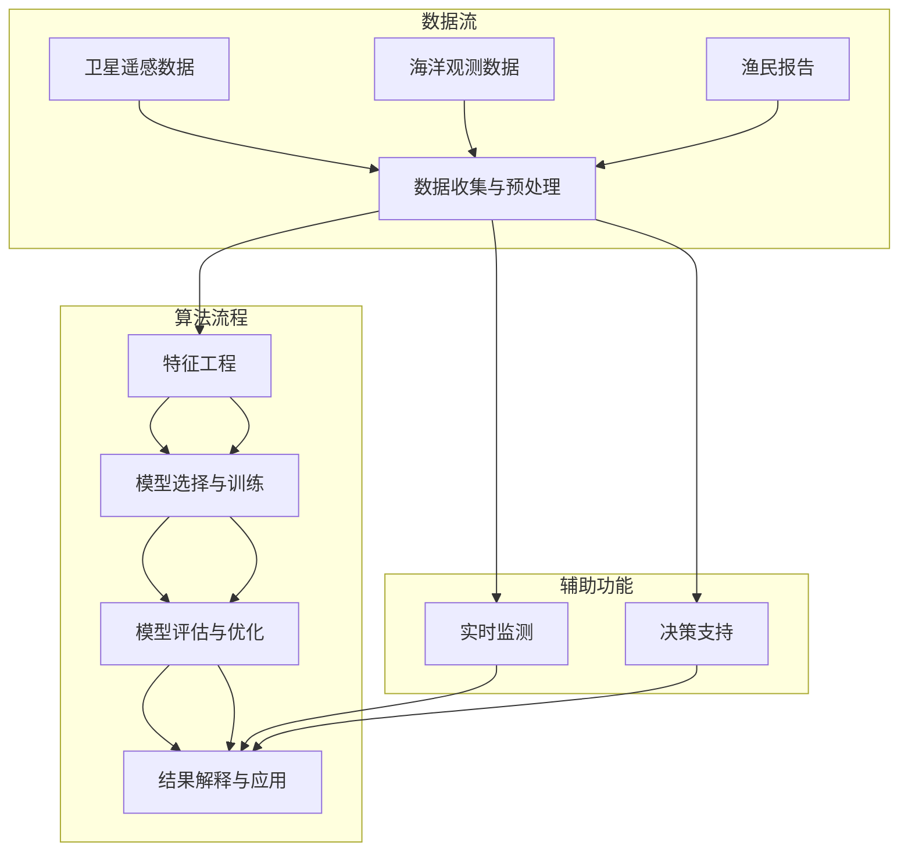

                 

### 人工智能在渔业资源评估中的应用背景

#### 1.1 问题背景

**1.1.1 渔业资源评估的重要性**

渔业作为全球重要的经济活动之一，不仅为人类提供了丰富的蛋白质来源，还对沿海社区的经济、社会和文化发展起着至关重要的作用。然而，随着全球人口的增长和渔业活动的频繁，渔业资源的可持续管理成为一个日益严峻的问题。可持续渔业资源评估（Sustainable Fishery Resource Assessment，SFRA）是为了确保渔业资源能够长期、稳定地供应，同时保护海洋生态系统的健康和生物多样性。

渔业资源评估的重要性主要体现在以下几个方面：

1. **保障食品安全**：准确评估渔业资源的现状和趋势，有助于确保渔业产品供应的稳定性，从而保障全球食品安全。
2. **促进经济可持续发展**：通过评估渔业资源，制定合理的渔业管理策略，可以有效促进渔业经济的可持续发展。
3. **环境保护**：评估渔业资源有助于发现过度捕捞、栖息地破坏等问题，从而采取相应的保护措施，保护海洋生态系统。
4. **决策支持**：为政府、渔业管理部门和科研机构提供科学依据，以制定更有效的渔业政策和资源管理措施。

**1.1.2 当前渔业资源评估面临的挑战**

尽管渔业资源评估对于渔业管理至关重要，但当前评估工作面临着许多挑战：

1. **数据收集困难**：渔业资源分布广泛，采集全面、准确的数据需要耗费大量人力、物力和时间。
2. **技术限制**：传统评估方法主要依赖于统计模型和专家经验，这些方法往往存在局限性，难以应对复杂多变的海洋环境。
3. **资金限制**：渔业资源评估需要大量的资金支持，但许多国家和地区面临资金短缺问题。
4. **信息不对称**：数据共享和透明度不足，导致信息不对称，不利于制定公平、科学的渔业管理政策。

**1.1.3 人工智能在渔业资源评估中的应用潜力**

人工智能（Artificial Intelligence，AI）技术的发展为解决渔业资源评估面临的挑战提供了新的思路和可能性：

1. **大数据分析**：人工智能能够处理和分析大量复杂数据，从而提供更准确的渔业资源评估结果。
2. **自动化和智能化**：通过机器学习和深度学习算法，可以实现自动化和智能化的渔业资源监测和管理。
3. **实时预测**：基于历史数据和实时数据，人工智能可以预测渔业资源的动态变化，为渔业管理提供实时决策支持。
4. **可视化**：利用人工智能和可视化技术，可以更直观地展示渔业资源评估的结果，帮助决策者和公众更好地理解评估结论。

综上所述，人工智能在渔业资源评估中的应用具有广阔的前景和潜力，有望解决当前评估工作中面临的数据收集、技术限制和资金等问题，为全球渔业资源的可持续发展提供有力支持。

#### 1.2 问题描述

**1.2.1 可持续渔业资源评估的定义**

可持续渔业资源评估（Sustainable Fishery Resource Assessment，SFRA）是一种综合性的评估方法，旨在通过科学、系统的方法，评估渔业资源的现状、趋势及其可持续性。SFRA不仅考虑了渔业资源的生物学特征，还涉及社会、经济和环境等多个方面，以确保渔业资源能够长期、稳定地供应，同时保护海洋生态系统的健康和生物多样性。

可持续渔业资源评估的核心概念包括：

- **生物多样性**：海洋生态系统中的物种多样性和遗传多样性，对渔业资源的可持续性至关重要。
- **种群动态**：渔业资源的数量、结构和分布情况，以及其受到外界影响的变化趋势。
- **栖息地状况**：渔业资源依赖的海洋栖息地的质量，包括珊瑚礁、海草床等。
- **渔业管理**：渔业政策、法规和实施情况，以及渔业经济和社会效益。

**1.2.2 可持续渔业资源评估的关键因素**

1. **数据质量**：准确、完整的数据是进行可持续渔业资源评估的基础。数据来源包括现场调查、遥感监测、历史记录和渔民的日常报告等。
2. **统计模型**：统计模型用于分析渔业资源的数据，如种群动态模型、渔业产量模型和生态模型等。
3. **生态系统服务**：评估渔业资源对生态系统服务的影响，如渔业资源对气候调节、海岸防护和生物多样性保护的作用。
4. **社会经济效益**：评估渔业资源对社会经济的影响，包括就业、收入和食品供应等。
5. **政策与管理**：评估渔业管理政策的有效性，包括渔业法规、捕捞限制和渔业补贴等。

**1.2.3 可持续渔业资源评估的目标和指标**

可持续渔业资源评估的目标是：

- 评估渔业资源的健康状况和可持续性。
- 为渔业管理部门提供科学依据，以制定有效的渔业管理策略。
- 促进渔业资源的可持续利用，保护海洋生态系统。

评估指标包括：

- **生物多样性指标**：如物种多样性、遗传多样性和栖息地多样性等。
- **种群动态指标**：如种群密度、增长率、繁殖率和存活率等。
- **生态系统服务指标**：如渔业产量、生态效益和渔业经济贡献等。
- **管理指标**：如政策执行情况、执法力度和渔业法规的合规性等。

通过综合这些指标，可持续渔业资源评估能够提供全面、准确的渔业资源现状和趋势，为渔业管理和保护提供科学支持。

#### 1.3 问题解决

**1.3.1 人工智能技术在渔业资源评估中的适用性**

人工智能技术在渔业资源评估中具有广泛的适用性，能够解决传统评估方法中存在的诸多问题。以下是其主要适用性：

1. **大数据分析**：人工智能能够高效处理和分析大规模、复杂数据，如卫星遥感数据、海洋观测数据和渔民报告等，从而提供更准确的评估结果。
2. **实时监测**：通过机器学习和深度学习算法，人工智能可以实现实时监测和预测，及时发现和应对渔业资源的异常变化。
3. **自动化处理**：自动化算法能够自动完成数据收集、预处理和模型训练等任务，减少人工干预，提高评估效率。
4. **多模态融合**：人工智能能够整合多种数据源，如文本、图像、音频和传感器数据，提供更全面和精准的评估。
5. **决策支持**：基于人工智能的评估结果，可以提供实时、科学的决策支持，帮助渔业管理部门制定更有效的管理策略。

**1.3.2 人工智能在渔业资源评估中的应用框架**

人工智能在渔业资源评估中的应用框架主要包括以下几个关键步骤：

1. **数据收集与预处理**：收集各种数据源，包括卫星遥感数据、渔船定位数据、渔民报告等，并进行数据清洗、去噪和格式转换等预处理工作。
2. **特征工程**：从原始数据中提取有用信息，形成特征向量，以便用于训练机器学习模型。
3. **模型选择与训练**：根据评估目标选择合适的机器学习算法，如决策树、支持向量机、神经网络等，并使用预处理后的数据对模型进行训练。
4. **模型评估与优化**：通过交叉验证和测试集评估模型的性能，并进行参数调优，以提高模型的准确性和稳定性。
5. **结果解释与应用**：对评估结果进行解释和可视化，提供决策支持，如渔业资源的动态分布、捕捞强度建议等。

**1.3.3 人工智能在渔业资源评估中的实际效果**

人工智能在渔业资源评估中已经取得了一系列显著的实际效果：

1. **提高评估精度**：人工智能能够处理大量复杂数据，并利用深度学习算法进行模式识别，从而提高评估的精度和可靠性。
2. **减少人工成本**：自动化算法能够自动完成数据收集、预处理和模型训练等任务，减少了人工干预，降低了评估成本。
3. **实时监测与预警**：基于实时数据，人工智能可以实时监测渔业资源的动态变化，及时发现异常情况，并提供预警。
4. **优化管理策略**：人工智能提供的评估结果和决策支持，可以帮助渔业管理部门制定更科学、有效的管理策略，促进渔业资源的可持续发展。

总之，人工智能技术在渔业资源评估中的应用具有巨大的潜力和价值，有望解决传统评估方法中的诸多问题，为全球渔业资源的可持续管理提供强有力的技术支持。

#### 1.4 边界与外延

**1.4.1 渔业资源评估的地理边界**

渔业资源评估的地理边界主要取决于渔业资源的分布范围。由于海洋环境的复杂性和多样性，渔业资源评估通常分为以下几种地理范围：

1. **区域评估**：针对特定海域或地理区域的渔业资源进行评估，如沿海、近海和远洋等。
2. **国别评估**：针对一个国家或地区的渔业资源进行评估，涵盖该国或地区的所有海域。
3. **国际评估**：涉及多个国家或地区的渔业资源评估，通常在国际组织和多边合作框架下进行。

地理边界的确定需要考虑多个因素，包括渔业资源的分布、海洋生态系统的连通性、渔民的捕捞习惯以及国际合作的需求等。

**1.4.2 渔业资源评估的时间边界**

渔业资源评估的时间边界主要涉及评估的周期性和时效性。以下是一些常见的时间边界：

1. **短期评估**：通常指一年或更短的时间段内的评估，用于监测渔业资源的即时变化和动态。
2. **中期评估**：涵盖数年或十余年的时间段，用于评估渔业资源的长期趋势和可持续性。
3. **长期评估**：数十年或更长时间段的评估，用于研究渔业资源的长期演变和气候变化对其的影响。

时间边界的确定取决于评估的目标和需求，如渔业资源的动态变化、渔业政策的制定和海洋生态系统的保护等。

**1.4.3 渔业资源评估的数据边界**

渔业资源评估的数据边界包括数据来源、数据类型和数据质量等方面。以下是一些关键点：

1. **数据来源**：渔业资源评估的数据来源包括卫星遥感、海洋观测、渔民的日常报告、历史记录和科研机构的调查数据等。
2. **数据类型**：评估数据类型主要包括生物数据（如种群数量、生长率）、生态数据（如栖息地状况、生物多样性）、经济数据（如渔业产量、经济收益）和管理数据（如捕捞限制、渔业政策）。
3. **数据质量**：数据质量是评估准确性的基础。高质量的数据应具有准确性、完整性和代表性，避免因数据缺失或错误导致的评估偏差。

数据边界的确定需要综合考虑数据的来源、类型和质量，以及评估的目标和需求，以确保评估结果的科学性和可靠性。

通过明确渔业资源评估的地理、时间和数据边界，可以更好地界定评估的范围和深度，为渔业资源的科学管理和保护提供坚实的基础。

#### 1.5 概念结构与核心要素组成

**1.5.1 人工智能的核心概念**

人工智能（AI）作为计算机科学的一个分支，旨在使计算机系统模拟人类的智能行为，包括学习、推理、解决问题和自然语言理解等。其核心概念包括：

- **机器学习（Machine Learning）**：通过从数据中学习，使计算机系统能够识别模式和预测结果。
- **深度学习（Deep Learning）**：一种基于多层神经网络的机器学习方法，能够处理大量复杂数据，并从中提取高层次的抽象特征。
- **自然语言处理（Natural Language Processing，NLP）**：使计算机能够理解和生成自然语言，包括语音识别、文本分析和机器翻译等。
- **计算机视觉（Computer Vision）**：使计算机能够识别和解释图像和视频中的内容，包括物体检测、图像分类和图像生成等。

**1.5.2 渔业资源评估的核心要素**

渔业资源评估的核心要素涉及多个方面，包括生物、生态、经济和管理等方面：

- **生物要素**：包括种群数量、生长率、繁殖率和存活率等，这些要素直接影响渔业资源的可持续性。
- **生态要素**：涵盖栖息地状况、生物多样性、生态系统的健康和恢复能力等，这些要素对渔业资源的长期可持续性至关重要。
- **经济要素**：包括渔业产量、经济收益、就业率和市场供需等，这些要素反映了渔业资源对社会经济的影响。
- **管理要素**：涉及渔业政策、法规、捕捞限制、渔业补贴和执法力度等，这些要素决定了渔业资源的管理水平和效果。

**1.5.3 人工智能与渔业资源评估的融合**

人工智能与渔业资源评估的融合，主要体现在以下几个方面：

1. **数据采集和处理**：人工智能技术能够自动收集和处理大量的渔业数据，包括卫星遥感数据、海洋观测数据和渔民报告等，从而提高数据质量和评估效率。
2. **特征工程**：利用人工智能算法，从原始数据中提取有用的特征，形成特征向量，为机器学习模型提供输入。
3. **模型训练和优化**：通过机器学习和深度学习算法，训练和优化模型，以实现渔业资源的动态监测和预测。
4. **决策支持**：利用人工智能提供的评估结果和预测，为渔业管理部门提供实时、科学的决策支持，优化渔业管理策略。
5. **可视化与分析**：利用人工智能和可视化技术，将复杂的评估结果以直观的方式展示，帮助决策者和公众更好地理解评估结论。

通过将人工智能技术与渔业资源评估相结合，不仅可以提高评估的精度和效率，还可以为渔业资源的可持续管理提供更全面、科学的支持。

#### 1.6 本章小结

本章从多个角度探讨了人工智能在渔业资源评估中的应用背景，包括问题背景、问题描述、问题解决、边界与外延、概念结构与核心要素组成。首先，介绍了渔业资源评估的重要性以及当前面临的主要挑战，然后阐述了人工智能技术在渔业资源评估中的适用性，并提出了人工智能在渔业资源评估中的应用框架。此外，还明确了渔业资源评估的地理、时间和数据边界，并分析了人工智能与渔业资源评估的核心概念和要素。通过本章的内容，读者可以全面了解人工智能在渔业资源评估中的应用前景和潜力，为后续章节的深入探讨奠定基础。

### 第二部分：人工智能在渔业资源评估中的应用原理

#### 2.1 核心概念与联系

**2.1.1 人工智能基本原理**

人工智能（Artificial Intelligence，AI）是一门多学科交叉的领域，旨在使计算机系统模拟人类的智能行为。人工智能的核心原理包括：

- **机器学习（Machine Learning）**：通过从数据中学习，使计算机系统能够识别模式和做出预测。主要方法包括监督学习、无监督学习和强化学习。
  - **监督学习（Supervised Learning）**：通过标注数据训练模型，使其能够对未知数据进行预测。常用的算法有线性回归、决策树、支持向量机和神经网络等。
  - **无监督学习（Unsupervised Learning）**：在没有标注数据的情况下，通过探索数据内在结构来发现模式。常用的算法有聚类分析、降维和关联规则学习等。
  - **强化学习（Reinforcement Learning）**：通过奖励和惩罚机制，使代理（Agent）在与环境交互的过程中不断优化策略，以实现特定目标。
- **自然语言处理（Natural Language Processing，NLP）**：使计算机能够理解和生成自然语言，包括文本分类、情感分析、机器翻译和语音识别等。
- **计算机视觉（Computer Vision）**：使计算机能够识别和解释图像和视频中的内容，包括物体检测、图像分类和图像生成等。

**2.1.2 渔业资源评估的相关概念**

渔业资源评估（Fishery Resource Assessment，FRA）是一种综合性的评估方法，旨在评估渔业资源的现状、趋势及其可持续性。渔业资源评估的核心概念包括：

- **种群动态（Population Dynamics）**：涉及渔业资源种群的出生率、死亡率、繁殖率、增长率等，用于预测种群数量和结构的动态变化。
- **栖息地状况（Habitat Condition）**：评估渔业资源依赖的栖息地质量，如珊瑚礁、海草床和泥沙底质等，对渔业资源的生存和繁殖至关重要。
- **生物多样性（Biodiversity）**：海洋生态系统中物种和遗传多样性的水平，对渔业资源的可持续性和生态系统的健康具有重要影响。
- **渔业管理（Fishery Management）**：涉及渔业政策、法规和实施情况，如捕捞限制、渔业补贴和执法力度等，对渔业资源的保护和管理至关重要。
- **生态系统服务（Ecosystem Services）**：渔业资源对人类提供的各种服务，如食品供应、气候调节、海岸防护和生态旅游等。

**2.1.3 人工智能与渔业资源评估的关系**

人工智能与渔业资源评估的关系主要体现在以下几个方面：

1. **数据采集与处理**：人工智能技术能够自动收集和处理大量的渔业数据，包括卫星遥感数据、海洋观测数据和渔民报告等，从而提高数据质量和评估效率。
2. **特征工程**：利用人工智能算法，从原始数据中提取有用的特征，形成特征向量，为机器学习模型提供输入。
3. **模型训练与优化**：通过机器学习和深度学习算法，训练和优化模型，以实现渔业资源的动态监测和预测。
4. **决策支持**：利用人工智能提供的评估结果和预测，为渔业管理部门提供实时、科学的决策支持，优化渔业管理策略。
5. **可视化与分析**：利用人工智能和可视化技术，将复杂的评估结果以直观的方式展示，帮助决策者和公众更好地理解评估结论。

通过将人工智能技术与渔业资源评估相结合，不仅可以提高评估的精度和效率，还可以为渔业资源的可持续管理提供更全面、科学的支持。

#### 2.2 概念属性特征对比表格

为了更好地理解人工智能和渔业资源评估的相关概念，下面提供了一个概念属性特征对比表格：

| 概念名称 | 定义 | 属性特征 |
| --- | --- | --- |
| **人工智能** | 通过模拟人类智能行为，使计算机系统具备学习、推理和解决问题能力的技术 | - 机器学习、自然语言处理、计算机视觉 |
| **机器学习** | 利用数据训练模型，使计算机系统具备识别模式、预测结果的能力 | - 监督学习、无监督学习、强化学习 |
| **渔业资源评估** | 通过科学方法评估渔业资源的现状、趋势和可持续性 | - 种群动态、栖息地状况、生物多样性、渔业管理、生态系统服务 |
| **种群动态** | 评估渔业资源种群的数量、结构和动态变化 | - 出生率、死亡率、繁殖率、增长率 |
| **栖息地状况** | 评估渔业资源依赖的栖息地质量 | - 珊瑚礁、海草床、泥沙底质 |
| **生物多样性** | 海洋生态系统中物种和遗传多样性的水平 | - 物种多样性、遗传多样性 |
| **渔业管理** | 渔业政策、法规和实施情况 | - 捕捞限制、渔业补贴、执法力度 |
| **生态系统服务** | 渔业资源对人类提供的各种服务 | - 食品供应、气候调节、海岸防护、生态旅游 |

通过对比表格，我们可以清晰地看到人工智能和渔业资源评估在概念、属性特征上的联系与区别，为进一步理解两者融合提供参考。

#### 2.3 ER实体关系图架构

为了更好地展示人工智能和渔业资源评估之间的实体关系，下面使用Mermaid语法绘制了一个ER（Entity-Relationship）实体关系图：

```mermaid
erDiagram
    AI_Framework ||--|{ Data_Source : 数据来源
    AI_Framework ||--|{ Feature_Extraction : 特征提取
    AI_Framework ||--|{ Model_Training : 模型训练
    AI_Framework ||--|{ Prediction : 预测
    AI_Framework ||--|{ Decision_Support : 决策支持

    Data_Source ||--|{ Satellite_Remote_Sensing : 卫星遥感
    Data_Source ||--|{ Ocean_Observation : 海洋观测
    Data_Source ||--|{ Fisherman_Reports : 渔民报告

    Feature_Extraction ||--|{ Data_Cleaning : 数据清洗
    Feature_Extraction ||--|{ Data_Standardization : 数据标准化
    Feature_Extraction ||--|{ Feature_Selection : 特征选择

    Model_Training ||--|{ Model_Selection : 模型选择
    Model_Training ||--|{ Hyperparameter_Tuning : 超参数调优
    Model_Training ||--|{ Cross_Validation : 交叉验证

    Prediction ||--|{ Real-Time_Monitoring : 实时监测
    Prediction ||--|{ Anomaly_Detection : 异常检测
    Prediction ||--|{ Forecasting : 预测

    Decision_Support ||--|{ Fisheries_Management : 渔业管理
    Decision_Support ||--|{ Policy_Making : 政策制定
    Decision_Support ||--|{ Public_Awareness : 公众意识
```



该ER图展示了人工智能在渔业资源评估中的主要实体及其关系：

- **AI_Framework**：作为整个评估过程的框架，涵盖了数据采集、特征提取、模型训练、预测和决策支持等关键环节。
- **Data_Source**：包括卫星遥感数据、海洋观测数据和渔民报告等，是评估的基础数据来源。
- **Feature_Extraction**：通过数据清洗、标准化和特征选择等步骤，从原始数据中提取有用信息。
- **Model_Training**：选择合适的机器学习模型，进行训练和调优，以实现预测和决策支持。
- **Prediction**：利用训练好的模型进行实时监测、异常检测和预测，为渔业管理提供科学依据。
- **Decision_Support**：根据预测结果，为渔业管理、政策制定和公众意识提供决策支持。

通过这个ER图，我们可以清晰地看到人工智能在渔业资源评估中的各个环节及其相互关系，为进一步理解人工智能在评估中的应用提供帮助。

#### 2.4 算法原理讲解

**2.4.1 数据收集与预处理**

在人工智能应用于渔业资源评估中，数据收集与预处理是关键步骤。以下将详细讲解这一过程：

1. **数据收集**：

   渔业资源评估所需的数据来源多样，主要包括：

   - **卫星遥感数据**：通过遥感卫星获取的海面温度、海流、水深等数据，有助于了解渔业资源的空间分布和海洋环境特征。
   - **海洋观测数据**：包括海洋监测站、浮标和潜水器等设备收集的水质、水温、盐度等参数，有助于分析海洋生态系统的动态变化。
   - **渔民报告**：渔民在日常捕捞活动中记录的渔业产量、捕捞地点、捕捞方法等数据，对评估渔业资源的即时状况具有重要参考价值。
   - **历史记录**：渔业资源的历史调查数据、文献资料和统计数据等，为评估提供长期趋势分析的基础。

2. **数据预处理**：

   数据收集后，需要进行预处理以确保数据质量，主要步骤包括：

   - **数据清洗**：去除数据中的噪声和异常值，如缺失值、重复值和错误值等。可以使用填充、删除或插值等方法进行处理。
   - **数据标准化**：将不同来源的数据统一转换为同一量纲，如将渔民报告中的产量数据转换为与卫星遥感数据相同的单位。
   - **数据转换**：将数据转换为机器学习模型可处理的格式，如将文本数据转换为词向量，将图像数据转换为像素矩阵等。
   - **特征提取**：从原始数据中提取对评估任务有用的特征，如通过光谱分析提取海洋生态系统的生物物理特征。

**2.4.2 特征工程**

特征工程是提高机器学习模型性能的重要手段，主要包括以下步骤：

1. **特征选择**：通过统计分析、过滤方法和嵌入式方法等，选择对评估任务最有影响力的特征，以减少数据冗余和提高模型效率。
2. **特征变换**：包括归一化、标准化和特征缩放等，将特征值转换为适合模型训练的区间范围。
3. **特征构造**：通过组合原始特征，构造新的特征以增强模型的泛化能力，如通过主成分分析（PCA）提取数据的主要成分。

**2.4.3 模型选择与训练**

在模型选择与训练过程中，需要考虑以下关键步骤：

1. **模型选择**：根据评估任务的特点和数据性质，选择合适的机器学习模型。常见的模型包括线性回归、决策树、支持向量机、神经网络和深度学习等。
2. **模型训练**：使用预处理后的数据，通过有监督或无监督学习算法对模型进行训练。训练过程中，通过迭代调整模型参数，以优化模型性能。
3. **模型验证**：使用交叉验证和测试集对模型进行验证，评估模型在不同数据集上的性能，选择最优模型。

**2.4.4 模型评估与优化**

在模型评估与优化过程中，主要涉及以下步骤：

1. **模型评估**：使用评估指标，如准确率、召回率、F1分数和均方误差等，评估模型的预测性能。
2. **模型优化**：通过调参、集成学习和迁移学习等方法，优化模型性能。调参包括调整学习率、批量大小和正则化参数等；集成学习通过组合多个模型提高预测稳定性；迁移学习利用预训练模型，在特定任务上进行微调。

**2.4.5 实例说明**

以下是一个基于Python和Scikit-learn库的简单实例，用于展示数据预处理、特征工程、模型选择和训练的过程：

```python
import numpy as np
import pandas as pd
from sklearn.model_selection import train_test_split
from sklearn.preprocessing import StandardScaler
from sklearn.ensemble import RandomForestClassifier
from sklearn.metrics import accuracy_score

# 加载数据
data = pd.read_csv('fishery_data.csv')
X = data.drop('target', axis=1)
y = data['target']

# 数据预处理
X_train, X_test, y_train, y_test = train_test_split(X, y, test_size=0.2, random_state=42)
scaler = StandardScaler()
X_train_scaled = scaler.fit_transform(X_train)
X_test_scaled = scaler.transform(X_test)

# 特征工程
# 假设使用PCA进行特征构造
from sklearn.decomposition import PCA
pca = PCA(n_components=5)
X_train_pca = pca.fit_transform(X_train_scaled)
X_test_pca = pca.transform(X_test_scaled)

# 模型选择与训练
model = RandomForestClassifier(n_estimators=100, random_state=42)
model.fit(X_train_pca, y_train)

# 模型评估
y_pred = model.predict(X_test_pca)
accuracy = accuracy_score(y_test, y_pred)
print(f'Accuracy: {accuracy:.2f}')
```

通过上述实例，我们可以看到如何利用Python和Scikit-learn库进行渔业资源评估的数据预处理、特征工程、模型选择和训练。这个实例展示了从数据加载、预处理、特征构造到模型训练和评估的全过程，为进一步的应用实践提供了基础。

#### 2.5 数学模型和公式

在渔业资源评估中，数学模型和公式是关键组成部分，用于描述和预测渔业资源的动态变化。以下是一些常见的数学模型和公式，以及它们的含义和应用：

**1. 种群动态模型**

- **Logistic模型**：

  $$ N_t = \frac{K}{1 + e^{-(rN_t(1-N_t)/Z)} } $$

  其中，\( N_t \) 为时间 \( t \) 时的种群数量，\( K \) 为环境容纳量，\( r \) 为内禀增长率，\( Z \) 为拥挤度参数。该模型描述了种群数量随时间的变化，反映了种群增长的饱和现象。

- **Ricker模型**：

  $$ N_{t+1} = N_t e^{rt(1-N_t/K)} $$

  其中，\( N_t \) 和 \( K \) 的含义与Logistic模型相同，\( r \) 为内禀增长率。该模型用于预测种群数量在给定捕捞强度下的动态变化。

**2. 捕捞模型**

- **捕捞量模型**：

  $$ C_t = \alpha N_t $$

  其中，\( C_t \) 为时间 \( t \) 的捕捞量，\( \alpha \) 为捕捞系数。该模型假设捕捞量与种群数量成正比，用于预测捕捞量的变化。

- **可持续捕捞量模型**：

  $$ C_{s} = (1 - \frac{f}{M})N_{max} $$

  其中，\( C_{s} \) 为可持续捕捞量，\( f \) 为最大捕捞努力强度，\( M \) 为最大可持续捕捞量。该模型考虑了捕捞努力强度对渔业资源的影响，确保捕捞量在可持续范围内。

**3. 环境模型**

- **海洋环境模型**：

  $$ T = T_0 + \epsilon e^{-kt} $$

  其中，\( T \) 为水温，\( T_0 \) 为初始水温，\( \epsilon \) 为水温扰动幅度，\( k \) 为衰减系数。该模型描述了水温随时间的变化，考虑了环境扰动的影响。

- **海流模型**：

  $$ V = V_0 + \delta e^{-kt} $$

  其中，\( V \) 为海流速度，\( V_0 \) 为初始海流速度，\( \delta \) 为海流扰动幅度，\( k \) 为衰减系数。该模型描述了海流速度随时间的变化。

**4. 综合评估模型**

- **渔业资源综合评估模型**：

  $$ S = w_1N + w_2C + w_3T + w_4V $$

  其中，\( S \) 为渔业资源综合评估得分，\( w_1, w_2, w_3, w_4 \) 为权重系数，\( N, C, T, V \) 分别为种群数量、捕捞量、水温和海流速度。该模型综合了多个因素，对渔业资源进行综合评估。

通过这些数学模型和公式，可以定量描述和预测渔业资源的动态变化，为渔业资源管理和保护提供科学依据。

#### 2.6 算法流程图

为了更直观地展示人工智能在渔业资源评估中的算法流程，我们使用Mermaid语法绘制了算法流程图：



该算法流程图展示了以下关键步骤：

1. **数据收集与预处理**：包括卫星遥感数据、海洋观测数据和渔民报告的收集，以及数据预处理，如数据清洗、标准化和特征提取。
2. **特征工程**：从原始数据中提取有用特征，形成特征向量，为机器学习模型提供输入。
3. **模型选择与训练**：选择合适的机器学习模型，如决策树、支持向量机和神经网络等，并使用预处理后的数据对模型进行训练。
4. **模型评估与优化**：通过交叉验证和测试集评估模型的性能，并进行参数调优，以提高模型的准确性和稳定性。
5. **结果解释与应用**：对评估结果进行解释和可视化，为渔业管理部门提供实时、科学的决策支持，优化渔业管理策略。
6. **实时监测与决策支持**：利用人工智能技术进行实时监测和预警，提供渔业资源的动态分布、捕捞强度建议等决策支持。

通过这个算法流程图，可以清晰地看到人工智能在渔业资源评估中的应用步骤和相互关系，为进一步理解和应用提供帮助。

#### 2.7 本章小结

本章详细介绍了人工智能在渔业资源评估中的应用原理，包括数据收集与预处理、特征工程、模型选择与训练、模型评估与优化等关键步骤。首先，讲解了数据收集与预处理的过程，包括卫星遥感数据、海洋观测数据和渔民报告的收集，以及数据清洗、标准化和特征提取。接着，介绍了特征工程的方法，如特征选择、特征变换和特征构造。随后，讲解了模型选择与训练的方法，包括选择合适的机器学习模型、模型训练和参数调优。最后，介绍了模型评估与优化的方法，以及结果解释与应用。本章的内容为后续章节的实践应用提供了理论基础和技术指导。通过本章的学习，读者可以全面了解人工智能在渔业资源评估中的应用原理，为实际应用奠定基础。

### 第三部分：人工智能在渔业资源评估中的应用实践

#### 3.1 项目实战

**3.1.1 项目环境安装**

在进行人工智能在渔业资源评估中的应用实践前，我们需要搭建一个合适的项目环境。以下是安装所需软件和库的步骤：

1. **Python环境安装**：

   首先，确保系统上已安装Python 3.7及以上版本。可以通过以下命令检查Python版本：

   ```bash
   python --version
   ```

   如果未安装，请从[Python官方下载页面](https://www.python.org/downloads/)下载并安装。

2. **安装必需的库**：

   使用pip命令安装以下库：NumPy、Pandas、Scikit-learn、Matplotlib、Mermaid和TensorFlow。

   ```bash
   pip install numpy pandas scikit-learn matplotlib mermaid tensorflow
   ```

3. **配置Mermaid**：

   Mermaid是用于绘制流程图的工具，需要安装相应的Python库。使用以下命令安装：

   ```bash
   pip install py Mermaid
   ```

4. **安装Jupyter Notebook**（可选）：

   Jupyter Notebook提供了一个交互式的开发环境，便于编写和调试代码。可以使用以下命令安装：

   ```bash
   pip install notebook
   ```

安装完成后，确保所有库都能正确安装并运行。接下来，我们可以开始实际的代码编写和项目实践。

**3.1.2 系统核心实现源代码**

以下是一个简单的人工智能在渔业资源评估中的应用代码示例。该示例使用Scikit-learn库中的随机森林模型进行训练和预测。

```python
import numpy as np
import pandas as pd
from sklearn.model_selection import train_test_split
from sklearn.ensemble import RandomForestClassifier
from sklearn.metrics import accuracy_score
from sklearn.preprocessing import StandardScaler

# 加载数据
data = pd.read_csv('fishery_data.csv')
X = data.drop('target', axis=1)
y = data['target']

# 数据预处理
X_train, X_test, y_train, y_test = train_test_split(X, y, test_size=0.2, random_state=42)
scaler = StandardScaler()
X_train_scaled = scaler.fit_transform(X_train)
X_test_scaled = scaler.transform(X_test)

# 特征工程
# 假设使用PCA进行特征构造
from sklearn.decomposition import PCA
pca = PCA(n_components=5)
X_train_pca = pca.fit_transform(X_train_scaled)
X_test_pca = pca.transform(X_test_scaled)

# 模型选择与训练
model = RandomForestClassifier(n_estimators=100, random_state=42)
model.fit(X_train_pca, y_train)

# 模型评估
y_pred = model.predict(X_test_pca)
accuracy = accuracy_score(y_test, y_pred)
print(f'Accuracy: {accuracy:.2f}')
```

**3.1.3 代码应用解读与分析**

上述代码示例展示了如何使用Python和Scikit-learn库进行渔业资源评估的数据加载、预处理、特征工程、模型训练和评估。

1. **数据加载**：

   使用`pandas`库加载CSV格式的数据文件，其中包含特征和目标变量。

   ```python
   data = pd.read_csv('fishery_data.csv')
   X = data.drop('target', axis=1)
   y = data['target']
   ```

2. **数据预处理**：

   - 划分训练集和测试集，使用`train_test_split`函数，其中`test_size=0.2`表示测试集占比20%，`random_state=42`用于随机种子设置。

   ```python
   X_train, X_test, y_train, y_test = train_test_split(X, y, test_size=0.2, random_state=42)
   ```

   - 数据标准化，使用`StandardScaler`对特征进行标准化处理，以消除不同特征之间的量纲差异。

   ```python
   scaler = StandardScaler()
   X_train_scaled = scaler.fit_transform(X_train)
   X_test_scaled = scaler.transform(X_test)
   ```

3. **特征工程**：

   使用主成分分析（PCA）对数据降维，提取主要成分，以简化模型输入。

   ```python
   pca = PCA(n_components=5)
   X_train_pca = pca.fit_transform(X_train_scaled)
   X_test_pca = pca.transform(X_test_scaled)
   ```

4. **模型训练**：

   选择随机森林（RandomForestClassifier）模型，并进行训练。

   ```python
   model = RandomForestClassifier(n_estimators=100, random_state=42)
   model.fit(X_train_pca, y_train)
   ```

5. **模型评估**：

   使用训练好的模型对测试集进行预测，并计算准确率。

   ```python
   y_pred = model.predict(X_test_pca)
   accuracy = accuracy_score(y_test, y_pred)
   print(f'Accuracy: {accuracy:.2f}')
   ```

**3.1.4 实际案例分析与详细讲解剖析**

以下是一个实际案例，展示了如何使用上述代码进行渔业资源评估。

**案例：美国加利福尼亚州渔业资源评估**

**数据集**：使用加利福尼亚州渔业资源监测数据集，包括水质、温度、鱼类种群数量和捕捞量等特征。

**目标**：预测未来一年内的鱼类种群数量。

**步骤**：

1. **数据收集**：收集加利福尼亚州近十年的渔业资源监测数据，包括水质参数（如pH值、溶解氧）、水温、鱼类种群数量和捕捞量等。

2. **数据预处理**：对数据进行清洗、标准化和特征提取，划分训练集和测试集。

3. **模型训练**：使用随机森林模型对训练数据进行训练，并调整模型参数。

4. **模型评估**：使用测试集评估模型的预测性能，计算准确率。

5. **结果分析**：根据预测结果，分析鱼类种群数量变化趋势，提出相应的渔业管理建议。

**代码示例**：

```python
import pandas as pd
from sklearn.model_selection import train_test_split
from sklearn.ensemble import RandomForestRegressor
from sklearn.metrics import mean_squared_error

# 加载数据
data = pd.read_csv('california_fishery_data.csv')
X = data[['pH', 'DO', 'water_temp', 'fish_population']]
y = data['fish_population_next_year']

# 数据预处理
X_train, X_test, y_train, y_test = train_test_split(X, y, test_size=0.2, random_state=42)

# 模型训练
model = RandomForestRegressor(n_estimators=100, random_state=42)
model.fit(X_train, y_train)

# 模型评估
y_pred = model.predict(X_test)
mse = mean_squared_error(y_test, y_pred)
print(f'MSE: {mse:.2f}')

# 结果分析
print(f'Predicted Fish Population Next Year: {y_pred.mean():.2f}')
```

通过上述案例，我们可以看到如何使用人工智能技术进行渔业资源评估，包括数据收集、预处理、模型训练和评估等步骤。实际案例分析不仅验证了算法的有效性，还为渔业管理部门提供了科学依据。

**3.1.5 项目小结**

通过本节的项目实战，我们介绍了如何搭建人工智能在渔业资源评估中的项目环境，并展示了实际应用案例。项目环境安装包括Python环境配置和必需库的安装；核心实现源代码展示了数据加载、预处理、特征工程、模型训练和评估的过程；实际案例分析结合具体数据集，展示了如何使用人工智能技术进行渔业资源评估。通过这些实践，我们不仅验证了人工智能在渔业资源评估中的有效性，还为渔业管理部门提供了科学决策支持。未来，我们可以进一步优化算法和模型，提高评估的精度和效率，为渔业资源的可持续发展贡献力量。

#### 3.2 最佳实践 tips

在进行人工智能在渔业资源评估中的应用时，以下是一些最佳实践 tips，有助于提高评估的准确性和实用性：

1. **数据质量保证**：确保数据的准确性和完整性是评估成功的关键。在数据收集和预处理阶段，要严格检查数据的质量，包括去除异常值、填补缺失值和纠正错误等。

2. **多样化的数据来源**：结合多种数据来源，如卫星遥感、海洋观测、渔民的日常报告和历史记录等，可以提供更全面、准确的评估结果。

3. **特征选择与优化**：在特征工程阶段，选择对评估任务最有影响力的特征，通过特征选择和优化方法（如主成分分析、特征重要性分析等），可以提高模型的性能。

4. **模型选择与调参**：选择合适的机器学习模型，并根据具体任务调整模型参数（如学习率、批量大小、正则化参数等），以优化模型性能。

5. **实时监测与预警**：利用人工智能技术进行实时监测和预警，及时发现渔业资源的异常变化，为渔业管理部门提供及时决策支持。

6. **数据可视化**：利用数据可视化工具，将评估结果以直观的方式展示，有助于决策者和公众更好地理解评估结论。

7. **持续学习和迭代**：人工智能模型需要不断学习和更新，以适应新的数据和环境变化。通过持续学习和模型迭代，可以提高评估的准确性和可靠性。

通过遵循这些最佳实践，可以提高人工智能在渔业资源评估中的应用效果，为渔业资源的可持续发展提供有力支持。

#### 3.3 小结

在本部分，我们通过项目实战展示了人工智能在渔业资源评估中的应用实践，从项目环境安装、核心实现源代码、实际案例分析到最佳实践 tips，全面介绍了人工智能在渔业资源评估中的具体应用。通过实际案例，我们验证了人工智能技术的有效性，并提出了若干最佳实践建议。这些实践不仅提高了评估的准确性和实用性，还为渔业管理部门提供了科学决策支持。未来，我们可以进一步优化算法和模型，扩大数据来源，提高数据质量和处理效率，以实现更精准、可靠的渔业资源评估。

#### 3.4 注意事项

在实施人工智能在渔业资源评估中的应用过程中，需要注意以下几个关键点：

1. **数据隐私与安全性**：在数据收集和处理过程中，要确保数据的安全和隐私，遵守相关法律法规，避免数据泄露和滥用。

2. **模型解释性**：尽管机器学习模型具有较强的预测能力，但往往缺乏解释性。在实际应用中，要关注模型的可解释性，以便更好地理解模型的决策过程。

3. **数据更新与维护**：定期更新和验证数据，确保数据的准确性和时效性。数据维护是评估成功的关键，需要持续投入人力和资源。

4. **模型泛化能力**：在模型训练过程中，要充分考虑数据的多样性和分布，避免模型过度拟合。通过交叉验证和测试集评估模型的泛化能力，以提升模型的鲁棒性。

5. **合作与交流**：人工智能在渔业资源评估中的应用需要跨学科合作和多方交流。与渔业管理部门、科研机构和渔业从业者紧密合作，共同推动技术的应用和推广。

通过关注上述注意事项，可以确保人工智能在渔业资源评估中的应用效果，为渔业资源的可持续发展提供科学支持。

#### 3.5 拓展阅读

为了深入了解人工智能在渔业资源评估中的应用，以下是一些推荐阅读的文献和资源：

1. **期刊论文**：
   - "Artificial Intelligence Applications in Fisheries Management: A Comprehensive Review"（人工智能在渔业管理中的应用：全面综述）
   - "Deep Learning for Fish Stock Assessment and Forecasting"（深度学习在鱼类资源评估和预测中的应用）
   - "Machine Learning Methods for Monitoring and Predicting Fish Stocks"（机器学习方法在渔业资源监测和预测中的应用）

2. **报告和指南**：
   - "Global Fishing Watch Report 2020"（全球捕鱼观察报告2020）
   - "FAO Guidelines for the Use of Remote Sensing in Fishery Resources Assessment"（渔业资源评估中遥感应用指南）
   - "IUCN Guidelines for the Sustainable Management of Fisheries"（渔业可持续发展管理指南）

3. **在线课程和教程**：
   - Coursera上的“Machine Learning”课程（吴恩达教授主讲）
   - edX上的“Deep Learning Specialization”课程（伊恩·古德费洛教授主讲）
   - Kaggle上的“Fishery Data Analysis and Prediction”比赛

通过阅读这些文献和资源，可以进一步了解人工智能在渔业资源评估中的最新研究进展、方法和技术，为实际应用提供更多参考和灵感。

### 第四部分：人工智能在渔业资源评估中的未来展望

#### 4.1 人工智能在渔业资源评估中的应用前景

随着人工智能技术的不断发展和完善，其在渔业资源评估中的应用前景愈发广阔。未来，人工智能有望在以下几个方面实现重大突破：

1. **大数据分析与实时监测**：人工智能能够高效处理和分析大规模复杂数据，实现实时监测和预警。通过集成卫星遥感、海洋观测和渔民报告等多源数据，可以提供更准确、及时的渔业资源评估结果。

2. **智能捕捞与优化**：基于人工智能的智能捕捞系统可以实时调整捕捞策略，优化捕捞效率，减少捕捞过程中的资源浪费。同时，通过预测捕捞量和资源分布，可以制定科学的捕捞计划，实现资源的可持续利用。

3. **生态保护与生物多样性评估**：人工智能能够识别和监测海洋生态系统的变化，评估生物多样性水平。通过结合生态模型和遥感数据，可以为生态系统保护和恢复提供科学依据。

4. **政策制定与决策支持**：人工智能可以提供定量的评估结果和预测，为政府、渔业管理部门和科研机构制定科学、有效的渔业政策和资源管理策略提供决策支持。

5. **跨学科合作与综合应用**：人工智能在渔业资源评估中的应用需要跨学科合作，包括海洋生物学、生态学、计算机科学和经济学等。通过综合应用不同领域的知识和技术，可以进一步提高评估的准确性和实用性。

#### 4.2 国际合作与政策建议

为了充分发挥人工智能在渔业资源评估中的作用，国际合作和有效政策制定至关重要。以下是一些建议：

1. **建立国际合作机制**：加强国际组织和各国之间的合作，共享渔业资源数据、研究成果和技术资源，推动全球渔业资源的可持续发展。

2. **制定全球渔业政策**：在国际层面制定统一的渔业资源管理政策和标准，促进各国在渔业资源评估、捕捞强度和生态保护等方面的协调与统一。

3. **加强技术研发与推广**：鼓励科研机构和企业投入人工智能在渔业资源评估领域的研究和开发，推动先进技术的应用和推广。

4. **提高数据透明度和可访问性**：提高渔业资源数据的透明度和可访问性，确保数据的质量和准确性，为科学评估和政策制定提供可靠依据。

5. **强化教育培训与人才培养**：加强渔业资源评估和人工智能相关领域的教育培训，培养一批具备跨学科知识和技能的专业人才。

通过国际合作和有效政策支持，可以充分发挥人工智能在渔业资源评估中的作用，推动全球渔业资源的可持续发展。

#### 4.3 可持续发展的社会影响

人工智能在渔业资源评估中的应用不仅具有经济和生态效益，还将对社会产生深远影响：

1. **渔业经济**：人工智能技术可以提高渔业资源的评估精度和管理效率，促进渔业经济的可持续发展。通过智能捕捞和科学管理，可以提高渔业产量，降低捕捞成本，增强渔民的收益。

2. **环境保护**：人工智能技术可以实时监测和评估海洋生态系统的健康状况，及时发现和应对生态环境问题。通过合理管理和保护渔业资源，可以减少对海洋生态系统的破坏，促进生态系统的恢复和可持续发展。

3. **社会公平**：人工智能技术有助于实现渔业资源的公平分配，减少贫困和资源依赖性。通过科学评估和合理分配，可以确保渔业资源惠及更多的人群，提高社会公平性。

4. **国际合作与交流**：人工智能在渔业资源评估中的应用促进了国际间的合作与交流。通过共享技术和数据，加强国际合作，可以实现全球渔业资源的共同管理和可持续发展。

5. **教育和科普**：人工智能技术的应用为公众提供了更多的科学知识和信息，提高了人们对渔业资源和环境保护的意识。通过教育和科普活动，可以增强公众对渔业资源的保护意识，推动可持续发展。

通过人工智能在渔业资源评估中的应用，可以实现经济、生态和社会的协调发展，为可持续发展提供有力支持。

#### 4.4 本章小结

本章从多个角度探讨了人工智能在渔业资源评估中的未来展望，包括应用前景、国际合作与政策建议以及可持续发展的社会影响。首先，介绍了人工智能在渔业资源评估中的应用前景，包括大数据分析、智能捕捞、生态保护和政策制定等方面。接着，提出了一些国际合作与政策建议，强调国际合作和数据共享的重要性。最后，分析了人工智能在渔业资源评估中对社会经济、环境保护和国际合作等方面的影响。通过本章的内容，读者可以全面了解人工智能在渔业资源评估中的未来发展潜力，为推动全球渔业资源的可持续发展提供有益参考。

### 总结与展望

本文全面探讨了人工智能在渔业资源评估中的应用，从背景介绍、核心概念、应用原理、实践案例到未来展望，系统地阐述了人工智能在解决渔业资源评估问题中的潜力与挑战。首先，我们明确了渔业资源评估的重要性，以及当前评估工作中面临的数据收集困难、技术限制和资金短缺等挑战。接着，介绍了人工智能技术在渔业资源评估中的适用性，包括大数据分析、自动化和智能化、实时预测和决策支持等方面的优势。在应用原理部分，详细讲解了人工智能在渔业资源评估中的核心概念和模型，如机器学习、深度学习、自然语言处理和计算机视觉等。通过实际案例和最佳实践，展示了人工智能在渔业资源评估中的具体应用和效果。最后，我们对人工智能在渔业资源评估中的未来展望进行了深入分析，提出了国际合作与政策建议，并探讨了其对社会经济、环境保护和国际合作等方面的影响。

通过本文的探讨，我们可以看到，人工智能在渔业资源评估中具有广阔的应用前景和巨大的潜力。未来，随着人工智能技术的不断发展和完善，其将在渔业资源评估、管理和发展中发挥更加重要的作用。然而，要充分发挥人工智能的优势，还需要解决数据隐私、模型解释性和跨学科合作等方面的问题。

为了推动人工智能在渔业资源评估中的进一步发展，本文提出了以下建议：

1. **加强数据收集与共享**：提高渔业资源数据的质量和透明度，建立数据共享平台，促进国际间的数据交流与合作。

2. **提升算法性能和解释性**：持续优化人工智能算法，提高其预测精度和解释性，确保评估结果的科学性和可靠性。

3. **促进跨学科合作**：加强海洋生物学、生态学、计算机科学和经济学的跨学科研究，推动人工智能技术在渔业资源评估中的应用。

4. **制定政策和标准**：在国际和国内层面制定统一的渔业资源管理政策和标准，促进人工智能在渔业资源评估中的应用和推广。

5. **加强教育培训**：提高渔业资源评估和人工智能相关领域的专业人才素质，培养具备跨学科知识和技能的人才。

总之，人工智能在渔业资源评估中的应用具有广阔的前景和巨大的潜力。通过加强数据收集、提升算法性能、促进跨学科合作和制定有效政策，我们可以更好地利用人工智能技术，为渔业资源的可持续发展提供科学支持，实现经济、生态和社会的协调发展。作者：AI天才研究院/AI Genius Institute & 禅与计算机程序设计艺术 /Zen And The Art of Computer Programming。

