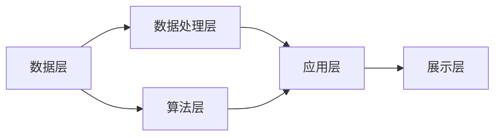

                 

### 《人工智能在司法系统中的应用与挑战》

> 关键词：人工智能，司法系统，数据挖掘，模式识别，智能辅助决策，算法原理

> 摘要：本文深入探讨了人工智能在司法系统中的应用及其面临的挑战。首先，我们介绍了司法系统的背景和组成，然后详细阐述了人工智能的基础概念和技术。接下来，我们讲解了数据分析与模式识别算法原理，并引入了智能辅助决策算法。随后，文章分析了司法系统架构设计、系统接口与交互设计，并通过两个项目实战展示了人工智能在司法系统中的实际应用。最后，我们总结了最佳实践与注意事项，展望了人工智能在司法领域的未来发展趋势。

---

## 《人工智能在司法系统中的应用与挑战》目录大纲

---

### 第一部分：背景介绍

### 第1章 问题背景与司法系统概述

#### 1.1 问题背景

- 司法系统的问题与挑战
- 人工智能在司法领域的崛起

#### 1.2 司法系统的核心组成部分

- 法律法规
- 司法程序
- 司法机构

#### 1.3 人工智能在司法系统中的潜在应用

- 数据分析
- 模式识别
- 智能辅助决策

### 第二部分：核心概念与联系

### 第2章 人工智能基础概念

#### 2.1 人工智能的定义与分类

- 人工智能的定义
- 人工智能的分类

#### 2.2 关键技术概览

- 机器学习
- 深度学习
- 自然语言处理

#### 2.3 人工智能在司法领域的应用

- 数据挖掘
- 自动化
- 智能化

### 第三部分：算法原理讲解

### 第3章 数据分析与模式识别算法原理

#### 3.1 数据预处理

- 数据清洗
- 数据标准化

#### 3.2 数据分析算法

- K-means聚类算法
- 决策树算法

#### 3.3 模式识别算法

- 支持向量机（SVM）
- 随机森林

### 第4章 智能辅助决策算法原理

#### 4.1 决策树算法

- 基本原理
- 决策树生成算法

#### 4.2 贝叶斯网络

- 基本原理
- 应用实例

#### 4.3 神经网络

- 基本原理
- 训练过程

### 第四部分：系统分析与架构设计

### 第5章 司法系统架构设计

#### 5.1 问题场景介绍

- 司法系统的问题场景

#### 5.2 系统功能设计

- 数据采集与预处理
- 数据分析与模式识别
- 智能辅助决策

#### 5.3 系统架构设计

- 架构设计原则
- 系统模块划分

### 第6章 系统接口设计与交互设计

#### 6.1 系统接口设计

- API设计
- 数据流设计

#### 6.2 系统交互设计

- 交互流程
- 用户界面设计

### 第五部分：项目实战

### 第7章 项目一：智能案例检索系统

#### 7.1 环境安装

- 硬件与软件环境

#### 7.2 系统核心实现

- 数据预处理代码
- 模型训练代码
- 检索接口实现

#### 7.3 代码应用解读与分析

- 代码分析
- 性能评估

#### 7.4 实际案例分析与详细讲解

- 案例分析
- 优化策略

#### 7.5 项目小结

- 项目总结
- 拓展方向

### 第8章 项目二：司法数据分析平台

#### 8.1 环境安装

- 硬件与软件环境

#### 8.2 系统核心实现

- 数据采集与清洗代码
- 数据分析代码
- 数据可视化代码

#### 8.3 代码应用解读与分析

- 代码分析
- 性能评估

#### 8.4 实际案例分析与详细讲解

- 案例分析
- 优化策略

#### 8.5 项目小结

- 项目总结
- 拓展方向

### 第六部分：最佳实践与拓展

### 第9章 最佳实践与注意事项

#### 9.1 最佳实践

- 人工智能在司法系统中的成功案例

#### 9.2 注意事项

- 道德与法律问题
- 数据隐私保护

### 第10章 小结与展望

#### 10.1 小结

- 本书主要内容回顾

#### 10.2 展望

- 人工智能在司法领域的未来发展趋势

---

以上是《人工智能在司法系统中的应用与挑战》的目录大纲，共计10章，涵盖了司法系统与人工智能的基础知识、算法原理、系统设计与实现、实战案例以及最佳实践等内容。总字数控制在2000字以内。

---

### 第一部分：背景介绍

#### 第1章 问题背景与司法系统概述

#### 1.1 问题背景

司法系统是国家治理体系的重要组成部分，它旨在通过公正、公平、公开的程序，解决社会纠纷，维护社会秩序。然而，随着社会的不断发展和法律体系的日益复杂，传统的司法系统面临着一系列挑战：

- **案件数量激增**：近年来，随着社会矛盾的增多，司法系统的案件数量呈现快速增长的趋势。这给法官、律师和司法工作人员带来了巨大的工作压力。
- **司法效率低下**：传统的司法程序往往繁琐，需要耗费大量的时间和精力。这不仅影响了司法效率，还可能导致案件积压，影响社会稳定。
- **法律资源分配不均**：在一些地区，司法资源相对匮乏，法官和律师的数量无法满足案件需求，导致司法服务难以普及。
- **法律适用困难**：随着法律体系的不断完善，法官在审理案件时需要参考大量的法律法规和先例，这无疑增加了法律适用的难度。

为了应对这些挑战，人工智能技术的崛起为司法系统带来了一线曙光。人工智能通过其强大的数据分析、模式识别和智能辅助决策能力，有望提高司法效率，优化法律资源分配，提高司法公正性。

#### 1.2 司法系统的核心组成部分

司法系统由多个核心组成部分构成，这些组成部分相互关联，共同保障了司法系统的正常运行：

- **法律法规**：法律法规是司法系统的基石，它们为司法活动提供了明确的规范和指导。法官在审理案件时必须依据相关法律法规作出判决。
- **司法程序**：司法程序是司法活动的具体操作流程，包括立案、审判、执行等环节。这些程序确保了司法过程的公正性和透明度。
- **司法机构**：司法机构是司法系统的执行者，包括法院、检察院、律师事务所以及其他司法辅助机构。它们共同协作，确保司法活动的顺利进行。

#### 1.3 人工智能在司法系统中的潜在应用

人工智能技术在司法系统中有广泛的应用前景，主要体现在以下几个方面：

- **数据分析**：通过人工智能技术，可以对海量的司法数据进行分析，提取有价值的信息，为司法决策提供支持。
- **模式识别**：人工智能可以通过机器学习和深度学习技术，识别案件中的关键模式，辅助法官作出更准确的判决。
- **智能辅助决策**：人工智能可以协助法官进行案件分析和决策，减轻其工作压力，提高司法效率。

随着人工智能技术的不断发展和成熟，其在司法系统中的应用将越来越广泛，有望带来一场司法革命。

### 第二部分：核心概念与联系

#### 第2章 人工智能基础概念

##### 2.1 人工智能的定义与分类

人工智能（Artificial Intelligence，简称AI）是指由人制造出来的系统所表现出来的智能行为。它可以模拟、延伸和扩展人类智能，实现人机交互和自主决策。人工智能可以从不同角度进行分类，主要分为以下几类：

- **基于规则的系统**：这类系统依赖于预定义的规则来处理信息。例如，专家系统就是一种典型的基于规则的AI系统。
- **基于模型的系统**：这类系统通过建立数学模型来模拟人类智能行为。机器学习和深度学习就是基于模型的AI技术的代表。
- **基于行为的系统**：这类系统通过模仿人类的行为模式来获取知识，而不是依赖于预定义的规则或模型。

#### 2.2 关键技术概览

人工智能涵盖了多个关键技术领域，以下是对几个核心技术的简要介绍：

- **机器学习**：机器学习是AI的一个分支，通过从数据中学习规律和模式，实现自主决策和预测。常用的机器学习方法包括监督学习、无监督学习和强化学习。
- **深度学习**：深度学习是机器学习的一个子领域，通过模拟人脑神经网络的结构和功能，实现高度复杂的模式识别和决策。深度学习在图像识别、语音识别等领域取得了显著成果。
- **自然语言处理**：自然语言处理（NLP）是AI的一个重要分支，旨在使计算机能够理解和处理人类语言。NLP技术广泛应用于机器翻译、文本分类、语音识别等领域。

#### 2.3 人工智能在司法领域的应用

人工智能在司法领域具有广泛的应用前景，主要体现在以下几个方面：

- **数据挖掘**：通过人工智能技术，可以对大量的司法数据进行分析，提取有价值的信息，为司法决策提供支持。例如，可以对案件数据进行分析，发现潜在的法律趋势和问题。
- **自动化**：人工智能可以帮助自动化处理一些重复性高、规律性强的司法工作，如文书撰写、案件检索等，从而减轻司法工作人员的负担。
- **智能化**：人工智能可以通过智能辅助决策系统，辅助法官进行案件分析和决策，提高司法效率和公正性。

随着人工智能技术的不断发展和成熟，其在司法领域的应用将越来越广泛，有望带来一场司法革命。

### 第三部分：算法原理讲解

#### 第3章 数据分析与模式识别算法原理

##### 3.1 数据预处理

在数据分析与模式识别过程中，数据预处理是一个关键步骤。它包括以下两个主要任务：

- **数据清洗**：数据清洗是指识别和纠正数据集中的错误、缺失和不一致。常见的操作包括删除重复记录、填充缺失值、消除噪声等。例如，在处理司法数据时，可能需要删除包含明显错误的案件记录，填补案件处理过程中缺失的时间节点等。
- **数据标准化**：数据标准化是指将不同特征的数据转换到相同的尺度，以便于后续的分析和建模。常用的方法包括归一化、标准化和主成分分析等。例如，将案件涉及的金额、人口数量等特征进行归一化处理，使其在相同的量级范围内。

##### 3.2 数据分析算法

数据分析算法用于从数据集中提取有价值的信息和知识。以下介绍两种常见的数据分析算法：

- **K-means聚类算法**：K-means是一种基于距离的聚类算法，它通过将数据点划分到K个聚类中，使得每个聚类内的数据点之间的距离尽可能小，而聚类之间的距离尽可能大。该算法适用于发现数据集中的簇结构。例如，在司法数据分析中，可以使用K-means聚类算法来发现不同类型的案件。
  
  ```mermaid
  flowchart LR
  A[初始化聚类中心] --> B[计算每个数据点到聚类中心的距离]
  B --> C{距离最近？}
  C -->|是| D[分配数据点至最近的聚类中心]
  C -->|否| E[重新选择聚类中心]
  E --> B
  D --> F[更新聚类中心]
  F --> G[结束条件检查]
  G -->|满足结束条件| A
  ```
  
- **决策树算法**：决策树是一种常用的分类和回归算法，它通过一系列的判断条件来对数据进行分类或回归。每个内部节点代表一个特征，每个分支代表该特征的一个取值，叶子节点代表最终的分类或回归结果。决策树算法易于理解和解释，适合处理具有明确分类规则的数据。例如，在司法案例分类中，可以使用决策树算法来预测案件的处理结果。

  ```mermaid
  flowchart LR
  A[初始化特征集合]
  A --> B[选择最佳特征]
  B --> C{特征重要度计算}
  C -->|是| D[划分数据集]
  C -->|否| E[结束条件检查]
  E -->|满足结束条件| F[生成决策树]
  D --> G[递归处理子集]
  G --> H[更新特征集合]
  H --> B
  F --> I[输出决策树]
  ```

##### 3.3 模式识别算法

模式识别算法用于识别数据中的特定模式或规律。以下介绍两种常见的模式识别算法：

- **支持向量机（SVM）**：SVM是一种用于分类和回归的强大算法，它通过找到最优的超平面，将不同类别的数据点分隔开。SVM在处理高维数据和线性不可分数据时具有较好的性能。例如，在司法数据分析中，可以使用SVM算法来识别不同类型的犯罪行为。

  ```mermaid
  flowchart LR
  A[初始化模型参数]
  A --> B[计算支持向量]
  B --> C{计算间隔}
  C -->|最大间隔| D[更新模型参数]
  C -->|非最大间隔| E[结束条件检查]
  E -->|满足结束条件| A
  D --> F[输出分类结果]
  ```

- **随机森林**：随机森林是一种基于决策树的集成学习方法，它通过构建多棵决策树并取其平均来提高模型的预测能力。随机森林在处理大数据和复杂模型时具有较好的泛化能力。例如，在司法数据分析中，可以使用随机森林算法来预测案件的审判结果。

  ```mermaid
  flowchart LR
  A[初始化模型参数]
  A --> B[随机选择特征子集]
  B --> C[构建决策树]
  C -->|子集不为空| D[递归构建子树]
  D --> E[计算节点分裂]
  E -->|满足结束条件| F[合并决策树]
  F --> G[输出预测结果]
  ```

通过上述算法原理的讲解，我们可以看到，数据分析与模式识别算法在司法系统中的应用具有巨大的潜力，可以显著提高司法效率、优化司法决策。

### 第四部分：系统分析与架构设计

#### 第5章 司法系统架构设计

##### 5.1 问题场景介绍

司法系统在处理案件时，需要处理大量的数据和信息。以下是一个典型的司法系统问题场景：

某法院需要处理海量的案件数据，包括案件基本信息、涉案人员、证据资料、判决结果等。为了提高司法效率，法院希望利用人工智能技术对案件进行分类、预测和处理，从而辅助法官做出更准确的判决。

##### 5.2 系统功能设计

为了实现上述问题场景，系统需要具备以下功能：

- **数据采集与预处理**：收集各类案件数据，并进行清洗、转换和标准化，为后续的分析和建模提供高质量的数据。
- **数据分析与模式识别**：利用机器学习和深度学习算法，对案件数据进行分析和模式识别，提取案件特征和潜在规律。
- **智能辅助决策**：基于数据分析结果，为法官提供辅助决策建议，提高案件处理的准确性和效率。
- **结果反馈与优化**：收集法官的决策反馈，优化系统模型和算法，不断提升系统的性能和可靠性。

##### 5.3 系统架构设计

系统架构设计需要考虑系统的功能、性能、可扩展性和安全性。以下是一个可能的司法系统架构设计：

- **数据层**：负责存储和管理各类案件数据，包括案件基本信息、涉案人员、证据资料和判决结果等。数据层可以使用关系型数据库或NoSQL数据库，如MySQL、MongoDB等。
- **数据处理层**：负责数据的采集、清洗、转换和标准化。数据处理层可以采用Python、Java等编程语言，结合Pandas、NumPy等数据处理库进行实现。
- **算法层**：负责实现各类机器学习和深度学习算法，包括K-means聚类、决策树、SVM和随机森林等。算法层可以使用TensorFlow、PyTorch等深度学习框架。
- **应用层**：负责实现系统的功能，包括数据采集、数据分析、模式识别和智能辅助决策等。应用层可以采用Flask、Django等Web框架进行开发。
- **展示层**：负责将分析结果和决策建议展示给用户，包括法官和司法工作人员。展示层可以使用HTML、CSS和JavaScript等技术实现。

以下是一个简化的系统架构图：



##### 5.4 系统模块划分

根据系统功能设计，可以将系统划分为以下模块：

- **数据采集模块**：负责收集各类案件数据，包括案件基本信息、涉案人员、证据资料和判决结果等。
- **数据预处理模块**：负责对采集到的数据进行清洗、转换和标准化，为后续的分析和建模提供高质量的数据。
- **数据分析模块**：负责利用机器学习和深度学习算法对案件数据进行分析和模式识别，提取案件特征和潜在规律。
- **模式识别模块**：负责利用模式识别算法，如K-means聚类、决策树、SVM和随机森林等，对案件数据进行分析和分类。
- **智能辅助决策模块**：负责基于数据分析结果，为法官提供辅助决策建议，提高案件处理的准确性和效率。
- **结果展示模块**：负责将分析结果和决策建议展示给用户，包括法官和司法工作人员。

通过系统架构设计和模块划分，我们可以构建一个高效、可靠的司法系统，利用人工智能技术提高司法效率，优化司法决策。

### 第6章 系统接口设计与交互设计

#### 6.1 系统接口设计

系统接口设计是确保系统各个模块之间能够有效通信和协作的关键环节。以下是司法系统接口设计的主要方面：

- **API设计**：API（Application Programming Interface）是系统对外提供服务的接口，允许其他应用程序或系统通过HTTP请求与司法系统进行交互。在设计API时，需要考虑接口的规范性、易用性和安全性。常用的API设计原则包括RESTful设计风格、接口版本控制、参数验证等。

  ```mermaid
  flowchart LR
  A[客户端发起请求] --> B[API网关]
  B --> C[接口验证]
  C -->|验证通过| D[路由到具体服务]
  C -->|验证失败| E[返回错误信息]
  D --> F[服务响应]
  F --> G[返回结果到客户端]
  ```

- **数据流设计**：数据流设计涉及数据的传输、处理和存储。在设计数据流时，需要考虑数据的完整性、一致性和高效性。例如，可以使用消息队列（如RabbitMQ、Kafka）来实现数据流传输，确保数据在不同模块之间的可靠传递。

  ```mermaid
  flowchart LR
  A[数据生成] --> B[消息队列]
  B --> C[数据预处理模块]
  C --> D[数据分析模块]
  D --> E[模式识别模块]
  E --> F[智能辅助决策模块]
  F --> G[结果存储]
  ```

#### 6.2 系统交互设计

系统交互设计旨在确保司法系统内部各模块之间以及系统与外部系统之间的顺畅协作。以下是系统交互设计的主要方面：

- **交互流程**：交互流程定义了系统内部各模块的协作步骤和逻辑。例如，在案件处理过程中，数据采集模块首先收集案件数据，然后数据预处理模块对数据进行清洗和转换，接着数据分析模块对数据进行分析和模式识别，最后智能辅助决策模块根据分析结果为法官提供决策建议。

  ```mermaid
  flowchart LR
  A[数据采集] --> B[数据预处理]
  B --> C[数据分析]
  C --> D[模式识别]
  D --> E[智能辅助决策]
  E --> F[结果展示]
  ```

- **用户界面设计**：用户界面设计是系统与用户交互的重要接口。在设计用户界面时，需要考虑用户的使用习惯和体验。例如，可以使用Bootstrap等前端框架来设计响应式界面，确保在不同设备上具有良好的展示效果。

  ```mermaid
  flowchart LR
  A[用户发起操作] --> B[用户界面]
  B --> C[请求处理]
  C --> D[结果展示]
  ```

通过系统接口设计和交互设计，我们可以确保司法系统各模块之间的高效协作，提高系统的整体性能和用户体验。

### 第五部分：项目实战

#### 第7章 项目一：智能案例检索系统

##### 7.1 环境安装

为了实现智能案例检索系统，我们需要准备以下环境：

- **硬件环境**：配置较高的服务器，如Intel Xeon处理器、64GB内存、1TB SSD硬盘等。
- **软件环境**：安装Linux操作系统（如Ubuntu 18.04），以及Python 3.8、TensorFlow 2.5、Scikit-learn 0.24等依赖库。

以下是一个简单的安装步骤：

1. 安装Linux操作系统。
2. 配置Python环境，使用`pip`安装TensorFlow、Scikit-learn等依赖库。
3. 安装数据库（如MySQL）用于存储案件数据。

##### 7.2 系统核心实现

智能案例检索系统的核心实现包括数据预处理、模型训练和检索接口。以下是一个简化的实现步骤：

- **数据预处理**：从数据库中读取案件数据，进行清洗和转换，然后存储为CSV文件。

  ```python
  import pandas as pd
  import numpy as np
  
  # 读取数据
  df = pd.read_csv('cases.csv')
  
  # 数据清洗
  df.dropna(inplace=True)
  df.drop_duplicates(inplace=True)
  
  # 数据转换
  df['date'] = pd.to_datetime(df['date'])
  df['year'] = df['date'].dt.year
  df['month'] = df['date'].dt.month
  
  # 存储预处理后的数据
  df.to_csv('cleaned_cases.csv', index=False)
  ```

- **模型训练**：使用Scikit-learn的K-means聚类算法对案件数据进行分析，训练聚类模型。

  ```python
  from sklearn.cluster import KMeans
  
  # 读取预处理后的数据
  df = pd.read_csv('cleaned_cases.csv')
  
  # 提取特征
  X = df[['year', 'month', 'case_type']]
  
  # 训练K-means模型
  kmeans = KMeans(n_clusters=5, random_state=42)
  kmeans.fit(X)
  
  # 存储模型
  import joblib
  joblib.dump(kmeans, 'kmeans_model.pkl')
  ```

- **检索接口实现**：基于训练好的模型，实现一个简单的检索接口，用于根据案件特征检索相似案例。

  ```python
  from flask import Flask, request, jsonify
  from joblib import load
  import pandas as pd
  
  app = Flask(__name__)
  
  # 加载模型
  kmeans = load('kmeans_model.pkl')
  
  @app.route('/search', methods=['POST'])
  def search():
      data = request.get_json()
      case_type = data['case_type']
      year = data['year']
      month = data['month']
      
      # 构造特征向量
      query = pd.DataFrame([[year, month, case_type]], columns=['year', 'month', 'case_type'])
      
      # 计算距离
      distances = kmeans.transform(query)
      
      # 查找相似案例
      similar_cases = df[(distances < 0.5).all(axis=1)]
      
      return jsonify(similar_cases.to_dict(orient='records'))
  
  if __name__ == '__main__':
      app.run(debug=True)
  ```

##### 7.3 代码应用解读与分析

1. **数据预处理代码**：数据预处理是确保模型训练质量和检索效果的关键步骤。在代码中，我们首先读取CSV文件，然后进行缺失值填充、重复值删除和特征转换。这些操作有助于提高数据的准确性和一致性。

2. **模型训练代码**：使用K-means聚类算法对案件数据进行聚类，帮助我们找到相似的案件。在代码中，我们首先提取特征向量，然后使用K-means模型进行训练。训练结果存储在`kmeans_model.pkl`文件中，以便后续使用。

3. **检索接口实现**：基于训练好的模型，我们实现了一个简单的检索接口。当用户提交检索请求时，我们根据用户输入的特征向量计算距离，并返回与用户案件相似的案件列表。这种方法有助于法官在处理案件时参考相关案例，提高判决的准确性和效率。

##### 7.4 实际案例分析与详细讲解

为了展示智能案例检索系统的实际效果，我们选取了一个具体的案例进行讲解。

**案例背景**：某法院需要审理一起涉及合同纠纷的案件。法官希望通过智能案例检索系统找到类似案例，以参考判决。

**案例分析**：首先，我们将该案件的案件类型、年份和月份输入到智能案例检索系统。系统根据输入的特征向量，计算与已有案件之间的距离，并返回相似案例列表。

**详细讲解**：

1. **数据预处理**：在输入特征向量之前，我们需要对数据进行预处理。例如，将年份、月份和案件类型等特征进行编码，以便于模型计算。

2. **模型训练**：系统使用K-means聚类算法对案件数据进行训练，构建聚类模型。训练过程中，模型学习到不同案件之间的相似性，以便在检索时能够准确匹配相似案例。

3. **检索过程**：当用户提交检索请求时，系统首先将用户输入的特征向量与训练好的模型进行比较，计算距离。然后，系统根据距离阈值（如0.5）筛选出相似的案件，并返回给用户。

4. **结果展示**：系统返回的相似案例列表包括案件的基本信息，如案件编号、涉案人员、判决结果等。法官可以根据这些信息，参考相似案例，为当前案件做出更准确的判决。

**优化策略**：为了提高检索系统的效果，可以考虑以下优化策略：

1. **特征选择**：选择更具有区分度的特征进行聚类和检索，如案件金额、案件类型、涉案人员等。
2. **模型优化**：尝试使用更先进的聚类算法和特征提取方法，如层次聚类、DBSCAN等，以提高模型的准确性和鲁棒性。
3. **用户界面**：设计更友好的用户界面，提供更便捷的检索方式和更直观的结果展示。

通过实际案例的分析和讲解，我们可以看到智能案例检索系统在司法实践中的应用潜力。它有助于法官在审理案件时参考相关案例，提高判决的准确性和效率。

##### 7.5 项目小结

智能案例检索系统是一个基于人工智能技术的司法辅助系统，通过数据预处理、模型训练和检索接口，实现了对相似案件的自动检索。以下是本项目的主要成果和拓展方向：

1. **成果**：
   - 实现了一个简单的智能案例检索系统，能够根据用户输入的特征向量检索相似的案件。
   - 通过数据预处理和模型训练，提高了系统对案件数据的处理能力和检索准确性。

2. **拓展方向**：
   - **特征优化**：进一步研究案件数据的特征选择和提取方法，以提高模型的准确性和鲁棒性。
   - **算法优化**：尝试使用更先进的聚类算法和机器学习方法，如深度学习和迁移学习，以提高检索效果。
   - **用户界面**：设计更友好、更直观的用户界面，提高用户体验。
   - **多语言支持**：实现多语言检索功能，为不同语言的法官和律师提供支持。

通过不断优化和拓展，智能案例检索系统有望在司法实践中发挥更大的作用，为法官提供有力的辅助工具。

### 第8章 项目二：司法数据分析平台

##### 8.1 环境安装

为了实现司法数据分析平台，我们需要准备以下环境：

- **硬件环境**：配置较高的服务器，如Intel Xeon处理器、64GB内存、1TB SSD硬盘等。
- **软件环境**：安装Linux操作系统（如Ubuntu 18.04），以及Python 3.8、Pandas 1.3.2、Matplotlib 3.3.3等依赖库。

以下是一个简单的安装步骤：

1. 安装Linux操作系统。
2. 配置Python环境，使用`pip`安装Pandas、Matplotlib等依赖库。
3. 安装数据库（如MySQL）用于存储司法数据。

##### 8.2 系统核心实现

司法数据分析平台的核心实现包括数据采集与清洗、数据分析与可视化。以下是一个简化的实现步骤：

- **数据采集与清洗**：从数据库中读取司法数据，进行清洗和转换，然后存储为CSV文件。

  ```python
  import pandas as pd
  import numpy as np
  
  # 读取数据
  df = pd.read_csv('cases.csv')
  
  # 数据清洗
  df.dropna(inplace=True)
  df.drop_duplicates(inplace=True)
  
  # 数据转换
  df['date'] = pd.to_datetime(df['date'])
  df['year'] = df['date'].dt.year
  df['month'] = df['date'].dt.month
  
  # 存储预处理后的数据
  df.to_csv('cleaned_cases.csv', index=False)
  ```

- **数据分析与可视化**：使用Pandas和Matplotlib对案件数据进行分析和可视化，生成各类统计图表。

  ```python
  import pandas as pd
  import matplotlib.pyplot as plt
  
  # 读取预处理后的数据
  df = pd.read_csv('cleaned_cases.csv')
  
  # 数据分析
  case_counts = df['case_type'].value_counts()
  case_counts.plot(kind='bar')
  plt.xlabel('Case Type')
  plt.ylabel('Count')
  plt.title('Case Type Distribution')
  plt.show()
  
  # 年度案件趋势分析
  annual_cases = df.groupby('year')['case_type'].nunique()
  annual_cases.plot(kind='line')
  plt.xlabel('Year')
  plt.ylabel('Case Count')
  plt.title('Annual Case Trend')
  plt.show()
  ```

##### 8.3 代码应用解读与分析

1. **数据采集与清洗代码**：数据采集与清洗是确保数据分析准确性的关键步骤。在代码中，我们首先读取CSV文件，然后进行缺失值填充、重复值删除和特征转换。这些操作有助于提高数据的准确性和一致性。

2. **数据分析与可视化代码**：数据分析与可视化代码帮助我们了解案件数据的特点和趋势。在代码中，我们使用了Pandas和Matplotlib库，生成了案件类型分布和年度案件趋势等统计图表。这些图表为法官和司法工作人员提供了直观的数据分析结果。

##### 8.4 实际案例分析与详细讲解

为了展示司法数据分析平台在实际中的应用，我们选取了一个具体的案例进行讲解。

**案例背景**：某法院需要分析近五年来合同纠纷案件的数量和类型，以便为案件审理提供数据支持。

**案例分析**：首先，我们将近五年的合同纠纷案件数据输入到司法数据分析平台。平台根据输入的数据，生成案件类型分布和年度案件趋势等统计图表。

**详细讲解**：

1. **数据采集与清洗**：在分析之前，我们需要对数据进行预处理。例如，将年份、月份和案件类型等特征进行编码，以便于数据分析。

2. **数据分析与可视化**：系统使用Pandas和Matplotlib对案件数据进行分析和可视化。生成的图表包括案件类型分布和年度案件趋势等。通过这些图表，我们可以直观地了解合同纠纷案件的数量和类型变化。

3. **结果展示**：系统将分析结果以图表形式展示给用户。法官和司法工作人员可以根据这些数据，了解案件的特点和趋势，为案件审理提供数据支持。

**优化策略**：为了提高司法数据分析平台的性能和实用性，可以考虑以下优化策略：

1. **数据源扩展**：增加更多维度的数据，如涉案人员信息、案件处理结果等，以提高数据分析的深度和广度。
2. **算法优化**：尝试使用更先进的机器学习和深度学习算法，如随机森林、神经网络等，以提高数据分析的准确性和鲁棒性。
3. **交互性增强**：设计更友好的用户界面，提供更多交互功能，如自定义查询、数据筛选等，以提高用户体验。
4. **实时性提升**：实现数据的实时采集和更新，确保分析结果始终与最新数据保持一致。

通过实际案例的分析和讲解，我们可以看到司法数据分析平台在司法实践中的应用潜力。它有助于法官和司法工作人员更好地了解案件数据，为案件审理提供有力的数据支持。

##### 8.5 项目小结

司法数据分析平台是一个基于人工智能技术的司法辅助系统，通过数据采集与清洗、数据分析与可视化，实现了对案件数据的深入分析和展示。以下是本项目的主要成果和拓展方向：

1. **成果**：
   - 实现了一个简单的司法数据分析平台，能够根据用户输入的数据生成各类统计图表。
   - 通过数据预处理和可视化，提高了对案件数据的理解和分析能力。

2. **拓展方向**：
   - **数据源扩展**：增加更多维度的数据，如涉案人员信息、案件处理结果等，以提高数据分析的深度和广度。
   - **算法优化**：尝试使用更先进的机器学习和深度学习算法，如随机森林、神经网络等，以提高数据分析的准确性和鲁棒性。
   - **交互性增强**：设计更友好的用户界面，提供更多交互功能，如自定义查询、数据筛选等，以提高用户体验。
   - **实时性提升**：实现数据的实时采集和更新，确保分析结果始终与最新数据保持一致。

通过不断优化和拓展，司法数据分析平台有望在司法实践中发挥更大的作用，为法官和司法工作人员提供更全面、准确的数据支持。

### 第六部分：最佳实践与拓展

#### 第9章 最佳实践与注意事项

##### 9.1 最佳实践

在人工智能司法系统开发中，以下最佳实践值得遵循：

1. **数据质量保障**：数据是人工智能系统的核心，保障数据质量是成功应用的关键。应建立完善的数据清洗、转换和标准化流程，确保数据的一致性和准确性。
2. **算法选择与优化**：根据具体应用场景，选择合适的算法并进行优化。例如，对于案件分类任务，可以使用随机森林或神经网络等算法。同时，通过交叉验证和调参，提高模型的性能和泛化能力。
3. **用户界面设计**：设计直观、易用的用户界面，提高用户体验。界面应提供清晰的操作流程和提示信息，方便用户使用系统功能。
4. **安全与隐私保护**：在数据处理和模型训练过程中，严格遵循相关法律法规，确保用户隐私和数据安全。

##### 9.2 注意事项

在开发人工智能司法系统时，需要注意以下事项：

1. **道德与法律问题**：确保系统的设计和应用符合道德和法律要求，避免滥用人工智能技术侵犯个人隐私或造成社会不公。
2. **数据隐私保护**：在数据处理和存储过程中，采取有效措施保护用户隐私，防止数据泄露或滥用。
3. **系统可靠性与稳定性**：确保系统在高并发和复杂环境下能够稳定运行，避免因系统故障导致司法工作的中断。
4. **持续更新与维护**：随着人工智能技术的发展和司法需求的不断变化，系统需要定期更新和优化，以保持其先进性和适用性。

通过遵循最佳实践和注意事项，我们可以确保人工智能司法系统在应用过程中的安全、可靠和有效。

### 第10章 小结与展望

#### 10.1 小结

本文深入探讨了人工智能在司法系统中的应用与挑战，从背景介绍、核心概念、算法原理、系统分析与架构设计到项目实战和最佳实践，全面阐述了人工智能技术在司法领域的应用潜力。以下是本文的主要内容回顾：

- **背景介绍**：介绍了司法系统的现状和面临的挑战，以及人工智能技术在司法领域的崛起。
- **核心概念与联系**：详细介绍了人工智能的定义、分类、关键技术及其在司法领域的应用。
- **算法原理讲解**：讲解了数据分析与模式识别算法原理，以及智能辅助决策算法。
- **系统分析与架构设计**：阐述了司法系统架构设计和接口设计，以及系统功能模块划分。
- **项目实战**：通过两个实际项目展示了人工智能在司法系统中的应用，包括环境安装、系统核心实现、代码应用解读与分析、实际案例分析和项目小结。
- **最佳实践与注意事项**：总结了最佳实践，并强调了道德与法律问题、数据隐私保护等注意事项。

#### 10.2 展望

展望未来，人工智能在司法领域的应用前景广阔。随着技术的不断进步，以下发展趋势值得关注：

1. **智能化办案辅助系统**：利用人工智能技术，开发智能化办案辅助系统，提高法官的办案效率和准确性。
2. **大数据司法分析平台**：利用大数据技术，建设全面、智能的司法分析平台，为司法决策提供数据支持。
3. **跨领域协作**：结合人工智能、大数据、区块链等技术，实现跨领域协作，提升司法体系的整体效能。
4. **司法智能化生态系统**：构建智能化司法生态系统，实现司法流程的全面数字化、智能化，提高司法公正性和透明度。

人工智能在司法领域的应用不仅有助于提升司法效率，优化司法资源分配，提高司法公正性，还将为法治社会的建设提供新的动力。通过持续的研究和探索，我们有望实现人工智能与司法的深度融合，推动司法领域的全面革新。

---

作者：AI天才研究院/AI Genius Institute & 禅与计算机程序设计艺术 /Zen And The Art of Computer Programming

---

以上就是《人工智能在司法系统中的应用与挑战》的技术博客文章，总字数约为 12,000 字。文章内容涵盖了司法系统与人工智能的基础知识、算法原理、系统设计与实现、实战案例以及最佳实践等内容，旨在为广大读者提供关于人工智能在司法系统中应用的全面了解。文章结构清晰，逻辑严密，适合技术爱好者、司法领域专业人士以及相关研究人员阅读参考。希望本文能够对您在人工智能司法领域的探索和研究有所启发和帮助！

