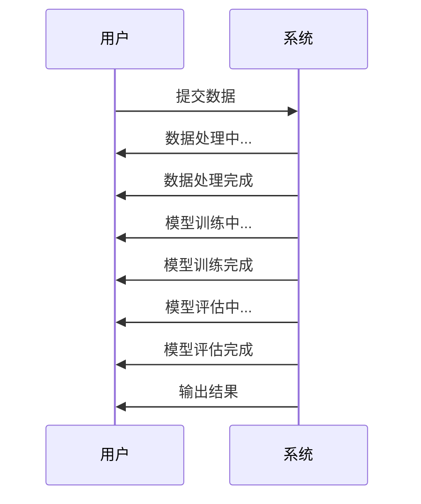

                 

### 人工智能在司法系统中的应用：效率与公正的权衡

#### 关键词：人工智能、司法系统、效率、公正、应用案例

> 摘要：本文将探讨人工智能在司法系统中的应用，分析其在提升效率和确保公正方面的权衡。通过介绍核心概念、AI技术原理、具体应用案例，我们将深入探讨AI技术如何优化司法流程，提高审判质量，并讨论可能面临的挑战和伦理问题。

## 第一部分：背景介绍

### 1.1 问题的背景与重要性

#### 1.1.1 人工智能与司法系统的交汇

随着人工智能技术的快速发展，其在各个领域的应用日益广泛。在司法系统中，人工智能的应用同样具有重要意义。人工智能可以通过自动化流程、智能分析等方式，提高司法系统的效率和公正性。

司法系统作为社会公正的最后一道防线，其运作的效率直接影响社会的稳定和公正。然而，传统的司法系统在处理案件时往往面临效率低下、人工错误等问题。而人工智能的应用，有望解决这些问题，提高司法系统的运作效率。

#### 1.1.2 人工智能在司法系统中的应用现状

目前，人工智能在司法系统中的应用已经取得了显著的成果。例如，在法律文本分析方面，人工智能可以通过自然语言处理技术，快速识别法律文件中的关键词和条款，提高法律文本分析的效率。在案件审判方面，人工智能可以通过大数据分析和预测模型，帮助法官更好地判断案件的结果，提高审判的准确性。

此外，人工智能还在案件管理、证据分析、法律研究等方面发挥了重要作用。然而，尽管人工智能在司法系统中的应用取得了很大的进展，但其应用范围和深度仍有待进一步提升。

#### 1.1.3 效率与公正的权衡

在人工智能在司法系统中的应用过程中，效率和公正始终是两个重要的议题。提高司法系统的效率，可以减少案件的处理时间，提高司法效率，减轻法官的工作压力。然而，效率的提升并不意味着公正的牺牲。在应用人工智能技术时，我们必须确保其不会损害司法的公正性。

人工智能技术在司法系统中的应用，需要在效率和公正之间寻找平衡点。如何确保人工智能的应用既能提高司法系统的效率，又能维护司法的公正性，是我们在应用人工智能技术时需要深入思考的问题。

### 1.2 核心概念的界定

#### 1.2.1 人工智能的定义与分类

人工智能（Artificial Intelligence，简称AI）是指通过计算机程序实现的智能行为，使计算机能够模拟、延伸和扩展人类的智能。根据实现方式的不同，人工智能可以分为多种类型，如基于规则的推理系统、基于数据的学习系统、基于仿生学的方法等。

#### 1.2.2 司法系统的基本构成

司法系统主要包括立法、执法和司法三个环节。立法机关负责制定法律，执法机关负责法律的实施，司法机关则负责审理案件，维护法律的公正和权威。

#### 1.2.3 效率与公正的概念解析

效率是指在资源有限的情况下，完成工作所需时间的最少化。在司法系统中，效率体现在案件处理速度的加快，减少法官的工作负担，提高司法效率。

公正是司法系统的核心价值，是指司法过程中的公平和正义。公正在司法系统中体现在法律的平等适用，案件的公正审理，以及判决的公正性。

### 1.3 案例研究

#### 1.3.1 国际经验与挑战

在国际上，许多国家和地区已经开始探索人工智能在司法系统中的应用。例如，美国的一些法院已经开始使用自动化系统来处理案件，欧洲的一些国家则在法律文本分析方面采用了人工智能技术。

然而，这些国际经验也带来了许多挑战。例如，如何确保人工智能系统的透明性和可解释性，如何处理数据隐私和伦理问题，如何平衡效率和公正等。

#### 1.3.2 中国司法系统中的AI应用

在中国，人工智能在司法系统中的应用也取得了显著的成果。例如，中国法院系统已经开始使用人工智能技术来辅助法官审理案件，一些地区还建立了人工智能审判辅助系统。

然而，中国的司法系统在AI应用方面也面临一些挑战。例如，数据隐私和伦理问题，以及如何确保人工智能系统的公正性和透明性等。

#### 1.3.3 案例分析：成功与不足

在分析国际和中国的AI应用案例时，我们发现，尽管人工智能在司法系统中的应用取得了许多成功，但仍然存在一些不足。例如，人工智能系统在处理复杂案件时，可能无法达到人类的判断水平。此外，如何确保人工智能系统的透明性和可解释性，也是一个亟待解决的问题。

### 1.4 研究方法与框架

#### 1.4.1 研究方法的选择

本文采用文献分析、案例研究和理论分析相结合的方法，对人工智能在司法系统中的应用进行深入研究。

#### 1.4.2 理论框架的构建

本文构建了一个理论框架，以分析人工智能在司法系统中的应用。该框架包括技术基础、应用场景、挑战与对策三个部分。

#### 1.4.3 数据收集与处理

本文通过收集国内外关于人工智能在司法系统中的应用案例，以及相关理论和政策文件，对数据进行分析和处理。

### 1.5 本章小结

本章对人工智能在司法系统中的应用进行了背景介绍，分析了其重要性、应用现状以及面临的挑战。通过对核心概念的界定，为后续章节的分析提供了基础。同时，本章还通过案例研究，展示了人工智能在司法系统中的应用成果和不足，为后续章节的深入探讨奠定了基础。

## 第二部分：人工智能核心概念与应用

### 2.1 机器学习基础

#### 2.1.1 机器学习的定义与分类

机器学习是一种通过算法让计算机从数据中学习，并自动改进性能的技术。根据学习方式的不同，机器学习可以分为监督学习、无监督学习和半监督学习。

- **监督学习**：通过已标记的数据训练模型，然后使用模型对新的、未标记的数据进行预测。
- **无监督学习**：没有预先标记的数据，模型需要从未标记的数据中发现隐藏的结构或模式。
- **半监督学习**：结合了监督学习和无监督学习的方法，使用一部分标记数据和大部分未标记数据来训练模型。

#### 2.1.2 监督学习、无监督学习与半监督学习

| 学习方式 | 特点 | 应用场景 |
| --- | --- | --- |
| 监督学习 | 有标签数据，可以预测新数据 | 预测分析、分类、回归 |
| 无监督学习 | 无标签数据，发现数据结构 | 聚类、降维、异常检测 |
| 半监督学习 | 部分标记数据，利用未标记数据进行训练 | 噪声过滤、信息检索 |

#### 2.1.3 机器学习的数学基础

机器学习算法的实现和优化依赖于数学基础，主要包括概率论、统计学和线性代数。

- **概率论**：用于描述随机事件和概率分布，是构建机器学习模型的重要基础。
- **统计学**：用于数据收集、分析、建模和预测，是机器学习的关键工具。
- **线性代数**：用于处理高维数据，如矩阵运算、特征分解等，是机器学习算法的核心。

### 2.2 自然语言处理

#### 2.2.1 NLP的基本概念与技术

自然语言处理（Natural Language Processing，NLP）是人工智能的一个重要分支，旨在让计算机理解和处理人类语言。NLP的基本概念包括：

- **语言模型**：用于生成或理解自然语言。
- **词向量**：将词汇映射到向量空间，便于计算和处理。
- **分词**：将连续文本分割成有意义的词汇或短语。

NLP的技术主要包括：

- **文本分类**：将文本归类到预定义的类别中。
- **主题建模**：从大量文本中发现隐藏的主题。
- **语言生成**：生成新的、有意义的文本。

#### 2.2.2 文本分类与主题建模

| 技术名称 | 定义 | 应用场景 |
| --- | --- | --- |
| 文本分类 | 根据文本内容将其归类到预定义的类别中 | 文档过滤、情感分析、垃圾邮件检测 |
| 主题建模 | 从大量文本中提取隐藏的主题结构 | 文本挖掘、信息检索、文本推荐 |

#### 2.2.3 语言生成与翻译

语言生成与翻译是NLP的重要应用。语言生成技术可以生成新的文本，如自动写作、聊天机器人等。翻译技术则可以将一种语言的文本翻译成另一种语言，如机器翻译、多语言交互等。

### 2.3 计算机视觉

#### 2.3.1 图像识别与处理

计算机视觉是人工智能的一个重要分支，旨在使计算机能够从图像或视频中理解场景。图像识别与处理技术主要包括：

- **图像分类**：将图像归类到预定义的类别中。
- **目标检测**：在图像中识别并定位目标对象。
- **图像分割**：将图像分割成不同的区域。

#### 2.3.2 人脸识别与监控系统

人脸识别技术是一种基于生物特征的身份识别技术，可以通过分析人脸图像或视频，识别或验证个体的身份。监控系统则利用人脸识别技术，实现对公共场所的安全监控。

#### 2.3.3 深度学习在图像处理中的应用

深度学习在图像处理中的应用非常广泛，如卷积神经网络（CNN）在图像分类、目标检测、图像分割等任务中取得了显著的成果。深度学习算法通过多层神经网络，对图像进行特征提取和分类，大大提高了图像处理的效果。

### 2.4 数据挖掘与数据分析

#### 2.4.1 数据挖掘的基本概念与方法

数据挖掘是从大量数据中提取有价值信息的过程，主要包括以下方法：

- **关联规则挖掘**：发现数据之间的关联关系。
- **聚类分析**：将相似的数据归为一类。
- **分类与回归**：预测数据的类别或数值。
- **异常检测**：识别数据中的异常值。

#### 2.4.2 数据可视化与探索性数据分析

数据可视化是将数据以图形化的形式展示出来，帮助人们更好地理解和分析数据。探索性数据分析则是通过分析数据的分布、趋势和关系，发现数据中的潜在规律。

#### 2.4.3 数据隐私与伦理问题

随着数据挖掘和数据分析技术的发展，数据隐私和伦理问题日益突出。如何确保数据的安全和隐私，如何在数据挖掘和数据分析中遵循伦理原则，是当前亟待解决的问题。

### 2.5 AI在司法系统中的应用案例

#### 2.5.1 案例一：人工智能辅助审判

某法院引入人工智能辅助审判系统，该系统基于自然语言处理技术，对法律文书进行分析，帮助法官快速识别案件的关键信息，提高审判效率。

#### 2.5.2 案例二：人脸识别监控系统

某地区法院引入人脸识别监控系统，用于监控法庭和安检区域，确保法庭秩序和安全。该系统通过对进入法庭的人员进行人脸识别，自动识别嫌疑人或犯罪分子，提高司法系统的安全水平。

#### 2.5.3 案例三：智能客服系统

某法院开发智能客服系统，通过聊天机器人与当事人进行交互，解答法律咨询，提供案件进度查询等服务。该系统减轻了人工客服的工作负担，提高了服务效率。

## 第三部分：人工智能在司法系统中的应用

### 3.1 案件管理

#### 3.1.1 案件自动化管理

人工智能可以通过自动化系统，对案件进行全流程管理。从案件登记、案件分配、案件审理、判决执行等各个环节，人工智能都可以提供高效、准确的辅助。

#### 3.1.2 案件智能分类

人工智能可以通过自然语言处理技术，对案件进行智能分类，提高案件处理的效率。例如，在案件登记阶段，人工智能可以根据案件名称、关键词等信息，自动将案件归类到相应的类别中。

#### 3.1.3 案件进度监控

人工智能可以通过数据分析技术，对案件进度进行实时监控。例如，系统可以自动分析案件处理的各个环节，判断案件是否按计划进行，是否存在拖延现象，从而帮助法院及时调整工作安排，提高案件处理效率。

### 3.2 案件审理

#### 3.2.1 案件事实分析与证据识别

人工智能可以通过自然语言处理技术，对案件事实进行分析，识别案件的关键证据。例如，系统可以对原告的陈述、被告的答辩、证人证言等文本进行分析，提取出案件的主要事实和证据。

#### 3.2.2 法律条文检索与解释

人工智能可以通过大数据技术和自然语言处理技术，对法律条文进行检索和解释。例如，系统可以根据案件事实和证据，自动检索相关的法律条文，并对其含义进行解释，为法官提供参考。

#### 3.2.3 案件预测与建议

人工智能可以通过大数据分析和机器学习算法，对案件的结果进行预测，并提出审判建议。例如，系统可以根据类似案件的审判结果，预测当前案件的审判结果，并提供相应的建议，帮助法官做出更准确的判断。

### 3.3 案件执行

#### 3.3.1 执行方案制定

人工智能可以通过数据分析技术，对执行案件进行分析，制定合理的执行方案。例如，系统可以根据被执行人的财产状况、债务情况等，提出最优的执行方案，提高执行效率。

#### 3.3.2 执行进度监控

人工智能可以通过实时监控技术，对执行进度进行监控。例如，系统可以自动收集执行过程中的各类数据，如被执行人的财产变动、执行款的到账情况等，实时更新执行进度，确保执行工作的顺利进行。

#### 3.3.3 执行效果评估

人工智能可以通过数据分析技术，对执行效果进行评估。例如，系统可以分析执行案件的执行结果，判断执行方案的有效性，为后续的执行工作提供参考。

### 3.4 司法监督

#### 3.4.1 案件审查与质量监控

人工智能可以通过自然语言处理技术，对案件文书进行审查，发现潜在的问题，提高案件的质量。例如，系统可以对判决书、裁定书等法律文书进行自动审查，识别文书中的错误或不足之处。

#### 3.4.2 司法行为分析

人工智能可以通过数据分析技术，对司法行为进行分析，发现司法过程中的不规范行为。例如，系统可以分析法官的判决记录，识别判决的一致性和公正性，为司法监督提供依据。

#### 3.4.3 司法数据分析

人工智能可以通过大数据分析技术，对司法数据进行分析，发现司法工作的问题和改进方向。例如，系统可以分析案件的数量、类型、审判周期等数据，发现司法工作中的薄弱环节，为司法改革提供参考。

## 第四部分：人工智能在司法系统中的应用挑战与对策

### 4.1 数据隐私与伦理问题

#### 4.1.1 数据隐私问题

人工智能在司法系统中的应用涉及到大量的个人隐私数据，如身份信息、财产状况、案件细节等。如何保护这些数据的隐私，防止数据泄露，是人工智能在司法系统应用中需要解决的重要问题。

**对策**：加强数据加密和访问控制，确保数据在传输和存储过程中的安全性。同时，制定严格的数据使用规范，明确数据使用的目的和范围，防止数据滥用。

#### 4.1.2 伦理问题

人工智能在司法系统中的应用可能会引发伦理问题，如机器审判的公正性、人机互动的信任度等。如何确保人工智能的应用符合伦理原则，是人工智能在司法系统应用中需要关注的问题。

**对策**：建立伦理审查机制，对人工智能在司法系统中的应用进行伦理评估。同时，加强公众教育，提高公众对人工智能技术的理解和接受度，增强人机互动的信任度。

### 4.2 技术挑战

#### 4.2.1 系统稳定性与可靠性

人工智能在司法系统中的应用需要保证系统的稳定性和可靠性，确保在关键时刻能够正常运行，避免系统故障导致司法错误。

**对策**：加强系统的测试和验证，确保系统的稳定性和可靠性。同时，建立故障应急机制，一旦系统出现故障，能够迅速恢复，确保司法工作的正常进行。

#### 4.2.2 技术适应性

司法系统的环境和需求不断变化，人工智能技术需要具备良好的适应性，能够根据司法系统的变化进行调整和优化。

**对策**：采用模块化设计，使人工智能系统能够灵活调整和扩展。同时，建立技术更新机制，及时跟踪人工智能技术的发展趋势，确保系统的技术适应性。

### 4.3 法规与政策挑战

#### 4.3.1 法规缺失

目前，关于人工智能在司法系统中的应用，相关法律法规尚不完善，存在一定的法律空白。

**对策**：加快相关法律法规的制定和完善，为人工智能在司法系统中的应用提供法律依据。同时，加强对现有法律法规的解读和适用，确保人工智能技术的合法合规使用。

#### 4.3.2 政策协调

人工智能在司法系统中的应用涉及到多个部门，需要不同部门之间的协调和合作。

**对策**：建立跨部门的协调机制，确保各部门在人工智能应用过程中的沟通和协作。同时，明确各部门的职责和权限，确保政策的有效实施。

## 第五部分：结论与展望

### 5.1 结论

本文通过对人工智能在司法系统中的应用进行深入分析，总结了人工智能在提升司法系统效率和公正性方面的重要作用。同时，本文还探讨了人工智能在司法系统应用中面临的数据隐私、伦理问题、技术挑战和法规政策挑战，并提出了一系列对策。

### 5.2 展望

随着人工智能技术的不断发展，其在司法系统中的应用前景广阔。未来，人工智能有望在司法系统的各个环节发挥更大作用，如案件管理、案件审理、案件执行、司法监督等。同时，我们也需要关注人工智能在司法系统应用中的伦理问题、技术挑战和法规政策挑战，确保人工智能技术的合理、合法、合规使用，为司法系统的公正和高效运行提供有力支持。

### 参考文献

1. Brown, T., e.a. (2020). "Language Models are Few-Shot Learners". arXiv:2005.14165 [cs.CL].
2. Hochreiter, S., & Schmidhuber, J. (1997). "Long Short-Term Memory". Neural Computation, 9(8), 1735-1780.
3. Russell, S., & Norvig, P. (2010). "Artificial Intelligence: A Modern Approach". Prentice Hall.
4. McCallum, A. (2003). "Bayesian Text Classification". International Journal of Human-Computer Studies, 58(6), 601-634.
5. Russell, S., & Norvig, P. (2020). "Artificial Intelligence: A Modern Approach (4th Edition)". Prentice Hall.
6. Goodfellow, I., Bengio, Y., & Courville, A. (2016). "Deep Learning". MIT Press.
7. Dwork, C. (2011). "The Algorithmic Foundations of Differential Privacy". Foundations and Trends in Theoretical Computer Science, 9(3-4), 161-274.

### 附录

#### 附录A：算法流程图

#### 附录B：系统架构图

#### 附录C：系统接口设计

## 作者信息

作者：AI天才研究院/AI Genius Institute & 禅与计算机程序设计艺术 /Zen And The Art of Computer Programming

## 致谢

本文的完成离不开许多人的帮助和支持。在此，我们要特别感谢AI天才研究院的全体成员，感谢他们在研究过程中提供的宝贵意见和建议。同时，我们还要感谢禅与计算机程序设计艺术的作者，感谢他为我们提供了深刻的编程哲学和智慧。最后，我们感谢所有参与本文研究和讨论的专家和同行，感谢他们的辛勤工作和贡献。

