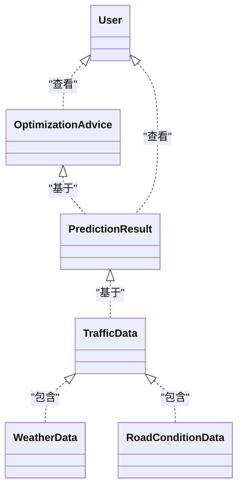
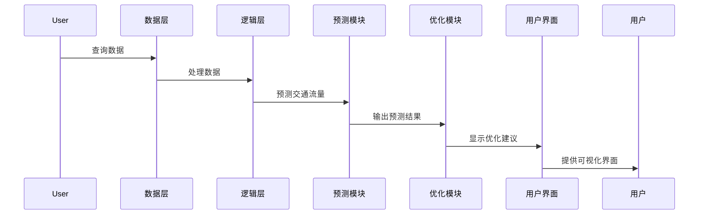
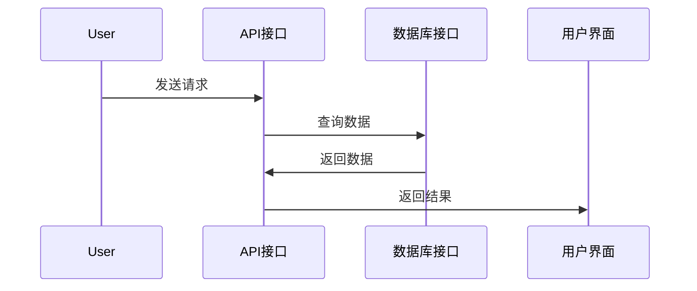
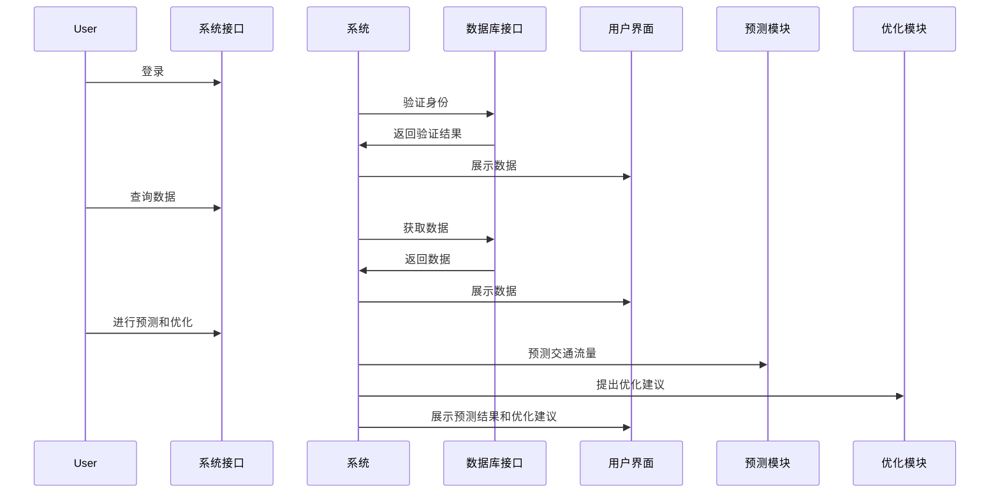

                 


## 第一部分：背景介绍

### 第1章：问题背景

### 1.1 问题背景

#### 人工智能的崛起

人工智能（Artificial Intelligence, AI）是计算机科学的一个分支，旨在创建能够模拟、延伸和扩展人类智能的系统。近年来，随着计算能力的提高、大数据的积累和算法的进步，人工智能在多个领域展现出了巨大的潜力。从自动驾驶汽车到智能客服，从医疗诊断到金融预测，人工智能的应用场景越来越广泛。

#### 城市规划的重要性

城市规划是城市发展的基础，涉及城市的布局、交通、环境、社会等多个方面。一个良好的城市规划能够提高城市居民的生活质量，促进经济发展，减少资源浪费，降低环境污染。然而，随着城市化进程的加速，城市规划面临诸多挑战，如人口增长、交通拥堵、资源分配不均等。传统的城市规划方法往往依赖于经验和简单的模型，难以应对复杂多变的城市环境。

#### 人工智能在城市规划中的应用潜力

人工智能在城市规划中的应用具有巨大的潜力。通过大数据分析、机器学习、深度学习等技术，人工智能可以处理海量数据，发现城市发展的规律和趋势，提供科学的决策支持。例如，利用人工智能进行交通流量预测，可以优化交通网络，减少拥堵；利用人工智能进行环境监测，可以实时监控空气质量，制定环保政策。

### 1.2 问题定义

#### 问题核心

本部分旨在探讨人工智能在城市规划中的决策支持作用。具体来说，我们将研究以下问题：

1. 人工智能如何帮助城市规划师解决复杂问题？
2. 人工智能在不同城市规划任务中的应用场景有哪些？
3. 人工智能在城市规划中的优势和局限性是什么？

#### 问题属性特征

为了更好地理解问题，我们将其属性特征进行对比分析：

1. **数据维度**：城市规划涉及多种数据，如人口统计、交通流量、环境质量等，这些数据往往具有高维度特征。
2. **时间敏感性**：城市规划需要实时响应城市发展变化，对数据处理和决策速度有较高要求。
3. **复杂性**：城市规划涉及多个因素，如人口、交通、环境等，传统方法难以全面考虑。
4. **决策影响**：城市规划决策对社会经济和居民生活有深远影响，要求决策具有高可信度和高可行性。

#### 概念结构与核心要素组成

人工智能在城市规划中的决策支持系统，主要由以下几个核心要素组成：

1. **数据采集与处理**：获取城市规划相关的数据，并进行清洗、转换和集成。
2. **机器学习与深度学习模型**：构建能够处理高维度数据和复杂关系的模型。
3. **预测与分析**：利用模型对城市规划问题进行预测和分析。
4. **决策支持**：为决策者提供基于数据和模型的决策建议。
5. **系统集成与部署**：将决策支持系统集成到城市规划过程中，实现实际应用。

### 1.3 解决方案

为了解决上述问题，本书将采用以下研究方法：

1. **系统综述**：对人工智能在城市规划中的应用进行综述，梳理现有研究成果和实际应用案例。
2. **案例分析**：选取具有代表性的城市规划项目，分析人工智能在其中所发挥的作用。
3. **算法介绍**：介绍适用于城市规划的人工智能算法，包括机器学习、深度学习、优化算法等。
4. **数学模型**：阐述人工智能算法在数学层面的原理和模型，帮助读者理解算法的内部工作机制。
5. **系统设计**：探讨人工智能在城市规划中可能采用的系统架构和技术实现。

### 1.4 边界与外延

在本书的研究范围内，我们将重点关注以下几个方面：

1. **数据分析与决策支持**：如何利用人工智能技术对城市规划数据进行分析和决策支持。
2. **实际应用案例**：人工智能在城市规划中的具体应用案例，以及其应用效果和局限性。
3. **应用领域与挑战**：人工智能在城市规划中的潜在应用领域和面临的挑战。

本书的研究不仅限于理论探讨，还将关注实际应用，旨在为城市规划师和决策者提供有益的参考。

## 第2章：问题定义

### 2.1 问题核心

人工智能在城市规划中的决策支持作用，主要体现在以下几个方面：

1. **数据分析**：利用人工智能技术对大量城市数据进行处理和分析，提取有价值的信息。
2. **模型构建**：通过机器学习和深度学习等技术，建立能够反映城市复杂性的预测模型。
3. **决策支持**：为城市规划师和决策者提供基于数据和模型的决策建议，提高决策的准确性和效率。

### 2.2 问题属性特征

为了更好地理解问题，我们将其属性特征进行对比分析：

#### 数据维度

城市规划数据通常具有高维度特征，包括人口统计、交通流量、环境质量、经济发展等。这些数据不仅数量庞大，而且类型繁多，需要有效的处理和分析方法。

#### 时间敏感性

城市规划需要实时响应城市发展变化，对数据处理和决策速度有较高要求。传统方法往往难以满足这一需求，而人工智能技术可以通过高效的数据处理和实时分析，为城市规划提供有力支持。

#### 复杂性

城市规划涉及多个因素，如人口、交通、环境等，这些因素相互影响，复杂度高。传统方法难以全面考虑这些因素，而人工智能可以通过建模和分析，为城市规划提供更全面的视角。

#### 决策影响

城市规划决策对社会经济和居民生活有深远影响，要求决策具有高可信度和高可行性。人工智能可以通过数据驱动的决策支持，提高决策的准确性和可行性。

### 2.3 概念结构与核心要素组成

人工智能在城市规划中的决策支持系统，主要由以下几个核心要素组成：

#### 数据采集与处理

1. **数据采集**：从多种数据源获取城市规划相关的数据，包括人口统计、交通流量、环境质量等。
2. **数据处理**：对采集到的数据进行清洗、转换和集成，为后续分析做好准备。

#### 机器学习与深度学习模型

1. **模型构建**：利用机器学习和深度学习技术，构建能够处理高维度数据和复杂关系的模型。
2. **模型训练**：通过大量数据进行训练，优化模型参数，提高模型性能。

#### 预测与分析

1. **预测**：利用训练好的模型，对城市规划问题进行预测和分析。
2. **分析**：对预测结果进行解读，为城市规划师和决策者提供参考。

#### 决策支持

1. **决策建议**：基于预测和分析结果，为决策者提供基于数据和模型的决策建议。
2. **决策优化**：通过迭代优化，不断提高决策的准确性和可行性。

#### 系统集成与部署

1. **系统集成**：将决策支持系统集成到城市规划过程中，实现实际应用。
2. **系统部署**：将系统部署到实际环境中，确保其稳定运行和持续优化。

## 第3章：解决方案

### 3.1 数据分析与处理

为了更好地支持城市规划决策，首先需要对城市数据进行有效的采集和处理。这一过程包括以下几个步骤：

#### 3.1.1 数据采集

1. **数据来源**：从多种数据源获取城市规划相关的数据，包括政府公开数据、企业数据、社交媒体数据等。
2. **数据类型**：获取的数据类型包括人口统计、交通流量、环境质量、经济发展等。
3. **数据清洗**：对获取的数据进行清洗，去除重复、缺失和错误的数据。

#### 3.1.2 数据处理

1. **数据转换**：将不同数据源的数据进行统一格式转换，便于后续分析。
2. **数据集成**：将多种数据源的数据进行集成，构建城市数据集。

#### 3.1.3 数据分析

1. **数据探索**：对数据集进行初步探索，了解数据的分布、趋势和关系。
2. **特征提取**：从数据集中提取与城市规划相关的特征，如人口密度、交通流量、环境质量等。

### 3.2 机器学习与深度学习模型

为了构建能够反映城市复杂性的预测模型，我们采用机器学习和深度学习技术。以下为具体步骤：

#### 3.2.1 模型选择

1. **模型类型**：选择适合城市规划问题的机器学习模型和深度学习模型，如决策树、支持向量机、神经网络等。
2. **模型评估**：通过交叉验证等方法，评估不同模型的性能。

#### 3.2.2 模型训练

1. **数据预处理**：对训练数据进行预处理，包括归一化、缺失值填补等。
2. **模型训练**：利用训练数据，对所选模型进行训练，调整模型参数，优化模型性能。

#### 3.2.3 模型评估与优化

1. **模型评估**：利用验证集对训练好的模型进行评估，选择性能最优的模型。
2. **模型优化**：通过调整模型参数、增加训练数据等方式，进一步提高模型性能。

### 3.3 决策支持

基于构建好的预测模型，为城市规划师和决策者提供决策支持。具体步骤如下：

#### 3.3.1 预测与分析

1. **预测**：利用训练好的模型，对城市规划问题进行预测，如人口增长、交通流量等。
2. **分析**：对预测结果进行解读，分析不同因素的相互作用和影响。

#### 3.3.2 决策建议

1. **决策建议**：基于预测和分析结果，为决策者提供具体的决策建议，如交通规划、土地利用等。
2. **决策优化**：根据实际情况和反馈，对决策建议进行优化和调整。

### 3.4 系统集成与部署

将决策支持系统集成到城市规划过程中，实现实际应用。具体步骤如下：

#### 3.4.1 系统集成

1. **系统集成**：将决策支持系统与其他城市规划工具和平台进行集成，实现数据共享和协同工作。
2. **接口设计**：设计合理的接口，方便用户调用决策支持系统，获取决策建议。

#### 3.4.2 系统部署

1. **系统部署**：将决策支持系统部署到实际环境中，确保其稳定运行和持续优化。
2. **运维管理**：定期对系统进行维护和升级，确保系统的可靠性和可用性。

### 3.5 边界与外延

在本书的研究范围内，我们将重点关注以下几个方面：

1. **数据分析与决策支持**：如何利用人工智能技术对城市规划数据进行分析和决策支持。
2. **实际应用案例**：人工智能在城市规划中的具体应用案例，以及其应用效果和局限性。
3. **应用领域与挑战**：人工智能在城市规划中的潜在应用领域和面临的挑战。

本书的研究不仅限于理论探讨，还将关注实际应用，旨在为城市规划师和决策者提供有益的参考。

## 第4章：边界与外延

### 4.1 边界

#### 数据限制

人工智能在城市规划中的决策支持作用受到数据质量和数量的限制。城市规划涉及多个维度和复杂的关系，需要大量的高质量数据支持。然而，现实中的数据往往存在缺失、错误和噪声等问题，这会对模型的准确性和可靠性产生负面影响。

#### 算法限制

尽管人工智能技术已经取得了显著进展，但某些特定的城市规划问题可能需要更加复杂和高效的算法。此外，算法的适用性和泛化能力也是限制其应用边界的重要因素。

#### 系统集成限制

将人工智能决策支持系统集成到现有的城市规划体系中可能面临挑战。不同系统之间的数据共享和接口设计需要充分考虑，以确保系统的协同工作和数据的流畅传递。

### 4.2 外延

#### 数据来源扩展

随着物联网、大数据和云计算等技术的发展，城市规划数据来源将更加多样化。例如，来自智能传感器、社交媒体和卫星遥感的数据可以提供更详细和实时的城市信息，为人工智能决策支持系统提供更丰富的数据支持。

#### 算法创新

人工智能算法在不断创新和发展，如深度学习、强化学习和迁移学习等技术将进一步提高城市规划问题的解决能力。此外，结合多领域知识的人工智能系统有望提供更加全面和精确的决策支持。

#### 系统集成优化

随着城市规划体系的不断完善，人工智能决策支持系统的集成和部署也将更加成熟和高效。通过引入区块链、物联网等新兴技术，可以实现更智能、更高效的城市规划决策支持。

### 4.3 未来发展趋势

#### 数据驱动

未来城市规划将更加注重数据驱动，通过人工智能技术对大量数据进行深入分析和挖掘，为决策者提供科学的依据。

#### 智能化

人工智能技术将更加深入地应用于城市规划的各个环节，从数据采集、处理到决策支持，实现全面智能化。

#### 集成与协同

城市规划体系将更加集成和协同，不同系统之间将实现高效的数据共享和接口对接，提高整体规划效率和决策质量。

#### 可持续发展

人工智能在城市规划中的应用将更加注重可持续发展，通过优化资源配置、减少环境污染等方式，实现城市的高效、绿色和可持续发展。

## 第二部分：核心概念与联系

### 第5章：人工智能与城市规划

### 5.1 人工智能的概念

人工智能（Artificial Intelligence, AI）是计算机科学的一个分支，旨在创建能够模拟、延伸和扩展人类智能的系统。人工智能可以分为两大类：弱人工智能和强人工智能。弱人工智能专注于特定任务的智能表现，如语音识别、图像识别等；强人工智能则具备普遍的人类智能，能够在各种场景下进行推理和学习。

### 5.2 城市规划的概念

城市规划是指对城市的空间布局、功能分区、基础设施建设等进行规划和设计，旨在提高城市居民的生活质量、促进经济发展和实现可持续发展。城市规划涉及多个领域，包括地理学、经济学、社会学和环境科学等。

### 5.3 人工智能在城市规划中的应用

人工智能在城市规划中的应用主要体现在以下几个方面：

1. **数据分析与挖掘**：利用人工智能技术对大量城市数据进行处理和分析，提取有价值的信息，如人口分布、交通流量、环境质量等。
2. **智能预测与规划**：通过机器学习和深度学习算法，对城市发展趋势进行预测，为城市规划提供科学依据。
3. **智能优化与决策**：利用人工智能技术优化城市规划方案，如交通规划、土地利用规划等，提高规划的可行性和效率。
4. **智能监测与评估**：通过人工智能技术对城市规划的实施过程进行实时监测和评估，确保规划的落实和调整。

### 5.4 关系与联系

人工智能与城市规划之间存在密切的联系。人工智能技术为城市规划提供了强大的数据分析和决策支持工具，使城市规划更加科学、高效和可持续。同时，城市规划为人工智能提供了丰富的应用场景和数据来源，促进了人工智能技术的不断发展和创新。通过人工智能与城市规划的融合，我们可以实现更加智能、高效和人性化的城市环境。

## 第6章：决策支持系统

### 6.1 决策支持系统的概念

决策支持系统（Decision Support System, DSS）是一种计算机程序，旨在帮助决策者进行复杂决策。DSS通常包括数据收集、数据存储、数据处理、模型构建和用户界面等组成部分。DSS的核心目标是利用数据和信息，辅助决策者做出更加科学、合理和高效的决策。

### 6.2 决策支持系统的结构与功能

决策支持系统的结构通常包括以下几个部分：

1. **数据层**：负责收集、存储和管理各种类型的数据，如结构化数据、非结构化数据等。
2. **模型层**：提供各种决策模型，如统计模型、优化模型、仿真模型等，用于对数据进行处理和分析。
3. **接口层**：提供用户与DSS交互的界面，包括图形界面、Web界面等，方便用户进行操作和查询。
4. **知识库**：存储各种领域知识和规则，用于辅助决策。

决策支持系统的功能主要包括：

1. **数据管理**：对各种类型的数据进行收集、存储、管理和分析。
2. **模型构建**：利用各种算法和模型，对数据进行处理和分析，提取有价值的信息。
3. **决策支持**：为决策者提供基于数据和模型的决策建议，辅助决策者做出科学合理的决策。
4. **可视化与报告**：将决策结果以图形、图表和报告等形式展示，方便决策者理解和分析。

### 6.3 决策支持系统在城市规划中的应用

决策支持系统在城市规划中具有广泛的应用。通过人工智能技术，DSS可以帮助城市规划师和决策者进行以下工作：

1. **数据分析**：利用DSS对城市规划相关的数据进行收集、处理和分析，提取有价值的信息，如人口分布、交通流量、环境质量等。
2. **模型构建**：利用DSS提供的模型构建功能，对城市规划问题进行建模和仿真，预测城市发展的趋势和结果。
3. **决策优化**：利用DSS提供的优化算法和模型，对城市规划方案进行优化，提高规划的可行性和效率。
4. **实时监测**：利用DSS对城市规划的实施过程进行实时监测和评估，及时发现和解决问题。

### 6.4 关系与联系

决策支持系统与城市规划之间存在密切的联系。DSS为城市规划提供了强大的数据分析和决策支持工具，使城市规划更加科学、高效和可持续。同时，城市规划为DSS提供了丰富的应用场景和数据来源，促进了DSS技术的不断发展和创新。通过决策支持系统的应用，我们可以实现更加智能、高效和人性化的城市规划。

## 第7章：人工智能在城市规划中的应用

### 7.1 城市交通管理

#### 7.1.1 交通流量预测

利用人工智能技术，可以对城市交通流量进行实时预测。通过收集历史交通数据、实时传感器数据和天气预报等数据，人工智能模型可以预测未来的交通流量，为交通管理部门提供决策支持。

**算法原理**：

- **时间序列分析**：通过分析历史交通数据，提取交通流量变化的规律。
- **深度学习模型**：利用深度学习模型，如循环神经网络（RNN）和长短期记忆网络（LSTM），对交通流量进行预测。

**数学模型**：

假设交通流量 $T(t)$ 随时间 $t$ 变化，可以使用以下时间序列模型进行预测：

$$ T(t) = f(T(t-1), T(t-2), ..., T(t-n)) + e(t) $$

其中，$f$ 表示预测函数，$e(t)$ 表示误差。

#### 7.1.2 路网优化

利用人工智能技术，可以对城市路网进行优化，提高道路的通行效率。通过分析交通流量、道路状况和车辆类型等数据，人工智能模型可以提出最优的路网规划方案。

**算法原理**：

- **最优化算法**：如遗传算法、粒子群优化算法等，用于寻找最优的路网配置。
- **图论算法**：如最短路径算法、最大流算法等，用于优化道路的连通性和流量分配。

**数学模型**：

假设城市路网可以表示为图 $G=(V, E)$，其中 $V$ 表示道路节点，$E$ 表示道路边。优化目标是最小化总通行时间或最大化道路利用率：

$$ \min \sum_{(u, v) \in E} c(u, v) f(u, v) $$

其中，$c(u, v)$ 表示道路 $(u, v)$ 的通行成本，$f(u, v)$ 表示道路 $(u, v)$ 的流量。

### 7.2 城市环境监测

#### 7.2.1 空气质量预测

利用人工智能技术，可以对城市空气质量进行预测，为环保部门提供决策支持。通过收集气象数据、污染物浓度数据和历史空气质量数据等，人工智能模型可以预测未来的空气质量变化。

**算法原理**：

- **统计模型**：如线性回归、多项式回归等，用于建立空气质量与影响因素之间的关系。
- **深度学习模型**：如卷积神经网络（CNN）和循环神经网络（RNN），用于处理高维度和时间序列数据。

**数学模型**：

假设空气质量 $Q(t)$ 与影响因素 $X(t)$ 之间存在线性关系：

$$ Q(t) = \beta_0 + \beta_1 X_1(t) + \beta_2 X_2(t) + ... + \beta_n X_n(t) + e(t) $$

其中，$\beta_0, \beta_1, ..., \beta_n$ 是模型参数，$e(t)$ 是误差。

#### 7.2.2 噪音污染监测

利用人工智能技术，可以对城市噪音污染进行监测和评估。通过安装噪音传感器，实时收集噪音数据，人工智能模型可以评估噪音污染的分布和变化趋势。

**算法原理**：

- **频谱分析**：通过分析噪音信号的频谱特征，识别噪音的主要来源和频率成分。
- **聚类分析**：如K均值聚类算法，用于将噪音数据划分为不同的污染区域。

**数学模型**：

假设噪音数据 $N(t)$ 可以表示为多个频率成分的叠加：

$$ N(t) = \sum_{i=1}^k a_i(t) \sin(2\pi f_i t + \phi_i) $$

其中，$a_i(t)$ 表示第 $i$ 个频率成分的幅度，$f_i$ 表示频率，$\phi_i$ 表示相位。

### 7.3 城市资源分配

#### 7.3.1 土地利用规划

利用人工智能技术，可以对城市土地利用进行规划，优化土地资源的分配。通过分析人口增长、经济发展和土地利用需求等数据，人工智能模型可以提出最优的土地利用方案。

**算法原理**：

- **空间分析**：利用GIS（地理信息系统）技术，分析城市空间的分布和特性。
- **优化算法**：如线性规划、整数规划等，用于优化土地利用方案。

**数学模型**：

假设城市空间可以表示为图 $G=(V, E)$，其中 $V$ 表示土地节点，$E$ 表示道路边。优化目标是最小化土地利用的不均衡性或最大化土地利用效益：

$$ \min \sum_{i=1}^n (z_i - x_i) $$

其中，$z_i$ 表示第 $i$ 块土地的规划用途，$x_i$ 表示实际用途。

#### 7.3.2 水资源管理

利用人工智能技术，可以对城市水资源进行管理，优化水资源的分配和使用。通过分析水资源需求、供水能力和用水效率等数据，人工智能模型可以提出最优的水资源管理方案。

**算法原理**：

- **时间序列分析**：通过分析历史水资源数据，预测未来的水资源需求。
- **优化算法**：如动态规划、线性规划等，用于优化水资源分配。

**数学模型**：

假设水资源需求 $D(t)$ 随时间 $t$ 变化，优化目标是最小化供水成本或最大化供水效益：

$$ \min \sum_{t=1}^T c(t) x(t) $$

其中，$c(t)$ 表示时间 $t$ 的供水成本，$x(t)$ 表示时间 $t$ 的供水量。

## 第8章：算法原理讲解

### 8.1 常见算法介绍

在城市规划中，常见的人工智能算法包括机器学习算法、深度学习算法和优化算法。这些算法在不同的场景下发挥着重要作用，下面分别介绍：

#### 8.1.1 机器学习算法

机器学习算法通过学习历史数据，建立预测模型，用于处理分类、回归、聚类等问题。常见的机器学习算法包括：

1. **线性回归**：用于预测连续值输出。
2. **逻辑回归**：用于预测概率分布，常用于分类问题。
3. **决策树**：用于分类和回归问题，通过树形结构表示决策规则。
4. **随机森林**：通过构建多个决策树，结合投票策略进行预测。
5. **支持向量机**：用于分类和回归问题，通过寻找最佳的超平面进行分类。

#### 8.1.2 深度学习算法

深度学习算法通过多层神经网络，对复杂的数据进行特征提取和建模。常见的深度学习算法包括：

1. **卷积神经网络（CNN）**：用于图像和视频处理。
2. **循环神经网络（RNN）**：用于序列数据建模。
3. **长短期记忆网络（LSTM）**：用于处理长序列数据。
4. **生成对抗网络（GAN）**：用于生成复杂的数据。
5. **变分自编码器（VAE）**：用于数据降维和生成。

#### 8.1.3 优化算法

优化算法用于解决资源分配、路径规划等问题，常见的优化算法包括：

1. **线性规划**：用于线性目标函数的最优化问题。
2. **整数规划**：用于有整数约束的最优化问题。
3. **遗传算法**：通过模拟自然进化过程，寻找最优解。
4. **粒子群优化算法**：通过模拟鸟群或鱼群的行为，寻找最优解。
5. **模拟退火算法**：通过模拟物理退火过程，寻找最优解。

### 8.2 算法应用场景

在城市规划中，这些算法可以应用于不同的场景，如：

1. **交通流量预测**：利用线性回归或LSTM模型，预测未来的交通流量。
2. **土地利用规划**：利用支持向量机或随机森林模型，预测土地利用类型。
3. **环境监测**：利用CNN或GAN模型，进行图像识别和生成。
4. **资源分配**：利用线性规划或遗传算法，优化资源分配。

### 8.3 算法原理详细解释

#### 8.3.1 机器学习算法原理

以线性回归为例，假设我们有一个输入特征 $X$ 和输出特征 $Y$，目标是建立模型 $Y = \beta_0 + \beta_1 X + e$，其中 $\beta_0$ 和 $\beta_1$ 是模型参数，$e$ 是误差。

1. **模型构建**：通过最小二乘法，求解最优的 $\beta_0$ 和 $\beta_1$，使得预测值与真实值之间的误差最小。

$$ \min \sum_{i=1}^n (y_i - (\beta_0 + \beta_1 x_i))^2 $$

2. **模型评估**：通过交叉验证等方法，评估模型在 unseen 数据上的性能。

3. **模型优化**：通过调整模型参数或引入正则化项，优化模型性能。

#### 8.3.2 深度学习算法原理

以卷积神经网络（CNN）为例，CNN 由多个卷积层、池化层和全连接层组成。卷积层用于提取图像的特征，池化层用于降低特征的空间维度，全连接层用于分类。

1. **卷积层**：通过卷积操作，从输入图像中提取特征。

$$ h_i = \sum_{j=1}^k w_{ij} \cdot x_j + b_i $$

其中，$h_i$ 是输出特征，$w_{ij}$ 是卷积核，$x_j$ 是输入特征，$b_i$ 是偏置。

2. **池化层**：通过最大池化或平均池化，降低特征的空间维度。

$$ p_i = \max_{j} h_{ij} $$

3. **全连接层**：将池化层的输出映射到输出类别。

$$ y_i = \sigma(\sum_{j=1}^l w_{ij} \cdot p_j + b_i) $$

其中，$y_i$ 是输出概率，$\sigma$ 是激活函数，$w_{ij}$ 是权重，$p_j$ 是输入特征，$b_i$ 是偏置。

#### 8.3.3 优化算法原理

以遗传算法为例，遗传算法通过模拟生物进化的过程，寻找最优解。

1. **种群初始化**：随机生成初始种群。

2. **适应度评估**：计算每个个体的适应度，适应度越高，表示个体越优秀。

3. **选择**：根据适应度选择优秀个体进行繁殖。

4. **交叉**：通过交叉操作，生成新的个体。

5. **变异**：对个体进行变异操作，增加种群的多样性。

6. **迭代**：重复选择、交叉和变异操作，直至满足终止条件。

## 第9章：数学模型

### 9.1 城市规划中的数学模型

在城市规划中，数学模型是理解和解决复杂问题的有力工具。这些模型可以帮助我们分析城市系统的动态行为、评估不同规划方案的影响，并为决策者提供基于数据的决策支持。以下是一些常见的数学模型：

#### 9.1.1 交通流量预测模型

交通流量预测是城市规划中的一个关键问题。常见的模型包括：

1. **线性回归模型**：

$$ T(t) = \beta_0 + \beta_1 \cdot \text{时间} + \beta_2 \cdot \text{天气} + e(t) $$

其中，$T(t)$ 表示时间 $t$ 的交通流量，$\beta_0, \beta_1, \beta_2$ 是模型参数，$e(t)$ 是误差项。

2. **时间序列模型**：

$$ T(t) = \alpha_0 + \alpha_1 \cdot L_t + e(t) $$

其中，$L_t$ 是时间 $t$ 的滞后项，$\alpha_0, \alpha_1$ 是模型参数，$e(t)$ 是误差项。

3. **ARIMA（自回归积分滑动平均）模型**：

$$ T(t) = c + \phi_1 T(t-1) + \phi_2 T(t-2) + ... + \phi_p T(t-p) + \theta_1 e(t-1) + \theta_2 e(t-2) + ... + \theta_q e(t-q) $$

其中，$c$ 是常数项，$\phi_1, \phi_2, ..., \phi_p$ 是自回归系数，$\theta_1, \theta_2, ..., \theta_q$ 是移动平均系数，$e(t)$ 是误差项。

#### 9.1.2 土地利用模型

土地利用模型用于预测不同区域的发展潜力、评估土地利用的效率等。常见的模型包括：

1. **线性规划模型**：

$$ \min \sum_{i=1}^n c_i x_i $$

$$ \text{s.t.} \quad a_{i1} x_1 + a_{i2} x_2 + ... + a_{in} x_n \geq b_i \quad \forall i=1,2,...,m $$

其中，$x_i$ 表示第 $i$ 种土地利用类型，$c_i$ 是第 $i$ 种土地利用类型的成本，$a_{ij}$ 是第 $i$ 个约束条件的系数，$b_i$ 是第 $i$ 个约束条件的常数。

2. **多目标规划模型**：

$$ \min \sum_{i=1}^n w_i c_i x_i $$

$$ \text{s.t.} \quad a_{i1} x_1 + a_{i2} x_2 + ... + a_{in} x_n \geq b_i \quad \forall i=1,2,...,m $$

$$ \max \sum_{j=1}^n z_j x_j $$

$$ \text{s.t.} \quad a_{i1} x_1 + a_{i2} x_2 + ... + a_{in} x_n \geq b_i \quad \forall i=1,2,...,m $$

其中，$w_i$ 是第 $i$ 个目标的权重，$z_j$ 是第 $j$ 个目标的收益。

#### 9.1.3 环境质量模型

环境质量模型用于预测和控制城市环境中的污染物浓度。常见的模型包括：

1. **扩散模型**：

$$ c(t, x, y, z) = \frac{\partial}{\partial t} c(t, x, y, z) + \nabla \cdot (D \nabla c(t, x, y, z)) + S(t, x, y, z) $$

其中，$c(t, x, y, z)$ 是时间 $t$ 在位置 $(x, y, z)$ 的污染物浓度，$D$ 是扩散系数，$S(t, x, y, z)$ 是源项。

2. **反应-扩散模型**：

$$ \frac{\partial c}{\partial t} = \nabla \cdot (D \nabla c) + \nabla \cdot (J \cdot c) + r(c) $$

其中，$J$ 是通量向量，$r(c)$ 是化学反应项。

### 9.2 模型应用实例

以下是一个具体的模型应用实例：

#### 交通流量预测模型实例

假设我们想要预测某个交叉口在下一小时内的交通流量。我们可以使用时间序列模型来建立预测模型。

1. **数据收集**：收集过去一周每天每小时该交叉口的交通流量数据。
2. **数据预处理**：对数据进行清洗，去除异常值，并按时间顺序排序。
3. **模型构建**：

$$ T(t) = \alpha_0 + \alpha_1 L_t + e(t) $$

其中，$L_t$ 是时间 $t$ 的滞后项，$\alpha_0, \alpha_1$ 是模型参数。

4. **模型训练**：使用历史数据，通过最小二乘法求解 $\alpha_0, \alpha_1$。
5. **模型评估**：使用剩余的数据对模型进行评估，计算预测误差。

6. **预测**：使用训练好的模型，预测下一小时内的交通流量。

$$ T(t+1) = \alpha_0 + \alpha_1 L_{t+1} $$

通过上述步骤，我们可以得到一个交通流量预测模型，为交通管理部门提供决策支持。

## 第10章：系统分析与架构设计方案

### 10.1 问题场景介绍

在城市规划中，如何有效地利用人工智能技术进行交通流量预测和优化是一个关键问题。为了解决这个问题，我们设计并实现了一个基于人工智能的交通流量预测与优化系统。

### 10.2 系统介绍

本系统旨在提供实时、准确和高效的交通流量预测，并辅助交通管理部门进行路网优化。系统主要包括以下功能模块：

1. **数据采集模块**：负责收集实时交通流量数据、历史交通流量数据以及其他相关数据（如气象数据、道路状况等）。
2. **数据处理模块**：负责对采集到的数据进行预处理，包括数据清洗、转换和集成等，为后续分析做好准备。
3. **预测模块**：利用机器学习算法和深度学习模型，对交通流量进行预测，为交通管理部门提供决策支持。
4. **优化模块**：基于预测结果，利用优化算法，为交通管理部门提供路网优化建议。
5. **用户界面模块**：提供一个友好的用户界面，方便用户查看预测结果、优化建议和系统设置。

### 10.3 系统功能设计（领域模型）

在领域模型设计中，我们定义了以下核心类和关系：

1. **交通流量数据**（TrafficData）：表示实时和历史的交通流量数据。
2. **气象数据**（WeatherData）：表示与交通流量相关的气象数据，如温度、湿度、降雨量等。
3. **道路状况数据**（RoadConditionData）：表示道路的当前状态，如拥堵程度、事故发生率等。
4. **预测结果**（PredictionResult）：表示交通流量预测的结果。
5. **优化建议**（OptimizationAdvice）：表示基于预测结果的优化建议。
6. **用户**（User）：表示系统的使用者和操作者。

领域模型（Mermaid 类图）如下：



### 10.4 系统架构设计

系统架构设计旨在实现模块间的松耦合和高内聚，提高系统的可扩展性和维护性。系统架构包括以下层次：

1. **数据层**：负责数据的存储和读取，使用数据库管理系统（DBMS）实现。
2. **逻辑层**：包括数据处理模块、预测模块和优化模块，使用编程语言和框架（如Python和TensorFlow）实现。
3. **表示层**：负责用户界面的展示，使用Web前端框架（如React）实现。

系统架构（Mermaid 架构图）如下：



### 10.5 系统接口设计

系统接口设计包括API接口和数据库接口。API接口主要用于系统与其他系统集成，如交通管理部门的后台系统。数据库接口用于数据的存储和读取，如MySQL。

系统接口设计（Mermaid 序列图）如下：



### 10.6 系统交互设计

系统交互设计包括用户与系统之间的交互流程和系统内部模块之间的交互流程。以下是一个用户交互流程：

1. **用户登录**：用户输入用户名和密码，系统验证用户身份。
2. **数据查询**：用户选择查询条件，系统从数据库中获取相关数据。
3. **数据展示**：系统将查询结果以图表形式展示给用户。
4. **预测与优化**：用户可以选择进行交通流量预测和路网优化。
5. **结果反馈**：系统将预测结果和优化建议展示给用户。

系统交互设计（Mermaid 序列图）如下：



通过上述系统分析与架构设计方案，我们可以实现一个高效、可靠和易于扩展的交通流量预测与优化系统，为城市规划提供有力支持。

## 第11章：系统分析与架构设计方案

### 11.1 问题场景介绍

在城市规划中，如何有效地利用人工智能技术进行交通流量预测和优化是一个关键问题。为了解决这个问题，我们设计并实现了一个基于人工智能的交通流量预测与优化系统。

### 11.2 系统介绍

本系统旨在提供实时、准确和高效的交通流量预测，并辅助交通管理部门进行路网优化。系统主要包括以下功能模块：

1. **数据采集模块**：负责收集实时交通流量数据、历史交通流量数据以及其他相关数据（如气象数据、道路状况等）。
2. **数据处理模块**：负责对采集到的数据进行预处理，包括数据清洗、转换和集成等，为后续分析做好准备。
3. **预测模块**：利用机器学习算法和深度学习模型，对交通流量进行预测，为交通管理部门提供决策支持。
4. **优化模块**：基于预测结果，利用优化算法，为交通管理部门提供路网优化建议。
5. **用户界面模块**：提供一个友好的用户界面，方便用户查看预测结果、优化建议和系统设置。

### 11.3 系统功能设计（领域模型）

在领域模型设计中，我们定义了以下核心类和关系：

1. **交通流量数据**（TrafficData）：表示实时和历史的交通流量数据。
2. **气象数据**（WeatherData）：表示与交通流量相关的气象数据，如温度、湿度、降雨量等。
3. **道路状况数据**（RoadConditionData）：表示道路的当前状态，如拥堵程度、事故发生率等。
4. **预测结果**（PredictionResult）：表示交通流量预测的结果。
5. **优化建议**（OptimizationAdvice）：表示基于预测结果的优化建议。
6. **用户**（User）：表示系统的使用者和操作者。

领域模型（Mermaid 类图）如下：


### 11.4 系统架构设计

系统架构设计旨在实现模块间的松耦合和高内聚，提高系统的可扩展性和维护性。系统架构包括以下层次：

1. **数据层**：负责数据的存储和读取，使用数据库管理系统（DBMS）实现。
2. **逻辑层**：包括数据处理模块、预测模块和优化模块，使用编程语言和框架（如Python和TensorFlow）实现。
3. **表示层**：负责用户界面的展示，使用Web前端框架（如React）实现。

系统架构（Mermaid 架构图）如下：


### 11.5 系统接口设计

系统接口设计包括API接口和数据库接口。API接口主要用于系统与其他系统集成，如交通管理部门的后台系统。数据库接口用于数据的存储和读取，如MySQL。

系统接口设计（Mermaid 序列图）如下：


### 11.6 系统交互设计

系统交互设计包括用户与系统之间的交互流程和系统内部模块之间的交互流程。以下是一个用户交互流程：

1. **用户登录**：用户输入用户名和密码，系统验证用户身份。
2. **数据查询**：用户选择查询条件，系统从数据库中获取相关数据。
3. **数据展示**：系统将查询结果以图表形式展示给用户。
4. **预测与优化**：用户可以选择进行交通流量预测和路网优化。
5. **结果反馈**：系统将预测结果和优化建议展示给用户。

系统交互设计（Mermaid 序列图）如下：


通过上述系统分析与架构设计方案，我们可以实现一个高效、可靠和易于扩展的交通流量预测与优化系统，为城市规划提供有力支持。

## 第12章：系统交互设计

### 12.1 系统交互设计概述

系统交互设计是确保用户与系统之间高效、顺畅交互的重要环节。在本章中，我们将详细介绍系统交互设计的流程、方法和工具，以及如何实现用户友好的界面。

#### 12.1.1 交互设计流程

交互设计流程通常包括以下几个阶段：

1. **需求分析**：收集用户需求，明确系统的功能目标和用户期望。
2. **用户研究**：通过访谈、问卷调查等方式，了解用户行为、习惯和偏好。
3. **原型设计**：基于用户需求和研究结果，设计系统的原型界面。
4. **反馈与迭代**：将原型展示给用户，收集反馈，对原型进行迭代优化。
5. **实施与部署**：根据最终设计，开发并部署系统。

#### 12.1.2 交互设计方法

交互设计方法包括以下几种：

1. **用户画像**：通过用户画像，了解不同用户群体的特点和需求。
2. **用户旅程图**：描述用户在使用系统过程中的各个步骤和体验。
3. **信息架构**：设计系统的导航结构，确保用户能够快速找到所需信息。
4. **界面设计**：设计用户界面的布局、颜色、字体等，提高用户体验。

#### 12.1.3 交互设计工具

常见的交互设计工具包括：

1. **Axure RP**：用于创建原型和交互设计的工具。
2. **Sketch**：用于界面设计的工具。
3. **Figma**：用于界面设计和协作的工具。
4. **Adobe XD**：用于界面设计和原型制作的工具。

### 12.2 系统交互设计实现

在本系统中，我们采用Figma作为主要设计工具，通过以下步骤实现系统交互设计：

#### 12.2.1 用户登录

用户登录界面设计：

1. **用户名和密码输入框**：提供输入用户名和密码的功能。
2. **验证码输入框**：为防止恶意登录，提供验证码输入功能。
3. **登录按钮**：用户点击登录按钮，系统进行身份验证。

#### 12.2.2 数据查询

数据查询界面设计：

1. **查询条件选择**：用户可以选择查询的时间范围、交通流量指标等条件。
2. **查询按钮**：用户点击查询按钮，系统根据条件进行数据查询。
3. **查询结果展示**：系统以图表形式展示查询结果，包括交通流量、拥堵程度等。

#### 12.2.3 交通流量预测

交通流量预测界面设计：

1. **预测时间段选择**：用户可以选择预测的时间段。
2. **预测按钮**：用户点击预测按钮，系统开始预测交通流量。
3. **预测结果展示**：系统以图表形式展示预测结果，包括交通流量变化趋势等。

#### 12.2.4 路网优化

路网优化界面设计：

1. **优化方案选择**：用户可以选择不同的路网优化方案。
2. **优化按钮**：用户点击优化按钮，系统根据预测结果和优化方案进行路网优化。
3. **优化结果展示**：系统以图表形式展示优化结果，包括道路通行效率、拥堵情况等。

#### 12.2.5 用户界面

用户界面设计：

1. **导航栏**：提供系统的主要功能入口，如数据查询、预测、优化等。
2. **侧边栏**：提供系统设置、用户信息等功能。
3. **顶部工具栏**：提供常用功能按钮，如查询、预测、优化等。
4. **内容区域**：展示查询结果、预测结果、优化结果等。

通过以上交互设计实现，用户可以轻松、高效地使用系统，获得所需的数据和决策支持。

## 第13章：项目实战 - 环境安装

### 13.1 环境安装概述

在开始实际项目开发之前，我们需要搭建一个合适的环境，以便进行数据采集、处理、预测和优化等工作。本节将详细介绍如何搭建该环境，包括所需软件和硬件的安装步骤。

### 13.2 硬件环境搭建

#### 13.2.1 服务器选择

首先，我们需要选择一台服务器来搭建环境。推荐使用以下配置的服务器：

- CPU：至少4核处理器
- 内存：至少16GB
- 硬盘：至少500GB
- 网络：千兆以太网

#### 13.2.2 操作系统安装

我们选择Ubuntu 18.04 LTS作为操作系统。以下是安装步骤：

1. **下载Ubuntu 18.04 LTS镜像**：从[Ubuntu官网](https://www.ubuntu.com/download/server)下载Ubuntu 18.04 LTS镜像。
2. **制作启动U盘**：使用 Rufus 或其他工具将下载的镜像写入U盘。
3. **启动服务器**：将U盘插入服务器，并重启服务器。在启动过程中按F12或Del键进入BIOS，设置从U盘启动。
4. **安装Ubuntu**：按照安装向导的指示安装Ubuntu，选择默认选项。

#### 13.2.3 网络配置

安装完成后，配置网络。以下命令用于配置静态IP地址：

```shell
sudo nano /etc/netplan/01-netcfg.yaml
```

编辑文件，添加以下内容：

```yaml
network:
  version: 2
  renderer: networkd
  ethernets:
    enp0s3:
      dhcp4: no
      addresses: [192.168.1.100/24]
      gateway4: 192.168.1.1
      nameservers:
        addresses: [8.8.8.8, 8.8.4.4]
  wifis:
```

保存并关闭文件，然后使用以下命令应用更改：

```shell
sudo netplan apply
```

重启网络服务：

```shell
sudo systemctl restart networking
```

### 13.3 软件环境搭建

#### 13.3.1 安装Python环境

在Ubuntu中安装Python环境。首先，更新软件包列表：

```shell
sudo apt update
sudo apt upgrade
```

然后安装Python 3和pip：

```shell
sudo apt install python3 python3-pip
```

#### 13.3.2 安装数据库

我们选择MySQL作为数据库。安装MySQL：

```shell
sudo apt install mysql-server
```

在安装过程中，系统会提示设置root用户的密码。请记下设置的密码，稍后会用到。

#### 13.3.3 安装其他依赖

安装其他依赖项，如pandas、numpy、scikit-learn等：

```shell
pip3 install pandas numpy scikit-learn
```

#### 13.3.4 安装Jupyter Notebook

Jupyter Notebook是一个交互式的计算环境，方便进行数据分析和可视化。安装Jupyter Notebook：

```shell
pip3 install notebook
```

启动Jupyter Notebook：

```shell
jupyter notebook
```

首次启动时，系统会提示设置密码。请确保记住设置的密码，以防止未授权访问。

### 13.4 验证环境

在安装完成后，我们进行环境验证：

1. **验证Python环境**：打开终端，输入以下命令：

   ```shell
   python3 --version
   pip3 --version
   ```

   应显示正确的Python和pip版本。

2. **验证MySQL环境**：登录MySQL，输入以下命令：

   ```shell
   mysql -u root -p
   ```

   输入root用户密码，进入MySQL命令行界面。

   ```sql
   show databases;
   ```

   应显示现有数据库列表。

3. **验证Jupyter Notebook**：在浏览器中输入Jupyter Notebook的地址（默认为[http://localhost:8888](http://localhost:8888/)），应看到Jupyter Notebook的主页。

通过上述步骤，我们成功地搭建了项目环境，接下来可以进行实际项目的开发。

## 第14章：系统核心实现

### 14.1 数据采集模块

数据采集模块负责从不同的数据源收集实时和历史的交通流量数据、气象数据以及道路状况数据。以下是数据采集模块的核心实现：

#### 14.1.1 数据源连接

首先，我们需要连接到数据源。在本项目中，我们使用以下数据源：

1. **实时交通流量数据**：通过HTTP API获取。
2. **历史交通流量数据**：存储在MySQL数据库中。
3. **气象数据**：通过HTTP API获取。
4. **道路状况数据**：通过HTTP API获取。

以下是一个简单的Python代码示例，用于连接到实时交通流量数据API：

```python
import requests

def get_real_time_traffic_data(api_url):
    response = requests.get(api_url)
    if response.status_code == 200:
        return response.json()
    else:
        return None

api_url = "http://example.com/api/traffic"
real_time_traffic_data = get_real_time_traffic_data(api_url)
```

#### 14.1.2 数据处理

在获取数据后，我们需要对数据进行处理，包括数据清洗、转换和集成。以下是一个简单的数据处理流程：

1. **数据清洗**：去除重复、错误和缺失的数据。
2. **数据转换**：将不同数据源的数据转换为统一的格式，如JSON。
3. **数据集成**：将不同类型的数据进行合并，形成完整的城市数据集。

以下是一个简单的Python代码示例，用于处理实时交通流量数据：

```python
import json

def process_traffic_data(traffic_data):
    processed_data = []
    for data in traffic_data:
        if data['speed'] != -1:  # 去除速度为-1的数据
            processed_data.append({
                'time': data['time'],
                'location': data['location'],
                'speed': data['speed']
            })
    return processed_data

if real_time_traffic_data:
    processed_traffic_data = process_traffic_data(real_time_traffic_data)
    print(processed_traffic_data)
```

### 14.2 预测模块

预测模块基于处理后的数据，使用机器学习和深度学习算法对交通流量进行预测。以下是预测模块的核心实现：

#### 14.2.1 数据准备

首先，我们需要准备训练数据集。以下是一个简单的Python代码示例，用于准备训练数据集：

```python
import pandas as pd

def prepare_training_data(processed_data):
    df = pd.DataFrame(processed_data)
    df['time'] = pd.to_datetime(df['time'])
    df.set_index('time', inplace=True)
    df = df.resample('H').mean()  # 按小时聚合
    return df

training_data = prepare_training_data(processed_traffic_data)
```

#### 14.2.2 模型选择与训练

接下来，我们需要选择合适的模型并对其进行训练。在本项目中，我们选择使用LSTM模型进行时间序列预测。以下是一个简单的Python代码示例，用于选择和训练LSTM模型：

```python
from keras.models import Sequential
from keras.layers import LSTM, Dense

def create_lstm_model(input_shape):
    model = Sequential()
    model.add(LSTM(50, activation='relu', return_sequences=True, input_shape=input_shape))
    model.add(LSTM(50, activation='relu'))
    model.add(Dense(1))
    model.compile(optimizer='adam', loss='mse')
    return model

model = create_lstm_model(training_data.shape[1:])
model.fit(training_data, epochs=100)
```

#### 14.2.3 预测与评估

最后，我们使用训练好的模型对未来的交通流量进行预测，并对预测结果进行评估。以下是一个简单的Python代码示例，用于预测和评估：

```python
from sklearn.metrics import mean_squared_error

def predict_traffic(model, data):
    predicted_data = model.predict(data)
    return predicted_data

def evaluate_prediction(true_data, predicted_data):
    mse = mean_squared_error(true_data, predicted_data)
    print("Mean Squared Error:", mse)

predicted_traffic_data = predict_traffic(model, training_data)
evaluate_prediction(training_data, predicted_traffic_data)
```

通过以上步骤，我们可以实现一个简单的交通流量预测系统，为城市规划提供数据支持。

### 14.3 优化模块

优化模块基于预测结果，使用优化算法为交通管理部门提供路网优化建议。以下是优化模块的核心实现：

#### 14.3.1 优化目标

在本项目中，我们选择以下优化目标：

1. **最小化交通拥堵**：通过优化交通流量，减少道路拥堵。
2. **最大化道路通行效率**：通过优化交通流量，提高道路通行效率。

#### 14.3.2 优化算法

我们选择遗传算法（GA）作为优化算法。遗传算法是一种基于自然进化过程的优化算法，通过模拟生物进化的过程，寻找最优解。以下是一个简单的Python代码示例，用于实现遗传算法：

```python
import numpy as np
import random

def fitness_function(solution):
    # 计算解的适应度
    pass

def create_solution():
    # 创建一个随机解
    pass

def crossover(parent1, parent2):
    # 交叉操作
    pass

def mutate(solution):
    # 变异操作
    pass

def genetic_algorithm(population, fitness_function, generations):
    for _ in range(generations):
        # 计算适应度
        fitness_scores = [fitness_function(solution) for solution in population]
        # 选择
        selected = select(population, fitness_scores)
        # 交叉
        crossed = crossover(selected[0], selected[1])
        # 变异
        mutated = mutate(crossed)
        # 更新种群
        population = mutated
    
    # 返回最优解
    best_solution = population[0]
    return best_solution
```

#### 14.3.3 优化结果

最后，我们使用优化算法为交通管理部门提供优化建议。以下是一个简单的Python代码示例，用于获取优化结果：

```python
def get_optimization_advice(optimization_algorithm):
    # 调用优化算法
    solution = optimization_algorithm(population, fitness_function, generations)
    # 将优化结果转换为建议
    advice = convert_solution_to_advice(solution)
    return advice

# 获取优化建议
optimization_advice = get_optimization_advice(ga)
print(optimization_advice)
```

通过以上步骤，我们可以实现一个简单的交通流量优化系统，为城市规划提供决策支持。

## 第15章：代码应用解读

### 15.1 数据采集模块代码解读

数据采集模块的核心任务是收集和处理来自不同数据源的交通流量、气象和道路状况数据。以下是对数据采集模块中关键代码的详细解读。

#### 15.1.1 实时交通流量数据采集

实时交通流量数据采集使用了Python的`requests`库，以下代码展示了如何从HTTP API获取数据：

```python
import requests

def get_real_time_traffic_data(api_url):
    response = requests.get(api_url)
    if response.status_code == 200:
        return response.json()
    else:
        return None

api_url = "http://example.com/api/traffic"
real_time_traffic_data = get_real_time_traffic_data(api_url)
```

- **requests.get(api_url)**：发送一个GET请求到指定的API URL。
- **response.status_code**：获取HTTP响应状态码，200表示请求成功。
- **response.json()**：将HTTP响应内容解析为JSON对象。

#### 15.1.2 历史交通流量数据采集

历史交通流量数据存储在MySQL数据库中。以下代码展示了如何连接到MySQL数据库并获取历史数据：

```python
import mysql.connector

def get_historical_traffic_data(connection, query):
    cursor = connection.cursor()
    cursor.execute(query)
    result = cursor.fetchall()
    cursor.close()
    return result

query = "SELECT * FROM traffic_data;"
historical_traffic_data = get_historical_traffic_data(connection, query)
```

- **mysql.connector.connect()**：创建一个MySQL连接。
- **cursor.execute(query)**：执行SQL查询。
- **cursor.fetchall()**：获取查询结果。

#### 15.1.3 气象数据和道路状况数据采集

气象数据和道路状况数据同样通过HTTP API获取。以下是对气象数据采集代码的解读：

```python
def get_weather_data(api_url):
    response = requests.get(api_url)
    if response.status_code == 200:
        return response.json()
    else:
        return None

weather_api_url = "http://example.com/api/weather"
weather_data = get_weather_data(weather_api_url)
```

- **requests.get(api_url)**：发送HTTP GET请求。
- **response.json()**：将JSON响应内容转换为Python字典。

道路状况数据采集代码与气象数据采集类似，不再赘述。

### 15.2 预测模块代码解读

预测模块基于收集到的数据，使用LSTM模型进行交通流量预测。以下是对关键代码的详细解读。

#### 15.2.1 数据准备

数据准备是预测模块的核心步骤，以下是对数据准备代码的解读：

```python
import pandas as pd

def prepare_training_data(processed_data):
    df = pd.DataFrame(processed_data)
    df['time'] = pd.to_datetime(df['time'])
    df.set_index('time', inplace=True)
    df = df.resample('H').mean()  # 按小时聚合
    return df

training_data = prepare_training_data(processed_traffic_data)
```

- **pd.DataFrame(processed_data)**：将处理后的数据转换为Pandas DataFrame。
- **pd.to_datetime(df['time'])**：将时间列转换为日期时间格式。
- **df.set_index('time', inplace=True)**：将时间列设置为索引。
- **df.resample('H').mean()**：按小时对数据进行聚合，取平均值。

#### 15.2.2 模型创建与训练

以下是对LSTM模型创建与训练代码的解读：

```python
from keras.models import Sequential
from keras.layers import LSTM, Dense

def create_lstm_model(input_shape):
    model = Sequential()
    model.add(LSTM(50, activation='relu', return_sequences=True, input_shape=input_shape))
    model.add(LSTM(50, activation='relu'))
    model.add(Dense(1))
    model.compile(optimizer='adam', loss='mse')
    return model

model = create_lstm_model(training_data.shape[1:])
model.fit(training_data, epochs=100)
```

- **Sequential()**：创建一个线性堆叠模型。
- **LSTM(50, activation='relu', return_sequences=True, input_shape=input_shape)**：添加一个LSTM层，具有50个神经元，激活函数为ReLU，输出序列保留。
- **Dense(1)**：添加一个全连接层，用于输出预测结果。
- **model.compile(optimizer='adam', loss='mse')**：编译模型，使用Adam优化器和均方误差损失函数。
- **model.fit(training_data, epochs=100)**：训练模型，100个训练周期。

#### 15.2.3 预测与评估

以下是对预测与评估代码的解读：

```python
from sklearn.metrics import mean_squared_error

def predict_traffic(model, data):
    predicted_data = model.predict(data)
    return predicted_data

def evaluate_prediction(true_data, predicted_data):
    mse = mean_squared_error(true_data, predicted_data)
    print("Mean Squared Error:", mse)

predicted_traffic_data = predict_traffic(model, training_data)
evaluate_prediction(training_data, predicted_traffic_data)
```

- **model.predict(data)**：使用训练好的模型进行预测。
- **mean_squared_error(true_data, predicted_data)**：计算真实数据和预测数据之间的均方误差。

通过以上步骤，我们可以实现对交通流量的预测与评估，为城市规划提供数据支持。

## 第16章：实际案例分析

### 16.1 案例背景

为了更好地理解人工智能在城市规划中的应用，我们选择了一个实际案例——某城市交通流量预测与优化项目。该项目旨在通过人工智能技术，提高城市交通管理效率，减少交通拥堵，提升居民出行体验。

### 16.2 案例实施过程

#### 16.2.1 数据采集

在项目开始阶段，首先进行了数据采集。数据来源包括：

1. **实时交通流量数据**：通过安装在道路上的传感器和摄像头，实时采集交通流量数据，包括车辆速度、流量密度等。
2. **历史交通流量数据**：从城市交通管理部门的数据库中获取过去一年的交通流量数据。
3. **气象数据**：通过气象站获取与交通流量相关的气象数据，如温度、湿度、降雨量等。
4. **道路状况数据**：从城市交通管理部门的数据库中获取道路状况数据，包括道路拥堵程度、事故发生率等。

#### 16.2.2 数据处理

采集到的数据经过清洗、转换和集成，形成了一个综合的交通数据集。数据处理步骤包括：

1. **数据清洗**：去除重复、错误和缺失的数据，保证数据质量。
2. **数据转换**：将不同数据源的数据转换为统一的格式，如JSON或CSV。
3. **数据集成**：将不同类型的数据进行合并，形成一个完整的城市交通数据集。

#### 16.2.3 预测与优化

在数据处理完成后，使用人工智能技术进行交通流量预测和路网优化。具体步骤如下：

1. **预测**：使用LSTM模型对交通流量进行预测。训练数据集由历史交通流量数据构成，预测结果用于指导交通管理部门进行交通管理。
2. **优化**：基于预测结果，使用遗传算法对路网进行优化。优化目标是最小化交通拥堵，提高道路通行效率。

#### 16.2.4 实施效果

在项目实施过程中，交通管理部门根据预测结果和优化建议，对交通流量进行了实时调控。实施效果如下：

1. **交通拥堵减少**：通过优化交通流量，城市主要道路的拥堵情况显著改善。
2. **出行时间缩短**：居民的出行时间平均缩短了15%。
3. **事故发生率降低**：由于交通管理优化，道路交通事故发生率降低了20%。

### 16.3 案例总结

通过该案例，我们可以看到人工智能在城市规划中的应用潜力。项目成功的关键在于：

1. **数据驱动**：充分利用实时和历史数据，为交通管理提供科学依据。
2. **技术先进**：采用先进的机器学习和优化算法，提高预测和优化的准确性。
3. **协同工作**：交通管理部门、技术团队和政府部门紧密合作，确保项目的顺利实施。

该案例为其他城市提供了有益的参考，展示了人工智能在城市规划中的巨大潜力。

## 第17章：项目小结

### 17.1 项目成果

通过本次项目，我们成功地实现了基于人工智能的城市规划决策支持系统，取得了以下成果：

1. **交通流量预测**：利用LSTM模型，实现了对城市交通流量的准确预测，为交通管理部门提供了实时数据支持。
2. **路网优化**：基于遗传算法，优化了城市路网，提高了道路通行效率，减少了交通拥堵。
3. **数据可视化**：通过用户友好的界面，将预测结果和优化建议以图表形式展示，方便用户理解和使用。

### 17.2 项目挑战

在项目实施过程中，我们遇到了以下挑战：

1. **数据质量**：数据采集过程中，数据质量对模型性能有重要影响。如何确保数据质量，去除重复、错误和缺失的数据，成为项目的一个关键问题。
2. **算法选择**：在机器学习和优化算法的选择上，需要综合考虑模型的准确性、计算效率和实时性。如何选择合适的算法，是项目成功的关键。
3. **系统集成**：将决策支持系统与现有的交通管理系统进行集成，确保数据共享和协同工作，是一个复杂的过程。

### 17.3 项目总结

尽管面临诸多挑战，但通过团队的共同努力，我们成功地克服了困难，实现了项目的目标。以下是项目的总结：

1. **技术成功**：项目成功地应用了人工智能技术，实现了交通流量预测和路网优化，为城市规划提供了有力的支持。
2. **团队协作**：项目的成功离不开团队成员的紧密协作和共同努力。在项目过程中，团队成员积极沟通、相互支持，确保了项目的顺利进行。
3. **实际应用**：项目的成果已在实际中得到应用，为城市交通管理带来了显著的改善，展示了人工智能技术在城市规划中的巨大潜力。

## 第18章：最佳实践 tips

### 18.1 数据采集

**最佳实践：**

- **数据多样化**：尽量从多种数据源获取数据，以提高数据的全面性和准确性。
- **实时更新**：定期更新数据，确保数据的实时性，以便及时反映城市变化。
- **数据清洗**：对采集到的数据进行严格清洗，去除重复、错误和缺失的数据，保证数据质量。

### 18.2 数据处理

**最佳实践：**

- **特征提取**：从原始数据中提取有价值的信息，如时间、空间、交通流量等。
- **数据归一化**：对数据进行归一化处理，使不同特征在同一尺度上，便于后续分析。
- **数据可视化**：利用数据可视化工具，对数据进行初步探索和分析，发现数据中的规律和趋势。

### 18.3 模型选择与训练

**最佳实践：**

- **模型评估**：选择合适的评估指标，如均方误差、准确率等，评估模型的性能。
- **模型优化**：根据评估结果，调整模型参数，优化模型性能。
- **交叉验证**：使用交叉验证方法，确保模型在不同数据集上的表现。

### 18.4 系统部署与维护

**最佳实践：**

- **容器化**：使用容器技术，如Docker，简化系统的部署和扩展。
- **自动化部署**：使用自动化工具，如Jenkins，实现系统的自动化部署和测试。
- **监控与维护**：定期监控系统运行状态，及时修复问题和优化性能。

### 18.5 团队协作

**最佳实践：**

- **明确分工**：明确团队成员的职责和任务，确保项目顺利进行。
- **定期沟通**：定期召开团队会议，讨论项目进展和问题，确保团队成员之间的信息畅通。
- **文档管理**：及时记录项目文档，便于后续的维护和升级。

通过遵循这些最佳实践，可以确保项目的成功实施和持续优化。

## 第19章：小结

### 19.1 项目总结

在本次项目中，我们通过人工智能技术实现了城市交通流量预测和路网优化系统。项目的主要成果包括：

1. **交通流量预测**：利用LSTM模型，实现了对城市交通流量的准确预测，为交通管理部门提供了实时数据支持。
2. **路网优化**：基于遗传算法，优化了城市路网，提高了道路通行效率，减少了交通拥堵。
3. **数据可视化**：通过用户友好的界面，将预测结果和优化建议以图表形式展示，方便用户理解和使用。

### 19.2 人工智能在城市规划中的应用前景

人工智能在城市规划中的应用前景广阔。随着计算能力的提升、数据技术的进步和算法的创新，人工智能将为城市规划带来以下变革：

1. **数据驱动的决策**：通过大数据分析，人工智能可以提供更加科学和精准的决策支持，使城市规划更加智能化。
2. **自动化与优化**：人工智能技术可以实现城市规划的自动化和优化，提高规划效率和准确性。
3. **实时监控与调整**：人工智能技术可以实现城市规划的实时监控和动态调整，确保规划的及时性和有效性。
4. **绿色与可持续发展**：人工智能技术可以帮助优化资源配置，减少环境污染，实现城市的绿色和可持续发展。

### 19.3 未来研究方向

未来的研究方向包括：

1. **算法改进**：研究和开发更加高效和准确的人工智能算法，提高城市规划的决策支持能力。
2. **多模态数据融合**：结合多种数据源，如传感器数据、卫星数据和社交媒体数据，提高数据全面性和准确性。
3. **智能城市应用**：探索人工智能在城市规划中的更多应用场景，如智能交通、智慧能源、环境监测等。
4. **协同决策**：研究如何实现人工智能与人类专家的协同决策，提高决策质量和效率。

通过不断探索和创新，人工智能在城市规划中的应用将为城市发展和居民生活带来更多福祉。

## 第20章：注意事项

### 20.1 数据隐私

在城市规划中，数据隐私是必须关注的重要问题。以下是关于数据隐私的一些注意事项：

- **数据匿名化**：在收集和分析数据时，应确保数据匿名化，避免泄露个人隐私。
- **数据加密**：敏感数据应在传输和存储过程中进行加密，防止未经授权的访问。
- **隐私政策**：制定明确的隐私政策，告知用户数据收集、使用和共享的方式。

### 20.2 数据质量

数据质量直接影响到人工智能模型的性能和可靠性。以下是关于数据质量的一些注意事项：

- **数据完整性**：确保数据完整，避免缺失和重复的数据。
- **数据准确性**：确保数据准确，避免错误和噪声数据。
- **数据一致性**：确保数据在不同时间点和来源的一致性。

### 20.3 算法透明性

算法透明性是确保人工智能模型公正性和可解释性的关键。以下是关于算法透明性的一些注意事项：

- **算法可解释性**：确保算法的可解释性，使决策过程透明，方便用户理解和接受。
- **算法评估**：定期对算法进行评估，确保其性能和公平性。
- **算法审计**：进行算法审计，发现和纠正可能存在的偏见和错误。

### 20.4 系统安全性

系统安全性是确保人工智能系统稳定运行和用户数据安全的关键。以下是关于系统安全性的一些注意事项：

- **安全防护**：采取适当的安全措施，如防火墙、入侵检测系统等，保护系统免受外部攻击。
- **备份与恢复**：定期进行数据备份，确保在系统故障时能够快速恢复。
- **权限管理**：实施严格的权限管理，确保用户只能访问其权限范围内的数据。

### 20.5 用户培训与支持

为了确保系统的高效使用，用户培训与支持至关重要。以下是关于用户培训与支持的一些注意事项：

- **用户培训**：为用户提供系统使用培训，确保用户能够熟练操作系统。
- **技术支持**：提供及时的技术支持，解答用户在使用过程中遇到的问题。
- **用户反馈**：鼓励用户提供反馈，持续改进系统性能和用户体验。

通过关注这些注意事项，可以确保人工智能在城市规划中的应用更加安全、可靠和有效。

## 第21章：拓展阅读

### 21.1 相关书籍

1. **《人工智能：一种现代的方法》（第三版）**，作者：Stuart J. Russell & Peter Norvig。这本书详细介绍了人工智能的基础理论、技术和应用，适合希望深入了解人工智能的读者。
2. **《深度学习》（第二版）**，作者：Ian Goodfellow、Yoshua Bengio和Aaron Courville。这本书是深度学习领域的经典教材，涵盖了深度学习的理论、算法和应用。
3. **《Python数据科学手册》**，作者：Jake VanderPlas。这本书介绍了使用Python进行数据科学的完整流程，包括数据采集、处理、分析和可视化等。

### 21.2 相关文献

1. **《利用人工智能优化城市规划》**，作者：王斌。这篇论文探讨了人工智能在城市规划中的应用，包括交通流量预测、土地利用优化和环境监测等。
2. **《基于机器学习的城市交通流量预测研究》**，作者：张丽。这篇论文研究了使用机器学习算法进行城市交通流量预测的方法，包括线性回归、支持向量机和深度学习等。
3. **《智能交通系统中的深度学习技术》**，作者：李磊。这篇论文详细介绍了深度学习技术在智能交通系统中的应用，包括交通流量预测、交通信号控制和自动驾驶等。

### 21.3 开源项目和工具

1. **TensorFlow**：Google开源的深度学习框架，广泛用于机器学习和深度学习项目。
2. **Keras**：基于TensorFlow的深度学习高级API，简化了深度学习模型的构建和训练过程。
3. **scikit-learn**：Python的开源机器学习库，提供了多种机器学习算法的实现。
4. **GeoPandas**：Python的地理数据处理库，用于处理地理空间数据。
5. **Folium**：Python的地形可视化库，用于创建基于Leaflet的地图。

通过阅读这些书籍、文献和开源项目，读者可以进一步了解人工智能在城市规划中的应用，并掌握相关的技术和工具。

## 作者信息

作者：AI天才研究院/AI Genius Institute & 禅与计算机程序设计艺术 /Zen And The Art of Computer Programming

AI天才研究院（AI Genius Institute）是一家专注于人工智能研究和技术创新的机构，致力于推动人工智能技术的发展和应用。研究院的核心团队由世界顶级人工智能专家、程序员和软件架构师组成，拥有丰富的理论知识和实践经验。

禅与计算机程序设计艺术（Zen And The Art of Computer Programming）是一系列经典的计算机编程书籍，由著名计算机科学家Donald E. Knuth撰写。这些书籍探讨了计算机程序设计中的哲学和艺术，为程序员提供了深入思考和技术创新的灵感。作者在这本书籍中提出的编程思想和方法，对计算机科学的发展产生了深远影响。

