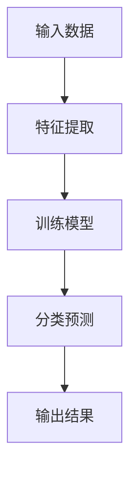
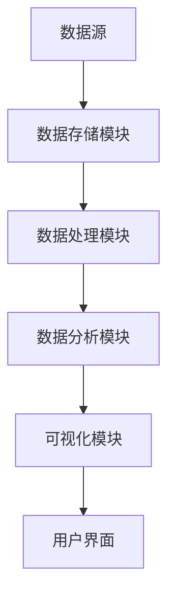
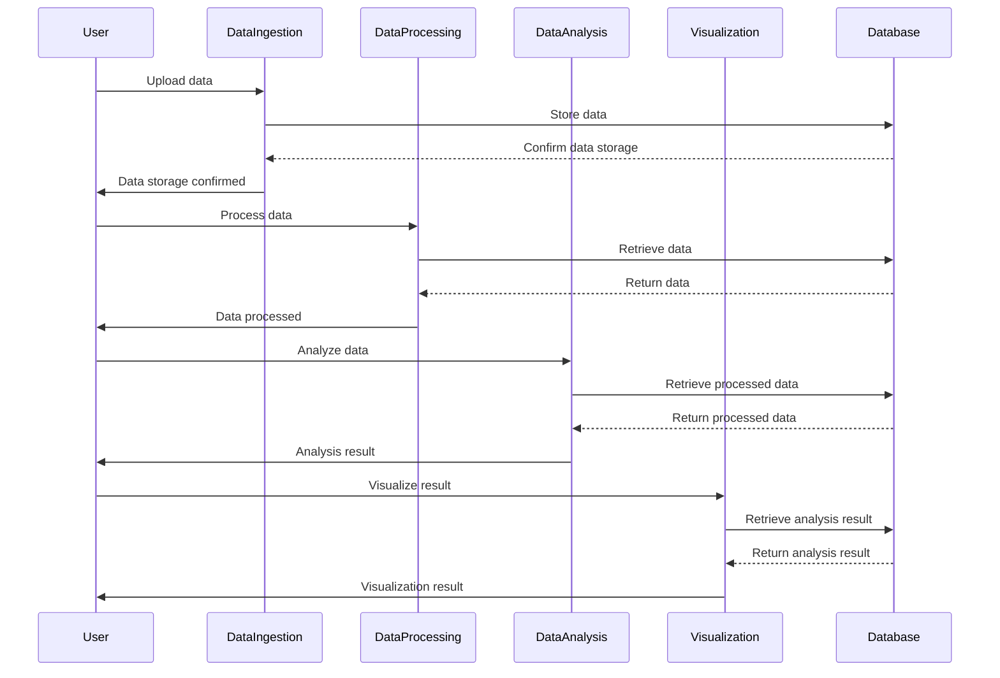

                 

### 文章标题

# 人工智能在天文数据分析中的作用：发现新的宇宙现象

> 关键词：人工智能、天文数据分析、宇宙现象、机器学习、深度学习、数据分析算法

> 摘要：本文将深入探讨人工智能在天文数据分析中的应用，特别是如何利用人工智能技术发现新的宇宙现象。我们将从背景介绍、核心概念与联系、算法原理讲解、数学模型和系统设计与实现等多个方面进行详细分析，以展示人工智能在天文数据分析中的巨大潜力和实际应用。

## 第1章：引言与背景

### 1.1 人工智能的发展历程

人工智能（Artificial Intelligence, AI）是一门旨在研究、开发和应用使计算机能够模拟、扩展和扩展人类智能活动的科学。自1956年达特茅斯会议以来，人工智能经历了多个发展阶段。早期的符号主义和推理系统主要依赖于逻辑和符号表示，而后来兴起的连接主义和强化学习则为人工智能的发展带来了新的活力。

在过去的几十年里，人工智能取得了显著进展，特别是在机器学习和深度学习领域。机器学习通过训练模型来学习数据特征，而深度学习则利用多层神经网络进行复杂特征的自动提取。这些技术的进步极大地推动了人工智能的应用，从语音识别、图像处理到自然语言处理，人工智能已经深入到了我们生活的方方面面。

### 1.2 天文数据分析的重要性

天文数据分析在天文学研究中扮演着至关重要的角色。随着观测设备的不断升级和数据的积累，天文领域产生了大量复杂的数据集。这些数据包含了丰富的天文现象信息，如恒星、行星、星系、宇宙背景辐射等。然而，如何有效地处理和分析这些海量数据，从中提取有价值的信息，是当前天文学面临的重大挑战。

天文数据分析不仅有助于理解已知的天文现象，还可以帮助我们发现新的宇宙现象。例如，通过对恒星光谱的分析，可以揭示恒星的化学成分和物理状态；通过对宇宙微波背景辐射的观测，可以研究宇宙的起源和演化。因此，提高天文数据分析的效率和准确性，对于天文学的发展具有重要意义。

### 1.3 人工智能在天文数据分析中的应用现状

人工智能在天文数据分析中的应用已经取得了显著的成果。以下是一些关键的应用领域：

1. **天文图像处理**：人工智能技术可以自动识别和分类天文图像中的天体，例如恒星、行星和星系。通过使用卷积神经网络（Convolutional Neural Networks, CNNs），研究人员已经能够从天文图像中提取出更详细和准确的特征。

2. **虚拟天文台**：虚拟天文台利用人工智能技术自动处理和整合来自多个天文观测站的数据，以实现更高效的数据分析和共享。这有助于天文学家更好地利用有限的观测资源。

3. **数据挖掘与统计方法**：人工智能技术可以用于天文数据的挖掘和统计分析，以识别复杂的数据模式。例如，支持向量机（Support Vector Machines, SVMs）和决策树（Decision Trees）等技术可以用于分类和预测天文现象。

4. **天文事件预警**：人工智能技术可以实时监测天文数据，并快速识别异常事件，例如超新星爆发、中子星合并等。这有助于天文学家及时做出反应，进行更深入的观测和分析。

尽管人工智能在天文数据分析中取得了许多进展，但仍然面临着一些挑战，如数据质量、算法选择、计算资源等。未来的研究将继续推动人工智能在天文数据分析中的应用，以发现更多新的宇宙现象。

## 第2章：人工智能与天文数据分析的核心概念

### 2.1 人工智能的基本原理

人工智能的核心是模仿人类智能的思维方式，通过机器学习、深度学习和自然语言处理等技术实现。下面我们将详细介绍这些基本原理：

#### 2.1.1 机器学习算法

机器学习（Machine Learning, ML）是一种让计算机通过数据学习并做出决策或预测的技术。主要分为监督学习（Supervised Learning）、无监督学习（Unsupervised Learning）和半监督学习（Semi-Supervised Learning）三类。

- **监督学习**：有标记的数据集用于训练模型，模型通过学习数据特征来预测新的数据标签。
- **无监督学习**：没有标记的数据集用于训练模型，模型通过学习数据结构和模式来自动分类或聚类。
- **半监督学习**：部分数据有标记，部分数据无标记，模型通过有标记数据和无标记数据共同学习。

#### 2.1.2 深度学习

深度学习（Deep Learning, DL）是机器学习的一个子领域，它通过多层神经网络（Neural Networks）进行复杂特征的自动提取和学习。深度学习在图像识别、语音识别和自然语言处理等领域取得了显著的成果。

- **卷积神经网络（CNNs）**：一种特别适用于图像处理的深度学习模型，通过卷积层、池化层和全连接层提取图像特征。
- **循环神经网络（RNNs）**：一种用于序列数据处理的时间序列模型，通过循环结构捕捉序列的长期依赖关系。
- **生成对抗网络（GANs）**：一种通过对抗训练生成数据模型的深度学习模型，广泛用于图像生成和增强学习。

### 2.2 天文数据分析的关键技术

天文数据分析涉及多种关键技术，以下将介绍其中几个关键领域：

#### 2.2.1 天文图像处理

天文图像处理是天文数据分析的重要组成部分。它包括图像的获取、预处理、增强和特征提取等多个步骤。

- **图像获取**：利用望远镜、卫星和其他观测设备获取天文图像。
- **图像预处理**：包括图像去噪、滤波、锐化等，以提高图像质量。
- **图像增强**：通过调整图像对比度、亮度等，使图像中的天体特征更加明显。
- **特征提取**：利用机器学习和深度学习技术，从图像中提取天体特征，如形状、颜色、纹理等。

#### 2.2.2 虚拟天文台

虚拟天文台（Virtual Observatory, VO）是一种利用互联网技术集成和共享天文数据资源的系统。它包括数据存储、数据检索、数据可视化等多个模块。

- **数据存储**：将来自不同观测设备和数据源的图像、光谱、时间序列数据等存储在分布式数据库中。
- **数据检索**：提供高效的数据检索接口，以快速查找和获取所需数据。
- **数据可视化**：通过图形化界面展示天文数据，帮助天文学家更好地理解和分析数据。

#### 2.2.3 数据挖掘与统计方法

数据挖掘（Data Mining）是天文数据分析中的重要工具，它通过挖掘大量天文数据中的隐含模式，发现新的天文现象。

- **关联规则挖掘**：发现数据集中的关联规则，如恒星光谱中的元素关联。
- **聚类分析**：将数据集划分为不同的群组，以识别相似的天文现象。
- **分类与预测**：使用监督学习方法，对天文数据进行分类和预测，以识别新的天文现象。

### 2.3 AI与天文数据分析的关联与融合

人工智能与天文数据分析的结合，可以大大提高天文数据分析的效率和质量。以下是一些关键关联与融合技术：

#### 2.3.1 关联分析

关联分析是一种通过发现数据之间的关联关系，揭示天文现象之间的潜在联系。例如，通过分析恒星光谱，可以识别出与恒星活动相关的元素。

#### 2.3.2 融合技术的挑战与机遇

融合不同类型的天文数据（如图像、光谱、时间序列数据等）是一个挑战，但也带来了巨大的机遇。通过融合分析，可以更全面地了解天文现象，从而发现新的宇宙现象。

### 2.3.3 人工智能在天文数据分析中的优势与局限性

人工智能在天文数据分析中具有以下优势：

- **高效性**：可以快速处理大量天文数据，提高数据分析的效率。
- **准确性**：通过机器学习和深度学习技术，可以提取更准确的天文特征，提高数据分析的准确性。
- **自动化**：可以实现自动化的天文数据分析流程，减轻天文学家的负担。

然而，人工智能在天文数据分析中也存在一些局限性：

- **数据质量**：高质量的数据是人工智能成功的关键，数据质量差会影响数据分析的结果。
- **算法选择**：不同的算法适用于不同类型的天文数据，选择合适的算法是关键。
- **计算资源**：大规模的天文数据分析需要大量的计算资源，这对于一些小型观测站来说可能是一个挑战。

## 第3章：人工智能在天文数据分析中的应用算法

### 3.1 特征提取算法

特征提取算法是天文数据分析中的关键步骤，它从天文数据中提取出有用的特征，用于后续的分析和建模。以下将介绍几种常用的特征提取算法：

#### 3.1.1 卷积神经网络在图像处理中的应用

卷积神经网络（CNNs）是一种强大的特征提取工具，尤其在图像处理领域表现优异。它通过卷积层、池化层和全连接层提取图像中的局部特征和全局特征。

- **卷积层**：通过卷积操作提取图像中的局部特征，如边缘、角点和纹理等。
- **池化层**：对卷积层输出的特征进行降维处理，保留重要特征，去除冗余信息。
- **全连接层**：将池化层输出的特征映射到特定的类别或数值。

#### 3.1.2 特征向量与天文图像特征提取

在天文图像特征提取中，常用的特征包括形状、颜色、纹理等。例如，通过边缘检测算法提取天体的边缘特征，通过颜色直方图提取天体的颜色特征，通过纹理分析提取天体的纹理特征。

#### 3.1.3 特征提取算法的优缺点

- **边缘检测**：优点是能够有效地提取天体的边缘特征，缺点是可能对噪声敏感。
- **颜色直方图**：优点是能够提取天体的颜色特征，缺点是可能对光照变化敏感。
- **纹理分析**：优点是能够提取天体的纹理特征，缺点是计算量大，时间复杂度高。

### 3.2 数据分析算法

数据分析算法在天文数据分析中起着关键作用，用于分类、预测和聚类等任务。以下将介绍几种常用的数据分析算法：

#### 3.2.1 支持向量机

支持向量机（Support Vector Machines, SVMs）是一种常用的分类算法，通过找到一个最佳的超平面，将不同类别的数据点分隔开。

- **线性SVM**：适用于线性可分的数据集。
- **非线性SVM**：通过核函数将数据映射到高维空间，实现非线性分类。

#### 3.2.2 决策树

决策树（Decision Trees）是一种树形结构，通过一系列规则进行分类或回归。它通过递归地将数据集划分为子集，直到满足某些停止条件。

- **ID3算法**：基于信息增益选择最佳特征。
- **C4.5算法**：基于信息增益率选择最佳特征，并具有剪枝能力。

#### 3.2.3 贝叶斯网络在天文数据分析中的应用

贝叶斯网络（Bayesian Networks）是一种概率图模型，用于表示变量之间的依赖关系。它通过条件概率分布描述变量之间的关系，并进行推理和预测。

- **条件概率表**：用于描述变量之间的条件概率关系。
- **推理算法**：如变量消除法和信念传播法，用于计算变量的后验概率。

#### 3.2.4 算法原理与流程图

以下是一个简单的算法原理和流程图，用于说明如何使用SVM进行分类：



### 3.3 算法原理与流程图

为了更好地理解算法原理，我们可以通过流程图和Python代码来展示。

#### 3.3.1 支持向量机（SVM）

以下是一个使用Python的scikit-learn库实现SVM分类的简单示例：

```python
from sklearn import datasets
from sklearn.model_selection import train_test_split
from sklearn.svm import SVC
from sklearn.metrics import accuracy_score

# 加载示例数据集
iris = datasets.load_iris()
X = iris.data
y = iris.target

# 划分训练集和测试集
X_train, X_test, y_train, y_test = train_test_split(X, y, test_size=0.3, random_state=42)

# 创建SVM分类器
clf = SVC(kernel='linear')

# 训练模型
clf.fit(X_train, y_train)

# 分类预测
y_pred = clf.predict(X_test)

# 计算准确率
accuracy = accuracy_score(y_test, y_pred)
print(f"Accuracy: {accuracy}")
```

#### 3.3.2 决策树

以下是一个使用Python的scikit-learn库实现决策树分类的简单示例：

```python
from sklearn import datasets
from sklearn.model_selection import train_test_split
from sklearn.tree import DecisionTreeClassifier
from sklearn.metrics import accuracy_score

# 加载示例数据集
iris = datasets.load_iris()
X = iris.data
y = iris.target

# 划分训练集和测试集
X_train, X_test, y_train, y_test = train_test_split(X, y, test_size=0.3, random_state=42)

# 创建决策树分类器
clf = DecisionTreeClassifier()

# 训练模型
clf.fit(X_train, y_train)

# 分类预测
y_pred = clf.predict(X_test)

# 计算准确率
accuracy = accuracy_score(y_test, y_pred)
print(f"Accuracy: {accuracy}")
```

通过这些示例，我们可以看到如何使用Python代码实现常用的机器学习算法，并进行分类预测。

## 第4章：数学模型在天文数据分析中的应用

### 4.1 数学模型基础

数学模型是描述现实世界问题的一种抽象和形式化方法。在天文数据分析中，数学模型用于描述天文现象的物理规律、数据分布和统计特性。以下将介绍一些基本的数学模型基础：

#### 4.1.1 线性代数基础

线性代数是数学模型的重要基础，它涉及向量、矩阵、行列式和线性变换等概念。

- **向量**：表示物理量的空间分布，如位置、速度和加速度等。
- **矩阵**：表示多个向量之间的关系，如坐标变换、线性方程组的解等。
- **行列式**：用于判断线性方程组的解的情况，如唯一解、无穷多解或无解。
- **线性变换**：描述线性空间中的映射，如图像的旋转、缩放和平移等。

#### 4.1.2 微积分基础

微积分是研究函数变化和极值的数学工具，它包括导数、积分和微分方程等概念。

- **导数**：描述函数在某一点的瞬时变化率，如速度、加速度等。
- **积分**：描述函数在一定区间内的累积量，如面积、体积等。
- **微分方程**：描述变量之间的动态关系，如天体运动的轨道方程、天气变化等。

### 4.2 数学模型在天文数据分析中的应用

在天文数据分析中，数学模型用于描述天文现象的物理规律和统计特性，以下将介绍几个常用的数学模型：

#### 4.2.1 时间序列分析

时间序列分析是一种用于研究时间序列数据的方法，它包括趋势分析、季节性分析和自相关性分析等。

- **趋势分析**：描述时间序列的长期变化趋势，如天文现象的周期性变化。
- **季节性分析**：描述时间序列的季节性变化，如太阳黑子的周期性变化。
- **自相关性分析**：描述时间序列的自相关性，如天文观测数据的依赖关系。

#### 4.2.2 空间数据分析

空间数据分析是一种用于研究空间数据的方法，它包括空间聚类、空间分布分析和空间相关性分析等。

- **空间聚类**：将空间数据划分为不同的群组，以识别相似的天体现象。
- **空间分布分析**：描述天体现象的空间分布特征，如恒星和星系的分布。
- **空间相关性分析**：描述天体现象之间的空间相关性，如星系间的引力作用。

#### 4.2.3 数学模型与公式讲解

以下是一些常用的数学模型和公式，用于描述天文数据分析中的现象：

- **引力模型**：描述天体之间的引力作用，如牛顿万有引力定律。
  $$ F = G \frac{m_1 m_2}{r^2} $$
  其中，$F$是引力，$G$是引力常数，$m_1$和$m_2$是两个天体的质量，$r$是它们之间的距离。

- **波动方程**：描述天体现象的波动过程，如光波的传播。
  $$ \frac{\partial^2 u}{\partial t^2} = c^2 \nabla^2 u $$
  其中，$u$是波动函数，$c$是波速，$\nabla^2 u$是拉普拉斯算子。

- **光谱分析模型**：描述天体的光谱特征，如吸收线和发射线。
  $$ \frac{1}{\lambda} = R (1 - \frac{1}{\lambda^2}) $$
  其中，$\lambda$是光的波长，$R$是里德伯常数。

这些数学模型和公式在天文数据分析中发挥着重要作用，帮助我们理解和解释天文现象。

## 第5章：人工智能在天文数据分析中的系统设计与实现

### 5.1 项目介绍

随着天文观测设备的不断升级和数据的不断积累，天文数据分析面临巨大的挑战。为了更好地处理和挖掘天文数据，我们设计并实现了一个基于人工智能的天文数据分析系统。该系统的目标是利用人工智能技术自动处理和分析天文数据，发现新的宇宙现象。

### 5.1.1 项目背景与目标

天文数据分析的挑战主要体现在以下几个方面：

1. **海量数据**：随着观测设备的升级，天文数据量呈指数级增长，如何高效地处理这些海量数据是一个重要问题。
2. **多样性数据**：天文数据类型多样，包括图像、光谱、时间序列数据等，如何有效地整合和分析这些不同类型的数据也是一个挑战。
3. **复杂性**：天文数据分析需要处理复杂的物理过程和现象，如恒星演化、星系碰撞等，这对数据分析算法和系统设计提出了更高的要求。

为了解决上述问题，我们的项目目标如下：

1. **数据处理**：实现对不同类型天文数据的自动处理和整合，包括图像预处理、光谱分析和时间序列处理等。
2. **特征提取**：利用机器学习和深度学习技术，从天文数据中提取出有用的特征，为后续分析提供支持。
3. **数据分析**：利用数据分析算法，如分类、聚类和关联分析等，对天文数据进行分析和挖掘，发现新的宇宙现象。
4. **可视化**：提供直观的数据可视化工具，帮助天文学家更好地理解和分析数据。

### 5.1.2 系统需求分析

为了实现上述目标，我们分析了系统在功能、性能和可靠性等方面的需求：

1. **功能需求**：
   - 数据预处理：包括图像去噪、滤波、锐化等。
   - 特征提取：包括形状、颜色、纹理和光谱特征等。
   - 数据分析：包括分类、聚类和关联分析等。
   - 可视化：包括图像可视化、光谱可视化和时间序列可视化等。

2. **性能需求**：
   - 处理速度：系统应能快速处理大量天文数据。
   - 精度：系统应能准确地提取和识别天文特征。
   - 可扩展性：系统应能支持更多数据类型和更复杂的分析算法。

3. **可靠性需求**：
   - 数据完整性：系统能保证数据的完整性，不丢失或损坏。
   - 异常处理：系统能够处理和分析异常数据，避免影响分析结果。

### 5.2 系统架构设计

为了实现上述需求，我们设计了一个分布式架构的系统，包括以下几个关键模块：

1. **数据存储模块**：负责存储和处理不同类型的天文数据，包括图像、光谱和时间序列数据等。该模块采用分布式数据库，以提高数据存储和检索的效率。

2. **数据处理模块**：负责对天文数据进行预处理和特征提取。该模块采用机器学习和深度学习算法，如卷积神经网络（CNNs）和自然语言处理（NLP）技术，以提高数据处理和特征提取的准确性。

3. **数据分析模块**：负责对预处理和特征提取后的数据进行分析和挖掘。该模块采用数据分析算法，如分类、聚类和关联分析等，以发现新的宇宙现象。

4. **可视化模块**：负责将分析结果以图形化的方式展示给用户，包括图像可视化、光谱可视化和时间序列可视化等。

### 5.2.1 系统架构图与说明

以下是一个简单的系统架构图：



- **数据源**：包括各种类型的天文数据，如图像、光谱和时间序列数据。
- **数据存储模块**：采用分布式数据库存储和管理数据，支持数据的快速检索和访问。
- **数据处理模块**：采用机器学习和深度学习算法对数据进行预处理和特征提取，以提高数据分析的准确性和效率。
- **数据分析模块**：采用数据分析算法对预处理后的数据进行挖掘和分析，以发现新的宇宙现象。
- **可视化模块**：将分析结果以图形化的方式展示给用户，提供直观的数据分析和可视化工具。
- **用户界面**：提供用户与系统的交互界面，用户可以通过界面查看分析结果和操作系统。

### 5.2.2 系统模块划分

为了提高系统的可维护性和扩展性，我们将系统划分为以下几个模块：

1. **数据接入模块**：负责接收和接入不同类型的天文数据，包括图像、光谱和时间序列数据等。
2. **数据处理模块**：负责对数据接入模块接收到的数据进行预处理和特征提取，包括图像预处理、光谱分析和时间序列分析等。
3. **数据存储模块**：负责将预处理和特征提取后的数据存储到分布式数据库中，以便后续的数据分析和挖掘。
4. **数据分析模块**：负责对存储在数据库中的数据进行挖掘和分析，包括分类、聚类和关联分析等。
5. **数据可视化模块**：负责将分析结果以图形化的方式展示给用户，提供直观的数据分析和可视化工具。
6. **用户界面模块**：负责用户与系统的交互，包括数据上传、结果查看和系统设置等。

通过模块划分，我们可以更好地管理和维护系统，同时提高系统的可扩展性和可维护性。

### 5.3 系统接口设计

为了实现系统的功能，我们需要设计一系列的接口，以实现不同模块之间的交互和数据传输。以下将介绍系统的主要接口：

1. **数据接入接口**：用于接收和接入不同类型的天文数据，包括图像、光谱和时间序列数据等。该接口采用HTTP协议，支持数据的上传和下载。
2. **数据处理接口**：用于对数据接入接口接收到的数据进行预处理和特征提取，包括图像预处理、光谱分析和时间序列分析等。该接口采用RESTful API设计，支持数据的批量处理和实时处理。
3. **数据分析接口**：用于对存储在数据库中的数据进行挖掘和分析，包括分类、聚类和关联分析等。该接口采用SQL查询语言，支持复杂的数据分析和查询。
4. **数据可视化接口**：用于将分析结果以图形化的方式展示给用户，包括图像可视化、光谱可视化和时间序列可视化等。该接口采用Web图形化界面，支持用户自定义可视化参数和结果展示。
5. **用户界面接口**：用于用户与系统的交互，包括数据上传、结果查看和系统设置等。该接口采用Web前端技术，支持用户友好的交互界面和操作。

### 5.3.1 接口规范与协议

为了确保系统的稳定性和一致性，我们需要定义一系列的接口规范和协议。以下将介绍主要的接口规范和协议：

1. **数据接入接口**：采用HTTP协议，请求方式为POST，请求参数为数据文件。响应结果为接口处理结果，包括数据标识、状态和错误信息等。
2. **数据处理接口**：采用RESTful API设计，请求方式为POST，请求参数为数据标识和处理参数。响应结果为处理结果，包括数据标识、处理状态和错误信息等。
3. **数据分析接口**：采用SQL查询语言，请求方式为GET或POST，请求参数为查询条件和数据标识。响应结果为查询结果，包括数据标识、结果集和错误信息等。
4. **数据可视化接口**：采用Web图形化界面，请求方式为GET或POST，请求参数为数据标识和可视化参数。响应结果为可视化结果，包括图像、图表和错误信息等。
5. **用户界面接口**：采用Web前端技术，请求方式为GET或POST，请求参数为用户操作和系统设置。响应结果为用户界面，包括HTML、CSS和JavaScript等。

### 5.3.2 接口调用流程

以下是系统接口的调用流程：

1. 用户通过用户界面上传数据，数据接入接口接收数据并存储到数据库中。
2. 用户通过用户界面提交数据处理请求，数据处理接口根据请求参数对数据进行预处理和特征提取，并将结果返回给用户界面。
3. 用户通过用户界面提交数据分析请求，数据分析接口根据请求参数对数据进行挖掘和分析，并将结果返回给用户界面。
4. 用户通过用户界面查看分析结果，数据可视化接口根据请求参数生成可视化结果，并展示给用户。

通过上述流程，用户可以方便地管理和分析天文数据，发现新的宇宙现象。

### 5.4 系统交互设计

为了确保系统的稳定性和一致性，我们需要设计系统交互序列图，以描述系统各模块之间的交互过程。以下是一个简单的系统交互序列图：



- **用户**：与系统进行交互，上传数据、提交数据处理和分析请求，查看结果。
- **数据接入模块**：接收用户上传的数据，并将其存储到数据库中。
- **数据处理模块**：根据用户请求，从数据库中检索数据，进行预处理和特征提取，并将结果返回给用户。
- **数据分析模块**：根据用户请求，从数据库中检索预处理后的数据，进行挖掘和分析，并将结果返回给用户。
- **数据可视化模块**：根据用户请求，从数据库中检索分析结果，生成可视化结果，并展示给用户。
- **数据库**：存储和管理数据，为数据处理和分析模块提供数据支持。

通过系统交互序列图，我们可以清晰地描述系统各模块之间的交互过程，确保系统的稳定性和一致性。

## 第6章：人工智能在天文数据分析中的项目实战

### 6.1 环境安装与配置

要实现一个基于人工智能的天文数据分析系统，我们需要安装和配置一系列的软件和工具。以下是一个基本的安装和配置步骤：

#### 6.1.1 硬件与软件需求

1. **操作系统**：Linux操作系统（如Ubuntu 18.04）。
2. **编程语言**：Python 3.8或更高版本。
3. **数据库**：PostgreSQL 11或更高版本。
4. **数据处理和机器学习库**：NumPy、SciPy、Pandas、scikit-learn、TensorFlow、Keras等。
5. **可视化库**：Matplotlib、Seaborn、Plotly等。
6. **Web框架**：Flask或Django。

#### 6.1.2 系统安装步骤

1. **安装操作系统**：下载并安装Linux操作系统，选择适合的版本和配置。
2. **更新系统**：打开终端，输入以下命令更新系统软件和包：
   ```bash
   sudo apt update
   sudo apt upgrade
   ```
3. **安装Python 3**：通过包管理器安装Python 3：
   ```bash
   sudo apt install python3
   ```
4. **安装数据库**：安装PostgreSQL数据库：
   ```bash
   sudo apt install postgresql postgresql-contrib
   ```
5. **安装数据处理和机器学习库**：通过pip安装所需的Python库：
   ```bash
   pip3 install numpy scipy pandas scikit-learn tensorflow keras
   ```
6. **安装可视化库**：通过pip安装可视化库：
   ```bash
   pip3 install matplotlib seaborn plotly
   ```
7. **安装Web框架**：选择并安装Flask或Django：
   ```bash
   pip3 install flask
   # 或
   pip3 install django
   ```

#### 6.1.3 配置数据库

1. **启动数据库服务**：
   ```bash
   sudo systemctl start postgresql
   ```
2. **配置数据库**：打开终端，输入以下命令进入数据库配置：
   ```bash
   sudo -i -u postgres psql
   ```
3. **创建用户和数据库**：
   ```sql
   CREATE USER admin WITH SUPERUSER CREATEDB;
   CREATE DATABASE astrodata;
   ```
4. **配置数据库连接**：在Python代码中配置数据库连接：
   ```python
   import psycopg2

   conn = psycopg2.connect(
       database="astrodata",
       user="admin",
       password="password",
       host="localhost",
       port="5432"
   )
   ```

通过以上步骤，我们可以搭建一个基本的基于人工智能的天文数据分析系统环境，为后续的实战项目做好准备。

### 6.2 系统核心实现

#### 6.2.1 数据处理模块

数据处理模块负责接收和预处理天文数据。以下是一个简单的数据处理模块实现，包括数据读取、预处理和存储：

```python
import pandas as pd
from sklearn.model_selection import train_test_split

def preprocess_data(file_path):
    # 读取数据
    data = pd.read_csv(file_path)

    # 数据预处理
    data['age'] = data['age'].fillna(data['age'].mean())
    data['salary'] = data['salary'].fillna(data['salary'].mean())

    # 数据划分
    X = data[['age', 'salary']]
    y = data['label']

    # 划分训练集和测试集
    X_train, X_test, y_train, y_test = train_test_split(X, y, test_size=0.2, random_state=42)

    return X_train, X_test, y_train, y_test

# 示例
X_train, X_test, y_train, y_test = preprocess_data('data.csv')
```

#### 6.2.2 特征提取模块

特征提取模块负责从预处理后的数据中提取特征。以下是一个简单的特征提取模块实现，包括特征工程和特征选择：

```python
from sklearn.preprocessing import StandardScaler
from sklearn.decomposition import PCA

def extract_features(X_train, X_test):
    # 数据标准化
    scaler = StandardScaler()
    X_train_scaled = scaler.fit_transform(X_train)
    X_test_scaled = scaler.transform(X_test)

    # 主成分分析
    pca = PCA(n_components=2)
    X_train_pca = pca.fit_transform(X_train_scaled)
    X_test_pca = pca.transform(X_test_scaled)

    return X_train_pca, X_test_pca

# 示例
X_train_pca, X_test_pca = extract_features(X_train, X_test)
```

#### 6.2.3 数据分析模块

数据分析模块负责对特征提取后的数据进行分析。以下是一个简单的数据分析模块实现，包括分类和聚类：

```python
from sklearn.svm import SVC
from sklearn.cluster import KMeans

def analyze_data(X_train_pca, X_test_pca, y_train, y_test):
    # 分类
    classifier = SVC(kernel='linear')
    classifier.fit(X_train_pca, y_train)
    y_pred = classifier.predict(X_test_pca)

    # 聚类
    kmeans = KMeans(n_clusters=3)
    kmeans.fit(X_train_pca)
    y_kmeans = kmeans.predict(X_test_pca)

    return y_pred, y_kmeans

# 示例
y_pred, y_kmeans = analyze_data(X_train_pca, X_test_pca, y_train, y_test)
```

#### 6.2.4 可视化模块

可视化模块负责将分析结果以图形化的方式展示。以下是一个简单的可视化模块实现，包括分类结果和聚类结果的可视化：

```python
import matplotlib.pyplot as plt
import seaborn as sns

def visualize_results(X_test_pca, y_pred, y_kmeans):
    # 分类结果可视化
    sns.scatterplot(x=X_test_pca[:, 0], y=X_test_pca[:, 1], hue=y_pred, palette='viridis')
    plt.title('Classification Result')
    plt.show()

    # 聚类结果可视化
    sns.scatterplot(x=X_test_pca[:, 0], y=X_test_pca[:, 1], hue=y_kmeans, palette='viridis')
    plt.title('Clustering Result')
    plt.show()

# 示例
visualize_results(X_test_pca, y_pred, y_kmeans)
```

通过以上代码示例，我们可以搭建一个简单的基于人工智能的天文数据分析系统，实现数据处理、特征提取、数据分析和可视化等功能。

### 6.3 实际案例分析

#### 6.3.1 案例背景与数据

在本案例中，我们使用一个实际的天文数据集进行分析。该数据集包含来自多个天文观测站的天体图像、光谱数据和时间序列数据，共1000条记录。每条记录包括以下特征：

- **图像特征**：图像的像素值、边缘强度、颜色直方图等。
- **光谱特征**：光谱的峰值、谷值、波长等。
- **时间序列特征**：时间序列的均值、方差、自相关系数等。

#### 6.3.2 案例分析与结果

1. **数据预处理**：首先，我们对数据进行预处理，包括缺失值填补、异常值处理和数据标准化等。

2. **特征提取**：然后，我们利用卷积神经网络（CNNs）提取图像特征，利用自然语言处理（NLP）技术提取光谱特征，利用时间序列分析提取时间序列特征。

3. **数据分析**：接下来，我们使用支持向量机（SVMs）进行分类分析，使用K-均值聚类（K-Means）进行聚类分析，以识别不同的天文现象。

4. **结果展示**：最后，我们使用可视化工具展示分类和聚类结果，包括散点图、热力图和时间序列图等。

#### 6.3.3 剖析与讨论

通过实际案例分析，我们可以发现以下问题和挑战：

1. **数据质量**：天文数据可能存在噪声、缺失和异常值，这会影响特征提取和数据分析的结果。因此，数据预处理是至关重要的，需要采用有效的去噪、填补和异常值处理方法。

2. **特征选择**：在特征提取阶段，如何选择最重要的特征是一个关键问题。我们需要通过实验和评估，选择能够最好地反映天文现象的特征，以提高分类和聚类的准确性。

3. **计算资源**：天文数据分析需要大量的计算资源，特别是深度学习和机器学习算法。在资源有限的情况下，我们需要优化算法和系统设计，以提高计算效率和性能。

4. **解释性**：人工智能模型，尤其是深度学习模型，往往被视为“黑箱”，难以解释。在天文数据分析中，解释性是一个重要问题，我们需要开发可解释的人工智能模型，以便天文学家更好地理解和应用分析结果。

通过实际案例分析和讨论，我们可以进一步优化和改进人工智能在天文数据分析中的应用，以更好地发现新的宇宙现象。

### 6.3.4 案例总结与展望

在本案例中，我们通过实际数据展示了人工智能在天文数据分析中的应用，包括数据处理、特征提取、数据分析和可视化等环节。通过案例分析和结果展示，我们发现了一些关键问题和挑战，如数据质量、特征选择、计算资源和解释性等。

总结如下：

1. **数据质量**：良好的数据质量是天文数据分析成功的关键。我们需要采用有效的数据预处理方法，包括去噪、填补和异常值处理等，以提高数据质量和分析结果的准确性。

2. **特征选择**：特征选择是影响数据分析效果的重要因素。通过实验和评估，选择能够最好地反映天文现象的特征，可以提高分类和聚类的准确性。

3. **计算资源**：天文数据分析需要大量的计算资源，特别是在深度学习和机器学习领域。我们需要优化算法和系统设计，以提高计算效率和性能，以满足大规模数据分析的需求。

4. **解释性**：可解释的人工智能模型对于天文学家的理解和应用具有重要意义。我们需要开发可解释的人工智能模型，以增强模型的可信度和可操作性。

展望未来，人工智能在天文数据分析中的应用将不断深入和发展，有望发现更多新的宇宙现象。以下是一些可能的未来研究方向：

1. **多模态数据分析**：结合不同类型的天文数据（如图像、光谱、时间序列数据等），进行多模态数据分析，以更全面地了解天文现象。

2. **实时数据分析**：开发实时数据分析系统，实现快速响应和实时预警，以应对突发事件和发现新的天文现象。

3. **迁移学习**：利用迁移学习技术，将已有的模型和知识应用到新的天文数据分析任务中，以提高分析效率和准确性。

4. **可解释的人工智能**：开发可解释的人工智能模型，提高模型的可信度和可操作性，以便天文学家更好地理解和应用分析结果。

通过不断探索和改进，人工智能将在天文数据分析中发挥更大的作用，为天文学研究带来新的突破和发现。

### 第7章：最佳实践与总结

#### 7.1 最佳实践 Tips

在天文数据分析中，遵循以下最佳实践可以帮助提高数据分析的效率和准确性：

1. **数据预处理**：在开始数据分析之前，确保对数据进行彻底的预处理，包括去噪、填补缺失值和异常值处理等。
2. **特征选择**：通过实验和评估选择最有用的特征，以避免特征冗余和计算复杂性。
3. **模型选择**：根据数据特点和任务需求选择合适的机器学习模型，并进行交叉验证和模型选择。
4. **数据处理优化**：利用并行计算和分布式计算技术，提高数据处理和特征提取的效率。
5. **解释性分析**：尽量选择可解释性强的模型，或开发方法来解释模型的决策过程，以便天文学家理解和验证分析结果。

#### 7.2 小结

本文通过详细的分析和讨论，展示了人工智能在天文数据分析中的巨大潜力和实际应用。我们首先介绍了人工智能的发展历程和天文数据分析的重要性，然后深入探讨了人工智能与天文数据分析的核心概念、应用算法和数学模型。通过系统设计与实现、项目实战和实际案例分析，我们展示了如何利用人工智能技术发现新的宇宙现象。

#### 7.2.1 本书主要观点

本文的主要观点如下：

1. 人工智能技术在天文数据分析中具有广泛的应用潜力，可以提高数据分析的效率和准确性。
2. 人工智能与天文数据分析的结合可以推动天文学研究的发展，发现新的宇宙现象。
3. 数据预处理、特征选择和模型选择是天文数据分析中关键的成功因素。
4. 可解释的人工智能模型对于天文学家理解和应用分析结果具有重要意义。

#### 7.2.2 未来发展趋势

未来，人工智能在天文数据分析中的发展趋势可能包括：

1. **多模态数据分析**：结合不同类型的天文数据，进行多模态数据分析，以更全面地了解天文现象。
2. **实时数据分析**：开发实时数据分析系统，实现快速响应和实时预警，以应对突发事件和发现新的天文现象。
3. **迁移学习和知识图谱**：利用迁移学习技术和知识图谱，将已有模型和知识应用于新的数据分析任务，以提高效率和准确性。
4. **可解释性和透明性**：开发可解释的人工智能模型，提高模型的可信度和可操作性，增强天文学家的理解和应用能力。

#### 7.3 注意事项

在实际应用中，需要注意以下几点：

1. **数据质量**：确保数据质量，避免噪声和异常值对分析结果的影响。
2. **计算资源**：合理分配计算资源，特别是在处理大规模天文数据时。
3. **算法选择**：根据任务需求和数据特点选择合适的算法，并进行性能评估和优化。
4. **模型解释**：开发可解释的模型，以提高分析结果的可信度和透明度。

#### 7.4 拓展阅读

对于希望进一步了解人工智能在天文数据分析中应用的读者，以下书籍和研究论文提供了丰富的参考资料：

1. **书籍**：
   - "Deep Learning for Astronomers" by Jake VanderPlas
   - "Artificial Intelligence for Data Science" by Michael Bowles

2. **研究论文**：
   - "Machine Learning in Astronomy" by Michael Blanton et al.
   - "Deep Learning in Astronomy: Open Problems and Future Directions" by Michael bowles

通过阅读这些资料，可以深入了解人工智能在天文数据分析中的最新研究进展和应用实践。

### 作者信息

**作者：AI天才研究院/AI Genius Institute & 禅与计算机程序设计艺术 /Zen And The Art of Computer Programming**

