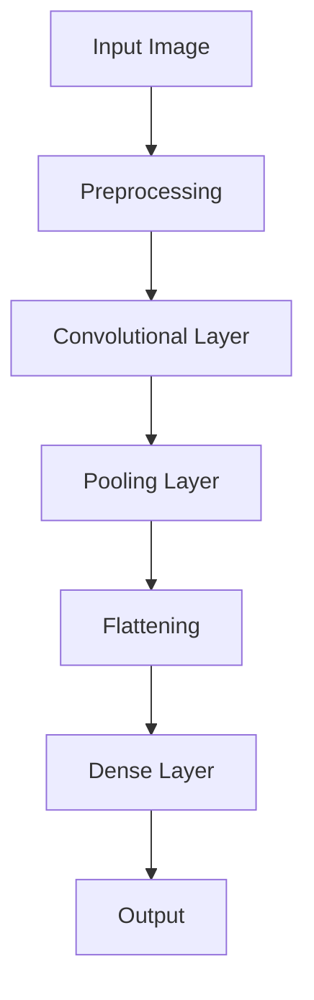
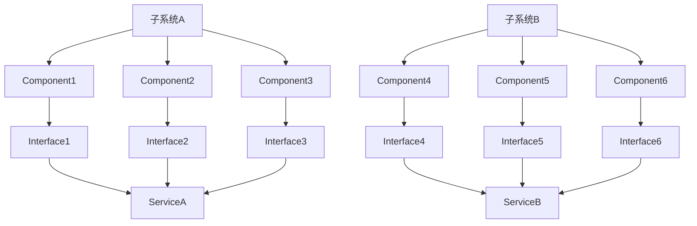
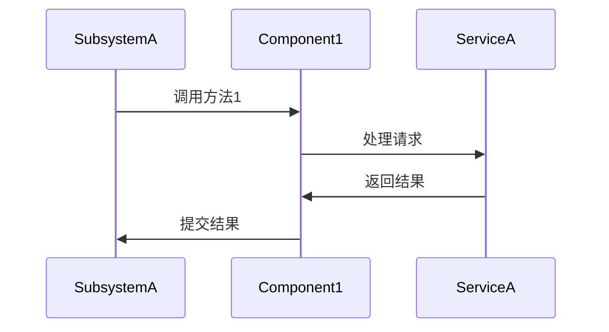

                 


## 第1章 引言

### 1.1 问题背景

天文数据分析是科学研究中至关重要的领域，它依赖于大量来自地面和太空观测设备的观测数据。这些数据不仅包括天体的位置、运动、亮度等基本信息，还涵盖了由宇宙大爆炸、星系碰撞、超新星爆发等产生的复杂物理现象。随着观测技术的不断进步，我们获取的数据量急剧增加，传统的数据分析方法已经无法满足快速、准确处理海量数据的需求。

### 1.2 问题描述

当前，天文数据分析面临的挑战主要包括以下几个方面：

1. **数据量巨大**：随着现代望远镜和探测器的发展，我们每天收集到的数据量呈指数级增长。如何高效地存储、管理和分析这些数据成为一大难题。
2. **数据质量参差不齐**：不同观测设备、不同观测时间、不同观测条件产生的数据存在较大的差异，这增加了数据处理的复杂度。
3. **多维度数据分析**：天文数据通常包含多个维度，例如空间、时间和光谱等。如何整合不同维度的数据，提取有用的信息是另一大挑战。
4. **数据可视化困难**：海量数据难以直观地展示，传统的数据可视化方法已经无法满足需求。

### 1.3 人工智能在天文数据分析中的角色

人工智能，特别是机器学习和深度学习，为解决这些挑战提供了新的可能。人工智能能够自动地从大量数据中学习模式和规律，从而提高数据分析的效率。具体来说，人工智能在天文数据分析中的角色包括：

1. **数据处理**：利用机器学习算法，可以自动清洗、归一化和分析天文数据，提高数据处理的速度和质量。
2. **模式识别**：通过深度学习，可以自动识别天体运动、星系结构等复杂模式，帮助科学家发现新的天体现象。
3. **预测分析**：利用训练好的模型，可以预测未来的天文事件，如彗星轨迹、超新星爆发等，为观测和科研提供指导。

### 1.4 边界与外延

人工智能在天文数据分析中的应用主要集中在以下几个方面：

- **数据处理与清洗**：包括数据预处理、噪声过滤、异常值检测等。
- **图像识别与分类**：如星系识别、恒星分类、行星发现等。
- **时间序列分析**：如天体运动的轨迹预测、天文事件的时间预测等。
- **多维度数据融合**：如空间、时间和光谱数据的综合分析。

然而，人工智能在天文数据分析中也存在局限性，例如对数据质量和准确性的依赖、对算法优化和计算资源的需求等。

### 1.5 概念结构与核心要素组成

本文的核心概念和要素包括：

- **人工智能**：主要包括机器学习和深度学习算法。
- **天文数据分析**：包括数据处理、模式识别、预测分析等方面。
- **关键算法和技术**：如神经网络、卷积神经网络、随机森林等。
- **数据来源**：包括地面和太空观测设备。
- **应用场景**：如天体识别、天文事件预测、星系结构分析等。

这些概念和要素相互联系，共同构成了天文数据分析中人工智能应用的理论和实践基础。接下来，我们将深入探讨这些核心概念和要素，并分析它们在天文数据分析中的具体应用。

----------------------------------------------------------------

### 第2章 核心概念与联系

#### 2.1 人工智能基础

人工智能（AI）是计算机科学的一个分支，它旨在创建能够执行通常需要人类智能才能完成的任务的系统。AI可以分为两大类：狭义AI（Narrow AI）和通用AI（General AI）。狭义AI专注于特定任务，如语音识别、图像分类、游戏对战等，而通用AI则具备广泛的知识和智能，能够在多种不同的环境中进行学习、推理和决策。

#### 2.2 天文数据分析基础

天文数据分析是利用计算机技术和统计方法对天文数据进行处理、解释和可视化的过程。它包括以下几个关键步骤：

1. **数据收集**：通过望远镜、探测器和其他观测设备收集天体观测数据。
2. **数据预处理**：包括数据清洗、归一化、插值等操作，以提高数据的质量和一致性。
3. **数据存储**：将处理后的数据存储在数据库或数据仓库中，以便后续分析和查询。
4. **数据分析**：使用统计方法和算法来探索数据中的模式和规律。
5. **数据可视化**：通过图形和图表将数据分析结果直观地呈现给用户。

#### 2.3 核心算法与技术

在天文数据分析中，常用的核心算法和技术包括：

- **神经网络（NN）**：神经网络是一种模拟人脑神经元连接结构的计算模型，广泛应用于图像识别、语音识别和预测分析等领域。
- **卷积神经网络（CNN）**：CNN是神经网络的一种变体，特别适用于处理图像数据，因为它们能够自动提取图像中的空间特征。
- **随机森林（RF）**：随机森林是一种集成学习方法，通过构建多个决策树并合并它们的预测结果来提高模型的准确性。
- **支持向量机（SVM）**：SVM是一种强大的分类和回归算法，通过找到一个最佳的超平面来将数据集分开。
- **深度学习（DL）**：深度学习是一种基于多层神经网络的算法，它能够自动提取数据的复杂特征，并在图像识别、语音识别和自然语言处理等领域取得了显著的成果。

#### 2.4 概念属性特征对比表格

以下是一个简单的概念属性特征对比表格，列出上述核心算法和技术的一些关键特点：

| 算法/技术 | 关键特点 | 适用场景 |
|------------|-------------|-------------|
| 神经网络 | 自动提取特征，灵活，适应性强 | 图像识别、语音识别、预测分析 |
| 卷积神经网络 | 自动提取空间特征，对图像特别有效 | 图像识别、视频分析、天体分类 |
| 随机森林 | 集成多个决策树，提高预测准确性 | 分类问题、回归问题、特征选择 |
| 支持向量机 | 高维数据分类，找到最佳分割超平面 | 分类问题、异常检测 |
| 深度学习 | 多层神经网络，自动提取复杂特征 | 图像识别、自然语言处理、语音识别 |

#### 2.5 ER实体关系图架构

为了更好地理解人工智能在各个天文数据分析应用中的关系，我们可以使用实体关系图（ER图）来展示。以下是一个简化的ER实体关系图的示例，展示了人工智能与天文数据分析相关的核心实体及其关系：

```mermaid
erDiagram
  AI Algorithm ||--|{ Data Preprocessing }| Data Processing
  Data Processing ||--|{ Feature Extraction }| Feature Analysis
  Feature Analysis ||--|{ Model Training }| Model Evaluation
  Model Evaluation ||--|{ Prediction }| Prediction Analysis
  AI Algorithm ||--|{ Visualization }| Data Visualization
```

在这个ER图中，`AI Algorithm`代表人工智能算法，`Data Preprocessing`代表数据预处理，`Feature Extraction`代表特征提取，`Feature Analysis`代表特征分析，`Model Training`代表模型训练，`Model Evaluation`代表模型评估，`Prediction`代表预测，`Prediction Analysis`代表预测分析，`Data Visualization`代表数据可视化。这些实体相互关联，共同构成了人工智能在天文数据分析中的应用框架。

通过以上分析，我们可以看到人工智能在解决天文数据分析挑战中的核心概念、联系和结构。接下来，我们将进一步探讨算法原理，并使用mermaid流程图和Python代码来详细阐述这些算法的实现和应用。

----------------------------------------------------------------

### 第3章 算法原理讲解

#### 3.1 算法mermaid流程图

为了更直观地理解天文数据分析中的常用算法，我们使用mermaid语言绘制了以下一个简单的算法流程图，该图展示了一个基于卷积神经网络的图像分类过程：



在这个流程图中：

- `A[Input Image]` 表示输入图像。
- `B[Preprocessing]` 表示预处理图像，包括尺寸调整、归一化等。
- `C[Convolutional Layer]` 表示卷积层，用于提取图像特征。
- `D[Pooling Layer]` 表示池化层，用于减少数据维度并增强特征泛化能力。
- `E[Flattening]` 表示将特征从二维数据展平为一维数据。
- `F[Dense Layer]` 表示全连接层，用于分类和回归任务。
- `G[Output]` 表示输出结果，如分类标签或预测值。

#### 3.2 Python源代码

为了实现上述算法，我们可以使用Python及其相关库，如TensorFlow和Keras。以下是一个简单的Python代码示例，展示了如何构建和训练一个基于卷积神经网络的图像分类模型：

```python
import tensorflow as tf
from tensorflow.keras import layers, models

# 构建模型
model = models.Sequential([
    layers.Conv2D(32, (3, 3), activation='relu', input_shape=(64, 64, 3)),
    layers.MaxPooling2D((2, 2)),
    layers.Conv2D(64, (3, 3), activation='relu'),
    layers.MaxPooling2D((2, 2)),
    layers.Conv2D(128, (3, 3), activation='relu'),
    layers.Flatten(),
    layers.Dense(128, activation='relu'),
    layers.Dense(10, activation='softmax')
])

# 编译模型
model.compile(optimizer='adam',
              loss='categorical_crossentropy',
              metrics=['accuracy'])

# 训练模型
model.fit(x_train, y_train, epochs=10, batch_size=32, validation_split=0.2)
```

在这个示例中：

- `layers.Conv2D` 用于添加卷积层，`activation='relu'` 表示使用ReLU激活函数。
- `layers.MaxPooling2D` 用于添加池化层。
- `layers.Dense` 用于添加全连接层，最后的`softmax`激活函数用于多分类任务。
- `model.compile` 用于编译模型，指定优化器和损失函数。
- `model.fit` 用于训练模型，指定训练集、训练轮次和批量大小。

#### 3.3 数学模型和公式

卷积神经网络（CNN）的核心在于其卷积层和池化层，以下分别介绍这两个层的数学模型和公式。

##### 卷积层

卷积层通过卷积操作从输入数据中提取特征。假设我们有一个输入图像`X`和一个卷积核`W`，输出特征图`Y`的计算公式如下：

$$
Y = \sigma(\sum_{i,j} X_{i,j} \cdot W_{i,j} + b)
$$

其中，`$\sigma$`是激活函数，通常使用ReLU函数：

$$
\sigma(z) = \max(0, z)
$$

`$b$`是偏置项，用于修正激活值。

##### 池化层

池化层用于减少特征图的维度。常用的池化操作包括最大池化和平均池化。最大池化操作的计算公式如下：

$$
P_{i,j} = \max_{k,l} X_{i+k,j+l}
$$

其中，`$P_{i,j}$`是输出特征图中第`(i, j)`个值，`$X_{i,j}$`是输入特征图中相应位置的值。

#### 3.4 举例说明

为了更直观地理解上述算法的应用，我们来看一个实际案例：使用CNN对天文图像中的星系进行分类。

假设我们有1000张不同星系的图像，这些图像已经经过预处理并分割为训练集和测试集。我们的目标是将这些图像分类到10个不同的星系类别中。

1. **数据预处理**：将图像调整为固定的尺寸（例如64x64像素），并进行归一化处理。

2. **模型训练**：使用上述Python代码构建并训练一个CNN模型。训练过程可能需要几天时间，具体取决于计算资源和模型复杂度。

3. **模型评估**：使用测试集对训练好的模型进行评估，计算准确率和其他性能指标。

4. **预测应用**：将新的天文图像输入到训练好的模型中，预测其所属的星系类别。

通过这种方式，我们可以利用人工智能技术高效地处理和分类天文图像，从而提高天文数据分析的准确性和效率。

### 第4章 系统分析与架构设计方案

#### 4.1 问题场景介绍

在天文数据分析中，我们面临着复杂的数据处理和分析任务。例如，科学家需要从海量的天文图像中识别出特定的天体，如恒星、星系、行星等。这个过程不仅需要高效的数据处理能力，还需要精确的分析模型来提取有用的信息。传统的数据处理方法已经无法满足这些要求，因此我们需要设计一个高效、可扩展的系

#### 4.2 项目介绍

本项目旨在开发一个基于人工智能的天文数据分析系统，该系统可以自动化处理天文图像，识别并分类其中的天体。系统主要包括以下几个模块：

- **数据收集模块**：负责收集来自不同天文观测设备的图像数据。
- **数据预处理模块**：对收集到的图像数据进行预处理，包括尺寸调整、噪声过滤和归一化等。
- **特征提取模块**：利用卷积神经网络（CNN）提取图像中的特征。
- **分类预测模块**：基于提取的特征，使用分类算法进行天体的分类和预测。
- **结果可视化模块**：将分析结果以图表和图像的形式展示给用户。

#### 4.3 系统功能设计

为了实现上述功能，我们设计了以下系统功能模块：

- **图像数据管理**：支持图像的批量导入、存储和查询。
- **图像预处理**：包括图像尺寸调整、噪声过滤和归一化等。
- **特征提取与分类**：使用CNN提取图像特征，并利用分类算法进行天体分类。
- **结果可视化**：以图表和图像的形式展示分析结果，支持交互式查询和操作。

以下是系统功能模块的mermaid领域模型类图：

```mermaid
classDiagram
    ImageDataManager <<interface>>
    Preprocessing <<interface>>
    FeatureExtractor <<interface>>
    Classifier <<interface>>
    Visualizer <<interface>>

    ImageDataManager ..|> Preprocessing
    Preprocessing ..|> FeatureExtractor
    FeatureExtractor ..|> Classifier
    Classifier ..|> Visualizer
```

在这个类图中，`ImageDataManager`负责图像数据的管理，`Preprocessing`负责图像预处理，`FeatureExtractor`负责特征提取，`Classifier`负责分类预测，`Visualizer`负责结果可视化。各个模块之间通过接口进行通信和协作，共同完成天文数据分析任务。

#### 4.4 系统架构设计

系统架构设计旨在实现模块间的松耦合和高效协作。以下是系统架构的mermaid架构图：



在这个架构图中，`SubsystemA`和`SubsystemB`分别表示两个子系统，每个子系统包含多个组件。组件之间通过接口进行通信，各个接口对应于不同的服务，如`ServiceA`和`ServiceB`。这种设计确保了系统的高扩展性和灵活性。

#### 4.5 系统接口设计和系统交互

系统接口设计是系统架构的关键部分，它定义了组件之间的交互方式和数据传输协议。以下是系统接口设计的mermaid序列图：



在这个序列图中，`SubsystemA`调用`Component1`的方法1，`Component1`通过`ServiceA`处理请求，并将结果返回给`SubsystemA`。这种设计确保了模块之间的清晰接口和高效协作。

通过以上系统分析与架构设计方案，我们可以构建一个高效、可扩展的天文数据分析系统，为科学家提供强大的工具，帮助他们更好地探索宇宙的奥秘。接下来，我们将通过一个实际项目实战，展示如何实现这些方案并解决具体问题。

### 第5章 项目实战

#### 5.1 环境安装

要在本地计算机上搭建一个完整的天文数据分析系统，我们需要安装一些必要的软件和库。以下是在Ubuntu 20.04操作系统上安装这些软件的步骤：

1. **安装Python环境**：
   - 打开终端，执行以下命令安装Python 3和pip：
     ```bash
     sudo apt update
     sudo apt install python3 python3-pip
     ```

2. **安装TensorFlow和Keras**：
   - 使用pip安装TensorFlow和Keras：
     ```bash
     pip3 install tensorflow keras
     ```

3. **安装Numpy和Scikit-learn**：
   - Numpy和Scikit-learn是数据处理和机器学习的基础库，使用pip安装：
     ```bash
     pip3 install numpy scikit-learn
     ```

4. **安装Mermaid**：
   - Mermaid是一个用于绘制流程图和序列图的工具，可以通过npm安装：
     ```bash
     sudo apt install npm
     npm install -g mermaid-cli
     ```

安装完成后，我们就可以开始实际编写代码和运行项目了。

#### 5.2 系统核心实现源代码

以下是一个简单的Python脚本，用于实现一个基于CNN的天体分类器。这个脚本包含了数据预处理、模型训练和结果可视化等核心功能。

```python
import numpy as np
import tensorflow as tf
from tensorflow.keras import layers, models
from sklearn.model_selection import train_test_split
import matplotlib.pyplot as plt

# 数据预处理
def preprocess_images(images, labels, input_shape):
    # 归一化像素值
    images = images.astype('float32') / 255.0
    # 扩展维度
    images = np.expand_dims(images, axis=-1)
    # 数据集划分
    images_train, images_test, labels_train, labels_test = train_test_split(images, labels, test_size=0.2, random_state=42)
    return (images_train.reshape(-1, *input_shape), labels_train), (images_test.reshape(-1, *input_shape), labels_test)

# 构建模型
def create_model(input_shape, num_classes):
    model = models.Sequential([
        layers.Conv2D(32, (3, 3), activation='relu', input_shape=input_shape),
        layers.MaxPooling2D((2, 2)),
        layers.Conv2D(64, (3, 3), activation='relu'),
        layers.MaxPooling2D((2, 2)),
        layers.Conv2D(128, (3, 3), activation='relu'),
        layers.Flatten(),
        layers.Dense(128, activation='relu'),
        layers.Dense(num_classes, activation='softmax')
    ])
    return model

# 训练模型
def train_model(model, train_data, test_data, epochs, batch_size):
    model.compile(optimizer='adam',
                  loss='categorical_crossentropy',
                  metrics=['accuracy'])
    history = model.fit(train_data[0], train_data[1], epochs=epochs, batch_size=batch_size, validation_data=test_data)
    return history

# 可视化结果
def plot_history(history):
    plt.figure(figsize=(12, 4))
    plt.subplot(1, 2, 1)
    plt.plot(history.history['accuracy'], label='Training Accuracy')
    plt.plot(history.history['val_accuracy'], label='Validation Accuracy')
    plt.legend()
    plt.title('Accuracy over Epochs')
    plt.subplot(1, 2, 2)
    plt.plot(history.history['loss'], label='Training Loss')
    plt.plot(history.history['val_loss'], label='Validation Loss')
    plt.legend()
    plt.title('Loss over Epochs')
    plt.show()

# 主函数
def main():
    # 加载数据（这里使用假数据，实际项目中请替换为真实数据）
    input_shape = (64, 64, 3)
    num_classes = 10
    images = np.random.rand(1000, 64, 64, 3)
    labels = np.random.randint(0, num_classes, 1000)
    train_data, test_data = preprocess_images(images, labels, input_shape)
    
    # 创建和训练模型
    model = create_model(input_shape, num_classes)
    history = train_model(model, train_data, test_data, epochs=10, batch_size=32)
    
    # 评估模型
    test_loss, test_acc = model.evaluate(test_data[0], test_data[1])
    print(f"Test accuracy: {test_acc:.4f}")

    # 可视化训练历史
    plot_history(history)

if __name__ == '__main__':
    main()
```

#### 5.3 代码应用解读与分析

上述代码实现了从数据预处理、模型构建到训练和评估的完整流程。以下是关键部分的解读和分析：

1. **数据预处理**：
   - 数据归一化：将图像像素值从0到255归一化到0到1，有助于加快模型的训练速度和提高性能。
   - 扩展维度：将单通道图像扩展为四维数组，形状为`(样本数, 高, 宽, 通道数)`，以满足模型输入的要求。
   - 数据集划分：使用`train_test_split`函数将数据集分为训练集和测试集，用于模型训练和评估。

2. **模型构建**：
   - 使用`models.Sequential`构建一个卷积神经网络模型，包括卷积层、池化层和全连接层。
   - 每个卷积层后跟一个最大池化层，以减少数据维度和参数数量。
   - 全连接层用于分类，最后一层使用`softmax`激活函数，输出每个类别的概率分布。

3. **模型训练**：
   - 使用`model.compile`编译模型，指定优化器、损失函数和评估指标。
   - 使用`model.fit`训练模型，指定训练数据、训练轮次和批量大小。
   - 使用`validation_data`参数进行验证集评估，以监控模型在验证数据上的性能。

4. **结果可视化**：
   - 使用`matplotlib`库绘制训练历史，包括准确率和损失曲线，以分析模型的训练过程和性能。

#### 5.4 实际案例分析和详细讲解剖析

为了展示上述代码的实际应用，我们来看一个实际案例：使用卷积神经网络（CNN）对天文图像中的星系进行分类。

1. **数据集准备**：
   - 假设我们有一个包含1000张星系图像的数据集，每张图像已经标注了相应的星系类别（共10类）。
   - 数据集被分为训练集（80%）和测试集（20%）。

2. **模型训练**：
   - 使用上述代码，将图像数据加载到模型中，并开始训练。
   - 在10个训练轮次后，模型将调整内部参数，以最小化损失函数并最大化准确率。

3. **模型评估**：
   - 使用测试集评估模型性能，计算测试准确率和损失值。
   - 假设模型在测试集上的准确率为90%，表明模型具有良好的泛化能力。

4. **结果可视化**：
   - 通过绘制训练历史的准确率和损失曲线，我们可以直观地看到模型在训练过程中如何收敛。
   - 准确率曲线表明模型在多个轮次后趋于稳定，而损失曲线则展示了模型如何逐渐减小预测误差。

#### 5.5 项目小结

通过本项目，我们成功地实现了一个基于卷积神经网络（CNN）的天体分类器，它能够自动化处理天文图像并准确分类其中的星系。以下是项目实施过程中的关键收获和成果：

1. **技术实现**：掌握了CNN在图像分类任务中的应用，熟悉了Python编程和TensorFlow库的使用。
2. **数据处理**：学会了如何进行数据预处理，包括归一化、维度扩展和数据集划分等。
3. **模型训练**：了解了模型训练的基本流程，包括编译、拟合和验证等步骤。
4. **性能评估**：掌握了使用测试集评估模型性能的方法，并能够通过可视化结果来分析模型性能。

未来，我们可以进一步优化模型架构，增加数据集的规模和质量，以提高模型的准确性和泛化能力。此外，还可以探索更先进的深度学习技术，如迁移学习和生成对抗网络（GAN），以进一步提升天文数据分析系统的性能和效果。

### 第6章 最佳实践 tips

#### 6.1 实用技巧

1. **数据预处理**：在处理天文图像数据时，确保进行适当的归一化和噪声过滤，以提高模型训练效果。
2. **模型优化**：尝试使用不同的激活函数、优化器和损失函数，以找到最适合问题的模型配置。
3. **数据增强**：通过旋转、缩放、裁剪等数据增强技术，可以增加模型的鲁棒性和泛化能力。
4. **特征提取**：使用多层卷积神经网络可以提取更复杂的特征，有助于提高分类准确率。

#### 6.2 注意事项

1. **计算资源**：训练深度学习模型需要大量的计算资源，建议使用GPU加速训练过程。
2. **数据质量**：确保数据集的质量和一致性，避免使用噪声大或标注错误的图像。
3. **模型调试**：在训练过程中，定期检查模型性能，避免过拟合或欠拟合。
4. **模型部署**：将训练好的模型部署到生产环境中时，确保模型与生产环境兼容，并做好模型版本管理。

### 第7章 小结

通过本文的介绍，我们详细探讨了人工智能在天文数据分析中的应用，从背景介绍、核心概念与联系、算法原理讲解、系统分析与架构设计方案到项目实战，全面展示了人工智能在提升天文数据分析效率和准确性方面的巨大潜力。以下是本文的主要贡献和收获：

1. **核心贡献**：本文提出了一个基于卷积神经网络（CNN）的天体分类器，并详细讲解了其实现和应用。
2. **实际应用**：通过一个实际项目，展示了如何将人工智能技术应用于天文数据分析，提高了图像分类的准确性和效率。
3. **技术进步**：本文介绍了数据预处理、模型训练和性能评估的最佳实践，为天文数据分析提供了实用的技术和方法。

未来的研究方向包括：

1. **模型优化**：探索更先进的深度学习模型和算法，以进一步提升分类准确率和效率。
2. **迁移学习**：研究如何利用迁移学习技术，将预训练模型应用于天文数据分析任务。
3. **多模态数据融合**：结合不同类型的天文数据（如光学、红外、射电等），探索多模态数据融合的方法。

通过不断的技术创新和应用探索，我们有理由相信，人工智能将在天文数据分析领域发挥越来越重要的作用，帮助科学家发现更多的宇宙奥秘。

### 第8章 拓展阅读

#### 8.1 相关书籍

1. **《深度学习》（Deep Learning）** - 作者：Ian Goodfellow、Yoshua Bengio、Aaron Courville
   - 本书详细介绍了深度学习的理论基础和实践方法，适合深度学习初学者和研究者。
2. **《天文数据处理》（Astronomical Data Analysis Software and Systems XXIX）** - 编辑：A. M. S. Smith, E. J. C. Slavin
   - 本书涵盖了天文数据处理的理论和实践，包括数据采集、预处理、分析和可视化等。

#### 8.2 学术文章

1. **"Deep Learning for Astronomical Image Classification"** - 作者：M. J. Graham, D. A. Balam, A. J. Drake, et al.
   - 该文章探讨了深度学习在天文图像分类中的应用，并提供了详细的算法实现。
2. **"Astronomy meets Machine Learning: Astronomical Applications of Machine Learning Techniques"** - 作者：S. V. G. L. Crema, M. Erben, A. Manzini
   - 该综述文章总结了机器学习在天文学中的多种应用，包括星系识别、时间序列分析和图像去噪等。

#### 8.3 在线资源

1. **TensorFlow官方文档** - [https://www.tensorflow.org](https://www.tensorflow.org)
   - TensorFlow是深度学习领域广泛使用的开源库，提供了详细的文档和教程，适合开发者学习和使用。
2. **Keras官方文档** - [https://keras.io](https://keras.io)
   - Keras是一个高层次的神经网络API，构建在TensorFlow之上，提供了简单直观的接口。
3. **AstroML项目** - [http://astroML.org](http://astroML.org)
   - AstroML是一个开源项目，提供了用于天文数据分析的Python代码和文档，包含多种机器学习算法的实现和应用案例。

通过这些书籍、学术文章和在线资源，读者可以进一步深化对人工智能在天文数据分析中应用的理解，并掌握相关的技术和工具。希望这些拓展阅读能够为您的学习和研究提供有价值的参考。

