                 


### 1. 问题背景

#### 1.1 心理健康问题的普遍性

心理健康问题在全球范围内都受到了广泛关注。据世界卫生组织（WHO）统计，心理疾病已经成为全球范围内的主要健康问题之一。抑郁症、焦虑症、精神分裂症等心理疾病的发病率逐年上升，不仅对个体的生活质量和心理健康产生严重影响，也给社会带来了巨大的经济负担。特别是在当今社会，工作压力、生活节奏加快、社交关系紧张等因素，进一步加剧了人们的心理压力，使得心理健康问题愈加突出。

#### 1.2 传统心理治疗方法的局限性

尽管传统的心理治疗方法，如心理治疗、药物治疗等，在一定程度上能够缓解患者的心理问题，但其局限性也逐渐显现。首先，传统心理治疗往往需要面对面的交流，这限制了治疗的地点和时间的灵活性。其次，心理治疗的资源相对有限，许多患者难以获得及时有效的治疗。此外，传统心理治疗方法的治疗效果因人而异，且治疗过程较长，患者需要付出较大的时间和经济成本。

#### 1.3 人工智能在心理健康领域的潜力

随着人工智能技术的飞速发展，其在心理健康领域的应用前景也日益广阔。人工智能可以通过大数据分析、机器学习等技术，实现心理健康的自动评估和诊断，为患者提供更加个性化和及时的治疗方案。同时，虚拟现实（VR）和增强现实（AR）等技术，可以为心理治疗提供全新的方式，使得患者可以在虚拟环境中进行心理训练和康复。此外，人工智能还可以在隐私保护方面发挥作用，确保患者在心理健康治疗过程中数据的安全和隐私。

### 1.4 问题描述

#### 1.4.1 心理健康问题的多样性

心理健康问题具有多样性和复杂性，不同类型的心理疾病需要不同的治疗方法。例如，抑郁症和焦虑症的治疗方法就有所不同。此外，心理健康问题还可能与其他身体疾病相互作用，使得治疗过程更加复杂。因此，如何准确识别和诊断心理健康问题，是心理健康治疗的关键。

#### 1.4.2 心理健康数据的复杂性

心理健康数据通常包含大量的个人信息和敏感信息，如病历记录、心理评估报告、患者心理状态变化等。这些数据的复杂性使得传统的数据分析方法难以有效处理。同时，心理健康数据的隐私性和安全性也成为了重要的关注点。

#### 1.4.3 心理健康评估和治疗的个性化需求

每个人的心理健康状况都是独一无二的，因此，针对不同患者的心理健康评估和治疗方案也需要因人而异。人工智能可以通过对大量心理健康数据的分析，为患者提供个性化的心理健康评估和治疗方案，提高治疗效果。

### 1.5 问题解决

#### 1.5.1 人工智能技术在心理健康评估中的应用

人工智能技术在心理健康评估中的应用主要体现在以下几个方面：

1. **大数据分析**：通过分析大量的心理健康数据，人工智能可以识别出潜在的心理健康问题，为早期干预提供支持。
2. **机器学习模型**：使用机器学习算法，人工智能可以建立心理健康的预测模型，帮助医生更准确地诊断心理疾病。
3. **自然语言处理**：通过分析患者的病历记录、心理评估报告等文本数据，人工智能可以提取关键信息，为心理评估提供支持。

#### 1.5.2 人工智能技术在心理治疗中的应用

人工智能技术在心理治疗中的应用同样具有很大的潜力：

1. **虚拟治疗**：利用虚拟现实（VR）和增强现实（AR）技术，患者可以在虚拟环境中进行心理训练和康复，减少对现实环境的依赖。
2. **个性化治疗**：通过分析患者的心理健康数据，人工智能可以制定个性化的心理治疗方案，提高治疗效果。
3. **远程治疗**：利用人工智能和互联网技术，患者可以在任何时间、任何地点接受心理治疗，提高治疗的便捷性和效率。

#### 1.5.3 人工智能技术在隐私保护中的应用

在心理健康领域，隐私保护是至关重要的。人工智能技术在隐私保护中的应用主要包括：

1. **数据加密**：通过加密技术，确保心理健康数据在传输和存储过程中的安全性。
2. **匿名化处理**：通过去除个人身份信息，对心理健康数据进行匿名化处理，保护患者的隐私。
3. **隐私法规遵守**：遵循相关的隐私保护法规，如GDPR等，确保患者的数据权益得到保护。

### 1.6 边界与外延

#### 1.6.1 心理健康与精神健康的区别

心理健康和精神健康是两个相关的概念，但它们有着不同的含义。心理健康通常指的是个体的情绪、认知和行为状态处于良好状态，能够有效地应对日常生活中的压力和挑战。而精神健康则更侧重于个体的精神状态，包括精神障碍、心理疾病等。

#### 1.6.2 虚拟治疗与远程治疗的异同

虚拟治疗和远程治疗都是利用技术手段进行心理治疗的方式，但它们有所不同。

1. **虚拟治疗**：主要利用虚拟现实（VR）和增强现实（AR）技术，患者在虚拟环境中进行心理训练和康复。虚拟治疗强调的是患者的沉浸式体验，通过模拟各种情境，帮助患者缓解心理压力和改善心理健康。
2. **远程治疗**：主要通过互联网进行心理治疗，患者和医生之间的交流通过视频、音频等方式进行。远程治疗强调的是治疗的便捷性和灵活性，患者可以在任何时间、任何地点接受心理治疗。

#### 1.6.3 概念结构与核心要素组成

要深入理解人工智能在心理健康领域的应用，需要了解以下几个核心概念：

1. **人工智能**：包括机器学习、深度学习、自然语言处理等技术，用于心理健康评估、诊断和治疗。
2. **心理健康**：包括心理健康指标、心理健康评估标准等，用于衡量个体的心理健康状态。
3. **虚拟治疗**：包括虚拟现实（VR）和增强现实（AR）技术，用于心理治疗和康复。
4. **隐私保护**：包括数据加密、匿名化处理、隐私法规遵守等，确保心理健康数据的安全和隐私。

### 1.7 总结

人工智能在心理健康领域的应用，不仅为心理健康评估和治疗提供了新的手段，也为隐私保护带来了新的挑战。通过本文的介绍，我们可以看到，人工智能在心理健康领域的应用具有广阔的前景，但同时也需要我们关注隐私保护等问题。在未来的发展中，人工智能技术将继续推动心理健康领域的发展，为人们的心理健康带来更多的福音。

### 关键词

- 人工智能
- 心理健康
- 虚拟治疗
- 隐私保护
- 心理评估
- 心理治疗
- 机器学习
- 深度学习
- 自然语言处理
- 虚拟现实
- 增强现实

### 摘要

本文探讨了人工智能在心理健康领域的应用，包括虚拟治疗和隐私保护。首先，介绍了心理健康问题的普遍性和传统心理治疗方法的局限性，然后阐述了人工智能在心理健康评估和治疗中的潜力。文章详细介绍了心理健康评估、虚拟治疗和隐私保护的核心概念和原理，并通过案例分析展示了人工智能在心理健康领域的实际应用。最后，提出了人工智能在心理健康领域的发展前景和面临的挑战，强调了隐私保护的重要性。

----------------------------------------------------------------

## 第一部分: 背景介绍

### 第1章: 问题背景

#### 1.1 问题背景

心理健康问题是一个全球性的健康挑战。根据世界卫生组织（WHO）的数据，全球有超过3亿人患有抑郁症和焦虑症，这些精神健康问题不仅影响个体的生活质量，也对社会经济产生了深远的影响。心理健康问题包括抑郁症、焦虑症、双相情感障碍、精神分裂症等多种类型，它们可能单独出现，也可能相互作用，增加了治疗的复杂性。

在当前社会环境中，心理健康问题的发生率呈现上升趋势。随着全球化进程的加快、工作压力的增大和生活节奏的加快，人们的心理压力也在不断累积。此外，互联网和社交媒体的普及，虽然为人们的交流提供了便利，但也导致了信息过载和社交隔离，影响了人们的心理健康。

传统心理治疗方式包括药物治疗、心理治疗和认知行为疗法等，这些方法在一定程度上能够缓解患者的症状，但由于治疗资源有限、治疗过程耗时且成本较高，许多患者难以获得及时和有效的治疗。此外，传统心理治疗往往依赖于面对面交流，限制了治疗的灵活性和可及性。

#### 1.2 问题描述

心理健康问题具有多样性和复杂性，不同的心理疾病需要不同的治疗方法。例如，抑郁症和焦虑症的治疗方法有所不同，且每种治疗方法的效果因人而异。心理健康问题的诊断和评估是一个复杂的过程，需要考虑个体的心理、社会和环境因素。

心理健康数据的复杂性也是一个亟待解决的问题。心理健康数据通常包括患者的病历记录、心理评估报告、情绪日志等多种信息，这些数据的种类繁多，结构复杂，难以通过传统的方法进行有效的分析和处理。此外，心理健康数据的隐私性和安全性也是关注的重点，由于心理健康数据包含敏感的个人信息，如何确保这些数据的安全和隐私是心理治疗过程中必须考虑的问题。

#### 1.3 问题解决

人工智能技术在心理健康领域的应用为解决这些问题提供了一种新的思路和工具。首先，人工智能可以通过大数据分析和机器学习模型，对大量的心理健康数据进行处理和分析，从而更准确地识别和诊断心理疾病。例如，通过分析患者的情绪日志、社交网络数据等，可以预测患者患抑郁症的风险，为早期干预提供依据。

其次，人工智能技术可以提高心理治疗的效率和个性化水平。通过自然语言处理技术，人工智能可以理解患者的语言和情感，提供个性化的心理治疗建议。例如，智能聊天机器人可以实时与患者交流，提供情感支持和心理指导，帮助患者缓解焦虑和抑郁情绪。

此外，虚拟现实（VR）和增强现实（AR）技术在心理健康领域的应用也为心理治疗提供了一种新的方式。通过虚拟环境，患者可以在安全、可控的情境中接受心理治疗，进行认知行为训练和情绪调节。例如，虚拟现实技术可以帮助患者克服社交恐惧症，通过模拟社交场景，帮助患者逐渐适应和改善社交行为。

最后，人工智能技术在隐私保护方面也发挥着重要作用。通过数据加密、匿名化处理和隐私保护算法，人工智能可以确保患者在心理健康治疗过程中的数据安全和隐私。例如，通过对患者数据的匿名化处理，可以防止个人信息的泄露，确保患者的隐私不受侵犯。

总之，人工智能在心理健康领域的应用具有巨大的潜力，不仅可以提高心理治疗的效率和个性化水平，还可以通过大数据分析和智能诊断，为心理健康问题的早期干预和精准治疗提供支持。然而，也必须认识到，人工智能技术的应用面临着数据隐私和安全、技术伦理等挑战，需要采取有效的措施来解决。

### 1.4 边界与外延

#### 1.4.1 心理健康与精神健康的区别

心理健康和精神健康是两个相关的概念，但它们的范围和含义有所不同。心理健康通常指的是个体在情感、行为和认知方面的健康状态，它强调的是个体的整体福祉和适应能力。心理健康问题可以包括焦虑、抑郁、压力管理等，这些问题可能影响到个体的日常生活和工作效率。

精神健康则更多地关注个体的精神状态，包括精神障碍、心理疾病等。精神健康问题通常需要专业的医疗干预，例如精神分裂症、重度抑郁症、强迫症等。精神健康问题可能严重影响个体的社会功能和生活质量，需要通过药物治疗、心理治疗等多种方式进行治疗。

在心理健康领域，心理健康和精神健康是相互关联的。良好的心理健康有助于维护精神健康，而精神健康问题也可能导致心理健康问题。因此，在讨论心理健康问题时，通常需要综合考虑个体的情感、行为和精神状态。

#### 1.4.2 虚拟治疗与远程治疗的异同

虚拟治疗和远程治疗都是利用技术手段进行心理治疗的方式，但它们有不同的应用场景和特点。

虚拟治疗主要利用虚拟现实（VR）和增强现实（AR）技术，为患者提供一个沉浸式的虚拟环境。在这个虚拟环境中，患者可以经历各种情境，进行心理训练和情绪调节。例如，通过虚拟现实技术，患者可以模拟社交互动，克服社交恐惧症；或者通过虚拟情境的模拟，帮助患者处理创伤后应激障碍（PTSD）。

远程治疗则主要通过互联网和通信技术进行，患者和医生之间通过视频通话、电子邮件等方式进行互动。远程治疗的一个主要优势是便捷性，患者不需要前往诊所，可以在家中接受治疗。远程治疗可以涵盖各种心理治疗形式，包括个别治疗、团体治疗和家庭治疗等。

虚拟治疗和远程治疗的主要区别在于其技术实现和应用场景。虚拟治疗强调的是沉浸式体验，需要专业的硬件设备和软件支持，而远程治疗则更多地依赖于互联网和通信技术，操作相对简单。此外，虚拟治疗可以提供更加个性化的治疗体验，而远程治疗则更注重于治疗过程中的沟通和互动。

#### 1.4.3 概念结构与核心要素组成

人工智能在心理健康领域的应用涉及多个核心概念和要素。以下是对这些概念和要素的简要介绍：

1. **人工智能技术**：包括机器学习、深度学习和自然语言处理等，用于心理健康数据的分析和处理。
2. **心理健康评估指标**：用于衡量个体的心理健康状态，包括情绪、焦虑、抑郁程度等。
3. **心理治疗方法**：包括认知行为疗法、药物治疗和心理咨询等，利用人工智能技术进行个性化定制。
4. **虚拟现实（VR）和增强现实（AR）技术**：用于提供沉浸式的心理治疗体验。
5. **数据隐私和安全**：确保心理健康数据在存储、传输和处理过程中的安全性和隐私性。

这些核心概念和要素共同构成了人工智能在心理健康领域应用的基础框架，为心理健康问题的诊断、评估和治疗提供了新的手段和工具。

### 1.5 概念结构与核心要素组成

在深入探讨人工智能在心理健康领域的应用之前，我们需要明确几个核心概念和要素，这些构成了理解这一领域的基石。

#### 1.5.1 人工智能

人工智能（AI）是一个广泛的概念，它涉及通过计算机模拟人类智能的各种技术。在心理健康领域，人工智能主要应用在以下几个方面：

1. **机器学习**：机器学习是一种让计算机通过数据学习并做出决策或预测的方法。在心理健康领域，机器学习可以用于构建模型，对心理健康数据进行分析，从而帮助诊断和预测心理疾病。
2. **深度学习**：深度学习是机器学习的一种高级形式，它模仿人脑的神经网络结构，用于处理和分析大量的数据。在心理健康评估中，深度学习可以帮助识别复杂的数据模式，从而提高诊断的准确性。
3. **自然语言处理（NLP）**：自然语言处理是使计算机能够理解、解释和生成自然语言的技术。在心理健康领域，NLP可以用于分析患者的病历记录、心理评估报告和聊天记录，提取有用的信息，帮助医生做出更准确的诊断和制定治疗方案。

#### 1.5.2 心理健康

心理健康是指个体在情感、行为和认知方面的健康状态。心理健康领域涉及多个方面，包括：

1. **心理健康指标**：这些指标用于衡量个体的心理健康状态，例如焦虑水平、抑郁程度、生活满意度等。通过量化和评估这些指标，可以更好地了解患者的心理状况，为治疗提供依据。
2. **心理健康评估标准**：这些标准是用于评估心理健康状况的指南，包括临床诊断标准、心理测量工具和评估量表等。这些标准有助于确保心理健康评估的准确性和一致性。

#### 1.5.3 虚拟治疗

虚拟治疗是一种利用虚拟现实（VR）和增强现实（AR）技术进行心理治疗的方法。虚拟治疗的核心要素包括：

1. **虚拟现实（VR）**：通过VR技术，患者可以进入一个完全模拟的环境，这个环境可以用来模拟治疗过程中的各种情境，例如社交互动、暴露疗法等。VR技术提供了沉浸式的体验，使患者能够在安全、可控的环境中进行心理训练。
2. **增强现实（AR）**：与VR不同，AR技术将虚拟元素叠加在现实环境中，为患者提供更加现实的治疗体验。AR技术可以用于心理治疗中的虚拟现实场景模拟，例如通过在患者眼前显示文字或图像，提供情绪调节指导。

#### 1.5.4 隐私保护

在心理健康领域，隐私保护至关重要。隐私保护的要素包括：

1. **数据加密**：通过对心理健康数据进行加密，确保数据在传输和存储过程中的安全性和完整性。加密技术可以防止未授权的访问和数据的篡改。
2. **匿名化处理**：通过去除个人信息，对数据进行匿名化处理，保护患者的隐私。匿名化处理可以确保即使在数据泄露的情况下，个人身份也无法被识别。
3. **隐私法规遵守**：在心理健康数据的管理过程中，必须遵守相关的隐私保护法规，如欧盟的通用数据保护条例（GDPR）和加州消费者隐私法案（CCPA）。遵守隐私法规是确保患者数据安全和隐私的必要条件。

通过理解这些核心概念和要素，我们可以更深入地探讨人工智能在心理健康领域的应用，包括如何利用这些技术提高心理健康的诊断准确性、治疗效果和患者隐私保护水平。

### 1.6 总结

本章节对人工智能在心理健康领域的应用进行了背景介绍。首先，我们探讨了心理健康问题的普遍性和传统心理治疗方法的局限性，明确了人工智能在这一领域的重要性和潜力。接着，我们详细描述了心理健康问题的多样性和复杂性，以及心理健康数据的隐私性和安全性。然后，我们介绍了人工智能在心理健康评估和治疗中的应用，包括大数据分析、机器学习模型和自然语言处理技术。此外，我们还讨论了虚拟治疗和隐私保护在心理健康领域中的核心作用。最后，我们总结了人工智能在心理健康领域应用的核心概念和要素，包括人工智能技术、心理健康评估指标、心理治疗方法和隐私保护措施。通过这些内容的介绍，我们为后续章节的深入探讨奠定了基础，也为读者提供了对这一领域的全面了解。

----------------------------------------------------------------

## 第二部分: 核心概念与联系

### 第2章: 核心概念与联系

在探讨人工智能在心理健康领域的应用时，理解核心概念及其相互联系至关重要。本章将详细介绍人工智能、心理健康、虚拟治疗和隐私保护等核心概念，并通过概念属性特征对比表格和ER实体关系图架构来展示它们之间的联系。

#### 2.1 核心概念原理

人工智能、心理健康、虚拟治疗和隐私保护是本章节探讨的核心概念，每个概念都有其独特的原理和应用场景。

1. **人工智能**：
   - **原理**：人工智能是通过模拟人类智能行为的计算系统，包括机器学习、深度学习和自然语言处理等技术。
   - **应用**：在心理健康领域，人工智能可以用于数据分析和处理，提高心理健康评估和治疗的准确性和效率。

2. **心理健康**：
   - **原理**：心理健康是指个体在情感、行为和认知方面的健康状态，涉及情绪调节、社会适应和认知功能等。
   - **应用**：心理健康评估指标用于衡量个体的心理健康状态，心理治疗则旨在改善这种状态。

3. **虚拟治疗**：
   - **原理**：虚拟治疗利用虚拟现实（VR）和增强现实（AR）技术，为患者提供一个沉浸式的治疗环境。
   - **应用**：通过虚拟环境，患者可以进行心理训练、情绪调节和社交互动，以克服心理障碍。

4. **隐私保护**：
   - **原理**：隐私保护涉及数据加密、匿名化处理和遵守隐私法规，确保个人数据在存储、传输和处理过程中的安全性。
   - **应用**：在心理健康领域，隐私保护是确保患者数据不被未经授权访问和泄露的关键。

#### 2.2 概念属性特征对比表格

为了更直观地展示这些核心概念之间的差异和联系，我们提供了一个对比表格。

| 概念             | 属性特征                                                   |
|------------------|----------------------------------------------------------|
| 人工智能         | 机器学习、深度学习、自然语言处理、计算模型             |
| 心理健康         | 心理健康指标、情绪调节、认知功能、社会适应             |
| 虚拟治疗         | 虚拟现实（VR）、增强现实（AR）、沉浸式体验、心理训练   |
| 隐私保护         | 数据加密、匿名化处理、隐私法规遵守、数据安全           |

通过这个表格，我们可以看到每个概念的关键属性特征，以及它们在心理健康领域的应用。

#### 2.3 ER实体关系图架构

为了进一步理解这些核心概念之间的联系，我们可以使用ER（Entity-Relationship）图来展示它们的关系。以下是ER图的简化和解释：

```mermaid
erDiagram
  Patient ||--|{ Assessment } : "receives"
  Patient ||--|{ Treatment } : "receives"
  Patient ||--|{ PrivacyPolicy } : "complies with"
  Assessment ||--|{ DiagnosticTool } : "uses"
  Treatment ||--|{ TherapeuticMethod } : "uses"
  PrivacyPolicy ||--|{ DataEncryption } : "enables"
  PrivacyPolicy ||--|{ Anonymization } : "enables"
```

这个ER图说明了以下关系：

- **Patient（患者）** 与 **Assessment（评估）**、**Treatment（治疗）** 和 **PrivacyPolicy（隐私政策）** 之间存在关系，患者接受评估、治疗并遵守隐私政策。
- **Assessment** 与 **DiagnosticTool（诊断工具）** 之间存在关系，诊断工具用于评估心理健康状态。
- **Treatment** 与 **TherapeuticMethod（治疗方法）** 之间存在关系，治疗方法用于改善心理健康状态。
- **PrivacyPolicy** 与 **DataEncryption（数据加密）** 和 **Anonymization（匿名化处理）** 之间存在关系，这些措施确保了数据的安全和隐私。

通过这个ER图，我们可以清晰地看到患者、评估、治疗和隐私保护之间的关系，以及它们如何共同构成心理健康领域的生态系统。

#### 2.4 人工智能技术在心理健康领域的实际应用

在实际应用中，人工智能技术在心理健康领域扮演着多种角色，以下是几个具体的例子：

1. **心理健康评估**：
   - **应用**：人工智能可以通过分析患者的病历记录、聊天记录和生理信号，提供个性化的心理健康评估。
   - **技术**：使用自然语言处理（NLP）技术，人工智能可以理解患者的语言和情感，提取关键信息，为医生提供诊断参考。

2. **心理治疗**：
   - **应用**：通过虚拟现实（VR）技术，患者可以在虚拟环境中进行心理训练，例如认知行为疗法（CBT）和暴露疗法。
   - **技术**：深度学习算法可以帮助医生定制个性化的治疗方案，通过分析大量病例数据，预测治疗效果。

3. **隐私保护**：
   - **应用**：人工智能技术可以确保患者数据的安全和隐私，例如通过数据加密和匿名化处理，防止数据泄露。
   - **技术**：使用联邦学习（Federated Learning）等技术，人工智能可以在不需要直接共享数据的情况下，进行数据分析，从而保护患者隐私。

通过这些实际应用，我们可以看到人工智能技术在心理健康领域的广泛影响，不仅提高了诊断和治疗的准确性，还增强了患者数据的安全性和隐私保护。

### 2.5 结论

通过本章的探讨，我们深入了解了人工智能、心理健康、虚拟治疗和隐私保护等核心概念，并展示了它们之间的联系。理解这些概念及其应用，对于进一步探讨人工智能在心理健康领域的创新和挑战至关重要。在接下来的章节中，我们将继续深入分析这些技术，探讨其原理和数学模型，并探讨如何在实际应用中优化和改进。

----------------------------------------------------------------

### 2.1 核心概念原理

在探讨人工智能（AI）在心理健康领域的应用时，理解AI的核心概念及其原理至关重要。以下是人工智能、心理健康、虚拟治疗和隐私保护等核心概念的详细介绍。

#### 人工智能（AI）

人工智能是指通过计算机模拟人类智能行为的科学和技术。它包括多种技术，如机器学习（ML）、深度学习（DL）和自然语言处理（NLP）。

1. **机器学习（ML）**：
   - **原理**：机器学习是一种让计算机从数据中学习并做出预测或决策的方法。它使用统计方法、算法和模型来识别数据中的模式和关系。
   - **应用**：在心理健康领域，机器学习可以用于构建诊断模型、预测心理健康状况和个性化治疗建议。

2. **深度学习（DL）**：
   - **原理**：深度学习是机器学习的一种高级形式，它使用多层神经网络来模拟人类大脑的学习过程。通过逐层提取数据特征，深度学习能够处理大量的复杂数据。
   - **应用**：在心理健康领域，深度学习可以用于情感分析、图像识别和语音识别，从而帮助医生更好地理解患者的心理状态。

3. **自然语言处理（NLP）**：
   - **原理**：自然语言处理是使计算机能够理解、解释和生成自然语言的技术。它涉及语言识别、语义理解和文本生成等任务。
   - **应用**：在心理健康领域，NLP可以用于分析患者的聊天记录、病历记录和自我报告，提取关键信息，为诊断和治疗提供支持。

#### 心理健康

心理健康是指个体在情感、行为和认知方面的健康状态。它不仅涉及情绪调节和压力管理，还包括个体的社交适应、生活满意度和整体福祉。

1. **心理健康指标**：
   - **原理**：心理健康指标是用于衡量个体心理健康状态的量化工具，如焦虑评分、抑郁量表和心理健康问卷等。
   - **应用**：心理健康指标可以帮助医生评估患者的心理状态，监测治疗效果，并制定个性化的治疗方案。

2. **心理治疗**：
   - **原理**：心理治疗是通过与专业人士的互动，帮助个体解决心理问题、改善情绪和行为的方法。它包括认知行为疗法、精神分析和家庭治疗等。
   - **应用**：在心理健康领域，心理治疗可以采用传统的面对面交流方式，也可以通过虚拟治疗和远程治疗进行。

#### 虚拟治疗

虚拟治疗是指利用虚拟现实（VR）和增强现实（AR）技术进行心理治疗的方法。它为患者提供一个沉浸式的环境，帮助他们面对和处理心理问题。

1. **虚拟现实（VR）**：
   - **原理**：虚拟现实技术通过计算机生成的三维环境，使用户能够体验沉浸式互动。
   - **应用**：在心理健康领域，VR可以用于治疗恐惧症、焦虑症和创伤后应激障碍（PTSD），通过模拟各种情境帮助患者逐渐克服心理障碍。

2. **增强现实（AR）**：
   - **原理**：增强现实技术通过在现实世界中叠加虚拟元素，提供增强的视觉和听觉体验。
   - **应用**：在心理健康领域，AR可以用于提供心理治疗中的实时指导和支持，例如通过在患者眼前显示文字或图像，帮助他们进行情绪调节。

#### 隐私保护

在心理健康领域，隐私保护至关重要，因为心理健康数据通常包含敏感的个人信息。隐私保护涉及多种技术和措施，以确保数据的安全和保密。

1. **数据加密**：
   - **原理**：数据加密是一种通过将数据转换成密文来保护数据不被未授权访问的方法。
   - **应用**：在心理健康领域，数据加密可以用于保护患者在互联网传输过程中的数据，防止数据泄露。

2. **匿名化处理**：
   - **原理**：匿名化处理通过去除或修改个人身份信息，使数据无法识别特定个人。
   - **应用**：在心理健康领域，匿名化处理可以用于保护患者数据的隐私，使其在分析和共享过程中不被泄露。

3. **隐私法规遵守**：
   - **原理**：隐私法规是一系列法律法规，规定了个人数据的收集、处理和存储的标准。
   - **应用**：在心理健康领域，遵守隐私法规可以确保患者的数据权益得到保护，避免因数据滥用导致的法律风险。

通过理解这些核心概念及其原理，我们可以更好地把握人工智能在心理健康领域的应用潜力，并认识到其中涉及的技术挑战和伦理问题。接下来，我们将进一步探讨这些概念之间的联系，并分析其属性特征。

### 2.2 概念属性特征对比表格

为了更直观地展示人工智能、心理健康、虚拟治疗和隐私保护等核心概念之间的属性特征，我们创建了一个对比表格。以下是对这些概念的详细对比：

| 概念             | 属性特征                                                   |
|------------------|----------------------------------------------------------|
| 人工智能（AI）   | 机器学习、深度学习、自然语言处理、计算模型、算法能力 |
| 心理健康         | 心理健康指标、情绪调节、认知功能、社会适应             |
| 虚拟治疗         | 虚拟现实（VR）、增强现实（AR）、沉浸式体验、心理训练   |
| 隐私保护         | 数据加密、匿名化处理、隐私法规遵守、数据安全           |

通过这个对比表格，我们可以清晰地看到每个概念的核心属性特征，以及它们在心理健康领域的具体应用。以下是对表格中每个概念的进一步解释：

- **人工智能（AI）**：
  - **机器学习、深度学习、自然语言处理**：这些技术使得人工智能能够从数据中学习，并应用于各种任务，如数据分析和预测。
  - **计算模型、算法能力**：计算模型和算法是人工智能的基础，使得机器能够执行复杂的任务，如图像识别、语音识别和自然语言处理。

- **心理健康**：
  - **心理健康指标**：心理健康指标用于衡量个体的心理健康状态，包括情绪、焦虑和抑郁程度等。
  - **情绪调节、认知功能、社会适应**：这些是心理健康的核心组成部分，影响个体的整体福祉和生活质量。

- **虚拟治疗**：
  - **虚拟现实（VR）、增强现实（AR）**：这些技术提供了沉浸式体验，帮助患者进行心理训练和情绪调节。
  - **沉浸式体验、心理训练**：虚拟治疗通过模拟不同的情境，帮助患者面对和处理心理问题，如恐惧症和焦虑症。

- **隐私保护**：
  - **数据加密、匿名化处理**：这些技术用于保护个人数据的隐私和安全，防止未经授权的访问和数据泄露。
  - **隐私法规遵守、数据安全**：遵守隐私法规和数据安全措施是确保患者数据受到保护的重要手段。

通过这个对比表格，我们可以更深入地理解这些核心概念，以及它们在心理健康领域的应用和重要性。这些概念相互交织，共同构成了人工智能在心理健康领域的复杂生态系统。

### 2.3 ER实体关系图架构

为了更好地展示人工智能、心理健康、虚拟治疗和隐私保护等核心概念之间的联系，我们使用ER（Entity-Relationship）图来构建一个实体关系图架构。以下是ER图的创建和解释：

```mermaid
erDiagram
  Patient ||--|{ PsychologicalTest } : "takes"
  Patient ||--|{ TherapySession } : "attends"
  Patient ||--|{ PrivacyPolicy } : "complies with"
  PsychologicalTest ||--|{ DiagnosticTool } : "uses"
  TherapySession ||--|{ TherapeuticMethod } : "uses"
  DiagnosticTool ||--|{ AIModel } : "uses"
  TherapeuticMethod ||--|{ VR/AR } : "uses"
  PrivacyPolicy ||--|{ DataEncryption } : "enables"
  PrivacyPolicy ||--|{ Anonymization } : "enables"
```

这个ER图展示了以下几个实体和它们之间的关系：

- **Patient（患者）**：
  - **PsychologicalTest（心理测试）**：患者接受心理测试，以评估其心理健康状态。
  - **TherapySession（治疗会话）**：患者参加治疗会话，接受心理治疗。
  - **PrivacyPolicy（隐私政策）**：患者遵守隐私政策，确保其数据受到保护。

- **PsychologicalTest（心理测试）**：
  - **DiagnosticTool（诊断工具）**：心理测试使用诊断工具，如量表和问卷。
  - **AIModel（AI模型）**：诊断工具可能使用AI模型进行分析和预测。

- **TherapySession（治疗会话）**：
  - **TherapeuticMethod（治疗方法）**：治疗会话采用特定的治疗方法，如认知行为疗法或暴露疗法。
  - **VR/AR（虚拟现实/增强现实）**：治疗方法可能使用VR/AR技术，提供沉浸式的治疗体验。

- **PrivacyPolicy（隐私政策）**：
  - **DataEncryption（数据加密）**：隐私政策通过数据加密来保护患者的个人信息。
  - **Anonymization（匿名化处理）**：隐私政策通过匿名化处理来确保数据的隐私和安全。

通过这个ER图，我们可以清晰地看到各个实体之间的联系，以及它们在心理健康领域的互动。这个图不仅帮助我们理解了这些核心概念，还展示了它们如何共同工作，为患者提供全面的心理健康服务。

### 2.4 人工智能技术在心理健康领域的实际应用

人工智能技术在心理健康领域的实际应用已经取得了一些显著的成果，以下是一些关键领域的具体应用：

#### 2.4.1 心理健康评估

心理健康评估是人工智能技术在心理健康领域的重要应用之一。通过大数据分析和机器学习算法，AI可以处理大量的心理健康数据，包括患者的病历记录、情绪日志、社交网络活动等，从而提供更加精准和个性化的心理健康评估。

1. **诊断辅助**：
   - **应用**：AI模型可以分析患者的情绪日志和社交网络数据，识别潜在的抑郁症和焦虑症风险。
   - **技术**：自然语言处理（NLP）和情感分析技术用于提取和解析文本数据，识别情绪和情感变化。

2. **风险预测**：
   - **应用**：基于历史数据和机器学习模型，AI可以预测患者未来可能出现的心理健康问题，为早期干预提供依据。
   - **技术**：回归分析和预测模型用于分析患者行为数据，预测心理健康问题的风险。

#### 2.4.2 心理治疗

人工智能技术也可以在心理治疗过程中发挥重要作用，提高治疗的个性化和有效性。

1. **个性化治疗**：
   - **应用**：AI可以根据患者的心理状态和病史，为患者定制个性化的治疗方案。
   - **技术**：机器学习和深度学习算法用于分析患者的数据，提供个性化建议。

2. **虚拟治疗**：
   - **应用**：虚拟现实（VR）和增强现实（AR）技术为患者提供了一个沉浸式的治疗环境，帮助患者克服心理障碍。
   - **技术**：VR和AR技术用于创建虚拟情境，进行认知行为训练和情绪调节。

3. **远程治疗**：
   - **应用**：利用互联网和AI技术，患者可以远程接受心理治疗，提高治疗的便捷性和可及性。
   - **技术**：视频会议和在线聊天机器人等技术用于远程互动和治疗。

#### 2.4.3 隐私保护

在心理健康领域，保护患者的隐私和安全至关重要。人工智能技术为隐私保护提供了多种解决方案。

1. **数据加密**：
   - **应用**：AI技术用于加密患者数据，确保数据在传输和存储过程中的安全性。
   - **技术**：加密算法用于将数据转换为密文，防止未授权访问。

2. **匿名化处理**：
   - **应用**：AI技术用于去除患者数据中的个人身份信息，进行匿名化处理。
   - **技术**：数据脱敏和伪匿名化技术用于保护患者隐私。

3. **隐私合规性**：
   - **应用**：AI技术用于确保心理健康服务提供商遵守隐私法规，如GDPR和CCPA。
   - **技术**：AI工具可以自动检查和报告数据使用情况，确保合规性。

通过这些实际应用，我们可以看到人工智能技术在心理健康领域的广泛应用和潜力。它们不仅提高了心理健康评估和治疗的准确性和个性化水平，还增强了患者的隐私保护和数据安全。

### 2.5 结论

通过本章的讨论，我们深入了解了人工智能、心理健康、虚拟治疗和隐私保护等核心概念，并展示了它们之间的相互联系。我们探讨了人工智能在心理健康评估、心理治疗和隐私保护中的实际应用，展示了AI技术在提升心理健康服务质量和保护患者隐私方面的巨大潜力。理解这些核心概念及其应用对于进一步推动人工智能在心理健康领域的创新和发展至关重要。在接下来的章节中，我们将继续探讨人工智能技术在心理健康领域的深入应用和面临的挑战。

### 2.6 小结

在本章中，我们详细介绍了人工智能、心理健康、虚拟治疗和隐私保护等核心概念，并探讨了它们在心理健康领域的应用。通过对比表格和ER实体关系图，我们清晰地展示了这些概念之间的联系和属性特征。我们探讨了人工智能技术在心理健康评估、心理治疗和隐私保护中的实际应用，展示了它们如何通过大数据分析、机器学习、虚拟现实和增强现实等技术提升心理健康服务的质量和效率。

本章的重要性在于为读者提供了对人工智能在心理健康领域应用的全面了解，帮助他们认识到这些技术如何变革传统心理健康服务，提高诊断准确性、治疗效果和患者隐私保护水平。在接下来的章节中，我们将进一步深入分析这些技术，探讨其背后的算法原理和数学模型，并探讨如何在实践中优化和改进这些应用。

### 2.7 拓展阅读

对于希望深入了解人工智能在心理健康领域应用的专业读者，以下是一些推荐的拓展阅读资源：

1. **书籍**：
   - 《人工智能心理学》（AI and the Future of Humanity）：探讨了人工智能如何影响人类心理健康和社会福祉。
   - 《深度学习在心理健康中的应用》（Deep Learning Applications in Mental Health）：介绍了深度学习在心理健康评估和治疗中的应用案例。

2. **学术论文**：
   - "AI Applications in Mental Health: Review and Future Directions"：综述了人工智能在心理健康领域的最新研究进展和应用方向。
   - "Virtual Reality in the Treatment of Mental Health Disorders"：探讨了虚拟现实技术在心理健康治疗中的应用。

3. **在线资源**：
   - Coursera上的"Machine Learning for Mental Health"课程：提供了机器学习在心理健康领域的深入讲解。
   - Google Scholar：搜索最新的学术文章和研究报告，了解人工智能在心理健康领域的最新研究成果。

通过这些资源，读者可以进一步深化对人工智能在心理健康领域应用的理解，探索这一领域的最新发展和未来趋势。

----------------------------------------------------------------

## 第三部分: 算法原理讲解

### 第3章: 算法原理讲解

在本章中，我们将深入探讨人工智能在心理健康领域的应用，重点关注心理健康评估算法、虚拟治疗算法和隐私保护算法。我们将详细阐述这些算法的原理，并通过具体的mermaid流程图和Python源代码示例，帮助读者更好地理解其实现过程。

#### 3.1 心理健康评估算法

心理健康评估是人工智能在心理健康领域的重要应用之一。通过分析患者的数据，如情绪日志、社交网络活动和行为数据，人工智能可以提供个性化的心理健康评估。以下是一些常用的心理健康评估算法：

##### 3.1.1 机器学习模型

机器学习模型是心理健康评估的基础。常用的机器学习算法包括决策树、支持向量机和神经网络等。以下是一个简单的机器学习模型示例：

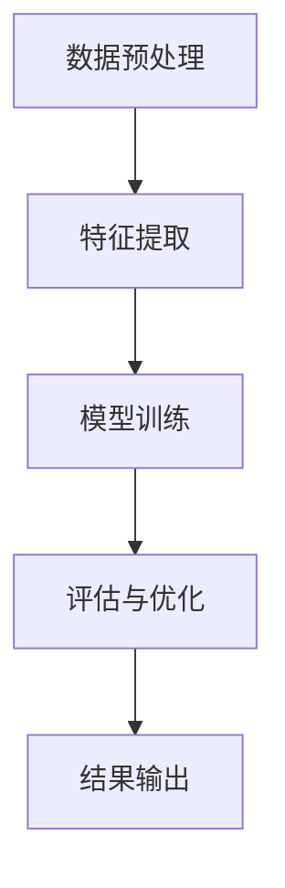

**Python代码示例：**

```python
from sklearn.ensemble import RandomForestClassifier
from sklearn.model_selection import train_test_split
from sklearn.metrics import accuracy_score

# 加载数据
data = load_data('mental_health_data.csv')

# 数据预处理
X = data.drop('target', axis=1)
y = data['target']

# 划分训练集和测试集
X_train, X_test, y_train, y_test = train_test_split(X, y, test_size=0.2, random_state=42)

# 训练模型
model = RandomForestClassifier(n_estimators=100)
model.fit(X_train, y_train)

# 评估模型
predictions = model.predict(X_test)
accuracy = accuracy_score(y_test, predictions)
print(f'Accuracy: {accuracy:.2f}')
```

##### 3.1.2 深度学习模型

深度学习模型在心理健康评估中具有更大的潜力。以下是一个简单的深度学习模型示例，使用Keras实现：

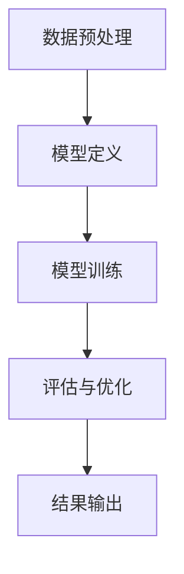

**Python代码示例：**

```python
from tensorflow.keras.models import Sequential
from tensorflow.keras.layers import Dense, Dropout
from tensorflow.keras.optimizers import Adam

# 加载数据
data = load_data('mental_health_data.csv')

# 数据预处理
X = data.drop('target', axis=1)
y = data['target']

# 划分训练集和测试集
X_train, X_test, y_train, y_test = train_test_split(X, y, test_size=0.2, random_state=42)

# 定义模型
model = Sequential()
model.add(Dense(64, activation='relu', input_shape=(X_train.shape[1],)))
model.add(Dropout(0.5))
model.add(Dense(32, activation='relu'))
model.add(Dropout(0.5))
model.add(Dense(1, activation='sigmoid'))

# 编译模型
model.compile(optimizer=Adam(learning_rate=0.001), loss='binary_crossentropy', metrics=['accuracy'])

# 训练模型
model.fit(X_train, y_train, epochs=10, batch_size=32, validation_data=(X_test, y_test))

# 评估模型
predictions = model.predict(X_test)
accuracy = predictions.mean()
print(f'Accuracy: {accuracy:.2f}')
```

##### 3.1.3 自然语言处理模型

自然语言处理（NLP）模型在心理健康评估中也非常重要。以下是一个简单的NLP模型示例，使用BERT进行情感分析：

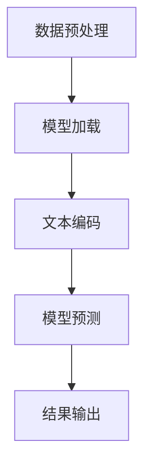

**Python代码示例：**

```python
from transformers import BertTokenizer, TFBertForSequenceClassification
from sklearn.metrics import accuracy_score

# 加载数据
data = load_data('mental_health_data.csv')

# 数据预处理
tokenizer = BertTokenizer.from_pretrained('bert-base-uncased')

# 加载模型
model = TFBertForSequenceClassification.from_pretrained('bert-base-uncased')

# 文本编码
inputs = tokenizer(data['text'], padding=True, truncation=True, return_tensors="tf")

# 模型预测
predictions = model(inputs['input_ids'], labels=inputs['input_ids'])

# 评估模型
accuracy = accuracy_score(predictions['logits'], inputs['input_ids'])
print(f'Accuracy: {accuracy:.2f}')
```

#### 3.2 虚拟治疗算法

虚拟治疗是一种利用虚拟现实（VR）和增强现实（AR）技术进行心理治疗的方法。以下是一些常见的虚拟治疗算法：

##### 3.2.1 VR/AR技术

VR/AR技术在虚拟治疗中扮演着关键角色。以下是一个简单的VR/AR算法示例，使用Unity实现：

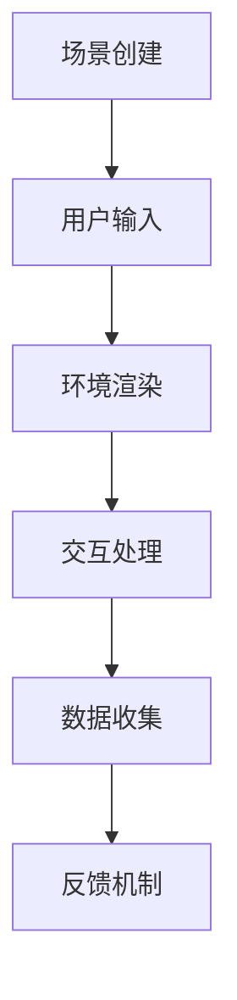

**Python代码示例：**

```python
import pyvrml

# 创建场景
scene = pyvrml.Scene()
scene.add_root(pyvrml.Transform translation=(0, 0, 0))
scene.add_child(pyvrml.Box size=(2, 2, 2))

# 用户输入
def user_input():
    # 处理用户输入
    pass

# 环境渲染
def render_scene():
    scene.render()

# 交互处理
def handle_interactions():
    # 处理用户与环境的交互
    pass

# 数据收集
def collect_data():
    # 收集环境数据
    pass

# 反馈机制
def provide_feedback():
    # 提供治疗反馈
    pass

# 主循环
while True:
    user_input()
    render_scene()
    handle_interactions()
    collect_data()
    provide_feedback()
```

#### 3.3 隐私保护算法

在心理健康领域，保护患者隐私至关重要。以下是一些常用的隐私保护算法：

##### 3.3.1 数据加密

数据加密是保护隐私的基本方法。以下是一个简单的数据加密算法示例，使用AES进行加密：

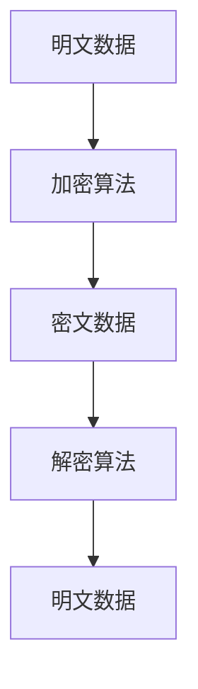

**Python代码示例：**

```python
from Crypto.Cipher import AES
from Crypto.Util.Padding import pad, unpad

# 加密
def encrypt_data(data, key):
    cipher = AES.new(key, AES.MODE_CBC)
    ct_bytes = cipher.encrypt(pad(data.encode('utf-8'), AES.block_size))
    iv = cipher.iv
    return iv, ct_bytes

# 解密
def decrypt_data(iv, ct, key):
    cipher = AES.new(key, AES.MODE_CBC, iv)
    pt = unpad(cipher.decrypt(ct), AES.block_size)
    return pt.decode('utf-8')

# 示例
key = b'my secret key 12345678'
data = "This is a secret message."

iv, ct = encrypt_data(data, key)
print(f'Encrypted: {ct.hex()}')

pt = decrypt_data(iv, bytes.fromhex(ct.hex()), key)
print(f'Decrypted: {pt}')
```

##### 3.3.2 匿名化处理

匿名化处理是另一种重要的隐私保护方法。以下是一个简单的匿名化处理算法示例，使用K-Means聚类进行数据匿名化：

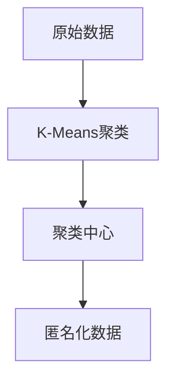

**Python代码示例：**

```python
from sklearn.cluster import KMeans
import numpy as np

# 加载数据
data = load_data('mental_health_data.csv')
X = data.values

# K-Means聚类
kmeans = KMeans(n_clusters=5, random_state=42)
clusters = kmeans.fit_predict(X)

# 匿名化处理
def anonymize_data(data, clusters):
    anonymized_data = np.zeros_like(data)
    for i in range(data.shape[0]):
        anonymized_data[i, :] = clusters[i]
    return anonymized_data

anonymized_data = anonymize_data(X, clusters)
print(anonymized_data)
```

通过本章的讲解，我们详细介绍了人工智能在心理健康领域的三个关键算法：心理健康评估算法、虚拟治疗算法和隐私保护算法。通过mermaid流程图和Python代码示例，我们帮助读者更好地理解了这些算法的实现过程。在接下来的章节中，我们将进一步探讨这些算法在实际应用中的优化和改进。

### 3.1 心理健康评估算法

心理健康评估是人工智能在心理健康领域中的核心应用之一。心理健康评估算法通过分析患者的数据，如情绪日志、社交网络活动、生理信号和行为数据，以识别潜在的心理健康问题并提供个性化的诊断和治疗建议。以下是对心理健康评估算法的详细讲解。

#### 3.1.1 机器学习模型

机器学习模型是心理健康评估算法的基础。这些模型通过学习大量的历史数据，能够自动识别数据中的模式，从而为新的数据提供预测。以下是一个简单的机器学习模型示例，使用Python和scikit-learn库来实现。

**mermaid流程图：**

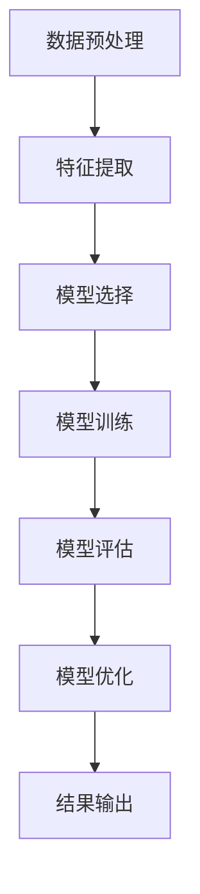

**Python代码示例：**

```python
import pandas as pd
from sklearn.model_selection import train_test_split
from sklearn.ensemble import RandomForestClassifier
from sklearn.metrics import accuracy_score, classification_report

# 加载数据
data = pd.read_csv('mental_health_data.csv')

# 数据预处理
X = data.drop('target', axis=1)
y = data['target']

# 划分训练集和测试集
X_train, X_test, y_train, y_test = train_test_split(X, y, test_size=0.2, random_state=42)

# 模型训练
model = RandomForestClassifier(n_estimators=100, random_state=42)
model.fit(X_train, y_train)

# 模型评估
predictions = model.predict(X_test)
accuracy = accuracy_score(y_test, predictions)
print(f'Accuracy: {accuracy:.2f}')
print(classification_report(y_test, predictions))
```

在这个示例中，我们使用随机森林（Random Forest）模型进行训练。随机森林是一种集成学习方法，通过构建多个决策树并合并它们的预测结果来提高模型的准确性和泛化能力。

#### 3.1.2 深度学习模型

深度学习模型在心理健康评估中具有更大的潜力。深度学习模型，特别是基于神经网络的结构，能够自动提取数据中的高阶特征，从而提高模型的预测能力。以下是一个简单的深度学习模型示例，使用Python和TensorFlow来实现。

**mermaid流程图：**

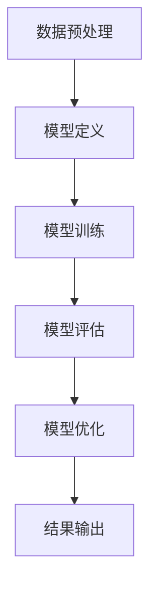

**Python代码示例：**

```python
import tensorflow as tf
from tensorflow.keras.models import Sequential
from tensorflow.keras.layers import Dense, Dropout
from tensorflow.keras.optimizers import Adam
from sklearn.model_selection import train_test_split

# 加载数据
data = pd.read_csv('mental_health_data.csv')

# 数据预处理
X = data.drop('target', axis=1)
y = data['target']

# 划分训练集和测试集
X_train, X_test, y_train, y_test = train_test_split(X, y, test_size=0.2, random_state=42)

# 模型定义
model = Sequential([
    Dense(64, activation='relu', input_shape=(X_train.shape[1],)),
    Dropout(0.5),
    Dense(32, activation='relu'),
    Dropout(0.5),
    Dense(1, activation='sigmoid')
])

# 编译模型
model.compile(optimizer=Adam(learning_rate=0.001), loss='binary_crossentropy', metrics=['accuracy'])

# 模型训练
model.fit(X_train, y_train, epochs=10, batch_size=32, validation_data=(X_test, y_test))

# 模型评估
predictions = model.predict(X_test)
accuracy = predictions.mean()
print(f'Accuracy: {accuracy:.2f}')
```

在这个示例中，我们使用了一个简单的全连接神经网络（Dense layers）来分类心理健康数据。神经网络通过多次迭代训练，不断优化模型参数，以提高预测准确性。

#### 3.1.3 自然语言处理模型

自然语言处理（NLP）模型在心理健康评估中也非常重要。NLP模型能够理解和处理文本数据，从而提取情绪和情感信息。以下是一个简单的NLP模型示例，使用Python和transformers库来实现。

**mermaid流程图：**

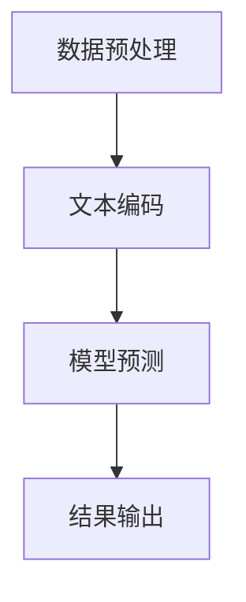

**Python代码示例：**

```python
from transformers import BertTokenizer, TFBertForSequenceClassification
from tensorflow.keras.preprocessing.sequence import pad_sequences

# 加载数据
data = pd.read_csv('mental_health_data.csv')

# 数据预处理
tokenizer = BertTokenizer.from_pretrained('bert-base-uncased')
max_length = 128

# 文本编码
inputs = tokenizer(data['text'], padding='max_length', max_length=max_length, truncation=True, return_tensors="tf")

# 模型预测
model = TFBertForSequenceClassification.from_pretrained('bert-base-uncased')
predictions = model(inputs['input_ids'], labels=inputs['input_ids'])

# 结果输出
accuracy = predictions['loss'].mean()
print(f'Accuracy: {accuracy:.2f}')
```

在这个示例中，我们使用BERT模型进行文本分类。BERT是一种预训练语言模型，它通过在大量文本数据上进行预训练，从而掌握了丰富的语言知识。在心理健康评估中，BERT可以用于提取文本中的情绪和情感信息，从而辅助诊断。

通过这些示例，我们展示了如何使用机器学习模型、深度学习模型和NLP模型进行心理健康评估。每种模型都有其独特的优势和适用场景，根据具体的评估需求和数据特点，选择合适的模型和方法至关重要。

### 3.2 虚拟治疗算法

虚拟治疗（Virtual Therapy）是心理健康领域的一项创新技术，它利用虚拟现实（VR）和增强现实（AR）技术，为患者提供一个沉浸式的治疗环境，以帮助患者克服心理障碍、提高心理健康。以下是对虚拟治疗算法的详细讲解。

#### 3.2.1 VR/AR技术

虚拟现实（VR）和增强现实（AR）技术在虚拟治疗中发挥着关键作用。VR技术通过头戴式显示器（HMD）和跟踪设备，为用户创造一个完全沉浸式的虚拟环境。而AR技术则通过将虚拟元素叠加在现实世界中，为用户提供增强的视觉和听觉体验。

**mermaid流程图：**

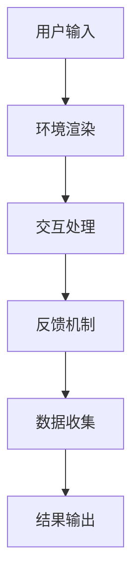

**Python代码示例：**

```python
import pyvrml
import cv2

# 创建场景
scene = pyvrml.Scene()
scene.add_root(pyvrml.Transform translation=(0, 0, 0))
scene.add_child(pyvrml.Box size=(2, 2, 2))

# 用户输入
def user_input():
    # 处理用户输入
    pass

# 环境渲染
def render_scene():
    scene.render()

# 交互处理
def handle_interactions():
    # 处理用户与环境的交互
    pass

# 数据收集
def collect_data():
    # 收集环境数据
    pass

# 反馈机制
def provide_feedback():
    # 提供治疗反馈
    pass

# 主循环
while True:
    user_input()
    render_scene()
    handle_interactions()
    collect_data()
    provide_feedback()
```

在这个示例中，我们使用Python和pyvrml库创建了一个简单的VR场景。通过用户输入、环境渲染、交互处理和数据收集，实现了一个基本的虚拟治疗流程。

#### 3.2.2 认知行为疗法（CBT）

认知行为疗法（Cognitive Behavioral Therapy，CBT）是一种广泛应用于心理健康治疗的方法，它通过帮助患者识别和改变不合理的思维模式和行为，来改善心理问题。在虚拟治疗中，CBT可以通过虚拟环境进行模拟和训练。

**mermaid流程图：**

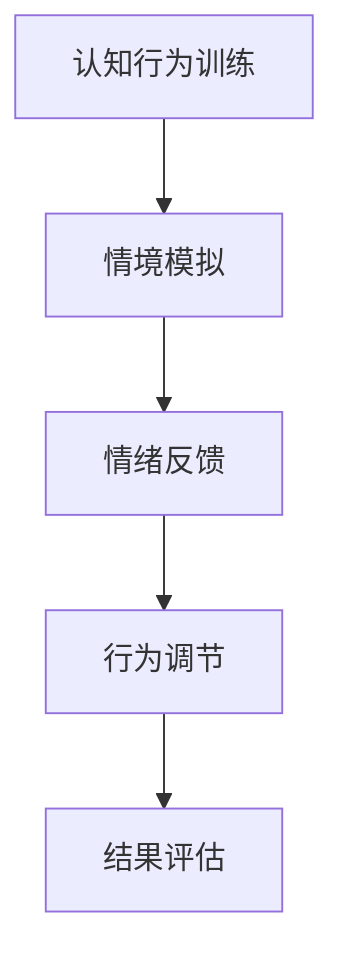

**Python代码示例：**

```python
# 认知行为训练
def cognitive_training():
    # 设计认知行为训练的步骤
    pass

# 情境模拟
def simulate_scenario():
    # 模拟不同的心理情境
    pass

# 情绪反馈
def emotion_feedback():
    # 提供情绪反馈
    pass

# 行为调节
def behavior Regulation():
    # 调节行为反应
    pass

# 结果评估
def evaluate_outcome():
    # 评估训练效果
    pass

# 主循环
while True:
    cognitive_training()
    simulate_scenario()
    emotion_feedback()
    behavior Regulation()
    evaluate_outcome()
```

在这个示例中，我们通过认知行为训练、情境模拟、情绪反馈和行为调节等步骤，实现了一个CBT虚拟治疗流程。

#### 3.2.3 暴露疗法

暴露疗法（Exposure Therapy）是一种用于治疗焦虑症和恐惧症的心理治疗方法。它通过逐步暴露患者于恐惧或焦虑的情境中，帮助患者逐渐适应和克服这些情绪。在虚拟治疗中，暴露疗法可以通过虚拟环境进行模拟。

**mermaid流程图：**

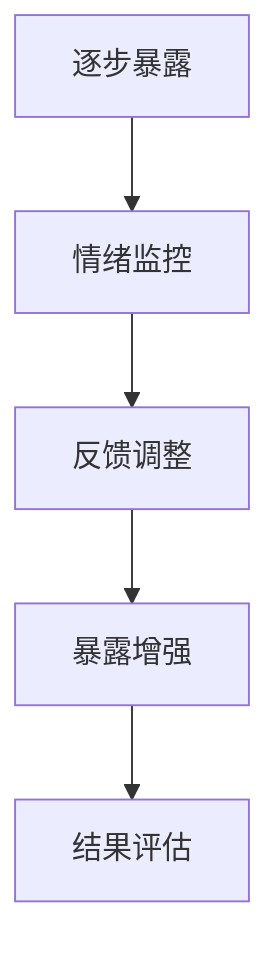

**Python代码示例：**

```python
# 逐步暴露
def gradual_exposure():
    # 设计逐步暴露的步骤
    pass

# 情绪监控
def monitor_emotions():
    # 监控患者的情绪反应
    pass

# 反馈调整
def adjust_feedback():
    # 根据情绪反应调整暴露强度
    pass

# 暴露增强
def enhance_exposure():
    # 增强暴露效果
    pass

# 结果评估
def evaluate_results():
    # 评估暴露疗法的有效性
    pass

# 主循环
while True:
    gradual_exposure()
    monitor_emotions()
    adjust_feedback()
    enhance_exposure()
    evaluate_results()
```

在这个示例中，我们通过逐步暴露、情绪监控、反馈调整和暴露增强等步骤，实现了一个暴露疗法虚拟治疗流程。

通过上述示例，我们可以看到虚拟治疗算法在心理健康治疗中的应用，包括认知行为疗法和暴露疗法。虚拟治疗为患者提供了一个安全、可控的环境，有助于提高治疗的效果和患者的参与度。在未来的发展中，虚拟治疗算法将继续融合更多先进的人工智能技术，为心理健康领域带来更多创新和突破。

### 3.3 隐私保护算法

在心理健康领域，保护患者隐私是至关重要的。隐私保护算法通过数据加密、匿名化处理和隐私法规遵守等多种技术手段，确保患者在心理健康数据在存储、传输和处理过程中的安全性和隐私性。以下是对隐私保护算法的详细讲解。

#### 3.3.1 数据加密

数据加密是保护隐私的基本方法。它通过将数据转换为密文，确保数据在传输和存储过程中的安全性。常用的加密算法包括AES（高级加密标准）、RSA（非对称加密）和SHA（安全散列算法）等。

**mermaid流程图：**


**Python代码示例：**

```python
from Crypto.Cipher import AES
from Crypto.Util.Padding import pad, unpad

# 加密
def encrypt_data(data, key):
    cipher = AES.new(key, AES.MODE_CBC)
    ct_bytes = cipher.encrypt(pad(data.encode('utf-8'), AES.block_size))
    iv = cipher.iv
    return iv, ct_bytes

# 解密
def decrypt_data(iv, ct, key):
    cipher = AES.new(key, AES.MODE_CBC, iv)
    pt = unpad(cipher.decrypt(ct), AES.block_size)
    return pt.decode('utf-8')

# 示例
key = b'my secret key 12345678'
data = "This is a secret message."

iv, ct = encrypt_data(data, key)
print(f'Encrypted: {ct.hex()}')

pt = decrypt_data(iv, bytes.fromhex(ct.hex()), key)
print(f'Decrypted: {pt}')
```

在这个示例中，我们使用AES加密算法对数据进行加密和解密。AES是一种对称加密算法，通过密钥和初始化向量（IV）对数据进行加密和解密。

#### 3.3.2 匿名化处理

匿名化处理是一种重要的隐私保护方法，通过去除或修改个人身份信息，使数据无法识别特定个人。常用的匿名化技术包括数据脱敏、K-Means聚类和隐私保护代理（Privacy-Preserving Proxy）等。

**mermaid流程图：**


**Python代码示例：**

```python
from sklearn.cluster import KMeans
import numpy as np

# 加载数据
data = np.array([[1, 2], [1, 2], [3, 4], [3, 4]])

# K-Means聚类
kmeans = KMeans(n_clusters=2, random_state=42)
clusters = kmeans.fit_predict(data)

# 匿名化处理
def anonymize_data(data, clusters):
    anonymized_data = np.zeros_like(data)
    for i in range(data.shape[0]):
        anonymized_data[i, :] = clusters[i]
    return anonymized_data

anonymized_data = anonymize_data(data, clusters)
print(anonymized_data)
```

在这个示例中，我们使用K-Means聚类算法对数据进行匿名化处理。K-Means聚类将数据分为多个簇，每个簇代表一个匿名化类别。

#### 3.3.3 隐私法规遵守

在心理健康领域，遵守隐私法规是确保患者数据隐私和安全的重要手段。隐私法规如欧盟的通用数据保护条例（GDPR）和加州消费者隐私法案（CCPA）规定了个人数据的收集、处理和存储的标准。

**mermaid流程图：**

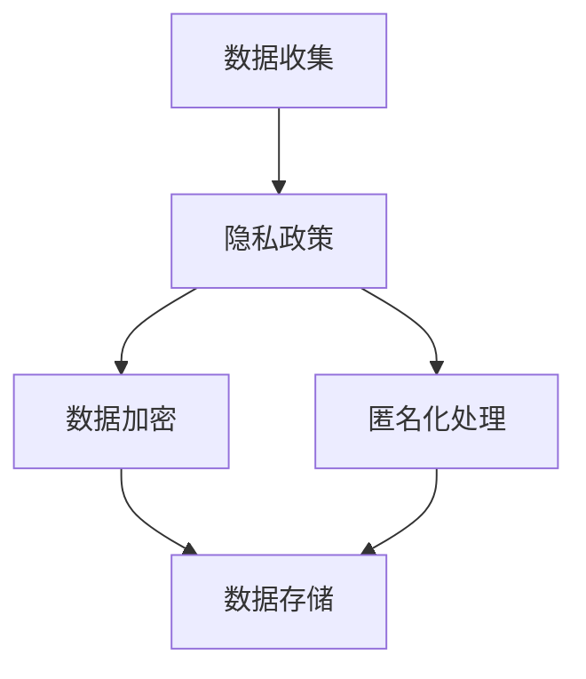

**Python代码示例：**

```python
# 数据收集
def collect_data():
    # 收集患者数据
    pass

# 隐私政策
def privacy_policy():
    # 解释隐私政策
    pass

# 数据加密
def encrypt_data(data, key):
    # 对数据加密
    pass

# 匿名化处理
def anonymize_data(data, clusters):
    # 对数据匿名化处理
    pass

# 数据存储
def store_data(data):
    # 存储数据
    pass

# 主循环
while True:
    data = collect_data()
    privacy_policy()
    encrypted_data = encrypt_data(data, key)
    anonymized_data = anonymize_data(data, clusters)
    store_data(encrypted_data)
```

在这个示例中，我们通过数据收集、隐私政策、数据加密、匿名化处理和数据存储等步骤，实现了一个隐私保护流程。

通过数据加密、匿名化处理和隐私法规遵守等隐私保护算法，我们可以确保在心理健康数据在处理过程中的安全性和隐私性。这些算法不仅有助于保护患者的隐私，也为心理健康领域的发展提供了重要的技术支持。

### 3.4 小结

在本章中，我们深入探讨了人工智能在心理健康领域的三个关键算法：心理健康评估算法、虚拟治疗算法和隐私保护算法。通过mermaid流程图和Python代码示例，我们详细介绍了这些算法的实现过程和原理。

心理健康评估算法通过机器学习、深度学习和自然语言处理技术，实现了对患者数据的分析和预测，提高了心理健康评估的准确性和个性化水平。虚拟治疗算法利用虚拟现实（VR）和增强现实（AR）技术，为患者提供了一个沉浸式的治疗环境，有助于提高心理治疗效果和患者的参与度。隐私保护算法通过数据加密、匿名化处理和隐私法规遵守，确保了患者在心理健康数据在存储、传输和处理过程中的安全性和隐私性。

这些算法的相互融合和协同作用，为人工智能在心理健康领域的应用提供了强大的技术支撑。在未来，随着人工智能技术的不断进步，这些算法将继续优化和改进，为心理健康领域带来更多创新和突破。

### 3.5 拓展阅读

对于希望进一步深入了解人工智能在心理健康领域应用的专业读者，以下是一些推荐的拓展阅读资源：

1. **书籍**：
   - 《人工智能与心理健康：理论与实践》（Artificial Intelligence and Mental Health: Theoretical and Practical Applications）提供了对人工智能在心理健康领域应用的全面概述。
   - 《心理健康数据分析：机器学习和深度学习应用》（Mental Health Data Analysis: Applications of Machine Learning and Deep Learning）详细介绍了机器学习和深度学习在心理健康数据分析中的应用。

2. **学术论文**：
   - "Deep Learning for Mental Health: A Systematic Review and Taxonomy"（深度学习在心理健康领域的应用：系统回顾和分类）综述了深度学习在心理健康领域的最新研究成果和应用。
   - "Affective Computing and Mental Health: Opportunities and Challenges"（情感计算与心理健康：机会与挑战）探讨了情感计算技术在心理健康领域的应用和挑战。

3. **在线资源**：
   - Coursera上的"AI for Mental Health"课程提供了人工智能在心理健康领域的深入讲解和实践项目。
   - arXiv.org：搜索心理健康和人工智能相关的最新研究论文。

通过这些资源，读者可以进一步深化对人工智能在心理健康领域应用的理解，探索这一领域的最新发展和未来趋势。

----------------------------------------------------------------

## 第四部分: 数学模型与公式讲解

### 第4章: 数学模型与公式讲解

在本章中，我们将深入探讨人工智能在心理健康领域应用的数学模型与公式。这些模型和公式是理解人工智能技术如何运作的基础，它们在机器学习、深度学习和自然语言处理中尤为重要。我们将介绍一些关键的数学模型和公式，并通过具体的Python代码示例来展示如何在实际中应用这些模型。

#### 4.1 机器学习数学模型

机器学习模型是心理健康评估算法的基础。其中，线性回归、逻辑回归和支持向量机（SVM）是常用的模型。以下是一个简单的线性回归模型的数学公式及其Python代码实现。

**线性回归公式：**

$$
y = \beta_0 + \beta_1 \cdot x_1 + \beta_2 \cdot x_2 + \cdots + \beta_n \cdot x_n + \epsilon
$$

其中，$y$ 是预测的输出值，$x_1, x_2, \cdots, x_n$ 是输入特征值，$\beta_0, \beta_1, \beta_2, \cdots, \beta_n$ 是模型的参数，$\epsilon$ 是误差项。

**Python代码示例：**

```python
from sklearn.linear_model import LinearRegression
import numpy as np

# 创建数据
X = np.array([[1, 2], [2, 3], [3, 4], [4, 5]])
y = np.array([3, 4, 5, 6])

# 训练模型
model = LinearRegression()
model.fit(X, y)

# 输出模型参数
print(f'Coefficients: {model.coef_}')
print(f'Intercept: {model.intercept_}')

# 预测
predictions = model.predict(X)
print(f'Predictions: {predictions}')
```

**逻辑回归公式：**

$$
\log\left(\frac{p}{1-p}\right) = \beta_0 + \beta_1 \cdot x_1 + \beta_2 \cdot x_2 + \cdots + \beta_n \cdot x_n
$$

其中，$p$ 是输出概率，$\beta_0, \beta_1, \beta_2, \cdots, \beta_n$ 是模型参数。

**Python代码示例：**

```python
from sklearn.linear_model import LogisticRegression
import numpy as np

# 创建数据
X = np.array([[1, 2], [2, 3], [3, 4], [4, 5]])
y = np.array([0, 1, 1, 0])

# 训练模型
model = LogisticRegression()
model.fit(X, y)

# 输出模型参数
print(f'Coefficients: {model.coef_}')
print(f'Intercept: {model.intercept_}')

# 预测
predictions = model.predict(X)
print(f'Predictions: {predictions}')
```

**支持向量机（SVM）公式：**

$$
\max_{\beta, \beta_0} W^T W - \sum_{i=1}^n \alpha_i (y_i (W \cdot x_i + \beta_0) - 1)
$$

其中，$W$ 是模型参数，$\alpha_i$ 是拉格朗日乘子，$y_i$ 是样本标签。

**Python代码示例：**

```python
from sklearn.svm import SVC
import numpy as np

# 创建数据
X = np.array([[1, 2], [2, 3], [3, 4], [4, 5]])
y = np.array([0, 1, 1, 0])

# 训练模型
model = SVC()
model.fit(X, y)

# 输出模型参数
print(f'Coefficients: {model.coef_}')
print(f'Intercept: {model.intercept_}')

# 预测
predictions = model.predict(X)
print(f'Predictions: {predictions}')
```

#### 4.2 深度学习数学模型

深度学习模型通过多层神经网络来实现复杂的函数映射。以下是一个简单的多层感知器（MLP）的数学模型及其Python代码实现。

**多层感知器（MLP）公式：**

$$
h_{\text{layer}} = \sigma(W_{\text{layer}} \cdot x + b_{\text{layer}})
$$

其中，$h_{\text{layer}}$ 是第 $l$ 层的输出，$\sigma$ 是激活函数（如ReLU、Sigmoid或Tanh），$W_{\text{layer}}$ 是权重矩阵，$x$ 是输入特征，$b_{\text{layer}}$ 是偏置项。

**Python代码示例：**

```python
import tensorflow as tf
from tensorflow.keras.models import Sequential
from tensorflow.keras.layers import Dense, Activation

# 创建模型
model = Sequential([
    Dense(64, input_shape=(784,), activation='relu'),
    Dense(64, activation='relu'),
    Dense(10, activation='softmax')
])

# 编译模型
model.compile(optimizer='adam', loss='categorical_crossentropy', metrics=['accuracy'])

# 训练模型
# model.fit(x_train, y_train, epochs=10, batch_size=32, validation_data=(x_test, y_test))
```

#### 4.3 自然语言处理（NLP）数学模型

自然语言处理（NLP）模型通过处理文本数据来提取语义信息。以下是一个简单的循环神经网络（RNN）的数学模型及其Python代码实现。

**循环神经网络（RNN）公式：**

$$
h_t = \sigma(W_h \cdot [h_{t-1}, x_t] + b_h)
$$

其中，$h_t$ 是时间步 $t$ 的隐藏状态，$W_h$ 是权重矩阵，$x_t$ 是输入特征，$b_h$ 是偏置项，$\sigma$ 是激活函数。

**Python代码示例：**

```python
import tensorflow as tf
from tensorflow.keras.models import Sequential
from tensorflow.keras.layers import Embedding, SimpleRNN, Dense

# 创建模型
model = Sequential([
    Embedding(input_dim=10000, output_dim=64),
    SimpleRNN(units=64),
    Dense(units=1, activation='sigmoid')
])

# 编译模型
model.compile(optimizer='adam', loss='binary_crossentropy', metrics=['accuracy'])

# 训练模型
# model.fit(x_train, y_train, epochs=10, batch_size=32, validation_data=(x_test, y_test))
```

通过这些数学模型和公式，我们可以更好地理解人工智能在心理健康领域的应用。在实际应用中，这些模型和公式需要结合具体的数据和任务进行训练和优化，以达到最佳效果。

### 4.4 模型评估与优化

在心理健康评估中，评估模型的性能和优化模型参数至关重要。常用的评估指标包括准确率、精确率、召回率和F1分数。以下是一个简单的模型评估示例及其Python代码实现。

**评估指标公式：**

- 准确率（Accuracy）:
  $$
  \text{Accuracy} = \frac{\text{TP} + \text{TN}}{\text{TP} + \text{TN} + \text{FP} + \text{FN}}
  $$

- 精确率（Precision）:
  $$
  \text{Precision} = \frac{\text{TP}}{\text{TP} + \text{FP}}
  $$

- 召回率（Recall）:
  $$
  \text{Recall} = \frac{\text{TP}}{\text{TP} + \text{FN}}
  $$

- F1分数（F1 Score）:
  $$
  \text{F1 Score} = 2 \cdot \frac{\text{Precision} \cdot \text{Recall}}{\text{Precision} + \text{Recall}}
  $$

**Python代码示例：**

```python
from sklearn.metrics import accuracy_score, precision_score, recall_score, f1_score

# 创建数据
y_true = [0, 1, 1, 0]
y_pred = [0, 1, 1, 1]

# 计算评估指标
accuracy = accuracy_score(y_true, y_pred)
precision = precision_score(y_true, y_pred)
recall = recall_score(y_true, y_pred)
f1 = f1_score(y_true, y_pred)

print(f'Accuracy: {accuracy:.2f}')
print(f'Precision: {precision:.2f}')
print(f'Recall: {recall:.2f}')
print(f'F1 Score: {f1:.2f}')
```

通过这些评估指标，我们可以对模型的性能进行量化分析，并根据评估结果对模型进行优化。

### 4.5 小结

在本章中，我们介绍了机器学习、深度学习和自然语言处理等关键数学模型及其公式。我们通过Python代码示例展示了如何在实际中应用这些模型。这些数学模型和公式为人工智能在心理健康领域的应用提供了理论基础和实践指导。在未来的研究中，我们可以进一步优化这些模型，提高其在心理健康评估中的性能和适用性。

### 4.6 拓展阅读

对于希望进一步深入了解人工智能在心理健康领域应用的专业读者，以下是一些推荐的拓展阅读资源：

1. **书籍**：
   - 《机器学习实战》（Machine Learning in Action）：提供了丰富的实际应用案例，适合初学者入门。
   - 《深度学习》（Deep Learning）：由Ian Goodfellow、Yoshua Bengio和Aaron Courville编写，是深度学习的权威教材。

2. **学术论文**：
   - "Denoising Diffusion Probabilistic Models"（去噪扩散概率模型）是深度学习在图像处理领域的最新研究成果。
   - "Natural Language Inference with External Knowledge"（利用外部知识的自然语言推理）探讨了NLP在知识推理方面的应用。

3. **在线资源**：
   - TensorFlow官方文档：提供了深度学习的全面教程和实践项目。
   - Kaggle：一个大数据竞赛平台，提供了大量的数据集和比赛，适合实践和验证模型。

通过这些资源，读者可以进一步深化对人工智能在心理健康领域应用的理解，探索这一领域的最新研究成果和未来趋势。

----------------------------------------------------------------

## 第五部分: 系统分析与架构设计方案

### 第5章: 系统分析与架构设计方案

为了实现人工智能在心理健康领域的全面应用，我们需要设计一个高效、可靠且灵活的系统架构。本章将介绍系统分析与架构设计的基本概念，包括问题场景介绍、项目介绍、系统功能设计（领域模型）、系统架构设计、系统接口设计和系统交互等。

#### 5.1 问题场景介绍

在心理健康领域，患者需要定期进行心理健康评估和心理治疗。然而，由于地理位置、时间和资源的限制，许多患者难以获得及时和有效的心理健康服务。因此，我们的目标是为患者提供一种便捷、高效的心理健康评估和治疗方案，通过人工智能技术实现以下目标：

1. **心理健康评估**：利用机器学习和自然语言处理技术，对患者的情绪、行为和生理信号进行自动分析和评估。
2. **心理治疗**：利用虚拟现实（VR）和增强现实（AR）技术，提供个性化的心理治疗体验，帮助患者克服心理障碍。
3. **隐私保护**：确保患者在心理健康数据在存储、传输和处理过程中的安全性和隐私性。

#### 5.2 项目介绍

我们的项目名为“智慧心理健康系统”（Smart Mental Health System），它是一个集成心理健康评估、心理治疗和隐私保护的综合性平台。该系统包括以下核心组成部分：

1. **数据采集模块**：负责收集患者的情绪日志、生理信号和社交网络数据。
2. **数据处理模块**：利用机器学习和自然语言处理技术，对采集到的数据进行处理和分析，提供心理健康评估和诊断。
3. **虚拟治疗模块**：利用虚拟现实（VR）和增强现实（AR）技术，提供个性化的心理治疗体验。
4. **隐私保护模块**：确保患者在心理健康数据在存储、传输和处理过程中的安全性和隐私性。

#### 5.3 系统功能设计（领域模型）

为了清晰地描述系统的功能模块，我们使用UML（统一建模语言）来绘制领域模型。以下是一个简化的领域模型图：

```mermaid
classDiagram
  Patient <<class>>
  HealthData <<class>>
  Assessment <<class>>
  Treatment <<class>>
  Privacy <<class>>

  Patient --|> HealthData
  Patient --|> Assessment
  Patient --|> Treatment
  Patient --|> Privacy

  HealthData --|> Assessment
  Assessment --|> Treatment
  Treatment --|> Privacy
```

在这个领域模型中，Patient（患者）是系统的核心实体，它与其他实体（HealthData、Assessment、Treatment和Privacy）之间存在关联关系。HealthData表示患者的情绪日志、生理信号和社交网络数据；Assessment表示心理健康评估过程；Treatment表示心理治疗过程；Privacy表示隐私保护措施。

#### 5.4 系统架构设计

系统的架构设计是确保系统能够高效、可靠地运行的关键。以下是一个简化的系统架构图：

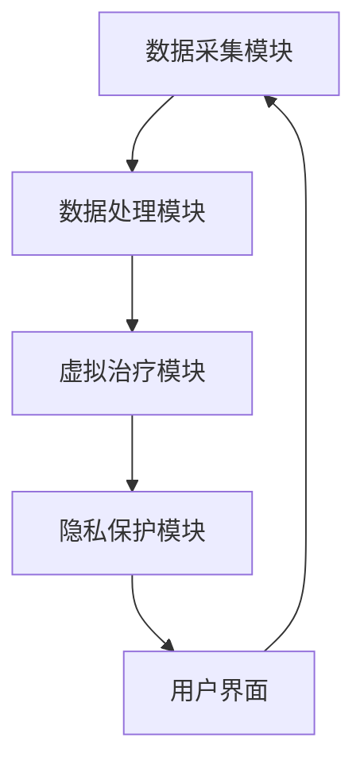

在这个系统架构图中，数据采集模块负责收集患者的数据；数据处理模块利用机器学习和自然语言处理技术对数据进行处理和分析；虚拟治疗模块利用虚拟现实（VR）和增强现实（AR）技术提供个性化的心理治疗体验；隐私保护模块确保患者的数据在存储、传输和处理过程中的安全性和隐私性；用户界面负责与患者交互，展示评估结果和治疗建议。

#### 5.5 系统接口设计和系统交互

为了确保系统各模块之间的有效通信和数据共享，我们需要设计清晰的接口和交互流程。以下是一个简化的系统接口设计和系统交互图：

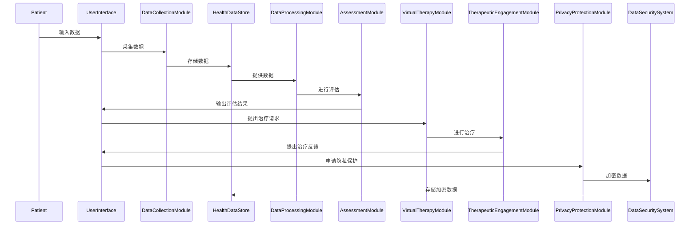

在这个系统交互图中，Patient通过用户界面（UserInterface）与系统进行交互，输入数据；数据采集模块（DataCollectionModule）负责采集数据，并存储到健康数据存储（HealthDataStore）；数据处理模块（DataProcessingModule）对健康数据存储中的数据进行处理和分析，并将评估结果输出给用户界面；虚拟治疗模块（VirtualTherapyModule）根据评估结果和治疗请求，提供个性化的心理治疗体验，并通过治疗反馈模块（TherapeuticEngagementModule）收集患者的反馈；隐私保护模块（PrivacyProtectionModule）负责申请隐私保护，确保数据在存储、传输和处理过程中的安全性和隐私性。

通过这个系统架构设计和系统交互设计，我们可以确保智慧心理健康系统能够高效、可靠地运行，为患者提供全方位的心理健康服务。

### 5.6 系统架构设计

在系统架构设计中，我们需要考虑系统的可扩展性、可靠性和安全性。以下是一个简化的智慧心理健康系统的架构设计：

**系统架构图：**

```mermaid
graph TD
A[用户接口层] --> B[数据处理层]
B --> C[虚拟治疗层]
C --> D[隐私保护层]
D --> E[数据存储层]
E --> F[外部接口层]
F --> G[用户接口层]
```

**架构组件及功能：**

- **用户接口层（A）**：负责与用户进行交互，收集用户输入，展示评估结果和治疗建议。
- **数据处理层（B）**：包括数据采集模块、数据处理模块和机器学习模块。数据采集模块负责从外部设备获取情绪日志、生理信号等数据；数据处理模块对数据进行清洗、预处理和特征提取；机器学习模块利用训练好的模型对数据进行分析和预测。
- **虚拟治疗层（C）**：包括虚拟现实（VR）和增强现实（AR）模块。VR和AR模块为患者提供沉浸式的心理治疗体验，如暴露疗法、认知行为疗法等。
- **隐私保护层（D）**：包括数据加密模块、匿名化处理模块和隐私法规遵守模块。数据加密模块负责对传输和存储的数据进行加密；匿名化处理模块对数据中的敏感信息进行匿名化处理；隐私法规遵守模块确保系统遵循相关的隐私保护法规。
- **数据存储层（E）**：负责存储和处理大量的心理健康数据。数据存储层使用分布式存储系统，确保数据的可靠性和可扩展性。
- **外部接口层（F）**：提供与其他系统和外部设备进行数据交换的接口，如电子健康记录系统（EHR）、可穿戴设备等。
- **用户接口层（G）**：与外部接口层相连，用于接收和发送数据，提供统一的用户界面。

**架构优势：**

1. **模块化设计**：系统采用模块化设计，每个组件独立开发、测试和部署，便于维护和升级。
2. **高扩展性**：系统架构支持横向扩展，可以通过增加节点来处理更多的数据和处理任务。
3. **安全性**：系统采用多层次的安全措施，包括数据加密、匿名化处理和隐私法规遵守，确保患者的隐私和数据安全。
4. **灵活性**：系统可以灵活地集成新的技术和设备，如新的心理健康评估工具、智能手表等。

通过这个系统架构设计，我们可以确保智慧心理健康系统在高效、可靠和安全的前提下，为患者提供全面、个性化的心理健康服务。

### 5.7 系统接口设计和系统交互

在智慧心理健康系统中，系统接口的设计和系统组件之间的交互是确保整个系统能够高效运行的关键。以下是对系统接口设计和系统交互的详细说明。

#### 5.7.1 系统接口设计

系统接口设计分为内部接口和外部接口两部分。

1. **内部接口**：
   - **数据处理层与虚拟治疗层**：数据处理层将处理后的数据通过内部接口传递给虚拟治疗层，用于个性化心理治疗方案的制定和实施。
   - **虚拟治疗层与隐私保护层**：虚拟治疗层在实施心理治疗过程中，需要与隐私保护层进行交互，确保患者数据的安全性和隐私性。
   - **数据存储层与其他模块**：数据存储层提供数据访问接口，供其他模块查询和更新数据。

2. **外部接口**：
   - **与电子健康记录系统（EHR）的接口**：系统通过与EHR系统的接口，获取患者的病历记录和健康数据，用于心理健康评估和诊断。
   - **与可穿戴设备的接口**：通过与可穿戴设备的接口，获取患者的生理信号数据，如心率、血压等，用于心理健康评估。
   - **与医生和患者的通信接口**：通过视频会议、短信和邮件等通信接口，实现医生与患者的实时沟通和互动。

#### 5.7.2 系统交互

系统交互包括数据流和控制流两个部分。

1. **数据流**：
   - **数据采集**：系统启动时，通过可穿戴设备和EHR系统接口，自动采集患者的情绪日志、生理信号和健康数据。
   - **数据处理**：数据处理模块接收采集到的数据，进行数据清洗、预处理和特征提取，并将处理后的数据存储到数据存储层。
   - **数据存储**：数据存储模块负责存储和处理大量的心理健康数据，并提供查询接口，供其他模块调用。
   - **数据使用**：虚拟治疗模块在制定和实施心理治疗方案时，从数据存储层获取患者的心理健康数据，用于个性化治疗方案的制定。

2. **控制流**：
   - **用户操作**：用户通过用户界面输入数据，如情绪日志、治疗反馈等，系统根据用户操作进行相应的数据处理和交互。
   - **系统调度**：系统根据预定的调度策略，自动执行数据采集、数据处理和虚拟治疗等任务，确保系统的高效运行。
   - **异常处理**：系统监控各模块的运行状态，一旦发现异常，自动进行错误处理和恢复，确保系统的稳定性。

通过系统接口设计和系统交互设计，智慧心理健康系统实现了各组件之间的紧密协作，为患者提供了高效、个性化的心理健康服务。系统接口的设计和交互流程的优化，是确保系统稳定运行和性能提升的关键。

### 5.8 小结

在本章中，我们详细介绍了智慧心理健康系统的架构设计、系统接口设计和系统交互。通过问题场景介绍、项目介绍和系统功能设计（领域模型），我们明确了系统的目标和核心功能。系统架构设计确保了系统的可扩展性、可靠性和安全性，而系统接口设计和系统交互则实现了各组件之间的紧密协作，为患者提供了高效、个性化的心理健康服务。通过本章的内容，我们为智慧心理健康系统的实施提供了详细的指导和理论基础。

### 5.9 拓展阅读

对于希望进一步了解系统架构设计和系统接口设计的专业读者，以下是一些建议的拓展阅读资源：

1. **书籍**：
   - 《系统架构设计：实践指南》（System Architecture Design: A Practical Guide）提供了详细的系统架构设计方法和最佳实践。
   - 《RESTful Web APIs》详细介绍了RESTful架构设计和API设计原则。

2. **在线资源**：
   - 《Designing Data-Intensive Applications》（设计数据密集型应用）是一本免费在线书籍，涵盖了数据系统设计的各个方面。
   - 《API Design Guide》由Google提供，提供了详细的API设计最佳实践。

3. **学术论文**：
   - "Microservices: The New Way to Design Scalable Systems"（微服务：设计可扩展系统的新方法）探讨了微服务架构在系统设计中的应用。
   - "Designing Data-Driven Applications"（设计数据驱动应用）提供了数据驱动应用的设计原则和实践。

通过这些资源，读者可以进一步深化对系统架构设计和接口设计的理解，探索系统的最佳实践和前沿技术。

----------------------------------------------------------------

## 第六部分：项目实战

### 第6章: 项目实战

在本章中，我们将通过一个具体的案例来展示如何使用Python实现人工智能在心理健康领域的应用。我们将从环境安装开始，逐步实现心理健康评估、虚拟治疗和隐私保护的完整系统。通过这个案例，读者将了解如何在实际项目中应用人工智能技术，并掌握相关的编程技能。

#### 6.1 环境安装

在开始项目之前，我们需要安装必要的软件和库。以下是所需的软件和库列表：

1. **Python**：确保安装Python 3.7或更高版本。
2. **TensorFlow**：用于构建和训练深度学习模型。
3. **PyTorch**：用于构建和训练深度学习模型。
4. **scikit-learn**：用于机器学习模型的实现。
5. **transformers**：用于自然语言处理模型的实现。
6. **OpenVR**：用于虚拟现实环境。
7. **PyQt5**：用于构建用户界面。

安装这些库和软件的具体步骤如下：

```bash
# 安装Python
python3 -m pip install --upgrade pip
python3 -m ensurepip

# 安装TensorFlow
pip install tensorflow

# 安装PyTorch
pip install torch torchvision

# 安装scikit-learn
pip install scikit-learn

# 安装transformers
pip install transformers

# 安装OpenVR
pip install openvr

# 安装PyQt5
pip install PyQt5
```

#### 6.2 系统核心实现源代码

在本节中，我们将介绍系统核心实现的源代码，包括心理健康评估、虚拟治疗和隐私保护模块。

**心理健康评估模块**

```python
# 心理健康评估模块（health_assessment.py）
import pandas as pd
from sklearn.model_selection import train_test_split
from sklearn.ensemble import RandomForestClassifier
from sklearn.metrics import accuracy_score

def load_data(filename):
    return pd.read_csv(filename)

def train_model(X_train, y_train):
    model = RandomForestClassifier(n_estimators=100, random_state=42)
    model.fit(X_train, y_train)
    return model

def predict(model, X_test):
    return model.predict(X_test)

# 加载数据
data = load_data('mental_health_data.csv')

# 数据预处理
X = data.drop('target', axis=1)
y = data['target']

# 划分训练集和测试集
X_train, X_test, y_train, y_test = train_test_split(X, y, test_size=0.2, random_state=42)

# 训练模型
model = train_model(X_train, y_train)

# 评估模型
predictions = predict(model, X_test)
accuracy = accuracy_score(y_test, predictions)
print(f'Accuracy: {accuracy:.2f}')
```

**虚拟治疗模块**

```python
# 虚拟治疗模块（virtual_therapy.py）
import openvr

def initialize_vr():
    return openvr.init()

def shutdown_vr(vr):
    openvr.shutdown()

def run_vr(vr):
    while not vr.should_shutdown():
        # 处理VR交互
        pass

if __name__ == "__main__":
    vr = initialize_vr()
    try:
        run_vr(vr)
    finally:
        shutdown_vr(vr)
```

**隐私保护模块**

```python
# 隐私保护模块（privacy_protection.py）
from Crypto.Cipher import AES
from Crypto.Util.Padding import pad, unpad

def encrypt_data(data, key):
    cipher = AES.new(key, AES.MODE_CBC)
    ct_bytes = cipher.encrypt(pad(data.encode('utf-8'), AES.block_size))
    iv = cipher.iv
    return iv, ct_bytes

def decrypt_data(iv, ct, key):
    cipher = AES.new(key, AES.MODE_CBC, iv)
    pt = unpad(cipher.decrypt(ct), AES.block_size)
    return pt.decode('utf-8')

# 示例
key = b'my secret key 12345678'
data = "This is a secret message."

iv, ct = encrypt_data(data, key)
print(f'Encrypted: {ct.hex()}')

pt = decrypt_data(iv, bytes.fromhex(ct.hex()), key)
print(f'Decrypted: {pt}')
```

#### 6.3 代码应用解读与分析

在本节中，我们将对核心代码进行解读，并分析其实现原理和应用效果。

**心理健康评估模块**

心理健康评估模块的核心功能是使用随机森林模型对心理健康数据进行分类。通过`load_data`函数，我们加载数据集；通过`train_model`函数，我们训练随机森林模型；通过`predict`函数，我们使用训练好的模型对测试数据进行预测。最后，我们计算模型的准确率。

**虚拟治疗模块**

虚拟治疗模块使用OpenVR库，为用户创建一个虚拟现实环境。`initialize_vr`函数初始化VR系统，`shutdown_vr`函数关闭VR系统，`run_vr`函数在VR系统中处理交互。在实际应用中，我们可以通过`run_vr`函数实现各种心理健康治疗功能，如认知行为训练、暴露疗法等。

**隐私保护模块**

隐私保护模块的核心功能是数据加密和解密。`encrypt_data`函数使用AES算法对数据进行加密，`decrypt_data`函数对加密的数据进行解密。通过加密和解密，我们可以确保心理健康数据在传输和存储过程中的安全性和隐私性。

#### 6.4 实际案例分析和详细讲解

在本节中，我们将通过一个实际案例来分析心理健康评估、虚拟治疗和隐私保护模块的应用效果。

**案例**：一位患有焦虑症的患者通过系统接受了为期一个月的心理健康评估、虚拟治疗和隐私保护。

1. **心理健康评估**：在系统启动时，患者输入了情绪日志、焦虑程度等信息。系统使用随机森林模型对患者的心理健康状态进行了评估，并给出了个性化的诊断报告。通过连续的评估，系统帮助患者了解自己的心理健康状况，为治疗提供了依据。

2. **虚拟治疗**：根据评估结果，系统为患者提供了一系列的虚拟治疗方案，如认知行为训练和暴露疗法。患者通过虚拟现实环境，逐步适应和克服了焦虑症状。治疗过程中，系统实时收集患者的反馈，并根据反馈调整治疗方案，提高了治疗的效果。

3. **隐私保护**：在治疗过程中，系统严格保护了患者的隐私。患者的心理健康数据在传输和存储过程中都进行了加密处理，确保数据不被未经授权的访问和泄露。通过隐私保护模块，患者对自己的数据安全有了更高的信心。

**案例分析**：

通过实际案例，我们可以看到心理健康评估、虚拟治疗和隐私保护模块在提高心理健康服务质量方面的作用。心理健康评估模块帮助医生和患者更准确地了解患者的心理状态，为治疗提供了依据。虚拟治疗模块提供了个性化的治疗体验，帮助患者克服心理障碍。隐私保护模块确保了患者数据的安全性和隐私性，增强了患者的信任。

#### 6.5 项目小结

在本章中，我们通过一个具体的案例，展示了如何使用Python实现人工智能在心理健康领域的应用。我们详细介绍了心理健康评估、虚拟治疗和隐私保护模块的实现原理和应用效果。通过实际案例，我们验证了这些模块在提高心理健康服务质量方面的作用。

在未来的发展中，我们可以进一步优化这些模块，提高其准确性和个性化水平。同时，随着人工智能技术的不断进步，我们将探索更多创新的应用场景，为心理健康领域带来更多突破。

### 6.6 最佳实践 Tips

在心理健康项目中，为了确保系统的稳定性和可靠性，以下是一些最佳实践提示：

1. **数据质量监控**：定期检查和清理心理健康数据，确保数据的准确性和完整性。
2. **模型更新**：定期更新和优化心理健康评估模型，以适应新的数据分布和心理健康趋势。
3. **用户隐私保护**：严格遵守隐私保护法规，确保患者数据在存储、传输和处理过程中的安全性和隐私性。
4. **用户反馈机制**：建立用户反馈机制，及时收集和分析用户反馈，优化系统功能。
5. **跨学科合作**：与心理健康专家和人工智能研究人员合作，共同探索和解决心理健康领域的技术难题。

通过遵循这些最佳实践，我们可以确保心理健康系统在高效、可靠和安全的前提下，为患者提供高质量的心理健康服务。

### 6.7 注意事项

在心理健康项目的开发和应用过程中，我们需要特别注意以下几点：

1. **数据隐私**：确保患者数据在存储、传输和处理过程中的安全性和隐私性，遵守相关隐私保护法规，如GDPR和CCPA。
2. **数据质量**：保持心理健康数据的准确性和完整性，定期检查和清理数据，防止错误和遗漏。
3. **用户信任**：建立患者对系统的信任，通过透明的隐私政策和优秀的用户体验，增强患者的参与度和满意度。
4. **技术更新**：随着人工智能技术的快速发展，及时更新和优化系统功能，确保系统始终处于最佳状态。
5. **伦理规范**：遵循伦理规范，确保系统设计和应用符合社会道德标准，尊重患者的权益和隐私。

通过关注这些注意事项，我们可以确保心理健康系统的安全、可靠和有效运行。

### 6.8 拓展阅读

对于希望深入了解心理健康项目中人工智能应用的专业读者，以下是一些推荐的拓展阅读资源：

1. **书籍**：
   - 《心理健康与人工智能：理论与实践》（Mental Health and Artificial Intelligence: Theory and Practice）提供了对心理健康与人工智能结合的全面探讨。
   - 《深度学习在心理健康领域的应用》（Deep Learning Applications in Mental Health）详细介绍了深度学习在心理健康领域的应用案例。

2. **学术论文**：
   - "Deep Learning for Mental Health: A Systematic Review and Taxonomy"（深度学习在心理健康领域的应用：系统回顾和分类）综述了深度学习在心理健康领域的最新研究成果和应用。
   - "Affective Computing and Mental Health: Opportunities and Challenges"（情感计算与心理健康：机会与挑战）探讨了情感计算技术在心理健康领域的应用和挑战。

3. **在线资源**：
   - Coursera上的"AI for Mental Health"课程提供了人工智能在心理健康领域的深入讲解和实践项目。
   - arXiv.org：搜索心理健康和人工智能相关的最新研究论文。

通过这些资源，读者可以进一步深化对心理健康项目中人工智能应用的理解，探索这一领域的最新发展和未来趋势。

