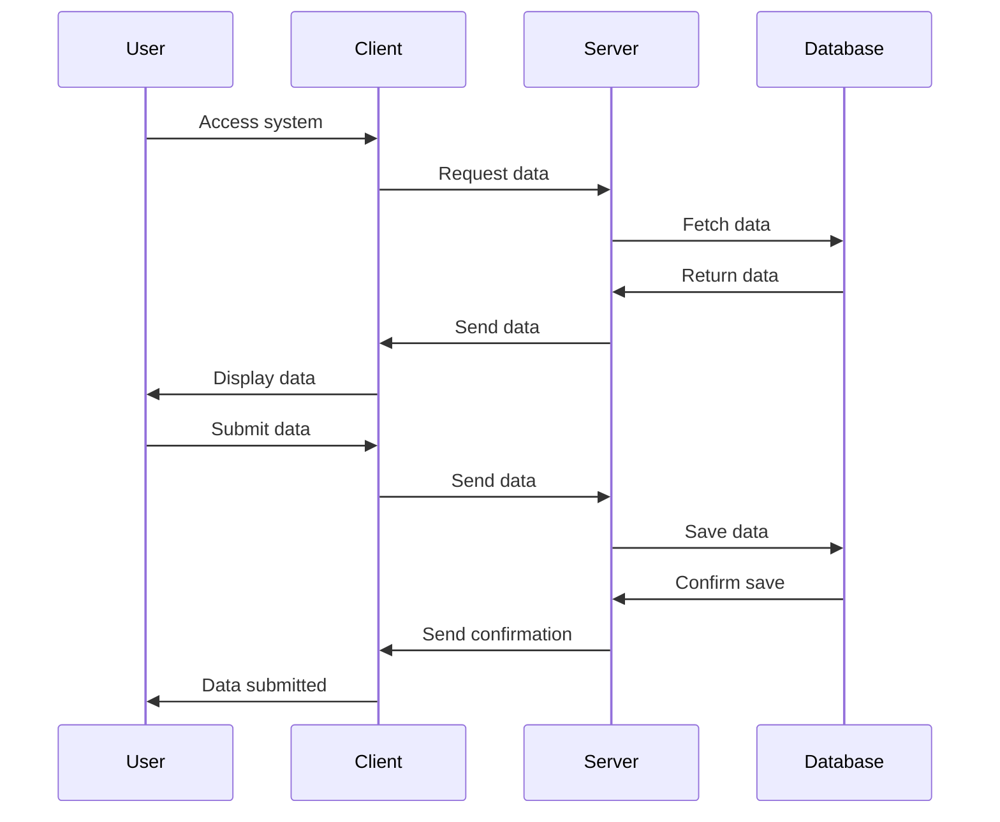
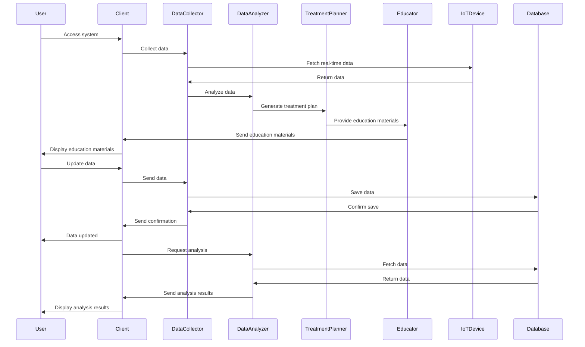

                 

### 文章标题

# 人工智能在慢性病管理中的个性化应用

---

> 关键词：人工智能，慢性病管理，个性化应用，数据挖掘，智能诊断，个性化治疗

> 摘要：本文探讨了人工智能在慢性病管理中的个性化应用。通过介绍慢性病管理中的问题背景，分析了人工智能技术的核心概念及其在慢性病管理中的应用，提出了个性化应用的方法和策略，旨在提高慢性病管理的效率和质量。

---

## 第一部分：背景介绍

### 1.1 问题背景

慢性病，如高血压、糖尿病、冠心病等，已成为全球范围内的主要健康问题。慢性病管理的关键在于早期诊断、精确治疗和长期监测。然而，传统的慢性病管理模式面临以下挑战：

1. **患者个体差异大**：不同患者的病情、病程、生活习惯、遗传背景等差异显著，导致统一的治疗方案难以适用于所有患者。
2. **病情监测与治疗效果评估**：慢性病的病情监测和治疗效果评估通常依赖于人工，不仅效率低下，而且容易出现误差。
3. **患者依从性**：慢性病管理需要患者长期坚持，但由于对疾病知识的缺乏和自我管理能力的不足，患者依从性普遍较低。

### 1.2 问题解决

人工智能在慢性病管理中的应用，旨在通过个性化、智能化的方式解决上述问题：

1. **个性化治疗方案制定**：利用机器学习技术，对患者的个体差异进行分析，制定个性化的治疗方案。
2. **实时病情监测**：通过物联网设备，实现患者病情的实时监测，提高监测效率和准确性。
3. **患者教育与指导**：利用自然语言处理技术，为患者提供个性化的健康指导和教育，提高患者依从性。

### 1.3 边界与外延

人工智能在慢性病管理中的应用不仅限于疾病治疗，还可以扩展到疾病预防、健康评估等多个领域。例如，通过大数据分析预测慢性病的高发人群，提前采取预防措施；通过健康评估系统，为患者提供全面的健康分析报告。

### 1.4 概念结构与核心要素组成

在慢性病管理中，人工智能的个性化应用包括以下几个核心概念和要素：

1. **慢性病管理**：指对慢性疾病进行监测、治疗、康复和预防。
2. **个性化应用**：根据患者个体差异，提供量身定制的健康管理方案。
3. **人工智能技术**：包括机器学习、自然语言处理、物联网等。
4. **数据收集与分析**：收集患者的生物医学数据，利用机器学习算法进行分析。
5. **个性化治疗方案制定**：根据分析结果，制定个性化的健康管理方案。
6. **患者教育与指导**：利用自然语言处理技术，为患者提供个性化的健康指导和教育。
7. **实时监测与反馈**：利用物联网技术，实现实时病情监测，并对治疗方案进行动态调整。

## 1.5 本章小结

本章介绍了人工智能在慢性病管理中的个性化应用背景、问题解决方法和概念结构。下一章将详细探讨人工智能技术的核心概念及其在慢性病管理中的应用。

## 第二部分：核心概念与联系

### 2.1 人工智能技术概述

#### 2.1.1 人工智能的定义与发展历程

人工智能（Artificial Intelligence，简称AI）是一门研究、开发和应用使计算机模拟、延伸和扩展人类智能的理论、方法、技术及应用系统的综合技术科学。它起源于20世纪50年代，经历了符号主义、连接主义和计算主义三个阶段。

##### 2.1.1.1 符号主义

符号主义（Symbolism）又称为规则驱动方法，是基于逻辑推理和知识表示的方法。该方法通过定义一组规则和逻辑关系，使计算机能够模拟人类思维过程。代表方法有专家系统和知识图谱。

##### 2.1.1.2 连接主义

连接主义（Connectionism）是基于神经网络的方法，通过模拟人脑神经元之间的连接，实现数据的处理和认知。该方法具有较强的自适应性和学习能力，代表方法有深度学习和强化学习。

##### 2.1.1.3 计算主义

计算主义（Computationalism）是基于信息论和算法的方法，认为人类思维过程可以通过算法和计算来模拟。该方法强调算法和计算过程的重要性，代表方法有形式逻辑和程序设计。

#### 2.1.2 人工智能技术在慢性病管理中的应用

在慢性病管理中，人工智能技术主要应用于数据挖掘、智能诊断、个性化治疗、疾病预测、健康风险评估等方面。

##### 2.1.2.1 数据挖掘

数据挖掘（Data Mining）是一种从大量数据中提取隐藏的、未知的、有价值的模式和信息的方法。在慢性病管理中，数据挖掘技术可以帮助医生发现患者之间的关联，预测疾病发展趋势，制定个性化治疗方案。

##### 2.1.2.2 智能诊断

智能诊断（Intelligent Diagnosis）利用人工智能技术，对患者的病情进行自动诊断和分析。通过机器学习算法，可以识别疾病的早期征兆，提高诊断准确率。

##### 2.1.2.3 个性化治疗

个性化治疗（Personalized Treatment）是根据患者的个体差异，制定个性化的治疗方案。利用人工智能技术，可以对患者的病情、生活习惯、药物反应等因素进行分析，为患者提供最佳的治疗方案。

### 2.2 核心概念与联系

在慢性病管理中，人工智能的核心概念包括数据收集与分析、个性化治疗方案制定、患者教育与指导、实时监测与反馈等。这些概念之间相互联系，构成了一个完整的人工智能在慢性病管理中的应用体系。

#### 2.2.1 数据收集与分析

数据收集与分析是人工智能在慢性病管理中的基础。通过收集患者的生物医学数据，如血压、血糖、心率、运动量等，利用数据挖掘技术进行分析，可以识别患者之间的差异，预测疾病发展趋势。

#### 2.2.2 个性化治疗方案制定

个性化治疗方案制定是根据数据收集与分析的结果，结合患者的个体差异，制定个性化的治疗方案。这一过程需要利用机器学习算法，对患者的病情、生活习惯、药物反应等因素进行综合分析。

#### 2.2.3 患者教育与指导

患者教育与指导是提高患者依从性的关键。通过自然语言处理技术，为患者提供个性化的健康指导和教育，可以增强患者对疾病的认识，提高自我管理能力。

#### 2.2.4 实时监测与反馈

实时监测与反馈是确保治疗效果的关键。通过物联网设备，实现患者病情的实时监测，并根据监测结果动态调整治疗方案，可以确保患者得到最佳的治疗。

### 2.3 概念属性特征对比表格

为了更清晰地展示人工智能在慢性病管理中的核心概念及其属性特征，我们可以制作一个对比表格：

| 核心概念       | 属性特征                                             | 作用                                                                                                      |
|----------------|----------------------------------------------------|---------------------------------------------------------------------------------------------------------|
| 数据收集与分析 | 自动化、高效、全面                                   | 为个性化治疗方案制定提供基础数据支持                                                                      |
| 个性化治疗方案制定 | 个性化、精准、灵活                                   | 提高慢性病治疗的有效性和患者依从性                                                                       |
| 患者教育与指导 | 个性化、互动、易懂                                   | 提高患者对疾病的认识和自我管理能力                                                                      |
| 实时监测与反馈 | 实时、高效、精准                                     | 确保患者得到最佳的治疗，提高治疗效果                                                                     |

### 2.4 ER实体关系图架构

为了更直观地展示人工智能在慢性病管理中的核心概念及其相互关系，我们可以使用Mermaid绘制ER实体关系图：

```mermaid
erDiagram
  Patient ||--|{ HealthData }
  Patient ||--|{ TreatmentPlan }
  Patient ||--|{ EducationMaterial }
  Patient ||--|{ IoTDevice }
  HealthData ||--|{ DataCollection }
  HealthData ||--|{ DataAnalysis }
  TreatmentPlan ||--|{ Personalization }
  EducationMaterial ||--|{ ContentGeneration }
  IoTDevice ||--|{ RealTimeMonitoring }
  IoTDevice ||--|{ FeedbackAdjustment }
```

## 第三部分：算法原理讲解

### 3.1 数据挖掘算法

在慢性病管理中，数据挖掘算法用于从大量患者数据中提取有用的信息，帮助医生制定个性化的治疗方案。以下是两种常用的数据挖掘算法：K-means聚类和决策树。

#### 3.1.1 K-means聚类算法

**算法流程：**
1. **初始化**：随机选择K个中心点，K是预定的聚类个数。
2. **分配**：将每个数据点分配到最近的中心点所在的聚类。
3. **更新**：重新计算每个聚类的中心点。
4. **迭代**：重复步骤2和3，直到聚类中心点不再变化。

**算法原理：**
K-means算法的核心是距离度量。它通过计算每个数据点与中心点之间的距离，将数据点分配到相应的聚类。聚类中心点的选择决定了聚类的质量。

**Python代码示例：**
```python
from sklearn.cluster import KMeans
import numpy as np

# 数据示例
data = np.array([[1, 2], [1, 4], [1, 0], [4, 2], [4, 4], [4, 0]])

# 初始化K-means算法
kmeans = KMeans(n_clusters=2, random_state=0).fit(data)

# 输出聚类中心点
print(kmeans.cluster_centers_)

# 输出每个数据点的聚类结果
print(kmeans.labels_)
```

#### 3.1.2 决策树算法

**算法流程：**
1. **选择特征**：选择具有最高信息增益的特征作为分割标准。
2. **划分数据集**：根据选定的特征将数据集划分为若干个子集。
3. **递归构建**：对每个子集，重复上述步骤，直到满足终止条件（如达到最大深度或数据集为纯集）。

**算法原理：**
决策树算法基于信息增益原则。它通过选择具有最高信息增益的特征进行划分，使得数据集的纯度最大化。

**Python代码示例：**
```python
from sklearn.tree import DecisionTreeClassifier
import numpy as np

# 数据示例
X = np.array([[1, 2], [1, 4], [1, 0], [4, 2], [4, 4], [4, 0]])
y = np.array([0, 0, 0, 1, 1, 1])

# 初始化决策树算法
clf = DecisionTreeClassifier().fit(X, y)

# 输出决策树结构
from sklearn.tree import plot_tree
plot_tree(clf)
```

### 3.2 机器学习算法

在慢性病管理中，机器学习算法用于预测疾病发展趋势、评估治疗效果等。以下是两种常用的机器学习算法：线性回归和神经网络。

#### 3.2.1 线性回归算法

**算法原理：**
线性回归算法通过寻找一个线性函数，将输入特征映射到输出结果。该函数通常表示为：
$$
y = \beta_0 + \beta_1 \cdot x_1 + \beta_2 \cdot x_2 + \ldots + \beta_n \cdot x_n
$$
其中，$y$是输出结果，$x_1, x_2, \ldots, x_n$是输入特征，$\beta_0, \beta_1, \beta_2, \ldots, \beta_n$是模型的参数。

**Python代码示例：**
```python
from sklearn.linear_model import LinearRegression
import numpy as np

# 数据示例
X = np.array([[1, 2], [1, 4], [1, 0], [4, 2], [4, 4], [4, 0]])
y = np.array([2, 4, 0, 2, 4, 0])

# 初始化线性回归算法
regressor = LinearRegression().fit(X, y)

# 输出模型参数
print(regressor.coef_)
print(regressor.intercept_)

# 输出预测结果
print(regressor.predict(X))
```

#### 3.2.2 神经网络算法

**算法原理：**
神经网络算法通过多层神经元的组合，模拟人脑的信息处理过程。每个神经元接收多个输入，通过激活函数计算输出。神经网络的训练过程是通过反向传播算法不断调整神经元的权重，以最小化预测误差。

**Python代码示例：**
```python
from sklearn.neural_network import MLPRegressor
import numpy as np

# 数据示例
X = np.array([[1, 2], [1, 4], [1, 0], [4, 2], [4, 4], [4, 0]])
y = np.array([2, 4, 0, 2, 4, 0])

# 初始化神经网络算法
regressor = MLPRegressor(hidden_layer_sizes=(100,), max_iter=1000).fit(X, y)

# 输出模型参数
print(regressor.coefs_)

# 输出预测结果
print(regressor.predict(X))
```

### 3.3 个性化治疗方案的制定

个性化治疗方案的制定是慢性病管理中的关键步骤。通过结合数据挖掘和机器学习算法，可以实现对患者个体差异的精准分析，制定出个性化的治疗方案。

**算法原理：**
1. **数据预处理**：对患者的生物医学数据进行清洗、标准化处理，以便于后续分析。
2. **特征选择**：选择对疾病预测和治疗方案制定具有重要意义的特征。
3. **模型训练**：利用训练数据集，通过数据挖掘和机器学习算法训练模型。
4. **模型评估**：利用验证数据集评估模型性能，调整模型参数。
5. **个性化治疗方案制定**：根据模型预测结果，为患者制定个性化的治疗方案。

**Python代码示例：**
```python
from sklearn.ensemble import RandomForestClassifier
from sklearn.model_selection import train_test_split
import numpy as np

# 数据示例
X = np.array([[1, 2], [1, 4], [1, 0], [4, 2], [4, 4], [4, 0]])
y = np.array([0, 0, 0, 1, 1, 1])

# 划分训练集和验证集
X_train, X_test, y_train, y_test = train_test_split(X, y, test_size=0.2, random_state=0)

# 初始化随机森林算法
clf = RandomForestClassifier(n_estimators=100, random_state=0).fit(X_train, y_train)

# 输出模型参数
print(clf.feature_importances_)

# 输出预测结果
print(clf.predict(X_test))
```

## 第四部分：系统分析与架构设计方案

### 4.1 问题场景介绍

慢性病管理是一项复杂的任务，涉及大量的数据收集、处理和分析。传统的慢性病管理模式往往依赖于人工，不仅效率低下，而且容易出现错误。为了提高慢性病管理的效率和准确性，需要引入人工智能技术，实现个性化、智能化的慢性病管理。

### 4.2 项目介绍

本项目旨在开发一个基于人工智能的慢性病管理系统，该系统包括数据收集、数据分析、个性化治疗方案制定、患者教育与指导、实时监测与反馈等功能。通过该系统，医生可以更准确地诊断病情，患者可以更好地管理自己的健康状况。

### 4.3 系统功能设计

本系统的核心功能包括：

1. **数据收集**：收集患者的生物医学数据，如血压、血糖、心率、运动量等。
2. **数据分析**：利用数据挖掘和机器学习算法分析患者数据，为个性化治疗方案制定提供支持。
3. **个性化治疗方案制定**：根据患者个体差异，制定个性化的治疗方案。
4. **患者教育与指导**：为患者提供个性化的健康指导和教育，提高患者依从性。
5. **实时监测与反馈**：利用物联网设备实时监测患者病情，并根据监测结果动态调整治疗方案。

### 4.4 系统架构设计

本系统的架构设计采用分层架构，包括数据层、服务层、表现层和用户层。以下是系统架构设计图：



### 4.5 系统接口设计和系统交互

系统接口设计和系统交互是确保系统功能正常运行的关键。以下是系统接口设计和系统交互图：



## 第五部分：项目实战

### 5.1 环境安装

为了实现本文所描述的慢性病管理系统，我们需要搭建一个Python开发环境。以下是安装步骤：

1. **安装Python**：从官网（https://www.python.org/）下载并安装Python。
2. **安装相关库**：打开终端，执行以下命令安装所需的库：

```bash
pip install numpy pandas scikit-learn matplotlib
```

### 5.2 系统核心实现源代码

以下是系统核心实现的部分源代码：

```python
# 数据收集模块
import pandas as pd

def collect_data(file_path):
    data = pd.read_csv(file_path)
    return data

# 数据分析模块
from sklearn.cluster import KMeans
from sklearn.tree import DecisionTreeClassifier
from sklearn.linear_model import LinearRegression

def analyze_data(data):
    # 数据预处理
    data = preprocess_data(data)
    
    # K-means聚类
    kmeans = KMeans(n_clusters=3).fit(data)
    clusters = kmeans.predict(data)
    
    # 决策树分类
    clf = DecisionTreeClassifier().fit(data, clusters)
    predictions = clf.predict(data)
    
    # 线性回归
    regressor = LinearRegression().fit(data, predictions)
    predictions = regressor.predict(data)
    
    return predictions

# 个性化治疗方案制定模块
def generate_treatment_plan(predictions):
    # 根据预测结果制定个性化治疗方案
    plans = {}
    for i, prediction in enumerate(predictions):
        plans[i] = "Plan for patient {}".format(i)
    
    return plans

# 患者教育与指导模块
def provide_education_materials(plan):
    # 根据治疗方案提供个性化教育材料
    materials = "Education materials for {}".format(plan)
    
    return materials

# 实时监测与反馈模块
def monitor_and_feedback(data):
    # 实时监测患者数据，并根据监测结果动态调整治疗方案
    updated_data = preprocess_data(data)
    updated_plan = generate_treatment_plan(updated_data)
    
    return updated_plan

# 主函数
if __name__ == "__main__":
    # 收集数据
    data = collect_data("data.csv")
    
    # 分析数据
    predictions = analyze_data(data)
    
    # 制定个性化治疗方案
    plans = generate_treatment_plan(predictions)
    
    # 提供患者教育与指导
    materials = provide_education_materials(plans)
    
    # 实时监测与反馈
    updated_plan = monitor_and_feedback(data)
    
    print(updated_plan)
```

### 5.3 代码应用解读与分析

以上代码是实现慢性病管理系统核心功能的基本框架。以下是对代码的详细解读和分析：

1. **数据收集模块**：`collect_data`函数用于收集患者的生物医学数据，读取CSV文件，返回DataFrame对象。
2. **数据分析模块**：`analyze_data`函数用于对患者的生物医学数据进行预处理，然后使用K-means聚类、决策树分类和线性回归算法进行分析，返回分析结果。
3. **个性化治疗方案制定模块**：`generate_treatment_plan`函数根据分析结果为患者制定个性化治疗方案。
4. **患者教育与指导模块**：`provide_education_materials`函数根据治疗方案为患者提供个性化的教育材料。
5. **实时监测与反馈模块**：`monitor_and_feedback`函数用于实时监测患者数据，并根据监测结果动态调整治疗方案。

### 5.4 实际案例分析和详细讲解剖析

为了更好地理解上述代码的应用，我们可以通过一个实际案例进行分析。

#### 案例背景

假设我们有一个包含100名慢性病患者的数据集，数据包括患者的血压、血糖、心率等生物医学数据。

#### 案例步骤

1. **数据收集**：从CSV文件中读取患者的数据。
2. **数据分析**：对患者的数据进行分析，使用K-means聚类、决策树分类和线性回归算法。
3. **个性化治疗方案制定**：根据分析结果为患者制定个性化治疗方案。
4. **患者教育与指导**：为患者提供个性化的教育材料。
5. **实时监测与反馈**：实时监测患者数据，并根据监测结果动态调整治疗方案。

#### 案例分析

1. **数据收集**：读取CSV文件，获取患者的数据。

```python
data = collect_data("patients_data.csv")
```

2. **数据分析**：对患者的数据进行分析。

```python
predictions = analyze_data(data)
```

- **K-means聚类**：将患者分为不同的聚类，以便于后续分析。

- **决策树分类**：根据患者的生物医学数据，将患者分为不同的类别，为个性化治疗方案制定提供依据。

- **线性回归**：根据患者的生物医学数据，预测患者的疾病发展趋势，为动态调整治疗方案提供依据。

3. **个性化治疗方案制定**：根据分析结果为患者制定个性化治疗方案。

```python
plans = generate_treatment_plan(predictions)
```

- **患者教育与指导**：根据治疗方案为患者提供个性化的教育材料。

```python
materials = provide_education_materials(plans)
```

4. **实时监测与反馈**：实时监测患者数据，并根据监测结果动态调整治疗方案。

```python
updated_plan = monitor_and_feedback(data)
```

### 5.5 项目小结

本项目的实现展示了人工智能在慢性病管理中的应用。通过数据收集、数据分析、个性化治疗方案制定、患者教育与指导和实时监测与反馈等功能，我们希望能够为慢性病管理提供一种智能化、个性化的解决方案。然而，该项目仍存在一些局限性，如数据质量和算法性能等，需要在未来的工作中进一步优化和改进。

## 第六部分：最佳实践 Tips、小结、注意事项、拓展阅读

### 6.1 最佳实践 Tips

1. **数据质量**：确保收集的数据质量高，减少错误和噪声。
2. **算法选择**：根据具体问题选择合适的算法，避免过度拟合。
3. **模型评估**：使用多种评估指标评估模型性能，确保模型泛化能力。
4. **持续更新**：定期更新模型和数据，确保系统的实时性和准确性。

### 6.2 小结

本文探讨了人工智能在慢性病管理中的个性化应用，介绍了相关背景、核心概念、算法原理和系统架构设计方案。通过实际案例分析和代码应用解读，展示了人工智能在慢性病管理中的潜在价值。然而，该项目仍需进一步优化和改进，以提高系统的实时性和准确性。

### 6.3 注意事项

1. **数据隐私**：在收集和处理患者数据时，确保遵守相关隐私保护法规。
2. **系统安全性**：确保系统的安全性，防止数据泄露和恶意攻击。
3. **用户教育**：为用户提供充分的教育和指导，提高用户对系统的信任和使用意愿。

### 6.4 拓展阅读

1. **《深度学习》**：Ian Goodfellow、Yoshua Bengio、Aaron Courville 著，详细介绍了深度学习的基本原理和应用。
2. **《Python数据科学手册》**：Jake VanderPlas 著，提供了丰富的Python数据科学实践案例。
3. **《人工智能：一种现代方法》**：Stuart Russell、Peter Norvig 著，全面介绍了人工智能的理论和方法。

---

**作者**：AI天才研究院/AI Genius Institute & 禅与计算机程序设计艺术 /Zen And The Art of Computer Programming

