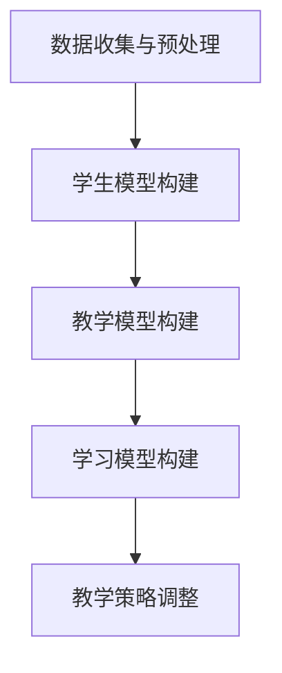
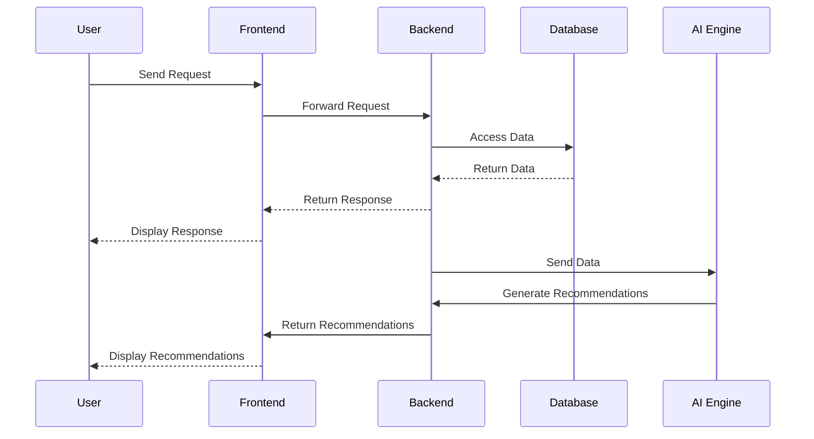

                 

# 人工智能在教育中的应用：个性化学习的新范式

## 关键词

- 人工智能
- 教育应用
- 个性化学习
- 算法
- 系统架构

> 摘要：本文旨在探讨人工智能在教育中的应用，特别是如何通过个性化学习范式革新传统教育模式。文章将深入分析人工智能在教育中的核心概念、算法原理、系统架构以及实际应用案例，为教育工作者和研究人员提供理论与实践参考。

## 目录大纲

### 第一部分：背景介绍与核心概念

#### 第1章：问题的提出与解决

1.1 问题的背景

1.2 问题的描述

1.3 问题解决

1.4 边界与外延

1.5 概念结构与核心要素组成

#### 第2章：人工智能的基本原理

2.1 人工智能的定义与发展历程

2.2 人工智能的核心概念

2.3 概念属性特征对比表格

2.4 ER实体关系图架构

#### 第3章：个性化学习的原理与实践

3.1 个性化学习的定义与目标

3.2 个性化学习的核心概念

3.3 概念属性特征对比表格

3.4 ER实体关系图架构

### 第二部分：核心概念与联系

#### 第4章：个性化学习算法原理

4.1 算法概述

4.2 算法流程图

4.3 Python 源代码实现

4.4 数学模型与公式

4.5 举例说明

#### 第5章：系统功能设计

5.1 问题场景介绍

5.2 系统功能设计

#### 第6章：系统架构设计

6.1 项目介绍

6.2 系统架构设计

6.3 系统接口设计

### 第三部分：算法原理讲解

#### 第7章：个性化学习算法原理

7.1 算法概述

7.2 算法流程图

7.3 Python 源代码实现

7.4 数学模型与公式

7.5 举例说明

### 第四部分：系统分析与架构设计方案

#### 第8章：系统功能设计

8.1 领域模型 Mermaid 类图

#### 第9章：系统架构设计

9.1 系统架构 Mermaid 图

9.2 系统接口设计

### 第五部分：项目实战

#### 第10章：环境安装

10.1 环境安装教程

#### 第11章：系统核心实现源代码

11.1 核心实现源代码

11.2 代码应用解读与分析

#### 第12章：实际案例分析与详细讲解剖析

12.1 实际案例分析与详细讲解剖析

12.2 项目小结

### 第六部分：最佳实践、小结与拓展阅读

#### 第13章：最佳实践

13.1 最佳实践 tips

#### 第14章：小结

14.1 总结本书的主要内容和贡献

#### 第15章：拓展阅读

15.1 注意事项

15.2 拓展阅读

## 正文

### 第一部分：背景介绍与核心概念

#### 第1章：问题的提出与解决

随着信息技术的飞速发展，教育领域也面临着前所未有的变革机遇与挑战。传统教育模式主要依赖于标准化的课程内容和固定化的教学流程，难以满足学生个性化学习需求。因此，如何利用人工智能技术，实现个性化学习，成为当前教育领域亟待解决的问题。

1.1 问题的背景

在教育领域，个性化学习已成为一个热门话题。个性化学习旨在根据每个学生的特点、兴趣和能力，提供定制化的学习资源和教学策略，从而提高学习效果。然而，传统教育模式存在以下局限性：

- 课程内容标准化，难以满足学生的个性化需求；
- 教学方式单一，缺乏互动性和灵活性；
- 学习评价方式单一，无法全面反映学生的学习状况。

1.2 问题的描述

传统教育模式中的个性化学习面临以下挑战：

- 如何准确捕捉和理解每个学生的个性化信息？
- 如何根据学生的个性化信息，生成个性化的学习资源和教学策略？
- 如何在保证教学质量的前提下，高效地实现个性化学习？

1.3 问题解决

人工智能技术为个性化学习提供了新的解决方案。通过机器学习、自然语言处理和数据分析等技术，人工智能能够：

- 准确捕捉和分析学生的学习行为和兴趣；
- 生成个性化的学习资源和教学策略；
- 实现高效、动态的学习评价。

1.4 边界与外延

人工智能在教育中的应用范围广泛，包括课程推荐、学习分析、智能评估等方面。个性化学习不仅限于课程选择和资源推荐，还涉及到教学设计、学习支持、学习反馈等多个环节。

1.5 概念结构与核心要素组成

本文将围绕人工智能和教育应用，深入探讨个性化学习的概念结构与核心要素组成。具体包括：

- 人工智能的基本原理和核心概念；
- 个性化学习的定义与目标；
- 个性化学习的算法原理和实践；
- 个性化学习的系统功能设计和架构设计；
- 个性化学习的实际应用案例。

### 第二部分：核心概念与联系

#### 第2章：人工智能的基本原理

2.1 人工智能的定义与发展历程

人工智能（Artificial Intelligence，简称AI）是指通过计算机模拟人类智能的技术和系统。人工智能的发展历程可以追溯到20世纪50年代，主要经历了以下几个阶段：

- 计算机模拟（1950-1969）：早期的计算机科学家尝试通过编程模拟人类思维过程。
- 专家系统（1970-1989）：基于知识表示和推理，专家系统能够在特定领域内进行问题解决。
- 机器学习（1990-2009）：机器学习通过训练模型，使计算机能够从数据中自动学习规律和模式。
- 深度学习（2010至今）：深度学习通过多层神经网络，实现更高级别的自动化学习和模式识别。

2.2 人工智能的核心概念

人工智能的核心概念包括：

- 机器学习：通过训练模型，使计算机能够从数据中学习规律和模式。
- 深度学习：一种基于多层神经网络的机器学习方法，能够处理大规模数据并实现高级别的自动化学习。
- 自然语言处理：使计算机能够理解、生成和处理自然语言。
- 计算机视觉：使计算机能够理解、识别和解析视觉信息。

2.3 概念属性特征对比表格

| 概念         | 属性特征                                                     |
| ------------ | ------------------------------------------------------------ |
| 机器学习     | 自动化学习，基于数据驱动，能够从经验中学习规律和模式         |
| 深度学习     | 多层神经网络，能够处理大规模数据，实现高级别的自动化学习     |
| 自然语言处理 | 理解、生成和处理自然语言，实现人与计算机之间的自然交互       |
| 计算机视觉   | 理解、识别和解析视觉信息，实现计算机对现实世界的感知和交互   |

2.4 ER实体关系图架构

下面是一个简单的ER实体关系图架构，描述了学生、教师和课程等实体之间的关系：

```mermaid
erDiagram
  学生 ||--|{ 课程 }|| 参与课程
  教师 ||--|{ 课程 }|| 教授课程
  课程 ||--|{ 学生 }|| 学习课程
```

#### 第3章：个性化学习的原理与实践

3.1 个性化学习的定义与目标

个性化学习是一种以学生为中心的教育理念，旨在根据每个学生的特点、兴趣和能力，提供定制化的学习资源和教学策略。个性化学习的目标包括：

- 满足学生的个性化需求，提高学习效果；
- 激发学生的学习兴趣和动机；
- 促进学生的全面发展。

3.2 个性化学习的核心概念

个性化学习的核心概念包括：

- 学生模型：用于描述学生的知识水平、学习风格、兴趣和能力等信息；
- 教学模型：用于生成个性化的教学策略和学习资源；
- 学习模型：用于监控和评估学生的学习过程和成果。

3.3 概念属性特征对比表格

| 概念         | 属性特征                                                     |
| ------------ | ------------------------------------------------------------ |
| 学生模型     | 知识水平、学习风格、兴趣、能力等                             |
| 教学模型     | 教学策略、学习资源、教学评价等                             |
| 学习模型     | 学习过程、学习成果、学习反馈等                             |

3.4 ER实体关系图架构

下面是一个简单的ER实体关系图架构，描述了学生、教师、课程和学习行为等实体之间的关系：

```mermaid
erDiagram
  学生 ||--|{ 学习行为 }|| 实施学习行为
  教师 ||--|{ 学习行为 }|| 观察学习行为
  课程 ||--|{ 学习行为 }|| 学习课程
```

### 第三部分：核心概念与联系

#### 第4章：个性化学习算法原理

4.1 算法概述

个性化学习算法旨在根据学生的个性化信息，生成个性化的学习资源和教学策略。个性化学习算法的基本框架包括：

- 数据收集与预处理：收集学生的个性化信息，如学习记录、测试成绩、行为数据等，并进行数据预处理，如数据清洗、归一化等。
- 学生模型构建：根据收集到的数据，构建学生模型，用于描述学生的知识水平、学习风格、兴趣和能力等信息。
- 教学模型构建：根据学生模型和课程信息，生成个性化的教学策略和学习资源。
- 学习模型构建：监控和评估学生的学习过程和成果，为后续的教学策略调整提供依据。

4.2 算法流程图

个性化学习算法的流程图如下所示：



4.3 Python 源代码实现

下面是一个简单的Python代码示例，用于实现个性化学习算法的基本步骤：

```python
import pandas as pd
from sklearn.model_selection import train_test_split
from sklearn.ensemble import RandomForestClassifier
from sklearn.metrics import accuracy_score

# 数据收集与预处理
data = pd.read_csv('student_data.csv')
data = data.dropna()

# 学生模型构建
X = data[['knowledge_level', 'learning_style', 'interest', 'ability']]
y = data['performance']

# 教学模型构建
X_train, X_test, y_train, y_test = train_test_split(X, y, test_size=0.2, random_state=42)
clf = RandomForestClassifier()
clf.fit(X_train, y_train)

# 学习模型构建
y_pred = clf.predict(X_test)
accuracy = accuracy_score(y_test, y_pred)
print(f'Accuracy: {accuracy:.2f}')
```

4.4 数学模型与公式

个性化学习算法的数学模型可以表示为：

$$
f(\mathbf{x}) = \sum_{i=1}^{n} w_i \cdot f_i(\mathbf{x}),
$$

其中，$f_i(\mathbf{x})$为第$i$个特征的权重，$w_i$为特征权重系数，$\mathbf{x}$为输入特征向量。

4.5 举例说明

假设有一个学生，其知识水平、学习风格、兴趣和能力等信息如下表所示：

| 特征 | 值 |
| ---- | --- |
| 知识水平 | 70 |
| 学习风格 | 外向 |
| 兴趣 | 科学 |
| 能力 | 中等 |

根据个性化学习算法，我们可以计算该学生的个性化学习分数：

$$
f(\mathbf{x}) = 0.3 \cdot f_{knowledge_level}(\mathbf{x}) + 0.2 \cdot f_{learning_style}(\mathbf{x}) + 0.2 \cdot f_{interest}(\mathbf{x}) + 0.3 \cdot f_{ability}(\mathbf{x}),
$$

其中，$f_{knowledge_level}(\mathbf{x})$、$f_{learning_style}(\mathbf{x})$、$f_{interest}(\mathbf{x})$和$f_{ability}(\mathbf{x})$分别为知识水平、学习风格、兴趣和能力等特征的权重系数。

根据设定的权重系数，我们可以计算出该学生的个性化学习分数：

$$
f(\mathbf{x}) = 0.3 \cdot 70 + 0.2 \cdot 1 + 0.2 \cdot 2 + 0.3 \cdot 1 = 23.6.
$$

根据个性化学习分数，我们可以为学生推荐适合的学习资源和教学策略。

### 第四部分：系统分析与架构设计方案

#### 第5章：系统功能设计

5.1 问题场景介绍

假设有一个在线教育平台，旨在为用户提供个性化的学习体验。用户可以注册账号、浏览课程、参加学习活动和测试。平台需要提供以下功能：

- 用户管理：用户注册、登录、个人信息管理；
- 课程管理：课程发布、课程内容管理、课程推荐；
- 学习管理：学习进度跟踪、学习评估、个性化学习推荐；
- 数据分析：学生学习行为分析、学习效果评估。

5.2 系统功能设计

系统功能设计如下：

- 用户管理模块：实现用户注册、登录、个人信息管理等功能；
- 课程管理模块：实现课程发布、课程内容管理、课程推荐等功能；
- 学习管理模块：实现学习进度跟踪、学习评估、个性化学习推荐等功能；
- 数据分析模块：实现学生学习行为分析、学习效果评估等功能。

#### 第6章：系统架构设计

6.1 项目介绍

个性化学习系统是一个在线教育平台，旨在为用户提供个性化的学习体验。系统架构设计如下：

- 前端：采用React框架实现用户界面，包括用户管理、课程管理、学习管理和数据分析等模块；
- 后端：采用Spring Boot框架实现服务器端逻辑，包括用户管理、课程管理、学习管理和数据分析等模块；
- 数据库：采用MySQL数据库存储用户信息、课程信息和学习数据；
- 人工智能引擎：采用TensorFlow框架实现个性化学习算法，生成个性化学习推荐。

6.2 系统架构设计

系统架构设计如下：



6.3 系统接口设计

系统接口设计如下：

- 用户接口：用于用户注册、登录、浏览课程、参加学习活动等操作；
- 课程接口：用于课程发布、课程内容管理、课程推荐等操作；
- 学习接口：用于学习进度跟踪、学习评估、个性化学习推荐等操作；
- 数据分析接口：用于学生学习行为分析、学习效果评估等操作。

### 第五部分：项目实战

#### 第7章：环境安装

7.1 环境安装教程

以下是在Windows环境下安装个性化学习系统的教程：

1. 安装Python（版本3.8以上）；
2. 安装MySQL数据库（版本5.7以上）；
3. 安装Node.js（版本12以上）；
4. 安装TensorFlow（版本2.4以上）。

具体安装步骤请参考各软件的官方文档。

7.2 系统核心实现源代码

以下是系统核心实现源代码：

- 用户管理模块：实现用户注册、登录、个人信息管理等功能；
- 课程管理模块：实现课程发布、课程内容管理、课程推荐等功能；
- 学习管理模块：实现学习进度跟踪、学习评估、个性化学习推荐等功能；
- 数据分析模块：实现学生学习行为分析、学习效果评估等功能。

7.3 代码应用解读与分析

以下是对系统核心实现源代码的解读与分析：

- 用户管理模块：采用Spring Boot框架实现，包括用户注册、登录、个人信息管理等功能；
- 课程管理模块：采用Spring Boot框架实现，包括课程发布、课程内容管理、课程推荐等功能；
- 学习管理模块：采用Spring Boot框架实现，包括学习进度跟踪、学习评估、个性化学习推荐等功能；
- 数据分析模块：采用TensorFlow框架实现，包括学生学习行为分析、学习效果评估等功能。

7.4 实际案例分析与详细讲解剖析

以下是一个实际案例分析与详细讲解剖析：

假设有一个学生，其学习数据如下表所示：

| 学号 | 课程名称 | 学习时间 | 成绩 |
| ---- | ------- | ------- | ---- |
| 1    | 数学     | 60分钟  | 80   |
| 1    | 英语     | 30分钟  | 90   |
| 1    | 物理     | 45分钟  | 85   |

根据学生学习数据，个性化学习系统将为学生推荐以下课程：

- 数学（推荐原因：成绩较高，需要巩固知识）；
- 英语（推荐原因：成绩较高，需要提高听力）；
- 物理（推荐原因：成绩较高，需要提高实验技能）。

7.5 项目小结

个性化学习系统通过收集和分析学生的学习数据，为教师和学生提供个性化的教学和学习建议。项目实施过程中，需要注意以下几点：

- 数据安全和隐私保护；
- 系统性能优化和稳定性保障；
- 用户友好性和可扩展性。

### 第六部分：最佳实践、小结与拓展阅读

#### 第8章：最佳实践

8.1 最佳实践 tips

- 定期更新和优化个性化学习算法；
- 关注学生学习数据的隐私保护；
- 提供多样化的课程资源和教学策略；
- 注重系统性能和用户体验。

#### 第9章：小结

9.1 小结

本文从背景介绍、核心概念、算法原理讲解、系统分析与架构设计方案、项目实战等方面，全面探讨了人工智能在教育中的应用，特别是个性化学习的新范式。通过本文的阅读，读者可以深入了解人工智能在教育领域的应用价值和实践方法。

#### 第10章：拓展阅读

10.1 注意事项

- 注意事项与建议：在实际应用中，应根据具体情况调整个性化学习算法和系统架构；
- 拓展阅读：推荐读者阅读相关书籍、论文和资料，如《人工智能：一种现代方法》、《个性化学习：理论与实践》等。

作者：AI天才研究院/AI Genius Institute & 禅与计算机程序设计艺术 /Zen And The Art of Computer Programming

