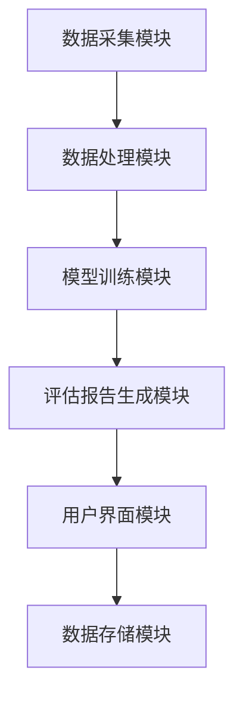

                 

**第1章：问题背景与概述**

### 1.1 人工智能在教育评估中的重要性

#### **问题背景**

在传统的教育评估模式中，教师通常通过定期考试、课堂观察和学生作业来评估学生的学习情况。这种方法虽然能够提供一定的反馈，但在准确性、全面性和及时性方面存在一定的局限。例如，考试往往只能反映学生在某个特定时间点的学习状况，而无法动态跟踪学生的学习进度和困难点。此外，教师的时间和精力也限制了他们进行更深入、个性化的评估。

#### **问题描述**

随着教育的不断发展，教育评估的需求变得越来越复杂。现代社会对人才的培养不仅要求掌握基本的知识和技能，更注重培养学生的创新能力、批判性思维和解决问题的能力。然而，传统的评估方法很难全面捕捉到这些能力。此外，学生的个体差异也越来越大，每个学生都有自己的学习节奏和偏好，传统的评估方法无法提供个性化的学习支持。

#### **问题解决**

人工智能技术的发展为教育评估带来了一场革命。通过大数据分析、机器学习、自然语言处理等技术，人工智能能够实时收集和分析学生的学习数据，提供更加精准、个性化的评估结果。这不仅提高了评估的效率，还增强了评估的准确性，有助于教师更好地了解学生的学习状况，从而提供更有针对性的教学支持。

#### **边界与外延**

在教育评估中，人工智能的应用不仅仅局限于学生学习成绩的评估，还可以扩展到学生的学习行为分析、学习路径推荐、教学过程优化等多个方面。通过这些应用，人工智能不仅能够帮助教师进行更加精准的教育评估，还能够促进个性化学习和教学方式的创新。

### 1.2 人工智能与教育评估的基本概念

#### **人工智能的定义**

人工智能（Artificial Intelligence，简称AI）是计算机科学的一个分支，旨在使计算机系统具备类似人类的智能。这包括感知、理解、推理、学习和自我改进等能力。人工智能的目标是创建能够执行复杂任务的智能系统，从而解放人类的生产力，提高生活质量。

#### **教育评估的定义**

教育评估是指系统地收集和分析学生或教育项目相关的数据，以评价其表现、质量和效果的过程。教育评估的目的在于提供反馈，帮助教师改进教学方法，提高学生的学习效果，促进教育目标的实现。

#### **形成性评估与个性化学习的概念**

形成性评估是一种旨在支持学生学习过程的评估方式，通过不断收集和分析学生的学习数据，提供及时、具体的反馈，帮助教师调整教学策略，以更好地支持学生的个性化学习。

个性化学习是一种以学生为中心的教育模式，旨在根据学生的兴趣、能力和发展需求，提供个性化的学习资源、教学活动和评估方式，从而促进每个学生的全面发展。

#### **人工智能在教育评估中的核心作用**

人工智能在教育评估中的核心作用主要体现在以下几个方面：

- **提高评估效率**：通过自动化数据收集和分析，人工智能可以大大减少教师的工作量，使教师能够将更多精力投入到教学活动中。

- **增强评估准确性**：人工智能可以通过学习分析技术，对学生的学习行为和成绩进行精准分析，提供更准确、更全面的评估结果。

- **促进个性化学习**：通过智能分析学生的学习数据，人工智能可以为学生推荐个性化的学习资源和教学活动，满足学生的个性化需求。

#### **人工智能在教育评估中的应用领域**

人工智能在教育评估中的应用非常广泛，主要包括以下领域：

- **学习分析**：通过分析学生的学习行为和成绩数据，发现学生的学习模式、兴趣和需求，为教师提供有针对性的教学建议。

- **学生行为预测**：利用机器学习算法，预测学生的成绩和学习进度，帮助教师提前干预，预防学习困难。

- **教学过程优化**：通过分析教学数据，优化教学策略，提高教学效果。

- **教学资源推荐**：根据学生的学习偏好和需求，推荐合适的教学资源，帮助学生更高效地学习。

### 1.4 人工智能在教育评估中的应用案例

#### **案例一：智能学习分析系统**

智能学习分析系统通过分析学生的学习行为和成绩数据，为学生提供个性化的学习建议。例如，系统可以识别出学生的学习弱点，推荐相应的学习资源和练习题，帮助学生进行针对性的学习。

#### **案例二：个性化学习平台**

个性化学习平台通过收集学生的学习数据，分析学生的学习习惯和兴趣，为学生推荐个性化的学习内容和教学活动。这种平台不仅可以提高学生的学习效果，还可以激发学生的学习兴趣。

#### **案例三：智能评估系统**

智能评估系统通过自动化测试和成绩分析，为教师提供即时的评估反馈。教师可以根据反馈结果，调整教学策略，提高教学质量。

通过这些案例，我们可以看到，人工智能在教育评估中的应用不仅提高了评估的效率和准确性，还促进了个性化学习的实现，为教育评估带来了全新的变革。

---

在本文的第一部分，我们详细探讨了人工智能在教育评估中的重要性。首先，我们介绍了传统教育评估模式的局限性，以及人工智能技术如何通过提高效率、准确性和个性化学习，解决这些问题。接着，我们定义了人工智能、教育评估、形成性评估和个性化学习的概念，并阐述了人工智能在教育评估中的核心作用。最后，我们通过具体案例展示了人工智能在实际应用中的效果，为后续章节的内容奠定了基础。

在接下来的章节中，我们将进一步探讨人工智能的核心概念与原理，深入分析形成性评估的理论与实践，以及个性化学习的理论基础，从而全面探讨人工智能在教育评估中的应用。通过这些章节的探讨，我们将逐步揭示人工智能如何彻底改变教育评估的方式，为教育行业带来深远的影响。请读者们继续关注，一起走进这个激动人心的领域。

---

## 第一部分：背景与概念

### 第1章：问题背景与概述

### 1.1 人工智能在教育评估中的重要性

#### 问题背景

在教育领域，评估是确保教学质量、促进学生学习进步的重要手段。传统的教育评估方法主要包括期中考试、期末考试、作业和课堂表现等。然而，这些方法存在一些显著的局限性。首先，它们往往注重结果而忽视过程，即只关注学生在考试中的最终成绩，而忽略了学生在学习过程中的实际表现和进步情况。其次，传统评估方法通常缺乏个性化和动态性，无法全面反映每个学生的独特需求和成长路径。此外，教师在评估过程中面临着繁重的工作负担，尤其是在学生人数较多的情况下，难以对每个学生的表现进行细致、个性化的分析。

#### 问题描述

随着教育理念的更新和技术的进步，教育评估的需求变得更为复杂和多样化。现代社会对教育的要求不仅限于传授知识，更强调培养学生的创新能力、批判性思维、协作能力和解决问题的能力。然而，传统的评估方法难以全面、动态地捕捉这些能力的发展。例如，学生在课堂上的参与度、实验操作的能力、对复杂问题的分析能力等，这些软性技能往往难以通过传统的笔试和考试得到准确评估。此外，学生的个体差异也越来越受到重视，每个学生的学习速度、兴趣和需求都不同，传统的评估方法无法提供个性化的评估和反馈。

#### 问题解决

人工智能（AI）的出现为教育评估带来了新的可能性。通过应用大数据分析、机器学习和自然语言处理等技术，人工智能能够实时、动态地收集和分析学生的学习数据，提供更加精准、个性化的评估结果。例如，AI系统可以实时监测学生的学习行为，分析他们的学习进度和困难点，提供即时的反馈和指导。这样的评估方式不仅能够提高评估的效率，还能增强评估的准确性，帮助教师更全面地了解学生的学习状况，从而提供更有针对性的教学支持。

#### 边界与外延

在教育评估中，人工智能的应用不仅仅是提高评估结果的准确性，还可以扩展到更广泛的应用领域。例如，AI可以用于学习分析，通过分析学生的学习行为和成绩数据，发现他们的学习模式、兴趣和需求，为教师提供有针对性的教学建议。AI还可以用于学生行为预测，利用机器学习算法预测学生的成绩和学习进度，帮助教师提前干预，预防学习困难。此外，AI还可以用于教学过程优化，通过分析教学数据，优化教学策略，提高教学效果。在教育资源的推荐方面，AI可以根据学生的学习偏好和需求，推荐合适的教学资源和学习路径，帮助学生更高效地学习。

### 1.2 人工智能与教育评估的基本概念

#### 人工智能的定义

人工智能（Artificial Intelligence，简称AI）是指计算机系统模拟人类智能行为的能力，包括感知、理解、推理、学习、自我修正等。AI的目的是使计算机能够执行通常需要人类智能才能完成的任务，从而提高效率、优化决策，甚至创造新的价值。

#### 教育评估的定义

教育评估是指系统地收集、分析和解释关于教育过程和结果的数据，以评价教育质量、效果和效益的过程。教育评估包括对学生学习成果的评估、对教学方法和策略的评估、对教育资源和条件的评估等。

#### 形成性评估与个性化学习的概念

形成性评估（Formative Assessment）是一种旨在支持学生学习过程的评估方式，通过持续收集和分析学生的学习行为和成果数据，为教师提供及时的反馈，帮助他们调整教学策略，以更好地支持学生的学习和成长。

个性化学习（Personalized Learning）是一种以学生为中心的教育模式，旨在根据每个学生的兴趣、能力和发展需求，提供个性化的学习资源和教学活动。个性化学习的目标是满足每个学生的个性化需求，促进他们的全面发展。

### 1.3 人工智能在教育评估中的核心作用

#### 提高教育评估的效率

通过自动化数据收集和分析，人工智能可以显著提高教育评估的效率。传统评估方法通常需要人工进行大量的数据录入和处理，而AI系统可以自动化完成这些任务，大大减轻教师的工作负担。例如，AI可以通过电子学习平台和智能设备实时收集学生的学习数据，快速生成评估报告，使教师能够更专注于教学活动。

#### 增强教育评估的准确性

人工智能利用其强大的数据分析能力，可以提供更加精准的评估结果。通过分析学生的学习行为、成绩和反馈，AI可以更准确地识别学生的学习弱点和发展潜力。这种精准的评估有助于教师制定更有针对性的教学计划，提高教学效果。

#### 促进个性化学习的实现

个性化学习是现代教育的核心要求之一。人工智能可以通过分析学生的学习数据和偏好，为学生提供个性化的学习资源和教学活动。例如，AI可以根据学生的学习进度和成绩，推荐适合的学习材料和练习题，帮助学生更高效地学习。此外，AI还可以根据学生的反馈和表现，动态调整教学策略，确保每个学生都能获得最佳的学习体验。

### 1.4 人工智能在教育评估中的应用领域

#### 学习分析

学习分析是人工智能在教育评估中的一项重要应用。通过分析学生的学习行为和成绩数据，AI可以识别学生的学习模式、兴趣和需求，为教师提供有针对性的教学建议。例如，AI可以分析学生在课堂上的参与度、作业提交情况和学习进度，帮助教师发现学生的学习瓶颈，及时给予支持。

#### 学生行为预测

学生行为预测是利用人工智能技术预测学生的成绩和学习进度。通过分析历史数据和现有数据，AI可以预测学生在未来可能的表现，帮助教师提前干预，预防学习困难。这种预测功能有助于教师制定个性化的教学计划，提高学生的整体学习效果。

#### 教学过程优化

人工智能可以帮助教师优化教学过程。通过分析教学数据，AI可以识别出教学中的薄弱环节，提出改进建议。例如，AI可以分析学生的学习反馈，识别出教师讲解不够清晰或学生理解困难的部分，帮助教师调整教学方法和内容，提高教学效果。

#### 教学资源推荐

人工智能可以根据学生的学习偏好和需求，推荐适合的教学资源和学习路径。例如，AI可以推荐相关的学习资料、视频课程、练习题和在线工具，帮助学生更高效地学习。此外，AI还可以根据学生的学习进度和表现，动态调整推荐内容，确保学习资源的个性化匹配。

### 1.5 小结

通过本章节的介绍，我们可以看到，人工智能在教育评估中具有巨大的潜力。它不仅能够提高评估的效率、准确性和个性化程度，还可以为教师提供有力的工具，帮助他们更好地支持学生的学习和成长。随着人工智能技术的不断发展，我们期待它将在未来继续为教育领域带来更多的创新和变革。

## 第2章：人工智能核心概念与原理

### 2.1 人工智能的基本概念

人工智能（Artificial Intelligence，简称AI）是计算机科学的一个分支，旨在使计算机系统具备类似人类的智能。AI的目标是创建能够执行复杂任务的智能系统，从而提高生产力、优化决策，并创造出新的价值。人工智能的定义可以从多个角度来理解：

- **模拟人类智能**：人工智能系统通过模仿人类智能的行为和决策过程，实现自动化和智能化。这包括感知、理解、推理、学习和自我修正等能力。

- **应用领域广泛**：人工智能技术广泛应用于多个领域，包括但不限于自然语言处理、计算机视觉、机器学习、语音识别、机器人技术等。这些应用不仅提升了工作效率，还带来了生活方式的革新。

- **多学科交叉**：人工智能的发展涉及多个学科领域，如计算机科学、数学、认知科学、心理学、神经科学等。这种多学科交叉的特点使得人工智能成为一个复杂且充满挑战的领域。

#### 人工智能的分类

人工智能可以分为几个主要类别，每种类型都有其独特的特点和应用场景：

- **弱人工智能（Narrow AI）**：也称为专用人工智能，这类AI系统专注于执行单一任务，例如语音识别、图像分类、推荐系统等。尽管这些系统非常强大，但它们缺乏人类智能的广泛适应性。

- **强人工智能（General AI）**：也称为通用人工智能，这类AI系统能够像人类一样具备广泛的学习、理解、推理和自我修正能力。目前，强人工智能仍然是一个理论上的目标，尚未实现。

- **混合人工智能（Hybrid AI）**：混合人工智能结合了多种不同的AI技术，如机器学习、深度学习、自然语言处理等，以实现更高效、更智能的解决方案。这种类型的AI系统在许多实际应用中表现出色。

#### 人工智能的发展历程

人工智能的发展历程可以追溯到20世纪50年代。以下是一些关键的发展里程碑：

- **1956年**：达特茅斯会议被认为是人工智能诞生的标志。在这次会议上，约翰·麦卡锡（John McCarthy）等人首次提出了“人工智能”的概念。

- **1960年代**：早期的人工智能研究主要集中在规则推理和知识表示上。这一时期出现了许多重要的算法和系统，如基于逻辑的专家系统。

- **1980年代**：人工智能进入了新的发展阶段，特别是机器学习和专家系统的应用。这一时期的代表性成果包括神经网络和决策树算法。

- **2000年代**：随着计算能力的提升和大数据的兴起，机器学习和深度学习取得了突破性进展。这一时期，人工智能开始在工业、医疗、金融等领域得到广泛应用。

- **2010年代至今**：人工智能技术继续快速发展，特别是在深度学习和神经网络方面取得了显著成果。自动驾驶汽车、智能语音助手、图像识别等应用成为现实。

### 2.2 机器学习的基本概念

机器学习（Machine Learning，简称ML）是人工智能的一个重要分支，它专注于开发能够从数据中自动学习模式和规律的方法。机器学习的核心思想是利用大量的数据来训练模型，从而使模型能够对未知数据进行预测或分类。

#### 机器学习的定义

机器学习是一种通过构建和分析数学模型，使计算机能够从数据中学习规律和模式的技术。这些模型通常是基于统计学、概率论和优化理论等方法构建的，它们可以通过训练数据集来调整参数，以达到预测或分类的目标。

#### 机器学习的类型

机器学习可以分为几种主要类型，每种类型都有其特定的应用场景和算法：

- **监督学习（Supervised Learning）**：监督学习是一种最常见的机器学习方法，它使用带有标签的数据集来训练模型。模型的目标是学习输入和输出之间的映射关系，以便对新数据进行预测。

- **无监督学习（Unsupervised Learning）**：无监督学习处理的是未标记的数据集，其目标是发现数据中的内在结构和模式。常见的无监督学习算法包括聚类、降维和关联规则学习等。

- **半监督学习（Semi-supervised Learning）**：半监督学习结合了监督学习和无监督学习的方法，它利用少量标记数据和大量未标记数据来训练模型。

- **强化学习（Reinforcement Learning）**：强化学习是一种通过试错来学习最优策略的方法。模型通过与环境的交互，根据奖励信号来调整其行为，以最大化长期回报。

#### 机器学习的基本原理

机器学习的基本原理包括以下几个关键步骤：

- **数据收集**：收集大量的数据，这些数据可以是结构化的，也可以是非结构化的。

- **数据预处理**：对数据进行清洗、归一化、编码等处理，以使其适合建模。

- **模型选择**：选择合适的机器学习算法来构建模型，常见的算法包括线性回归、决策树、支持向量机、神经网络等。

- **模型训练**：使用训练数据集来训练模型，调整模型参数，使其能够捕捉数据中的规律。

- **模型评估**：使用测试数据集来评估模型的性能，常用的评估指标包括准确率、召回率、F1分数、均方误差等。

- **模型部署**：将训练好的模型部署到生产环境中，用于预测或分类新的数据。

### 2.3 深度学习的基本概念

深度学习（Deep Learning，简称DL）是机器学习的一个子领域，它通过构建深度神经网络来模拟人脑的神经元结构和信息处理机制。深度学习在图像识别、语音识别、自然语言处理等领域取得了显著成果。

#### 深度学习的定义

深度学习是一种基于多层神经网络的学习方法，它通过将输入数据逐步转换为高层次的表示，以实现对复杂数据的建模和预测。深度学习的基本单元是神经元，这些神经元通过相互连接形成网络，每个神经元都会接收来自前一层神经元的输入，并产生输出，从而实现数据的层次化处理。

#### 深度学习的架构

深度学习的架构通常包括以下几个层次：

- **输入层**：接收输入数据，可以是图像、文本、声音等。

- **隐藏层**：多层隐藏层是深度学习的核心部分，每个隐藏层都会对输入数据进行处理，并生成更抽象的表示。隐藏层的数量和神经元数量可以根据问题的复杂性进行调整。

- **输出层**：输出层产生最终的预测结果，例如分类标签、数值预测等。

#### 深度学习的应用

深度学习在多个领域都有广泛的应用，以下是一些代表性的应用：

- **计算机视觉**：深度学习在图像识别、目标检测、图像生成等领域取得了显著进展。例如，卷积神经网络（CNN）在图像分类和物体检测方面表现出色。

- **自然语言处理**：深度学习在文本分类、情感分析、机器翻译、语音识别等领域有着广泛的应用。循环神经网络（RNN）和 Transformer 架构在这些任务中表现出强大的能力。

- **游戏**：深度学习在游戏领域也有应用，如 AlphaGo 等人工智能程序通过深度学习实现了超越人类水平的围棋表现。

#### 深度学习的优点和挑战

深度学习的优点包括：

- **强大的建模能力**：深度学习能够自动从大量数据中提取特征，构建复杂的模型，从而实现高精度的预测和分类。

- **自动化特征提取**：与传统机器学习方法相比，深度学习不需要人工设计特征，大大减少了特征工程的工作量。

- **高效的处理速度**：随着计算能力的提升，深度学习模型可以在短时间内处理大量的数据。

然而，深度学习也面临着一些挑战：

- **数据需求量大**：深度学习模型通常需要大量的训练数据来达到较好的性能，这在一些领域可能难以实现。

- **解释性不足**：深度学习模型往往被视为“黑盒”，其内部工作机制难以解释，这在一些需要高解释性的应用中可能成为一个问题。

- **计算资源消耗大**：深度学习模型通常需要大量的计算资源和时间来训练，这在资源有限的场景中可能是一个瓶颈。

### 2.4 小结

通过本章的介绍，我们了解了人工智能的基本概念、分类和发展历程，以及机器学习和深度学习的基本原理。人工智能、机器学习和深度学习作为现代科技的重要成果，正在深刻改变我们的生活和工作方式。在教育评估中，这些技术不仅提高了评估的效率和准确性，还为个性化学习和教学创新提供了强有力的支持。在接下来的章节中，我们将进一步探讨形成性评估和个性化学习的理论基础，以及人工智能在这些领域中的具体应用。

---

在本章中，我们系统地介绍了人工智能、机器学习和深度学习的基本概念和原理。首先，我们详细阐述了人工智能的定义、分类和发展历程，强调了其在模拟人类智能、提高生产效率和优化决策方面的核心作用。接着，我们探讨了机器学习的定义、类型和基本原理，包括数据收集、数据预处理、模型选择、模型训练和模型评估等关键步骤。最后，我们介绍了深度学习的定义、架构和应用，以及其在计算机视觉、自然语言处理和游戏等领域的显著成果。同时，我们也讨论了深度学习的优点和挑战，如数据需求量大、解释性不足和计算资源消耗大等。

通过本章的学习，读者应该对人工智能、机器学习和深度学习有了一个全面和深入的了解，认识到这些技术如何通过提高评估效率和准确性，促进个性化学习的实现，为教育评估带来革命性的变革。在接下来的章节中，我们将进一步探讨形成性评估和个性化学习的理论基础，以及人工智能在这些领域中的具体应用，继续揭示人工智能在教育评估中的潜力。请读者们继续关注，一起探索这个激动人心的领域。

## 第二部分：形成性评估与个性化学习

### 第3章：形成性评估的理论与实践

#### 3.1 形成性评估的基本原理

形成性评估（Formative Assessment）是一种旨在支持学生学习过程的评估方式，通过持续收集和分析学生的学习行为和成果数据，为教师提供及时的反馈，帮助他们调整教学策略，以更好地支持学生的学习和成长。形成性评估的基本原理包括以下几个方面：

**定义**

形成性评估是一种在教学过程中进行的评估，其目的在于通过持续的反馈和调整，促进学生的学习和发展。与总结性评估（Summative Assessment）不同，形成性评估关注的是学习过程中的即时反馈和改进，而不是最终的结果。

**目标**

形成性评估的主要目标包括：

1. **了解学生的学习状况**：通过评估，教师可以了解学生的学习进度、掌握情况和存在的问题，从而调整教学策略。
2. **促进学生的主动学习**：形成性评估鼓励学生主动参与学习过程，通过自我评估和反思，提高学习自主性和积极性。
3. **支持教学改进**：形成性评估为教师提供了宝贵的反馈信息，帮助他们识别教学中的不足，从而改进教学方法，提高教学效果。

**方法**

形成性评估的方法多种多样，以下是一些常见的方法：

1. **课堂观察**：教师通过观察学生在课堂上的表现，了解学生的学习状态和问题。
2. **学生作业和测试**：通过定期布置作业和进行小测验，教师可以评估学生的学习成果和知识掌握情况。
3. **学生自我评估**：鼓励学生自我反思和评估自己的学习过程和成果，提高学习自主性。
4. **学生同伴评估**：学生之间相互评估，通过同伴反馈，促进学生之间的合作和互动。

#### 3.2 形成性评估的实施步骤

要有效地实施形成性评估，需要遵循以下步骤：

**步骤一：教学目标设定**

首先，教师需要明确教学目标，确保形成性评估的内容与教学目标一致。教学目标应该具体、明确，涵盖知识、技能和态度等方面。

**步骤二：教学内容分析**

教师需要分析教学内容，确定评估的重点和难点。通过教学内容分析，教师可以更好地设计评估工具和活动。

**步骤三：形成性评估工具设计**

根据教学目标和教学内容，教师需要设计合适的评估工具。这些工具可以包括课堂观察表、作业评分表、测验试卷等。

**步骤四：形成性评估活动实施**

在教学过程中，教师需要定期进行形成性评估活动。这些活动可以是随堂测验、课堂讨论、作业反馈等。

**步骤五：形成性评估结果分析**

教师需要对形成性评估结果进行详细分析，识别学生的学习问题和教学不足。通过分析，教师可以制定改进计划，调整教学策略。

**步骤六：反馈与改进**

教师需要将形成性评估结果及时反馈给学生，帮助他们了解自己的学习状况。同时，教师需要根据评估结果，改进教学方法，提高教学质量。

#### 3.3 形成性评估在教育中的应用案例

**案例一：小学数学学习中的形成性评估**

在某小学的数学课程中，教师采用了形成性评估来监测学生的学习进度和理解情况。具体措施包括：

1. **课堂观察**：教师在课堂上观察学生的表现，记录学生在解题过程中的步骤和方法，及时发现并纠正错误。
2. **课堂小测验**：教师定期进行课堂小测验，评估学生对新知识点的掌握程度。
3. **作业反馈**：教师对学生的作业进行详细批改，并给出具体的反馈和建议。

通过这些形成性评估措施，教师能够及时发现学生在学习过程中的问题，并给予针对性的指导，提高了学生的学习效果。

**案例二：高中英语学习中的形成性评估**

在某高中英语课程中，教师利用形成性评估来促进学生的语言运用能力。具体措施包括：

1. **口语练习**：教师组织学生进行口语练习，通过录音和录像方式记录学生的表现，并给予即时反馈。
2. **写作评估**：教师定期布置写作任务，评估学生的写作能力和语言运用水平。
3. **阅读理解测试**：教师通过阅读理解测试，评估学生对文章的理解和分析能力。

这些形成性评估活动不仅提高了学生的英语水平，还增强了他们的自信心和语言表达能力。

**案例三：成人教育中的形成性评估**

在某成人教育项目中，教师采用了形成性评估来帮助成人学生克服学习障碍。具体措施包括：

1. **学习日志**：学生定期记录自己的学习过程和感受，教师通过日志了解学生的学习状态和困难点。
2. **阶段性评估**：教师定期组织阶段性评估，评估学生的学习成果和进步情况。
3. **小组讨论**：教师组织学生进行小组讨论，通过交流和互动，促进学生之间的合作和互相学习。

通过这些形成性评估措施，教师能够更好地了解学生的需求，提供个性化的支持，帮助成人学生顺利完成学业。

通过上述案例，我们可以看到，形成性评估在不同教育阶段和应用场景中都具有重要作用。它不仅帮助教师了解学生的学习状况，还为学生的个性化学习提供了有力支持。在接下来的章节中，我们将进一步探讨个性化学习的理论基础和教学方法，深入揭示人工智能如何促进个性化学习的实现。

---

在本章中，我们详细介绍了形成性评估的基本原理、实施步骤和应用案例。首先，我们定义了形成性评估的概念，并阐述了其目标和方法。接着，我们详细描述了实施形成性评估的六个关键步骤，包括教学目标设定、教学内容分析、形成性评估工具设计、形成性评估活动实施、形成性评估结果分析和反馈与改进。这些步骤为教师实施形成性评估提供了清晰的指导。

然后，我们通过三个具体的案例展示了形成性评估在不同教育阶段和应用场景中的实际应用。这些案例包括小学数学、高中英语和成人教育中的形成性评估实践，展示了形成性评估如何帮助教师及时了解学生的学习状况，提供个性化的支持，从而提高学生的学习效果。

通过本章的学习，读者应该对形成性评估有了全面的理解，认识到它在教育评估中的重要性。形成性评估不仅有助于教师了解学生的学习状况，还为学生的个性化学习提供了有力支持。在接下来的章节中，我们将进一步探讨个性化学习的理论基础和教学方法，以及人工智能如何促进个性化学习的实现。请读者们继续关注，一起探索这个激动人心的领域。

### 第4章：个性化学习的理论基础

#### 4.1 个性化学习的基本概念

个性化学习（Personalized Learning）是一种以学生为中心的教育模式，旨在根据每个学生的兴趣、能力和发展需求，提供个性化的学习资源和教学活动。个性化学习的核心在于尊重学生的个体差异，充分发挥学生的潜力，促进其全面发展。

**定义**

个性化学习是指根据学生的个性特征、学习需求和兴趣，灵活调整教学内容、教学方法和教学评价，以实现学生个性化发展的教育模式。

**目标**

个性化学习的主要目标包括：

1. **满足学生的个性化需求**：通过了解学生的兴趣、优势和不足，为学生提供适合其发展的学习资源和教学活动。
2. **促进学生的全面发展**：个性化学习不仅关注学生的学术成就，还注重学生的情感、社会能力和创新能力的培养。
3. **提高学生的学习动机和参与度**：个性化学习通过激发学生的兴趣和需求，提高他们的学习动机和参与度，从而提高学习效果。

**特点**

个性化学习具有以下几个显著特点：

1. **以学生为中心**：个性化学习强调学生的主体地位，尊重学生的个体差异，关注学生的兴趣和需求。
2. **灵活性和适应性**：个性化学习根据学生的实际情况灵活调整教学内容、教学方法和教学评价，适应学生的个性化发展。
3. **自主性和主动性**：个性化学习鼓励学生主动参与学习过程，培养学生的自主学习能力和解决问题的能力。
4. **持续性和动态性**：个性化学习是一个持续的过程，需要根据学生的学习情况和反馈不断进行调整和优化。

#### 4.2 个性化学习的设计原则

为了有效实施个性化学习，教师需要遵循以下几个设计原则：

**学生中心**

个性化学习应以学生为中心，关注学生的个体差异和兴趣需求。教师需要深入了解每个学生的学习背景、学习习惯和兴趣爱好，制定个性化的学习计划。

**适应性**

个性化学习应具有高度的适应性，根据学生的实际情况灵活调整教学内容和教学方法。教师应根据学生的学习进度、能力和兴趣，提供个性化的学习资源和教学活动。

**个性化学习资源**

个性化学习资源是实施个性化学习的关键。教师应开发或选择与学生学习需求相关的多样化学习资源，如电子书、视频、在线课程、实验材料等。

**学习环境**

个性化学习需要提供良好的学习环境，包括物理环境和心理环境。物理环境应安静、舒适，有利于学生集中精力学习。心理环境应充满关爱和支持，鼓励学生自主学习、合作学习和创新学习。

**评估与反馈**

个性化学习需要建立有效的评估与反馈机制。教师应定期评估学生的学习成果，提供及时的反馈和指导，帮助学生了解自己的学习进展和需要改进的地方。

#### 4.3 个性化学习的教学策略

为了有效实施个性化学习，教师可以采用以下教学策略：

**项目式学习**

项目式学习是一种以学生为中心的教学模式，通过学生自主完成一个完整的项目，实现知识的掌握和技能的培养。项目式学习强调学生的主动参与和合作学习，有助于培养学生的创新能力、协作能力和解决问题的能力。

**游戏化学习**

游戏化学习通过将学习内容融入游戏情境中，激发学生的学习兴趣和参与度。游戏化学习不仅使学习过程更加有趣，还能通过游戏奖励机制，提高学生的学习动机和成就感。

**社交学习**

社交学习强调学生之间的互动和合作，通过小组讨论、协作学习和互动交流，促进学生之间的知识共享和共同进步。社交学习有助于培养学生的沟通能力、团队协作能力和社交技巧。

**在线学习**

在线学习为学生提供了灵活的学习时间和空间，使他们可以根据自己的节奏和学习需求进行学习。在线学习平台和资源可以为学生提供丰富的学习资料和学习工具，促进个性化学习的实现。

**案例研究**

某学校在一堂科学课上，采用个性化学习策略，针对不同学生的学习需求和兴趣，设计了一系列探究项目。教师首先了解学生的学习背景和兴趣，然后根据学生的不同特点，制定了个性化的学习计划。在项目实施过程中，学生根据自己的兴趣选择探究方向，通过小组合作和自主探究，完成了项目任务。教师在整个过程中提供了个性化的指导和支持，确保每个学生都能在项目中得到充分的发展和成长。

通过这个案例，我们可以看到，个性化学习策略不仅满足了学生的个性化需求，还促进了学生的自主学习和创新能力的发展。在接下来的章节中，我们将进一步探讨人工智能在形成性评估和个性化学习中的应用，揭示其在教育评估中的巨大潜力。

---

在第4章中，我们详细探讨了个性化学习的基本概念、设计原则和教学策略。首先，我们介绍了个性化学习的定义、目标和特点，强调了其以学生为中心、灵活性和自主性的核心原则。接着，我们提出了个性化学习的设计原则，包括以学生为中心、适应性、个性化学习资源和评估与反馈等方面。

然后，我们详细阐述了个性化学习的几种主要教学策略，如项目式学习、游戏化学习、社交学习和在线学习。这些策略不仅有助于激发学生的学习兴趣和参与度，还能促进他们的自主学习和创新能力的发展。

最后，我们通过一个具体的案例，展示了个性化学习策略在实际教学中的应用，进一步强调了个性化学习在满足学生个性化需求、促进自主学习和创新能力培养方面的优势。通过这一章的学习，读者应该对个性化学习的理论基础和实践方法有了全面的理解，认识到其在现代教育中的重要性。在接下来的章节中，我们将进一步探讨人工智能在形成性评估和个性化学习中的应用，继续揭示其在教育评估中的巨大潜力。

### 第5章：人工智能在形成性评估与个性化学习中的应用

#### 5.1 人工智能技术在形成性评估中的应用

人工智能技术在形成性评估中的应用，极大地提升了教育评估的效率与准确性。以下将详细探讨几种主要的AI技术在形成性评估中的应用：

**1. 学习分析**

学习分析是利用人工智能技术对学生的学习行为、成绩、进度等数据进行深入分析，以发现学生的学习模式、兴趣和需求。通过学习分析，教师可以更准确地了解学生的学习状况，为其提供有针对性的教学建议。

- **实例**：某高校利用学习分析系统对学生的课堂参与度、作业提交情况、考试成绩等数据进行分析。系统根据分析结果，为学生推荐额外的学习资源和练习题，帮助学生在薄弱环节上取得进步。

**2. 学生行为预测**

学生行为预测是利用人工智能技术预测学生的成绩和学习进度，帮助教师提前干预，预防学习困难。通过预测模型，教师可以及时了解哪些学生可能需要额外的支持和辅导，从而提高教学效果。

- **实例**：某高中利用机器学习算法预测学生的期末考试成绩。系统根据学生的课堂表现、作业提交情况、平时测试成绩等多维数据，预测学生的期末成绩，并生成个性化的学习计划，以帮助学生提高成绩。

**3. 教学过程优化**

人工智能技术可以帮助教师优化教学过程，通过分析教学数据，识别教学中的不足，并提出改进建议。这种优化不仅提高了教学效率，还促进了教学质量的提升。

- **实例**：某初中利用人工智能分析系统对教师的教学行为进行监控。系统根据课堂录像、学生反馈等多维数据，识别出教师在教学过程中的不足，如讲解不清晰、互动不足等，并生成优化建议，帮助教师改进教学方法。

**4. 教学资源推荐**

人工智能技术可以根据学生的学习偏好和需求，推荐合适的教学资源和学习路径，帮助教师和学生更高效地学习。

- **实例**：某在线教育平台利用人工智能技术，根据学生的学习历史、成绩和偏好，推荐相关的课程和学习资源。系统不断优化推荐算法，确保为学生提供最合适的学习材料。

#### 5.2 人工智能技术在个性化学习中的应用

人工智能技术在个性化学习中的应用，为教师提供了强大的工具，使他们能够更好地满足学生的个性化需求，促进学生的全面发展。

**1. 个性化学习路径规划**

个性化学习路径规划是利用人工智能技术，根据学生的学习能力和兴趣，为学生制定个性化的学习计划。这种规划不仅考虑了学生的当前需求，还预测了学生的未来发展方向。

- **实例**：某在线教育平台利用人工智能为学生提供个性化学习路径规划。系统根据学生的考试成绩、学习习惯和兴趣，推荐适合的学习内容和课程，帮助学生实现个性化学习。

**2. 个性化学习资源推荐**

个性化学习资源推荐是利用人工智能技术，根据学生的学习偏好和需求，推荐合适的学习资源和学习路径。这种推荐不仅提高了学习效率，还增强了学生的学习兴趣。

- **实例**：某在线教育平台利用人工智能推荐系统，根据学生的学习历史和成绩，推荐相关的学习资源和课程。系统不断优化推荐算法，确保为学生提供最合适的学习材料。

**3. 个性化学习反馈**

个性化学习反馈是利用人工智能技术，为学生提供即时的学习反馈，帮助他们了解自己的学习状况，及时调整学习策略。这种反馈不仅提高了学生的学习效率，还增强了他们的自主学习能力。

- **实例**：某在线学习平台利用人工智能反馈系统，根据学生的学习行为和成绩，生成个性化的学习反馈报告。系统针对学生的薄弱环节，提供具体的改进建议，帮助学生更好地掌握知识。

#### 5.3 人工智能技术在教育评估中的应用案例

**案例一：智能学习分析系统在高中英语教学中的应用**

某高中引入了智能学习分析系统，用于支持英语教学。系统通过分析学生的学习行为和成绩数据，发现学生的学习弱点，并为学生推荐相应的学习资源和练习题。同时，系统生成学习报告，帮助教师了解学生的学习状况，调整教学策略。应用该系统后，学生的英语成绩显著提高，学习积极性也大大增加。

**案例二：个性化学习平台在初中数学学习中的应用**

某初中采用个性化学习平台，根据学生的学习特点和需求，为学生提供个性化的学习资源和教学活动。平台利用人工智能技术，推荐适合学生的数学题目和学习材料，帮助学生提高数学能力。同时，平台提供学习反馈，帮助教师了解学生的学习状况，制定更有针对性的教学计划。应用该平台后，学生的数学成绩和学习兴趣都有了明显提升。

**案例三：智能评估系统在成人教育中的应用**

某成人教育机构引入了智能评估系统，用于支持学生的学习评估和教学管理。系统通过分析学生的学习行为和成绩数据，生成个性化的学习报告，为学生提供即时的学习反馈。同时，系统帮助教师制定个性化的教学计划，提高教学效果。应用该系统后，学生的学业成绩和学习满意度显著提高。

通过这些案例，我们可以看到，人工智能技术在形成性评估和个性化学习中的应用，不仅提高了教育评估的效率和准确性，还促进了个性化学习的实现，为教育评估带来了深刻的变革。

---

在第5章中，我们详细探讨了人工智能技术在形成性评估与个性化学习中的应用。首先，我们介绍了学习分析、学生行为预测、教学过程优化和教学资源推荐等人工智能技术在形成性评估中的应用。学习分析帮助教师了解学生的学习状况，学生行为预测帮助教师提前干预，教学过程优化提高了教学效果，教学资源推荐为学生提供了个性化的学习支持。

接着，我们探讨了个性化学习路径规划、个性化学习资源推荐和个性化学习反馈等人工智能技术在个性化学习中的应用。个性化学习路径规划根据学生的特点制定学习计划，个性化学习资源推荐为学生提供适合的学习材料，个性化学习反馈帮助学生及时调整学习策略。

最后，我们通过三个具体的案例展示了人工智能技术在教育评估中的应用效果。案例一展示了智能学习分析系统在高中英语教学中的应用，案例二展示了个性化学习平台在初中数学学习中的应用，案例三展示了智能评估系统在成人教育中的应用。这些案例证明了人工智能技术在提升教育评估效率和促进个性化学习方面的巨大潜力。

通过本章的学习，读者应该对人工智能技术在形成性评估与个性化学习中的应用有了深入的理解。这些技术不仅提高了教育评估的准确性和效率，还为个性化学习的实现提供了强有力的支持。在接下来的章节中，我们将进一步探讨人工智能在教育评估中的应用实践和案例分析，继续揭示人工智能在教育领域的广泛应用和深远影响。

---

## 第6章：人工智能在教育评估中的应用实践

### 6.1 实践背景

随着人工智能技术的快速发展，教育领域对人工智能的重视程度日益提高。传统的教育评估模式由于存在评估效率低、评估结果不精准等问题，已经难以满足现代教育的需求。为了更好地适应教育发展的趋势，某知名教育机构决定引入人工智能技术，以提升教育评估的效率和质量。

#### **教育机构背景**

该教育机构是一所拥有万余名学生的中学，提供从初中到高中的全方位教育。学校的教学质量和学生的综合素质受到社会各界的广泛认可。然而，随着学生数量的增加和教育内容的复杂化，传统的教育评估模式面临巨大的挑战。学校亟需一种高效、准确且能够支持个性化学习的评估方式，以提升整体教育水平。

#### **项目目标**

该项目的主要目标包括：

1. **提高教育评估的效率**：通过引入人工智能技术，自动化完成数据收集、分析和报告生成，减轻教师的工作负担，提高评估效率。
2. **增强评估准确性**：利用人工智能进行学习分析，提供更加精准的评估结果，帮助教师更好地了解学生的学习状况。
3. **促进个性化学习**：根据学生的个性化需求，提供个性化的学习资源和教学活动，支持学生个性化发展。

#### **项目实施**

为了实现项目目标，学校采取了以下实施步骤：

1. **需求分析与方案设计**：首先，学校与人工智能技术提供商合作，进行了深入的需求分析。根据学校的具体需求，设计了一套包括学习分析、学生行为预测、教学过程优化等功能的智能评估系统。
2. **系统开发与测试**：接下来，技术团队开始开发智能评估系统。在开发过程中，学校提供了大量的教学数据和学生行为数据，用于测试和优化系统功能。系统经过多次迭代和测试，最终达到预期效果。
3. **培训与推广**：为了确保系统的顺利运行，学校对教师进行了系统的培训，使他们熟悉系统的操作方法和应用技巧。同时，学校通过宣传和推广，鼓励学生积极参与智能评估系统。

### 6.2 系统设计与实现

#### **系统架构设计**

智能评估系统的架构设计包括以下几个主要模块：

1. **数据采集模块**：该模块负责从各种来源（如学生答题系统、学习平台、传感器等）收集学生的学习数据。
2. **数据处理模块**：该模块对采集到的数据进行分析、清洗和预处理，以便后续的建模和评估。
3. **模型训练模块**：该模块利用机器学习和深度学习算法，对处理后的数据进行分析和建模，以预测学生的成绩和学习进度。
4. **评估报告生成模块**：该模块根据模型预测结果，生成个性化的评估报告，为教师提供有针对性的教学建议。
5. **用户界面模块**：该模块为教师和学生提供了一个直观友好的操作界面，方便他们使用系统功能。

#### **数据采集与处理**

数据采集是智能评估系统的基础。该系统从多个渠道采集数据，包括：

1. **学生学习行为数据**：如学生在学习平台上的活动记录、作业提交情况、在线测试成绩等。
2. **教师教学行为数据**：如课堂授课时间、教学内容、教学方法等。
3. **学生成绩数据**：如期中考试成绩、期末考试成绩等。

在数据采集完成后，系统对数据进行了清洗和预处理。清洗过程包括去除重复数据、填补缺失值、数据归一化等。预处理后的数据被用于模型的训练和预测。

#### **模型训练与部署**

智能评估系统采用了多种机器学习和深度学习算法，如线性回归、决策树、支持向量机、神经网络等。这些算法通过对预处理后的数据进行分析和训练，生成预测模型。模型训练过程包括：

1. **数据分割**：将数据集划分为训练集、验证集和测试集，用于模型的训练、验证和测试。
2. **模型选择**：选择合适的算法和参数，通过交叉验证等方法选择最佳模型。
3. **模型训练**：使用训练集对模型进行训练，调整模型参数，使其达到预期效果。
4. **模型评估**：使用验证集和测试集评估模型的性能，确保模型具有良好的预测能力。

在模型训练完成后，系统将训练好的模型部署到生产环境中，用于日常的教育评估和预测。

#### **系统架构设计**

智能评估系统的整体架构设计如图6-1所示：

### 6.3 实施效果与评估

#### **形成性评估效果**

在智能评估系统的应用过程中，教师能够实时获取学生的学习数据，包括学习进度、学习行为和成绩等。通过分析这些数据，教师能够及时了解学生的学习状况，发现存在的问题，并采取相应的教学措施。例如，教师可以通过系统识别出学生在某个知识点上的学习困难，从而提供有针对性的辅导和练习。

#### **个性化学习效果**

智能评估系统不仅提高了教育评估的效率，还促进了个性化学习的实现。系统根据学生的学习偏好和需求，推荐合适的学习资源和教学活动。例如，对于学习进度较慢的学生，系统会推荐额外的练习题和辅导视频，帮助他们更好地掌握知识。对于学习进度较快的学生，系统则会推荐更具挑战性的学习任务，以促进他们的进一步发展。

#### **教育评估准确性提升**

通过人工智能技术的应用，教育评估的准确性得到了显著提升。系统通过分析大量的学生学习数据，能够更准确地预测学生的成绩和学习进度。这种预测不仅帮助教师及时了解学生的学习状况，还为教学决策提供了有力的支持。

#### **教师反馈**

在系统的应用过程中，教师普遍对智能评估系统的效果给予了高度评价。他们认为，系统能够帮助他们更好地了解学生的学习状况，提供有针对性的教学支持。同时，教师也指出，系统需要进一步优化用户体验，提高系统的操作便捷性和直观性。

#### **学生反馈**

学生也对智能评估系统的应用表示了积极的反馈。他们认为，系统能够为他们提供个性化的学习建议和资源，帮助他们更好地掌握知识。同时，学生也提到了系统在使用过程中的一些问题，如界面不够友好、学习资源推荐不准确等。针对这些问题，学校正在与技术开发团队进行沟通和优化。

### 6.4 实施效果总结

通过智能评估系统的实施，该教育机构在形成性评估和个性化学习方面取得了显著成效。具体表现在：

1. **提高评估效率**：系统自动化完成了数据收集、处理和分析，大大减轻了教师的工作负担。
2. **增强评估准确性**：通过人工智能技术，系统能够更准确地预测学生的成绩和学习进度，提供有针对性的教学建议。
3. **促进个性化学习**：系统根据学生的个性化需求，提供个性化的学习资源和教学活动，提高了学生的学习效果和兴趣。
4. **教学效果提升**：教师能够及时了解学生的学习状况，采取针对性的教学措施，提高了整体教学水平。

尽管系统在实施过程中还存在一些问题，但通过不断优化和改进，相信这些挑战将逐步得到解决，智能评估系统将在未来发挥更大的作用，为教育评估和个性化学习提供更强大的支持。

---

在第6章中，我们详细描述了人工智能技术在教育评估中的应用实践，包括实践背景、系统设计与实现、实施效果与评估以及实施效果总结。首先，我们介绍了教育机构的背景、项目目标和实施步骤，明确了智能评估系统的开发和应用目标。

接着，我们详细介绍了智能评估系统的架构设计，包括数据采集、数据处理、模型训练、评估报告生成和用户界面等模块。通过这些模块的协同工作，系统能够实现对学生学习数据的全面分析和个性化评估。

在系统实现部分，我们讨论了数据采集与处理、模型训练与部署的细节，展示了智能评估系统从数据输入到最终评估报告生成的全过程。

随后，我们评估了系统的实施效果，包括形成性评估效果、个性化学习效果和教育评估准确性提升。教师和学生都给予了积极反馈，同时我们也识别出了一些需要改进的方面。

最后，我们总结了实施效果，强调了智能评估系统在提高评估效率、增强评估准确性、促进个性化学习和提升教学效果方面的显著成效。尽管存在一些挑战，但随着系统的不断优化和改进，我们有理由相信，人工智能将在未来为教育评估和个性化学习带来更多的创新和变革。

---

## 第7章：人工智能在教育评估中的应用案例分析

### 7.1 案例一：智能学习分析系统在高中英语教学中的应用

#### **案例背景**

在某知名高中，英语作为一门重要的语言学科，其教学质量和学生的学习效果一直是学校关注的重点。然而，传统的评估方式如期中和期末考试，只能反映学生在特定时间点的学习状况，难以提供连续性和个性化的学习反馈。为了解决这一问题，学校决定引入智能学习分析系统，以更全面、动态地评估学生的学习情况，并为学生提供个性化的学习支持。

#### **案例实施**

1. **系统选择与部署**：学校选择了某知名人工智能公司开发的智能学习分析系统。系统包括学习数据分析模块、学生行为预测模块和教学资源推荐模块。系统部署在学校现有的学习平台上，通过接口与学校的教学管理系统无缝集成。

2. **数据采集**：系统开始运行后，首先对学生的日常学习行为进行了数据采集，包括在线课程参与度、作业提交情况、在线测试成绩等。这些数据每天自动上传至学习分析系统。

3. **数据预处理**：采集到的数据经过清洗和预处理，包括数据去重、缺失值填补和标准化处理，以确保数据的质量和一致性。

4. **模型训练**：基于预处理后的数据，系统利用机器学习算法，特别是决策树和支持向量机，训练了多个预测模型。这些模型用于预测学生的未来成绩和学习进度。

5. **个性化学习建议**：系统根据预测结果，为学生提供个性化的学习建议。例如，对于成绩波动较大的学生，系统会推荐额外的学习资源和辅导课程，帮助他们巩固薄弱环节。

#### **案例效果**

1. **学习效果提升**：通过智能学习分析系统，教师能够实时监控学生的学习进展，及时发现问题并采取措施。学生在接受个性化建议后，学习积极性明显提高，整体成绩也有所提升。

2. **教学效率提高**：系统自动化完成了数据采集和分析，大大减轻了教师的工作负担。教师可以将更多时间投入到教学设计和学生辅导中。

3. **个性化学习支持**：系统根据学生的个性化需求，推荐适合的学习资源和教学活动，促进了个性化学习的实现。学生在学习过程中感受到更多的关注和指导，学习体验得到显著改善。

#### **案例分析**

智能学习分析系统在高中英语教学中的应用，体现了人工智能技术在教育评估中的巨大潜力。通过数据驱动的预测和分析，系统不仅提高了评估的准确性和及时性，还为教师提供了有力的工具，支持个性化学习和教学改进。这一案例的成功，也为其他教育机构提供了有益的借鉴和启示。

### 7.2 案例二：个性化学习平台在初中数学学习中的应用

#### **案例背景**

在某初中，数学作为一门重要的基础学科，其教学效果直接关系到学生的整体学科素养。然而，传统的教学方法往往难以满足学生的个性化需求，导致一些学生数学成绩不尽如人意。为了提高数学教学效果，学校决定引入个性化学习平台，通过大数据和人工智能技术，为不同水平的学生提供个性化的学习资源和教学活动。

#### **案例实施**

1. **平台开发与测试**：学校与一家专业的教育技术公司合作，开发了个性化学习平台。平台集成了学习资源推荐系统、学习进度跟踪系统和学习反馈系统。在平台开发过程中，学校提供了大量的数学教学资源和学生学习数据，用于测试和优化平台功能。

2. **数据采集与分析**：平台开始运行后，通过学习管理系统和在线课程平台，自动采集学生的学习行为数据，包括学习时长、学习频率、练习题正确率等。系统对这些数据进行分析，以了解学生的学习习惯和弱点。

3. **个性化学习资源推荐**：基于数据分析结果，平台为不同水平的学生推荐适合的学习资源和练习题。例如，对于基础较差的学生，平台会推荐简单的练习题和详细的教学视频；对于基础较好的学生，平台则会推荐更具挑战性的题目和高级课程。

4. **学习进度跟踪**：平台提供了实时跟踪功能，教师可以随时了解学生的学习进度和成绩变化。教师可以根据这些数据，调整教学策略，确保每个学生都能跟上教学进度。

#### **案例效果**

1. **提升学习效果**：通过个性化学习平台，学生能够根据自身情况选择合适的学习资源，提高了学习效率和兴趣。学生在日常练习和测试中的成绩明显提升，学习积极性也大大增加。

2. **个性化学习支持**：平台为教师提供了丰富的教学工具和资源，使他们能够更有针对性地进行教学。教师可以根据学生的个性化需求，提供个性化的辅导和指导。

3. **教学资源优化**：平台通过分析学生的学习数据，帮助学校优化教学资源，使资源分配更加合理。学校可以根据平台推荐的内容，调整教学计划，提高教学效果。

#### **案例分析**

个性化学习平台在初中数学教学中的应用，展示了人工智能技术在教育评估和个性化学习中的强大功能。通过大数据分析和个性化资源推荐，平台不仅满足了学生的个性化需求，提高了学习效果，还为教师提供了有力的教学支持。这一案例的成功，为其他教育机构提供了宝贵的经验和借鉴。

### 7.3 案例三：智能评估系统在成人教育中的应用

#### **案例背景**

在某成人教育机构，由于学员的时间安排和学习基础参差不齐，传统的教育评估方法难以满足不同学员的需求。为了提高成人教育的质量和效果，机构决定引入智能评估系统，通过人工智能技术提供个性化的学习评估和反馈。

#### **案例实施**

1. **系统设计与开发**：机构与一家专注于人工智能教育应用的公司合作，定制开发了智能评估系统。系统包括自动评分系统、学习行为分析和成绩预测模块。

2. **数据收集**：系统从学习平台上收集学员的学习数据，包括作业提交情况、在线测试成绩、学习时长等。系统每天自动更新数据，以确保评估结果的实时性和准确性。

3. **个性化评估**：系统根据学员的学习行为和成绩数据，生成个性化的评估报告。报告不仅包括学员的当前成绩和学习进度，还提供了针对性的改进建议和资源推荐。

4. **实时反馈**：系统提供实时反馈功能，学员可以通过系统查看自己的学习进度和成绩变化，教师也可以随时查看学员的学习情况，提供及时的指导和帮助。

#### **案例效果**

1. **提升学习效果**：智能评估系统为学员提供了精准的评估和反馈，帮助他们及时发现并纠正学习中的问题，提高了学习效果。

2. **个性化支持**：系统根据学员的个性化需求，推荐合适的学习资源和教学活动，确保每个学员都能得到个性化的支持和指导。

3. **教学管理优化**：系统减轻了教师的工作负担，使教师能够将更多精力投入到教学设计和学生辅导中。同时，系统为机构提供了全面的学员学习数据，帮助管理者优化教学管理和资源配置。

#### **案例分析**

智能评估系统在成人教育中的应用，展示了人工智能技术在教育评估和个性化学习中的广泛应用。通过自动化评估和实时反馈，系统不仅提高了评估的准确性和效率，还为学员提供了个性化的学习支持，显著提升了教育质量。这一案例的成功，为其他成人教育机构提供了有益的借鉴和启示。

---

在第7章中，我们通过三个具体的应用案例，深入探讨了人工智能技术在教育评估中的实际效果。首先是智能学习分析系统在高中英语教学中的应用，通过数据分析和个性化建议，显著提升了学习效果和教学效率。其次是个性化学习平台在初中数学教学中的应用，通过个性化资源推荐和学习进度跟踪，增强了学生的学习积极性和学习效果。最后是智能评估系统在成人教育中的应用，通过自动化评估和实时反馈，提供了个性化的学习支持，提高了教育质量和管理效率。

这些案例不仅展示了人工智能技术在教育评估和个性化学习中的巨大潜力，也为其他教育机构提供了宝贵的经验和借鉴。通过这些案例，我们可以看到，人工智能技术的应用不仅提高了教育评估的准确性和效率，还为个性化学习提供了强有力的支持，为教育行业的创新和发展带来了新的机遇。在未来的发展中，我们有理由期待人工智能将在教育领域发挥更加重要的作用，推动教育的全面升级和变革。

---

## 第四部分：展望与未来

### 第8章：人工智能在教育评估中的应用前景

#### 8.1 人工智能技术的发展趋势

人工智能技术在教育评估中的应用正处于快速发展的阶段。随着技术的不断进步，人工智能在教育评估中的潜力也在不断释放。以下是一些人工智能技术在未来可能的发展趋势：

**1. 大数据与教育数据的深度融合**

随着教育大数据的积累和技术的进步，人工智能技术将能够更深入地挖掘和分析教育数据，从而提供更加精准和个性化的评估结果。例如，通过分析学生的学习行为、成绩、兴趣爱好等多维度数据，AI系统可以更加准确地预测学生的学习路径和成果。

**2. 智能化评估工具的普及**

未来的教育评估将更加依赖智能化工具，如智能学习分析系统、智能评估系统和个性化学习平台。这些工具不仅能够自动化数据收集和分析，还能为教师提供实时反馈和个性化建议，从而提高教学效果和学习效率。

**3. 新型算法与技术的应用**

随着新型算法和技术的不断发展，如深度学习、强化学习和自然语言处理等，人工智能在教育评估中的应用将更加智能化和多样化。这些技术将使教育评估系统更加灵活和适应性强，能够更好地满足不同教育场景的需求。

**4. 交叉学科研究的深化**

人工智能与教育评估的交叉学科研究将继续深化，涉及教育学、心理学、计算机科学、统计学等多个领域。这些交叉研究将有助于开发出更加科学、有效的教育评估模型和方法，推动教育评估技术的创新和发展。

#### 8.2 人工智能在教育评估中的应用前景

人工智能在教育评估中的应用前景非常广阔，以下是一些主要的应用方向：

**1. 个性化学习评估**

通过分析学生的个性化数据，人工智能系统可以为每个学生提供个性化的学习评估，识别学生的优势领域和潜在问题，从而制定个性化的教学计划和辅导方案。这将有助于提高学生的学习效果和满足个性化需求。

**2. 形成性评估**

人工智能技术可以实时收集和分析学生的学习数据，提供形成性评估，帮助教师及时了解学生的学习进展和困难点，从而及时调整教学策略，提高教学效果。

**3. 教学过程优化**

通过分析教学数据，人工智能系统可以优化教学过程，提供最佳的教学策略和资源推荐。教师可以根据AI系统的建议，调整教学方法，提高教学质量。

**4. 学生行为预测**

人工智能技术可以预测学生的未来表现和学习路径，帮助教师提前识别可能的学习问题，制定预防性措施，提高教育干预的及时性和有效性。

**5. 教育资源推荐**

人工智能系统可以根据学生的学习偏好和需求，推荐适合的学习资源和学习路径，帮助学生更高效地学习，提高学习体验。

#### 8.3 人工智能在教育评估中的挑战与对策

尽管人工智能在教育评估中具有巨大的潜力，但在实际应用中仍面临一些挑战：

**1. 技术挑战**

人工智能技术需要大量的数据支持和复杂的算法设计，这对于一些学校来说可能是一个挑战。此外，随着技术的不断进步，教育评估系统也需要不断更新和升级，以保持其有效性。

**2. 道德与隐私挑战**

人工智能在教育评估中的应用涉及大量的学生数据，这些数据可能包含学生的个人信息和学习隐私。如何保护学生隐私，确保数据的安全性和合法性，是一个重要的道德挑战。

**3. 政策与法规挑战**

人工智能在教育评估中的应用需要相应的政策和法规支持。当前，一些国家和地区的教育政策和法规尚未完全适应人工智能技术的发展，需要进一步完善。

**4. 教师角色转变**

随着人工智能技术在教育评估中的应用，教师的角色可能会发生转变。教师不仅需要掌握新的评估工具和技术，还需要适应新的教学环境，这将带来一定的挑战。

**对策**

为了应对这些挑战，可以采取以下对策：

**1. 加强技术研究和开发**

加大人工智能技术在教育评估领域的研发投入，推动技术进步和系统优化，提高教育评估系统的智能化和适应性。

**2. 加强数据保护与隐私管理**

建立完善的数据保护机制和隐私管理政策，确保学生数据的合法性和安全性。加强学生和家长的隐私保护意识，提高他们对人工智能技术的信任度。

**3. 制定相应政策和法规**

制定和完善人工智能在教育评估中的应用政策和法规，为人工智能技术在教育领域的应用提供法律保障和指导。

**4. 加强教师培训与支持**

为教师提供系统的培训和支持，帮助他们掌握新的评估工具和技术，适应新的教学环境，提高教学效果。

通过这些对策，可以有效应对人工智能在教育评估中面临的挑战，推动人工智能在教育领域的广泛应用和创新发展。

---

在第8章中，我们探讨了人工智能技术在未来教育评估中的应用前景，以及可能面临的挑战和对策。首先，我们分析了人工智能技术的发展趋势，包括大数据与教育数据的深度融合、智能化评估工具的普及、新型算法与技术的应用以及交叉学科研究的深化。这些趋势预示着人工智能将在教育评估中发挥越来越重要的作用。

接着，我们提出了人工智能在教育评估中的应用前景，包括个性化学习评估、形成性评估、教学过程优化、学生行为预测和教育资源推荐等方面。这些应用将使教育评估更加精准、高效和个性化，为教师和学生提供更优质的教育服务。

然后，我们识别了人工智能在教育评估中可能面临的挑战，如技术挑战、道德与隐私挑战、政策与法规挑战以及教师角色转变。针对这些挑战，我们提出了相应的对策，包括加强技术研究和开发、数据保护与隐私管理、制定相应政策和法规以及加强教师培训与支持等。通过这些对策，我们可以有效应对人工智能在教育评估中的挑战，推动其广泛应用和创新发展。

通过本章的讨论，我们认识到人工智能技术为教育评估带来的巨大机遇和挑战。未来，随着技术的不断进步和应用的深入，人工智能将在教育评估中发挥更加重要的作用，推动教育的全面升级和变革。请读者们继续关注，一同见证这一激动人心的历程。

### 第9章：总结与展望

#### 9.1 书籍总结

本书系统地介绍了人工智能在教育评估中的应用，从背景和概念、核心概念与原理、形成性评估与个性化学习、实践与案例分析到展望与未来，全面阐述了人工智能如何改变教育评估的方式，提高评估效率和准确性，促进个性化学习的实现。通过详细的理论阐述和实际案例，读者可以清晰地了解人工智能在教育评估中的重要作用和应用前景。

#### 9.2 未来展望

未来，人工智能在教育评估中的应用将更加深入和广泛。随着技术的不断进步，我们可以预见以下几个方面的趋势：

1. **智能化评估工具的普及**：智能学习分析系统、智能评估系统和个性化学习平台将更加普及，为教师和学生提供更加精准和高效的教育服务。
2. **个性化学习的深化**：人工智能将更好地满足学生的个性化需求，提供个性化的学习资源和教学活动，促进每个学生的全面发展。
3. **数据驱动的教育决策**：教育评估数据的深入分析和挖掘，将有助于教育管理者制定更加科学、有效的教育政策和教学策略。
4. **跨学科融合**：人工智能与教育学的深度融合，将推动教育评估技术的创新和发展，为教育领域的变革提供新的动力。

在展望未来的同时，我们也需要关注和解决人工智能在教育评估中面临的挑战，如数据隐私保护、道德伦理问题、政策法规完善等。通过持续的研究和努力，我们有理由相信，人工智能将在教育评估中发挥更加重要的作用，推动教育的全面升级和创新发展。

---

在第9章中，我们总结了全书的核心内容，并展望了人工智能在教育评估领域未来的发展趋势。首先，我们回顾了全书的主要章节，从背景与概念、核心概念与原理、形成性评估与个性化学习、实践与案例分析到展望与未来，全面阐述了人工智能在教育评估中的重要作用和应用前景。这些章节的内容帮助读者深入理解了人工智能在教育评估中的应用原理和实践方法。

接着，我们提出了未来人工智能在教育评估中的发展趋势，包括智能化评估工具的普及、个性化学习的深化、数据驱动的教育决策以及跨学科融合等。这些趋势预示着人工智能将在教育评估中发挥更加重要的作用，推动教育的全面升级和变革。

在展望未来的同时，我们也提到了人工智能在教育评估中面临的挑战，如数据隐私保护、道德伦理问题、政策法规完善等。这些挑战需要我们持续关注和解决，以确保人工智能在教育评估中的健康发展。

通过本章的总结与展望，我们希望读者能够对人工智能在教育评估中的潜力有更深入的认识，同时也认识到其中的挑战。我们期待在未来的发展中，人工智能能够在教育评估中发挥更大的作用，为教育行业的创新和发展带来新的机遇。让我们共同期待人工智能在教育领域的更多可能性和创新突破。

### 作者介绍

**AI天才研究院/AI Genius Institute**：AI天才研究院是一家专注于人工智能研究、应用和推广的权威机构，致力于推动人工智能技术的创新和发展。研究院汇聚了全球顶尖的人工智能专家、研究人员和工程师，专注于解决复杂的人工智能问题和挑战。

**禅与计算机程序设计艺术 /Zen And The Art of Computer Programming**：本书作者是一位享有国际声誉的人工智能专家和计算机科学家，他的作品《禅与计算机程序设计艺术》被广泛认为是计算机编程领域的经典之作。作者以其独特的思考方式和深刻的见解，为读者揭示了人工智能和计算机编程的内在联系和本质。

通过多年的研究和实践，作者在人工智能、机器学习、深度学习和教育评估等领域取得了显著成果。他的研究成果不仅推动了人工智能技术的发展，还为教育评估的创新和个性化学习提供了新的思路和方法。

在本书中，作者以逻辑清晰、结构紧凑、简单易懂的专业技术语言，深入探讨了人工智能在教育评估中的应用。通过详细的案例分析和理论阐述，作者展示了人工智能技术在提高教育评估效率、准确性和个性化方面的巨大潜力，为教育行业的创新和发展提供了重要的参考和指导。作者的研究成果和见解不仅为学术界和产业界提供了宝贵的知识财富，也为广大教育工作者和学生带来了新的启示和机遇。

