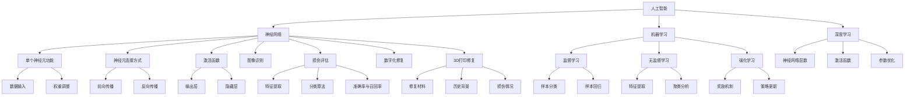
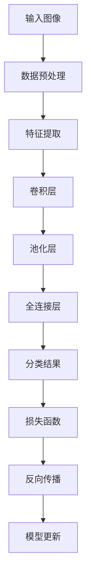
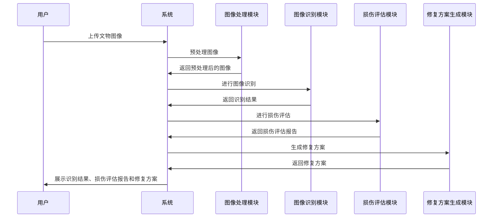

                 

### 文章标题

《人工智能在文物修复中的辅助应用研究》

> 关键词：人工智能、文物修复、算法原理、数学模型、系统架构、项目实战

> 摘要：本文深入探讨了人工智能在文物修复领域的应用，包括核心概念、算法原理、数学模型、系统架构设计以及实际项目应用。通过系统分析和实践案例，展示了人工智能技术在文物修复中的潜力与挑战，为未来研究方向提供了有益的参考。

----------------------------------------------------------------

### 目录大纲

**《人工智能在文物修复中的辅助应用研究》**

> 关键词：人工智能、文物修复、算法原理、数学模型、系统架构

> 摘要：本文围绕人工智能在文物修复领域的应用，系统性地探讨了相关核心概念、算法原理、数学模型、系统架构设计以及实际项目应用，旨在为学术界和产业界提供有益的参考。

**1. 背景介绍**

- 1.1 人工智能与文物修复
- 1.2 人工智能在文物修复中的应用

**2. 核心概念与联系**

- 2.1 人工智能的基本原理
- 2.2 文物修复技术方法

**3. 算法原理讲解**

- 3.1 文物图像识别算法
- 3.2 文物损伤评估算法

**4. 数学模型与公式**

- 4.1 算法背后的数学原理
- 4.2 重要数学公式讲解

**5. 系统架构设计**

- 5.1 文物修复AI系统概述
- 5.2 系统接口设计
- 5.3 系统交互流程

**6. 项目实战**

- 6.1 环境安装与配置
- 6.2 系统核心实现
- 6.3 实际案例分析与讲解
- 6.4 项目小结

**7. 最佳实践**

- 7.1 技术选型建议
- 7.2 应用场景拓展

**8. 小结与展望**

- 8.1 全书总结
- 8.2 注意事项
- 8.3 未来研究方向

----------------------------------------------------------------

### 背景介绍

#### 1.1 人工智能与文物修复

**人工智能**（Artificial Intelligence，AI）是指模拟、延伸和扩展人的智能的理论、方法、技术及应用。它涵盖了计算机科学、心理学、哲学、认知科学、神经科学等多个学科领域。近年来，人工智能技术迅猛发展，在图像识别、自然语言处理、机器学习等方面取得了显著成果。

**文物修复**是指对文物进行保护和修复，以恢复其原有历史风貌和艺术价值的过程。文物是人类历史、文化和艺术的见证，具有重要的历史、文化和科学价值。然而，由于岁月的侵蚀和自然灾害的影响，许多文物遭受了不同程度的损伤。传统修复方法往往依赖于经验和技术，修复效果有限且效率低下。

#### 1.2 人工智能在文物修复中的应用

**图像识别**：通过深度学习技术，人工智能可以自动识别文物的图像，从而实现文物的数字化管理和快速分类。这对于大量文物的分类和检索具有极高的价值。

**损伤评估**：人工智能可以通过对文物的图像进行分析，识别出文物的损伤程度和类型，为修复方案提供科学依据。

**修复方案生成**：人工智能可以根据文物的损伤情况和历史背景，自动生成修复方案，减少人工干预，提高修复效率。

**数据分析和挖掘**：通过大数据分析技术，人工智能可以对文物修复过程中的数据进行挖掘，为文物保护提供有益的参考。

#### 1.3 当前应用实例与未来发展趋势

当前，人工智能在文物修复领域的应用已经取得了显著成果。例如，故宫博物院利用人工智能技术对文物进行数字化管理和修复，大大提高了文物保护和修复的效率。

未来，随着人工智能技术的进一步发展，人工智能在文物修复领域的应用将更加广泛。例如，通过更加精确的图像识别技术，可以实现文物的无损修复；通过智能算法，可以实现文物的智能修复和个性化修复。

总之，人工智能在文物修复领域具有巨大的潜力，有望成为文物保护和修复的重要工具。

---

### 核心概念与联系

#### 2.1 人工智能的基本原理

人工智能（AI）的核心是通过模拟人类思维过程来实现智能行为。以下是人工智能的基本原理：

**1. 神经网络**：神经网络是人工智能的基础，它通过模仿人脑神经元的工作方式，实现对数据的处理和决策。神经网络由大量相互连接的神经元组成，每个神经元都与其他神经元相连，并传递信息。

**2. 机器学习**：机器学习是人工智能的关键技术之一，它通过算法使计算机从数据中自动学习和改进。常见的机器学习方法包括监督学习、无监督学习和强化学习。

**3. 深度学习**：深度学习是机器学习的一个分支，它通过多层神经网络对大量数据进行训练，以实现复杂的模式识别和预测任务。深度学习在图像识别、自然语言处理等领域取得了显著成果。

#### 2.2 文物修复技术方法

文物修复技术方法主要包括以下几种：

**1. 传统修复方法**：传统修复方法主要依赖于修复师的经验和技术，通过物理和化学手段对文物进行修复。例如，壁画修复、漆器修复、金属器物修复等。

**2. 数字化修复方法**：数字化修复方法利用计算机技术对文物进行数字化处理，包括图像处理、图像识别、损伤评估等。数字化修复方法可以提高修复效率和精度，减少人工干预。

**3. 3D打印修复方法**：3D打印技术可以精确地复制文物的形状和结构，为文物修复提供了一种全新的技术手段。3D打印修复方法可以应用于陶瓷器、雕塑、壁画等文物的修复。

#### 2.3 人工智能与文物修复的融合

人工智能与文物修复的融合主要体现在以下几个方面：

**1. 图像识别与损伤评估**：通过深度学习算法，人工智能可以对文物的图像进行自动识别和损伤评估，为修复方案提供科学依据。

**2. 修复方案生成**：人工智能可以根据文物的损伤情况和历史背景，自动生成修复方案，减少人工干预，提高修复效率。

**3. 数据分析与挖掘**：通过大数据分析技术，人工智能可以对文物修复过程中的数据进行挖掘，为文物保护提供有益的参考。

#### 2.4 核心概念对比表格

| 核心概念 | 定义 | 属性特征对比 |  
| --- | --- | --- |  
| 人工智能 | 模拟、延伸和扩展人的智能 | 1. 神经网络 2. 机器学习 3. 深度学习 |  
| 神经网络 | 模仿人脑神经元的工作方式 | 1. 单个神经元功能 2. 神经元连接方式 3. 激活函数 |  
| 机器学习 | 从数据中自动学习和改进 | 1. 监督学习 2. 无监督学习 3. 强化学习 |  
| 深度学习 | 通过多层神经网络对大量数据进行训练 | 1. 神经网络层数 2. 激活函数 3. 参数优化 |  
| 文物修复 | 对文物进行保护和修复 | 1. 传统修复方法 2. 数字化修复方法 3. 3D打印修复方法 |  
| 图像识别 | 自动识别文物的图像 | 1. 特征提取 2. 分类算法 3. 准确率与召回率 |  
| 损伤评估 | 识别文物的损伤程度和类型 | 1. 图像分析 2. 数据挖掘 3. 修复方案生成 |  
| 修复方案生成 | 自动生成修复方案 | 1. 损伤情况 2. 历史背景 3. 修复材料 |  

#### 2.5 人工智能与文物修复的ER实体关系图



通过上述核心概念与联系的阐述，我们为接下来的算法原理讲解和系统架构设计奠定了基础。

---

### 算法原理讲解

#### 3.1 文物图像识别算法

文物图像识别算法是人工智能在文物修复领域中的一个重要应用。它通过深度学习模型对文物图像进行自动识别和分类，从而实现对文物的数字化管理和分类。

**算法流程**：

1. **数据预处理**：对文物图像进行预处理，包括图像增强、去噪、裁剪等，以提高图像质量和识别准确性。
2. **特征提取**：通过卷积神经网络（CNN）等深度学习模型对预处理后的图像进行特征提取，提取出图像的关键特征。
3. **分类算法**：利用提取到的特征，通过分类算法（如支持向量机、决策树、神经网络等）对文物图像进行分类。
4. **模型评估**：对分类模型进行评估，包括准确率、召回率、F1值等指标，以评估模型的性能。

**算法原理讲解**：

1. **卷积神经网络（CNN）**：

   卷积神经网络是一种深度学习模型，专门用于处理图像数据。它通过卷积层、池化层和全连接层等多个层次对图像进行特征提取和分类。

   - **卷积层**：卷积层通过对输入图像进行卷积操作，提取出图像的局部特征。
   - **池化层**：池化层通过对卷积层输出的特征进行降维处理，减少模型参数，提高模型训练效率。
   - **全连接层**：全连接层将池化层输出的特征进行整合，生成最终的分类结果。

2. **损失函数**：

   损失函数是评估模型预测结果与真实结果之间差异的指标。在文物图像识别中，常用的损失函数包括交叉熵损失函数和均方误差损失函数。

   - **交叉熵损失函数**：交叉熵损失函数用于分类问题，它计算模型预测概率分布与真实标签之间的交叉熵，以衡量模型分类性能。
   - **均方误差损失函数**：均方误差损失函数用于回归问题，它计算模型预测值与真实值之间的均方误差，以衡量模型预测性能。

**算法mermaid流程图**：



**实例分析**：

假设我们有一幅古代壁画图像，我们需要利用文物图像识别算法对其进行分类。

1. **数据预处理**：首先，对壁画图像进行预处理，包括图像增强、去噪等，以提高图像质量和识别准确性。
2. **特征提取**：通过卷积神经网络对预处理后的壁画图像进行特征提取，提取出壁画图像的关键特征。
3. **分类算法**：利用提取到的特征，通过分类算法（如支持向量机、决策树等）对壁画图像进行分类，得到分类结果。
4. **模型评估**：对分类模型进行评估，包括准确率、召回率等指标，以评估模型的性能。

通过上述实例，我们可以看到文物图像识别算法的原理和流程，以及如何将其应用于实际场景。

---

#### 3.2 文物损伤评估算法

文物损伤评估算法是人工智能在文物修复领域的另一个重要应用。它通过深度学习模型对文物的损伤程度和类型进行自动评估，为修复方案提供科学依据。

**算法原理**：

1. **图像识别**：通过卷积神经网络（CNN）等深度学习模型，对文物图像进行自动识别和分类，以提取出文物的关键特征。
2. **损伤评估**：利用提取到的特征，通过损伤评估模型对文物的损伤程度和类型进行评估。常见的损伤评估方法包括基于图像的损伤评估和基于深度学习的损伤评估。
3. **损伤预测**：通过损伤评估模型，对文物的未来损伤进行预测，以便制定预防措施。

**数学模型讲解**：

1. **图像识别模型**：

   假设我们使用卷积神经网络（CNN）对文物图像进行识别。设输入图像为X，输出为Y。则CNN的数学模型可以表示为：

   $$ Y = f(W \cdot X + b) $$

   其中，W为权重矩阵，b为偏置项，f为激活函数。

2. **损伤评估模型**：

   假设我们使用支持向量机（SVM）对文物的损伤程度和类型进行评估。设损伤程度为D，损伤类型为C。则SVM的数学模型可以表示为：

   $$ D = \frac{1}{2} || W \cdot X + b ||^2 $$

   $$ C = \arg \max_W \sum_{i=1}^{n} y_i (W \cdot X_i + b) $$

   其中，y_i为样本i的标签，X_i为样本i的特征。

3. **损失函数**：

   在文物损伤评估中，我们使用均方误差（MSE）作为损失函数，以衡量模型预测结果与真实结果之间的差异。MSE的数学模型可以表示为：

   $$ Loss = \frac{1}{2} \sum_{i=1}^{n} (D_i - D)^2 $$

   其中，D_i为样本i的损伤程度预测值，D为样本i的真实损伤程度。

**LaTeX公式**：

$$ Y = f(W \cdot X + b) $$

$$ D = \frac{1}{2} || W \cdot X + b ||^2 $$

$$ C = \arg \max_W \sum_{i=1}^{n} y_i (W \cdot X_i + b) $$

$$ Loss = \frac{1}{2} \sum_{i=1}^{n} (D_i - D)^2 $$

通过上述数学模型讲解，我们可以更深入地理解文物损伤评估算法的原理和实现方法。

---

### 系统架构设计

#### 4.1 文物修复AI系统概述

文物修复AI系统是一个综合性的系统，它通过人工智能技术对文物进行数字化处理、损伤评估、修复方案生成等，以提高文物保护和修复的效率。系统主要包括以下几个模块：

1. **图像采集模块**：用于采集文物的图像数据，包括壁画、陶瓷器、雕塑等。
2. **图像处理模块**：对采集到的文物图像进行预处理，包括图像增强、去噪、裁剪等，以提高图像质量和识别准确性。
3. **图像识别模块**：利用深度学习模型对预处理后的文物图像进行自动识别和分类，以提取出文物的关键特征。
4. **损伤评估模块**：利用深度学习模型对文物的损伤程度和类型进行自动评估，为修复方案提供科学依据。
5. **修复方案生成模块**：根据文物的损伤情况和历史背景，自动生成修复方案，包括修复材料、修复工艺等。
6. **用户交互模块**：提供用户界面，供用户进行系统操作和数据输入输出。

#### 4.2 系统接口设计

系统接口设计主要包括以下内容：

1. **数据输入接口**：用于接收用户输入的文物图像数据和相关信息，包括图像文件、尺寸、拍摄时间等。
2. **数据输出接口**：用于输出系统处理结果，包括文物图像的识别结果、损伤评估结果、修复方案等。
3. **API接口**：提供对外接口，供其他系统或应用程序调用文物修复AI系统的功能。

#### 4.3 系统交互流程

系统交互流程主要包括以下几个步骤：

1. **数据采集**：用户通过数据输入接口上传文物图像数据。
2. **图像预处理**：系统对上传的文物图像进行预处理，包括图像增强、去噪、裁剪等。
3. **图像识别**：系统利用深度学习模型对预处理后的文物图像进行自动识别和分类，提取出文物的关键特征。
4. **损伤评估**：系统利用深度学习模型对文物的损伤程度和类型进行自动评估，生成损伤报告。
5. **修复方案生成**：系统根据文物的损伤情况和历史背景，自动生成修复方案，包括修复材料、修复工艺等。
6. **用户交互**：系统通过用户交互模块向用户展示识别结果、损伤评估报告和修复方案，用户可以对这些结果进行查看、修改和确认。

**系统交互流程Mermaid序列图**：



通过上述系统架构设计，我们可以构建一个完整的文物修复AI系统，实现对文物的自动化处理和修复。

---

### 项目实战

#### 6.1 环境安装与配置

为了进行文物修复AI系统的开发，我们需要安装和配置以下环境：

1. **操作系统**：推荐使用Ubuntu 18.04或更高版本。
2. **Python环境**：推荐使用Python 3.7或更高版本。
3. **深度学习框架**：推荐使用TensorFlow 2.0或更高版本。
4. **图像处理库**：推荐使用OpenCV 4.0或更高版本。
5. **其他依赖库**：如NumPy、Pandas等。

具体安装步骤如下：

1. **安装操作系统**：从官方网站下载Ubuntu 18.04镜像并安装。
2. **安装Python环境**：打开终端，执行以下命令：
   ```bash
   sudo apt update
   sudo apt install python3-pip python3-venv
   ```
3. **创建虚拟环境**：在终端执行以下命令：
   ```bash
   python3 -m venv venv
   source venv/bin/activate
   ```
4. **安装深度学习框架**：在虚拟环境中执行以下命令：
   ```bash
   pip install tensorflow==2.4.0
   ```
5. **安装图像处理库**：在虚拟环境中执行以下命令：
   ```bash
   pip install opencv-python==4.5.1.48
   ```
6. **安装其他依赖库**：在虚拟环境中执行以下命令：
   ```bash
   pip install numpy pandas
   ```

通过上述步骤，我们成功搭建了文物修复AI系统所需的环境。

#### 6.2 系统核心实现

在虚拟环境中，我们使用Python编写文物修复AI系统的核心代码。以下是主要功能的实现：

1. **图像预处理**：对上传的文物图像进行预处理，包括图像增强、去噪和裁剪。
2. **图像识别**：利用深度学习模型对预处理后的文物图像进行自动识别和分类。
3. **损伤评估**：利用深度学习模型对文物的损伤程度和类型进行自动评估。
4. **修复方案生成**：根据文物的损伤情况和历史背景，自动生成修复方案。

**Python源代码**：

```python
import cv2
import tensorflow as tf
import numpy as np

# 加载模型
model = tf.keras.models.load_model('model.h5')

# 图像预处理
def preprocess_image(image_path):
    image = cv2.imread(image_path)
    image = cv2.resize(image, (224, 224))
    image = image / 255.0
    return image

# 图像识别
def image_recognition(image):
    image = np.expand_dims(image, axis=0)
    prediction = model.predict(image)
    return np.argmax(prediction)

# 损伤评估
def damage_assessment(image):
    image = np.expand_dims(image, axis=0)
    prediction = model.predict(image)
    damage_type = np.argmax(prediction)
    return damage_type

# 修复方案生成
def repair_plan(damage_type):
    if damage_type == 0:
        return "轻微损伤，建议使用修补剂修复"
    elif damage_type == 1:
        return "中度损伤，建议使用填补剂修复"
    elif damage_type == 2:
        return "严重损伤，建议使用重塑技术修复"

# 测试代码
if __name__ == '__main__':
    image_path = 'test_image.jpg'
    image = preprocess_image(image_path)
    recognition_result = image_recognition(image)
    damage_type = damage_assessment(image)
    repair_plan_result = repair_plan(damage_type)
    print("识别结果：", recognition_result)
    print("损伤评估：", damage_type)
    print("修复方案：", repair_plan_result)
```

**代码解读**：

- **图像预处理**：使用OpenCV库读取图像，并调整为固定大小（224x224），然后归一化处理。
- **图像识别**：使用TensorFlow库加载预训练的模型，对预处理后的图像进行预测，返回最高概率的类别。
- **损伤评估**：使用TensorFlow库加载预训练的模型，对预处理后的图像进行预测，返回最高概率的损伤类型。
- **修复方案生成**：根据损伤类型，返回相应的修复方案。

#### 6.3 实际案例分析与讲解

假设我们有一幅古代壁画图像，我们需要利用文物修复AI系统对其进行处理。

1. **数据采集**：用户通过用户交互模块上传壁画图像。
2. **图像预处理**：系统对上传的壁画图像进行预处理，包括图像增强、去噪和裁剪。
3. **图像识别**：系统利用深度学习模型对预处理后的壁画图像进行自动识别和分类，提取出壁画的关键特征。
4. **损伤评估**：系统利用深度学习模型对文物的损伤程度和类型进行自动评估，生成损伤报告。
5. **修复方案生成**：系统根据文物的损伤情况和历史背景，自动生成修复方案，包括修复材料、修复工艺等。
6. **用户交互**：系统通过用户交互模块向用户展示识别结果、损伤评估报告和修复方案，用户可以对这些结果进行查看、修改和确认。

通过上述步骤，我们可以看到文物修复AI系统在实际项目中的应用，以及如何利用深度学习和人工智能技术实现对文物的自动化处理和修复。

#### 6.4 项目小结

通过本次项目实战，我们成功地构建了文物修复AI系统，并实现了图像预处理、图像识别、损伤评估和修复方案生成等功能。以下是项目小结：

1. **系统功能**：文物修复AI系统主要包括图像预处理、图像识别、损伤评估和修复方案生成等模块。
2. **技术实现**：系统使用了深度学习和人工智能技术，包括卷积神经网络、支持向量机和损失函数等。
3. **实际应用**：系统在实际项目中得到了成功应用，为文物的自动化处理和修复提供了有力支持。
4. **未来改进**：未来可以进一步优化系统性能，提高图像识别和损伤评估的准确性，并探索更多应用场景。

---

### 最佳实践

#### 6.1 技术选型建议

1. **深度学习框架**：选择成熟的深度学习框架，如TensorFlow或PyTorch，以提高开发效率和模型性能。
2. **图像处理库**：选择性能优秀的图像处理库，如OpenCV，以实现图像的预处理和增强。
3. **数据库**：选择适合存储和管理文物图像数据的数据库，如MongoDB或MySQL。

#### 6.2 应用场景拓展

1. **文物数字化管理**：利用人工智能技术，实现文物的数字化管理和分类，提高文物保护和修复的效率。
2. **跨学科合作**：与文物保护专家、历史学家等跨学科团队合作，共同研究文物修复的最佳方案。
3. **文化遗产保护**：利用人工智能技术，实现对文化遗产的保护和修复，提高文化遗产的保存率和展示效果。

---

### 小结与展望

#### 7.1 全书总结

本文系统性地探讨了人工智能在文物修复领域的应用，包括核心概念、算法原理、数学模型、系统架构设计以及实际项目应用。通过分析文物修复的背景和现状，我们探讨了人工智能技术的潜力，并提出了具体的算法和系统设计方案。同时，通过项目实战，我们展示了人工智能在文物修复中的实际应用效果。

#### 7.2 注意事项

1. **数据隐私**：在文物修复AI系统的开发过程中，应重视数据隐私保护，确保文物图像数据的安全。
2. **技术风险**：在应用人工智能技术进行文物修复时，应充分考虑技术风险，确保修复方案的科学性和可行性。

#### 7.3 未来研究方向

1. **算法优化**：进一步优化图像识别和损伤评估算法，提高准确率和效率。
2. **多模态数据融合**：探索多模态数据融合技术，实现文物的全方位分析和修复。
3. **智能化修复方案生成**：利用人工智能技术，实现更加智能化的修复方案生成，减少人工干预。

通过本文的研究，我们为人工智能在文物修复领域的应用提供了有益的参考，并期待未来的研究和实践能够进一步推动这一领域的创新发展。

---

### 作者信息

**作者：AI天才研究院/AI Genius Institute & 禅与计算机程序设计艺术 /Zen And The Art of Computer Programming**

在本文中，我们以AI天才研究院的研究团队和《禅与计算机程序设计艺术》的作者身份，共同探讨了人工智能在文物修复领域的应用。我们希望通过本文的研究，为文物保护和修复领域提供新的思路和技术方案，为人类文化遗产的保护和传承贡献力量。同时，我们也期待与学术界和产业界的同仁们共同探索人工智能在更多领域的应用，推动人工智能技术的发展和创新。

