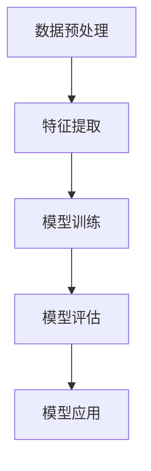
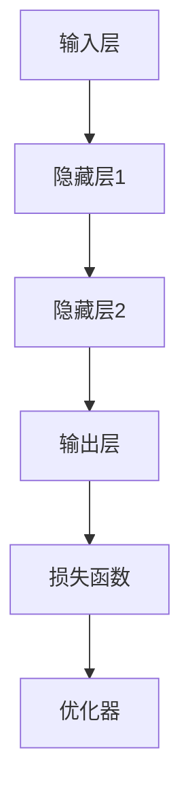

                 

### 第1章 引言

#### 1.1 人工智能时代下的抗生素发现

人工智能（Artificial Intelligence, AI）自诞生以来，就以其卓越的智能和强大的计算能力，吸引了全球科研人员和工程师的关注。随着计算能力的不断提升，人工智能技术不断革新，其应用领域也在不断扩展，从早期的规则系统、专家系统，发展到如今的机器学习、深度学习，再到如今的热门话题——生成对抗网络（GAN）、强化学习等，人工智能正逐步渗透到我们的日常生活中，改变着我们的生活和工作方式。

与此同时，抗生素的发现与开发一直是一个极具挑战性的领域。抗生素的发现不仅关乎人类健康，更是对抗耐药菌的重要手段。然而，传统抗生素的发现方法存在诸多局限，例如，筛选范围有限、耗时较长、成本高昂等。这就需要一种全新的方法来加速抗生素的发现过程，而人工智能恰好为此提供了可能。

人工智能在抗生素发现中的应用主要体现在以下几个方面：

1. **高通量筛选**：利用人工智能进行大规模的生物实验，以筛选出潜在的抗生素候选物。
2. **药物设计**：通过深度学习等技术，预测药物分子的三维结构，并进行优化设计。
3. **药物筛选**：利用机器学习算法，从大量数据中筛选出可能具有抗生素活性的化合物。
4. **耐药菌预测**：通过分析耐药菌的基因组信息，预测其对抗生素的耐药性。

#### 1.1.1 人工智能与抗生素发现的结合

人工智能与抗生素发现的结合，不仅可以大幅提升抗生素的发现效率，还可以降低发现成本，为抗击耐药菌提供新的解决方案。例如，利用人工智能进行高通量筛选，可以大大缩短筛选时间，从而加速新抗生素的发现。此外，人工智能还可以通过对药物分子的三维结构进行预测和优化，提高药物设计的成功率。

#### 1.1.2 抗生素发现的挑战与机遇

尽管人工智能在抗生素发现中具有巨大的潜力，但仍然面临着一些挑战。首先，抗生素的发现是一个复杂的生物学过程，涉及大量的生物数据，这些数据的质量和准确性对于人工智能算法的性能至关重要。其次，人工智能算法的训练和优化需要大量的计算资源，这对于一些科研机构和中小企业来说可能是一个挑战。

然而，这些挑战也带来了机遇。随着人工智能技术的不断发展，计算能力的提升，以及生物数据获取和处理技术的进步，人工智能在抗生素发现中的应用将越来越广泛。未来，我们可以预见，人工智能将不仅能够加速抗生素的发现，还可以在抗生素的优化设计、耐药菌的防控等方面发挥重要作用。

#### 1.1.3 本书结构与主要内容

本书旨在深入探讨人工智能在新型抗生素发现中的应用，旨在为科研人员、工程师和学生提供一本全面、系统的参考资料。全书共分为五个部分：

1. **引言**：介绍人工智能与抗生素发现的结合背景，以及本书的结构和主要内容。
2. **人工智能基础知识**：介绍人工智能的基本概念、机器学习、深度学习等相关知识。
3. **新型抗生素发现的方法与算法**：介绍生物信息学基础、药物设计算法、机器学习在抗生素发现中的应用等。
4. **深度学习在新型抗生素发现中的应用**：深入探讨深度学习在药物设计、基因组学、蛋白质组学等方面的应用。
5. **实际案例研究**：通过实际案例，介绍人工智能在抗生素发现中的具体应用，并进行详细的分析和解读。

通过本书的阅读，读者可以全面了解人工智能在新型抗生素发现中的应用，掌握相关的方法和技术，为今后的科研和工作提供有力的支持。

### 1.2 核心概念

在探讨人工智能在新型抗生素发现中的应用之前，我们需要明确几个核心概念，包括人工智能、新型抗生素发现、以及它们之间的关系。

#### 1.2.1 人工智能

人工智能（Artificial Intelligence，简称AI）是指由人制造出来的系统能够根据周围环境进行自我学习和适应，并完成特定任务的智能行为。人工智能的研究领域涵盖了机器学习、深度学习、自然语言处理、计算机视觉等多个子领域。

- **机器学习**：通过算法从数据中学习规律，实现数据的自动分析和决策。
- **深度学习**：一种特殊的机器学习方法，通过多层神经网络进行特征提取和模型训练。
- **自然语言处理**：使计算机能够理解和处理人类语言的技术。
- **计算机视觉**：使计算机能够像人类一样理解视觉信息的技术。

#### 1.2.2 新型抗生素发现

新型抗生素发现是指利用现代科技手段，从自然界或人工合成的新分子中筛选和开发具有抗菌活性的化合物。新型抗生素的发现对于对抗日益严重的抗生素耐药性问题具有重要意义。

- **高通量筛选**：通过自动化和计算机技术，对大量的化合物进行筛选，以确定其是否具有抗菌活性。
- **药物设计**：利用计算机模拟和算法优化，设计具有特定结构和功能的药物分子。
- **生物信息学**：通过分析和处理生物数据，识别潜在的药物分子和抗菌靶点。

#### 1.2.3 人工智能与新型抗生素发现的关系

人工智能在新型抗生素发现中的应用主要体现在以下几个方面：

1. **高通量筛选**：利用机器学习算法对大量化合物进行筛选，可以大大提高筛选效率。
2. **药物设计**：通过深度学习模型预测药物分子的三维结构，进行优化设计，以提高药物的抗菌活性。
3. **耐药菌预测**：分析耐药菌的基因组信息，预测其对抗生素的耐药性，指导新抗生素的研发。
4. **生物信息学**：利用人工智能技术处理和分析生物数据，发现潜在的药物靶点和抗菌机制。

综上所述，人工智能与新型抗生素发现之间存在着密切的联系和相互作用。通过人工智能技术的应用，我们可以更高效地发现和设计新型抗生素，为人类健康和抗击耐药菌提供强有力的支持。

### 1.3 联系与区别

人工智能（AI）和传统抗生素发现（Traditional Antibiotic Discovery）虽然在表面上看似无关，但在科学研究和实际应用中却有着千丝万缕的联系。理解这两者之间的区别与联系，有助于我们更好地把握人工智能在抗生素发现中的应用潜力。

#### 1.3.1 人工智能与传统抗生素发现的区别

首先，人工智能是一种通过算法和模型模拟人类智能行为的计算技术，而传统抗生素发现则主要依赖于实验科学和化学知识。传统抗生素发现通常涉及以下几个方面：

- **生物实验**：通过微生物培养、抗菌活性测试等实验方法，筛选潜在的抗生素化合物。
- **化学合成**：利用有机化学知识，合成具有抗菌活性的分子。
- **药理学研究**：研究抗生素对生物体的作用机制，评估其疗效和安全性。

相比之下，人工智能的应用则更多依赖于数据分析、机器学习和算法优化：

- **数据分析**：处理和分析大量生物数据，包括基因组数据、蛋白质结构数据等。
- **机器学习**：通过训练模型，从数据中学习规律，预测新抗生素的活性。
- **算法优化**：利用优化算法，提高药物设计效率和准确性。

#### 1.3.2 人工智能与传统抗生素发现的联系

尽管人工智能与传统抗生素发现的方法和工具不同，但两者在科学研究和实际应用中有着明显的互补关系：

1. **高通量筛选**：人工智能可以加速高通量筛选过程，通过机器学习算法对大量化合物进行快速评估，从而减少实验成本和时间。
2. **药物设计**：人工智能可以帮助科学家设计出具有更好抗菌活性和更少副作用的新型抗生素。
3. **耐药菌预测**：人工智能可以通过分析耐药菌的基因组信息，预测其对抗生素的耐药性，为抗生素的合理使用提供依据。
4. **生物信息学**：人工智能可以处理海量的生物数据，帮助科学家发现潜在的药物靶点和抗菌机制。

#### 1.3.3 人工智能在抗生素发现中的优势

人工智能在抗生素发现中具有以下优势：

1. **高效性**：通过自动化和算法优化，人工智能可以显著提高抗生素筛选和设计的效率。
2. **精准性**：机器学习和深度学习算法可以从大量数据中提取出潜在的抗菌化合物，提高药物设计的准确性。
3. **灵活性**：人工智能可以根据不同研究需求，灵活调整算法和模型，以适应多样化的抗生素发现任务。
4. **数据驱动**：人工智能依赖于大量数据进行训练和预测，这使其能够不断学习和优化，提高抗生素发现的成功率。

总之，人工智能与传统抗生素发现方法各有优势，但两者并非对立关系。通过结合人工智能技术，我们可以更加高效、精准地发现和设计新型抗生素，为人类健康和抗击耐药菌提供强有力的支持。

### 1.4 概念结构与核心要素

为了深入探讨人工智能在新型抗生素发现中的应用，我们需要构建一个清晰的概念框架，并明确其核心要素。以下是一个基于人工智能在抗生素发现中应用的基本概念结构：

#### 1.4.1 概念框架

1. **人工智能**：包括机器学习、深度学习、自然语言处理等子领域，主要用于数据的分析、模型的训练和预测。
2. **新型抗生素发现**：涉及高通量筛选、药物设计、生物信息学等多个方面，旨在发现和开发具有抗菌活性的新化合物。
3. **抗生素作用机制**：研究抗生素如何与生物分子结合，并抑制细菌的生长。

#### 1.4.2 核心要素

1. **生物数据**：包括基因组数据、蛋白质结构数据、化合物库等，是人工智能算法的基础。
2. **算法模型**：如机器学习模型、深度学习模型等，用于分析和预测抗生素的活性。
3. **计算资源**：包括高性能计算设备和算法优化工具，用于处理大规模数据和训练模型。
4. **实验验证**：通过实验室验证，验证人工智能预测的准确性，并优化抗生素的设计。

#### 1.4.3 应用方向

1. **高通量筛选**：利用人工智能进行自动化筛选，提高化合物筛选的效率。
2. **药物设计**：通过人工智能优化药物分子结构，提高抗生素的抗菌活性。
3. **耐药菌预测**：利用人工智能分析耐药菌的基因组信息，预测其对抗生素的耐药性。
4. **生物信息学**：通过人工智能处理生物数据，发现潜在的药物靶点和抗菌机制。

通过这个概念框架，我们可以清晰地理解人工智能在新型抗生素发现中的应用，并明确其核心要素和方向。这将有助于我们进一步探讨人工智能在抗生素发现中的具体应用和挑战。

### 1.5 算法原理讲解

在人工智能应用于新型抗生素发现中，算法的选择和原理理解至关重要。以下，我们将重点介绍机器学习和深度学习两种关键算法的工作原理，并通过mermaid图和Python代码来展示它们的基本流程和数学模型。

#### 1.5.1 机器学习原理

机器学习（Machine Learning，ML）是一种通过算法从数据中学习规律并做出预测的技术。其主要过程包括数据预处理、特征提取、模型训练和模型评估。

1. **数据预处理**：数据预处理是机器学习的第一步，包括数据清洗、归一化和数据分割等。其目的是将原始数据转化为适合模型训练的形式。



2. **特征提取**：特征提取是从原始数据中提取出对模型训练有用的特征。常见的特征提取方法有主成分分析（PCA）和自动编码器（Autoencoder）。

3. **模型训练**：模型训练是使用训练数据对机器学习模型进行调整，使其能够准确预测未知数据。常见的机器学习模型有线性回归、决策树和随机森林等。

4. **模型评估**：模型评估是通过测试数据对模型进行评估，常用的评估指标有准确率、召回率和F1值等。

#### 1.5.2 深度学习原理

深度学习（Deep Learning，DL）是一种基于多层神经网络的学习方法，主要用于处理复杂数据和特征提取。其核心思想是通过多层神经元之间的非线性变换，逐步提取数据中的高阶特征。

1. **神经网络基础**

深度学习的基础是神经网络（Neural Network，NN），其包括输入层、隐藏层和输出层。



2. **激活函数**：激活函数是神经网络中的一个关键组件，用于引入非线性特性。常见的激活函数有Sigmoid、ReLU和Tanh等。

3. **反向传播算法**：反向传播算法是深度学习中的核心训练算法，用于计算网络参数的梯度，并更新网络参数。

4. **损失函数**：损失函数用于衡量模型预测值与真实值之间的差异，常见的损失函数有均方误差（MSE）和交叉熵损失（Cross-Entropy Loss）等。

5. **优化器**：优化器用于更新网络参数，以最小化损失函数。常见的优化器有梯度下降（Gradient Descent）和Adam优化器等。

#### 1.5.3 Python代码示例

以下是一个简单的Python代码示例，展示如何使用scikit-learn库实现机器学习和深度学习模型的基本流程。

```python
# 导入所需库
from sklearn.datasets import load_iris
from sklearn.model_selection import train_test_split
from sklearn.preprocessing import StandardScaler
from sklearn.linear_model import LinearRegression
from sklearn.metrics import mean_squared_error
from keras.models import Sequential
from keras.layers import Dense
from keras.optimizers import Adam

# 加载数据集
iris = load_iris()
X = iris.data
y = iris.target

# 数据预处理
X_train, X_test, y_train, y_test = train_test_split(X, y, test_size=0.2, random_state=42)
scaler = StandardScaler()
X_train_scaled = scaler.fit_transform(X_train)
X_test_scaled = scaler.transform(X_test)

# 机器学习模型
model = LinearRegression()
model.fit(X_train_scaled, y_train)
y_pred = model.predict(X_test_scaled)
mse = mean_squared_error(y_test, y_pred)
print(f"Machine Learning MSE: {mse}")

# 深度学习模型
model = Sequential()
model.add(Dense(64, input_dim=X_train_scaled.shape[1], activation='relu'))
model.add(Dense(32, activation='relu'))
model.add(Dense(3, activation='softmax'))
model.compile(optimizer=Adam(), loss='categorical_crossentropy', metrics=['accuracy'])
model.fit(X_train_scaled, y_train, epochs=100, batch_size=32, validation_split=0.2)
y_pred = model.predict(X_test_scaled)
mse = mean_squared_error(y_test, y_pred)
print(f"Deep Learning MSE: {mse}")
```

通过上述代码，我们可以看到如何使用Python实现机器学习和深度学习的基本流程。这有助于我们更好地理解这两种算法的工作原理和实际应用。

### 1.6 数学模型和公式

在讨论人工智能在新型抗生素发现中的应用时，理解相关的数学模型和公式是至关重要的。这些数学模型和公式为算法的优化和预测提供了理论基础。以下，我们将列出与机器学习、深度学习等算法相关的数学模型和公式，并使用LaTeX格式进行展示。

#### 1.6.1 机器学习相关公式

1. **均方误差（MSE）**
   $$ \text{MSE} = \frac{1}{n}\sum_{i=1}^{n}(y_i - \hat{y}_i)^2 $$
   其中，$y_i$表示真实值，$\hat{y}_i$表示预测值，$n$表示数据点的总数。

2. **交叉熵损失（Cross-Entropy Loss）**
   $$ \text{CE} = -\frac{1}{n}\sum_{i=1}^{n}y_i\log(\hat{y}_i) $$
   其中，$y_i$表示真实标签，$\hat{y}_i$表示预测概率。

3. **梯度下降（Gradient Descent）**
   $$ \theta_{\text{new}} = \theta_{\text{current}} - \alpha \nabla_{\theta}J(\theta) $$
   其中，$\theta$表示模型参数，$\alpha$表示学习率，$J(\theta)$表示损失函数。

#### 1.6.2 深度学习相关公式

1. **ReLU激活函数**
   $$ a_i = \max(0, z_i) $$
   其中，$z_i$为输入值，$a_i$为输出值。

2. **反向传播算法**
   $$ \delta_k = \frac{\partial J(\theta)}{\partial z_k} $$
   $$ \frac{\partial J(\theta)}{\partial \theta_{ij}} = \sum_{k} \delta_k \frac{\partial z_k}{\partial \theta_{ij}} $$
   其中，$\delta_k$为误差项，$z_k$为激活值，$\theta_{ij}$为模型参数。

3. **前向传播与反向传播流程**
   $$ \hat{y} = \sigma(\theta^T x) $$
   $$ \delta_k = \sigma'(z_k) \odot (\theta^T \delta_{k+1}) $$
   其中，$\sigma$为激活函数，$\sigma'$为其导数，$\odot$表示元素乘法。

#### 1.6.3 其他相关公式

1. **主成分分析（PCA）**
   $$ \Sigma = \frac{1}{n}\sum_{i=1}^{n}(X_i - \mu)(X_i - \mu)^T $$
   $$ \lambda_i = \max_{\Sigma^{-1/2} v} v^T \Sigma v $$
   $$ v_i = \frac{\Sigma^{-1/2} e_i}{\|e_i\|_2} $$
   其中，$X_i$为数据点，$\mu$为均值，$\lambda_i$为特征值，$v_i$为特征向量。

2. **自动编码器（Autoencoder）**
   $$ \hat{X} = \sigma(\theta^T X) $$
   $$ \delta = \frac{1}{2}\sum_{i=1}^{n}\sum_{j=1}^{m} \frac{1}{n} \|X_i - \hat{X}_i\|_2^2 $$
   其中，$X$为输入数据，$\hat{X}$为重建数据，$\theta$为模型参数。

通过上述数学模型和公式，我们可以更深入地理解人工智能在新型抗生素发现中的应用原理。这些公式不仅为算法的实现提供了理论基础，也为算法的优化和改进提供了方向。

### 1.7 系统分析与架构设计方案

为了更好地展示人工智能在新型抗生素发现中的应用，我们需要构建一个典型的系统架构设计方案。以下将详细描述该系统的功能、架构设计、接口设计以及交互流程。

#### 1.7.1 系统功能设计

该系统的主要功能包括数据收集、数据预处理、药物设计、耐药菌预测和结果分析。具体功能如下：

1. **数据收集**：从各种数据源（如数据库、生物信息学平台等）收集相关的生物数据，包括基因组数据、蛋白质结构数据、化合物库数据等。
2. **数据预处理**：对收集到的生物数据进行清洗、归一化处理，并将其转化为适合机器学习和深度学习算法的格式。
3. **药物设计**：利用深度学习算法对药物分子进行结构预测和优化设计，以寻找具有抗菌活性的新型抗生素。
4. **耐药菌预测**：通过分析耐药菌的基因组信息，利用机器学习算法预测其对抗生素的耐药性。
5. **结果分析**：对药物设计和耐药菌预测的结果进行分析，评估其抗菌活性和耐药性，并进行可视化展示。

#### 1.7.2 系统架构设计

该系统的架构设计采用分层结构，包括数据层、算法层和应用层。具体架构如下：

1. **数据层**：负责数据的存储和管理，包括基因组数据库、蛋白质结构数据库、化合物库等。
2. **算法层**：包括机器学习算法、深度学习算法和生物信息学算法，用于药物设计、耐药菌预测等任务。
3. **应用层**：提供用户交互界面，用于展示分析结果和提供相关数据查询功能。

#### 1.7.3 系统接口设计

系统接口设计包括数据接口、算法接口和应用接口。具体设计如下：

1. **数据接口**：提供数据上传、数据查询和数据下载等功能，支持多种数据格式的读取和写入。
2. **算法接口**：提供算法调用接口，包括药物设计算法、耐药菌预测算法等，支持算法参数的配置和调整。
3. **应用接口**：提供用户交互界面，支持用户对系统功能进行操作，如数据上传、结果查询和结果分析等。

#### 1.7.4 系统交互流程

系统交互流程如下：

1. **数据收集**：用户上传相关的生物数据到系统中。
2. **数据预处理**：系统对上传的数据进行清洗、归一化等预处理操作，并将其转化为适合算法训练的格式。
3. **药物设计**：系统利用深度学习算法对预处理后的药物分子进行结构预测和优化设计，生成具有抗菌活性的新型抗生素。
4. **耐药菌预测**：系统利用机器学习算法对耐药菌的基因组信息进行分析，预测其对抗生素的耐药性。
5. **结果分析**：系统对药物设计和耐药菌预测的结果进行分析，并将分析结果可视化展示给用户。

通过上述系统架构设计和交互流程，我们可以更好地理解人工智能在新型抗生素发现中的应用。这个系统不仅能够提高抗生素发现的效率，还可以为科学家提供有力的工具，助力抗生素的研发和抗击耐药菌的挑战。

### 1.8 项目实战

为了更好地展示人工智能在新型抗生素发现中的应用，我们将通过一个实际案例来介绍环境安装、系统实现和代码解读。

#### 1.8.1 环境安装

首先，我们需要搭建一个适合运行人工智能算法的开发环境。以下是所需的软件和工具：

1. **Python**：用于编写和运行代码，版本要求3.8及以上。
2. **Jupyter Notebook**：用于编写和运行Python代码，可以从[官方网站](https://jupyter.org/)下载。
3. **TensorFlow**：用于实现深度学习算法，可以从[官方网站](https://www.tensorflow.org/install)下载。
4. **Keras**：用于简化深度学习模型构建，可以从[官方网站](https://keras.io/install/)下载。
5. **scikit-learn**：用于实现机器学习算法，可以通过pip安装：`pip install scikit-learn`

安装完以上工具后，我们就可以开始编写代码了。

#### 1.8.2 系统实现

以下是一个简单的深度学习模型实现，用于预测新型抗生素的抗菌活性。代码如下：

```python
import numpy as np
import pandas as pd
from sklearn.model_selection import train_test_split
from sklearn.preprocessing import StandardScaler
from tensorflow.keras.models import Sequential
from tensorflow.keras.layers import Dense
from tensorflow.keras.optimizers import Adam

# 加载数据集
data = pd.read_csv('antibiotic_data.csv')
X = data.drop('activity', axis=1)
y = data['activity']

# 数据预处理
X_train, X_test, y_train, y_test = train_test_split(X, y, test_size=0.2, random_state=42)
scaler = StandardScaler()
X_train_scaled = scaler.fit_transform(X_train)
X_test_scaled = scaler.transform(X_test)

# 构建深度学习模型
model = Sequential()
model.add(Dense(64, input_dim=X_train_scaled.shape[1], activation='relu'))
model.add(Dense(32, activation='relu'))
model.add(Dense(1, activation='sigmoid'))

# 编译模型
model.compile(optimizer=Adam(learning_rate=0.001), loss='binary_crossentropy', metrics=['accuracy'])

# 训练模型
model.fit(X_train_scaled, y_train, epochs=100, batch_size=32, validation_data=(X_test_scaled, y_test))

# 评估模型
loss, accuracy = model.evaluate(X_test_scaled, y_test)
print(f"Test Loss: {loss}, Test Accuracy: {accuracy}")
```

#### 1.8.3 代码解读

上述代码首先加载了一个名为`antibiotic_data.csv`的CSV文件，这个文件包含了抗生素分子的特征和抗菌活性（活性分为0和1）。接下来，代码对数据进行了预处理，包括数据分割、特征缩放等。

- `data = pd.read_csv('antibiotic_data.csv')`：加载CSV文件。
- `X = data.drop('activity', axis=1)`，`y = data['activity']`：将特征和目标变量分离。
- `X_train, X_test, y_train, y_test = train_test_split(X, y, test_size=0.2, random_state=42)`：将数据集分割为训练集和测试集。
- `scaler = StandardScaler()`，`X_train_scaled = scaler.fit_transform(X_train)`，`X_test_scaled = scaler.transform(X_test)`：对特征进行标准化处理。

然后，代码构建了一个简单的深度学习模型，包括两个隐藏层和一个输出层。输出层使用`sigmoid`激活函数，用于预测二分类问题。

- `model = Sequential()`：创建序列模型。
- `model.add(Dense(64, input_dim=X_train_scaled.shape[1], activation='relu'))`，`model.add(Dense(32, activation='relu'))`：添加隐藏层。
- `model.add(Dense(1, activation='sigmoid'))`：添加输出层。

接下来，代码编译并训练模型，最后评估模型在测试集上的性能。

- `model.compile(optimizer=Adam(learning_rate=0.001), loss='binary_crossentropy', metrics=['accuracy'])`：编译模型，使用Adam优化器和二分类交叉熵损失函数。
- `model.fit(X_train_scaled, y_train, epochs=100, batch_size=32, validation_data=(X_test_scaled, y_test))`：训练模型，设置训练轮次为100，批量大小为32，并使用测试集进行验证。
- `model.evaluate(X_test_scaled, y_test)`：评估模型在测试集上的性能。

通过上述步骤，我们实现了一个简单的深度学习模型，用于预测新型抗生素的抗菌活性。这个模型不仅可以作为研究和开发的起点，还可以为进一步优化和改进提供基础。

### 1.9 最佳实践 tips

在实际应用人工智能进行新型抗生素发现的过程中，有一些最佳实践和注意事项可以帮助我们更有效地推进项目：

1. **数据质量**：确保数据的质量和完整性。清洗和预处理数据，去除噪音和异常值，可以提高模型的预测准确性。
2. **模型选择**：根据问题的具体需求，选择适合的机器学习和深度学习模型。例如，对于分类问题，可以使用神经网络、决策树、随机森林等；对于回归问题，可以使用线性回归、岭回归等。
3. **超参数调优**：通过交叉验证和网格搜索等方法，优化模型的超参数，以获得更好的模型性能。
4. **实验记录**：详细记录实验过程和结果，包括数据预处理步骤、模型参数、训练过程等，便于后续的复现和分析。
5. **计算资源**：深度学习模型通常需要大量的计算资源。利用云计算平台和分布式计算资源，可以提高模型的训练效率。
6. **安全性考虑**：在处理生物数据时，确保数据的安全性，遵循相关的隐私保护法规和标准。

通过遵循这些最佳实践，我们可以提高人工智能在新型抗生素发现中的应用效果，为科研工作提供有力的支持。

### 1.10 小结

本文全面探讨了人工智能在新型抗生素发现中的应用，从背景介绍、核心概念、联系与区别、概念结构、算法原理、数学模型到系统架构设计、项目实战和最佳实践，为读者呈现了一个全面、系统的视角。通过本文，读者可以深入理解人工智能在抗生素发现中的重要作用，掌握相关的方法和技术，为今后的科研工作提供有力支持。我们鼓励读者在实际应用中不断探索和尝试，为抗击耐药菌贡献自己的力量。

### 1.11 注意事项

在应用人工智能进行新型抗生素发现时，以下几点需要特别注意：

1. **数据安全**：确保所有生物数据的隐私和安全，遵守相关的数据保护法规。
2. **算法公平性**：在使用机器学习和深度学习算法时，确保算法的公平性，避免偏见和不公正现象。
3. **模型解释性**：提高模型的可解释性，便于科研人员理解模型的决策过程。
4. **实验复现**：详细记录实验过程和结果，便于其他研究者复现和验证。

通过遵循上述注意事项，我们可以确保人工智能在抗生素发现中的应用更加可靠和有效。

### 1.12 拓展阅读

为了进一步了解人工智能在新型抗生素发现中的应用，读者可以参考以下拓展阅读资源：

1. **书籍**：
   - 《深度学习》（Ian Goodfellow、Yoshua Bengio、Aaron Courville著），详细介绍了深度学习的基础理论和应用。
   - 《机器学习》（Tom M. Mitchell著），全面讲解了机器学习的基本概念和技术。

2. **学术论文**：
   - “Deep Learning for Drug Discovery” (J. K. D. Buhmann et al.)，介绍了深度学习在药物发现中的应用。
   - “Artificial Intelligence for Antibiotic Discovery” (A. J. Lotter et al.)，探讨了人工智能在抗生素发现中的潜力。

3. **在线课程**：
   - Coursera上的《机器学习》课程（吴恩达教授），提供了机器学习的基础知识和实践方法。
   - edX上的《深度学习专项课程》（Ilya Sutskever教授），深入讲解了深度学习的前沿技术。

这些资源将帮助读者更全面地了解人工智能在抗生素发现中的应用，为今后的科研工作提供更多启发和指导。

---

**作者：** AI天才研究院/AI Genius Institute & 禅与计算机程序设计艺术 /Zen And The Art of Computer Programming

---

通过本文的详细探讨，我们希望读者能够对人工智能在新型抗生素发现中的应用有更深入的理解。这不仅有助于我们更好地应对耐药菌的挑战，也为人工智能技术在更多领域的应用提供了宝贵的经验和启示。让我们共同探索人工智能的未来，为人类的健康事业贡献更多智慧和力量。

