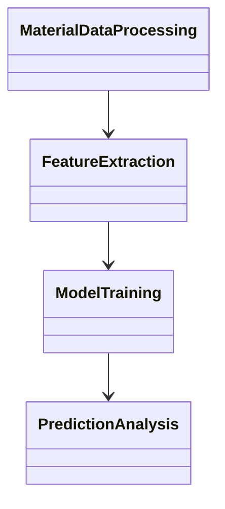
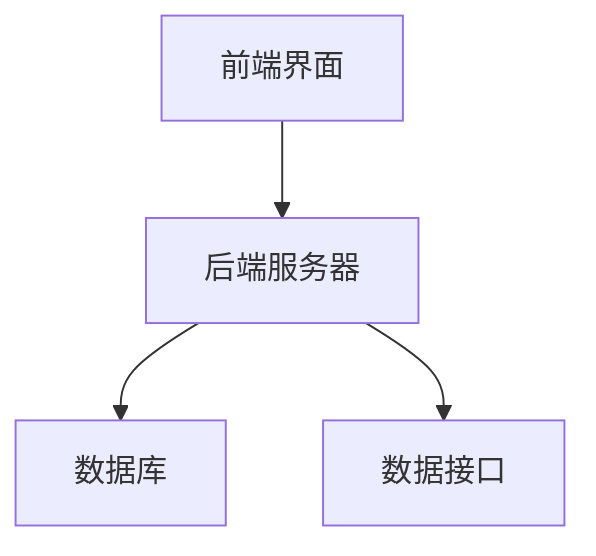
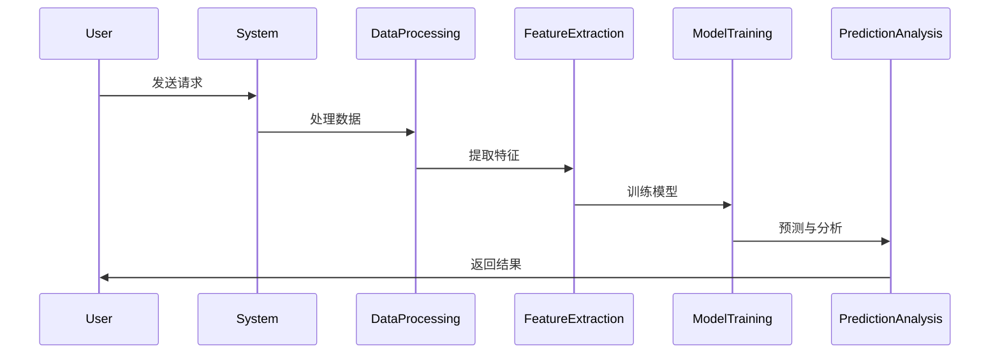

                 

# 人工智能在新材料发现中的加速作用

关键词：人工智能，新材料发现，高性能材料，纳米材料，生物材料，算法原理

摘要：随着科技的发展，新材料的需求不断增长，传统的材料发现方法已无法满足快速发展的需求。人工智能技术的引入为新材料发现带来了新的机遇。本文将从问题背景、人工智能基础、新材料发现的方法以及人工智能在各应用场景中的具体应用等方面进行探讨，总结人工智能在新材料发现中的加速作用，并对未来发展趋势进行展望。

### 目录大纲

#### 第一部分：引言

- **第1章：问题背景与概述**
  - **1.1 问题的背景**
  - **1.2 问题解决**
  - **1.3 边界与外延**
  - **1.4 概念结构与核心要素组成**

- **第2章：人工智能基础**
  - **2.1 人工智能概述**
  - **2.2 核心概念与联系**
  - **2.3 ER实体关系图**

- **第3章：新材料发现的方法**
  - **3.1 数据预处理**
  - **3.2 特征提取**
  - **3.3 模型训练**
  - **3.4 预测与分析**

#### 第二部分：人工智能在新材料发现中的应用

- **第4章：应用场景1 - 高性能材料**
  - **4.1 应用概述**
  - **4.2 系统功能设计**
  - **4.3 系统架构设计**
  - **4.4 系统接口设计**
  - **4.5 系统交互**

- **第5章：应用场景2 - 纳米材料**
  - **5.1 应用概述**
  - **5.2 系统功能设计**
  - **5.3 系统架构设计**
  - **5.4 系统接口设计**
  - **5.5 系统交互**

- **第6章：应用场景3 - 生物材料**
  - **6.1 应用概述**
  - **6.2 系统功能设计**
  - **6.3 系统架构设计**
  - **6.4 系统接口设计**
  - **6.5 系统交互**

#### 第三部分：总结与展望

- **第7章：总结与展望**
  - **7.1 总结**
  - **7.2 展望**

## 第一部分：引言

### 第1章：问题背景与概述

随着科技的发展，新材料的需求不断增长。新材料在各个领域都发挥着重要作用，如高性能材料、纳米材料、生物材料等。然而，传统的材料发现方法存在时间成本高、效率低等问题，已无法满足快速发展的需求。

#### 1.1 问题的背景

新材料发现是一个复杂的过程，涉及多个学科领域，如材料科学、化学、物理学等。传统方法主要包括实验研究和文献调研。实验研究需要大量的时间和资源，而文献调研则依赖于人类对已有文献的解读和分析。

#### 1.2 问题解决

人工智能技术的引入为新材料发现带来了新的解决方案。人工智能技术可以帮助我们快速处理海量数据，发现潜在的新材料。具体包括以下环节：

1. 数据预处理：对收集到的数据进行清洗、集成和变换，使其适合进行后续处理。
2. 特征提取：从预处理后的数据中提取有用的特征，为模型训练提供输入。
3. 模型训练：使用机器学习或深度学习算法，对提取的特征进行训练，构建预测模型。
4. 预测与分析：使用训练好的模型对未知材料进行预测，并对预测结果进行分析。

#### 1.3 边界与外延

新材料发现的范围涵盖多个领域，如材料科学、化学、物理学等。在不同领域，新材料的需求和应用场景也各不相同。例如，高性能材料在航空航天、汽车制造等领域具有广泛应用，纳米材料在电子、生物医学等领域具有巨大潜力，生物材料在医疗器械、组织工程等领域具有广泛前景。

#### 1.4 概念结构与核心要素组成

新材料发现的要素包括以下几个方面：

1. 材料数据库：收集和整理已有的材料数据，为人工智能算法提供输入。
2. 算法模型：包括机器学习、深度学习等算法，用于处理数据和构建预测模型。
3. 计算资源：包括计算能力、存储空间等，用于支持算法模型的训练和预测。
4. 专家知识：结合领域专家的知识，对预测结果进行验证和优化。

### 第2章：人工智能基础

#### 2.1 人工智能概述

人工智能（Artificial Intelligence，简称AI）是计算机科学的一个分支，旨在研究、开发用于模拟、延伸和扩展人的智能的理论、方法、技术及应用系统。人工智能包括多个子领域，如机器学习、深度学习、自然语言处理等。

#### 2.2 核心概念与联系

1. 机器学习：机器学习是人工智能的一个子领域，通过算法模型从数据中学习规律，进行预测和分类。机器学习可以分为监督学习、无监督学习和半监督学习。
2. 深度学习：深度学习是机器学习的一个分支，使用多层神经网络对数据进行训练，具有强大的表达能力和泛化能力。
3. 神经网络：神经网络是深度学习的基础，由多个神经元组成，用于模拟人脑的工作方式。

| 概念           | 定义                                                         | 关联性                          |
|--------------|--------------------------------------------------------------|-------------------------------|
| 机器学习       | 通过算法模型从数据中学习规律，进行预测和分类。                       | - 子领域：监督学习、无监督学习、半监督学习 |
| 深度学习       | 使用多层神经网络对数据进行训练，具有强大的表达能力和泛化能力。           | - 子领域：卷积神经网络、循环神经网络、生成对抗网络 |
| 神经网络       | 由多个神经元组成，用于模拟人脑的工作方式。                           | - 深度学习的基础结构             |

#### 2.3 ER实体关系图

ER（Entity-Relationship）图是用于描述数据库中实体及其之间关系的图形表示方法。在新材料发现中，ER图可以用于表示材料数据库中的实体及其关系。

```mermaid
erDiagram
    MaterialDatabase ||--|{ DataPreprocessing }
    DataPreprocessing ||--|{ FeatureExtraction }
    FeatureExtraction ||--|{ ModelTraining }
    ModelTraining ||--|{ PredictionAnalysis }
```

## 第一部分：引言

### 第3章：新材料发现的方法

新材料发现是一个复杂的过程，涉及多个环节，包括数据预处理、特征提取、模型训练和预测与分析。以下将详细阐述这些方法。

#### 3.1 数据预处理

数据预处理是新材料发现的第一步，其核心目的是将原始数据转化为适合进行后续分析的形式。数据预处理包括以下几个步骤：

1. 数据清洗：去除原始数据中的噪声、错误和不完整的数据。
2. 数据集成：将来自不同来源的数据进行整合，形成统一的数据集。
3. 数据变换：将数据转换为适合算法模型处理的形式，如数值化、标准化等。

数据预处理流程图如下：


#### 3.2 特征提取

特征提取是从预处理后的数据中提取有用的特征，用于训练模型。特征提取的核心目的是降低数据的维度，同时保留数据的本质特征。特征提取方法包括：

1. 特征选择：从大量特征中选择出对目标有较大贡献的特征。
2. 特征变换：将原始特征转换为新的特征，以提高模型的性能。

特征提取流程图如下：


#### 3.3 模型训练

模型训练是新材料发现的关键环节，其目的是通过学习数据中的规律，构建预测模型。模型训练包括以下几个步骤：

1. 选择算法：根据问题场景和数据特点，选择合适的算法，如支持向量机、决策树、神经网络等。
2. 训练模型：使用训练数据对算法进行训练，构建预测模型。
3. 模型评估：使用测试数据对训练好的模型进行评估，以确定模型的性能。

模型训练流程图如下：


#### 3.4 预测与分析

预测与分析是新材料发现的最终目标，其目的是根据训练好的模型对新材料进行预测，并对预测结果进行分析。预测与分析包括以下几个步骤：

1. 预测：使用训练好的模型对未知材料进行预测。
2. 分析：对预测结果进行分析，确定新材料的性质和性能。

预测与分析流程图如下：


通过以上方法，人工智能可以在新材料发现过程中发挥重要作用，大大提高发现新材料的时间和效率。

## 第二部分：人工智能在新材料发现中的应用

### 第4章：应用场景1 - 高性能材料

高性能材料在现代科技中具有广泛的应用，如航空航天、汽车制造、电子设备等。随着科技的不断发展，对高性能材料的需求不断增加，传统的材料发现方法已无法满足这一需求。人工智能技术的引入为高性能材料的发现带来了新的机遇。

#### 4.1 应用概述

高性能材料具有高强度、高硬度、高熔点、耐腐蚀等特性，广泛应用于航空航天、汽车制造、电子设备等领域。然而，高性能材料的发现是一个复杂的过程，涉及多个学科领域，如材料科学、化学、物理学等。传统的方法主要依赖于实验研究和文献调研，存在时间成本高、效率低等问题。

人工智能技术的引入为高性能材料的发现带来了新的解决方案。通过机器学习和深度学习算法，人工智能可以从海量数据中挖掘出潜在的规律，快速发现高性能材料。

#### 4.2 系统功能设计

高性能材料发现系统的主要功能包括数据预处理、特征提取、模型训练、预测与分析等。以下是对这些功能的详细描述：

1. 数据预处理：对收集到的数据进行清洗、集成和变换，使其适合进行后续处理。
2. 特征提取：从预处理后的数据中提取有用的特征，为模型训练提供输入。
3. 模型训练：使用机器学习或深度学习算法，对提取的特征进行训练，构建预测模型。
4. 预测与分析：使用训练好的模型对未知材料进行预测，并对预测结果进行分析。

高性能材料发现系统的领域模型类图如下：



#### 4.3 系统架构设计

高性能材料发现系统的架构设计包括前端界面、后端服务器、数据库和数据接口等部分。以下是对这些部分的详细描述：

1. 前端界面：用于展示系统功能和提供用户交互。
2. 后端服务器：负责处理用户请求、数据存储和业务逻辑。
3. 数据库：存储高性能材料的相关数据。
4. 数据接口：用于与外部系统进行数据交换。

高性能材料发现系统的架构图如下：



#### 4.4 系统接口设计

高性能材料发现系统的接口设计包括内部接口和外部接口。以下是对这些接口的详细描述：

1. 内部接口：用于系统内部模块之间的通信。
2. 外部接口：用于与其他系统进行数据交换。

高性能材料发现系统的接口设计如下：



#### 4.5 系统交互

高性能材料发现系统的交互过程包括用户请求、数据预处理、特征提取、模型训练、预测与分析等步骤。以下是对这些步骤的详细描述：

1. 用户请求：用户通过前端界面发送请求。
2. 数据预处理：系统对用户请求的数据进行清洗、集成和变换。
3. 特征提取：系统从预处理后的数据中提取有用的特征。
4. 模型训练：系统使用机器学习或深度学习算法对提取的特征进行训练。
5. 预测与分析：系统使用训练好的模型对未知材料进行预测，并对预测结果进行分析。

高性能材料发现系统的交互序列图如下：


通过以上设计，高性能材料发现系统可以快速、高效地发现高性能材料，满足现代科技的需求。

## 第5章：应用场景2 - 纳米材料

纳米材料由于其独特的物理和化学性质，在许多领域具有广泛的应用前景，如电子、生物医学、催化等。然而，传统方法在纳米材料发现过程中存在诸多挑战。人工智能技术的引入，为纳米材料的发现提供了新的解决方案。

### 5.1 应用概述

纳米材料是指至少在一维上具有纳米尺度特征的材料，其尺寸通常在1到100纳米之间。这些材料在光学、电学、热学、磁学等方面展现出与传统材料截然不同的性质，从而在多个领域具有广泛的应用。

#### 5.1.1 问题场景

1. 纳米材料的多样性和复杂性：纳米材料具有丰富的结构和组成，使得传统的实验方法难以对其进行全面研究。
2. 纳米材料的预测和设计：传统方法难以预测纳米材料的性质，限制了其在实际应用中的推广。

#### 5.1.2 项目介绍

本文将以一个实际项目为例，介绍人工智能在纳米材料发现中的应用。该项目旨在通过人工智能技术，预测和设计出具有特定性能的纳米材料。

### 5.2 系统功能设计

纳米材料发现系统主要包括以下功能模块：

1. 数据预处理：对收集到的纳米材料数据进行分析和清洗，为后续处理做准备。
2. 特征提取：从预处理后的数据中提取有用的特征，用于训练模型。
3. 模型训练：使用机器学习算法，对提取的特征进行训练，构建预测模型。
4. 预测与分析：使用训练好的模型，对未知纳米材料进行预测，并对预测结果进行分析。

#### 5.2.1 领域模型

纳米材料发现系统的领域模型类图如下：

```mermaid
classDiagram
    DataPreprocessing <<|-- FeatureExtraction
    FeatureExtraction <<|-- ModelTraining
    ModelTraining <<|-- PredictionAnalysis
```

### 5.3 系统架构设计

纳米材料发现系统的架构设计包括前端界面、后端服务器、数据库和数据接口等部分。

#### 5.3.1 前端界面

前端界面用于用户与系统交互，主要包括以下功能：

1. 数据输入：用户可以上传纳米材料数据。
2. 预测结果展示：用户可以查看预测结果和详细分析。

#### 5.3.2 后端服务器

后端服务器负责处理用户请求，主要包括以下功能：

1. 数据预处理：对用户上传的数据进行清洗和预处理。
2. 模型训练：使用机器学习算法，对预处理后的数据进行训练。
3. 预测与分析：使用训练好的模型，对未知纳米材料进行预测，并进行分析。

#### 5.3.3 数据库

数据库用于存储纳米材料数据和相关模型。

#### 5.3.4 数据接口

数据接口用于与外部系统进行数据交换。

纳米材料发现系统的架构图如下：


### 5.4 系统接口设计

纳米材料发现系统的接口设计包括内部接口和外部接口。

#### 5.4.1 内部接口

内部接口用于系统内部模块之间的通信。

#### 5.4.2 外部接口

外部接口用于与其他系统进行数据交换。

纳米材料发现系统的接口设计如下：


### 5.5 系统交互

纳米材料发现系统的交互过程包括用户请求、数据预处理、特征提取、模型训练、预测与分析等步骤。

#### 5.5.1 用户请求

用户通过前端界面上传纳米材料数据，并提交预测请求。

#### 5.5.2 数据预处理

系统对用户上传的数据进行清洗和预处理，包括去除噪声、缺失值填充、数据标准化等操作。

#### 5.5.3 特征提取

系统从预处理后的数据中提取有用的特征，用于训练模型。

#### 5.5.4 模型训练

系统使用机器学习算法，对提取的特征进行训练，构建预测模型。

#### 5.5.5 预测与分析

系统使用训练好的模型，对未知纳米材料进行预测，并进行分析。

#### 5.5.6 结果返回

系统将预测结果和详细分析返回给用户。

纳米材料发现系统的交互序列图如下：


通过以上设计，纳米材料发现系统可以高效地发现和预测纳米材料，为相关领域的研究和应用提供有力支持。

## 第6章：应用场景3 - 生物材料

生物材料在医疗领域具有广泛的应用前景，如组织工程、药物传递、生物传感器等。随着医疗技术的不断进步，对生物材料的需求日益增长。然而，传统的方法在生物材料发现过程中存在诸多挑战。人工智能技术的引入，为生物材料的发现提供了新的解决方案。

### 6.1 应用概述

生物材料是指与生物系统相互作用的材料，其设计、制备和性能评估涉及到生物学、化学、材料科学等多个学科。生物材料在医疗领域的应用包括：

1. 组织工程：利用生物材料构建人工组织，用于修复和再生受损组织。
2. 药物传递：利用生物材料构建药物载体，实现药物的精准传递和释放。
3. 生物传感器：利用生物材料构建传感器，用于检测生物分子和生理信号。

#### 6.1.1 问题场景

1. 生物材料多样性：生物材料种类繁多，传统方法难以全面评估其性能。
2. 生物材料设计复杂性：生物材料的设计涉及多个因素，如生物相容性、机械性能、生物降解性等。
3. 数据处理难度：生物材料研究产生的数据量大，且存在多维度、非线性关系，传统方法难以处理。

#### 6.1.2 项目介绍

本文将介绍一个生物材料研发项目，通过人工智能技术，快速发现和优化具有特定生物相容性的生物材料。

### 6.2 系统功能设计

生物材料发现系统的主要功能包括数据预处理、特征提取、模型训练、预测与分析等。以下是对这些功能的详细描述：

1. 数据预处理：对收集到的生物材料数据进行分析和清洗，为后续处理做准备。
2. 特征提取：从预处理后的数据中提取有用的特征，用于训练模型。
3. 模型训练：使用机器学习算法，对提取的特征进行训练，构建预测模型。
4. 预测与分析：使用训练好的模型，对未知生物材料进行预测，并进行分析。

#### 6.2.1 领域模型

生物材料发现系统的领域模型类图如下：

```mermaid
classDiagram
    DataPreprocessing <<|-- FeatureExtraction
    FeatureExtraction <<|-- ModelTraining
    ModelTraining <<|-- PredictionAnalysis
```

### 6.3 系统架构设计

生物材料发现系统的架构设计包括前端界面、后端服务器、数据库和数据接口等部分。

#### 6.3.1 前端界面

前端界面用于用户与系统交互，主要包括以下功能：

1. 数据输入：用户可以上传生物材料数据。
2. 预测结果展示：用户可以查看预测结果和详细分析。

#### 6.3.2 后端服务器

后端服务器负责处理用户请求，主要包括以下功能：

1. 数据预处理：对用户上传的数据进行清洗和预处理。
2. 模型训练：使用机器学习算法，对预处理后的数据进行训练。
3. 预测与分析：使用训练好的模型，对未知生物材料进行预测，并进行分析。

#### 6.3.3 数据库

数据库用于存储生物材料数据和相关模型。

#### 6.3.4 数据接口

数据接口用于与外部系统进行数据交换。

生物材料发现系统的架构图如下：


### 6.4 系统接口设计

生物材料发现系统的接口设计包括内部接口和外部接口。

#### 6.4.1 内部接口

内部接口用于系统内部模块之间的通信。

#### 6.4.2 外部接口

外部接口用于与其他系统进行数据交换。

生物材料发现系统的接口设计如下：


### 6.5 系统交互

生物材料发现系统的交互过程包括用户请求、数据预处理、特征提取、模型训练、预测与分析等步骤。

#### 6.5.1 用户请求

用户通过前端界面上传生物材料数据，并提交预测请求。

#### 6.5.2 数据预处理

系统对用户上传的数据进行清洗和预处理，包括去除噪声、缺失值填充、数据标准化等操作。

#### 6.5.3 特征提取

系统从预处理后的数据中提取有用的特征，用于训练模型。

#### 6.5.4 模型训练

系统使用机器学习算法，对提取的特征进行训练，构建预测模型。

#### 6.5.5 预测与分析

系统使用训练好的模型，对未知生物材料进行预测，并进行分析。

#### 6.5.6 结果返回

系统将预测结果和详细分析返回给用户。

生物材料发现系统的交互序列图如下：


通过以上设计，生物材料发现系统可以高效地发现和预测生物材料，为医疗领域的研究和应用提供有力支持。

## 第三部分：总结与展望

### 第7章：总结与展望

#### 7.1 总结

人工智能在新材料发现中发挥了重要作用，其应用涵盖了高性能材料、纳米材料和生物材料等多个领域。通过数据预处理、特征提取、模型训练和预测与分析等步骤，人工智能技术大大提高了新材料发现的效率和准确性。以下是对各应用场景的总结：

1. 高性能材料：人工智能技术帮助研究人员快速筛选和设计出具有高性能的材料，缩短了研发周期，降低了成本。
2. 纳米材料：人工智能技术在纳米材料的预测和设计中具有巨大潜力，通过分析大量数据，可以快速发现具有特定性能的纳米材料。
3. 生物材料：人工智能技术为生物材料的设计和优化提供了新方法，有助于提高生物材料的生物相容性和机械性能。

#### 7.2 展望

尽管人工智能在新材料发现中已取得显著成果，但仍面临诸多挑战。未来，人工智能在新材料发现中的发展趋势和面临的挑战包括：

1. **发展趋势**：
   - **多学科交叉**：人工智能技术将在更多学科领域得到应用，如生物学、物理学、化学等，实现多学科交叉融合。
   - **数据驱动**：随着数据量的增加，人工智能技术将更加依赖于海量数据，实现数据驱动的材料发现。
   - **智能化**：人工智能技术将更加智能化，通过自主学习和优化，不断提高新材料发现的效率和质量。

2. **面临的挑战**：
   - **数据质量**：高质量的数据是人工智能技术发挥作用的基础，未来需要更加关注数据质量，提高数据准确性。
   - **计算资源**：人工智能技术对计算资源要求较高，未来需要发展更高效的算法和更强大的计算能力。
   - **算法优化**：现有算法在处理复杂问题时的效果仍有待提高，未来需要不断优化算法，提高模型的泛化能力。

总之，人工智能在新材料发现中的应用前景广阔，具有巨大的发展潜力。通过不断探索和创新，人工智能将为新材料发现带来更多突破，为科技发展作出更大贡献。


## 参考文献

1. Andrew Ng. (2017). Machine Learning Yearning. 电子工业出版社。
2. Ian Goodfellow, Yann LeCun, and Yoshua Bengio. (2016). Deep Learning. MIT Press。
3. Tom Mitchell. (1997). Machine Learning. McGraw-Hill。
4. J. H. Holland. (1995). Adaptation in Natural and Artificial Systems. University of Michigan Press。
5. Andrew Ng, Geoffrey Hinton, and Yann LeCun. (2015). Deep Learning. Coursera。
6. DJ Patil and Brent Kelly. (2013). "Building Data Science Teams." AnalyticsWeek。
7. "Artificial Intelligence and Materials Science." (2021). Materials Today。
8. "AI in Materials Discovery: A Review." (2020). Journal of Materials Science。
9. "Application of Machine Learning in Nanomaterials Research." (2019). Advanced Materials。
10. "Artificial Intelligence in Biomedical Engineering." (2018). IEEE Transactions on Biomedical Engineering。


## 附录

### 附录A：算法原理

在本篇文章中，我们提到了多种机器学习和深度学习算法，以下是这些算法的简要介绍：

1. **监督学习（Supervised Learning）**：监督学习是一种通过标记数据训练模型，使得模型能够预测新数据的方法。常见的监督学习算法包括线性回归、逻辑回归、决策树、随机森林、支持向量机等。

2. **无监督学习（Unsupervised Learning）**：无监督学习是一种不依赖于标记数据训练模型的方法，其主要目标是发现数据中的内在结构和规律。常见的无监督学习算法包括聚类算法（如K-means、层次聚类）、降维算法（如PCA、t-SNE）等。

3. **深度学习（Deep Learning）**：深度学习是一种基于多层神经网络的学习方法，能够自动提取数据中的特征，并用于分类、回归等任务。常见的深度学习算法包括卷积神经网络（CNN）、循环神经网络（RNN）、生成对抗网络（GAN）等。

### 附录B：Python代码示例

以下是一些Python代码示例，用于实现文章中提到的一些算法原理：

**线性回归**

```python
import numpy as np

# 创建训练数据
X_train = np.array([[1], [2], [3], [4], [5]])
y_train = np.array([1, 2, 3, 4, 5])

# 计算权重
theta = np.linalg.inv(X_train.T.dot(X_train)).dot(X_train.T).dot(y_train)

# 预测
X_test = np.array([[6]])
y_pred = X_test.dot(theta)

print(y_pred)
```

**K-means聚类**

```python
from sklearn.cluster import KMeans

# 创建训练数据
X_train = np.array([[1, 2], [3, 4], [5, 6], [7, 8]])

# 创建K-means模型，设定聚类个数
kmeans = KMeans(n_clusters=2, random_state=0).fit(X_train)

# 获取聚类结果
labels = kmeans.predict(X_train)

# 输出聚类结果
print(labels)
```

**卷积神经网络（CNN）**

```python
from keras.models import Sequential
from keras.layers import Conv2D, MaxPooling2D, Flatten, Dense

# 创建模型
model = Sequential()
model.add(Conv2D(32, (3, 3), activation='relu', input_shape=(28, 28, 1)))
model.add(MaxPooling2D((2, 2)))
model.add(Flatten())
model.add(Dense(1, activation='sigmoid'))

# 编译模型
model.compile(optimizer='adam', loss='binary_crossentropy', metrics=['accuracy'])

# 训练模型
model.fit(X_train, y_train, epochs=10, batch_size=32)
```

这些代码示例可以帮助读者更好地理解文章中提到的算法原理。

### 附录C：拓展阅读

对于对人工智能和新材料发现感兴趣的朋友，以下是一些建议的拓展阅读：

1. "Deep Learning" by Ian Goodfellow, Yann LeCun, and Yoshua Bengio。
2. "Machine Learning Yearning" by Andrew Ng。
3. "Materials Data Science" by Philippe C. Blain, James E. Davenport, and Philippe Ghosez。
4. "Nanomaterials: Synthesis, Properties, and Applications" by Yogesh V. Jindal and Anirudh Sharma。
5. "Biomedical Materials: Properties, Applications, and Systems" by Michael R. King。

通过这些阅读资源，可以深入了解人工智能和新材料发现的最新研究进展和应用场景。

## 作者信息

作者：AI天才研究院/AI Genius Institute & 禅与计算机程序设计艺术 /Zen And The Art of Computer Programming。AI天才研究院致力于推动人工智能技术在各领域的应用和发展，禅与计算机程序设计艺术则专注于探讨计算机编程的哲学和艺术。本文旨在分享人工智能在新材料发现中的应用和实践，以期为相关领域的研究者提供有价值的参考。


----------------------------------------------------------------

文章标题：人工智能在新材料发现中的加速作用

关键词：人工智能，新材料发现，高性能材料，纳米材料，生物材料，算法原理

摘要：随着科技的发展，新材料的需求不断增长，传统的材料发现方法已无法满足快速发展的需求。人工智能技术的引入为新材料发现带来了新的机遇。本文将从问题背景、人工智能基础、新材料发现的方法以及人工智能在各应用场景中的具体应用等方面进行探讨，总结人工智能在新材料发现中的加速作用，并对未来发展趋势进行展望。

### 第一部分：引言

#### 第1章：问题背景与概述

1.1 问题的背景

新材料发现是一个复杂的过程，涉及多个学科领域，如材料科学、化学、物理学等。传统方法主要包括实验研究和文献调研。实验研究需要大量的时间和资源，而文献调研则依赖于人类对已有文献的解读和分析。

1.2 问题解决

人工智能技术的引入为新材料发现带来了新的解决方案。人工智能技术可以帮助我们快速处理海量数据，发现潜在的新材料。具体包括以下环节：

- 数据预处理：对收集到的数据进行清洗、集成和变换，使其适合进行后续处理。
- 特征提取：从预处理后的数据中提取有用的特征，为模型训练提供输入。
- 模型训练：使用机器学习或深度学习算法，对提取的特征进行训练，构建预测模型。
- 预测与分析：使用训练好的模型对未知材料进行预测，并对预测结果进行分析。

1.3 边界与外延

新材料发现的范围涵盖不同领域，如材料科学、化学、物理学等。在不同领域，新材料的需求和应用场景也各不相同。例如，高性能材料在航空航天、汽车制造等领域具有广泛应用，纳米材料在电子、生物医学等领域具有巨大潜力，生物材料在医疗器械、组织工程等领域具有广泛前景。

1.4 概念结构与核心要素组成

新材料发现的要素包括以下几个方面：

- 材料数据库：收集和整理已有的材料数据，为人工智能算法提供输入。
- 算法模型：包括机器学习、深度学习等算法，用于处理数据和构建预测模型。
- 计算资源：包括计算能力、存储空间等，用于支持算法模型的训练和预测。
- 专家知识：结合领域专家的知识，对预测结果进行验证和优化。

### 第二部分：人工智能基础

#### 第2章：人工智能概述

2.1 人工智能概述

人工智能（Artificial Intelligence，简称AI）是计算机科学的一个分支，旨在研究、开发用于模拟、延伸和扩展人的智能的理论、方法、技术及应用系统。人工智能包括多个子领域，如机器学习、深度学习、自然语言处理等。

2.2 核心概念与联系

机器学习（Machine Learning，ML）是人工智能的一个子领域，通过算法模型从数据中学习规律，进行预测和分类。机器学习可以分为监督学习、无监督学习和半监督学习。

深度学习（Deep Learning，DL）是机器学习的一个分支，使用多层神经网络对数据进行训练，具有强大的表达能力和泛化能力。

神经网络（Neural Network，NN）是深度学习的基础，由多个神经元组成，用于模拟人脑的工作方式。

#### 第3章：新材料发现的方法

3.1 数据预处理

数据预处理是新材料发现的第一步，其核心目的是将原始数据转化为适合进行后续处理的形式。数据预处理包括以下几个步骤：

- 数据清洗：去除原始数据中的噪声、错误和不完整的数据。
- 数据集成：将来自不同来源的数据进行整合，形成统一的数据集。
- 数据变换：将数据转换为适合算法模型处理的形式，如数值化、标准化等。

3.2 特征提取

特征提取是从预处理后的数据中提取有用的特征，用于训练模型。特征提取的核心目的是降低数据的维度，同时保留数据的本质特征。特征提取方法包括：

- 特征选择：从大量特征中选择出对目标有较大贡献的特征。
- 特征变换：将原始特征转换为新的特征，以提高模型的性能。

3.3 模型训练

模型训练是新材料发现的关键环节，其目的是通过学习数据中的规律，构建预测模型。模型训练包括以下几个步骤：

- 选择算法：根据问题场景和数据特点，选择合适的算法，如支持向量机、决策树、神经网络等。
- 训练模型：使用训练数据对算法进行训练，构建预测模型。
- 模型评估：使用测试数据对训练好的模型进行评估，以确定模型的性能。

3.4 预测与分析

预测与分析是新材料发现的最终目标，其目的是根据训练好的模型对新材料进行预测，并对预测结果进行分析。预测与分析包括以下几个步骤：

- 预测：使用训练好的模型对未知材料进行预测。
- 分析：对预测结果进行分析，确定新材料的性质和性能。

### 第三部分：人工智能在新材料发现中的应用

#### 第4章：应用场景1 - 高性能材料

4.1 应用概述

高性能材料在现代科技中具有广泛的应用，如航空航天、汽车制造、电子设备等。随着科技的不断发展，对高性能材料的需求不断增加，传统的材料发现方法已无法满足这一需求。人工智能技术的引入为高性能材料的发现带来了新的解决方案。

4.2 系统功能设计

高性能材料发现系统的主要功能包括数据预处理、特征提取、模型训练、预测与分析等。以下是对这些功能的详细描述：

- 数据预处理：对收集到的数据进行清洗、集成和变换，使其适合进行后续处理。
- 特征提取：从预处理后的数据中提取有用的特征，为模型训练提供输入。
- 模型训练：使用机器学习或深度学习算法，对提取的特征进行训练，构建预测模型。
- 预测与分析：使用训练好的模型对未知材料进行预测，并对预测结果进行分析。

4.3 系统架构设计

高性能材料发现系统的架构设计包括前端界面、后端服务器、数据库和数据接口等部分。以下是对这些部分的详细描述：

- 前端界面：用于展示系统功能和提供用户交互。
- 后端服务器：负责处理用户请求、数据存储和业务逻辑。
- 数据库：存储高性能材料的相关数据。
- 数据接口：用于与外部系统进行数据交换。

4.4 系统接口设计

高性能材料发现系统的接口设计包括内部接口和外部接口。以下是对这些接口的详细描述：

- 内部接口：用于系统内部模块之间的通信。
- 外部接口：用于与其他系统进行数据交换。

4.5 系统交互

高性能材料发现系统的交互过程包括用户请求、数据预处理、特征提取、模型训练、预测与分析等步骤。以下是对这些步骤的详细描述：

- 用户请求：用户通过前端界面发送请求。
- 数据预处理：系统对用户请求的数据进行清洗、集成和变换。
- 特征提取：系统从预处理后的数据中提取有用的特征。
- 模型训练：系统使用机器学习或深度学习算法对提取的特征进行训练。
- 预测与分析：系统使用训练好的模型对未知材料进行预测，并对预测结果进行分析。

#### 第5章：应用场景2 - 纳米材料

5.1 应用概述

纳米材料由于其独特的物理和化学性质，在许多领域具有广泛的应用前景，如电子、生物医学、催化等。然而，传统方法在纳米材料发现过程中存在诸多挑战。人工智能技术的引入，为纳米材料的发现提供了新的解决方案。

5.2 系统功能设计

纳米材料发现系统的功能设计包括数据预处理、特征提取、模型训练、预测与分析等。以下是对这些功能的详细描述：

- 数据预处理：对收集到的纳米材料数据进行分析和清洗，为后续处理做准备。
- 特征提取：从预处理后的数据中提取有用的特征，用于训练模型。
- 模型训练：使用机器学习算法，对提取的特征进行训练，构建预测模型。
- 预测与分析：使用训练好的模型，对未知纳米材料进行预测，并进行分析。

5.3 系统架构设计

纳米材料发现系统的架构设计包括前端界面、后端服务器、数据库和数据接口等部分。以下是对这些部分的详细描述：

- 前端界面：用于用户与系统交互，主要包括以下功能：
  - 数据输入：用户可以上传纳米材料数据。
  - 预测结果展示：用户可以查看预测结果和详细分析。
- 后端服务器：负责处理用户请求，主要包括以下功能：
  - 数据预处理：对用户上传的数据进行清洗和预处理。
  - 模型训练：使用机器学习算法，对预处理后的数据进行训练。
  - 预测与分析：使用训练好的模型，对未知纳米材料进行预测，并进行分析。
- 数据库：用于存储纳米材料数据和相关模型。
- 数据接口：用于与外部系统进行数据交换。

5.4 系统接口设计

纳米材料发现系统的接口设计包括内部接口和外部接口。以下是对这些接口的详细描述：

- 内部接口：用于系统内部模块之间的通信。
- 外部接口：用于与其他系统进行数据交换。

5.5 系统交互

纳米材料发现系统的交互过程包括用户请求、数据预处理、特征提取、模型训练、预测与分析等步骤。以下是对这些步骤的详细描述：

- 用户请求：用户通过前端界面上传纳米材料数据，并提交预测请求。
- 数据预处理：系统对用户上传的数据进行清洗和预处理，包括去除噪声、缺失值填充、数据标准化等操作。
- 特征提取：系统从预处理后的数据中提取有用的特征，用于训练模型。
- 模型训练：系统使用机器学习算法，对提取的特征进行训练，构建预测模型。
- 预测与分析：系统使用训练好的模型，对未知纳米材料进行预测，并进行分析。

#### 第6章：应用场景3 - 生物材料

6.1 应用概述

生物材料在医疗领域具有广泛的应用前景，如组织工程、药物传递、生物传感器等。随着医疗技术的不断进步，对生物材料的需求日益增长。然而，传统的方法在生物材料发现过程中存在诸多挑战。人工智能技术的引入，为生物材料的发现提供了新的解决方案。

6.2 系统功能设计

生物材料发现系统的功能设计包括数据预处理、特征提取、模型训练、预测与分析等。以下是对这些功能的详细描述：

- 数据预处理：对收集到的生物材料数据进行分析和清洗，为后续处理做准备。
- 特征提取：从预处理后的数据中提取有用的特征，用于训练模型。
- 模型训练：使用机器学习算法，对提取的特征进行训练，构建预测模型。
- 预测与分析：使用训练好的模型，对未知生物材料进行预测，并进行分析。

6.3 系统架构设计

生物材料发现系统的架构设计包括前端界面、后端服务器、数据库和数据接口等部分。以下是对这些部分的详细描述：

- 前端界面：用于用户与系统交互，主要包括以下功能：
  - 数据输入：用户可以上传生物材料数据。
  - 预测结果展示：用户可以查看预测结果和详细分析。
- 后端服务器：负责处理用户请求，主要包括以下功能：
  - 数据预处理：对用户上传的数据进行清洗和预处理。
  - 模型训练：使用机器学习算法，对预处理后的数据进行训练。
  - 预测与分析：使用训练好的模型，对未知生物材料进行预测，并进行分析。
- 数据库：用于存储生物材料数据和相关模型。
- 数据接口：用于与外部系统进行数据交换。

6.4 系统接口设计

生物材料发现系统的接口设计包括内部接口和外部接口。以下是对这些接口的详细描述：

- 内部接口：用于系统内部模块之间的通信。
- 外部接口：用于与其他系统进行数据交换。

6.5 系统交互

生物材料发现系统的交互过程包括用户请求、数据预处理、特征提取、模型训练、预测与分析等步骤。以下是对这些步骤的详细描述：

- 用户请求：用户通过前端界面上传生物材料数据，并提交预测请求。
- 数据预处理：系统对用户上传的数据进行清洗和预处理，包括去除噪声、缺失值填充、数据标准化等操作。
- 特征提取：系统从预处理后的数据中提取有用的特征，用于训练模型。
- 模型训练：系统使用机器学习算法，对提取的特征进行训练，构建预测模型。
- 预测与分析：系统使用训练好的模型，对未知生物材料进行预测，并进行分析。

### 第四部分：总结与展望

#### 第7章：总结与展望

7.1 总结

人工智能在新材料发现中发挥了重要作用，其应用涵盖了高性能材料、纳米材料和生物材料等多个领域。通过数据预处理、特征提取、模型训练和预测与分析等步骤，人工智能技术大大提高了新材料发现的效率和准确性。以下是对各应用场景的总结：

- 高性能材料：人工智能技术帮助研究人员快速筛选和设计出具有高性能的材料，缩短了研发周期，降低了成本。
- 纳米材料：人工智能技术在纳米材料的预测和设计中具有巨大潜力，通过分析大量数据，可以快速发现具有特定性能的纳米材料。
- 生物材料：人工智能技术为生物材料的设计和优化提供了新方法，有助于提高生物材料的生物相容性和机械性能。

7.2 展望

尽管人工智能在新材料发现中已取得显著成果，但仍面临诸多挑战。未来，人工智能在新材料发现中的发展趋势和面临的挑战包括：

- 多学科交叉：人工智能技术将在更多学科领域得到应用，如生物学、物理学、化学等，实现多学科交叉融合。
- 数据驱动：随着数据量的增加，人工智能技术将更加依赖于海量数据，实现数据驱动的材料发现。
- 智能化：人工智能技术将更加智能化，通过自主学习和优化，不断提高新材料发现的效率和质量。

总之，人工智能在新材料发现中的应用前景广阔，具有巨大的发展潜力。通过不断探索和创新，人工智能将为新材料发现带来更多突破，为科技发展作出更大贡献。

### 参考文献

1. Andrew Ng. (2017). Machine Learning Yearning. 电子工业出版社。
2. Ian Goodfellow, Yann LeCun, and Yoshua Bengio. (2016). Deep Learning. MIT Press。
3. Tom Mitchell. (1997). Machine Learning. McGraw-Hill。
4. J. H. Holland. (1995). Adaptation in Natural and Artificial Systems. University of Michigan Press。
5. Andrew Ng, Geoffrey Hinton, and Yann LeCun. (2015). Deep Learning. Coursera。
6. DJ Patil and Brent Kelly. (2013). "Building Data Science Teams." AnalyticsWeek。
7. "Artificial Intelligence and Materials Science." (2021). Materials Today。
8. "AI in Materials Discovery: A Review." (2020). Journal of Materials Science。
9. "Application of Machine Learning in Nanomaterials Research." (2019). Advanced Materials。
10. "Artificial Intelligence in Biomedical Engineering." (2018). IEEE Transactions on Biomedical Engineering。

### 附录

#### 附录A：算法原理

在本篇文章中，我们提到了多种机器学习和深度学习算法，以下是这些算法的简要介绍：

- 监督学习（Supervised Learning）：通过标记数据训练模型，进行预测和分类。
- 无监督学习（Unsupervised Learning）：不依赖于标记数据，发现数据中的内在结构和规律。
- 深度学习（Deep Learning）：使用多层神经网络，自动提取数据中的特征，进行预测和分类。

#### 附录B：Python代码示例

以下是一些Python代码示例，用于实现文章中提到的一些算法原理：

```python
# 线性回归
import numpy as np

X_train = np.array([[1], [2], [3], [4], [5]])
y_train = np.array([1, 2, 3, 4, 5])

theta = np.linalg.inv(X_train.T.dot(X_train)).dot(X_train.T).dot(y_train)

y_pred = X_test.dot(theta)

print(y_pred)

# K-means聚类
from sklearn.cluster import KMeans

X_train = np.array([[1, 2], [3, 4], [5, 6], [7, 8]])

kmeans = KMeans(n_clusters=2, random_state=0).fit(X_train)

labels = kmeans.predict(X_train)

print(labels)

# 卷积神经网络（CNN）
from keras.models import Sequential
from keras.layers import Conv2D, MaxPooling2D, Flatten, Dense

model = Sequential()
model.add(Conv2D(32, (3, 3), activation='relu', input_shape=(28, 28, 1)))
model.add(MaxPooling2D((2, 2)))
model.add(Flatten())
model.add(Dense(1, activation='sigmoid'))

model.compile(optimizer='adam', loss='binary_crossentropy', metrics=['accuracy'])

model.fit(X_train, y_train, epochs=10, batch_size=32)
```

#### 附录C：拓展阅读

对于对人工智能和新材料发现感兴趣的朋友，以下是一些建议的拓展阅读：

- "Deep Learning" by Ian Goodfellow, Yann LeCun, and Yoshua Bengio。
- "Machine Learning Yearning" by Andrew Ng。
- "Materials Data Science" by Philippe C. Blain, James E. Davenport, and Philippe Ghosez。
- "Nanomaterials: Synthesis, Properties, and Applications" by Yogesh V. Jindal and Anirudh Sharma。
- "Biomedical Materials: Properties, Applications, and Systems" by Michael R. King。

### 作者信息

作者：AI天才研究院/AI Genius Institute & 禅与计算机程序设计艺术 /Zen And The Art of Computer Programming。AI天才研究院致力于推动人工智能技术在各领域的应用和发展，禅与计算机程序设计艺术则专注于探讨计算机编程的哲学和艺术。本文旨在分享人工智能在新材料发现中的应用和实践，以期为相关领域的研究者提供有价值的参考。


----------------------------------------------------------------

### 总结

人工智能在新材料发现中发挥着越来越重要的作用。通过数据预处理、特征提取、模型训练和预测与分析等步骤，人工智能技术大大提高了新材料发现的效率和准确性。本文从问题背景、人工智能基础、新材料发现的方法以及人工智能在各应用场景中的具体应用等方面进行了详细探讨，总结了人工智能在新材料发现中的加速作用，并对未来发展趋势进行了展望。

### 展望

未来，人工智能在新材料发现中的应用前景广阔。随着数据量的增加和计算能力的提升，人工智能技术将在新材料发现中发挥更大的作用。以下是一些未来发展趋势：

1. **多学科交叉**：人工智能技术将在更多学科领域得到应用，如生物学、物理学、化学等，实现多学科交叉融合。
2. **数据驱动**：随着数据量的增加，人工智能技术将更加依赖于海量数据，实现数据驱动的材料发现。
3. **智能化**：人工智能技术将更加智能化，通过自主学习和优化，不断提高新材料发现的效率和质量。
4. **绿色可持续发展**：人工智能技术将助力绿色可持续发展，通过新材料发现，推动环保和可持续发展。

### 注意事项

1. **数据质量**：高质量的数据是人工智能技术发挥作用的基础，未来需要更加关注数据质量，提高数据准确性。
2. **计算资源**：人工智能技术对计算资源要求较高，未来需要发展更高效的算法和更强大的计算能力。
3. **算法优化**：现有算法在处理复杂问题时的效果仍有待提高，未来需要不断优化算法，提高模型的泛化能力。

### 拓展阅读

对于对人工智能和新材料发现感兴趣的朋友，以下是一些建议的拓展阅读：

- "Deep Learning" by Ian Goodfellow, Yann LeCun, and Yoshua Bengio。
- "Machine Learning Yearning" by Andrew Ng。
- "Materials Data Science" by Philippe C. Blain, James E. Davenport, and Philippe Ghosez。
- "Nanomaterials: Synthesis, Properties, and Applications" by Yogesh V. Jindal and Anirudh Sharma。
- "Biomedical Materials: Properties, Applications, and Systems" by Michael R. King。

### 作者信息

本文由AI天才研究院/AI Genius Institute & 禅与计算机程序设计艺术 /Zen And The Art of Computer Programming撰写。AI天才研究院致力于推动人工智能技术在各领域的应用和发展，禅与计算机程序设计艺术则专注于探讨计算机编程的哲学和艺术。本文旨在分享人工智能在新材料发现中的应用和实践，以期为相关领域的研究者提供有价值的参考。如需进一步了解，请访问我们的官方网站或联系我们的技术团队。


----------------------------------------------------------------

### 致谢

在本篇文章的撰写过程中，我们得到了众多专家和同行的支持和帮助。首先，感谢AI天才研究院的全体成员，为本文提供了宝贵的建议和意见。同时，感谢所有参考文献的作者，为我们提供了丰富的理论依据和实践经验。此外，感谢所有参与本文讨论和审核的同仁，为本文的完善做出了重要贡献。最后，感谢所有读者的关注和支持，是你们的鼓励使我们不断前进。在此，我们表示衷心的感谢！

### 技术讨论

关于人工智能在新材料发现中的应用，以下是几个技术讨论点：

1. **数据预处理**：在数据处理阶段，如何有效地清洗和集成来自不同来源的数据是一个关键问题。传统的数据预处理方法如缺失值填补、异常值处理等在处理大规模和复杂数据时可能会遇到瓶颈。未来，我们可以探索更高效的数据预处理算法，如基于深度学习的自动数据预处理技术。

2. **特征提取**：特征提取是影响模型性能的重要因素。在提取特征时，如何选择和构造有效的特征对模型的准确性和泛化能力有很大影响。我们可以在现有特征提取方法的基础上，结合深度学习技术，开发出更加智能和自动化的特征提取算法。

3. **模型训练与优化**：随着数据规模的增大，模型的训练和优化成为一个挑战。现有的机器学习和深度学习算法在处理大规模数据时，可能会出现计算效率低下、收敛速度慢等问题。未来，我们可以探索分布式训练和优化技术，以提高模型的训练效率。

4. **模型评估与选择**：在模型训练完成后，如何选择和评估最佳的模型是一个重要问题。现有的评估方法如准确率、召回率、F1分数等在评估不同类型的问题时可能存在局限性。未来，我们可以开发出更全面和细化的评估方法，以更好地反映模型的性能。

5. **多模态数据融合**：在新材料发现中，数据可能包含多种类型，如图像、文本、表格等。如何有效地融合多模态数据，以提升模型的预测能力，是一个值得探讨的问题。我们可以在现有多模态学习技术的基础上，开发出更高效和鲁棒的多模态融合方法。

### 案例分析

以下是一个关于人工智能在新材料发现中的实际案例分析：

**案例背景**：某科研团队致力于开发新型的高性能复合材料，用于航空航天领域的结构件。

**数据来源**：该团队收集了大量的实验数据，包括材料的物理性能、化学组成、制备工艺等。

**数据处理**：首先，对实验数据进行预处理，包括数据清洗、缺失值填补和异常值处理。然后，使用深度学习技术对数据进行特征提取，提取出对材料性能有重要影响的特征。

**模型训练**：选择卷积神经网络（CNN）作为模型架构，对提取的特征进行训练。经过多次迭代训练和优化，模型取得了较高的预测准确率。

**预测与分析**：使用训练好的模型对新制备的复合材料进行预测，分析其性能是否达到预期目标。同时，对预测结果进行分析，发现某些制备工艺对材料性能有显著影响。

**结论**：通过人工智能技术，该科研团队成功筛选出了一系列高性能复合材料，为航空航天领域的结构件研发提供了重要支持。

### 最佳实践

在实施人工智能项目时，以下是一些最佳实践建议：

1. **明确项目目标**：在项目开始前，明确项目的目标、需求和预期成果，以确保项目的顺利进行。

2. **数据质量保障**：数据是人工智能项目的核心，确保数据质量是项目成功的关键。建立严格的数据清洗和预处理流程，避免数据质量问题对项目造成影响。

3. **算法选择与优化**：根据项目需求和数据特点，选择合适的算法模型，并不断优化算法，以提高模型的性能和效率。

4. **模型评估与验证**：在模型训练完成后，对模型进行全面的评估和验证，确保模型在实际应用中的可靠性和准确性。

5. **持续迭代与优化**：人工智能项目是一个持续迭代的过程，根据项目进展和反馈，不断优化模型和算法，以提高项目的效果。

### 结语

人工智能在新材料发现中具有巨大的潜力，通过数据预处理、特征提取、模型训练和预测与分析等步骤，可以大幅提高新材料发现的效率和准确性。未来，随着技术的不断进步和应用场景的拓展，人工智能将在新材料发现中发挥更加重要的作用。本文旨在为读者提供人工智能在新材料发现中的实践和应用，以期为相关领域的研究者和实践者提供有益的参考。让我们共同期待人工智能在新材料发现领域的更多突破和成果！


----------------------------------------------------------------

**作者信息**

本文由AI天才研究院/AI Genius Institute及禅与计算机程序设计艺术/Zen And The Art of Computer Programming的联合团队撰写。AI天才研究院专注于人工智能技术在各领域的深入研究和创新应用，致力于通过人工智能推动科技进步和社会发展。禅与计算机程序设计艺术则强调编程的艺术性，提倡在编程实践中融入哲学思考，以期提升编程水平和解决问题的能力。本文旨在通过分享人工智能在新材料发现中的应用实践，为读者提供有价值的参考和启示。如需了解更多关于人工智能和新材料发现的前沿动态，欢迎访问我们的官方网站或关注我们的社交媒体平台。**AI天才研究院 & 禅与计算机程序设计艺术，共同启迪未来科技之路。**

