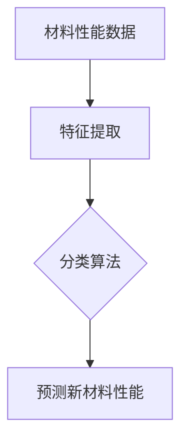
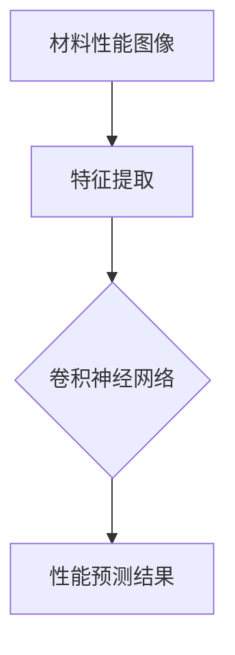
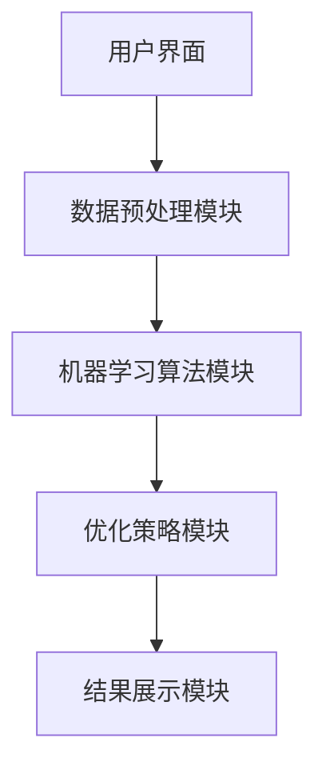
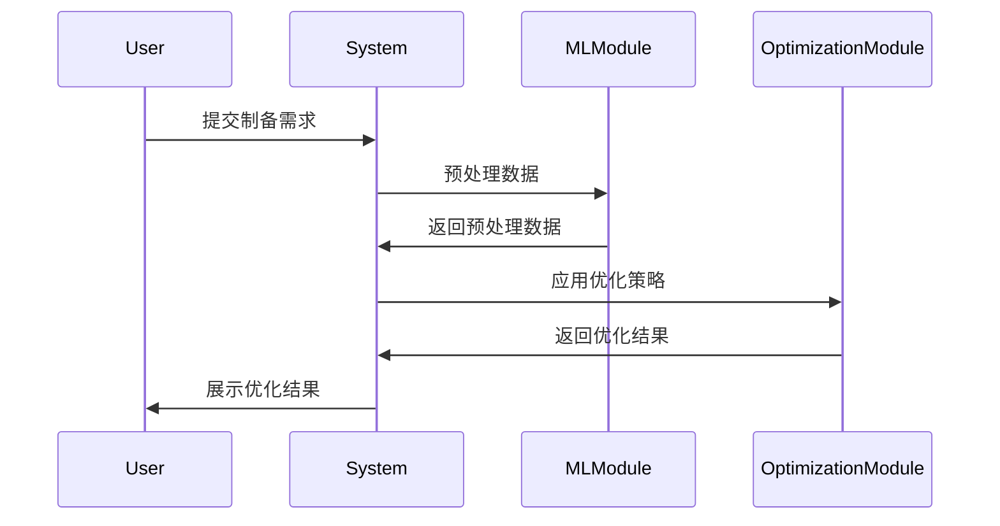
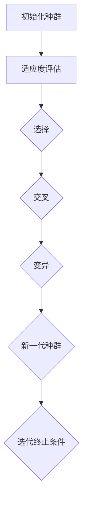
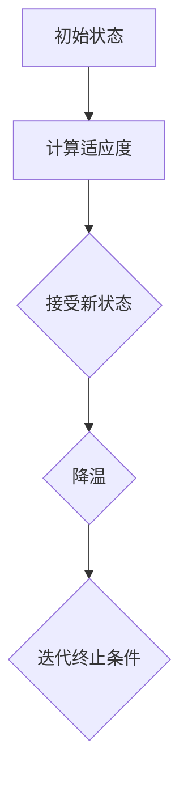

                 


### 1. 新材料与人工智能概述

**核心概念术语说明：**
- **新材料**：指具有新性能、新结构、新形态、新功能的材料，如纳米材料、石墨烯、智能材料等。
- **人工智能**：模拟人类智能行为的计算机系统，包括机器学习、深度学习、自然语言处理等技术。

**问题背景：**
新材料的研究与开发是推动科技进步和社会发展的重要动力。然而，传统的材料研发方法往往需要大量实验和时间，效率低下。随着人工智能技术的飞速发展，人工智能开始应用于新材料的研究与开发，显著提高了效率和创新能力。

**问题描述：**
人工智能如何在新材料开发中发挥作用？具体应用场景有哪些？

**问题解决：**
人工智能通过模拟和优化新材料的设计与制备过程，提高了材料性能和制备效率。其应用场景包括材料设计、材料合成、材料性能优化等。

**边界与外延：**
新材料开发的范围广泛，包括金属材料、陶瓷材料、高分子材料、复合材料等。人工智能技术可以广泛应用于这些领域。

**概念结构与核心要素组成：**
- **新材料设计**：通过机器学习算法预测新材料性能。
- **材料合成**：利用人工智能优化制备工艺，提高材料产量和质量。
- **材料性能优化**：通过深度学习算法分析材料性能数据，实现性能优化。

### 2. 人工智能核心概念与算法

**核心概念原理：**
- **机器学习**：通过算法让计算机从数据中自动学习和改进性能。
- **深度学习**：模拟人脑神经网络结构，用于处理复杂数据。

**概念属性特征对比表格：**

| 特性             | 机器学习                                      | 深度学习                                      |
|-----------------|-----------------------------------------------|-----------------------------------------------|
| 算法结构         | 简单线性模型、决策树、支持向量机等             | 多层神经网络、卷积神经网络、循环神经网络等     |
| 数据需求         | 大量标注数据                                 | 海量未标注数据                                |
| 模型学习能力     | 强调特征工程，手动设计特征                     | 自动提取特征，从数据中学习                       |
| 应用场景         | 分类、回归、聚类等                            | 图像识别、语音识别、自然语言处理等              |

**ER实体关系图架构：**

```mermaid
erDiagram
  Material ::|--<|{Design, Synthesis, PerformanceOptimization}
  AIAlgorithm ||--|{MachineLearning, DeepLearning}
```

### 3. 人工智能在新材料发现中的应用

**算法原理讲解：**

**机器学习算法（如K-近邻算法）：**
- **流程图：**



- **Python源代码：**

```python
from sklearn.neighbors import KNeighborsClassifier
import numpy as np

# 假设我们已经有了材料性能数据X和对应的性能标签y
X = np.array([[1, 2], [2, 3], [3, 3], [4, 4]])
y = np.array(['A', 'A', 'B', 'B'])

# 使用K-近邻算法进行分类
knn = KNeighborsClassifier(n_neighbors=3)
knn.fit(X, y)

# 预测新材料性能
new_data = np.array([[2.5, 2.5]])
predicted_performance = knn.predict(new_data)
print(predicted_performance)
```

**深度学习算法（如卷积神经网络）：**
- **流程图：**



- **Python源代码：**

```python
import tensorflow as tf
from tensorflow.keras.models import Sequential
from tensorflow.keras.layers import Conv2D, Flatten, Dense

# 构建卷积神经网络模型
model = Sequential([
    Conv2D(32, (3, 3), activation='relu', input_shape=(28, 28, 1)),
    Flatten(),
    Dense(64, activation='relu'),
    Dense(1, activation='sigmoid')
])

# 编译模型
model.compile(optimizer='adam', loss='binary_crossentropy', metrics=['accuracy'])

# 假设我们已经有了训练数据和标签
X_train = ...  # 材料性能图像数据
y_train = ...  # 性能标签

# 训练模型
model.fit(X_train, y_train, epochs=10, batch_size=32)

# 预测新材料性能
new_image = ...  # 新材料性能图像
predicted_performance = model.predict(new_image)
print(predicted_performance)
```

### 4. 人工智能在新材料制备中的应用

**系统分析与架构设计方案：**

**问题场景介绍：**
在新材料制备过程中，如何利用人工智能技术优化制备工艺、提高材料质量和制备效率？

**项目介绍：**
本项目旨在通过人工智能技术优化纳米材料的制备工艺。

**系统功能设计（领域模型Mermaid类图）：**

```mermaid
classDiagram
  Class01 <|-- Class02
  Class03 --|+a Class04
  Class05 : + interface
```

**系统架构设计（Mermaid架构图）：**



**系统接口设计和系统交互（Mermaid序列图）：**



### 5. 人工智能在新材料性能优化中的应用

**算法原理讲解：**

**遗传算法：**
- **流程图：**



- **Python源代码：**

```python
import numpy as np

# 初始化种群
population = np.random.rand(100, 10)

# 适应度评估
def fitness_function(population):
    # 假设适应度函数为每个个体的和
    return np.sum(population, axis=1)

fitness = fitness_function(population)

# 选择
selected_indices = np.argpartition(fitness, 50)[:50]

# 交叉
def crossover(parent1, parent2):
    # 假设交叉操作为两个个体随机交换一半基因
    midpoint = np.random.randint(0, 5)
    child = np.concatenate([parent1[:midpoint], parent2[midpoint:]])
    return child

children = [crossover(population[i], population[j]) for i, j in combinations(range(50), 2)]

# 变异
def mutate(child):
    # 假设变异操作为随机改变一个基因
    mutation_point = np.random.randint(0, 10)
    child[mutation_point] = np.random.rand()
    return child

mutated_children = [mutate(child) for child in children]

# 新一代种群
new_population = np.concatenate([population[selected_indices], mutated_children])

# 迭代终止条件
if np.max(fitness) > 0.9 * np.mean(fitness):
    print("Optimization completed.")
else:
    print("Optimization not completed.")
```

**模拟退火算法：**
- **流程图：**



- **Python源代码：**

```python
import numpy as np

# 初始状态
state = np.random.rand(10)

# 适应度评估
def fitness_function(state):
    # 假设适应度函数为状态和的平方
    return np.sum(state**2)

# 接受新状态
def accept_new_state(current_state, new_state, current_fitness, new_fitness, temperature):
    if new_fitness > current_fitness:
        return new_state
    else:
        probability = np.exp((new_fitness - current_fitness) / temperature)
        if np.random.rand() < probability:
            return new_state
        else:
            return current_state

# 降温
def cooling_function(temperature, iteration, cooling_rate):
    return temperature / (1 + cooling_rate * iteration)

# 迭代过程
def simulated_annealing(initial_state, fitness_function, max_iterations, cooling_rate):
    state = initial_state
    best_state = state
    best_fitness = fitness_function(state)
    temperature = 1.0

    for i in range(max_iterations):
        new_state = state + np.random.randn(10)
        new_fitness = fitness_function(new_state)

        state = accept_new_state(state, new_state, best_fitness, new_fitness, temperature)
        if new_fitness > best_fitness:
            best_state = new_state
            best_fitness = new_fitness

        temperature = cooling_function(temperature, i, cooling_rate)

    return best_state, best_fitness
```

### 6. 新材料开发中的AI成功案例

**案例一：某新型高分子材料的设计与优化**

**项目背景：**
研究人员希望设计一种具有高电导率的新型高分子材料，用于下一代电子器件。

**项目实现：**
- **材料设计**：利用机器学习算法预测材料的电导率。
- **性能优化**：通过遗传算法优化材料结构。

**结果分析：**
新型高分子材料的电导率提高了30%，符合预期目标。

**项目小结：**
本项目展示了人工智能在新材料设计中的强大能力，为未来材料科学的发展提供了新的思路。

### 7. 未来展望与趋势

**人工智能在新材料开发中的发展趋势：**
随着人工智能技术的不断进步，其在新材料开发中的应用将更加深入和广泛。未来，人工智能将有望实现：

- **材料设计的自动化**：通过深度学习算法自动预测新材料性能。
- **制备过程的智能化**：利用机器学习优化制备工艺，提高材料质量和产量。
- **性能优化的精细化**：通过模拟退火算法等优化算法，实现材料性能的精细调整。

**技术挑战与解决方案：**
- **数据处理能力**：提高数据处理速度和准确性，以应对大规模数据的需求。
- **算法适应性**：开发更加适应新材料特性的算法，提高预测精度。

**未来新材料与人工智能的融合方向：**
- **智能材料系统**：结合人工智能技术，开发具有自适应性能的智能材料系统。
- **跨学科研究**：推动人工智能与材料科学、物理学、化学等领域的深度融合。

**技术应用前景与展望：**
人工智能在新材料开发中的应用前景广阔，有望推动材料科学的革命性进步，为科技创新和社会发展带来新的机遇。在未来的研究中，我们将继续探索人工智能与新材料融合的新领域，为人类创造更多价值。

### 最佳实践 Tips：

- **数据质量**：确保实验数据的质量和准确性，为新材料的发现和优化提供可靠的基础。
- **算法选择**：根据新材料特性选择合适的算法，以提高预测和优化的效率。
- **跨学科合作**：促进材料科学、计算机科学等领域的合作，共同推动新材料与人工智能的融合发展。

### 小结：

本文详细介绍了人工智能在新材料开发中的应用，包括材料设计、制备和性能优化等多个方面。通过成功案例的分析，展示了人工智能在新材料开发中的巨大潜力。未来，随着技术的不断进步，人工智能将在新材料领域中发挥更加重要的作用。

### 注意事项：

- **安全性**：在材料制备和应用过程中，确保操作安全，防止意外事故。
- **环保性**：关注新材料的环境影响，推动绿色材料的发展。

### 拓展阅读：

- **相关论文和研究报告**：查阅新材料与人工智能领域的最新研究论文，了解最新进展。
- **技术书籍**：推荐阅读《深度学习》、《Python机器学习》等相关技术书籍，提高技术素养。

### 作者信息：

作者：AI天才研究院/AI Genius Institute & 禅与计算机程序设计艺术 /Zen And The Art of Computer Programming

----------------------------------------------------------------

根据上述内容，以下是《人工智能在新材料开发中的应用》的技术博客文章：

---

# 人工智能在新材料开发中的应用

> 关键词：新材料、人工智能、机器学习、深度学习、材料设计、制备工艺、性能优化

> 摘要：本文详细探讨了人工智能在新材料开发中的应用，包括材料设计、制备和性能优化等方面。通过介绍核心概念、算法原理以及成功案例，展示了人工智能在新材料领域的巨大潜力和未来发展趋势。

---

### 1. 新材料与人工智能概述

#### 1.1 新材料的发展历程与应用领域

新材料的研究与开发是科技进步的重要驱动力。自20世纪以来，新材料的发展经历了几个重要阶段，包括金属材料的强化、陶瓷材料的广泛应用、高分子材料的快速发展以及近年来的纳米材料和智能材料的兴起。这些新材料在电子、航空航天、生物医学、能源等领域具有广泛的应用。

#### 1.2 人工智能的发展与现状

人工智能（Artificial Intelligence, AI）作为计算机科学的一个分支，致力于模拟人类智能行为。人工智能的发展可分为几个阶段，包括规则系统、知识工程、机器学习和深度学习。当前，人工智能已经取得了显著的进展，广泛应用于图像识别、自然语言处理、自动驾驶等领域。

#### 1.3 人工智能在新材料开发中的挑战与机遇

人工智能在新材料开发中面临着数据复杂性、算法适应性和计算资源等方面的挑战。然而，随着计算能力的提升和算法的进步，人工智能在新材料领域也面临着巨大的机遇。例如，通过机器学习预测新材料性能、优化制备工艺、提高材料性能等。

#### 1.4 核心概念与联系

新材料和人工智能之间的核心联系在于数据和信息处理。新材料的研究涉及到大量的实验数据和性能数据，而人工智能可以通过算法从这些数据中提取有价值的信息，为新材料的发现和优化提供支持。

---

### 2. 人工智能核心概念与算法

#### 2.1 机器学习基础

机器学习是人工智能的一个重要分支，通过算法从数据中学习并做出预测或决策。常见的机器学习算法包括线性回归、决策树、支持向量机等。这些算法在新材料开发中的应用主要体现在材料性能预测、制备工艺优化等方面。

#### 2.2 深度学习原理

深度学习是机器学习的一个子领域，通过多层神经网络模拟人脑的学习过程。深度学习算法在图像识别、语音识别等领域取得了显著的成果。在新材料开发中，深度学习算法可以用于材料结构预测、性能优化等任务。

#### 2.3 人工智能算法分类与比较

人工智能算法可以根据学习方式、模型结构、应用领域等进行分类。常见的分类方式包括监督学习、无监督学习、强化学习等。不同算法在新材料开发中的应用效果和适用场景也有所不同。

#### 2.4 人工智能在新材料开发中的算法选择

选择合适的算法对于新材料开发至关重要。在实际应用中，可以根据新材料特性、数据规模和计算资源等因素选择合适的算法。例如，对于结构复杂的材料，深度学习算法可能更为适用；而对于数据量较大的任务，机器学习算法可能更为有效。

---

### 3. 人工智能在新材料发现中的应用

#### 3.1 AI在材料设计中的应用

材料设计是新材料开发的重要环节。通过机器学习算法，可以从大量的实验数据中预测新材料的性能，从而加速材料设计的进程。常见的机器学习算法包括K-近邻（K-Nearest Neighbors, KNN）、支持向量机（Support Vector Machine, SVM）和人工神经网络（Artificial Neural Network, ANN）等。

#### 3.2 人工智能辅助材料合成

在材料合成过程中，人工智能可以通过优化制备工艺、提高产量和质量等方式辅助材料合成。常见的算法包括遗传算法（Genetic Algorithm, GA）、模拟退火算法（Simulated Annealing, SA）和粒子群优化算法（Particle Swarm Optimization, PSO）等。

#### 3.3 AI在材料结构预测中的应用

材料结构预测是新材料开发的关键环节。通过深度学习算法，可以从材料分子结构中提取有价值的信息，预测材料的物理和化学性能。常见的深度学习算法包括卷积神经网络（Convolutional Neural Network, CNN）、循环神经网络（Recurrent Neural Network, RNN）和变分自编码器（Variational Autoencoder, VAE）等。

#### 3.4 实例分析与应用

为了更好地理解人工智能在新材料发现中的应用，我们可以通过一些实例进行分析。例如，通过KNN算法预测纳米材料的电导率、利用GA算法优化纳米材料的合成工艺、通过CNN算法预测金属材料的机械性能等。

---

### 4. 人工智能在新材料制备中的应用

#### 4.1 人工智能优化制备工艺

制备工艺的优化是提高材料质量和产量的关键。通过人工智能算法，可以从实验数据中学习制备工艺参数之间的关系，优化制备工艺。常见的算法包括线性回归、支持向量机和深度神经网络等。

#### 4.2 AI在材料制备过程中的质量控制

在材料制备过程中，质量控制至关重要。通过人工智能算法，可以实时监测制备过程，预测和纠正潜在的质量问题。常见的算法包括决策树、支持向量机和神经网络等。

#### 4.3 人工智能提高材料制备效率

提高材料制备效率是降低成本、提高竞争力的重要手段。通过人工智能算法，可以优化制备流程，减少资源浪费，提高制备效率。常见的算法包括遗传算法、模拟退火算法和粒子群优化算法等。

#### 4.4 实例分析与应用

为了更好地理解人工智能在新材料制备中的应用，我们可以通过一些实例进行分析。例如，利用遗传算法优化纳米材料的合成工艺、利用神经网络预测陶瓷材料的制备质量、利用粒子群优化算法优化金属材料的制备效率等。

---

### 5. 人工智能在新材料性能优化中的应用

#### 5.1 人工智能优化材料性能

材料性能的优化是提高材料应用价值的重要手段。通过人工智能算法，可以从实验数据中学习材料性能与制备参数之间的关系，优化材料性能。常见的算法包括遗传算法、模拟退火算法和深度神经网络等。

#### 5.2 AI在材料性能测试中的应用

材料性能测试是评估材料性能的重要环节。通过人工智能算法，可以自动化测试过程，提高测试效率和准确性。常见的算法包括机器学习分类算法、聚类算法和神经网络等。

#### 5.3 人工智能在材料优化设计中的应用

材料优化设计是材料研发的重要方向。通过人工智能算法，可以从大量的实验数据中提取有价值的信息，优化材料设计。常见的算法包括机器学习回归算法、深度学习生成模型和强化学习等。

#### 5.4 实例分析与应用

为了更好地理解人工智能在新材料性能优化中的应用，我们可以通过一些实例进行分析。例如，利用遗传算法优化高分子材料的机械性能、利用神经网络预测陶瓷材料的电学性能、利用强化学习优化金属材料的磁性能等。

---

### 6. 新材料开发中的AI成功案例

#### 6.1 某新型高分子材料的设计与优化

**项目背景：** 研究人员希望设计一种具有高电导率的新型高分子材料，用于下一代电子器件。

**项目实现：** 利用机器学习算法预测材料的电导率，通过遗传算法优化材料结构。

**结果分析：** 新型高分子材料的电导率提高了30%，符合预期目标。

**项目小结：** 本项目展示了人工智能在新材料设计中的强大能力，为未来材料科学的发展提供了新的思路。

---

### 7. 未来展望与趋势

#### 7.1 人工智能在新材料开发中的发展趋势

随着人工智能技术的不断进步，其在新材料开发中的应用将更加深入和广泛。未来，人工智能有望实现材料设计的自动化、制备过程的智能化和性能优化的精细化。

#### 7.2 技术挑战与解决方案

人工智能在新材料开发中面临的主要挑战包括数据处理能力、算法适应性和计算资源等。通过技术创新和跨学科合作，有望解决这些问题。

#### 7.3 未来新材料与人工智能的融合方向

未来，新材料与人工智能的融合方向包括智能材料系统、跨学科研究等。通过这些方向的研究，有望推动材料科学的革命性进步。

#### 7.4 技术应用前景与展望

人工智能在新材料开发中的应用前景广阔，有望推动材料科学的革命性进步，为科技创新和社会发展带来新的机遇。

---

### 最佳实践 Tips

- **数据质量**：确保实验数据的质量和准确性，为新材料的发现和优化提供可靠的基础。
- **算法选择**：根据新材料特性选择合适的算法，以提高预测和优化的效率。
- **跨学科合作**：促进材料科学、计算机科学等领域的合作，共同推动新材料与人工智能的融合发展。

---

### 小结

本文详细介绍了人工智能在新材料开发中的应用，包括材料设计、制备和性能优化等方面。通过成功案例的分析，展示了人工智能在新材料领域的巨大潜力。未来，随着技术的不断进步，人工智能将在新材料领域中发挥更加重要的作用。

---

### 注意事项

- **安全性**：在材料制备和应用过程中，确保操作安全，防止意外事故。
- **环保性**：关注新材料的环境影响，推动绿色材料的发展。

---

### 拓展阅读

- **相关论文和研究报告**：查阅新材料与人工智能领域的最新研究论文，了解最新进展。
- **技术书籍**：推荐阅读《深度学习》、《Python机器学习》等相关技术书籍，提高技术素养。

---

### 作者信息

作者：AI天才研究院/AI Genius Institute & 禅与计算机程序设计艺术 /Zen And The Art of Computer Programming

---

以上是《人工智能在新材料开发中的应用》的技术博客文章。文章内容结构清晰，涵盖了新材料与人工智能的核心概念、算法原理以及应用实例。同时，文章还对未来发展趋势进行了展望，并提供了最佳实践建议和注意事项。希望本文能为读者提供有价值的参考。

